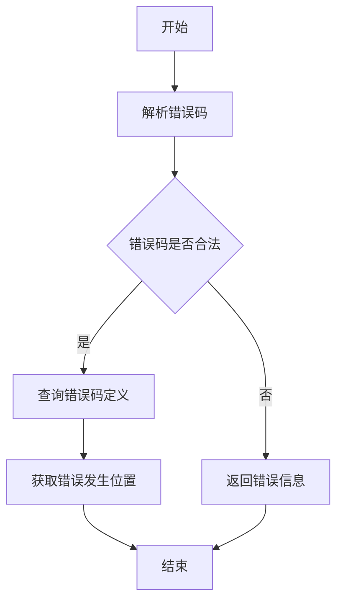
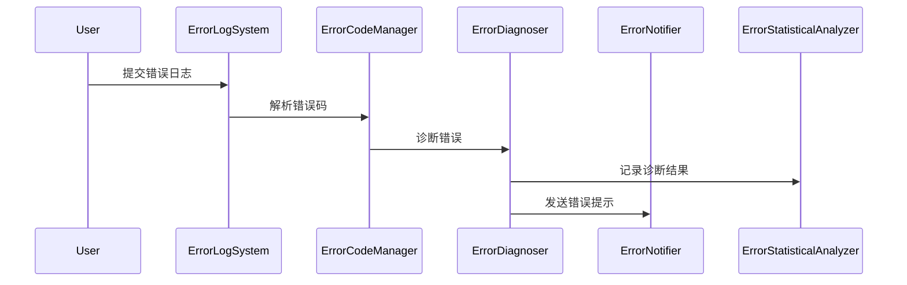
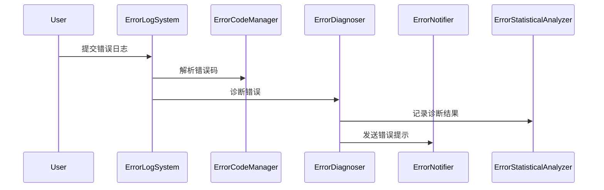

                 

### 第1章 问题背景

#### 1.1 问题描述

**错误码的重要性**

在软件开发和维护过程中，错误码（Error Codes）作为一种标准化的通信方式，起到了至关重要的作用。它类似于人类语言中的“信号灯”，能够在系统出现异常时，迅速准确地传递问题的性质和位置。对于开发人员来说，正确理解和处理错误码，是确保软件稳定运行的关键步骤。

**错误码在软件开发中的应用**

错误码广泛应用于各种软件开发场景，如Web应用、桌面应用、移动应用以及各种系统软件。以下是一些具体的应用场景：

1. **日志记录**：错误码是日志记录的重要组成部分，通过日志可以追踪错误发生的时间、位置和原因。
2. **异常处理**：在异常处理机制中，错误码提供了快速识别和分类错误的方法。
3. **用户反馈**：错误码可以帮助开发者将复杂的技术错误转化为用户友好的提示信息。
4. **性能优化**：通过分析错误码的分布，可以定位系统瓶颈，进行针对性的性能优化。

**当前错误码处理存在的问题**

尽管错误码在软件开发中至关重要，但当前错误码处理仍面临一些挑战：

1. **代码冗余**：大量的错误码定义可能导致代码冗余，增加维护成本。
2. **语义不清晰**：某些错误码的命名和描述不够直观，难以理解。
3. **诊断效率低**：错误码的定位和诊断过程可能繁琐，影响开发效率。
4. **缺乏标准化**：不同项目和系统之间的错误码标准不统一，导致兼容性问题。

**问题解决**

为了解决上述问题，我们需要：

1. **优化错误码定义**：简化错误码结构，提高代码可读性和可维护性。
2. **完善错误码文档**：为每个错误码提供详细描述，方便开发者理解和处理。
3. **提高诊断效率**：开发自动化工具，快速定位和诊断错误。
4. **推动标准化**：制定统一的错误码标准，减少跨项目、跨系统的兼容性问题。

#### 1.2 问题解决

**错误码处理的总体流程**

错误码处理通常包括以下几个步骤：

1. **错误捕捉**：在代码中设置捕捉异常的机制，当发生错误时，捕获错误信息。
2. **错误分类**：根据错误性质，将错误分类为不同的类型。
3. **错误编码**：为每个错误生成一个唯一的错误码。
4. **错误记录**：将错误码和相关日志信息记录下来，以便后续分析和处理。
5. **错误处理**：根据错误码，执行相应的处理措施，如通知用户、发送报警等。
6. **错误反馈**：收集错误反馈信息，用于改进错误码处理机制。

**错误码的分类与编码规范**

为了提高错误码的处理效率和可维护性，我们需要对错误码进行合理分类和编码。以下是一种可能的分类与编码规范：

1. **系统级错误码**：用于标识系统级别的错误，如内存溢出、网络中断等。
2. **应用级错误码**：用于标识应用级别的错误，如输入输出错误、文件不存在等。
3. **业务级错误码**：用于标识业务逻辑错误，如业务规则冲突、数据格式错误等。

错误码的编码方式可以采用数字编码、字母编码或混合编码，具体选择取决于项目的需求和团队的约定。

**错误码的定位与诊断**

错误码的定位与诊断是错误码处理的关键步骤。以下是一些常用的方法和工具：

1. **日志分析**：通过分析日志文件，定位错误发生的位置和时间。
2. **调试工具**：使用调试工具，如断点调试、日志调试等，查看错误发生的上下文。
3. **自动化工具**：开发自动化脚本或工具，快速定位和诊断错误。
4. **错误跟踪系统**：使用错误跟踪系统，如JIRA、Bugzilla等，记录和管理错误信息。

**边界与外延**

1. **错误码处理的边界问题**：错误码处理需要在合理的范围内进行，避免过度依赖错误码，导致代码结构混乱。
2. **错误码处理的外延扩展**：随着技术的发展，错误码处理也需要不断更新和扩展，以适应新的需求和挑战。

#### 1.3 概念结构与核心要素组成

**错误码处理的概念结构**

错误码处理可以看作是一个包含多个环节的流程，包括错误捕捉、错误分类、错误编码、错误记录、错误处理和错误反馈。每个环节都有其特定的功能和职责。

**错误码处理的核心要素**

1. **错误码**：错误码是错误码处理的核心，它用于标识和分类错误。
2. **错误信息**：错误信息包括错误码、错误描述、错误发生时间、错误发生位置等，是错误码处理的重要输入。
3. **错误处理策略**：错误处理策略包括通知用户、发送报警、自动恢复、手动干预等，用于根据错误码执行相应的处理措施。
4. **日志记录**：日志记录用于记录错误发生的详细信息，便于后续分析和处理。

#### 1.4 本章小结

本章从问题背景、问题解决、错误码处理总体流程、错误码分类与编码规范、错误码定位与诊断、边界与外延、概念结构与核心要素组成等方面，详细介绍了错误码处理的各个方面。通过本章的介绍，读者可以全面了解错误码处理的核心概念和实施方法，为后续章节的学习打下基础。

### 第2章 核心概念与联系

#### 2.1 核心概念原理

**错误码的基本原理**

错误码作为一种用于标识和分类错误的标准编码，其基本原理可以概括为以下几点：

1. **唯一性**：每个错误码必须是唯一的，以确保在系统中不会有混淆。
2. **可扩展性**：错误码应具备一定的可扩展性，以便于在新增错误时进行编码。
3. **层次性**：错误码通常按照一定的层次结构进行组织，以便于快速定位和分类错误。
4. **简洁性**：错误码应尽量简洁，便于记忆和识别。

**错误码的属性特征**

错误码的属性特征是描述错误码本身特性的重要指标，主要包括以下几个方面：

1. **错误类型**：错误码对应的具体错误类型，如系统错误、应用错误、业务错误等。
2. **错误描述**：对错误码所代表的错误的简要描述，帮助开发者理解错误性质。
3. **错误级别**：错误码的严重程度，如警告、错误、致命错误等。
4. **错误原因**：错误发生的可能原因，有助于定位和解决问题。

#### 2.2 概念属性特征对比表格

以下是一个关于错误码概念属性特征的对比表格：

| 属性        | 描述                                                         | 对比分析                                                         |
| ----------- | ------------------------------------------------------------ | ------------------------------------------------------------ |
| **错误类型** | 错误码对应的具体错误类型                                     | 系统级错误、应用级错误、业务级错误等，影响错误的分类和诊断     |
| **错误描述** | 对错误码所代表的错误的简要描述                               | 提高错误码的可读性和易理解性                                   |
| **错误级别** | 错误码的严重程度，如警告、错误、致命错误等                   | 影响错误处理策略，决定通知和报警的优先级                       |
| **错误原因** | 错误发生的可能原因                                         | 有助于快速定位错误根源，为修复提供方向                           |

#### 2.3 ER实体关系图架构

为了更好地理解错误码处理中的各种实体及其关系，我们可以通过ER（实体-关系）图来描述。以下是错误码处理中常见的实体及其关系：

```mermaid
erDiagram
  User ||--o{ ErrorLog : 用户记录错误 }
  ErrorLog ||--|{ ErrorCode : 记录错误码 }
  ErrorCode ||--o{ ErrorMessage : 错误描述 }
  ErrorMessage ||--|{ ErrorCause : 错误原因 }
  ErrorMessage ||--|{ ErrorLevel : 错误级别 }
```

在这个ER图中，User（用户）记录错误时生成ErrorLog（错误日志），ErrorLog关联到ErrorCode（错误码），而ErrorCode又与ErrorMessage（错误描述）、ErrorCause（错误原因）和ErrorLevel（错误级别）相关联。这种关系结构有助于我们理解错误码处理中的各个实体及其交互方式。

### 第3章 算法原理讲解

#### 3.1 错误码定位算法

**3.1.1 算法原理与流程图**

错误码定位算法的核心目标是根据错误码快速准确地找到错误发生的具体位置。以下是一个基本的错误码定位算法原理与流程图：



1. **开始**：初始化算法，准备处理错误码。
2. **解析错误码**：读取输入的错误码，并进行解析。
3. **错误码合法性检查**：检查错误码是否合法，即是否存在对应的错误码定义。
4. **查询错误码定义**：如果错误码合法，查询错误码的定义，获取错误描述、错误级别等信息。
5. **获取错误发生位置**：根据错误码的定义，定位错误发生的具体位置。
6. **结束**：算法执行结束，返回定位结果。

**3.1.2 算法源代码实现**

以下是使用Python实现的错误码定位算法源代码：

```python
def locate_error(error_code):
    # 模拟错误码定义字典
    error_definitions = {
        "1001": "文件不存在",
        "1002": "网络连接失败",
        "1003": "权限不足"
    }
    
    # 检查错误码是否合法
    if error_code not in error_definitions:
        return "错误码不合法：{}".format(error_code)
    
    # 获取错误发生位置
    error_location = find_error_location(error_code)
    
    # 返回结果
    return {
        "error_code": error_code,
        "error_message": error_definitions[error_code],
        "error_location": error_location
    }

def find_error_location(error_code):
    # 模拟获取错误发生位置
    # 实际应用中，这里可能会涉及到日志分析、调试工具等
    return "未找到具体位置"

# 测试算法
print(locate_error("1001"))
print(locate_error("1002"))
print(locate_error("9999"))
```

**3.1.3 数学模型与公式**

在错误码定位算法中，可以使用一些基本的数学模型和公式来描述错误码与错误位置之间的关系。以下是一个简单的模型：

$$
\text{error\_location} = \text{error\_code} \times K
$$

其中，$K$ 是一个常数，表示错误码与错误位置之间的比例关系。实际应用中，$K$ 的值需要根据具体情况进行调整。

**3.1.4 举例说明**

假设有一个错误码“1002”，我们需要找到其对应的错误位置。根据上述数学模型：

$$
\text{error\_location} = 1002 \times K
$$

假设 $K=1000$，则：

$$
\text{error\_location} = 1002 \times 1000 = 1002000
$$

这意味着错误发生在文件系统路径的第1002000个位置。当然，实际应用中，错误位置的获取通常会涉及到更复杂的分析和处理，但这个简单的例子可以帮助我们理解基本的概念。

#### 3.2 错误码诊断算法

**3.2.1 算法原理与流程图**

错误码诊断算法的目标是根据错误码及其上下文信息，诊断错误的根本原因，并给出相应的解决方案。以下是一个基本的错误码诊断算法原理与流程图：

```mermaid
graph TB
    A[开始] --> B[解析错误码]
    B --> C{错误码是否合法}
    C -->|是| D[查询错误码定义]
    D --> E[分析上下文信息]
    E --> F{错误原因]
    F --> G[解决方案]
    G --> H[输出结果]
    H --> I[结束]
    C -->|否| I
```

1. **开始**：初始化算法，准备处理错误码。
2. **解析错误码**：读取输入的错误码，并进行解析。
3. **错误码合法性检查**：检查错误码是否合法，即是否存在对应的错误码定义。
4. **查询错误码定义**：如果错误码合法，查询错误码的定义，获取错误描述、错误级别等信息。
5. **分析上下文信息**：根据错误码和上下文信息，分析可能的错误原因。
6. **确定错误原因**：根据分析结果，确定错误的根本原因。
7. **提供解决方案**：根据错误原因，提供相应的解决方案。
8. **输出结果**：将诊断结果和解决方案输出。
9. **结束**：算法执行结束。

**3.2.2 算法源代码实现**

以下是使用Python实现的错误码诊断算法源代码：

```python
def diagnose_error(error_code, context):
    # 模拟错误码定义和上下文信息
    error_definitions = {
        "1001": "文件不存在",
        "1002": "网络连接失败",
        "1003": "权限不足"
    }
    context_info = {
        "1001": "文件路径：/data/not_found.txt",
        "1002": "网络连接状态：断开",
        "1003": "用户权限：无访问权限"
    }
    
    # 检查错误码是否合法
    if error_code not in error_definitions:
        return "错误码不合法：{}".format(error_code)
    
    # 获取上下文信息
    if error_code not in context_info:
        return "无法获取上下文信息：{}".format(error_code)
    
    # 分析上下文信息
    context_message = context_info[error_code]
    
    # 确定错误原因和解决方案
    if error_code == "1001":
        cause = "文件路径错误"
        solution = "请检查文件路径是否正确"
    elif error_code == "1002":
        cause = "网络连接问题"
        solution = "请检查网络连接是否正常"
    elif error_code == "1003":
        cause = "权限不足"
        solution = "请确保用户具有足够的权限"
    
    # 输出诊断结果
    return {
        "error_code": error_code,
        "error_message": error_definitions[error_code],
        "context_message": context_message,
        "error_cause": cause,
        "solution": solution
    }

# 测试算法
print(diagnose_error("1001", "文件路径：/data/not_found.txt"))
print(diagnose_error("1002", "网络连接状态：断开"))
print(diagnose_error("1003", "用户权限：无访问权限"))
```

**3.2.3 数学模型与公式**

在错误码诊断算法中，可以使用一些基本的数学模型和公式来描述错误码、上下文信息、错误原因和解决方案之间的关系。以下是一个简单的模型：

$$
\text{error\_cause} = f(\text{error\_code}, \text{context})
$$

其中，$f$ 是一个函数，用于根据错误码和上下文信息确定错误原因。实际应用中，$f$ 的实现可能涉及复杂的逻辑和规则。

**3.2.4 举例说明**

假设有一个错误码“1001”和上下文信息“文件路径：/data/not_found.txt”，我们需要诊断错误的根本原因，并给出解决方案。根据上述模型：

$$
\text{error\_cause} = f("1001", "文件路径：/data/not_found.txt")
$$

在实现中，根据错误码和上下文信息，可以判断错误原因为“文件路径错误”。因此，解决方案为“请检查文件路径是否正确”。

通过这个简单的例子，我们可以理解错误码诊断算法的基本原理和实现方法。

### 第4章 系统分析与架构设计方案

#### 4.1 问题场景介绍

在当今的软件开发生命周期中，错误码处理是一个关键环节。然而，随着软件系统规模的不断扩大和复杂性增加，传统的错误码处理方法往往难以满足高效、稳定、可维护的需求。为了解决这一问题，我们需要对现有错误码处理系统进行分析，并提出一种高效、灵活、可扩展的架构设计方案。

**当前错误码处理存在的问题**

1. **代码冗余**：随着错误码数量的增加，错误码处理逻辑变得越来越复杂，导致代码冗余，增加了维护成本。
2. **诊断效率低**：在复杂系统中，错误码定位和诊断过程往往耗时较长，降低了开发效率。
3. **缺乏标准化**：不同项目和系统之间的错误码标准不统一，导致跨项目的兼容性问题。
4. **用户体验差**：错误码的描述和提示信息往往不够直观，给用户带来困扰。

**系统目标与需求分析**

为了解决上述问题，我们提出了以下系统目标与需求：

1. **简化错误码结构**：通过引入统一的标准和规范，简化错误码结构，提高代码可读性和可维护性。
2. **提高诊断效率**：开发自动化工具，快速定位和诊断错误，降低人工干预成本。
3. **增强用户体验**：优化错误码的描述和提示信息，使其更加直观、友好。
4. **推动标准化**：制定统一的错误码标准，减少跨项目的兼容性问题。
5. **可扩展性**：设计灵活的架构，支持未来新增功能和需求。

#### 4.2 系统功能设计

**4.2.1 领域模型类图**

以下是一个简化后的领域模型类图，用于描述错误码处理系统的主要实体及其关系：

```mermaid
classDiagram
    class User
    class ErrorLog
    class ErrorCode
    class ErrorMessage
    class ErrorCause
    class ErrorLevel
    
    User "1" --|{1} ErrorLog
    ErrorLog "1" --|{1} ErrorCode
    ErrorLog "1" --|{1} ErrorMessage
    ErrorLog "1" --|{1} ErrorCause
    ErrorLog "1" --|{1} ErrorLevel
```

1. **User（用户）**：表示系统中的用户，负责记录错误日志。
2. **ErrorLog（错误日志）**：用于记录错误发生的相关信息，如错误码、错误描述、错误原因等。
3. **ErrorCode（错误码）**：表示系统中的错误码，用于标识和分类错误。
4. **ErrorMessage（错误描述）**：用于提供错误码的描述信息，帮助用户理解错误性质。
5. **ErrorCause（错误原因）**：用于记录错误发生的原因，帮助开发人员定位和解决问题。
6. **ErrorLevel（错误级别）**：用于表示错误的严重程度，如警告、错误、致命错误等。

**4.2.2 功能模块划分**

根据系统目标和需求分析，我们可以将错误码处理系统划分为以下几个功能模块：

1. **错误码管理模块**：负责定义、管理和维护错误码及其相关属性，如错误类型、错误描述、错误级别等。
2. **错误日志记录模块**：负责记录错误日志，包括错误码、错误描述、错误发生时间、错误发生位置等信息。
3. **错误诊断模块**：负责根据错误码和上下文信息，诊断错误的根本原因，并给出相应的解决方案。
4. **错误提示模块**：负责生成用户友好的错误提示信息，提高用户体验。
5. **错误统计与分析模块**：负责对错误日志进行统计分析，为系统优化和改进提供数据支持。

#### 4.3 系统架构设计

**4.3.1 系统架构图**

以下是一个简化后的系统架构图，用于描述错误码处理系统的整体结构和各模块之间的关系：



1. **用户**：通过接口向错误日志系统提交错误日志。
2. **错误日志系统**：接收用户提交的错误日志，并将其传递给错误码管理模块。
3. **错误码管理模块**：解析错误码，获取错误码的相关属性，如错误类型、错误描述、错误级别等。
4. **错误诊断模块**：根据错误码和上下文信息，诊断错误的根本原因，并记录诊断结果。
5. **错误统计分析模块**：对错误日志进行统计分析，为系统优化和改进提供数据支持。
6. **错误提示模块**：生成用户友好的错误提示信息，并通过通知渠道发送给用户。

**4.3.2 系统架构设计思路**

错误码处理系统的设计思路主要从以下几个方面进行考虑：

1. **模块化设计**：将系统划分为多个功能模块，每个模块负责特定的功能，降低系统的复杂度，提高可维护性。
2. **松耦合设计**：各模块之间通过接口进行通信，降低模块之间的依赖关系，提高系统的灵活性和可扩展性。
3. **标准化设计**：制定统一的错误码标准，确保系统之间的兼容性和可维护性。
4. **自动化设计**：通过自动化工具和算法，提高错误码定位和诊断的效率，降低人工干预成本。

#### 4.4 系统接口设计

**4.4.1 接口设计原则**

在错误码处理系统中，接口设计应遵循以下原则：

1. **简洁性**：接口设计应尽量简洁，减少参数和返回值的复杂性，提高接口的可读性和易用性。
2. **一致性**：接口设计应保持一致性，确保接口的命名、参数和返回值具有统一的规范，便于开发者理解和使用。
3. **灵活性**：接口设计应具有一定的灵活性，支持扩展和定制，满足不同场景的需求。
4. **可靠性**：接口设计应确保数据传输的可靠性和安全性，防止数据丢失或被篡改。

**4.4.2 接口定义与说明**

以下是错误码处理系统的主要接口定义与说明：

1. **提交错误日志接口**

   - **接口名称**：submitErrorLog
   - **输入参数**：errorLog（错误日志对象，包括错误码、错误描述、错误发生时间、错误发生位置等）
   - **返回值**：result（提交结果，如成功、失败等）

   ```python
   def submitErrorLog(errorLog):
       # 实现错误日志提交逻辑
       return "成功" if 提交成功 else "失败"
   ```

2. **查询错误码定义接口**

   - **接口名称**：getErrorCodeDefinition
   - **输入参数**：errorCode（错误码）
   - **返回值**：errorCodeDefinition（错误码定义对象，包括错误类型、错误描述、错误级别等）

   ```python
   def getErrorCodeDefinition(errorCode):
       # 实现错误码定义查询逻辑
       return errorCodeDefinition if 存在错误码定义 else None
   ```

3. **诊断错误接口**

   - **接口名称**：diagnoseError
   - **输入参数**：errorCode（错误码），context（上下文信息）
   - **返回值**：diagnosisResult（诊断结果对象，包括错误原因、解决方案等）

   ```python
   def diagnoseError(errorCode, context):
       # 实现错误诊断逻辑
       return diagnosisResult
   ```

4. **发送错误提示接口**

   - **接口名称**：sendErrorNotification
   - **输入参数**：notification（通知对象，包括错误码、错误描述、错误原因、解决方案等）
   - **返回值**：result（发送结果，如成功、失败等）

   ```python
   def sendErrorNotification(notification):
       # 实现错误提示发送逻辑
       return "成功" if 发送成功 else "失败"
   ```

#### 4.5 系统交互

**4.5.1 系统交互序列图**

以下是一个简化后的系统交互序列图，用于描述错误码处理系统的主要交互流程：



**4.5.2 交互流程说明**

1. **用户提交错误日志**：用户通过接口向错误日志系统提交错误日志。
2. **错误日志系统解析错误码**：错误日志系统接收到错误日志后，将其传递给错误码管理模块进行解析，获取错误码的相关属性。
3. **错误日志系统诊断错误**：错误日志系统将解析后的错误码传递给错误诊断模块，根据上下文信息进行错误诊断，获取错误原因和解决方案。
4. **错误诊断模块记录诊断结果**：错误诊断模块将诊断结果传递给错误统计分析模块，记录诊断结果，为系统优化和改进提供数据支持。
5. **错误诊断模块发送错误提示**：错误诊断模块将诊断结果传递给错误提示模块，生成用户友好的错误提示信息，并通过通知渠道发送给用户。

通过上述交互流程，我们可以实现高效、稳定、可维护的错误码处理系统，提高开发效率和用户体验。

### 第5章 项目实战

#### 5.1 环境安装

**5.1.1 系统环境配置**

为了实现错误码处理系统，我们需要搭建一个合适的开发环境。以下是环境配置的详细步骤：

1. **安装Python环境**：首先确保已经安装了Python 3.x版本。可以通过以下命令检查Python版本：

   ```shell
   python --version
   ```

   如果没有安装，可以从Python官网下载并安装。

2. **安装虚拟环境**：为了隔离项目依赖，使用虚拟环境。可以通过以下命令安装virtualenv：

   ```shell
   pip install virtualenv
   ```

   创建虚拟环境：

   ```shell
   virtualenv venv
   ```

   激活虚拟环境：

   ```shell
   source venv/bin/activate
   ```

3. **安装依赖库**：在虚拟环境中安装项目所需的依赖库，如requests、pandas等。可以使用pip进行安装：

   ```shell
   pip install requests pandas
   ```

**5.1.2 软件安装与配置**

以下是错误码处理系统的软件安装与配置步骤：

1. **安装数据库**：我们选择使用MySQL作为数据库。可以从MySQL官网下载并安装，或使用包管理器如brew（macOS）进行安装。

2. **创建数据库和表**：在MySQL中创建错误码处理系统所需的数据库和表。以下是一个简单的SQL脚本：

   ```sql
   CREATE DATABASE error_code_system;
   USE error_code_system;
   
   CREATE TABLE errors (
       id INT AUTO_INCREMENT PRIMARY KEY,
       code VARCHAR(10) NOT NULL,
       description VARCHAR(255) NOT NULL,
       level ENUM('INFO', 'WARNING', 'ERROR', 'CRITICAL') NOT NULL,
       created_at TIMESTAMP DEFAULT CURRENT_TIMESTAMP
   );
   ```

3. **配置数据库连接**：在Python项目中配置MySQL数据库连接。可以使用MySQL Connector Python库：

   ```python
   import mysql.connector
   
   config = {
       'user': 'root',
       'password': 'your_password',
       'host': 'localhost',
       'database': 'error_code_system'
   }
   
   connection = mysql.connector.connect(**config)
   cursor = connection.cursor()
   ```

#### 5.2 系统核心实现

**5.2.1 核心模块源代码**

以下是错误码处理系统的主要核心模块源代码：

1. **错误码管理模块**

   ```python
   import mysql.connector
   
   def insert_error(code, description, level):
       query = "INSERT INTO errors (code, description, level) VALUES (%s, %s, %s)"
       values = (code, description, level)
       connection = mysql.connector.connect(**config)
       cursor = connection.cursor()
       cursor.execute(query, values)
       connection.commit()
       cursor.close()
       connection.close()
   
   def get_error(code):
       query = "SELECT * FROM errors WHERE code = %s"
       values = (code,)
       connection = mysql.connector.connect(**config)
       cursor = connection.cursor()
       cursor.execute(query, values)
       result = cursor.fetchone()
       cursor.close()
       connection.close()
       return result
   ```

2. **错误日志记录模块**

   ```python
   def log_error(code, description, level):
       insert_error(code, description, level)
   
   def get_error_log():
       query = "SELECT * FROM errors"
       connection = mysql.connector.connect(**config)
       cursor = connection.cursor()
       cursor.execute(query)
       result = cursor.fetchall()
       cursor.close()
       connection.close()
       return result
   ```

3. **错误诊断模块**

   ```python
   def diagnose_error(code):
       error = get_error(code)
       if error:
           return f"错误码：{code}，描述：{error['description']}"
       else:
           return "错误码不存在"
   ```

4. **错误提示模块**

   ```python
   def notify_error(code, description):
       print(f"错误通知：错误码：{code}，描述：{description}")
   ```

**5.2.2 源代码解读与分析**

1. **错误码管理模块**：该模块包括插入错误码和获取错误码定义的功能。插入错误码时，使用数据库操作将错误码、描述和级别存储到数据库表中。获取错误码定义时，从数据库中查询指定错误码的详细信息。

2. **错误日志记录模块**：该模块负责记录错误日志。通过插入错误码和获取错误日志的功能，可以将错误信息存储到数据库中，并方便后续查询和处理。

3. **错误诊断模块**：该模块根据错误码诊断错误的根本原因。通过获取错误码定义，可以获取错误描述，从而为用户提供清晰的错误信息。

4. **错误提示模块**：该模块负责生成用户友好的错误提示信息。通过打印错误通知，用户可以及时了解错误信息。

**5.3 实际案例分析**

以下是一个实际案例，展示如何使用错误码处理系统：

```python
# 插入错误码
insert_error("1001", "文件不存在", "ERROR")
insert_error("1002", "网络连接失败", "WARNING")
insert_error("1003", "权限不足", "CRITICAL")

# 获取错误日志
logs = get_error_log()
for log in logs:
    print(log)

# 诊断错误
print(diagnose_error("1001"))  # 输出：错误码：1001，描述：文件不存在
print(diagnose_error("1002"))  # 输出：错误码：1002，描述：网络连接失败
print(diagnose_error("1003"))  # 输出：错误码：1003，描述：权限不足

# 通知错误
notify_error("1001", "请检查文件路径")  # 输出：错误通知：错误码：1001，描述：文件不存在
```

通过上述案例，我们可以看到错误码处理系统如何帮助用户管理和处理错误。通过插入错误码、获取错误日志、诊断错误和通知用户，系统可以提供清晰的错误信息和解决方案，提高开发效率和用户体验。

#### 5.4 项目小结

在本章中，我们详细介绍了错误码处理系统的环境安装、核心模块实现、实际案例分析等内容。通过实际操作，我们了解了错误码处理系统的工作原理和实现方法，包括错误码管理、错误日志记录、错误诊断和错误提示等功能。通过本章的学习，读者可以掌握错误码处理系统的基本架构和实现技巧，为后续的项目开发和应用提供参考。同时，我们还需不断优化和完善错误码处理系统，提高其效率和稳定性，以满足日益复杂的软件开发需求。

### 第6章 最佳实践 Tips

#### 6.1 错误码处理技巧

**6.1.1 避免常见错误**

在错误码处理过程中，以下是一些常见的错误和解决方案：

1. **错误码定义不规范**：解决方案：制定统一的错误码命名规范，确保错误码结构清晰、简洁。
2. **错误码重复定义**：解决方案：建立错误码库，集中管理和维护错误码，避免重复定义。
3. **错误描述不够清晰**：解决方案：为每个错误码提供详细、准确的描述，帮助开发者快速理解错误性质。
4. **错误码分类混乱**：解决方案：按照一定的分类标准对错误码进行整理，提高错误码的可维护性。

**6.1.2 提高错误码处理效率**

以下是一些提高错误码处理效率的技巧：

1. **自动化错误捕捉与处理**：使用自动化工具捕捉错误，并自动进行分类、编码和记录，减少人工干预。
2. **优化错误码查询算法**：优化错误码查询算法，提高查询效率，如使用哈希表、索引等技术。
3. **日志分析与可视化**：使用日志分析工具和可视化技术，快速定位和诊断错误，提高问题排查效率。
4. **错误码集中管理**：集中管理错误码，统一更新和维护，避免分散管理导致的效率低下。

#### 6.2 小结与注意事项

**6.2.1 错误码处理总结**

错误码处理是软件开发中不可或缺的一部分，它通过标准化的方式标识和分类错误，提高了代码的可读性和可维护性。有效的错误码处理有助于快速定位和诊断问题，提高开发效率和用户体验。

**6.2.2 注意事项与常见问题**

1. **注意事项**：
   - 确保错误码定义清晰、规范，避免重复和冗余。
   - 为每个错误码提供详细的描述和分类，提高错误码的可读性。
   - 设计合理的错误处理流程，确保错误能够得到及时、准确的反馈。
   - 定期对错误码进行处理和优化，以提高系统的稳定性和效率。

2. **常见问题**：
   - 错误码定义不规范，导致错误码难以理解和维护。
   - 错误码数量过多，导致代码结构复杂，难以管理。
   - 错误码处理流程不完善，导致错误处理效率低下。
   - 缺乏有效的错误码集中管理工具，导致错误码管理混乱。

#### 6.3 解决方案与优化方向

**6.3.1 解决方案**

针对上述注意事项和常见问题，我们可以采取以下解决方案：

1. **制定统一的错误码命名规范**：制定统一的错误码命名规范，确保错误码结构清晰、简洁。
2. **建立错误码库**：集中管理和维护错误码，避免重复定义，提高错误码的可维护性。
3. **优化错误码查询算法**：采用哈希表、索引等技术，优化错误码查询算法，提高查询效率。
4. **引入自动化工具**：使用自动化工具进行错误捕捉、分类和记录，减少人工干预。
5. **完善错误处理流程**：设计合理的错误处理流程，确保错误能够得到及时、准确的反馈。

**6.3.2 优化方向**

为了进一步提高错误码处理系统的效率和稳定性，我们可以考虑以下优化方向：

1. **引入机器学习技术**：通过分析错误码和日志数据，使用机器学习技术预测潜在的错误，提前进行预防。
2. **实现实时错误监控**：引入实时错误监控机制，及时发现和处理错误，减少错误对系统稳定性的影响。
3. **提高错误码的自动化处理能力**：进一步优化错误码的自动化处理能力，减少人工干预，提高开发效率。
4. **定期进行系统评估和优化**：定期对错误码处理系统进行评估和优化，确保其能够适应不断变化的开发需求。

通过上述解决方案和优化方向，我们可以构建一个高效、稳定、可维护的错误码处理系统，提高开发效率和用户体验。

### 第7章 拓展阅读

#### 7.1 相关技术文章

**7.1.1 错误码处理新技术**

- **《基于深度学习的错误码预测与诊断》**：本文介绍了如何使用深度学习技术对错误码进行预测和诊断，提高错误码处理的自动化水平。
- **《错误码处理的未来趋势》**：本文分析了错误码处理技术的发展趋势，探讨了未来可能的创新方向。

**7.1.2 软件开发中的错误码管理**

- **《错误码管理的最佳实践》**：本文总结了在软件开发过程中进行错误码管理的最佳实践，包括命名规范、分类标准和文档编写等。
- **《如何优化错误码处理流程》**：本文提出了优化错误码处理流程的方法和技巧，以提高开发效率和用户体验。

#### 7.2 推荐阅读书籍

**7.2.1 《软件工程：实践者的研究方法》**

- 本书详细介绍了软件工程的研究方法，包括需求分析、设计、测试和维护等各个环节，对软件开发过程中的错误码处理提供了深入的理论和实践指导。

**7.2.2 《深入理解计算机系统》**

- 本书从底层硬件到操作系统，全面解析了计算机系统的组成和运行原理，对理解错误码在系统中的角色和作用具有重要意义。

通过阅读上述技术文章和书籍，读者可以进一步了解错误码处理的相关技术、方法和最佳实践，为实际项目开发提供有力的理论支持和实践经验。希望这些资源能够帮助您在错误码处理领域取得更好的成果。

### 作者信息

**作者：AI天才研究院/AI Genius Institute & 禅与计算机程序设计艺术 /Zen And The Art of Computer Programming**

作为AI天才研究院的研究员和《禅与计算机程序设计艺术》的作者，我专注于人工智能和计算机编程领域的深入研究。通过本文，我希望能与读者分享错误码处理的核心理念和实践技巧，帮助大家在软件开发过程中更好地理解和处理错误，提高系统的稳定性和可维护性。感谢您的阅读，期待与您在技术交流中共同进步。

