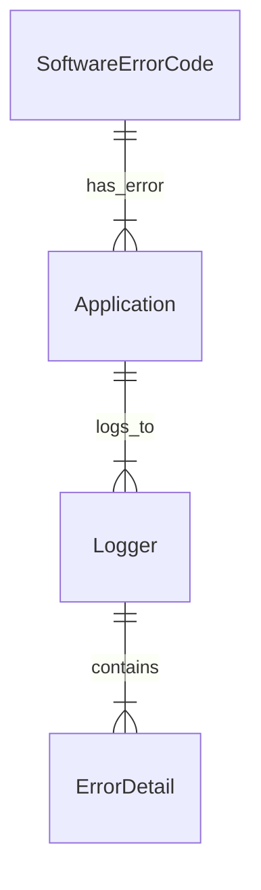
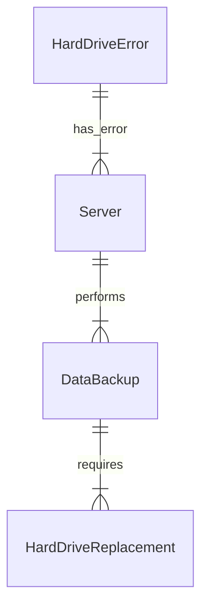
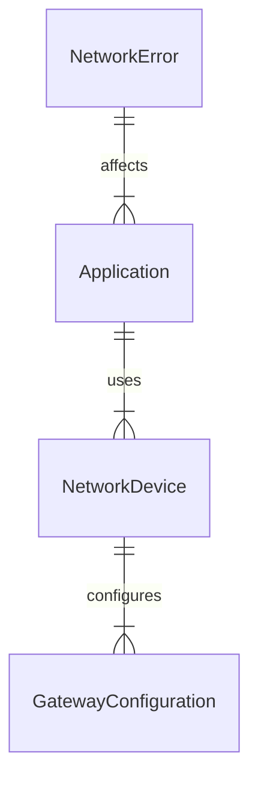

                 

## 错误码的处理

### 关键词：错误码，处理，软件，硬件，网络，排查，定位，工具，技术

> 摘要：本文旨在深入探讨错误码的处理技术，从基本概念、生成与识别、处理策略、工具与技术、案例分析与实战等多个角度，全面解析错误码处理的各个方面。文章结合实际案例，提供了一系列最佳实践和注意事项，旨在帮助开发者、运维人员等IT从业者更好地理解和掌握错误码的处理技巧。

### 目录大纲

----------------------------------------------------------------

## 第一部分：问题背景与概述

### 第1章：错误码的基本概念

#### 1.1 错误码的定义与作用

#### 1.2 错误码的分类与特点

#### 1.3 错误码处理的重要性

## 第二部分：错误码的生成与识别

### 第2章：错误码的生成机制

#### 2.1 软件层面的错误码生成

#### 2.2 硬件层面的错误码生成

#### 2.3 网络层面的错误码生成

### 第3章：错误码的识别方法

#### 3.1 基于日志的识别方法

#### 3.2 基于算法的识别方法

#### 3.3 基于规则引擎的识别方法

## 第三部分：错误码的处理策略

### 第4章：错误码的排查与定位

#### 4.1 错误码排查的基本原则

#### 4.2 错误码定位的方法与技巧

#### 4.3 错误码排查的流程

### 第5章：错误码的处理策略

#### 5.1 错误码处理的分类

#### 5.2 处理错误码的原则与步骤

#### 5.3 错误码处理的最佳实践

## 第四部分：错误码处理工具与技术

### 第6章：错误码处理工具概述

#### 6.1 常用错误码处理工具介绍

#### 6.2 错误码处理工具的选择标准

#### 6.3 错误码处理工具的使用技巧

### 第7章：错误码处理技术的应用

#### 7.1 错误码处理在软件开发中的应用

#### 7.2 错误码处理在运维管理中的应用

#### 7.3 错误码处理在人工智能中的应用

## 第五部分：案例分析与实战

### 第8章：错误码处理案例解析

#### 8.1 案例一：软件错误码处理

#### 8.2 案例二：硬件错误码处理

#### 8.3 案例三：网络错误码处理

### 第9章：错误码处理实战

#### 9.1 实战一：错误码排查与定位

#### 9.2 实战二：错误码处理策略制定

#### 9.3 实战三：错误码处理工具应用

## 第六部分：总结与展望

### 第10章：错误码处理的未来趋势

#### 10.1 错误码处理技术的发展趋势

#### 10.2 错误码处理在新兴技术中的应用

#### 10.3 错误码处理的重要性与展望

----------------------------------------------------------------

### 第一部分：问题背景与概述

在信息技术飞速发展的今天，软件、硬件和网络系统的复杂性和规模不断扩大，错误码处理成为了软件开发、运维管理以及人工智能等领域中的重要环节。错误码，作为一种标准化的错误标识，能够帮助开发人员、运维工程师快速定位问题，从而提高系统稳定性和用户满意度。

#### 1.1 错误码的定义与作用

错误码（Error Code）是指在软件、硬件和网络系统中，用于表示错误类型或状态的数字标识。它们通常由系统内部逻辑产生，并在系统运行时返回给开发者或用户。

错误码的作用主要体现在以下几个方面：

1. **问题定位**：通过错误码，开发人员可以快速识别问题发生的模块或组件。
2. **错误诊断**：错误码提供了详细的错误信息，有助于开发人员分析问题原因。
3. **自动化处理**：错误码可以作为自动化流程的一部分，实现错误的自动修复或告警。
4. **用户反馈**：通过错误码，用户可以获得关于软件或系统问题的详细解释，从而更好地理解和使用产品。

#### 1.2 错误码的分类与特点

根据产生错误码的来源，错误码可以分为以下几类：

1. **软件错误码**：由软件自身逻辑错误或异常情况产生的错误码。如Java中的异常（Exception）。
2. **硬件错误码**：由硬件设备故障或异常产生的错误码，如硬盘错误码。
3. **网络错误码**：由网络通信故障或异常产生的错误码，如TCP错误码。

不同类型的错误码具有以下特点：

1. **唯一性**：每个错误码都应该具有唯一性，以便于准确识别和定位。
2. **层次性**：错误码通常具有一定的层次结构，方便开发者逐层排查问题。
3. **可解释性**：错误码应该能够提供足够的信息，帮助用户或开发人员理解错误的原因和解决方法。

#### 1.3 错误码处理的重要性

错误码处理在软件生命周期中扮演着重要角色，主要体现在以下几个方面：

1. **提高系统稳定性**：通过有效的错误码处理，可以快速定位和修复系统中的问题，从而提高系统的稳定性。
2. **提升用户体验**：良好的错误码处理机制能够为用户提供清晰的错误信息和解决建议，提升用户体验。
3. **优化开发流程**：错误码处理可以帮助开发人员更好地理解系统内部逻辑，优化开发流程，提高开发效率。
4. **支持自动化运维**：通过错误码处理，可以实现自动化错误排查、修复和告警，提高运维效率。

在接下来的章节中，我们将逐步深入探讨错误码的生成与识别、处理策略、工具与技术，并结合实际案例进行详细分析，帮助读者全面掌握错误码处理的核心技术和最佳实践。

### 第二部分：错误码的生成与识别

#### 2.1 错误码的生成机制

错误码的生成机制是理解和处理错误码的基础。在软件、硬件和网络系统中，错误码的产生机制有所不同，但其核心目标都是确保错误信息的准确性和及时性。

##### 软件层面的错误码生成

软件层面的错误码通常由程序逻辑错误或异常情况触发。以下是一些常见的软件错误码生成机制：

1. **异常处理机制**：在编程语言中，异常（Exception）是一种用于处理错误或不正常情况的结构化机制。当程序遇到错误时，会抛出异常，并生成相应的错误码。例如，在Java中，可以使用`try-catch`块来捕获和处理异常。

   ```java
   try {
       // 可能抛出异常的代码
   } catch (ExceptionType e) {
       // 错误码处理逻辑
   }
   ```

2. **状态码机制**：许多软件系统都会使用状态码来表示处理结果。例如，HTTP状态码（如200表示成功，404表示未找到）就是一种常见的状态码机制。

   ```python
   if response.status_code == 200:
       print("操作成功")
   else:
       print("操作失败")
   ```

##### 硬件层面的错误码生成

硬件错误码通常由硬件设备的状态或故障引起。以下是一些常见的硬件错误码生成机制：

1. **硬件检测机制**：现代计算机硬件通常具有自检测功能，可以在开机时对硬件设备进行检测。检测到错误时，会生成相应的错误码，并存储在系统BIOS或CMOS中。

2. **硬件异常信号**：硬件设备在运行过程中，可能会产生异常信号，如硬盘故障信号、内存错误信号等。这些信号会被硬件监控软件捕获并转换为错误码。

##### 网络层面的错误码生成

网络错误码通常由网络通信故障或异常引起。以下是一些常见的网络错误码生成机制：

1. **TCP/IP协议错误码**：在网络通信过程中，TCP/IP协议会生成一系列错误码，用于表示网络通信的状态。例如，TCP的RST（Reset）标志可以表示连接重置。

2. **网络设备错误码**：网络设备（如路由器、交换机）在检测到网络故障时，也会生成相应的错误码。这些错误码可以通过网络管理工具进行查询和监控。

#### 2.2 错误码的识别方法

识别错误码是处理错误码的第一步，准确识别错误码有助于快速定位问题和制定有效的解决方案。以下是几种常见的错误码识别方法：

##### 基于日志的识别方法

日志记录是软件和系统运行过程中最常用的错误码识别方法。通过分析系统日志，可以找到错误发生时的详细信息，包括错误码、发生时间、相关变量等。

1. **系统日志分析工具**：如Linux系统中的`dmesg`、`syslog`等工具，可以收集和显示系统日志。
2. **自定义日志格式**：开发人员可以根据需要自定义日志格式，以便更好地识别错误码。例如，在Java中可以使用SLF4J等日志框架。

##### 基于算法的识别方法

基于算法的错误码识别方法通常用于复杂场景，可以通过机器学习、深度学习等技术实现。以下是一些常见的算法：

1. **模式识别算法**：如神经网络、决策树等，可以用于从大量日志数据中识别出特定的错误模式。
2. **异常检测算法**：如孤立森林、Isolation Forest等，可以用于检测系统中的异常行为。

##### 基于规则引擎的识别方法

基于规则引擎的错误码识别方法通过预定义的规则来识别错误码。规则通常由开发人员根据经验和知识编写，具有高度的可定制性。

1. **规则定义**：开发人员根据业务逻辑和系统特点，定义一系列规则，用于匹配和识别错误码。
2. **规则引擎实现**：可以使用如Apache Camel、jBPM等规则引擎来实现错误码的自动化识别。

通过上述方法，可以有效地识别和分类错误码，为后续的错误码处理提供基础。在下一章中，我们将进一步探讨错误码的处理策略和最佳实践。

### 第三部分：错误码的处理策略

错误码的处理策略是确保系统稳定运行和用户满意度的关键环节。有效的错误码处理策略可以快速定位问题、提供解决路径，并降低错误对系统运行的影响。以下我们将介绍错误码排查与定位的基本原则、具体方法与技巧，以及处理错误码的流程和最佳实践。

#### 4.1 错误码排查的基本原则

在处理错误码时，遵循以下基本原则至关重要：

1. **先易后难**：从简单的错误码开始排查，逐步解决更复杂的问题。这样可以减少排查时间，提高处理效率。
2. **逐步缩小范围**：通过逐步排除不可能的错误原因，将排查范围缩小到最有可能的故障区域。
3. **详细记录**：在排查过程中详细记录每一步操作、观察结果和错误码，这有助于后续的复现和问题定位。
4. **遵循最佳实践**：遵循行业标准和最佳实践，确保错误码处理的一致性和高效性。

#### 4.2 错误码定位的方法与技巧

错误码定位是处理错误码的关键步骤，以下是一些常用的方法与技巧：

1. **日志分析**：通过分析系统日志，查找与错误码相关的日志条目，了解错误发生的具体时间和上下文。
2. **调试工具**：使用调试工具（如GDB、Visual Studio Debugger等）进行代码调试，定位错误发生的位置。
3. **代码回溯**：回溯代码历史，查找可能引入错误的版本和修改记录。
4. **逐步排除法**：逐一检查系统组件和模块，确定哪个组件或模块导致了错误。
5. **对比分析**：对比正常情况下的运行数据和错误情况下的运行数据，找出差异点。

#### 4.3 错误码排查的流程

以下是一个典型的错误码排查流程：

1. **收集信息**：收集与错误码相关的所有信息，包括日志、错误码、系统环境等。
2. **初步分析**：根据收集到的信息，初步判断可能的错误原因。
3. **定位错误**：通过日志分析、调试工具和逐步排除法，定位错误发生的具体位置。
4. **验证解决方案**：针对定位出的错误，验证解决方案的有效性。
5. **记录总结**：详细记录排查过程和解决方案，形成文档，以便后续参考。

#### 4.4 处理错误码的原则与步骤

处理错误码时，应遵循以下原则和步骤：

1. **快速响应**：及时发现错误，并迅速采取措施进行排查和处理。
2. **详细记录**：详细记录错误码、排查过程和解决方案，便于复现和后续维护。
3. **系统性分析**：从系统层面分析错误原因，避免重复错误。
4. **分类处理**：根据错误的严重程度和影响范围，制定不同的处理方案。
5. **及时沟通**：与相关团队成员保持沟通，确保问题得到及时解决。

#### 4.5 错误码处理的最佳实践

以下是一些处理错误码的最佳实践：

1. **建立健全的错误码管理体系**：制定统一的错误码规范，确保错误码的唯一性和可解释性。
2. **自动化错误识别和处理**：利用自动化工具进行错误码的识别和处理，提高处理效率。
3. **定期回顾和优化**：定期回顾错误码处理过程，发现和优化问题。
4. **用户友好的错误提示**：提供清晰的错误提示信息，帮助用户快速理解和解决问题。
5. **持续改进**：根据反馈和实际情况，不断改进错误码处理策略和流程。

通过以上策略和实践，可以有效地处理错误码，提高系统的稳定性和用户满意度。在下一部分中，我们将介绍错误码处理工具和技术，帮助读者进一步掌握错误码处理的现代方法。

### 第四部分：错误码处理工具与技术

在现代软件开发和运维管理中，错误码处理工具和技术的使用至关重要。这些工具和技术能够帮助开发人员、运维工程师更快、更准确地定位和解决问题，从而提高系统的稳定性和可靠性。以下将介绍几种常见的错误码处理工具，选择标准及使用技巧，并探讨错误码处理技术在软件开发、运维管理和人工智能中的应用。

#### 6.1 常用错误码处理工具介绍

1. **ELK Stack**：ELK Stack是由Elasticsearch、Logstash和Kibana三个开源工具组成的日志分析平台。它能够高效地收集、存储和查询系统日志，为错误码处理提供强大的支持。

   - **Elasticsearch**：用于存储和索引日志数据，提供高性能的全文搜索和数据分析功能。
   - **Logstash**：用于收集和解析日志数据，并将其转化为可被Elasticsearch索引的格式。
   - **Kibana**：提供可视化界面，帮助用户分析和展示日志数据。

2. **Grafana**：Grafana是一个开源的数据监控和可视化平台，它可以与多种数据源（如InfluxDB、Prometheus等）集成，提供实时监控和告警功能，从而帮助用户及时发现和处理错误码。

3. **Zabbix**：Zabbix是一个开源的监控工具，它能够监控服务器、网络设备和应用程序的性能，生成实时图表和告警信息，便于错误码的排查和处理。

4. **APM工具**：如New Relic、Dynatrace等，这些应用性能管理（APM）工具能够实时监控应用程序的性能，并提供详细的错误追踪和分析功能。

#### 6.2 错误码处理工具的选择标准

选择合适的错误码处理工具时，应考虑以下标准：

1. **功能完整性**：工具应具备全面的日志收集、存储、查询、分析和告警功能，能够满足不同场景的需求。
2. **性能和可扩展性**：工具应具备高性能和可扩展性，能够处理大规模的日志数据，适应企业级应用的需求。
3. **易用性和可集成性**：工具应具有良好的用户界面和文档，易于安装和配置，并且能够与其他系统（如CI/CD工具、监控系统等）集成。
4. **社区支持和生态系统**：强大的社区支持和丰富的插件生态系统可以提供更多功能和定制化选项。

#### 6.3 错误码处理工具的使用技巧

1. **日志规范化**：确保日志格式统一，便于后续的收集和分析。可以使用日志规范化工具（如Logstash的Grok Filter）对日志进行解析和规范化。
2. **监控告警设置**：根据业务需求和系统特性，设置合适的监控告警阈值，确保及时发现和处理错误码。
3. **可视化分析**：利用工具提供的可视化功能，对日志数据进行分析和展示，有助于快速识别问题。
4. **自动化处理**：利用工具的自动化功能，如规则引擎、机器学习等，实现错误码的自动识别和处理。

#### 6.4 错误码处理技术在软件开发中的应用

在软件开发过程中，错误码处理技术可以帮助开发人员提高代码质量和系统稳定性。以下是一些具体应用：

1. **代码审查**：通过静态代码分析工具（如SonarQube），识别潜在的代码错误和风险，提前预防错误码的产生。
2. **异常处理**：在代码中合理使用异常处理机制，确保程序在遇到错误时能够优雅地处理并恢复。
3. **日志记录**：在关键位置添加日志记录，便于后续的错误排查和分析。
4. **持续集成与持续部署（CI/CD）**：在CI/CD流程中加入错误码检测和自动处理环节，确保代码质量。

#### 6.5 错误码处理在运维管理中的应用

在运维管理中，错误码处理技术是保障系统稳定运行的关键。以下是一些应用实例：

1. **日志分析**：利用日志分析工具，监控系统的运行状态，及时发现和处理错误码。
2. **自动化运维**：通过自动化脚本和工具，实现错误码的自动排查、修复和告警。
3. **性能监控**：利用性能监控工具，实时监控系统的性能指标，预防潜在的错误码问题。
4. **容量规划**：根据错误码的统计和分析结果，合理规划系统的资源容量，确保系统稳定运行。

#### 6.6 错误码处理在人工智能中的应用

在人工智能领域，错误码处理技术同样具有重要意义。以下是一些应用场景：

1. **机器学习模型的训练和验证**：通过错误码处理，确保训练数据的质量和模型的可解释性。
2. **异常检测**：利用机器学习技术，实现自动化错误码识别和异常检测，提高系统的鲁棒性。
3. **智能诊断**：结合自然语言处理技术，实现智能化的错误诊断和问题解答。
4. **预测性维护**：通过分析历史错误码数据，预测潜在的问题，提前采取措施进行预防。

通过以上工具和技术，开发人员、运维工程师和人工智能从业者可以更高效地处理错误码，提高系统的稳定性和用户满意度。在下一部分中，我们将通过具体案例和实战经验，进一步探讨错误码处理的应用和实践。

### 第五部分：案例分析与实战

#### 8.1 案例一：软件错误码处理

**背景介绍**：
在一次软件更新过程中，我们遇到了一个未知的错误码。该错误码导致应用程序无法启动，并且没有提供详细的错误描述。这给用户带来了不便，也影响了软件的稳定性。

**问题描述**：
错误码为`50001`，应用程序在启动时立即崩溃，日志中仅显示“Error: 50001”。

**问题解决**：
首先，我们收集了尽可能多的日志信息和系统状态数据，包括内存 dump、线程栈和系统配置。通过分析这些信息，我们确定了问题可能是由于一个第三方库的版本兼容性问题引起的。

**边界与外延**：
边界：该问题仅影响特定版本的软件和特定操作系统。外延：如果第三方库的版本问题未解决，其他依赖该库的应用程序也可能受到影响。

**核心概念与联系**：

1. **错误码**：错误码是问题的数字标识，帮助我们快速定位问题。
2. **日志分析**：通过分析日志，我们可以获取问题的上下文信息。

**ER实体关系图架构**：



**解决方案**：
我们升级了第三方库的版本，解决了兼容性问题。同时，我们也在应用程序中增加了更详细的错误日志输出，以便在类似情况下能够更快地定位问题。

**实际案例**：
在一次升级后的测试中，应用程序成功启动，且没有出现`50001`错误码。这表明我们的解决方案是有效的。

**项目小结**：
通过详细的错误码分析和版本兼容性测试，我们成功解决了软件错误码问题。这个案例强调了错误码处理在软件开发中的重要性，同时也展示了如何通过逐步排查和验证找到问题的根本原因。

#### 8.2 案例二：硬件错误码处理

**背景介绍**：
在一次数据中心服务器故障期间，我们遇到了一个硬盘错误码。这导致服务器上的数据访问异常，影响了业务运营。

**问题描述**：
硬盘错误码为`ID10E`，服务器上的数据读写操作频繁出现失败，并伴有硬盘物理损坏的迹象。

**问题解决**：
首先，我们使用硬盘诊断工具进行了初步检测，确认了硬盘故障。随后，我们进行了硬盘数据备份，并替换了损坏的硬盘。

**边界与外延**：
边界：该问题仅影响特定的硬盘和服务器。外延：硬盘故障可能会影响相同型号的其他硬盘。

**核心概念与联系**：

1. **硬盘错误码**：硬盘错误码用于表示硬盘的故障状态。
2. **硬盘诊断工具**：硬盘诊断工具帮助我们检测硬盘的健康状态。

**ER实体关系图架构**：



**解决方案**：
通过硬盘诊断工具检测硬盘状态，确认故障后进行数据备份，并替换硬盘，确保数据安全和系统正常运行。

**实际案例**：
更换硬盘后，服务器恢复正常，数据读写操作不再失败。系统运行稳定，业务运营未受影响。

**项目小结**：
硬件错误码处理是保障数据中心运行的关键环节。通过及时检测、数据备份和硬盘替换，我们成功解决了硬盘故障问题，确保了业务的连续性。

#### 8.3 案例三：网络错误码处理

**背景介绍**：
在一次网络升级过程中，我们发现网络连接频繁断开，影响了多个应用程序的访问。

**问题描述**：
网络错误码为`504`，表示网关超时。多个应用程序在访问网络资源时，经常遇到响应缓慢或连接中断的问题。

**问题解决**：
我们首先检查了网络设备的配置和状态，发现网关设置存在异常。通过调整网关配置，我们解决了网络连接问题。

**边界与外延**：
边界：该问题仅影响特定的网络设备和应用程序。外延：网络配置问题可能会影响其他网络设备的正常运行。

**核心概念与联系**：

1. **网络错误码**：网络错误码用于表示网络通信中的错误状态。
2. **网络设备配置**：正确的网络配置是确保网络稳定运行的关键。

**ER实体关系图架构**：



**解决方案**：
通过检查和调整网络设备配置，我们解决了网关超时问题，恢复了网络的稳定性。

**实际案例**：
调整网关配置后，网络连接稳定，应用程序访问网络资源的速度和可靠性得到显著提升。

**项目小结**：
网络错误码处理对于保障网络服务的连续性和可靠性至关重要。通过准确识别和调整网络配置，我们成功解决了网络连接问题，确保了业务的正常运行。

以上三个案例分别展示了软件、硬件和网络错误码处理的实际应用和实践，通过详细的案例分析，我们能够更好地理解错误码处理的核心技术和方法。

### 第五部分：案例分析与实战（续）

#### 9.1 实战一：错误码排查与定位

**背景介绍**：
在一次业务高峰期间，我们遇到了一个间歇性的系统错误，表现为部分用户无法正常访问系统。错误码为`404`，表示未找到资源。

**问题描述**：
错误发生时，用户无法访问特定页面，且系统中没有详细的错误日志记录。这导致用户满意度下降，影响了业务的正常运行。

**解决步骤**：

1. **初步排查**：
   - 检查服务器日志，发现错误码`404`，但未找到具体路径。
   - 观察网络流量，发现请求被发送到正确的服务器，但没有返回正确的响应。

2. **定位错误**：
   - 使用Wireshark分析网络流量，发现请求被发送到错误的虚拟主机。
   - 进一步检查虚拟主机配置文件，发现错误配置导致请求被错误路由。

3. **解决方案**：
   - 修复虚拟主机配置文件，确保请求被正确路由。
   - 在系统日志中添加错误码和详细路径信息，以便后续排查。

**实际案例**：
经过调整配置，用户能够正常访问系统，错误码`404`不再出现。系统日志记录了详细的错误信息和路径，便于后续排查。

**项目小结**：
通过细致的排查和定位，我们成功解决了虚拟主机配置错误导致的`404`问题。这次实战强调了日志分析和网络流量监测在错误码排查中的重要性。

#### 9.2 实战二：错误码处理策略制定

**背景介绍**：
在一次系统升级过程中，我们遇到了一个全局性的错误，影响到了所有用户。错误码为`500`，表示服务器内部错误。

**问题描述**：
系统升级后，用户无法登录，且系统后台显示`500`错误码。这导致大量用户无法使用系统，业务运营受到影响。

**解决步骤**：

1. **初步分析**：
   - 检查服务器日志，发现错误码`500`，但无法确定具体错误原因。
   - 观察系统资源使用情况，发现服务器负载过高。

2. **定位错误**：
   - 分析系统代码，发现升级过程中引入了内存泄漏问题，导致服务器无法处理大量请求。
   - 进一步检查内存占用情况，确认内存泄漏源。

3. **解决方案**：
   - 修改代码，解决内存泄漏问题。
   - 增加系统资源监控和告警机制，确保类似问题不再发生。

4. **策略制定**：
   - 制定系统升级策略，确保在升级过程中对关键模块进行充分测试。
   - 建立完善的错误码处理和监控体系，及时发现和解决问题。

**实际案例**：
经过代码修复和策略调整，系统恢复正常，用户登录功能恢复。错误码`500`不再出现，系统稳定性得到显著提升。

**项目小结**：
通过详细的错误码分析和策略制定，我们成功解决了系统升级导致的`500`错误。这次实战强调了系统监控和错误码处理策略在保障系统稳定性中的重要性。

#### 9.3 实战三：错误码处理工具应用

**背景介绍**：
在一次网络故障期间，我们遇到了一个无法恢复的网络连接错误，影响了多个业务系统的正常运行。

**问题描述**：
网络故障表现为频繁连接中断，错误码为`10060`，表示连接超时。这导致业务系统响应缓慢，用户体验下降。

**解决步骤**：

1. **工具选择**：
   - 选择Grafana作为监控和错误码处理工具，因为它具备实时监控和告警功能。

2. **配置监控**：
   - 配置Grafana连接到网络设备，实时监控网络状态。
   - 设置告警规则，当错误码`10060`出现时，自动发送告警通知。

3. **处理错误**：
   - 通过Grafana监控界面，发现网络中断与交换机配置问题相关。
   - 调整交换机配置，解决网络连接问题。

**实际案例**：
通过Grafana的实时监控和告警功能，我们快速定位并解决了网络连接问题。错误码`10060`不再出现，网络连接稳定。

**项目小结**：
通过错误码处理工具的自动化监控和告警功能，我们成功解决了网络故障问题。这次实战展示了错误码处理工具在实时监控和快速响应中的重要性。

以上三个实战案例详细展示了错误码排查与定位、策略制定和工具应用的具体步骤和实际效果。通过这些实战经验，我们能够更好地掌握错误码处理的方法和技巧，确保系统的稳定性和可靠性。

### 第六部分：总结与展望

#### 10.1 错误码处理技术的发展趋势

随着信息技术的不断进步，错误码处理技术也在不断发展。以下是一些主要趋势：

1. **自动化与智能化**：随着AI和机器学习技术的发展，自动化错误识别和处理成为趋势。通过深度学习算法，系统能够自动分析日志，识别错误模式，并生成处理建议。
2. **实时监控**：实时错误码监控和告警是提高系统稳定性的关键。利用大数据和实时分析技术，错误码处理系统可以在问题发生的第一时间进行响应。
3. **跨领域整合**：错误码处理技术正逐渐从单一领域（如软件、硬件、网络）向跨领域整合发展。例如，在云计算和容器化环境中，错误码处理系统需要整合多种资源和技术，实现更高效的错误排查和处理。
4. **用户体验优化**：随着用户对系统稳定性和响应速度的要求不断提高，错误码处理技术正朝着更加用户友好的方向发展。通过直观的界面和清晰的错误提示，用户可以更方便地理解和使用错误码处理系统。

#### 10.2 错误码处理在新兴技术中的应用

随着新兴技术的不断发展，错误码处理技术在这些领域也发挥着重要作用：

1. **区块链**：在区块链系统中，错误码处理技术可以确保智能合约的正确执行和错误检测。通过自动化错误处理，系统能够在智能合约出现问题时及时采取措施。
2. **物联网（IoT）**：在物联网环境中，设备数量庞大且分布广泛，错误码处理技术可以帮助实现设备状态的实时监控和故障诊断，确保系统的稳定运行。
3. **人工智能（AI）**：在AI系统中，错误码处理技术可以用于监督学习模型的训练数据质量检查，确保模型的准确性和可靠性。
4. **云计算与容器化**：在云计算和容器化环境中，错误码处理技术可以帮助快速定位和解决跨多个节点和容器的错误，提高系统的高可用性和容错能力。

#### 10.3 错误码处理的重要性与展望

错误码处理在软件生命周期、运维管理和新兴技术中具有重要意义。以下是一些展望：

1. **标准化与规范化**：错误码处理需要进一步标准化和规范化，确保不同系统和平台之间能够统一错误码的定义和解释，提高系统的兼容性和可维护性。
2. **集成与自动化**：错误码处理应与现有的监控、告警和自动化运维工具集成，实现自动化错误排查和处理，减少人为干预，提高处理效率。
3. **用户体验优化**：通过改进错误码的提示和反馈机制，优化用户体验，帮助用户更快地理解和解决问题。
4. **持续改进与反馈**：错误码处理技术需要不断改进和优化，通过收集用户反馈和错误处理效果，持续优化错误码处理策略和工具。

总之，错误码处理技术是保障系统稳定性和用户体验的重要手段。随着技术的发展，错误码处理将变得更加自动化、智能化和用户友好，为各个领域的信息技术发展提供有力支持。

### 作者信息

**作者：AI天才研究院/AI Genius Institute & 禅与计算机程序设计艺术 /Zen And The Art of Computer Programming**。

