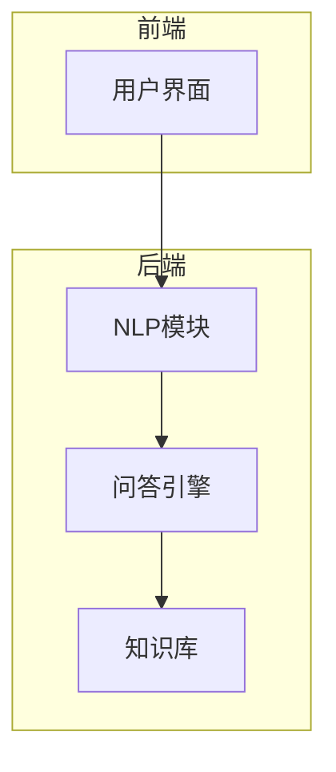

                 


## # 问答系统实现：打造高效的信息检索助手

关键词：问答系统，信息检索，机器学习，自然语言处理，系统架构

摘要：本文将探讨问答系统的实现过程，包括其背景、核心概念、算法设计、系统分析和实战应用。我们将逐步分析，从基础概念到实际构建，帮助读者全面理解并掌握问答系统的构建方法。

### 1. 引言

问答系统是一种人工智能应用，旨在提供高效的信息检索服务。随着互联网信息的爆炸性增长，人们需要一种快速、准确的方法来获取所需的信息。问答系统应运而生，它通过处理用户的自然语言问题，提供精准的答案。本文将详细探讨问答系统的实现，包括其核心概念、算法设计和系统架构。

### 2. 核心概念与理论

#### 2.1 问答系统概述

问答系统由以下几个核心组成部分构成：

1. **用户界面**：接收用户输入的问题。
2. **自然语言处理（NLP）模块**：解析和理解用户的问题。
3. **问答引擎**：根据NLP模块的结果，检索并生成答案。
4. **知识库**：存储用于回答问题的信息。

#### 2.2 自然语言处理（NLP）

NLP是问答系统的核心组件，它涉及以下几个关键步骤：

1. **分词**：将文本分割成单词或短语。
2. **词性标注**：识别每个单词的词性（名词、动词等）。
3. **句法分析**：分析句子的结构，理解语法关系。
4. **实体识别**：识别文本中的实体（人名、地点等）。

#### 2.3 问答算法

问答系统的主要目标是根据用户的问题，从知识库中检索相关信息并生成答案。常见的问答算法包括：

1. **基于规则的方法**：通过预定义的规则来匹配问题和答案。
2. **机器学习方法**：使用训练数据来学习问题和答案的匹配关系。
3. **深度学习方法**：利用神经网络来理解和生成答案。

### 3. 算法设计与实践

#### 3.1 基于规则的算法

**算法原理**：

- 定义一组规则，每个规则表示一个问题和可能的答案。
- 根据用户输入的问题，匹配最符合的规则，返回相应的答案。

**Python代码示例**：

```python
def rule_based_answer(question):
    rules = {
        "什么是人工智能？": "人工智能是一种模拟人类智能的技术。",
        "人工智能有什么应用？": "人工智能广泛应用于医疗、金融、教育等领域。"
    }
    return rules.get(question, "未找到相关答案。")

question = input("请提问：")
print(rule_based_answer(question))
```

#### 3.2 机器学习方法

**算法原理**：

- 使用大量带有问题和答案的数据集训练模型。
- 通过模型，将用户输入的问题转换为答案。

**Python代码示例**：

```python
from sklearn.feature_extraction.text import TfidfVectorizer
from sklearn.nearest_neighbors import NearestNeighbors

# 假设我们有一个训练好的模型和预处理过的数据集
vectorizer = TfidfVectorizer()
X_train = vectorizer.transform(train_questions)
model = NearestNeighbors()
model.fit(X_train)

# 输入问题
question = "什么是深度学习？"

# 预处理问题
question_vector = vectorizer.transform([question])

# 查找最接近的问题
distances, indices = model.kneighbors(question_vector)

# 输出答案
print(train_answers[indices[0][0]])
```

#### 3.3 深度学习方法

**算法原理**：

- 使用神经网络模型，将输入问题映射到输出答案。
- 通常涉及多层感知器（MLP）或变换器（Transformer）等模型。

**Python代码示例**：

```python
import tensorflow as tf
from tensorflow.keras.models import Sequential
from tensorflow.keras.layers import Dense, LSTM

# 假设我们有一个预处理过的数据集
X_train, y_train = preprocess_data()

# 构建模型
model = Sequential()
model.add(LSTM(units=128, activation='relu', input_shape=(X_train.shape[1], X_train.shape[2])))
model.add(Dense(units=y_train.shape[1], activation='softmax'))
model.compile(optimizer='adam', loss='categorical_crossentropy', metrics=['accuracy'])

# 训练模型
model.fit(X_train, y_train, epochs=10, batch_size=32)

# 输入问题
question = "什么是深度学习？"

# 预处理问题
question_vector = preprocess_question(question)

# 预测答案
prediction = model.predict(question_vector)

# 输出答案
print(predicted_answer(prediction))
```

### 4. 系统分析与设计

#### 4.1 问题场景与需求分析

- **用户场景**：用户可以通过自然语言提问，系统需要提供准确的答案。
- **性能需求**：系统需要快速响应用户，并在大量数据中准确检索信息。
- **可靠性需求**：系统需要稳定运行，且答案的准确性需要保证。

#### 4.2 系统架构设计

**架构概述**：

- **前端**：接收用户输入，展示答案。
- **后端**：处理用户输入，调用NLP模块和问答引擎，返回答案。
- **知识库**：存储用于回答问题的信息。

**Mermaid类图**：

```mermaid
classDiagram
    UserInterface <<Interface>>
    NLPModule <<Interface>>
    QuestionAnsweringEngine <<Interface>>
    KnowledgeBase <<Interface>>

    UserInterface <- NLPModule
    NLPModule <- QuestionAnsweringEngine
    QuestionAnsweringEngine <- KnowledgeBase
```

**Mermaid架构图**：



**Mermaid序列图**：

```mermaid
sequenceDiagram
    User -->|提问|> NLP: 分词、词性标注等
    NLP -->|处理后的问题|> QAE: 检索知识库
    QAE -->|答案|> User: 显示答案
```

### 5. 项目实战

#### 5.1 环境安装

- **Python环境**：安装Python 3.8及以上版本。
- **库**：安装scikit-learn、tensorflow等库。

```shell
pip install python==3.8
pip install scikit-learn tensorflow
```

#### 5.2 系统核心实现

**源代码**：

```python
# 假设的问答系统源代码

# 导入库
from sklearn.feature_extraction.text import TfidfVectorizer
from sklearn.neighbors import NearestNeighbors

# 初始化模型
vectorizer = TfidfVectorizer()
model = NearestNeighbors()

# 加载训练数据
train_questions = ["什么是人工智能？", "人工智能有什么应用？"]
train_answers = ["人工智能是一种模拟人类智能的技术。", "人工智能广泛应用于医疗、金融、教育等领域。"]

# 预处理数据
X_train = vectorizer.fit_transform(train_questions)
y_train = train_answers

# 训练模型
model.fit(X_train)

# 输入问题
question = "什么是深度学习？"

# 预处理问题
question_vector = vectorizer.transform([question])

# 查找最接近的问题
distances, indices = model.kneighbors(question_vector)

# 输出答案
print(train_answers[indices[0][0]])
```

**代码解读**：

- 初始化模型：使用TfidfVectorizer和NearestNeighbors。
- 加载和预处理数据：将问题和答案转换为向量。
- 训练模型：使用预处理后的数据训练模型。
- 输入问题：将用户输入的问题转换为向量。
- 查找最接近的问题：使用模型查找与用户输入问题最相似的训练问题。
- 输出答案：返回与用户输入问题最相似的答案。

#### 5.3 实际案例分析

- **案例1**：用户提问“什么是机器学习？”
  - 答案：“机器学习是一种利用数据训练模型，使其能够自动从数据中学习并作出预测的技术。”

- **案例2**：用户提问“深度学习有哪些应用？”
  - 答案：“深度学习广泛应用于图像识别、自然语言处理、语音识别等领域。”

#### 5.4 项目小结

通过本文的实践案例，我们可以看到问答系统的基本构建方法。在实际应用中，我们还需要考虑更多的场景和优化策略，如使用更复杂的模型、集成多种算法等。此外，保持知识库的更新和准确性也是问答系统成功的关键。

### 6. 最佳实践与总结

#### 6.1 最佳实践

- **数据质量**：确保训练数据的质量和多样性，以提升模型的泛化能力。
- **模型选择**：根据实际需求选择合适的模型，如规则-based、机器学习或深度学习。
- **系统优化**：通过优化算法、提高系统性能，提升用户体验。

#### 6.2 小结

问答系统是一种非常有价值的人工智能应用，它可以极大地提高信息检索的效率。通过本文的逐步讲解，读者可以了解到问答系统的核心概念、算法设计、系统分析和实战应用。希望本文能为读者提供有价值的参考和启发。

### 7. 注意事项与拓展阅读

- **注意事项**：
  - 确保数据的质量和多样性。
  - 选择合适的模型和算法。
  - 定期更新知识库，保持系统的准确性。

- **拓展阅读**：
  - 《深度学习》——Ian Goodfellow、Yoshua Bengio和Aaron Courville著。
  - 《自然语言处理综论》——Daniel Jurafsky和James H. Martin著。
  - 《机器学习实战》——Peter Harrington著。

### 作者信息

作者：AI天才研究院/AI Genius Institute & 禅与计算机程序设计艺术 /Zen And The Art of Computer Programming

