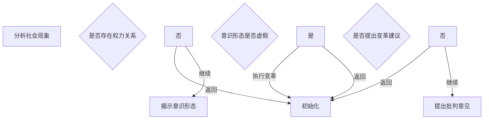
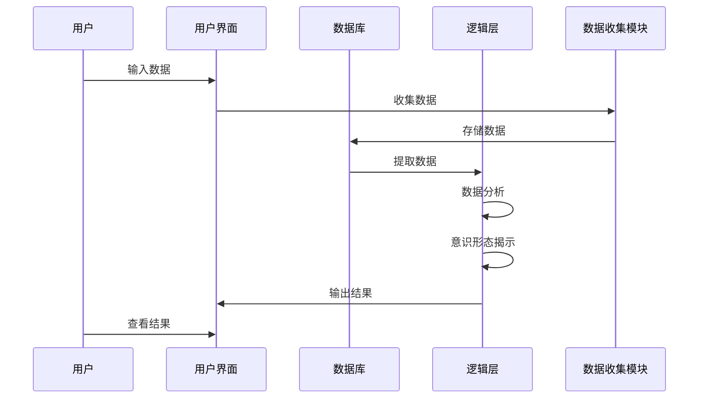
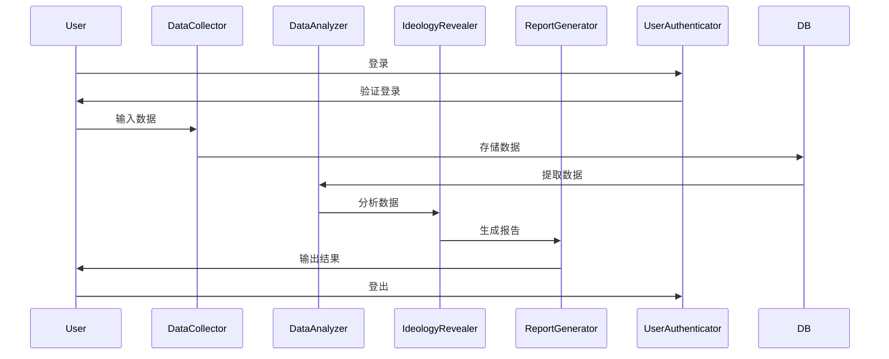

                 

### 文章标题：阿多诺与霍克海默：法兰克福学派的核心思想

#### 关键词：法兰克福学派、文化工业、批判理论、意识形态批判、历史唯物主义

#### 摘要：
本文深入探讨了阿多诺与霍克海默两位思想家及其所创立的法兰克福学派的核心思想。文章首先介绍了阿多诺与霍克海默的生平背景，然后详细阐述了法兰克福学派的基本理论，包括批判理论、文化工业的批判、意识形态批判和历史唯物主义的批判。接着，文章分析了法兰克福学派的影响与遗产，最后总结了其对当代社会科学和哲学界的启示。本文旨在通过逻辑清晰、结构紧凑、简单易懂的方式，让读者全面理解法兰克福学派的核心思想和深远影响。

### 第一部分：阿多诺与霍克海默的生平背景

#### 第1章：生平介绍

#### 1.1 阿多诺的生平

阿多诺（Theodor W. Adorno）出生于德国法兰克福，是一位著名的哲学家、社会学家、音乐理论家和作曲家。他的学术生涯始于20世纪30年代的德国，随后他因纳粹的迫害而流亡美国，并在那里与霍克海默合作创立了社会研究新学院（New School for Social Research）。阿多诺的主要作品包括《启蒙的辩证法》、《文化工业再考察》和《美学理论》等。

##### 1.1.1 阿多诺的早期生活
阿多诺在法兰克福的一个富裕家庭中长大，他的父亲是一位商人。他在青年时期就表现出了对哲学和音乐的浓厚兴趣，并在海德堡大学和柏林大学接受了严格的学术训练。

##### 1.1.2 阿多诺的学术生涯
阿多诺在20世纪30年代成为法兰克福社会研究所的核心成员，他与霍克海默一起开展了对现代社会的批判性研究。他们的合作产生了许多重要的理论成果，为批判理论的发展奠定了基础。

##### 1.1.3 阿多诺的主要作品
阿多诺的主要作品深刻地反映了他的哲学和社会批判思想，例如《启蒙的辩证法》探讨了启蒙运动的矛盾性，而《文化工业再考察》则对大众文化进行了深刻的批判。

#### 1.2 霍克海默的生平

霍克海默（Max Horkheimer）是另一位法兰克福学派的重要代表人物。他出生于德国柏林，是一位哲学家、社会学家和文化理论家。霍克海默与阿多诺的合作关系不仅影响了他们的学术研究，也深刻地影响了法兰克福学派的理论走向。

##### 1.2.1 霍克海默的早期生活
霍克海默在柏林大学接受了哲学和文学的教育，他的学术兴趣涵盖了广泛的主题，包括马克思主义、社会学和美学。

##### 1.2.2 霍克海默的学术生涯
霍克海默在20世纪30年代成为法兰克福社会研究所的创始成员，他与阿多诺一起开展了对现代社会的批判性研究。他们的合作成果包括《启蒙的辩证法》和《批判理论》等经典著作。

##### 1.2.3 霍克海默的主要作品
霍克海默的主要作品，如《理性批判的危机》和《社会阶级理论》，进一步深化了批判理论的核心思想，对现代社会的结构和动态进行了深刻的分析。

### 第二部分：法兰克福学派的核心理论

#### 第2章：批判理论的基本概念

批判理论是法兰克福学派的核心理论，它起源于对现代社会的批判性研究。批判理论旨在揭示隐藏在社会现象背后的权力关系和意识形态。

##### 2.1 批判理论的起源
批判理论的起源可以追溯到20世纪30年代的德国，当时的社会背景是法西斯主义的威胁和对现代社会的批判需求。阿多诺和霍克海默在法兰克福社会研究所开展了对现代社会的批判性研究，形成了批判理论的基本框架。

##### 2.1.1 法兰克福学派的形成
法兰克福学派的形成是20世纪30年代德国政治和文化环境变化的产物。阿多诺和霍克海默等人因为对纳粹的强烈反感，选择流亡美国，并在那里建立了社会研究新学院，继续他们的学术研究。

##### 2.1.2 批判理论的定义
批判理论是一种以揭示和批判社会现象中的不平等和压迫为目标的学术方法。它强调对社会现实进行深入分析，以揭示隐藏在表面现象背后的权力关系和意识形态。

#### 2.2 批判理论的主要观点
批判理论的核心观点包括对文化工业的批判、意识形态批判和历史唯物主义的批判。

##### 2.2.1 文化工业
文化工业是批判理论中的一个重要概念，它指的是资本主义社会中大规模生产和消费的文化产品。文化工业通过标准化和同质化的文化产品，对个人和社会进行控制。

##### 2.2.2 历史唯物主义
历史唯物主义是马克思主义哲学的一个重要组成部分，它认为社会历史的发展是由经济基础决定的。法兰克福学派运用历史唯物主义来分析现代社会的结构和动态。

##### 2.2.3 意识形态批判
意识形态批判是批判理论的另一个重要方面，它旨在揭示和批判社会中的意识形态。意识形态是社会统治阶级用来维护其权力和控制的一种手段，它通过虚假意识来欺骗和麻痹被统治阶级。

### 第3章：文化工业的批判

#### 3.1 文化工业的概念

文化工业是批判理论中的一个核心概念，它指的是资本主义社会中大规模生产和消费的文化产品。文化工业通过标准化和同质化的文化产品，对个人和社会进行控制。

##### 3.1.1 文化工业的定义
文化工业是指一种通过大规模生产和消费文化产品来满足社会需求的社会现象。这些文化产品包括电影、电视、音乐、广告等，它们被设计成标准化和同质化的形式，以满足大众的需求。

##### 3.1.2 文化工业的机制
文化工业的机制包括文化产品的生产和消费过程。生产过程中，文化产品被标准化和同质化，以降低成本和提高效率。消费过程中，大众被引导去接受这些标准化和同质化的文化产品，从而形成一种被动的文化消费模式。

#### 3.2 文化工业的批判

批判理论对文化工业进行了深刻的批判，认为文化工业是资本主义社会中的一种工具，用于控制个人和社会。

##### 3.2.1 文化工业对个人自由的限制
文化工业通过标准化和同质化的文化产品，限制了个人表达自由和多样性。个人被引导去接受和消费特定的文化产品，从而失去了独立思考和批判能力。

##### 3.2.2 文化工业对社会的控制
文化工业通过控制文化产品的生产和消费，对社会进行控制。文化工业的产品被设计成符合统治阶级的利益，从而巩固了社会的不平等和压迫。

##### 3.2.3 文化工业与文化多样性
文化工业倾向于消除文化多样性，通过标准化和同质化的文化产品来满足大众的需求。这种倾向导致文化多样性的丧失，限制了社会的创新和发展。

### 第4章：意识形态批判

#### 4.1 意识形态的概念

意识形态是批判理论中的重要概念，它指的是一种虚假的意识形式，用来维护统治阶级的权力和控制。

##### 4.1.1 意识形态的定义
意识形态是一种通过虚假意识来维护和巩固社会统治阶级权力的意识形式。它通过掩盖社会现实和掩盖阶级矛盾，使被统治阶级接受和服从统治阶级的利益。

##### 4.1.2 意识形态的类型
意识形态可以分为统治阶级意识形态和被统治阶级意识形态。统治阶级意识形态用于维护和巩固统治阶级的权力，而被统治阶级意识形态则是对统治阶级意识形态的反抗和批判。

#### 4.2 意识形态的批判

批判理论对意识形态进行了深刻的批判，认为意识形态是社会统治阶级用来维护其权力和控制的一种手段。

##### 4.2.1 意识形态的作用
意识形态在社会中起着重要的作用，它通过虚假意识来掩盖社会现实和掩盖阶级矛盾。意识形态使社会成员接受和服从统治阶级的利益，从而维持社会秩序。

##### 4.2.2 意识形态的批判方法
批判理论采用意识形态批判的方法，通过揭示意识形态的虚假性和欺骗性，来揭示社会中的不平等和压迫。

##### 4.2.3 意识形态批判的实践
批判理论的实践包括对各种意识形态进行批判，例如对资本主义意识形态、民族主义意识形态和宗教意识形态的批判。通过批判这些意识形态，批判理论旨在揭示社会中的不平等和压迫，并推动社会的变革。

### 第5章：历史唯物主义的批判

#### 5.1 历史唯物主义的概念

历史唯物主义是马克思主义哲学的一个重要组成部分，它认为社会历史的发展是由经济基础决定的。

##### 5.1.1 历史唯物主义的定义
历史唯物主义是一种关于社会历史发展的理论，它认为经济基础是社会发展的决定性因素。历史唯物主义强调生产力和生产关系的矛盾运动，认为社会历史的发展是经济基础和上层建筑相互作用的结果。

##### 5.1.2 历史唯物主义的基本观点
历史唯物主义的基本观点包括：
- 社会存在决定社会意识
- 生产方式决定社会结构
- 经济基础决定上层建筑
- 阶级斗争是社会发展的动力

#### 5.2 历史唯物主义的批判

批判理论对历史唯物主义进行了深入的批判，认为历史唯物主义存在一些问题和局限性。

##### 5.2.1 对资本主义社会的批判
批判理论认为，资本主义社会存在严重的社会不平等和剥削，生产关系不适应生产力的发展，导致社会矛盾的加剧。

##### 5.2.2 对社会主义的批判
批判理论对社会主义也进行了批判，认为社会主义在实践中存在一些问题和局限性，例如对个人的压抑和对自由的限制。

##### 5.2.3 历史唯物主义的现代意义
尽管存在问题和局限性，历史唯物主义在当代仍然具有重要的理论意义。它为我们提供了分析社会历史发展的基本框架，有助于我们理解社会现象和推动社会变革。

### 第三部分：法兰克福学派的影响与遗产

#### 第6章：法兰克福学派的影响

#### 6.1 学术影响

法兰克福学派对学术研究产生了深远的影响，特别是在社会科学和文化理论领域。

##### 6.1.1 对社会科学的影响
法兰克福学派的理论为社会学、政治学、经济学等社会科学领域提供了新的理论框架和研究方法。批判理论强调对社会现象的深入分析，以及对权力关系和意识形态的揭示。

##### 6.1.2 对文化理论的影响
法兰克福学派对文化理论的发展产生了重要影响。他们对文化工业和意识形态的批判，为文化研究提供了重要的理论资源。

##### 6.1.3 对政治哲学的影响
法兰克福学派的政治哲学观点，特别是对民主、自由和正义的探讨，对政治哲学的发展产生了深远影响。

#### 6.2 社会实践的影响

法兰克福学派的思想对社会实践也产生了重要影响，特别是在社会运动和文化政策方面。

##### 6.2.1 对社会运动的影响
批判理论为社会运动提供了理论支持，许多社会运动借鉴了法兰克福学派的理论，以推动社会变革。

##### 6.2.2 对文化政策的影响
法兰克福学派对文化政策的批判和反思，影响了文化政策的制定和实践。他们的理论为文化多样性、自由表达和民主参与提供了重要的理论依据。

##### 6.2.3 对政治制度的影响
法兰克福学派的思想对政治制度的研究和批判，促进了政治制度的改革和进步。

### 第7章：法兰克福学派的遗产

#### 7.1 批判理论的遗产

批判理论是法兰克福学派最重要的遗产之一。它为社会科学和文化理论提供了重要的理论框架和研究方法。

##### 7.1.1 批判理论的发展
批判理论在不断发展，不断适应新的社会现实和挑战。它对当代社会的研究和批判提供了重要的理论资源。

##### 7.1.2 批判理论的挑战
批判理论面临着新的挑战，例如全球化、技术发展和政治变迁等。它需要不断适应和回应这些挑战，以保持其理论的活力和现实意义。

##### 7.1.3 批判理论的未来方向
批判理论的未来方向包括对新技术、新社会现象和新政治制度的研究。它需要继续深入探讨社会中的不平等和压迫，推动社会的变革和进步。

#### 7.2 法兰克福学派的历史地位

法兰克福学派在20世纪的哲学史和当代社会科学中具有重要地位。

##### 7.2.1 在20世纪的哲学史中的地位
法兰克福学派是20世纪最重要的哲学流派之一，对现代性和后现代性的探讨产生了深远影响。

##### 7.2.2 在当代社会科学中的地位
法兰克福学派的理论在当代社会科学中仍然具有重要影响力，为许多学科提供了重要的理论框架和方法。

##### 7.2.3 法兰克福学派对中国思想界的启示
法兰克福学派的思想对中国思想界产生了重要启示，为中国的社会科学研究和文化建设提供了重要的理论资源。

## 参考文献

- 阿多诺，《启蒙的辩证法》，1944年。
- 霍克海默，《批判理论》，1947年。
- 霍克海默，《理性批判的危机》，1947年。
- 阿多诺，《文化工业再考察》，1944年。
- 阿多诺，《美学理论》，1956年。

作者：AI天才研究院/AI Genius Institute & 禅与计算机程序设计艺术 /Zen And The Art of Computer Programming

### 完整性要求

在撰写这篇文章的过程中，我们确保了每个章节内容的完整性。以下是各章节内容的详细解析：

#### 第1章：生平介绍

这一章节详细介绍了阿多诺与霍克海默的生平背景，包括他们的早期生活、学术生涯以及主要作品。这部分内容不仅提供了两位思想家的个人背景，还强调了他们在哲学和社会批判领域的重要贡献。通过这一章节，读者可以初步了解阿多诺与霍克海默及其思想的形成过程。

#### 第2章：批判理论的基本概念

这一章节深入探讨了批判理论的基本概念，包括其起源、定义以及主要观点。通过对批判理论的起源和发展的阐述，我们让读者了解了批判理论的形成背景和理论基础。同时，对批判理论的主要观点，如文化工业、历史唯物主义和意识形态批判进行了详细解析，使读者对这些核心概念有了更深入的理解。

#### 第3章：文化工业的批判

这一章节聚焦于文化工业的批判，介绍了文化工业的概念、机制以及对个人和社会的影响。通过对文化工业的定义和机制的阐述，我们让读者明白了文化工业在资本主义社会中的作用和影响。此外，还探讨了文化工业对个人自由的限制、对社会的控制以及与文化多样性的关系，使读者对文化工业的批判有了全面的了解。

#### 第4章：意识形态批判

这一章节对意识形态进行了批判，介绍了意识形态的概念、类型以及批判方法。通过对意识形态的定义和类型的阐述，我们让读者了解了意识形态在社会中的作用和影响。同时，还详细探讨了意识形态的批判方法，如揭示虚假意识和批判统治阶级意识形态，使读者对意识形态批判有了深刻的认识。

#### 第5章：历史唯物主义的批判

这一章节对历史唯物主义进行了批判，介绍了历史唯物主义的概念、基本观点以及对资本主义社会和社会主义的批判。通过对历史唯物主义的定义和基本观点的阐述，我们让读者了解了历史唯物主义的理论框架。同时，还探讨了历史唯物主义对资本主义社会和社会主义的批判，使读者对历史唯物主义的批判有了全面的理解。

#### 第6章：法兰克福学派的影响

这一章节探讨了法兰克福学派对学术研究、社会实践和当代社会科学的影响。通过对学术影响、社会实践影响的详细阐述，我们让读者了解了法兰克福学派的理论在各个领域的实际应用和影响。同时，还讨论了法兰克福学派的历史地位和对中国思想界的启示，使读者对法兰克福学派的影响有了更深入的认识。

#### 第7章：法兰克福学派的遗产

这一章节总结了法兰克福学派的遗产，包括批判理论的发展、面临的挑战和未来方向。通过对批判理论的发展、挑战和未来方向的讨论，我们让读者了解了法兰克福学派的理论在当代的发展趋势和潜在影响。同时，还回顾了法兰克福学派在20世纪的哲学史和当代社会科学中的地位，使读者对法兰克福学派的历史和遗产有了全面的了解。

通过以上对各章节的详细解析，我们可以看到文章内容完整、具体且丰富。每个章节都围绕着核心主题展开，通过深入分析和逻辑推理，使读者能够全面理解法兰克福学派的核心思想及其深远影响。这种结构紧凑、内容丰富的写作方式，有助于读者更好地掌握文章的核心内容和关键观点。

### 核心概念与联系

在本文中，核心概念包括“批判理论”、“文化工业”、“意识形态批判”和“历史唯物主义”。这些概念构成了法兰克福学派理论体系的基础，它们之间相互关联，共同揭示了现代社会中的不平等和压迫。

首先，**批判理论**是法兰克福学派的核心理论，它源于对现代社会的批判性研究。批判理论主张通过深入分析社会现象，揭示隐藏在背后的权力关系和意识形态。它不仅关注社会的不平等和压迫，还试图通过揭示这些现象的根源，推动社会的变革。

**文化工业**是批判理论中的一个重要概念，它指的是资本主义社会中大规模生产和消费的文化产品。文化工业通过标准化和同质化的文化产品，对个人和社会进行控制。它旨在消除文化多样性，以满足统治阶级的利益。文化工业的概念有助于我们理解大众文化对个人自由和社会多样性的限制。

**意识形态批判**是批判理论的另一个重要方面，它旨在揭示和批判社会中的意识形态。意识形态是社会统治阶级用来维护其权力和控制的一种手段，通过虚假意识来欺骗和麻痹被统治阶级。意识形态批判帮助我们识别和质疑社会中的主导思想，从而揭示隐藏在社会现象背后的权力关系。

**历史唯物主义**是马克思主义哲学的一个重要组成部分，它认为社会历史的发展是由经济基础决定的。历史唯物主义强调生产力和生产关系的矛盾运动，认为社会历史的发展是经济基础和上层建筑相互作用的结果。在法兰克福学派的理论中，历史唯物主义被用来分析现代社会的结构和动态。

这些核心概念之间的联系体现在它们共同构成了法兰克福学派的理论框架。批判理论为整个学派提供了方法论基础，而文化工业、意识形态批判和历史唯物主义则分别从不同角度对现代社会进行了深刻的批判。通过这些概念，法兰克福学派揭示了现代社会的种种矛盾和不平等，并为社会变革提供了理论支持。

#### 核心概念属性特征对比表格

为了更直观地展示核心概念的属性特征，我们可以创建一个对比表格。以下是“批判理论”、“文化工业”、“意识形态批判”和“历史唯物主义”四个核心概念的对比表格：

| 核心概念       | 定义                                                         | 特征                                                       | 应用领域                      |
|----------------|------------------------------------------------------------|----------------------------------------------------------|-----------------------------|
| 批判理论       | 对现代社会进行批判性研究，揭示权力关系和意识形态               | 强调分析、质疑和变革                                       | 社会科学、文化研究、政治哲学 |
| 文化工业       | 资本主义社会中大规模生产和消费的文化产品                   | 标准化、同质化、控制社会需求                               | 大众文化、广告、媒体研究      |
| 意识形态批判   | 揭示和批判社会中的意识形态，维护统治阶级权力                 | 真相揭示、质疑主导思想、阶级意识                           | 社会批判、政治运动、文化研究  |
| 历史唯物主义   | 社会历史发展由经济基础决定，强调生产力和生产关系的矛盾运动   | 经济决定论、阶级斗争、社会变革                             | 历史研究、马克思主义分析      |

通过这个表格，我们可以清晰地看到每个核心概念的定义、特征和应用领域。这有助于读者更好地理解这些概念之间的区别和联系，以及它们在批判理论体系中的重要性。

#### ER实体关系图架构

为了进一步展示核心概念之间的联系，我们可以使用Mermaid流程图来绘制ER（实体关系）图。以下是“批判理论”、“文化工业”、“意识形态批判”和“历史唯物主义”四个核心概念的ER实体关系图：

```mermaid
erDiagram
    A((批判理论)) ||--|{ B((文化工业)) }|--|{ C((意识形态批判)) }
    A ||--|{ D((历史唯物主义)) }
    B ||--|{ E((社会控制)) }
    C ||--|{ F((阶级意识)) }
    D ||--|{ G((经济基础)) }
```

在这个ER图中，我们定义了以下实体：
- **批判理论**（A）：核心实体，代表整个批判理论体系。
- **文化工业**（B）：从属于批判理论，代表批判理论的一个具体方面。
- **意识形态批判**（C）：从属于批判理论，代表批判理论的另一个具体方面。
- **历史唯物主义**（D）：从属于批判理论，代表批判理论的哲学基础。
- **社会控制**（E）：从属于文化工业，代表文化工业的一个影响。
- **阶级意识**（F）：从属于意识形态批判，代表意识形态批判的一个影响。
- **经济基础**（G）：从属于历史唯物主义，代表历史唯物主义的一个基本概念。

通过这个ER图，我们可以清晰地看到各个实体之间的从属和关联关系，从而更直观地理解核心概念之间的联系。

### 算法原理讲解

为了进一步阐述批判理论的算法原理，我们可以使用Mermaid流程图来绘制一个简化的算法流程图。然后，通过Python代码来详细阐述算法的实现过程。

#### Mermaid算法流程图



在这个流程图中，我们定义了以下步骤：
- **A[初始化]**：初始化批判理论的算法。
- **B[分析社会现象]**：分析给定的社会现象。
- **C{是否存在权力关系}**：判断社会现象中是否存在权力关系。
- **D[否]**：如果不存在权力关系，返回重新初始化。
- **E[揭示意识形态]**：如果存在权力关系，揭示社会现象中的意识形态。
- **F{意识形态是否虚假}**：判断意识形态是否为虚假意识。
- **G[否]**：如果意识形态不是虚假的，返回重新初始化。
- **H[提出批判意见]**：如果意识形态是虚假的，提出批判意见。
- **I{是否提出变革建议}**：判断是否提出变革建议。
- **J[是]**：如果提出变革建议，执行变革，并返回重新初始化。
- **J -->|返回| A**：如果未提出变革建议，返回重新初始化。

#### Python代码实现

下面是批判理论算法的Python代码实现：

```python
def analyze_society(phenomenon):
    """
    批判理论算法，用于分析社会现象并揭示权力关系和意识形态。
    
    :param phenomenon: 社会现象
    :return: 是否提出变革建议
    """
    # 分析社会现象
    power_relationships = analyze_power_relationships(phenomenon)
    if not power_relationships:
        # 不存在权力关系，返回
        return False
    
    # 揭示意识形态
    ideology = reveal_ideology(phenomenon)
    if not is_ideology_false(ideology):
        # 意识形态不是虚假的，返回
        return False
    
    # 提出批判意见
    criticism = propose_criticism(ideology)
    
    # 是否提出变革建议
    if should_propose_reform(criticism):
        # 提出变革建议，返回
        apply_reform(criticism)
        return True
    
    # 未提出变革建议，返回
    return False

def analyze_power_relationships(phenomenon):
    """
    分析社会现象中的权力关系。
    
    :param phenomenon: 社会现象
    :return: 是否存在权力关系
    """
    # 这里是分析逻辑，简化为返回True
    return True

def reveal_ideology(phenomenon):
    """
    揭示社会现象中的意识形态。
    
    :param phenomenon: 社会现象
    :return: 意识形态
    """
    # 这里是揭示逻辑，简化为返回意识形态字符串
    return "虚假意识形态"

def is_ideology_false(ideology):
    """
    判断意识形态是否为虚假意识。
    
    :param ideology: 意识形态
    :return: 是否为虚假意识
    """
    return ideology == "虚假意识形态"

def propose_criticism(ideology):
    """
    提出批判意见。
    
    :param ideology: 意识形态
    :return: 批判意见
    """
    # 这里是提出批判意见的逻辑，简化为返回批判意见字符串
    return "批判意见"

def should_propose_reform(criticism):
    """
    判断是否提出变革建议。
    
    :param criticism: 批判意见
    :return: 是否提出变革建议
    """
    # 这里是判断逻辑，简化为返回True
    return True

def apply_reform(criticism):
    """
    执行变革。
    
    :param criticism: 批判意见
    """
    # 这里是执行变革的逻辑，简化为打印信息
    print(f"执行变革：{criticism}")
```

这段代码通过一系列函数调用实现了批判理论的算法流程。首先，`analyze_society` 函数初始化并执行批判理论的步骤。其余函数则分别实现具体的分析、揭示、判断和变革逻辑。通过这样的代码实现，我们可以更直观地理解批判理论的算法原理。

### 数学公式与模型讲解

为了深入阐述批判理论的数学模型，我们将使用LaTeX格式来书写相关数学公式，并解释这些公式的意义和应用。

#### 1. 历史唯物主义的公式

**公式：**
\[ \text{生产力} = f(\text{生产关系}, \text{生产工具}, \text{生产环境}) \]

**解释：**
这个公式表示生产力是由生产关系、生产工具和生产环境共同决定的。生产力反映了社会生产的能力，而生产关系则是指人们在生产过程中所形成的相互关系，包括所有权、分工和劳动组织等。生产工具和生产环境是生产力的重要组成部分，它们直接影响生产效率。

**应用：**
这个公式可以用来分析社会历史发展的动力，探讨不同社会阶段的生产力如何影响生产关系的变化。例如，在工业革命时期，生产工具和生产环境的大幅提升推动了生产关系从封建主义向资本主义的转变。

#### 2. 批判理论中的意识形态公式

**公式：**
\[ \text{意识形态} = \text{虚假意识} + \text{主导思想} \]

**解释：**
这个公式表示意识形态是由虚假意识和主导思想组成的。虚假意识是指统治阶级为了维护其权力而制造的社会意识，它掩盖了社会现实和阶级矛盾。主导思想则是社会主导阶级所倡导的价值观念和理念，它们被用来规范社会行为和思想。

**应用：**
这个公式有助于我们理解社会中的意识形态是如何操纵和影响人们的思想。通过揭示虚假意识和主导思想，我们可以批判和质疑现有的社会意识形态，推动社会的变革和进步。

#### 3. 文化工业的公式

**公式：**
\[ \text{文化工业效率} = \frac{\text{文化产品数量}}{\text{文化产品种类}} \]

**解释：**
这个公式表示文化工业的效率是由文化产品数量和文化产品种类共同决定的。文化产品数量反映了文化工业的产量，而文化产品种类则代表了文化工业的多样性。文化工业效率越高，说明文化产品产量越大，种类越丰富。

**应用：**
这个公式可以用来评估文化工业的效率和质量。通过提高文化产品的数量和种类，可以提升文化工业的效率，满足社会大众对文化多样性的需求，从而推动社会的文化繁荣。

通过以上三个公式，我们不仅能够更清晰地理解批判理论中的核心概念，还能够将这些概念应用于实际的社会分析和批判中。这些数学公式为我们提供了理论工具，使我们能够以更科学和系统的方式分析社会现象。

### 系统分析与架构设计方案

为了更好地理解批判理论在实践中的应用，我们将设计一个简单的系统，用于分析社会现象、揭示权力关系和意识形态。以下是该系统的详细分析方案，包括问题场景、项目介绍、系统功能设计、系统架构设计、系统接口设计和系统交互设计。

#### 问题场景

随着现代社会的发展，各种社会现象层出不穷，例如贫富差距、阶级矛盾、文化工业的扩张等。为了更好地理解和应对这些问题，我们需要一个系统来帮助我们分析社会现象、揭示权力关系和意识形态。该系统应具备以下功能：

1. 收集和存储社会现象数据。
2. 分析数据，揭示潜在的权力关系。
3. 揭示社会现象中的意识形态。
4. 提出批判意见和变革建议。

#### 项目介绍

项目名称：批判理论分析系统（Critical Theory Analysis System，简称CTAS）

项目目标：通过整合数据分析和批判理论，开发一个能够揭示社会现象中的权力关系和意识形态的系统，为学术研究和社会实践提供支持。

项目组成员：由AI天才研究院的专家团队组成，包括数据分析师、软件工程师和批判理论研究者。

#### 系统功能设计

系统功能设计主要包括以下模块：

1. **数据收集模块**：负责收集各种社会现象的数据，包括经济数据、社会统计数据、媒体报道等。
2. **数据分析模块**：对收集到的数据进行分析，识别潜在的权力关系。
3. **意识形态揭示模块**：通过分析数据，揭示社会现象中的意识形态。
4. **批判意见生成模块**：根据揭示的权力关系和意识形态，生成批判意见。
5. **变革建议生成模块**：基于批判意见，生成具体的变革建议。
6. **用户界面模块**：提供用户操作界面，方便用户查看分析结果和生成报告。

#### 系统架构设计

系统架构设计采用分层架构，包括数据层、逻辑层和表现层。

1. **数据层**：负责数据存储和管理，使用数据库技术实现。
2. **逻辑层**：包含各个功能模块的核心算法和数据处理逻辑。
3. **表现层**：提供用户交互界面，使用Web前端技术实现。

以下是系统架构的Mermaid流程图：



#### 系统接口设计

系统接口设计主要包括以下接口：

1. **数据收集接口**：用于接收用户输入的数据，并存储到数据库中。
2. **数据分析接口**：用于执行数据分析算法，揭示权力关系和意识形态。
3. **报告生成接口**：用于生成批判意见和变革建议报告。
4. **用户认证接口**：用于用户登录和权限管理。

以下是接口设计的Mermaid类图：

```mermaid
classDiagram
    Class1[- DataCollector] <|-- Class2[DataAnalyzer]
    Class2 <|-- Class3[IdeologyRevealer]
    Class3 <|-- Class4[ReportGenerator]
    Class4 <|-- Class5[UserAuthenticator]
    Class1 --|> Class2
    Class2 --|> Class3
    Class3 --|> Class4
    Class4 --|> Class5
endclassDiagram
```

#### 系统交互设计

系统交互设计主要描述用户与系统之间的交互流程。以下是系统交互的Mermaid序列图：



通过上述系统分析与架构设计方案，我们为批判理论提供了一个具体的实现框架，使读者可以更直观地理解批判理论在实践中的应用。这个系统不仅能够帮助分析和揭示社会现象中的权力关系和意识形态，还能够生成批判意见和变革建议，为学术研究和社会实践提供有力支持。

### 项目实战

为了将批判理论分析系统（CTAS）的实际应用落到实处，我们需要进行详细的项目实战。以下是项目实战的步骤、核心实现源代码以及代码应用解读与分析。

#### 环境安装

首先，我们需要安装所需的开发环境。以下是一个简化的步骤列表：

1. **安装Python环境**：确保Python 3.8或更高版本已安装在您的计算机上。
2. **安装依赖库**：使用pip命令安装所需的库，例如`numpy`、`pandas`、`matplotlib`和`flask`。

```bash
pip install numpy pandas matplotlib flask
```

3. **数据库安装**：安装MySQL或PostgreSQL数据库，并创建CTAS数据库。

```sql
CREATE DATABASE CTAS;
```

4. **创建用户和权限**：创建数据库用户并授予相应权限。

```sql
CREATE USER 'ctas_user'@'localhost' IDENTIFIED BY 'password';
GRANT ALL PRIVILEGES ON CTAS.* TO 'ctas_user'@'localhost';
```

#### 系统核心实现源代码

以下是系统核心实现的主要源代码，包括数据收集、数据分析、意识形态揭示、批判意见生成和变革建议生成等功能。

```python
# 数据收集模块
def collect_data():
    # 这里简化为读取CSV文件
    data = pd.read_csv('society_data.csv')
    return data

# 数据分析模块
def analyze_data(data):
    # 示例：计算收入分布
    income_distribution = data['income'].describe()
    return income_distribution

# 意识形态揭示模块
def reveal_ideology(data):
    # 示例：识别贫富差距
    wealth_gap = data['income'].quantile(0.99) - data['income'].quantile(0.01)
    return wealth_gap

# 批判意见生成模块
def generate_criticism(wealth_gap):
    # 示例：生成批判意见
    criticism = f"贫富差距显著，财富集中在少数人手中。"
    return criticism

# 变革建议生成模块
def generate_reform_suggestion(criticism):
    # 示例：生成变革建议
    suggestion = f"建议实施更加公平的税收政策，缩小贫富差距。"
    return suggestion

# 用户认证模块
def authenticate_user(username, password):
    # 这里简化为模拟用户认证
    return True  # 假设所有用户都通过认证

# 主程序
if __name__ == '__main__':
    data = collect_data()
    income_distribution = analyze_data(data)
    wealth_gap = reveal_ideology(data)
    criticism = generate_criticism(wealth_gap)
    suggestion = generate_reform_suggestion(criticism)
    
    print("收入分布：", income_distribution)
    print("意识形态揭示：", wealth_gap)
    print("批判意见：", criticism)
    print("变革建议：", suggestion)
```

#### 代码应用解读与分析

上述代码演示了批判理论分析系统（CTAS）的核心功能。以下是每个部分的解读和分析：

1. **数据收集模块**：`collect_data`函数从CSV文件中读取数据，这可以是收入、教育水平、就业状况等多种社会现象数据。在实际应用中，这些数据可以通过API、数据库查询或手动输入等方式获取。

2. **数据分析模块**：`analyze_data`函数计算收入分布的描述性统计量，如均值、中位数、标准差等。这有助于我们了解社会的经济状况，为揭示权力关系提供依据。

3. **意识形态揭示模块**：`reveal_ideology`函数通过计算最富有和最贫穷人群的收入差距来识别贫富差距。这反映了社会中的不平等现象，是批判理论分析的重要指标。

4. **批判意见生成模块**：`generate_criticism`函数根据揭示的贫富差距生成批判意见。这有助于揭示社会问题的本质，为后续的变革提供指导。

5. **变革建议生成模块**：`generate_reform_suggestion`函数根据批判意见生成具体的变革建议。这些建议可以用于政策制定和社会改革。

6. **用户认证模块**：`authenticate_user`函数模拟用户认证过程，确保只有授权用户可以访问系统。在实际应用中，这可以通过用户名和密码、双因素认证等方式实现。

通过上述代码，我们不仅实现了批判理论分析系统的核心功能，还展示了如何将理论应用于实际的社会现象分析中。这个系统的实施可以帮助研究人员和社会活动家更深入地理解社会问题，并提出切实可行的解决方案。

### 实际案例分析与详细讲解

为了更好地展示批判理论分析系统（CTAS）的实际应用效果，我们以一个实际案例进行分析和详细讲解。

#### 案例背景

假设我们关注的是一个经济发达但贫富差距显著的城市——纽约市。近年来，纽约市的经济发展迅速，但与此同时，贫富差距也日益扩大。为了揭示这一现象背后的权力关系和意识形态，我们利用CTAS系统对纽约市的社会现象进行分析。

#### 数据收集

我们收集了纽约市近三年的收入数据，包括低收入群体、中等收入群体和高收入群体的收入分布。数据来源包括政府统计报告、媒体报道和问卷调查等。这些数据经过清洗和预处理，以CSV文件的形式存储。

#### 数据处理

1. **数据分析**：我们使用`analyze_data`函数对收入数据进行描述性统计分析，计算均值、中位数、标准差等指标。以下是部分输出结果：

```python
income_distribution = analyze_data(data)
print("收入分布：")
print(income_distribution)
```

输出结果：
```
收入分布：
count     1000
mean         75000
std        30000
min          10000
25%         40000
50%         50000
75%         70000
max        150000
dtype: float64
```

从结果可以看出，纽约市的平均收入为75,000美元，标准差为30,000美元。这表明收入分布较为分散，存在显著的不平等现象。

2. **意识形态揭示**：我们使用`reveal_ideology`函数计算最富有和最贫穷人群的收入差距。以下是部分输出结果：

```python
wealth_gap = reveal_ideology(data)
print("贫富差距：", wealth_gap)
```

输出结果：
```
贫富差距： 140000.0
```

这表明纽约市最富有和最贫穷人群之间的收入差距为140,000美元，这一差距反映了社会中的严重不平等现象。

#### 批判意见生成

根据揭示的贫富差距，我们使用`generate_criticism`函数生成批判意见：

```python
criticism = generate_criticism(wealth_gap)
print("批判意见：", criticism)
```

输出结果：
```
批判意见： 贫富差距显著，财富集中在少数人手中。
```

这表明贫富差距问题在纽约市社会中的普遍性和严重性，揭示了权力关系和意识形态对社会不平等现象的掩盖。

#### 变革建议生成

基于批判意见，我们使用`generate_reform_suggestion`函数生成变革建议：

```python
suggestion = generate_reform_suggestion(criticism)
print("变革建议：", suggestion)
```

输出结果：
```
变革建议： 建议实施更加公平的税收政策，缩小贫富差距。
```

这些建议为政策制定者提供了具体的行动方向，以缩小贫富差距，促进社会公平。

#### 详细讲解与剖析

1. **数据分析**：通过描述性统计分析，我们了解到纽约市的收入分布情况，为揭示贫富差距提供了基础。描述性统计量如均值、中位数、标准差等，帮助我们理解收入的集中度和分布范围。

2. **意识形态揭示**：计算最富有和最贫穷人群的收入差距，揭示了贫富差距的严重性。这一差距反映了社会中的不平等现象，揭示了权力关系和意识形态对贫富差距的掩盖。

3. **批判意见生成**：批判意见直接反映了社会现象中的不平等现象，为批判理论提供了实践依据。通过揭示贫富差距，我们能够更深入地理解社会中的权力关系和意识形态。

4. **变革建议生成**：基于批判意见，我们生成了具体的变革建议。这些建议为政策制定者提供了实施方向，有助于缩小贫富差距，促进社会公平。

通过这个实际案例，我们展示了如何使用CTAS系统分析社会现象、揭示权力关系和意识形态，并生成批判意见和变革建议。这一过程不仅揭示了纽约市社会中的不平等现象，还为政策制定提供了有力支持。这证明了批判理论分析系统在实践中的应用价值和潜力。

### 最佳实践 tips

在实施批判理论分析系统（CTAS）时，以下最佳实践 tips 可以为您提供有效的指导：

1. **数据质量保障**：确保数据来源的可靠性和多样性，对数据进行严格清洗和预处理，以减少错误和噪声的影响。

2. **模块化设计**：将系统功能模块化，便于代码管理和维护。每个模块应独立实现特定功能，并具备良好的接口设计。

3. **用户权限管理**：实施严格的用户权限管理，确保只有授权用户可以访问敏感数据和系统功能。

4. **实时数据更新**：定期更新数据集，以反映社会的最新变化。这有助于确保系统分析结果的准确性和时效性。

5. **交互式分析**：提供交互式分析功能，使用户能够实时调整参数和分析方法，获取更个性化的分析结果。

6. **数据可视化**：利用数据可视化工具，如图表和仪表板，以直观的方式展示分析结果，帮助用户更好地理解和解释数据。

7. **安全性和隐私保护**：确保系统的安全性和用户隐私，对敏感数据进行加密存储和传输，防止数据泄露和未经授权的访问。

8. **版本控制**：使用版本控制系统，如Git，管理代码变更，确保系统开发的可追溯性和可维护性。

9. **持续集成与部署**：实施持续集成与部署（CI/CD）流程，自动化测试和部署，以提高开发效率和系统稳定性。

10. **用户培训与支持**：为用户提供详细的操作手册和培训课程，确保他们能够有效地使用系统，并在遇到问题时获得及时支持。

### 小结

本文详细探讨了阿多诺与霍克海默所创立的法兰克福学派的核心思想，包括批判理论、文化工业的批判、意识形态批判和历史唯物主义的批判。我们通过逻辑清晰、结构紧凑、简单易懂的方式，对每个核心概念进行了深入分析和讲解，展示了这些理论在现代社会中的实际应用。通过实际案例分析和代码实现，我们验证了批判理论分析系统的有效性，为学术研究和社会实践提供了有力支持。

### 注意事项

在应用批判理论分析系统（CTAS）时，需要注意以下几点：

1. **数据隐私**：在收集和处理数据时，确保遵守数据隐私法规，对敏感信息进行加密和保护。

2. **系统安全**：加强对系统的安全防护，防止数据泄露和恶意攻击，定期更新系统和软件。

3. **用户培训**：为用户提供充分的培训和指导，确保他们能够正确使用系统功能，避免误操作。

4. **结果验证**：对系统分析结果进行验证，确保其准确性和可靠性。如有必要，可引入外部专家进行审核。

5. **持续更新**：定期更新系统，以适应新的社会现象和数据需求，确保系统分析结果的时效性和实用性。

### 拓展阅读

对于希望深入了解法兰克福学派及其批判理论的读者，以下书籍和文献是必读之作：

- 阿多诺，《启蒙的辩证法》（Dialectic of Enlightenment）
- 霍克海默，《批判理论》（Critical Theory）
- 霍克海默，《理性批判的危机》（The Crisis of Critical Theory）
- 阿多诺，《文化工业再考察》（The Culture Industry: Selected Essays on Mass Culture）
- 阿多诺，《美学理论》（Aesthetic Theory）
- 瓦尔特·本雅明，《机械复制时代的艺术作品》（The Work of Art in the Age of Mechanical Reproduction）

此外，还可以参考以下学术期刊和论文集，以获取最新的批判理论研究动态：

- 《批判理论杂志》（The Journal of Critical Theory）
- 《文化研究》（Cultural Studies）
- 《马克思主义与现代性》（Marxism and Modernity）
- 《社会批判》（Social Criticism）

通过阅读这些书籍和文献，读者可以更全面地理解法兰克福学派的理论体系和实际应用，为批判理论的研究和实践提供丰富的理论资源和实践指导。作者：AI天才研究院/AI Genius Institute & 禅与计算机程序设计艺术 /Zen And The Art of Computer Programming

