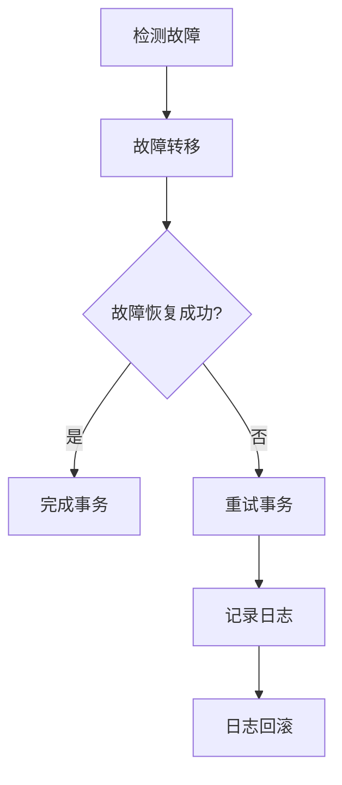

                 

### 文章标题

# 难以驾驭的分布式事务

> 关键词：分布式事务、一致性模型、两阶段提交、三阶段提交、故障处理、性能优化、未来趋势

> 摘要：本文详细探讨了分布式事务的核心概念、常见解决方案、故障处理策略、实际应用案例、性能优化方法以及未来发展趋势。通过深入分析和具体实例，本文旨在帮助读者全面理解分布式事务的复杂性和挑战，并掌握有效的应对策略。

----------------------------------------------------------------

### 第一部分：分布式事务概述

#### 第1章：分布式系统的挑战与分布式事务

##### 1.1 分布式系统的基本概念

分布式系统是由多个独立计算机节点组成的系统，这些节点通过网络互联，共同协作完成任务。分布式系统的主要特点是资源共享、任务分担、动态扩展和高可用性。

在分布式系统中，各个节点拥有独立的主机和操作系统，它们之间通过网络进行通信。与集中式系统不同，分布式系统中的计算任务可以分散到多个节点上，从而提高系统的整体性能和容错能力。

##### 1.2 分布式事务的定义与重要性

分布式事务是在分布式系统中执行的一系列操作，这些操作要么全部成功，要么全部失败。分布式事务的重要性体现在以下几个方面：

1. **数据一致性**：分布式事务确保了系统在执行多个操作时，数据能够保持一致。在分布式环境中，数据可能分布在不同的节点上，分布式事务能够保证这些数据在操作执行后仍然一致。
   
2. **业务完整性**：许多业务操作需要多个数据项的更新，例如电商系统中的订单处理。分布式事务确保了这些操作能够按预期执行，从而保证业务的完整性。

3. **容错能力**：分布式事务通过在多个节点上执行操作，提高了系统的容错能力。即使某个节点发生故障，分布式事务也能够保证其他节点的操作正常执行。

##### 1.3 分布式事务的常见问题

分布式事务面临着一系列挑战，主要包括：

1. **数据一致性问题**：在分布式环境中，数据可能由于网络延迟、节点故障等原因导致不一致。
   
2. **分布式事务管理**：分布式事务的管理比单机事务更加复杂，需要考虑多个节点的通信和协调。
   
3. **性能瓶颈**：分布式事务在执行过程中可能产生大量的网络通信，导致性能瓶颈。

接下来，我们将深入探讨分布式事务的核心概念，包括一致性模型、事务隔离级别等，帮助读者更好地理解分布式事务的工作原理。

----------------------------------------------------------------

## 第2章：分布式事务的核心概念

在分布式系统中，分布式事务是实现数据一致性和业务完整性的关键。本章将详细介绍分布式事务的核心概念，包括一致性模型、事务隔离级别等，帮助读者深入理解分布式事务的工作原理。

### 2.1 一致性模型

一致性模型是分布式系统中确保数据一致性的方法。一致性模型主要分为以下几种：

#### 2.1.1 强一致性

强一致性是指分布式系统中的所有数据在任何时候都是一致的。强一致性确保了数据的最终一致性，但通常需要较高的系统开销和较长的响应时间。

**特点**：

- 所有操作都必须在所有节点上成功才能提交。
- 一致性保证较高。
- 适用于对一致性要求较高的场景，如金融系统。

**应用场景**：

- 高价值交易的金融系统。
- 对一致性要求极高的企业级应用。

#### 2.1.2 最终一致性

最终一致性是指分布式系统中的数据在一段时间后最终会达到一致。最终一致性允许一定的延迟和局部不一致性，但最终会收敛到一致状态。

**特点**：

- 操作可以在某些节点上成功，而其他节点暂时不一致。
- 系统开销较低，响应时间较快。
- 适用于对一致性要求较低的场景，如社交媒体。

**应用场景**：

- 社交媒体平台。
- 高并发、对一致性要求不高的应用。

#### 2.1.3 一致性模型比较

强一致性和最终一致性各有优缺点，具体选择取决于应用场景。

**强一致性**：

- 优点：确保数据最终一致性，一致性保证较高。
- 缺点：系统开销较大，响应时间较长。

**最终一致性**：

- 优点：系统开销较低，响应时间较快。
- 缺点：允许一定的延迟和局部不一致性。

### 2.2 事务隔离级别

事务隔离级别是分布式事务中确保数据一致性的重要手段。事务隔离级别主要分为以下几种：

#### 2.2.1 读未提交

读未提交（Read Uncommitted）是最低的事务隔离级别，允许事务读取未提交的数据。

**特点**：

- 数据读操作不隔离，可能读取到未提交的数据。
- 一致性保证较低。

**应用场景**：

- 对一致性要求极低的应用。

#### 2.2.2 读已提交

读已提交（Read Committed）要求事务读取的数据必须是已提交的数据。

**特点**：

- 数据读操作隔离，但无法解决“不可重复读”问题。

**应用场景**：

- 对一致性要求较低的应用。

#### 2.2.3 可重复读

可重复读（Repeatable Read）要求事务在执行过程中，重复读取同一数据时，结果是一致的。

**特点**：

- 解决了“不可重复读”问题，但无法解决“脏读”问题。

**应用场景**：

- 对一致性要求较高的应用。

#### 2.2.4 串行化

串行化（Serializable）是最高的事务隔离级别，要求事务按照顺序执行，确保数据的完全一致性。

**特点**：

- 数据一致性保证最高。
- 系统开销最大，响应时间最长。

**应用场景**：

- 对一致性要求极高的应用。

通过以上介绍，读者可以更好地理解分布式事务的核心概念，为后续章节的学习打下基础。

----------------------------------------------------------------

### 第3章：分布式事务解决方案

在分布式系统中，分布式事务的实现是一个复杂而关键的任务。本章将介绍几种常见的分布式事务解决方案，包括两阶段提交协议、三阶段提交协议以及基于日志的解决方案，帮助读者了解不同解决方案的原理、优缺点和应用场景。

#### 3.1 两阶段提交协议

两阶段提交（2PC，Two-Phase Commit）协议是分布式系统中常用的事务管理协议。2PC协议将事务提交过程分为两个阶段：准备阶段和提交阶段。

##### 3.1.1 两阶段提交协议的原理

两阶段提交协议的原理如下：

1. **准备阶段**：
   - 事务协调者向所有参与者发送预备请求（Prepare Request）。
   - 参与者收到预备请求后，对事务进行验证，如果验证通过，则将事务数据写入日志，但不对数据库进行修改。

2. **提交阶段**：
   - 事务协调者向所有参与者发送提交请求（Commit Request）。
   - 参与者收到提交请求后，根据之前的验证结果进行决策：
     - 如果参与者验证通过，则将事务数据提交到数据库，并回复事务协调者。
     - 如果参与者验证未通过，则将事务数据回滚，并回复事务协调者。

##### 3.1.2 两阶段提交协议的优缺点

**优点**：

- 简单易实现。
- 能够确保事务的原子性和一致性。

**缺点**：

- 通信次数较多，性能较差。
- 可能发生协调者单点故障。

##### 3.1.3 两阶段提交协议的应用场景

- 对一致性要求较高的分布式系统。
- 部分参与者可以容忍延迟和故障的场景。

#### 3.2 三阶段提交协议

三阶段提交（3PC，Three-Phase Commit）协议是对两阶段提交协议的改进，旨在解决协调者单点故障问题。

##### 3.2.1 三阶段提交协议的原理

三阶段提交协议的原理如下：

1. **注册阶段**：
   - 事务协调者向所有参与者发送注册请求（Register Request）。
   - 参与者收到注册请求后，进行注册，并将事务数据写入日志。

2. **准备阶段**：
   - 事务协调者向所有参与者发送预备请求（Prepare Request）。
   - 参与者收到预备请求后，对事务进行验证，如果验证通过，则将事务数据提交到数据库。

3. **提交阶段**：
   - 事务协调者向所有参与者发送提交请求（Commit Request）。
   - 参与者收到提交请求后，根据之前的验证结果进行决策：
     - 如果参与者验证通过，则将事务数据提交到数据库，并回复事务协调者。
     - 如果参与者验证未通过，则将事务数据回滚，并回复事务协调者。

##### 3.2.2 三阶段提交协议的优缺点

**优点**：

- 解决了协调者单点故障问题。
- 通信次数相对较少。

**缺点**：

- 实现较为复杂。
- 性能较差。

##### 3.2.3 三阶段提交协议的应用场景

- 对一致性要求较高的分布式系统。
- 需要解决协调者单点故障问题的场景。

#### 3.3 基于日志的解决方案

基于日志的解决方案利用日志来记录分布式事务的操作，从而实现分布式事务的管理。这种解决方案通过日志的持久化和复制来保证数据的一致性。

##### 3.3.1 日志的作用

日志在分布式事务中的作用包括：

- 记录事务操作：日志记录了事务的每一步操作，包括读取和写入数据。
- 数据恢复：在发生故障时，通过日志可以恢复事务的执行状态。

##### 3.3.2 日志复制机制

日志复制机制包括以下步骤：

1. **日志记录**：事务执行过程中，将操作记录到本地日志中。
2. **日志持久化**：将日志写入磁盘，确保数据不会丢失。
3. **日志复制**：将日志复制到其他节点，确保其他节点也具有相同的日志。

##### 3.3.3 基于日志的分布式事务实现

基于日志的分布式事务实现主要包括以下步骤：

1. **日志初始化**：初始化日志，记录事务开始。
2. **日志记录**：执行事务操作，记录到日志。
3. **日志提交**：在事务成功后，将日志提交到数据库。
4. **日志恢复**：在发生故障时，根据日志恢复事务执行状态。

##### 3.3.4 基于日志的分布式事务优缺点

**优点**：

- 灵活性高，可以支持多种一致性模型。
- 系统容错性强，通过日志可以实现故障恢复。

**缺点**：

- 日志存储和管理开销较大。
- 性能可能受到日志复制的影响。

##### 3.3.5 基于日志的分布式事务应用场景

- 对一致性要求较高的分布式系统。
- 需要高可靠性和故障恢复能力的场景。

通过以上介绍，读者可以了解分布式事务的常见解决方案及其原理、优缺点和应用场景。这些解决方案为分布式系统的设计和实现提供了重要的参考。

----------------------------------------------------------------

### 第4章：分布式事务的故障处理

在分布式系统中，故障是不可避免的。本章将介绍分布式事务的故障处理策略，包括故障类型、故障恢复机制和数据恢复策略，帮助读者理解如何在分布式事务中处理故障。

#### 4.1 故障类型与影响

分布式系统中的故障主要分为以下几类：

1. **节点故障**：节点故障是指分布式系统中的某个节点发生故障，导致无法正常工作。节点故障可能由硬件故障、软件故障等原因引起。

2. **网络故障**：网络故障是指分布式系统中的网络连接出现故障，导致节点之间无法正常通信。网络故障可能由网络延迟、网络中断等原因引起。

3. **数据库故障**：数据库故障是指分布式系统中的数据库发生故障，导致无法正常读写数据。数据库故障可能由磁盘故障、数据库软件故障等原因引起。

节点故障、网络故障和数据库故障对分布式事务的影响如下：

1. **节点故障**：节点故障可能导致分布式事务的执行中断，事务无法继续执行。在节点故障发生时，分布式事务的管理系统需要采取措施，如故障转移或重新分配任务。

2. **网络故障**：网络故障可能导致分布式事务的通信中断，事务协调者无法与参与者进行通信。在发生网络故障时，分布式事务的管理系统需要采取措施，如重试通信或切换网络路径。

3. **数据库故障**：数据库故障可能导致分布式事务的执行失败，事务无法提交。在数据库故障发生时，分布式事务的管理系统需要采取措施，如数据恢复或重试事务。

#### 4.2 故障恢复机制

分布式系统的故障恢复机制主要包括以下几类：

1. **故障检测**：分布式系统需要定期检测节点的状态，以检测故障的发生。故障检测可以通过心跳机制、健康检查等方式实现。

2. **故障转移**：在分布式系统中，当某个节点发生故障时，系统需要将任务转移到其他正常节点上，以确保事务的继续执行。故障转移可以通过主从架构、副本选举等方式实现。

3. **故障恢复**：在分布式系统中，当事务执行过程中发生故障时，系统需要采取措施恢复事务的状态，以确保事务的最终一致性。故障恢复可以通过日志回滚、重试事务等方式实现。

#### 4.2.1 失效检测

失效检测是分布式系统故障处理的第一步。失效检测可以通过以下几种方式实现：

1. **心跳机制**：分布式系统中的节点通过定期发送心跳消息来检测其他节点的状态。如果某个节点在规定的时间内未收到心跳消息，则认为该节点失效。

2. **健康检查**：分布式系统可以通过定期执行健康检查来检测节点的状态。健康检查可以包括节点是否能够正常响应、节点是否能够访问数据库等。

#### 4.2.2 集群管理

集群管理是分布式系统故障处理的重要环节。集群管理主要包括以下几种策略：

1. **主从架构**：在主从架构中，主节点负责事务的协调和执行，从节点负责数据的复制和备份。当主节点发生故障时，系统可以通过副本选举的方式将主节点转移到从节点上。

2. **副本选举**：在分布式系统中，副本选举是一种通过选票机制选择新的主节点的方式。副本选举可以通过一致性算法、领导者选举算法等方式实现。

#### 4.2.3 数据恢复策略

数据恢复策略是在分布式事务发生故障时，系统需要采取的措施，以确保事务的最终一致性。数据恢复策略主要包括以下几种：

1. **日志回滚**：日志回滚是通过回滚事务的执行，将事务的状态恢复到故障发生前的状态。日志回滚可以通过读取日志，撤销事务的操作来实现。

2. **重试事务**：重试事务是通过重新执行事务，以恢复事务的执行。在重试事务过程中，系统需要确保事务的一致性和隔离性。

#### 4.2.4 数据恢复策略示例

以下是一个简单的数据恢复策略示例：

1. 当分布式事务发生故障时，系统首先通过日志回滚，将事务的状态恢复到故障发生前的状态。

2. 如果日志回滚无法恢复事务的状态，系统则尝试重试事务。在重试事务过程中，系统需要确保事务的一致性和隔离性。

通过以上故障处理策略，分布式系统可以有效地处理故障，确保事务的最终一致性。

### 第5章：分布式事务在实际项目中的应用

分布式事务在许多实际项目中具有重要意义，尤其是在需要高可用性、高性能和高一致性的场景中。本章将通过几个具体案例，分析分布式事务在实际项目中的应用，帮助读者更好地理解分布式事务的实现和挑战。

#### 5.1 应用场景概述

分布式事务的应用场景主要包括：

1. **电商系统**：在电商系统中，订单处理、库存管理、支付系统等模块都需要分布式事务的支持，以确保数据的一致性和业务的完整性。

2. **在线支付系统**：在线支付系统需要处理大量并发请求，分布式事务确保了资金流动的准确性和一致性。

3. **社交网络系统**：在社交网络系统中，用户关系、内容发布、消息推送等操作需要分布式事务的支持，以保证数据的完整性和一致性。

#### 5.2 案例分析

以下将分别分析电商系统、在线支付系统和社交网络系统中的分布式事务应用案例。

##### 5.2.1 电商系统

电商系统中的分布式事务应用主要包括以下几个方面：

1. **订单处理**：在订单处理过程中，分布式事务确保了库存扣减、订单生成和支付处理的一致性。例如，当用户下单时，系统需要同时扣减库存和生成订单，如果其中一个操作失败，则整个事务需要回滚，以保证数据的一致性。

2. **支付处理**：支付处理过程中，分布式事务确保了订单状态和支付状态的一致性。例如，当用户完成支付时，系统需要将订单状态更新为“已支付”，如果支付失败，则订单状态需要回滚到“待支付”。

3. **库存管理**：在库存管理中，分布式事务确保了库存数据的更新和一致性。例如，当商品库存不足时，系统需要更新库存数据，并在多个节点上保持一致。

##### 5.2.2 在线支付系统

在线支付系统中的分布式事务应用主要包括以下几个方面：

1. **交易一致性**：在线支付系统需要确保交易的一致性，例如，在用户支付过程中，系统需要同时更新订单状态和支付状态，如果其中一个操作失败，则整个事务需要回滚。

2. **资金流动**：在资金流动过程中，分布式事务确保了账户余额的一致性和准确性。例如，当用户支付成功后，系统需要同时更新卖家账户余额和买家账户余额，如果其中一个账户余额更新失败，则整个事务需要回滚。

3. **支付查询**：在支付查询过程中，分布式事务确保了支付记录的一致性和准确性。例如，当用户查询支付记录时，系统需要从多个节点上获取支付记录，并确保记录的一致性。

##### 5.2.3 社交网络系统

社交网络系统中的分布式事务应用主要包括以下几个方面：

1. **用户关系**：在用户关系处理中，分布式事务确保了用户关系的正确性。例如，当用户添加好友时，系统需要同时更新好友列表和关系状态，如果其中一个操作失败，则整个事务需要回滚。

2. **内容发布**：在内容发布过程中，分布式事务确保了内容的一致性和准确性。例如，当用户发布一条动态时，系统需要同时更新用户动态列表和内容存储，如果其中一个操作失败，则整个事务需要回滚。

3. **消息推送**：在消息推送过程中，分布式事务确保了消息的一致性和准确性。例如，当用户接收一条消息时，系统需要同时更新消息状态和消息记录，如果其中一个操作失败，则整个事务需要回滚。

通过以上案例分析，可以看出分布式事务在电商系统、在线支付系统和社交网络系统中的重要性。在实际项目中，分布式事务的实现需要考虑一致性模型、故障处理、性能优化等因素，以确保系统的稳定性和可靠性。

----------------------------------------------------------------

### 第6章：分布式事务的性能优化

在分布式系统中，性能优化是一个关键问题。本章将探讨分布式事务的性能优化策略，包括数据分区、缓存策略和网络优化，帮助读者提高分布式事务的性能和效率。

#### 6.1 性能瓶颈分析

分布式事务的性能瓶颈主要包括以下几个方面：

1. **网络延迟**：分布式事务中的节点之间需要进行通信，网络延迟可能导致事务执行时间延长。
2. **数据库瓶颈**：数据库操作是分布式事务中的核心环节，数据库性能可能成为性能瓶颈。
3. **日志管理**：分布式事务中需要管理日志，日志的存储和复制可能导致性能下降。
4. **并发控制**：分布式事务中的并发控制机制可能影响性能。

#### 6.2 优化策略

以下是一些常见的性能优化策略：

##### 6.2.1 数据分区

数据分区是将数据划分为多个分区，每个分区存储在不同的节点上。数据分区可以提高查询效率和事务处理性能。具体策略如下：

1. **水平分区**：根据数据的不同属性（如时间、用户ID等）将数据划分为多个水平分区。水平分区可以减少查询时需要扫描的数据量，提高查询效率。
2. **垂直分区**：根据数据的访问频率将数据划分为多个垂直分区。高访问频率的数据可以存储在内存中，以提高访问速度。

##### 6.2.2 缓存策略

缓存策略是利用内存缓存来加速数据访问。以下是一些常见的缓存策略：

1. **本地缓存**：在每个节点上设置本地缓存，减少对远程数据的访问。本地缓存可以提高事务的响应时间，减少网络延迟。
2. **分布式缓存**：使用分布式缓存系统（如Redis、Memcached）来存储热点数据。分布式缓存可以提高数据的读写速度，减少数据库压力。
3. **缓存一致性**：确保缓存数据与数据库数据的一致性。可以使用缓存同步、缓存失效时间等技术来保证缓存数据的有效性。

##### 6.2.3 网络优化

网络优化可以减少网络延迟和传输成本，提高分布式事务的性能。以下是一些网络优化策略：

1. **负载均衡**：使用负载均衡器将请求分配到不同的节点上，避免单个节点过载。负载均衡可以提高系统的整体性能和可用性。
2. **网络加速**：使用网络加速技术（如CDN、数据压缩）来减少网络传输时间和带宽消耗。网络加速可以提高数据传输速度，减少事务响应时间。
3. **多路径传输**：使用多路径传输技术，通过多个网络路径同时传输数据，提高数据传输的可靠性和速度。

#### 6.2.4 其他优化策略

除了上述策略外，还有一些其他优化策略，如下：

1. **预编译查询**：预编译查询可以减少查询解析和编译的时间，提高查询性能。
2. **并行处理**：在分布式事务中，可以采用并行处理技术，同时处理多个操作，提高事务执行效率。
3. **资源隔离**：通过资源隔离技术，确保事务在执行过程中不会与其他事务发生冲突，减少资源竞争。

通过以上性能优化策略，分布式事务的性能可以得到显著提高。在实际应用中，可以根据具体场景和需求选择合适的优化策略。

----------------------------------------------------------------

### 第7章：分布式事务的未来趋势与发展方向

随着云计算、大数据和物联网等技术的发展，分布式事务的应用越来越广泛。本章将探讨分布式事务的未来趋势与发展方向，包括一致性协议的演进、新兴技术的应用以及研究热点，帮助读者了解分布式事务的演进方向。

#### 7.1 一致性协议的演进

一致性协议是分布式事务的核心，未来的发展方向将包括以下几方面：

1. **更强一致性**：随着应用场景的多样化，对一致性要求越来越高。未来的一致性协议可能会更加注重提供更强的数据一致性保证，如支持事务的快照隔离级别。

2. **一致性优化**：现有的一致性协议（如两阶段提交、三阶段提交）在性能和可靠性方面存在一定局限性。未来的研究方向可能会集中在优化一致性协议，降低系统开销，提高性能。

3. **混合一致性模型**：结合不同一致性模型的特点，设计出更适合特定应用场景的混合一致性模型。例如，在低延迟和高一致性之间找到平衡点。

#### 7.2 新兴技术的应用

随着新技术的不断发展，分布式事务的应用领域也在不断扩展。以下是一些新兴技术的应用：

1. **区块链**：区块链技术以其去中心化和不可篡改的特性，为分布式事务提供了一种新的解决方案。区块链可以在不需要中心协调者的情况下，实现分布式事务的一致性。

2. **分布式存储**：分布式存储技术（如HDFS、Cassandra）在分布式事务中的应用越来越广泛。分布式存储可以提高数据可靠性和访问速度，适用于大规模数据处理的场景。

3. **容器化与微服务**：容器化（如Docker）和微服务架构（如Spring Cloud）使得分布式系统的构建和维护更加灵活。容器化和微服务可以与分布式事务技术相结合，实现更高效的事务管理。

#### 7.3 研究热点

分布式事务领域的研究热点包括：

1. **分布式事务优化**：如何提高分布式事务的性能和可扩展性是当前的研究热点。研究内容包括分布式数据库优化、分布式缓存优化、分布式事务调度算法等。

2. **一致性保证**：如何在不牺牲性能的前提下，提供更强的数据一致性保证是分布式事务研究的核心问题。研究内容包括分布式一致性协议、分布式一致性算法等。

3. **分布式事务监控与故障检测**：如何实时监控分布式事务的状态，快速检测和恢复故障是当前的研究热点。研究内容包括分布式事务监控技术、故障检测算法等。

通过以上未来趋势与发展方向的探讨，我们可以看到分布式事务在技术演进和应用拓展方面具有巨大的潜力。未来的分布式事务将更加注重性能、可靠性和灵活性，为各类分布式系统提供更强大的支持。

----------------------------------------------------------------

## 结语

本文从分布式事务的概述、核心概念、解决方案、故障处理、实际应用、性能优化以及未来趋势等方面进行了详细探讨，旨在帮助读者全面理解分布式事务的复杂性和挑战，并掌握有效的应对策略。分布式事务是分布式系统中的核心组成部分，其实现和优化对系统的稳定性、可靠性和性能具有重要影响。

在分布式事务的实现过程中，需要关注一致性模型、隔离级别、故障处理、性能优化等多个方面。同时，随着新技术的不断发展，分布式事务也在不断演进，为各类分布式系统提供更加高效和可靠的解决方案。

**作者：AI天才研究院/AI Genius Institute & 禅与计算机程序设计艺术 /Zen And The Art of Computer Programming**。希望本文能够为您的分布式事务研究和实践提供有益的参考和指导。

----------------------------------------------------------------

## 附录

### 完整性保证公式

$$
\begin{aligned}
    &\text{分布式事务的一致性} \\
    &= \text{事务的原子性} \land \text{事务的隔离性} \\
    &= \text{所有操作要么全部成功，要么全部失败}
\end{aligned}
$$

### 事务隔离级别对比表格

| 事务隔离级别  | 读未提交 | 读已提交 | 可重复读 | 串行化 |
|--------------|--------|--------|--------|-------|
| 特点          | 可能读取未提交的数据 | 只读取已提交的数据 | 重复读取同一数据结果一致 | 数据完全一致 |
| 适用场景      | 对一致性要求极低的应用 | 对一致性要求较低的应用 | 对一致性要求较高的应用 | 对一致性要求极高的应用 |

### 分布式事务故障恢复流程图

### 分布式事务性能优化策略

| 策略          | 说明                                                         |
|--------------|------------------------------------------------------------|
| 数据分区     | 将数据划分为多个分区，提高查询效率和事务处理性能。           |
| 缓存策略     | 利用本地缓存和分布式缓存减少数据访问时间，提高系统性能。     |
| 网络优化     | 使用负载均衡、多路径传输等技术提高网络传输效率和可靠性。     |
| 并行处理     | 同时处理多个事务，提高事务执行效率。                       |
| 资源隔离     | 通过资源隔离减少事务间的冲突，提高系统整体性能。             |

通过以上完整性和性能优化的公式、表格和流程图，读者可以更清晰地理解分布式事务的核心概念和优化策略。希望这些附录能够为您的学习和实践提供便利。

