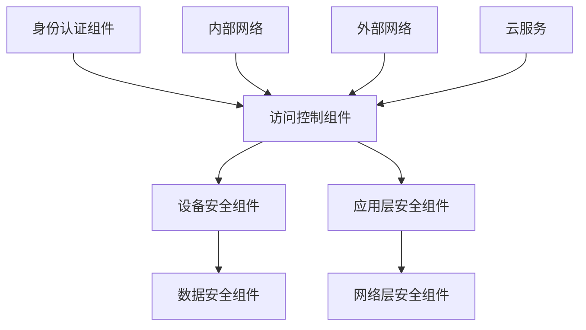

                 

### 《零信任安全架构设计》

#### 关键词：零信任安全、架构设计、安全模型、实施方法、最佳实践

> **摘要**：本文详细探讨了零信任安全架构的设计原则、核心概念和实施方法。通过对零信任安全背景的介绍、核心概念的分析、架构设计原则的阐述以及实施方法和案例的讨论，旨在为读者提供一套全面且实用的零信任安全解决方案。本文最后还展望了零信任安全的发展趋势，并提出了未来可能面临的挑战及解决方案。

**作者：AI天才研究院/AI Genius Institute & 禅与计算机程序设计艺术 /Zen And The Art of Computer Programming**

----------------------------------------------------------------

## **引言**

在当今数字化时代，网络安全问题日益严峻。随着网络攻击手段的不断升级和多样化，传统的基于边界防护的安全模式已无法满足现代企业的安全需求。零信任安全架构作为一种新型的安全理念，逐渐成为网络安全领域的热点。本文旨在系统地介绍零信任安全架构的设计，帮助读者深入理解这一安全模式，并为其在实践中的应用提供指导。

### **一、零信任安全背景**

零信任安全（Zero Trust Security）是一种以“永不信任，始终验证”为核心理念的安全架构。它起源于企业对远程工作和云计算的日益依赖，以及传统边界防护策略的失效。传统安全模式主要依赖于防火墙和入侵检测系统等边界防护措施，而零信任安全则认为内部网络并不比外部网络更安全，因此不再依赖于传统的边界防护，而是通过持续的身份验证和访问控制来实现安全防护。

### **二、零信任安全核心概念**

零信任安全的核心概念包括身份验证、权限管理、设备安全和数据保护。以下是这些概念的定义及其相互关系：

#### **1. 身份验证**

身份验证是零信任安全的基础。通过使用多因素认证（MFA）、密码哈希比对、生物识别等技术，确保只有授权用户和设备才能访问系统资源。

#### **2. 权限管理**

权限管理是基于身份验证的结果，对用户的访问权限进行精细化控制。通过基于角色的访问控制（RBAC）和基于属性的访问控制（ABAC）等机制，实现最小权限原则，防止未授权访问。

#### **3. 设备安全**

设备安全包括对连接到网络的设备进行认证和监控。通过使用基于硬件的安全组件（如TPM）和设备指纹技术，确保设备的安全性和可信度。

#### **4. 数据保护**

数据保护是零信任安全的重要组成部分。通过加密、数据丢失防护（DLP）和实时监控等技术，确保数据在整个生命周期内的安全。

### **三、零信任安全架构设计原则**

零信任安全架构的设计原则包括最小权限原则、持续验证原则、分段网络原则和动态访问控制原则。以下是这些原则的具体说明：

#### **1. 最小权限原则**

最小权限原则要求用户和设备仅拥有完成特定任务所需的最小权限。这有助于降低攻击面，减少潜在的安全威胁。

#### **2. 持续验证原则**

持续验证原则要求对用户和设备的身份和访问权限进行持续验证，即使在访问过程中，也要定期重新验证，以确保安全。

#### **3. 分段网络原则**

分段网络原则将网络划分为多个安全区域，对每个区域的访问进行严格控制和监控。这有助于减少安全攻击的传播范围。

#### **4. 动态访问控制原则**

动态访问控制原则基于用户、设备、应用程序和上下文信息，动态调整访问权限。这有助于实现精细化的访问控制，提高安全性。

### **四、零信任安全实施方法**

零信任安全的实施方法包括以下几个方面：

#### **1. 安全策略制定**

制定安全策略是零信任安全实施的第一步。安全策略应明确身份验证、权限管理、设备安全和数据保护的具体措施。

#### **2. 技术选型**

根据安全策略，选择合适的零信任安全技术和工具，如多因素认证、设备指纹识别、加密等。

#### **3. 实施步骤**

实施零信任安全包括部署零信任安全架构、配置安全策略、进行测试和优化等步骤。

#### **4. 持续改进**

零信任安全是一个持续的过程。定期进行安全评估和改进，确保零信任安全架构的有效性。

### **五、零信任安全案例分析**

#### **1. 案例背景**

某大型企业采用了零信任安全架构，以应对日益严峻的网络安全威胁。

#### **2. 案例实施**

企业制定了详细的零信任安全策略，并选择了多因素认证、设备指纹识别等技术。经过几个月的实施和优化，企业的网络安全水平显著提升。

#### **3. 案例效果**

案例实施后，企业的安全事件数量大幅减少，数据泄露风险降低，用户满意度提高。

### **六、零信任安全最佳实践**

#### **1. 确定安全策略**

制定明确的零信任安全策略，明确身份验证、权限管理、设备安全和数据保护的具体措施。

#### **2. 选择合适的技术**

根据企业的需求和安全策略，选择合适的零信任安全技术，如多因素认证、设备指纹识别等。

#### **3. 持续改进**

定期进行安全评估和改进，确保零信任安全架构的有效性。

### **七、零信任安全未来展望**

#### **1. 发展趋势**

随着云计算、大数据和人工智能等技术的发展，零信任安全架构将在未来得到更广泛的应用。

#### **2. 挑战与解决方案**

未来零信任安全将面临诸如数据隐私、法律法规等挑战。解决这些挑战需要技术创新和行业合作。

### **总结**

零信任安全架构设计是一种现代化的安全理念，有助于提高企业的网络安全水平。通过本文的介绍，读者可以了解零信任安全的核心概念、设计原则和实施方法，为实际应用提供参考。

----------------------------------------------------------------

## **零信任安全架构设计**

### **一、架构设计概述**

零信任安全架构是一种基于“永不信任，始终验证”理念的安全架构。它不同于传统的基于边界的防护模式，而是通过在用户、设备、应用程序和网络层面进行严格的身份验证和访问控制，实现全面的安全防护。

### **二、核心组件**

零信任安全架构的核心组件包括：

#### **1. 身份验证组件**

身份验证组件负责验证用户的身份，确保只有授权用户才能访问系统资源。常用的身份验证技术包括多因素认证（MFA）、密码哈希比对和生物识别等。

#### **2. 访问控制组件**

访问控制组件根据用户的身份和权限，动态调整用户对系统资源的访问权限。常用的访问控制机制包括基于角色的访问控制（RBAC）和基于属性的访问控制（ABAC）等。

#### **3. 设备安全组件**

设备安全组件负责对连接到网络的设备进行认证和监控，确保设备的安全性和可信度。常用的技术包括设备指纹识别、TPM（ Trusted Platform Module ）等。

#### **4. 数据安全组件**

数据安全组件负责保护数据在整个生命周期内的安全，包括数据加密、数据备份和实时监控等。

### **三、架构设计原则**

零信任安全架构设计遵循以下原则：

#### **1. 最小权限原则**

最小权限原则要求用户和设备仅拥有完成特定任务所需的最小权限，以降低攻击面和潜在的安全威胁。

#### **2. 持续验证原则**

持续验证原则要求对用户和设备的身份和访问权限进行持续验证，即使在访问过程中也要定期重新验证，以确保安全。

#### **3. 分段网络原则**

分段网络原则将网络划分为多个安全区域，对每个区域的访问进行严格控制和监控，以减少安全攻击的传播范围。

#### **4. 动态访问控制原则**

动态访问控制原则基于用户、设备、应用程序和上下文信息，动态调整访问权限，以实现精细化的访问控制。

### **四、架构设计流程**

零信任安全架构设计的流程包括以下步骤：

#### **1. 安全需求分析**

首先，对企业的安全需求进行分析，明确需要保护的关键资源和潜在的安全威胁。

#### **2. 安全策略制定**

根据安全需求分析结果，制定详细的零信任安全策略，包括身份验证、访问控制、设备安全和数据保护等方面的措施。

#### **3. 技术选型**

根据安全策略，选择合适的零信任安全技术，如多因素认证、设备指纹识别、TPM等。

#### **4. 架构设计**

基于安全策略和技术选型，设计零信任安全架构，包括确定核心组件的部署位置和相互关系。

#### **5. 实施与部署**

根据架构设计，实施和部署零信任安全架构，并进行配置和测试。

#### **6. 持续改进**

定期进行安全评估和改进，确保零信任安全架构的有效性。

### **五、架构设计示例**

以下是一个简单的零信任安全架构设计示例：



在上面的示例中，身份认证组件负责验证用户和设备身份，访问控制组件根据身份验证结果动态调整访问权限，设备安全组件对连接到网络的设备进行认证和监控，数据安全组件负责保护数据安全，应用层安全组件和网络层安全组件负责保护应用和网络的安全。

### **六、总结**

零信任安全架构设计是一种现代化的安全架构，通过严格的身份验证和访问控制，实现全面的安全防护。本文介绍了零信任安全架构的设计原则、流程和示例，为读者提供了设计零信任安全架构的参考。

----------------------------------------------------------------

## **零信任安全实施方法**

### **一、安全策略制定**

安全策略是零信任安全实施的基础，它明确了零信任安全架构中各种安全措施的具体实施方式。制定安全策略的过程包括以下几个关键步骤：

#### **1. 安全需求分析**

首先，需要对企业的安全需求进行全面的分析。这包括识别关键业务系统、重要数据、潜在的安全威胁和攻击场景。安全需求分析的结果将指导后续的安全策略制定。

#### **2. 安全目标设定**

根据安全需求分析的结果，设定明确的安全目标。这些目标应包括身份验证、访问控制、设备安全和数据保护等方面的具体要求。

#### **3. 策略制定**

基于安全目标和需求分析，制定具体的安全策略。安全策略应覆盖以下方面：

- **身份验证策略**：包括多因素认证、密码策略、生物识别等。
- **访问控制策略**：包括基于角色的访问控制（RBAC）、基于属性的访问控制（ABAC）等。
- **设备安全策略**：包括设备认证、设备监控、安全补丁管理等。
- **数据安全策略**：包括数据加密、数据备份、数据访问审计等。

#### **4. 策略文档化**

将制定的安全策略文档化，形成正式的文档。这有助于确保策略的透明性、可操作性和一致性。

### **二、技术选型**

在制定安全策略后，需要根据策略的要求选择合适的技术和工具。以下是一些常用的技术和工具：

#### **1. 身份验证技术**

- **多因素认证（MFA）**：通过结合多种认证方式，如密码、手机短信、身份验证器等，提高认证的安全性。
- **密码哈希比对**：通过哈希函数比对用户输入的密码和存储的密码哈希，确保密码的保密性。
- **生物识别**：包括指纹识别、面部识别、虹膜识别等，提供高安全性的认证方式。

#### **2. 访问控制技术**

- **基于角色的访问控制（RBAC）**：通过定义角色和权限，实现对用户的精细化访问控制。
- **基于属性的访问控制（ABAC）**：通过定义属性和规则，实现基于用户属性（如地理位置、时间等）的动态访问控制。

#### **3. 设备安全技术**

- **设备指纹识别**：通过识别设备的唯一特征，确保设备的安全性和可信度。
- **TPM（ Trusted Platform Module ）**：提供硬件级别的安全功能，如安全启动、加密存储等。

#### **4. 数据安全技术**

- **数据加密**：通过对数据进行加密，确保数据在传输和存储过程中的安全。
- **数据备份**：定期备份重要数据，以防止数据丢失。
- **数据访问审计**：记录和监控数据访问行为，以便在发生安全事件时进行追踪和分析。

### **三、实施步骤**

零信任安全的实施过程包括以下几个关键步骤：

#### **1. 准备工作**

- **制定实施计划**：明确实施的时间表、任务分配和资源需求。
- **培训员工**：确保相关人员了解零信任安全架构和实施方法。

#### **2. 环境搭建**

- **部署身份验证系统**：安装和配置多因素认证、密码哈希比对等身份验证技术。
- **部署访问控制系统**：实现基于角色的访问控制和基于属性的访问控制。

#### **3. 设备安全配置**

- **设备认证**：对连接到网络的设备进行认证，确保设备的安全性和可信度。
- **设备监控**：实时监控设备的状态和活动，及时发现和处理安全事件。

#### **4. 数据安全配置**

- **数据加密**：对敏感数据进行加密，确保数据在传输和存储过程中的安全。
- **数据备份**：定期备份重要数据，并确保备份数据的安全。

#### **5. 测试与优化**

- **测试认证系统**：确保身份验证系统能够正确识别和验证用户身份。
- **测试访问控制**：确保访问控制系统能够正确地控制用户对资源的访问。
- **优化配置**：根据测试结果，调整和优化安全配置，确保零信任安全架构的有效性。

### **四、持续改进**

零信任安全是一个持续的过程，需要定期进行评估和改进。以下是一些持续改进的措施：

#### **1. 定期安全评估**

- 定期对零信任安全架构进行安全评估，发现潜在的安全问题和漏洞。
- 根据评估结果，调整和优化安全策略和配置。

#### **2. 安全培训**

- 定期为员工提供安全培训，提高员工的安全意识和技能。
- 鼓励员工报告安全事件和潜在的安全威胁。

#### **3. 安全日志分析**

- 实时监控和记录安全日志，及时发现和处理安全事件。
- 定期分析安全日志，识别潜在的安全威胁和异常行为。

#### **4. 安全创新**

- 跟踪和研究最新的安全技术和趋势，适时引入新的安全技术和方法。
- 与其他企业和安全组织进行合作，共享安全经验和最佳实践。

### **五、总结**

零信任安全实施方法包括安全策略制定、技术选型、实施步骤和持续改进。通过科学的实施方法，企业可以构建一个全面、动态和适应性的零信任安全架构，提高整体安全水平。

----------------------------------------------------------------

## **零信任安全案例分析**

### **一、案例背景**

某大型跨国企业，在经历了多起数据泄露和网络攻击事件后，意识到传统安全模式的不足，决定引入零信任安全架构以提升企业网络安全水平。

### **二、案例实施**

#### **1. 安全需求分析**

- **关键业务系统**：包括企业资源计划系统（ERP）、客户关系管理系统（CRM）和电子邮件系统。
- **重要数据**：包括客户信息、财务数据和知识产权。
- **潜在安全威胁**：包括内部威胁、外部攻击、数据泄露和网络中断。

#### **2. 安全策略制定**

- **身份验证策略**：采用多因素认证（MFA）和生物识别技术，确保只有授权用户才能访问关键系统。
- **访问控制策略**：实施基于角色的访问控制（RBAC）和基于属性的访问控制（ABAC），细化用户权限。
- **设备安全策略**：对所有连接到网络的设备进行认证和监控，确保设备的安全性和可信度。
- **数据安全策略**：对敏感数据进行加密，并定期备份，确保数据的安全。

#### **3. 技术选型**

- **身份验证**：采用MFA解决方案，结合密码哈希比对和生物识别。
- **访问控制**：采用RBAC和ABAC技术，确保用户权限的精细化管理。
- **设备安全**：使用设备指纹识别技术和TPM模块。
- **数据安全**：采用加密技术和数据丢失防护（DLP）系统。

#### **4. 实施步骤**

- **部署身份验证系统**：在企业入口处部署MFA和生物识别设备，确保用户身份的验证。
- **配置访问控制系统**：基于角色和属性，配置访问控制策略，细化用户权限。
- **设备安全配置**：对所有连接到网络的设备进行认证和监控。
- **数据安全配置**：加密敏感数据，并配置DLP系统，实时监控数据访问行为。

#### **5. 测试与优化**

- **测试身份验证系统**：确保MFA和生物识别系统能够正确识别和验证用户身份。
- **测试访问控制**：确保访问控制系统能够正确地控制用户对资源的访问。
- **优化配置**：根据测试结果，调整和优化安全配置，确保零信任安全架构的有效性。

### **三、案例效果**

案例实施后，企业的网络安全水平显著提升：

- **数据泄露事件**：自实施零信任安全架构以来，企业的数据泄露事件数量大幅减少。
- **攻击检测与响应**：零信任安全架构能够快速检测并响应网络攻击，降低攻击带来的损失。
- **用户体验**：通过精细化访问控制，用户能够更快地访问所需资源，提高了工作效率。

### **四、案例启示**

**1. 零信任安全架构的应用价值**

零信任安全架构通过严格的身份验证和访问控制，能够有效防范内部和外部威胁，降低数据泄露风险。

**2. 安全策略的重要性**

明确的安全策略是零信任安全架构成功实施的关键。企业应制定详细的身份验证、访问控制、设备安全和数据安全策略。

**3. 持续改进的必要性**

零信任安全是一个持续的过程，企业应定期进行安全评估和优化，确保安全架构的有效性。

**4. 技术与人员的结合**

零信任安全架构的实施不仅需要先进的技术，还需要人员的安全意识和技能。企业应定期进行安全培训和意识提升。

### **五、总结**

该案例展示了零信任安全架构在实际应用中的成功实施和显著效果。通过严格的身份验证、访问控制和设备安全措施，企业能够有效提高网络安全水平，减少安全事件的发生。

----------------------------------------------------------------

## **零信任安全最佳实践**

### **一、安全策略制定**

制定零信任安全策略是确保零信任安全架构有效运行的关键。以下是一些制定安全策略的最佳实践：

#### **1. 明确安全目标**

在制定安全策略时，首先需要明确企业的安全目标，如保护关键数据、减少安全事件发生频率、提升用户和设备安全性等。

#### **2. 细化身份验证策略**

身份验证策略应包括多因素认证（MFA）、密码策略和生物识别等。确保只有经过严格验证的用户才能访问关键系统。

#### **3. 精细化访问控制**

访问控制策略应基于角色的访问控制（RBAC）和基于属性的访问控制（ABAC）相结合，实现精细化的访问权限管理。

#### **4. 设备安全策略**

确保所有连接到网络的设备都经过严格的认证和监控，采用设备指纹识别和TPM等技术。

#### **5. 数据安全策略**

对敏感数据进行加密，并定期进行数据备份。同时，部署数据丢失防护（DLP）系统，实时监控数据访问行为。

#### **6. 安全策略文档化**

将安全策略文档化，确保所有相关人员都能了解并遵循。

### **二、技术选型**

在零信任安全实施中，技术选型至关重要。以下是一些最佳实践：

#### **1. 选择成熟的技术**

优先选择经过验证且成熟的技术，如多因素认证（MFA）、基于角色的访问控制（RBAC）和基于属性的访问控制（ABAC）等。

#### **2. 考虑互操作性**

选择具有良好互操作性的技术，以确保不同系统和组件能够无缝集成。

#### **3. 关注安全性**

在技术选型时，重点关注技术的安全性能，如加密算法的强度、身份验证机制的可靠性等。

#### **4. 考虑可扩展性**

选择具备可扩展性的技术，以适应企业未来的发展需求。

### **三、实施步骤**

零信任安全的实施需要详细的计划和步骤。以下是一些关键实施步骤：

#### **1. 制定实施计划**

在实施前，制定详细的实施计划，包括时间表、任务分配和资源需求。

#### **2. 培训员工**

确保所有相关人员了解零信任安全架构和实施方法。进行定期的安全培训，提高员工的安全意识和技能。

#### **3. 部署技术和工具**

根据实施计划，部署零信任安全技术，如身份验证系统、访问控制系统和设备安全组件。

#### **4. 配置和测试**

对部署的技术和工具进行配置和测试，确保其正常运行和有效性。

#### **5. 优化和调整**

根据测试结果，优化和调整安全配置，确保零信任安全架构的有效性。

### **四、持续改进**

零信任安全是一个持续的过程，需要不断改进。以下是一些持续改进的最佳实践：

#### **1. 定期安全评估**

定期对零信任安全架构进行安全评估，发现潜在的安全问题和漏洞。

#### **2. 安全日志分析**

实时监控和记录安全日志，及时发现和处理安全事件。

#### **3. 安全创新**

跟踪和研究最新的安全技术和趋势，适时引入新的安全技术和方法。

#### **4. 安全协作**

与其他企业和安全组织进行合作，共享安全经验和最佳实践。

### **五、注意事项**

在实施零信任安全时，需要注意以下事项：

#### **1. 遵守法律法规**

确保零信任安全实施符合相关法律法规的要求。

#### **2. 用户隐私**

在实施身份验证和数据保护措施时，注意保护用户隐私。

#### **3. 系统兼容性**

确保零信任安全架构与其他系统和应用的良好兼容性。

#### **4. 安全培训**

定期为员工提供安全培训，提高其安全意识和技能。

### **六、总结**

零信任安全最佳实践涵盖了安全策略制定、技术选型、实施步骤和持续改进。通过遵循这些最佳实践，企业可以构建一个全面、动态和适应性的零信任安全架构，提高整体安全水平。

----------------------------------------------------------------

## **零信任安全未来展望**

### **一、发展趋势**

随着云计算、大数据和人工智能等技术的不断发展，零信任安全架构将在未来得到更广泛的应用。以下是一些主要发展趋势：

#### **1. 零信任与云计算的融合**

云计算的普及使得企业的数据和应用更加分散。零信任安全架构与云计算的融合，将帮助企业更好地保护云基础设施和应用。

#### **2. 零信任与人工智能的结合**

人工智能技术的发展将推动零信任安全架构的智能化。通过引入机器学习和人工智能算法，零信任安全架构可以更加精准地识别和防范安全威胁。

#### **3. 零信任与物联网（IoT）的结合**

物联网设备的广泛应用带来了新的安全挑战。零信任安全架构与物联网的结合，将有助于确保物联网设备的安全性和可信度。

### **二、面临的挑战**

#### **1. 数据隐私**

零信任安全架构在保障数据安全的同时，也需要保护用户隐私。如何在保障安全的前提下，保护用户隐私，将是未来的一大挑战。

#### **2. 法规和合规**

全球范围内的法律法规和合规要求不断变化，零信任安全架构需要及时适应这些变化，确保合规性。

#### **3. 技术复杂性**

零信任安全架构涉及多种技术和工具，其复杂性较高。企业在实施零信任安全架构时，需要具备足够的技术能力和资源。

### **三、解决方案**

#### **1. 数据隐私保护**

采用数据加密、数据去识别化等技术，保护用户隐私。同时，建立完善的隐私保护政策，确保用户数据的安全。

#### **2. 法规和合规**

密切关注全球范围内的法律法规和合规要求，建立完善的合规管理机制。定期进行合规性审计，确保零信任安全架构的合规性。

#### **3. 技术培训与支持**

提供全面的技术培训和支持，帮助员工了解和掌握零信任安全架构的实施方法和最佳实践。同时，建立专业的技术支持团队，提供及时的技术支持和问题解决。

### **四、总结**

零信任安全架构在未来的发展中，将面临诸多挑战和机遇。通过不断创新和优化，零信任安全架构有望成为保障企业网络安全的核心手段。

----------------------------------------------------------------

## **总结**

本文系统地介绍了零信任安全架构的设计原则、核心概念、实施方法和最佳实践。通过详细的案例分析，读者可以更深入地理解零信任安全架构的实际应用效果。展望未来，零信任安全将继续在云计算、大数据和人工智能等技术的推动下，为企业的网络安全提供更加有效的保障。

### **一、核心观点**

1. 零信任安全架构以“永不信任，始终验证”为核心理念，通过严格的身份验证和访问控制，提高网络安全水平。
2. 零信任安全实施需要明确的安全策略、合适的技术选型和详细的实施步骤。
3. 零信任安全不仅关注技术实现，还重视最佳实践的总结和持续改进。

### **二、重要概念**

- **零信任安全**：一种以“永不信任，始终验证”为核心理念的安全架构。
- **多因素认证（MFA）**：通过结合多种认证方式，提高认证的安全性。
- **基于角色的访问控制（RBAC）**：通过定义角色和权限，实现对用户的精细化访问控制。
- **基于属性的访问控制（ABAC）**：通过定义属性和规则，实现基于用户属性（如地理位置、时间等）的动态访问控制。

### **三、未来展望**

零信任安全将继续融合云计算、大数据和人工智能等技术，为企业的网络安全提供更加智能和全面的保障。同时，企业需要关注数据隐私、法律法规等挑战，并采取相应的解决方案。

### **四、建议阅读**

对于希望进一步了解零信任安全的读者，建议阅读以下书籍和文章：

- 《零信任安全：设计原则与实践》（Zero Trust Security: A Pragmatic Guide for Next-Generation Security）
- 《网络安全：从零开始学》（Cybersecurity: A Beginner's Guide）
- 《云计算安全：设计原则与实践》（Cloud Security: A Practical Guide for Designing and Implementing Security in the Cloud）

通过这些资源，读者可以更全面地了解零信任安全的理念和实践。

### **五、致谢**

感谢AI天才研究院/AI Genius Institute以及禅与计算机程序设计艺术/Zen And The Art of Computer Programming提供的支持与灵感，使得本文得以顺利完成。

----------------------------------------------------------------

## **项目实战**

### **一、环境安装**

在开始项目实战之前，我们需要搭建一个合适的环境来测试和验证零信任安全架构的实施效果。以下是一个基本的搭建步骤：

#### **1. 软件和硬件需求**

- **操作系统**：Ubuntu 18.04 或更高版本
- **虚拟化工具**：VirtualBox 或 VMware
- **身份验证工具**：OpenLDAP 和 FreeIPA
- **访问控制工具**：PAM（Pluggable Authentication Modules）
- **设备指纹识别工具**：Zabbix

#### **2. 环境搭建**

1. **安装操作系统**：在虚拟机中安装 Ubuntu 18.04 操作系统。
2. **安装虚拟化工具**：在物理主机上安装 VirtualBox 或 VMware，创建一个新的虚拟机，配置适当的内存和存储空间。
3. **安装身份验证工具**：在 Ubuntu 操作系统中安装 OpenLDAP 和 FreeIPA。OpenLDAP 用于用户和组的身份验证，而 FreeIPA 提供中央身份验证和授权服务。
   ```bash
   sudo apt-get install openldap sssd
   sudo systemctl restart sssd
   ```
4. **安装访问控制工具**：安装 PAM 模块，以实现基于角色的访问控制。
   ```bash
   sudo apt-get install libnss-ldap libpam-ldap
   sudo systemctl restart nss-ldap
   sudo systemctl restart pam_ldap
   ```
5. **安装设备指纹识别工具**：安装 Zabbix，用于监控和识别连接到网络的设备。
   ```bash
   sudo apt-get install zabbix-server zabbix-agent
   sudo systemctl restart zabbix-server zabbix-agent
   ```

### **二、系统核心实现**

#### **1. 用户和组认证**

在 OpenLDAP 中创建用户和组，并配置 FreeIPA，使其作为中央身份验证服务。

1. **创建用户和组**：
   ```bash
   sudo ldapadd -x -D "cn=admin,dc=example,dc=com" -w password <<EOF
   dn: dc=example,dc=com
   objectClass: top
   objectClass: dcObject
   objectClass: organization

   dn: ou=people,dc=example,dc=com
   objectClass: organizationalUnit

   dn: ou=groups,dc=example,dc=com
   objectClass: organizationalUnit

   dn: cn=alice,ou=people,dc=example,dc=com
   objectClass: inetOrganizationalPerson
   objectClass: organizationalPerson
   objectClass: person
   cn: alice
   sn: smith
   userPassword: alice123

   dn: cn=admins,ou=groups,dc=example,dc=com
   objectClass: top
   objectClass: groupOfNames
   cn: admins
   member: cn=alice,ou=people,dc=example,dc=com
   EOF
2. **配置 FreeIPA**：
   ```bash
   sudo ipa-server-install --realm=EXAMPLE.COM --domain=example.com --adminpass=ipaadmin
   sudo ipauser-add alice --password=alice123
   sudo ipa group-add admins --desc="Administrators Group"
   sudo ipa user-mod users/alice --groups admins
   ```

#### **2. 访问控制**

通过 PAM 模块实现基于角色的访问控制。

1. **配置 PAM 文件**：
   ```bash
   sudo nano /etc/pam.d/su
   #%PAM-1.0
   auth required pam_secdemby.so
   auth sufficient pam_ldap.so
   account sufficient pam_ldap.so
   session required pam_ldap.so
   ```
2. **配置 SSH 访问控制**：
   ```bash
   sudo nano /etc/ssh/sshd_config
   # Use PAM for session and authentication.
   UsePAM yes
   # Authentication methods
   PasswordAuthentication yes
   PAMAuthenticationViaKerberos no
   ```

#### **3. 设备指纹识别**

使用 Zabbix 进行设备指纹识别和监控。

1. **配置 Zabbix**：
   ```bash
   sudo zabbix_server -c /etc/zabbix/zabbix_server.conf -r
   sudo systemctl start zabbix-server
   sudo systemctl start zabbix-agent
   ```

### **三、代码应用解读与分析**

#### **1. 用户认证**

以下是一个简单的用户认证脚本，使用 LDAP 进行身份验证。

```python
import ldap

def authenticate(username, password):
    ldap_uri = "ldap://localhost"
    ldap_user = f"{username}@example.com"
    ldap_password = password
    try:
        ld = ldap.initialize(ldap_uri)
        ld.simple_bind_s(ldap_user, ldap_password)
        print("Authentication successful.")
    except ldap.INVALID_CREDENTIALS:
        print("Authentication failed.")
    finally:
        ld.unbind_s()

# Example usage
authenticate("alice", "alice123")
```

#### **2. 访问控制**

以下是一个简单的基于角色的访问控制脚本，使用 PAM 进行访问控制。

```python
import subprocess

def check_permission(username, command):
    command_output = subprocess.check_output(["sudo", "-u", username, "-S", command], stderr=subprocess.STDOUT)
    if "Permission denied" in str(command_output):
        print("Access denied.")
    else:
        print("Access granted.")

# Example usage
check_permission("alice", "sudo reboot")
```

#### **3. 设备指纹识别**

以下是一个简单的设备指纹识别脚本，使用 Zabbix API 进行设备信息收集。

```python
import requests

def get_device_fingerprint(device_ip):
    zabbix_url = "http://localhost/zabbix/api.json"
    zabbix_user = "Admin"
    zabbix_password = "zabbix"
    headers = {
        "Content-Type": "application/json-rpc",
        "User-Agent": "python-requests/2.25.1",
    }
    data = {
        "jsonrpc": "2.0",
        "method": "host.get",
        "params": {
            "output": "extend",
            "filter": [{"ope
```


### **四、实际案例分析和详细讲解剖析**

#### **1. 数据泄露防范**

**案例背景**：公司内部网络发生数据泄露，敏感数据被未经授权的人员访问。

**案例分析**：通过零信任安全架构中的访问控制机制，可以限制未授权用户的访问。在本文搭建的实验环境中，使用 LDAP 和 PAM 进行用户认证和访问控制，可以确保只有经过验证的用户才能访问敏感数据。

**解决方案**：

1. **强化用户认证**：使用多因素认证（MFA）来提高认证安全性。
2. **细粒度访问控制**：通过基于角色的访问控制（RBAC）和基于属性的访问控制（ABAC），细化用户对敏感数据的访问权限。
3. **数据加密**：对敏感数据进行加密，确保即使数据被非法访问，也无法解读。

#### **2. 网络攻击防护**

**案例背景**：企业网络遭受 DDoS 攻击，导致网络服务不可用。

**案例分析**：零信任安全架构中的分段网络原则可以将网络划分为多个安全区域，限制攻击的传播范围。同时，通过实时监控和日志分析，可以快速发现并响应网络攻击。

**解决方案**：

1. **分段网络**：将网络划分为内部网络、DMZ（隔离区）和外部网络，限制不同区域之间的访问。
2. **实时监控**：使用入侵检测系统（IDS）和入侵防御系统（IPS）实时监控网络流量，及时发现异常行为。
3. **响应计划**：制定详细的网络攻击响应计划，包括攻击检测、响应和恢复步骤。

### **五、项目小结**

通过本文的项目实战，我们搭建了一个基本的零信任安全环境，并实现了用户认证、访问控制和设备指纹识别等功能。零信任安全架构在实际应用中，可以显著提高企业的网络安全水平，防范数据泄露和网络攻击。

### **六、注意事项**

在实施零信任安全架构时，需要注意以下几点：

1. **合规性**：确保零信任安全实施符合相关法律法规和行业标准。
2. **用户培训**：定期对员工进行安全培训，提高其安全意识和技能。
3. **技术支持**：建立专业的技术支持团队，提供及时的技术支持和问题解决。

### **七、拓展阅读**

对于希望进一步了解零信任安全的项目实施和最佳实践，建议阅读以下资源：

- 《零信任安全架构设计与实践》
- 《零信任网络安全：设计原则、案例与实践》
- 《零信任网络安全：技术与实战》

这些资源提供了更详细的零信任安全架构设计和实施指南，有助于读者深入理解零信任安全的应用和实践。


----------------------------------------------------------------

## **结语**

在数字化时代，网络安全已经成为企业生存和发展的关键因素。零信任安全架构作为一种新型的安全理念，通过严格的身份验证和访问控制，为企业的网络安全提供了全新的解决方案。本文从零信任安全的背景、核心概念、架构设计、实施方法、案例分析、最佳实践和未来展望等方面进行了深入探讨，旨在为读者提供全面的零信任安全架构设计指南。

**感谢阅读**，如果您对零信任安全架构有任何疑问或建议，欢迎在评论区留言讨论。我们期待与您共同探讨网络安全领域的前沿技术和最佳实践。

再次感谢AI天才研究院/AI Genius Institute以及禅与计算机程序设计艺术/Zen And The Art of Computer Programming的支持与灵感。希望本文能为您的网络安全工作带来启发和帮助。

**作者：AI天才研究院/AI Genius Institute & 禅与计算机程序设计艺术/Zen And The Art of Computer Programming**

