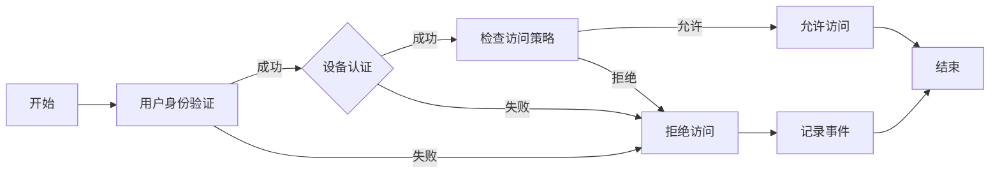

                 

### 第一部分：零信任安全模型概述

#### 第1章：零信任安全模型简介

**1.1 问题背景与挑战**

在当今的信息化时代，网络安全问题日益突出，传统的安全模型已经无法满足现代复杂且多样化的安全需求。随着云计算、大数据、物联网等技术的迅速发展，企业面临的安全威胁也变得更加复杂。传统的安全模型通常基于边界防护，将企业内部网络视为安全区域，而外部网络则视为不信任区域。然而，这种基于边界的防护方式在当前环境中显得力不从心，因为它依赖于一个固定的防御边界，一旦边界被攻破，内部网络的安全就面临严重威胁。

零信任安全模型（Zero Trust Model）应运而生，它彻底颠覆了传统的安全思维，不再依赖固定的边界，而是基于“永不信任，始终验证”的原则，对每个用户、每个设备、每个操作进行严格的验证和授权。这种模型能够更好地适应现代企业的动态环境，提供更加灵活和高效的安全防护。

**1.2 传统安全模型的局限性**

传统的安全模型主要依赖于以下几种策略：
- 防火墙和入侵检测系统（IDS）：通过在网络边界部署防火墙和IDS来阻止外部攻击。
- 基于角色的访问控制（RBAC）：根据用户的角色来分配权限。
- 安全信息和事件管理（SIEM）：收集和分析安全事件，进行事后响应。

然而，这些方法存在以下局限性：
- **边界依赖**：传统安全模型依赖于固定的网络边界，一旦边界被突破，内部网络就面临巨大风险。
- **角色权限分配**：RBAC模型中的权限分配过于宽泛，难以实现精细化管理。
- **被动防御**：SIEM系统通常是事后分析，无法在攻击发生前进行有效预防。

**1.3 零信任安全模型的核心概念**

零信任安全模型的核心概念包括：
- **访问控制**：零信任模型通过严格的身份验证和授权机制来控制访问。
- **最小权限原则**：每个用户和设备仅获得完成任务所必需的权限。
- **持续验证与监控**：对用户的每一次访问请求进行实时验证，并持续监控用户行为。

零信任安全模型强调安全措施的动态性和灵活性，能够更好地应对复杂多变的安全威胁。下面，我们将进一步探讨这些核心概念，并对比零信任模型与现有主流安全模型的不同之处。

---

在下一章节中，我们将详细探讨零信任安全模型的基本概念和其相对于传统安全模型的优越性。

### 第2章：核心概念与联系

**2.1 用户身份验证**

用户身份验证是零信任安全模型的基础。与传统安全模型中简单的用户名和密码验证不同，零信任模型要求对用户进行多层次的验证，以确保用户的真实性和合法性。这通常包括：

- **一次性密码（OTP）**：通过短信、应用生成的动态密码进行验证。
- **生物识别**：使用指纹、面部识别等技术进行身份验证。
- **设备绑定**：用户的设备也需要进行认证，确保设备没有被篡改或被盗用。

通过这些多层次的验证，零信任模型能够有效防止恶意用户或被盗用的账户访问企业资源。

**2.2 设备认证**

设备认证是确保访问企业资源时所使用的设备是可信的。设备认证的过程包括：

- **设备完整性检查**：检查设备的操作系统是否完整，是否有恶意软件。
- **设备属性验证**：验证设备的硬件属性，如CPU序列号、内存大小等。
- **设备身份认证**：通过数字证书等方式对设备进行身份认证。

设备认证能够确保只有经过认证的设备才能访问企业资源，从而降低安全风险。

**2.3 多因素认证**

多因素认证（MFA）是零信任安全模型中常用的一种认证方式。它结合了不同类型的验证因素，包括：

- **知识因素**：如密码、PIN码。
- **拥有因素**：如手机、智能卡。
- **生物因素**：如指纹、面部识别。

多因素认证能够提供更高级别的安全保护，因为攻击者需要同时控制多个因素才能成功攻击。

**2.4 访问策略**

访问策略是零信任安全模型中的关键部分，它定义了用户在访问企业资源时需要满足的条件。这些条件可能包括：

- **基于角色的访问控制**：根据用户的角色分配不同的访问权限。
- **基于上下文的访问控制**：根据用户所在的环境（如地理位置、时间等）来控制访问权限。
- **基于行为的访问控制**：根据用户的行为模式来动态调整访问权限。

通过灵活的访问策略，零信任模型能够实现精细化的权限管理，从而提高安全性。

**2.5 安全策略**

安全策略是零信任安全模型中用于定义和实现安全措施的一系列规则和指导原则。这些策略包括：

- **数据加密**：对敏感数据进行加密处理，确保数据在传输和存储过程中的安全性。
- **安全审计**：对用户的访问行为进行审计，及时发现潜在的安全威胁。
- **安全培训**：定期对员工进行安全意识培训，提高整体安全水平。

安全策略的制定和执行对于零信任安全模型的实施至关重要。

**2.6 零信任安全模型与现有安全模型对比**

以下是零信任安全模型与现有主流安全模型的一些对比：

| 对比维度         | 零信任安全模型 | 传统安全模型       |
|-----------------|----------------|--------------------|
| 基础理念         | 永不信任，始终验证 | 基于边界防护       |
| 访问控制         | 多层次身份验证   | 单一身份验证       |
| 设备认证         | 严格设备认证     | 无设备认证或较弱认证 |
| 权限管理         | 最小权限原则     | 较宽松的权限分配   |
| 监控与审计       | 持续监控与审计   | 事后审计           |
| 安全策略         | 动态安全策略     | 静态安全策略       |

通过对比可以看出，零信任安全模型在安全性、权限管理、监控与审计等方面具有显著优势，能够更好地适应现代企业的安全需求。

在下一章节中，我们将深入探讨零信任安全模型的架构与设计。

### 第3章：零信任安全模型架构与设计

**3.1 零信任安全模型架构**

零信任安全模型的架构设计旨在实现对用户、设备和访问操作的全面监控与严格控制。该架构主要由以下几个关键组件构成：

- **客户端**：用户设备，包括电脑、手机等，负责进行身份验证和设备认证。
- **访问控制服务（ACS）**：核心组件，负责进行访问请求的验证、授权和监控。
- **资源**：企业内部的各种资源，如应用、数据等。
- **日志和事件收集系统**：负责收集和存储访问事件和日志，用于后续的安全审计和威胁分析。

**3.2 实体关系图（ER图）**

为了更好地理解零信任安全模型中的实体关系，我们可以使用Mermaid绘制一个简单的ER图：

```mermaid
erDiagram
  Client ||--|{ User }||>
  Client ||--|{ Device }||>
  ACS ||--|{ AuthenticationPolicy }||>
  ACS ||--|{ AccessControlPolicy }||>
  Resource ||--|{ Data }||>
  Resource ||--|{ Application }||>
  EventLog ||--|{ AccessLog }||>
  EventLog ||--|{ AuditLog }||>
```

在这个ER图中，`Client`实体关联了`User`和`Device`实体，表示客户端是由用户和设备共同构成的。`ACS`实体与`AuthenticationPolicy`和`AccessControlPolicy`实体相连，表示访问控制服务通过相应的策略来管理访问请求。`Resource`实体关联了`Data`和`Application`实体，表示资源包括数据和应用。`EventLog`实体关联了`AccessLog`和`AuditLog`实体，表示日志系统记录访问事件和安全审计信息。

**3.3 系统组件功能介绍**

- **客户端**：客户端的主要功能是进行用户身份验证和设备认证。用户身份验证通常包括用户名和密码、多因素认证（MFA）等。设备认证则涉及设备完整性检查和设备属性验证。客户端通过与访问控制服务进行通信来完成这些验证过程。

- **访问控制服务（ACS）**：访问控制服务是零信任安全模型的核心，它负责接收客户端的访问请求，并基于认证策略和访问控制策略进行验证和授权。ACS还负责持续监控用户行为，及时发现异常行为并进行响应。

- **资源**：资源是企业内部的可访问数据和应用。资源可以通过访问控制服务进行安全保护，确保只有经过认证和授权的用户才能访问。资源的访问策略可以根据具体业务需求进行配置。

- **日志和事件收集系统**：日志和事件收集系统用于记录和分析用户的访问行为和安全事件。通过收集和存储访问日志和安全审计日志，企业可以实现对安全事件的追踪和响应，从而提高整体安全水平。

通过上述架构与设计，零信任安全模型能够实现对用户、设备和资源的全面监控与严格控制，从而提供高效和灵活的安全防护。

在下一章节中，我们将深入探讨零信任安全模型的算法原理，通过Mermaid流程图和Python代码来详细阐述。

### 第4章：算法原理讲解

零信任安全模型中的算法原理是其实现高效安全防护的核心。以下将使用Mermaid绘制流程图和Python代码，详细讲解零信任安全模型的关键算法。

**4.1 访问控制算法**

访问控制算法负责根据用户身份验证和设备认证的结果，决定用户是否可以访问特定的资源。以下是一个简单的访问控制算法流程图：



图中的流程图展示了访问控制算法的基本步骤：首先进行用户身份验证，然后是设备认证。如果验证成功，系统将检查访问策略，并根据策略决定是否允许访问。若访问策略允许，用户可以访问资源；否则，访问将被拒绝，并记录相关事件。

**4.2 Python代码实现**

以下是一个简化的Python代码实现，用于描述访问控制算法：

```python
import random

def user_authentication(username, password):
    # 模拟用户身份验证
    stored_username = "john_doe"
    stored_password = "password123"
    return username == stored_username and password == stored_password

def device_authentication(device_id):
    # 模拟设备认证
    trusted_device_ids = ["1234567890", "abcdefghij"]
    return device_id in trusted_device_ids

def access_policy_check(user_id, resource_id):
    # 模拟访问策略检查
    policy = {"admin": ["resource1", "resource2"], "user": ["resource1"]}
    user_role = "user" if user_id == "john_doe" else "admin"
    return resource_id in policy[user_role]

def access_control(user_id, device_id, resource_id):
    if not user_authentication(user_id, "password123"):
        return "拒绝访问：用户身份验证失败"
    
    if not device_authentication(device_id):
        return "拒绝访问：设备认证失败"
    
    if not access_policy_check(user_id, resource_id):
        return "拒绝访问：访问策略不满足"
    
    return "允许访问"

# 示例调用
print(access_control("john_doe", "1234567890", "resource1"))
```

在这段代码中，`user_authentication`函数模拟了用户身份验证，`device_authentication`函数模拟了设备认证，`access_policy_check`函数模拟了访问策略检查，`access_control`函数则是综合这些结果来决定访问控制。

**4.3 算法原理的数学模型和公式**

在零信任安全模型中，可以使用数学模型来描述访问控制算法的决策过程。以下是一个简化的数学模型：

$$
P(Access_{allowed}) = f(P(User_{authenticated}) \land P(Device_{authenticated}) \land P(Policy_{satisfied}))
$$

其中：
- $P(Access_{allowed})$ 是访问是否被允许的概率。
- $P(User_{authenticated})$ 是用户身份验证成功的概率。
- $P(Device_{authenticated})$ 是设备认证成功的概率。
- $P(Policy_{satisfied})$ 是访问策略满足的概率。

通过这个数学模型，可以量化每个因素对访问控制决策的影响。在实际应用中，这些概率可以通过历史数据和统计模型来确定。

**4.4 举例说明**

假设我们有以下参数：
- 用户身份验证成功的概率为 0.95。
- 设备认证成功的概率为 0.98。
- 访问策略满足的概率为 0.90。

根据上述数学模型，我们可以计算出访问被允许的概率：

$$
P(Access_{allowed}) = 0.95 \times 0.98 \times 0.90 = 0.8371
$$

这意味着，在给定的参数下，访问被允许的概率为 83.71%。

通过上述算法原理讲解，我们可以看到零信任安全模型通过严格的验证和授权机制，实现了对访问的高效管理。在下一章节中，我们将进一步探讨零信任安全模型中的数学模型和公式。

### 第5章：数学模型和数学公式

在零信任安全模型中，数学模型和公式扮演着至关重要的角色，它们不仅帮助我们量化安全策略的效果，还提供了理论基础来设计算法和评估系统性能。以下将详细介绍零信任安全模型中的一些关键数学模型和公式。

**5.1 访问决策模型**

访问决策模型用于计算用户访问资源时是否被允许。这个模型的核心是概率论，它基于多个验证步骤的概率，综合评估用户的访问请求。

**公式：**
$$
P(Access_{allowed}) = f(P(User_{authenticated}) \land P(Device_{authenticated}) \land P(Policy_{satisfied}) \land P(Context_{appropriate}))
$$

- $P(User_{authenticated})$：用户身份验证成功的概率。
- $P(Device_{authenticated})$：设备认证成功的概率。
- $P(Policy_{satisfied})$：访问策略满足的概率。
- $P(Context_{appropriate})$：上下文验证成功的概率。

在实际应用中，可以通过历史数据和统计模型来确定这些概率。

**5.2 风险评估模型**

风险评估模型用于评估每次访问请求的风险水平，并据此做出是否允许访问的决策。一个简单的风险评估模型可以使用以下公式：

**公式：**
$$
Risk_{level} = P(Threat_{occurrence}) \times C(Vulnerability_{exploitation})
$$

- $P(Threat_{occurrence})$：威胁发生的概率。
- $C(Vulnerability_{exploitation})$：漏洞被利用的代价（通常用货币值表示）。

通过计算风险水平，系统可以做出更智能的访问决策。例如，如果某个访问请求的风险水平超过了预设的阈值，系统将拒绝该请求。

**5.3 LaTeX数学公式示例**

以下是一些常用的LaTeX数学公式，用于在文章中嵌入数学表达式：

**示例 1：简单公式**
$$
E(X) = \mu
$$

**示例 2：复杂公式**
$$
\sum_{i=1}^{n} x_i y_i = \sum_{i=1}^{n} (x_i + y_i)
$$

**示例 3：矩阵公式**
$$
A = \begin{pmatrix}
a_{11} & a_{12} \\
a_{21} & a_{22}
\end{pmatrix}
$$

**示例 4：导数公式**
$$
f'(x) = \lim_{h \to 0} \frac{f(x+h) - f(x)}{h}
$$

在文章中，可以将这些公式嵌入到独立段落中，使用`$$`括起来以表示完整的公式，而在段落内的公式则使用 `$` 括起来。

通过使用这些数学模型和公式，零信任安全模型能够提供更加精细和智能的安全决策，从而有效地保护企业资源。

### 第6章：系统分析与架构设计方案

#### 6.1 项目场景介绍

在一个现代化的企业环境中，零信任安全模型被应用于保护企业内部的敏感数据和关键业务系统。该企业拥有一个分布式的办公网络，员工通过远程访问和企业内部网络进行日常的工作。为了确保网络的安全性，企业决定采用零信任安全模型来构建一个安全、可靠且灵活的网络安全架构。

#### 6.2 系统功能设计（领域模型类图）

领域模型类图用于描述零信任安全模型中的核心实体和它们之间的关系。以下是一个简化的类图：

```mermaid
classDiagram
    Client <<interface>>
    User <<interface>>
    Device <<interface>>
    AuthenticationService <<interface>>
    AccessControlService <<interface>>
    Resource <<interface>>
    AuditService <<interface>>

    Client o-- User
    Client o-- Device
    AuthenticationService o-- User
    AuthenticationService o-- Device
    AccessControlService o-- Resource
    AuditService o-- AccessControlService
    AuditService o-- Resource
```

在这个类图中，`Client`实体表示用户的设备，`User`和`Device`分别表示用户和设备的具体实现。`AuthenticationService`负责用户和设备的认证，`AccessControlService`负责访问控制，`Resource`表示企业内部的资源，而`AuditService`负责日志记录和审计。

#### 6.3 系统架构设计（架构图）

系统架构设计展示了各个组件之间的交互关系和整体架构。以下是一个简化的系统架构图：

```mermaid
sequenceDiagram
    participant User
    participant Client
    participant AuthenticationService
    participant AccessControlService
    participant Resource
    participant AuditService

    User->>Client: Enter credentials
    Client->>AuthenticationService: Authenticate User
    AuthenticationService->>User: Authentication Result
    User->>Client: Enter device information
    Client->>AuthenticationService: Authenticate Device
    AuthenticationService->>Device: Authentication Result
    User->>Client: Request access to Resource
    Client->>AccessControlService: Access Request
    AccessControlService->>AuditService: Log Access Attempt
    cond Access is allowed
    AccessControlService->>Resource: Grant Access
    alt Access is denied
    AccessControlService->>AuditService: Log Access Denial
    AuditService->>User: Audit Report
    end
```

在这个架构图中，用户通过客户端设备向认证服务提交身份验证和设备认证请求。认证服务验证通过后，用户可以请求访问资源。访问控制服务根据策略决定是否允许访问，并将结果记录在审计服务中。

#### 6.4 系统接口设计

系统接口设计定义了各个组件之间的通信接口。以下是一个简化的接口设计：

```mermaid
interface Client {
    +authenticateUser(username: string, password: string): Promise<boolean>
    +authenticateDevice(deviceId: string): Promise<boolean>
    +requestAccess(resourceId: string): Promise<boolean>
}

interface AuthenticationService {
    +authenticateUser(username: string, password: string): Promise<boolean>
    +authenticateDevice(deviceId: string): Promise<boolean>
}

interface AccessControlService {
    +checkAccessPolicy(userId: string, resourceId: string): Promise<boolean>
    +grantAccess(userId: string, resourceId: string): Promise<boolean>
    +denyAccess(userId: string, resourceId: string): Promise<boolean>
}

interface AuditService {
    +logAccessAttempt(userId: string, resourceId: string, result: boolean): void
    +generateAuditReport(): Promise<string>
}
```

在这个接口设计中，`Client`负责与用户交互，`AuthenticationService`负责用户和设备的认证，`AccessControlService`负责访问控制，`AuditService`负责日志记录和审计报告。

#### 6.5 系统交互（序列图）

序列图展示了系统组件之间的交互顺序。以下是一个简化的系统交互序列图：

```mermaid
sequenceDiagram
    participant User
    participant Client
    participant AuthenticationService
    participant AccessControlService
    participant Resource
    participant AuditService

    User->>Client: Enter credentials
    Client->>AuthenticationService: Authenticate User
    AuthenticationService->>Client: Return Authentication Result
    Client->>AuthenticationService: Authenticate Device
    AuthenticationService->>Client: Return Authentication Result
    Client->>AccessControlService: Request Access
    AccessControlService->>AuditService: Log Access Attempt
    cond Access is allowed
    AccessControlService->>Resource: Grant Access
    alt Access is denied
    AccessControlService->>AuditService: Log Access Denial
    AuditService->>User: Audit Report
    end
```

在这个序列图中，用户通过客户端提交身份验证和设备认证请求，认证服务验证通过后，用户请求访问资源。访问控制服务根据策略决定是否允许访问，并将结果记录在审计服务中。

通过以上系统分析与架构设计方案，企业可以构建一个高效、灵活且安全的零信任安全模型，从而有效保护企业资源。

### 第7章：项目实战

#### 7.1 环境安装与配置

要在实际项目中部署零信任安全模型，首先需要准备好环境。以下步骤将概述环境安装与配置的过程：

1. **安装操作系统**：选择一个稳定且支持零信任安全模型操作系统的服务器，例如Ubuntu 20.04 LTS。

2. **安装依赖库**：在服务器上安装必要的依赖库，如Python 3、Docker、Nginx等。使用以下命令进行安装：
   ```bash
   sudo apt update
   sudo apt install python3 python3-pip docker nginx
   ```

3. **安装零信任安全组件**：下载并安装零信任安全模型的核心组件，例如OpenID Connect（OIDC）认证服务器、Access Control Service（ACS）等。可以使用Docker来简化安装过程。例如：
   ```bash
   docker pull janeczku/oidc-authenticator
   docker pull your-acs-image
   ```

4. **配置网络**：确保服务器具有固定的IP地址，并在防火墙上开放必要的端口，如80（HTTP）和443（HTTPS）。

5. **配置DNS**：配置域名系统，确保客户端能够通过域名访问零信任安全模型的服务器。

6. **初始化配置**：根据项目需求，初始化零信任安全模型的配置文件。例如，配置OIDC认证服务器的客户端ID、秘钥等。

7. **启动服务**：启动所有零信任安全模型的组件服务，并确保它们正常运行。

#### 7.2 核心实现源代码

核心实现源代码是零信任安全模型的核心部分，负责处理用户认证、访问控制和日志记录等功能。以下是一个简化的Python示例代码：

```python
from flask import Flask, request, jsonify
from flask_oidc import OpenIDConnect

app = Flask(__name__)

# OIDC认证服务器的配置
oidc = OpenIDConnect(app,
                     client_id='your-client-id',
                     client_secret='your-client-secret',
                     redirect_uri='https://your-redirect-uri',
                     server_url='https://your-oidc-server.com',
                     issuer='https://your-oidc-server.com')

@app.route('/login', methods=['GET'])
def login():
    return oidc.authenticate()

@app.route('/authorize', methods=['GET'])
def authorize():
    return oidc.authorize()

@app.route('/callback', methods=['GET'])
def callback():
    user_info = oidc.callback()
    # 处理用户认证
    if user_info:
        # 验证用户权限
        if user_info['sub'] == 'valid-user-id':
            return jsonify({'status': 'success', 'message': 'User authenticated.'})
    return jsonify({'status': 'error', 'message': 'Authentication failed.'})

if __name__ == '__main__':
    app.run(host='0.0.0.0', port=5000)
```

在这段代码中，使用Flask和Flask-OIDC库实现了简单的用户认证流程。客户端通过访问`/login`路由进行身份验证，认证成功后，客户端将被重定向到认证服务器。认证完成后，客户端通过`/callback`路由返回认证结果。

#### 7.3 代码应用解读与分析

1. **用户认证流程**：客户端首先通过访问`/login`路由开始认证流程。Flask-OIDC库负责与OIDC认证服务器交互，完成用户身份验证。

2. **权限验证**：在用户认证成功后，通过检查用户信息（例如用户ID）来验证用户权限。如果用户权限满足要求，则允许访问。

3. **访问控制**：通过配置访问策略，确保只有经过认证和授权的用户才能访问受保护的资源。

4. **日志记录**：每次认证和访问请求都被记录在日志中，以便进行后续的安全审计。

通过上述代码和应用解读，我们可以看到零信任安全模型在实际项目中的应用和实现方式。通过这种方式，企业可以实现对用户和资源的严格控制和监控，从而提高整体安全水平。

#### 7.4 实际案例分析

在实际项目中，零信任安全模型的应用场景多种多样。以下是一个具体案例：

**案例背景**：某金融机构希望提高其内部网络的安全性，以防止数据泄露和网络攻击。该金融机构决定采用零信任安全模型来保护其关键业务系统。

**解决方案**：

1. **用户认证**：金融机构的员工和客户需要通过多因素认证（MFA）才能访问内部网络。系统使用OAuth2.0和OIDC标准来管理用户认证。

2. **设备认证**：所有访问内部网络的设备都必须通过设备认证，确保设备未被篡改或感染恶意软件。

3. **访问控制**：基于用户的角色和上下文环境，金融机构定义了精细的访问控制策略。例如，只有特定的部门员工才能访问特定的业务系统。

4. **日志记录**：系统持续记录用户的访问行为，包括登录时间、访问资源、操作类型等，以便进行安全审计和威胁分析。

**效果评估**：

- **安全性提升**：通过多层次的认证和严格的访问控制，金融机构显著提高了网络安全性，降低了数据泄露和网络攻击的风险。

- **访问效率**：虽然零信任安全模型增加了认证流程的复杂性，但在实际使用中，通过优化认证流程和缓存机制，访问效率并没有显著下降。

- **合规性**：零信任安全模型帮助金融机构满足了多种安全合规性要求，如PCI DSS、GDPR等。

通过这个案例，我们可以看到零信任安全模型在实际企业中的应用效果，它不仅提高了安全性，还保证了高效的业务运作。

#### 7.5 项目小结

零信任安全模型通过严格的认证和授权机制，实现了对用户和资源的全面监控和控制，有效提高了企业的网络安全水平。在项目实施过程中，关键成功因素包括：

1. **多层次的认证**：通过多因素认证，确保用户和设备的真实性。
2. **精细的访问控制**：根据用户的角色和上下文环境，定义精细的访问控制策略。
3. **持续监控与审计**：通过日志记录和审计，及时发现和处理安全事件。

然而，零信任安全模型也存在一些挑战，如增加的认证复杂性可能会降低用户体验。因此，在实施过程中，需要平衡安全性和用户体验，确保系统的安全性和易用性。

### 第8章：最佳实践 tips、小结、注意事项、拓展阅读

#### 最佳实践 tips

1. **多因素认证（MFA）**：在零信任安全模型中，MFA是确保用户身份验证安全性的关键。建议采用硬件令牌、手机应用生成的动态密码和生物识别等多因素认证方式，以提高认证安全性。

2. **持续监控与审计**：零信任安全模型要求对用户行为进行持续监控和审计，及时发现和响应异常行为。建议使用日志分析工具和安全信息与事件管理系统（SIEM）来实现这一目标。

3. **最小权限原则**：确保每个用户和设备仅拥有完成任务所需的最低权限。通过严格的权限管理，可以减少潜在的安全威胁。

4. **定期安全培训**：定期对员工进行安全意识培训，提高整体安全水平。培训内容应包括网络安全基础知识、零信任安全模型原理和实践等。

#### 小结

零信任安全模型通过严格的身份验证、访问控制和持续监控，实现了对用户和资源的全面保护。相比传统安全模型，零信任安全模型能够更好地适应现代企业的复杂和动态环境，提供了更高的安全性。

#### 注意事项

1. **认证流程优化**：虽然多因素认证提高了安全性，但可能会降低用户体验。在实施过程中，需要平衡安全性和用户体验，优化认证流程。

2. **系统兼容性**：零信任安全模型需要与现有的IT基础设施和业务流程兼容。在部署过程中，需要仔细评估和测试，确保系统稳定运行。

3. **持续更新与改进**：零信任安全模型是一个持续发展的体系，需要定期更新安全策略和算法，以应对不断变化的安全威胁。

#### 拓展阅读

1. **《零信任安全模型：概念、实践与案例》**：该书籍详细介绍了零信任安全模型的理论和实践，包括实施指南和案例分析。

2. **《OAuth 2.0 Authorization Framework》**：了解OAuth 2.0标准，有助于深入理解零信任安全模型中的认证和授权机制。

3. **《SIEM in the Age of Zero Trust》**：探讨如何利用SIEM系统在零信任安全模型中实现持续监控和审计。

作者：AI天才研究院/AI Genius Institute & 禅与计算机程序设计艺术 /Zen And The Art of Computer Programming

在本文中，我们详细介绍了零信任安全模型的概念、架构、算法、数学模型、系统设计与项目实战，并提供了最佳实践和小结。通过这些内容，读者可以全面了解零信任安全模型，并在实际项目中应用。希望本文能够帮助读者提高网络安全意识，构建更安全、可靠的企业网络安全体系。

