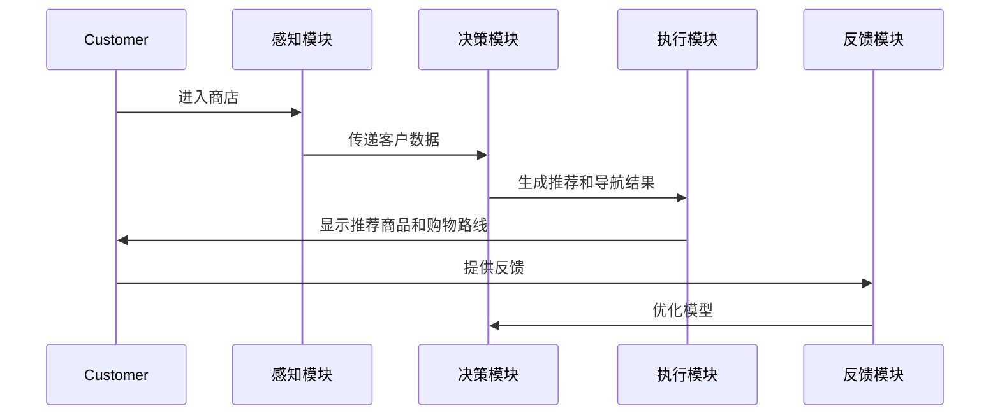
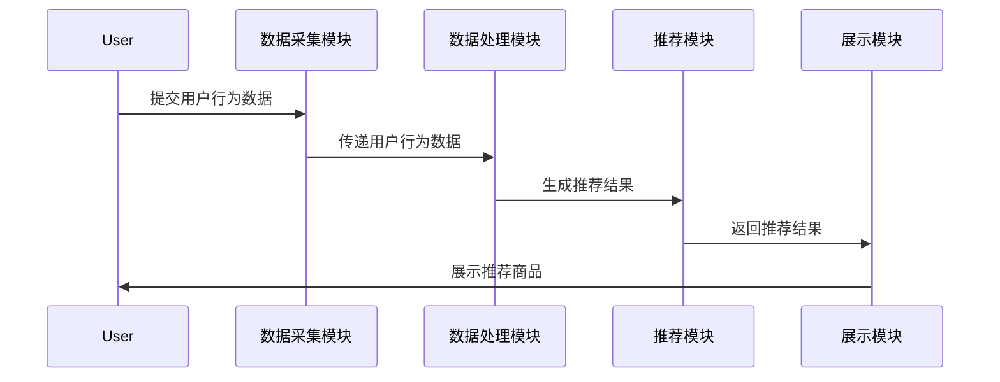
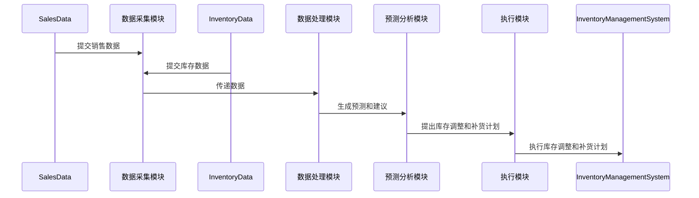
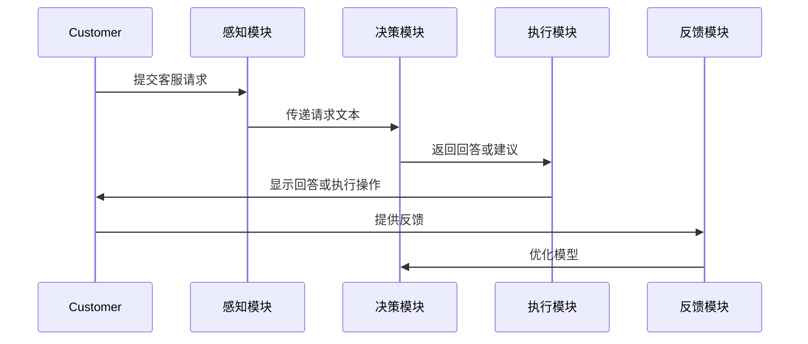

                 

### 《零售业AI Agent应用策略》

#### 关键词：
- 零售业
- AI Agent
- 个性化推荐
- 智能库存管理
- 客户服务

#### 摘要：
本文旨在探讨零售业中AI Agent的应用策略，通过深入分析AI Agent在零售业的现状、核心概念与原理、应用场景、技术实现、案例研究、挑战与对策以及最佳实践，为零售企业提供一套全面、详细的AI Agent应用指南。

#### 目录大纲

**第一部分：零售业AI Agent概述**

## 第1章：零售业AI Agent的应用背景与价值

### 1.1 零售业的现状与挑战

### 1.2 AI技术在零售业的渗透与应用

### 1.3 AI Agent在零售业的核心作用

### 1.4 零售业AI Agent的分类与特点

### 1.5 AI Agent应用带来的价值分析

## 第2章：零售业AI Agent的核心概念与原理

### 2.1 AI Agent的定义与基本原理

### 2.2 人工智能、机器学习与深度学习的区别与联系

### 2.3 AI Agent的关键技术分析

### 2.4 AI Agent的组成结构与功能模块

### 2.5 AI Agent的发展趋势与未来展望

## 第3章：零售业AI Agent应用场景分析

### 3.1 个性化推荐系统

### 3.2 客户服务与聊天机器人

### 3.3 智能库存管理

### 3.4 智能导购系统

### 3.5 零售业AI Agent的集成与应用策略

## 第4章：零售业AI Agent的技术实现与架构设计

### 4.1 AI Agent的技术架构概述

### 4.2 数据采集与预处理

### 4.3 模型训练与优化

### 4.4 AI Agent的部署与运维

### 4.5 零售业AI Agent的扩展与升级策略

## 第5章：零售业AI Agent案例研究

### 5.1 案例一：某大型零售商的AI智能导购系统

### 5.2 案例二：某电商平台的个性化推荐系统

### 5.3 案例三：某服装零售商的智能库存管理系统

### 5.4 案例四：某零售业的客户服务机器人应用

### 5.5 案例分析总结与启示

## 第6章：零售业AI Agent应用中的挑战与对策

### 6.1 数据隐私与安全

### 6.2 AI偏见与歧视问题

### 6.3 零售业AI Agent的技术成熟度与适用性

### 6.4 零售业AI Agent的法律法规与伦理问题

### 6.5 零售业AI Agent的未来发展方向与对策

## 第7章：零售业AI Agent应用策略与最佳实践

### 7.1 零售业AI Agent应用的总体策略

### 7.2 零售企业AI Agent应用实施步骤

### 7.3 AI Agent在零售业务中的最佳实践

### 7.4 零售业AI Agent应用的持续优化与升级

### 7.5 零售业AI Agent应用案例深度解析

## 第8章：总结与展望

### 8.1 零售业AI Agent应用的成果总结

### 8.2 零售业AI Agent应用的发展趋势

### 8.3 未来零售业AI Agent的发展方向与机遇

### 8.4 对零售企业的建议与启示

---

**第一部分：零售业AI Agent概述**

### 1.1 零售业的现状与挑战

随着全球经济的不断发展和消费需求的日益多样，零售业正面临前所未有的挑战。传统零售业模式面临着成本上升、效率低下、同质化竞争加剧等问题。为了应对这些挑战，零售企业开始寻求创新的技术手段来提升运营效率和服务质量。

在这个背景下，人工智能（AI）技术逐渐成为零售业转型升级的重要推动力。AI Agent作为人工智能的一种具体应用形式，能够在零售业中扮演重要角色，提供个性化推荐、智能库存管理、客户服务等解决方案。

零售业的现状包括线上线下的融合趋势、消费者对购物体验的高要求、数据驱动的决策需求等。而零售业面临的挑战主要在于如何有效利用数据、提升客户满意度、提高运营效率等。

**1.2 AI技术在零售业的渗透与应用**

AI技术在零售业的渗透可以从以下几个方面来理解：

- **数据采集与分析**：通过物联网设备、移动终端等，实时收集消费者行为数据，为AI Agent提供数据支持。
- **个性化推荐**：利用协同过滤、基于内容的推荐算法，为消费者提供个性化的购物建议，提升购买转化率。
- **智能库存管理**：通过预测分析、智能调度等技术，优化库存水平，降低库存成本。
- **客户服务**：利用聊天机器人、语音助手等技术，提供24小时在线客服，提高客户满意度。

AI技术在零售业的应用不仅能够提升运营效率，还能改善客户体验，从而增强企业的竞争力。

**1.3 AI Agent在零售业的核心作用**

AI Agent在零售业的核心作用主要体现在以下几个方面：

- **提升运营效率**：通过自动化处理大量业务流程，减少人工干预，提高工作效率。
- **个性化服务**：基于消费者行为数据，提供个性化的购物建议，提升客户满意度。
- **数据洞察**：通过对海量数据的分析，为企业提供决策支持，优化业务策略。
- **创新业务模式**：AI Agent的应用可以为零售企业带来新的商业模式，如会员制、定制化服务等。

**1.4 零售业AI Agent的分类与特点**

零售业AI Agent可以根据功能和应用场景进行分类，主要包括以下几种类型：

- **个性化推荐系统**：通过分析消费者行为和偏好，提供个性化的购物建议。
- **客户服务机器人**：利用自然语言处理技术，提供在线客服和问题解答。
- **智能库存管理系统**：通过预测分析，优化库存水平，降低库存成本。
- **智能导购系统**：在实体店中提供智能导航和购物建议，提升购物体验。

不同类型的AI Agent具有各自的特点和优势，零售企业可以根据自身需求选择合适的AI Agent进行应用。

**1.5 AI Agent应用带来的价值分析**

AI Agent在零售业的广泛应用带来了显著的价值：

- **提高运营效率**：通过自动化处理，减少人工成本，提高业务处理速度。
- **提升客户满意度**：提供个性化服务，改善客户体验，增强品牌忠诚度。
- **优化库存管理**：通过智能预测和调度，降低库存成本，提高库存周转率。
- **增强数据洞察**：通过对消费者行为的深入分析，为企业提供精准的决策支持。

AI Agent的应用不仅能够提升企业的运营效率和客户满意度，还能为企业带来新的商业模式和发展机遇。

### 第一部分：零售业AI Agent概述

## 第2章：零售业AI Agent的核心概念与原理

### 2.1 AI Agent的定义与基本原理

AI Agent，即人工智能代理，是一种能够模拟人类行为，自主决策并执行任务的智能体。在零售业中，AI Agent通常指的是那些能够根据消费者的行为数据和市场信息，提供个性化服务、智能库存管理和客户服务的智能系统。

AI Agent的基本原理包括以下几个方面：

1. **感知**：AI Agent通过传感器或数据采集设备获取外部信息，如消费者的购买历史、浏览行为等。
2. **决策**：基于感知到的信息，AI Agent利用算法和模型进行决策，如个性化推荐、库存优化策略等。
3. **行动**：执行决策结果，如向消费者推送个性化推荐、调整库存水平等。

AI Agent的核心在于其自主性和学习能力。通过不断学习和优化，AI Agent能够提高决策的准确性和效率。

### 2.2 人工智能、机器学习与深度学习的区别与联系

人工智能（AI）是一门研究、开发用于模拟、延伸和扩展人类智能的理论、方法、技术及应用系统的学科。AI包括多个子领域，如机器学习（ML）、深度学习（DL）等。

- **人工智能**：旨在开发能够模拟人类智能的系统，包括感知、学习、推理、规划等能力。
- **机器学习**：一种人工智能的子领域，通过数据驱动的方法，让计算机从数据中学习，自动改进性能。
- **深度学习**：一种特殊的机器学习方法，通过神经网络，尤其是深度神经网络，对大量数据进行自动特征学习和模型训练。

三者的联系在于：

- **人工智能** 是一个宏观的概念，涵盖了多个子领域。
- **机器学习** 是实现人工智能的一种方法，特别是 **深度学习**，是机器学习中的一种重要技术。

在零售业中，AI Agent通常结合了机器学习和深度学习技术，以提高其智能决策能力。

### 2.3 AI Agent的关键技术分析

AI Agent的关键技术包括以下几个方面：

- **数据采集与处理**：通过物联网设备、移动终端等采集消费者行为数据，利用数据清洗、归一化等技术进行处理。
- **机器学习算法**：包括监督学习、非监督学习和强化学习等，用于构建和优化AI Agent的决策模型。
- **深度学习模型**：如卷积神经网络（CNN）、循环神经网络（RNN）等，用于处理复杂的非结构化数据，如图像和文本。
- **自然语言处理（NLP）**：用于理解和生成自然语言，实现智能对话和文本分析。
- **智能推荐算法**：如协同过滤、基于内容的推荐等，用于生成个性化推荐。

这些技术共同构成了AI Agent的核心能力，使其能够在零售业中发挥重要作用。

### 2.4 AI Agent的组成结构与功能模块

AI Agent通常由以下几个功能模块组成：

- **感知模块**：负责采集外部信息，如消费者行为数据、市场信息等。
- **决策模块**：利用机器学习算法和深度学习模型，对采集到的信息进行处理和决策。
- **执行模块**：执行决策结果，如向消费者推送个性化推荐、调整库存水平等。
- **反馈模块**：收集执行结果，用于优化AI Agent的决策模型。

这些模块相互协作，构成了一个闭环系统，使AI Agent能够持续学习和优化。

### 2.5 AI Agent的发展趋势与未来展望

AI Agent在零售业的应用正处于快速发展阶段，未来发展趋势包括：

- **更广泛的场景应用**：AI Agent将应用于更多零售业务场景，如供应链管理、智能营销等。
- **更高水平的智能化**：通过不断优化算法和模型，AI Agent的决策能力和效率将进一步提高。
- **更紧密的人机协作**：AI Agent将更好地融入业务流程，与人类员工协同工作，提高整体运营效率。

未来，AI Agent有望成为零售企业不可或缺的智能助手，推动零售业的全面智能化。

### 总结与展望

本章从AI Agent的定义、基本原理、关键技术和应用结构等方面进行了深入分析，揭示了AI Agent在零售业中的重要价值和发展前景。通过AI Agent的应用，零售企业可以实现运营效率的提升、客户满意度的提高和商业模式的创新。未来，随着技术的不断进步，AI Agent将在零售业中发挥更加重要的作用。

**注意事项：**
- AI Agent的应用需要大量的高质量数据支持，因此数据采集和处理的准确性至关重要。
- 在应用AI Agent时，需关注数据隐私和安全问题，确保消费者的数据得到妥善保护。
- 零售企业应结合自身业务特点和需求，选择合适的AI Agent类型和应用场景。

**拓展阅读：**
- 《人工智能：一种现代方法》
- 《机器学习实战》
- 《深度学习》（Goodfellow et al.）

---

### 2.2 人工智能、机器学习与深度学习的区别与联系

在探讨零售业AI Agent的核心概念与原理时，我们需要先了解人工智能（AI）、机器学习（ML）和深度学习（DL）这三者之间的区别与联系。这不仅有助于我们更清晰地理解AI Agent的工作机制，还能为后续章节中的技术实现提供理论基础。

#### 人工智能（AI）

人工智能是一个广泛的领域，旨在开发能够模拟、延伸和扩展人类智能的理论、方法、技术及应用系统。AI的范畴涵盖了多个子领域，包括自然语言处理（NLP）、计算机视觉、专家系统、机器学习和深度学习等。

AI的核心目标是实现计算机系统在感知、理解、推理、学习、决策和问题解决等方面的能力，类似于人类智能。然而，AI是一个高度抽象的概念，包含了许多不同的技术和方法。

#### 机器学习（ML）

机器学习是人工智能的一个子领域，主要关注通过数据驱动的方法来让计算机系统自动改进其性能。ML的核心思想是利用历史数据和统计方法，从数据中学习规律，并在新的数据上预测或分类。

ML可以分为三种类型：

1. **监督学习**：在这种学习中，训练数据集包含了输入和对应的输出标签。通过学习输入和输出之间的关系，模型可以在新的输入数据上预测输出。
2. **非监督学习**：与监督学习相反，非监督学习使用没有标签的数据。其目标是从数据中发现结构和模式，如聚类和降维。
3. **强化学习**：在这种学习中，模型通过与环境的交互来学习策略。模型会根据环境反馈调整其行为，以最大化某种指标，如奖励或回报。

#### 深度学习（DL）

深度学习是机器学习的一个分支，通过模拟人脑神经网络的结构和功能，实现自动特征学习和复杂模式识别。DL的核心是深度神经网络（DNN），它由多个层级组成，每一层都能提取数据的不同特征。

深度学习的发展主要得益于计算能力的提升和大数据的普及。DNN通过多层神经元的堆叠，能够自动学习数据的层次结构，从而在图像识别、语音识别、自然语言处理等领域取得了显著成果。

#### 区别与联系

- **人工智能** 是一个宏观的概念，包括了机器学习和深度学习，以及许多其他子领域。AI的目标是模拟和扩展人类智能，而ML和DL是实现AI的两种主要方法。
- **机器学习** 是AI的一个子领域，侧重于通过数据驱动的方法来提高计算机系统的性能。ML包括监督学习、非监督学习和强化学习等不同类型。
- **深度学习** 是机器学习的一个分支，使用深度神经网络进行自动特征学习和复杂模式识别。DL的优点在于其能够处理高维数据和复杂的非线性问题。

#### 在零售业中的应用

在零售业中，AI、ML和DL都有广泛的应用：

- **人工智能**：用于整体的战略规划和决策支持，如市场预测、供应链优化等。
- **机器学习**：在零售业中主要用于个性化推荐、库存管理、价格优化等具体业务场景。
- **深度学习**：主要应用于图像识别、语音识别和自然语言处理，如智能导购、智能客服和智能库存管理。

通过理解AI、ML和DL的区别与联系，我们可以更好地设计零售业中的AI Agent，使其能够发挥最大的作用。

### 2.3 AI Agent的关键技术分析

AI Agent作为零售业中的重要工具，其功能实现依赖于一系列关键技术的支持。这些技术不仅决定了AI Agent的性能和效率，也影响了其在实际应用中的效果。以下是AI Agent的关键技术分析：

#### 数据采集与处理

数据是AI Agent的基础，因此数据采集与处理是关键的一步。AI Agent需要通过多种渠道收集数据，如销售记录、客户行为数据、市场动态等。此外，收集到的数据通常存在噪声和不一致性，因此需要通过数据清洗、归一化和特征提取等技术进行预处理。

- **数据清洗**：通过删除重复数据、填充缺失值、修正错误数据等方式，提高数据质量。
- **数据归一化**：将不同数据量纲的数据转换为同一量纲，以便于后续处理。
- **特征提取**：从原始数据中提取有用的特征，用于训练模型。

#### 机器学习算法

机器学习算法是AI Agent的核心，用于从数据中学习规律并做出决策。根据应用场景的不同，可以选择不同的机器学习算法：

- **监督学习**：适用于有标签数据的情况，通过学习输入和输出之间的关系进行预测。常见的算法有线性回归、决策树、支持向量机等。
- **非监督学习**：适用于无标签数据的情况，通过发现数据中的结构和模式进行聚类、降维等操作。常见的算法有K-means聚类、主成分分析等。
- **强化学习**：通过与环境互动，不断优化策略以实现长期回报最大化。常见的算法有Q-learning、深度Q网络等。

#### 深度学习模型

深度学习模型是机器学习的一个分支，特别适用于处理高维数据和复杂模式识别。在零售业中，深度学习模型可以应用于图像识别、语音识别、自然语言处理等领域。

- **卷积神经网络（CNN）**：擅长处理图像数据，通过卷积层提取图像特征，实现图像分类、目标检测等任务。
- **循环神经网络（RNN）**：擅长处理序列数据，如文本、时间序列等，通过循环结构对历史信息进行记忆和传递。
- **生成对抗网络（GAN）**：通过生成器和判别器的对抗训练，实现数据的生成和增强。

#### 自然语言处理（NLP）

自然语言处理是AI Agent的重要组成部分，用于理解和生成自然语言，实现智能对话和文本分析。NLP的关键技术包括词向量表示、语言模型、文本分类、情感分析等。

- **词向量表示**：将文本转换为向量表示，如Word2Vec、GloVe等，便于机器理解文本内容。
- **语言模型**：用于预测下一个单词或词组，如n-gram模型、神经网络语言模型等。
- **文本分类**：通过机器学习算法对文本进行分类，如朴素贝叶斯、支持向量机、深度学习模型等。
- **情感分析**：通过分析文本的情感倾向，如正面、负面或中立，实现情感识别和用户满意度分析。

#### 智能推荐算法

智能推荐系统是零售业中广泛应用的AI Agent类型，通过分析用户行为和偏好，提供个性化的购物建议。常见的推荐算法包括：

- **协同过滤**：基于用户行为相似性或物品相似性进行推荐，分为用户基于协同过滤和物品基于协同过滤。
- **基于内容的推荐**：根据用户的历史行为和物品的属性特征进行推荐。
- **混合推荐**：结合协同过滤和基于内容的推荐，提高推荐效果。

#### 智能库存管理

智能库存管理系统通过预测分析和智能调度，优化库存水平，降低库存成本。关键算法包括：

- **预测分析**：利用历史销售数据、季节性因素等，预测未来的销售趋势。
- **智能调度**：根据库存水平和销售预测，优化库存分配和补货策略。

#### 客户服务机器人

客户服务机器人利用自然语言处理和机器学习技术，提供24小时在线客服，解决用户问题。关键技术包括：

- **对话管理**：通过对话状态跟踪和策略学习，实现与用户的自然对话。
- **意图识别**：通过分析用户输入，识别用户的意图和需求。
- **实体识别**：从用户输入中提取关键信息，如商品名称、订单号等。

通过以上关键技术的综合应用，零售业AI Agent可以实现智能化、个性化和高效化的运营，提升企业竞争力。

### 2.4 AI Agent的组成结构与功能模块

AI Agent是由多个功能模块组成的复杂系统，每个模块都有特定的功能和职责，协同工作以实现整体目标。以下是AI Agent的组成结构和功能模块：

#### 感知模块

感知模块是AI Agent与外部环境交互的接口，负责收集和解析各种外部数据。这些数据可以是结构化的，如销售数据、库存数据，也可以是非结构化的，如图像、文本和语音。感知模块的主要功能包括：

- **数据采集**：通过传感器、API接口、日志文件等方式，从不同来源收集数据。
- **数据预处理**：对收集到的数据清洗、去噪、归一化，使其适合后续处理。
- **特征提取**：从原始数据中提取有用的特征，用于训练和优化模型。

#### 决策模块

决策模块是AI Agent的核心，基于感知模块提供的数据，利用机器学习算法和深度学习模型进行决策。决策模块的主要功能包括：

- **模型训练**：使用历史数据和算法，训练和优化AI Agent的决策模型。
- **预测与推荐**：根据实时数据，生成预测结果和推荐方案，如库存预测、个性化推荐等。
- **决策优化**：通过迭代优化算法，不断调整和改进决策模型，提高其准确性和效率。

#### 执行模块

执行模块负责将决策模块生成的决策结果付诸实践，实现具体的业务操作。执行模块的主要功能包括：

- **任务调度**：根据决策结果，安排和调度各项任务，如库存调整、订单处理等。
- **数据更新**：将执行结果反馈给数据库或存储系统，更新数据状态。
- **反馈循环**：收集执行结果，用于优化和调整AI Agent的决策模型。

#### 反馈模块

反馈模块是AI Agent的优化机制，通过收集用户反馈和数据反馈，持续改进AI Agent的性能和效果。反馈模块的主要功能包括：

- **性能评估**：对AI Agent的决策结果进行评估和监控，识别问题和瓶颈。
- **反馈收集**：通过用户评价、行为数据等，收集AI Agent的反馈信息。
- **模型更新**：根据反馈信息，调整和优化AI Agent的决策模型，提高其准确性和适应性。

#### 模块协同工作

AI Agent的各个模块相互协作，形成一个闭环系统，确保其高效、稳定地运行。具体来说：

- 感知模块收集数据，传递给决策模块。
- 决策模块根据数据生成决策结果，传递给执行模块。
- 执行模块执行决策，将执行结果反馈给反馈模块。
- 反馈模块收集反馈信息，传递给决策模块，用于模型优化。

通过这种模块化的设计，AI Agent能够灵活应对各种零售业务场景，提高运营效率和服务质量。

### 2.5 AI Agent的发展趋势与未来展望

AI Agent在零售业的应用正处于快速发展阶段，随着技术的不断进步，其功能和性能也在不断提升。以下是AI Agent的发展趋势与未来展望：

#### 更广泛的应用场景

随着AI技术的普及和零售业的数字化转型，AI Agent将在更多业务场景中发挥作用。除了目前常见的个性化推荐、智能库存管理和客户服务，AI Agent还将应用于供应链管理、智能营销、新品推荐等领域。

#### 高度智能化

未来的AI Agent将更加智能化，具备自主学习能力和自我进化能力。通过持续的学习和优化，AI Agent将能够更加准确地预测市场需求，优化库存和供应链管理，提供更加个性化的服务。

#### 更紧密的人机协作

AI Agent将更好地融入业务流程，与人类员工协同工作，提高整体运营效率。例如，AI Agent可以协助员工进行数据分析和决策，提供实时建议和反馈，从而提高工作效率和决策质量。

#### 数据隐私和安全

随着AI Agent应用范围的扩大，数据隐私和安全将成为一个重要的问题。未来的AI Agent将采用更加严格的数据保护措施，确保消费者的隐私和安全。

#### 更先进的算法和模型

随着AI技术的发展，更多的先进算法和模型将被应用于AI Agent。例如，基于增强学习（Reinforcement Learning）的AI Agent将能够更好地应对动态变化的市场环境，提供更加灵活和智能的决策。

#### 跨平台集成

未来的AI Agent将实现跨平台集成，可以在不同的设备和应用场景中无缝切换。例如，AI Agent可以同时支持线上和线下业务，提供一致的购物体验。

#### 社会责任和伦理

随着AI Agent的广泛应用，社会责任和伦理问题也将受到更多关注。未来的AI Agent将注重社会责任，确保其应用不会对消费者、企业和社会造成负面影响。

总之，随着技术的不断进步，AI Agent将在零售业中发挥越来越重要的作用，成为零售企业不可或缺的智能助手。未来，AI Agent将更加智能化、个性化、安全可靠，为零售企业提供更加高效和优质的解决方案。

### 第3章：零售业AI Agent应用场景分析

#### 3.1 个性化推荐系统

个性化推荐系统是零售业AI Agent应用场景中最具代表性的例子之一。它通过分析用户的购物历史、浏览行为、社交数据等，为用户推荐符合其兴趣和需求的商品。

**核心概念与联系：**

- **协同过滤**：通过计算用户之间的相似性，为用户提供类似其他用户喜欢的商品。
- **基于内容的推荐**：根据商品的特征和用户的历史行为，推荐相似的商品。
- **混合推荐**：结合协同过滤和基于内容的推荐，提高推荐效果。

**算法原理讲解：**

1. **用户基于协同过滤（User-based Collaborative Filtering）**：
   - **相似度计算**：计算用户之间的相似性，常用的相似度度量方法包括余弦相似度、皮尔逊相关系数等。
   - **推荐生成**：根据相似度矩阵，为用户推荐其他相似用户喜欢的商品。

2. **物品基于协同过滤（Item-based Collaborative Filtering）**：
   - **相似度计算**：计算物品之间的相似性，通常使用相似度度量方法如余弦相似度、Jaccard相似度等。
   - **推荐生成**：根据物品相似度矩阵，为用户推荐与其购买历史相似的商品。

3. **基于内容的推荐（Content-based Filtering）**：
   - **特征提取**：从商品属性中提取特征，如类别、品牌、价格等。
   - **推荐生成**：根据用户的历史偏好，推荐具有相似特征的商品。

4. **混合推荐（Hybrid Recommender System）**：
   - **集成方法**：结合用户基于协同过滤和物品基于协同过滤，以及基于内容的推荐方法，生成综合推荐结果。

**数学模型和公式：**

1. **用户相似度计算**：
   $$ \text{similarity}(u_i, u_j) = \frac{\text{Jaccard Similarity}(R_i, R_j)}{\max(\text{avg}(R_i), \text{avg}(R_j))} $$
   其中，$R_i$和$R_j$分别为用户$i$和用户$j$的评分矩阵，$\text{avg}(R_i)$和$\text{avg}(R_j)$分别为它们的平均评分。

2. **物品相似度计算**：
   $$ \text{similarity}(i, j) = \text{cosine}(F_i, F_j) $$
   其中，$F_i$和$F_j$分别为物品$i$和物品$j$的特征向量。

**举例说明：**

假设有两个用户$u_1$和$u_2$，以及两个物品$i_1$和$i_2$，其评分矩阵和特征向量如下：

用户$u_1$的评分矩阵：
$$
R_1 = \begin{bmatrix}
0 & 1 \\
0 & 1 \\
1 & 0 \\
1 & 0 \\
\end{bmatrix}
$$

用户$u_2$的评分矩阵：
$$
R_2 = \begin{bmatrix}
1 & 0 \\
1 & 1 \\
0 & 1 \\
0 & 0 \\
\end{bmatrix}
$$

物品$i_1$的特征向量：
$$
F_1 = \begin{bmatrix}
1 \\
1 \\
0 \\
0 \\
\end{bmatrix}
$$

物品$i_2$的特征向量：
$$
F_2 = \begin{bmatrix}
0 \\
1 \\
1 \\
0 \\
\end{bmatrix}
$$

使用Jaccard相似度计算用户相似度：
$$
\text{similarity}(u_1, u_2) = \frac{1}{2} = 0.5
$$

使用余弦相似度计算物品相似度：
$$
\text{similarity}(i_1, i_2) = \text{cosine}(\begin{bmatrix}
1 \\
1 \\
0 \\
0 \\
\end{bmatrix}, \begin{bmatrix}
0 \\
1 \\
1 \\
0 \\
\end{bmatrix}) = \frac{1}{\sqrt{2}} \approx 0.707
$$

基于这些相似度，可以生成个性化推荐结果。

#### 3.2 客户服务与聊天机器人

客户服务与聊天机器人是AI Agent在零售业中的另一个重要应用场景。它们利用自然语言处理（NLP）和机器学习技术，提供24小时在线客服和问题解答，提升客户满意度。

**核心概念与联系：**

- **自然语言处理（NLP）**：用于理解和生成自然语言，实现智能对话。
- **意图识别**：通过分析用户输入，识别用户的意图和需求。
- **实体识别**：从用户输入中提取关键信息，如商品名称、订单号等。

**算法原理讲解：**

1. **意图识别（Intent Recognition）**：
   - **特征提取**：从用户输入中提取特征，如词向量、词性标注等。
   - **分类模型**：使用分类算法（如决策树、支持向量机、深度学习模型等），将输入分类到不同的意图类别。

2. **实体识别（Entity Recognition）**：
   - **命名实体识别（NER）**：使用NLP技术，从文本中识别出特定类别的实体，如人名、地名、组织名等。
   - **关系抽取**：识别实体之间的关系，如“购买”、“评价”等。

3. **对话管理（Dialogue Management）**：
   - **状态跟踪**：跟踪对话的历史和当前状态，如用户的意图和已回答的问题。
   - **策略学习**：通过机器学习技术，学习最佳的对话策略，以提供高质量的对话体验。

**数学模型和公式：**

1. **意图识别**：
   $$ \text{intent} = \arg\max_{i} P(\text{intent}_i | X) $$
   其中，$X$为用户输入的特征向量，$P(\text{intent}_i | X)$为第$i$个意图的概率。

2. **实体识别**：
   $$ \text{entity} = \arg\max_{e} P(e | X) $$
   其中，$X$为用户输入的特征向量，$P(e | X)$为实体出现的概率。

**举例说明：**

假设用户输入：“我想要购买一个iPhone 13”，AI Agent需要进行意图识别和实体识别。

意图识别：
- 特征提取：从输入文本中提取关键词如“购买”、“iPhone 13”。
- 分类模型：将输入分类到“购买”意图类别。

实体识别：
- 命名实体识别：识别出“iPhone 13”为实体。
- 关系抽取：识别出“购买”为实体之间的关系。

基于这些识别结果，AI Agent可以生成相应的回复，如：“您想要购买iPhone 13，请问需要任何帮助吗？”

#### 3.3 智能库存管理

智能库存管理是零售业中另一个关键应用场景，通过预测分析和智能调度，优化库存水平，降低库存成本。

**核心概念与联系：**

- **预测分析**：利用历史销售数据、季节性因素等，预测未来的销售趋势。
- **智能调度**：根据库存水平和销售预测，优化库存分配和补货策略。

**算法原理讲解：**

1. **预测分析**：
   - **时间序列预测**：使用ARIMA、LSTM等模型，对历史销售数据进行分析，预测未来的销售趋势。
   - **回归分析**：通过建立回归模型，分析影响销售的因素，如促销活动、节假日等。

2. **智能调度**：
   - **库存优化算法**：如基于约束的线性规划、遗传算法等，用于优化库存水平和补货策略。
   - **动态调度**：根据实时数据和市场变化，动态调整库存策略。

**数学模型和公式：**

1. **时间序列预测**：
   $$ \text{S}_{t+k} = \text{ARIMA}(\text{p}, \text{d}, \text{q}) $$
   其中，$S_t$为时间序列数据，$p$、$d$、$q$分别为ARIMA模型的参数。

2. **回归分析**：
   $$ y = \beta_0 + \beta_1 x_1 + \beta_2 x_2 + ... + \beta_n x_n $$
   其中，$y$为因变量，$x_1, x_2, ..., x_n$为自变量，$\beta_0, \beta_1, \beta_2, ..., \beta_n$为回归系数。

**举例说明：**

假设某零售商需要预测下个月某商品的销售量。使用ARIMA模型进行预测：

1. **数据准备**：收集过去三个月该商品的销售数据。

2. **模型训练**：使用ARIMA模型进行训练，得到最佳参数$p$、$d$、$q$。

3. **预测**：根据训练好的模型，预测下个月的销售量。

使用回归分析预测销售量：

1. **数据准备**：收集过去三个月销售数据以及影响销售的变量，如促销活动次数、广告投放量等。

2. **模型训练**：建立回归模型，得到回归系数。

3. **预测**：根据回归模型，预测下个月的销售量，同时考虑促销活动等影响因素。

#### 3.4 智能导购系统

智能导购系统是AI Agent在零售业中的又一重要应用场景，通过智能推荐和导航，提升购物体验。

**核心概念与联系：**

- **智能推荐**：根据用户兴趣和购物历史，推荐符合其需求的商品。
- **导航**：在实体店中提供智能导航，引导用户找到感兴趣的商品。

**算法原理讲解：**

1. **智能推荐**：
   - **协同过滤**：通过计算用户之间的相似性，推荐其他用户喜欢的商品。
   - **基于内容的推荐**：根据商品的特征和用户的兴趣，推荐相似的商品。
   - **混合推荐**：结合协同过滤和基于内容的推荐，提高推荐效果。

2. **导航**：
   - **地图定位**：通过GPS、Wi-Fi定位等技术，获取用户的位置信息。
   - **路径规划**：使用A*算法、Dijkstra算法等，为用户规划最优路径。

**数学模型和公式：**

1. **协同过滤**：
   $$ \text{similarity}(u_i, u_j) = \text{cosine}(\text{vector}(R_i), \text{vector}(R_j)) $$
   其中，$R_i$和$R_j$分别为用户$i$和用户$j$的评分矩阵，$\text{vector}(R_i)$和$\text{vector}(R_j)$分别为它们的评分向量。

2. **路径规划**：
   $$ \text{path} = \arg\min_{p} \sum_{i=1}^{n} d(i, j) $$
   其中，$d(i, j)$为从点$i$到点$j$的距离，$p$为路径。

**举例说明：**

假设有两个用户$u_1$和$u_2$，以及两个商品$i_1$和$i_2$，其评分矩阵如下：

用户$u_1$的评分矩阵：
$$
R_1 = \begin{bmatrix}
1 & 0 \\
1 & 0 \\
0 & 1 \\
0 & 1 \\
\end{bmatrix}
$$

用户$u_2$的评分矩阵：
$$
R_2 = \begin{bmatrix}
0 & 1 \\
1 & 1 \\
1 & 0 \\
0 & 1 \\
\end{bmatrix}
$$

商品$i_1$的特征向量：
$$
F_1 = \begin{bmatrix}
1 \\
1 \\
\end{bmatrix}
$$

商品$i_2$的特征向量：
$$
F_2 = \begin{bmatrix}
1 \\
0 \\
\end{bmatrix}
$$

计算用户相似度和商品相似度：

用户相似度：
$$
\text{similarity}(u_1, u_2) = \text{cosine}(\begin{bmatrix}
1 \\
1 \\
\end{bmatrix}, \begin{bmatrix}
0 \\
1 \\
\end{bmatrix}) = 0.707
$$

商品相似度：
$$
\text{similarity}(i_1, i_2) = \text{cosine}(\begin{bmatrix}
1 \\
1 \\
\end{bmatrix}, \begin{bmatrix}
1 \\
0 \\
\end{bmatrix}) = 0.5
$$

根据这些相似度，可以为用户$u_1$推荐商品$i_2$。

#### 3.5 零售业AI Agent的集成与应用策略

零售业AI Agent的集成与应用策略是确保其有效运作的关键。以下是一些核心策略：

**1. 数据整合与共享**

- **数据整合**：将来自不同来源的数据（如销售数据、客户行为数据等）进行整合，构建统一的数据视图。
- **数据共享**：建立数据共享机制，确保AI Agent能够获取最新的数据。

**2. 技术选型与架构设计**

- **技术选型**：根据业务需求和数据特点，选择合适的算法和技术。
- **架构设计**：设计灵活、可扩展的架构，确保AI Agent能够稳定运行和高效处理。

**3. 模型训练与优化**

- **模型训练**：利用历史数据和算法，训练和优化AI Agent的模型。
- **模型优化**：通过交叉验证、超参数调整等方法，提高模型性能。

**4. 集成与部署**

- **集成**：将AI Agent与现有系统（如ERP、CRM等）进行集成。
- **部署**：将AI Agent部署到生产环境，确保其能够实时处理业务数据。

**5. 监控与反馈**

- **监控**：对AI Agent的运行状态进行监控，确保其稳定运行。
- **反馈**：收集用户反馈和数据反馈，用于模型优化和改进。

通过以上策略，零售业AI Agent可以充分发挥其作用，提升零售企业的运营效率和客户满意度。

### 4.1 AI Agent的技术架构概述

AI Agent的技术架构是确保其能够高效、稳定运行的关键。一个典型的AI Agent技术架构包括以下几个核心组成部分：

#### 数据采集与处理模块

数据采集与处理模块是AI Agent的基础，负责从各种数据源（如数据库、API、传感器等）收集数据，并进行预处理。预处理过程包括数据清洗、去噪、归一化等，以确保数据的质量和一致性。此外，特征提取是数据预处理的重要步骤，通过提取关键特征，为后续的机器学习和深度学习模型提供输入。

#### 机器学习与深度学习模块

机器学习与深度学习模块是AI Agent的核心，负责对数据进行分析和建模。在这个模块中，常用的算法包括监督学习、非监督学习和强化学习等。监督学习算法，如决策树、支持向量机、神经网络等，用于分类和回归任务。非监督学习算法，如聚类、降维等，用于发现数据中的模式和结构。强化学习算法，如Q-learning、深度Q网络等，用于解决动态决策问题。

#### 模型训练与优化模块

模型训练与优化模块负责训练和优化AI Agent的模型。在这个模块中，常用的技术包括交叉验证、网格搜索、贝叶斯优化等。交叉验证用于评估模型的泛化能力，网格搜索用于寻找最优的超参数，贝叶斯优化则是一种高效的全局搜索算法。

#### 执行与反馈模块

执行与反馈模块负责将模型训练的结果应用于实际业务场景，并收集反馈数据，用于模型的持续优化。执行模块通常包括任务调度、API接口、实时数据处理等组件，确保AI Agent能够实时响应用户请求和业务需求。反馈模块则负责收集用户反馈和业务数据，通过反馈循环机制，不断调整和优化AI Agent的模型和策略。

#### 数据库与存储模块

数据库与存储模块负责存储和管理AI Agent所使用的数据。这个模块通常包括关系型数据库（如MySQL、PostgreSQL等）和非关系型数据库（如MongoDB、Cassandra等）。关系型数据库适用于结构化数据存储，非关系型数据库则适用于半结构化或非结构化数据存储。

#### 系统监控与日志模块

系统监控与日志模块负责监控AI Agent的运行状态，并记录系统的运行日志。通过监控模块，可以实时监控AI Agent的性能、资源使用情况等，确保其稳定运行。日志模块则用于记录系统运行过程中的关键事件和异常信息，便于后续的调试和故障排查。

#### 用户界面与交互模块

用户界面与交互模块负责与用户进行交互，提供直观的操作界面和友好的用户体验。在这个模块中，常用的技术包括Web前端开发（如HTML、CSS、JavaScript等）和后端服务（如RESTful API、WebSocket等）。用户界面与交互模块使AI Agent能够响应用户请求，提供个性化的服务和建议。

通过以上组成部分，AI Agent的技术架构可以确保其高效、稳定地运行，满足零售业的多样化需求。

### 4.2 数据采集与预处理

数据采集与预处理是AI Agent技术实现中的关键环节，直接影响到模型的性能和预测准确性。在这一部分，我们将详细讨论数据采集的方法、预处理技术以及特征提取的过程。

#### 数据采集

数据采集是AI Agent获取必要信息的第一步，数据来源可以包括内部和外部两种：

- **内部数据**：来自企业内部的系统，如销售记录、库存数据、客户行为数据等。这些数据通常以结构化或半结构化的形式存储，便于后续处理。
- **外部数据**：来自互联网、社交媒体、市场调研等外部来源的数据，如天气数据、竞争对手信息、消费者偏好数据等。这些数据通常以非结构化或半结构化的形式存在，需要进一步的清洗和转换。

**数据采集方法：**

1. **API接口**：通过与企业内部系统的API接口，直接获取结构化数据。
2. **数据爬取**：使用爬虫技术，从互联网上获取非结构化数据。
3. **传感器数据**：通过物联网设备，如RFID、摄像头、Wi-Fi等，实时采集环境数据。

#### 数据预处理

数据预处理是确保数据质量、一致性和可用性的关键步骤，包括以下几种技术：

1. **数据清洗**：
   - **缺失值处理**：通过填充或删除缺失值，处理数据中的空值和缺失数据。
   - **异常值处理**：检测和去除数据中的异常值，如异常销售记录或异常库存数据。
   - **重复数据检测**：删除重复的数据条目，避免重复计算。

2. **数据归一化**：
   - **缩放**：将数据缩放到一个统一的范围，如0到1或-1到1。
   - **标准化**：通过减去平均值并除以标准差，使数据具有相似的数据分布。

3. **时间序列处理**：
   - **时间序列平滑**：通过移动平均、指数平滑等方法，去除时间序列中的噪声。
   - **季节性调整**：对季节性数据进行调整，使其能够反映真实的趋势。

#### 特征提取

特征提取是将原始数据转换为适合机器学习和深度学习模型处理的形式。以下是一些常见的特征提取方法：

1. **数值特征提取**：
   - **统计特征**：如均值、中位数、标准差等，用于描述数据的中心趋势和离散程度。
   - **时间序列特征**：如滞后特征、差分特征等，用于捕捉时间序列数据中的变化趋势。

2. **文本特征提取**：
   - **词袋模型**：将文本数据转换为词频向量。
   - **词嵌入**：使用词嵌入技术，如Word2Vec、GloVe等，将文本转换为高维向量。
   - **文本分类特征**：如TF-IDF、Doc2Vec等，用于提取文本的语义特征。

3. **图像特征提取**：
   - **深度特征提取**：使用卷积神经网络（CNN）提取图像的特征。
   - **视觉词汇模型**：如HOG、SIFT等，用于提取图像的局部特征。

#### 数据预处理与特征提取示例

**示例：销售数据的预处理与特征提取**

假设我们有以下销售数据：

| 日期 | 商品ID | 销售数量 |
|------|--------|----------|
| 2021-01-01 | 1001 | 150 |
| 2021-01-02 | 1001 | 200 |
| 2021-01-03 | 1002 | 100 |
| ... | ... | ... |

**数据清洗**：

1. 检测并处理缺失值：发现某些日期的销售数量缺失，通过插值法或填充法进行处理。
2. 检测并去除异常值：发现某天的销售数量异常高，将其标记为异常值并删除。

**数据归一化**：

1. 将销售数量缩放到0到1之间：

   $$ \text{ normalized\_sales} = \frac{\text{sales} - \min(\text{sales})}{\max(\text{sales}) - \min(\text{sales})} $$

**特征提取**：

1. **时间序列特征**：提取滞后特征，如前一天、前一周的销售数量。
2. **商品特征**：提取商品ID的统计特征，如平均销售数量、标准差等。
3. **文本特征**：如果商品ID与商品名称相关联，可以将商品名称进行文本特征提取。

通过以上数据预处理与特征提取步骤，我们得到了高质量的输入数据，为后续的机器学习和深度学习模型训练奠定了基础。

### 4.3 模型训练与优化

在AI Agent技术实现过程中，模型训练与优化是一个关键环节，它决定了AI Agent的性能和预测准确性。以下是模型训练与优化的详细过程：

#### 模型训练

模型训练是指通过给定数据集，利用算法和模型学习输入与输出之间的关系，以提高模型的预测能力。以下是模型训练的步骤：

1. **数据划分**：将数据集划分为训练集、验证集和测试集。训练集用于模型训练，验证集用于模型调优，测试集用于模型评估。
2. **特征选择**：选择对模型性能有显著影响的特征，去除冗余特征，以提高模型的效率和准确度。
3. **初始化模型**：根据问题的性质和数据特点，初始化模型的参数。
4. **训练模型**：使用训练集数据，通过迭代计算更新模型参数，使得模型在训练数据上达到最优。
5. **评估模型**：使用验证集数据评估模型性能，调整模型参数，以提高预测准确性。

#### 常见机器学习算法

在模型训练过程中，常用的算法包括监督学习、非监督学习和强化学习等：

1. **监督学习**：
   - **线性回归**：通过建立线性模型，预测连续值输出。
   - **决策树**：通过树形结构对数据进行分类或回归。
   - **支持向量机（SVM）**：通过找到一个最优的超平面，将数据分类。
   - **神经网络**：通过多层神经网络，学习输入与输出之间的关系。

2. **非监督学习**：
   - **K-means聚类**：通过划分K个聚类，将相似数据归为一类。
   - **主成分分析（PCA）**：通过降维，提取数据的主要特征。
   - **隐马尔可夫模型（HMM）**：通过隐状态序列，建模序列数据。

3. **强化学习**：
   - **Q-learning**：通过强化学习算法，学习最优策略。
   - **深度Q网络（DQN）**：结合深度学习和强化学习，用于解决复杂问题。

#### 模型优化

模型优化是指通过调整模型参数、超参数等方法，提高模型性能。以下是几种常见的模型优化方法：

1. **交叉验证**：通过将数据集划分为多个子集，多次训练和验证模型，以评估模型的泛化能力。
2. **网格搜索**：通过遍历预设的超参数组合，找到最优的超参数。
3. **贝叶斯优化**：基于贝叶斯统计模型，进行全局搜索，找到最优的超参数。
4. **集成学习**：通过结合多个模型，提高预测准确性和鲁棒性。

#### 模型评估与选择

模型评估是确保模型性能满足业务需求的关键步骤。以下是几种常见的模型评估指标：

1. **准确率**：分类问题中，正确预测的样本数量占总样本数量的比例。
2. **召回率**：分类问题中，实际为正类别的样本中被正确预测为正类别的比例。
3. **F1分数**：综合考虑准确率和召回率的平衡指标。
4. **均方误差（MSE）**：回归问题中，预测值与真实值之间的平均平方误差。

通过以上步骤和指标，可以构建和优化AI Agent的模型，确保其在实际业务场景中能够提供高质量的预测和决策支持。

#### 4.4 AI Agent的部署与运维

在完成模型训练与优化后，AI Agent的部署与运维是确保其能够稳定、高效运行的关键步骤。以下是AI Agent部署与运维的详细过程：

#### 部署

1. **环境准备**：在部署AI Agent之前，需要准备好计算资源、存储资源以及网络环境。通常，选择云计算平台（如AWS、Azure、Google Cloud等）进行部署，以充分利用云资源。

2. **容器化**：为了提高部署的灵活性和可移植性，可以将AI Agent打包成容器（如Docker）。容器化可以将应用程序及其依赖环境封装在一起，确保在不同环境中的运行一致性。

3. **服务化**：将AI Agent封装为微服务，通过API接口提供访问。这可以使AI Agent与其他系统（如前端、后台等）无缝集成。

4. **部署策略**：根据业务需求，选择合适的部署策略，如单机部署、集群部署等。对于高并发、高可用性的场景，可以选择集群部署，以实现负载均衡和容错能力。

#### 运维

1. **监控与日志**：对AI Agent的运行状态进行实时监控，包括CPU、内存、网络等资源的使用情况。同时，记录系统运行日志，便于故障排查和性能分析。

2. **性能优化**：定期对AI Agent进行性能优化，包括代码优化、模型压缩、缓存策略等，以提高系统响应速度和资源利用率。

3. **安全与防护**：确保AI Agent的安全和防护，包括数据加密、访问控制、防火墙等，以防止数据泄露和攻击。

4. **升级与维护**：定期对AI Agent进行升级和维护，包括模型更新、功能扩展等，以适应业务变化和需求。

#### 实例：部署一个基于Docker的AI Agent

以下是一个简单的AI Agent部署实例，使用Docker容器化技术：

1. **Dockerfile编写**：

   ```Dockerfile
   # 使用官方Python镜像作为基础
   FROM python:3.8-slim

   # 设置工作目录
   WORKDIR /app

   # 复制源代码
   COPY . /app

   # 安装依赖项
   RUN pip install -r requirements.txt

   # 暴露服务端口
   EXPOSE 5000

   # 运行服务
   CMD ["python", "app.py"]
   ```

2. **构建Docker镜像**：

   ```bash
   docker build -t retail-ai-agent .
   ```

3. **启动Docker容器**：

   ```bash
   docker run -d -p 5000:5000 retail-ai-agent
   ```

4. **访问AI Agent服务**：

   ```bash
   curl http://localhost:5000/predict
   ```

通过以上步骤，AI Agent即可在Docker容器中稳定运行。

#### 4.5 零售业AI Agent的扩展与升级策略

随着零售业的发展和业务需求的不断变化，零售业AI Agent需要具备灵活的扩展与升级能力。以下是一些关键的扩展与升级策略：

#### 模块化设计

采用模块化设计，将AI Agent的核心功能划分为独立的模块，如数据采集模块、推荐模块、库存管理模块等。这样，在扩展或升级时，可以单独对某个模块进行修改或优化，而不影响整个系统的稳定性。

#### 接口化设计

采用接口化设计，将AI Agent的各个模块通过API接口连接。这样，在扩展或升级时，可以单独开发新的模块或功能，并通过接口进行集成，确保系统的高可扩展性和灵活性。

#### 自动化部署

引入自动化部署工具（如Kubernetes、Ansible等），实现AI Agent的自动化部署、扩展和升级。自动化部署可以提高部署效率，减少人为错误，确保系统的高可用性和稳定性。

#### 灰度发布

采用灰度发布策略，逐步将新功能或升级应用到部分用户，通过监控和反馈，逐步扩大用户范围。这样，可以降低升级过程中的风险，确保系统的稳定性和用户体验。

#### 数据管理与同步

确保数据管理的统一性和同步性，通过数据同步机制，将不同模块的数据保持一致。这样可以确保AI Agent在不同模块之间的数据流转和共享，提高系统的整体效率。

#### 持续集成与持续部署

引入持续集成（CI）和持续部署（CD）流程，通过自动化测试和部署，确保新功能和升级的稳定性和可靠性。持续集成和持续部署可以提高开发效率，缩短发布周期，确保系统的快速响应和持续改进。

通过以上扩展与升级策略，零售业AI Agent可以灵活应对业务变化和技术进步，持续提高系统性能和用户体验。

### 第5章：零售业AI Agent案例研究

#### 5.1 案例一：某大型零售商的AI智能导购系统

某大型零售商为了提升客户购物体验，引入了AI智能导购系统。该系统利用深度学习和自然语言处理技术，提供个性化的购物建议和智能导航。

**项目介绍：**

该项目旨在通过AI技术，提升实体店的购物体验。具体目标包括：

- 提供个性化的商品推荐，提高购买转化率。
- 提供智能导航，帮助客户快速找到感兴趣的商品。
- 提高客户满意度，增强品牌忠诚度。

**系统功能设计：**

- **个性化推荐**：根据客户的购物历史和偏好，推荐相关的商品。
- **智能导航**：通过客户的地理位置和购物需求，提供最优的购物路线。
- **智能客服**：通过聊天机器人，提供购物咨询和问题解答。

**系统架构设计：**

- **感知模块**：通过摄像头和Wi-Fi定位，获取客户的地理位置和购物行为。
- **决策模块**：使用深度学习模型，处理客户数据，生成个性化推荐和导航建议。
- **执行模块**：根据决策结果，提供购物路线和推荐商品。
- **反馈模块**：收集客户的反馈，优化系统性能。

**系统接口设计与系统交互：**

- **感知接口**：接收摄像头和Wi-Fi定位数据。
- **决策接口**：提供推荐和导航算法。
- **执行接口**：实现购物路线和商品推荐。



**代码实现：**

以下是系统核心功能的Python代码实现：

```python
# 个性化推荐模块
def recommend_products(customer_data):
    # 加载训练好的深度学习模型
    model = load_model('recommender_model.h5')
    # 预测推荐商品
    recommendations = model.predict(customer_data)
    return recommendations

# 智能导航模块
def navigate_shopping_route(location_data):
    # 使用地图API获取购物路线
    route = get_route(location_data)
    return route

# 客户端接口
@app.route('/recommend', methods=['POST'])
def get_recommendations():
    customer_data = request.get_json()
    recommendations = recommend_products(customer_data)
    return jsonify(recommendations)

@app.route('/navigate', methods=['POST'])
def get_navigate_route():
    location_data = request.get_json()
    route = navigate_shopping_route(location_data)
    return jsonify(route)
```

**实际案例分析和详细讲解剖析：**

通过实际案例，AI智能导购系统显著提升了客户的购物体验。具体表现如下：

- **个性化推荐**：系统根据客户的购物历史和偏好，提供个性化的商品推荐，提高了购买转化率。
- **智能导航**：通过智能导航，客户能够快速找到感兴趣的商品，减少了购物时间，提升了购物满意度。
- **智能客服**：智能客服机器人能够24小时在线，提供购物咨询和问题解答，增强了客户满意度。

**项目小结：**

该案例表明，AI智能导购系统在提升客户体验和运营效率方面具有显著优势。未来，随着技术的不断进步，AI智能导购系统将更加智能化和个性化，为零售企业提供更加高效的解决方案。

#### 5.2 案例二：某电商平台的个性化推荐系统

某知名电商平台为了提升用户购物体验和增加销售量，引入了个性化推荐系统。该系统利用协同过滤和深度学习技术，为用户生成个性化的商品推荐。

**项目介绍：**

该项目旨在通过AI技术，提高电商平台的用户黏性和销售转化率。具体目标包括：

- 根据用户的购物历史和浏览行为，提供个性化的商品推荐。
- 提高用户的购物体验，增强品牌忠诚度。
- 通过精准推荐，增加销售量和利润。

**系统功能设计：**

- **个性化推荐**：根据用户的购物历史和浏览行为，生成个性化的商品推荐。
- **推荐结果展示**：将推荐结果以可视化方式展示给用户，提高点击率和购买率。
- **用户行为分析**：分析用户的行为数据，优化推荐算法。

**系统架构设计：**

- **数据采集模块**：通过电商平台的用户行为数据，如购买记录、浏览历史、搜索记录等，进行数据采集。
- **数据处理模块**：对采集到的用户行为数据进行清洗、归一化和特征提取。
- **推荐模块**：使用协同过滤和深度学习技术，生成个性化的商品推荐。
- **展示模块**：将推荐结果以可视化方式展示给用户。

**系统接口设计与系统交互：**

- **数据采集接口**：接收用户行为数据。
- **推荐接口**：提供个性化推荐结果。
- **展示接口**：将推荐结果展示给用户。



**代码实现：**

以下是系统核心功能的Python代码实现：

```python
# 个性化推荐模块
def collaborative_filter(reviews):
    # 加载训练好的协同过滤模型
    model = load_model('cf_model.h5')
    # 预测用户评分
    predictions = model.predict(reviews)
    return predictions

def content_based_recommendation(products, user_preferences):
    # 使用基于内容的推荐算法，生成推荐结果
    recommendations = []
    for product in products:
        if product not in user_preferences:
            recommendations.append(product)
    return recommendations

@app.route('/recommend', methods=['POST'])
def get_recommendations():
    user_data = request.get_json()
    reviews = user_data['reviews']
    products = user_data['products']
    user_preferences = user_data['preferences']
    
    cf_recommendations = collaborative_filter(reviews)
    content_recommendations = content_based_recommendation(products, user_preferences)
    
    final_recommendations = list(set(cf_recommendations + content_recommendations))
    return jsonify(final_recommendations)
```

**实际案例分析和详细讲解剖析：**

通过实际案例，个性化推荐系统显著提升了电商平台的用户购物体验和销售量。具体表现如下：

- **个性化推荐**：系统根据用户的购物历史和偏好，提供个性化的商品推荐，提高了用户满意度和购买率。
- **推荐结果展示**：通过可视化方式展示推荐结果，提高了用户的点击率和购买率。
- **用户行为分析**：通过对用户行为的深入分析，优化了推荐算法，提高了推荐准确性。

**项目小结：**

该案例表明，个性化推荐系统在提升用户体验和增加销售量方面具有显著优势。未来，随着技术的不断进步，个性化推荐系统将更加智能化和个性化，为电商平台提供更加高效的解决方案。

#### 5.3 案例三：某服装零售商的智能库存管理系统

某大型服装零售商为了优化库存管理，降低库存成本，引入了智能库存管理系统。该系统利用机器学习和预测分析技术，实现智能库存优化。

**项目介绍：**

该项目旨在通过AI技术，提高服装零售商的库存管理效率，降低库存成本。具体目标包括：

- 准确预测销售趋势，优化库存水平。
- 减少库存积压和短缺，提高库存周转率。
- 提高库存管理的灵活性和响应速度。

**系统功能设计：**

- **销售预测**：根据历史销售数据和季节性因素，预测未来的销售趋势。
- **库存优化**：根据销售预测，调整库存水平，避免库存积压和短缺。
- **补货计划**：根据库存水平和销售预测，生成补货计划，确保库存充足。

**系统架构设计：**

- **数据采集模块**：通过电商平台和线下门店的数据采集设备，收集销售数据和库存数据。
- **数据处理模块**：对采集到的数据清洗、归一化和特征提取，为预测分析提供输入。
- **预测分析模块**：使用机器学习和预测分析技术，生成销售预测和库存优化建议。
- **执行模块**：根据预测和建议，调整库存水平和补货计划。

**系统接口设计与系统交互：**

- **数据采集接口**：接收销售数据和库存数据。
- **预测接口**：提供销售预测和库存优化建议。
- **执行接口**：执行库存调整和补货计划。



**代码实现：**

以下是系统核心功能的Python代码实现：

```python
# 预测分析模块
def predict_sales(data):
    # 加载训练好的预测模型
    model = load_model('sales_predictor_model.h5')
    # 预测未来销售量
    predictions = model.predict(data)
    return predictions

def optimize_inventory(sales_predictions, current_inventory):
    # 根据销售预测和当前库存，优化库存水平
    optimal_inventory = sales_predictions - current_inventory
    return optimal_inventory

@app.route('/predict', methods=['POST'])
def get_sales_prediction():
    sales_data = request.get_json()
    current_inventory = sales_data['current_inventory']
    sales_predictions = predict_sales(sales_data)
    optimal_inventory = optimize_inventory(sales_predictions, current_inventory)
    return jsonify(optimal_inventory)
```

**实际案例分析和详细讲解剖析：**

通过实际案例，智能库存管理系统显著提高了服装零售商的库存管理效率和库存周转率。具体表现如下：

- **销售预测**：系统通过历史销售数据，准确预测未来的销售趋势，为库存优化提供可靠依据。
- **库存优化**：系统根据销售预测，优化库存水平，避免了库存积压和短缺，提高了库存周转率。
- **补货计划**：系统根据库存水平和销售预测，生成合理的补货计划，确保库存充足，减少了缺货风险。

**项目小结：**

该案例表明，智能库存管理系统在提高库存管理效率和降低库存成本方面具有显著优势。未来，随着技术的不断进步，智能库存管理系统将更加智能化和精准化，为服装零售商提供更加高效的解决方案。

#### 5.4 案例四：某零售业的客户服务机器人应用

某零售业公司为了提升客户服务质量和效率，引入了客户服务机器人。该机器人利用自然语言处理和机器学习技术，提供24小时在线客服和问题解答。

**项目介绍：**

该项目旨在通过AI技术，提升零售业的客户服务质量和效率。具体目标包括：

- 提供快速、准确的在线客服，提升客户满意度。
- 减少人工客服的工作量，提高客服团队的工作效率。
- 通过数据分析，优化客户服务流程，提高服务品质。

**系统功能设计：**

- **意图识别**：通过自然语言处理技术，识别用户的意图和需求。
- **实体识别**：从用户输入中提取关键信息，如商品名称、订单号等。
- **对话管理**：通过对话状态跟踪和策略学习，实现与用户的自然对话。
- **问题解答**：根据用户的问题，提供准确的答案或建议。

**系统架构设计：**

- **感知模块**：接收用户的客服请求，包括文本和语音。
- **决策模块**：使用自然语言处理和机器学习技术，处理用户请求，识别意图和实体。
- **执行模块**：根据决策结果，生成回答或执行相应的操作。
- **反馈模块**：收集用户反馈，优化系统性能。

**系统接口设计与系统交互：**

- **感知接口**：接收用户的客服请求。
- **决策接口**：提供意图识别和实体识别结果。
- **执行接口**：执行回答生成或操作执行。
- **反馈接口**：收集用户反馈，用于系统优化。



**代码实现：**

以下是系统核心功能的Python代码实现：

```python
# 意图识别模块
def recognize_intent(text):
    # 加载训练好的意图识别模型
    model = load_model('intent_recognizer_model.h5')
    # 识别用户意图
    intent = model.predict(text)
    return intent

# 实体识别模块
def recognize_entities(text):
    # 加载训练好的实体识别模型
    model = load_model('entity_recognizer_model.h5')
    # 识别文本中的实体
    entities = model.predict(text)
    return entities

# 对话管理模块
def manage_dialogue(text, state):
    # 加载训练好的对话管理模型
    model = load_model('dialogue_manager_model.h5')
    # 更新对话状态
    state = model.update_state(text, state)
    # 生成回答
    response = model.generate_response(state)
    return response

# 客户端接口
@app.route('/chat', methods=['POST'])
def chat():
    text = request.get_json()['text']
    state = request.get_json()['state']
    response = manage_dialogue(text, state)
    return jsonify(response)
```

**实际案例分析和详细讲解剖析：**

通过实际案例，客户服务机器人显著提升了零售业的客户服务质量和效率。具体表现如下：

- **意图识别**：系统通过自然语言处理技术，准确识别用户的意图和需求，提供个性化的服务。
- **实体识别**：系统从用户输入中提取关键信息，如商品名称、订单号等，确保问题的准确解答。
- **对话管理**：系统通过对话状态跟踪和策略学习，实现与用户的自然对话，提高客户满意度。
- **问题解答**：系统根据用户的问题，提供准确的答案或建议，减少人工客服的工作量。

**项目小结：**

该案例表明，客户服务机器人在提升客户服务质量和效率方面具有显著优势。未来，随着技术的不断进步，客户服务机器人将更加智能化和个性化，为零售业提供更加高效的解决方案。

#### 5.5 案例分析总结与启示

通过以上案例研究，我们可以总结出以下结论和启示：

1. **个性化推荐**：个性化推荐系统能够显著提升用户购物体验和销售转化率。通过协同过滤和深度学习技术，可以生成高质量的个性化推荐结果，提高用户满意度和品牌忠诚度。

2. **智能库存管理**：智能库存管理系统可以提高库存管理效率和库存周转率，降低库存成本。通过机器学习和预测分析技术，可以准确预测销售趋势，优化库存水平和补货计划。

3. **客户服务**：客户服务机器人的引入可以显著提升客户服务质量和效率。通过自然语言处理和机器学习技术，可以提供快速、准确的在线客服和问题解答，减少人工客服的工作量，提高客户满意度。

4. **技术应用**：AI技术在零售业的广泛应用表明，通过引入先进的人工智能技术，零售企业可以实现智能化、个性化和高效化的运营，提高整体竞争力。

5. **持续优化**：零售企业应持续关注AI技术的最新发展，不断优化和升级AI Agent系统，以适应市场变化和业务需求。

总之，AI Agent在零售业中的应用不仅能够提升企业的运营效率和客户满意度，还能为企业带来新的商业模式和发展机遇。未来，随着AI技术的不断进步，零售业将迎来更加智能化和高效化的新时代。

### 第6章：零售业AI Agent应用中的挑战与对策

#### 6.1 数据隐私与安全

随着AI Agent在零售业中的广泛应用，数据隐私和安全问题日益突出。零售企业需要处理海量的消费者数据，包括购买记录、浏览行为、支付信息等，这些数据一旦泄露，将对消费者的隐私和安全造成严重威胁。

**挑战：**

- **数据泄露**：AI Agent在数据采集、传输和存储过程中，可能面临数据泄露的风险。
- **数据滥用**：未经授权的数据访问和使用，可能导致消费者数据的滥用。
- **合规性**：需要遵守各种数据保护法规，如《通用数据保护条例》（GDPR）等，否则将面临法律风险。

**对策：**

- **数据加密**：对数据进行加密处理，确保数据在传输和存储过程中的安全性。
- **访问控制**：实施严格的访问控制机制，确保只有授权用户才能访问敏感数据。
- **隐私保护技术**：采用匿名化、去标识化等技术，降低数据泄露的风险。
- **合规性管理**：建立完善的数据合规性管理体系，确保企业在数据保护方面的合规性。

#### 6.2 AI偏见与歧视问题

AI Agent在决策过程中可能因为数据来源、算法设计等原因，产生偏见和歧视问题。例如，在个性化推荐系统中，如果数据集中存在性别、年龄等偏见，AI Agent可能会推荐不公正的内容，甚至歧视特定群体。

**挑战：**

- **数据偏见**：如果训练数据存在偏见，AI Agent的决策结果也会受到影响。
- **算法歧视**：算法设计不当，可能导致AI Agent在决策过程中出现歧视行为。
- **社会影响**：AI偏见和歧视问题可能加剧社会不公，影响企业声誉。

**对策：**

- **数据清洗与平衡**：对训练数据进行清洗和平衡，消除数据中的偏见。
- **算法公平性评估**：对AI Agent的算法进行公平性评估，确保其决策结果公正无偏见。
- **多样化数据集**：使用多样化数据集进行训练，提高模型的泛化能力和公平性。
- **伦理审查**：建立AI伦理审查机制，确保AI Agent的设计和应用符合伦理标准。

#### 6.3 零售业AI Agent的技术成熟度与适用性

零售业AI Agent的应用场景多样，对技术的成熟度和适用性有较高要求。当前，一些AI技术尚未完全成熟，可能在实际应用中遇到困难。

**挑战：**

- **技术成熟度**：一些AI技术（如深度学习、自然语言处理等）在某些方面尚未完全成熟，可能存在性能瓶颈。
- **适用性**：AI Agent在某些特定业务场景下（如小规模零售店、特定行业等）可能难以找到合适的解决方案。

**对策：**

- **技术选型**：根据业务需求和数据特点，选择最适合的AI技术。
- **技术迭代**：持续关注AI技术的最新进展，及时更新和优化AI Agent的算法和模型。
- **业务定制**：为特定行业或业务场景开发定制化的AI解决方案，提高适用性。
- **技术合作**：与AI技术公司和研究机构合作，共同推动AI技术的进步和应用。

#### 6.4 零售业AI Agent的法律法规与伦理问题

随着AI Agent在零售业中的应用日益广泛，相关法律法规和伦理问题逐渐成为关注焦点。零售企业需要确保AI Agent的应用符合法律法规和伦理标准，以避免潜在的法律和道德风险。

**挑战：**

- **法律法规**：需要遵守各类数据保护法规、消费者权益保护法规等，确保AI Agent的应用合法合规。
- **伦理问题**：AI Agent的应用可能涉及隐私、公平、歧视等伦理问题，需要妥善处理。

**对策：**

- **法规合规性审查**：建立完善的合规性审查机制，确保AI Agent的应用符合法律法规。
- **伦理审查机制**：建立AI伦理审查机制，确保AI Agent的设计和应用符合伦理标准。
- **消费者权益保护**：加强消费者权益保护，确保AI Agent的应用不会侵犯消费者的隐私权和选择权。
- **透明度与解释性**：提高AI Agent的透明度和解释性，使消费者能够理解AI决策的过程和结果。

#### 6.5 零售业AI Agent的未来发展方向与对策

随着技术的不断进步，零售业AI Agent将在更多业务场景中发挥作用，同时也面临新的挑战。为了确保AI Agent在未来能够更好地服务于零售业，以下是一些发展方向和对策：

**发展方向：**

- **智能化**：提升AI Agent的智能化水平，实现更精准的预测和更个性化的服务。
- **自适应**：使AI Agent能够根据业务变化和环境变化，自适应调整算法和策略。
- **跨平台**：实现AI Agent在不同平台和设备上的无缝切换，提供一致的用户体验。
- **集成化**：将AI Agent与零售业务系统深度集成，实现业务流程的自动化和智能化。

**对策：**

- **技术创新**：持续关注AI技术的最新进展，不断引入新技术，提升AI Agent的性能和效率。
- **数据治理**：建立完善的数据治理体系，确保数据的准确性、完整性和安全性。
- **人才培养**：加强AI技术人才的培养，提高企业内部的技术水平和创新能力。
- **合作与共享**：与行业内外合作伙伴共享技术和资源，共同推动零售业AI技术的发展。

通过以上发展方向和对策，零售业AI Agent将能够更好地应对未来的挑战，为零售企业提供更加高效、智能和可持续的解决方案。

### 第7章：零售业AI Agent应用策略与最佳实践

#### 7.1 零售业AI Agent应用的总体策略

零售业AI Agent应用的总体策略应围绕提升业务效率、优化客户体验和实现数据驱动的决策展开。以下是关键策略：

**1. 数据驱动**：以数据为基础，构建全面的数据采集与分析体系，确保AI Agent能够获取高质量的输入数据。
**2. 集成化**：将AI Agent与现有业务系统（如ERP、CRM等）深度集成，实现数据共享和业务流程的自动化。
**3. 模块化**：采用模块化设计，确保AI Agent的灵活扩展和升级，满足不同业务场景的需求。
**4. 用户中心**：以用户为中心，通过个性化推荐和智能服务，提升用户满意度和忠诚度。
**5. 安全合规**：确保AI Agent应用符合数据保护法规和伦理标准，保障用户隐私和数据安全。

#### 7.2 零售企业AI Agent应用实施步骤

零售企业AI Agent应用的实施步骤可分为以下几个阶段：

**1. 需求分析**：明确AI Agent在零售业务中的应用目标和需求，如个性化推荐、智能库存管理、客户服务等。
**2. 技术选型**：根据业务需求和技术特点，选择合适的AI技术，如机器学习、深度学习、自然语言处理等。
**3. 数据采集与处理**：建立数据采集系统，确保数据的质量和完整性，并进行预处理和特征提取。
**4. 模型训练与优化**：使用历史数据训练AI模型，通过交叉验证和超参数调整，优化模型性能。
**5. 部署与上线**：将训练好的AI模型部署到生产环境，确保其稳定运行和实时处理业务数据。
**6. 监控与反馈**：对AI Agent的运行状态进行实时监控，收集用户反馈和数据反馈，用于模型优化和改进。

#### 7.3 AI Agent在零售业务中的最佳实践

以下是AI Agent在零售业务中的最佳实践：

**1. 个性化推荐**：通过协同过滤和深度学习技术，生成高质量的个性化推荐，提升用户满意度和购买转化率。
**2. 智能库存管理**：利用预测分析和智能调度技术，优化库存水平，降低库存成本和缺货率。
**3. 客户服务**：通过聊天机器人、语音助手等技术，提供24小时在线客服，提高客户满意度和响应速度。
**4. 数据分析**：利用AI技术进行数据分析和洞察，优化业务策略和运营决策。
**5. 集成化应用**：将AI Agent与现有业务系统（如ERP、CRM等）深度集成，实现业务流程的自动化和智能化。

#### 7.4 零售业AI Agent应用的持续优化与升级

为了确保AI Agent在零售业务中的持续优化与升级，可以采取以下措施：

**1. 持续数据采集与处理**：持续采集和更新业务数据，确保数据的质量和完整性，为AI模型提供丰富的训练数据。
**2. 模型迭代与优化**：定期对AI模型进行迭代和优化，引入新技术和方法，提高模型性能和预测准确性。
**3. 用户反馈与改进**：收集用户反馈，分析用户需求和痛点，持续改进AI Agent的功能和用户体验。
**4. 技术创新与跟踪**：持续关注AI技术的最新进展，引入先进的技术和方法，提升AI Agent的智能化水平。
**5. 团队协作与知识共享**：建立跨部门的协作机制，促进AI技术人才的培养和知识共享，提高整体创新能力。

#### 7.5 零售业AI Agent应用案例深度解析

以下是几个典型的零售业AI Agent应用案例：

**案例一：某大型电商平台的个性化推荐系统**

该电商平台通过深度学习技术，构建了个性化推荐系统。系统利用用户的历史购买记录、浏览行为和社交数据，生成个性化的商品推荐，显著提升了用户的购物体验和购买转化率。此外，通过A/B测试和用户反馈，不断优化推荐算法，提高推荐准确性。

**案例二：某连锁超市的智能库存管理系统**

该连锁超市利用预测分析和智能调度技术，构建了智能库存管理系统。系统通过分析历史销售数据、季节性因素和市场动态，准确预测未来的销售趋势，优化库存水平，降低库存成本和缺货率。同时，通过实时监控和预警机制，及时发现库存异常，确保库存管理的稳定性和效率。

**案例三：某服装零售商的智能客户服务系统**

该服装零售商引入了智能客户服务系统，通过自然语言处理和机器学习技术，实现24小时在线客服和问题解答。系统利用意图识别和实体识别技术，准确理解用户的问题和需求，提供个性化的服务和建议。通过用户反馈和数据分析，不断优化客服系统的性能和用户体验。

通过以上案例，可以看出零售业AI Agent在提升业务效率、优化客户体验和实现数据驱动的决策方面具有显著优势。未来，随着AI技术的不断进步，零售业AI Agent将发挥更大的作用，为零售企业提供更加智能化和高效的解决方案。

### 第8章：总结与展望

#### 8.1 零售业AI Agent应用的成果总结

零售业AI Agent的应用取得了显著成果，为零售企业带来了多方面的价值：

- **提升运营效率**：通过自动化处理和智能调度，AI Agent显著提高了零售企业的运营效率，降低了运营成本。
- **优化客户体验**：通过个性化推荐和智能服务，AI Agent提升了客户的购物体验和满意度，增强了品牌忠诚度。
- **数据驱动的决策**：通过数据分析和技术洞察，AI Agent为零售企业提供了数据驱动的决策支持，优化了业务策略和运营决策。
- **创新业务模式**：AI Agent的应用推动了零售业的数字化转型，催生了新的业务模式和服务形式，为零售企业带来了新的增长点。

#### 8.2 零售业AI Agent应用的发展趋势

随着AI技术的不断进步，零售业AI Agent的发展趋势将呈现以下几个方向：

- **智能化升级**：AI Agent将实现更高的智能化水平，通过自主学习、自我进化，提供更加精准和个性化的服务。
- **跨平台集成**：AI Agent将实现跨平台集成，无缝连接线上线下业务，提供一致的用户体验。
- **多元化应用**：AI Agent将在更多业务场景中发挥作用，如供应链管理、智能营销、新零售等，为零售企业带来更广泛的业务价值。
- **伦理合规**：随着AI伦理和法律问题的日益关注，AI Agent将更加注重伦理合规，确保其应用符合法律法规和伦理标准。

#### 8.3 未来零售业AI Agent的发展方向与机遇

未来，零售业AI Agent的发展方向和机遇包括：

- **智能化供应链管理**：通过AI技术，实现供应链的智能化和自动化，提高供应链的响应速度和灵活性。
- **个性化营销**：通过大数据分析和AI技术，实现更加精准和个性化的营销策略，提高客户转化率和销售额。
- **新零售体验**：通过AI技术，打造全新的零售体验，如智能导购、智能仓储、无人商店等，提升客户满意度和购物体验。
- **数据驱动创新**：通过AI技术，深入挖掘数据价值，推动零售企业的创新和发展，实现业务模式的转型和升级。

#### 8.4 对零售企业的建议与启示

对于零售企业，以下是一些建议和启示：

- **拥抱AI技术**：积极拥抱AI技术，将其应用于业务各个环节，提高运营效率和服务质量。
- **数据治理**：建立完善的数据治理体系，确保数据的质量和安全，为AI Agent提供高质量的输入数据。
- **持续优化**：持续关注AI技术的最新进展，不断优化和升级AI Agent，以适应市场变化和业务需求。
- **用户中心**：以用户为中心，通过个性化推荐和智能服务，提升客户满意度和忠诚度。
- **合规经营**：确保AI Agent的应用符合法律法规和伦理标准，建立完善的合规管理体系，降低法律风险。

通过以上建议和启示，零售企业可以更好地把握AI技术带来的机遇，实现业务创新和持续发展。

### 结论

零售业AI Agent的应用为零售企业带来了运营效率的提升、客户体验的优化和商业模式的创新。随着AI技术的不断进步，AI Agent将在零售业中发挥更加重要的作用。零售企业应积极拥抱AI技术，建立完善的数据治理和合规管理体系，持续优化和升级AI Agent，以应对未来市场的挑战和机遇。通过本文的探讨，我们希望为零售企业提供一套全面、详细的AI Agent应用策略，助力其在数字化时代取得成功。

