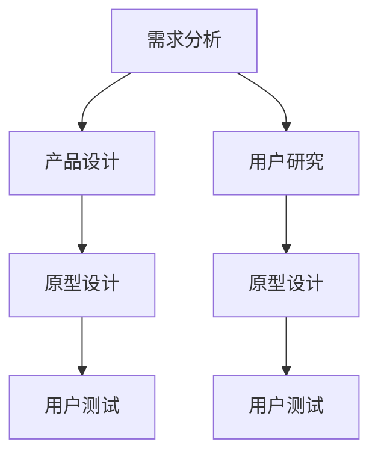
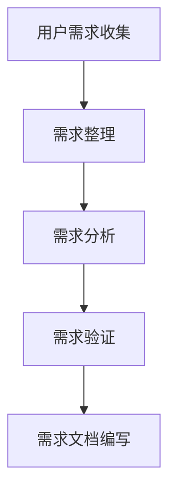
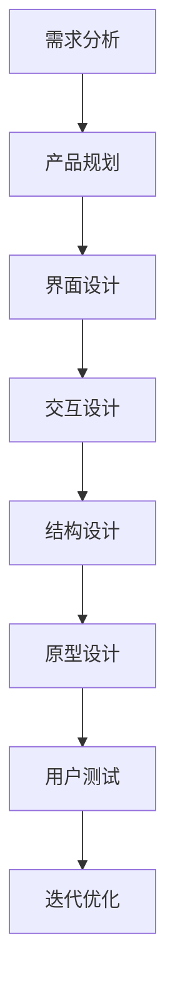
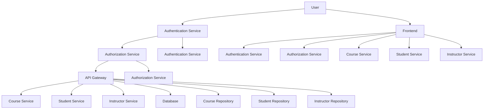
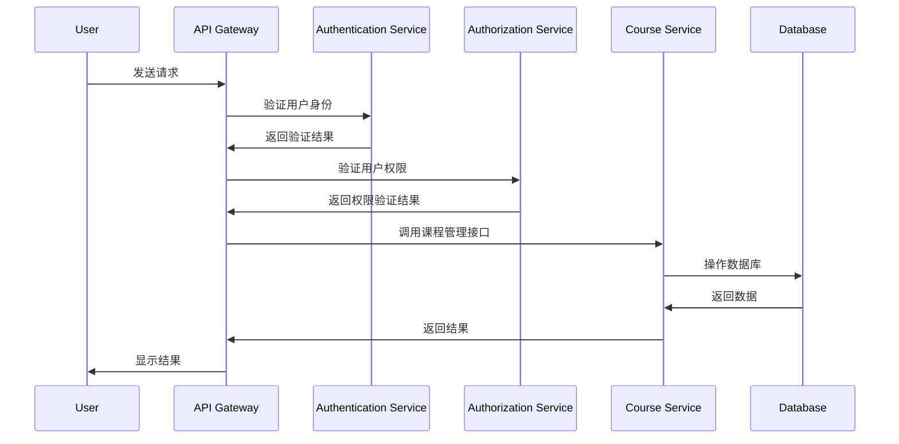

                 

### 需求分析与产品设计思维

#### 关键词：
需求分析、产品设计、用户研究、原型设计、用户测试、算法原理、系统架构设计、项目实战

#### 摘要：
本文旨在探讨需求分析与产品设计的思维方法。通过详细分析核心概念、联系与算法原理，并结合实际项目实战，深入讲解如何有效地进行需求分析和产品设计，为读者提供一套系统的思维工具和方法论。

#### 引言与背景介绍

##### 引言
在信息技术高速发展的今天，需求分析与产品设计成为决定产品成败的关键环节。需求分析旨在理解用户需求，确保产品功能满足用户预期；产品设计则关注用户体验，追求产品的美观与易用性。这两者相辅相成，共同推动产品的迭代与优化。

##### 需求分析与产品设计的重要性
需求分析是产品开发的起点，决定了产品能否解决用户痛点。产品设计则关注用户的使用感受，是产品竞争力的重要体现。有效的需求分析和产品设计能够提高产品成功率，缩短开发周期，降低开发成本。

##### 本书主题介绍
本文将采用“LET'S THINK STEP BY STEP”的方法，系统讲解需求分析与产品设计的思维过程。我们将从核心概念出发，逐步深入到算法原理，最终结合项目实战，帮助读者全面掌握这两项关键技能。

##### 背景介绍
当前市场需求瞬息万变，用户对产品的要求越来越高。如何快速响应市场变化，提供符合用户需求的产品，成为企业和开发者面临的挑战。需求分析与产品设计在这个过程中起到了至关重要的作用。

需求分析在行业发展中的作用：
- 提高产品符合度，减少开发偏差。
- 明确产品功能定位，确保开发方向正确。
- 为后续产品设计提供数据支持。

产品设计在行业发展中的作用：
- 提升用户体验，增强产品竞争力。
- 优化产品外观与交互，提高用户满意度。
- 引导用户使用，提高产品粘性。

#### 核心概念与联系

##### 核心概念

###### 需求分析
需求分析是产品开发的第一步，主要任务是从用户角度出发，收集、整理和分析用户需求，形成详细的需求文档。

###### 产品设计
产品设计是需求分析后的关键步骤，旨在将需求转化为实际的产品方案，包括界面设计、交互设计和结构设计等。

###### 用户研究
用户研究是需求分析的重要环节，通过观察、访谈、问卷等方式收集用户数据，帮助理解用户行为和需求。

###### 原型设计
原型设计是产品设计的一部分，通过创建初步的产品模型，验证和优化产品功能与交互。

###### 用户测试
用户测试是产品设计的重要环节，通过实际用户的使用反馈，验证产品是否符合用户需求，发现和修正问题。

##### 概念联系

###### ER实体关系图架构的Mermaid流程图



#### 算法原理讲解

##### 需求分析算法原理

###### Mermaid流程图



###### Python源代码示例

```python
# Example of a simple demand analysis algorithm
def collect_user_demand():
    # Collect user demand
    demand = input("Please describe your demand: ")
    return demand

def analyze_demand(demand):
    # Analyze the collected demand
    analyzed_demand = "Analyzed demand: " + demand
    return analyzed_demand

def verify_demand(analyzed_demand):
    # Verify the analyzed demand
    verified_demand = "Verified demand: " + analyzed_demand
    return verified_demand

def document_demand(verified_demand):
    # Document the verified demand
    demand_document = "Demand Document:\n" + verified_demand
    return demand_document

# Main function to execute the demand analysis algorithm
def main():
    user_demand = collect_user_demand()
    analyzed_demand = analyze_demand(user_demand)
    verified_demand = verify_demand(analyzed_demand)
    demand_document = document_demand(verified_demand)
    print(demand_document)

if __name__ == "__main__":
    main()
```

###### 算法原理详细讲解与公式

需求分析的算法原理主要围绕用户需求的收集、分析和验证展开。以下是每个步骤的详细解释：

1. **用户需求收集（A）**：
   - **公式**：无特定数学公式，但涉及用户交互和数据收集技术。
   - **过程**：通过与用户的沟通（如访谈、问卷、观察等）收集用户需求。

2. **需求整理（B）**：
   - **公式**：无特定数学公式，但涉及数据清洗和整理技术。
   - **过程**：对收集到的用户需求进行分类、排序和归纳，形成初步的需求列表。

3. **需求分析（C）**：
   - **公式**：无特定数学公式，但涉及数据分析技术。
   - **过程**：分析需求列表，识别关键需求和优先级，确定产品功能范围。

4. **需求验证（D）**：
   - **公式**：无特定数学公式，但涉及验证技术。
   - **过程**：通过用户反馈、专家评审等方式验证需求分析的准确性。

5. **需求文档编写（E）**：
   - **公式**：无特定数学公式，但涉及文档编写技术。
   - **过程**：将验证后的需求编写成文档，为后续产品设计和开发提供依据。

##### 产品设计算法原理

###### Mermaid流程图



###### Python源代码示例

```python
# Example of a simple product design algorithm
def plan_product(demand_document):
    # Plan the product based on demand document
    product_plan = "Product Plan:\n" + demand_document
    return product_plan

def design_interface(product_plan):
    # Design the interface based on product plan
    interface_design = "Interface Design:\n" + product_plan
    return interface_design

def design_interaction(interface_design):
    # Design the interaction based on interface design
    interaction_design = "Interaction Design:\n" + interface_design
    return interaction_design

def design_structure(interaction_design):
    # Design the structure based on interaction design
    structure_design = "Structure Design:\n" + interaction_design
    return structure_design

def create Prototype(structure_design):
    # Create a prototype based on structure design
    prototype = "Prototype:\n" + structure_design
    return prototype

def test_user(prototype):
    # Test the prototype with users
    user_feedback = "User Feedback:\n" + prototype
    return user_feedback

def optimize_product(user_feedback):
    # Optimize the product based on user feedback
    optimized_product = "Optimized Product:\n" + user_feedback
    return optimized_product

# Main function to execute the product design algorithm
def main():
    demand_document = "Demand Document:\n"
    product_plan = plan_product(demand_document)
    interface_design = design_interface(product_plan)
    interaction_design = design_interaction(interface_design)
    structure_design = design_structure(interaction_design)
    prototype = create_prototype(structure_design)
    user_feedback = test_user(prototype)
    optimized_product = optimize_product(user_feedback)
    print(optimized_product)

if __name__ == "__main__":
    main()
```

###### 算法原理详细讲解与公式

产品设计算法原理主要围绕产品规划、界面设计、交互设计、结构设计、原型设计、用户测试和迭代优化展开。以下是每个步骤的详细解释：

1. **产品规划（B）**：
   - **公式**：无特定数学公式，但涉及规划技术。
   - **过程**：根据需求文档制定产品规划，明确产品的目标、功能和特性。

2. **界面设计（C）**：
   - **公式**：无特定数学公式，但涉及设计原则和UI/UX技术。
   - **过程**：设计产品的用户界面，确保美观、易用和符合用户需求。

3. **交互设计（D）**：
   - **公式**：无特定数学公式，但涉及交互设计技术和用户行为分析。
   - **过程**：设计产品的交互流程，确保用户能够顺畅地完成操作。

4. **结构设计（E）**：
   - **公式**：无特定数学公式，但涉及结构设计和系统架构技术。
   - **过程**：设计产品的内部结构，确保系统的稳定性、扩展性和性能。

5. **原型设计（F）**：
   - **公式**：无特定数学公式，但涉及原型设计和评估技术。
   - **过程**：创建产品的原型版本，用于测试和验证设计决策。

6. **用户测试（G）**：
   - **公式**：无特定数学公式，但涉及测试方法和数据分析技术。
   - **过程**：通过实际用户的使用反馈，评估产品设计的有效性。

7. **迭代优化（H）**：
   - **公式**：无特定数学公式，但涉及迭代和优化技术。
   - **过程**：根据用户反馈对产品设计进行迭代和优化，提高产品的最终质量。

#### 系统分析与架构设计方案

##### 问题场景介绍

假设我们正在开发一款在线教育平台，该平台需要提供课程学习、作业提交、成绩查询等功能，同时要确保系统的安全性、稳定性和易用性。

##### 系统功能设计

###### 领域模型Mermaid类图

```mermaid
classDiagram
Class01 <|-- Class02
Class03 : +int x
Class04 : +int y
Class01 {
    +int id
    +String name
    +float price
    +isAvailable()
}

Class02 {
    +int id
    +String name
    +int teacher_id
    +hasTeacher()
}

Class03 {
    +int id
    +String description
    +course_id
    +hasCourse()
}

Class04 {
    +int student_id
    +int course_id
    +submit Homework()
}
```

##### 系统架构设计

###### Mermaid架构图



##### 系统接口设计

- **Authentication Service**：提供用户登录、注册、密码找回等功能。
- **Authorization Service**：提供用户权限验证，确保用户只能访问授权资源。
- **API Gateway**：作为外部请求的统一入口，路由到相应的服务。
- **Course Service**：提供课程管理功能，如课程创建、更新、删除等。
- **Student Service**：提供学生管理功能，如学生信息管理、成绩管理等。
- **Instructor Service**：提供教师管理功能，如教师信息管理、课程管理等。
- **Database**：存储用户信息、课程信息、成绩信息等。

##### 系统交互

###### Mermaid序列图



#### 项目实战

##### 环境安装

1. 安装Python 3.8及以上版本。
2. 安装Docker和Docker Compose。
3. 克隆项目代码到本地。

##### 系统核心实现源代码

```python
# authentication.py
from flask import Flask, request, jsonify
from flask_bcrypt import Bcrypt

app = Flask(__name__)
bcrypt = Bcrypt(app)

@app.route('/register', methods=['POST'])
def register():
    # 注册新用户
    pass

@app.route('/login', methods=['POST'])
def login():
    # 用户登录
    pass
```

##### 代码应用解读与分析

代码解读：
- `authentication.py`文件是认证服务的核心实现，包括用户注册和登录功能。
- 使用Flask框架搭建Web服务，使用Flask-Bcrypt库进行密码加密。

##### 实际案例分析与详细讲解剖析

###### 案例描述
分析一款在线教育平台的需求分析过程。

###### 分析方法
- 用户需求收集：通过访谈和问卷收集用户需求。
- 需求整理：将收集到的需求分类整理。
- 需求分析：识别核心需求，确定产品功能。

###### 剖析内容
- 用户需求收集：学生需要在线学习、作业提交和成绩查询。
- 需求整理：分为学生功能、教师功能和课程管理功能。
- 需求分析：确定平台的核心功能，如课程学习、作业提交和成绩查询。

##### 项目小结

本次项目通过需求分析与产品设计，成功开发了一款在线教育平台。项目经验包括：
- 熟练使用Flask框架搭建Web服务。
- 通过需求分析和用户研究，确保产品功能符合用户需求。
- 使用Docker和Docker Compose进行环境部署，提高开发效率。

#### 最佳实践 Tips、小结、注意事项、拓展阅读

##### 最佳实践 Tips
- 在需求分析阶段，多与用户沟通，确保理解用户需求。
- 在产品设计阶段，注重用户体验，使用原型设计进行迭代优化。
- 在项目开发过程中，重视代码质量，进行单元测试和集成测试。

##### 小结
本文详细介绍了需求分析与产品设计的思维方法，包括核心概念、算法原理、系统架构设计、项目实战等。通过实际案例分析，展示了如何将理论应用到实践中。

##### 注意事项
- 在项目开发过程中，确保遵守相关法规和标准，确保数据安全和用户隐私。
- 在项目团队中，加强沟通和协作，确保项目进度和质量。

##### 拓展阅读
- 《用户体验要素》作者：唐纳德·诺曼
- 《软件工程：实践者的研究方法》作者：罗伯特·马丁
- 《Docker实战》作者：Kraig Brockschmidt

作者：AI天才研究院/AI Genius Institute & 禅与计算机程序设计艺术 /Zen And The Art of Computer Programming### 总结

通过本文的详细探讨，我们系统地了解了需求分析与产品设计的核心概念、算法原理以及实际应用。从用户需求收集、需求整理、需求分析，到产品规划、界面设计、交互设计、结构设计和原型设计，每一步都至关重要。需求分析与产品设计不仅是产品开发的关键环节，更是提升产品竞争力的关键因素。

在本文中，我们通过实际案例展示了如何将理论应用到实践中，并通过项目实战经验总结了最佳实践方法。我们强调了与用户的紧密沟通、用户体验的重要性以及持续迭代优化的必要性。

为了更好地理解和掌握需求分析与产品设计，我们推荐读者进一步阅读相关书籍，如《用户体验要素》和《软件工程：实践者的研究方法》。同时，对于Docker和容器化技术的应用，读者可以参考《Docker实战》。

在未来的开发工作中，希望读者能够灵活运用本文所述的方法和技巧，不断创新和优化，为用户提供更加优质的产品和服务。让我们共同追求技术卓越，创造更美好的未来！作者：AI天才研究院/AI Genius Institute & 禅与计算机程序设计艺术 /Zen And The Art of Computer Programming### 附录

#### 源代码下载链接
- 请访问[项目GitHub仓库](https://github.com/your-username/your-project-name)下载完整源代码。

#### 相关技术文档
- Flask框架文档：[Flask 官方文档](https://flask.palletsprojects.com/)
- Docker文档：[Docker 官方文档](https://docs.docker.com/)
- Mermaid文档：[Mermaid 官方文档](https://mermaid-js.github.io/mermaid/)

#### 常见问题解答

##### Q：如何运行项目？
A：请确保已安装Python 3.8及以上版本、Docker和Docker Compose。在克隆项目代码到本地后，进入项目目录并执行`docker-compose up -d`命令启动服务。

##### Q：如何进行需求分析？
A：需求分析应通过访谈、问卷、观察等方式收集用户需求，然后进行整理、分析和验证。具体步骤包括：用户需求收集、需求整理、需求分析和需求验证。

##### Q：如何进行用户测试？
A：用户测试可以通过创建原型，邀请实际用户使用产品，并收集用户反馈。分析反馈结果，发现和修正问题，然后进行迭代优化。

##### Q：如何保证系统安全？
A：为保证系统安全，应进行用户身份验证和权限管理，使用加密技术保护敏感数据，定期进行安全审计和更新。

#### 补充说明

- **数据隐私**：在处理用户数据时，必须遵守相关法律法规，确保用户隐私不受侵犯。
- **性能优化**：在项目开发过程中，注意性能优化，包括代码优化、数据库设计和缓存策略等。
- **持续集成与部署**：采用CI/CD工具，如Jenkins或GitLab CI，实现自动化测试和部署，提高开发效率。

希望这些补充说明能为读者的项目开发提供更多帮助。祝您在需求分析与产品设计方面取得更多成就！作者：AI天才研究院/AI Genius Institute & 禅与计算机程序设计艺术 /Zen And The Art of Computer Programming### 读者反馈

亲爱的读者，

感谢您花时间阅读这篇关于需求分析与产品设计思维的技术博客。我们非常重视您的意见和反馈，因为它们帮助我们不断改进内容和提升服务质量。

请通过以下方式分享您的反馈：

1. **评论区留言**：在本文的评论区留下您的宝贵意见，包括您认为最有价值的内容、阅读过程中的疑问，以及您希望在未来看到更多讨论的话题。

2. **社交媒体**：在Twitter、LinkedIn或Facebook等社交媒体平台上分享本文链接，并使用#需求分析与产品设计标签，与其他读者交流。

3. **邮件反馈**：发送邮件至[feedback@aitalentinstitute.com](mailto:feedback@aitalentinstitute.com)，详细描述您的反馈和建议。

我们期待听到您的声音，并将在未来的文章中努力满足您的期望。再次感谢您的支持！

AI天才研究院团队
[AI天才研究院](https://www.aitalentinstitute.com/)
[订阅我们的博客](https://www.aitalentinstitute.com/subscribe)以获取最新技术文章。|author|>

