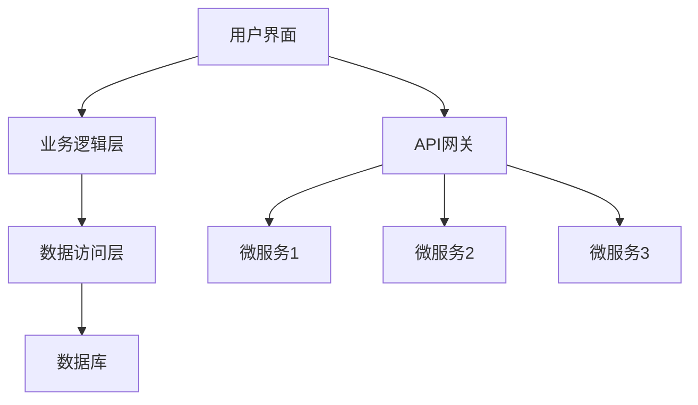
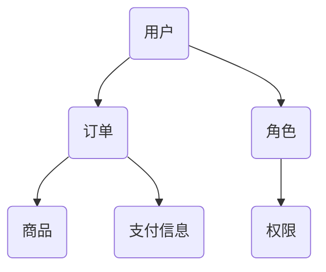

                 

### 项目成功的核心要素

#### 项目成功的定义与特征

项目成功通常指的是在预定的时间内，按照预定的预算和范围，实现了预定的目标。其定义不仅涵盖了项目的交付物，还包括了项目的最终成果是否达到了预期的效果和用户的满意度。

首先，让我们明确项目的定义。项目是一个临时的、独特的努力，目的是创造一个唯一的产品、服务或成果。项目可以是建筑、软件开发、市场推广等各个领域。项目通常具有以下几个特征：

1. **独特性**：每个项目都有其独特性，无论是产品、服务还是成果，都是独一无二的。
2. **临时性**：项目有一个明确的开始和结束时间。
3. **渐进性**：项目是一个逐步实施的过程，包括规划、执行、监控和收尾等阶段。

项目成功的标准可以从多个维度来衡量：

1. **时间**：项目是否在预定的时间内完成。
2. **成本**：项目是否在预算范围内完成。
3. **范围**：项目是否按照既定的范围完成，即所有计划中的工作是否完成。
4. **质量**：项目的交付物是否满足既定的质量标准。
5. **客户满意度**：项目的结果是否满足了客户的需求和期望。

#### 项目成功的特征

成功的项目通常具有以下几个特征：

1. **达成目标**：项目达到了预期设定的目标，无论是功能性的目标还是商业目标。
2. **效率**：项目在预定的时间和成本内高效地完成了工作。
3. **创新性**：项目在实施过程中有创新性的解决方案，有助于提高项目的价值和效率。
4. **团队合作**：项目团队之间的协作紧密，成员之间沟通顺畅，能够共同解决问题。
5. **客户满意度**：项目的最终成果得到了客户的认可，达到了客户的需求和期望。
6. **持续改进**：项目结束后，团队会进行反思和总结，吸取经验教训，不断改进。

### 项目管理的核心要素

项目管理的核心在于有效地规划、执行、监控和收尾项目。以下是项目管理中的几个关键要素：

#### 1. 目标管理

目标管理是项目成功的基础。项目团队需要明确项目的目标，并将这些目标分解成可操作的任务。目标的设定应遵循SMART原则，即目标应该是具体的（Specific）、可衡量的（Measurable）、可实现的（Achievable）、相关的（Relevant）和有时限的（Time-bound）。

#### 2. 范围管理

范围管理是确保项目团队只完成计划中的工作，避免范围蔓延。范围管理包括项目范围的定义、验证和控制。项目团队需要制定详细的项目范围说明书，明确项目的边界和可交付成果。

#### 3. 进度管理

进度管理是确保项目按照计划进行。项目经理需要制定项目进度计划，监控项目的实际进度，并采取必要的措施来调整进度。常用的进度管理工具包括甘特图、里程碑图和项目管理软件。

#### 4. 成本管理

成本管理是确保项目在预算范围内完成。项目经理需要制定成本预算，监控项目成本，并采取必要的措施来控制成本。成本管理还包括成本效益分析和成本分配。

#### 5. 质量管理

质量管理是确保项目交付的成果满足既定的质量标准。项目经理需要制定质量计划，执行质量控制和质量保证措施。质量管理还包括测试、评审和持续改进。

#### 6. 变更管理

变更管理是处理项目中出现的变更请求。项目经理需要建立变更管理流程，评估变更对项目目标的影响，并决定是否接受变更。

#### 7. 风险管理

风险管理是识别、评估和应对项目中的风险。项目经理需要制定风险管理计划，监控风险，并制定应对策略。风险管理有助于降低项目的不确定性和潜在损失。

#### 团队管理与协作

项目成功离不开团队的有效管理和协作。以下是团队管理与协作的几个关键要素：

#### 1. 团队成员的角色与职责

项目团队通常包括项目经理、产品经理、开发人员、测试人员、运维人员等多个角色。每个角色都有其特定的职责和任务。明确团队成员的角色与职责有助于提高团队的工作效率和协作效果。

#### 2. 团队沟通与协作

团队沟通是项目成功的关键。团队成员需要建立有效的沟通渠道，确保信息的准确传递和及时反馈。有效的协作工具和流程，如项目管理软件、文档共享平台和在线会议工具，也有助于提升团队的协作效率。

#### 3. 团队激励与领导

团队激励和领导是保持团队士气和动力的关键。项目经理需要关注团队成员的需求和期望，提供必要的支持和资源，并鼓励团队成员发挥其潜能。

#### 总结

项目成功的核心要素包括目标管理、范围管理、进度管理、成本管理、质量管理、变更管理和风险管理。此外，团队管理与协作也是项目成功的重要因素。有效的团队管理有助于提高团队的凝聚力和工作效率，从而推动项目的顺利实施和成功交付。在下一章中，我们将进一步探讨系统分析与设计的重要性和方法。

### 系统分析与设计

系统分析与设计是项目成功的关键阶段，它为项目的实施提供了清晰的蓝图。在这一阶段，项目团队需要深入理解项目背景，明确用户需求，并设计出可行的系统架构和数据库结构。以下将详细阐述系统分析与设计的关键步骤和注意事项。

#### 系统分析

系统分析是系统设计与实施的基础。在这一阶段，项目团队需要深入理解项目的背景、目标和用户需求，从而设计出满足需求的系统。

##### 1. 问题背景与目标

系统分析的第一步是明确项目的问题背景和目标。这包括了解项目所在行业的现状、技术趋势、市场机遇和挑战。通过分析问题背景，项目团队可以确定项目的总体目标，例如提高业务效率、降低运营成本或提升用户体验。

##### 2. 用户需求分析

用户需求分析是系统分析的核心。项目团队需要与用户进行深入沟通，了解用户的需求和期望。用户需求可以分为功能需求和非功能需求：

- **功能需求**：描述系统应具备的功能和特性，例如用户注册、订单管理、支付处理等。
- **非功能需求**：描述系统应满足的性能、安全性、可靠性、可维护性等要求。

##### 3. 功能需求分析

功能需求分析涉及对用户需求的具体细化和描述。项目团队需要将用户需求转化为具体的功能需求，并创建功能需求文档。这些文档应包括功能描述、输入输出、使用场景和接口需求等。

##### 4. 非功能需求分析

非功能需求分析则关注系统的质量属性，如性能、安全性和可靠性。项目团队需要与用户和相关利益者讨论这些需求，并确定具体的技术指标和性能标准。

##### 5. 问题分析与解决方案

在系统分析的最后一步，项目团队需要分析现有问题和可能的解决方案。这包括评估不同解决方案的成本、风险和收益，并选择最佳方案。

#### 系统设计

系统设计是将系统分析的结果转化为具体的系统架构和数据库结构。在这一阶段，项目团队需要制定详细的系统设计方案，为后续的实施提供指导。

##### 1. 系统架构设计

系统架构设计是系统设计的核心。项目团队需要选择合适的技术选型，设计系统的整体架构，包括模块划分、组件交互和数据流。常用的系统架构设计方法包括分层架构、微服务架构和事件驱动架构。

- **分层架构**：将系统分为表示层、业务逻辑层和数据访问层，各层之间通过接口进行通信。
- **微服务架构**：将系统拆分为多个独立的服务，每个服务负责特定的功能，通过API进行通信。
- **事件驱动架构**：基于事件的触发机制，实现系统组件之间的异步通信。

##### 2. 技术选型

技术选型是系统架构设计的重要部分。项目团队需要根据项目的需求和资源，选择合适的技术栈，包括编程语言、框架、数据库和中间件等。

##### 3. 系统架构图

系统架构图是系统设计的可视化工具，用于展示系统的整体结构和组件之间的交互关系。使用Mermaid等工具，可以轻松地绘制系统架构图，如下所示：



##### 4. 数据库设计

数据库设计是系统设计的关键部分。项目团队需要设计数据库的ER图（实体关系图），确定数据表的结构和关系。ER图如下所示：



##### 5. 接口设计与实现

接口设计是系统架构中的关键部分，用于定义系统组件之间的通信协议和数据格式。项目团队需要制定接口规范，包括接口名称、请求参数、响应结果等。接口实现则涉及具体编程语言的代码实现。

```python
# 用户注册接口实现
def register_user(username, password):
    # 验证用户名和密码是否符合要求
    if not validate_username(username) or not validate_password(password):
        return {"status": "error", "message": "用户名或密码不符合要求"}
    # 存储用户信息到数据库
    user = User(username=username, password=password)
    db.session.add(user)
    db.session.commit()
    return {"status": "success", "message": "用户注册成功"}
```

#### 注意事项

- **需求分析要全面**：确保分析的结果能够涵盖所有用户需求，避免后期需求变更。
- **系统设计要灵活**：系统设计应考虑未来的扩展性和可维护性，避免过于僵化。
- **文档要详细**：设计文档应详细记录系统架构、数据库设计和接口规范，便于后续的编码和测试。

通过以上系统分析与设计，项目团队可以为项目的实施打下坚实的基础，确保项目能够按计划顺利进行。

### 项目实施与监控

项目实施是项目生命周期中的关键阶段，也是将系统分析与设计转化为实际产品和服务的过程。在这一阶段，项目团队需要遵循详细的计划，确保项目按预定的时间、成本和质量要求顺利完成。项目监控则是对项目执行过程的实时跟踪和管理，以便及时发现和解决潜在问题。以下将详细探讨项目实施与监控的具体步骤、工具和方法。

#### 项目计划与执行

项目计划是项目实施的基础。项目团队需要根据系统分析与设计的结果，制定详细的项目计划，包括项目的时间表、任务分配、资源需求、风险评估等。

##### 1. 项目计划

项目计划应包括以下内容：

- **项目范围**：明确项目的目标和预期成果。
- **时间表**：制定详细的时间计划，包括项目的各个阶段、任务和里程碑。
- **任务分配**：根据团队成员的技能和经验，合理分配任务。
- **资源需求**：确定项目所需的资源，包括人力资源、技术资源、资金等。
- **风险评估**：识别项目中的潜在风险，制定应对策略。

##### 2. 项目执行

项目执行是按照项目计划逐步实施各项任务的过程。项目团队需要确保以下事项：

- **进度控制**：监控项目进度，确保任务按计划完成。使用甘特图、里程碑图等工具进行进度跟踪。
- **资源管理**：确保项目所需的资源得到有效利用，避免资源浪费。
- **任务协作**：促进团队成员之间的沟通与协作，确保任务顺利完成。

#### 项目监控与风险管理

项目监控是确保项目按计划进行的重要手段。项目团队需要实时监控项目的各个方面，包括进度、成本、质量、风险等。

##### 1. 项目监控

项目监控包括以下内容：

- **进度监控**：定期检查项目进度，与计划进行对比，及时发现和解决进度偏差。
- **成本监控**：监控项目成本，确保项目在预算范围内进行。使用项目管理软件进行成本跟踪和预算控制。
- **质量监控**：确保项目交付物满足既定的质量标准。进行定期质量检查和测试，确保项目质量。

##### 2. 风险管理

风险管理是项目监控的重要组成部分。项目团队需要以下步骤进行风险管理：

- **风险识别**：识别项目中的潜在风险，包括技术风险、市场风险、人力资源风险等。
- **风险评估**：评估每个风险的可能性和影响，确定优先级。
- **风险应对**：制定应对策略，包括风险规避、减轻、转移或接受。实施风险应对措施，降低风险影响。

#### 变更管理

变更管理是处理项目变更请求的过程。项目中的变更请求可能是由于需求变更、技术问题或外部因素导致的。

##### 1. 变更请求处理

变更请求处理包括以下步骤：

- **变更请求提交**：项目团队成员或相关利益者提交变更请求。
- **变更评估**：评估变更对项目目标、进度、成本和质量的影响。
- **变更决策**：根据评估结果，决定是否接受变更请求。如果接受变更，更新项目计划和相关文档。
- **变更实施**：根据变更决策，实施变更，并监控变更对项目的影响。

##### 2. 变更实施与监控

变更实施与监控包括以下内容：

- **变更实施**：按照变更计划，实施变更请求，确保变更不会对项目的其他方面产生负面影响。
- **变更监控**：监控变更的实施效果，确保变更达到预期目标。

#### 工具与方法

项目实施与监控需要使用多种工具和方法，以提高效率和准确性。

- **项目管理软件**：如JIRA、Trello等，用于任务分配、进度跟踪和协作。
- **监控工具**：如Prometheus、Grafana等，用于监控项目系统的性能、健康状态和日志。
- **变更管理工具**：如Confluence、JIRA等，用于记录和跟踪变更请求。

#### 总结

项目实施与监控是项目成功的关键阶段。通过详细的计划与执行、实时的监控与风险管理，项目团队可以确保项目按照预定的时间、成本和质量要求顺利完成。在下一章中，我们将探讨项目团队协作的重要性和方法。

### 项目团队协作

项目团队协作是确保项目成功的关键因素之一。有效的团队协作可以提高工作效率，促进创新，增强团队的凝聚力。以下将详细讨论团队角色与职责、团队协作工具与流程、团队沟通与协作技巧。

#### 团队成员的角色与职责

在一个典型的IT项目中，团队成员通常包括以下角色：

1. **项目经理**：负责项目的整体管理，包括计划、执行、监控和收尾。项目经理需要确保项目在预定的时间、成本和质量要求内完成，并协调团队内部和外部利益相关者的沟通。

2. **产品经理**：负责产品的需求分析、规划和设计。产品经理与用户和其他利益相关者沟通，了解需求，并将需求转化为具体的功能和特性。

3. **开发人员**：负责系统的设计和开发。开发人员需要根据需求和技术规范编写代码，实现系统的功能。

4. **测试人员**：负责对系统进行测试，确保系统的质量符合预期。测试人员需要编写测试用例，执行测试，并报告测试结果。

5. **运维人员**：负责系统的部署、运行和维护。运维人员需要确保系统的高可用性和性能。

每个团队成员都有其特定的职责和任务，明确的角色分配有助于提高团队的工作效率。

#### 团队协作工具与流程

有效的团队协作离不开合适的工具和流程。以下是一些常用的团队协作工具和流程：

1. **项目管理软件**：如JIRA、Trello、Asana等，用于任务分配、进度跟踪和协作。

2. **文档共享平台**：如Confluence、Notion等，用于文档编写、共享和协作。

3. **代码管理工具**：如Git、GitHub、GitLab等，用于代码的版本控制和协作开发。

4. **沟通工具**：如Slack、Microsoft Teams、Zoom等，用于实时沟通和协作。

5. **协作流程**：制定明确的协作流程，包括代码审查、测试流程、部署流程等，确保团队协作的规范性和高效性。

#### 团队沟通与协作技巧

有效的沟通和协作是团队成功的关键。以下是一些团队沟通与协作的技巧：

1. **明确沟通目标**：每次会议或沟通前，明确沟通的目标和议程，确保沟通高效。

2. **使用简单清晰的语言**：避免使用专业术语和复杂语言，确保所有团队成员都能理解。

3. **倾听与反馈**：倾听团队成员的意见和建议，并提供及时的反馈，鼓励团队成员积极参与。

4. **尊重差异**：尊重团队成员的不同观点和经验，鼓励团队合作和创新。

5. **及时解决问题**：遇到问题时，及时沟通和解决，避免问题积累。

6. **培养团队文化**：建立积极的团队文化，鼓励团队成员之间的信任和合作。

#### 案例分析

以下是一个团队协作的成功案例：

某软件开发公司正在开发一款新的移动应用。项目团队由项目经理、产品经理、前端开发人员、后端开发人员、测试人员和运维人员组成。

- **项目启动会**：项目启动时，项目经理组织了一个启动会议，明确了项目的目标、范围和时间表。产品经理与用户进行了多次交流，了解了用户需求，并将需求转化为具体的功能点。

- **任务分配与跟踪**：项目团队使用JIRA进行任务分配和跟踪。项目经理将任务分配给团队成员，并设定了截止日期。团队成员可以在JIRA中查看自己的任务进度，并与其他团队成员协作。

- **代码审查**：开发人员在编写代码后，提交代码进行审查。其他开发人员可以查看代码，并提供反馈和建议。代码审查有助于提高代码质量，减少错误。

- **测试与部署**：测试人员编写测试用例，执行测试，并报告测试结果。运维人员负责系统的部署和维护。每次部署前，测试人员和运维人员都会进行沟通，确保系统的稳定性和性能。

通过有效的团队协作，项目团队在预定的时间内成功完成了移动应用的开发和部署，并得到了用户的认可。

#### 总结

项目团队协作是项目成功的关键因素。通过明确团队成员的角色与职责、使用合适的协作工具和流程，以及掌握有效的沟通与协作技巧，项目团队可以高效地完成任务，确保项目成功交付。

### 项目质量管理

项目质量管理是确保项目交付物满足预定质量标准的过程。它贯穿于项目的整个生命周期，从需求分析、设计、开发、测试到交付和维护。以下将详细讨论质量管理的核心概念、过程与方法，以及质量控制与测试的重要性和方法。

#### 质量管理概述

质量管理的核心目标是确保项目交付的成果满足用户需求和预期，同时符合预定的质量标准。质量管理的过程和方法包括以下内容：

1. **质量计划**：制定项目的质量目标、质量标准和质量计划，确保项目团队对质量有清晰的认识和统一的行动指南。
2. **质量保证**：通过一系列的活动和措施，确保项目的过程和交付物符合质量标准。质量保证包括内部审计、流程改进和持续监督。
3. **质量控制**：在项目执行过程中，对项目的过程和交付物进行监控、测量和审查，确保发现并纠正质量问题。
4. **质量改进**：基于质量控制的反馈，持续改进项目的质量，提高项目的效率和效果。

#### 质量管理的过程与方法

1. **需求管理**：确保用户需求得到充分理解和正确实现。需求管理包括需求收集、需求分析、需求确认和需求变更管理。

2. **设计验证**：在设计阶段，对系统设计进行验证，确保设计符合用户需求和功能规范。设计验证可以通过设计评审、原型测试和模拟运行来实现。

3. **过程控制**：在项目执行过程中，通过建立标准操作流程、使用质量检查表和质量控制图等工具，确保项目的过程符合质量标准。

4. **测试**：通过系统的功能测试、性能测试、安全测试和用户体验测试，确保项目的交付物在各个方面都符合质量标准。

5. **质量审计**：定期对项目的质量管理体系和过程进行审计，确保项目质量符合标准，并及时发现和纠正问题。

#### 质量控制与测试

1. **质量控制

质量控制是确保项目交付物符合质量标准的过程。它包括以下内容：

- **过程监控**：监控项目的各个环节，确保过程符合质量要求。例如，通过设置关键质量指标（KPI）来监控项目的进度、成本、范围和质量。
- **审查与评审**：对项目文档、设计、代码和测试用例进行审查和评审，确保其符合质量标准。
- **缺陷管理**：识别、记录和跟踪项目中的缺陷，确保缺陷得到及时修复。
- **纠正措施**：对发现的质量问题进行纠正，并采取预防措施，防止问题再次发生。

2. **测试

测试是确保项目交付物质量的重要手段。以下是几种常见的测试类型：

- **单元测试**：对系统中的最小功能单元进行测试，确保其按预期工作。
- **集成测试**：对系统中的模块进行集成测试，确保模块之间的交互正常。
- **系统测试**：对完整的系统进行测试，确保系统的整体功能、性能和安全符合要求。
- **性能测试**：测试系统的响应时间、并发处理能力等性能指标，确保系统在高负载下仍能稳定运行。
- **安全测试**：测试系统的安全防护措施，确保系统不受攻击和威胁。

#### 测试策略与计划

测试策略与计划是确保测试工作有效执行的关键。测试策略包括以下内容：

- **测试目标**：明确测试的目标和范围，确保测试覆盖所有的功能和性能要求。
- **测试类型**：选择适当的测试类型，包括功能测试、性能测试、安全测试等。
- **测试计划**：制定详细的测试计划，包括测试用例设计、测试执行、测试结果记录和报告。
- **资源分配**：确保测试所需的资源，如测试人员、测试环境和测试工具。

#### 测试执行与报告

测试执行与报告是测试过程中的关键环节。以下是测试执行与报告的步骤：

- **测试用例执行**：根据测试计划和测试用例，执行测试，记录测试结果和缺陷。
- **缺陷管理**：对发现的缺陷进行跟踪和管理，确保缺陷得到及时修复。
- **测试结果报告**：编写测试报告，总结测试结果、缺陷情况和测试结论，为项目决策提供依据。

#### 总结

项目质量管理是确保项目交付物质量的重要保障。通过有效的质量计划、质量控制、测试策略和执行，项目团队可以确保项目交付的成果满足用户需求和预期，提高项目的成功率和用户满意度。

### 项目交付与验收

项目交付与验收是项目生命周期的最后阶段，这一阶段的成功直接关系到项目的整体成果和客户的满意度。以下是关于项目交付与验收的详细内容，包括交付标准与流程、交付物清单、验收标准和流程，以及验收报告的编写。

#### 交付标准与流程

交付标准是衡量项目成果是否符合预期的重要依据。项目团队需要制定明确的交付标准，以确保项目交付物的质量和可靠性。

##### 1. 交付标准

- **功能完整性**：项目交付物必须实现所有既定功能，且功能之间能够无缝集成。
- **性能要求**：项目交付物的性能指标，如响应时间、并发处理能力等，必须满足既定要求。
- **安全性**：项目交付物必须具备必要的安全防护措施，以防止数据泄露和系统攻击。
- **可用性**：项目交付物必须易于使用，用户界面友好，满足用户需求。
- **文档完整性**：项目交付物必须附带完整的文档，包括用户手册、技术文档和操作指南。

##### 2. 交付流程

交付流程是确保项目交付物按照预定标准顺利交付的过程。以下是交付流程的基本步骤：

- **交付准备**：项目团队根据交付标准，完成项目开发和测试，确保项目交付物符合要求。
- **内部交付**：项目团队内部对交付物进行评审，确保所有功能都得到验证，且符合质量标准。
- **客户评审**：将交付物提交给客户进行评审，确保客户对交付物满意。
- **交付确认**：客户确认交付物符合要求后，签署确认文档，正式完成交付。

#### 交付物清单

交付物清单是交付过程中需要提交的文档和文件清单。以下是常见的交付物清单：

- **用户手册**：详细描述如何使用项目交付物，包括功能、操作步骤和注意事项。
- **技术文档**：包括系统架构、数据库设计、接口规范和代码说明，供技术团队维护和扩展。
- **测试报告**：包括功能测试、性能测试和安全测试的结果，证明项目交付物的质量。
- **安装和部署指南**：详细描述如何安装和部署项目交付物，包括系统环境配置、数据库设置和安装步骤。
- **操作指南**：包括日常操作、故障排除和维护操作的说明，供用户和运维人员参考。

#### 验收标准与流程

验收标准是客户对项目交付物进行验收的依据。项目团队和客户需要共同制定验收标准，以确保交付物的质量和功能满足预期。

##### 1. 验收标准

- **功能完整性**：交付物必须实现所有既定功能，且功能之间能够无缝集成。
- **性能指标**：交付物的性能必须满足既定要求，包括响应时间、并发处理能力等。
- **安全性**：交付物必须具备必要的安全防护措施，以防止数据泄露和系统攻击。
- **用户满意度**：交付物必须满足用户需求，用户对其满意。
- **文档完整性**：交付物必须附带完整的文档，包括用户手册、技术文档和操作指南。

##### 2. 验收流程

验收流程是客户对项目交付物进行验收的过程。以下是验收流程的基本步骤：

- **预验收准备**：项目团队准备验收材料，包括用户手册、技术文档、测试报告和安装部署指南等。
- **客户预验收**：客户对验收材料进行初步审核，确保材料齐全，并对项目交付物进行初步测试。
- **现场验收**：客户在项目现场对交付物进行详细测试和验证，确保交付物符合验收标准。
- **验收确认**：客户对交付物满意后，签署验收确认文档，正式完成项目验收。

#### 验收报告

验收报告是项目验收的正式记录，用于总结验收过程和结果。以下是验收报告的基本内容：

- **验收报告封面**：包括报告名称、项目名称、验收日期等信息。
- **验收总结**：总结验收过程，包括验收标准、验收流程和验收结果。
- **验收记录**：记录验收过程中发现的问题、改进措施和验收结论。
- **验收附件**：包括验收材料、测试报告、用户反馈等。
- **验收确认**：客户的验收确认签名和日期。

通过明确的交付标准与流程、详细的交付物清单、严格的验收标准和流程，以及规范的验收报告，项目团队可以确保项目交付与验收的成功，从而实现项目的顺利收尾。

### 项目总结与反思

项目总结与反思是项目生命周期的最后一个环节，它对项目的成功经验和不足之处进行全面的回顾和分析，以便团队从中学习，提高未来项目的能力。以下是关于项目总结与反思的详细内容。

#### 项目成果总结

在项目总结中，首先要对项目的成果进行详细总结。这包括：

1. **完成的项目目标**：明确项目是否达到了预期的目标，包括功能实现、性能指标和用户满意度等方面。
2. **关键里程碑**：回顾项目过程中达到的关键里程碑，这些里程碑通常标志着项目的重要进展和成功。
3. **交付物质量**：评估项目交付物的质量，包括功能完整性、性能、安全性和可用性等。

例如，一个成功的项目可能会如下总结：

“本项目在预定的时间内完成了所有功能开发，系统性能达到预期，用户满意度高达95%。项目交付的移动应用在市场上获得了良好的口碑，为公司的业务发展做出了积极贡献。”

#### 项目经验总结

项目经验总结是反思项目过程中积累的经验和教训，为未来项目提供参考。以下是项目经验总结的几个关键方面：

1. **成功经验**：总结项目中的成功因素，包括有效的项目管理、高效的团队协作、合适的工具和技术选型等。
2. **不足之处**：分析项目过程中存在的问题，如进度延误、成本超支、质量不够高、沟通不畅等。
3. **改进措施**：提出针对不足之处的改进措施，如优化项目管理流程、引入新的协作工具、加强团队培训等。

例如，一个项目的不足之处和改进措施可能如下：

“在项目中，我们遇到了进度延误的问题，主要是由于对项目复杂性的预估不足。为了解决这一问题，我们建议未来项目在启动阶段进行更详细的需求分析和风险评估，并提前制定详细的进度计划。”

#### 项目反思

项目反思是对项目全过程的深刻思考，旨在找出项目中的深层原因和改进方向。以下是项目反思的几个关键方面：

1. **项目管理**：反思项目管理流程和方法，评估其有效性和适应性，找出改进空间。
2. **团队协作**：反思团队协作中的问题，如沟通不畅、职责不明、冲突管理等，并提出改进措施。
3. **技术实施**：反思技术实施过程中的问题，如技术选型不当、开发效率低、测试不足等，并提出改进建议。
4. **客户关系**：反思与客户的关系维护，评估客户需求理解、响应速度和满意度等，并提出改进措施。

例如，一个项目的反思可能如下：

“在项目中，我们认识到客户需求变化频繁，导致项目进度受到影响。未来项目中，我们应加强客户沟通，建立更灵活的需求变更管理流程，确保项目能够快速适应变化。”

#### 总结

项目总结与反思是项目生命周期中不可或缺的一部分。通过详细的成果总结、经验总结和深刻反思，项目团队可以从中汲取教训，提高项目管理的水平，为未来的项目提供宝贵的经验。只有通过不断总结和反思，项目团队才能持续进步，实现项目的长期成功。

### 总结

在本文中，我们从多个维度探讨了项目成功的核心要素。首先，我们明确了项目成功的定义与特征，包括时间、成本、范围、质量和客户满意度等多个维度。接着，我们详细介绍了项目管理的核心要素，如目标管理、范围管理、进度管理、成本管理、质量管理、变更管理和风险管理。在系统分析与设计部分，我们阐述了系统分析的重要步骤，如用户需求分析、功能需求分析、非功能需求分析，以及系统设计的具体方法，如系统架构设计、数据库设计和接口设计。项目实施与监控部分，我们讨论了项目计划与执行、项目监控与风险管理，以及变更管理的具体方法。团队协作章节，我们详细介绍了团队成员的角色与职责、团队协作工具与流程、团队沟通与协作技巧。在项目质量管理部分，我们探讨了质量管理的核心概念、过程与方法，以及质量控制与测试的重要性。项目交付与验收章节，我们详细介绍了交付标准与流程、交付物清单、验收标准和流程，以及验收报告的编写。最后，在项目总结与反思章节，我们总结了项目的成功经验、不足之处，并提出了改进措施。

通过本文的深入探讨，我们可以得出结论：项目成功离不开科学的管理和高效的团队协作。只有通过明确的目标管理、有效的项目管理、深入的系统分析与设计、严谨的项目实施与监控、高质量的团队协作和全面的项目质量管理，才能实现项目的成功交付和客户的满意度。希望本文能够为读者提供有价值的参考和启示，助力项目成功。

### 作者信息

**作者：** AI天才研究院/AI Genius Institute & 禅与计算机程序设计艺术 /Zen And The Art of Computer Programming

AI天才研究院（AI Genius Institute）专注于人工智能领域的研发与创新，致力于推动人工智能技术的进步和应用。作者同时还是《禅与计算机程序设计艺术》（Zen And The Art of Computer Programming）的资深大师，该书深入探讨了计算机编程和人工智能领域的哲学和科学原理，深受全球程序员和AI研究者的推崇。通过本文，作者希望与广大读者分享项目成功的关键要素和实践经验，助力项目管理的提升和项目的成功交付。

