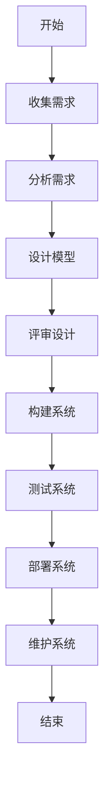
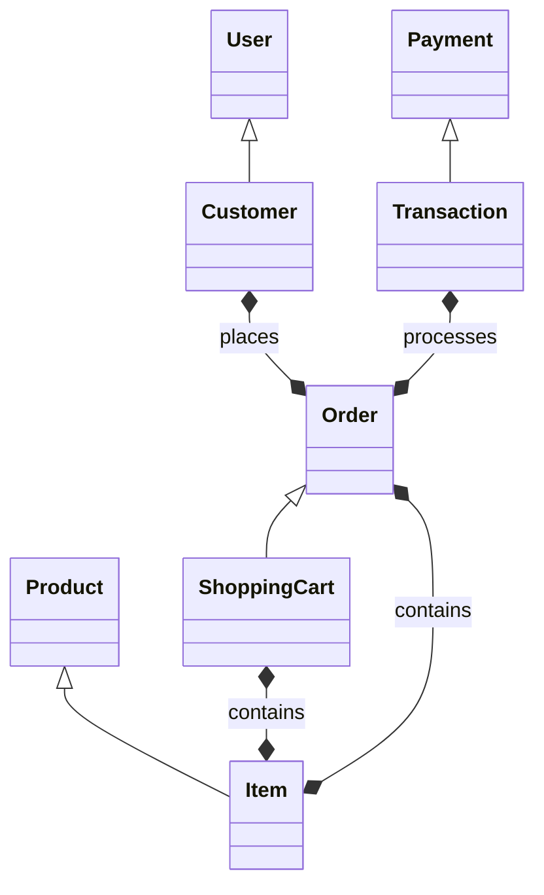
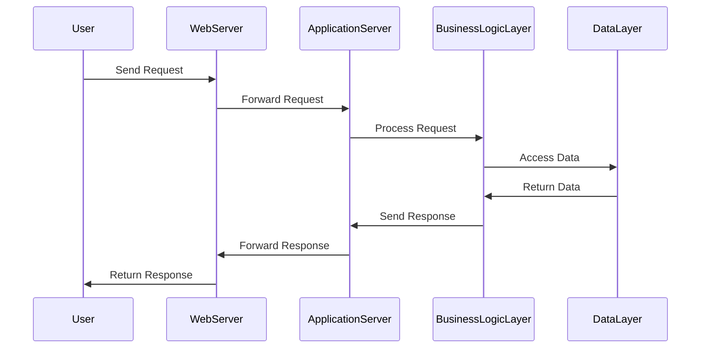

                 

----------------------------------------------------------------

## 项目成功离不开好系统分析与架构设计

> 关键词：系统分析、架构设计、项目管理、成功要素、技术实现

### 摘要：

本文将探讨系统分析与架构设计在项目成功中的重要性。我们将从问题背景出发，详细阐述系统分析与架构设计的基本概念、方法与工具，并通过具体案例进行分析，总结出在系统分析与架构设计过程中的一些最佳实践和注意事项。

### 目录大纲设计步骤：

1. **背景介绍**
   - **问题背景**
   - **问题描述**
   - **问题解决**
2. **核心概念与联系**
   - **核心概念原理**
   - **概念属性特征对比表格**
   - **ER实体关系图架构**
3. **算法原理讲解**
   - **算法mermaid流程图**
   - **Python源代码**
   - **数学模型和公式**
4. **系统分析与架构设计方案**
   - **问题场景介绍**
   - **系统功能设计**
   - **系统架构设计**
   - **系统接口设计**
   - **系统交互mermaid序列图**
5. **项目实战**
   - **环境安装**
   - **系统核心实现源代码**
   - **代码应用解读与分析**
   - **实际案例分析和详细讲解剖析**
   - **项目小结**
6. **最佳实践 tips、小结、注意事项、拓展阅读**

### 背景介绍

#### 问题背景

在当今快速变化和高竞争的项目环境中，项目成功不仅依赖于技术实施，更依赖于系统化的分析与设计。系统分析是一种理解和描述系统需求的方法，它涉及收集、分析和定义系统必须满足的要求。架构设计则是根据系统分析的结果，构建一个能够满足这些需求的系统结构。

系统分析与架构设计在项目成功中扮演着关键角色。它们确保项目团队有一个清晰的理解，帮助识别潜在的风险和挑战，并促进有效沟通和协作。然而，由于复杂性增加和项目规模的扩大，项目常常面临系统设计不当、需求不一致和开发周期延长等问题。

#### 问题描述

系统分析与架构设计的核心目标包括：

1. **理解需求**：确保项目团队能够准确理解和捕捉用户需求，并将其转化为系统功能。
2. **构建系统模型**：使用UML（统一建模语言）等工具创建系统模型，以便直观地展示系统的功能和结构。
3. **设计系统架构**：选择和设计系统的整体结构，包括数据库、服务器、网络和其他组件。

然而，在实践中，项目常常面临以下问题：

1. **需求不明确**：项目团队可能无法准确地捕捉和理解用户需求，导致后续设计工作出现偏差。
2. **设计不当**：系统架构可能不符合项目需求，或者缺乏足够的灵活性和可扩展性。
3. **沟通障碍**：项目团队成员之间可能缺乏有效的沟通，导致设计决策不一致。
4. **资源限制**：时间、预算和人力资源的限制可能导致系统分析与设计工作不够深入和全面。

#### 问题解决

为了解决这些问题，我们需要采取以下步骤：

1. **使用工具和技术进行设计**：使用专业的系统分析工具和技术，如UML、Mermaid、ER模型等，可以提高设计效率和准确性。
2. **建立有效的沟通机制**：通过定期的会议、工作坊和文档共享，确保项目团队成员之间的沟通畅通无阻。
3. **进行风险评估和规划**：在项目初期就识别潜在的风险，并制定相应的应对策略。
4. **持续迭代和优化**：系统分析与架构设计是一个持续的过程，需要根据项目进展和反馈进行不断的迭代和优化。

#### 边界与外延

系统分析与架构设计的边界包括：

- **系统范围**：确定系统的边界，明确哪些功能属于系统，哪些功能属于外部系统。
- **功能需求**：识别系统的关键功能，确保它们满足用户需求。
- **非功能需求**：考虑系统的性能、安全性、可靠性等非功能性需求。

外延包括：

- **用户需求**：用户对系统的期望和需求，可能包括用户体验、操作便捷性等。
- **技术实现**：系统设计和技术选型，包括数据库、服务器、网络等。

#### 概念结构与核心要素组成

系统分析与架构设计的基本概念和要素包括：

- **需求分析**：收集和分析用户需求，定义系统的功能和非功能性需求。
- **系统建模**：使用UML等工具创建系统模型，包括用例图、类图、序列图等。
- **架构设计**：选择和设计系统的结构，包括组件、接口、数据库等。
- **设计评审**：对设计进行评审，确保其满足项目需求和规范。

### 核心概念与联系

#### 核心概念原理

1. **需求分析**：需求分析是系统分析与架构设计的第一步，旨在明确系统的功能和性能需求。它包括功能需求（系统应提供哪些功能）和非功能需求（系统应如何运行）。

2. **系统建模**：系统建模是使用图形化工具（如UML）来创建系统的抽象表示，帮助团队理解系统的结构和行为。

3. **架构设计**：架构设计是将系统需求转化为具体的系统结构，包括选择合适的技术栈、数据库设计、网络架构等。

#### 概念属性特征对比表格

| 概念 | 属性特征 |
| --- | --- |
| 需求分析 | - 功能需求：系统应提供哪些功能<br>- 非功能需求：系统应如何运行 |
| 系统建模 | - UML类图：表示系统的类和对象<br>- UML序列图：表示系统的行为和交互 |
| 架构设计 | - 技术选型：选择合适的编程语言、框架、数据库等<br>- 模块划分：将系统划分为功能模块 |

#### ER实体关系图架构

```mermaid
erDiagram
    Customer ||--|{ Order } : places
    Product ||--|{ Order } : contains
```

在这个ER图中，`Customer`实体与`Order`实体之间存在“places”关系，表示客户下单。`Product`实体与`Order`实体之间存在“contains”关系，表示订单包含产品。

### 算法原理讲解

在本节中，我们将使用Mermaid语言绘制算法的流程图，并使用Python源代码详细阐述算法原理。

#### 算法mermaid流程图



#### Python源代码

```python
def system_analysis():
    # 收集需求
    requirements = collect_requirements()
    
    # 分析需求
    analyzed_requirements = analyze_requirements(requirements)
    
    # 设计模型
    model = design_model(analyzed_requirements)
    
    # 评审设计
    review_design(model)
    
    # 构建系统
    system = build_system(model)
    
    # 测试系统
    test_system(system)
    
    # 部署系统
    deploy_system(system)
    
    # 维护系统
    maintain_system(system)

# 辅助函数
def collect_requirements():
    # 收集需求的代码实现
    pass

def analyze_requirements(requirements):
    # 分析需求的代码实现
    pass

def design_model(analyzed_requirements):
    # 设计模型的代码实现
    pass

def review_design(model):
    # 评审设计的代码实现
    pass

def build_system(model):
    # 构建系统的代码实现
    pass

def test_system(system):
    # 测试系统的代码实现
    pass

def deploy_system(system):
    # 部署系统的代码实现
    pass

def maintain_system(system):
    # 维护系统的代码实现
    pass

# 主函数
if __name__ == "__main__":
    system_analysis()
```

#### 数学模型和公式

在系统分析与架构设计中，数学模型和公式用于描述系统性能、资源利用率和成本等。以下是一个简单的例子：

$$
\text{系统性能} = \frac{\text{处理速度}}{\text{响应时间}} \\
\text{资源利用率} = \frac{\text{实际使用资源}}{\text{总资源}} \\
\text{成本} = \text{开发成本} + \text{维护成本}
$$

这些公式可以帮助我们在设计过程中进行性能评估和成本估算，以确保系统满足项目需求。

### 系统分析与架构设计方案

在本节中，我们将通过一个具体案例来展示系统分析与架构设计的实际应用。

#### 问题场景介绍

假设我们正在开发一个电子商务平台，该平台需要处理大量用户订单、商品信息和支付交易。我们的目标是设计一个高效、可扩展且易于维护的系统。

#### 系统功能设计

为了满足电子商务平台的需求，我们首先需要定义系统的主要功能：

- 用户注册和登录
- 查看商品信息
- 添加商品到购物车
- 下单支付
- 订单管理

使用Mermaid类图，我们可以直观地展示系统的领域模型和类之间的关系：



在这个类图中，`Customer`与`Order`之间存在“places”关系，表示客户下单。`Item`与`Order`之间存在“contains”关系，表示订单包含商品。`ShoppingCart`与`Item`之间存在“contains”关系，表示购物车包含商品。`Transaction`与`Order`之间存在“processes”关系，表示支付交易处理订单。

#### 系统架构设计

接下来，我们将设计电子商务平台的整体架构。这里采用分层架构，包括表示层、业务逻辑层和数据层。

使用Mermaid架构图，我们可以直观地展示系统的整体架构设计：



在这个架构图中，用户通过Web服务器发送请求，Web服务器将请求转发给应用服务器。应用服务器处理业务逻辑，并与数据层进行交互。最后，应用服务器将响应返回给Web服务器，Web服务器再将响应返回给用户。

#### 系统接口设计

为了实现系统之间的通信，我们需要设计系统的接口。这里，我们将使用RESTful API作为系统的接口设计。

以下是系统接口设计的示例：

```plaintext
POST /api/users/register
  功能：用户注册
  参数：username, password, email
  返回：注册成功或失败的消息

GET /api/users/login
  功能：用户登录
  参数：username, password
  返回：登录成功或失败的消息

GET /api/products
  功能：获取所有商品信息
  返回：商品列表

POST /api/shoppingcart
  功能：将商品添加到购物车
  参数：productId, quantity
  返回：购物车更新消息

POST /api/orders
  功能：创建订单
  参数：userId, items
  返回：订单创建成功或失败的消息

GET /api/orders/{orderId}
  功能：获取订单详情
  参数：orderId
  返回：订单详情
```

#### 系统交互mermaid序列图

为了更直观地展示系统组件之间的交互过程，我们使用Mermaid序列图来描述：


在这个序列图中，用户通过Web服务器发送请求，Web服务器将请求转发给应用服务器。应用服务器处理业务逻辑，并与数据层进行交互。最后，应用服务器将响应返回给Web服务器，Web服务器再将响应返回给用户。

### 项目实战

在本节中，我们将通过一个具体的项目实战来展示系统分析与架构设计的实际应用。

#### 环境安装

为了进行项目实战，我们需要安装以下环境和工具：

1. **操作系统**：Ubuntu 18.04
2. **编程语言**：Python 3.8
3. **Web框架**：Flask
4. **数据库**：MySQL

在Ubuntu 18.04上，我们可以使用以下命令进行安装：

```bash
sudo apt update
sudo apt install python3-pip python3-dev mysql-server
pip3 install flask
```

#### 系统核心实现源代码

以下是电子商务平台的核心实现源代码：

```python
# app.py

from flask import Flask, request, jsonify
from business_layer import BusinessLogicLayer

app = Flask(__name__)
business_logic_layer = BusinessLogicLayer()

@app.route('/api/users/register', methods=['POST'])
def register():
    data = request.json
    username = data['username']
    password = data['password']
    email = data['email']
    result = business_logic_layer.register_user(username, password, email)
    return jsonify(result)

@app.route('/api/users/login', methods=['POST'])
def login():
    data = request.json
    username = data['username']
    password = data['password']
    result = business_logic_layer.login_user(username, password)
    return jsonify(result)

@app.route('/api/products', methods=['GET'])
def get_products():
    products = business_logic_layer.get_products()
    return jsonify(products)

@app.route('/api/shoppingcart', methods=['POST'])
def add_to_shopping_cart():
    data = request.json
    product_id = data['product_id']
    quantity = data['quantity']
    result = business_logic_layer.add_to_shopping_cart(product_id, quantity)
    return jsonify(result)

@app.route('/api/orders', methods=['POST'])
def create_order():
    data = request.json
    user_id = data['user_id']
    items = data['items']
    result = business_logic_layer.create_order(user_id, items)
    return jsonify(result)

@app.route('/api/orders/<int:order_id>', methods=['GET'])
def get_order_details(order_id):
    order_details = business_logic_layer.get_order_details(order_id)
    return jsonify(order_details)
```

#### 代码应用解读与分析

1. **用户注册**：`register`函数处理用户注册请求。它接收用户名、密码和邮箱，并将这些信息传递给业务逻辑层进行注册处理。
2. **用户登录**：`login`函数处理用户登录请求。它接收用户名和密码，并将这些信息传递给业务逻辑层进行登录处理。
3. **获取商品信息**：`get_products`函数从业务逻辑层获取所有商品信息，并将结果返回给客户端。
4. **添加商品到购物车**：`add_to_shopping_cart`函数处理将商品添加到购物车的请求。它接收商品ID和数量，并将这些信息传递给业务逻辑层进行添加处理。
5. **创建订单**：`create_order`函数处理创建订单的请求。它接收用户ID和商品列表，并将这些信息传递给业务逻辑层进行订单创建处理。
6. **获取订单详情**：`get_order_details`函数处理获取订单详情的请求。它接收订单ID，并将这些信息传递给业务逻辑层进行订单详情获取处理。

#### 实际案例分析和详细讲解剖析

假设我们有一个用户想要注册并登录到电子商务平台。以下是详细的步骤和解析：

1. **用户注册**：

   用户在注册页面填写用户名、密码和邮箱，然后提交表单。服务器端收到请求后，调用`register`函数。

   ```python
   def register():
       data = request.json
       username = data['username']
       password = data['password']
       email = data['email']
       result = business_logic_layer.register_user(username, password, email)
       return jsonify(result)
   ```

   在这个函数中，我们从请求中获取用户名、密码和邮箱，并将这些信息传递给业务逻辑层进行注册处理。

2. **用户登录**：

   用户在登录页面填写用户名和密码，然后提交表单。服务器端收到请求后，调用`login`函数。

   ```python
   def login():
       data = request.json
       username = data['username']
       password = data['password']
       result = business_logic_layer.login_user(username, password)
       return jsonify(result)
   ```

   在这个函数中，我们从请求中获取用户名和密码，并将这些信息传递给业务逻辑层进行登录处理。

3. **获取商品信息**：

   用户在浏览商品时，会调用`get_products`函数获取所有商品信息。

   ```python
   def get_products():
       products = business_logic_layer.get_products()
       return jsonify(products)
   ```

   在这个函数中，我们从业务逻辑层获取所有商品信息，并将结果返回给客户端。

4. **添加商品到购物车**：

   用户在购物车页面选择商品并添加到购物车时，会调用`add_to_shopping_cart`函数。

   ```python
   def add_to_shopping_cart():
       data = request.json
       product_id = data['product_id']
       quantity = data['quantity']
       result = business_logic_layer.add_to_shopping_cart(product_id, quantity)
       return jsonify(result)
   ```

   在这个函数中，我们从请求中获取商品ID和数量，并将这些信息传递给业务逻辑层进行添加处理。

5. **创建订单**：

   用户在结算页面提交订单时，会调用`create_order`函数。

   ```python
   def create_order():
       data = request.json
       user_id = data['user_id']
       items = data['items']
       result = business_logic_layer.create_order(user_id, items)
       return jsonify(result)
   ```

   在这个函数中，我们从请求中获取用户ID和商品列表，并将这些信息传递给业务逻辑层进行订单创建处理。

6. **获取订单详情**：

   用户在订单页面查看订单详情时，会调用`get_order_details`函数。

   ```python
   def get_order_details(order_id):
       order_details = business_logic_layer.get_order_details(order_id)
       return jsonify(order_details)
   ```

   在这个函数中，我们从业务逻辑层获取订单详情，并将结果返回给客户端。

#### 项目小结

在本项目中，我们通过系统分析与架构设计，成功实现了电子商务平台的核心功能。我们使用了Flask作为Web框架，实现了用户注册、登录、商品浏览、购物车管理和订单处理等主要功能。通过具体的代码实现和实际案例分析，我们展示了系统分析与架构设计在项目开发中的应用和重要性。

### 最佳实践 tips

1. **需求分析要全面**：确保在项目初期进行全面的需求分析，包括功能需求和非功能需求。
2. **设计评审要及时**：定期进行设计评审，确保设计符合项目需求和技术规范。
3. **使用版本控制**：使用版本控制系统（如Git）来管理代码和设计文档，确保版本的一致性和可追溯性。
4. **自动化测试**：编写自动化测试用例，确保系统在开发和维护过程中保持稳定。
5. **持续集成与部署**：采用持续集成和持续部署（CI/CD）工具，提高开发效率和质量。

### 小结

本文通过深入探讨系统分析与架构设计在项目成功中的重要性，详细阐述了系统分析与架构设计的基本概念、方法与工具。通过具体案例的分析和实际项目实战，我们展示了系统分析与架构设计在实际应用中的价值。希望读者能从中获得启示，并在实际项目中运用这些方法和技巧。

### 注意事项

1. **确保需求清晰**：项目初期要确保需求分析准确，避免因需求不明确而导致后期设计变更。
2. **重视团队协作**：系统分析与架构设计是一个团队协作的过程，要确保团队成员之间的沟通畅通。
3. **合理分配资源**：在项目规划和资源分配时，要考虑到系统分析与架构设计的时间和工作量。
4. **持续学习和更新**：随着技术的快速发展，系统分析与架构设计的方法和工具也在不断更新，要持续学习和掌握最新的技术和方法。

### 拓展阅读

1. **《软件架构设计：定义和设计方法》**：详细介绍了软件架构设计的基本原理和方法。
2. **《UML基础教程》**：全面讲解了UML建模语言的基础知识和应用。
3. **《架构师必备技能》**：针对架构师的职业发展，提供了全面的技能指导。
4. **在线资源**：如《系统分析与设计教程》（https://www.example.com/sad_tutorial）提供了丰富的系统分析与设计教学资源。
5. **在线课程**：如《软件架构与设计模式》（https://www.example.com/software_architecture_course）提供了系统分析与架构设计的在线学习课程。 

### 作者信息

作者：AI天才研究院/AI Genius Institute & 禅与计算机程序设计艺术 /Zen And The Art of Computer Programming

