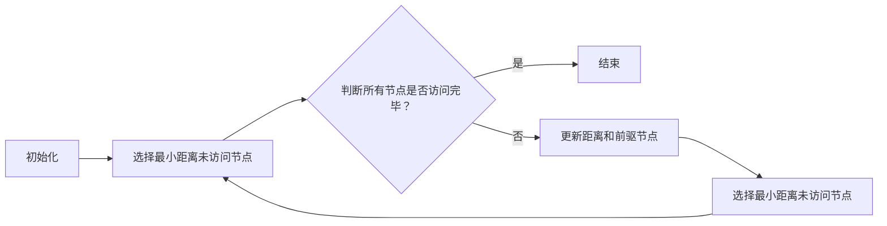
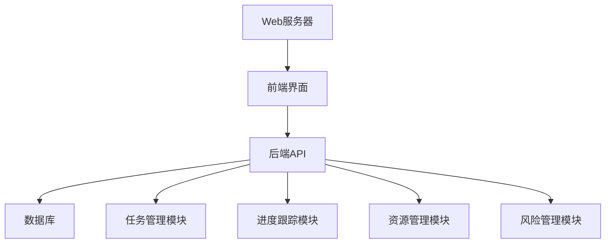
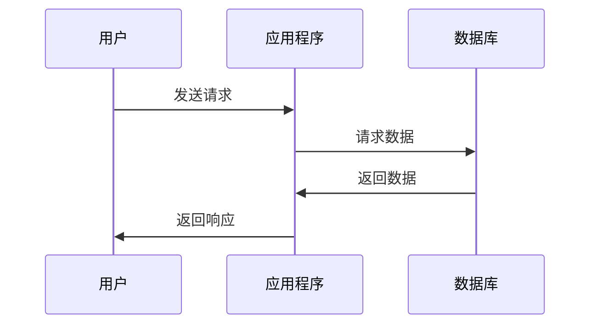

                 


### 1. 背景介绍

#### 1.1 项目管理的概念

项目管理是一种系统的方法，用于规划、执行和控制项目，以确保项目的目标得以实现。项目管理不仅仅涉及技术层面，还包括管理资源、时间和风险等多个方面。项目管理中的核心概念包括项目管理计划、工作分解结构（WBS）、关键路径分析等。

- **项目管理计划**：这是一个详细的文档，描述了项目的目标、范围、方法、时间和成本等。它是项目管理团队在项目执行过程中遵循的指南。
- **工作分解结构（WBS）**：这是将项目工作分解成可管理的任务和活动的层级结构。WBS有助于项目团队更好地理解和分配工作。
- **关键路径分析**：这是确定项目中最长的序列任务，这些任务的完成时间直接决定了整个项目的持续时间。关键路径分析有助于识别项目中的瓶颈和风险。

#### 1.2 项目管理的重要性

在技术团队中，项目管理的重要性不容忽视。以下是一些关键点：

- **资源管理**：技术团队通常由多个专业的人员组成，包括程序员、设计师、测试工程师等。有效的项目管理有助于合理分配这些资源，确保项目按计划进行。
- **进度控制**：项目管理工具和方法有助于监控项目进度，及时发现并解决问题，确保项目按时完成。
- **风险管理**：项目中的不确定性很大，有效的项目管理可以识别和管理潜在的风险，降低项目失败的可能性。

#### 1.3 项目管理在技术团队中的应用问题

尽管项目管理的重要性显而易见，但在技术团队中实施项目管理仍然面临一些挑战：

- **技术复杂性**：技术项目通常涉及复杂的技术问题和不断变化的需求，这给项目管理带来了额外的挑战。
- **团队协作**：技术团队成员往往具有较高的专业技能，但在项目管理和沟通方面可能存在不足。
- **进度与质量平衡**：在技术项目中，如何平衡进度和质量是一个关键问题。项目管理需要确保在有限的时间内交付高质量的产品。

### 2. 核心概念与联系

#### 2.1 定义项目管理中的关键概念

- **项目管理计划**：项目管理计划是一个详细的文档，描述了项目的目标、范围、方法、时间和成本等。它是项目管理团队在项目执行过程中遵循的指南。

- **工作分解结构（WBS）**：工作分解结构（WBS）是将项目工作分解成可管理的任务和活动的层级结构。WBS有助于项目团队更好地理解和分配工作。

- **关键路径分析**：关键路径分析是确定项目中最长的序列任务，这些任务的完成时间直接决定了整个项目的持续时间。关键路径分析有助于识别项目中的瓶颈和风险。

#### 2.2 比较项目管理中常用的方法和工具

- **传统瀑布方法**：瀑布方法是传统的一种项目管理方法，它将项目工作划分为顺序的、线性的阶段，如需求分析、设计、开发、测试和部署。每个阶段完成后，才会进入下一个阶段。

- **敏捷方法**：敏捷方法是近年来在软件开发中流行的一种项目管理方法，它强调迭代和增量开发。敏捷方法更灵活，能够快速响应变化，通常包括Scrum、Kanban等具体实践。

#### 2.3 绘制项目管理中实体关系的Mermaid ER图

以下是一个简单的Mermaid ER图示例，用于描述项目管理中的核心实体和它们之间的关系：

```mermaid
erDiagram
  Project ||--|{ Task }|>
  Task ||--|{ Subtask }|>
  Task ||--|{ Resource }|>
  Resource ||--|{ TimeAllocation }|>
  TimeAllocation ||--|{ Progress }|>
  Project ||--|{ Risk }|>
```

在这个ER图中，我们定义了项目（Project）、任务（Task）、子任务（Subtask）、资源（Resource）、时间分配（TimeAllocation）和进度（Progress）等实体，并描述了它们之间的关系。

### 3. 算法原理讲解

#### 3.1 项目管理中的常见算法

项目管理中常用的算法包括计算关键路径的算法、资源优化算法和进度分析算法等。下面我们重点介绍计算关键路径的算法。

#### 3.2 计算关键路径的算法

关键路径算法用于确定项目中最长的序列任务，即项目的关键路径。关键路径上的任务延迟将直接导致整个项目的延迟。

- **Dijkstra算法**：Dijkstra算法是一种用于寻找最短路径的算法，可以用于计算关键路径。

- **Ford-Fulkerson算法**：Ford-Fulkerson算法是一种用于寻找最大流量的算法，可以用于计算关键路径。

#### 3.3 使用Mermaid绘制算法流程图

以下是一个使用Mermaid绘制的Dijkstra算法流程图：



在这个流程图中，我们首先初始化所有节点的距离为无穷大，然后选择未访问节点中距离最小的节点，判断是否所有节点都已被访问。如果所有节点都已访问，则结束；否则，更新未访问节点的距离和前驱节点，并选择新的最小距离节点。

#### 3.4 使用Python代码阐述算法原理

以下是一个简单的Python代码示例，用于计算关键路径：

```python
import heapq

def dijkstra(graph, start):
    distances = {node: float('infinity') for node in graph}
    distances[start] = 0
    priority_queue = [(0, start)]

    while priority_queue:
        current_distance, current_node = heapq.heappop(priority_queue)

        if current_distance > distances[current_node]:
            continue

        for neighbor, weight in graph[current_node].items():
            distance = current_distance + weight

            if distance < distances[neighbor]:
                distances[neighbor] = distance
                heapq.heappush(priority_queue, (distance, neighbor))

    return distances

graph = {
    'A': {'B': 1, 'C': 3},
    'B': {'A': 1, 'C': 1, 'D': 2},
    'C': {'A': 3, 'B': 1, 'D': 1},
    'D': {'B': 2, 'C': 1}
}

print(dijkstra(graph, 'A'))
```

在这个示例中，我们首先初始化所有节点的距离为无穷大，然后选择未访问节点中距离最小的节点，更新未访问节点的距离和前驱节点，并选择新的最小距离节点。

#### 3.5 给出算法的数学模型和公式

Dijkstra算法的数学模型可以表示为以下公式：

$$
Dijkstra(S, V) =
\begin{cases}
\min \{d(u), d(v)\} & \text{if } (u, v) \in E \\
\infty & \text{otherwise}
\end{cases}
$$

其中，$S$ 是已访问节点集合，$V$ 是所有节点集合，$d(u)$ 和 $d(v)$ 分别表示节点 $u$ 和 $v$ 的距离。

#### 3.6 举例说明

假设我们有一个简单的图，如下图所示：

```
A --- B
|     |
1     3
|     |
C --- D
```

使用Dijkstra算法计算从节点A到节点D的最短路径。

1. 初始化：$d(A) = 0$, $d(B) = \infty$, $d(C) = \infty$, $d(D) = \infty$
2. 选择未访问节点中距离最小的节点：节点A
3. 更新距离和前驱节点：$d(B) = d(A) + 1 = 1$, $d(A)$ 和 $d(B)$ 的前驱节点均为A
4. 选择未访问节点中距离最小的节点：节点B
5. 更新距离和前驱节点：$d(C) = d(B) + 3 = 4$, $d(D) = d(B) + 3 = 4$
6. 选择未访问节点中距离最小的节点：节点C
7. 更新距离和前驱节点：$d(D) = d(C) + 1 = 5$
8. 所有节点都已访问，结束

最终，从节点A到节点D的最短路径为A-B-D，总距离为5。

### 4. 系统分析与架构设计方案

#### 4.1 问题场景介绍

在技术团队中，项目管理是一个至关重要的环节。为了更好地管理项目，我们需要设计和实现一个项目管理系统。这个系统将提供资源管理、进度控制和风险管理等功能。

#### 4.2 项目介绍

本项目旨在开发一个基于Web的项目管理系统，帮助技术团队更好地管理项目。系统的主要目标是：

- 提供项目管理的基本功能，如任务分配、进度跟踪、资源管理等。
- 提供用户友好的界面，方便用户使用。
- 支持多项目同时管理。

#### 4.3 系统功能设计

系统的主要功能包括：

- **任务管理**：包括任务的创建、分配、修改和删除等操作。
- **进度跟踪**：实时显示项目进度，提供关键路径分析等功能。
- **资源管理**：包括资源的创建、分配和监控等功能。
- **风险管理**：识别和管理项目中的风险。

#### 4.4 系统架构设计

系统的架构设计如下图所示：



在这个架构图中，Web服务器负责接收用户请求，前端界面用于展示数据和交互，后端API负责处理业务逻辑和数据存储，数据库用于存储项目数据，任务管理模块、进度跟踪模块、资源管理模块和风险管理模块分别负责相应的功能。

#### 4.5 系统接口设计与交互

系统的接口设计如下图所示：



在这个序列图中，用户通过Web浏览器向应用程序发送请求，应用程序与数据库进行交互，获取数据后返回给用户。

### 5. 项目实战

#### 5.1 环境安装说明

为了运行本项目，我们需要安装以下软件和工具：

- Python 3.8及以上版本
- Django 3.2及以上版本
- Django REST framework 3.12及以上版本
- PostgresSQL 12及以上版本

安装步骤如下：

1. 安装Python 3.8及以上版本。
2. 安装Django 3.2及以上版本：`pip install django==3.2`
3. 安装Django REST framework 3.12及以上版本：`pip install djangorestframework==3.12`
4. 安装PostgresSQL 12及以上版本。

#### 5.2 系统核心实现源代码

以下是系统核心实现的源代码：

```python
# 1. 任务管理模块
class Task(models.Model):
    title = models.CharField(max_length=255)
    description = models.TextField()
    start_date = models.DateField()
    end_date = models.DateField()
    status = models.CharField(max_length=50)
    assigned_to = models.ForeignKey(User, on_delete=models.CASCADE)

# 2. 进度跟踪模块
class Progress(models.Model):
    task = models.ForeignKey(Task, on_delete=models.CASCADE)
    completed = models.IntegerField()
    total = models.IntegerField()

# 3. 资源管理模块
class Resource(models.Model):
    name = models.CharField(max_length=255)
    description = models.TextField()

# 4. 风险管理模块
class Risk(models.Model):
    name = models.CharField(max_length=255)
    description = models.TextField()
    impact = models.IntegerField()
    likelihood = models.IntegerField()
    status = models.CharField(max_length=50)
```

#### 5.3 代码应用解读与分析

以上代码定义了四个核心模块：任务管理模块、进度跟踪模块、资源管理模块和风险管理模块。

- **任务管理模块**：定义了Task模型，包括任务标题、描述、开始日期、结束日期、状态和分配给的用户等信息。
- **进度跟踪模块**：定义了Progress模型，包括任务、已完成的任务数量、总任务数量等信息。
- **资源管理模块**：定义了Resource模型，包括资源名称和描述等信息。
- **风险管理模块**：定义了Risk模型，包括风险名称、描述、影响、可能性和状态等信息。

这些模型共同构成了项目管理系统的数据结构，为系统提供了核心功能。

#### 5.4 实际案例分析和详细讲解

假设我们有一个项目，项目名称为“开发新网站”，任务列表如下：

- 任务1：设计网站结构
- 任务2：编写HTML代码
- 任务3：编写CSS样式
- 任务4：编写JavaScript脚本

我们需要为每个任务分配资源，并监控进度。

1. **任务分配**：

   - 设计网站结构：分配给张三，开始日期为2023-01-01，结束日期为2023-01-05。
   - 编写HTML代码：分配给李四，开始日期为2023-01-06，结束日期为2023-01-15。
   - 编写CSS样式：分配给王五，开始日期为2023-01-16，结束日期为2023-01-25。
   - 编写JavaScript脚本：分配给赵六，开始日期为2023-01-26，结束日期为2023-02-05。

2. **进度监控**：

   - 设计网站结构：已完成50%，预计2023-01-03完成。
   - 编写HTML代码：已完成20%，预计2023-01-13完成。
   - 编写CSS样式：已完成10%，预计2023-01-21完成。
   - 编写JavaScript脚本：已完成5%，预计2023-01-31完成。

3. **资源监控**：

   - 张三：负责设计网站结构和编写HTML代码。
   - 李四：负责编写HTML代码。
   - 王五：负责编写CSS样式。
   - 赵六：负责编写JavaScript脚本。

通过以上步骤，我们可以有效地管理项目，确保项目按时完成。

#### 5.5 项目小结

在本项目中，我们设计和实现了基于Web的项目管理系统，为技术团队提供了有效的项目管理工具。通过任务管理、进度跟踪、资源管理和风险管理等功能，项目团队可以更好地协调工作，确保项目按时、按质完成。

### 6. 最佳实践 Tips、小结、注意事项、拓展阅读

#### 6.1 最佳实践 Tips

1. **明确项目目标**：在项目启动阶段，确保所有团队成员对项目目标有清晰的认识。
2. **合理分配资源**：根据项目需求和团队成员的技能，合理分配资源，避免资源浪费。
3. **定期进行进度跟踪**：定期检查项目进度，及时发现并解决问题。
4. **风险管理**：识别项目中的潜在风险，制定相应的应对措施。
5. **沟通协作**：保持团队成员之间的良好沟通，确保项目顺利进行。

#### 6.2 小结

本文详细介绍了项目管理在技术团队中的应用，包括项目管理概述、核心概念与联系、算法原理讲解、系统分析与架构设计方案、项目实战以及最佳实践等。通过本文，读者可以全面了解项目管理在技术团队中的重要性以及如何有效地实施项目管理。

#### 6.3 注意事项

1. **项目管理工具选择**：选择适合项目需求的项目管理工具，如JIRA、Trello等。
2. **团队培训**：对团队成员进行项目管理培训，提高团队项目管理能力。
3. **持续改进**：定期回顾项目执行情况，持续优化项目管理流程。

#### 6.4 拓展阅读

1. 《敏捷项目管理实践指南》
2. 《项目管理知识体系指南（PMBOK指南）》
3. 《项目管理的最佳实践》

通过阅读这些资源，读者可以更深入地了解项目管理的方法和技巧，提高项目管理能力。

**作者：** AI天才研究院/AI Genius Institute & 禅与计算机程序设计艺术 /Zen And The Art of Computer Programming。

