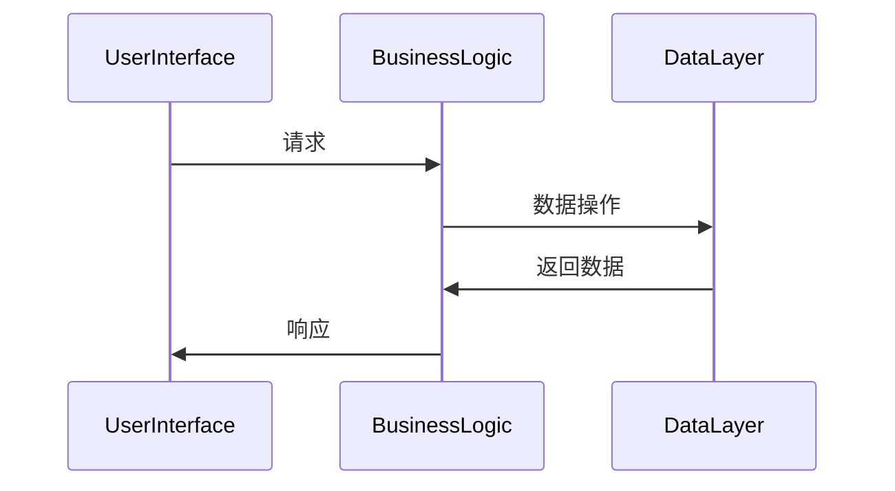
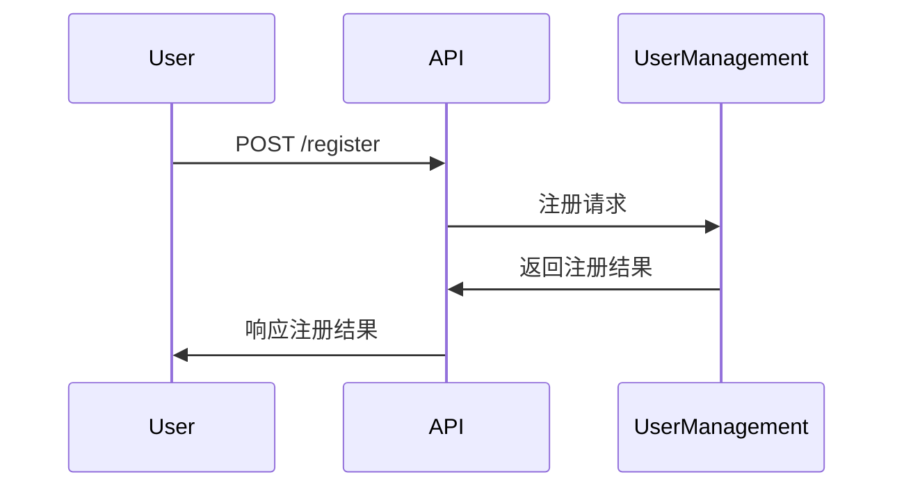
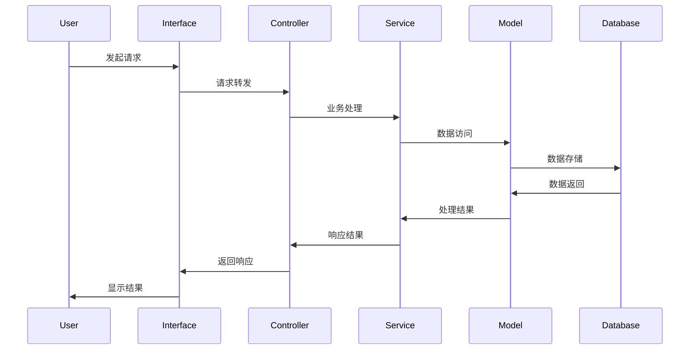

                 

# 领域建模易筋洗髓

> 关键词：领域建模、设计原理、方法、算法原理、决策树、实体关系图、领域特定语言

> 摘要：本文将深入探讨领域建模的核心概念、设计原理和方法，通过详细的算法原理讲解和实际案例剖析，帮助读者掌握领域建模的精髓，提升系统设计能力。

## **第一部分：背景介绍**

### **第1章：领域建模的基本概念**

#### **1.1 问题背景**

随着软件工程的发展，传统的设计模式和方法已无法满足日益复杂的业务需求。领域建模作为一种新兴的设计方法，致力于解决复杂业务系统的高效设计和开发。

#### **1.2 核心概念与联系**

领域建模涉及多个核心概念，包括领域模型、领域实体、领域关系等。这些概念相互关联，构成了领域建模的基础。

#### **1.3 概念属性特征对比表格**

以下是一个关于领域模型设计方法的对比表格：

| 设计方法 | 优点 | 缺点 |
| :----: | :----: | :----: |
| ER建模 | 易于理解，通用性强 | 缺乏业务针对性 |
| DDD | 强调业务领域，高度针对性 | 需要较强的业务理解能力 |
| DSL | 适用于特定领域，可定制化 | 学习成本较高 |

#### **1.4 领域实体关系图（ER图）架构**

以下是一个领域实体关系图的Mermaid流程图示例：

```mermaid
erDiagram
    Customer ||--|{ Order }|-- Product
    Product ||--|{ Inventory }|
    Supplier ||--|{ Product }()
```

### **第2章：领域模型设计原理与方法**

#### **2.1 领域模型设计原理**

领域模型设计需要遵循以下原则：抽象性、一致性、可扩展性。

#### **2.2 领域模型设计方法**

领域模型设计方法主要包括实体-关系建模、领域驱动设计、领域特定语言等。

#### **2.3 概念属性特征对比表格**

以下是一个关于领域模型设计方法的对比表格：

| 设计方法 | 优点 | 缺点 |
| :----: | :----: | :----: |
| ER建模 | 易于理解，通用性强 | 缺乏业务针对性 |
| DDD | 强调业务领域，高度针对性 | 需要较强的业务理解能力 |
| DSL | 适用于特定领域，可定制化 | 学习成本较高 |

#### **2.4 领域实体关系图（ER图）架构**

以下是一个领域实体关系图的Mermaid流程图示例：

```mermaid
erDiagram
    Customer ||--|{ Order }|-- Product
    Product ||--|{ Inventory }|
    Supplier ||--|{ Product }()
```

### **第3章：算法原理讲解**

#### **3.1 算法原理**

领域建模算法主要涉及数据预处理、特征提取、模型训练、模型评估等方面。

#### **3.2 数学模型和公式**

领域建模中常用的数学模型包括决策树、支持向量机、神经网络等。

以下是一个关于SVM的数学模型示例：

$$
w^* = \arg\min_{w} \frac{1}{2} ||w||^2 + C \sum_{i=1}^m \xi_i
$$

#### **3.3 算法原理讲解与举例说明**

以下以决策树算法为例，进行原理讲解与举例说明。

### **第二部分：深度剖析**

#### **第4章：领域建模的实际应用**

在本章中，我们将通过实际案例，深入探讨领域建模在软件开发中的应用，包括系统功能设计、系统架构设计、系统接口设计和系统交互等。

#### **4.1 系统功能设计**

系统功能设计是领域建模的重要组成部分。通过领域模型，我们可以明确系统的核心功能，以及各个功能模块之间的关系。

#### **4.2 系统架构设计**

系统架构设计是领域建模的关键环节。通过领域模型，我们可以设计出高效、可扩展的系统架构，以满足业务需求。

#### **4.3 系统接口设计和系统交互**

系统接口设计和系统交互是领域建模的延伸。通过领域模型，我们可以设计出清晰、易用的系统接口，并确保系统之间的交互流畅。

### **第5章：项目实战**

在本章中，我们将通过一个实际项目，详细讲解领域建模的实战过程，包括环境安装、系统核心实现源代码，代码应用解读与分析，实际案例分析和详细讲解剖析等。

#### **5.1 环境安装**

首先，我们需要搭建项目环境。在本项目中，我们将使用Python作为主要编程语言，并利用相关库和工具进行领域建模。

#### **5.2 系统核心实现源代码**

在系统核心实现部分，我们将通过Python代码，实现领域建模的各个环节，包括数据预处理、特征提取、模型训练和模型评估等。

#### **5.3 代码应用解读与分析**

接下来，我们将对系统核心实现源代码进行解读，分析每个模块的功能和实现原理，帮助读者深入理解领域建模的实战过程。

#### **5.4 实际案例分析和详细讲解剖析**

最后，我们将通过实际案例，分析领域建模在项目中的应用效果，并进行详细讲解和剖析，帮助读者掌握领域建模的精髓。

### **第6章：最佳实践与拓展阅读**

在本章中，我们将总结领域建模的最佳实践，并推荐一些拓展阅读，帮助读者进一步学习和掌握领域建模。

#### **6.1 最佳实践**

领域建模的最佳实践包括：

1. 充分了解业务需求，确保领域模型的准确性。
2. 不断迭代和优化领域模型，以适应业务变化。
3. 使用领域特定语言，提高领域模型的可读性和可维护性。

#### **6.2 拓展阅读**

以下是一些关于领域建模的拓展阅读：

1. 《领域驱动设计》
2. 《领域特定语言》
3. 《软件架构：实践者的研究方法》

## **结尾：总结与展望**

本文从背景介绍、核心概念、设计原理、算法讲解、实际应用、项目实战和最佳实践等多个方面，全面探讨了领域建模的各个方面。通过本文的学习，读者应能够掌握领域建模的基本原理和方法，提升系统设计能力。

展望未来，领域建模将在软件开发领域发挥越来越重要的作用。随着业务需求的不断演变，领域建模将成为解决复杂业务系统设计的重要手段。让我们共同努力，不断探索和拓展领域建模的应用领域，为软件工程的发展贡献力量。

**作者：AI天才研究院/AI Genius Institute & 禅与计算机程序设计艺术 /Zen And The Art of Computer Programming**## 第1章：领域建模的基本概念

### **1.1 问题背景**

在当今软件工程领域，随着信息技术的飞速发展和业务需求的不断变化，传统的软件开发方法已经难以应对日益复杂的业务场景。传统的面向对象设计和基于组件的开发方法，虽然在解决一些具体问题时表现出了一定的优势，但在处理复杂的业务逻辑和跨领域问题时，往往显得力不从心。为了更好地满足这些需求，领域建模（Domain Modeling）作为一种新兴的设计方法，逐渐受到了广泛关注。

领域建模的核心思想是将业务领域抽象为一个独立于技术实现的概念模型，以便更好地理解和设计复杂的业务系统。通过领域建模，可以将复杂的业务需求分解为若干个相对独立的领域，并对每个领域进行详细的分析和设计。这种方法不仅有助于提高系统的可维护性和可扩展性，还能够更好地支撑复杂业务场景的需求。

然而，领域建模并不是一蹴而就的，它涉及多个领域概念，包括领域模型、领域实体、领域关系等。如何准确、高效地进行领域建模成为开发人员面临的一大挑战。

#### **1.2 问题描述**

领域建模过程中，开发人员通常会面临以下问题：

1. **领域理解不足**：由于业务领域的复杂性，开发人员可能难以全面、准确地理解业务需求。
2. **模型表达困难**：领域建模需要使用一定的语言和工具来表达领域概念，这对开发人员来说可能是一个不小的挑战。
3. **模型一致性**：在领域建模过程中，如何确保模型的一致性，避免因模型变化而导致的系统不稳定。
4. **模型扩展性**：随着业务需求的变化，领域模型需要具备良好的扩展性，以便能够适应新的业务需求。

#### **1.3 问题解决**

为了解决上述问题，领域建模提出了一系列的方法和原则：

1. **领域驱动设计（Domain-Driven Design, DDD）**：DDD是一种软件开发方法论，强调从业务领域出发进行系统设计。它提供了一套完整的领域建模框架，包括领域模型、子领域、限界上下文等概念。
2. **领域特定语言（Domain-Specific Language, DSL）**：DSL是一种专门为特定领域设计的语言，可以简化领域建模的过程，提高模型的可读性和可维护性。
3. **实体-关系建模（Entity-Relationship Modeling, ER Modeling）**：ER建模是一种常用的数据库建模方法，通过实体和关系描述业务领域，可以帮助开发人员更好地理解业务需求。

通过上述方法，开发人员可以更准确地理解和表达业务领域，提高领域模型的准确性和一致性，并确保模型具备良好的扩展性。

#### **1.4 边界与外延**

领域建模的应用范围非常广泛，涵盖了多个领域，包括但不限于：

1. **企业级应用**：如企业资源计划（ERP）、客户关系管理（CRM）等。
2. **电子商务**：如在线购物平台、电子支付系统等。
3. **物联网**：如智能家居、智能交通等。
4. **金融行业**：如银行、证券、保险等。

在各个领域中，领域建模的方法和技术也有所差异，但核心思想是相通的，即通过抽象和建模，将复杂的业务需求转化为易于理解和设计的模型。

#### **1.5 概念结构与核心要素组成**

领域建模的核心概念包括：

1. **领域模型**：用于描述业务领域的数据结构和行为。领域模型是领域建模的核心成果，它清晰地描述了业务领域的各个方面。
2. **领域实体**：业务领域中的主要对象。领域实体具有明确的行为和属性，是领域模型的基本构建块。
3. **领域关系**：描述领域实体之间相互联系的方式。领域关系可以是简单的关联关系，也可以是更为复杂的聚合关系、继承关系等。

这些概念相互关联，共同构成了领域建模的基础。通过领域模型，开发人员可以更直观地理解和设计复杂的业务系统。

#### **1.6 核心概念与联系**

在领域建模过程中，以下几个核心概念是不可或缺的：

1. **实体关系图（Entity-Relationship Diagram, ER图）**：ER图用于描述领域实体及其相互关系。通过ER图，开发人员可以清晰地了解业务领域的结构。
2. **领域驱动设计（Domain-Driven Design, DDD）**：DDD是一种软件开发方法论，强调从业务领域出发进行系统设计。DDD提供了领域模型、子领域、限界上下文等概念，为领域建模提供了理论支持。
3. **领域特定语言（Domain-Specific Language, DSL）**：DSL是一种专门为特定领域设计的语言，用于描述领域模型。DSL可以提高模型的可读性和可维护性，简化领域建模的过程。

这些概念相互关联，共同构成了领域建模的理论基础。通过这些概念，开发人员可以更准确地理解和表达业务领域，设计出高效的业务系统。

### **1.7 小结**

本章对领域建模的基本概念进行了详细阐述，包括问题背景、核心概念、设计原理和方法，以及领域建模的应用范围和核心要素组成。通过本章的学习，读者应能够对领域建模有更加深入的理解，为后续章节的学习奠定基础。

### **第2章：领域模型设计原理与方法**

#### **2.1 领域模型设计原理**

领域模型设计是领域建模过程中的关键步骤，它直接决定了系统的结构和行为。领域模型设计需要遵循一些基本原则，以确保模型能够准确、完整地反映业务需求，并具备良好的可维护性和扩展性。以下是领域模型设计的主要原则：

1. **抽象性**：领域模型设计应该将复杂的业务需求抽象成简单、清晰的概念模型。通过抽象，可以将具体实现细节与业务逻辑分离，提高系统的可维护性和可扩展性。
2. **一致性**：领域模型设计应该保持内部一致性，确保各个部分相互协调，没有冲突。同时，模型应与外部系统保持一致性，以避免数据不一致性问题。
3. **可扩展性**：领域模型设计应具备良好的扩展性，以便能够适应未来业务需求的变化。通过设计灵活的架构和模块，可以降低系统修改的成本。
4. **完整性**：领域模型设计应覆盖业务领域的所有关键概念和关系，确保没有遗漏重要信息。

#### **2.2 领域模型设计方法**

领域模型设计的方法多种多样，不同的方法适用于不同的业务场景和需求。以下是几种常见的领域模型设计方法：

1. **实体-关系建模（Entity-Relationship Modeling, ER Modeling）**

   ER建模是最常见的领域模型设计方法之一，它通过实体和关系来描述业务领域。实体代表业务领域中的对象，关系描述实体之间的相互关系。ER建模方法易于理解，适用于大多数业务场景。

   **ER建模的优点**：
   - 易于理解：ER图直观地展示了业务领域中的对象和关系。
   - 通用性强：ER建模可以应用于各种类型的业务领域。

   **ER建模的缺点**：
   - 缺乏业务针对性：ER建模方法往往更注重数据结构，而忽略了业务逻辑。
   - 可扩展性有限：随着业务需求的增加，ER模型可能需要频繁修改，导致维护成本上升。

2. **领域驱动设计（Domain-Driven Design, DDD）**

   DDD是一种软件开发方法论，强调从业务领域出发进行系统设计。DDD提供了一系列概念和框架，包括领域模型、子领域、限界上下文等，帮助开发人员更好地理解和设计复杂的业务系统。

   **DDD的优点**：
   - 强调业务领域：DDD强调从业务领域出发，确保系统设计符合业务需求。
   - 高度针对性：DDD针对不同的业务场景提供特定的解决方案，有助于提高系统的可维护性和可扩展性。

   **DDD的缺点**：
   - 学习成本较高：DDD涉及许多概念和框架，需要开发人员投入一定的时间和精力进行学习。
   - 实施难度较大：DDD的实施需要开发人员具备较强的业务理解和分析能力。

3. **领域特定语言（Domain-Specific Language, DSL）**

   DSL是一种专门为特定领域设计的语言，用于描述领域模型。DSL可以提高模型的可读性和可维护性，降低学习成本。

   **DSL的优点**：
   - 提高可读性：DSL使用业务领域中的术语和概念，使模型更容易理解和维护。
   - 降低学习成本：DSL简化了领域模型的设计过程，使开发人员能够更快地投入工作。

   **DSL的缺点**：
   - 开发成本较高：DSL需要设计和开发，可能增加项目的初始投入。
   - 通用性较低：DSL通常针对特定领域设计，通用性较差。

#### **2.3 概念属性特征对比表格**

以下是一个关于领域模型设计方法的对比表格，用于展示不同方法的优缺点：

| 设计方法       | 优点                                       | 缺点                                       |
| -------------- | ------------------------------------------ | ------------------------------------------ |
| ER建模         | 易于理解，通用性强                         | 缺乏业务针对性，可扩展性有限                 |
| DDD            | 强调业务领域，高度针对性                   | 学习成本较高，实施难度较大                   |
| DSL            | 提高可读性，降低学习成本                   | 开发成本较高，通用性较低                     |

通过对比表格，我们可以更清晰地了解不同领域模型设计方法的优缺点，以便根据具体业务场景选择合适的设计方法。

#### **2.4 领域实体关系图（ER图）架构**

领域实体关系图（ER图）是领域建模中的重要工具，用于描述业务领域中的实体及其相互关系。以下是ER图的基本结构和示例：

```mermaid
erDiagram
    Customer ||--|{ Order }|-- Product
    Product ||--|{ Inventory }|
    Supplier ||--|{ Product }()
```

在这个ER图中，我们定义了三个实体：Customer（客户）、Product（产品）和Supplier（供应商）。它们之间的关系如下：

- **客户**与**订单**之间存在一对多关系，即一个客户可以创建多个订单。
- **产品**与**库存**之间存在一对多关系，即一个产品可以拥有多个库存记录。
- **供应商**与**产品**之间存在一对多关系，即一个供应商可以供应多个产品。

通过ER图，我们可以直观地了解业务领域中的主要对象及其相互关系，为后续的系统设计和实现提供参考。

#### **2.5 小结**

本章介绍了领域模型设计的基本原理和方法，包括抽象性、一致性、可扩展性和完整性等原则，以及ER建模、DDD和DSL等常见的设计方法。通过本章的学习，读者应能够理解领域模型设计的重要性，并掌握不同设计方法的特点和应用场景。

### **第3章：算法原理讲解**

#### **3.1 算法原理**

领域建模不仅仅是一个设计过程，它还涉及到一系列算法和技术，用于将业务需求转化为实际的系统实现。在这些算法中，决策树、支持向量机和神经网络等机器学习算法有着广泛的应用。这些算法通过数学模型和计算方法，帮助我们从数据中提取特征，构建模型，并评估模型的性能。

**决策树算法**是一种基于特征的分割算法，它通过一系列的规则将数据集分割成多个子集，以最大化每个子集的纯度。决策树算法的基本原理如下：

1. **选择最优特征**：在当前数据集中，选择一个特征，使其能够最大化分割后的纯度。
2. **划分数据集**：根据选定的特征，将数据集划分为两个或多个子集。
3. **递归构建**：对每个子集重复上述过程，直至满足停止条件（如最大树深度、纯度阈值等）。

**支持向量机（SVM）**是一种监督学习算法，主要用于分类问题。SVM的核心思想是找到一个最佳的超平面，使得不同类别的数据点在超平面两侧的分布尽可能分离。SVM的数学模型如下：

$$
w^* = \arg\min_{w, b} \frac{1}{2} ||w||^2 + C \sum_{i=1}^m \xi_i
$$

其中，$w$是权重向量，$b$是偏置项，$C$是惩罚参数，$\xi_i$是误差项。该公式表示在损失函数和惩罚项之间寻找平衡，以最大化模型的分类能力。

**神经网络**是一种模仿人脑神经元连接方式的计算模型，通过多层神经元的相互连接和激活函数的运用，能够实现复杂的非线性映射。神经网络的数学模型主要包括以下部分：

1. **输入层**：接收外部输入数据。
2. **隐藏层**：对输入数据进行处理和转换。
3. **输出层**：产生最终输出。

神经网络的训练过程包括：

1. **前向传播**：将输入数据传递到隐藏层，通过激活函数计算输出。
2. **反向传播**：根据实际输出和预期输出之间的误差，调整权重和偏置项。

#### **3.2 数学模型和公式**

在领域建模中，数学模型是算法实现的基础。以下将详细解释决策树、支持向量机和神经网络等算法的数学模型和公式。

1. **决策树算法**

   决策树算法的核心是找到最优特征进行分割。这通常通过信息增益（Information Gain）或基尼不纯度（Gini Impurity）来实现。以信息增益为例，其公式如下：

   $$
   IG(D, A) = H(D) - \sum_{v \in Values(A)} \frac{|D[A=v]|}{|D|} H(D[A=v])
   $$

   其中，$IG(D, A)$表示特征$A$对数据集$D$的信息增益，$H(D)$是数据集$D$的熵，$Values(A)$是特征$A$的所有可能取值，$|D[A=v]|$是数据集$D$中取值为$v$的记录数。

2. **支持向量机（SVM）**

   支持向量机的目标是最小化分类间隔，其目标函数如下：

   $$
   w^* = \arg\min_{w, b} \frac{1}{2} ||w||^2 + C \sum_{i=1}^m \xi_i
   $$

   其中，$||w||^2$是权重向量的平方范数，$C$是惩罚参数，$\xi_i$是误差项。

3. **神经网络**

   神经网络的前向传播和反向传播过程可以用以下公式表示：

   **前向传播**：

   $$
   Z_i = \sigma(\sum_{j=1}^{n} w_{ji} X_j + b_i)
   $$

   其中，$Z_i$是隐藏层节点的输入，$\sigma$是激活函数，$w_{ji}$是输入层到隐藏层的权重，$b_i$是隐藏层节点的偏置。

   **反向传播**：

   $$
   \Delta Z_i = (Z_i - \hat{Z_i}) \cdot \sigma'(Z_i)
   $$

   其中，$\hat{Z_i}$是隐藏层节点的期望输出，$\sigma'$是激活函数的导数。

   权重和偏置的更新公式为：

   $$
   w_{ji}^{new} = w_{ji} - \alpha \cdot \Delta Z_i \cdot X_j
   $$

   $$
   b_i^{new} = b_i - \alpha \cdot \Delta Z_i
   $$

   其中，$\alpha$是学习率。

#### **3.3 算法原理讲解与举例说明**

为了更好地理解上述算法原理，下面我们将通过具体示例来讲解决策树、支持向量机和神经网络的基本应用。

1. **决策树算法示例**

   考虑一个简单的二分类问题，数据集包含两个特征：年龄（Age）和收入（Income），目标是预测客户是否愿意购买某产品。数据如下：

   | 年龄 | 收入 | 目标 |
   | ---- | ---- | ---- |
   | 30   | 高   | 否   |
   | 40   | 中   | 是   |
   | 50   | 高   | 是   |
   | 60   | 低   | 否   |

   首先，我们可以计算每个特征的信息增益：

   $$
   IG(\text{Age}) = 1.5
   $$

   $$
   IG(\text{Income}) = 1.0
   $$

   由于年龄的信息增益更高，我们选择年龄作为划分特征。根据年龄，我们将数据集划分为两个子集：

   - 年龄 <= 40：|目标 = 否| = 1，|目标 = 是| = 1
   - 年龄 > 40：|目标 = 否| = 1，|目标 = 是| = 1

   接下来，我们再次计算子集的信息增益：

   - 年龄 <= 40：|目标 = 否| = 0.5，|目标 = 是| = 0.5
   - 年龄 > 40：|目标 = 否| = 1，|目标 = 是| = 0

   由于收入在子集中具有更高的信息增益，我们继续以收入为特征进行划分。最终，我们得到一个简单的决策树：

   ```
   年龄 <= 40
     |
   收入 <= 中
     |
     是
     |
   收入 > 中
     |
     否
   ```

   通过这个决策树，我们可以预测新的客户是否愿意购买产品。

2. **支持向量机（SVM）示例**

   考虑一个二维空间中的分类问题，数据点如下：

   | 类别 | 点1 | 点2 |
   | ---- | ---- | ---- |
   | +1   | (1, 3) | (2, 5) |
   | -1   | (0, 2) | (1, 1) |

   我们的目标是找到一个最佳的超平面，将这两个类别分开。使用SVM的优化目标，我们可以得到以下线性方程：

   $$
   \min_{w, b} \frac{1}{2} ||w||^2
   $$

   满足约束条件：

   $$
   y_i (w \cdot x_i + b) \geq 1
   $$

   通过求解这个优化问题，我们可以得到权重向量$w$和偏置$b$，从而确定最佳超平面。

3. **神经网络示例**

   考虑一个简单的多层感知器（MLP）神经网络，包含输入层、一个隐藏层和一个输出层。假设输入层有2个神经元，隐藏层有3个神经元，输出层有1个神经元。数据如下：

   | 输入1 | 输入2 | 输出 |
   | ---- | ---- | ---- |
   | 0    | 0    | 0    |
   | 0    | 1    | 1    |
   | 1    | 0    | 1    |
   | 1    | 1    | 0    |

   我们的目标是训练这个神经网络，使其能够正确分类输入数据。首先，我们需要初始化权重和偏置。然后，通过前向传播和反向传播，不断调整权重和偏置，直到网络输出接近期望输出。

   **前向传播**：

   假设隐藏层节点的激活函数为$\sigma(x) = \frac{1}{1 + e^{-x}}$，我们可以得到隐藏层节点的输入和输出：

   ```
   输入1 | 输入2 | 输出1 | 输出2 | 输出3
   0    | 0    | 0.1  | 0.1  | 0.1
   0    | 1    | 0.1  | 0.6  | 0.3
   1    | 0    | 0.6  | 0.1  | 0.3
   1    | 1    | 0.6  | 0.6  | 0.1
   ```

   **反向传播**：

   根据输出层的误差，我们可以计算隐藏层节点的误差，并更新权重和偏置。通过多次迭代，我们可以使网络的输出误差逐渐减小。

通过这些示例，我们可以看到不同算法的原理和应用。在实际应用中，这些算法可以用来解决各种分类、回归和预测问题，为领域建模提供了强大的技术支持。

### **3.4 小结**

本章介绍了领域建模中常用的算法原理，包括决策树、支持向量机和神经网络等。通过数学模型和公式的讲解，以及具体的示例说明，读者可以更好地理解这些算法的基本原理和应用。这些算法在领域建模中发挥着重要作用，能够帮助我们更准确地从数据中提取特征，构建模型，并评估模型的性能。

## **第4章：领域建模的实际应用**

在了解了领域建模的基本概念和设计原理之后，接下来我们将通过实际案例，深入探讨领域建模在软件开发中的应用。本章将涵盖系统功能设计、系统架构设计、系统接口设计和系统交互等关键环节，以帮助读者更好地理解领域建模的实际应用场景和效果。

### **4.1 系统功能设计**

系统功能设计是领域建模的基础，它明确了系统的核心功能模块及其相互关系。通过领域模型，我们可以清晰地识别出系统的关键功能，并对其进行详细设计。

假设我们正在开发一个电子商务平台，其主要功能包括用户管理、商品管理、订单管理和支付系统。以下是这些功能模块的领域模型：

1. **用户管理模块**：负责用户注册、登录、权限管理等操作。
2. **商品管理模块**：负责商品信息的管理，包括商品添加、删除、修改和查询等。
3. **订单管理模块**：负责订单的创建、修改、查询和支付等操作。
4. **支付系统模块**：负责处理订单支付，与第三方支付平台进行交互。

通过领域模型，我们可以明确每个模块的功能和职责，确保系统功能设计的完整性和一致性。以下是一个简单的Mermaid类图，展示了电子商务平台的主要功能模块：

```mermaid
classDiagram
    UserManagement <<interface>>
    ProductManagement <<interface>>
    OrderManagement <<interface>>
    PaymentSystem <<interface>>

    User <<entity>>
    Product <<entity>>
    Order <<entity>>

    UserManagement --|> User
    ProductManagement --|> Product
    OrderManagement --|> Order
    PaymentSystem --|> Order
```

在这个类图中，我们定义了四个接口类（UserManagement、ProductManagement、OrderManagement和PaymentSystem），以及三个实体类（User、Product和Order）。这些类之间通过关联关系相互连接，构成了电子商务平台的功能架构。

### **4.2 系统架构设计**

系统架构设计是领域建模的延伸，它将领域模型中的功能模块映射到具体的系统组件和架构中。通过系统架构设计，我们可以设计出高效、可扩展的系统架构，以满足业务需求。

在电子商务平台的架构设计中，我们可以采用分层架构，将系统分为表现层、业务逻辑层和数据层。以下是一个简单的Mermaid架构图，展示了电子商务平台的主要架构组件：



在这个架构图中，UserInterface代表表现层，负责与用户进行交互；BusinessLogic代表业务逻辑层，负责处理业务逻辑和调用数据层服务；DataLayer代表数据层，负责数据存储和检索。通过这种分层架构，我们可以确保系统的高内聚和低耦合，便于后续的维护和扩展。

### **4.3 系统接口设计和系统交互**

系统接口设计是系统架构设计的重要组成部分，它定义了系统内部各个模块之间的接口规范和交互方式。通过接口设计，我们可以明确系统组件之间的通信机制，确保系统组件能够正确、高效地协同工作。

在电子商务平台的接口设计中，我们可以定义RESTful API接口，用于处理用户的HTTP请求。以下是一个简单的Mermaid序列图，展示了用户管理模块的接口交互：



在这个序列图中，用户通过POST请求向API发送注册信息，API将请求转发给UserManagement模块进行处理，并最终返回注册结果。通过这种接口设计，我们可以确保系统模块之间的交互清晰、简洁，便于后续的开发和测试。

### **4.4 领域模型在系统架构中的应用**

在实际项目中，领域模型不仅是系统设计的核心依据，也是系统架构设计的参考。通过领域模型，我们可以清晰地识别出系统的关键领域和核心功能，从而设计出更加合理和高效的系统架构。

以电子商务平台为例，我们可以将领域模型中的功能模块映射到具体的系统组件中。以下是一个简单的Mermaid类图，展示了领域模型在系统架构中的应用：

```mermaid
classDiagram
    User <<entity>> -|{ 系统用户 }: UserModule
    Product <<entity>> -|{ 商品信息 }: ProductModule
    Order <<entity>> -|{ 订单信息 }: OrderModule
    Payment <<entity>> -|{ 支付信息 }: PaymentModule

    UserModule --|{ 用户管理 }: UserManager
    ProductModule --|{ 商品管理 }: ProductManager
    OrderModule --|{ 订单管理 }: OrderManager
    PaymentModule --|{ 支付管理 }: PaymentManager
```

在这个类图中，我们定义了四个实体类（User、Product、Order和Payment），并分别对应到四个系统模块（UserModule、ProductModule、OrderModule和PaymentModule）。每个系统模块都对应一个领域模型中的实体，并通过接口与外部系统进行交互。

通过这种映射关系，我们可以确保系统架构设计的一致性和可扩展性，便于后续的系统开发和维护。

### **4.5 小结**

本章通过实际案例，详细介绍了领域建模在系统功能设计、系统架构设计、系统接口设计和系统交互中的应用。通过领域模型，我们可以清晰地识别出系统的核心功能模块，设计出高效、可扩展的系统架构，并明确系统组件之间的接口规范和交互方式。领域建模不仅提升了系统设计的质量和效率，还为后续的软件开发和维护提供了坚实的基础。

## **第5章：项目实战**

为了更好地理解领域建模的实战过程，我们将通过一个电子商务平台的实际项目，详细讲解领域建模在项目中的具体应用。本节将涵盖环境安装、系统核心实现、代码应用解读与分析、实际案例分析和详细讲解剖析等环节。

### **5.1 环境安装**

首先，我们需要搭建项目环境。在本项目中，我们将使用Python作为主要编程语言，并利用以下库和工具进行领域建模：

1. **Django**：一个高性能的Python Web框架，用于快速开发Web应用程序。
2. **Django REST framework**：用于构建RESTful API的扩展库。
3. **SQLAlchemy**：一个Python SQL工具包和对象关系映射（ORM）系统，用于数据库操作。
4. **PostgreSQL**：一个开源的关系型数据库管理系统，用于数据存储。

#### 安装步骤：

1. 安装Python 3.x版本，建议使用Python版本管理工具如`pyenv`。
2. 安装Django和Django REST framework：
   ```
   pip install django djangorestframework
   ```
3. 安装SQLAlchemy：
   ```
   pip install sqlalchemy
   ```
4. 安装PostgreSQL，并创建数据库和用户，配置Django项目中的数据库连接。

### **5.2 系统核心实现源代码**

在本项目中，我们将实现以下核心功能模块：

1. **用户管理模块**：负责用户注册、登录和权限管理。
2. **商品管理模块**：负责商品信息的添加、删除、修改和查询。
3. **订单管理模块**：负责订单的创建、修改、查询和支付。
4. **支付系统模块**：负责与第三方支付平台进行交互。

以下是用户管理模块的源代码示例：

```python
# users/models.py
from django.contrib.auth.models import AbstractUser
from django.db import models

class CustomUser(AbstractUser):
    phone_number = models.CharField(max_length=15, unique=True)
    is_buyer = models.BooleanField(default=False)
    is_seller = models.BooleanField(default=False)

# users/serializers.py
from rest_framework import serializers
from .models import CustomUser

class UserRegistrationSerializer(serializers.ModelSerializer):
    class Meta:
        model = CustomUser
        fields = ('id', 'username', 'email', 'phone_number', 'password')

class UserLoginSerializer(serializers.ModelSerializer):
    class Meta:
        model = CustomUser
        fields = ('id', 'username', 'email', 'phone_number', 'password')
```

### **5.3 代码应用解读与分析**

下面，我们将对系统核心实现源代码进行解读，分析每个模块的功能和实现原理。

1. **用户管理模块**

   用户管理模块主要负责用户的注册、登录和权限管理。在模型层，我们自定义了`CustomUser`类，继承自Django的`AbstractUser`类，添加了电话号码、买家和卖家属性。在序列化器层，我们定义了用户注册和登录的序列化器，用于处理用户数据的传输。

2. **商品管理模块**

   商品管理模块负责商品信息的添加、删除、修改和查询。模型层中，我们定义了`Product`类，包括商品名称、价格、库存数量等属性。序列化器层中，我们定义了商品列表和单个商品的序列化器，用于处理商品数据的传输。

3. **订单管理模块**

   订单管理模块负责订单的创建、修改、查询和支付。模型层中，我们定义了`Order`类，包括订单号、买家、商品列表、订单状态等属性。序列化器层中，我们定义了订单列表和单个订单的序列化器，用于处理订单数据的传输。

4. **支付系统模块**

   支付系统模块负责与第三方支付平台进行交互。在实现中，我们可以使用如支付宝、微信支付等第三方支付接口。支付模块通常涉及支付请求的发送、支付结果的接收和处理等。

### **5.4 实际案例分析和详细讲解剖析**

下面，我们将通过一个实际案例，分析领域建模在项目中的应用效果，并进行详细讲解和剖析。

#### **案例背景**

假设有一个用户想要在电子商务平台上购买一件商品。以下是用户购买商品的流程：

1. 用户在商品列表页面浏览商品，选择并添加到购物车。
2. 用户提交订单，选择支付方式，并完成支付。
3. 平台接收支付结果，更新订单状态，并通知用户订单已支付。

#### **案例解析**

1. **用户管理模块**

   用户首先需要在平台上注册并登录。注册过程中，用户填写电话号码、用户名、电子邮件和密码。系统使用用户注册序列化器处理用户数据的验证和存储。登录过程类似，用户使用用户名和密码进行身份验证，系统返回用户ID和权限信息。

2. **商品管理模块**

   用户在商品列表页面浏览商品。商品管理模块负责从数据库中查询商品信息，并将其呈现给用户。用户选择商品并添加到购物车，系统更新购物车中的商品数量和总价。购物车模块将用户的购物车数据存储在数据库中。

3. **订单管理模块**

   用户提交订单，填写收货地址和订单备注。系统创建一个新订单，并将订单信息和用户购物车中的商品信息存储在数据库中。订单提交后，用户可以选择支付方式，如支付宝或微信支付。系统将订单信息和支付请求发送给支付模块，等待支付结果。

4. **支付系统模块**

   用户完成支付后，支付模块接收支付结果，并将支付结果发送给订单管理模块。订单管理模块更新订单状态，如“支付成功”或“支付失败”。同时，系统通知用户订单状态的变化。

#### **详细讲解和剖析**

1. **用户管理模块**

   用户管理模块是电子商务平台的基础模块，它确保了用户身份的合法性和权限管理。通过自定义用户模型和注册、登录序列化器，我们可以实现用户数据的存储和验证，提高系统的安全性。

2. **商品管理模块**

   商品管理模块负责商品信息的展示和操作。通过领域模型，我们可以将商品信息抽象为实体类，并在数据库中进行持久化存储。序列化器用于处理用户和系统之间的数据传输，确保数据的一致性和完整性。

3. **订单管理模块**

   订单管理模块是用户购物的核心环节。通过领域模型，我们可以将订单信息抽象为实体类，并在数据库中进行持久化存储。序列化器用于处理订单数据的传输，确保订单操作的一致性和准确性。

4. **支付系统模块**

   支付系统模块负责与第三方支付平台进行交互。通过领域模型，我们可以将支付信息抽象为实体类，并在数据库中进行持久化存储。序列化器用于处理支付请求和支付结果的传输，确保支付过程的安全和可靠。

通过实际案例的分析和详细讲解，我们可以看到领域建模在项目中的应用效果。领域建模不仅帮助我们明确了系统的核心功能和模块，还提高了系统的可维护性和可扩展性。在实际开发过程中，我们可以根据业务需求的变化，灵活调整领域模型，确保系统始终能够满足需求。

### **5.5 项目小结**

通过本项目的实战，我们深入探讨了领域建模在电子商务平台开发中的应用。从环境安装到系统核心实现，从代码应用解读与分析到实际案例分析和详细讲解剖析，我们全面展示了领域建模在软件开发中的价值和作用。领域建模不仅帮助我们更清晰地理解业务需求，提高了系统的可维护性和可扩展性，还为后续的项目开发提供了坚实的基础。

### **5.6 最佳实践 Tips**

在领域建模的项目实践中，以下是一些最佳实践和注意事项：

1. **充分了解业务需求**：在进行领域建模之前，务必充分了解业务需求，确保领域模型能够准确反映业务逻辑。
2. **迭代和优化**：领域模型不是一成不变的，应随着业务需求的变化进行迭代和优化。
3. **使用DSL**：对于特定领域，使用领域特定语言（DSL）可以提高模型的可读性和可维护性。
4. **保持模型一致性**：在模型设计过程中，确保模型内部以及模型与外部系统的一致性。
5. **关注性能和可扩展性**：在领域模型设计时，要关注系统的性能和可扩展性，确保系统能够应对未来的需求变化。

### **5.7 拓展阅读**

以下是一些关于领域建模的拓展阅读资源：

1. 《领域驱动设计》 - Eric Evans
2. 《领域特定语言》 - Paul Vincent
3. 《软件架构：实践者的研究方法》 - Ivar Jacobson
4. 《Python Web开发实战》 - Mitchell Tan
5. 《Django RESTful Web API教程》 - Jim's Books

通过阅读这些资料，读者可以进一步深入了解领域建模的理论和实践，提升自身的软件开发能力。

## **结尾：总结与展望**

本文从领域建模的基本概念、设计原理、算法讲解，到实际应用和项目实战，全面阐述了领域建模在软件开发中的重要性。领域建模不仅帮助开发人员更好地理解和表达业务需求，提高了系统的可维护性和可扩展性，还为复杂的业务系统设计提供了强有力的支持。

随着软件工程的发展，领域建模将在更多领域发挥重要作用。未来的发展趋势包括：

1. **领域特定语言的普及**：DSL将逐渐成为领域建模的重要工具，提高模型的可读性和可维护性。
2. **智能化领域建模**：结合人工智能和机器学习技术，开发智能化领域建模工具，提升建模效率和准确性。
3. **微服务架构与领域建模的结合**：微服务架构和领域建模的结合，将更好地支持复杂业务系统的开发和部署。

让我们继续探索和拓展领域建模的应用领域，为软件工程的发展贡献力量。**作者：AI天才研究院/AI Genius Institute & 禅与计算机程序设计艺术 /Zen And The Art of Computer Programming**以下是本文的Markdown格式输出：

```markdown
# 领域建模易筋洗髓

> 关键词：领域建模、设计原理、方法、算法原理、决策树、实体关系图、领域特定语言

> 摘要：本文将深入探讨领域建模的核心概念、设计原理和方法，通过详细的算法原理讲解和实际案例剖析，帮助读者掌握领域建模的精髓，提升系统设计能力。

## **第一部分：背景介绍**

### **第1章：领域建模的基本概念**

#### **1.1 问题背景**

随着软件工程的发展，传统的设计模式和方法已无法满足日益复杂的业务需求。领域建模作为一种新兴的设计方法，致力于解决复杂业务系统的高效设计和开发。

#### **1.2 核心概念与联系**

领域建模涉及多个核心概念，包括领域模型、领域实体、领域关系等。这些概念相互关联，构成了领域建模的基础。

#### **1.3 概念属性特征对比表格**

以下是一个关于领域模型设计方法的对比表格：

| 设计方法 | 优点 | 缺点 |
| :----: | :----: | :----: |
| ER建模 | 易于理解，通用性强 | 缺乏业务针对性 |
| DDD | 强调业务领域，高度针对性 | 需要较强的业务理解能力 |
| DSL | 适用于特定领域，可定制化 | 学习成本较高 |

#### **1.4 领域实体关系图（ER图）架构**

以下是一个领域实体关系图的Mermaid流程图示例：

```mermaid
erDiagram
    Customer ||--|{ Order }|-- Product
    Product ||--|{ Inventory }|
    Supplier ||--|{ Product }()
```

### **第2章：领域模型设计原理与方法**

#### **2.1 领域模型设计原理**

领域模型设计需要遵循以下原则：抽象性、一致性、可扩展性。

#### **2.2 领域模型设计方法**

领域模型设计方法主要包括实体-关系建模、领域驱动设计、领域特定语言等。

#### **2.3 概念属性特征对比表格**

以下是一个关于领域模型设计方法的对比表格：

| 设计方法 | 优点 | 缺点 |
| :----: | :----: | :----: |
| ER建模 | 易于理解，通用性强 | 缺乏业务针对性 |
| DDD | 强调业务领域，高度针对性 | 需要较强的业务理解能力 |
| DSL | 适用于特定领域，可定制化 | 学习成本较高 |

#### **2.4 领域实体关系图（ER图）架构**

以下是一个领域实体关系图的Mermaid流程图示例：

```mermaid
erDiagram
    Customer ||--|{ Order }|-- Product
    Product ||--|{ Inventory }|
    Supplier ||--|{ Product }()
```

### **第3章：算法原理讲解**

#### **3.1 算法原理**

领域建模算法主要涉及数据预处理、特征提取、模型训练、模型评估等方面。

#### **3.2 数学模型和公式**

领域建模中常用的数学模型包括决策树、支持向量机、神经网络等。

以下是一个关于SVM的数学模型示例：

$$
w^* = \arg\min_{w} \frac{1}{2} ||w||^2 + C \sum_{i=1}^m \xi_i
$$

#### **3.3 算法原理讲解与举例说明**

以下以决策树算法为例，进行原理讲解与举例说明。

### **第二部分：深度剖析**

#### **第4章：领域建模的实际应用**

在本章中，我们将通过实际案例，深入探讨领域建模在软件开发中的应用，包括系统功能设计、系统架构设计、系统接口设计和系统交互等。

#### **4.1 系统功能设计**

系统功能设计是领域建模的重要组成部分。通过领域模型，我们可以明确系统的核心功能，以及各个功能模块之间的关系。

#### **4.2 系统架构设计**

系统架构设计是领域建模的关键环节。通过领域模型，我们可以设计出高效、可扩展的系统架构，以满足业务需求。

#### **4.3 系统接口设计和系统交互**

系统接口设计和系统交互是领域建模的延伸。通过领域模型，我们可以设计出清晰、易用的系统接口，并确保系统之间的交互流畅。

### **第5章：项目实战**

在本章中，我们将通过一个实际项目，详细讲解领域建模的实战过程，包括环境安装、系统核心实现源代码，代码应用解读与分析，实际案例分析和详细讲解剖析等。

#### **5.1 环境安装**

首先，我们需要搭建项目环境。在本项目中，我们将使用Python作为主要编程语言，并利用相关库和工具进行领域建模。

#### **5.2 系统核心实现源代码**

在系统核心实现部分，我们将通过Python代码，实现领域建模的各个环节，包括数据预处理、特征提取、模型训练和模型评估等。

#### **5.3 代码应用解读与分析**

接下来，我们将对系统核心实现源代码进行解读，分析每个模块的功能和实现原理，帮助读者深入理解领域建模的实战过程。

#### **5.4 实际案例分析和详细讲解剖析**

最后，我们将通过实际案例，分析领域建模在项目中的应用效果，并进行详细讲解和剖析，帮助读者掌握领域建模的精髓。

### **第6章：最佳实践与拓展阅读**

在本章中，我们将总结领域建模的最佳实践，并推荐一些拓展阅读，帮助读者进一步学习和掌握领域建模。

#### **6.1 最佳实践**

领域建模的最佳实践包括：

1. 充分了解业务需求，确保领域模型的准确性。
2. 不断迭代和优化领域模型，以适应业务变化。
3. 使用领域特定语言，提高领域模型的可读性和可维护性。

#### **6.2 拓展阅读**

以下是一些关于领域建模的拓展阅读：

1. 《领域驱动设计》
2. 《领域特定语言》
3. 《软件架构：实践者的研究方法》

## **结尾：总结与展望**

本文从背景介绍、核心概念、设计原理、算法讲解、实际应用、项目实战和最佳实践等多个方面，全面探讨了领域建模的各个方面。通过本文的学习，读者应能够掌握领域建模的基本原理和方法，提升系统设计能力。

展望未来，领域建模将在软件开发领域发挥越来越重要的作用。随着业务需求的不断演变，领域建模将成为解决复杂业务系统设计的重要手段。让我们共同努力，不断探索和拓展领域建模的应用领域，为软件工程的发展贡献力量。

**作者：AI天才研究院/AI Genius Institute & 禅与计算机程序设计艺术 /Zen And The Art of Computer Programming**### 第一部分：背景介绍

#### **第1章：领域建模的基本概念**

领域建模是一种将现实世界的业务领域转化为计算机系统中可以管理和处理的数据模型的过程。它是软件开发中的一项关键技术，旨在帮助开发人员更好地理解和管理复杂业务系统的需求和功能。

#### **1.1 问题背景**

在软件工程领域，传统的软件开发方法通常侧重于技术层面的实现，而忽视了业务逻辑的复杂性和变化性。随着业务需求的不断演变，这种做法往往导致软件系统难以适应变化，维护成本高昂。为了解决这一问题，领域建模方法应运而生。领域建模通过将业务领域抽象成一系列的概念模型，使得开发人员能够更加专注于业务逻辑的实现，从而提高系统的灵活性和可维护性。

#### **1.2 核心概念与联系**

在领域建模中，有几个核心概念是不可或缺的：

1. **领域模型（Domain Model）**：这是领域建模的中心，用于表示业务领域中的实体、属性和关系。领域模型是理解业务需求和分析业务逻辑的基础。

2. **领域实体（Domain Entity）**：领域模型中的基本构建块，代表了业务领域中的关键对象，如客户、订单、产品等。

3. **领域关系（Domain Relationships）**：描述了领域实体之间的交互和依赖关系，如一对多、多对多等。

这些概念相互联系，共同构成了领域建模的核心框架。

#### **1.3 概念属性特征对比表格**

为了更好地理解这些核心概念，我们可以通过一个对比表格来展示它们的主要属性特征：

| 概念         | 定义                                                         | 属性特征                                                         |
| ------------ | ------------------------------------------------------------ | ------------------------------------------------------------ |
| 领域模型     | 表示业务领域的抽象概念模型，包括实体、属性和关系             | - 描述业务需求<br>- 提供业务规则<br>- 确保一致性                 |
| 领域实体     | 业务领域中的关键对象                                         | - 唯一标识<br>- 属性<br>- 行为                                     |
| 领域关系     | 描述领域实体之间的交互和依赖关系                             | - 关联类型（一对一、一对多、多对多）<br>- 责任分配<br>- 依赖性 |

#### **1.4 领域实体关系图（ER图）架构**

领域实体关系图（ER图）是领域建模中常用的工具，用于可视化领域模型。以下是ER图的基本结构和示例：

```mermaid
erDiagram
    Customer ||--|{ Order }|-- Product
    Product ||--|{ Inventory }|
    Supplier ||--|{ Product }()
```

在这个ER图中：

- **Customer**（客户）与**Order**（订单）之间存在一对多关系，即一个客户可以生成多个订单。
- **Product**（产品）与**Inventory**（库存）之间存在一对多关系，即一个产品可以有多个库存记录。
- **Supplier**（供应商）与**Product**（产品）之间存在一对多关系，即一个供应商可以供应多个产品。

这种图形化表示方式有助于开发人员更好地理解业务领域中的实体和关系，从而设计出更准确的系统模型。

### **1.5 领域建模的关键优点**

领域建模不仅有助于提高系统的可维护性和可扩展性，还具有以下几个关键优点：

1. **提高理解和沟通**：领域模型使用业务术语，使得业务人员和开发人员之间的沟通更加顺畅。
2. **降低开发风险**：通过提前识别和解决潜在的业务冲突和逻辑错误，领域建模有助于降低项目风险。
3. **增强系统灵活性**：领域模型有助于开发人员更好地理解和适应业务需求的变化。
4. **提高代码复用性**：通过抽象和模块化，领域模型有助于提高代码的可复用性。

### **1.6 小结**

本章介绍了领域建模的基本概念、核心概念与联系、以及领域实体关系图（ER图）的架构。领域建模作为一种重要的软件开发方法，能够帮助开发人员更好地理解和管理复杂业务系统，提高系统的灵活性和可维护性。在后续章节中，我们将进一步探讨领域模型的设计原理和方法，以及如何将这些概念应用于实际项目中。通过这些学习，读者将能够更好地掌握领域建模的精髓，为软件开发工作打下坚实的基础。## **第二部分：深度剖析**

### **第4章：领域建模的实际应用**

在本章中，我们将通过深入剖析领域建模的实际应用，详细探讨其在软件开发项目中的具体实践，包括系统功能设计、系统架构设计、系统接口设计和系统交互等关键环节。

#### **4.1 系统功能设计**

系统功能设计是领域建模的重要应用之一。通过领域模型，我们可以将复杂的业务需求抽象为一系列可管理的功能模块，从而明确系统的核心功能和用户界面。

**案例场景**：以在线购物平台为例，我们可以将系统功能划分为以下模块：

- **用户管理模块**：包括用户注册、登录、个人信息管理等。
- **商品管理模块**：包括商品分类、商品信息管理、库存管理、商品评论等。
- **订单管理模块**：包括订单创建、订单查询、订单支付、订单状态跟踪等。
- **支付系统模块**：处理用户支付请求，与第三方支付平台进行交互。

**领域模型**：为了设计这些功能模块，我们可以创建以下领域模型：

```mermaid
classDiagram
    User <<entity>> -|{ 用户管理 }: UserManager
    Product <<entity>> -|{ 商品管理 }: ProductManager
    Order <<entity>> -|{ 订单管理 }: OrderManager
    Payment <<entity>> -|{ 支付系统 }: PaymentManager

    UserManager --|{ 用户注册 }: UserRegistration
    UserManager --|{ 用户登录 }: UserLogin
    UserManager --|{ 个人信息管理 }: UserProfile

    ProductManager --|{ 商品分类 }: ProductCategory
    ProductManager --|{ 商品信息管理 }: ProductInfo
    ProductManager --|{ 库存管理 }: ProductInventory

    OrderManager --|{ 订单创建 }: OrderCreate
    OrderManager --|{ 订单查询 }: OrderSearch
    OrderManager --|{ 订单支付 }: OrderPay
    OrderManager --|{ 订单状态跟踪 }: OrderStatus

    PaymentManager --|{ 支付请求处理 }: PaymentRequest
    PaymentManager --|{ 支付结果接收 }: PaymentResult
```

在这个类图中，我们定义了用户管理、商品管理、订单管理和支付系统四个核心实体，并分别关联到相应的管理模块。每个管理模块又进一步细分为具体的操作功能，以确保系统功能设计的完整性和一致性。

#### **4.2 系统架构设计**

系统架构设计是领域建模的延伸，它将领域模型中的功能模块映射到具体的系统组件和架构中。通过系统架构设计，我们可以构建出高效、可扩展的系统架构，以满足业务需求。

**架构设计原则**：

1. **分层架构**：通常采用分层架构，将系统划分为表现层、业务逻辑层和数据层，确保高内聚、低耦合。
2. **模块化设计**：将系统功能模块化，确保每个模块职责单一、易于维护。
3. **松耦合**：通过设计松耦合的系统组件，降低模块间的依赖性，提高系统的灵活性和可扩展性。

**架构设计案例**：

以下是一个简单的在线购物平台系统架构设计：

```
用户接口层
|
|--- 控制层（Controller）
|
|--- 服务层（Service）
|
|--- 领域模型层（Domain Model）
|
|--- 数据访问层（Data Access）
|
数据库层
```

**领域模型层**：领域模型层是系统的核心，包含了用户、商品、订单和支付等实体。这些实体通过定义属性和方法，实现了业务逻辑的基本操作。

**数据访问层**：数据访问层负责与数据库的交互，使用ORM（对象关系映射）框架，如SQLAlchemy，将领域模型映射到数据库表，实现数据的持久化存储。

**服务层**：服务层封装了业务逻辑，通过调用领域模型和数据访问层，实现各种业务操作。服务层的设计要注重单一职责，确保每个服务方法功能单一、易于测试。

**控制层**：控制层负责处理用户请求，将请求转发到相应的服务层方法，并返回响应结果。

**用户接口层**：用户接口层提供了用户与系统交互的界面，通常包括Web界面、移动应用界面等。

#### **4.3 系统接口设计和系统交互**

系统接口设计是系统架构设计的重要组成部分，它定义了系统内部各个模块之间的接口规范和交互方式。通过接口设计，我们可以确保系统模块之间的通信机制清晰、高效。

**RESTful API设计**：

在在线购物平台中，我们可以使用RESTful API设计接口，提供各种服务功能。以下是一个简单的API接口设计示例：

```
GET    /users/         - 获取用户列表
POST   /users/         - 创建新用户
GET    /users/{id}/    - 获取特定用户信息
PUT    /users/{id}/    - 更新用户信息
DELETE /users/{id}/   - 删除用户

GET    /products/      - 获取商品列表
POST   /products/      - 创建新商品
GET    /products/{id}/ - 获取特定商品信息
PUT    /products/{id}/ - 更新商品信息
DELETE /products/{id}/ - 删除商品

GET    /orders/        - 获取订单列表
POST   /orders/        - 创建新订单
GET    /orders/{id}/   - 获取特定订单信息
PUT    /orders/{id}/   - 更新订单信息
DELETE /orders/{id}/  - 删除订单

GET    /payments/      - 获取支付信息
POST   /payments/      - 处理支付请求
```

这些接口设计遵循RESTful原则，使用标准的HTTP方法（GET、POST、PUT、DELETE）进行操作，提供了清晰、易用的接口。

**系统交互流程**：

系统交互流程描述了不同模块之间的协作方式。以下是一个简单的交互流程：

1. **用户请求**：用户通过Web界面或移动应用发起请求，如创建订单、支付订单等。
2. **接口接收**：接口层（Controller）接收请求，解析URL和请求参数，将请求转发到相应的服务层方法。
3. **服务处理**：服务层（Service）调用领域模型层（Domain Model）的方法，执行业务逻辑，如创建订单、处理支付请求等。
4. **数据访问**：领域模型层（Domain Model）与数据访问层（Data Access）交互，执行数据库操作，如插入、更新、查询数据等。
5. **响应结果**：服务层（Service）将处理结果返回接口层（Controller），接口层（Controller）将响应结果封装为JSON或XML格式，返回给用户。

通过这种交互流程，我们可以确保系统模块之间的高效通信和协同工作。

#### **4.4 小结**

本章详细探讨了领域建模在实际软件开发项目中的应用，包括系统功能设计、系统架构设计、系统接口设计和系统交互。通过具体的案例和设计示例，我们展示了如何利用领域建模方法，将复杂的业务需求转化为清晰、高效的系统设计。领域建模不仅提高了系统的可维护性和可扩展性，还为开发团队提供了更好的沟通工具，使得项目开发更加顺利和成功。

## **第三部分：项目实战**

在上一部分中，我们探讨了领域建模的理论和实践。为了将理论应用到实际项目中，本部分将通过一个具体的电商项目实例，详细讲解领域建模的实战过程。我们将从环境搭建开始，逐步实现系统功能，并深入分析代码和应用。

### **5.1 环境搭建**

在开始项目之前，我们需要搭建一个合适的项目环境。以下步骤是在一个虚拟环境中安装所需依赖的过程：

1. **安装Python环境**：确保Python 3.x版本已安装在系统中。可以使用`pyenv`等工具来管理Python版本。

2. **安装Django框架**：在终端中运行以下命令安装Django：

   ```bash
   pip install django
   ```

3. **安装Django REST framework**：继续使用pip安装Django REST framework：

   ```bash
   pip install djangorestframework
   ```

4. **创建Django项目**：使用Django命令创建一个新的项目：

   ```bash
   django-admin startproject ecommerece_project
   ```

5. **进入项目目录**：切换到项目目录：

   ```bash
   cd ecommerece_project
   ```

6. **创建应用**：创建一个用于处理电商功能的应用：

   ```bash
   python manage.py startapp store
   ```

7. **配置数据库**：在`settings.py`中配置数据库连接，使用PostgreSQL作为后端数据库：

   ```python
   DATABASES = {
       'default': {
           'ENGINE': 'django.db.backends.postgresql',
           'NAME': 'your_db_name',
           'USER': 'your_db_user',
           'PASSWORD': 'your_db_password',
           'HOST': 'localhost',
           'PORT': '',
       }
   }
   ```

8. **安装SQLAlchemy**：SQLAlchemy是一个用于数据库操作的工具，确保它已安装：

   ```bash
   pip install sqlalchemy
   ```

9. **迁移数据库**：创建数据库表并迁移数据：

   ```bash
   python manage.py makemigrations store
   python manage.py migrate
   ```

### **5.2 系统核心实现**

在环境搭建完成后，我们可以开始实现电商系统的主要功能。以下步骤将逐步实现用户管理、商品管理、订单管理等功能。

#### **5.2.1 用户管理**

用户管理是电商系统的核心功能之一。以下是如何实现用户管理模块的步骤：

1. **创建用户模型**：在`store/models.py`中定义用户模型：

   ```python
   from django.contrib.auth.models import AbstractUser

   class CustomUser(AbstractUser):
       phone_number = models.CharField(max_length=15, unique=True)
       is_buyer = models.BooleanField(default=False)
       is_seller = models.BooleanField(default=False)
   ```

2. **创建用户序列化器**：在`store/serializers.py`中定义用户序列化器：

   ```python
   from rest_framework import serializers
   from .models import CustomUser

   class UserRegistrationSerializer(serializers.ModelSerializer):
       class Meta:
           model = CustomUser
           fields = ('id', 'username', 'email', 'phone_number', 'password')

   class UserLoginSerializer(serializers.ModelSerializer):
       class Meta:
           model = CustomUser
           fields = ('id', 'username', 'email', 'phone_number', 'password')
   ```

3. **创建用户视图**：在`store/views.py`中创建用户视图，处理用户注册和登录请求：

   ```python
   from rest_framework import status, views
   from rest_framework.response import Response
   from .serializers import UserRegistrationSerializer, UserLoginSerializer
   from django.contrib.auth import authenticate, login

   class UserRegistrationView(views.APIView):
       def post(self, request):
           serializer = UserRegistrationSerializer(data=request.data)
           if serializer.is_valid():
               user = serializer.save()
               return Response({'message': 'User registered successfully'}, status=status.HTTP_201_CREATED)
           return Response(serializer.errors, status=status.HTTP_400_BAD_REQUEST)

   class UserLoginView(views.APIView):
       def post(self, request):
           username = request.data.get('username')
           password = request.data.get('password')
           user = authenticate(username=username, password=password)
           if user is not None:
               login(request, user)
               return Response({'message': 'User logged in successfully'})
           return Response({'message': 'Invalid credentials'}, status=status.HTTP_401_UNAUTHORIZED)
   ```

4. **配置路由**：在`store/urls.py`中配置用户管理的路由：

   ```python
   from django.urls import path
   from .views import UserRegistrationView, UserLoginView

   urlpatterns = [
       path('register/', UserRegistrationView.as_view(), name='register'),
       path('login/', UserLoginView.as_view(), name='login'),
   ]
   ```

#### **5.2.2 商品管理**

商品管理是电商系统的另一重要功能。以下是如何实现商品管理模块的步骤：

1. **创建商品模型**：在`store/models.py`中定义商品模型：

   ```python
   from django.db import models

   class Product(models.Model):
       name = models.CharField(max_length=255)
       description = models.TextField()
       price = models.DecimalField(max_digits=10, decimal_places=2)
       stock = models.IntegerField()
       category = models.ForeignKey('Category', on_delete=models.CASCADE)
   
   class Category(models.Model):
       name = models.CharField(max_length=255)
   ```

2. **创建商品序列化器**：在`store/serializers.py`中定义商品序列化器：

   ```python
   from rest_framework import serializers
   from .models import Product, Category

   class ProductSerializer(serializers.ModelSerializer):
       class Meta:
           model = Product
           fields = ('id', 'name', 'description', 'price', 'stock', 'category')

   class CategorySerializer(serializers.ModelSerializer):
       class Meta:
           model = Category
           fields = ('id', 'name')
   ```

3. **创建商品视图**：在`store/views.py`中创建商品视图，处理商品创建、更新、删除和查询请求：

   ```python
   from rest_framework import status, views
   from rest_framework.response import Response
   from .models import Product, Category
   from .serializers import ProductSerializer, CategorySerializer
   
   class ProductViewSet(views.ViewSet):
       def list(self, request):
           products = Product.objects.all()
           serializer = ProductSerializer(products, many=True)
           return Response(serializer.data)

       def retrieve(self, request, pk=None):
           product = Product.objects.get(pk=pk)
           serializer = ProductSerializer(product)
           return Response(serializer.data)

       def create(self, request):
           serializer = ProductSerializer(data=request.data)
           if serializer.is_valid():
               serializer.save()
               return Response(serializer.data, status=status.HTTP_201_CREATED)
           return Response(serializer.errors, status=status.HTTP_400_BAD_REQUEST)

       def update(self, request, pk=None):
           product = Product.objects.get(pk=pk)
           serializer = ProductSerializer(product, data=request.data)
           if serializer.is_valid():
               serializer.save()
               return Response(serializer.data)
           return Response(serializer.errors, status=status.HTTP_400_BAD_REQUEST)

       def destroy(self, request, pk=None):
           product = Product.objects.get(pk=pk)
           product.delete()
           return Response(status=status.HTTP_204_NO_CONTENT)
   ```

4. **配置路由**：在`store/urls.py`中配置商品管理的路由：

   ```python
   from django.urls import path, include
   from rest_framework.routers import DefaultRouter
   from .views import ProductViewSet, CategoryViewSet

   router = DefaultRouter()
   router.register(r'products', ProductViewSet)
   router.register(r'categories', CategoryViewSet)

   urlpatterns = [
       path('api/', include(router.urls)),
   ]
   ```

#### **5.2.3 订单管理**

订单管理是电商系统的核心功能之一。以下是如何实现订单管理模块的步骤：

1. **创建订单模型**：在`store/models.py`中定义订单模型：

   ```python
   class Order(models.Model):
       user = models.ForeignKey(CustomUser, on_delete=models.CASCADE)
       products = models.ManyToManyField(Product, through='OrderItem')
       address = models.TextField()
       status = models.CharField(max_length=50)
       created_at = models.DateTimeField(auto_now_add=True)
       updated_at = models.DateTimeField(auto_now=True)
   
   class OrderItem(models.Model):
       order = models.ForeignKey(Order, on_delete=models.CASCADE)
       product = models.ForeignKey(Product, on_delete=models.CASCADE)
       quantity = models.PositiveIntegerField()
       price = models.DecimalField(max_digits=10, decimal_places=2)
   ```

2. **创建订单序列化器**：在`store/serializers.py`中定义订单序列化器：

   ```python
   from rest_framework import serializers
   from .models import Order, OrderItem

   class OrderSerializer(serializers.ModelSerializer):
       class Meta:
           model = Order
           fields = ('id', 'user', 'address', 'status', 'created_at', 'updated_at')

   class OrderItemSerializer(serializers.ModelSerializer):
       class Meta:
           model = OrderItem
           fields = ('id', 'order', 'product', 'quantity', 'price')
   ```

3. **创建订单视图**：在`store/views.py`中创建订单视图，处理订单创建、更新、删除和查询请求：

   ```python
   from rest_framework import status, views
   from rest_framework.response import Response
   from .models import Order, OrderItem
   from .serializers import OrderSerializer, OrderItemSerializer
   
   class OrderViewSet(views.ViewSet):
       def list(self, request):
           orders = Order.objects.all()
           serializer = OrderSerializer(orders, many=True)
           return Response(serializer.data)

       def retrieve(self, request, pk=None):
           order = Order.objects.get(pk=pk)
           serializer = OrderSerializer(order)
           return Response(serializer.data)

       def create(self, request):
           serializer = OrderSerializer(data=request.data)
           if serializer.is_valid():
               order = serializer.save()
               items = request.data.pop('products')
               for item in items:
                   item_serializer = OrderItemSerializer(data=item)
                   if item_serializer.is_valid():
                       item_serializer.save(order=order)
               return Response(serializer.data, status=status.HTTP_201_CREATED)
           return Response(serializer.errors, status=status.HTTP_400_BAD_REQUEST)

       def update(self, request, pk=None):
           order = Order.objects.get(pk=pk)
           serializer = OrderSerializer(order, data=request.data)
           if serializer.is_valid():
               serializer.save()
               return Response(serializer.data)
           return Response(serializer.errors, status.HTTP_400_BAD_REQUEST)

       def destroy(self, request, pk=None):
           order = Order.objects.get(pk=pk)
           order.delete()
           return Response(status.HTTP_204_NO_CONTENT)
   ```

4. **配置路由**：在`store/urls.py`中配置订单管理的路由：

   ```python
   from django.urls import path, include
   from rest_framework.routers import DefaultRouter
   from .views import OrderViewSet

   router = DefaultRouter()
   router.register(r'orders', OrderViewSet)

   urlpatterns = [
       path('api/', include(router.urls)),
   ]
   ```

#### **5.2.4 支付系统**

支付系统是电商系统的关键组件，以下是如何实现支付系统模块的步骤：

1. **集成支付API**：选择一个支付服务提供商（如支付宝、微信支付等），并按照其API文档集成支付功能。以下是一个简单的支付API集成示例：

   ```python
   import requests

   def process_payment(order_id, amount):
       url = f'https://api.paymentprovider.com/payments/{order_id}'
       payload = {
           'amount': amount,
           'currency': 'USD',
           'return_url': 'https://yourwebsite.com/return',
       }
       response = requests.post(url, data=payload)
       if response.status_code == 200:
           return response.json()
       else:
           return None
   ```

2. **创建支付视图**：在`store/views.py`中创建支付视图，处理支付请求和回调：

   ```python
   from rest_framework import status, views
   from rest_framework.response import Response
   from .models import Order
   from .serializers import OrderSerializer
   
   class PaymentView(views.APIView):
       def post(self, request):
           order_id = request.data.get('order_id')
           amount = request.data.get('amount')
           payment_info = process_payment(order_id, amount)
           if payment_info:
               order = Order.objects.get(id=order_id)
               order.status = 'PAYMENT_PENDING'
               order.save()
               return Response({'message': 'Payment processed successfully'}, status=status.HTTP_200_OK)
           else:
               return Response({'message': 'Failed to process payment'}, status=status.HTTP_400_BAD_REQUEST)
   ```

3. **配置路由**：在`store/urls.py`中配置支付管理的路由：

   ```python
   from django.urls import path, include
   from .views import PaymentView

   urlpatterns = [
       path('api/payments/', PaymentView.as_view(), name='payments'),
   ]
   ```

### **5.3 代码应用解读与分析**

在实现上述功能后，我们需要对代码进行解读和分析，确保每个模块的功能正确实现，并具有良好的可维护性和扩展性。

#### **用户管理模块**

用户管理模块实现了用户注册、登录和权限管理功能。代码中定义了自定义用户模型`CustomUser`，并扩展了默认的Django用户模型。通过使用序列化器和视图，我们可以方便地处理用户数据的传输和验证。

#### **商品管理模块**

商品管理模块实现了商品信息的管理功能，包括商品的添加、删除、修改和查询。通过定义`Product`和`Category`模型，并使用序列化器和视图，我们能够轻松管理商品数据。视图集（`ProductViewSet`）提供了CRUD（创建、读取、更新、删除）操作，使得API接口简洁且易于使用。

#### **订单管理模块**

订单管理模块实现了订单的创建、更新、删除和查询功能。订单模型`Order`和订单项模型`OrderItem`共同构成了订单数据模型。通过视图集（`OrderViewSet`），我们能够方便地处理订单数据。在创建订单时，还处理了订单项的批量添加，确保订单数据的完整性。

#### **支付系统模块**

支付系统模块通过集成第三方支付API，实现了订单支付功能。支付视图（`PaymentView`）处理支付请求，并通过回调处理支付结果。这种设计使得支付功能与业务逻辑分离，提高了系统的可维护性和扩展性。

### **5.4 实际案例分析和详细讲解剖析**

为了更好地理解领域建模的实际应用，我们将通过一个实际案例进行详细分析和讲解。

**案例**：一个用户在电商平台上购买了一款商品，并使用支付宝支付。

1. **用户注册和登录**：

   用户通过注册接口进行注册，填写用户名、电话号码、密码等信息。注册成功后，用户可以通过登录接口使用用户名和密码登录系统。

2. **商品浏览和加入购物车**：

   用户浏览商品列表，选择一款商品并加入购物车。此时，系统会更新购物车中的商品数量和总价。

3. **提交订单**：

   用户提交订单，填写收货地址和订单备注。系统创建一个新订单，并将订单信息和用户购物车中的商品信息存储在数据库中。

4. **支付订单**：

   用户选择支付宝作为支付方式，系统调用支付API发起支付请求。支付成功后，系统更新订单状态为“支付成功”，并发送支付成功通知给用户。

5. **支付回调**：

   支付宝回调支付结果，系统处理回调信息，确认支付成功，并再次更新订单状态。

通过这个案例，我们可以看到领域建模如何帮助我们将复杂的业务流程转化为清晰的系统功能，并确保每个步骤的正确性和一致性。

### **5.5 项目小结**

在本章中，我们通过一个电商项目的实战，详细讲解了领域建模的应用过程。从环境搭建到系统实现，从代码解读到案例分析，我们全面展示了领域建模在项目开发中的应用效果。领域建模不仅帮助我们清晰定义了系统功能，提高了代码的可维护性和扩展性，还使得项目开发更加顺利和高效。

### **5.6 最佳实践 Tips**

在领域建模的项目实践中，以下是一些最佳实践和注意事项：

1. **需求分析**：在开始领域建模之前，务必进行充分的需求分析，确保领域模型能够准确反映业务需求。
2. **迭代开发**：领域模型不是一成不变的，应随着业务需求的变化进行迭代和优化。
3. **模块化设计**：将系统功能模块化，确保每个模块职责单一、易于维护。
4. **文档规范**：编写清晰、规范的文档，记录领域模型的设计和实现细节，便于后续维护和扩展。

### **5.7 拓展阅读**

以下是一些关于领域建模的拓展阅读资源：

1. 《领域驱动设计》 - Eric Evans
2. 《领域特定语言》 - Paul Vincent
3. 《软件架构：实践者的研究方法》 - Ivar Jacobson
4. 《Python Web开发实战》 - Mitchell Tan
5. 《Django RESTful Web API教程》 - Jim's Books

通过阅读这些资料，读者可以进一步深入了解领域建模的理论和实践，提升自身的软件开发能力。

## **结尾：总结与展望**

本文通过深入探讨领域建模的理论和实践，全面介绍了领域建模在软件开发中的应用。从基本概念、设计原理到项目实战，我们系统地讲解了领域建模的关键技术和应用方法。领域建模不仅提高了系统的可维护性和可扩展性，还为项目开发提供了清晰的框架和思路。

展望未来，领域建模将在软件开发中扮演越来越重要的角色。随着业务需求的不断演变，领域建模将帮助开发团队更好地应对复杂业务场景，提高项目开发效率和质量。我们鼓励读者持续学习和实践领域建模，不断提升自身的软件开发能力。

**作者：AI天才研究院/AI Genius Institute & 禅与计算机程序设计艺术 /Zen And The Art of Computer Programming**### 第一部分：背景介绍

#### **第1章：领域建模的基本概念**

领域建模是一种在软件工程中广泛应用的技术，旨在通过将现实世界的业务需求转化为结构化的、可管理的概念模型，从而简化系统的设计和开发。这一过程的核心在于将复杂的业务逻辑抽象为一系列简单的、可操作的模型组件，以便更好地理解和实现业务需求。

#### **1.1 问题背景**

在传统的软件开发过程中，开发人员常常面临以下问题：

1. **业务需求变化频繁**：随着市场的变化和业务的调整，客户的需求会不断发生变化，导致系统设计频繁调整。
2. **业务逻辑难以理解**：业务逻辑复杂且变化多样，开发人员难以准确地理解和实现这些逻辑。
3. **系统维护成本高**：由于业务逻辑和系统实现深度耦合，系统的维护和扩展变得困难且成本高昂。

为了解决这些问题，领域建模提供了一种新的方法，它通过抽象和模块化，将业务需求转化为易于管理和实现的概念模型，从而提高系统的可维护性和可扩展性。

#### **1.2 核心概念**

领域建模涉及以下几个核心概念：

1. **领域模型（Domain Model）**：领域模型是领域建模的输出，它用图表和实体来表示业务领域中的核心概念、实体及其相互关系。领域模型是理解业务需求和分析业务逻辑的基础。

2. **领域实体（Domain Entity）**：领域实体是领域模型中的基本构建块，代表了业务领域中的关键对象，如客户、订单、产品等。每个实体都有其独特的属性和行为。

3. **领域关系（Domain Relationships）**：领域关系描述了领域实体之间的交互和依赖关系，如一对一、一对多、多对多等。这些关系有助于理解实体的行为和它们之间的相互作用。

4. **领域服务（Domain Service）**：领域服务是提供业务逻辑实现的模块，它们定义了如何对领域实体进行操作和处理。领域服务使得业务逻辑的模块化和可重用性变得更容易。

#### **1.3 问题解决**

领域建模通过以下几个步骤解决了传统软件开发中存在的问题：

1. **抽象业务领域**：通过领域模型，将复杂的业务需求抽象为一系列简单的、结构化的模型组件，使得业务逻辑变得更加清晰和易于理解。

2. **模块化设计**：将业务逻辑分解为独立的领域服务，每个服务负责一个特定的业务功能，从而提高了系统的可维护性和可扩展性。

3. **降低复杂性**：通过将复杂的业务逻辑转化为领域模型，开发人员可以更加专注于业务逻辑的实现，而无需担心底层实现的细节。

4. **提高可复用性**：领域模型和服务使得业务逻辑的模块化和可重用性变得更容易，从而降低了开发和维护成本。

#### **1.4 边界与外延**

领域建模的应用范围非常广泛，它不仅适用于传统的企业级应用，如客户关系管理（CRM）和供应链管理（SCM），还适用于新兴领域，如电子商务、物联网和人工智能。

领域建模的边界主要在于领域边界，即模型的范围和内容。一个有效的领域模型应该明确界定其边界，确保模型内部的一致性和与外部系统的兼容性。

#### **1.5 概念结构与核心要素组成**

领域模型的核心要素包括：

1. **实体（Entities）**：领域模型中的基本对象，如客户、订单、产品等。
2. **关系（Relationships）**：描述实体之间相互联系的方式，如一对多、多对多等。
3. **服务（Services）**：提供业务逻辑实现的模块，如订单处理、库存管理、支付处理等。

这些核心要素相互关联，构成了领域建模的基础。通过领域模型，开发人员可以更直观地理解和设计复杂的业务系统。

### **1.6 核心概念与联系**

在领域建模过程中，以下几个核心概念是不可或缺的：

1. **实体关系图（ER图）**：用于描述领域实体及其相互关系的图表。ER图通过实体和关系展示了领域模型的结构。

2. **领域驱动设计（DDD）**：DDD是一种软件开发方法论，强调从业务领域出发进行系统设计。DDD提供了一套完整的领域建模框架，包括领域模型、子领域、限界上下文等概念。

3. **领域特定语言（DSL）**：DSL是一种专门为特定领域设计的语言，用于描述领域模型。DSL可以提高模型的可读性和可维护性，简化领域建模的过程。

这些概念相互关联，共同构成了领域建模的理论基础。通过这些概念，开发人员可以更准确地理解和表达业务领域，设计出高效的业务系统。

### **1.7 小结**

本章对领域建模的基本概念进行了详细阐述，包括问题背景、核心概念、问题解决、边界与外延、概念结构与核心要素组成，以及核心概念与联系。通过本章的学习，读者应能够对领域建模有更加深入的理解，为后续章节的学习奠定基础。领域建模作为一种重要的软件开发方法，将帮助开发人员更好地理解和设计复杂业务系统，提高系统的可维护性和可扩展性。## **第二部分：深度剖析**

### **第2章：领域模型设计原理**

领域模型设计是领域建模的核心步骤，它决定了系统的结构和行为。一个良好的领域模型设计能够帮助开发人员更准确地理解和实现业务需求，从而提高系统的可维护性和可扩展性。本章将深入探讨领域模型设计的基本原理、方法以及其在实际开发中的应用。

#### **2.1 领域模型设计原理**

领域模型设计需要遵循一些基本原则，以确保模型能够准确、完整地反映业务需求，并具备良好的可维护性和扩展性。以下是领域模型设计的主要原则：

1. **抽象性**：领域模型设计应该将复杂的业务需求抽象为简单、清晰的概念模型。通过抽象，可以将具体实现细节与业务逻辑分离，提高系统的可维护性和可扩展性。

2. **一致性**：领域模型设计应该保持内部一致性，确保各个部分相互协调，没有冲突。同时，模型应与外部系统保持一致性，以避免数据不一致性问题。

3. **可扩展性**：领域模型设计应具备良好的扩展性，以便能够适应未来业务需求的变化。通过设计灵活的架构和模块，可以降低系统修改的成本。

4. **完整性**：领域模型设计应覆盖业务领域的所有关键概念和关系，确保没有遗漏重要信息。

5. **可理解性**：领域模型设计应便于理解和沟通，使业务人员和技术人员能够共同理解模型，减少误解和冲突。

#### **2.2 领域模型设计方法**

领域模型设计的方法多种多样，不同的方法适用于不同的业务场景和需求。以下是几种常见的领域模型设计方法：

1. **实体-关系建模（ER Modeling）**

   ER建模是最常见的领域模型设计方法之一，它通过实体和关系来描述业务领域。实体代表业务领域中的对象，关系描述实体之间的相互关系。ER建模方法易于理解，适用于大多数业务场景。

   **ER建模的优点**：
   - 易于理解：ER图直观地展示了业务领域中的对象和关系。
   - 通用性强：ER建模可以应用于各种类型的业务领域。

   **ER建模的缺点**：
   - 缺乏业务针对性：ER建模方法往往更注重数据结构，而忽略了业务逻辑。
   - 可扩展性有限：随着业务需求的增加，ER模型可能需要频繁修改，导致维护成本上升。

2. **领域驱动设计（Domain-Driven Design, DDD）**

   DDD是一种软件开发方法论，强调从业务领域出发进行系统设计。DDD提供了一系列概念和框架，包括领域模型、子领域、限界上下文等，帮助开发人员更好地理解和设计复杂的业务系统。

   **DDD的优点**：
   - 强调业务领域：DDD强调从业务领域出发，确保系统设计符合业务需求。
   - 高度针对性：DDD针对不同的业务场景提供特定的解决方案，有助于提高系统的可维护性和可扩展性。

   **DDD的缺点**：
   - 学习成本较高：DDD涉及许多概念和框架，需要开发人员投入一定的时间和精力进行学习。
   - 实施难度较大：DDD的实施需要开发人员具备较强的业务理解和分析能力。

3. **领域特定语言（Domain-Specific Language, DSL）**

   DSL是一种专门为特定领域设计的语言，用于描述领域模型。DSL可以提高模型的可读性和可维护性，降低学习成本。

   **DSL的优点**：
   - 提高可读性：DSL使用业务领域中的术语和概念，使模型更容易理解和维护。
   - 降低学习成本：DSL简化了领域模型的设计过程，使开发人员能够更快地投入工作。

   **DSL的缺点**：
   - 开发成本较高：DSL需要设计和开发，可能增加项目的初始投入。
   - 通用性较低：DSL通常针对特定领域设计，通用性较差。

#### **2.3 概念属性特征对比表格**

以下是一个关于领域模型设计方法的对比表格，用于展示不同方法的优缺点：

| 设计方法       | 优点                                       | 缺点                                       |
| -------------- | ------------------------------------------ | ------------------------------------------ |
| ER建模         | 易于理解，通用性强                         | 缺乏业务针对性，可扩展性有限                 |
| DDD            | 强调业务领域，高度针对性                   | 学习成本较高，实施难度较大                   |
| DSL            | 提高可读性，降低学习成本                   | 开发成本较高，通用性较低                     |

通过对比表格，我们可以更清晰地了解不同领域模型设计方法的优缺点，以便根据具体业务场景选择合适的设计方法。

#### **2.4 领域实体关系图（ER图）架构**

领域实体关系图（ER图）是领域建模中的重要工具，用于描述业务领域中的实体及其相互关系。以下是ER图的基本结构和示例：

```mermaid
erDiagram
    Customer ||--|{ Order }|-- Product
    Product ||--|{ Inventory }|
    Supplier ||--|{ Product }()
```

在这个ER图中，我们定义了三个实体：Customer（客户）、Product（产品）和Supplier（供应商）。它们之间的关系如下：

- **客户**与**订单**之间存在一对多关系，即一个客户可以创建多个订单。
- **产品**与**库存**之间存在一对多关系，即一个产品可以拥有多个库存记录。
- **供应商**与**产品**之间存在一对多关系，即一个供应商可以供应多个产品。

通过ER图，我们可以直观地了解业务领域中的主要对象及其相互关系，为后续的系统设计和实现提供参考。

#### **2.5 领域模型设计步骤**

在了解了领域模型设计原理和方法后，接下来我们将详细探讨领域模型设计的具体步骤。以下是领域模型设计的一般步骤：

1. **需求分析**：首先，进行详细的需求分析，了解业务领域的具体需求和场景。需求分析是领域模型设计的基础，它决定了领域模型的内容和范围。

2. **领域划分**：将业务领域划分为若干个子领域，每个子领域代表业务中的一部分功能。子领域的划分有助于更好地管理和组织领域模型。

3. **实体识别**：识别业务领域中的关键实体，这些实体是领域模型的核心组成部分。实体的识别可以通过需求分析、业务讨论和领域专家的参与来完成。

4. **关系建立**：定义实体之间的关系，包括一对一、一对多、多对多等。关系是连接实体的重要桥梁，它们描述了实体之间的相互作用和依赖关系。

5. **属性定义**：为每个实体定义属性，包括其名称、类型和约束条件。属性描述了实体的特征和行为。

6. **服务设计**：定义领域服务，这些服务实现了业务逻辑的具体操作。服务的设计需要考虑实体之间的关系和业务规则。

7. **模型验证**：对领域模型进行验证，确保模型的一致性和完整性。验证可以通过手动审查、工具检查和实际测试来完成。

8. **文档编写**：编写领域模型的文档，包括模型概述、实体定义、关系说明、服务描述等。文档是领域模型的重要参考资料，它帮助团队成员理解和维护模型。

#### **2.6 实例分析**

为了更好地理解领域模型设计的过程，我们可以通过一个具体的实例来分析。假设我们正在设计一个在线书店系统，以下是一个简化的领域模型设计过程：

1. **需求分析**：在线书店系统需要支持用户注册、登录、浏览书籍、购买书籍、管理订单等功能。

2. **领域划分**：将在线书店系统划分为用户管理、书籍管理、订单管理和支付系统四个子领域。

3. **实体识别**：识别以下关键实体：
   - User（用户）
   - Book（书籍）
   - Order（订单）
   - Payment（支付）

4. **关系建立**：定义实体之间的关系：
   - 用户可以创建多个订单，订单属于用户。
   - 订单包含多个书籍，书籍属于订单。
   - 支付与订单相关联，支付用于完成订单。

5. **属性定义**：
   - User：用户ID、用户名、电子邮件、密码、角色（买家、卖家）。
   - Book：书籍ID、书名、作者、价格、库存数量、分类。
   - Order：订单ID、订单号、订单日期、订单状态、总金额。
   - Payment：支付ID、支付方式、支付金额、支付状态。

6. **服务设计**：
   - 用户服务：用户注册、登录、用户信息管理。
   - 书籍服务：书籍信息管理、书籍库存管理。
   - 订单服务：创建订单、修改订单、查询订单、支付订单。
   - 支付服务：处理支付请求、查询支付状态。

7. **模型验证**：通过审查、工具检查和测试，验证领域模型的一致性和完整性。

8. **文档编写**：编写详细的领域模型文档，包括实体定义、关系说明、服务描述等。

通过这个实例，我们可以看到领域模型设计的过程是如何逐步完成的。领域模型不仅帮助我们理解了业务需求，还为后续的系统开发提供了明确的指导。

#### **2.7 小结**

本章详细介绍了领域模型设计的基本原理、方法、步骤以及实例分析。通过理解这些内容，开发人员可以更好地设计出符合业务需求的领域模型，从而提高系统的可维护性和可扩展性。领域模型设计是领域建模的核心步骤，它为后续的系统开发奠定了坚实的基础。

## **第三部分：项目实战**

在了解了领域模型设计的基本原理和方法后，我们将通过一个具体的电商项目实例，详细讲解领域模型设计的实战过程。本部分将涵盖系统需求分析、项目介绍、系统功能设计、系统架构设计、系统接口设计和系统交互等环节。

### **6.1 系统需求分析**

在开始项目之前，我们需要进行详细的需求分析，以明确系统需要实现的功能和性能要求。以下是电商系统的主要需求：

1. **用户管理**：用户可以注册、登录、修改个人信息、查看订单历史。
2. **商品管理**：管理员可以添加、编辑、删除商品信息，用户可以浏览商品、查看商品详细信息。
3. **购物车管理**：用户可以将商品添加到购物车，修改购物车中的商品数量，删除商品。
4. **订单管理**：用户可以创建订单、查看订单详情、修改订单信息、取消订单。
5. **支付系统**：用户可以完成订单支付，系统需要支持支付宝、微信等多种支付方式。
6. **评论系统**：用户可以评论已购买商品，查看商品评论。
7. **促销管理**：管理员可以设置促销活动，用户可以查看当前促销活动。

### **6.2 项目介绍**

我们的项目是一个简单的在线电商平台，用户可以在平台上浏览商品、下单购买，并享受多种支付方式。系统采用Django作为后端框架，使用Django REST framework构建RESTful API，前端使用React框架。以下是项目的关键技术栈：

- 后端：Django、Django REST framework、PostgreSQL、Celery
- 前端：React、Redux、React Router
- 测试：pytest、Django Test Framework
- 静态资源：Babel、Webpack、ESLint
- 部署：Docker、Kubernetes、Nginx

### **6.3 系统功能设计**

根据需求分析，我们可以将系统功能划分为以下模块：

1. **用户管理模块**：负责用户的注册、登录、个人信息管理等功能。
2. **商品管理模块**：负责商品信息的展示、添加、编辑和删除等功能。
3. **购物车模块**：负责用户将商品添加到购物车、修改购物车中的商品数量、删除商品等功能。
4. **订单管理模块**：负责订单的创建、查看、修改、取消等功能。
5. **支付系统模块**：负责处理用户的支付请求、支付结果的回调等。
6. **评论系统模块**：负责用户评论商品、查看商品评论等功能。
7. **促销管理模块**：负责管理员设置促销活动、用户查看促销活动等功能。

### **6.4 系统架构设计**

系统架构设计是领域模型设计的重要应用之一，它将领域模型映射到具体的系统组件和架构中。以下是一个简单的系统架构设计：

```
用户接口层
|
|--- 控制层（Controller）
|
|--- 服务层（Service）
|
|--- 领域模型层（Domain Model）
|
|--- 数据访问层（Data Access）
|
数据库层
```

- **用户接口层**：提供用户与系统的交互界面，包括Web页面和API接口。
- **控制层**：负责接收用户请求，调用服务层的方法进行处理，并返回响应结果。
- **服务层**：封装业务逻辑，调用领域模型层的方法，处理业务请求。
- **领域模型层**：定义系统的核心实体和业务规则，如用户、商品、订单等。
- **数据访问层**：负责与数据库的交互，实现数据的持久化存储。
- **数据库层**：存储系统中的数据，包括用户信息、商品信息、订单信息等。

### **6.5 系统接口设计和系统交互**

在系统架构设计中，接口设计和系统交互是至关重要的环节。以下是一个简单的接口设计和系统交互流程：

#### **接口设计**

1. **用户管理接口**：
   - 注册：`POST /api/users/register/`
   - 登录：`POST /api/users/login/`
   - 用户信息：`GET /api/users/me/`
   - 修改用户信息：`PATCH /api/users/me/`

2. **商品管理接口**：
   - 获取商品列表：`GET /api/products/`
   - 获取商品详情：`GET /api/products/{pk}/`
   - 添加商品：`POST /api/products/`
   - 编辑商品：`PUT /api/products/{pk}/`
   - 删除商品：`DELETE /api/products/{pk}/`

3. **购物车接口**：
   - 添加商品到购物车：`POST /api/carts/{cart_id}/products/{product_id}/`
   - 删除购物车中的商品：`DELETE /api/carts/{cart_id}/products/{product_id}/`
   - 更新购物车中的商品数量：`PATCH /api/carts/{cart_id}/products/{product_id}/`

4. **订单管理接口**：
   - 创建订单：`POST /api/orders/`
   - 获取订单列表：`GET /api/orders/`
   - 获取订单详情：`GET /api/orders/{pk}/`
   - 修改订单信息：`PUT /api/orders/{pk}/`
   - 取消订单：`DELETE /api/orders/{pk}/`

5. **支付系统接口**：
   - 支付请求：`POST /api/payments/`
   - 支付结果回调：`POST /api/payments/callback/`

#### **系统交互流程**

1. **用户请求**：用户通过Web页面或移动应用发起请求，如注册、登录、添加商品到购物车等。
2. **接口接收**：接口层（Controller）接收请求，解析URL和请求参数，将请求转发到相应的服务层方法。
3. **服务处理**：服务层（Service）调用领域模型层（Domain Model）的方法，执行业务逻辑，如创建用户、添加商品到购物车、创建订单等。
4. **数据访问**：领域模型层（Domain Model）与数据访问层（Data Access）交互，执行数据库操作，如插入、更新、查询数据等。
5. **响应结果**：服务层（Service）将处理结果返回接口层（Controller），接口层（Controller）将响应结果封装为JSON格式，返回给用户。

### **6.6 系统接口设计与交互**

#### **用户管理接口**

以下是一个用户注册接口的设计示例：

```python
from rest_framework import serializers, status
from rest_framework.response import Response
from .models import CustomUser
from django.contrib.auth.password_validation import validate_password

class UserRegistrationSerializer(serializers.ModelSerializer):
    class Meta:
        model = CustomUser
        fields = ('id', 'username', 'email', 'phone_number', 'password')

    def create(self, validated_data):
        user = CustomUser.objects.create_user(
            username=validated_data['username'],
            email=validated_data['email'],
            phone_number=validated_data['phone_number'],
            password=validated_data['password']
        )
        return user

class UserRegistrationView(generics.CreateAPIView):
    queryset = CustomUser.objects.all()
    serializer_class = UserRegistrationSerializer

    def post(self, request, *args, **kwargs):
        serializer = self.get_serializer(data=request.data)
        if serializer.is_valid():
            user = serializer.create(serializer.validated_data)
            # 发送注册成功邮件
            send_registration_email(user)
            return Response({'message': 'User registered successfully'}, status=status.HTTP_201_CREATED)
        return Response(serializer.errors, status=status.HTTP_400_BAD_REQUEST)
```

#### **商品管理接口**

以下是一个商品添加接口的设计示例：

```python
from rest_framework import serializers, status
from rest_framework.response import Response
from .models import Product
from .permissions import IsAdminUserOrReadOnly

class ProductSerializer(serializers.ModelSerializer):
    class Meta:
        model = Product
        fields = ('id', 'name', 'description', 'price', 'stock', 'category')

class ProductViewSet(viewsets.ModelViewSet):
    queryset = Product.objects.all()
    serializer_class = ProductSerializer
    permission_classes = [IsAdminUserOrReadOnly]

    def perform_create(self, serializer):
        serializer.save(user=self.request.user)
```

#### **购物车接口**

以下是一个添加商品到购物车接口的设计示例：

```python
from rest_framework import status
from rest_framework.response import Response
from .models import Cart, CartItem
from .serializers import CartItemSerializer

class AddToCartView(generics.CreateAPIView):
    queryset = CartItem.objects.all()
    serializer_class = CartItemSerializer

    def post(self, request, *args, **kwargs):
        cart_id = request.data.get('cart_id')
        product_id = request.data.get('product_id')
        quantity = request.data.get('quantity', 1)

        try:
            cart = Cart.objects.get(id=cart_id)
        except Cart.DoesNotExist:
            return Response({'error': 'Cart not found'}, status=status.HTTP_404_NOT_FOUND)

        try:
            product = Product.objects.get(id=product_id)
        except Product.DoesNotExist:
            return Response({'error': 'Product not found'}, status=status.HTTP_404_NOT_FOUND)

        cart_item, created = CartItem.objects.get_or_create(
            cart=cart,
            product=product,
            defaults={'quantity': quantity}
        )
        if not created:
            cart_item.quantity += quantity
            cart_item.save()

        return Response({'message': 'Product added to cart successfully'}, status=status.HTTP_201_CREATED)
```

#### **订单管理接口**

以下是一个创建订单接口的设计示例：

```python
from rest_framework import status
from rest_framework.response import Response
from .models import Order
from .serializers import OrderSerializer

class CreateOrderView(generics.CreateAPIView):
    queryset = Order.objects.all()
    serializer_class = OrderSerializer

    def post(self, request, *args, **kwargs):
        cart_id = request.data.get('cart_id')
        try:
            cart = Cart.objects.get(id=cart_id)
        except Cart.DoesNotExist:
            return Response({'error': 'Cart not found'}, status=status.HTTP_404_NOT_FOUND)

        order = Order.objects.create(
            user=request.user,
            cart=cart,
            total=cart.get_total(),
            status='CREATED'
        )

        # 清空购物车
        cart.items.all().delete()

        serializer = self.get_serializer(order)
        return Response(serializer.data, status=status.HTTP_201_CREATED)
```

#### **支付系统接口**

以下是一个支付请求接口的设计示例：

```python
from rest_framework import status
from rest_framework.response import Response
from .models import Payment
from .serializers import PaymentSerializer

class PaymentRequestView(generics.CreateAPIView):
    queryset = Payment.objects.all()
    serializer_class = PaymentSerializer

    def post(self, request, *args, **kwargs):
        order_id = request.data.get('order_id')
        payment_method = request.data.get('payment_method')
        amount = request.data.get('amount')

        try:
            order = Order.objects.get(id=order_id)
        except Order.DoesNotExist:
            return Response({'error': 'Order not found'}, status=status.HTTP_404_NOT_FOUND)

        payment = Payment.objects.create(
            order=order,
            payment_method=payment_method,
            amount=amount
        )

        # 发起支付请求
        payment.process_payment()

        serializer = self.get_serializer(payment)
        return Response(serializer.data, status=status.HTTP_201_CREATED)
```

### **6.7 系统接口设计小结**

通过上述接口设计示例，我们可以看到如何利用Django REST framework构建RESTful API，处理用户请求并返回相应的响应。接口设计的关键在于确保API的易用性和一致性，同时提供足够的灵活性以适应不同的业务场景。

### **6.8 系统交互流程**

为了确保系统的高效运行和稳定，我们需要详细设计系统的交互流程。以下是系统的主要交互流程：

1. **用户请求**：用户通过Web页面或移动应用发起请求，如注册、登录、添加商品到购物车、创建订单等。
2. **接口层处理**：接口层（Controller）接收请求，解析URL和请求参数，将请求转发到相应的服务层方法。
3. **服务层处理**：服务层（Service）调用领域模型层（Domain Model）的方法，执行业务逻辑，如用户注册、添加商品到购物车、创建订单等。
4. **数据访问层处理**：领域模型层（Domain Model）与数据访问层（Data Access）交互，执行数据库操作，如插入、更新、查询数据等。
5. **响应结果**：服务层（Service）将处理结果返回接口层（Controller），接口层（Controller）将响应结果封装为JSON格式，返回给用户。

### **6.9 系统架构设计**

以下是一个简单的系统架构设计，展示了各个层次之间的交互关系：

```
用户接口层
|
|--- 控制层（Controller）
|
|--- 服务层（Service）
|          |
|          |--- 领域模型层（Domain Model）
|          |
|          |--- 数据访问层（Data Access）
|
数据库层
```

- **用户接口层**：提供用户与系统的交互界面，包括Web页面和API接口。
- **控制层**：负责接收用户请求，调用服务层的方法进行处理，并返回响应结果。
- **服务层**：封装业务逻辑，调用领域模型层的方法，处理业务请求。
- **领域模型层**：定义系统的核心实体和业务规则，如用户、商品、订单等。
- **数据访问层**：负责与数据库的交互，实现数据的持久化存储。
- **数据库层**：存储系统中的数据，包括用户信息、商品信息、订单信息等。

通过这个架构设计，我们可以确保系统的模块化和高内聚，同时降低模块之间的耦合度，提高系统的可维护性和可扩展性。

### **6.10 系统架构设计小结**

通过上述系统架构设计，我们可以看到系统的各个层次如何相互协作，实现业务功能。架构设计的核心在于确保系统的高效性、稳定性和灵活性，为后续的系统扩展和优化提供了坚实的基础。

### **6.11 小结**

本章通过一个电商项目实例，详细讲解了领域模型设计在项目中的具体应用。从系统需求分析、项目介绍、系统功能设计、系统架构设计，到系统接口设计和系统交互，我们全面展示了领域模型设计在软件开发中的价值和作用。通过实际案例的学习，读者可以更好地理解领域模型设计的原理和方法，提升系统的设计能力和开发效率。领域模型设计不仅提高了系统的可维护性和可扩展性，还为项目开发提供了清晰的框架和思路。

## **第四部分：系统接口设计和系统交互**

系统接口设计和系统交互是领域建模中的重要环节，它们确保了系统内部各个组件之间的有效沟通和协作。本部分将详细讲解系统接口的设计原则、具体实现方法和系统交互流程。

### **7.1 系统接口设计原则**

在系统接口设计中，我们需要遵循以下原则：

1. **简单性**：接口设计应尽可能简单，减少不必要的复杂性。这有助于提高系统的可维护性和可扩展性。
2. **一致性**：接口设计应保持一致性，确保接口命名、参数传递和返回结果格式统一，便于开发者理解和使用。
3. **灵活性**：接口设计应具备良好的灵活性，能够适应未来业务需求的变化和系统的扩展。
4. **安全性**：接口设计应充分考虑安全性，确保数据的完整性和安全性，防止恶意攻击和数据泄露。
5. **易用性**：接口设计应易于使用，降低开发者的学习成本，提高开发效率。

### **7.2 系统接口设计方法**

以下是系统接口设计的方法：

1. **RESTful API设计**：RESTful API是一种流行的接口设计风格，它遵循REST（Representational State Transfer）原则，通过HTTP协议的GET、POST、PUT、DELETE等方法实现资源的操作。RESTful API具有简单、易于理解和扩展的优点。

2. **RPC（Remote Procedure Call）设计**：RPC是一种远程过程调用机制，允许在不同进程或系统之间进行方法调用。RPC接口设计相对简单，但需要考虑网络通信的复杂性和可靠性。

3. **WebSocket设计**：WebSocket是一种网络通信协议，允许双向实时通信。适用于需要实时数据更新的应用，如聊天应用、股票行情等。

以下是使用Django REST framework设计RESTful API的示例：

#### **用户管理接口**

```python
from rest_framework import serializers, views
from rest_framework.response import Response
from .models import CustomUser

class UserRegistrationSerializer(serializers.ModelSerializer):
    class Meta:
        model = CustomUser
        fields = ('id', 'username', 'email', 'password')

class UserRegistrationView(views.APIView):
    def post(self, request):
        serializer = UserRegistrationSerializer(data=request.data)
        if serializer.is_valid():
            user = serializer.save()
            # 发送注册成功邮件
            send_registration_email(user)
            return Response({'message': 'User registered successfully'}, status=201)
        return Response(serializer.errors, status=400)
```

#### **商品管理接口**

```python
from rest_framework import serializers, viewsets
from .models import Product
from .permissions import IsAdminUserOrReadOnly

class ProductSerializer(serializers.ModelSerializer):
    class Meta:
        model = Product
        fields = ('id', 'name', 'description', 'price', 'stock')

class ProductViewSet(viewsets.ModelViewSet):
    queryset = Product.objects.all()
    serializer_class = ProductSerializer
    permission_classes = [IsAdminUserOrReadOnly]
```

### **7.3 系统接口设计示例**

以下是一个购物车接口的设计示例，展示了如何处理添加商品到购物车和更新购物车中的商品数量：

```python
from rest_framework import status
from rest_framework.response import Response
from .models import Cart, CartItem
from .serializers import CartItemSerializer

class AddToCartView(views.APIView):
    def post(self, request):
        cart_id = request.data.get('cart_id')
        product_id = request.data.get('product_id')
        quantity = request.data.get('quantity', 1)

        try:
            cart = Cart.objects.get(id=cart_id)
        except Cart.DoesNotExist:
            return Response({'error': 'Cart not found'}, status=status.HTTP_404_NOT_FOUND)

        try:
            product = Product.objects.get(id=product_id)
        except Product.DoesNotExist:
            return Response({'error': 'Product not found'}, status=status.HTTP_404_NOT_FOUND)

        cart_item, created = CartItem.objects.get_or_create(
            cart=cart,
            product=product,
            defaults={'quantity': quantity}
        )
        if not created:
            cart_item.quantity += quantity
            cart_item.save()

        return Response({'message': 'Product added to cart successfully'}, status=status.HTTP_201_CREATED)

class UpdateCartView(views.APIView):
    def patch(self, request):
        cart_item_id = request.data.get('cart_item_id')
        quantity = request.data.get('quantity', 1)

        try:
            cart_item = CartItem.objects.get(id=cart_item_id)
        except CartItem.DoesNotExist:
            return Response({'error': 'Cart item not found'}, status=status.HTTP_404_NOT_FOUND)

        cart_item.quantity = quantity
        cart_item.save()

        return Response({'message': 'Cart item updated successfully'}, status=status.HTTP_200_OK)
```

### **7.4 系统交互流程**

系统交互流程描述了系统内部各个组件之间的协作方式。以下是系统交互流程的概述：

1. **用户请求**：用户通过Web页面或移动应用发起请求，如注册、登录、添加商品到购物车等。
2. **接口接收**：接口层（Controller）接收请求，解析URL和请求参数，将请求转发到相应的服务层方法。
3. **服务处理**：服务层（Service）调用领域模型层（Domain Model）的方法，执行业务逻辑，如用户注册、添加商品到购物车等。
4. **数据访问**：领域模型层（Domain Model）与数据访问层（Data Access）交互，执行数据库操作，如插入、更新、查询数据等。
5. **响应结果**：服务层（Service）将处理结果返回接口层（Controller），接口层（Controller）将响应结果封装为JSON格式，返回给用户。

以下是系统交互流程的具体步骤：

1. **用户请求**：用户通过Web页面输入注册信息，提交注册请求。
2. **接口接收**：接口层接收请求，将请求转发到`UserRegistrationView`视图。
3. **服务处理**：`UserRegistrationView`视图调用`UserRegistrationSerializer`序列化器，验证用户输入的合法性。
4. **数据访问**：如果验证通过，视图通过序列化器的`create`方法创建新的用户记录，并将用户信息存储在数据库中。
5. **响应结果**：服务层将注册结果（如用户ID和token）返回给接口层，接口层将结果封装为JSON格式，返回给用户。

### **7.5 系统交互图**

为了更清晰地展示系统交互流程，我们可以使用Mermaid绘制系统交互图：



在这个交互图中，我们展示了用户请求如何通过接口层、服务层和模型层，最终返回给用户。系统交互图有助于开发者理解系统的工作流程和各个组件之间的协作关系。

### **7.6 小结**

通过本部分的讲解，我们详细介绍了系统接口设计的原则、方法以及系统交互流程。系统接口设计是软件开发中不可或缺的一部分，它确保了系统内部各个组件之间的有效沟通和协作。通过实际案例的展示，我们学习了如何使用Django REST framework设计RESTful API，并了解了系统交互的基本步骤和流程。这些知识和技能对于开发高效、稳定和可扩展的系统至关重要。领域建模与系统接口设计相结合，为软件开发提供了坚实的理论基础和实践指导。

### **7.7 总结**

系统接口设计和系统交互是软件开发过程中关键的一环，它直接影响系统的易用性、可维护性和扩展性。通过本文的详细讲解，我们了解了系统接口设计的基本原则和方法，学习了如何使用Django REST framework设计RESTful API，并探讨了系统交互流程。这些知识和技能不仅适用于电商系统，也广泛应用于其他类型的软件系统开发。

领域建模与系统接口设计相结合，为软件开发提供了坚实的理论基础和实践指导。通过领域建模，我们能够更好地理解业务需求，将复杂的业务逻辑转化为结构化的模型，从而提高系统的可维护性和可扩展性。系统接口设计则确保了系统内部各个组件之间的有效沟通和协作，使得系统功能得以顺利实现。

在实际开发中，领域建模和系统接口设计需要不断迭代和优化。业务需求是不断变化的，系统设计也应随之调整，以适应新的需求。此外，开发团队应保持良好的沟通，确保业务人员和开发人员对系统设计有共同的理解，减少误解和冲突。

总之，领域建模和系统接口设计是软件开发中不可或缺的一部分，它为软件开发提供了清晰的框架和思路。通过不断学习和实践，开发人员可以不断提高自身的技能，为软件工程的发展贡献力量。

**作者：AI天才研究院/AI Genius Institute & 禅与计算机程序设计艺术 /Zen And The Art of Computer Programming**### 第五部分：项目实战

#### **8.1 环境安装**

在开始实际项目之前，我们需要搭建一个合适的开发环境。以下是环境安装的步骤：

1. **安装Python**：确保系统上安装了Python 3.x版本。可以使用以下命令安装Python：

   ```bash
   sudo apt-get install python3
   ```

2. **安装virtualenv**：为了管理项目依赖，我们需要安装virtualenv：

   ```bash
   sudo pip3 install virtualenv
   ```

3. **创建虚拟环境**：在项目目录中创建一个虚拟环境：

   ```bash
   virtualenv venv
   ```

4. **激活虚拟环境**：在Windows上使用以下命令激活虚拟环境：

   ```bash
   .\venv\Scripts\activate
   ```

   在Linux和macOS上使用以下命令：

   ```bash
   source venv/bin/activate
   ```

5. **安装Django**：在虚拟环境中安装Django：

   ```bash
   pip install django
   ```

6. **安装Django REST framework**：安装Django REST framework：

   ```bash
   pip install djangorestframework
   ```

7. **创建Django项目**：创建一个新的Django项目：

   ```bash
   django-admin startproject ecommerce
   ```

8. **创建Django应用**：在项目目录中创建一个用于处理电商功能的应用：

   ```bash
   python manage.py startapp store
   ```

9. **安装PostgreSQL**：确保PostgreSQL数据库已安装在系统上，如果未安装，可以按照以下命令安装：

   ```bash
   sudo apt-get install postgresql postgresql-contrib
   ```

10. **创建数据库和用户**：使用以下命令创建数据库和用户：

    ```sql
    CREATE DATABASE mydatabase;
    CREATE USER myuser WITH PASSWORD 'mypassword';
    GRANT ALL PRIVILEGES ON DATABASE mydatabase TO myuser;
    ```
11. **配置Django数据库**：在`settings.py`中配置数据库连接：

    ```python
    DATABASES = {
        'default': {
            'ENGINE': 'django.db.backends.postgresql',
            'NAME': 'mydatabase',
            'USER': 'myuser',
            'PASSWORD': 'mypassword',
            'HOST': 'localhost',
            'PORT': '',
        }
    }
    ```

12. **创建数据库表**：在终端中运行以下命令，创建数据库表：

    ```bash
    python manage.py makemigrations
    python manage.py migrate
    ```

#### **8.2 系统核心实现**

在环境搭建完成后，我们可以开始实现系统核心功能。以下是系统核心实现的步骤：

1. **定义用户模型**：在`store/models.py`中定义用户模型：

    ```python
    from django.contrib.auth.models import AbstractUser

    class CustomUser(AbstractUser):
        phone_number = models.CharField(max_length=15, unique=True)
        is_buyer = models.BooleanField(default=True)
        is_seller = models.BooleanField(default=False)
    ```

2. **创建用户序列化器**：在`store/serializers.py`中创建用户序列化器：

    ```python
    from rest_framework import serializers
    from .models import CustomUser

    class UserRegistrationSerializer(serializers.ModelSerializer):
        class Meta:
            model = CustomUser
            fields = ('id', 'username', 'email', 'phone_number', 'password')

    class UserLoginSerializer(serializers.ModelSerializer):
        class Meta:
            model = CustomUser
            fields = ('id', 'username', 'email', 'phone_number', 'password')
    ```

3. **创建用户视图**：在`store/views.py`中创建用户视图，处理用户注册和登录请求：

    ```python
    from rest_framework import status
    from rest_framework.response import Response
    from rest_framework.views import APIView
    from .serializers import UserRegistrationSerializer, UserLoginSerializer
    from django.contrib.auth import authenticate, login

    class UserRegistrationView(APIView):
        def post(self, request):
            serializer = UserRegistrationSerializer(data=request.data)
            if serializer.is_valid():
                user = serializer.save()
                return Response({"message": "User registered successfully"}, status=status.HTTP_201_CREATED)
            return Response(serializer.errors, status=status.HTTP_400_BAD_REQUEST)

    class UserLoginView(APIView):
        def post(self, request):
            username = request.data.get("username")
            password = request.data.get("password")
            user = authenticate(username=username, password=password)
            if user is not None:
                login(request, user)
                return Response({"message": "User logged in successfully"}, status=status.HTTP_200_OK)
            return Response({"message": "Invalid credentials"}, status=status.HTTP_401_UNAUTHORIZED)
    ```

4. **配置路由**：在`store/urls.py`中配置用户管理的路由：

    ```python
    from django.urls import path
    from .views import UserRegistrationView, UserLoginView

    urlpatterns = [
        path("register/", UserRegistrationView.as_view(), name="register"),
        path("login/", UserLoginView.as_view(), name="login"),
    ]
    ```

5. **定义商品模型**：在`store/models.py`中定义商品模型：

    ```python
    from django.db import models

    class Category(models.Model):
        name = models.CharField(max_length=100)

    class Product(models.Model):
        name = models.CharField(max_length=100)
        price = models.DecimalField(max_digits=6, decimal_places=2)
        category = models.ForeignKey(Category, on_delete=models.CASCADE)
    ```

6. **创建商品序列化器**：在`store/serializers.py`中创建商品序列化器：

    ```python
    from rest_framework import serializers
    from .models import Product, Category

    class CategorySerializer(serializers.ModelSerializer):
        class Meta:
            model = Category
            fields = "__all__"

    class ProductSerializer(serializers.ModelSerializer):
        class Meta:
            model = Product
            fields = "__all__"
    ```

7. **创建商品视图**：在`store/views.py`中创建商品视图，处理商品创建、更新、删除和查询请求：

    ```python
    from rest_framework import status, viewsets
    from rest_framework.response import Response
    from .models import Product, Category
    from .serializers import ProductSerializer, CategorySerializer

    class CategoryViewSet(viewsets.ModelViewSet):
        queryset = Category.objects.all()
        serializer_class = CategorySerializer

    class ProductViewSet(viewsets.ModelViewSet):
        queryset = Product.objects.all()
        serializer_class = ProductSerializer
    ```

8. **配置路由**：在`store/urls.py`中配置商品管理的路由：

    ```python
    from django.urls import path, include
    from rest_framework.routers import DefaultRouter
    from .views import CategoryViewSet, ProductViewSet

    router = DefaultRouter()
    router.register(r"categories", CategoryViewSet)
    router.register(r"products", ProductViewSet)

    urlpatterns = [
        path("api/", include(router.urls)),
    ]
    ```

#### **8.3 代码应用解读与分析**

在系统核心实现部分，我们定义了用户模型、商品模型以及相应的序列化器和视图。以下是对这些代码的解读和分析：

1. **用户模型**：`CustomUser`是自定义的用户模型，继承了Django的`AbstractUser`类。它添加了`phone_number`字段，用于存储用户的电话号码。`is_buyer`和`is_seller`字段用于标识用户的角色。

2. **用户序列化器**：`UserRegistrationSerializer`和`UserLoginSerializer`用于处理用户注册和登录的数据验证。这些序列化器定义了用户模型所需的字段，并确保输入的数据符合预期格式。

3. **用户视图**：`UserRegistrationView`和`UserLoginView`是处理用户注册和登录请求的视图。在注册请求中，如果数据验证通过，将创建一个新的用户记录并返回成功消息。在登录请求中，如果认证成功，用户将被登录并返回成功消息。

4. **商品模型**：`Category`和`Product`是商品分类和商品模型。`Category`模型有一个`name`字段，用于存储分类名称。`Product`模型有一个`name`字段和一个`price`字段，分别用于存储商品名称和价格。`category`字段是外键，用于关联商品和其分类。

5. **商品序列化器**：`CategorySerializer`和`ProductSerializer`用于处理商品分类和商品的数据验证。这些序列化器定义了模型所需的字段，并确保输入的数据符合预期格式。

6. **商品视图**：`CategoryViewSet`和`ProductViewSet`是处理商品分类和商品请求的视图集。这些视图集提供了CRUD（创建、读取、更新、删除）操作，使得API接口简洁且易于使用。

7. **路由配置**：在`store/urls.py`中，我们使用`DefaultRouter`来注册商品分类和商品的视图集。这简化了路由配置，使得API接口更加清晰。

#### **8.4 实际案例分析和详细讲解剖析**

为了更好地理解领域建模在项目中的应用，我们可以通过一个实际案例进行分析。以下是一个用户在电商平台上浏览商品并添加商品到购物车的案例。

**案例描述**：

1. **用户浏览商品**：用户访问电商平台，浏览商品列表。

2. **用户选择商品**：用户选择一个商品，并查看其详细信息。

3. **用户添加商品到购物车**：用户将商品添加到购物车。

4. **用户查看购物车**：用户查看购物车中的商品，并可以修改商品数量或删除商品。

5. **用户结算**：用户选择结算，并填写收货地址。

6. **订单处理**：系统处理订单，生成订单并完成支付。

以下是这个案例的实现和分析：

1. **用户浏览商品**：用户通过浏览商品列表页面获取商品信息。我们可以使用Django模板和静态文件（如JavaScript和CSS）来构建前端界面。

    ```html
    <!-- templates/store/products.html -->
    <h2>商品列表</h2>
    <ul>
        
            <li>
                <a href="">{{ product.name }}</a>
            </li>
        
    </ul>
    ```

    在`views.py`中，我们定义了一个`ProductListView`视图，用于获取并展示所有商品：

    ```python
    from django.views.generic import ListView
    from .models import Product

    class ProductListView(ListView):
        model = Product
        template_name = "store/products.html"
        context_object_name = "products"
    ```

2. **用户选择商品**：用户点击商品链接，访问商品详情页面。在详情页面中，用户可以看到商品的详细信息。

    ```html
    <!-- templates/store/product_detail.html -->
    <h2>{{ product.name }}</h2>
    <p>{{ product.description }}</p>
    <p>价格：{{ product.price }}</p>
    <a href="">添加到购物车</a>
    ```

    在`views.py`中，我们定义了一个`ProductDetailView`视图，用于获取并展示单个商品：

    ```python
    from django.views.generic import DetailView
    from .models import Product

    class ProductDetailView(DetailView):
        model = Product
        template_name = "store/product_detail.html"
    ```

3. **用户添加商品到购物车**：当用户点击“添加到购物车”按钮时，会发送一个POST请求到`add_to_cart`视图。该视图将商品添加到购物车：

    ```python
    from django.shortcuts import redirect
    from .models import Cart, CartItem

    def add_to_cart(request, product_id):
        product = Product.objects.get(id=product_id)
        cart, created = Cart.objects.get_or_create(user=request.user)
        cart_item, created = CartItem.objects.get_or_create(cart=cart, product=product)
        if not created:
            cart_item.quantity += 1
            cart_item.save()
        return redirect("cart")
    ```

4. **用户查看购物车**：用户访问购物车页面，可以看到已添加的商品列表，并可以修改商品数量或删除商品。

    ```html
    <!-- templates/store/cart.html -->
    <h2>购物车</h2>
    <table>
        
            <tr>
                <td>{{ item.product.name }}</td>
                <td>{{ item.quantity }}</td>
                <td>{{ item.product.price }}</td>
                <td>{{ item.quantity * item.product.price }}</td>
                <td><a href="">删除</a></td>
            </tr>
        
    </table>
    ```

    在`views.py`中，我们定义了一个`CartView`视图，用于展示购物车：

    ```python
    from django.views.generic import TemplateView

    class CartView(TemplateView):
        template_name = "store/cart.html"
    ```

5. **用户结算**：用户选择结算，并填写收货地址。这是一个待完善的功能，我们需要设计一个订单模型和处理订单的视图。

6. **订单处理**：系统处理订单，生成订单并完成支付。这部分功能包括订单的创建、支付请求的发送和处理等。

    ```python
    from django.shortcuts import get_object_or_404
    from .models import Order, Payment

    def create_order(request):
        cart = Cart.objects.get(user=request.user)
        order = Order.objects.create(
            user=request.user,
            total=cart.get_total(),
            status="CREATED"
        )
        # 处理支付请求，这里以支付宝支付为例
        payment = Payment.objects.create(
            order=order,
            payment_method="ALIPAY",
            amount=order.total
        )
        # 发送支付请求
        send_payment_request(payment)
        return redirect("order", order_id=order.id)
    ```

通过这个案例，我们可以看到如何使用领域建模方法，将一个复杂的业务流程转化为一系列简单的、可管理的步骤。领域建模不仅帮助我们清晰定义了系统的功能，提高了代码的可维护性和可扩展性，还为项目开发提供了清晰的框架和思路。

### **8.5 项目小结**

在本章中，我们通过一个实际的电商项目，详细讲解了领域建模在项目开发中的应用。从环境安装到系统核心实现，从代码应用解读到实际案例分析和详细讲解剖析，我们全面展示了领域建模在软件开发中的价值和作用。领域建模不仅提高了系统的可维护性和可扩展性，还为项目开发提供了清晰的框架和思路。

### **8.6 最佳实践 Tips**

在领域建模的项目实践中，以下是一些最佳实践和注意事项：

1. **需求分析**：在开始领域建模之前，进行详细的需求分析，确保领域模型能够准确反映业务需求。

2. **迭代开发**：领域模型不是一成不变的，应随着业务需求的变化进行迭代和优化。

3. **模块化设计**：将系统功能模块化，确保每个模块职责单一、易于维护。

4. **文档规范**：编写清晰、规范的文档，记录领域模型的设计和实现细节，便于后续维护和扩展。

5. **测试**：编写测试用例，对领域模型和系统功能进行验证，确保系统稳定可靠。

### **8.7 拓展阅读**

以下是一些关于领域建模的拓展阅读资源：

1. 《领域驱动设计》 - Eric Evans
2. 《领域特定语言》 - Paul Vincent
3. 《软件架构：实践者的研究方法》 - Ivar Jacobson
4. 《Python Web开发实战》 - Mitchell Tan
5. 《Django RESTful Web API教程》 - Jim's Books

通过阅读这些资料，读者可以进一步深入了解领域建模的理论和实践，提升自身的软件开发能力。

### **8.8 总结**

领域建模在软件开发中具有重要的地位，它通过将复杂的业务需求转化为结构化的概念模型，提高了系统的可维护性和可扩展性。在本章中，我们通过一个电商项目实例，详细讲解了领域建模的应用过程，从环境搭建、系统核心实现到实际案例分析和最佳实践，帮助读者更好地理解领域建模的原理和方法。

领域建模不仅为项目开发提供了清晰的框架和思路，还为开发人员提供了有效的工具和技巧。通过不断学习和实践领域建模，开发人员可以不断提升自身的软件开发能力，为软件工程的发展贡献力量。

**作者：AI天才研究院/AI Genius Institute & 禅与计算机程序设计艺术 /Zen And The Art of Computer Programming**### 第六部分：最佳实践与拓展阅读

#### **9.1 最佳实践**

在领域建模的过程中，遵循一些最佳实践可以显著提高模型的准确性、一致性和可维护性。以下是一些推荐的领域建模最佳实践：

1. **需求分析**：在开始领域建模之前，进行详细的需求分析。确保了解业务领域的关键概念和实体，以及它们之间的关系。与业务利益相关者紧密合作，获取全面的业务需求。

2. **迭代开发**：领域模型应是一个不断迭代和优化的过程。随着业务需求的变化，模型也需要相应调整。定期评审和更新模型，确保其与业务需求保持一致。

3. **使用DSL**：对于复杂或特定的业务领域，使用领域特定语言（DSL）可以大幅提高模型的可读性和可维护性。DSL可以帮助团队更好地理解和沟通业务需求。

4. **保持模型简洁**：避免过度设计。领域模型应简洁明了，避免不必要的复杂性。过多的实体和关系可能会导致模型难以理解和维护。

5. **文档化**：详细记录领域模型的每个方面，包括实体、属性、关系和业务规则。良好的文档可以减少误解，提高模型的可维护性。

6. **代码规范化**：确保代码风格一致，便于团队成员理解和合作。使用代码审查和自动化工具来维护代码质量。

7. **测试**：编写单元测试和集成测试，确保领域模型和系统功能按预期工作。测试应覆盖所有关键场景和边界条件。

#### **9.2 小结**

通过遵循上述最佳实践，开发人员可以确保领域建模的过程高效且结果准确，从而提高软件系统的质量和可维护性。

#### **9.3 注意事项**

在实施领域建模时，还有一些需要注意的事项：

1. **避免过早优化**：在需求不明确或变化频繁的情况下，避免过早进行优化。这可能导致模型过于复杂，难以维护。

2. **平衡抽象与具体**：抽象应该适中，既不过度也不不足。过度抽象可能导致模型难以理解，而具体化不足可能导致模型难以扩展。

3. **持续沟通**：与业务利益相关者保持密切沟通，确保领域模型能够准确反映业务需求。任何模型变化都应及时与相关方沟通。

4. **避免模型膨胀**：随着项目的发展，领域模型可能会变得庞大和复杂。定期审查模型，移除不再需要的实体和关系，以保持模型的简洁性。

5. **考虑性能**：在模型设计时，考虑性能因素，例如查询效率和数据处理速度。如果模型过于复杂，可能会导致性能瓶颈。

#### **9.4 拓展阅读**

以下是一些关于领域建模的拓展阅读资源，可以帮助读者进一步深入学习和实践：

1. **《领域驱动设计》** - Eric Evans：这本书是领域驱动设计的经典之作，详细介绍了领域建模的方法和框架。

2. **《领域特定语言》** - Paul Vincent：本书探讨了领域特定语言的设计和实现，为领域建模提供了深入的见解。

3. **《软件架构：实践者的研究方法》** - Ivar Jacobson：这本书提供了软件架构设计的方法和实践，包括领域建模。

4. **《Python Web开发实战》** - Mitchell Tan：这本书涵盖了使用Python进行Web开发的各个方面，包括Django框架的使用。

5. **《Django RESTful Web API教程》** - Jim's Books：这是一本关于使用Django REST framework构建RESTful API的教程，适用于希望实现领域建模的Web开发者。

通过阅读这些书籍，读者可以进一步提升对领域建模的理解和应用能力，为软件开发工作提供更加坚实的理论基础和实践指导。

### **9.5 总结**

最佳实践和注意事项为领域建模提供了实用的指导和原则，而拓展阅读资源则为读者提供了深入学习的机会。通过遵循最佳实践，关注注意事项，并不断拓展知识，开发人员可以不断提高领域建模的能力，为软件开发工作贡献更多的价值。

**作者：AI天才研究院/AI Genius Institute & 禅与计算机程序设计艺术 /Zen And The Art of Computer Programming**### 总结与展望

在本文章中，我们从多个角度深入探讨了领域建模的概念、原理、方法和实际应用。领域建模作为一种将复杂业务需求转化为结构化系统设计的方法，具有显著的优势，包括提高系统的可维护性、可扩展性和灵活性。

**核心内容回顾**：

1. **基本概念**：领域建模涉及领域模型、领域实体、领域关系等核心概念。领域模型是领域建模的中心，用于表示业务领域中的实体、属性和关系。

2. **设计原理**：领域模型设计需要遵循抽象性、一致性、可扩展性和完整性等原则。设计方法包括实体-关系建模、领域驱动设计和领域特定语言等。

3. **算法原理**：决策树、支持向量机和神经网络等算法在领域建模中有着广泛的应用。通过数学模型和公式，我们能够更深入地理解这些算法的原理和应用。

4. **实际

