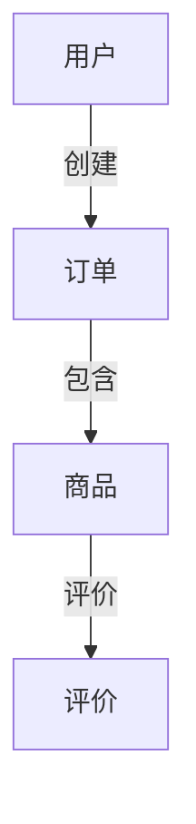

                 


# 领域建模易筋洗髓

关键词：领域建模、领域概念、实体、关系、方法、技术、发展历程

摘要：本文深入探讨了领域建模的基础理论，包括领域概念与实体的界定与分类，关系表示与分类，以及领域模型的结构与设计。通过逐步分析推理，揭示了领域建模的本质和重要性，为软件开发提供了有力的方法论支持。

## 目录大纲

----------------------------------------------------------------

# 第一部分：领域建模基础理论

## 第1章：领域建模概述
### 1.1 领域建模的概念与意义
### 1.2 领域建模的方法与技术
### 1.3 领域建模的发展历程

## 第2章：领域概念与实体
### 2.1 领域概念的界定与分类
### 2.2 实体的识别与属性设计
### 2.3 实体之间的关系建模

## 第3章：领域关系的表示与分类
### 3.1 关系的概念与类型
### 3.2 关系的表示方法
### 3.3 关系分类与属性设计

## 第4章：领域模型的结构与设计
### 4.1 领域模型的构建步骤
### 4.2 领域模型的优化策略
### 4.3 领域模型的应用场景分析

## 第5章：领域模型工具与实践
### 5.1 常用领域模型工具介绍
### 5.2 实战案例：领域模型在金融领域的应用
### 5.3 实战案例：领域模型在电商领域的应用

## 第6章：领域模型挑战与未来趋势
### 6.1 领域模型的挑战与解决策略
### 6.2 领域模型的未来发展趋势
### 6.3 领域模型与其他技术的融合应用

## 第7章：领域建模总结与展望
### 7.1 领域建模的总结与回顾
### 7.2 领域建模的实践经验分享
### 7.3 领域建模的未来发展方向

----------------------------------------------------------------

## 第1章：领域建模概述

### 1.1 领域建模的概念与意义

领域建模是将现实世界中的特定领域抽象为计算机可以处理的概念和关系的过程。它不仅涉及业务规则和业务对象，还包括领域知识和业务逻辑。领域建模的意义主要体现在以下几个方面：

1. **理解业务需求**：领域建模帮助开发人员深入理解业务需求，从而确保软件系统能够满足业务需求。
2. **提高开发效率**：通过领域建模，可以提前发现潜在的问题和风险，从而减少开发过程中的返工和修改。
3. **确保软件质量**：领域建模有助于确保软件系统的结构和功能满足业务需求，从而提高软件质量。
4. **促进领域知识的传承**：领域建模将领域知识结构化，有助于新员工快速掌握业务逻辑。

#### 1.1.1 领域建模的概念

领域建模可以视为一种从业务需求到软件设计的桥梁。它涉及以下几个方面：

- **领域概念**：领域中的核心概念，如客户、订单、产品等。
- **领域关系**：领域内各个概念之间的关系，如客户与订单之间的关系。
- **领域规则**：领域内的业务规则，如订单的创建必须包含有效客户信息。

#### 1.1.2 领域建模的意义

- **提高开发效率**：领域建模有助于提前识别和解决业务需求中的潜在问题，从而减少开发过程中的返工和修改。
- **确保软件质量**：通过领域建模，可以确保软件系统的结构和功能满足业务需求，从而提高软件质量。
- **促进领域知识的传承**：领域建模将领域知识结构化，有助于新员工快速掌握业务逻辑。

### 1.2 领域建模的方法与技术

领域建模的方法和技术多种多样，以下是几种常用的方法：

- **实体-关系建模（ER建模）**：实体-关系建模是最常用的领域建模方法之一，它通过实体、属性和关系来表示领域中的概念和关系。
- **类图建模**：类图建模是面向对象技术中的一种领域建模方法，它通过类、属性和方法来表示领域中的概念和关系。
- **活动图建模**：活动图建模是一种用于描述领域内活动和工作流程的建模方法，它通过活动、决策和连接点来表示领域内的操作和流程。

### 1.3 领域建模的发展历程

领域建模的发展历程可以分为几个阶段：

- **初期阶段**：在软件开发初期，领域建模主要依靠开发人员的经验和直觉，没有形成系统化的方法论。
- **80年代至90年代**：随着面向对象技术的发展，实体-关系建模和类图建模等方法开始被广泛使用。
- **21世纪初**：随着敏捷开发方法和领域驱动设计（DDD）的兴起，领域建模逐渐成为一种系统化的方法论。

### 1.4 本章小结

本章对领域建模进行了概述，介绍了领域建模的概念、意义、方法和技术，以及领域建模的发展历程。这些内容为后续章节的深入讨论奠定了基础。

----------------------------------------------------------------

## 第2章：领域概念与实体

### 2.1 领域概念的界定与分类

领域概念是领域建模的基础，它描述了领域内的核心概念和术语。正确界定领域概念有助于确保领域模型的准确性和一致性。

#### 2.1.1 领域概念的界定

领域概念的界定需要考虑以下几个方面：

1. **定义的清晰性**：领域概念的定义必须清晰明确，避免模糊和歧义。
2. **完整性的考虑**：领域概念的定义应该完整，包括概念的各个方面和细节。
3. **一致性**：领域概念的定义应该与领域内其他概念保持一致性，避免冲突和矛盾。

#### 2.1.2 领域概念的分类

领域概念可以根据不同的标准进行分类，以下是几种常见的分类方法：

1. **按概念的重要性**：领域概念可以分为核心概念和次要概念。核心概念是领域模型中的关键概念，如客户、订单等；次要概念则是辅助核心概念的概念，如订单明细、客户地址等。
2. **按概念的抽象层次**：领域概念可以分为原子概念和复合概念。原子概念是不能再分解的基本概念，如产品、订单等；复合概念则是可以通过其他概念组合而成的高级概念，如销售订单、采购订单等。
3. **按概念的作用**：领域概念可以分为实体概念和关系概念。实体概念是领域模型中的主要对象，如客户、产品等；关系概念则是描述实体之间关系的概念，如购买、销售等。

### 2.2 实体的识别与属性设计

实体是领域模型中的核心对象，它是领域概念的具体化。正确识别实体和设计实体属性对于领域建模至关重要。

#### 2.2.1 实体的识别

实体的识别需要考虑以下几个方面：

1. **实体的特征**：实体的特征是识别实体的重要依据。实体的特征包括属性、行为和关系。
2. **实体的独立性**：实体应该是独立的，即实体可以独立存在，不依赖于其他实体。
3. **实体的重要性**：实体应该是领域模型中的关键对象，对于领域业务有重要影响。

#### 2.2.2 实体的属性设计

实体的属性是实体的特征之一，它是描述实体的重要手段。实体的属性设计需要考虑以下几个方面：

1. **属性的类型**：属性的类型决定了属性的数据表示方式。常见的属性类型包括字符串、整数、浮点数、日期等。
2. **属性的约束**：属性的约束是确保属性合法性的规则。常见的属性约束包括长度约束、范围约束、唯一性约束等。
3. **属性的关系**：属性之间的关系反映了实体的内部结构。属性之间的关系可以是父子关系、兄弟关系等。

### 2.3 实体之间的关系建模

实体之间的关系是领域模型中的关键要素，它描述了实体之间的交互和协作。正确建模实体之间的关系对于领域模型的准确性和一致性至关重要。

#### 2.3.1 实体之间关系的类型

实体之间的关系可以分为以下几种类型：

1. **一对一关系**：一对一关系表示一个实体只能与另一个实体有一个对应关系。例如，一个客户只能有一个地址。
2. **一对多关系**：一对多关系表示一个实体可以与多个实体有对应关系。例如，一个产品可以有多个订单。
3. **多对多关系**：多对多关系表示多个实体可以与多个实体有对应关系。例如，多个学生可以选修多个课程。

#### 2.3.2 实体之间关系的表示

实体之间的关系可以通过ER图（实体-关系图）来表示。ER图是领域建模中最常用的表示方法之一，它通过实体、属性和关系来表示领域模型。

1. **实体**：实体用矩形表示，实体名称写在矩形顶部。
2. **属性**：属性用椭圆形表示，属性名称写在椭圆形内部。
3. **关系**：关系用菱形表示，关系名称写在菱形内部。关系线连接实体和属性，表示实体之间的关系。

### 2.4 本章小结

本章对领域概念与实体进行了深入探讨，包括领域概念的界定与分类，实体的识别与属性设计，以及实体之间的关系建模。这些内容是领域建模的基础，对于构建高质量的领域模型至关重要。

----------------------------------------------------------------

## 第3章：领域关系的表示与分类

### 3.1 关系的概念与类型

领域关系是领域模型中的关键组成部分，它描述了实体之间的交互和协作。正确理解和表示领域关系对于构建高质量的领域模型至关重要。

#### 3.1.1 关系的概念

关系是领域模型中两个或多个实体之间的关联。关系可以是简单的，也可以是复杂的，但它们都是领域模型的重要组成部分。

#### 3.1.2 关系的类型

领域关系可以分为以下几种类型：

1. **一对一关系**：一对一关系表示一个实体只能与另一个实体有一个对应关系。例如，一个客户只能有一个地址。
2. **一对多关系**：一对多关系表示一个实体可以与多个实体有对应关系。例如，一个产品可以有多个订单。
3. **多对多关系**：多对多关系表示多个实体可以与多个实体有对应关系。例如，多个学生可以选修多个课程。

### 3.2 关系的表示方法

关系的表示是领域建模的重要环节。以下是几种常用的关系表示方法：

1. **ER图表示**：ER图（实体-关系图）是领域建模中最常用的表示方法之一。它通过实体、属性和关系来表示领域模型。在ER图中，实体用矩形表示，关系用菱形表示，属性用椭圆形表示。
2. **UML类图表示**：UML类图是另一种常用的关系表示方法。在UML类图中，类用矩形表示，类之间的关系用线条表示，属性和方法用标签表示。
3. **表格表示**：表格表示是一种将关系表示为表格的形式。在表格中，行表示实体，列表示属性和关系，每个单元格表示实体之间的具体关系。

### 3.3 关系的分类与属性设计

领域关系的分类和属性设计对于领域模型的准确性和一致性至关重要。

#### 3.3.1 关系的分类

领域关系可以根据不同的标准进行分类，以下是几种常见的分类方法：

1. **按关系的重要性**：关系可以分为核心关系和辅助关系。核心关系是领域模型中的关键关系，如购买关系、销售关系等；辅助关系则是辅助核心关系的关系，如订单明细关系、客户关系等。
2. **按关系的复杂性**：关系可以分为简单关系和复杂关系。简单关系是直接描述实体之间关系的，如一对一关系、一对多关系等；复杂关系则是描述实体之间复杂交互的，如多对多关系、组合关系等。
3. **按关系的动态性**：关系可以分为静态关系和动态关系。静态关系是描述实体之间长期存在的关系的，如客户与订单的关系；动态关系是描述实体之间临时性关系的，如交易关系、会话关系等。

#### 3.3.2 关系的属性设计

关系的属性设计是关系建模的重要环节。以下是关系属性设计的一些要点：

1. **属性的类型**：关系的属性类型通常包括标识属性、描述属性和操作属性。标识属性是用于唯一标识关系的，如订单号、客户ID等；描述属性是用于描述关系的特征的，如订单日期、客户姓名等；操作属性是用于描述关系操作的，如交易金额、订单状态等。
2. **属性的约束**：关系的属性约束是确保属性合法性的规则。常见的属性约束包括长度约束、范围约束、唯一性约束等。
3. **属性的关系**：关系的属性之间的关系反映了关系的内部结构。属性之间的关系可以是父子关系、兄弟关系等。

### 3.4 本章小结

本章对领域关系的表示与分类进行了深入探讨，包括关系的概念与类型，关系的表示方法，以及关系的分类与属性设计。这些内容是领域建模的重要组成部分，对于构建高质量的领域模型至关重要。

----------------------------------------------------------------

## 第4章：领域模型的结构与设计

### 4.1 领域模型的构建步骤

领域模型的构建是一个系统化的过程，它包括以下几个关键步骤：

#### 4.1.1 需求分析

需求分析是领域模型构建的第一步，它涉及到对业务需求的深入理解。在这一阶段，需要收集和分析业务场景、用户需求、业务规则等信息，确保领域模型能够准确地反映业务需求。

#### 4.1.2 领域概念识别

在需求分析的基础上，识别领域中的核心概念和术语。这一步骤包括对领域概念的界定和分类，确保领域概念的清晰性和一致性。

#### 4.1.3 实体识别

实体是领域模型中的核心对象，识别实体是领域模型构建的关键步骤。在这一阶段，需要识别领域中的关键实体，并定义其实体属性和行为。

#### 4.1.4 关系建模

关系建模是领域模型构建的核心步骤之一。在这一阶段，需要定义实体之间的关系，包括一对一关系、一对多关系和多对多关系。关系建模需要考虑关系的类型、属性和约束。

#### 4.1.5 领域模型优化

领域模型构建完成后，需要对其进行优化。优化策略包括简化模型结构、减少冗余关系、提高模型的可扩展性和可维护性等。

#### 4.1.6 验证和迭代

领域模型的构建是一个迭代过程，需要在构建过程中不断验证模型的有效性和准确性。验证包括对领域模型的逻辑一致性、业务正确性和性能等方面的评估。

### 4.2 领域模型的优化策略

领域模型优化是确保模型质量和效率的重要步骤。以下是几种常见的优化策略：

1. **简化模型结构**：通过合并冗余实体和关系，简化模型结构，提高模型的清晰性和可读性。
2. **减少冗余关系**：识别并消除冗余关系，减少模型中的冗余信息，提高模型的效率。
3. **提高可扩展性**：通过引入抽象层次和模块化设计，提高领域模型的可扩展性，以便适应未来需求的变化。
4. **提高可维护性**：通过采用清晰的设计原则和编码规范，提高领域模型的可维护性，降低维护成本。

### 4.3 领域模型的应用场景分析

领域模型在不同应用场景中的应用各有特点。以下是几种常见应用场景的分析：

1. **企业级应用**：在大型企业级应用中，领域模型可以帮助企业更好地管理复杂的业务流程和业务规则，提高业务流程的自动化和智能化水平。
2. **电子商务平台**：在电子商务平台中，领域模型可以用于描述产品、订单、用户等核心实体，以及它们之间的关系，支持电子商务业务的全面建模和优化。
3. **金融系统**：在金融系统中，领域模型可以用于描述账户、交易、客户等核心实体，以及它们之间的关系，支持金融业务的高效管理和风险控制。

### 4.4 本章小结

本章对领域模型的结构与设计进行了深入探讨，包括领域模型的构建步骤、优化策略和应用场景分析。通过这些内容，读者可以全面了解领域模型的设计和构建过程，为实际项目提供指导。

----------------------------------------------------------------

## 第5章：领域模型工具与实践

### 5.1 常用领域模型工具介绍

在领域建模过程中，使用合适的工具可以显著提高建模的效率和质量。以下是几种常用的领域模型工具：

1. **Eclipse Modeling Tools**：Eclipse Modeling Tools 是一款功能强大的领域模型工具，它包括多个插件，如EMF、GMF等，支持创建、编辑和验证领域模型。
2. **Microsoft Visio**：Microsoft Visio 是一款专业的绘图工具，它支持创建各种类型的图表和模型，包括领域模型。通过Visio，用户可以直观地展示领域模型的结构和关系。
3. **PlantUML**：PlantUML 是一款基于文本的领域模型工具，它支持使用简单易懂的文本语言创建领域模型。通过PlantUML，用户可以方便地生成ER图、类图、活动图等。
4. **Lucidchart**：Lucidchart 是一款在线领域模型工具，它支持实时协作，用户可以方便地与他人共享和讨论领域模型。Lucidchart 提供了丰富的图形和图表模板，方便用户快速创建领域模型。

### 5.2 实战案例：领域模型在金融领域的应用

金融领域是一个复杂的领域，领域模型在金融系统的设计和开发中发挥着重要作用。以下是一个金融领域应用的领域模型案例：

#### 5.2.1 领域概念识别

在金融领域，核心概念包括客户、账户、交易、产品等。

#### 5.2.2 实体识别

根据领域概念，识别出以下实体：

- **客户（Customer）**：包括客户姓名、联系方式等属性。
- **账户（Account）**：包括账户编号、账户余额等属性。
- **交易（Transaction）**：包括交易编号、交易金额、交易日期等属性。
- **产品（Product）**：包括产品编号、产品名称、产品类型等属性。

#### 5.2.3 关系建模

根据实体之间的关系，构建以下关系：

- **客户与账户**：一对一关系，一个客户可以拥有多个账户。
- **账户与交易**：一对多关系，一个账户可以有多个交易。
- **交易与产品**：一对多关系，一个交易可以涉及多个产品。

#### 5.2.4 领域模型构建

使用Eclipse Modeling Tools，构建金融领域的领域模型，包括实体和关系。以下是一个简化的领域模型ER图：

```mermaid
erDiagram
    Customer ||--|{ Account }|-- Transaction
    Product ||--|{ Transaction }|-- Account
```

### 5.3 实战案例：领域模型在电商领域的应用

电商领域是一个高度竞争的行业，领域模型在电商系统的设计和开发中同样具有重要作用。以下是一个电商领域应用的领域模型案例：

#### 5.3.1 领域概念识别

在电商领域，核心概念包括用户、商品、订单、评价等。

#### 5.3.2 实体识别

根据领域概念，识别出以下实体：

- **用户（User）**：包括用户姓名、联系方式等属性。
- **商品（Product）**：包括商品编号、商品名称、价格等属性。
- **订单（Order）**：包括订单编号、订单日期、订单状态等属性。
- **评价（Evaluation）**：包括评价编号、评价内容、评价时间等属性。

#### 5.3.3 关系建模

根据实体之间的关系，构建以下关系：

- **用户与订单**：一对多关系，一个用户可以创建多个订单。
- **订单与商品**：一对多关系，一个订单可以包含多个商品。
- **商品与评价**：一对多关系，一个商品可以接收多个评价。

#### 5.3.4 领域模型构建

使用Microsoft Visio，构建电商领域的领域模型，包括实体和关系。以下是一个简化的领域模型：



### 5.4 本章小结

本章介绍了常用领域模型工具的

