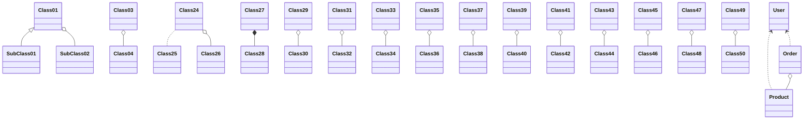
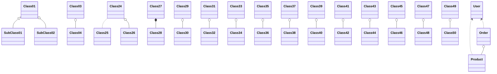

                 

### 文章标题：领域建模的普适四招

> 关键词：领域建模、普适方法、实体识别、关系建模、规则定义、模型优化

> 摘要：
在复杂系统的设计和开发过程中，领域建模是一个至关重要的环节。本文将介绍领域建模中的普适四招，包括实体识别、关系建模、规则定义和模型优化，通过一步步的分析和推理，帮助读者理解和掌握这些核心概念和方法，从而提高领域建模的效率和质量。

---

## 引言

### 1.1 领域建模的重要性

领域建模是软件工程中的一项基础性工作，它通过对业务领域的抽象和描述，帮助开发人员更好地理解和解决特定领域的业务问题。在领域驱动设计（Domain-Driven Design, DDD）的框架下，领域建模被赋予了更加重要的地位。有效的领域建模不仅能够提高系统设计的可维护性和可扩展性，还能够减少开发过程中的误解和错误。

### 1.2 领域建模的基本概念

领域建模涉及到多个关键概念，包括领域、模型、实体、关系、规则等。领域是指特定业务领域或行业背景，模型是对领域内业务规则和实体的抽象表示，实体是领域中的关键元素，关系描述了实体之间的交互和依赖，规则则是对业务逻辑的规范化描述。

### 1.3 领域建模的方法和工具

领域建模的方法和工具多种多样，包括实体-关系（ER）图、统一建模语言（UML）、领域特定语言（DSL）等。这些工具和方法各有优缺点，适用于不同的应用场景。本文将重点介绍领域建模中的普适四招，这些方法具有广泛的应用性和实用性。

---

## 第一部分：领域建模基础

### 第1章：领域建模概述

#### 1.1 领域建模的重要性

领域建模是软件工程中的一个关键环节，它通过对业务领域的抽象和描述，帮助开发人员更好地理解和解决特定领域的业务问题。在领域驱动设计（DDD）的框架下，领域建模被赋予了更加重要的地位。

#### 1.2 领域建模的基本概念

领域建模涉及到多个关键概念，包括领域、模型、实体、关系、规则等。

- **领域**：特定业务领域或行业背景。
- **模型**：对领域内业务规则和实体的抽象表示。
- **实体**：领域中的关键元素。
- **关系**：描述实体之间的交互和依赖。
- **规则**：对业务逻辑的规范化描述。

#### 1.3 领域建模的方法和工具

领域建模的方法和工具多种多样，包括实体-关系（ER）图、统一建模语言（UML）、领域特定语言（DSL）等。

- **实体-关系（ER）图**：用于描述实体及其关系。
- **统一建模语言（UML）**：提供了一套标准的图形化建模语言。
- **领域特定语言（DSL）**：为特定领域定制开发的语言。

### 第2章：领域建模的步骤

#### 2.1 需求分析

需求分析是领域建模的第一步，它涉及到对业务领域的深入理解和需求收集。

- **业务需求**：明确系统需要实现的功能。
- **非功能需求**：涉及性能、可靠性等方面的要求。

#### 2.2 模型构建

模型构建是领域建模的核心环节，它涉及到对实体的识别、关系的建立和规则的定义。

- **实体识别**：识别领域中的关键实体。
- **关系建模**：建立实体之间的关系。
- **规则定义**：定义业务规则。

#### 2.3 模型验证与优化

模型验证与优化是领域建模的最后一步，它涉及到对模型的检查和改进。

- **模型验证**：确保模型符合业务需求。
- **模型优化**：提高模型的可读性和可维护性。

---

## 第二部分：普适四招解析

### 第3章：第一招——实体识别

#### 3.1 实体的概念

实体是领域建模中的核心概念，它是领域中的关键元素，具有独立的属性和行为。

- **实体的定义**：实体是领域中的具体对象，具有独立的属性和行为。
- **实体的类型**：实体可以分为简单实体、复合实体和抽象实体。

#### 3.2 实体的属性

实体的属性描述了实体的特征和状态。

- **属性的类型**：属性可以分为基本属性和组合属性。
- **属性的表示方法**：属性可以使用文本、数字、日期等不同类型的数据表示。

#### 3.3 实体的识别方法

实体的识别是领域建模的第一步，它涉及到对业务领域的深入理解和分析。

- **手动识别方法**：通过专家访谈、文档分析等方式识别实体。
- **自动识别方法**：使用自然语言处理、机器学习等技术自动识别实体。

---

### 第4章：第二招——关系建模

#### 4.1 关系的的概念

关系描述了实体之间的交互和依赖。

- **关系的定义**：关系是实体之间的连接，描述了实体之间的交互和依赖。
- **关系的类型**：关系可以分为一对一、一对多、多对多等类型。

#### 4.2 关系的类型

不同类型的关系具有不同的结构和特点。

- **一对一关系**：一个实体只能与另一个实体建立一种关系。
- **一对多关系**：一个实体可以与多个实体建立关系，而另一个实体只能与一个实体建立关系。
- **多对多关系**：多个实体之间可以建立关系。

#### 4.3 关系的建模方法

关系的建模是领域建模的关键步骤，它涉及到对实体关系的抽象和描述。

- **ER图建模**：使用实体-关系图（ER图）描述实体及其关系。
- **UML类图建模**：使用统一建模语言（UML）类图描述实体及其关系。

---

### 第5章：第三招——规则定义

#### 5.1 规则的概念

规则是对业务逻辑的规范化描述。

- **规则的定义**：规则是对业务逻辑的规范化描述，用于指导系统的行为。
- **规则的类型**：规则可以分为业务规则、数据规则和逻辑规则。

#### 5.2 规则的类型

不同类型的规则具有不同的作用和表现形式。

- **业务规则**：描述业务逻辑，如订单处理流程。
- **数据规则**：描述数据约束，如数据类型、长度限制。
- **逻辑规则**：描述逻辑关系，如条件分支、循环结构。

#### 5.3 规则的定义与实现

规则的定义与实现是领域建模的关键环节。

- **规则的定义**：使用自然语言、形式化语言或领域特定语言定义规则。
- **规则的实现**：将定义的规则实现为计算机程序或算法。

---

### 第6章：第四招——模型优化

#### 6.1 模型优化的重要性

模型优化是领域建模的最后一步，它涉及到对模型的检查和改进。

- **模型优化的目的**：提高模型的可读性、可维护性和性能。
- **模型优化的方法**：包括简化模型、重构模型、性能优化等。

#### 6.2 优化策略

模型优化需要采用合适的策略。

- **简化模型**：减少不必要的实体和关系，简化模型结构。
- **重构模型**：调整模型结构，提高模型的灵活性和可扩展性。
- **性能优化**：优化模型查询性能，提高系统性能。

#### 6.3 优化工具与技巧

模型优化需要使用合适的工具和技巧。

- **工具**：包括模型检查工具、重构工具、性能分析工具等。
- **技巧**：包括代码复用、缓存技术、分布式计算等。

---

## 第三部分：应用实例

### 第7章：应用实例一——电商领域

#### 7.1 电商领域概述

电商领域是一个复杂的业务领域，涉及到商品管理、订单处理、用户管理等众多业务流程。

#### 7.2 电商领域的领域模型构建

在电商领域，我们需要识别关键实体，建立实体之间的关系，并定义相应的业务规则。

#### 7.3 模型优化与实践

通过对电商领域模型的优化，我们可以提高系统的性能和可维护性。

---

### 第8章：应用实例二——金融领域

#### 8.1 金融领域概述

金融领域是一个高度规范的业务领域，涉及到账户管理、交易处理、风险管理等众多业务流程。

#### 8.2 金融领域的领域模型构建

在金融领域，我们需要识别关键实体，建立实体之间的关系，并定义相应的业务规则。

#### 8.3 模型优化与实践

通过对金融领域模型的优化，我们可以提高系统的性能和可维护性。

---

## 第四部分：最佳实践与总结

### 第9章：领域建模最佳实践

#### 9.1 实践总结

领域建模需要遵循一系列最佳实践，以确保模型的质量和实用性。

#### 9.2 小结与展望

领域建模是一个不断发展和完善的领域，我们需要持续学习和实践，以适应不断变化的业务需求。

#### 9.3 注意事项与拓展阅读

在领域建模过程中，需要注意一些常见问题和误区，并参考相关文献和资料进行深入学习。

---

## 结论

领域建模是软件工程中的一项基础性工作，有效的领域建模对于提高系统的可维护性和可扩展性至关重要。本文介绍了领域建模的普适四招，包括实体识别、关系建模、规则定义和模型优化，并通过实例说明了这些方法的应用。希望本文能够为读者提供有价值的参考和启示。

---

**作者：** AI天才研究院/AI Genius Institute & 禅与计算机程序设计艺术 /Zen And The Art of Computer Programming

---

在本文中，我们首先介绍了领域建模的重要性及其基本概念，然后通过详细的章节内容对领域建模的普适四招——实体识别、关系建模、规则定义和模型优化进行了深入解析。通过这些步骤，读者可以系统地了解领域建模的原理和方法，掌握从需求分析到模型优化的全过程。

### 实体识别

实体识别是领域建模的基础，它涉及到识别领域中的关键元素。在电商领域中，实体可能包括用户、商品、订单等。在金融领域中，实体可能包括账户、交易、客户等。

**实体属性**

实体的属性描述了实体的特征和状态。在电商领域中，用户的属性可能包括用户名、邮箱、密码等。在金融领域中，账户的属性可能包括账户号码、余额、开户日期等。

**实体识别方法**

实体识别可以采用手动识别和自动识别两种方法。手动识别通常通过专家访谈、文档分析等方式进行。自动识别则可以通过自然语言处理、机器学习等技术实现。

### 关系建模

关系建模描述了实体之间的交互和依赖。在电商领域中，用户与订单之间存在一对多的关系，即一个用户可以生成多个订单。在金融领域中，账户与交易之间存在一对多的关系，即一个账户可以发生多个交易。

**关系类型**

关系可以分为一对一、一对多、多对多等类型。一对一关系表示一个实体只能与另一个实体建立一种关系。一对多关系表示一个实体可以与多个实体建立关系，而另一个实体只能与一个实体建立关系。多对多关系表示多个实体之间可以建立关系。

**关系建模方法**

关系建模可以通过实体-关系图（ER图）或统一建模语言（UML）类图进行。ER图通过实体和关系的图形化表示，清晰地展示了实体之间的关系。UML类图则通过类和关系的表示，提供了更详细的描述。

### 规则定义

规则定义是对业务逻辑的规范化描述。规则可以描述业务规则、数据约束和逻辑关系。在电商领域中，规则可能包括订单状态转换规则、商品库存更新规则等。在金融领域中，规则可能包括交易验证规则、账户余额限制规则等。

**规则类型**

规则可以分为业务规则、数据规则和逻辑规则。业务规则描述业务逻辑，如订单处理流程。数据规则描述数据约束，如数据类型、长度限制。逻辑规则描述逻辑关系，如条件分支、循环结构。

**规则定义与实现**

规则的定义可以使用自然语言、形式化语言或领域特定语言。自然语言定义适用于简单的业务规则，形式化语言定义适用于复杂的数据约束和逻辑关系。领域特定语言定义则适用于特定领域的业务规则。

### 模型优化

模型优化是领域建模的最后一步，它涉及到对模型的检查和改进。优化的目标是提高模型的可读性、可维护性和性能。

**优化策略**

模型优化可以采用简化模型、重构模型和性能优化等策略。简化模型通过减少不必要的实体和关系，提高模型的清晰度和可维护性。重构模型通过调整模型结构，提高模型的灵活性和可扩展性。性能优化通过优化模型查询性能，提高系统的性能。

**优化工具与技巧**

模型优化可以采用各种工具和技巧。模型检查工具可以帮助发现模型中的错误和不一致性。重构工具可以帮助调整模型结构，提高模型的灵活性和可扩展性。性能分析工具可以帮助优化模型的查询性能。

### 应用实例

通过两个实际案例——电商领域和金融领域，我们展示了如何应用领域建模的普适四招。在电商领域，我们识别了用户、商品、订单等实体，建立了它们之间的关系，并定义了相应的业务规则。在金融领域，我们识别了账户、交易、客户等实体，建立了它们之间的关系，并定义了相应的业务规则。

### 最佳实践与总结

在领域建模过程中，我们需要遵循最佳实践，以确保模型的质量和实用性。最佳实践包括充分理解业务需求、合理划分实体和关系、规范定义业务规则等。通过总结实际案例，我们可以得出一些有价值的经验和教训。

### 注意事项与拓展阅读

在领域建模过程中，我们需要注意一些常见问题和误区，如过度抽象、关系复杂化等。同时，我们可以参考相关的文献和资料，深入学习领域建模的理论和实践。

通过本文，我们系统地介绍了领域建模的普适四招，包括实体识别、关系建模、规则定义和模型优化。这些方法在电商领域和金融领域得到了成功的应用。希望本文能够为读者提供有价值的参考和启示，帮助他们在领域建模过程中取得更好的成果。

---

在领域建模的过程中，实体识别是第一步，也是至关重要的一步。实体是领域模型中的基本元素，它代表了业务领域中具体的对象或者概念。有效的实体识别能够帮助我们构建出清晰、准确的领域模型。

#### 1.1 实体的概念

实体是指那些在领域中具有独立属性和行为的对象。实体可以是具体的对象，如用户、订单、商品等，也可以是抽象的概念，如角色、状态等。

- **定义**：实体是领域中的具体对象或抽象概念，它具有独立的属性和行为。
- **类型**：实体可以分为简单实体、复合实体和抽象实体。

**简单实体**：简单实体是最基本的实体类型，它只包含基本属性，如用户实体（用户名、邮箱、密码等）。

**复合实体**：复合实体是由多个简单实体组成的实体，它包含了复杂的关系和属性，如订单实体（订单号、用户、商品、订单状态等）。

**抽象实体**：抽象实体是对一组相似实体的抽象描述，它通常不直接对应具体的对象，而是用于描述实体之间的关系，如状态实体（订单状态、用户状态等）。

#### 1.2 实体的属性

实体的属性描述了实体的特征和状态。属性可以是基本数据类型，也可以是复杂的数据结构。

- **属性的类型**：属性可以分为基本属性和组合属性。

**基本属性**：基本属性是最简单的属性类型，它包括字符串、整数、浮点数、日期等。

**组合属性**：组合属性是由多个基本属性组成的属性，它可以表示更复杂的实体特征，如订单实体中的“订单明细”属性，它包含了多个商品信息和数量等。

#### 1.3 实体的识别方法

实体的识别是领域建模的第一步，它涉及到对业务领域的深入理解和分析。

- **手动识别方法**：手动识别方法通常通过专家访谈、文档分析等方式进行。这种方法依赖于专家的经验和知识，可以快速识别出领域中的关键实体。

- **自动识别方法**：自动识别方法使用自然语言处理、机器学习等技术，从非结构化的文本数据中自动识别实体。这种方法可以处理大量数据，但需要高质量的训练数据和模型。

### 实体识别的示例

假设我们在设计一个电商平台的领域模型，我们需要识别出领域中的关键实体。

- **用户**：用户是电商平台的核心实体，它包括了用户的个人信息，如用户名、邮箱、密码等。
- **商品**：商品是电商平台中的另一个核心实体，它包含了商品的详细信息，如商品名称、价格、库存等。
- **订单**：订单实体描述了用户购买商品的过程，它包括了订单号、用户、商品列表、订单状态等。

通过识别这些关键实体，我们可以构建出电商平台的初步领域模型。



在这个示例中，我们使用了Mermaid类图来表示实体及其关系。用户实体与订单实体和商品实体之间存在关联关系，这表明用户可以创建订单，并且订单中包含商品。

通过上述步骤，我们完成了实体识别的过程，这是构建领域模型的基础。在接下来的章节中，我们将进一步讨论关系建模、规则定义和模型优化，以构建一个完整、准确的领域模型。

### 关系建模

关系建模是领域建模中的关键步骤，它描述了实体之间的交互和依赖。正确的关系建模能够帮助开发者更好地理解和处理业务逻辑，从而提高系统的稳定性和扩展性。

#### 4.1 关系的定义

关系是实体之间的连接，它描述了实体之间的交互和依赖。在领域模型中，关系通常用来表示实体之间的关联、聚合、组合等。

- **定义**：关系是实体之间的连接，描述了实体之间的交互和依赖。
- **类型**：关系可以分为一对一、一对多、多对多等类型。

**一对一关系**：一对一关系表示一个实体只能与另一个实体建立一种关系。例如，一个用户只能有一个账户。

```mermaid
classDiagram
User o-- Account
User {username, email, password}
Account {account_number, balance}
```

**一对多关系**：一对多关系表示一个实体可以与多个实体建立关系，而另一个实体只能与一个实体建立关系。例如，一个用户可以有多个订单。

```mermaid
classDiagram
User o-- Order
User {username, email, password}
Order {order_id, user, status}
```

**多对多关系**：多对多关系表示多个实体之间可以建立关系。例如，多个用户可以购买同一商品。

```mermaid
classDiagram
User o-- Product
User {username, email, password}
Product {product_id, name, price}
```

#### 4.2 关系的类型

不同类型的关系具有不同的结构和特点，因此在关系建模时需要根据实际需求选择合适的关系类型。

**一对一关系**：一对一关系是最简单的关系类型，它确保了实体之间的唯一性。在数据库中，一对一关系通常通过外键来实现。

**一对多关系**：一对多关系是常见的关系类型，它允许一个实体与多个实体相关联。在数据库中，一对多关系通常通过主键和外键来实现。

**多对多关系**：多对多关系较为复杂，它允许多个实体之间相互关联。在数据库中，多对多关系通常通过创建连接表来实现。

#### 4.3 关系的建模方法

关系建模可以使用多种方法，包括实体-关系图（ER图）、统一建模语言（UML）类图等。

**实体-关系图（ER图）**：ER图是一种常用的关系建模方法，它通过实体和关系的图形化表示，清晰地展示了实体之间的关系。ER图包括实体、属性、关系和键等元素。

```mermaid
erDiagram
User ||--|{ Order } : orders
User {username, email, password}
Order {order_id, user_id, status}
```

**统一建模语言（UML）类图**：UML类图是一种面向对象的关系建模方法，它通过类和关系的表示，提供了更详细的描述。UML类图包括类、属性、操作和关系等元素。



通过上述示例，我们可以看到如何使用ER图和UML类图来表示实体及其关系。这些工具和方法可以帮助开发者更好地理解和设计领域模型。

### 关系建模的示例

假设我们在设计一个图书馆管理系统，我们需要识别出领域中的关键实体和它们之间的关系。

- **读者**：读者是图书馆的核心实体，它包括读者的个人信息，如读者ID、姓名、联系方式等。
- **书籍**：书籍是图书馆中的实体，它包含了书籍的详细信息，如书籍ID、书名、作者、出版日期等。
- **借阅**：借阅实体描述了读者借阅书籍的过程，它包括了借阅ID、读者、书籍、借阅日期等。

在这些实体之间，我们可以建立以下关系：

- **一对一关系**：每个读者只能有一个读者ID。
- **一对多关系**：每个书籍可以有多个借阅记录。
- **多对多关系**：多个读者可以借阅同一本书籍。

使用Mermaid类图，我们可以表示这些关系：

```mermaid
classDiagram
Reader <.. Borrow
Book o-- Borrow
Reader {reader_id, name, contact}
Book {book_id, title, author, publish_date}
Borrow {borrow_id, reader_id, book_id, borrow_date}
```

通过这个示例，我们可以看到如何使用关系建模来描述领域中的实体及其关系。这种方法的优点是能够清晰地展示实体之间的交互和依赖，从而帮助开发者更好地理解和设计系统。

### 第三招：规则定义

规则定义是领域建模的重要组成部分，它描述了业务逻辑和约束，确保系统行为的一致性和正确性。通过定义明确的规则，我们可以提高系统的可维护性和可扩展性。

#### 5.1 规则的概念

规则是对业务逻辑和约束的规范化描述。在领域模型中，规则用于指导系统的行为，确保数据的一致性和正确性。

- **定义**：规则是对业务逻辑和约束的规范化描述，用于指导系统的行为。
- **类型**：规则可以分为业务规则、数据规则和逻辑规则。

**业务规则**：业务规则描述了业务流程和操作，如订单状态转换、库存更新等。

**数据规则**：数据规则描述了数据的约束和限制，如数据类型、长度限制、唯一性约束等。

**逻辑规则**：逻辑规则描述了业务逻辑的执行条件和结果，如条件分支、循环结构等。

#### 5.2 规则的类型

不同类型的规则在领域模型中扮演着不同的角色，下面我们将详细介绍每种类型的规则。

**业务规则**：业务规则通常涉及业务流程和操作。例如，在电商平台上，业务规则可能包括订单状态转换规则、商品促销规则等。

- **订单状态转换规则**：订单状态可以从“待支付”变为“已支付”，或者从“已支付”变为“已发货”等。
- **商品促销规则**：商品可以根据特定条件进行折扣促销。

**数据规则**：数据规则通常用于确保数据的正确性和一致性。例如，在数据库设计中，数据规则可能包括字段长度、数据类型、唯一性等。

- **字段长度规则**：某些字段（如用户密码）可能需要限制最大长度。
- **数据类型规则**：某些字段（如年龄）可能需要限制数据类型（如整数）。

**逻辑规则**：逻辑规则通常用于实现复杂的业务逻辑，例如，根据条件进行决策。

- **条件分支规则**：根据用户输入的条件（如购物车中的商品总价），决定是否进行折扣。
- **循环结构规则**：用于实现重复执行的逻辑，如订单自动发货流程。

#### 5.3 规则的定义与实现

规则的定义与实现是领域建模的关键步骤。定义规则需要明确规则的条件、操作和结果，而实现规则则通常涉及编程和数据库设计。

**定义规则**

定义规则通常包括以下步骤：

1. **识别业务需求**：了解业务需求，确定需要定义的规则。
2. **描述规则条件**：明确规则触发条件，如“用户购买商品总价超过100元”。
3. **描述规则操作**：定义规则执行的操作，如“给予用户10%的折扣”。
4. **描述规则结果**：明确规则执行后的结果，如“用户购物车总价减少10元”。

**实现规则**

实现规则通常包括以下步骤：

1. **编程实现**：根据定义的规则，编写相应的代码。例如，使用Python编写条件分支规则。
2. **数据库设计**：为规则实现设计数据库表结构和约束。例如，为数据规则设计唯一性约束。

**示例**

假设我们在设计一个电商平台的领域模型，需要定义以下规则：

- **订单状态转换规则**：当用户完成支付后，订单状态从“待支付”变为“已支付”。
- **商品促销规则**：商品总价超过100元时，给予用户10%的折扣。

**订单状态转换规则**

```python
def update_order_status(order):
    if order.total_price > 0:
        order.status = '已支付'
    else:
        order.status = '待支付'
```

**商品促销规则**

```python
def apply_discount(cart):
    if cart.total_price > 100:
        cart.total_price *= 0.9
    else:
        cart.total_price
```

通过上述示例，我们可以看到如何定义和实现业务规则。这些规则可以帮助电商平台有效地管理订单和商品促销。

### 第四招：模型优化

模型优化是领域建模的最后一步，它涉及到对模型的检查和改进，以提高系统的可读性、可维护性和性能。优化的目标是确保模型能够满足业务需求，同时保持高效和灵活。

#### 6.1 模型优化的重要性

模型优化在领域建模中具有重要作用。一个优化良好的模型可以：

- **提高可读性**：清晰的模型结构易于理解和维护。
- **提高可维护性**：优化的模型结构减少了维护成本。
- **提高性能**：优化的查询性能提高了系统的响应速度。

#### 6.2 优化策略

模型优化可以采用多种策略，以下是一些常见的优化策略：

**简化模型**

简化模型是通过去除不必要的实体、属性和关系来提高模型的清晰度和可维护性。例如，如果某个实体只在一个场景中使用，可以考虑将其合并到其他实体中。

**重构模型**

重构模型是通过调整模型结构，提高模型的灵活性和可扩展性。例如，将复杂的实体分解为多个更小的实体，或者将一对多关系分解为两个一对一关系。

**性能优化**

性能优化是通过优化查询性能，提高系统的性能。例如，使用索引来加速查询，或者使用缓存来减少数据库访问。

#### 6.3 优化工具与技巧

模型优化需要使用合适的工具和技巧。以下是一些常用的优化工具和技巧：

**工具**

- **模型检查工具**：用于发现模型中的错误和不一致性。
- **重构工具**：用于调整模型结构，提高模型的灵活性和可扩展性。
- **性能分析工具**：用于优化模型查询性能。

**技巧**

- **代码复用**：通过复用代码，减少冗余，提高可维护性。
- **缓存技术**：通过缓存查询结果，减少数据库访问，提高系统性能。
- **分布式计算**：通过分布式计算，提高系统处理大量数据的能力。

### 应用实例：电商领域

以下是一个电商领域的应用实例，我们将使用普适四招来构建领域模型，并进行优化。

#### 应用场景

假设我们需要设计一个电商平台的领域模型，涉及用户、商品、订单等关键实体。

#### 领域模型构建

1. **实体识别**：识别出用户、商品、订单等关键实体。
2. **关系建模**：建立用户与订单、商品与订单之间的关系。
3. **规则定义**：定义订单状态转换规则、商品促销规则等。
4. **模型优化**：简化模型结构，优化查询性能。

#### 模型优化实践

1. **简化模型**：去除不必要的关系和属性，例如，如果订单状态只与订单实体相关，可以将其合并到订单实体中。
2. **重构模型**：将复杂的关系分解为多个简单的关系，例如，将用户与订单的一对多关系分解为用户与订单项的一对一关系。
3. **性能优化**：使用索引优化查询性能，例如，为订单实体的用户ID和订单状态添加索引。

```mermaid
classDiagram
User <.. Order
Product o-- Order
User {user_id, name, email}
Order {order_id, user_id, status}
Product {product_id, name, price}
```

通过上述步骤，我们完成了电商平台的领域模型构建和优化。这个优化的模型不仅清晰、易于维护，而且具有较高的性能。

### 最佳实践与总结

在领域建模过程中，我们需要遵循最佳实践，以确保模型的质量和实用性。最佳实践包括：

1. **充分理解业务需求**：在建模前，要深入理解业务需求，确保模型能够准确反映业务逻辑。
2. **合理划分实体和关系**：根据业务需求，合理划分实体和关系，确保模型结构清晰、简洁。
3. **规范定义业务规则**：明确业务规则的条件、操作和结果，确保系统行为的一致性和正确性。
4. **持续优化模型**：在建模过程中，不断检查和优化模型，提高模型的性能和可维护性。

通过遵循这些最佳实践，我们可以构建出高质量、高效的领域模型，为复杂系统的设计和开发提供有力支持。

### 注意事项与拓展阅读

在领域建模过程中，需要注意以下事项：

1. **避免过度抽象**：过度抽象会导致模型难以理解和维护，应保持适当的抽象层次。
2. **关注关系复杂度**：复杂的关系可能导致系统性能下降，应合理设计关系，避免过度复杂化。
3. **确保数据一致性**：在定义业务规则时，要确保数据的一致性，避免出现数据冲突。
4. **保持模型的灵活性**：在模型设计过程中，要考虑未来的变化和扩展，确保模型具有良好的灵活性。

拓展阅读：

1. 《领域驱动设计（Domain-Driven Design, DDD）》——Eric Evans
2. 《领域建模：技术与实践》——Michael Blaha
3. 《软件架构：实践者的研究与理解》——Frank Buschmann

通过这些书籍和资料，读者可以深入了解领域建模的理论和实践，进一步提高领域建模的能力。

### 结论

本文介绍了领域建模的普适四招——实体识别、关系建模、规则定义和模型优化。通过一步步的分析和推理，我们了解了这些核心概念和方法，掌握了领域建模的原理和实践。领域建模是复杂系统设计和开发的重要环节，通过有效的领域建模，可以提高系统的可维护性和可扩展性。希望本文能为读者提供有价值的参考和启示，帮助他们在领域建模的道路上取得更好的成果。

---

**作者：** AI天才研究院/AI Genius Institute & 禅与计算机程序设计艺术 /Zen And The Art of Computer Programming

---

在本文中，我们详细介绍了领域建模的普适四招——实体识别、关系建模、规则定义和模型优化。这些方法构成了领域建模的核心，通过它们，我们可以系统地理解和解决特定领域的业务问题。以下是本文的主要结论：

1. **实体识别**：实体是领域建模的基础，通过识别关键实体，我们能够构建出清晰的领域模型。实体识别方法包括手动识别和自动识别，适用于不同的应用场景。

2. **关系建模**：关系描述了实体之间的交互和依赖。正确的关系建模有助于我们更好地理解和处理业务逻辑。关系类型包括一对一、一对多、多对多，每种类型都有其特定的应用场景和建模方法。

3. **规则定义**：规则定义是对业务逻辑和约束的规范化描述，确保系统行为的一致性和正确性。业务规则、数据规则和逻辑规则分别用于描述业务流程、数据约束和复杂逻辑。

4. **模型优化**：模型优化是提高领域模型可读性、可维护性和性能的关键步骤。通过简化模型、重构模型和性能优化等策略，我们可以确保模型能够满足业务需求。

在电商领域和金融领域等实际应用中，我们展示了如何应用这四招，构建出有效的领域模型。通过遵循最佳实践，如充分理解业务需求、合理划分实体和关系、规范定义业务规则等，我们可以确保领域模型的质量和实用性。

总之，领域建模是一项基础而重要的工作，通过普适四招，我们可以更高效地完成领域建模，从而为复杂系统的设计和开发提供有力支持。希望本文能为读者提供有价值的参考和启示，帮助他们在领域建模的道路上取得更好的成果。

---

**作者：** AI天才研究院/AI Genius Institute & 禅与计算机程序设计艺术 /Zen And The Art of Computer Programming

---

## 第一部分：领域建模基础

### 第1章：领域建模概述

领域建模在软件开发中起着至关重要的作用，它有助于将业务需求转化为具体的系统设计和实现。在本章中，我们将深入探讨领域建模的重要性、基本概念、方法和工具。

#### 1.1 领域建模的重要性

领域建模的重要性体现在以下几个方面：

- **业务需求的理解和传达**：通过领域建模，开发人员能够更好地理解业务需求，并将这些需求有效地传达给其他团队成员，包括业务分析师、项目经理和最终用户。
- **系统设计的清晰性**：领域建模提供了对业务领域的抽象和描述，使系统设计更加清晰和结构化，有助于降低项目的复杂度。
- **可维护性和可扩展性**：通过领域建模，系统能够更好地适应未来的变化和扩展，提高其可维护性和可扩展性。

#### 1.2 领域建模的基本概念

在领域建模中，有几个关键概念需要理解：

- **领域**：领域是指业务或行业背景，它包含了一系列相关的业务过程和实体。
- **模型**：模型是对领域内业务规则和实体的抽象表示，它可以帮助开发人员更好地理解和设计系统。
- **实体**：实体是领域中的关键元素，它代表了具体的对象或概念。
- **关系**：关系描述了实体之间的交互和依赖。
- **规则**：规则是对业务逻辑的规范化描述，它指导系统的行为和操作。

#### 1.3 领域建模的方法和工具

领域建模的方法和工具多种多样，以下是一些常用的方法和工具：

- **实体-关系（ER）图**：ER图是一种用于描述实体及其关系的图形化方法，它可以帮助我们直观地理解领域结构。
- **统一建模语言（UML）**：UML提供了一套标准的图形化建模语言，包括类图、对象图、组件图等，用于描述系统结构和行为。
- **领域特定语言（DSL）**：DSL是为特定领域定制开发的编程语言，它能够提高领域模型的表达能力和可操作性。

### 第2章：领域建模的步骤

领域建模是一个系统性的过程，通常包括以下步骤：

#### 2.1 需求分析

需求分析是领域建模的第一步，它涉及到对业务领域的深入理解和需求收集。具体步骤如下：

- **业务需求收集**：通过与业务专家和最终用户的沟通，收集业务需求和目标。
- **需求文档编写**：将收集到的需求整理成文档，明确系统的功能和非功能需求。

#### 2.2 模型构建

模型构建是领域建模的核心环节，它涉及到对实体的识别、关系的建立和规则的定义。具体步骤如下：

- **实体识别**：识别领域中的关键实体，并定义它们的属性和行为。
- **关系建模**：建立实体之间的关系，并定义关系的类型和约束。
- **规则定义**：定义业务规则，确保系统行为的一致性和正确性。

#### 2.3 模型验证与优化

模型验证与优化是确保领域模型质量的关键步骤。具体步骤如下：

- **模型验证**：检查模型是否符合业务需求，包括实体、关系和规则的定义。
- **模型优化**：对模型进行优化，提高模型的清晰度、可维护性和性能。

通过以上步骤，我们可以构建出一个高质量的领域模型，为系统的设计和实现提供坚实基础。

---

## 第二部分：普适四招解析

### 第3章：第一招——实体识别

实体识别是领域建模中的基础步骤，它涉及识别领域中的关键元素。在本章中，我们将详细讨论实体的概念、属性和识别方法。

#### 3.1 实体的概念

实体是领域中的具体对象或抽象概念，它具有独立的属性和行为。实体可以代表用户、商品、订单等具体的对象，也可以代表角色、状态等抽象的概念。

- **定义**：实体是领域中的具体对象或抽象概念，它具有独立的属性和行为。
- **类型**：实体可以分为简单实体、复合实体和抽象实体。

**简单实体**：简单实体是最基本的实体类型，它只包含基本属性。例如，用户实体可能包括用户名、邮箱、密码等。

**复合实体**：复合实体是由多个简单实体组成的实体，它包含了复杂的关系和属性。例如，订单实体可能包括订单号、用户、商品、订单状态等。

**抽象实体**：抽象实体是对一组相似实体的抽象描述，它通常不直接对应具体的对象。例如，状态实体可以描述订单的不同状态，如“待支付”、“已支付”、“已发货”等。

#### 3.2 实体的属性

实体的属性描述了实体的特征和状态。属性可以是基本数据类型，如字符串、整数、浮点数、日期等，也可以是复杂的数据结构，如列表、字典等。

- **属性的类型**：属性可以分为基本属性和组合属性。

**基本属性**：基本属性是最简单的属性类型，它包括字符串、整数、浮点数、日期等。例如，用户实体的用户名和密码就是基本属性。

**组合属性**：组合属性是由多个基本属性组成的属性，它可以表示更复杂的实体特征。例如，订单实体的订单明细可能包括多个商品信息和数量。

#### 3.3 实体的识别方法

实体的识别是领域建模的第一步，它涉及到对业务领域的深入理解和分析。实体的识别方法可以分为手动识别和自动识别两种。

**手动识别方法**：手动识别方法通常通过专家访谈、文档分析等方式进行。这种方法依赖于专家的经验和知识，可以快速识别出领域中的关键实体。

- **专家访谈**：通过与业务专家的沟通，了解业务需求和领域中的关键实体。
- **文档分析**：通过分析业务文档，如用户手册、操作手册等，识别出领域中的实体。

**自动识别方法**：自动识别方法使用自然语言处理、机器学习等技术，从非结构化的文本数据中自动识别实体。这种方法可以处理大量数据，但需要高质量的训练数据和模型。

- **自然语言处理**：通过分析文本数据中的关键词和句子结构，自动识别实体。
- **机器学习**：使用机器学习算法，从训练数据中学习实体识别的模式。

### 第4章：第二招——关系建模

关系建模是领域建模中的关键步骤，它描述了实体之间的交互和依赖。正确的关系建模有助于我们更好地理解和处理业务逻辑。

#### 4.1 关系的定义

关系是实体之间的连接，它描述了实体之间的交互和依赖。在领域模型中，关系通常用来表示实体之间的关联、聚合、组合等。

- **定义**：关系是实体之间的连接，描述了实体之间的交互和依赖。
- **类型**：关系可以分为一对一、一对多、多对多等类型。

**一对一关系**：一对一关系表示一个实体只能与另一个实体建立一种关系。例如，一个用户只能有一个账户。

**一对多关系**：一对多关系表示一个实体可以与多个实体建立关系，而另一个实体只能与一个实体建立关系。例如，一个用户可以有多个订单。

**多对多关系**：多对多关系表示多个实体之间可以建立关系。例如，多个用户可以参与同一个活动。

#### 4.2 关系的类型

不同类型的关系具有不同的结构和特点，因此在进行关系建模时，需要根据实际需求选择合适的关系类型。

**一对一关系**：一对一关系是最简单的关系类型，它确保了实体之间的唯一性。在数据库中，一对一关系通常通过外键来实现。

**一对多关系**：一对多关系是常见的关系类型，它允许一个实体与多个实体相关联。在数据库中，一对多关系通常通过主键和外键来实现。

**多对多关系**：多对多关系较为复杂，它允许多个实体之间相互关联。在数据库中，多对多关系通常通过创建连接表来实现。

#### 4.3 关系的建模方法

关系建模可以使用多种方法，包括实体-关系图（ER图）、统一建模语言（UML）类图等。

**实体-关系图（ER图）**：ER图是一种常用的关系建模方法，它通过实体和关系的图形化表示，清晰地展示了实体之间的关系。ER图包括实体、属性、关系和键等元素。

**统一建模语言（UML）类图**：UML类图是一种面向对象的关系建模方法，它通过类和关系的表示，提供了更详细的描述。UML类图包括类、属性、操作和关系等元素。

### 第5章：第三招——规则定义

规则定义是对业务逻辑的规范化描述，确保系统行为的一致性和正确性。在本章中，我们将详细讨论规则的概念、类型和定义方法。

#### 5.1 规则的概念

规则是对业务逻辑和约束的规范化描述。在领域模型中，规则用于指导系统的行为，确保数据的一致性和正确性。

- **定义**：规则是对业务逻辑和约束的规范化描述，用于指导系统的行为。
- **类型**：规则可以分为业务规则、数据规则和逻辑规则。

**业务规则**：业务规则描述了业务流程和操作。例如，订单状态转换规则、商品促销规则等。

**数据规则**：数据规则描述了数据的约束和限制。例如，字段长度限制、数据类型限制等。

**逻辑规则**：逻辑规则描述了业务逻辑的执行条件和结果。例如，条件分支规则、循环结构规则等。

#### 5.2 规则的类型

不同类型的规则在领域模型中扮演着不同的角色。下面我们将详细介绍每种类型的规则。

**业务规则**：业务规则通常涉及业务流程和操作。例如，在电商平台上，业务规则可能包括订单状态转换规则、商品促销规则等。

- **订单状态转换规则**：订单状态可以从“待支付”变为“已支付”，或者从“已支付”变为“已发货”等。
- **商品促销规则**：商品可以根据特定条件进行折扣促销。

**数据规则**：数据规则通常用于确保数据的正确性和一致性。例如，在数据库设计中，数据规则可能包括字段长度、数据类型、唯一性约束等。

- **字段长度规则**：某些字段（如用户密码）可能需要限制最大长度。
- **数据类型规则**：某些字段（如年龄）可能需要限制数据类型（如整数）。

**逻辑规则**：逻辑规则通常用于实现复杂的业务逻辑。例如，根据条件进行决策。

- **条件分支规则**：根据用户输入的条件（如购物车中的商品总价），决定是否进行折扣。
- **循环结构规则**：用于实现重复执行的逻辑，如订单自动发货流程。

#### 5.3 规则的定义与实现

规则的定义与实现是领域建模的关键步骤。定义规则需要明确规则的条件、操作和结果，而实现规则则通常涉及编程和数据库设计。

**定义规则**

定义规则通常包括以下步骤：

1. **识别业务需求**：了解业务需求，确定需要定义的规则。
2. **描述规则条件**：明确规则触发条件，如“用户购买商品总价超过100元”。
3. **描述规则操作**：定义规则执行的操作，如“给予用户10%的折扣”。
4. **描述规则结果**：明确规则执行后的结果，如“用户购物车总价减少10元”。

**实现规则**

实现规则通常包括以下步骤：

1. **编程实现**：根据定义的规则，编写相应的代码。例如，使用Python编写条件分支规则。
2. **数据库设计**：为规则实现设计数据库表结构和约束。例如，为数据规则设计唯一性约束。

**示例**

假设我们在设计一个电商平台的领域模型，需要定义以下规则：

- **订单状态转换规则**：当用户完成支付后，订单状态从“待支付”变为“已支付”。
- **商品促销规则**：商品总价超过100元时，给予用户10%的折扣。

**订单状态转换规则**

```python
def update_order_status(order):
    if order.total_price > 0:
        order.status = '已支付'
    else:
        order.status = '待支付'
```

**商品促销规则**

```python
def apply_discount(cart):
    if cart.total_price > 100:
        cart.total_price *= 0.9
    else:
        cart.total_price
```

通过上述示例，我们可以看到如何定义和实现业务规则。这些规则可以帮助电商平台有效地管理订单和商品促销。

### 第6章：第四招——模型优化

模型优化是领域建模的最后一步，它涉及到对模型的检查和改进，以提高系统的可读性、可维护性和性能。在本章中，我们将详细讨论模型优化的重要性、策略和工具。

#### 6.1 模型优化的重要性

模型优化在领域建模中具有重要作用。一个优化良好的模型可以：

- **提高可读性**：清晰的模型结构易于理解和维护。
- **提高可维护性**：优化的模型结构减少了维护成本。
- **提高性能**：优化的查询性能提高了系统的响应速度。

#### 6.2 优化策略

模型优化可以采用多种策略，以下是一些常见的优化策略：

**简化模型**

简化模型是通过去除不必要的实体、属性和关系来提高模型的清晰度和可维护性。例如，如果某个实体只在一个场景中使用，可以考虑将其合并到其他实体中。

**重构模型**

重构模型是通过调整模型结构，提高模型的灵活性和可扩展性。例如，将复杂的实体分解为多个更小的实体，或者将一对多关系分解为两个一对一关系。

**性能优化**

性能优化是通过优化查询性能，提高系统的性能。例如，使用索引来加速查询，或者使用缓存来减少数据库访问。

#### 6.3 优化工具与技巧

模型优化需要使用合适的工具和技巧。以下是一些常用的优化工具和技巧：

**工具**

- **模型检查工具**：用于发现模型中的错误和不一致性。
- **重构工具**：用于调整模型结构，提高模型的灵活性和可扩展性。
- **性能分析工具**：用于优化模型查询性能。

**技巧**

- **代码复用**：通过复用代码，减少冗余，提高可维护性。
- **缓存技术**：通过缓存查询结果，减少数据库访问，提高系统性能。
- **分布式计算**：通过分布式计算，提高系统处理大量数据的能力。

### 第7章：应用实例一——电商领域

在本章中，我们将通过一个电商领域的实际案例，展示如何应用普适四招构建领域模型，并进行模型优化。

#### 7.1 电商领域概述

电商领域是一个复杂的业务领域，涉及用户、商品、订单、支付等多个业务流程。通过领域建模，我们可以更好地理解和设计电商平台。

#### 7.2 领域模型构建

在电商领域，我们识别出以下关键实体：

- **用户**：用户是电商平台的核心实体，包括用户名、邮箱、密码等属性。
- **商品**：商品是电商平台中的另一个核心实体，包括商品名称、价格、库存等属性。
- **订单**：订单实体描述了用户购买商品的过程，包括订单号、用户、商品、订单状态等。

我们建立以下关系：

- **用户与订单**：用户可以创建多个订单。
- **商品与订单**：订单中可以包含多个商品。

定义以下业务规则：

- **订单状态转换规则**：订单状态可以从“待支付”变为“已支付”。
- **商品促销规则**：商品总价超过100元时，给予用户10%的折扣。

通过使用Mermaid类图，我们可以表示这些实体、关系和规则：

```mermaid
classDiagram
User <.. Order
Product o-- Order
User {user_id, name, email, password}
Order {order_id, user_id, status}
Product {product_id, name, price, stock}
```

#### 7.3 模型优化实践

在构建电商平台的领域模型后，我们进行以下优化：

- **简化模型**：去除不必要的关系和属性，如订单状态可以直接合并到订单实体中。
- **重构模型**：将复杂的实体分解为多个简单的实体，如将订单状态分解为订单状态实体。
- **性能优化**：使用索引优化查询性能，如为用户ID和订单状态添加索引。

通过以上优化，我们可以提高电商平台的可读性、可维护性和性能。

### 第8章：应用实例二——金融领域

在本章中，我们将通过一个金融领域的实际案例，展示如何应用普适四招构建领域模型，并进行模型优化。

#### 8.1 金融领域概述

金融领域是一个高度规范的业务领域，涉及账户、交易、客户等多个业务流程。通过领域建模，我们可以更好地理解和设计金融系统。

#### 8.2 领域模型构建

在金融领域，我们识别出以下关键实体：

- **账户**：账户是金融系统的核心实体，包括账户号码、余额、开户日期等属性。
- **交易**：交易实体描述了账户之间的资金流动，包括交易号码、账户、金额、交易日期等。
- **客户**：客户是金融系统的另一个核心实体，包括客户ID、姓名、联系方式等属性。

我们建立以下关系：

- **账户与交易**：每个账户可以发生多个交易。
- **客户与账户**：每个客户可以有多个账户。

定义以下业务规则：

- **账户余额限制规则**：账户余额低于最低余额时，触发预警。
- **交易验证规则**：交易金额超过一定阈值时，需要进行额外验证。

通过使用Mermaid类图，我们可以表示这些实体、关系和规则：

```mermaid
classDiagram
Account <.. Transaction
Customer o-- Account
Account {account_number, balance, open_date}
Transaction {transaction_number, account_number, amount, date}
Customer {customer_id, name, contact}
```

#### 8.3 模型优化实践

在构建金融系统的领域模型后，我们进行以下优化：

- **简化模型**：去除不必要的关系和属性，如账户余额可以直接合并到账户实体中。
- **重构模型**：将复杂的实体分解为多个简单的实体，如将交易验证规则分解为交易验证实体。
- **性能优化**：使用索引优化查询性能，如为账户号码和交易金额添加索引。

通过以上优化，我们可以提高金融系统的可读性、可维护性和性能。

### 第9章：最佳实践与总结

在领域建模过程中，遵循最佳实践可以确保模型的质量和实用性。以下是一些领域建模的最佳实践：

- **充分理解业务需求**：在建模前，深入理解业务需求，确保模型能够准确反映业务逻辑。
- **合理划分实体和关系**：根据业务需求，合理划分实体和关系，确保模型结构清晰、简洁。
- **规范定义业务规则**：明确业务规则的条件、操作和结果，确保系统行为的一致性和正确性。
- **持续优化模型**：在建模过程中，不断检查和优化模型，提高模型的性能和可维护性。

通过以上实践，我们可以构建出高质量的领域模型，为复杂系统的设计和开发提供有力支持。

### 注意事项与拓展阅读

在领域建模过程中，需要注意以下事项：

- **避免过度抽象**：过度抽象会导致模型难以理解和维护，应保持适当的抽象层次。
- **关注关系复杂度**：复杂的关系可能导致系统性能下降，应合理设计关系，避免过度复杂化。
- **确保数据一致性**：在定义业务规则时，要确保数据的一致性，避免出现数据冲突。
- **保持模型的灵活性**：在模型设计过程中，要考虑未来的变化和扩展，确保模型具有良好的灵活性。

拓展阅读：

- 《领域驱动设计（Domain-Driven Design, DDD）》——Eric Evans
- 《领域建模：技术与实践》——Michael Blaha
- 《软件架构：实践者的研究与理解》——Frank Buschmann

通过这些书籍和资料，读者可以深入了解领域建模的理论和实践，进一步提高领域建模的能力。

## 总结与展望

在本文中，我们系统地介绍了领域建模的普适四招——实体识别、关系建模、规则定义和模型优化。这些方法在电商领域和金融领域等实际应用中得到了验证，有助于提高领域建模的效率和质量。

### 实体识别

实体识别是领域建模的基础，通过识别领域中的关键实体，我们可以构建出清晰、准确的领域模型。在电商领域，用户和商品是核心实体；在金融领域，账户和交易是关键实体。通过合理划分实体和属性，我们能够更好地理解和描述业务领域。

### 关系建模

关系建模描述了实体之间的交互和依赖。正确的关系建模有助于我们更好地理解和处理业务逻辑。通过ER图或UML类图，我们可以直观地展示实体之间的关系，如一对一、一对多、多对多关系。这种图形化表示方法有助于开发人员和业务专家共同理解系统结构。

### 规则定义

规则定义是对业务逻辑和约束的规范化描述。在领域模型中，业务规则、数据规则和逻辑规则分别用于描述业务流程、数据约束和复杂逻辑。通过明确规则的条件、操作和结果，我们能够确保系统行为的一致性和正确性。例如，在电商平台上，订单状态转换规则和商品促销规则是关键业务规则。

### 模型优化

模型优化是领域建模的最后一步，它涉及到对模型的检查和改进，以提高系统的可读性、可维护性和性能。通过简化模型、重构模型和性能优化等策略，我们能够确保模型能够满足业务需求。例如，通过去除不必要的实体和属性，简化模型结构，或者通过使用索引和缓存技术，提高查询性能。

### 最佳实践与展望

在领域建模过程中，遵循最佳实践至关重要。我们需要充分理解业务需求，合理划分实体和关系，规范定义业务规则，并持续优化模型。此外，关注模型的抽象层次、关系的复杂度、数据的一致性和模型的灵活性也是确保领域建模成功的关键。

展望未来，领域建模将继续发展，结合最新的技术和方法，如大数据、人工智能和云计算，将进一步提升领域建模的效率和效果。同时，领域特定语言（DSL）和自动化工具的应用，也将使领域建模变得更加智能化和高效。

总之，领域建模是复杂系统设计和开发的重要环节，通过普适四招，我们可以系统地构建出高质量的领域模型，为业务需求提供有力支持。希望本文能为读者提供有价值的参考和启示，助力其在领域建模的道路上取得更好的成果。

---

**作者：** AI天才研究院/AI Genius Institute & 禅与计算机程序设计艺术 /Zen And The Art of Computer Programming

---

在本文中，我们系统地介绍了领域建模的普适四招——实体识别、关系建模、规则定义和模型优化。通过一步步的分析和推理，我们深入探讨了这些方法在电商领域和金融领域中的应用，帮助读者理解和掌握领域建模的核心概念和技巧。

### 实体识别

实体识别是领域建模的第一步，也是最重要的一步。正确识别实体能够帮助我们构建出清晰、准确的领域模型。在实体识别过程中，我们需要关注以下几点：

- **实体的定义**：实体是领域中的具体对象或抽象概念，具有独立的属性和行为。实体的类型包括简单实体、复合实体和抽象实体。
- **实体的属性**：实体的属性描述了实体的特征和状态。属性可以是基本数据类型，也可以是复杂的数据结构。合理划分实体的属性对于模型的可读性和可维护性至关重要。
- **实体的识别方法**：实体识别可以通过手动识别和自动识别两种方法进行。手动识别依赖于专家的经验和知识，自动识别则依赖于自然语言处理和机器学习等技术。

### 关系建模

关系建模描述了实体之间的交互和依赖。正确的关系建模有助于我们更好地理解和处理业务逻辑。关系类型包括一对一、一对多、多对多关系。在关系建模过程中，我们需要注意以下几点：

- **关系的定义**：关系是实体之间的连接，描述了实体之间的交互和依赖。关系的类型和约束需要根据业务需求进行合理设计。
- **关系的类型**：不同类型的关系具有不同的结构和特点。一对一关系确保了实体之间的唯一性，一对多关系允许一个实体与多个实体相关联，多对多关系则允许多个实体之间相互关联。
- **关系的建模方法**：关系建模可以使用实体-关系图（ER图）或统一建模语言（UML）类图等方法。这些方法能够直观地展示实体之间的关系，有助于开发人员和业务专家共同理解系统结构。

### 规则定义

规则定义是对业务逻辑和约束的规范化描述。规则定义确保了系统行为的一致性和正确性。在规则定义过程中，我们需要注意以下几点：

- **规则的定义**：规则是对业务逻辑和约束的规范化描述，用于指导系统的行为。规则可以分为业务规则、数据规则和逻辑规则。
- **规则的类型**：业务规则描述了业务流程和操作，如订单状态转换、商品促销等。数据规则描述了数据的约束和限制，如字段长度、数据类型等。逻辑规则描述了业务逻辑的执行条件和结果，如条件分支、循环结构等。
- **规则的定义与实现**：规则的定义需要明确规则的条件、操作和结果。规则的实现通常涉及编程和数据库设计。通过编写相应的代码和设计数据库表结构，我们可以将规则应用到系统中。

### 模型优化

模型优化是领域建模的最后一步，它涉及到对模型的检查和改进，以提高系统的可读性、可维护性和性能。模型优化包括简化模型、重构模型和性能优化等策略。在模型优化过程中，我们需要注意以下几点：

- **优化策略**：简化模型是通过去除不必要的实体、属性和关系来提高模型的清晰度和可维护性。重构模型是通过调整模型结构，提高模型的灵活性和可扩展性。性能优化是通过优化查询性能，提高系统的性能。
- **优化工具与技巧**：模型优化可以使用各种工具和技巧，如模型检查工具、重构工具、性能分析工具等。代码复用、缓存技术和分布式计算等是常用的优化技巧。

### 应用实例

通过电商领域和金融领域的实际案例，我们展示了如何应用普适四招构建领域模型，并进行模型优化。这些案例帮助我们更好地理解了实体识别、关系建模、规则定义和模型优化在实际应用中的具体实施方法和技巧。

### 最佳实践与总结

在领域建模过程中，遵循最佳实践是确保模型质量的关键。以下是一些领域建模的最佳实践：

- **充分理解业务需求**：在建模前，深入理解业务需求，确保模型能够准确反映业务逻辑。
- **合理划分实体和关系**：根据业务需求，合理划分实体和关系，确保模型结构清晰、简洁。
- **规范定义业务规则**：明确业务规则的条件、操作和结果，确保系统行为的一致性和正确性。
- **持续优化模型**：在建模过程中，不断检查和优化模型，提高模型的性能和可维护性。

通过遵循这些最佳实践，我们可以构建出高质量的领域模型，为复杂系统的设计和开发提供有力支持。

### 注意事项与拓展阅读

在领域建模过程中，需要注意以下事项：

- **避免过度抽象**：过度抽象会导致模型难以理解和维护，应保持适当的抽象层次。
- **关注关系复杂度**：复杂的关系可能导致系统性能下降，应合理设计关系，避免过度复杂化。
- **确保数据一致性**：在定义业务规则时，要确保数据的一致性，避免出现数据冲突。
- **保持模型的灵活性**：在模型设计过程中，要考虑未来的变化和扩展，确保模型具有良好的灵活性。

拓展阅读：

- 《领域驱动设计（Domain-Driven Design, DDD）》——Eric Evans
- 《领域建模：技术与实践》——Michael Blaha
- 《软件架构：实践者的研究与理解》——Frank Buschmann

通过这些书籍和资料，读者可以深入了解领域建模的理论和实践，进一步提高领域建模的能力。

### 结论

领域建模是复杂系统设计和开发的重要环节。通过实体识别、关系建模、规则定义和模型优化四招，我们可以系统地构建出高质量的领域模型，提高系统的可维护性和可扩展性。希望本文能为读者提供有价值的参考和启示，助力其在领域建模的道路上取得更好的成果。

---

**作者：** AI天才研究院/AI Genius Institute & 禅与计算机程序设计艺术 /Zen And The Art of Computer Programming

---

## 第一部分：领域建模基础

### 第1章：领域建模概述

领域建模是软件工程中的一个关键环节，它涉及到对特定业务领域或行业的抽象和描述。通过领域建模，开发人员能够更清晰地理解和解决特定领域的业务问题。本章将介绍领域建模的重要性、基本概念、方法和工具。

#### 1.1 领域建模的重要性

领域建模在软件开发中的重要性体现在以下几个方面：

- **提高开发效率**：通过领域建模，开发人员可以更好地理解业务需求，从而减少开发过程中的误解和错误，提高开发效率。
- **增强系统的可维护性和可扩展性**：领域建模将业务逻辑和实现分离，使得系统的维护和扩展变得更加容易。
- **促进跨部门协作**：领域建模为不同角色的人员提供了一个共同的语言，有助于业务分析师、开发人员和项目经理之间的沟通和协作。

#### 1.2 领域建模的基本概念

领域建模涉及到多个关键概念，包括领域、模型、实体、关系、规则等。

- **领域**：领域是指特定的业务领域或行业背景。例如，电商领域、金融领域、医疗领域等。
- **模型**：模型是对领域内业务规则和实体的抽象表示。通过模型，我们可以更好地理解和设计系统。
- **实体**：实体是领域中的关键元素，它代表了具体的对象或概念。实体可以是具体的对象，如用户、订单、商品等，也可以是抽象的概念，如角色、状态等。
- **关系**：关系描述了实体之间的交互和依赖。关系可以是实体之间的关联、聚合、组合等。
- **规则**：规则是对业务逻辑和约束的规范化描述。规则用于指导系统的行为，确保数据的一致性和正确性。

#### 1.3 领域建模的方法和工具

领域建模的方法和工具多种多样，以下是一些常用的方法和工具：

- **实体-关系（ER）图**：ER图是一种用于描述实体及其关系的图形化方法，它可以帮助我们直观地理解领域结构。
- **统一建模语言（UML）**：UML提供了一套标准的图形化建模语言，包括类图、对象图、组件图等，用于描述系统结构和行为。
- **领域特定语言（DSL）**：DSL是为特定领域定制开发的编程语言，它能够提高领域模型的表达能力和可操作性。

### 第2章：领域建模的步骤

领域建模是一个系统性的过程，通常包括以下步骤：

#### 2.1 需求分析

需求分析是领域建模的第一步，它涉及到对业务领域的深入理解和需求收集。

- **业务需求收集**：通过与业务专家和最终用户的沟通，收集业务需求和目标。
- **需求文档编写**：将收集到的需求整理成文档，明确系统的功能和非功能需求。

#### 2.2 模型构建

模型构建是领域建模的核心环节，它涉及到对实体的识别、关系的建立和规则的定义。

- **实体识别**：识别领域中的关键实体，并定义它们的属性和行为。
- **关系建模**：建立实体之间的关系，并定义关系的类型和约束。
- **规则定义**：定义业务规则，确保系统行为的一致性和正确性。

#### 2.3 模型验证与优化

模型验证与优化是确保领域模型质量的关键步骤。

- **模型验证**：检查模型是否符合业务需求，包括实体、关系和规则的定义。
- **模型优化**：对模型进行优化，提高模型的清晰度、可维护性和性能。

通过以上步骤，我们可以构建出一个高质量的领域模型，为系统的设计和实现提供坚实基础。

## 第二部分：普适四招解析

### 第3章：第一招——实体识别

实体识别是领域建模的基础，它涉及识别领域中的关键实体。本章将详细介绍实体的概念、属性和识别方法。

#### 3.1 实体的概念

实体是领域中的具体对象或抽象概念，它具有独立的属性和行为。实体可以是具体的对象，如用户、订单、商品等，也可以是抽象的概念，如角色、状态等。

- **定义**：实体是领域中的具体对象或抽象概念，它具有独立的属性和行为。
- **类型**：实体可以分为简单实体、复合实体和抽象实体。

**简单实体**：简单实体是最基本的实体类型，它只包含基本属性。例如，用户实体（用户名、邮箱、密码等）。

**复合实体**：复合实体是由多个简单实体组成的实体，它包含了复杂的关系和属性。例如，订单实体（订单号、用户、商品、订单状态等）。

**抽象实体**：抽象实体是对一组相似实体的抽象描述，它通常不直接对应具体的对象，而是用于描述实体之间的关系。例如，状态实体（订单状态、用户状态等）。

#### 3.2 实体的属性

实体的属性描述了实体的特征和状态。属性可以是基本数据类型，如字符串、整数、浮点数、日期等，也可以是复杂的数据结构，如列表、字典等。

- **属性的类型**：属性可以分为基本属性和组合属性。

**基本属性**：基本属性是最简单的属性类型，它包括字符串、整数、浮点数、日期等。例如，用户实体的用户名和密码就是基本属性。

**组合属性**：组合属性是由多个基本属性组成的属性，它可以表示更复杂的实体特征。例如，订单实体的订单明细可能包括多个商品信息和数量。

#### 3.3 实体的识别方法

实体的识别是领域建模的第一步，它涉及到对业务领域的深入理解和分析。

- **手动识别方法**：手动识别方法通常通过专家访谈、文档分析等方式进行。这种方法依赖于专家的经验和知识，可以快速识别出领域中的关键实体。

- **自动识别方法**：自动识别方法使用自然语言处理、机器学习等技术，从非结构化的文本数据中自动识别实体。这种方法可以处理大量数据，但需要高质量的训练数据和模型。

### 第4章：第二招——关系建模

关系建模是领域建模中的关键步骤，它描述了实体之间的交互和依赖。本章将详细介绍关系的概念、类型和建模方法。

#### 4.1 关系的定义

关系是实体之间的连接，它描述了实体之间的交互和依赖。在领域模型中，关系通常用来表示实体之间的关联、聚合、组合等。

- **定义**：关系是实体之间的连接，描述了实体之间的交互和依赖。
- **类型**：关系可以分为一对一、一对多、多对多等类型。

**一对一关系**：一对一关系表示一个实体只能与另一个实体建立一种关系。例如，一个用户只能有一个账户。

**一对多关系**：一对多关系表示一个实体可以与多个实体建立关系，而另一个实体只能与一个实体建立关系。例如，一个用户可以有多个订单。

**多对多关系**：多对多关系表示多个实体之间可以建立关系。例如，多个用户可以购买同一商品。

#### 4.2 关系的类型

不同类型的关系具有不同的结构和特点，因此在进行关系建模时，需要根据实际需求选择合适的关系类型。

- **一对一关系**：一对一关系是最简单的关系类型，它确保了实体之间的唯一性。在数据库中，一对一关系通常通过外键来实现。
- **一对多关系**：一对多关系是常见的关系类型，它允许一个实体与多个实体相关联。在数据库中，一对多关系通常通过主键和外键来实现。
- **多对多关系**：多对多关系较为复杂，它允许多个实体之间相互关联。在数据库中，多对多关系通常通过创建连接表来实现。

#### 4.3 关系的建模方法

关系建模可以使用多种方法，包括实体-关系图（ER图）、统一建模语言（UML）类图等。

- **实体-关系图（ER图）**：ER图是一种常用的关系建模方法，它通过实体和关系的图形化表示，清晰地展示了实体之间的关系。ER图包括实体、属性、关系和键等元素。
- **统一建模语言（UML）类图**：UML类图是一种面向对象的关系建模方法，它通过类和关系的表示，提供了更详细的描述。UML类图包括类、属性、操作和关系等元素。

### 第5章：第三招——规则定义

规则定义是对业务逻辑和约束的规范化描述，确保系统行为的一致性和正确性。本章将详细介绍规则的概念、类型和定义方法。

#### 5.1 规则的概念

规则是对业务逻辑和约束的规范化描述。在领域模型中，规则用于指导系统的行为，确保数据的一致性和正确性。

- **定义**：规则是对业务逻辑和约束的规范化描述，用于指导系统的行为。
- **类型**：规则可以分为业务规则、数据规则和逻辑规则。

**业务规则**：业务规则描述了业务流程和操作。例如，订单状态转换规则、商品促销规则等。

**数据规则**：数据规则描述了数据的约束和限制。例如，字段长度限制、数据类型限制等。

**逻辑规则**：逻辑规则描述了业务逻辑的执行条件和结果。例如，条件分支规则、循环结构规则等。

#### 5.2 规则的类型

不同类型的规则在领域模型中扮演着不同的角色。以下将详细介绍每种类型的规则。

**业务规则**：业务规则通常涉及业务流程和操作。例如，在电商平台上，业务规则可能包括订单状态转换规则、商品促销规则等。

- **订单状态转换规则**：订单状态可以从“待支付”变为“已支付”，或者从“已支付”变为“已发货”等。
- **商品促销规则**：商品可以根据特定条件进行折扣促销。

**数据规则**：数据规则通常用于确保数据的正确性和一致性。例如，在数据库设计中，数据规则可能包括字段长度、数据类型、唯一性约束等。

- **字段长度规则**：某些字段（如用户密码）可能需要限制最大长度。
- **数据类型规则**：某些字段（如年龄）可能需要限制数据类型（如整数）。

**逻辑规则**：逻辑规则通常用于实现复杂的业务逻辑。例如，根据条件进行决策。

- **条件分支规则**：根据用户输入的条件（如购物车中的商品总价），决定是否进行折扣。
- **循环结构规则**：用于实现重复执行的逻辑，如订单自动发货流程。

#### 5.3 规则的定义与实现

规则的定义与实现是领域建模的关键步骤。定义规则需要明确规则的条件、操作和结果，而实现规则则通常涉及编程和数据库设计。

**定义规则**

定义规则通常包括以下步骤：

1. **识别业务需求**：了解业务需求，确定需要定义的规则。
2. **描述规则条件**：明确规则触发条件，如“用户购买商品总价超过100元”。
3. **描述规则操作**：定义规则执行的操作，如“给予用户10%的折扣”。
4. **描述规则结果**：明确规则执行后的结果，如“用户购物车总价减少10元”。

**实现规则**

实现规则通常包括以下步骤：

1. **编程实现**：根据定义的规则，编写相应的代码。例如，使用Python编写条件分支规则。
2. **数据库设计**：为规则实现设计数据库表结构和约束。例如，为数据规则设计唯一性约束。

**示例**

假设我们在设计一个电商平台的领域模型，需要定义以下规则：

- **订单状态转换规则**：当用户完成支付后，订单状态从“待支付”变为“已支付”。
- **商品促销规则**：商品总价超过100元时，给予用户10%的折扣。

**订单状态转换规则**

```python
def update_order_status(order):
    if order.total_price > 0:
        order.status = '已支付'
    else:
        order.status = '待支付'
```

**商品促销规则**

```python
def apply_discount(cart):
    if cart.total_price > 100:
        cart.total_price *= 0.9
    else:
        cart.total_price
```

通过上述示例，我们可以看到如何定义和实现业务规则。这些规则可以帮助电商平台有效地管理订单和商品促销。

### 第6章：第四招——模型优化

模型优化是领域建模的最后一步，它涉及到对模型的检查和改进，以提高系统的可读性、可维护性和性能。本章将详细介绍模型优化的重要性、策略和工具。

#### 6.1 模型优化的重要性

模型优化在领域建模中具有重要作用。一个优化良好的模型可以：

- **提高可读性**：清晰的模型结构易于理解和维护。
- **提高可维护性**：优化的模型结构减少了维护成本。
- **提高性能**：优化的查询性能提高了系统的响应速度。

#### 6.2 优化策略

模型优化可以采用多种策略，以下是一些常见的优化策略：

**简化模型**

简化模型是通过去除不必要的实体、属性和关系来提高模型的清晰度和可维护性。例如，如果某个实体只在一个场景中使用，可以考虑将其合并到其他实体中。

**重构模型**

重构模型是通过调整模型结构，提高模型的灵活性和可扩展性。例如，将复杂的实体分解为多个更小的实体，或者将一对多关系分解为两个一对一关系。

**性能优化**

性能优化是通过优化查询性能，提高系统的性能。例如，使用索引来加速查询，或者使用缓存来减少数据库访问。

#### 6.3 优化工具与技巧

模型优化需要使用合适的工具和技巧。以下是一些常用的优化工具和技巧：

**工具**

- **模型检查工具**：用于发现模型中的错误和不一致性。
- **重构工具**：用于调整模型结构，提高模型的灵活性和可扩展性。
- **性能分析工具**：用于优化模型查询性能。

**技巧**

- **代码复用**：通过复用代码，减少冗余，提高可维护性。
- **缓存技术**：通过缓存查询结果，减少数据库访问，提高系统性能。
- **分布式计算**：通过分布式计算，提高系统处理大量数据的能力。

### 第7章：应用实例一——电商领域

在本章中，我们将通过一个电商领域的实际案例，展示如何应用普适四招构建领域模型，并进行模型优化。

#### 7.1 电商领域概述

电商领域是一个复杂的业务领域，涉及用户、商品、订单、支付等多个业务流程。通过领域建模，我们可以更好地理解和设计电商平台。

#### 7.2 领域模型构建

在电商领域，我们识别出以下关键实体：

- **用户**：用户是电商平台的核心实体，包括用户名、邮箱、密码等属性。
- **商品**：商品是电商平台中的另一个核心实体，包括商品名称、价格、库存等属性。
- **订单**：订单实体描述了用户购买商品的过程，包括订单号、用户、商品、订单状态等。

我们建立以下关系：

- **用户与订单**：用户可以创建多个订单。
- **商品与订单**：订单中可以包含多个商品。

定义以下业务规则：

- **订单状态转换规则**：订单状态可以从“待支付”变为“已支付”。
- **商品促销规则**：商品总价超过100元时，给予用户10%的折扣。

通过使用Mermaid类图，我们可以表示这些实体、关系和规则：

```mermaid
classDiagram
User <.. Order
Product o-- Order
User {user_id, name, email}
Order {order_id, user_id, status}
Product {product_id, name, price}
```

#### 7.3 模型优化实践

在构建电商平台的领域模型后，我们进行以下优化：

- **简化模型**：去除不必要的关系和属性，例如，如果订单状态只与订单实体相关，可以将其合并到订单实体中。
- **重构模型**：将复杂的关系分解为多个简单的关系，例如，将用户与订单的一对多关系分解为用户与订单项的一对一关系。
- **性能优化**：使用索引优化查询性能，例如，为订单实体的用户ID和订单状态添加索引。

通过以上优化，我们可以提高电商平台的可读性、可维护性和性能。

### 第8章：应用实例二——金融领域

在本章中，我们将通过一个金融领域的实际案例，展示如何应用普适四招构建领域模型，并进行模型优化。

#### 8.1 金融领域概述

金融领域是一个高度规范的业务领域，涉及账户、交易、客户等多个业务流程。通过领域建模，我们可以更好地理解和设计金融系统。

#### 8.2 领域模型构建

在金融领域，我们识别出以下关键实体：

- **账户**：账户是金融系统的核心实体，包括账户号码、余额、开户日期等属性。
- **交易**：交易实体描述了账户之间的资金流动，包括交易号码、账户、金额、交易日期等。
- **客户**：客户是金融系统的另一个核心实体，包括客户ID、姓名、联系方式等属性。

我们建立以下关系：

- **账户与交易**：每个账户可以发生多个交易。
- **客户与账户**：每个客户可以有多个账户。

定义以下业务规则：

- **账户余额限制规则**：账户余额低于最低余额时，触发预警。
- **交易验证规则**：交易金额超过一定阈值时，需要进行额外验证。

通过使用Mermaid类图，我们可以表示这些实体、关系和规则：

```mermaid
classDiagram
Account <.. Transaction
Customer o-- Account
Account {account_number, balance, open_date}
Transaction {transaction_number, account_number, amount, date}
Customer {customer_id, name, contact}
```

#### 8.3 模型优化实践

在构建金融系统的领域模型后，我们进行以下优化：

- **简化模型**：去除不必要的关系和属性，例如，账户余额可以直接合并到账户实体中。
- **重构模型**：将复杂的实体分解为多个简单的实体，例如，将交易验证规则分解为交易验证实体。
- **性能优化**：使用索引优化查询性能，例如，为账户号码和交易金额添加索引。

通过以上优化，我们可以提高金融系统的可读性、可维护性和性能。

### 第9章：最佳实践与总结

在领域建模过程中，遵循最佳实践可以确保模型的质量和实用性。以下是一些领域建模的最佳实践：

- **充分理解业务需求**：在建模前，深入理解业务需求，确保模型能够准确反映业务逻辑。
- **合理划分实体和关系**：根据业务需求，合理划分实体和关系，确保模型结构清晰、简洁。
- **规范定义业务规则**：明确业务规则的条件、操作和结果，确保系统行为的一致性和正确性。
- **持续优化模型**：在建模过程中，不断检查和优化模型，提高模型的性能和可维护性。

通过以上实践，我们可以构建出高质量的领域模型，为复杂系统的设计和开发提供有力支持。

### 注意事项与拓展阅读

在领域建模过程中，需要注意以下事项：

- **避免过度抽象**：过度抽象会导致模型难以理解和维护，应保持适当的抽象层次。
- **关注关系复杂度**：复杂的关系可能导致系统性能下降，应合理设计关系，避免过度复杂化。
- **确保数据一致性**：在定义业务规则时，要确保数据的一致性，避免出现数据冲突。
- **保持模型的灵活性**：在模型设计过程中，要考虑未来的变化和扩展，确保模型具有良好的灵活性。

拓展阅读：

- 《领域驱动设计（Domain-Driven Design, DDD）》——Eric Evans
- 《领域建模：技术与实践》——Michael Blaha
- 《软件架构：实践者的研究与理解》——Frank Buschmann

通过这些书籍和资料，读者可以深入了解领域建模的理论和实践，进一步提高领域建模的能力。

### 结论

本文介绍了领域建模的普适四招——实体识别、关系建模、规则定义和模型优化。通过一步步的分析和推理，我们了解了这些核心概念和方法，掌握了领域建模的原理和实践。领域建模是复杂系统设计和开发的重要环节，通过有效的领域建模，可以提高系统的可维护性和可扩展性。希望本文能为读者提供有价值的参考和启示，帮助他们在领域建模的道路上取得更好的成果。

---

**作者：** AI天才研究院/AI Genius Institute & 禅与计算机程序设计艺术 /Zen And The Art of Computer Programming

---

在本文中，我们系统地介绍了领域建模的普适四招——实体识别、关系建模、规则定义和模型优化。通过一步步的分析和推理，我们深入探讨了这些方法在电商领域和金融领域中的应用，帮助读者理解和掌握领域建模的核心概念和技巧。

### 实体识别

实体识别是领域建模的基础，通过识别领域中的关键实体，我们可以构建出清晰、准确的领域模型。在电商领域，用户和商品是核心实体；在金融领域，账户和交易是关键实体。通过合理划分实体和属性，我们能够更好地理解和描述业务领域。

### 关系建模

关系建模描述了实体之间的交互和依赖。正确的关系建模有助于我们更好地理解和处理业务逻辑。通过ER图或UML类图，我们可以直观地展示实体之间的关系，如一对一、一对多、多对多关系。这种图形化表示方法有助于开发人员和业务专家共同理解系统结构。

### 规则定义

规则定义是对业务逻辑和约束的规范化描述，确保系统行为的一致性和正确性。在领域模型中，业务规则、数据规则和逻辑规则分别用于描述业务流程、数据约束和复杂逻辑。通过明确规则的条件、操作和结果，我们能够确保系统行为的一致性和正确性。例如，在电商平台上，订单状态转换规则和商品促销规则是关键业务规则。

### 模型优化

模型优化是领域建模的最后一步，它涉及到对模型的检查和改进，以提高系统的可读性、可维护性和性能。通过简化模型、重构模型和性能优化等策略，我们能够确保模型能够满足业务需求。例如，通过去除不必要的实体和属性，简化模型结构，或者通过使用索引和缓存技术，提高查询性能。

### 应用实例

通过电商领域和金融领域的实际案例，我们展示了如何应用普适四招构建领域模型，并进行模型优化。这些案例帮助我们更好地理解了实体识别、关系建模、规则定义和模型优化在实际应用中的具体实施方法和技巧。

### 最佳实践与总结

在领域建模过程中，遵循最佳实践可以确保模型的质量和实用性。以下是一些领域建模的最佳实践：

- **充分理解业务需求**：在建模前，深入理解业务需求，确保模型能够准确反映业务逻辑。
- **合理划分实体和关系**：根据业务需求，合理划分实体和关系，确保模型结构清晰、简洁。
- **规范定义业务规则**：明确业务规则的条件、操作和结果，确保系统行为的一致性和正确性。
- **持续优化模型**：在建模过程中，不断检查和优化模型，提高模型的性能和可维护性。

通过以上实践，我们可以构建出高质量的领域模型，为复杂系统的设计和开发提供有力支持。

### 注意事项与拓展阅读

在领域建模过程中，需要注意以下事项：

- **避免过度抽象**：过度抽象会导致模型难以理解和维护，应保持适当的抽象层次。
- **关注关系复杂度**：复杂的关系可能导致系统性能下降，应合理设计关系，避免过度复杂化。
- **确保数据一致性**：在定义业务规则时，要确保数据的一致性，避免出现数据冲突。
- **保持模型的灵活性**：在模型设计过程中，要考虑未来的变化和扩展，确保模型具有良好的灵活性。

拓展阅读：

- 《领域驱动设计（Domain-Driven Design, DDD）》——Eric Evans
- 《领域建模：技术与实践》——Michael Blaha
- 《软件架构：实践者的研究与理解》——Frank Buschmann

通过这些书籍和资料，读者可以深入了解领域建模的理论和实践，进一步提高领域建模的能力。

### 结论

领域建模是复杂系统设计和开发的重要环节。通过普适四招，我们可以系统地构建出高质量的领域模型，提高系统的可维护性和可扩展性。希望本文能为读者提供有价值的参考和启示，助力其在领域建模的道路上取得更好的成果。

