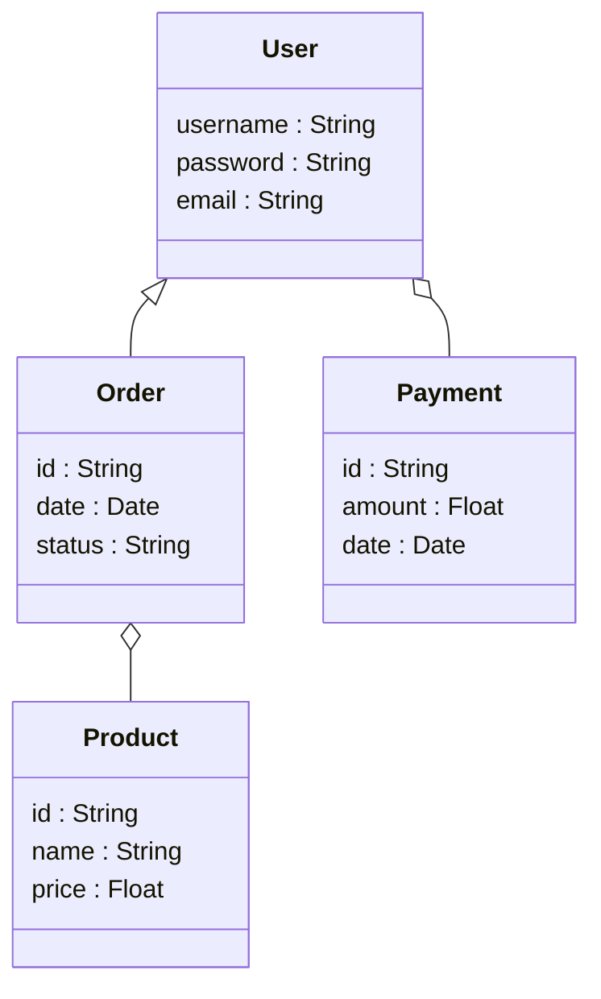
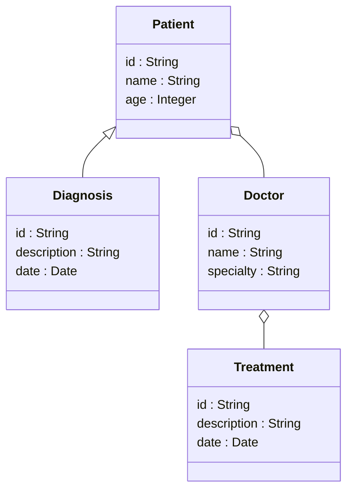
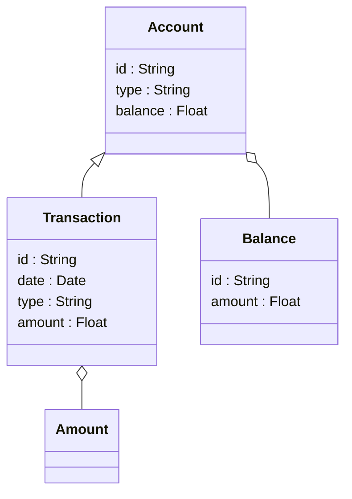

                 

### 领域建模的普适四招概述

在当今信息技术高速发展的时代，领域建模作为一种重要的技术和工具，被广泛应用于各类信息系统的设计与实现中。领域建模不仅仅是一种技术方法，更是一种思考模式，它能够帮助开发者更好地理解复杂业务问题，从而构建出高效、可维护的系统。

#### 1.1 领域建模的背景与意义

**1.1.1 领域建模的定义**

领域建模，是指通过对特定领域内的业务活动、实体及其相互关系进行分析和抽象，构建出一个能够表示该领域业务逻辑的模型。领域建模的目标是提高系统的可理解性、可维护性和可扩展性。

**1.1.2 领域建模的重要性**

领域建模在软件工程中占据着重要地位，它具有以下几个方面的意义：
- **提高开发效率**：通过领域建模，可以提前识别和定义业务需求，从而减少开发中的返工和错误。
- **增强系统可维护性**：领域模型作为系统设计的核心参考，有助于团队对系统的理解和维护。
- **提升系统扩展性**：领域模型提供了灵活的扩展机制，使得系统在面对新的需求时能够快速适应。

**1.1.3 领域建模的发展历程**

领域建模的发展可以追溯到20世纪80年代，当时人们开始尝试将面向对象技术和领域特定语言（DSL）应用于软件设计。随着UML（统一建模语言）的推广，领域建模逐渐成为了软件开发过程中的标准实践。近年来，随着大数据、云计算等技术的发展，领域建模也在不断地演进和优化。

#### 1.2 领域建模的核心概念

**1.2.1 实体与属性**

实体是领域建模中的核心概念，表示领域内的具体对象。例如，在电商领域中，用户、商品、订单等都是实体。每个实体都有若干属性，用于描述其实体特征。例如，用户实体的属性可能包括用户名、密码、邮箱等。

**1.2.2 关联与约束**

关联是实体之间的联系，它描述了实体之间的关系。例如，在电商领域中，订单实体与用户实体之间存在一种“拥有”关系。约束是定义在实体或实体之间的一组规则，用于保证数据的完整性和一致性。

**1.2.3 模型类型与应用场景**

领域模型可以分为概念模型、逻辑模型和物理模型三种类型。概念模型主要关注领域内的实体及其关系，通常使用ER图（实体关系图）来表示。逻辑模型则进一步细化实体的属性和行为，通常使用类图或状态图来表示。物理模型描述了如何在数据库中存储实体和数据，通常使用数据库表结构来表示。

不同类型的模型适用于不同的应用场景。例如，概念模型适用于需求分析和设计文档，逻辑模型适用于系统设计和实现，物理模型适用于数据库设计和优化。

#### 1.3 领域建模的挑战与解决方案

**1.3.1 数据复杂性与多样性**

随着业务的发展，领域模型可能会变得越来越复杂，同时数据的多样性也会带来挑战。为了应对这一挑战，我们可以采用模块化和层次化设计，将复杂的领域拆分为更小、更易于管理的模块，并按照不同的层级进行组织。

**1.3.2 模型维护与更新**

领域模型通常需要随着业务的发展而不断更新和优化。为了降低维护成本，我们可以采用标准化和灵活性设计，使得模型能够方便地进行修改和扩展。

**1.3.3 普适性四招的提出**

基于以上挑战，本文提出了领域建模的普适四招：标准化、模块化、层次化和灵活性。这些方法旨在提高领域模型的可理解性、可维护性和可扩展性，帮助开发者构建更加优秀的系统。

#### 1.4 普适四招的基本原理

**1.4.1 第一招：标准化**

标准化是指采用统一的规范和标准来进行领域建模。通过标准化，可以提高模型的通用性和可移植性，降低不同团队之间的沟通成本。

**1.4.2 第二招：模块化**

模块化是指将领域模型划分为若干独立的模块，每个模块负责实现特定的功能。通过模块化，可以提高模型的复用性和灵活性。

**1.4.3 第三招：层次化**

层次化是指按照不同的层级对领域模型进行组织和管理。通过层次化，可以提高模型的可扩展性和可维护性。

**1.4.4 第四招：灵活性**

灵活性是指领域模型能够根据业务需求的变化进行动态调整。通过灵活性设计，可以提高模型的适应性，降低维护成本。

#### 1.5 本章小结

本章对领域建模的普适四招进行了概述，介绍了领域建模的背景、意义、核心概念以及面临的挑战和解决方案。在接下来的章节中，我们将逐一详细讲解普适四招的具体应用和实践。

### 第二部分：普适四招详解

在上一部分中，我们概述了领域建模的普适四招，即标准化、模块化、层次化和灵活性。这一部分将深入探讨这四招的具体应用和实践方法。

#### 2.1 第一招：标准化

**2.1.1 标准化的重要性**

标准化在领域建模中具有至关重要的地位。它不仅能够提高模型的通用性和可移植性，还能够降低开发团队的沟通成本，减少错误和重复劳动。

**2.1.2 标准化在领域建模中的应用**

在领域建模过程中，标准化主要体现在以下几个方面：

1. **术语标准化**：确保不同团队和人员使用一致的术语和定义，减少误解和歧义。
2. **命名标准化**：采用统一的命名规范，例如使用驼峰命名法（CamelCase）或下划线命名法（snake_case），以便于阅读和识别。
3. **模型标准化**：使用统一的标准工具和格式进行模型表示，例如使用UML工具进行绘制，使用Mermaid进行文本表示等。

**2.1.3 常见标准化方法与工具**

常见的标准化方法包括：

- **企业架构框架（EA Framework）**：提供了一套完整的模型元素和标准模板，适用于企业级的领域建模。
- **统一建模语言（UML）**：定义了一套标准的图形表示方法，用于领域建模和系统设计。
- **Mermaid**：一种基于文本的图表描述语言，支持绘制流程图、类图、序列图等多种图形。

在实际应用中，可以根据项目的具体需求选择合适的标准化方法与工具。

#### 2.2 第二招：模块化

**2.2.1 模块化的概念与优势**

模块化是将复杂系统分解为若干独立模块的过程。每个模块负责实现特定的功能，模块之间通过接口进行交互。模块化具有以下几个优势：

- **提高复用性**：模块可以独立开发、测试和部署，从而提高代码的复用性。
- **降低耦合度**：模块之间的耦合度较低，从而降低系统的复杂性和维护成本。
- **便于维护和扩展**：模块化使得系统的维护和扩展更加方便，只需对特定模块进行修改或扩展。

**2.2.2 模块化在领域建模中的实现**

在领域建模过程中，实现模块化主要涉及以下几个方面：

1. **识别模块**：根据领域模型中的实体、关联和约束，识别出可以独立封装的模块。
2. **定义接口**：为每个模块定义清晰的接口，明确模块之间的交互方式。
3. **模块划分**：根据模块的功能和接口，将模块划分为不同的包或组件。

在实际操作中，可以使用面向对象编程语言（如Java、C#等）进行模块化实现，也可以使用领域特定语言（DSL）来定义和操作模块。

**2.2.3 模块化设计模式与应用**

常见的模块化设计模式包括：

- **分层架构**：将系统划分为多个层级，每个层级负责不同的功能，层与层之间通过接口进行交互。
- **组件架构**：将系统划分为多个组件，每个组件具有独立的功能和接口，组件之间通过接口进行协作。
- **微服务架构**：将系统划分为多个微服务，每个微服务具有独立的功能和数据库，通过API进行通信。

不同的设计模式适用于不同的应用场景，开发者可以根据项目需求选择合适的设计模式。

#### 2.3 第三招：层次化

**2.3.1 层次化的原理与目的**

层次化是将系统按照不同的抽象层次进行组织和管理的原则。层次化的目的在于提高系统的可扩展性和可维护性，使得系统在未来的变更中更加灵活。

**2.3.2 层次化在领域建模中的应用**

在领域建模中，层次化主要应用于以下几个方面：

1. **模型层次化**：将领域模型按照抽象层次进行划分，例如概念模型、逻辑模型和物理模型。
2. **功能层次化**：将系统功能按照不同的抽象层次进行划分，例如用户界面层、业务逻辑层和数据访问层。
3. **数据层次化**：将数据按照不同的抽象层次进行组织和管理，例如数据表、视图和存储过程。

**2.3.3 层次化设计模式与实例**

常见的层次化设计模式包括：

- **三层架构**：将系统划分为表示层、业务逻辑层和数据访问层，每个层次具有独立的功能和职责。
- **四层架构**：在三层架构的基础上，增加一个应用服务层，用于处理跨模块的业务逻辑。
- **SOA（服务导向架构）**：将系统划分为多个服务，每个服务具有独立的功能和接口，服务之间通过API进行通信。

在实际应用中，可以根据项目的需求选择合适的层次化设计模式。

#### 2.4 第四招：灵活性

**2.4.1 灵活性的重要性**

灵活性是领域建模中至关重要的一环。一个灵活的领域模型能够根据业务需求的变化进行动态调整，从而降低维护成本，提高系统的适应能力。

**2.4.2 灵活性在领域建模中的实现**

在领域建模中，实现灵活性主要涉及以下几个方面：

1. **使用可扩展的模型**：选择能够方便扩展的模型类型，例如使用UML的类图和活动图，而不是传统的ER图。
2. **定义灵活的接口**：为模块和组件定义灵活的接口，允许它们在不修改内部实现的情况下进行扩展。
3. **采用动态语言**：使用动态语言（如Python、Ruby等）进行领域建模，因为动态语言具有较高的灵活性和可扩展性。

**2.4.3 灵活性设计模式与技巧**

常见的灵活性设计模式包括：

- **策略模式**：通过定义一系列可互换的算法策略，使得系统可以根据不同情境选择合适的策略。
- **工厂模式**：通过创建对象工厂，动态地创建和配置对象，从而提高系统的灵活性和可扩展性。
- **反射机制**：利用编程语言的反射机制，在运行时动态地创建和操作对象，从而提高系统的灵活性和适应性。

在实际应用中，可以根据项目需求选择合适的灵活性设计模式和技巧。

#### 2.5 本章小结

本章详细介绍了领域建模的普适四招：标准化、模块化、层次化和灵活性。这些方法旨在提高领域模型的可理解性、可维护性和可扩展性，帮助开发者构建更加优秀的系统。在下一章中，我们将通过实际案例来进一步探讨这些方法的应用和实践。

### 第三部分：实战案例与应用

为了更好地理解领域建模的普适四招在实际中的应用，我们将在这一部分通过三个具体案例进行深入探讨。

#### 3.1 案例一：电商领域建模

**3.1.1 案例背景**

电商领域是一个复杂且变化迅速的领域，涉及用户、商品、订单、支付等多个实体及其关联关系。随着电商平台的不断扩张，如何高效地建模并维护领域模型成为了一个重要课题。

**3.1.2 领域分析**

在电商领域建模中，我们首先识别出以下核心实体和关联关系：

- **实体**：用户、商品、订单、支付等。
- **关联**：用户购买商品、订单包含商品、支付对应订单等。

**3.1.3 模型设计与实现**

**标准化**：采用UML工具进行模型绘制，使用统一的术语和命名规范。



**模块化**：将领域模型划分为用户模块、订单模块、商品模块和支付模块。

- **用户模块**：处理用户注册、登录和权限管理。
- **订单模块**：处理订单创建、管理和查询。
- **商品模块**：处理商品信息管理和库存管理。
- **支付模块**：处理支付流程和支付状态管理。

**层次化**：按照三层架构（表示层、业务逻辑层、数据访问层）组织模块。

- **表示层**：提供用户界面，如Web界面、移动APP等。
- **业务逻辑层**：处理业务逻辑，如订单处理、库存管理、支付处理等。
- **数据访问层**：处理数据存储和检索，如数据库操作、数据缓存等。

**灵活性**：采用动态语言（如Python）和框架（如Django）进行开发，以提高系统的灵活性和可扩展性。

```python
# 用户模块示例代码
class User(models.Model):
    username = models.CharField(max_length=255, unique=True)
    password = models.CharField(max_length=255)
    email = models.EmailField(max_length=255)

# 订单模块示例代码
class Order(models.Model):
    id = models.CharField(max_length=255, primary_key=True)
    date = models.DateField()
    status = models.CharField(max_length=50)

# 商品模块示例代码
class Product(models.Model):
    id = models.CharField(max_length=255, primary_key=True)
    name = models.CharField(max_length=255)
    price = models.FloatField()

# 支付模块示例代码
class Payment(models.Model):
    id = models.CharField(max_length=255, primary_key=True)
    amount = models.FloatField()
    date = models.DateField()
```

**3.1.4 案例总结**

电商领域建模通过标准化、模块化、层次化和灵活性四招的应用，成功地构建了一个高效、可维护且可扩展的领域模型。这一模型不仅能够满足当前的业务需求，还能够应对未来可能的变更。

#### 3.2 案例二：医疗领域建模

**3.2.1 案例背景**

医疗领域是一个高度专业化和复杂性的领域，涉及患者、医生、药品、诊疗记录等多个实体及其关联关系。随着医疗信息化的推进，如何有效地建模并管理医疗领域数据成为了一个重要问题。

**3.2.2 领域分析**

在医疗领域建模中，我们识别出以下核心实体和关联关系：

- **实体**：患者、医生、药品、诊疗记录等。
- **关联**：医生诊断患者、药品用于治疗、诊疗记录关联患者和医生等。

**3.2.3 模型设计与实现**

**标准化**：采用UML工具进行模型绘制，使用统一的术语和命名规范。



**模块化**：将领域模型划分为患者模块、医生模块、药品模块和诊疗记录模块。

- **患者模块**：处理患者信息管理和诊疗记录。
- **医生模块**：处理医生信息管理和诊疗记录。
- **药品模块**：处理药品信息管理和库存管理。
- **诊疗记录模块**：处理诊疗记录的创建、查询和管理。

**层次化**：按照三层架构（表示层、业务逻辑层、数据访问层）组织模块。

- **表示层**：提供用户界面，如医生工作站、患者查询系统等。
- **业务逻辑层**：处理业务逻辑，如诊疗记录创建、药品库存管理、医生排班等。
- **数据访问层**：处理数据存储和检索，如数据库操作、数据缓存等。

**灵活性**：采用动态语言（如Java）和框架（如Spring Boot）进行开发，以提高系统的灵活性和可扩展性。

```java
// 患者模块示例代码
@Entity
public class Patient {
    @Id
    @GeneratedValue(strategy = GenerationType.IDENTITY)
    private Long id;
    private String name;
    private int age;
    
    // GETTER 和 SETTER
}

// 诊疗记录模块示例代码
@Entity
public class Diagnosis {
    @Id
    @GeneratedValue(strategy = GenerationType.IDENTITY)
    private Long id;
    private String description;
    private Date date;
    
    @ManyToOne
    @JoinColumn(name = "patient_id")
    private Patient patient;
    
    // GETTER 和 SETTER
}
```

**3.2.4 案例总结**

医疗领域建模通过标准化、模块化、层次化和灵活性四招的应用，成功地构建了一个专业、高效且可扩展的医疗领域模型。这一模型不仅满足了医疗业务需求，还为未来的发展奠定了坚实的基础。

#### 3.3 案例三：金融领域建模

**3.3.1 案例背景**

金融领域是一个高度监管和复杂性的领域，涉及账户、交易、资金流动等多个实体及其关联关系。随着金融科技的不断发展，如何有效地建模并管理金融领域数据成为了一个重要问题。

**3.3.2 领域分析**

在金融领域建模中，我们识别出以下核心实体和关联关系：

- **实体**：账户、交易、资金流动等。
- **关联**：账户与交易之间的关联、交易与资金流动之间的关联等。

**3.3.3 模型设计与实现**

**标准化**：采用UML工具进行模型绘制，使用统一的术语和命名规范。



**模块化**：将领域模型划分为账户模块、交易模块和资金流动模块。

- **账户模块**：处理账户信息管理和余额查询。
- **交易模块**：处理交易信息创建、查询和管理。
- **资金流动模块**：处理资金流动记录和交易状态管理。

**层次化**：按照三层架构（表示层、业务逻辑层、数据访问层）组织模块。

- **表示层**：提供用户界面，如网上银行系统、手机银行APP等。
- **业务逻辑层**：处理业务逻辑，如交易处理、账户余额校验等。
- **数据访问层**：处理数据存储和检索，如数据库操作、数据缓存等。

**灵活性**：采用动态语言（如Python）和框架（如Django）进行开发，以提高系统的灵活性和可扩展性。

```python
# 账户模块示例代码
class Account(models.Model):
    id = models.CharField(max_length=255, primary_key=True)
    type = models.CharField(max_length=50)
    balance = models.FloatField()

# 交易模块示例代码
class Transaction(models.Model):
    id = models.CharField(max_length=255, primary_key=True)
    date = models.DateField()
    type = models.CharField(max_length=50)
    amount = models.FloatField()

# 资金流动模块示例代码
class Balance(models.Model):
    id = models.CharField(max_length=255, primary_key=True)
    amount = models.FloatField()
```

**3.3.4 案例总结**

金融领域建模通过标准化、模块化、层次化和灵活性四招的应用，成功地构建了一个高效、可靠且可扩展的金融领域模型。这一模型不仅能够满足当前的业务需求，还能够应对未来可能的变化和挑战。

#### 3.4 本章小结

通过电商、医疗和金融三个领域的实际案例，我们展示了领域建模的普适四招在实际应用中的具体实现和效果。这些案例证明了普适四招在提高领域模型的可理解性、可维护性和可扩展性方面的有效性。在下一章中，我们将进一步探讨领域建模的普适性分析。

### 第四部分：领域建模的普适性分析

领域建模的普适性是指其能否在不同领域和项目中广泛应用和有效实施。普适性分析可以帮助我们评估领域建模方法的适用范围和效果，从而指导实际应用和优化。

#### 4.1 普适性评估方法

**4.1.1 普适性的定义**

普适性指的是一个方法、工具或模型在不同领域和应用场景中的一致性和适用性。在领域建模中，普适性意味着一个领域模型能够在不同的业务领域中具有广泛的适用性和灵活性。

**4.1.2 普适性的评估指标**

为了评估领域建模的普适性，我们可以从以下几个方面进行：

1. **可重用性**：模型中的组件和设计模式是否可以在不同的领域中重复使用。
2. **灵活性**：模型能否根据不同领域的需求进行灵活调整和扩展。
3. **可理解性**：模型是否易于被不同领域的开发人员理解和维护。
4. **可扩展性**：模型是否支持未来需求的变化和新的功能增加。

**4.1.3 普适性评估方法**

1. **案例研究**：通过分析不同领域中的实际应用案例，评估领域建模方法的普适性。
2. **实验验证**：通过实验或模拟环境，测试领域建模方法在不同场景下的性能和效果。
3. **专家评审**：邀请领域专家对领域建模方法进行评审和反馈，评估其普适性。

#### 4.2 普适性案例分析

**4.2.1 普适性在电商领域的应用**

在电商领域，领域建模的普适性体现为模型在不同电商平台上的适用性。例如，用户、商品、订单和支付等基本实体和关联关系在不同电商平台上具有一致性。通过标准化和模块化设计，可以构建一个通用的电商领域模型，从而提高开发效率和系统可维护性。

**4.2.2 普适性在医疗领域的应用**

在医疗领域，领域建模的普适性主要体现在患者、医生、药品和诊疗记录等核心实体和关联关系的通用性。通过层次化和灵活性设计，可以构建一个适用于不同医疗机构和诊疗场景的医疗领域模型，从而提高系统的适应性和扩展性。

**4.2.3 普适性在金融领域的应用**

在金融领域，领域建模的普适性体现为账户、交易和资金流动等核心实体和关联关系的通用性。通过标准化和模块化设计，可以构建一个适用于不同金融机构和金融产品的金融领域模型，从而提高系统的可靠性和可扩展性。

#### 4.3 普适性展望

**4.3.1 领域建模的挑战**

尽管领域建模具有广泛的普适性，但仍然面临一些挑战：

- **领域特定性**：不同领域的业务逻辑和需求差异较大，如何保证模型的普适性是一个难题。
- **技术成熟度**：领域建模方法和技术的发展不断推进，如何保持模型的普适性和先进性是一个挑战。
- **变更管理**：随着业务需求的变化，如何高效地维护和更新领域模型是一个重要问题。

**4.3.2 普适性四招的未来发展**

为了应对这些挑战，普适性四招需要进一步发展和完善：

- **标准化**：推动领域建模的标准化进程，制定统一的规范和标准。
- **模块化**：优化模块化设计方法，提高模块的复用性和灵活性。
- **层次化**：完善层次化设计，提高系统的可扩展性和可维护性。
- **灵活性**：探索新的灵活性设计模式和技术，提高模型的适应性和可变性。

**4.3.3 普适性在多领域中的应用前景**

随着领域建模技术的不断发展和完善，普适性在多领域中的应用前景十分广阔：

- **跨领域应用**：将领域建模方法应用于不同领域，实现跨领域的业务整合和数据共享。
- **行业标准化**：推动各行业的领域建模标准化，提高行业整体的技术水平和效率。
- **智能领域建模**：利用人工智能技术，实现自动化的领域建模，提高建模的效率和准确性。

#### 4.4 本章小结

通过普适性评估方法和案例分析，我们深入探讨了领域建模的普适性。尽管领域建模面临一定的挑战，但普适性四招为解决这些问题提供了有效的思路和方法。在未来的发展中，领域建模将继续在多领域中发挥重要作用，推动信息技术的发展和进步。

### 第五部分：领域建模工具与实践

在领域建模的过程中，选择合适的工具和实践方法至关重要。这一部分将介绍领域建模工具的概述、实践技巧与案例分析，以及优秀实践分享。

#### 5.1 领域建模工具概述

**5.1.1 领域建模工具的分类**

领域建模工具可以分为以下几类：

- **UML工具**：如IBM Rational Rose、MagicDraw、StarUML等，主要用于绘制UML图，支持概念模型、逻辑模型和物理模型的表示。
- **建模平台**：如Visual Paradigm、Enterprise Architect、ARIS等，提供完整的建模功能，支持不同类型模型的创建和管理。
- **领域特定语言（DSL）**：如Gherkin、YAML、Mermaid等，用于定义特定的领域模型和业务规则。
- **数据库设计工具**：如MySQL Workbench、SQL Server Management Studio、Oracle SQL Developer等，主要用于数据库表结构和数据存储的设计。

**5.1.2 常见领域建模工具介绍**

- **Visual Paradigm**：是一款功能强大的建模工具，支持UML、BPMN、ER图等多种类型的模型绘制，并提供代码生成和文档生成功能。
- **MagicDraw**：是一款专业的建模工具，支持多种建模方法，包括UML、SysML、BPMN等，并提供团队协作和项目管理功能。
- **Enterprise Architect**：是一款企业级的建模平台，支持复杂的系统架构设计和建模，并提供丰富的插件和扩展功能。
- **ARIS**：是一款专业的业务流程管理工具，支持业务流程、组织架构、信息系统等多个领域的建模和分析。

**5.1.3 工具选择与使用技巧**

选择领域建模工具时，应考虑以下因素：

- **功能需求**：根据项目的具体需求，选择具有合适功能和扩展性的工具。
- **用户界面**：选择界面友好、易于操作的工具，以降低学习成本和提高工作效率。
- **团队协作**：选择支持团队协作和版本控制的功能，以便团队成员能够高效地协同工作。
- **兼容性**：选择兼容性好、能够与其他工具和系统无缝集成的工具。

在使用过程中，可以通过以下技巧提高领域建模的效率：

- **规范化**：遵循统一的标准和命名规范，确保模型的规范化和一致性。
- **模板和脚手架**：利用预定义的模板和脚手架，快速搭建基础模型和框架。
- **迭代和反馈**：采用迭代开发的方式，及时收集反馈并进行调整，以确保模型的准确性和完整性。

#### 5.2 实践技巧与案例分析

**5.2.1 实践技巧**

1. **需求分析**：在进行领域建模之前，深入分析业务需求和用户需求，确保领域模型能够准确地反映业务逻辑和用户需求。
2. **模型评审**：定期进行模型评审，确保模型的准确性和一致性，及时发现问题并进行修正。
3. **文档化**：编写详细的模型文档，包括模型描述、设计原则、设计决策等，以便于团队成员的理解和协作。
4. **测试和验证**：对模型进行测试和验证，确保模型的逻辑正确性和完整性。

**5.2.2 案例分析**

**案例一：银行领域建模**

1. **背景**：某银行需要进行新的业务系统开发，包括账户管理、贷款管理、信用卡管理等功能。
2. **需求分析**：通过用户调研和需求收集，明确系统的功能需求和用户需求。
3. **模型设计**：采用UML工具绘制领域模型，包括账户、贷款、信用卡等实体及其关联关系。
4. **模型评审**：组织团队成员对领域模型进行评审，确保模型的准确性和一致性。
5. **文档化**：编写详细的领域模型文档，包括实体描述、属性定义、关联关系等。
6. **测试和验证**：对领域模型进行测试和验证，确保模型的逻辑正确性和完整性。

**案例二：医疗领域建模**

1. **背景**：某医院需要进行信息化建设，包括患者管理、医生管理、药品管理等功能。
2. **需求分析**：通过用户调研和需求收集，明确系统的功能需求和用户需求。
3. **模型设计**：采用UML工具绘制领域模型，包括患者、医生、药品等实体及其关联关系。
4. **模型评审**：组织团队成员对领域模型进行评审，确保模型的准确性和一致性。
5. **文档化**：编写详细的领域模型文档，包括实体描述、属性定义、关联关系等。
6. **测试和验证**：对领域模型进行测试和验证，确保模型的逻辑正确性和完整性。

**5.2.3 案例解读**

以上两个案例展示了领域建模在银行和医疗领域中的应用。通过深入的需求分析和模型设计，结合标准化的工具和实践技巧，成功地构建了符合业务需求的领域模型。这些案例验证了领域建模方法在提高系统可理解性、可维护性和可扩展性方面的有效性。

#### 5.3 优秀实践分享

**5.3.1 国内外优秀实践案例分享**

- **国内案例**：阿里巴巴的电子商务平台采用了领域驱动设计（DDD）方法，通过构建分层架构和领域模型，实现了高扩展性和高可维护性的系统架构。
- **国外案例**：亚马逊的电商系统采用了微服务架构和领域驱动设计（DDD），通过灵活的领域模型和模块化设计，实现了快速响应市场需求和高效业务扩展。

**5.3.2 实践经验与教训总结**

- **经验**：领域建模需要深入理解业务需求和用户需求，结合标准化的工具和方法，确保模型的准确性和一致性。同时，迭代开发和持续改进是提高领域建模质量和效率的关键。
- **教训**：在领域建模过程中，避免过度设计和不必要的复杂性，确保模型的可理解性和实用性。及时进行模型评审和验证，避免模型错误和缺陷。

#### 5.4 本章小结

通过介绍领域建模工具的概述、实践技巧与案例分析，以及优秀实践分享，我们展示了领域建模在实际应用中的重要性。选择合适的工具和实践方法，结合业务需求和用户需求，可以构建出高效、可维护和可扩展的领域模型，从而提高系统的整体质量和用户体验。

### 第六部分：领域建模的挑战与展望

领域建模作为一种关键技术，在软件设计和开发中扮演着重要角色。然而，领域建模也面临着一系列挑战，需要我们持续探索和改进。

#### 6.1 领域建模面临的挑战

**6.1.1 数据质量与一致性**

领域建模依赖于准确、完整和一致的数据。数据质量差或一致性差会导致领域模型不准确，影响系统的稳定性和可靠性。解决这一问题的方法包括：

- **数据质量管理**：建立数据质量管理流程，确保数据的准确性和完整性。
- **数据一致性控制**：采用数据一致性和完整性控制机制，如事务管理和约束条件。

**6.1.2 模型扩展与维护**

随着业务的发展，领域模型需要不断地扩展和更新。如何在不破坏现有系统的情况下进行模型扩展和维护，是一个重大挑战。解决这一问题的方法包括：

- **模块化设计**：采用模块化设计，将领域模型划分为独立、可重用的模块，便于扩展和维护。
- **版本控制**：使用版本控制系统管理模型，确保模型变更的跟踪和回滚。

**6.1.3 模型性能优化**

领域模型的设计和实现会影响系统的性能。如何优化领域模型，提高系统性能，是一个重要课题。解决这一问题的方法包括：

- **性能分析**：对领域模型进行性能分析，识别性能瓶颈。
- **缓存和索引**：采用缓存和索引技术，提高数据查询和操作的速度。

#### 6.2 未来发展趋势

**6.2.1 新技术对领域建模的影响**

未来，新技术将继续对领域建模产生深远影响：

- **大数据与人工智能**：大数据和人工智能技术将为领域建模提供更丰富的数据资源和智能化的建模方法。
- **云计算与容器化**：云计算和容器化技术将推动领域建模的分布式和动态扩展。
- **区块链**：区块链技术将为领域建模提供去中心化、安全和可信的数据存储和传输机制。

**6.2.2 普适性四招的未来发展**

普适性四招（标准化、模块化、层次化和灵活性）将继续在领域建模中发挥重要作用。未来，普适性四招的发展趋势包括：

- **标准化**：推动领域建模的标准化进程，制定更统一、更完善的建模规范和标准。
- **模块化**：探索更高效、更灵活的模块化设计方法，提高模型的复用性和扩展性。
- **层次化**：优化层次化设计，提高系统的可扩展性和可维护性。
- **灵活性**：结合新技术，如大数据、人工智能和区块链，探索新的灵活性设计模式和技术。

**6.2.3 普适性在多领域中的应用前景**

随着领域建模技术的不断发展和完善，普适性在多领域中的应用前景将更加广阔：

- **跨领域应用**：将领域建模方法应用于不同领域，实现跨领域的业务整合和数据共享。
- **行业标准化**：推动各行业的领域建模标准化，提高行业整体的技术水平和效率。
- **智能领域建模**：利用人工智能技术，实现自动化的领域建模，提高建模的效率和准确性。

#### 6.3 本章小结

领域建模在软件开发中具有重要的地位，但也面临着一系列挑战。通过持续探索和改进，如标准化、模块化、层次化和灵活性等普适性方法，我们可以构建出更加高效、可维护和可扩展的领域模型。未来，随着新技术的不断涌现，领域建模将继续在多领域中发挥重要作用，推动信息技术的发展和进步。

### 总结与展望

领域建模作为一种关键技术，在软件设计和开发中具有不可替代的作用。通过本文的详细探讨，我们提出了领域建模的普适四招：标准化、模块化、层次化和灵活性，并展示了它们在实际应用中的效果。这些方法不仅提高了领域模型的可理解性、可维护性和可扩展性，还帮助开发者应对了领域建模中面临的数据复杂性、模型维护和性能优化等挑战。

展望未来，领域建模将在多领域中发挥更加重要的作用。随着大数据、人工智能、云计算和区块链等新技术的不断发展，领域建模将变得更加智能和高效。普适性四招也将继续演进，结合新技术，提供更加灵活、强大的领域建模解决方案。

为了进一步学习和掌握领域建模，读者可以参考以下资源：

1. **书籍**：《领域驱动设计》（Domain-Driven Design）系列，作者Eric Evans。
2. **在线课程**：Coursera、Udemy等平台上的软件工程和领域建模相关课程。
3. **开源项目**：GitHub等平台上的领域建模工具和框架，如Spring Boot、Django等。
4. **社区和论坛**：参加技术社区和论坛，如Stack Overflow、Reddit等，与其他开发者交流和学习。

通过不断学习和实践，读者将能够更好地掌握领域建模的精髓，为软件开发事业贡献力量。

### 作者信息

**作者：** AI天才研究院/AI Genius Institute & 禅与计算机程序设计艺术 /Zen And The Art of Computer Programming

AI天才研究院致力于推动人工智能技术的发展和应用，专注于研发高效、智能的AI解决方案。而《禅与计算机程序设计艺术》则是一部经典的计算机科学著作，深入探讨了编程哲学和艺术，为软件开发者提供了宝贵的启示和指导。这两部作品均由作者亲自撰写，展现了作者在计算机科学和人工智能领域的深厚造诣和独特见解。

