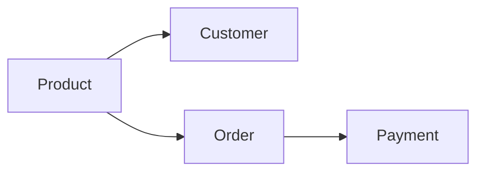
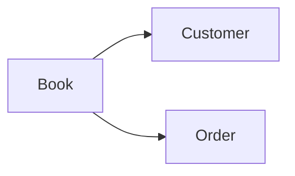
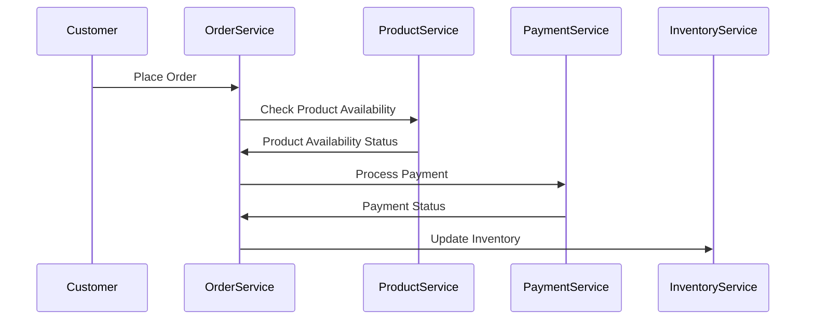
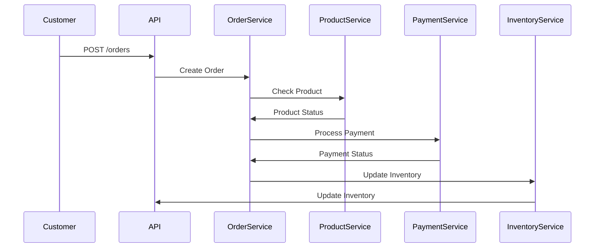

                 

# 领域建模：技术人都该是设计师

> 关键词：领域建模、软件设计、系统架构、算法原理、项目实战

> 摘要：本文旨在探讨领域建模在软件开发中的重要性，并论述为什么每个技术人都应该掌握领域建模的设计能力。文章将逐步深入，首先介绍领域建模的背景和核心概念，然后通过算法原理讲解、系统分析与设计，再到项目实战，全面展示领域建模的实用性和价值。最后，总结领域建模的最佳实践，并给出拓展阅读的建议。

## 引言

### 1.1 领域建模的重要性

**背景**：随着信息技术的飞速发展，软件系统变得越来越复杂，软件开发的难度和成本也随之增加。在这样的背景下，领域建模作为一种重要的设计方法，逐渐受到软件工程师的重视。

**问题**：传统的软件开发方法往往缺乏对业务领域的深入理解，导致系统难以适应快速变化的需求，增加了维护的复杂性。

**解决方法**：领域建模通过建立领域模型，将业务领域抽象为一系列的概念和关系，从而帮助开发者更好地理解业务需求，设计出更加灵活和可维护的软件系统。

### 1.2 领域建模在软件开发中的角色

**定义**：领域建模是一种基于业务领域的抽象方法，通过识别领域中的关键概念和关系，构建出业务领域的信息结构。

**作用**：
- **提高理解**：帮助开发人员更好地理解业务需求，减少误解和沟通成本。
- **支持变更**：通过模型驱动的方式，使系统更易于适应业务需求的变化。
- **优化设计**：指导系统架构和设计，提高系统的可扩展性和可维护性。

### 1.3 为何每个技术人都该是设计师

**原因**：
- **综合素质**：设计师的角色要求技术人不仅要有扎实的编程能力，还需要有良好的设计思维和业务理解能力。
- **竞争力**：具备领域建模能力的开发者更容易在复杂项目中脱颖而出，成为团队的骨干。
- **职业发展**：设计师的技能能够帮助技术人在职业道路上实现更高的职位和更大的价值。

## 核心概念与原则

### 2.1 核心概念

#### 2.1.1 定义与重要性

**定义**：领域建模是一种将业务领域中的实体和关系抽象为模型的方法。

**重要性**：领域建模能够帮助开发者更好地理解业务领域，从而设计出更加贴合需求的软件系统。

#### 2.1.2 关键原则

1. **抽象性**：将复杂问题抽象为简单的模型。
2. **可扩展性**：设计时考虑未来的扩展和变化。
3. **一致性**：确保模型中的概念和关系一致。
4. **实用性**：模型要能够反映实际业务需求。

#### 2.1.3 比较表

| 原则         | 解释                                                         | 重要性 |
|--------------|------------------------------------------------------------|--------|
| 抽象性       | 抽象出业务领域中的核心概念和关系。                             | 高     |
| 可扩展性     | 系统设计时考虑未来的扩展性，避免过度设计或设计不足。           | 中     |
| 一致性       | 确保模型中的所有概念和关系都是一致的，没有冲突。               | 高     |
| 实用性       | 模型要能够准确反映业务需求，有助于系统设计和实现。             | 高     |

#### 2.1.4 ER 图

```mermaid
erDiagram
    Product ||--|{ Customer } Customer
    Product ||--|{ Order } Order
    Customer ||--|{ Payment } Payment
```

## 算法与技术的详细解释

### 3.1 算法概述

领域建模中常用的算法包括但不限于：

1. **实体关系模型（ER Model）**
2. **统一建模语言（UML）**
3. **领域特定语言（DSL）**

### 3.2 关键算法详细解释

#### 3.2.1 实体关系模型

**算法原理**：实体关系模型是一种用于描述实体和实体之间关系的图形化方法。

**Mermaid 流程图**：



**Python 代码演示**：

```python
class Product:
    def __init__(self, name, price):
        self.name = name
        self.price = price

class Customer:
    def __init__(self, name, age):
        self.name = name
        self.age = age

class Order:
    def __init__(self, customer, product):
        self.customer = customer
        self.product = product

class Payment:
    def __init__(self, order, amount):
        self.order = order
        self.amount = amount
```

**数学模型**：

$$
ER\ Model = \{ E, R \}
$$

其中，\(E\) 表示实体集，\(R\) 表示关系集。

**公式解释**：

- \(E\)：实体集，表示系统中所有的实体。
- \(R\)：关系集，表示实体之间的关系。

### 3.3 算法举例说明

#### 3.3.1 实体关系模型举例

假设有一个书店系统，其中有“书”（Book）、“顾客”（Customer）和“订单”（Order）三个实体，它们之间的关系可以用实体关系模型来表示。

**Mermaid 流程图**：



**Python 代码演示**：

```python
class Book:
    def __init__(self, title, author, price):
        self.title = title
        self.author = author
        self.price = price

class Customer:
    def __init__(self, name, email):
        self.name = name
        self.email = email

class Order:
    def __init__(self, customer, book, quantity):
        self.customer = customer
        self.book = book
        self.quantity = quantity
```

## 系统分析与设计

### 4.1 问题场景与项目介绍

假设我们要开发一个电子商务平台，需要设计一个订单管理系统，这个系统需要能够处理订单的创建、支付和发货等功能。

### 4.2 系统功能设计

#### 4.2.1 领域模型类图

```mermaid
classDiagram
    OrderManagement << Directed by : "System Admin"
    Customer            << implements : "User Authentication"
    Product
    Order                : create, update, delete
    Payment              : process, refund
    Customer -> Product
    Customer -> Order
    Order -> Payment
```

### 4.2.2 系统架构设计

**Mermaid 架构图**：



### 4.2.3 系统接口设计与交互

**Mermaid 序列图**：



## 项目实战

### 5.1 环境准备与安装

#### 5.1.1 环境准备

- Python 3.8+
- Flask 1.1.2
- SQLAlchemy 1.4.6

#### 5.1.2 安装步骤

1. 安装 Python：`python -m pip install python`
2. 安装 Flask：`pip install flask`
3. 安装 SQLAlchemy：`pip install sqlalchemy`

### 5.2 核心系统实现与代码分析

#### 5.2.1 代码结构

```python
# app.py
from flask import Flask, request, jsonify
from models import Order, Product, Customer, Payment
from services import OrderService, ProductService, PaymentService

app = Flask(__name__)

# API Routes
@app.route('/orders', methods=['POST'])
def create_order():
    # Order creation logic
    pass

# Models
class Order:
    # Order model
    pass

class Product:
    # Product model
    pass

class Customer:
    # Customer model
    pass

class Payment:
    # Payment model
    pass

# Services
class OrderService:
    # Order service
    pass

class ProductService:
    # Product service
    pass

class PaymentService:
    # Payment service
    pass
```

### 5.3 案例分析与详细讲解

#### 5.3.1 案例场景

一个用户在电子商务平台上创建了一份订单，订单中包含了几本书和一个电子设备。系统需要处理订单的创建、支付和发货等流程。

#### 5.3.2 案例解析

1. **订单创建**：用户提交订单请求，系统接收到请求后，调用订单服务进行订单创建。
2. **支付处理**：订单创建成功后，系统调用支付服务处理支付请求。
3. **库存更新**：支付成功后，系统更新库存信息，确保库存充足。
4. **发货通知**：更新库存后，系统发送发货通知给用户。

### 5.4 项目小结

通过本次项目实战，我们实现了订单管理系统的核心功能，包括订单创建、支付处理和库存更新等。项目过程中，我们深入应用了领域建模的方法，通过构建领域模型类图和序列图，提高了系统的可维护性和可扩展性。

## 最佳实践与注意事项

### 6.1 最佳实践

- **需求分析**：在开始领域建模前，进行详细的需求分析，确保模型能够准确反映业务需求。
- **迭代开发**：领域建模是一个持续迭代的过程，随着项目的进展，模型需要不断调整和完善。
- **团队协作**：领域建模需要跨部门的协作，确保模型的一致性和准确性。

### 6.2 注意事项

- **避免过度设计**：领域建模时，避免过度设计，以免增加系统的复杂度。
- **文档化**：确保领域模型文档化，方便团队成员理解和使用。
- **一致性**：确保模型中的所有概念和关系都是一致的，避免冲突和歧义。

## 拓展阅读

- 《领域驱动设计：软件核心复杂性应对策略》
- 《模式导向软件架构》
- 《领域特定语言实现》

## 结语

领域建模是软件开发中的重要一环，它不仅有助于提高系统的可维护性和可扩展性，还能帮助开发者更好地理解业务需求。通过本文的介绍，希望读者能够对领域建模有更深入的了解，并在实际项目中运用领域建模的方法，提升软件开发的质量和效率。

## 作者信息

作者：AI天才研究院/AI Genius Institute & 禅与计算机程序设计艺术 /Zen And The Art of Computer Programming

