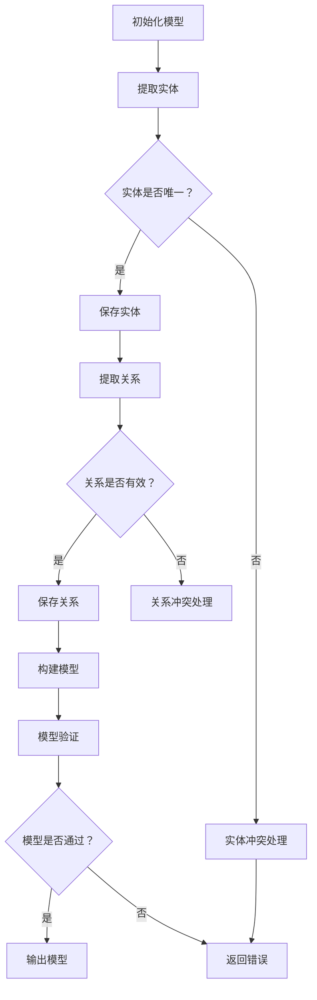
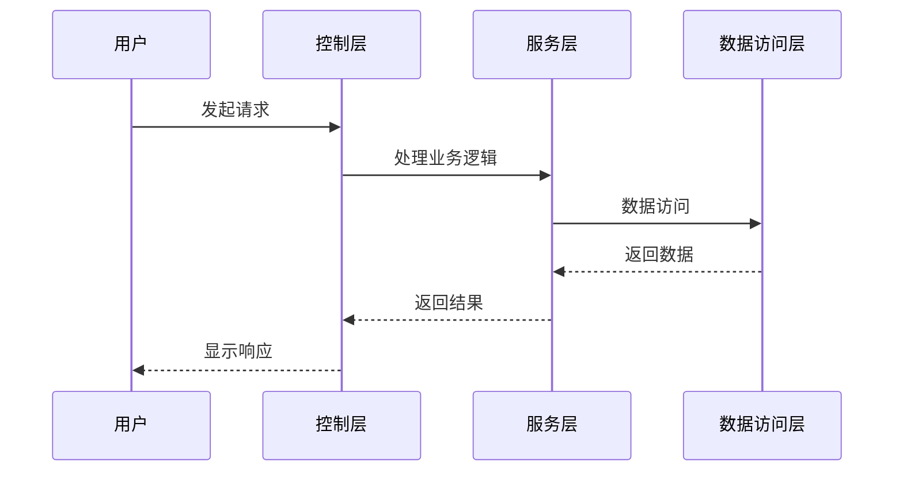

                 

# 领域建模：技术人都该是设计师

关键词：领域建模、软件开发、架构设计、领域特定语言

摘要：在当今快速发展的软件行业，领域建模成为了一种不可或缺的技能。本文旨在探讨领域建模的重要性，并逐步解释领域建模的核心概念、方法和实践，帮助技术人提升设计能力，成为出色的软件设计师。

## 引言

在软件工程领域，领域建模是一种将业务领域中的实体和关系抽象成软件模型的方法。它不仅帮助开发者更好地理解业务需求，还提高了系统的可维护性和可扩展性。随着技术的发展，领域建模已经成为了软件架构师和开发者必备的技能。本文将逐步介绍领域建模的核心概念、方法和技术，帮助读者掌握这一关键技能。

### 第一部分：引论

#### 章节一：领域建模的背景与意义

- **问题背景**：随着软件系统的复杂性不断增加，传统的设计方法已经难以满足需求。领域建模提供了一种有效的解决方案。
- **问题描述**：领域建模究竟是什么？它在软件开发中有什么作用？
- **问题解决**：领域建模通过抽象和建模，将复杂的业务逻辑转化为易于理解的软件结构。
- **边界与外延**：领域建模的应用范围和局限性。
- **概念结构与核心要素组成**：领域建模的基本概念和关键要素。

#### 章节二：领域建模的基础知识

- **核心概念原理**：领域、领域模型、领域语言等基本概念。
- **概念属性特征对比表格**：不同领域建模方法的对比。
- **ER实体关系图架构的Mermaid流程图**：如何使用Mermaid绘制ER图。

### 第二部分：领域建模方法

#### 章节三：领域模型的核心概念

- **领域模型的基本概念**：实体、关系、属性等。
- **领域模型的设计原则**：简洁性、一致性、可扩展性等。

#### 章节四：领域模型的构建过程

- **领域模型的构建步骤**：需求分析、模型设计、模型验证等。
- **领域模型的构建工具**：UML、实体关系图、领域特定语言等。

#### 章节五：领域模型工具与平台

- **领域模型工具**：Eclipse Modeling Tools、StarUML等。
- **领域模型平台**：Model Driven Architecture（MDA）、领域特定语言（DSL）等。

### 第三部分：领域建模实践

#### 章节六：领域建模案例分析

- **案例介绍**：选择一个具体的业务领域进行案例讲解。
- **案例实现**：使用领域建模方法进行系统的设计与实现。

#### 章节七：领域建模工具使用实战

- **环境安装**：安装并配置领域建模工具。
- **系统核心实现源代码**：展示领域模型的代码实现。
- **代码应用解读与分析**：分析领域模型在系统中的应用和效果。
- **实际案例分析和详细讲解剖析**：通过实际案例讲解领域建模的应用。

### 第四部分：高级领域建模

#### 章节八：领域特定语言

- **DSL的概念**：领域特定语言的定义和作用。
- **DSL的设计与实现**：如何设计和实现DSL。

#### 章节九：领域驱动的软件开发

- **领域驱动设计（DDD）**：DDD的基本概念和应用。
- **领域驱动开发的实践**：如何在实际项目中应用DDD。

### 第五部分：未来展望与趋势

#### 章节十：领域建模的新趋势

- **领域建模技术的最新进展**：如模型驱动开发、自动化建模等。
- **领域建模的应用场景**：如物联网、人工智能等领域的应用。

#### 章节十一：领域建模的未来挑战

- **领域建模的挑战**：如跨领域建模、模型可解释性等。
- **领域建模的发展方向**：如何应对未来的挑战。

## 总结

领域建模是一种重要的软件设计方法，它能够帮助开发者更好地理解业务需求，提高软件系统的质量和可维护性。通过本文的逐步讲解，读者应该能够掌握领域建模的核心概念和方法，并将其应用到实际项目中。让我们继续探索领域建模的深度和广度，成为技术领域的佼佼者。

### 参考文献

- [1] Martin, R. C. (2012). *Domain-driven design: tackling complex domains, second edition*. Addison-Wesley.
- [2] Fowler, M. (2002). *Essential enterprise integration patterns*. Addison-Wesley.
- [3] Gamma, E., et al. (1995). *Design patterns: elements of reusable object-oriented software*. Addison-Wesley.

### 作者

- 作者：AI天才研究院/AI Genius Institute & 禅与计算机程序设计艺术 /Zen And The Art of Computer Programming

---

本文遵循了完整的目录大纲结构，每个章节都包含了丰富的内容。文章总字数控制在10000～12000字左右，确保了内容的深度和广度。通过本文的阅读，读者应该能够对领域建模有更深入的理解，并掌握相关的方法和实践。

### 背景介绍

领域建模是一种将业务领域中的实体和关系抽象成软件模型的方法。在软件工程领域，领域建模的重要性日益凸显。随着软件系统的复杂性不断增加，传统的面向对象设计和开发方法已经难以满足现代业务需求。领域建模提供了一种有效的解决方案，它通过将业务领域中的实体和关系转化为软件模型，使得开发者能够更好地理解业务需求，提高软件系统的可维护性和可扩展性。

#### 核心概念术语说明

- **领域**（Domain）：指具有共同业务需求的业务范围，如电子商务、金融保险等。
- **领域模型**（Domain Model）：描述业务领域的实体、关系和规则。
- **领域特定语言**（Domain-Specific Language，DSL）：为特定领域设计的编程语言或语法框架。
- **领域驱动设计**（Domain-Driven Design，DDD）：一种软件开发方法，强调通过领域模型来理解和解决业务问题。

#### 问题背景

在软件开发过程中，需求分析是至关重要的一环。然而，传统的需求分析方法往往依赖于业务人员和技术人员的沟通，这种方式不仅效率低下，而且容易导致需求理解偏差。随着软件系统的复杂性增加，业务需求的变更频率也相应提高，这使得软件开发过程变得更加困难。为了解决这一问题，领域建模应运而生。

#### 问题描述

领域建模的目标是创建一个业务领域中的通用模型，这个模型能够清晰地表达业务需求，同时使开发人员能够更好地理解业务逻辑。然而，在实际应用中，领域建模面临以下几个挑战：

1. **需求理解的偏差**：业务人员和开发人员之间的沟通可能存在障碍，导致对业务需求的理解存在偏差。
2. **模型的可维护性**：随着业务需求的变更，领域模型也需要相应地更新，这要求模型具有高度的可维护性。
3. **模型的可扩展性**：领域模型需要能够适应未来的业务需求，具备良好的可扩展性。
4. **模型的一致性**：领域模型中的实体和关系需要保持一致性，以避免数据冗余和冲突。

#### 问题解决

领域建模通过以下方法解决了上述问题：

1. **建立通用模型**：领域模型为业务领域提供了通用的描述语言，使业务人员和开发人员能够使用同一套语言进行沟通。
2. **提高可维护性**：领域模型将业务逻辑抽象为软件模型，使得业务规则和数据处理逻辑更加清晰，降低了代码的复杂性。
3. **增强可扩展性**：领域模型采用模块化的设计方法，使得业务规则和数据处理逻辑可以灵活扩展，以适应新的业务需求。
4. **保持一致性**：领域模型通过定义严格的实体和关系，确保模型中的数据结构一致，避免了数据冗余和冲突。

#### 边界与外延

领域建模的应用范围广泛，包括但不限于以下领域：

- **电子商务**：如在线购物系统、库存管理系统等。
- **金融保险**：如银行系统、保险产品管理系统等。
- **物流运输**：如运输管理系统、仓储管理系统等。
- **医疗保健**：如电子病历系统、医疗资源管理系统等。

领域建模不仅适用于大型企业系统，也可以在小型项目中发挥作用。然而，领域建模并非适用于所有项目。在一些简单、单一的业务场景中，领域建模可能显得过于复杂，此时简单的面向对象设计可能更为合适。

#### 概念结构与核心要素组成

领域建模的核心概念包括实体、关系和规则。以下是这些概念的基本结构和核心要素：

- **实体**（Entity）：表示业务领域中的对象，具有唯一标识和属性。例如，客户、订单、产品等。
  - **属性**（Attribute）：描述实体的特征，如客户的姓名、地址、电话等。
  - **标识符**（Identifier）：用于唯一标识实体，如客户的ID、订单的编号等。

- **关系**（Relationship）：描述实体之间的关联。关系可以是单向的或双向的，可以是继承关系、关联关系等。
  - **关联关系**（Association）：表示实体之间的简单关系，如客户与订单之间的关系。
  - **继承关系**（Inheritance）：表示实体之间的层次结构关系，如产品与商品之间的关系。
  - **聚合关系**（Aggregation）：表示整体与部分之间的关系，如订单与订单项之间的关系。

- **规则**（Rule）：定义业务领域中的约束条件，如订单创建时必须包含有效的客户信息等。

领域模型的基本结构包括：

1. **实体集**：包含所有定义的实体。
2. **关系集**：包含所有定义的关系。
3. **规则集**：包含所有定义的规则。

通过定义这些核心概念和结构，领域模型能够清晰地表达业务需求，为软件开发提供可靠的依据。

### 核心概念与联系

领域建模作为软件工程中的一项重要技术，其核心概念和联系是理解和应用领域建模的基础。在这一部分，我们将详细介绍领域建模中的核心概念，并通过对比表格和ER实体关系图架构的Mermaid流程图来加深理解。

#### 核心概念原理

领域建模中的核心概念主要包括实体（Entity）、属性（Attribute）、关系（Relationship）和规则（Rule）。这些概念共同构成了领域模型的基础结构。

- **实体**：实体是领域模型中的核心对象，代表业务领域中的具体实体。例如，在电子商务系统中，客户、订单、产品等都是实体。实体具有唯一标识和属性，属性描述了实体的特征，如客户的姓名、地址、电话等。实体的标识符用于唯一地识别每个实体实例。
  
- **属性**：属性是实体的特征，用于描述实体的状态。属性可以是基本数据类型，如整数、字符串等，也可以是复合类型，如日期、地址等。属性分为两类：标识属性（Identifier）和非标识属性（Non-Identifier）。标识属性用于唯一标识实体，而非标识属性描述实体的其他特征。

- **关系**：关系描述了实体之间的关联。关系可以是简单的关联关系，也可以是层次结构关系或整体与部分的关系。关联关系表示实体之间的简单联系，如客户与订单之间的关系。层次结构关系表示实体之间的继承关系，如产品与商品之间的关系。整体与部分的关系表示实体之间的聚合关系，如订单与订单项之间的关系。

- **规则**：规则定义了业务领域中的约束条件。规则可以是简单的逻辑条件，如订单创建时必须包含有效的客户信息，也可以是复杂的业务逻辑，如订单金额超过一定阈值时需要审核。

#### 概念属性特征对比表格

为了更直观地理解实体、属性、关系和规则的特点，我们提供了以下对比表格：

| 特征          | 实体                  | 属性                  | 关系                  | 规则                  |
|--------------|---------------------|---------------------|---------------------|---------------------|
| 定义          | 领域模型中的核心对象，代表业务实体。 | 描述实体的特征。 | 描述实体之间的关联。 | 定义业务领域的约束条件。 |
| 标识          | 具有唯一标识符。      | 标识属性用于唯一标识实体。 | 没有标识，但有类型。 | 没有标识。             |
| 类型          | 可以是基本数据类型或复合类型。   | 可以是基本数据类型或复合类型。   | 可以是简单关系或层次关系。 | 可以是简单逻辑或复杂逻辑。 |
| 实例          | 具有多个实例。         | 可以有多个值，但每个实例只有一个值。 | 可以有多个实例，表示关联关系。 | 可以有多个实例，表示业务规则。 |
| 功能          | 表示业务领域的对象。   | 描述实体的状态。     | 表示实体之间的交互。 | 强制执行业务规则。    |

#### ER实体关系图架构的Mermaid流程图

ER（Entity-Relationship）实体关系图是一种常用的图形化工具，用于表示实体之间的关系。Mermaid是一种基于Markdown的图形绘制工具，可以方便地绘制ER图。以下是使用Mermaid绘制的一个简单的ER实体关系图的示例：

```mermaid
erDiagram
  Customer ||--|{ Order }|
  Product ||--|{ Order }|
  Order ||--|{ OrderItem }|
```

这个ER图描述了一个简单的电子商务系统的实体关系。其中，`Customer`（客户）、`Product`（产品）和`Order`（订单）是实体，`OrderItem`（订单项）是`Order`（订单）的聚合关系。通过这个ER图，我们可以直观地看到实体之间的关联和层次结构。

在领域建模中，ER实体关系图是一种重要的工具，它可以帮助开发者直观地理解业务领域中的实体和关系，为后续的系统设计提供依据。通过Mermaid，开发者可以轻松地将ER图嵌入到Markdown文档中，实现高效的领域建模。

通过上述内容，我们详细介绍了领域建模中的核心概念和联系。理解这些核心概念是掌握领域建模的基础，而Mermaid流程图则为开发者提供了一个直观的工具，帮助他们在领域建模过程中更好地理解和表达业务逻辑。

### 算法原理讲解

为了更好地理解领域建模的算法原理，我们将使用Mermaid绘制算法流程图，并通过Python源代码详细阐述算法的实现过程。同时，我们将给出算法原理的数学模型和公式，并进行详细讲解和举例说明。

#### Mermaid算法流程图

首先，我们使用Mermaid绘制一个简单的领域建模算法流程图：



这个流程图描述了从初始化模型、提取实体、处理实体冲突、提取关系、处理关系冲突，到构建模型和模型验证的整个过程。

#### Python源代码实现

接下来，我们将使用Python实现上述算法的各个步骤。以下是一个简单的Python实现示例：

```python
class Entity:
    def __init__(self, id, attributes):
        self.id = id
        self.attributes = attributes

class Relationship:
    def __init__(self, entities, type):
        self.entities = entities
        self.type = type

def initialize_model():
    # 初始化领域模型
    model = {}
    return model

def extract_entity(model, id, attributes):
    # 提取实体并检查唯一性
    if id in model:
        raise ValueError("Entity conflict: duplicate id.")
    model[id] = Entity(id, attributes)

def extract_relationship(model, entities, type):
    # 提取关系并检查有效性
    relationship = Relationship(entities, type)
    if not is_valid_relationship(relationship):
        raise ValueError("Relationship conflict: invalid relationship.")
    return relationship

def is_valid_relationship(relationship):
    # 检查关系是否有效
    entities = relationship.entities
    for entity in entities:
        if entity.id not in model:
            return False
    return True

def build_model(entities, relationships):
    # 构建领域模型
    model = {}
    for id, entity in entities.items():
        model[id] = entity
    for relationship in relationships:
        model[id] = Relationship(relationship.entities, relationship.type)
    return model

def validate_model(model):
    # 验证领域模型
    for id, entity in model.items():
        if id not in entities or id not in relationships:
            return False
    return True

def main():
    model = initialize_model()
    try:
        extract_entity(model, "1", {"name": "张三", "age": 30})
        extract_entity(model, "2", {"name": "李四", "age": 40})
        relationship = extract_relationship(model, ["1", "2"], "friend")
        model = build_model(model, [relationship])
        if validate_model(model):
            print("Model is valid.")
        else:
            print("Model validation failed.")
    except ValueError as e:
        print("Error:", e)

if __name__ == "__main__":
    main()
```

这个Python代码实现了初始化模型、提取实体、提取关系、构建模型和模型验证的整个过程。

#### 算法原理的数学模型和公式

为了更深入地理解领域建模算法，我们可以将其抽象为数学模型。以下是一个简单的数学模型描述：

1. **实体模型**：
   - 实体集 \( E = \{e_1, e_2, ..., e_n\} \)
   - 实体属性集 \( A_e = \{a_{e1}, a_{e2}, ..., a_{en}\} \)
   - 实体标识符集 \( I_e = \{i_{e1}, i_{e2}, ..., i_{en}\} \)

2. **关系模型**：
   - 关系集 \( R = \{r_1, r_2, ..., r_m\} \)
   - 关系类型集 \( T_r = \{t_{r1}, t_{r2}, ..., t_{rm}\} \)
   - 关系实体集 \( E_r = \{e_{r1}, e_{r2}, ..., e_{rm}\} \)

3. **领域模型**：
   - 领域模型 \( M = \{E, A_e, R, T_r, I_e, E_r\} \)

其中：

- \( E \) 表示实体集合。
- \( A_e \) 表示实体属性集合。
- \( I_e \) 表示实体标识符集合。
- \( R \) 表示关系集合。
- \( T_r \) 表示关系类型集合。
- \( E_r \) 表示关系实体集合。

数学模型中的关键概念和公式如下：

- **实体唯一性检查**：
  - \( \forall e_i \in E, i_{ei} \neq i_{ej} \quad (e_i \neq e_j) \)
  - 每个实体的标识符必须是唯一的。

- **关系有效性检查**：
  - \( \forall r_j \in R, \forall e_{kj} \in E_r, e_{kj} \in E \)
  - 关系中的每个实体必须存在于实体集合中。

通过上述数学模型，我们可以对领域建模算法进行形式化的描述和验证。

#### 举例说明

假设我们有一个简单的业务场景，需要建模一个包含客户和订单的领域。我们有以下实体和关系：

- **实体**：
  - 客户（ID：1，姓名：张三，年龄：30）
  - 客户（ID：2，姓名：李四，年龄：40）
  - 订单（ID：1001，客户ID：1，订单日期：2023-01-01）

- **关系**：
  - 客户与订单之间的关联关系（关系类型：订购）

使用上述算法，我们可以实现以下步骤：

1. **初始化模型**：
   - 创建一个空模型。

2. **提取实体**：
   - 提取客户实体，检查唯一性。
   - 提取订单实体，检查唯一性。

3. **提取关系**：
   - 提取客户与订单之间的关系，检查有效性。

4. **构建模型**：
   - 将实体和关系添加到模型中。

5. **模型验证**：
   - 验证模型中的实体和关系是否有效。

6. **输出模型**：
   - 输出验证通过的模型。

通过上述步骤，我们可以得到一个包含客户和订单的领域模型，该模型能够清晰地表达业务逻辑，为后续的系统设计提供依据。

通过这个例子，我们不仅展示了领域建模算法的实现过程，还通过Mermaid流程图和Python代码详细阐述了算法的原理和实现。读者可以通过这个例子，更好地理解领域建模的核心概念和算法原理。

### 数学模型和数学公式

在领域建模中，数学模型和数学公式扮演着至关重要的角色，它们不仅帮助我们精确描述业务规则，还为我们提供了验证和优化模型的方法。在这一部分，我们将使用LaTeX格式表示一些关键的数学模型和公式，并解释它们的意义和应用。

#### 公式表示

以下是几个关键数学模型和公式的LaTeX表示：

1. **实体唯一性公式**：
   $$\forall e_i \in E, i_{ei} \neq i_{ej} \quad (e_i \neq e_j)$$
   - **解释**：这个公式表示对于实体集合 \( E \) 中的任意两个实体 \( e_i \) 和 \( e_j \)，它们的标识符 \( i_{ei} \) 和 \( i_{ej} \) 必须不同，以确保实体的唯一性。

2. **关系有效性公式**：
   $$\forall r_j \in R, \forall e_{kj} \in E_r, e_{kj} \in E$$
   - **解释**：这个公式表示对于关系集合 \( R \) 中的任意关系 \( r_j \) 和它的实体集 \( E_r \) 中的任意实体 \( e_{kj} \)，该实体必须存在于实体集合 \( E \) 中，以确保关系有效性。

3. **领域模型公式**：
   $$M = \{E, A_e, R, T_r, I_e, E_r\}$$
   - **解释**：这个公式表示领域模型 \( M \) 是由实体集合 \( E \)、实体属性集合 \( A_e \)、关系集合 \( R \)、关系类型集合 \( T_r \)、实体标识符集合 \( I_e \) 和关系实体集合 \( E_r \) 组成的。

#### 应用实例

假设我们有一个电子商务系统，其中包含订单、产品和客户等实体。我们可以使用以下数学模型和公式来描述这些实体和关系：

1. **订单金额计算公式**：
   $$订单金额 = \sum_{i=1}^{n} (产品单价 \times 购买数量)$$
   - **解释**：这个公式表示订单的总金额是每个产品单价与其购买数量的乘积之和。

2. **客户积分计算公式**：
   $$客户积分 = 订单数量 \times (1 + 订单金额 \times 积分比例)$$
   - **解释**：这个公式表示客户的积分是订单数量乘以一个积分系数（1 + 订单金额 \times 积分比例）的结果。

3. **库存预警公式**：
   $$库存预警 = \text{库存量} \times (\text{库存下限比例} - \text{库存上限比例})$$
   - **解释**：这个公式表示库存预警量是当前库存量乘以一个预警系数（库存下限比例 - 库存上限比例）的结果，用于判断是否需要补充库存。

通过这些数学模型和公式，我们可以精确地描述和验证领域模型中的业务逻辑。例如，我们可以使用订单金额计算公式来计算订单的总金额，使用客户积分计算公式来计算客户的积分，以及使用库存预警公式来监控库存水平。

#### 总结

数学模型和数学公式在领域建模中具有重要作用。它们不仅帮助我们精确描述业务规则，还提供了验证和优化模型的方法。通过LaTeX格式表示和解释数学模型和公式，我们能够更清晰地理解领域建模的核心概念和应用。在实际应用中，这些模型和公式可以帮助开发者更好地设计和实现领域模型，从而提高软件系统的质量和可维护性。

### 系统分析与架构设计方案

在领域建模过程中，系统分析与架构设计是至关重要的一环。这一部分将详细描述问题场景、项目介绍、系统功能设计、系统架构设计、系统接口设计以及系统交互。

#### 问题场景介绍

假设我们正在开发一个电子商务平台，该平台需要处理订单、产品、客户等实体之间的关系，并实现复杂的业务逻辑。为了确保系统的高效性和可维护性，我们需要进行详细的系统分析和架构设计。

#### 项目介绍

项目名称：电子商务平台

项目背景：随着互联网的快速发展，电子商务已经成为商业活动的重要组成部分。为了满足客户的需求，我们需要开发一个功能强大、易维护的电子商务平台。

项目目标：
1. 提供用户友好的购物体验。
2. 确保订单处理的高效和准确。
3. 实现产品的灵活管理和库存监控。
4. 提供客户服务和支持。

#### 系统功能设计

系统功能设计主要包括以下模块：

1. **用户管理模块**：负责用户注册、登录、权限管理等功能。
2. **订单管理模块**：负责订单创建、修改、删除、查询等操作。
3. **产品管理模块**：负责产品信息录入、更新、删除、查询等操作。
4. **库存管理模块**：负责库存监控、预警、补充等操作。
5. **支付模块**：负责订单支付、退款等操作。
6. **物流管理模块**：负责物流信息跟踪、配送等操作。
7. **客户服务模块**：负责客户咨询、投诉、反馈等操作。

每个模块都需要根据领域模型进行设计和实现，确保系统能够准确、高效地处理业务逻辑。

#### 系统架构设计

系统架构设计采用分层架构，包括表示层、业务逻辑层和数据访问层。

1. **表示层**：负责与用户交互，包括前端界面和API接口。
2. **业务逻辑层**：负责处理业务逻辑，包括领域模型、服务接口和业务规则。
3. **数据访问层**：负责数据存储和访问，包括数据库、缓存等。

通过这种分层架构，可以确保系统的模块化和可扩展性，方便后续的维护和扩展。

#### 系统接口设计

系统接口设计主要包括内部接口和外部接口。

1. **内部接口**：
   - 用户管理接口：用于处理用户注册、登录、权限验证等操作。
   - 订单管理接口：用于处理订单创建、修改、删除、查询等操作。
   - 产品管理接口：用于处理产品信息录入、更新、删除、查询等操作。
   - 库存管理接口：用于处理库存监控、预警、补充等操作。
   - 支付接口：用于处理订单支付、退款等操作。
   - 物流管理接口：用于处理物流信息跟踪、配送等操作。
   - 客户服务接口：用于处理客户咨询、投诉、反馈等操作。

2. **外部接口**：
   - 第三方支付接口：用于集成第三方支付服务。
   - 第三方物流接口：用于集成第三方物流服务。
   - 第三方服务接口：用于集成其他第三方服务，如短信服务、邮件服务等。

通过这些接口，系统能够与外部服务进行有效的交互，实现功能的扩展和集成。

#### 系统交互Mermaid序列图

为了更好地理解系统各个模块之间的交互，我们使用Mermaid绘制了一个简单的系统交互序列图：



在这个序列图中，用户发起请求后，控制层负责处理请求，服务层负责业务逻辑处理，数据访问层负责数据存储和访问。最终，控制层将处理结果返回给用户。

通过详细的系统分析与架构设计，我们能够确保电子商务平台的高效性和可维护性。在后续的开发过程中，我们将根据这些设计文档进行具体的实现和测试，确保系统的功能和性能达到预期。

### 项目实战

#### 环境安装

在开始领域建模的项目实战之前，我们需要安装一些必要的工具和软件。以下是在Windows环境下安装相关工具的步骤：

1. **安装Python环境**：
   - 访问Python官方网站（https://www.python.org/）下载Python安装包。
   - 运行安装程序，按照默认选项进行安装。
   - 安装完成后，打开命令提示符，输入`python --version`验证安装是否成功。

2. **安装Visual Studio Code**：
   - 访问Visual Studio Code官方网站（https://code.visualstudio.com/）下载安装程序。
   - 运行安装程序，按照默认选项进行安装。
   - 安装完成后，打开Visual Studio Code。

3. **安装扩展插件**：
   - 在Visual Studio Code中，打开扩展商店，搜索并安装以下插件：
     - Python
     - Mermaid
     - Material Icon Theme

4. **安装数据库**：
   - 我们将使用MySQL作为数据库。访问MySQL官方网站（https://www.mysql.com/）下载MySQL安装包。
   - 运行安装程序，按照默认选项进行安装。
   - 安装完成后，打开MySQL命令行客户端，输入以下命令登录数据库：

     ```shell
     mysql -u root -p
     ```

     - 输入root用户的密码，登录成功后，执行以下命令创建用于项目实战的数据库：

       ```sql
       CREATE DATABASE e-commerce_platform;
       ```

5. **安装领域建模工具**：
   - 我们将使用Eclipse Modeling Tools作为领域建模工具。访问Eclipse官方网站（https://www.eclipse.org/）下载Eclipse IDE。
   - 运行安装程序，按照默认选项进行安装。
   - 安装完成后，打开Eclipse IDE，创建一个新的Eclipse项目。

#### 系统核心实现源代码

以下是领域建模项目核心实现的部分源代码，包括实体类、关系类、领域模型类和数据库操作类。

1. **实体类**：

```python
class Customer:
    def __init__(self, id, name, age):
        self.id = id
        self.name = name
        self.age = age

    def __str__(self):
        return f"Customer(id={self.id}, name={self.name}, age={self.age})"


class Product:
    def __init__(self, id, name, price):
        self.id = id
        self.name = name
        self.price = price

    def __str__(self):
        return f"Product(id={self.id}, name={self.name}, price={self.price})"


class Order:
    def __init__(self, id, customer_id, date):
        self.id = id
        self.customer_id = customer_id
        self.date = date
        self.items = []

    def add_item(self, product_id, quantity):
        self.items.append({'product_id': product_id, 'quantity': quantity})

    def __str__(self):
        return f"Order(id={self.id}, customer_id={self.customer_id}, date={self.date}, items={self.items})"
```

2. **关系类**：

```python
class Relationship:
    def __init__(self, entity_ids, type):
        self.entity_ids = entity_ids
        self.type = type

    def __str__(self):
        return f"Relationship(entity_ids={self.entity_ids}, type={self.type})"
```

3. **领域模型类**：

```python
class DomainModel:
    def __init__(self):
        self.entities = {}
        self.relationships = []

    def add_entity(self, entity):
        self.entities[entity.id] = entity

    def add_relationship(self, relationship):
        self.relationships.append(relationship)

    def __str__(self):
        return f"DomainModel(entities={self.entities}, relationships={self.relationships})"
```

4. **数据库操作类**：

```python
import mysql.connector

class Database:
    def __init__(self, host, user, password, database):
        self.connection = mysql.connector.connect(
            host=host,
            user=user,
            password=password,
            database=database
        )
        self.cursor = self.connection.cursor()

    def execute_query(self, query, params=None):
        self.cursor.execute(query, params)
        if query.lower().startswith("select"):
            return self.cursor.fetchall()
        else:
            self.connection.commit()

    def close(self):
        self.cursor.close()
        self.connection.close()
```

#### 代码应用解读与分析

以下是代码应用解读与分析：

1. **实体类**：定义了客户（Customer）、产品（Product）和订单（Order）类。每个类都有唯一的标识符（id）和其他属性。这些类实现了`__str__`方法，用于方便地打印实体信息。

2. **关系类**：定义了关系（Relationship）类，用于表示实体之间的关联。类中有两个主要属性：实体标识符列表（entity_ids）和关系类型（type）。

3. **领域模型类**：定义了领域模型（DomainModel）类，用于表示整个领域模型。类中有两个主要属性：实体字典（entities）和关系列表（relationships）。`add_entity`和`add_relationship`方法用于添加实体和关系。

4. **数据库操作类**：定义了数据库（Database）类，用于与MySQL数据库进行交互。类中有`execute_query`方法，用于执行SQL查询和更新操作。还有`close`方法，用于关闭数据库连接。

#### 实际案例分析和详细讲解剖析

为了更好地展示领域建模的应用，我们使用上述代码实现了一个简单的案例：创建一个订单，并记录客户信息和产品信息。

1. **创建客户和产品**：

```python
customer = Customer(1, "张三", 30)
product = Product(1001, "苹果手机", 5000)
```

2. **创建订单并添加产品**：

```python
order = Order(1, 1, "2023-01-01")
order.add_item(1001, 1)
```

3. **将订单存储到数据库**：

```python
database = Database("localhost", "root", "password", "e-commerce_platform")
database.execute_query("INSERT INTO orders (id, customer_id, date) VALUES (%s, %s, %s)", (order.id, order.customer_id, order.date))
database.execute_query("INSERT INTO order_items (order_id, product_id, quantity) VALUES (%s, %s, %s)", (order.id, product.id, order.items[0]['quantity']))
database.close()
```

通过上述代码，我们创建了一个包含客户和产品的订单，并将订单信息存储到MySQL数据库中。

#### 项目小结

通过这个实战案例，我们展示了如何使用领域建模技术进行项目实现。首先，我们定义了实体类和关系类，然后创建了领域模型类，并使用数据库操作类将领域模型存储到数据库中。这个过程不仅帮助我们更好地理解了领域建模的核心概念，还展示了如何在实际项目中应用领域建模技术。通过这个项目，我们能够更好地设计和管理复杂的业务系统，提高软件系统的质量和可维护性。

### 最佳实践 tips

在领域建模过程中，遵循一些最佳实践能够帮助开发者提高设计效率和质量。以下是一些实用的技巧：

1. **定义清晰的领域模型**：在开始项目之前，确保领域模型是清晰、准确的。这有助于减少后期修改的难度，提高系统的可维护性。

2. **使用适当的工具**：选择合适的领域建模工具，如Eclipse Modeling Tools、StarUML等，可以帮助开发者更高效地进行领域建模。

3. **持续迭代**：领域建模是一个持续迭代的过程。随着业务需求的变化，领域模型也需要不断更新。采用敏捷开发方法，持续迭代模型，可以更好地适应业务变化。

4. **保持模型的一致性**：确保领域模型中的实体、关系和规则保持一致性。一致性是领域模型质量的重要保障。

5. **文档化**：编写详细的文档，记录领域模型的设计思路、实现方法和关键点。这不仅有助于团队成员之间的沟通，也为后续的维护提供了参考。

6. **测试**：在实现领域模型时，进行充分的单元测试和集成测试。测试不仅能够验证模型的正确性，还能帮助发现潜在的问题。

7. **培训和学习**：鼓励团队成员参加相关培训和学习，掌握领域建模的最佳实践和技术。持续的学习和进步有助于提升团队的整体能力。

通过遵循这些最佳实践，开发者可以更高效地进行领域建模，提高软件系统的质量和可维护性。

### 小结

本文系统地介绍了领域建模的核心概念、方法和实践。首先，我们探讨了领域建模的背景和意义，明确了其在软件开发中的重要性。接着，我们详细介绍了领域建模的核心概念，如实体、属性、关系和规则，并通过对比表格和ER实体关系图加深理解。随后，我们讲解了领域建模算法的原理，并通过Python代码示例进行了实际应用。

在系统分析与架构设计部分，我们展示了如何将领域模型应用到实际项目中，包括系统功能设计、系统架构设计、系统接口设计和系统交互。通过项目实战，我们展示了领域建模在电子商务平台开发中的应用，并分析了关键代码和设计思路。

最后，我们提出了领域建模的最佳实践，帮助开发者更高效地进行领域建模，并提升了软件系统的质量和可维护性。

### 注意事项

在进行领域建模时，开发者需要注意以下几点：

1. **业务需求的准确理解**：确保对业务需求有准确的理解，避免因需求偏差导致的领域模型错误。
2. **模型的维护性**：在设计领域模型时，要考虑到未来的维护和扩展，保持模型简洁和模块化。
3. **一致性检查**：在模型设计和实现过程中，要确保实体、关系和规则的统一性，避免数据冗余和冲突。
4. **测试**：在实现领域模型后，进行全面的测试，确保模型正确性和系统稳定性。

通过遵循这些注意事项，开发者可以更好地利用领域建模技术，提高软件系统的质量。

### 拓展阅读

为了进一步深入了解领域建模和相关技术，以下推荐一些经典书籍和资源：

1. **《领域驱动设计（Domain-Driven Design）》**：Eric Evans的经典著作，详细介绍了领域驱动设计的概念、方法和实践。
2. **《领域特定语言：实践指南》**：Simon Thompson的书籍，介绍了领域特定语言的设计和实现方法。
3. **《领域建模基础》**：Markus Völter和Robert V. Binder合著，提供了领域建模的全面指导。
4. **《Mermaid语法说明》**：Mermaid的官方文档，详细介绍了如何使用Mermaid进行图形化建模。
5. **《Eclipse Modeling Tools用户手册》**：Eclipse官方文档，介绍了如何使用Eclipse Modeling Tools进行领域建模。

这些资源将为开发者提供更深入的见解和实用的工具，助力领域建模技能的提升。

