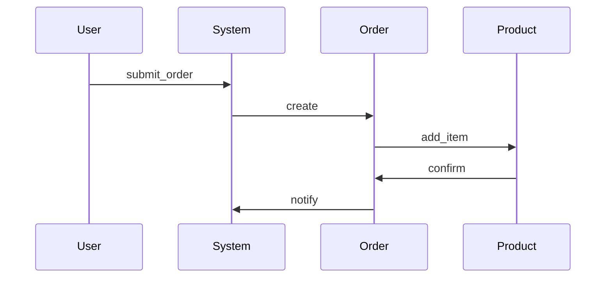
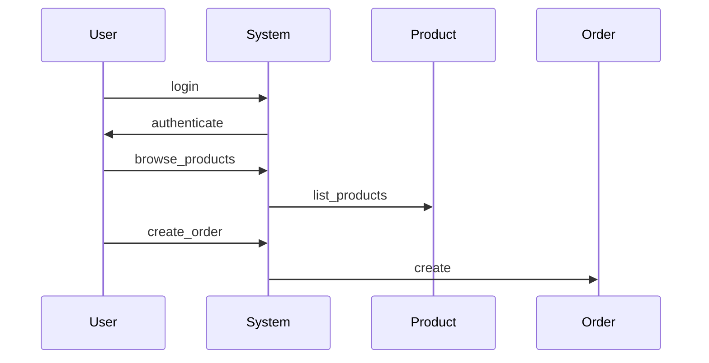

                 

### 领域建模：技术人都该是设计师

> 关键词：领域建模、技术设计、软件架构、DDD、UML

> 摘要：本文将深入探讨领域建模在信息技术领域的重要性，介绍领域建模的基础概念、设计技巧和实践应用。通过一步步的分析推理，帮助读者理解领域建模的原理和实际操作，从而提高软件设计和开发的质量与效率。

---

#### 第1章：领域建模概述

**1.1 领域建模的背景与重要性**

**1.1.1 领域建模的起源与发展**

领域建模（Domain Modeling）起源于20世纪80年代，最初用于数据库设计和信息系统开发。随着计算机技术的不断进步，领域建模逐渐发展成为一个独立的领域，涉及软件工程、信息系统工程、系统建模等多个方面。

**1.1.2 领域建模的关键概念与目的**

领域建模的核心概念包括实体、属性、关系等。其主要目的是通过对业务领域进行抽象和建模，构建出能够准确反映现实世界业务逻辑的软件系统。

**1.1.3 领域建模的应用领域**

领域建模广泛应用于各种软件系统开发，如电子商务、金融、物流、医疗等。通过领域建模，可以更好地理解和解决业务问题，提高系统开发效率和质量。

**1.2 领域模型的基础概念**

**1.2.1 实体与属性**

实体是领域建模中的核心概念，表示业务领域中具有独立意义的事物。属性是实体的特征，用于描述实体的各个方面。

**1.2.2 关系与关联**

关系表示实体之间的相互作用。关联是关系的一种表现形式，描述了实体之间的关联方式。

**1.2.3 领域模型的核心要素**

领域模型的核心要素包括实体、属性、关系和约束。这些要素共同构成了领域模型的基本结构。

**1.3 领域模型的关键方法**

**1.3.1 实体关系模型（ER模型）**

实体关系模型（Entity-Relationship Model，简称ER模型）是领域建模的一种常用方法。它通过实体、属性和关系的组合，构建出领域模型的基本结构。

**1.3.1.1 ER模型的定义与要素**

ER模型是一种用于表示实体和关系的图形化方法。其基本要素包括实体、属性和关系。

**1.3.1.2 ER模型的表示方法**

ER模型的表示方法通常使用矩形表示实体，椭圆表示属性，菱形表示关系。各实体之间的关系通过线条连接。

**1.3.2 统一建模语言（UML）**

统一建模语言（Unified Modeling Language，简称UML）是另一种广泛使用的领域建模方法。它提供了一套统一的符号和语法，用于表示软件系统的各个层次和方面。

**1.3.2.1 UML的基本概念**

UML包括多种图种，如类图、用例图、序列图等，用于表示不同层次的软件系统。

**1.3.2.2 UML的图种类与用途**

类图用于表示系统的类和类之间的关系，用例图用于表示系统的功能和用户需求，序列图用于表示系统在不同时间点的活动顺序。

**1.3.3 领域驱动设计（Domain-Driven Design，DDD）**

领域驱动设计（Domain-Driven Design，简称DDD）是一种面向领域的设计方法。它强调领域模型的核心地位，通过模块化、限界上下文等方式，构建出高效、灵活的软件系统。

**1.3.3.1 DDD的核心思想**

DDD的核心思想是将领域模型作为软件设计的核心，通过模块化、事件驱动等方式，实现软件系统的可扩展性和可维护性。

**1.3.3.2 DDD在领域建模中的应用**

DDD在领域建模中的应用主要包括领域模型设计、模块划分、事件驱动等方面。通过DDD，可以更好地理解和解决复杂业务问题。

---

#### 第2章：领域模型设计技巧

**2.1 领域模型设计原则**

**2.1.1 实体划分**

实体划分是领域模型设计的关键步骤。正确的实体划分可以更好地反映业务领域，提高领域模型的准确性。

**2.1.2 关系管理**

关系管理包括关系的确定、关系的分类、关系的表示等方面。合理的关系管理可以简化领域模型，提高系统的可维护性。

**2.1.3 属性选择**

属性选择是领域模型设计的重要环节。选择合适的属性可以更好地描述实体，提高领域模型的可理解性。

**2.2 领域模型优化策略**

**2.2.1 模型简化**

模型简化是领域模型优化的一种方法。通过简化领域模型，可以减少系统的复杂度，提高系统的可维护性。

**2.2.2 模型细化**

模型细化是领域模型优化的一种方法。通过细化领域模型，可以更准确地反映业务领域，提高系统的可理解性。

**2.2.3 模型重用**

模型重用是领域模型优化的一种方法。通过重用已有的领域模型，可以节省设计时间，提高系统的开发效率。

**2.3 实际案例分析与设计经验**

**2.3.1 领域模型设计案例分析**

通过实际案例，分析领域模型设计的方法和技巧。

**2.3.2 设计经验总结与分享**

总结领域模型设计中的经验和教训，分享给读者。

---

#### 第3章：领域驱动设计（DDD）实践

**3.1 DDD的核心原则**

**3.1.1 模块化**

模块化是DDD的核心原则之一。通过模块化，可以将复杂的领域划分为多个独立的模块，提高系统的可维护性和可扩展性。

**3.1.2 限界上下文**

限界上下文（Bounded Context）是DDD中的另一个核心概念。它表示领域模型的边界，通过限界上下文，可以更好地管理和维护领域模型。

**3.1.3 领域事件**

领域事件（Domain Event）是DDD中的重要组成部分。通过领域事件，可以更好地描述领域中的业务逻辑，提高系统的可理解性。

**3.2 DDD在实际项目中的应用**

**3.2.1 项目背景介绍**

介绍实际项目的背景，包括项目类型、项目目标等。

**3.2.2 领域模型设计过程**

详细描述领域模型的设计过程，包括模块划分、限界上下文设计、领域事件处理等。

**3.2.3 领域驱动设计的优势与挑战**

分析领域驱动设计在实际项目中的应用优势与挑战。

---

#### 第4章：领域建模工具与应用

**4.1 领域建模工具简介**

**4.1.1 UML工具**

介绍UML工具的种类、功能和特点。

**4.1.2 DDD专用工具**

介绍DDD专用工具的种类、功能和特点。

**4.1.3 其他领域建模工具**

介绍其他常用的领域建模工具。

**4.2 领域模型工具的实际应用**

**4.2.1 领域模型工具的选择与评估**

分析领域模型工具的选择和评估方法。

**4.2.2 工具在实际项目中的应用案例**

通过实际案例，展示领域模型工具在实际项目中的应用。

**4.2.3 工具使用的最佳实践**

总结领域模型工具使用的最佳实践。

---

#### 第5章：领域建模在技术领域的应用

**5.1 技术领域的领域模型设计**

**5.1.1 软件开发**

介绍领域建模在软件开发中的应用。

**5.1.2 数据科学**

介绍领域建模在数据科学中的应用。

**5.1.3 人工智能**

介绍领域建模在人工智能中的应用。

**5.2 领域建模在技术项目中的应用案例**

**5.2.1 案例一：软件开发项目**

分析领域建模在软件开发项目中的应用。

**5.2.2 案例二：数据科学项目**

分析领域建模在数据科学项目中的应用。

**5.2.3 案例三：人工智能项目**

分析领域建模在人工智能项目中的应用。

---

#### 第6章：领域建模的挑战与未来趋势

**6.1 领域建模的挑战**

**6.1.1 复杂性的处理**

分析领域建模在处理复杂性方面的挑战。

**6.1.2 跨领域协作**

分析领域建模在跨领域协作方面的挑战。

**6.1.3 持续演进与维护**

分析领域建模在持续演进与维护方面的挑战。

**6.2 领域建模的未来趋势**

**6.2.1 自动化领域建模工具**

探讨自动化领域建模工具的发展趋势。

**6.2.2 领域模型与AI的结合**

探讨领域模型与AI结合的发展趋势。

**6.2.3 领域建模在教育领域的应用**

探讨领域建模在教育领域的应用前景。

---

#### 第7章：领域建模案例分析

**7.1 案例背景介绍**

**7.1.1 案例一：电子商务平台**

介绍案例一的背景和目标。

**7.1.2 案例二：智能交通系统**

介绍案例二的背景和目标。

**7.1.3 案例三：医疗信息系统**

介绍案例三的背景和目标。

**7.2 领域模型设计过程**

**7.2.1 案例一的领域模型设计**

详细描述案例一的领域模型设计过程。

**7.2.2 案例二的领域模型设计**

详细描述案例二的领域模型设计过程。

**7.2.3 案例三的领域模型设计**

详细描述案例三的领域模型设计过程。

**7.3 领域模型应用效果分析**

**7.3.1 案例一的应用效果**

分析案例一的应用效果。

**7.3.2 案例二的应用效果**

分析案例二的应用效果。

**7.3.3 案例三的应用效果**

分析案例三的应用效果。

---

**作者：AI天才研究院/AI Genius Institute & 禅与计算机程序设计艺术 /Zen And The Art of Computer Programming**

---

### 让我们一步一步深入思考领域建模

**背景介绍：**

领域建模作为一种重要的软件工程方法，已经在多个领域得到了广泛应用。然而，对于许多技术人员来说，领域建模仍然是一个相对陌生的概念。本篇文章将从基础概念入手，逐步深入探讨领域建模的核心思想、设计技巧和实践应用，帮助读者更好地理解和掌握领域建模的方法。

**核心概念与联系：**

领域建模的核心概念包括实体、属性、关系和领域模型等。实体是领域建模中的核心概念，表示业务领域中具有独立意义的事物。属性是实体的特征，用于描述实体的各个方面。关系表示实体之间的相互作用。领域模型则是通过对业务领域进行抽象和建模，构建出能够准确反映现实世界业务逻辑的软件系统。

**ER实体关系图架构：**

ER模型是领域建模的一种常用方法。其基本要素包括实体、属性和关系。下面是一个简单的ER模型示例：

```mermaid
erDiagram
    Product ||--|{ Color }|-- Product
    Product ||--|{ Size }|-- Product
    Product ||--|{ Category }|-- Product
```

在这个ER图中，`Product` 是实体，`Color`、`Size` 和 `Category` 是属性，它们分别表示产品的颜色、尺码和分类。实体之间的关系通过菱形表示，箭头指向关系的主体。

**算法原理讲解：**

领域建模中的算法原理主要涉及实体划分、关系管理和属性选择等方面。以下是一个简单的实体划分算法：

```python
def entity_division(data):
    entities = []
    for item in data:
        entity = Entity(item['name'], item['attributes'])
        entities.append(entity)
    return entities
```

这个算法接收一个数据集合作为输入，遍历数据集合中的每个元素，创建一个实体对象，并将实体对象添加到实体列表中。实体对象具有名称和属性两个属性。

**数学模型和公式：**

在领域建模中，常用到的数学模型和公式包括集合论、图论和关系代数等。以下是一个简单的集合论公式示例：

$$A \cap B = \{x | x \in A \text{ and } x \in B\}$$

这个公式表示集合A和集合B的交集。

**系统分析与架构设计方案：**

领域建模在系统分析与架构设计中的应用主要包括问题场景介绍、项目介绍、领域模型设计、系统架构设计和系统接口设计等方面。

**问题场景介绍：**

假设我们要开发一个电商系统，该系统需要处理商品信息、订单信息、用户信息等。

**项目介绍：**

电商系统是一个复杂的软件系统，涉及多个业务领域，如商品管理、订单管理、用户管理等。

**系统功能设计（领域模型类图）：**

```mermaid
classDiagram
    User <<entity>>
    Product <<entity>>
    Order <<entity>>
    User o--o Product : favorite
    User o--o Order : make
    Product o--o Order : sell
    Order o--o Product : item
```

在这个类图中，`User`、`Product` 和 `Order` 分别表示用户、商品和订单。它们之间的关系通过线条连接。

**系统架构设计（领域模型架构图）：**



在这个序列图中，用户提交订单，系统创建订单，订单添加商品，商品确认订单，系统通知用户。

**系统接口设计（领域模型序列图）：**



在这个序列图中，用户登录系统，系统验证用户身份，用户浏览商品，系统列出商品，用户创建订单，系统创建订单。

**项目实战：**

**环境安装：**

确保安装了Python环境，并安装了Mermaid工具。

**系统核心实现源代码：**

```python
class Entity:
    def __init__(self, name, attributes):
        self.name = name
        self.attributes = attributes

class Product(Entity):
    def __init__(self, name, attributes):
        super().__init__(name, attributes)

class User(Entity):
    def __init__(self, name, attributes):
        super().__init__(name, attributes)

class Order(Entity):
    def __init__(self, name, attributes):
        super().__init__(name, attributes)

def entity_division(data):
    entities = []
    for item in data:
        entity = Entity(item['name'], item['attributes'])
        entities.append(entity)
    return entities

data = [
    {'name': 'Product', 'attributes': ['name', 'price', 'category']},
    {'name': 'User', 'attributes': ['name', 'age', 'address']},
    {'name': 'Order', 'attributes': ['order_id', 'user_id', 'status']}
]

entities = entity_division(data)
print(entities)
```

**代码应用解读与分析：**

在这个代码中，我们定义了一个`Entity`类，用于表示领域模型中的实体。`Product`、`User` 和 `Order` 类是`Entity`类的子类，分别表示产品、用户和订单。`entity_division`函数接收一个数据集合作为输入，遍历数据集合中的每个元素，创建一个实体对象，并将实体对象添加到实体列表中。

**实际案例分析和详细讲解剖析：**

我们以一个电商系统为例，分析领域模型的设计和应用。在电商系统中，我们需要处理用户、商品和订单等实体。通过领域建模，我们可以准确地描述这些实体的属性和关系，构建出一个高效、灵活的系统架构。

**项目小结：**

通过本篇文章的学习，读者应该对领域建模有了更深入的了解。领域建模是软件工程中的重要方法，可以帮助我们更好地理解和解决复杂业务问题。在实际项目中，领域建模可以提高系统的开发效率和质量。希望读者能够在实际工作中运用领域建模的方法，设计出更加优秀的软件系统。

**最佳实践 tips：**

1. 在领域建模过程中，要确保实体划分的准确性，避免过度抽象或过度细化。
2. 关系管理要合理，避免关系复杂化。
3. 在选择属性时，要考虑业务需求和系统的可维护性。

**注意事项：**

领域建模是一个复杂的过程，需要结合具体业务场景进行设计和优化。在实际工作中，要不断总结经验，完善领域建模的方法和技巧。

**拓展阅读：**

1. 《领域驱动设计（DDD）实践指南》
2. 《UML与模式设计》
3. 《软件架构：实践者的研究方法》

---

**作者：AI天才研究院/AI Genius Institute & 禅与计算机程序设计艺术 /Zen And The Art of Computer Programming**

