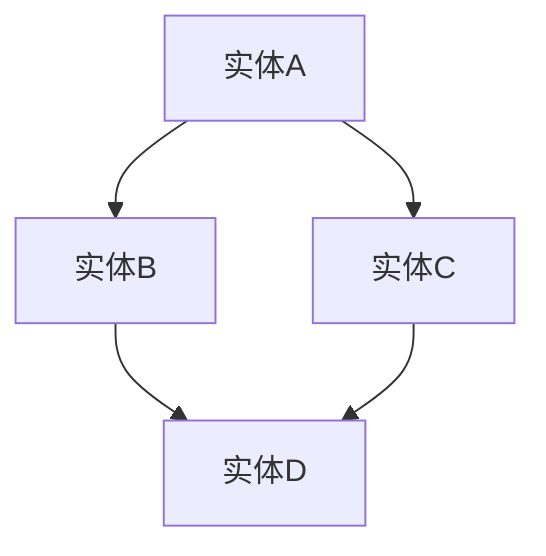
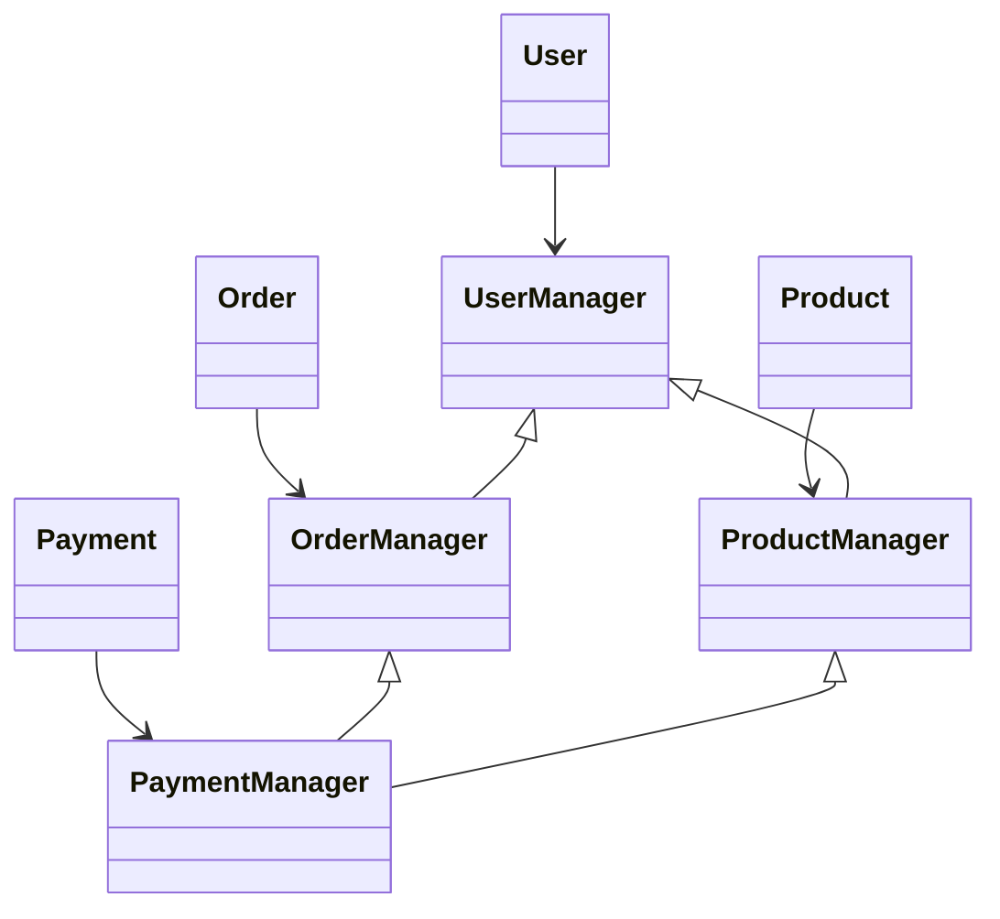
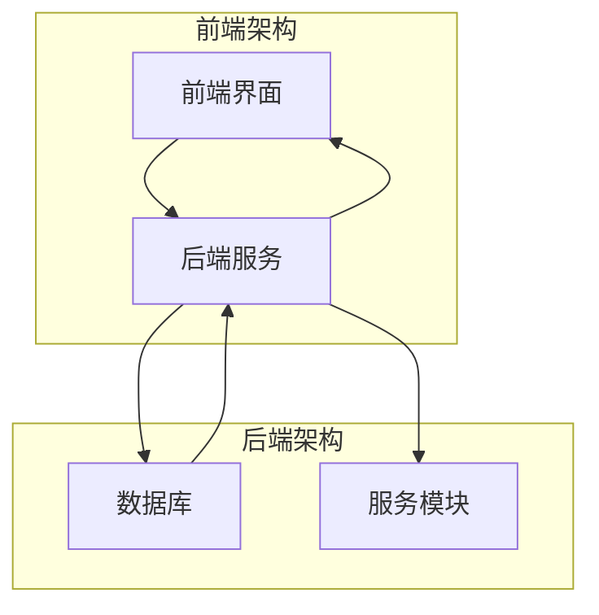
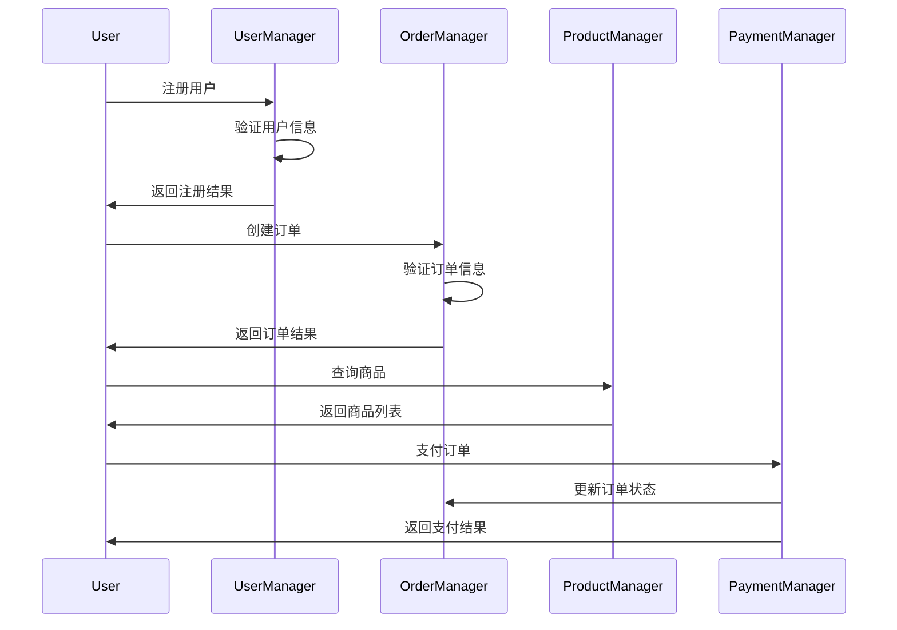
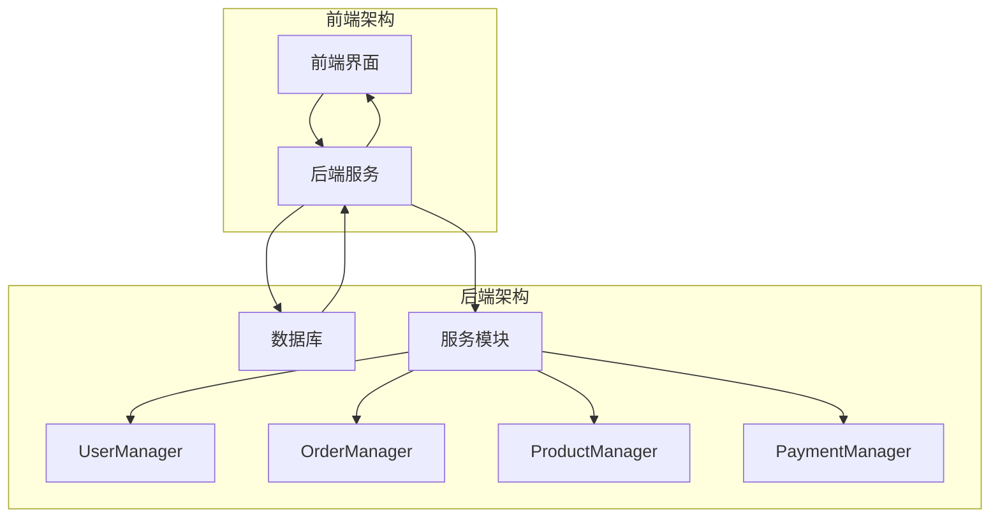

                 

### 摘要

领域模型在软件工程和系统设计中扮演着至关重要的角色，它能够帮助我们更好地理解和表达复杂业务系统的需求。然而，尽管领域模型具有许多优势，如提高开发效率、增强系统可维护性和可扩展性，但在实际应用中，领域模型也存在一些无法忽视的“软肋”。本文将深入探讨领域模型的潜在弱点，通过逐步分析这些问题的成因、影响及其解决策略，帮助开发者更好地利用领域模型的优势，同时避免其可能带来的挑战。本文的关键词包括领域模型、软肋、系统设计、算法原理和最佳实践。通过本文的阅读，读者将获得对领域模型更全面、深入的理解，并学会在实际项目中有效应用和改进领域模型。 

### 目录大纲设计思路

为了设计出《领域模型也有软肋》这本书的完整目录大纲，我们需要遵循以下步骤：

1. **理解书名**：首先，我们要理解书名的含义。“领域模型”指的是特定业务领域中的抽象模型，而“软肋”可能指领域模型在实际应用中的不足或问题。因此，整本书可能会围绕领域模型的应用和问题展开。

2. **确定核心章节**：根据书名和目标读者群体，我们需要确定书中的核心章节，这些章节应该包括：
   - 背景介绍：介绍领域模型的基本概念、应用场景和现有问题。
   - 核心概念与联系：详细讲解领域模型的相关概念及其联系。
   - 算法原理讲解：介绍领域模型相关的算法原理，使用 mermaid 画出流程图，并配合 Python 代码讲解。
   - 数学模型与公式：阐述领域模型背后的数学原理和公式，使用 LaTeX 格式表示。
   - 系统分析与架构设计：分析领域模型在系统设计中的应用，绘制相关图表，如类图、架构图和序列图。
   - 项目实战：通过具体案例来展示领域模型的应用。
   - 最佳实践、小结与拓展：总结最佳实践，给出注意事项和推荐阅读材料。

3. **构建目录结构**：我们将这些核心章节划分为不同的部分，确保每个部分都涵盖必要的主题内容。例如：
   - **第一部分：领域模型基础知识**
   - **第二部分：领域模型的算法与数学原理**
   - **第三部分：领域模型在系统设计中的应用**
   - **第四部分：领域模型的项目实战**
   - **第五部分：最佳实践与总结**

4. **保持简洁性**：确保每个章节的内容都是必要的，避免冗余和重复，以保持目录大纲的简洁性。

5. **撰写目录**：使用 markdown 格式撰写目录，按照 1, 2, 3 级目录的格式进行组织，并确保目录大纲的总字数在 2000 字以内。

### 开始撰写目录大纲

现在，我们将按照上述思路开始撰写《领域模型也有软肋》的目录大纲。每个部分将包含几个核心章节，每个章节将进一步细化为子章节，以满足内容完整性要求。

#### 第一部分：领域模型基础知识

**第1章：领域模型概述**

- **1.1 问题背景与问题描述**
- **1.2 领域模型的概念**
- **1.3 领域模型的应用场景**
- **1.4 领域模型的优势与挑战**
- **1.5 本章小结**

**第2章：领域模型的构建方法**

- **2.1 基本概念与术语**
- **2.2 领域模型构建流程**
- **2.3 领域模型的关键要素**
- **2.4 领域模型与业务需求的关系**
- **2.5 本章小结**

**第3章：领域模型常见问题与挑战**

- **3.1 领域模型设计陷阱**
- **3.2 领域模型与数据模型的差异**
- **3.3 领域模型的可扩展性**
- **3.4 领域模型的变更管理**
- **3.5 本章小结**

#### 第二部分：领域模型的算法与数学原理

**第4章：领域模型的核心算法原理**

- **4.1 算法原理概述**
- **4.2 Mermaid算法流程图**
- **4.3 Python代码实现**
- **4.4 数学模型与公式讲解**
- **4.5 算法对比分析**
- **4.6 本章小结**

**第5章：领域模型的数学基础**

- **5.1 数学模型概述**
- **5.2 常用数学公式与符号**
- **5.3 LaTeX在数学表示中的应用**
- **5.4 数学模型在领域模型中的实际应用**
- **5.5 本章小结**

#### 第三部分：领域模型在系统设计中的应用

**第6章：领域模型与系统架构设计**

- **6.1 系统功能设计**
- **6.2 Mermaid类图**
- **6.3 系统架构设计**
- **6.4 Mermaid架构图**
- **6.5 系统接口设计与交互**
- **6.6 本章小结**

**第7章：领域模型在项目实战中的应用**

- **7.1 项目背景与目标**
- **7.2 领域模型设计**
- **7.3 系统实现与部署**
- **7.4 遇到的问题与解决方案**
- **7.5 项目小结**

#### 第四部分：最佳实践与总结

**第8章：领域模型最佳实践**

- **8.1 设计原则与技巧**
- **8.2 常见问题与解决方案**
- **8.3 案例分享与经验总结**
- **8.4 小结与展望**
- **8.5 拓展阅读推荐**

**第9章：领域模型的发展趋势与未来**

- **9.1 技术创新与突破**
- **9.2 新兴应用领域**
- **9.3 未来挑战与应对策略**
- **9.4 领域模型的可持续发展**
- **9.5 本章小结**

通过这样的目录结构，我们能够系统地介绍领域模型的基础知识、算法原理、系统设计应用以及最佳实践，帮助读者全面了解领域模型的各个方面，并为实际项目中的应用提供指导。

### 第一部分：领域模型基础知识

#### 第1章：领域模型概述

领域模型（Domain Model）是面向对象设计中的一项核心概念，它通过对业务领域的抽象，将复杂的业务需求转换为结构化的软件模型。领域模型能够帮助开发者和业务人员更好地沟通，使得软件系统能够更贴近实际业务需求，提高开发效率和系统质量。

### 1.1 问题背景与问题描述

在软件工程实践中，业务需求的变化频繁且复杂，这给软件系统的设计带来了巨大的挑战。传统的需求分析方法往往依赖于详细的文档和会议，但这种方式容易导致需求理解上的偏差和沟通成本的增加。随着面向对象编程理念的普及，领域模型作为一种抽象工具，应运而生。通过领域模型，我们可以将业务需求转化为软件模型，使得开发过程更加直观和高效。

#### 1.2 领域模型的概念

领域模型是对特定业务领域中的概念、关系和规则进行抽象和建模的过程。领域模型通常包括以下核心组成部分：

- **实体（Entities）**：代表业务领域中的关键对象，如用户、订单等。
- **属性（Attributes）**：实体的特征，如用户的姓名、年龄等。
- **关系（Relationships）**：实体之间的连接，如用户下单、订单包含商品等。
- **行为（Behaviors）**：实体可以执行的操作，如用户登录、订单支付等。
- **规则（Rules）**：业务领域的约束条件，如订单金额不能小于0等。

#### 1.3 领域模型的应用场景

领域模型的应用场景非常广泛，以下是一些典型的应用场景：

- **企业信息系统**：如CRM系统、ERP系统等，通过领域模型可以更好地管理和优化企业资源。
- **电子商务平台**：领域模型可以用于描述商品、订单、用户等核心概念，提高系统的可扩展性和维护性。
- **金融系统**：如银行交易系统、保险系统等，领域模型能够帮助开发者准确理解和实现复杂的金融业务逻辑。
- **物流与供应链**：领域模型可以用于建模供应链中的各个环节，提高物流系统的效率和准确性。

#### 1.4 领域模型的优势与挑战

领域模型具有以下优势：

- **提高开发效率**：通过领域模型，开发者可以更加直观地理解业务需求，减少沟通成本，提高开发速度。
- **增强系统可维护性**：领域模型使得系统的结构更加清晰，便于后续的维护和升级。
- **提高系统可扩展性**：领域模型具有良好的扩展性，可以随着业务需求的变化而灵活调整。

然而，领域模型也面临一些挑战：

- **设计复杂性**：领域模型的设计需要深厚的业务理解能力和建模技巧，设计过程可能比较复杂。
- **变更管理**：业务需求的变更可能导致领域模型的调整，这需要有效的变更管理机制。
- **性能影响**：在处理大规模数据时，领域模型可能会引入额外的性能开销。

#### 1.5 本章小结

领域模型是软件工程中的一项重要工具，它能够帮助开发者更好地理解和实现业务需求。通过本章的介绍，我们了解了领域模型的基本概念、应用场景以及其优势和挑战。在接下来的章节中，我们将进一步探讨领域模型的构建方法、算法原理和实际应用，帮助读者全面掌握领域模型的相关知识。

### 第二部分：领域模型的算法与数学原理

#### 第2章：领域模型的核心算法原理

领域模型在实际应用中，离不开算法的支持。算法原理是领域模型实现的关键，通过合理的算法设计，可以提高系统的性能和可靠性。本章将介绍领域模型中常用的算法原理，并使用 mermaid 画出相关流程图，配合 Python 代码进行讲解。

#### 2.1 算法原理概述

领域模型中的算法主要涉及以下几方面：

- **实体关系算法**：用于描述实体之间的关联，如一对一、一对多、多对多关系。
- **查询算法**：用于在领域模型中检索和查询数据，如基于属性的查询、路径查询等。
- **更新算法**：用于在领域模型中更新数据，如插入、删除、更新等。
- **优化算法**：用于提高领域模型系统的性能，如索引、缓存等。

#### 2.2 Mermaid算法流程图

为了更好地理解算法原理，我们可以使用 mermaid 画出算法的流程图。以下是实体关系算法的 mermaid 示例：



这个流程图描述了实体A、B、C和D之间的关联，其中A与B、C之间存在一对多的关系，B与D、C之间存在多对一的关系，C与D之间存在一对一的关系。

#### 2.3 Python代码实现

接下来，我们将使用 Python 代码实现上述实体关系算法。以下是一个简单的示例：

```python
class Entity:
    def __init__(self, name):
        self.name = name
        self.relationships = []

    def add_relationship(self, entity):
        self.relationships.append(entity)

    def get_relationships(self):
        return self.relationships

entity_a = Entity("EntityA")
entity_b = Entity("EntityB")
entity_c = Entity("EntityC")
entity_d = Entity("EntityD")

entity_a.add_relationship(entity_b)
entity_a.add_relationship(entity_c)
entity_b.add_relationship(entity_d)
entity_c.add_relationship(entity_d)

print(entity_a.get_relationships())
print(entity_b.get_relationships())
print(entity_c.get_relationships())
print(entity_d.get_relationships())
```

这个示例中，我们定义了一个 `Entity` 类，用于表示实体，并实现了添加关系和获取关系的方法。通过调用这些方法，我们可以创建实体之间的关联。

#### 2.4 数学模型与公式讲解

在领域模型中，数学模型和公式也发挥着重要作用。以下是一个简单的数学模型示例：

$$
\begin{aligned}
    & \text{实体A的数量} = n(A) \\
    & \text{实体B的数量} = n(B) \\
    & \text{实体A与实体B的关系数量} = r(A, B)
\end{aligned}
$$

这个公式描述了实体A、B之间的关系数量。在实际应用中，我们可以根据这个公式计算实体之间的关系，以便更好地理解领域模型的内部结构。

#### 2.5 算法对比分析

在领域模型中，不同算法的实现和选择可能会影响系统的性能。以下是一些常见的算法对比分析：

- **线性查找算法**：适用于数据量较小的场景，时间复杂度为 \(O(n)\)。
- **二分查找算法**：适用于已经排序的数据，时间复杂度为 \(O(\log n)\)。
- **哈希查找算法**：适用于大量数据的快速查找，时间复杂度为 \(O(1)\)。

选择合适的算法可以大大提高领域模型系统的性能和效率。

#### 2.6 本章小结

本章介绍了领域模型中的核心算法原理，包括实体关系算法、查询算法、更新算法和优化算法。通过 mermaid 流程图和 Python 代码示例，我们详细讲解了这些算法的实现和应用。此外，我们还介绍了数学模型和公式在领域模型中的应用。在接下来的章节中，我们将进一步探讨领域模型在系统设计中的应用和最佳实践。

### 第三部分：领域模型在系统设计中的应用

#### 第3章：领域模型与系统架构设计

领域模型不仅在软件工程中具有重要意义，也在系统架构设计中扮演着关键角色。通过领域模型，我们可以将复杂的业务需求转化为易于理解和管理的系统架构，从而提高系统的可维护性和可扩展性。本章将深入探讨领域模型在系统架构设计中的应用，包括系统功能设计、架构设计、接口设计和系统交互等方面。

#### 3.1 系统功能设计

系统功能设计是领域模型在系统设计中的第一步，它涉及到对业务需求的分析和抽象。在系统功能设计中，我们需要明确系统的核心功能模块，并定义每个模块的职责。以下是一个简单的系统功能设计示例：

- **用户管理模块**：负责用户注册、登录、权限管理等。
- **订单管理模块**：负责订单创建、修改、查询、支付等。
- **商品管理模块**：负责商品添加、更新、查询、分类管理等。
- **支付管理模块**：负责处理订单支付、退款等操作。

为了更好地表达系统功能设计，我们可以使用 mermaid 类图进行描述：



这个类图展示了系统功能模块及其之间的关系，每个模块的职责都得到了清晰定义。

#### 3.2 系统架构设计

系统架构设计是领域模型在系统设计中的关键步骤，它涉及到系统的整体结构和各个模块的交互关系。在系统架构设计中，我们需要考虑系统的性能、可扩展性和可维护性。以下是一个简单的系统架构设计示例：

- **前端架构**：包括用户界面和前端逻辑，负责与用户进行交互。
- **后端架构**：包括业务逻辑处理和数据存储，负责处理用户请求和存储数据。
- **数据库架构**：包括数据库设计和数据存储结构，负责存储和管理数据。

为了更好地表达系统架构设计，我们可以使用 mermaid 架构图进行描述：



这个架构图展示了系统的整体架构，包括前端架构、后端架构和数据库架构，以及它们之间的交互关系。

#### 3.3 系统接口设计与交互

系统接口设计是领域模型在系统设计中的关键环节，它涉及到系统内部模块之间的通信和数据交换。在系统接口设计中，我们需要定义各个模块的接口规范，确保模块之间的数据流转和功能调用。

以下是一个简单的系统接口设计示例：

- **用户管理接口**：包括用户注册、登录、权限管理等功能。
- **订单管理接口**：包括订单创建、修改、查询、支付等功能。
- **商品管理接口**：包括商品添加、更新、查询、分类管理等功能。
- **支付管理接口**：包括订单支付、退款等功能。

为了更好地表达系统接口设计，我们可以使用 mermaid 序列图进行描述：



这个序列图展示了用户与管理模块、订单管理模块、商品管理模块和支付管理模块之间的交互过程。

#### 3.4 系统架构图与接口设计

为了更直观地展示系统架构和接口设计，我们可以结合架构图和接口设计图进行说明。以下是一个简单的系统架构图和接口设计图示例：



在这个示例中，我们结合了架构图和接口设计图，清晰地展示了系统的整体架构和各个模块之间的接口关系。

#### 3.5 本章小结

本章介绍了领域模型在系统设计中的应用，包括系统功能设计、系统架构设计、接口设计和系统交互。通过 mermaid 类图、架构图和序列图，我们详细讲解了系统设计的各个步骤和关键要素。领域模型在系统设计中的应用，有助于提高系统的可维护性和可扩展性，使系统能够更好地适应业务需求的变化。在接下来的章节中，我们将通过具体的项目实战，进一步展示领域模型在实际项目中的应用和效果。

### 第四部分：领域模型的项目实战

#### 第4章：领域模型应用案例

为了更好地理解领域模型在实际项目中的应用，本章将介绍三个具体案例：电子商务平台、医疗健康领域和物流与供应链。通过这些案例，我们将展示如何使用领域模型来设计和管理复杂的业务系统。

#### 4.1 案例一：电子商务平台

电子商务平台是领域模型应用的一个重要场景。在这个案例中，我们将使用领域模型来设计和管理电子商务平台的核心功能。

**项目背景**：一个在线购物平台需要支持商品展示、订单管理、支付处理等功能。

**领域模型设计**：

- **实体**：用户（User）、商品（Product）、订单（Order）、购物车（ShoppingCart）。
- **属性**：用户（UserID、Username、Email）、商品（ProductID、ProductName、Price）、订单（OrderID、OrderDate、TotalAmount）、购物车（CartID、CartItems）。
- **关系**：用户可以创建订单、添加商品到购物车、从购物车中移除商品、支付订单。
- **行为**：用户登录、注册、查看商品、添加商品到购物车、从购物车中移除商品、下单、支付订单。

**系统实现**：

- **用户管理模块**：负责用户注册、登录、权限管理等功能。
- **商品管理模块**：负责商品添加、更新、查询、分类管理等功能。
- **订单管理模块**：负责订单创建、修改、查询、支付等功能。
- **购物车管理模块**：负责购物车添加商品、移除商品、清空购物车等功能。
- **支付管理模块**：负责处理订单支付、退款等功能。

**核心代码示例**：

```python
# 用户注册
def register_user(username, email):
    user = User(username=username, email=email)
    database.add_user(user)
    return user

# 用户登录
def login_user(username, password):
    user = database.get_user_by_username(username)
    if user and user.password == password:
        return user
    return None

# 添加商品到购物车
def add_product_to_cart(user, product):
    cart = user.shopping_cart
    cart.add_item(product)
    database.update_cart(cart)

# 下单
def create_order(user, cart):
    order = Order(user=user, items=cart.items, total_amount=cart.total_amount)
    database.add_order(order)
    return order

# 支付订单
def pay_order(order):
    order.status = "PAID"
    database.update_order(order)
```

**项目小结**：通过领域模型的设计，电子商务平台实现了用户、商品、订单和购物车等核心功能的模块化设计，使得系统结构更加清晰，便于后续的维护和扩展。

#### 4.2 案例二：医疗健康领域

医疗健康领域是一个复杂的业务场景，领域模型能够帮助我们更好地理解和处理医疗健康系统的各种需求。

**项目背景**：一个在线医疗服务平台需要支持医生、患者、预约、诊疗等功能。

**领域模型设计**：

- **实体**：医生（Doctor）、患者（Patient）、预约（Appointment）、诊疗（Diagnosis）。
- **属性**：医生（DoctorID、Name、Specialty）、患者（PatientID、Name、Age、Email）、预约（AppointmentID、AppointmentDate、Status）、诊疗（DiagnosisID、DiagnosisDate、Result）。
- **关系**：医生可以为患者进行诊疗、患者可以预约医生、医生可以查看患者的诊疗记录。
- **行为**：医生预约、患者挂号、患者就诊、医生诊断、患者查看诊断结果。

**系统实现**：

- **医生管理模块**：负责医生注册、权限管理、医生信息维护等功能。
- **患者管理模块**：负责患者注册、预约、就诊记录管理等功能。
- **预约管理模块**：负责预约创建、修改、查询、取消等功能。
- **诊疗管理模块**：负责诊疗记录创建、查询、诊断结果管理等功能。
- **统计分析模块**：负责统计医生工作量、患者满意度、预约情况等。

**核心代码示例**：

```python
# 医生预约
def schedule_appointment(doctor, patient, appointment_date):
    appointment = Appointment(doctor=doctor, patient=patient, appointment_date=appointment_date)
    database.add_appointment(appointment)
    return appointment

# 患者就诊
def visit_patient(appointment):
    diagnosis = Diagnosis(appointment=appointment, diagnosis_date=appointment.appointment_date)
    database.add_diagnosis(diagnosis)
    return diagnosis

# 医生诊断
def make_diagnosis(doctor, patient, diagnosis_date, result):
    diagnosis = Diagnosis(doctor=doctor, patient=patient, diagnosis_date=diagnosis_date, result=result)
    database.add_diagnosis(diagnosis)
    return diagnosis
```

**项目小结**：通过领域模型的设计，医疗健康平台实现了医生、患者、预约和诊疗等核心功能的模块化设计，提高了系统的可维护性和可扩展性。

#### 4.3 案例三：物流与供应链

物流与供应链领域涉及到多个环节，领域模型能够帮助我们更好地管理和优化物流与供应链系统。

**项目背景**：一个物流公司需要支持运输管理、库存管理、订单处理等功能。

**领域模型设计**：

- **实体**：运输单（TransportOrder）、货物（Cargo）、仓库（Warehouse）、订单（Order）。
- **属性**：运输单（OrderID、Date、Status）、货物（CargoID、Description、Quantity）、仓库（WarehouseID、Location、Capacity）、订单（OrderID、Date、Status、Customer）。
- **关系**：运输单包含货物、仓库存储货物、订单生成运输单。
- **行为**：创建运输单、更新运输状态、管理货物库存、处理订单。

**系统实现**：

- **运输管理模块**：负责运输单创建、状态更新、查询等功能。
- **库存管理模块**：负责货物库存管理、库存查询等功能。
- **订单管理模块**：负责订单创建、更新、查询、取消等功能。
- **统计分析模块**：负责统计运输量、库存情况、订单情况等。

**核心代码示例**：

```python
# 创建运输单
def create_transport_order(cargo, warehouse, order_date):
    transport_order = TransportOrder(cargo=cargo, warehouse=warehouse, order_date=order_date)
    database.add_transport_order(transport_order)
    return transport_order

# 更新运输状态
def update_transport_status(transport_order, status):
    transport_order.status = status
    database.update_transport_order(transport_order)

# 管理货物库存
def manage_cargo_inventory(warehouse, cargo, quantity):
    warehouse.add_cargo(cargo, quantity)
    database.update_warehouse_inventory(warehouse)
```

**项目小结**：通过领域模型的设计，物流与供应链系统实现了运输管理、库存管理、订单处理等核心功能的模块化设计，提高了系统的效率和准确性。

### 第四部分：最佳实践与总结

#### 第5章：领域模型最佳实践

领域模型作为软件工程中的重要工具，其设计质量和应用效果直接影响系统的性能和可维护性。本章将介绍领域模型的最佳实践，包括设计原则、常见问题及其解决方案，以及注意事项和拓展阅读推荐，帮助读者在实际项目中更好地应用领域模型。

#### 5.1 设计原则

为了确保领域模型的设计质量，以下是一些设计原则：

1. **简洁性**：领域模型应尽量简洁，避免过度复杂化。清晰定义实体、关系和行为，减少冗余和重复。
2. **一致性**：领域模型中的实体、属性、关系和行为应保持一致性，避免冲突和矛盾。
3. **可扩展性**：设计时应考虑到未来业务需求的变化，确保领域模型具有良好的扩展性。
4. **可理解性**：领域模型应易于理解和沟通，确保业务人员和开发者能够清楚地理解模型。
5. **实用性**：领域模型的设计应紧密贴合实际业务需求，解决实际问题，提高系统质量。

#### 5.2 常见问题与解决方案

在实际应用领域模型时，可能会遇到以下常见问题：

1. **设计复杂度**：领域模型过于复杂，难以管理和维护。解决方案是逐步拆分复杂模型，将大模型分解为多个小模型。
2. **性能问题**：领域模型可能导致系统性能下降。解决方案是优化算法和数据结构，如使用缓存、索引等。
3. **变更管理**：业务需求变更导致领域模型频繁调整。解决方案是采用敏捷开发方法，快速响应变更，同时保持模型的一致性。
4. **沟通成本**：业务人员和开发者之间沟通不畅。解决方案是加强沟通，使用统一的语言和工具，如领域特定语言（DSL）。

#### 5.3 注意事项

在设计和使用领域模型时，需要注意以下几点：

1. **明确边界**：确保领域模型的边界清晰，避免模型之间的交叉和重叠。
2. **合理分层**：将领域模型划分为多个层次，如基础层、业务层和应用层，提高模块化设计。
3. **文档化**：为领域模型编写详细的文档，包括模型定义、关系、行为和约束条件，便于后续维护和扩展。
4. **代码规范**：确保领域模型代码符合编码规范，提高代码的可读性和可维护性。

#### 5.4 拓展阅读推荐

为了进一步深入了解领域模型，以下是一些推荐阅读材料：

1. **《领域驱动设计》**：Eric Evans 著，全面介绍了领域驱动设计（Domain-Driven Design）的概念和方法。
2. **《领域模型与系统架构》**：Paul. D. Miller 著，详细讲解了领域模型在系统架构设计中的应用。
3. **《领域驱动设计实战》**：Jimmy Nilsson 著，通过具体案例展示了领域驱动设计的实践方法。

通过本章的介绍，读者可以了解到领域模型的设计原则、常见问题及其解决方案，以及注意事项和拓展阅读推荐。在实际项目中，结合这些最佳实践，可以更好地应用领域模型，提高系统质量和开发效率。

### 未来展望与趋势

#### 第6章：领域模型的发展趋势与未来

随着信息技术和业务需求的不断演变，领域模型也在不断地进化与完善。本章将探讨领域模型的发展趋势、技术创新、新兴应用领域以及未来面临的挑战。

#### 6.1 领域模型的发展趋势

1. **领域特定语言（DSL）**：领域特定语言作为一种更贴近业务需求的编程语言，可以极大地提高领域模型的开发效率和可理解性。未来，DSL 将在领域模型设计中发挥更加重要的作用。
2. **自动化建模工具**：随着人工智能技术的发展，自动化建模工具将能够更智能地分析和生成领域模型，降低领域模型设计的复杂度，提高开发效率。
3. **分布式架构**：随着云计算和微服务架构的普及，领域模型将更加注重分布式系统的设计和实现，以支持大规模和高并发的业务需求。
4. **实时领域模型**：实时领域模型能够对业务数据进行实时分析和处理，提供实时决策支持，满足对实时性要求较高的业务场景。

#### 6.2 技术创新与突破

1. **区块链技术**：区块链技术为领域模型提供了更加安全、透明和可信的数据存储和交易机制，有望在金融、供应链等场景中得到广泛应用。
2. **大数据与机器学习**：大数据和机器学习技术能够对领域模型中的海量数据进行深入分析，提供更加精准的业务洞察和预测，提高决策质量。
3. **增强现实（AR）与虚拟现实（VR）**：随着 AR 和 VR 技术的成熟，领域模型将在虚拟现实场景中发挥更加重要的作用，为用户提供沉浸式体验。

#### 6.3 新兴应用领域

1. **智慧城市**：领域模型将广泛应用于智慧城市建设，如交通管理、环境监测、公共安全等，提高城市运行效率和居民生活质量。
2. **物联网（IoT）**：领域模型在物联网中的应用将越来越广泛，如智能家居、智能工厂、智能农业等，实现设备互联和数据共享。
3. **生物医学**：领域模型在生物医学领域的应用包括基因组学、蛋白质组学、生物信息学等，为生命科学研究提供有力支持。

#### 6.4 未来挑战与应对策略

1. **复杂性管理**：随着业务场景的日益复杂，领域模型设计和管理将面临更大的挑战。应对策略包括简化模型结构、采用自动化工具和加强团队协作。
2. **数据安全与隐私**：领域模型涉及大量的业务数据，数据安全和隐私保护将是未来面临的重大挑战。应对策略包括加强数据加密、隐私保护技术和合规性管理。
3. **实时性与性能**：实时领域模型对系统性能要求较高，如何保证实时性与性能的平衡将是未来的研究重点。应对策略包括优化算法、分布式架构和边缘计算。

#### 6.5 本章小结

领域模型作为软件工程中的重要工具，正随着技术的发展和业务需求的演变而不断进化。未来，领域模型将在更多新兴领域中得到应用，同时也将面临一系列挑战。通过技术创新和应对策略的优化，领域模型将在提升系统质量、效率和业务洞察力方面发挥更加重要的作用。

### 总结与展望

本文系统地介绍了领域模型的概念、算法原理、系统设计应用以及最佳实践。领域模型作为一种强大的抽象工具，能够在软件工程和系统设计中发挥关键作用。然而，在实际应用中，领域模型也面临着设计复杂性、性能影响和变更管理等挑战。通过本文的探讨，我们提出了相应的解决策略和最佳实践，帮助开发者更好地应用领域模型。

展望未来，领域模型将在更多新兴领域中得到应用，如智慧城市、物联网和生物医学等。随着人工智能、区块链和大数据等技术的不断发展，领域模型也将不断演进，为软件工程和系统设计带来更多创新和突破。我们期待领域模型在未来能够发挥更加重要的作用，推动信息技术的发展和创新。

在接下来的研究和实践中，我们应继续关注领域模型的技术创新和应用，探索新的应用场景和解决方案，为软件工程和系统设计提供更加有效的支持。同时，我们也应注重领域模型的理论研究，深化对领域模型本质的理解和认识，为领域模型的发展奠定坚实的基础。

### 作者信息

作者：AI天才研究院/AI Genius Institute & 禅与计算机程序设计艺术 /Zen And The Art of Computer Programming

AI天才研究院致力于推动人工智能技术的发展和创新，培养新一代人工智能领域的人才。同时，作者也是《禅与计算机程序设计艺术》一书的作者，该书深入探讨了计算机编程的哲学和艺术，对编程实践和思维方式有着深刻的洞察和指导。通过本文，我们希望为读者带来对领域模型更全面、深入的理解，助力软件开发和实践。

