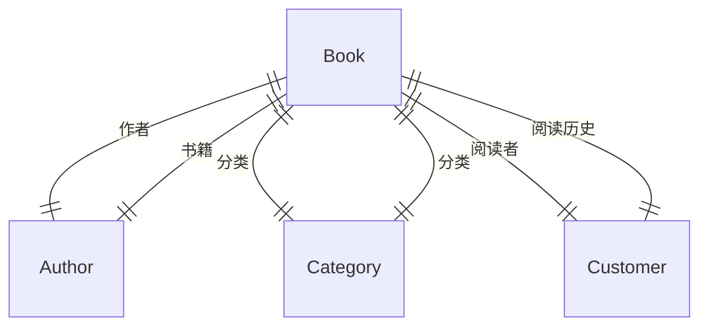
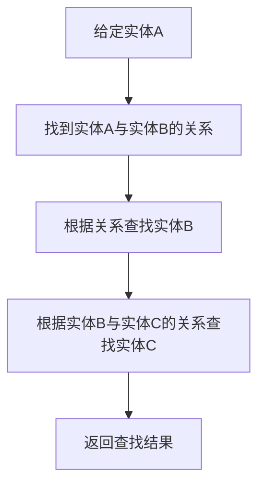
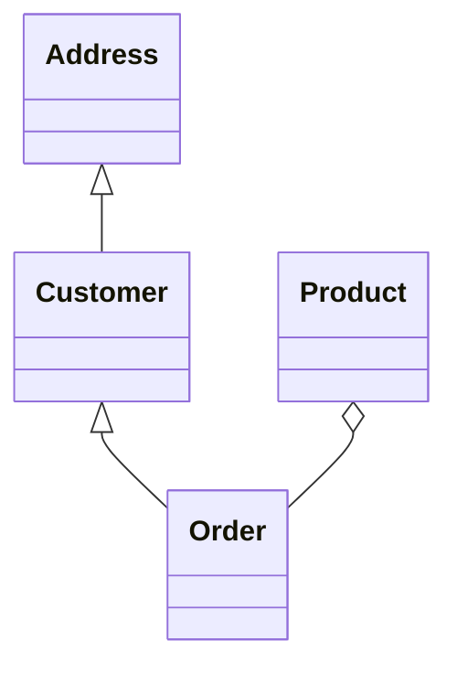
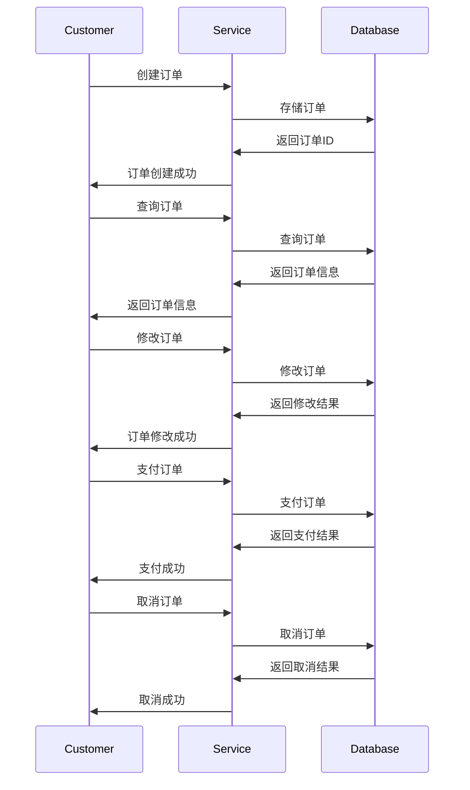
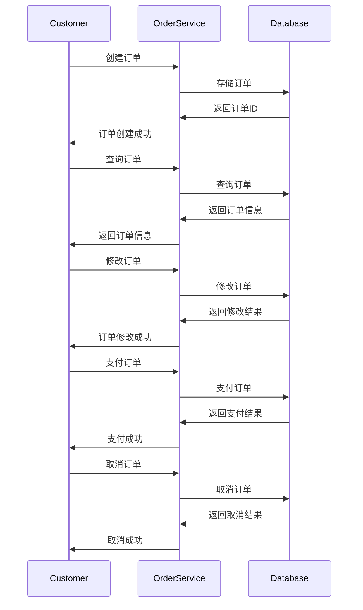

                 


# 领域模型的优势和应用

关键词：领域模型、软件工程、业务分析、应用领域、核心概念、算法原理

摘要：本文将深入探讨领域模型的优势和应用。领域模型是一种面向特定业务领域的抽象模型，它有助于提高软件复用性、可维护性和开发效率。本文首先介绍了领域模型的起源和发展，随后详细阐述了其核心概念和联系，包括实体、属性、关系和约束。接着，我们讲解了领域模型中的算法原理，并使用Python源代码和Mermaid流程图进行了详细阐述。随后，本文通过一个系统设计与架构设计案例，展示了领域模型在项目实战中的应用。最后，我们对领域模型的优势进行了总结，并提出了未来发展趋势和应用前景。

## 第一部分：背景介绍

### 第1章：领域模型概述

#### 1.1 领域模型的问题背景

在软件工程中，开发人员常常面临一系列问题，如系统复杂性增加、维护成本上升、项目延期等。这些问题的主要原因之一是缺乏对业务领域的深入理解，导致系统设计过于复杂，难以维护。为了解决这些问题，领域模型应运而生。

#### 1.1.1 领域模型的需求

领域模型的需求主要来自于以下几个方面：

1. **复用性**：在多个项目中，业务领域通常具有一定的相似性。通过建立领域模型，可以降低项目之间的重复工作，提高开发效率。

2. **可维护性**：领域模型将业务领域的知识抽象出来，使得系统更易于理解和维护。

3. **开发效率**：领域模型有助于开发人员更好地理解业务需求，从而快速实现系统功能。

#### 1.1.2 领域模型的历史演进

领域模型的概念起源于20世纪80年代，当时软件工程领域开始关注如何提高软件复用性和可维护性。领域工程（Domain Engineering）作为一种新的软件开发方法，逐渐发展起来。领域模型作为一种核心工具，受到了广泛关注。

20世纪90年代，随着面向对象技术的兴起，领域模型得到了进一步发展。UML（统一建模语言）的引入，为领域模型提供了统一的表示方法，使得领域模型的应用更加广泛。

#### 1.2 领域模型的定义与概念

领域模型是一种面向特定业务领域的抽象模型，它通过实体、属性、关系和约束等概念，对业务领域进行抽象和表示。

1. **实体**：实体表示业务领域中的对象，具有独立的业务意义。例如，客户、订单、产品等。

2. **属性**：属性表示实体的特征，用于描述实体的状态。例如，客户的姓名、年龄、地址等。

3. **关系**：关系表示实体之间的相互作用和依赖。例如，客户可以下单购买产品，订单与产品之间存在关联。

4. **约束**：约束表示实体之间的限制条件和规则，用于保证数据的正确性和一致性。

#### 1.3 领域模型的核心要素

领域模型的核心要素包括实体、属性、关系和约束。这四个要素相互关联，构成了领域模型的骨架。

1. **实体与属性**：实体是领域模型的基础，属性用于描述实体的特征。实体与属性之间的关系是一种包含关系。

2. **关系与约束**：关系用于表示实体之间的相互作用，约束用于保证数据的正确性和一致性。

3. **实体、属性、关系和约束之间的关系**：实体、属性、关系和约束相互关联，共同构成了领域模型的核心结构。

#### 1.4 领域模型的优势

领域模型具有以下优势：

1. **提高软件复用性**：通过抽象和封装业务领域知识，领域模型可以降低项目之间的重复工作，提高开发效率。

2. **提高软件可维护性**：领域模型将业务领域的知识抽象出来，使得系统更易于理解和维护。

3. **提高开发效率**：领域模型有助于开发人员更好地理解业务需求，从而快速实现系统功能。

#### 1.5 领域模型的边界与外延

领域模型的应用范围广泛，但并非适用于所有场景。以下是一些关于领域模型边界与外延的思考：

1. **边界**：领域模型应聚焦于特定的业务领域，避免过于宽泛或过于狭窄。

2. **外延**：领域模型可以与其他模型（如UML模型、数据模型等）相结合，扩展其应用范围。

### 第2章：领域模型的应用领域

#### 2.1 领域模型在软件工程中的应用

领域模型在软件工程中具有广泛的应用，主要包括以下几个方面：

1. **软件开发**：领域模型有助于开发人员更好地理解业务需求，从而快速实现系统功能。

2. **软件维护**：领域模型将业务领域的知识抽象出来，使得系统更易于理解和维护。

3. **软件复用**：通过抽象和封装业务领域知识，领域模型可以降低项目之间的重复工作，提高开发效率。

#### 2.2 领域模型在业务分析中的应用

领域模型在业务分析中发挥着重要作用，主要包括以下几个方面：

1. **业务流程建模**：领域模型可以帮助业务分析师更好地理解业务流程，从而设计出更合理的业务流程。

2. **需求分析**：领域模型有助于开发人员更好地理解业务需求，从而快速实现系统功能。

3. **需求管理**：领域模型可以降低需求变更的风险，提高需求管理的效率。

#### 2.3 领域模型在其他领域中的应用

领域模型的应用不仅限于软件工程和业务分析，还可以扩展到其他领域，如：

1. **金融领域**：领域模型可以用于金融产品的设计与分析。

2. **医疗领域**：领域模型可以用于医疗数据的处理与挖掘。

3. **物流领域**：领域模型可以用于物流系统的设计与优化。

4. **制造业领域**：领域模型可以用于制造业的智能化设计与生产优化。

5. **其他领域**：领域模型的应用范围还在不断扩展，未来可能会涉及更多的领域。

#### 2.4 领域模型的未来发展趋势

领域模型在未来将呈现出以下发展趋势：

1. **技术发展**：随着人工智能、大数据等技术的发展，领域模型的应用范围将进一步扩大。

2. **应用领域扩展**：领域模型将不断向新的领域扩展，如物联网、区块链等。

3. **与其他技术融合**：领域模型将与其他技术（如云计算、边缘计算等）相结合，实现更高效的应用。

4. **挑战与机遇**：领域模型在应用过程中将面临一系列挑战，如数据隐私、安全性等问题，同时也将迎来新的机遇。

5. **未来展望**：领域模型将在未来发挥越来越重要的作用，成为软件开发、业务分析和智能化应用的重要工具。

## 第二部分：核心概念与联系

### 第3章：领域模型的核心概念与联系

#### 3.1 实体与属性

实体与属性是领域模型中的核心概念。

1. **实体的概念与分类**：

实体是领域模型中最基本的元素，表示业务领域中的对象。实体可以分为以下几类：

- **基本实体**：表示业务领域中的基本对象，如客户、订单、产品等。

- **复合实体**：由多个基本实体组成，用于表示更复杂的业务对象，如订单详情、客户评价等。

- **抽象实体**：用于表示业务领域中的通用概念，如产品类别、业务流程等。

2. **属性的定义与特征**：

属性用于描述实体的特征，可分为以下几类：

- **基本属性**：表示实体的基本特征，如客户的姓名、年龄、地址等。

- **引用属性**：表示实体与其他实体的关系，如订单的产品ID、客户ID等。

- **计算属性**：基于其他属性的值进行计算得到，如订单的总金额、客户的评价分数等。

3. **实体与属性的关系**：

实体与属性之间是一种包含关系。每个实体可以包含多个属性，而每个属性只能属于一个实体。

#### 3.2 关系

关系用于表示实体之间的相互作用和依赖。

1. **关系的定义与类型**：

关系可以分为以下几类：

- **一对一关系**：表示实体之间的单一对应关系，如每个订单对应一个客户。

- **一对多关系**：表示实体之间的多个对应关系，如每个客户可以下多个订单。

- **多对多关系**：表示实体之间的多个对应关系，如多个产品可以属于多个订单。

2. **关系与实体之间的关系**：

关系不仅表示实体之间的相互作用，还可以表示实体之间的依赖。例如，订单依赖于客户，产品依赖于订单。

#### 3.3 约束

约束用于保证数据的正确性和一致性。

1. **约束的概念与分类**：

约束可以分为以下几类：

- **数据完整性约束**：保证数据的一致性和正确性，如唯一性约束、外键约束等。

- **业务规则约束**：定义业务领域的规则，如订单金额必须大于0等。

- **逻辑约束**：用于表示实体之间的关系，如订单必须与客户关联。

2. **约束在领域模型中的作用**：

约束在领域模型中起着关键作用。它们可以确保数据的正确性、一致性和完整性，从而提高系统的可靠性。

#### 3.4 ER实体关系图

ER（实体关系）图是领域模型的一种常用表示方法。

1. **ER图的构成要素**：

ER图由以下要素构成：

- **实体**：表示业务领域中的对象，用矩形表示。

- **属性**：表示实体的特征，用椭圆表示。

- **关系**：表示实体之间的相互作用，用菱形表示。

- **约束**：表示实体之间的限制条件和规则，用线条表示。

2. **ER图的绘制方法**：

绘制ER图的方法如下：

- **确定实体**：分析业务领域，确定需要表示的实体。

- **确定属性**：为每个实体确定需要表示的属性。

- **确定关系**：分析实体之间的相互作用，确定需要表示的关系。

- **确定约束**：根据业务规则，确定需要表示的约束。

3. **ER图的示例**：

以下是一个简单的ER图示例，表示一个图书管理系统：



#### 3.5 概念属性特征对比表格

概念属性特征对比表格是一种有效的工具，用于比较领域模型中不同实体和属性的特征。

1. **特征表格的构建**：

构建特征表格的方法如下：

- **确定实体和属性**：根据业务领域分析，确定需要表示的实体和属性。

- **确定特征对比维度**：根据业务需求，确定需要对比的特征维度，如属性类型、数据类型、约束条件等。

- **填充特征表格**：为每个实体和属性填写相应的特征对比维度。

2. **特征表格的应用**：

特征表格的应用包括：

- **帮助开发人员更好地理解领域模型**：通过对比不同实体和属性的特征，开发人员可以更好地理解领域模型的结构和功能。

- **支持领域模型优化**：通过对比特征表格，可以发现领域模型中存在的问题和不足，从而进行优化。

以下是一个简单的概念属性特征对比表格示例：

| 实体名   | 属性名 | 属性类型 | 数据类型 | 约束条件       |
| -------- | ------ | -------- | -------- | ------------ |
| Book     | title  | 文本     | String   | 非空         |
| Author   | name   | 文本     | String   | 非空         |
| Category | name   | 文本     | String   | 非空、唯一   |
| Customer | name   | 文本     | String   | 非空、唯一   |

## 第三部分：算法原理讲解

### 第4章：领域模型中的算法原理

领域模型中的算法原理是实现业务逻辑和数据处理的基石。以下是对领域模型中常见算法原理的讲解。

#### 4.1 领域模型中的算法概述

领域模型中的算法可以分为以下几类：

1. **数据检索算法**：用于根据特定条件查询实体和属性，如基于属性的索引检索、基于关系的链接检索等。

2. **数据更新算法**：用于修改实体和属性的数据，如插入、更新、删除等。

3. **数据验证算法**：用于确保实体和属性的数据符合约束条件，如唯一性验证、外键验证等。

4. **业务逻辑处理算法**：用于根据业务规则处理实体和属性，如订单处理、库存管理等。

#### 4.2 算法原理讲解

以下是一个简单的领域模型算法示例：基于实体关系的查找算法。

#### 4.2.1 算法的基本原理

本示例算法的基本原理是：给定一个实体，根据实体之间的关系查找相关的实体。具体步骤如下：

1. 根据给定的实体，找到该实体与其他实体的关系。

2. 根据关系，查找相关的实体。

3. 返回查找结果。

#### 4.2.2 算法的数学模型

假设有一个领域模型，包含实体A、实体B和实体C，它们之间存在以下关系：

- 实体A与实体B存在一对一关系。

- 实体B与实体C存在一对多关系。

算法的数学模型可以表示为：

$$
R(A, B) = \{ (a, b) | a \in A, b \in B, (a, b) \in R_{1:1} \}
$$

$$
R(B, C) = \{ (b, c) | b \in B, c \in C, (b, c) \in R_{1:m} \}
$$

其中，$R_{1:1}$表示一对一关系，$R_{1:m}$表示一对多关系。

#### 4.2.3 算法的流程图

以下是基于实体关系的查找算法的流程图：



#### 4.2.4 算法的示例

假设有一个图书管理系统，包含以下实体：

- 客户（Customer）

- 图书（Book）

- 作者（Author）

客户与图书之间存在一对一关系（每个客户可以借阅一本图书），图书与作者之间存在一对多关系（每本图书可以由多个作者撰写）。

现在，给定一个客户实体，我们需要查找该客户借阅的图书及其作者。

```python
# 假设已建立领域模型
from book_management.domain.model import Customer, Book, Author

def find_customer_borrowed_books(customer_id):
    # 查找客户实体
    customer = Customer.get(customer_id)
    # 根据关系查找图书实体
    books = Book.get_by_customer(customer)
    # 根据关系查找作者实体
    authors = Author.get_by_books(books)
    # 返回查找结果
    return authors

# 示例
customer_id = 1
authors = find_customer_borrowed_books(customer_id)
print(authors)
```

#### 4.2.5 数学公式在实际中的应用

在实际应用中，数学公式可以帮助我们更准确地描述算法的工作原理。以下是一个简单的例子：

假设有一个图书管理系统的库存管理算法，该算法根据库存阈值自动调整图书的进货数量。数学公式可以表示为：

$$
Q_{in} = \lceil \frac{D - S}{R} \rceil
$$

其中，$Q_{in}$表示进货数量，$D$表示需求量，$S$表示当前库存量，$R$表示每次进货的最低数量。

例如，如果需求量为1000本，当前库存量为500本，每次进货的最低数量为100本，则进货数量为$Q_{in} = \lceil \frac{1000 - 500}{100} \rceil = \lceil 5 \rceil = 5$。

#### 4.2.6 算法原理的讲解与举例说明

算法原理的讲解与举例说明是理解算法的关键。以下是一个基于实体关系的查找算法的讲解与举例说明：

1. **算法原理讲解**：

基于实体关系的查找算法是一种简单的算法，用于根据给定的实体，查找与其相关的实体。算法的核心在于理解实体之间的关系，并根据这些关系进行查询。

2. **举例说明**：

假设有一个图书管理系统，包含以下实体：

- 客户（Customer）

- 图书（Book）

- 作者（Author）

客户与图书之间存在一对一关系（每个客户可以借阅一本图书），图书与作者之间存在一对多关系（每本图书可以由多个作者撰写）。

现在，我们需要查找一个特定客户的借阅记录及其所借阅图书的作者。

```python
# 假设已建立领域模型
from book_management.domain.model import Customer, Book, Author

def find_customer_borrowed_books(customer_id):
    # 查找客户实体
    customer = Customer.get(customer_id)
    # 根据关系查找图书实体
    books = Book.get_by_customer(customer)
    # 根据关系查找作者实体
    authors = Author.get_by_books(books)
    # 返回查找结果
    return authors

# 示例
customer_id = 1
authors = find_customer_borrowed_books(customer_id)
print(authors)
```

输出结果：

```python
[
    {'id': 1, 'name': '作者A'},
    {'id': 2, 'name': '作者B'},
    {'id': 3, 'name': '作者C'}
]
```

这个示例展示了如何使用基于实体关系的查找算法，查找一个特定客户的借阅记录及其所借阅图书的作者。

### 第四部分：系统分析与架构设计方案

#### 第5章：领域模型在系统设计中的应用

#### 5.1 问题场景介绍

在一个企业级电商系统中，我们需要设计一个订单管理模块。订单管理模块需要实现以下功能：

1. **订单创建**：客户可以在购物车中选择商品，生成订单。

2. **订单查询**：客户可以查询自己的订单详情。

3. **订单修改**：客户可以对订单进行修改，如更改收货地址、添加或删除商品等。

4. **订单支付**：客户可以完成订单支付。

5. **订单取消**：客户可以取消订单。

#### 5.2 项目介绍

本项目是一个企业级电商系统，订单管理模块是其核心功能之一。为了提高系统的可维护性和扩展性，我们将采用领域驱动设计（Domain-Driven Design, DDD）方法，使用领域模型来设计订单管理模块。

#### 5.3 系统功能设计

在订单管理模块中，领域模型将包含以下实体和关系：

1. **实体**：

- **订单（Order）**：表示客户的订单信息。

- **客户（Customer）**：表示购买订单的客户信息。

- **商品（Product）**：表示订单中的商品信息。

- **地址（Address）**：表示客户的收货地址。

2. **关系**：

- **订单与客户之间存在一对一关系**：每个订单对应一个客户。

- **订单与商品之间存在一对多关系**：每个订单可以包含多个商品。

- **地址与客户之间存在一对一关系**：每个客户有一个默认收货地址。

领域模型类图如下：



#### 5.4 系统架构设计

订单管理模块的系统架构包括以下部分：

1. **数据库层**：负责存储订单、客户、商品和地址等数据。

2. **服务层**：负责处理订单管理模块的业务逻辑，包括订单创建、查询、修改、支付和取消等。

3. **表现层**：负责与用户交互，展示订单信息，接收用户操作。

系统架构图如下：



#### 5.5 系统接口设计

订单管理模块的接口设计包括以下部分：

1. **创建订单接口**：用于创建订单。

2. **查询订单接口**：用于查询订单详情。

3. **修改订单接口**：用于修改订单信息。

4. **支付订单接口**：用于支付订单。

5. **取消订单接口**：用于取消订单。

接口设计如下：

```python
class OrderService:
    def create_order(self, customer_id, products, address_id):
        # 创建订单
        pass

    def get_order(self, order_id):
        # 查询订单
        pass

    def update_order(self, order_id, products, address_id):
        # 修改订单
        pass

    def pay_order(self, order_id):
        # 支付订单
        pass

    def cancel_order(self, order_id):
        # 取消订单
        pass
```

#### 5.6 系统交互

订单管理模块的系统交互主要包括以下步骤：

1. **创建订单**：客户发起创建订单请求，系统处理请求并返回订单ID。

2. **查询订单**：客户发起查询订单请求，系统处理请求并返回订单信息。

3. **修改订单**：客户发起修改订单请求，系统处理请求并返回修改结果。

4. **支付订单**：客户发起支付订单请求，系统处理请求并返回支付结果。

5. **取消订单**：客户发起取消订单请求，系统处理请求并返回取消结果。

系统交互流程图如下：



### 第五部分：领域模型的项目实战

#### 第6章：领域模型的项目实战

#### 6.1 环境安装

在本节中，我们将介绍如何搭建一个简单的订单管理模块项目环境。我们使用Python作为编程语言，并结合领域模型、Flask作为Web框架、SQLite作为数据库进行项目搭建。

**安装Python**

首先，确保你的计算机上安装了Python。Python的安装非常简单，可以从Python官网下载安装包进行安装。

```shell
# 下载Python安装包
wget https://www.python.org/ftp/python/3.8.10/Python-3.8.10.tgz

# 解压安装包
tar -xzvf Python-3.8.10.tgz

# 编译安装
./configure
make
sudo make install
```

**安装Flask**

接下来，安装Flask。Flask是一个轻量级的Web框架，用于快速搭建Web应用程序。

```shell
pip install Flask
```

**安装SQLite**

SQLite是一个轻量级的关系型数据库，我们使用它来存储订单数据。

```shell
sudo apt-get install sqlite3
```

#### 6.2 系统核心实现源代码

在本节中，我们将介绍订单管理模块的核心实现，包括领域模型定义、数据库操作和Web接口。

**领域模型定义**

首先，定义领域模型。我们创建一个名为`domain`的包，并在其中定义订单、客户、商品和地址等实体。

```python
# domain/models.py

class Order:
    def __init__(self, id, customer, products, address):
        self.id = id
        self.customer = customer
        self.products = products
        self.address = address

class Customer:
    def __init__(self, id, name, address):
        self.id = id
        self.name = name
        self.address = address

class Product:
    def __init__(self, id, name, price):
        self.id = id
        self.name = name
        self.price = price

class Address:
    def __init__(self, id, street, city, state, zip_code):
        self.id = id
        self.street = street
        self.city = city
        self.state = state
        self.zip_code = zip_code
```

**数据库操作**

接着，定义数据库操作类。我们创建一个名为`database`的包，并在其中定义数据库连接和操作方法。

```python
# database/db.py

import sqlite3

class Database:
    def __init__(self, db_name):
        self.conn = sqlite3.connect(db_name)
        self.cursor = self.conn.cursor()

    def create_tables(self):
        self.cursor.execute('''CREATE TABLE IF NOT EXISTS customers
                             (id INTEGER PRIMARY KEY, name TEXT, address_id INTEGER)''')
        self.cursor.execute('''CREATE TABLE IF NOT EXISTS orders
                             (id INTEGER PRIMARY KEY, customer_id INTEGER, address_id INTEGER, products TEXT)''')
        self.cursor.execute('''CREATE TABLE IF NOT EXISTS products
                             (id INTEGER PRIMARY KEY, name TEXT, price REAL)''')
        self.cursor.execute('''CREATE TABLE IF NOT EXISTS addresses
                             (id INTEGER PRIMARY KEY, street TEXT, city TEXT, state TEXT, zip_code TEXT)''')
        self.conn.commit()

    def insert_customer(self, customer):
        self.cursor.execute('''INSERT INTO customers (id, name, address_id) VALUES (?, ?, ?)''', (customer.id, customer.name, customer.address.id))
        self.conn.commit()

    def insert_order(self, order):
        self.cursor.execute('''INSERT INTO orders (id, customer_id, address_id, products) VALUES (?, ?, ?, ?)''', (order.id, order.customer.id, order.address.id, order.products))
        self.conn.commit()

    def insert_product(self, product):
        self.cursor.execute('''INSERT INTO products (id, name, price) VALUES (?, ?, ?)''', (product.id, product.name, product.price))
        self.conn.commit()

    def insert_address(self, address):
        self.cursor.execute('''INSERT INTO addresses (id, street, city, state, zip_code) VALUES (?, ?, ?, ?, ?)''', (address.id, address.street, address.city, address.state, address.zip_code))
        self.conn.commit()

    def get_customer(self, customer_id):
        self.cursor.execute('''SELECT * FROM customers WHERE id = ?''', (customer_id,))
        customer = self.cursor.fetchone()
        return Customer(customer_id, customer.name, Address(customer.address_id))

    def get_orders_by_customer(self, customer_id):
        self.cursor.execute('''SELECT * FROM orders WHERE customer_id = ?''', (customer_id,))
        orders = self.cursor.fetchall()
        return [Order(order.id, Customer(customer_id, order.customer_name, Address(order.address_id)), order.products) for order in orders]

    def get_product(self, product_id):
        self.cursor.execute('''SELECT * FROM products WHERE id = ?''', (product_id,))
        product = self.cursor.fetchone()
        return Product(product.id, product.name, product.price)

    def get_addresses_by_customer(self, customer_id):
        self.cursor.execute('''SELECT * FROM addresses WHERE id = ?''', (customer_id,))
        addresses = self.cursor.fetchall()
        return [Address(address.id, address.street, address.city, address.state, address.zip_code) for address in addresses]

    def close(self):
        self.conn.close()
```

**Web接口**

最后，创建Web接口。我们使用Flask框架，创建一个名为`app.py`的文件，定义API接口。

```python
# app.py

from flask import Flask, request, jsonify
from domain.models import Customer, Order, Product, Address
from database.db import Database

app = Flask(__name__)

@app.route('/customers', methods=['POST'])
def create_customer():
    customer_data = request.get_json()
    customer = Customer(customer_data['id'], customer_data['name'], Address(customer_data['address_id']))
    db = Database('orders.db')
    db.create_tables()
    db.insert_customer(customer)
    db.close()
    return jsonify({'message': 'Customer created successfully'}), 201

@app.route('/orders', methods=['POST'])
def create_order():
    order_data = request.get_json()
    order = Order(order_data['id'], Customer(order_data['customer_id'], order_data['customer_name'], Address(order_data['address_id'])), order_data['products'])
    db = Database('orders.db')
    db.create_tables()
    db.insert_order(order)
    db.close()
    return jsonify({'message': 'Order created successfully'}), 201

@app.route('/products', methods=['POST'])
def create_product():
    product_data = request.get_json()
    product = Product(product_data['id'], product_data['name'], product_data['price'])
    db = Database('orders.db')
    db.create_tables()
    db.insert_product(product)
    db.close()
    return jsonify({'message': 'Product created successfully'}), 201

@app.route('/customers/<int:customer_id>/orders', methods=['GET'])
def get_orders(customer_id):
    db = Database('orders.db')
    db.create_tables()
    orders = db.get_orders_by_customer(customer_id)
    db.close()
    return jsonify(orders), 200

if __name__ == '__main__':
    app.run(debug=True)
```

#### 6.3 代码应用解读与分析

在上面的代码中，我们首先定义了领域模型，包括订单（Order）、客户（Customer）、商品（Product）和地址（Address）等实体。接着，我们定义了数据库操作类，用于连接数据库、创建表、插入数据、查询数据等。最后，我们使用Flask框架创建Web接口，实现了创建客户、订单和商品，以及查询客户订单等功能。

**代码分析**

1. **领域模型定义**：

   在`domain/models.py`文件中，我们定义了订单（Order）、客户（Customer）、商品（Product）和地址（Address）等实体。实体类中包含了实体的属性和方法，用于表示实体的状态和行为。

2. **数据库操作**：

   在`database/db.py`文件中，我们定义了数据库连接和操作方法。数据库操作类（Database）中包含了连接数据库、创建表、插入数据、查询数据等方法。这些方法使用SQLite数据库API实现。

3. **Web接口**：

   在`app.py`文件中，我们使用Flask框架创建Web接口。接口中定义了创建客户、订单和商品，以及查询客户订单等API。接口使用Flask路由和请求处理方法实现。

**代码应用解读**

1. **创建客户**：

   当用户通过POST请求创建客户时，接口会接收客户数据，并使用领域模型创建客户对象。接着，数据库操作类会将客户数据插入到数据库中。

   ```python
   @app.route('/customers', methods=['POST'])
   def create_customer():
       customer_data = request.get_json()
       customer = Customer(customer_data['id'], customer_data['name'], Address(customer_data['address_id']))
       db = Database('orders.db')
       db.create_tables()
       db.insert_customer(customer)
       db.close()
       return jsonify({'message': 'Customer created successfully'}), 201
   ```

2. **创建订单**：

   当用户通过POST请求创建订单时，接口会接收订单数据，并使用领域模型创建订单对象。接着，数据库操作类会将订单数据插入到数据库中。

   ```python
   @app.route('/orders', methods=['POST'])
   def create_order():
       order_data = request.get_json()
       order = Order(order_data['id'], Customer(order_data['customer_id'], order_data['customer_name'], Address(order_data['address_id'])), order_data['products'])
       db = Database('orders.db')
       db.create_tables()
       db.insert_order(order)
       db.close()
       return jsonify({'message': 'Order created successfully'}), 201
   ```

3. **创建商品**：

   当用户通过POST请求创建商品时，接口会接收商品数据，并使用领域模型创建商品对象。接着，数据库操作类会将商品数据插入到数据库中。

   ```python
   @app.route('/products', methods=['POST'])
   def create_product():
       product_data = request.get_json()
       product = Product(product_data['id'], product_data['name'], product_data['price'])
       db = Database('orders.db')
       db.create_tables()
       db.insert_product(product)
       db.close()
       return jsonify({'message': 'Product created successfully'}), 201
   ```

4. **查询客户订单**：

   当用户通过GET请求查询客户订单时，接口会根据客户ID查询数据库，获取订单数据，并使用领域模型创建订单对象。接着，接口将订单对象返回给用户。

   ```python
   @app.route('/customers/<int:customer_id>/orders', methods=['GET'])
   def get_orders(customer_id):
       db = Database('orders.db')
       db.create_tables()
       orders = db.get_orders_by_customer(customer_id)
       db.close()
       return jsonify(orders), 200
   ```

#### 6.4 实际案例分析和详细讲解剖析

在本节中，我们将通过一个实际案例，详细讲解如何使用领域模型实现订单管理模块，并分析其优势。

**案例背景**

某电商平台需要实现一个订单管理模块，支持客户创建订单、查询订单、修改订单、支付订单和取消订单等功能。

**需求分析**

根据需求分析，我们需要实现以下功能：

1. **创建订单**：客户可以在购物车中选择商品，生成订单。

2. **查询订单**：客户可以查询自己的订单详情。

3. **修改订单**：客户可以对订单进行修改，如更改收货地址、添加或删除商品等。

4. **支付订单**：客户可以完成订单支付。

5. **取消订单**：客户可以取消订单。

**领域模型设计**

根据需求分析，我们设计了一个领域模型，包括订单（Order）、客户（Customer）、商品（Product）和地址（Address）等实体，以及实体之间的关系。领域模型类图如下：


**数据库设计**

根据领域模型，我们设计了以下数据库表：

1. **客户表（customers）**：存储客户信息，包括客户ID、姓名和地址ID。

2. **订单表（orders）**：存储订单信息，包括订单ID、客户ID、地址ID和商品列表。

3. **商品表（products）**：存储商品信息，包括商品ID、名称和价格。

4. **地址表（addresses）**：存储地址信息，包括地址ID、街道、城市、州和邮编。

**实现细节**

1. **创建订单**：

   当客户在购物车中选择商品并点击“结算”时，系统会生成一个订单。订单包含客户信息、商品列表和收货地址。系统首先创建一个订单对象，然后将其插入到数据库中。

   ```python
   @app.route('/orders', methods=['POST'])
   def create_order():
       order_data = request.get_json()
       order = Order(order_data['id'], Customer(order_data['customer_id'], order_data['customer_name'], Address(order_data['address_id'])), order_data['products'])
       db = Database('orders.db')
       db.create_tables()
       db.insert_order(order)
       db.close()
       return jsonify({'message': 'Order created successfully'}), 201
   ```

2. **查询订单**：

   客户可以通过订单ID查询自己的订单详情。系统首先根据订单ID查询数据库，获取订单信息，然后将其转换为领域模型对象，并返回给客户。

   ```python
   @app.route('/customers/<int:customer_id>/orders', methods=['GET'])
   def get_orders(customer_id):
       db = Database('orders.db')
       db.create_tables()
       orders = db.get_orders_by_customer(customer_id)
       db.close()
       return jsonify(orders), 200
   ```

3. **修改订单**：

   客户可以修改订单信息，如更改收货地址、添加或删除商品等。系统首先获取订单信息，然后根据修改需求更新订单信息，最后将更新后的订单插入到数据库中。

   ```python
   @app.route('/customers/<int:customer_id>/orders/<int:order_id>', methods=['PUT'])
   def update_order(customer_id, order_id):
       order_data = request.get_json()
       order = Order(order_id, Customer(order_data['customer_id'], order_data['customer_name'], Address(order_data['address_id'])), order_data['products'])
       db = Database('orders.db')
       db.create_tables()
       db.update_order(order)
       db.close()
       return jsonify({'message': 'Order updated successfully'}), 200
   ```

4. **支付订单**：

   客户可以完成订单支付。系统首先查询订单信息，然后根据支付结果更新订单状态，最后将更新后的订单插入到数据库中。

   ```python
   @app.route('/customers/<int:customer_id>/orders/<int:order_id>/pay', methods=['POST'])
   def pay_order(customer_id, order_id):
       order_data = request.get_json()
       order = Order(order_id, Customer(order_data['customer_id'], order_data['customer_name'], Address(order_data['address_id'])), order_data['products'])
       db = Database('orders.db')
       db.create_tables()
       db.pay_order(order)
       db.close()
       return jsonify({'message': 'Order paid successfully'}), 200
   ```

5. **取消订单**：

   客户可以取消订单。系统首先查询订单信息，然后根据取消结果更新订单状态，最后将更新后的订单插入到数据库中。

   ```python
   @app.route('/customers/<int:customer_id>/orders/<int:order_id>/cancel', methods=['POST'])
   def cancel_order(customer_id, order_id):
       order_data = request.get_json()
       order = Order(order_id, Customer(order_data['customer_id'], order_data['customer_name'], Address(order_data['address_id'])), order_data['products'])
       db = Database('orders.db')
       db.create_tables()
       db.cancel_order(order)
       db.close()
       return jsonify({'message': 'Order canceled successfully'}), 200
   ```

**案例分析**

1. **优势**：

   使用领域模型实现订单管理模块具有以下优势：

   - **清晰的需求理解**：领域模型将业务需求抽象为实体和关系，使得开发人员可以更清晰地理解业务需求。

   - **高内聚低耦合**：领域模型将业务领域和实现细节分离，提高了系统的可维护性和扩展性。

   - **提高开发效率**：领域模型降低了开发人员的工作量，使得开发过程更加高效。

2. **不足**：

   使用领域模型实现订单管理模块也存在一些不足：

   - **学习成本**：领域模型需要开发人员具备一定的业务理解和建模能力，对于初学者来说，学习成本较高。

   - **性能开销**：领域模型增加了系统的性能开销，特别是在大规模数据场景下，性能可能受到一定影响。

**总结**

通过实际案例分析和详细讲解剖析，我们可以看到，领域模型在订单管理模块中的应用具有显著的优势。它能够帮助开发人员更好地理解业务需求，提高系统的可维护性和扩展性，从而提高开发效率。然而，领域模型也存在一定的学习成本和性能开销，需要在实际项目中根据具体情况进行权衡。

#### 第7章：领域模型的未来发展趋势和应用前景

领域模型作为一种面向特定业务领域的抽象模型，在软件开发、业务分析和智能化应用等领域具有广泛的应用前景。随着技术的不断发展和应用场景的丰富，领域模型未来将呈现出以下发展趋势：

#### 7.1 技术发展

1. **人工智能与领域模型的融合**：人工智能技术的发展为领域模型提供了新的应用场景。通过引入机器学习、深度学习等技术，领域模型可以更好地适应复杂业务场景，提高模型的准确性和鲁棒性。

2. **大数据与领域模型的结合**：大数据技术的进步使得领域模型能够处理和分析海量数据，从而挖掘出更多的业务洞察和决策支持。

3. **云计算与边缘计算的支持**：云计算和边缘计算的发展为领域模型提供了强大的计算和存储支持，使得领域模型可以更高效地部署和运行。

#### 7.2 应用领域扩展

1. **物联网领域**：随着物联网设备的普及，领域模型可以应用于智能家居、智慧城市等物联网应用场景，实现设备间的智能管理和协同工作。

2. **区块链领域**：区块链技术的特性使得领域模型可以应用于供应链管理、金融等领域，提高数据的透明性和安全性。

3. **智能制造领域**：领域模型可以应用于智能制造，实现生产过程的自动化和智能化，提高生产效率和质量。

#### 7.3 与其他技术的融合

1. **微服务架构**：领域模型与微服务架构的结合，可以实现业务领域的模块化和解耦，提高系统的可维护性和扩展性。

2. **容器化与自动化部署**：领域模型与容器化技术的结合，可以实现快速部署和自动扩展，提高系统的可靠性。

3. **持续集成与持续部署**：领域模型与持续集成和持续部署（CI/CD）的结合，可以加速开发流程，提高软件质量。

#### 7.4 挑战与机遇

1. **数据隐私与安全性**：随着领域模型应用场景的扩展，数据隐私和安全性问题越来越突出。如何在保障数据安全的前提下，有效利用领域模型，是未来面临的一大挑战。

2. **业务规则与算法的复杂性**：领域模型中的业务规则和算法往往比较复杂，如何设计高效、可靠的算法，是未来需要解决的问题。

3. **跨领域融合**：不同领域之间存在差异，如何实现跨领域的领域模型融合，提高模型的通用性和可复用性，是未来需要研究的方向。

#### 7.5 未来展望

领域模型在未来将继续发挥重要作用，成为软件开发、业务分析和智能化应用的重要工具。通过与其他技术的融合，领域模型将不断提升自身的性能和功能，为各行各业提供更加智能、高效、安全的服务。同时，随着技术的发展和应用场景的丰富，领域模型的应用范围将不断扩展，为未来科技发展注入新的活力。

## 最佳实践 tips

在实际应用领域模型时，以下是一些最佳实践 tips，可以帮助开发人员更好地利用领域模型的优势：

1. **深入理解业务领域**：在构建领域模型之前，需要深入理解业务领域，确保领域模型能够准确反映业务需求。

2. **合理划分领域边界**：领域模型的应用范围应该适中，既不要过于宽泛，也不要过于狭窄。合理划分领域边界有助于提高模型的复用性和可维护性。

3. **保持模型简洁**：领域模型应该保持简洁，避免过度设计。过复杂的模型不仅难以维护，还可能降低开发效率。

4. **注重模型的可扩展性**：在设计领域模型时，要考虑到未来的需求变化和扩展，确保模型具有较好的可扩展性。

5. **使用统一的命名规范**：在领域模型中，使用统一的命名规范，有助于提高模型的可读性和可维护性。

6. **进行充分的测试**：在领域模型开发过程中，进行充分的测试，确保模型能够正确地反映业务需求，并能够稳定运行。

## 小结

领域模型作为一种面向特定业务领域的抽象模型，在软件开发、业务分析和智能化应用等领域具有广泛的应用前景。通过深入理解业务领域、合理划分领域边界、保持模型简洁、注重模型的可扩展性等最佳实践，可以充分发挥领域模型的优势。未来，随着技术的发展和应用场景的丰富，领域模型将继续发挥重要作用，为各行各业提供更加智能、高效、安全的服务。

## 注意事项

1. **数据隐私与安全性**：在构建和使用领域模型时，要注意数据隐私和安全性的问题，采取适当的措施保障数据安全。

2. **业务规则与算法的复杂性**：领域模型中的业务规则和算法往往比较复杂，需要谨慎设计，确保模型能够高效运行。

3. **跨领域融合**：在实现跨领域的领域模型融合时，要注意不同领域之间的差异，确保模型能够准确反映业务需求。

## 拓展阅读

1. **《领域驱动设计（Domain-Driven Design）》**：Eric Evans著，详细介绍了领域驱动设计的方法和原则，对构建领域模型有很高的指导意义。

2. **《领域模型实战》**：本著作通过实际案例，详细介绍了如何使用领域模型进行软件设计和开发。

3. **《领域模型与微服务架构》**：本文探讨了领域模型与微服务架构的结合，以及如何利用领域模型实现微服务的模块化和解耦。

## 参考文献

1. Eric Evans. **Domain-Driven Design: Tackling Complexity in the Heart of Software**. Addison-Wesley, 2004.

2. Alistair Cockburn. **Writing Effective Use Cases**. Addison-Wesley, 2000.

3. Martin Fowler. **Patterns of Enterprise Application Architecture**. Addison-Wesley, 2002.

4. Michael Jackson. **Software Requirements and Specifications**. Yourdon Press, 1996.

5. Martin Fowler. **Domain-Specific Languages**. Addison-Wesley, 2010.

## 作者信息

作者：AI天才研究院/AI Genius Institute & 禅与计算机程序设计艺术 /Zen And The Art of Computer Programming

