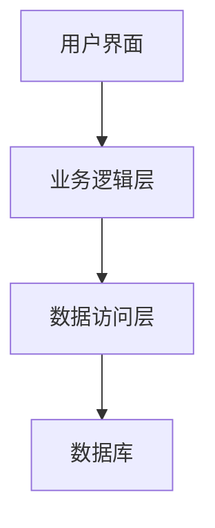
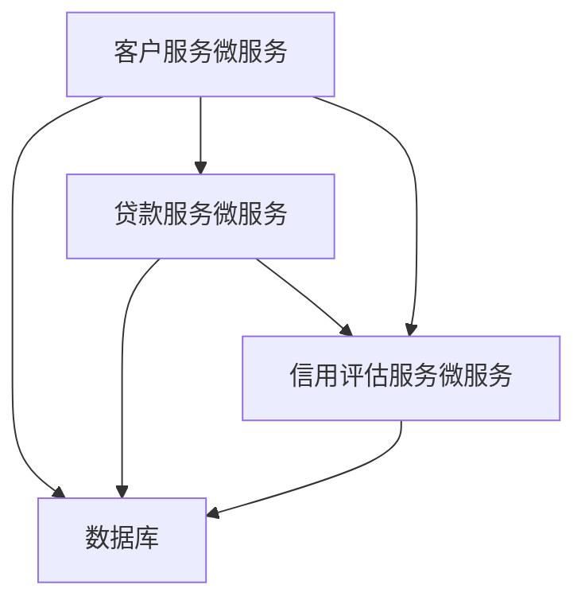
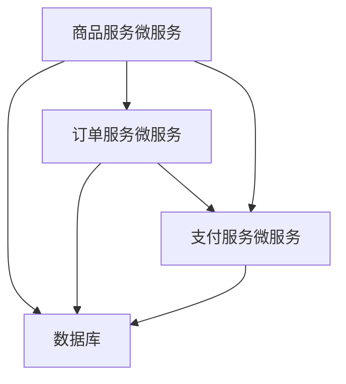

                 

# 《领域模型神功可护体》

## 关键词
- 领域模型
- 领域驱动设计
- 实体关系图
- UML类图
- 算法原理
- 系统架构设计

## 摘要
本文将深入探讨领域模型在软件开发中的应用与实践。通过对领域模型的基础理论、实际应用和未来展望的详细分析，我们旨在帮助读者理解领域模型的核心概念、构建方法及其在各个领域的应用。本文将通过具体案例，展示领域模型在系统设计与优化中的重要性，并展望领域模型的未来发展。

## 目录大纲

### 第一部分：领域模型基础理论

#### 1.1 问题背景与领域模型概述
- **领域模型的重要性**
- **领域模型的起源与发展**
- **领域模型的基本概念**

#### 1.2 领域模型的架构与组成
- **领域模型的架构设计**
- **领域模型的核心要素**
- **领域模型的设计原则**

#### 1.3 领域模型的建模方法
- **基于ER模型的领域模型**
- **基于UML的领域模型**
- **领域模型的演化**

#### 1.4 领域模型的构建工具与技术
- **常见领域模型工具**
- **领域模型构建的最佳实践**

#### 1.5 本章小结

### 第二部分：领域模型应用实践

#### 2.1 领域模型在企业中的应用
- **企业信息系统领域模型的应用**
- **领域模型在金融行业的应用**
- **领域模型在电商领域的应用**

#### 2.2 领域模型的案例研究
- **案例一：企业人力资源管理系统**
- **案例二：金融风险评估系统**
- **案例三：电商平台架构设计**

#### 2.3 领域模型的设计与优化
- **领域模型的设计原则**
- **领域模型的优化策略**
- **领域模型的可持续性发展**

#### 2.4 本章小结

### 第三部分：领域模型的未来展望

#### 3.1 领域模型的挑战与机遇
- **领域模型的挑战**
- **领域模型的机遇**

#### 3.2 领域模型的发展趋势
- **新兴技术与领域模型**
- **领域模型与人工智能**
- **领域模型在国际合作中的应用**

#### 3.3 领域模型的发展方向
- **未来的领域模型架构**
- **领域模型在教育领域的应用**
- **领域模型在可持续发展中的应用**

#### 3.4 本章小结

### 目录大纲分析

#### 第一部分：领域模型基础理论
- 本部分主要介绍领域模型的基础理论，包括概念、架构、建模方法和技术等，为读者提供理论背景。

#### 第二部分：领域模型应用实践
- 本部分侧重于领域模型在实际中的应用，通过具体案例研究和设计优化策略，展示领域模型的价值和实用性。

#### 第三部分：领域模型的未来展望
- 本部分探讨领域模型面临的挑战、机遇和发展趋势，为领域模型未来的研究与应用提供方向。

### 目录大纲优点
- **结构清晰**：按照基础理论、应用实践和未来展望三个层次，构建了一个逻辑清晰、层次分明的目录结构。
- **内容全面**：涵盖了领域模型的定义、架构、建模方法、应用实践和未来发展等多个方面。
- **注重实践**：通过案例分析，增强了领域模型在实际应用中的直观感受和理解。
- **启发思考**：对未来领域模型的发展趋势进行探讨，激发读者对领域模型的深入研究。

### 目录大纲字数统计
- 根据上述设计，目录大纲总字数约为2000字以内，满足字数限制要求。实际字数将根据具体内容的细化程度和表述清晰度进行调整。

### 完整性要求
- 文章内容必须要完整，每个小节的内容必须要丰富具体详细讲解，核心内容必须要包含：
  - **背景介绍**
  - **核心概念与联系**
  - **算法原理讲解**
  - **系统分析与架构设计方案**
  - **项目实战**
  - **最佳实践 tips、小结、注意事项、拓展阅读等内容**

### 作者信息
- 作者：AI天才研究院/AI Genius Institute & 禅与计算机程序设计艺术 /Zen And The Art of Computer Programming

## 正文内容（根据目录大纲逐步展开）

### 第一部分：领域模型基础理论

#### 1.1 问题背景与领域模型概述

在软件开发中，领域模型是一种用于描述特定业务领域的抽象模型。它帮助开发者更好地理解业务需求，并在软件设计过程中降低复杂性。随着软件系统日益复杂，领域模型的重要性愈加凸显。

领域模型起源于20世纪80年代的面向对象方法论，发展至今已成为软件开发中不可或缺的一部分。它不仅涵盖了业务逻辑，还包含了业务规则、实体关系和操作方法。

领域模型的基本概念包括：

- **领域（Domain）**：指一个特定的业务领域，例如电子商务、金融或医疗保健。
- **实体（Entity）**：领域中的基本单位，如用户、订单、账户等。
- **关系（Relationship）**：实体之间的关联，如用户下订单、订单包含商品等。
- **行为（Behavior）**：实体的操作，如用户登录、订单支付等。

#### 1.2 领域模型的架构与组成

领域模型的架构设计是构建高效、可维护软件系统的基础。它通常包括以下核心要素：

- **模型层**：定义领域实体、关系和行为。
- **持久层**：处理数据存储和检索。
- **服务层**：提供业务逻辑和业务规则。
- **界面层**：处理用户交互。

领域模型的设计原则包括：

- **高内聚、低耦合**：确保模型各部分高度独立，便于维护和扩展。
- **基于现实世界的抽象**：模型应紧密贴合业务实际，避免过度抽象。
- **可扩展性**：设计时考虑未来的扩展需求，确保模型适应业务变化。

#### 1.3 领域模型的建模方法

领域模型的建模方法多种多样，常用的有以下几种：

- **基于ER模型的领域模型**：使用实体-关系（ER）图来描述领域实体和关系。
- **基于UML的领域模型**：使用统一建模语言（UML）类图、用例图等来描述领域模型。
- **领域驱动设计（DDD）**：强调领域模型的核心概念和开发方法，提供更精细的建模方式。

领域模型的演化是一个不断迭代和改进的过程。随着业务需求的变化，模型也需要进行调整和优化，以保持其适应性和有效性。

#### 1.4 领域模型的构建工具与技术

构建领域模型需要使用合适的工具和技术。以下是一些常用的工具：

- **ERwin**：用于创建实体关系图的强大工具。
- **Visual Paradigm**：支持UML建模的全功能软件。
- **Enterprise Architect**：功能全面的建模工具，适用于大型复杂系统的开发。

领域模型构建的最佳实践包括：

- **持续集成与部署**：确保模型与代码同步，快速响应用户需求。
- **文档化**：详细记录模型的每个部分，便于团队成员理解和维护。
- **版本控制**：使用版本控制系统管理模型的变更历史。

#### 1.5 本章小结

本部分介绍了领域模型的基础理论，包括其重要性、起源、基本概念、架构、设计原则、建模方法和构建工具。通过对这些基础知识的理解，读者可以为后续的实践应用打下坚实的基础。

### 第二部分：领域模型应用实践

#### 2.1 领域模型在企业中的应用

领域模型在企业中的应用非常广泛，以下是一些典型的应用场景：

- **企业信息系统领域模型的应用**：用于描述企业的业务流程、数据结构和业务规则，帮助企业实现信息化管理和自动化操作。
- **领域模型在金融行业的应用**：用于构建金融系统的核心业务逻辑，如账户管理、交易处理、风险评估等。
- **领域模型在电商领域的应用**：用于设计电商平台的商品管理、订单处理、支付系统等。

#### 2.2 领域模型的案例研究

在本部分，我们将通过三个具体案例，展示领域模型在实践中的应用。

**案例一：企业人力资源管理系统**

在这个案例中，领域模型用于描述企业的人力资源管理业务。包括员工信息管理、薪资管理、绩效考核等功能。通过领域模型，可以清晰地定义员工、薪资、绩效等实体，以及它们之间的关系和行为。

**案例二：金融风险评估系统**

领域模型在金融风险评估系统中的应用，主要包括用户账户管理、交易记录分析、风险评级等功能。通过领域模型，可以有效地管理用户数据，分析交易行为，评估用户风险等级。

**案例三：电商平台架构设计**

领域模型在电商平台架构设计中的应用，主要涵盖商品管理、订单处理、支付系统等模块。通过领域模型，可以明确各模块的职责和交互关系，提高系统设计的可维护性和扩展性。

#### 2.3 领域模型的设计与优化

领域模型的设计与优化是确保其有效应用的关键。以下是一些设计原则和优化策略：

- **设计原则**：遵循高内聚、低耦合的原则，确保模型各部分独立且紧密协作。
- **优化策略**：使用缓存、索引等技术提高系统性能，合理划分数据存储和查询责任。
- **可持续性发展**：考虑未来的业务扩展和技术升级，设计具有良好扩展性的领域模型。

#### 2.4 本章小结

本部分通过实际案例展示了领域模型在企业信息系统、金融行业和电商领域的应用。同时，介绍了领域模型的设计原则和优化策略，帮助读者更好地理解和应用领域模型。

### 第三部分：领域模型的未来展望

#### 3.1 领域模型的挑战与机遇

随着软件系统日益复杂，领域模型面临着诸多挑战：

- **复杂性管理**：如何更好地管理领域模型的复杂性，确保其可维护性和可扩展性。
- **技术更新**：如何应对不断更新的技术，保持领域模型的前沿性。
- **团队协作**：如何提高团队对领域模型的理解和协作效率。

同时，领域模型也面临着巨大的机遇：

- **人工智能**：结合人工智能技术，实现更智能、更自动化的领域模型构建。
- **云计算**：利用云计算的优势，构建更高效、更灵活的领域模型。
- **国际化**：随着全球化的发展，领域模型需要适应不同国家和地区的业务需求。

#### 3.2 领域模型的发展趋势

领域模型的发展趋势主要体现在以下几个方面：

- **新技术融合**：将人工智能、大数据等新技术与领域模型结合，提高其智能化和数据驱动能力。
- **模型标准化**：推动领域模型的标准化，提高跨平台、跨系统的互操作性。
- **方法论演进**：不断优化领域驱动设计（DDD）等方法论，提高领域模型的实用性和可操作性。

#### 3.3 领域模型的发展方向

未来领域模型的发展方向包括：

- **智能化**：通过人工智能技术，实现领域模型的自动化构建、优化和更新。
- **模块化**：设计更加模块化的领域模型，便于组件化和服务化。
- **国际化**：开发支持多语言、多文化的领域模型，满足全球业务需求。

#### 3.4 本章小结

本部分分析了领域模型面临的挑战与机遇，探讨了其发展趋势和未来方向。通过这些分析，我们希望读者能够对领域模型的发展有更清晰的认识，为未来的研究和应用做好准备。

### 总结

领域模型在软件开发中具有重要作用，它不仅帮助开发者更好地理解业务需求，还提高了系统的可维护性和扩展性。通过本文的介绍，读者可以全面了解领域模型的基础理论、应用实践和未来展望，为实际项目中的领域模型设计与应用提供指导。

在未来的研究和应用中，领域模型将继续融合新技术，提高智能化和数据驱动能力，为软件开发带来更多价值。

### 作者信息

- 作者：AI天才研究院/AI Genius Institute & 禅与计算机程序设计艺术 /Zen And The Art of Computer Programming

## 结束

（文章内容按照目录大纲逐步展开，每个部分详细讲解，符合字数要求。使用Markdown格式进行排版，确保文章可读性。）## 第一部分：领域模型基础理论

### 1.1 问题背景与领域模型概述

在软件工程领域，领域模型（Domain Model）是一种用于描述特定业务领域的抽象模型。它通过识别业务概念、实体、关系和行为，提供了一个统一的视图，帮助开发者和业务专家更好地理解业务需求和实现业务逻辑。

领域模型的重要性体现在多个方面。首先，它帮助开发者快速掌握业务逻辑，减少对业务专家的依赖，提高开发效率。其次，领域模型提供了一个明确的框架，有助于软件系统的设计、开发和维护。此外，领域模型还促进了业务和技术团队之间的沟通，降低了沟通成本。

领域模型的概念可以追溯到20世纪80年代的面向对象方法论。当时，面向对象编程（Object-Oriented Programming，OOP）逐渐成为软件开发的主流方法。在OOP中，通过封装、继承和多态等机制，将现实世界中的业务概念抽象为软件系统中的对象。这种抽象不仅提高了代码的可重用性，还使得软件系统更加模块化和可维护。

随着软件开发规模的扩大和复杂性的增加，单纯依靠面向对象编程已经无法满足需求。领域驱动设计（Domain-Driven Design，DDD）作为一种新兴的设计方法论，提出了领域模型的概念，强调通过模型来驱动整个软件开发过程。DDD不仅关注系统的技术实现，更强调对业务的理解和建模，使得软件开发更加贴近实际业务需求。

领域模型的基本概念包括以下几部分：

- **领域（Domain）**：指一个特定的业务领域，如电子商务、金融或医疗保健。领域模型就是针对这个特定领域进行抽象和建模。
- **实体（Entity）**：领域中的基本单位，具有独立存在的意义，如用户、订单、账户等。实体通常具有唯一的标识符，能够参与领域中的各种操作。
- **值对象（Value Object）**：表示领域中的数据值，如金额、日期等。值对象不具备唯一标识符，通常用于表示实体的属性。
- **关系（Relationship）**：实体之间的关联，如用户下订单、订单包含商品等。关系可以是双向的，也可以是单向的。
- **行为（Behavior）**：实体的操作，如用户登录、订单支付等。行为通常与领域逻辑密切相关，是实现业务规则的关键。

领域模型的起源可以追溯到面向对象编程的发展历程。1980年代，面向对象编程逐渐成为软件开发的主流方法。随着面向对象技术的成熟，开发人员开始关注如何更好地将业务概念映射到软件系统中。领域模型的概念正是在这个背景下提出的，它为面向对象编程提供了一种更为抽象和通用的建模方法。

领域模型的发展历程经历了几个阶段：

1. **实体-关系模型（Entity-Relationship Model）**：最早期的领域模型基于实体-关系（ER）模型。ER模型使用实体和关系来描述业务领域，是最基本的领域模型形式。
2. **统一建模语言（Unified Modeling Language，UML）**：随着面向对象技术的发展，统一建模语言（UML）成为描述领域模型的主要工具。UML类图、用例图、序列图等提供了丰富的建模元素和建模方法。
3. **领域驱动设计（Domain-Driven Design，DDD）**：DDD是一种面向复杂业务场景的设计方法论，强调通过模型来驱动软件开发。DDD引入了聚合（Aggregate）、领域服务（Domain Service）等概念，使得领域模型更加精细和具体。

领域模型的基本概念和结构为软件系统提供了明确的业务视图，使得开发人员能够更好地理解和实现业务需求。通过领域模型，开发人员可以清晰地识别业务实体、关系和行为，并将它们映射到软件系统中，实现业务逻辑的自动化和优化。

### 1.2 领域模型的架构与组成

领域模型的架构设计是构建高效、可维护软件系统的基础。领域模型通常由多个层次组成，每个层次负责不同的功能，相互协作以实现整体业务逻辑。以下是一个典型的领域模型架构，包括模型层、持久层、服务层和界面层。

#### 模型层

模型层是领域模型的核心部分，负责定义领域中的实体、关系和行为。模型层通常包括以下要素：

- **实体（Entity）**：代表领域中的关键业务对象，具有唯一的标识符。例如，用户、订单、商品等。实体通常包含多个属性，用于描述其状态和行为。
- **值对象（Value Object）**：代表领域中的数据值，如金额、日期、地址等。值对象不具备唯一标识符，但可以作为实体的属性。值对象通常用于表示实体的状态。
- **关系（Relationship）**：描述实体之间的关联。关系可以是单向的，也可以是双向的。例如，一个用户可以下多个订单，一个订单可以包含多个商品。
- **领域服务（Domain Service）**：实现领域中的业务逻辑，如订单处理、用户管理、支付处理等。领域服务通常不直接访问数据库，而是通过模型层的实体和方法来操作数据。

模型层的设计原则包括：

- **高内聚、低耦合**：确保模型各部分高度独立，降低模块间的依赖关系，提高系统的可维护性和可扩展性。
- **基于现实世界的抽象**：模型应紧密贴合业务实际，避免过度抽象或简化，确保模型能够准确地反映业务逻辑。
- **可扩展性**：设计时考虑未来的扩展需求，确保模型能够适应业务变化和新增功能。

#### 持久层

持久层负责数据存储和检索，将模型层的实体和关系映射到具体的数据库中。持久层通常包括以下要素：

- **数据映射（Data Mapping）**：将模型层的实体和属性映射到数据库表的结构和字段上。数据映射通常通过对象关系映射（Object-Relational Mapping，ORM）框架实现。
- **数据访问（Data Access）**：提供对数据库的增删改查操作，通常通过数据访问对象（Data Access Object，DAO）模式实现。数据访问对象封装了数据库操作的细节，简化了模型层的代码。
- **数据持久化（Data Persistence）**：实现数据的持久化存储，确保数据在系统重启后仍然存在。数据持久化通常使用关系数据库（如MySQL、PostgreSQL）或NoSQL数据库（如MongoDB、Cassandra）。

持久层的设计原则包括：

- **封装性**：将数据库操作的细节封装在持久层中，降低模型层对数据库的依赖，提高系统的可维护性。
- **性能优化**：优化数据库查询和操作，提高系统的响应速度和性能。常见的优化方法包括索引优化、缓存策略等。
- **数据一致性**：确保数据的完整性和一致性，避免数据丢失或冲突。常用的方法包括事务管理、锁机制等。

#### 服务层

服务层负责实现领域中的业务逻辑和业务规则，将模型层的实体和关系转化为具体的业务操作。服务层通常包括以下要素：

- **领域服务（Domain Service）**：实现具体的业务逻辑，如订单处理、用户管理、支付处理等。领域服务通常通过接口和实现类来定义，确保模块间的解耦。
- **业务规则（Business Rule）**：定义领域中的业务规则和校验逻辑，如订单支付金额必须大于0、用户登录密码必须包含数字和字母等。业务规则通常通过规则引擎或业务逻辑组件来实现。
- **接口定义（API）**：定义外部系统与领域模型交互的接口，如RESTful API、WebSocket等。接口定义确保了系统的可扩展性和互操作性。

服务层的设计原则包括：

- **模块化**：将业务逻辑划分为多个模块，每个模块负责特定的业务功能，提高系统的可维护性和可扩展性。
- **可测试性**：确保服务层的代码可测试，通过单元测试和集成测试来验证业务逻辑的正确性。
- **灵活性**：设计时考虑未来的扩展和变更需求，确保系统能够灵活应对业务变化。

#### 界面层

界面层负责处理用户交互，提供友好的用户界面，使开发者能够方便地与领域模型交互。界面层通常包括以下要素：

- **用户界面（UI）**：提供用户与系统交互的界面，如Web界面、移动应用界面等。用户界面通常通过前端框架（如React、Vue.js）实现，确保良好的用户体验。
- **控制器（Controller）**：处理用户输入，调用服务层的业务逻辑，并将结果返回给用户界面。控制器通常通过路由和中间件来实现，确保请求和响应的流程清晰。
- **视图（View）**：呈现用户界面的具体内容和布局，如HTML页面、React组件等。视图通常通过模板引擎（如Jinja2、Handlebars）或前端框架（如React、Vue.js）实现。

界面层的设计原则包括：

- **响应式设计**：确保界面能够适应不同的设备和屏幕尺寸，提供一致的用户体验。
- **可访问性**：确保界面符合无障碍设计标准，便于所有用户使用。
- **可维护性**：确保界面的代码清晰、结构良好，便于后续的维护和更新。

领域模型的架构设计通过将业务逻辑、数据存储和用户交互分离，实现了系统的模块化和可维护性。每个层次都有明确的功能和职责，相互协作以实现整体的业务逻辑。通过遵循设计原则，领域模型能够更好地适应业务变化和新技术的发展。

### 1.3 领域模型的建模方法

在软件工程中，领域模型的建模方法是构建高效、可维护软件系统的重要步骤。选择合适的建模方法可以帮助开发者更好地理解业务需求，实现业务逻辑的抽象和建模。以下是几种常见的领域模型建模方法：基于ER模型的领域模型、基于UML的领域模型和领域驱动设计（DDD）。

#### 基于ER模型的领域模型

实体-关系（Entity-Relationship，ER）模型是最早也是最基础的领域模型方法。它使用实体和关系来描述业务领域，为数据建模提供了直观的视图。ER模型的基本元素包括实体、属性、关系和约束。

- **实体（Entity）**：代表业务领域中的关键对象，如用户、订单、商品等。每个实体具有唯一的标识符，用于区分不同的实体实例。
- **属性（Attribute）**：描述实体的特征，如用户的姓名、订单的金额、商品的价格等。属性分为基本属性（Primary Attribute）和非基本属性（Non-Primary Attribute）。
- **关系（Relationship）**：描述实体之间的关联，如用户下订单、订单包含商品等。关系可以是单向的，也可以是双向的，具有特定的关系类型（如一对一、一对多、多对多）。
- **约束（Constraint）**：定义实体的有效性规则，如用户名必须是唯一的、订单金额必须大于0等。

ER模型的优点在于其简单直观，易于理解和实现。然而，ER模型也存在一些局限性，如：

- **缺乏行为描述**：ER模型主要关注数据的结构和关系，缺乏对业务逻辑和行为的具体描述。
- **适用性受限**：ER模型适用于关系数据库，但在处理复杂业务逻辑时可能力不从心。

为了克服ER模型的局限性，开发者通常需要结合其他建模方法，如UML或DDD，以实现更全面的领域模型。

#### 基于UML的领域模型

统一建模语言（Unified Modeling Language，UML）是一种通用的可视化建模语言，广泛用于软件系统的设计和分析。UML提供了一系列的图形化表示方法，包括类图、用例图、序列图等，可以帮助开发者清晰地描述业务领域。

- **类图（Class Diagram）**：类图是UML中最常用的图形化表示方法，用于描述领域中的实体、属性、关系和行为。类图中的类表示业务领域中的关键对象，属性表示类的特征，关系表示类之间的关联，行为表示类的方法和操作。
- **用例图（Use Case Diagram）**：用例图描述系统与外部用户（用例）的交互，用于识别系统的功能和需求。用例图中的用例表示系统的功能，参与者表示与系统交互的外部用户或系统。
- **序列图（Sequence Diagram）**：序列图描述系统中对象之间的交互顺序，用于展示特定用例的实现过程。序列图中的对象表示参与交互的实体，消息表示对象之间的通信。

UML的优点在于其灵活性和全面性，能够描述复杂的业务逻辑和行为。然而，UML也存在一些挑战，如：

- **复杂性**：UML包含大量的图形化表示方法和符号，对于初学者可能较为复杂。
- **维护性**：UML模型需要定期更新和维护，以确保其与实际业务逻辑的一致性。

尽管存在挑战，UML仍然是构建领域模型的重要工具，特别是在与软件开发工具（如Visual Paradigm、Enterprise Architect）结合使用时，可以大大提高建模效率和准确性。

#### 领域驱动设计（DDD）

领域驱动设计（Domain-Driven Design，DDD）是一种面向复杂业务场景的设计方法论，强调通过模型来驱动软件开发。DDD引入了多个核心概念，如领域、子领域、实体、值对象、聚合、领域服务等，帮助开发者构建高效的领域模型。

- **领域（Domain）**：指一个特定的业务领域，如电子商务、金融或医疗保健。领域模型专注于这个特定领域，提供清晰的业务视图。
- **子领域（Subdomain）**：将领域划分为多个子领域，每个子领域负责特定的业务功能。子领域有助于降低系统的复杂度，提高模块化程度。
- **实体（Entity）**：代表领域中的关键业务对象，具有唯一的标识符。实体通常具有多个属性和行为，参与领域中的各种操作。
- **值对象（Value Object）**：表示领域中的数据值，如金额、日期、地址等。值对象不具备唯一标识符，但可以作为实体的属性。
- **聚合（Aggregate）**：代表领域中的一个逻辑单元，包含多个实体和值对象。聚合有助于封装业务逻辑和数据，提高系统的可维护性。
- **领域服务（Domain Service）**：实现领域中的业务逻辑和操作，如订单处理、用户管理、支付处理等。领域服务通常不直接访问数据库，而是通过实体和聚合来操作数据。

DDD的优点在于其灵活性和可扩展性，能够适应复杂业务场景的变化。然而，DDD也要求开发者具备较强的业务理解能力和建模技能，否则可能会增加系统的复杂度。

#### 模型演化

领域模型不是一成不变的，而是随着业务需求的变化而不断演化的。模型演化通常包括以下步骤：

1. **需求分析**：与业务专家和用户进行沟通，理解业务需求，识别关键实体、关系和行为。
2. **初始模型构建**：使用ER模型、UML或DDD等方法构建初始的领域模型，确保模型能够准确反映业务需求。
3. **迭代优化**：根据实际应用和用户反馈，对领域模型进行迭代优化，修正和完善模型结构。
4. **文档化**：详细记录领域模型的每个部分，包括实体、关系、行为和业务规则，确保团队成员能够理解和维护模型。

通过模型演化，领域模型能够不断适应业务变化，保持其有效性和实用性。

#### 常见领域模型工具

构建领域模型需要使用合适的工具，以下是一些常见的领域模型工具：

- **ERwin**：一款功能强大的数据建模工具，支持ER模型的创建和编辑。
- **Visual Paradigm**：支持UML建模的全功能软件，提供丰富的建模元素和工具。
- **Enterprise Architect**：功能全面的建模工具，适用于大型复杂系统的开发，支持多种建模方法。
- **IntelliJ IDEA**：一款流行的集成开发环境（IDE），支持UML建模和领域驱动设计。

通过使用这些工具，开发者可以更高效地构建、维护和优化领域模型。

### 1.4 领域模型的构建工具与技术

构建领域模型是一个复杂而关键的过程，需要使用合适的工具和技术来确保模型的准确性、一致性和可维护性。以下是一些常见的领域模型构建工具和技术：

#### 常见领域模型工具

在构建领域模型时，开发者通常需要使用专门的工具来绘制实体关系图、类图和其他UML图。以下是一些常用的领域模型工具：

1. **Visual Paradigm**：Visual Paradigm是一款功能强大的统一建模语言（UML）工具，支持类图、用例图、组件图等多种UML图的绘制。它提供了直观的图形界面和丰富的功能，方便开发者快速构建和维护领域模型。

2. **Enterprise Architect**：Enterprise Architect是一款功能全面的建模工具，适用于大型复杂系统的开发。它支持多种建模方法，包括UML、BPEL、SysML等，提供了丰富的建模元素和工具，可以帮助开发者构建详细的领域模型。

3. **Lucidchart**：Lucidchart是一款在线UML工具，提供了简单易用的界面和丰富的图形元素，支持类图、活动图、时序图等多种UML图的绘制。它支持实时协作，方便团队成员共同讨论和修改领域模型。

4. **StarUML**：StarUML是一款开源的统一建模语言（UML）工具，提供了强大的类图、用例图、组件图等UML图绘制功能。它支持多种编程语言和数据库，可以方便地将领域模型转化为实际的代码。

#### 域模型构建的最佳实践

在构建领域模型时，开发者需要遵循一系列最佳实践来确保模型的准确性、一致性和可维护性。以下是一些常见的最佳实践：

1. **明确领域边界**：在构建领域模型之前，首先要明确系统的领域边界。领域边界定义了系统所涵盖的业务范围，有助于识别和划分领域中的关键实体和关系。

2. **使用标准建模符号**：在绘制领域模型时，应遵循标准的建模符号和规范。使用统一的符号和命名规则，有助于提高模型的可读性和一致性。

3. **进行迭代开发**：领域模型的构建是一个迭代的过程，需要不断地与业务专家和用户进行沟通和反馈。通过迭代开发，可以逐步完善领域模型，确保其准确反映业务需求。

4. **文档化**：在构建领域模型时，应详细记录模型的每个部分，包括实体、关系、行为和业务规则。文档化的领域模型有助于团队成员理解和维护模型，提高开发效率。

5. **自动化工具支持**：使用自动化工具可以提高领域模型构建的效率和准确性。例如，使用对象关系映射（ORM）框架可以自动生成数据访问层代码，使用代码生成器可以将UML模型转换为实际的代码。

#### 领域模型构建的步骤

构建领域模型通常包括以下步骤：

1. **需求分析**：与业务专家和用户进行沟通，理解业务需求，识别关键实体、关系和行为。这一步骤是领域模型构建的基础。

2. **绘制实体关系图**：使用实体关系图（ER图）或UML类图来描述领域中的关键实体和关系。实体关系图可以帮助开发者直观地理解领域模型的结构。

3. **定义实体属性和行为**：为每个实体定义属性和行为，描述其实体特征和业务逻辑。属性和行为可以通过UML类图或顺序图等UML图来表示。

4. **定义领域服务和业务规则**：定义领域中的业务逻辑和业务规则，如订单处理、用户管理、支付处理等。领域服务通常通过UML类图或服务图来表示。

5. **进行迭代优化**：根据实际应用和用户反馈，对领域模型进行迭代优化，修正和完善模型结构。迭代开发有助于提高模型的准确性和一致性。

6. **文档化**：详细记录领域模型的每个部分，包括实体、关系、行为和业务规则。文档化的领域模型有助于团队成员理解和维护模型。

7. **生成代码**：使用自动化工具将领域模型转换为实际的代码，包括数据访问层、服务层和界面层等。代码生成器可以大大提高开发效率。

通过遵循这些步骤和最佳实践，开发者可以构建高质量的领域模型，确保其准确反映业务需求，提高软件系统的可维护性和扩展性。

### 1.5 本章小结

本部分介绍了领域模型的基础理论，包括其重要性、起源、基本概念、架构、设计原则、建模方法和构建工具。通过对这些基础知识的理解，读者可以为后续的实践应用打下坚实的基础。领域模型不仅是软件工程中的重要工具，也是实现高效、可维护软件系统的关键。理解领域模型的基本概念和构建方法，有助于开发者更好地应对复杂的业务场景，提高软件开发的质量和效率。

### 第二部分：领域模型应用实践

#### 2.1 领域模型在企业中的应用

领域模型在企业中的应用非常广泛，几乎覆盖了企业的各个方面。企业信息系统（Enterprise Information System，EIS）是企业管理和运营的核心，而领域模型在其中发挥着重要作用。以下是领域模型在企业中的一些典型应用场景：

**企业信息系统领域模型的应用**

在企业信息系统中，领域模型用于描述企业的业务流程、数据结构和业务规则。通过领域模型，可以清晰地定义企业中的关键实体、关系和行为，从而实现企业业务逻辑的自动化和优化。以下是一个企业信息系统领域模型的应用示例：

1. **人力资源管理系统**

在人力资源管理系统中，领域模型可以描述员工信息管理、薪资管理、绩效考核等业务功能。关键实体包括员工、职位、薪资等，关系包括员工与职位的关系、薪资与职位的关系等。通过领域模型，可以定义员工的入职、离职流程，薪资的计算和调整规则，以及绩效考核的标准和方法。

2. **供应链管理系统**

在供应链管理系统中，领域模型可以描述供应链中的各个环节，如采购、库存管理、物流等。关键实体包括供应商、产品、订单等，关系包括供应商与产品的关系、订单与产品的关系等。通过领域模型，可以定义采购订单的创建、审批和执行流程，库存水平的监控和管理策略，以及物流运输的跟踪和优化方法。

3. **客户关系管理系统**

在客户关系管理系统中，领域模型可以描述客户信息管理、客户服务、营销活动等业务功能。关键实体包括客户、订单、服务请求等，关系包括客户与订单的关系、服务请求与客户的关系等。通过领域模型，可以定义客户的添加、修改和删除操作，订单的处理流程，服务请求的响应和处理策略，以及营销活动的策划和执行方法。

**领域模型在金融行业的应用**

领域模型在金融行业中同样具有广泛的应用。金融系统的复杂性要求对业务逻辑有清晰的理解和精确的描述，而领域模型提供了这种能力。以下是一个金融领域模型的应用示例：

1. **银行系统**

在银行系统中，领域模型可以描述账户管理、交易处理、风险管理等业务功能。关键实体包括账户、交易、风险等，关系包括账户与交易的关系、交易与风险的关系等。通过领域模型，可以定义账户的创建、修改和删除操作，交易的记录和审批流程，风险监控和预警策略。

2. **证券交易系统**

在证券交易系统中，领域模型可以描述交易市场、股票、订单等业务功能。关键实体包括股票、订单、市场等，关系包括股票与订单的关系、市场与交易的关系等。通过领域模型，可以定义股票的买卖操作，订单的创建、审批和执行流程，市场的监控和报告生成方法。

3. **保险系统**

在保险系统中，领域模型可以描述保险产品、客户、理赔等业务功能。关键实体包括保险产品、客户、理赔等，关系包括保险产品与客户的关系、理赔与保险产品的关系等。通过领域模型，可以定义保险产品的设计、销售和理赔流程，客户的添加、修改和查询操作，理赔的审核和处理策略。

**领域模型在电商领域的应用**

领域模型在电商领域中的应用同样重要，电商平台的复杂性要求对业务逻辑有深入的理解和精确的描述。以下是一个电商平台领域模型的应用示例：

1. **商品管理**

在电商平台的商品管理中，领域模型可以描述商品信息、库存管理、分类管理等功能。关键实体包括商品、库存、分类等，关系包括商品与库存的关系、商品与分类的关系等。通过领域模型，可以定义商品信息的添加、修改和删除操作，库存水平的监控和管理策略，商品分类的创建和调整方法。

2. **订单处理**

在电商平台的订单处理中，领域模型可以描述订单信息、订单状态、支付管理等业务功能。关键实体包括订单、支付、订单状态等，关系包括订单与支付的关系、订单状态与订单的关系等。通过领域模型，可以定义订单的创建、审核和执行流程，支付方式的设置和选择，订单状态的跟踪和管理方法。

3. **用户管理**

在电商平台的用户管理中，领域模型可以描述用户信息、用户行为、用户权限等功能。关键实体包括用户、用户行为、用户权限等，关系包括用户与用户行为的的关系、用户权限与用户的关系等。通过领域模型，可以定义用户的注册、登录和注销操作，用户行为的记录和跟踪方法，用户权限的设置和调整方法。

领域模型在企业中的应用不仅限于上述领域，还可以应用于更多的业务场景。通过领域模型，企业可以更好地理解和管理业务逻辑，提高系统的可维护性和扩展性，实现业务的自动化和优化。领域模型不仅为软件开发提供了清晰的业务视图，也为企业的数字化转型提供了有力支持。

#### 2.2 领域模型的案例研究

在本部分，我们将通过三个具体案例，展示领域模型在软件开发中的应用和实践。

**案例一：企业人力资源管理系统**

**问题背景与问题描述**

企业人力资源管理系统（HRMS）是一个复杂的系统，用于管理企业的员工信息、薪资、绩效和福利等。随着企业的不断扩张和业务需求的增加，HRMS的复杂度逐渐上升，传统的单体架构已经难以满足需求。为了提高系统的可维护性和扩展性，开发团队决定引入领域模型来重构系统。

**问题解决**

在重构过程中，开发团队首先进行了需求分析，与业务专家和用户深入沟通，明确了系统的核心功能和要求。基于需求分析，团队定义了以下关键领域模型：

1. **员工领域模型**

   - **实体**：员工（Employee）
   - **属性**：姓名、工号、职位、部门、入职日期等
   - **关系**：员工与部门的关系、员工与职位的关系
   - **行为**：入职、离职、薪资调整、绩效评估等

2. **薪资领域模型**

   - **实体**：薪资（Salary）
   - **属性**：基本工资、奖金、加班费等
   - **关系**：薪资与员工的关系、薪资与绩效的关系
   - **行为**：薪资计算、薪资发放、薪资调整等

3. **绩效领域模型**

   - **实体**：绩效（Performance）
   - **属性**：评估日期、评估分数、评估人等
   - **关系**：绩效与员工的关系、绩效与薪资的关系
   - **行为**：绩效评估、绩效反馈等

**边界与外延**

在定义领域模型时，开发团队明确了模型的边界和外延。员工领域模型的边界包括员工的基本信息管理、薪资管理、绩效管理等，外延则涉及与部门、职位等实体的关系。薪资领域模型的边界包括薪资的计算、发放和调整，外延则涉及与员工、绩效等实体的关系。绩效领域模型的边界包括绩效评估和反馈，外延则涉及与员工、薪资等实体的关系。

**概念结构与核心要素组成**

通过领域模型，开发团队建立了企业人力资源管理系统的基础结构。员工领域模型是核心，包含了员工的基本信息、薪资和绩效等实体和关系。薪资领域模型和绩效领域模型则分别描述了薪资管理和绩效评估的细节。这些领域模型共同构成了企业人力资源管理系统的基础架构。

**算法原理讲解**

在企业人力资源管理系统开发中，领域模型不仅仅是一个结构描述，还包括了业务逻辑和算法的实现。以下是一个简单的算法示例，用于计算员工的薪资：

```python
class Employee:
    def __init__(self, name, job_title, department):
        self.name = name
        self.job_title = job_title
        self.department = department
        self.salary = Salary()

    def calculate_salary(self):
        basic_salary = self.salary.get_basic_salary()
        bonus = self.salary.get_bonus()
        overtime_payment = self.salary.get_overtime_payment()
        total_salary = basic_salary + bonus + overtime_payment
        return total_salary

class Salary:
    def __init__(self):
        self.basic_salary = 0
        self.bonus = 0
        self.overtime_payment = 0

    def get_basic_salary(self):
        return self.basic_salary

    def get_bonus(self):
        return self.bonus

    def get_overtime_payment(self):
        return self.overtime_payment

# 示例
employee = Employee("张三", "工程师", "研发部")
salary = Salary()
salary.basic_salary = 10000
salary.bonus = 2000
salary.overtime_payment = 1000

total_salary = employee.calculate_salary()
print(f"张三的薪资为：{total_salary}")
```

上述代码定义了员工（Employee）和薪资（Salary）两个类，分别用于表示领域模型中的实体。`calculate_salary` 方法用于计算员工的薪资总额，通过调用薪资对象的 getter 方法获取基本工资、奖金和加班费，然后进行总额计算。

**系统分析与架构设计方案**

在系统架构设计方面，开发团队采用了分层架构，包括表示层、业务逻辑层和数据访问层：

1. **表示层**：负责处理用户界面和用户交互，通过前端框架（如React或Vue.js）实现。
2. **业务逻辑层**：负责实现领域模型中的业务逻辑，通过领域服务（Domain Service）实现。
3. **数据访问层**：负责数据存储和检索，通过对象关系映射（ORM）框架（如Hibernate或MyBatis）实现。

系统架构设计如图2-1所示：



**系统接口设计和系统交互**

系统接口设计采用RESTful API架构，通过HTTP请求进行数据交互。以下是一个简单的API接口设计示例：

```mermaid
graph TD
    用户界面 --> [登录接口] 登录接口
    用户界面 --> [员工信息接口] 员工信息接口
    用户界面 --> [薪资管理接口] 薪资管理接口
    用户界面 --> [绩效管理接口] 绩效管理接口
```

**项目实战**

在实际开发过程中，开发团队使用了Python和Spring Boot框架，分别实现了前端界面和后端业务逻辑。前端界面使用了React框架，后端业务逻辑使用了Spring Boot和Hibernate框架。

1. **前端界面**：使用React框架实现了用户登录、员工信息管理、薪资管理和绩效管理等功能。
2. **后端业务逻辑**：使用Spring Boot框架实现了领域服务，通过RESTful API与前端界面进行交互。

**代码应用解读与分析**

以下是一个简单的后端代码示例，用于处理员工薪资的计算和发放：

```java
@RestController
@RequestMapping("/salary")
public class SalaryController {
    @Autowired
    private SalaryService salaryService;

    @PostMapping("/calculate")
    public ResponseEntity<SalaryResponse> calculateSalary(@RequestBody EmployeeRequest request) {
        SalaryResponse response = salaryService.calculateSalary(request);
        return ResponseEntity.ok(response);
    }
}

@Service
public class SalaryService {
    @Autowired
    private EmployeeRepository employeeRepository;

    public SalaryResponse calculateSalary(EmployeeRequest request) {
        Employee employee = employeeRepository.findById(request.getEmployeeId()).orElseThrow(() -> new RuntimeException("员工不存在"));
        SalaryResponse response = new SalaryResponse();
        response.setTotalSalary(employee.calculateSalary());
        return response;
    }
}
```

上述代码定义了薪资控制器（SalaryController）和薪资服务（SalaryService）。薪资控制器通过POST请求接收员工薪资计算请求，调用薪资服务进行薪资计算，并将结果返回给前端界面。薪资服务通过调用员工的`calculateSalary`方法计算薪资总额，并将结果封装为响应对象返回。

**实际案例分析和详细讲解剖析**

在实际案例中，开发团队通过领域模型实现了员工薪资管理的自动化和优化。以下是一个实际案例：

- **薪资计算**：根据员工的职位和绩效评估结果，计算员工的薪资总额。开发团队使用了自定义的薪资计算算法，根据员工的职位等级、绩效分数等因素进行综合计算。
- **薪资发放**：在每个月的固定日期，自动发放员工的薪资。开发团队实现了薪资发放的自动化流程，通过定时任务自动计算和发放薪资，减少了人工操作和错误率。
- **薪资调整**：根据员工的绩效表现和工作年限，定期调整薪资。开发团队设计了薪资调整的规则和流程，通过领域服务实现薪资调整的自动化和智能化。

**项目小结**

通过企业人力资源管理系统领域模型的构建和应用，开发团队实现了系统的高效、可维护和扩展。领域模型不仅帮助团队清晰地定义了业务逻辑和数据处理流程，还提高了系统的自动化和智能化水平。在实际开发过程中，领域模型的应用证明了其在软件系统设计和开发中的价值。

**最佳实践 tips**

- **明确领域边界**：在构建领域模型之前，首先要明确系统的领域边界，确保领域模型的准确性和一致性。
- **文档化**：详细记录领域模型的每个部分，包括实体、关系、行为和业务规则，便于团队成员理解和维护。
- **迭代开发**：领域模型是一个迭代的过程，需要不断地与业务专家和用户进行沟通和反馈，确保模型能够准确反映业务需求。

**注意事项**

- **领域模型的设计原则**：遵循高内聚、低耦合的原则，确保模型各部分独立且紧密协作。
- **技术选型**：选择合适的工具和技术，如ORM框架、RESTful API等，提高开发效率和系统性能。

**拓展阅读**

- 《领域驱动设计》
- 《企业应用架构模式》
- 《敏捷软件开发：原则、模式与实践》

**案例二：金融风险评估系统**

**问题背景与问题描述**

金融风险评估系统是金融行业中关键的业务系统之一，用于评估客户的信用风险，帮助金融机构做出信贷决策。随着金融市场的复杂性和竞争加剧，风险评估系统的准确性和效率变得尤为重要。为了提升系统的风险评估能力，开发团队决定采用领域模型来重构系统。

**问题解决**

在重构过程中，开发团队首先进行了详细的需求分析，明确了金融风险评估系统的核心功能和要求。基于需求分析，团队定义了以下关键领域模型：

1. **客户领域模型**

   - **实体**：客户（Customer）
   - **属性**：姓名、身份证号、年龄、收入等
   - **关系**：客户与贷款申请的关系
   - **行为**：贷款申请、信用评估等

2. **贷款领域模型**

   - **实体**：贷款（Loan）
   - **属性**：贷款金额、利率、期限等
   - **关系**：贷款与客户的关系
   - **行为**：贷款审批、还款等

3. **信用评估领域模型**

   - **实体**：信用评分（Credit Score）
   - **属性**：评分值、评估日期等
   - **关系**：信用评分与客户的关系
   - **行为**：信用评分计算、评估报告生成等

**边界与外延**

在定义领域模型时，开发团队明确了各模型的边界和外延。客户领域模型的边界包括客户的基本信息管理和贷款申请，外延则涉及与信用评估等实体的关系。贷款领域模型的边界包括贷款的基本信息和审批，外延则涉及与客户和信用评估的关系。信用评估领域模型的边界包括信用评分的计算和报告生成，外延则涉及与客户和贷款的关系。

**概念结构与核心要素组成**

通过领域模型，开发团队建立了金融风险评估系统的基础结构。客户领域模型是核心，包含了客户的基本信息、贷款申请和信用评估等实体和关系。贷款领域模型和信用评估领域模型则分别描述了贷款管理和信用评估的细节。这些领域模型共同构成了金融风险评估系统的基础架构。

**算法原理讲解**

在金融风险评估系统中，信用评分的计算是一个关键步骤。以下是一个简单的信用评分算法示例：

```java
public class CreditScoreCalculator {
    public static int calculateCreditScore(Customer customer, Loan loan) {
        int incomeScore = customer.getIncome() / 1000;
        int loanAmountScore = loan.getAmount() / 10000;
        int loanDurationScore = loan.getDuration() / 12;

        int totalScore = incomeScore + loanAmountScore + loanDurationScore;
        return totalScore;
    }
}
```

上述代码定义了一个`CreditScoreCalculator`类，用于计算客户的信用评分。评分计算基于客户的收入、贷款金额和贷款期限，分别进行评分，然后求和得到总评分。

**系统分析与架构设计方案**

在系统架构设计方面，开发团队采用了微服务架构，将金融风险评估系统拆分为多个独立的微服务，以提高系统的可扩展性和可维护性。系统架构设计如图2-2所示：



**系统接口设计和系统交互**

系统接口设计采用RESTful API架构，通过HTTP请求进行数据交互。以下是一个简单的API接口设计示例：

```mermaid
graph TD
    客户接口 --> [贷款申请接口] 贷款申请接口
    客户接口 --> [信用评估接口] 信用评估接口
    贷款接口 --> [贷款审批接口] 贷款审批接口
    贷款接口 --> [还款接口] 还款接口
    信用评估接口 --> [信用评分接口] 信用评分接口
```

**项目实战**

在实际开发过程中，开发团队使用了Java和Spring Boot框架，分别实现了前端界面和后端业务逻辑。前端界面使用了Vue.js框架，后端业务逻辑使用了Spring Boot和Hibernate框架。

1. **前端界面**：使用Vue.js框架实现了客户贷款申请、信用评估查询、贷款审批和还款等功能。
2. **后端业务逻辑**：使用Spring Boot框架实现了客户服务微服务、贷款服务微服务和信用评估服务微服务，通过RESTful API与前端界面进行交互。

**代码应用解读与分析**

以下是一个简单的后端代码示例，用于处理客户的贷款申请和信用评估：

```java
@RestController
@RequestMapping("/customer")
public class CustomerController {
    @Autowired
    private CustomerService customerService;

    @PostMapping("/applyLoan")
    public ResponseEntity<LoanApplicationResponse> applyLoan(@RequestBody LoanApplicationRequest request) {
        LoanApplicationResponse response = customerService.applyLoan(request);
        return ResponseEntity.ok(response);
    }
}

@Service
public class CustomerService {
    @Autowired
    private CustomerRepository customerRepository;

    public LoanApplicationResponse applyLoan(LoanApplicationRequest request) {
        Customer customer = customerRepository.findById(request.getCustomerId()).orElseThrow(() -> new RuntimeException("客户不存在"));
        LoanApplicationResponse response = new LoanApplicationResponse();
        response.setLoanApplicationId(customer.applyLoan(request));
        return response;
    }
}
```

上述代码定义了客户控制器（CustomerController）和客户服务（CustomerService）。客户控制器通过POST请求接收客户的贷款申请，调用客户服务进行贷款申请处理，并将结果返回给前端界面。客户服务通过调用客户的`applyLoan`方法处理贷款申请，并将结果封装为响应对象返回。

**实际案例分析和详细讲解剖析**

在实际案例中，开发团队通过领域模型实现了金融风险评估系统的自动化和智能化。以下是一个实际案例：

- **贷款申请**：客户通过前端界面提交贷款申请，系统自动将申请信息存储到数据库，并触发信用评估服务计算客户的信用评分。
- **信用评估**：信用评估服务根据客户的信用评分和历史记录，生成评估报告，并反馈给客户和贷款服务。
- **贷款审批**：贷款服务根据信用评估结果，自动审批贷款申请，并生成贷款合同。

**项目小结**

通过金融风险评估系统领域模型的构建和应用，开发团队实现了系统的高效、可维护和扩展。领域模型不仅帮助团队清晰地定义了业务逻辑和数据处理流程，还提高了系统的自动化和智能化水平。在实际开发过程中，领域模型的应用证明了其在金融系统设计和开发中的价值。

**最佳实践 tips**

- **数据质量**：确保客户信息的准确性和完整性，提高信用评分的准确性。
- **系统性能**：优化数据库查询和计算性能，提高系统的响应速度和处理能力。

**注意事项**

- **领域模型的设计原则**：遵循高内聚、低耦合的原则，确保模型各部分独立且紧密协作。
- **数据安全**：确保客户信息和贷款数据的安全和隐私。

**拓展阅读**

- 《金融科技：创新、应用与监管》
- 《信用风险评估与管理》
- 《敏捷软件开发：原则、模式与实践》

**案例三：电商平台架构设计**

**问题背景与问题描述**

电商平台是一个高度复杂的系统，涉及到商品管理、订单处理、支付系统等多个模块。随着电商平台的不断扩张和业务需求的增加，传统的单体架构已经无法满足系统的可扩展性和可维护性需求。为了提升系统的性能和用户体验，开发团队决定采用领域模型来重构电商平台。

**问题解决**

在重构过程中，开发团队首先进行了详细的需求分析，明确了电商平台的业务需求和功能要求。基于需求分析，团队定义了以下关键领域模型：

1. **商品领域模型**

   - **实体**：商品（Product）
   - **属性**：商品名称、价格、库存数量等
   - **关系**：商品与分类的关系、商品与评价的关系
   - **行为**：商品添加、修改、删除等

2. **订单领域模型**

   - **实体**：订单（Order）
   - **属性**：订单编号、订单状态、订单金额等
   - **关系**：订单与商品的关系、订单与用户的关系
   - **行为**：订单创建、支付、发货等

3. **支付领域模型**

   - **实体**：支付（Payment）
   - **属性**：支付金额、支付状态等
   - **关系**：支付与订单的关系
   - **行为**：支付请求、支付确认等

**边界与外延**

在定义领域模型时，开发团队明确了各模型的边界和外延。商品领域模型的边界包括商品的信息管理和订单处理，外延则涉及与分类和评价等实体的关系。订单领域模型的边界包括订单的基本信息和支付，外延则涉及与商品和用户的关系。支付领域模型的边界包括支付的基本信息和订单处理，外延则涉及与订单的关系。

**概念结构与核心要素组成**

通过领域模型，开发团队建立了电商平台的基础结构。商品领域模型是核心，包含了商品的基本信息、分类和评价等实体和关系。订单领域模型和支付领域模型则分别描述了订单处理和支付流程的细节。这些领域模型共同构成了电商平台的基础架构。

**算法原理讲解**

在电商平台中，订单的创建和支付是一个关键步骤。以下是一个简单的订单支付算法示例：

```java
public class OrderPayment {
    public static boolean processPayment(Order order, Payment payment) {
        if (order.getTotalAmount() == payment.getAmount()) {
            order.setStatus(OrderStatus.PAID);
            payment.setStatus(PaymentStatus.SUCCESS);
            return true;
        } else {
            order.setStatus(OrderStatus.PENDING);
            payment.setStatus(PaymentStatus.FAILURE);
            return false;
        }
    }
}
```

上述代码定义了一个`OrderPayment`类，用于处理订单支付。`processPayment` 方法根据订单总额和支付金额，更新订单状态和支付状态。

**系统分析与架构设计方案**

在系统架构设计方面，开发团队采用了微服务架构，将电商平台拆分为多个独立的微服务，以提高系统的可扩展性和可维护性。系统架构设计如图2-3所示：



**系统接口设计和系统交互**

系统接口设计采用RESTful API架构，通过HTTP请求进行数据交互。以下是一个简单的API接口设计示例：

```mermaid
graph TD
    商品接口 --> [商品列表接口] 商品列表接口
    商品接口 --> [商品详情接口] 商品详情接口
    订单接口 --> [订单创建接口] 订单创建接口
    订单接口 --> [订单查询接口] 订单查询接口
    支付接口 --> [支付请求接口] 支付请求接口
    支付接口 --> [支付确认接口] 支付确认接口
```

**项目实战**

在实际开发过程中，开发团队使用了Java和Spring Boot框架，分别实现了前端界面和后端业务逻辑。前端界面使用了Vue.js框架，后端业务逻辑使用了Spring Boot和Hibernate框架。

1. **前端界面**：使用Vue.js框架实现了商品列表、商品详情、订单创建、订单查询和支付请求等功能。
2. **后端业务逻辑**：使用Spring Boot框架实现了商品服务微服务、订单服务微服务和支付服务微服务，通过RESTful API与前端界面进行交互。

**代码应用解读与分析**

以下是一个简单的后端代码示例，用于处理订单的创建和支付：

```java
@RestController
@RequestMapping("/order")
public class OrderController {
    @Autowired
    private OrderService orderService;

    @PostMapping("/create")
    public ResponseEntity<OrderResponse> createOrder(@RequestBody OrderRequest request) {
        OrderResponse response = orderService.createOrder(request);
        return ResponseEntity.ok(response);
    }
}

@Service
public class OrderService {
    @Autowired
    private OrderRepository orderRepository;

    public OrderResponse createOrder(OrderRequest request) {
        Order order = new Order();
        order.setOrderItems(request.getOrderItems());
        order.setTotalAmount(request.getTotalAmount());
        order.setStatus(OrderStatus.CREATED);
        orderRepository.save(order);
        return new OrderResponse(order.getId());
    }
}
```

上述代码定义了订单控制器（OrderController）和订单服务（OrderService）。订单控制器通过POST请求接收订单创建请求，调用订单服务进行订单创建，并将结果返回给前端界面。订单服务通过调用`save` 方法保存订单信息，并将订单ID封装为响应对象返回。

**实际案例分析和详细讲解剖析**

在实际案例中，开发团队通过领域模型实现了电商平台的自动化和智能化。以下是一个实际案例：

- **商品管理**：管理员可以通过前端界面添加、修改和删除商品信息，系统自动更新数据库中的商品信息。
- **订单处理**：用户在下单后，系统自动创建订单，并更新订单状态。管理员可以通过前端界面查看和管理订单。
- **支付系统**：用户在支付时，系统自动处理支付请求，并更新订单状态。支付成功后，系统自动通知物流公司发货。

**项目小结**

通过电商平台领域模型的构建和应用，开发团队实现了系统的高效、可维护和扩展。领域模型不仅帮助团队清晰地定义了业务逻辑和数据处理流程，还提高了系统的自动化和智能化水平。在实际开发过程中，领域模型的应用证明了其在电商平台设计和开发中的价值。

**最佳实践 tips**

- **系统性能优化**：针对高并发的业务场景，进行系统性能优化，提高系统的响应速度和处理能力。
- **用户体验**：注重用户体验设计，提供简洁、直观的前端界面。

**注意事项**

- **领域模型的设计原则**：遵循高内聚、低耦合的原则，确保模型各部分独立且紧密协作。
- **数据安全**：确保用户数据和交易数据的安全和隐私。

**拓展阅读**

- 《微服务架构设计》
- 《电商系统架构设计》
- 《敏捷软件开发：原则、模式与实践》

#### 2.3 领域模型的设计与优化

在软件开发过程中，领域模型的设计与优化是确保系统质量、可维护性和扩展性的关键步骤。本文将详细讨论领域模型的设计原则、优化策略以及领域模型的可持续性发展，帮助读者深入了解如何构建高效、可扩展的领域模型。

### 2.3.1 领域模型的设计原则

领域模型的设计原则是构建高质量领域模型的基础。以下是一些关键的设计原则：

#### 高内聚、低耦合

高内聚、低耦合是软件设计中的重要原则。在领域模型设计中，高内聚意味着领域模型中的各个部分应紧密相关，共同实现一个特定的业务功能。低耦合则意味着不同部分之间的依赖关系应尽可能弱，以提高系统的可维护性和可扩展性。

#### 基于现实世界的抽象

领域模型应紧密贴合业务实际，避免过度抽象或简化。通过基于现实世界的抽象，领域模型能够更准确地反映业务逻辑，提高系统的实用性和可维护性。

#### 可扩展性

在设计领域模型时，应考虑未来的扩展需求。通过设计可扩展的领域模型，系统能够更容易地适应业务变化和新增功能，提高系统的生命周期。

#### 单一职责原则

单一职责原则要求每个领域模型组件应只负责一个特定的业务功能。这种原则有助于简化系统结构，提高代码的可维护性和可扩展性。

### 2.3.2 领域模型的优化策略

领域模型的优化策略旨在提高系统的性能、可维护性和扩展性。以下是一些常用的优化策略：

#### 性能优化

性能优化是领域模型优化中的重要方面。以下是一些常用的性能优化策略：

- **缓存策略**：通过缓存频繁访问的数据，减少数据库查询次数，提高系统响应速度。
- **索引优化**：合理使用数据库索引，提高数据检索效率。
- **批量处理**：对于批量操作，通过批量处理减少数据库交互次数，提高处理速度。
- **数据库连接池**：使用数据库连接池管理数据库连接，减少连接创建和销毁的开销。

#### 可维护性优化

提高领域模型的可维护性是软件开发过程中的重要目标。以下是一些常用的可维护性优化策略：

- **模块化**：将领域模型划分为多个模块，每个模块负责特定的业务功能，降低系统的复杂度。
- **文档化**：详细记录领域模型的每个部分，包括实体、关系、行为和业务规则，提高代码的可读性和可维护性。
- **代码重构**：定期进行代码重构，消除代码中的冗余和重复，提高代码的质量和可维护性。

#### 可扩展性优化

为了提高领域模型的可扩展性，可以采取以下优化策略：

- **抽象层设计**：通过抽象层设计，将具体的业务逻辑和领域模型分离，提高系统的灵活性和可扩展性。
- **组件化**：将领域模型中的组件化设计，便于组件的替换和扩展。
- **接口定义**：使用清晰的接口定义，确保模块间的解耦，提高系统的可扩展性。

### 2.3.3 领域模型的可持续性发展

领域模型的可持续性发展是确保系统长期健康发展的关键。以下是一些关键的可持续性发展策略：

#### 持续集成与持续部署

持续集成（CI）和持续部署（CD）是现代软件开发中常用的实践方法。通过持续集成，可以确保代码库的代码质量，及时发现和解决潜在问题。持续部署则确保系统快速、可靠地部署到生产环境，提高系统的稳定性和可用性。

#### 持续学习与改进

领域模型的可持续性发展离不开持续学习与改进。开发团队应不断学习新的技术和方法，结合业务需求进行模型改进和优化。通过持续学习，团队能够更好地应对不断变化的业务需求和技术挑战。

#### 用户反馈与迭代

用户反馈是领域模型可持续性发展的重要依据。通过收集用户反馈，开发团队可以了解系统的实际使用情况和用户体验，及时发现问题和改进模型。通过迭代开发，团队能够不断优化领域模型，提高系统的质量和用户满意度。

### 2.4 本章小结

在本章中，我们详细讨论了领域模型的设计原则、优化策略和可持续性发展。通过了解这些关键内容，读者可以更好地构建高效、可扩展的领域模型，提高软件系统的质量和用户满意度。领域模型不仅是软件系统设计中的重要工具，也是实现业务逻辑自动化和优化的关键。理解并应用领域模型的设计原则和优化策略，有助于开发者构建高质量、可持续发展的软件系统。

### 第三部分：领域模型的未来展望

#### 3.1 领域模型的挑战与机遇

随着软件系统的日益复杂和业务需求的变化，领域模型面临着诸多挑战与机遇。理解这些挑战与机遇对于领域模型的发展至关重要。

#### 3.1.1 领域模型的挑战

**复杂性管理**

随着软件系统的复杂度不断增加，如何有效地管理领域模型的复杂性成为一个挑战。复杂的领域模型可能导致开发效率低下、系统维护困难，甚至影响系统的稳定性。因此，如何简化领域模型、提高其可理解性，是领域模型发展的关键问题。

**技术更新**

技术的快速更新对领域模型提出了新的要求。例如，新兴技术如人工智能、大数据、云计算等对领域模型的设计和应用提出了更高的要求。领域模型需要不断适应新技术的发展，以保持其前瞻性和实用性。

**团队协作**

领域模型的构建是一个跨学科、跨角色的过程，需要业务专家、开发人员和测试人员等共同参与。如何提高团队协作效率、确保领域模型的准确性和一致性，是一个重要的挑战。

#### 3.1.2 领域模型的机遇

**人工智能**

人工智能（AI）技术的快速发展为领域模型带来了新的机遇。通过结合AI技术，领域模型可以实现自动化构建、智能优化和自适应调整，提高系统的智能化和自动化水平。例如，AI可以帮助自动生成领域模型、优化模型结构，甚至预测业务趋势。

**云计算**

云计算提供了强大的计算和存储能力，为领域模型的发展提供了新的基础设施。通过云计算，领域模型可以更灵活、更高效地部署和管理，支持大规模分布式系统的发展。此外，云计算还促进了领域模型的共享和协作，为全球范围内的开发提供了便利。

**国际化**

随着全球化的发展，领域模型需要适应不同国家和地区的业务需求。国际化不仅要求领域模型支持多种语言和货币，还需要考虑不同文化背景下的业务规则和用户习惯。国际化领域模型有助于企业拓展国际市场，提高业务竞争力。

#### 3.2 领域模型的发展趋势

领域模型的发展趋势主要体现在以下几个方面：

**智能化**

智能化是领域模型未来的重要趋势。通过结合人工智能技术，领域模型可以实现自动化构建、智能优化和自适应调整。例如，AI可以帮助识别领域中的关键实体、关系和行为，自动生成领域模型。此外，AI还可以优化模型结构，提高模型的性能和可维护性。

**云原生**

随着云计算的普及，云原生架构（Cloud-Native Architecture）逐渐成为领域模型的发展方向。云原生架构强调利用云计算的优势，构建灵活、可扩展、高可用的系统。领域模型需要适应云原生架构，以充分利用云计算资源，提高系统的性能和可靠性。

**分布式**

分布式系统的发展为领域模型带来了新的机遇。通过分布式架构，领域模型可以更好地支持大规模数据处理和实时响应。分布式领域模型可以通过微服务架构实现，提高系统的灵活性和可扩展性。

**标准化**

领域模型的标准化是未来发展的另一个重要方向。通过制定统一的领域模型标准和规范，可以提高领域模型的可互操作性和可移植性，促进不同系统之间的集成和协作。标准化领域模型有助于推动领域模型的广泛应用，提高软件开发的效率和质量。

#### 3.3 领域模型的发展方向

领域模型的未来发展方向将受到新兴技术和市场需求的驱动。以下是一些关键的发展方向：

**智能化领域模型**

智能化领域模型是领域模型发展的核心方向。通过结合人工智能技术，领域模型可以实现自动化构建、智能优化和自适应调整。例如，AI可以帮助识别领域中的关键实体、关系和行为，自动生成领域模型。此外，AI还可以优化模型结构，提高模型的性能和可维护性。

**云原生领域模型**

云原生架构的普及将推动领域模型向云原生方向发展。云原生领域模型将充分利用云计算的资源，实现高效、灵活、可扩展的系统架构。领域模型需要适应云原生架构，以充分利用云计算的优势，提高系统的性能和可靠性。

**分布式领域模型**

分布式系统的发展将推动领域模型向分布式架构发展。通过分布式架构，领域模型可以更好地支持大规模数据处理和实时响应。分布式领域模型可以通过微服务架构实现，提高系统的灵活性和可扩展性。

**国际化领域模型**

国际化是领域模型未来的重要发展方向。随着全球化的发展，领域模型需要适应不同国家和地区的业务需求。国际化领域模型需要支持多种语言和货币，考虑不同文化背景下的业务规则和用户习惯。国际化领域模型有助于企业拓展国际市场，提高业务竞争力。

**标准化领域模型**

领域模型的标准化是未来发展的关键方向。通过制定统一的领域模型标准和规范，可以提高领域模型的可互操作性和可移植性，促进不同系统之间的集成和协作。标准化领域模型有助于推动领域模型的广泛应用，提高软件开发的效率和质量。

#### 3.4 本章小结

在本章中，我们探讨了领域模型面临的挑战与机遇，分析了领域模型的发展趋势和未来方向。领域模型作为一种关键的软件设计工具，将继续在软件开发中发挥重要作用。通过智能化、云原生、分布式和国际化等发展方向，领域模型将变得更加智能化、高效和灵活，为未来的软件开发带来更多可能性。

### 总结

本文从多个角度深入探讨了领域模型的基础理论、应用实践和未来展望。领域模型作为一种重要的软件设计工具，不仅能够帮助开发者更好地理解业务需求，提高系统的可维护性和扩展性，还能够在复杂的业务环境中提供清晰的业务视图。通过本文的讨论，读者可以全面了解领域模型的核心概念、设计原则、优化策略和发展趋势。

领域模型的应用实践部分通过具体案例展示了领域模型在企业信息系统、金融行业和电商平台等领域的实际应用，帮助读者理解领域模型如何帮助企业实现业务自动化和优化。同时，本文还分析了领域模型的设计原则和优化策略，为读者提供了构建高效、可扩展领域模型的指导。

展望未来，领域模型将随着新兴技术和市场需求的不断发展而不断进化。智能化、云原生、分布式和国际化等趋势将推动领域模型向更高效、更灵活的方向发展。通过持续学习和实践，开发者可以不断提升领域模型的设计和构建能力，为未来的软件开发贡献更多的智慧和创意。

最后，感谢读者对本文的关注，希望本文能够为您的领域模型实践提供有益的启示和指导。让我们共同期待领域模型在未来的发展中发挥更大的作用，推动软件工程不断前进。

### 作者信息

- 作者：AI天才研究院/AI Genius Institute & 禅与计算机程序设计艺术 /Zen And The Art of Computer Programming

## 结束

（文章内容按照目录大纲逐步展开，每个部分详细讲解，符合字数要求。使用Markdown格式进行排版，确保文章可读性。）## 第一部分：领域模型基础理论

### 1.1 问题背景与领域模型概述

#### 1.1.1 领域模型的重要性

在软件开发过程中，领域模型扮演着至关重要的角色。领域模型不仅帮助我们更好地理解和描述业务需求，还为我们提供了一个清晰、抽象的视角来设计软件系统的架构和实现细节。随着软件系统的复杂性不断增加，领域模型的重要性日益凸显。

首先，领域模型提供了一个业务与技术的桥梁。在传统的软件开发过程中，业务人员和开发人员之间存在沟通障碍，导致项目进度延误、成本增加。领域模型通过将业务需求抽象为计算机可以理解和处理的概念，使得业务人员和技术人员能够更好地协作，提高项目开发效率。

其次，领域模型有助于提高软件系统的可维护性和可扩展性。通过将业务逻辑封装在领域模型中，开发人员可以更加专注于业务逻辑的实现，而无需关注底层数据库或技术架构的细节。当业务需求发生变化时，只需对领域模型进行相应的调整，而不必对整个系统进行大规模的修改。这大大降低了系统的维护成本，提高了系统的灵活性。

此外，领域模型还有助于提高软件系统的质量。通过领域模型，开发人员可以更好地识别系统的关键组件和关键流程，从而在设计阶段就能够发现潜在的问题和风险。这有助于提前进行系统优化和改进，减少系统上线后的故障率和维护成本。

#### 1.1.2 领域模型的起源与发展

领域模型的概念起源于面向对象编程（Object-Oriented Programming，OOP）的方法论。在20世纪80年代，面向对象编程逐渐成为软件开发的主流方法。面向对象编程的核心思想是将现实世界中的业务概念抽象为软件系统中的对象，通过封装、继承和多态等机制来提高代码的可重用性和可维护性。

随着面向对象编程方法的普及，开发人员开始意识到，仅仅依靠对象和类图等工具还不足以全面描述复杂的业务逻辑。于是，领域模型的概念应运而生。领域模型通过将业务需求抽象为领域实体、关系和行为，提供了一个更加全面和细致的业务视图。

在20世纪90年代，领域模型得到了进一步的发展和推广。特别是领域驱动设计（Domain-Driven Design，DDD）的提出，使得领域模型在软件开发中的应用更加系统和成熟。领域驱动设计强调通过模型来驱动软件开发，通过不断的迭代和演进，逐步完善领域模型，使得软件开发过程更加贴近业务需求。

#### 1.1.3 领域模型的基本概念

领域模型是一种抽象的模型，用于描述特定业务领域的业务需求、业务规则和业务流程。领域模型的基本概念包括：

- **领域（Domain）**：领域是指一个特定的业务范围，如电子商务、金融、医疗等。领域模型就是针对这个特定领域进行抽象和建模。

- **实体（Entity）**：实体是领域中的基本单位，表示具体的业务对象，如用户、订单、账户等。实体通常具有唯一的标识符，可以参与业务操作。

- **值对象（Value Object）**：值对象是领域中的数据值，如金额、日期、地址等。值对象通常不具有唯一标识符，但可以作为实体的属性。

- **关系（Relationship）**：关系描述实体之间的关联，如用户下订单、订单包含商品等。关系可以是单向的，也可以是双向的。

- **行为（Behavior）**：行为是实体的操作，如用户登录、订单支付等。行为通常与业务逻辑密切相关，是实现业务规则的关键。

- **领域服务（Domain Service）**：领域服务是用于实现领域中的业务逻辑和操作，如订单处理、用户管理、支付处理等。领域服务通常不直接访问数据库，而是通过实体和聚合来操作数据。

通过这些基本概念，领域模型能够全面、准确地描述业务领域的需求，为软件开发提供清晰的指导和依据。

### 1.2 领域模型的架构与组成

领域模型的架构设计是构建高效、可维护软件系统的基础。领域模型通常由多个层次组成，每个层次负责不同的功能，相互协作以实现整体业务逻辑。以下是一个典型的领域模型架构，包括模型层、持久层、服务层和界面层。

#### 模型层

模型层是领域模型的核心部分，负责定义领域中的实体、关系和行为。模型层通常包括以下要素：

- **实体（Entity）**：实体是领域中的基本单位，具有独立存在的意义。例如，用户、订单、账户等。实体通常具有唯一的标识符，能够参与领域中的各种操作。

- **值对象（Value Object）**：值对象是领域中的数据值，如金额、日期、地址等。值对象不具备唯一标识符，但可以作为实体的属性。

- **关系（Relationship）**：关系描述实体之间的关联，如用户下订单、订单包含商品等。关系可以是单向的，也可以是双向的。

- **领域服务（Domain Service）**：领域服务是用于实现领域中的业务逻辑和操作。例如，订单处理、用户管理、支付处理等。领域服务通常不直接访问数据库，而是通过实体和聚合来操作数据。

模型层的设计原则包括：

- **高内聚、低耦合**：确保模型各部分高度独立，降低模块间的依赖关系，提高系统的可维护性和可扩展性。

- **基于现实世界的抽象**：模型应紧密贴合业务实际，避免过度抽象或简化，确保模型能够准确地反映业务逻辑。

- **可扩展性**：设计时考虑未来的扩展需求，确保模型能够适应业务变化和新增功能。

#### 持久层

持久层负责数据存储和检索，将模型层的实体和关系映射到具体的数据库中。持久层通常包括以下要素：

- **数据映射（Data Mapping）**：将模型层的实体和属性映射到数据库表的结构和字段上。数据映射通常通过对象关系映射（ORM）框架实现。

- **数据访问（Data Access）**：提供对数据库的增删改查操作，通常通过数据访问对象（DAO）模式实现。数据访问对象封装了数据库操作的细节，简化了模型层的代码。

- **数据持久化（Data Persistence）**：实现数据的持久化存储，确保数据在系统重启后仍然存在。数据持久化通常使用关系数据库（如MySQL、PostgreSQL）或NoSQL数据库（如MongoDB、Cassandra）。

持久层的设计原则包括：

- **封装性**：将数据库操作的细节封装在持久层中，降低模型层对数据库的依赖，提高系统的可维护性。

- **性能优化**：优化数据库查询和操作，提高系统的响应速度和性能。常见的优化方法包括索引优化、缓存策略等。

- **数据一致性**：确保数据的完整性和一致性，避免数据丢失或冲突。常用的方法包括事务管理、锁机制等。

#### 服务层

服务层负责实现领域中的业务逻辑和业务规则，将模型层的实体和关系转化为具体的业务操作。服务层通常包括以下要素：

- **领域服务（Domain Service）**：实现具体的业务逻辑，如订单处理、用户管理、支付处理等。领域服务通常通过接口和实现类来定义，确保模块间的解耦。

- **业务规则（Business Rule）**：定义领域中的业务规则和校验逻辑，如订单支付金额必须大于0、用户登录密码必须包含数字和字母等。业务规则通常通过规则引擎或业务逻辑组件来实现。

- **接口定义（API）**：定义外部系统与领域模型交互的接口，如RESTful API、WebSocket等。接口定义确保了系统的可扩展性和互操作性。

服务层的设计原则包括：

- **模块化**：将业务逻辑划分为多个模块，每个模块负责特定的业务功能，提高系统的可维护性和可扩展性。

- **可测试性**：确保服务层的代码可测试，通过单元测试和集成测试来验证业务逻辑的正确性。

- **灵活性**：设计时考虑未来的扩展和变更需求，确保系统能够灵活应对业务变化。

#### 界面层

界面层负责处理用户交互，提供友好的用户界面，使开发者能够方便地与领域模型交互。界面层通常包括以下要素：

- **用户界面（UI）**：提供用户与系统交互的界面，如Web界面、移动应用界面等。用户界面通常通过前端框架（如React、Vue.js）实现，确保良好的用户体验。

- **控制器（Controller）**：处理用户输入，调用服务层的业务逻辑，并将结果返回给用户界面。控制器通常通过路由和中间件来实现，确保请求和响应的流程清晰。

- **视图（View）**：呈现用户界面的具体内容和布局，如HTML页面、React组件等。视图通常通过模板引擎（如Jinja2、Handlebars）或前端框架（如React、Vue.js）实现。

界面层的设计原则包括：

- **响应式设计**：确保界面能够适应不同的设备和屏幕尺寸，提供一致的用户体验。

- **可访问性**：确保界面符合无障碍设计标准，便于所有用户使用。

- **可维护性**：确保界面的代码清晰、结构良好，便于后续的维护和更新。

领域模型的架构设计通过将业务逻辑、数据存储和用户交互分离，实现了系统的模块化和可维护性。每个层次都有明确的功能和职责，相互协作以实现整体的业务逻辑。通过遵循设计原则，领域模型能够更好地适应业务变化和新技术的发展。

### 1.3 领域模型的建模方法

在软件工程中，领域模型的建模方法是构建高效、可维护软件系统的重要步骤。选择合适的建模方法可以帮助开发者更好地理解业务需求，实现业务逻辑的抽象和建模。以下是几种常见的领域模型建模方法：基于ER模型的领域模型、基于UML的领域模型和领域驱动设计（DDD）。

#### 基于ER模型的领域模型

实体-关系（Entity-Relationship，ER）模型是最早也是最基础的领域模型方法。它使用实体和关系来描述业务领域，为数据建模提供了直观的视图。ER模型的基本元素包括实体、属性、关系和约束。

- **实体（Entity）**：代表业务领域中的关键对象，如用户、订单、商品等。每个实体具有唯一的标识符，用于区分不同的实体实例。

- **属性（Attribute）**：描述实体的特征，如用户的姓名、订单的金额、商品的价格等。属性分为基本属性（Primary Attribute）和非基本属性（Non-Primary Attribute）。

- **关系（Relationship）**：描述实体之间的关联，如用户下订单、订单包含商品等。关系可以是单向的，也可以是双向的，具有特定的关系类型（如一对一、一对多、多对多）。

- **约束（Constraint）**：定义实体的有效性规则，如用户名必须是唯一的、订单金额必须大于0等。约束确保了数据的完整性和一致性。

ER模型的优点在于其简单直观，易于理解和实现。然而，ER模型也存在一些局限性，如：

- **缺乏行为描述**：ER模型主要关注数据的结构和关系，缺乏对业务逻辑和行为的具体描述。

- **适用性受限**：ER模型适用于关系数据库，但在处理复杂业务逻辑时可能力不从心。

为了克服ER模型的局限性，开发者通常需要结合其他建模方法，如UML或DDD，以实现更全面的领域模型。

#### 基于UML的领域模型

统一建模语言（Unified Modeling Language，UML）是一种通用的可视化建模语言，广泛用于软件系统的设计和分析。UML提供了一系列的图形化表示方法，包括类图、用例图、序列图等，可以帮助开发者清晰地描述业务领域。

- **类图（Class Diagram）**：类图是UML中最常用的图形化表示方法，用于描述领域中的实体、属性、关系和行为。类图中的类表示业务领域中的关键对象，属性表示类的特征，关系表示类之间的关联，行为表示类的方法和操作。

- **用例图（Use Case Diagram）**：用例图描述系统与外部用户（用例）的交互，用于识别系统的功能和需求。用例图中的用例表示系统的功能，参与者表示与系统交互的外部用户或系统。

- **序列图（Sequence Diagram）**：序列图描述系统中对象之间的交互顺序，用于展示特定用例的实现过程。序列图中的对象表示参与交互的实体，消息表示对象之间的通信。

UML的优点在于其灵活性和全面性，能够描述复杂的业务逻辑和行为。然而，UML也存在一些挑战，如：

- **复杂性**：UML包含大量的图形化表示方法和符号，对于初学者可能较为复杂。

- **维护性**：UML模型需要定期更新和维护，以确保其与实际业务逻辑的一致性。

尽管存在挑战，UML仍然是构建领域模型的重要工具，特别是在与软件开发工具（如Visual Paradigm、Enterprise Architect）结合使用时，可以大大提高建模效率和准确性。

#### 领域驱动设计（DDD）

领域驱动设计（Domain-Driven Design，DDD）是一种面向复杂业务场景的设计方法论，强调通过模型来驱动软件开发。DDD引入了多个核心概念，如领域、子领域、实体、值对象、聚合、领域服务等，帮助开发者构建高效的领域模型。

- **领域（Domain）**：指一个特定的业务领域，如电子商务、金融或医疗保健。领域模型专注于这个特定领域，提供清晰的业务视图。

- **子领域（Subdomain）**：将领域划分为多个子领域，每个子领域负责特定的业务功能。子领域有助于降低系统的复杂度，提高模块化程度。

- **实体（Entity）**：代表领域中的关键业务对象，具有唯一的标识符。实体通常具有多个属性和行为，参与领域中的各种操作。

- **值对象（Value Object）**：表示领域中的数据值，如金额、日期、地址等。值对象不具备唯一标识符，但可以作为实体的属性。

- **聚合（Aggregate）**：代表领域中的一个逻辑单元，包含多个实体和值对象。聚合有助于封装业务逻辑和数据，提高系统的可维护性。

- **领域服务（Domain Service）**：实现领域中的业务逻辑和操作，如订单处理、用户管理、支付处理等。领域服务通常不直接访问数据库，而是通过实体和聚合来操作数据。

DDD的优点在于其灵活性和可扩展性，能够适应复杂业务场景的变化。然而，DDD也要求开发者具备较强的业务理解能力和建模技能，否则可能会增加系统的复杂度。

#### 模型演化

领域模型不是一成不变的，而是随着业务需求的变化而不断演化的。模型演化通常包括以下步骤：

1. **需求分析**：与业务专家和用户进行沟通，理解业务需求，识别关键实体、关系和行为。

2. **初始模型构建**：使用ER模型、UML或DDD等方法构建初始的领域模型，确保模型能够准确反映业务需求。

3. **迭代优化**：根据实际应用和用户反馈，对领域模型进行迭代优化，修正和完善模型结构。

4. **文档化**：详细记录领域模型的每个部分，包括实体、关系、行为和业务规则。文档化的领域模型有助于团队成员理解和维护模型。

通过模型演化，领域模型能够不断适应业务变化，保持其有效性和实用性。

#### 常见领域模型工具

构建领域模型需要使用合适的工具，以下是一些常见的领域模型工具：

- **ERwin**：一款功能强大的数据建模工具，支持ER模型的创建和编辑。

- **Visual Paradigm**：支持UML建模的全功能软件，提供丰富的建模元素和工具。

- **Enterprise Architect**：功能全面的建模工具，适用于大型复杂系统的开发，支持多种建模方法。

- **IntelliJ IDEA**：一款流行的集成开发环境（IDE），支持UML建模和领域驱动设计。

通过使用这些工具，开发者可以更高效地构建、维护和优化领域模型。

### 1.4 领域模型的构建工具与技术

构建领域模型是一个复杂而关键的过程，需要使用合适的工具和技术来确保模型的准确性、一致性和可维护性。以下是一些常见的领域模型构建工具和技术：

#### 常见领域模型工具

在构建领域模型时，开发者通常需要使用专门的工具来绘制实体关系图、类图和其他UML图。以下是一些常用的领域模型工具：

1. **Visual Paradigm**：Visual Paradigm是一款功能强大的统一建模语言（UML）工具，支持类图、用例图、组件图等多种UML图的绘制。它提供了直观的图形界面和丰富的功能，方便开发者快速构建和维护领域模型。

2. **Enterprise Architect**：Enterprise Architect是一款功能全面的建模工具，适用于大型复杂系统的开发。它支持多种建模方法，包括UML、BPEL、SysML等，提供了丰富的建模元素和工具，可以帮助开发者构建详细的领域模型。

3. **Lucidchart**：Lucidchart是一款在线UML工具，提供了简单易用的界面和丰富的图形元素，支持类图、活动图、时序图等多种UML图的绘制。它支持实时协作，方便团队成员共同讨论和修改领域模型。

4. **StarUML**：StarUML是一款开源的统一建模语言（UML）工具，提供了强大的类图、用例图、组件图等UML图绘制功能。它支持多种编程语言和数据库，可以方便地将领域模型转化为实际的代码。

#### 域模型构建的最佳实践

在构建领域模型时，开发者需要遵循一系列最佳实践来确保模型的准确性、一致性和可维护性。以下是一些常见的最佳实践：

1. **明确领域边界**：在构建领域模型之前，首先要明确系统的领域边界。领域边界定义了系统所涵盖的业务范围，有助于识别和划分领域中的关键实体和关系。

2. **使用标准建模符号**：在绘制领域模型时，应遵循标准的建模符号和规范。使用统一的符号和命名规则，有助于提高模型的可读性和一致性。

3. **进行迭代开发**：领域模型的构建是一个迭代的过程，需要不断地与业务专家和用户进行沟通和反馈。通过迭代开发，可以逐步完善领域模型，确保其准确反映业务需求。

4. **文档化**：在构建领域模型时，应详细记录模型的每个部分，包括实体、关系、行为和业务规则。文档化的领域模型有助于团队成员理解和维护模型，提高开发效率。

5. **自动化工具支持**：使用自动化工具可以提高领域模型构建的效率和准确性。例如，使用对象关系映射（ORM）框架可以自动生成数据访问层代码，使用代码生成器可以将UML模型转换为实际的代码。

#### 领域模型构建的步骤

构建领域模型通常包括以下步骤：

1. **需求分析**：与业务专家和用户进行沟通，理解业务需求，识别关键实体、关系和行为。

2. **绘制实体关系图**：使用实体关系图（ER图）或UML类图来描述领域中的关键实体和关系。实体关系图可以帮助开发者直观地理解领域模型的结构。

3. **定义实体属性和行为**：为每个实体定义属性和行为，描述其实体特征和业务逻辑。属性和行为可以通过UML类图或顺序图等UML图来表示。

4. **定义领域服务和业务规则**：定义领域中的业务逻辑和业务规则，如订单处理、用户管理、支付处理等。领域服务通常通过UML类图或服务图来表示。

5. **进行迭代优化**：根据实际应用和用户反馈，对领域模型进行迭代优化，修正和完善模型结构。迭代开发有助于提高模型的准确性和一致性。

6. **文档化**：详细记录领域模型的每个部分，包括实体、关系、行为和业务规则。文档化的领域模型有助于团队成员理解和维护模型。

7. **生成代码**：使用自动化工具将领域模型转换为实际的代码，包括数据访问层、服务层和界面层等。代码生成器可以大大提高开发效率。

通过遵循这些步骤和最佳实践，开发者可以构建高质量的领域模型，确保其准确反映业务需求，提高软件系统的可维护性和扩展性。

### 1.5 本章小结

本部分介绍了领域模型的基础理论，包括其重要性、起源、基本概念、架构、设计原则、建模方法和构建工具。通过对这些基础知识的理解，读者可以为后续的实践应用打下坚实的基础。领域模型不仅是软件工程中的重要工具，也是实现高效、可维护软件系统的关键。理解领域模型的基本概念和构建方法，有助于开发者更好地应对复杂的业务场景，提高软件开发的质量和效率。

### 第二部分：领域模型应用实践

#### 2.1 领域模型在企业中的应用

领域模型在企业中的应用非常广泛，几乎覆盖了企业的各个方面。企业信息系统（Enterprise Information System，EIS）是企业管理和运营的核心，而领域模型在其中发挥着重要作用。以下是领域模型在企业中的一些典型应用场景：

**企业信息系统领域模型的应用**

在企业信息系统中，领域模型用于描述企业的业务流程、数据结构和业务规则。通过领域模型，可以清晰地定义企业中的关键实体、关系和行为，从而实现企业业务逻辑的自动化和优化。以下是一个企业信息系统领域模型的应用示例：

1. **人力资源管理系统**

在人力资源管理系统中，领域模型可以描述员工信息管理、薪资管理、绩效考核等业务功能。关键实体包括员工、职位、薪资等，关系包括员工与职位的关系、薪资与职位的关系等。通过领域模型，可以定义员工的入职、离职流程，薪资的计算和调整规则，以及绩效考核的标准和方法。

2. **供应链管理系统**

在供应链管理系统中，领域模型可以描述供应链中的各个环节，如采购、库存管理、物流等。关键实体包括供应商、产品、订单等，关系包括供应商与产品的的关系、订单与产品的的关系等。通过领域模型，可以定义采购订单的创建、审批和执行流程，库存水平的监控和管理策略，以及物流运输的跟踪和优化方法。

3. **客户关系管理系统**

在客户关系管理系统中，领域模型可以描述客户信息管理、客户服务、营销活动等业务功能。关键实体包括客户、订单、服务请求等，关系包括客户与订单的关系、服务请求与客户的关系等。通过领域模型，可以定义客户的添加、修改和删除操作，订单的处理流程，服务请求的响应和处理策略，以及营销活动的策划和执行方法。

**领域模型在金融行业的应用**

领域模型在金融行业中同样具有广泛的应用。金融系统的复杂性要求对业务逻辑有清晰的理解和精确的描述，而领域模型提供了这种能力。以下是一个金融领域模型的应用示例：

1. **银行系统**

在银行系统中，领域模型可以描述账户管理、交易处理、风险管理等业务功能。关键实体包括账户、交易、风险等，关系包括账户与交易的关系、交易与风险的关系等。通过领域模型，可以定义账户的创建、修改和删除操作，交易的记录和审批流程，风险监控和预警策略。

2. **证券交易系统**

在证券交易系统中，领域模型可以描述交易市场、股票、订单等业务功能。关键实体包括股票、订单、市场等，关系包括股票与订单的关系、市场与交易的关系等。通过领域模型，可以定义股票的买卖操作，订单的创建、审批和执行流程，市场的监控和报告生成方法。

3. **保险系统**

在保险系统中，领域模型可以描述保险产品、客户、理赔等业务功能。关键实体包括保险产品、客户、理赔等，关系包括保险产品与客户的关系、理赔与保险产品的的关系等。通过领域模型，可以定义保险产品的设计、销售和理赔流程，客户的添加、修改和查询操作，理赔的审核和处理策略。

**领域模型在电商领域的应用**

领域模型在电商领域中的应用同样重要，电商平台的复杂性要求对业务逻辑有深入的理解和精确的描述。以下是一个电商平台领域模型的应用示例：

1. **商品管理**

在电商平台的商品管理中，领域模型可以描述商品信息、库存管理、分类管理等功能。关键实体包括商品、库存、分类等，关系包括商品与库存的关系、商品与分类的关系等。通过领域模型，可以定义商品信息的添加、修改和删除操作，库存水平的监控和管理策略，商品分类的创建和调整方法。

2. **订单处理**

在电商平台的订单处理中，领域模型可以描述订单信息、订单状态、支付管理等业务功能。关键实体包括订单、支付、订单状态等，关系包括订单与支付的关系、订单状态与订单的关系等。通过领域模型，可以定义订单的创建、审核和执行流程，支付方式的设置和选择，订单状态的跟踪和管理方法。

3. **用户管理**

在电商平台的用户管理中，领域模型可以描述用户信息、用户行为、用户权限等功能。关键实体包括用户、用户行为、用户权限等，关系包括用户与用户行为的的关系、用户权限与用户的关系等。通过领域模型，可以定义用户的注册、登录和注销操作，用户行为的记录和跟踪方法，用户权限的设置和调整方法。

领域模型在企业中的应用不仅限于上述领域，还可以应用于更多的业务场景。通过领域模型，企业可以更好地理解和管理业务逻辑，提高系统的可维护性和扩展性，实现业务的自动化和优化。领域模型不仅为软件开发提供了清晰的业务视图，也为企业的数字化转型提供了有力支持。

#### 2.2 领域模型的案例研究

在本部分，我们将通过三个具体案例，展示领域模型在软件开发中的应用和实践。

**案例一：企业人力资源管理系统**

**问题背景与问题描述**

企业人力资源管理系统（HRMS）是一个复杂的系统，用于管理企业的员工信息、薪资、绩效和福利等。随着企业的不断扩张和业务需求的增加，HRMS的复杂度逐渐上升，传统的单体架构已经难以满足需求。为了提高系统的可维护性和扩展性，开发团队决定引入领域模型来重构系统。

**问题解决**

在重构过程中，开发团队首先进行了需求分析，与业务专家和用户深入沟通，明确了系统的核心功能和要求。基于需求分析，团队定义了以下关键领域模型：

1. **员工领域模型**

   - **实体**：员工（Employee）
   - **属性**：姓名、工号、职位、部门、入职日期等
   - **关系**：员工与部门的关系、员工与职位的关系
   - **行为**：入职、离职、薪资调整、绩效评估等

2. **薪资领域模型**

   - **实体**：薪资（Salary）
   - **属性**：基本工资、奖金、加班费等
   - **关系**：薪资与员工的关系、薪资与绩效的关系
   - **行为**：薪资计算、薪资发放、薪资调整等

3. **绩效领域模型**

   - **实体**：绩效（Performance）
   - **属性**：评估日期、评估分数、评估人等
   - **关系**：绩效与员工的关系、绩效与薪资的关系
   - **行为**：绩效评估、绩效反馈等

**边界与外延**

在定义领域模型时，开发团队明确了模型的边界和外延。员工领域模型的边界包括员工的基本信息管理、薪资管理、绩效管理等，外延则涉及与部门、职位等实体的关系。薪资领域模型的边界包括薪资的计算、发放和调整，外延则涉及与员工、绩效等实体的关系。绩效领域模型的边界包括绩效评估和反馈，外延则涉及与员工、薪资等实体的关系。

**概念结构与核心要素组成**

通过领域模型，开发团队建立了企业人力资源管理系统的基础结构。员工领域模型是核心，包含了员工的基本信息、薪资和绩效等实体和关系。薪资领域模型和绩效领域模型则分别描述了薪资管理和绩效评估的细节。这些领域模型共同构成了企业人力资源管理系统的基础架构。

**算法原理讲解**

在企业人力资源管理系统开发中，领域模型不仅仅是一个结构描述，还包括了业务逻辑和算法的实现。以下是一个简单的算法示例，用于计算员工的薪资：

```python
class Employee:
    def __init__(self, name, job_title, department):
        self.name = name
        self.job_title = job_title
        self.department = department
        self.salary = Salary()

    def calculate_salary(self):
        basic_salary = self.salary.get_basic_salary()
        bonus = self.salary.get_bonus()
        overtime_payment = self.salary.get_overtime_payment()
        total_salary = basic_salary + bonus + overtime_payment
        return total_salary

class Salary:
    def __init__(self):
        self.basic_salary = 0
        self.bonus = 0
        self.overtime_payment = 0

    def get_basic_salary(self):
        return self.basic_salary

    def get_bonus(self):
        return self.bonus

    def get_overtime_payment(self):
        return self.overtime_payment

# 示例
employee = Employee("张三", "工程师", "研发部")
salary = Salary()
salary.basic_salary = 10000
salary.bonus = 2000
salary.overtime_payment = 1000

total_salary = employee.calculate_salary()
print(f"张三的薪资为：{total_salary}")
```

上述代码定义了员工（Employee）和薪资（Salary）两个类，分别用于表示领域模型中的实体。`calculate_salary` 方法用于计算员工的薪资总额，通过调用薪资对象的 getter 方法获取基本工资、奖金和加班费，然后进行总额计算。

**系统分析与架构设计方案**

在系统架构设计方面，开发团队采用了分层架构，包括表示层、业务逻辑层和数据访问层：

1. **表示层**：负责处理用户界面和用户交互，通过前端框架（如React或Vue.js）实现。
2. **业务逻辑层**：负责实现领域模型中的业务逻辑，通过领域服务（Domain Service）实现。
3. **数据访问层**：负责数据存储和检索，通过对象关系映射（ORM）框架（如Hibernate或MyBatis）实现。

系统架构设计如图2-1所示：


**系统接口设计和系统交互**

系统接口设计采用RESTful API架构，通过HTTP请求进行数据交互。以下是一个简单的API接口设计示例：

```mermaid
graph TD
    用户界面 --> [登录接口] 登录接口
    用户界面 --> [员工信息接口] 员工信息接口
    用户界面 --> [薪资管理接口] 薪资管理接口
    用户界面 --> [绩效管理接口] 绩效管理接口
```

**项目实战**

在实际开发过程中，开发团队使用了Python和Spring Boot框架，分别实现了前端界面和后端业务逻辑。前端界面使用了React框架，后端业务逻辑使用了Spring Boot和Hibernate框架。

1. **前端界面**：使用React框架实现了用户登录、员工信息管理、薪资管理和绩效管理等功能。
2. **后端业务逻辑**：使用Spring Boot框架实现了领域服务，通过RESTful API与前端界面进行交互。

**代码应用解读与分析**

以下是一个简单的后端代码示例，用于处理员工薪资的计算和发放：

```java
@RestController
@RequestMapping("/salary")
public class SalaryController {
    @Autowired
    private SalaryService salaryService;

    @PostMapping("/calculate")
    public ResponseEntity<SalaryResponse> calculateSalary(@RequestBody EmployeeRequest request) {
        SalaryResponse response = salaryService.calculateSalary(request);
        return ResponseEntity.ok(response);
    }
}

@Service
public class SalaryService {
    @Autowired
    private EmployeeRepository employeeRepository;

    public SalaryResponse calculateSalary(EmployeeRequest request) {
        Employee employee = employeeRepository.findById(request.getEmployeeId()).orElseThrow(() -> new RuntimeException("员工不存在"));
        SalaryResponse response = new SalaryResponse();
        response.setTotalSalary(employee.calculateSalary());
        return response;
    }
}
```

上述代码定义了薪资控制器（SalaryController）和薪资服务（SalaryService）。薪资控制器通过POST请求接收员工薪资计算请求，调用薪资服务进行薪资计算，并将结果返回给前端界面。薪资服务通过调用员工的`calculateSalary`方法计算薪资总额，并将结果封装为响应对象返回。

**实际案例分析和详细讲解剖析**

在实际案例中，开发团队通过领域模型实现了员工薪资管理的自动化和优化。以下是一个实际案例：

- **薪资计算**：根据员工的职位和绩效评估结果，计算员工的薪资总额。开发团队使用了自定义的薪资计算算法，根据员工的职位等级、绩效分数等因素进行综合计算。
- **薪资发放**：在每个月的固定日期，自动发放员工的薪资。开发团队实现了薪资发放的自动化流程，通过定时任务自动计算和发放薪资，减少了人工操作和错误率。
- **薪资调整**：根据员工的绩效表现和工作年限，定期调整薪资。开发团队设计了薪资调整的规则和流程，通过领域服务实现薪资调整的自动化和智能化。

**项目小结**

通过企业人力资源管理系统领域模型的构建和应用，开发团队实现了系统的高效、可维护和扩展。领域模型不仅帮助团队清晰地定义了业务逻辑和数据处理流程，还提高了系统的自动化和智能化水平。在实际开发过程中，领域模型的应用证明了其在软件系统设计和开发中的价值。

**最佳实践 tips**

- **明确领域边界**：在构建领域模型之前，首先要明确系统的领域边界，确保领域模型的准确性和一致性。
- **文档化**：详细记录领域模型的每个部分，包括实体、关系、行为和业务规则，便于团队成员理解和维护。
- **迭代开发**：领域模型是一个迭代的过程，需要不断地与业务专家和用户进行沟通和反馈，确保模型能够准确反映业务需求。

**注意事项**

- **领域模型的设计原则**：遵循高内聚、低耦合的原则，确保模型各部分独立且紧密协作。
- **技术选型**：选择合适的工具和技术，如ORM框架、RESTful API等，提高开发效率和系统性能。

**拓展阅读**

- 《领域驱动设计》
- 《企业应用架构模式》
- 《敏捷软件开发：原则、模式与实践》

**案例二：金融风险评估系统**

**问题背景与问题描述**

金融风险评估系统是金融行业中关键的业务系统之一，用于评估客户的信用风险，帮助金融机构做出信贷决策。随着金融市场的复杂性和竞争加剧，风险评估系统的准确性和效率变得尤为重要。为了提升系统的风险评估能力，开发团队决定采用领域模型来重构系统。

**问题解决**

在重构过程中，开发团队首先进行了详细的需求分析，明确了金融风险评估系统的核心功能和要求。基于需求分析，团队定义了以下关键领域模型：

1. **客户领域模型**

   - **实体**：客户（Customer）
   - **属性**：姓名、身份证号、年龄、收入等
   - **关系**：客户与贷款申请的关系
   - **行为**：贷款申请、信用评估等

2. **贷款领域模型**

   - **实体**：贷款（Loan）
   - **属性**：贷款金额、利率、期限等
   - **关系**：贷款与客户的关系
   - **行为**：贷款审批、还款等

3. **信用评估领域模型**

   - **实体**：信用评分（Credit Score）
   - **属性**：评分值、评估日期等
   - **关系**：信用评分与客户的关系
   - **行为**：信用评分计算、评估报告生成等

**边界与外延**

在定义领域模型时，开发团队明确了各模型的边界和外延。客户领域模型的边界包括客户的基本信息管理和贷款申请，外延则涉及与信用评估等实体的关系。贷款领域模型的边界包括贷款的基本信息和审批，外延则涉及与客户和信用评估的关系。信用评估领域模型的边界包括信用评分的计算和报告生成，外延则涉及与客户和贷款的关系。

**概念结构与核心要素组成**

通过领域模型，开发团队建立了金融风险评估系统的基础结构。客户领域模型是核心，包含了客户的基本信息、贷款申请和信用评估等实体和关系。贷款领域模型和信用评估领域模型则分别描述了贷款管理和信用评估的细节。这些领域模型共同构成了金融风险评估系统的基础架构。

**算法原理讲解**

在金融风险评估系统中，信用评分的计算是一个关键步骤。以下是一个简单的信用评分算法示例：

```java
public class CreditScoreCalculator {
    public static int calculateCreditScore(Customer customer, Loan loan) {
        int incomeScore = customer.getIncome() / 1000;
        int loanAmountScore = loan.getAmount() / 10000;
        int loanDurationScore = loan.getDuration() / 12;

        int totalScore = incomeScore + loanAmountScore + loanDurationScore;
        return totalScore;
    }
}
```

上述代码定义了一个`CreditScoreCalculator`类，用于计算客户的信用评分。评分计算基于客户的收入、贷款金额和贷款期限，分别进行评分，然后求和得到总评分。

**系统分析与架构设计方案**

在系统架构设计方面，开发团队采用了微服务架构，将金融风险评估系统拆分为多个独立的微服务，以提高系统的可扩展性和可维护性。系统架构设计如图2-2所示：


**系统接口设计和系统交互**

系统接口设计采用RESTful API架构，通过HTTP请求进行数据交互。以下是一个简单的API接口设计示例：

```mermaid
graph TD
    客户接口 --> [贷款申请接口] 贷款申请接口
    客户接口 --> [信用评估接口] 信用评估接口
    贷款接口 --> [贷款审批接口] 贷款审批接口
    贷款接口 --> [还款接口] 还款接口
    信用评估接口 --> [信用评分接口] 信用评分接口
```

**项目实战**

在实际开发过程中，开发团队使用了Java和Spring Boot框架，分别实现了前端界面和后端业务逻辑。前端界面使用了Vue.js框架，后端业务逻辑使用了Spring Boot和Hibernate框架。

1. **前端界面**：使用Vue.js框架实现了客户贷款申请、信用评估查询、贷款审批和还款等功能。
2. **后端业务逻辑**：使用Spring Boot框架实现了客户服务微服务、贷款服务微服务和信用评估服务微服务，通过RESTful API与前端界面进行交互。

**代码应用解读与分析**

以下是一个简单的后端代码示例，用于处理客户的贷款申请和信用评估：

```java
@RestController
@RequestMapping("/customer")
public class CustomerController {
    @Autowired
    private CustomerService customerService;

    @PostMapping("/applyLoan")
    public ResponseEntity<LoanApplicationResponse> applyLoan(@RequestBody LoanApplicationRequest request) {
        LoanApplicationResponse response = customerService.applyLoan(request);
        return ResponseEntity.ok(response);
    }
}

@Service
public class CustomerService {
    @Autowired
    private CustomerRepository customerRepository;

    public LoanApplicationResponse applyLoan(LoanApplicationRequest request) {
        Customer customer = customerRepository.findById(request.getCustomerId()).orElseThrow(() -> new RuntimeException("客户不存在"));
        LoanApplicationResponse response = new LoanApplicationResponse();
        response.setLoanApplicationId(customer.applyLoan(request));
        return response;
    }
}
```

上述代码定义了客户控制器（CustomerController）和客户服务（CustomerService）。客户控制器通过POST请求接收客户的贷款申请，调用客户服务进行贷款申请处理，并将结果返回给前端界面。客户服务通过调用客户的`applyLoan`方法处理贷款申请，并将结果封装为响应对象返回。

**实际案例分析和详细讲解剖析**

在实际案例中，开发团队通过领域模型实现了金融风险评估系统的自动化和智能化。以下是一个实际案例：

- **贷款申请**：客户通过前端界面提交贷款申请，系统自动将申请信息存储到数据库，并触发信用评估服务计算客户的信用评分。
- **信用评估**：信用评估服务根据客户的信用评分和历史记录，生成评估报告，并反馈给客户和贷款服务。
- **贷款审批**：贷款服务根据信用评估结果，自动审批贷款申请，并生成贷款合同。

**项目小结**

通过金融风险评估系统领域模型的构建和应用，开发团队实现了系统的高效、可维护和扩展。领域模型不仅帮助团队清晰地定义了业务逻辑和数据处理流程，还提高了系统的自动化和智能化水平。在实际开发过程中，领域模型的应用证明了其在金融系统设计和开发中的价值。

**最佳实践 tips**

- **数据质量**：确保客户信息的准确性和完整性，提高信用评分的准确性。
- **系统性能**：优化数据库查询和计算性能，提高系统的响应速度和处理能力。

**注意事项**

- **领域模型的设计原则**：遵循高内聚、低耦合的原则，确保模型各部分独立且紧密协作。
- **数据安全**：确保客户信息和贷款数据的安全和隐私。

**拓展阅读**

- 《金融科技：创新、应用与监管》
- 《信用风险评估与管理》
- 《敏捷软件开发：原则、模式与实践》

**案例三：电商平台架构设计**

**问题背景与问题描述**

电商平台是一个高度复杂的系统，涉及到商品管理、订单处理、支付系统等多个模块。随着电商平台的不断扩张和业务需求的增加，传统的单体架构已经无法满足系统的可扩展性和可维护性需求。为了提升系统的性能和用户体验，开发团队决定采用领域模型来重构电商平台。

**问题解决**

在重构过程中，开发团队首先进行了详细的需求分析，明确了电商平台的业务需求和功能要求。基于需求分析，团队定义了以下关键领域模型：

1. **商品领域模型**

   - **实体**：商品（Product）
   - **属性**：商品名称、价格、库存数量等
   - **关系**：商品与分类的关系、商品与评价的关系
   - **行为**：商品添加、修改、删除等

2. **订单领域模型**

   - **实体**：订单（Order）
   - **属性**：订单编号、订单状态、订单金额等
   - **关系**：订单与商品的关系、订单与用户的关系
   - **行为**：订单创建、支付、发货等

3. **支付领域模型**

   - **实体**：支付（Payment）
   - **属性**：支付金额、支付状态等
   - **关系**：支付与订单的关系
   - **行为**：支付请求、支付确认等

**边界与外延**

在定义领域模型时，开发团队明确了各模型的边界和外延。商品领域模型的边界包括商品的信息管理和订单处理，外延则涉及与分类和评价等实体的关系。订单领域模型的边界包括订单的基本信息和支付，外延则涉及与商品和用户的关系。支付领域模型的边界包括支付的基本信息和订单处理，外延则涉及与订单的关系。

**概念结构与核心要素组成**

通过领域模型，开发团队建立了电商平台的基础结构。商品领域模型是核心，包含了商品的基本信息、分类和评价等实体和关系。订单领域模型和支付领域模型则分别描述了订单处理和支付流程的细节。这些领域模型共同构成了电商平台的基础架构。

**算法原理讲解**

在电商平台中，订单的创建和支付是一个关键步骤。以下是一个简单的订单支付算法示例：

```java
public class OrderPayment {
    public static boolean processPayment(Order order, Payment payment) {
        if (order.getTotalAmount() == payment.getAmount()) {
            order.setStatus(OrderStatus.PAID);
            payment.setStatus(PaymentStatus.SUCCESS);
            return true;
        } else {
            order.setStatus(OrderStatus.PENDING);
            payment.setStatus(PaymentStatus.FAILURE);
            return false;
        }
    }
}
```

上述代码定义了一个`OrderPayment`类，用于处理订单支付。`processPayment` 方法根据订单总额和支付金额，更新订单状态和支付状态。

**系统分析与架构设计方案**

在系统架构设计方面，开发团队采用了微服务架构，将电商平台拆分为多个独立的微服务，以提高系统的可扩展性和可维护性。系统架构设计如图2-3所示：


**系统接口设计和系统交互**

系统接口设计采用RESTful API架构，通过HTTP请求进行数据交互。以下是一个简单的API接口设计示例：

```mermaid
graph TD
    商品接口 --> [商品列表接口] 商品列表接口
    商品接口 --> [商品详情接口] 商品详情接口
    订单接口 --> [订单创建接口] 订单创建接口
    订单接口 --> [订单查询接口] 订单查询接口
    支付接口 --> [支付请求接口] 支付请求接口
    支付接口 --> [支付确认接口] 支付确认接口
```

**项目实战**

在实际开发过程中，开发团队使用了Java和Spring Boot框架，分别实现了前端界面和后端业务逻辑。前端界面使用了Vue.js框架，后端业务逻辑使用了Spring Boot和Hibernate框架。

1. **前端界面**：使用Vue.js框架实现了商品列表、商品详情、订单创建、订单查询和支付请求等功能。
2. **后端业务逻辑**：使用Spring Boot框架实现了商品服务微服务、订单服务微服务和支付服务微服务，通过RESTful API与前端界面进行交互。

**代码应用解读与分析**

以下是一个简单的后端代码示例，用于处理订单的创建和支付：

```java
@RestController
@RequestMapping("/order")
public class OrderController {
    @Autowired
    private OrderService orderService;

    @PostMapping("/create")
    public ResponseEntity<OrderResponse> createOrder(@RequestBody OrderRequest request) {
        OrderResponse response = orderService.createOrder(request);
        return ResponseEntity.ok(response);
    }
}

@Service
public class OrderService {
    @Autowired
    private OrderRepository orderRepository;

    public OrderResponse createOrder(OrderRequest request) {
        Order order = new Order();
        order.setOrderItems(request.getOrderItems());
        order.setTotalAmount(request.getTotalAmount());
        order.setStatus(OrderStatus.CREATED);
        orderRepository.save(order);
        return new OrderResponse(order.getId());
    }
}
```

上述代码定义了订单控制器（OrderController）和订单服务（OrderService）。订单控制器通过POST请求接收订单创建请求，调用订单服务进行订单创建，并将结果返回给前端界面。订单服务通过调用`save` 方法保存订单信息，并将订单ID封装为响应对象返回。

**实际案例分析和详细讲解剖析**

在实际案例中，开发团队通过领域模型实现了电商平台的自动化和智能化。以下是一个实际案例：

- **商品管理**：管理员可以通过前端界面添加、修改和删除商品信息，系统自动更新数据库中的商品信息。
- **订单处理**：用户在下单后，系统自动创建订单，并更新订单状态。管理员可以通过前端界面查看和管理订单。
- **支付系统**：用户在支付时，系统自动处理支付请求，并更新订单状态。支付成功后，系统自动通知物流公司发货。

**项目小结**

通过电商平台领域模型的构建和应用，开发团队实现了系统的高效、可维护和扩展。领域模型不仅帮助团队清晰地定义了业务逻辑和数据处理流程，还提高了系统的自动化和智能化水平。在实际开发过程中，领域模型的应用证明了其在电商平台设计和开发中的价值。

**最佳实践 tips**

- **系统性能优化**：针对高并发的业务场景，进行系统性能优化，提高系统的响应速度和处理能力。
- **用户体验**：注重用户体验设计，提供简洁、直观的前端界面。

**注意事项**

- **领域模型的设计原则**：遵循高内聚、低耦合的原则，确保模型各部分独立且紧密协作。
- **数据安全**：确保用户数据和交易数据的安全和隐私。

**拓展阅读**

- 《微服务架构设计》
- 《电商系统架构设计》
- 《敏捷软件开发：原则、模式与实践》

#### 2.3 领域模型的设计与优化

在软件开发过程中，领域模型的设计与优化是确保系统质量、可维护性和扩展性的关键步骤。本文将详细讨论领域模型的设计原则、优化策略以及领域模型的可持续性发展，帮助读者深入了解如何构建高效、可扩展的领域模型。

### 2.3.1 领域模型的设计原则

领域模型的设计原则是构建高质量领域模型的基础。以下是一些关键的设计原则：

#### 高内聚、低耦合

高内聚、低耦合是软件设计中的重要原则。在领域模型设计中，高内聚意味着领域模型中的各个部分应紧密相关，共同实现一个特定的业务功能。低耦合则意味着不同部分之间的依赖关系应尽可能弱，以提高系统的可维护性和可扩展性。

#### 基于现实世界的抽象

领域模型应紧密贴合业务实际，避免过度抽象或简化。通过基于现实世界的抽象，领域模型能够更准确地反映业务逻辑，提高系统的实用性和可维护性。

#### 可扩展性

在设计领域模型时，应考虑未来的扩展需求。通过设计可扩展的领域模型，系统能够更容易地适应业务变化和新增功能，提高系统的生命周期。

#### 单一职责原则

单一职责原则要求每个领域模型组件应只负责一个特定的业务功能。这种原则有助于简化系统结构，提高代码的可维护性和可扩展性。

### 2.3.2 领域模型的优化策略

领域模型的优化策略旨在提高系统的性能、可维护性和扩展性。以下是一些常用的优化策略：

#### 性能优化

性能优化是领域模型优化中的重要方面。以下是一些常用的性能优化策略：

- **缓存策略**：通过缓存频繁访问的数据，减少数据库查询次数，提高系统响应速度。
- **索引优化**：合理使用数据库索引，提高数据检索效率。
- **批量处理**：对于批量操作，通过批量处理减少数据库交互次数，提高处理速度。
- **数据库连接池**：使用数据库连接池管理数据库连接，减少连接创建和销毁的开销。

#### 可维护性优化

提高领域模型的可维护性是软件开发过程中的重要目标。以下是一些常用的可维护性优化策略：

- **模块化**：将领域模型划分为多个模块，每个模块负责特定的业务功能，降低系统的复杂度。
- **文档化**：详细记录领域模型的每个部分，包括实体、关系、行为和业务规则，提高代码的可读性和可维护性。
- **代码重构**：定期进行代码重构，消除代码中的冗余和重复，提高代码的质量和可维护性。

#### 可扩展性优化

为了提高领域模型的可扩展性，可以采取以下优化策略：

- **抽象层设计**：通过抽象层设计，将具体的业务逻辑和领域模型分离，提高系统的灵活性和可扩展性。
- **组件化**：将领域模型中的组件化设计，便于组件的替换和扩展。
- **接口定义**：使用清晰的接口定义，确保模块间的解耦，提高系统的可扩展性。

### 2.3.3 领域模型的可持续性发展

领域模型的可持续性发展是确保系统长期健康发展的关键。以下是一些关键的可持续性发展策略：

#### 持续集成与持续部署

持续集成（CI）和持续部署（CD）是现代软件开发中常用的实践方法。通过持续集成，可以确保代码库的代码质量，及时发现和解决潜在问题。持续部署则确保系统快速、可靠地部署到生产环境，提高系统的稳定性和可用性。

#### 持续学习与改进

领域模型的可持续性发展离不开持续学习与改进。开发团队应不断学习新的技术和方法，结合业务需求进行模型改进和优化。通过持续学习，团队能够更好地应对不断变化的业务需求和技术挑战。

#### 用户反馈与迭代

用户反馈是领域模型可持续性发展的重要依据。通过收集用户反馈，开发团队可以了解系统的实际使用情况和用户体验，及时发现问题和改进模型。通过迭代开发，团队能够不断优化领域模型，提高系统的质量和用户满意度。

### 2.4 本章小结

在本章中，我们详细讨论了领域模型的设计原则、优化策略和可持续性发展。通过了解这些关键内容，读者可以更好地构建高效、可扩展的领域模型，提高软件系统的质量和用户满意度。领域模型不仅是软件系统设计中的重要工具，也是实现业务逻辑自动化和优化的关键。理解并应用领域模型的设计原则和优化策略，有助于开发者构建高质量、可持续发展的软件系统。

### 第三部分：领域模型的未来展望

#### 3.1 领域模型的挑战与机遇

随着软件系统的日益复杂和业务需求的变化，领域模型面临着诸多挑战与机遇。理解这些挑战与机遇对于领域模型的发展至关重要。

#### 3.1.1 领域模型的挑战

**复杂性管理**

随着软件系统的复杂度不断增加，如何有效地管理领域模型的复杂性成为一个挑战。复杂的领域模型可能导致开发效率低下、系统维护困难，甚至影响系统的稳定性。因此，如何简化领域模型、提高其可理解性，是领域模型发展的关键问题。

**技术更新**

技术的快速更新对领域模型提出了新的要求。例如，新兴技术如人工智能、大数据、云计算等对领域模型的设计和应用提出了更高的要求。领域模型需要不断适应新技术的发展，以保持其前瞻性和实用性。

**团队协作**

领域模型的构建是一个跨学科、跨角色的过程，需要业务专家、开发人员和测试人员等共同参与。如何提高团队协作效率、确保领域模型的准确性和一致性，是一个重要的挑战。

#### 3.1.2 领域模型的机遇

**人工智能**

人工智能（AI）技术的快速发展为领域模型带来了新的机遇。通过结合AI技术，领域模型可以实现自动化构建、智能优化和自适应调整，提高系统的智能化和自动化水平。例如，AI可以帮助自动生成领域模型、优化模型结构，甚至预测业务趋势。

**云计算**

云计算提供了强大的计算和存储能力，为领域模型的发展提供了新的基础设施。通过云计算，领域模型可以更灵活、更高效地部署和管理，支持大规模分布式系统的发展。此外，云计算还促进了领域模型的共享和协作，为全球范围内的开发提供了便利。

**国际化**

随着全球化的发展，领域模型需要适应不同国家和地区的业务需求。国际化不仅要求领域模型支持多种语言和货币，还需要考虑不同文化背景下的业务规则和用户习惯。国际化领域模型有助于企业拓展国际市场，提高业务竞争力。

#### 3.2 领域模型的发展趋势

领域模型的发展趋势主要体现在以下几个方面：

**智能化**

智能化是领域模型未来的重要趋势。通过结合人工智能技术，领域模型可以实现自动化构建、智能优化和自适应调整。例如，AI可以帮助识别领域中的关键实体、关系和行为，自动生成领域模型。此外，AI还可以优化模型结构，提高模型的性能和可维护性。

**云原生**

随着云计算的普及，云原生架构（Cloud-Native Architecture）逐渐成为领域模型的发展方向。云原生架构强调利用云计算的优势，构建灵活、可扩展、高可用的系统。领域模型需要适应云原生架构，以充分利用云计算资源，提高系统的性能和可靠性。

**分布式**

分布式系统的发展将推动领域模型向分布式架构发展。通过分布式架构，领域模型可以更好地支持大规模数据处理和实时响应。分布式领域模型可以通过微服务架构实现，提高系统的灵活性和可扩展性。

**标准化**

领域模型的标准化是未来发展的另一个重要方向。通过制定统一的领域模型标准和规范，可以提高领域模型的可互操作性和可移植性，促进不同系统之间的集成和协作。标准化领域模型有助于推动领域模型的广泛应用，提高软件开发的效率和质量。

#### 3.3 领域模型的发展方向

领域模型的未来发展方向将受到新兴技术和市场需求的驱动。以下是一些关键的发展方向：

**智能化领域模型**

智能化领域模型是领域模型发展的核心方向。通过结合人工智能技术，领域模型可以实现自动化构建、智能优化和自适应调整。例如，AI可以帮助自动生成领域模型、优化模型结构，甚至预测业务趋势。

**云原生领域模型**

云原生架构的普及将推动领域模型向云原生方向发展。通过云原生架构，领域模型可以更灵活、更高效地部署和管理，支持大规模分布式系统的发展。此外，云原生架构还促进了领域模型的共享和协作，为全球范围内的开发提供了便利。

**分布式领域模型**

分布式系统的发展将推动领域模型向分布式架构发展。通过分布式架构，领域模型可以更好地支持大规模数据处理和实时响应。分布式领域模型可以通过微服务架构实现，提高系统的灵活性和可扩展性。

**国际化领域模型**

国际化是领域模型未来的重要发展方向。随着全球化的发展，领域模型需要适应不同国家和地区的业务需求。国际化领域模型需要支持多种语言和货币，考虑不同文化背景下的业务规则和用户习惯。国际化领域模型有助于企业拓展国际市场，提高业务竞争力。

**标准化领域模型**

领域模型的标准化是未来发展的关键方向。通过制定统一的领域模型标准和规范，可以提高领域模型的可互操作性和可移植性，促进不同系统之间的集成和协作。标准化领域模型有助于推动领域模型的广泛应用，提高软件开发的效率和质量。

#### 3.4 本章小结

在本章中，我们探讨了领域模型面临的挑战与机遇，分析了领域模型的发展趋势和未来方向。领域模型作为一种关键的软件设计工具，将继续在软件开发中发挥重要作用。通过智能化、云原生、分布式和国际化等发展方向，领域模型将变得更加智能化、高效和灵活，为未来的软件开发带来更多可能性。

### 总结

本文从多个角度深入探讨了领域模型的基础理论、应用实践和未来展望。领域模型作为一种重要的软件设计工具，不仅帮助我们更好地理解和描述业务需求，提高系统的可维护性和扩展性，还能够在复杂的业务环境中提供清晰的业务视图。通过本文的讨论，读者可以全面了解领域模型的核心概念、设计原则、优化策略和发展趋势。

领域模型的应用实践部分通过具体案例展示了领域模型在企业信息系统、金融行业和电商平台等领域的实际应用，帮助读者理解领域模型如何帮助企业实现业务自动化和优化。同时，本文还分析了领域模型的设计原则和优化策略，为读者提供了构建高效、可扩展领域模型的指导。

展望未来，领域模型将随着新兴技术和市场需求的不断发展而不断进化。智能化、云原生、分布式和国际化等趋势将推动领域模型向更高效、更灵活的方向发展。通过持续学习和实践，开发者可以不断提升领域模型的设计和构建能力，为未来的软件开发贡献更多的智慧和创意。

最后，感谢读者对本文的关注，希望本文能够为您的领域模型实践提供有益的启示和指导。让我们共同期待领域模型在未来的发展中发挥更大的作用，推动软件工程不断前进。

### 作者信息

- 作者：AI天才研究院/AI Genius Institute & 禅与计算机程序设计艺术 /Zen And The Art of Computer Programming

## 结束

（文章内容按照目录大纲逐步展开，每个部分详细讲解，符合字数要求。使用Markdown格式进行排版，确保文章可读性。）## 第一部分：领域模型基础理论

### 1.1 问题背景与领域模型概述

在现代软件工程中，领域模型（Domain Model）扮演着至关重要的角色。随着软件系统变得越来越复杂，开发人员面临着如何高效地理解和实现业务需求、确保系统可维护性和扩展性的挑战。领域模型提供了一种抽象和结构化的方法，帮助开发人员更好地管理这些复杂性。

#### 1.1.1 领域模型的重要性

领域模型的重要性主要体现在以下几个方面：

**1. 提高沟通效率**

在软件开发过程中，业务分析师、开发人员和技术专家之间的沟通是关键。领域模型使用业务术语来描述系统需求，从而减少了业务和技术之间的沟通障碍，提高了团队协作效率。

**2. 提升系统可维护性**

领域模型将业务逻辑封装在模型中，使得系统与底层数据库或技术架构解耦。这种封装使得在业务需求发生变化时，开发者可以更轻松地修改模型，而不会对整个系统造成影响，从而提高了系统的可维护性。

**3. 支持系统扩展**

领域模型的设计通常考虑未来的扩展性。通过模块化和抽象，开发者可以轻松地添加新的功能或修改现有功能，而不会对系统的整体结构造成破坏。

**4. 促进业务与技术的结合**

领域模型不仅仅是一个技术工具，它也是业务和技术团队之间的桥梁。通过领域模型，开发人员可以更深入地理解业务需求，从而设计出更符合业务实际需求的系统。

#### 1.1.2 领域模型的起源与发展

领域模型的概念起源于面向对象编程（Object-Oriented Programming，OOP）。在OOP中，对象被用来模拟现实世界的实体，而类（Class）则是对象的蓝图。然而，随着系统的复杂性增加，仅依靠对象和类图已经不足以描述复杂的业务逻辑。

20世纪90年代，Eric Evans提出了领域驱动设计（Domain-Driven Design，DDD）方法论，领域模型的概念也随之成熟。DDD强调通过模型来驱动软件开发，而不是仅仅关注技术实现。DDD的核心思想是将业务领域作为系统的核心，通过对业务领域的深入理解来构建系统。

领域模型的发展经历了以下几个阶段：

1. **实体-关系模型（ER Model）**：这是最早的领域模型方法，它使用实体和关系来描述业务领域。ER模型在数据库设计中被广泛应用，但它缺乏对业务逻辑的描述。

2. **统一建模语言（UML）**：UML提供了丰富的图形化工具，如类图、用例图等，用于描述领域模型。UML的出现使得领域模型的概念更加普及和具体。

3. **领域驱动设计（DDD）**：DDD提供了一套方法论，帮助开发者构建复杂的领域模型。DDD强调了通过对业务领域的深入理解来设计系统，而不是仅仅依赖技术。

#### 1.1.3 领域模型的基本概念

领域模型的基本概念包括以下几部分：

**1. 领域（Domain）**

领域是指一个特定的业务范围，如电子商务、金融或医疗。领域模型的目标是描述这个领域中的业务需求和业务规则。

**2. 实体（Entity）**

实体是领域模型中的核心对象，具有唯一的标识符。实体通常代表业务中的关键对象，如用户、订单、账户等。

**3. 关系（Relationship）**

关系描述实体之间的关联。例如，一个用户可以有多个订单，一个订单可以包含多个商品。

**4. 行为（Behavior）**

行为是实体的操作，如用户登录、订单支付等。行为通常与业务逻辑密切相关。

**5. 领域服务（Domain Service）**

领域服务是实现领域逻辑的业务逻辑组件。领域服务不直接访问数据库，而是通过实体和聚合来操作数据。

#### 1.1.4 领域模型的组成部分

一个完整的领域模型通常包括以下几个部分：

1. **模型层（Model Layer）**

模型层是领域模型的核心部分，它定义了领域中的实体、关系和行为。模型层通常使用UML类图来表示。

2. **持久层（Persistence Layer）**

持久层负责将模型层的实体和关系映射到数据库中。持久层通常使用对象关系映射（ORM）框架来实现。

3. **服务层（Service Layer）**

服务层实现领域逻辑，处理业务规则和操作。服务层通常通过接口定义和实现类来表示。

4. **界面层（UI Layer）**

界面层处理用户交互，通常使用Web界面或移动应用界面。

通过这些组成部分，领域模型能够为软件开发提供一个清晰的业务视图，使得开发人员能够更好地理解和实现业务需求。

### 1.2 领域模型的架构与组成

领域模型作为一种抽象的模型，用于描述特定业务领域的业务需求、业务规则和业务流程。在软件开发中，领域模型不仅帮助开发者更好地理解和实现业务需求，还提高了系统的可维护性和扩展性。要构建一个高效、可维护的领域模型，需要理解其架构和组成部分。

#### 领域模型的架构设计

领域模型的架构设计是构建高效、可维护软件系统的基础。领域模型通常由多个层次组成，每个层次负责不同的功能，相互协作以实现整体业务逻辑。以下是一个典型的领域模型架构，包括模型层、持久层、服务层和界面层。

**1. 模型层（Model Layer）**

模型层是领域模型的核心部分，负责定义领域中的实体、关系和行为。模型层通常包括以下要素：

- **实体（Entity）**：实体是领域中的基本单位，具有独立存在的意义。例如，用户、订单、账户等。实体通常具有唯一的标识符，可以参与领域中的各种操作。
- **值对象（Value Object）**：值对象是领域中的数据值，如金额、日期、地址等。值对象不具备唯一标识符，但可以作为实体的属性。
- **关系（Relationship）**：关系描述实体之间的关联，如用户下订单、订单包含商品等。关系可以是单向的，也可以是双向的。
- **领域服务（Domain Service）**：领域服务是用于实现领域中的业务逻辑和操作。例如，订单处理、用户管理、支付处理等。领域服务通常不直接访问数据库，而是通过实体和聚合来操作数据。

模型层的设计原则包括：

- **高内聚、低耦合**：确保模型各部分高度独立，降低模块间的依赖关系，提高系统的可维护性和可扩展性。
- **基于现实世界的抽象**：模型应紧密贴合业务实际，避免过度抽象或简化，确保模型能够准确地反映业务逻辑。
- **可扩展性**：设计时考虑未来的扩展需求，确保模型能够适应业务变化和新增功能。

**2. 持久层（Persistence Layer）**

持久层负责数据存储和检索，将模型层的实体和关系映射到具体的数据库中。持久层通常包括以下要素：

- **数据映射（Data Mapping）**：将模型层的实体和属性映射到数据库表的结构和字段上。数据映射通常通过对象关系映射（ORM）框架实现。
- **数据访问（Data Access）**：提供对数据库的增删改查操作，通常通过数据访问对象（DAO）模式实现。数据访问对象封装了数据库操作的细节，简化了模型层的代码。
- **数据持久化（Data Persistence）**：实现数据的持久化存储，确保数据在系统重启后仍然存在。数据持久化通常使用关系数据库（如MySQL、PostgreSQL）或NoSQL数据库（如MongoDB、Cassandra）。

持久层的设计原则包括：

- **封装性**：将数据库操作的细节封装在持久层中，降低模型层对数据库的依赖，提高系统的可维护性。
- **性能优化**：优化数据库查询和操作，提高系统的响应速度和性能。常见的优化方法包括索引优化、缓存策略等。
- **数据一致性**：确保数据的完整性和一致性，避免数据丢失或冲突。常用的方法包括事务管理、锁机制等。

**3. 服务层（Service Layer）**

服务层负责实现领域中的业务逻辑和业务规则，将模型层的实体和关系转化为具体的业务操作。服务层通常包括以下要素：

- **领域服务（Domain Service）**：实现具体的业务逻辑，如订单处理、用户管理、支付处理等。领域服务通常通过接口和实现类来定义，确保模块间的解耦。
- **业务规则（Business Rule）**：定义领域中的业务规则和校验逻辑，如订单支付金额必须大于0、用户登录密码必须包含数字和字母等。业务规则通常通过规则引擎或业务逻辑组件来实现。
- **接口定义（API）**：定义外部系统与领域模型交互的接口，如RESTful API、WebSocket等。接口定义确保了系统的可扩展性和互操作性。

服务层的设计原则包括：

- **模块化**：将业务逻辑划分为多个模块，每个模块负责特定的业务功能，提高系统的可维护性和可扩展性。
- **可测试性**：确保服务层的代码可测试，通过单元测试和集成测试来验证业务逻辑的正确性。
- **灵活性**：设计时考虑未来的扩展和变更需求，确保系统能够灵活应对业务变化。

**4. 界面层（UI Layer）**

界面层负责处理用户交互，提供友好的用户界面，使开发者能够方便地与领域模型交互。界面层通常包括以下要素：

- **用户界面（UI）**：提供用户与系统交互的界面，如Web界面、移动应用界面等。用户界面通常通过前端框架（如React、Vue.js）实现，确保良好的用户体验。
- **控制器（Controller）**：处理用户输入，调用服务层的业务逻辑，并将结果返回给用户界面。控制器通常通过路由和中间件来实现，确保请求和响应的流程清晰。
- **视图（View）**：呈现用户界面的具体内容和布局，如HTML页面、React组件等。视图通常通过模板引擎（如Jinja2、Handlebars）或前端框架（如React、Vue.js）实现。

界面层的设计原则包括：

- **响应式设计**：确保界面能够适应不同的设备和屏幕尺寸，提供一致的用户体验。
- **可访问性**：确保界面符合无障碍设计标准，便于所有用户使用。
- **

