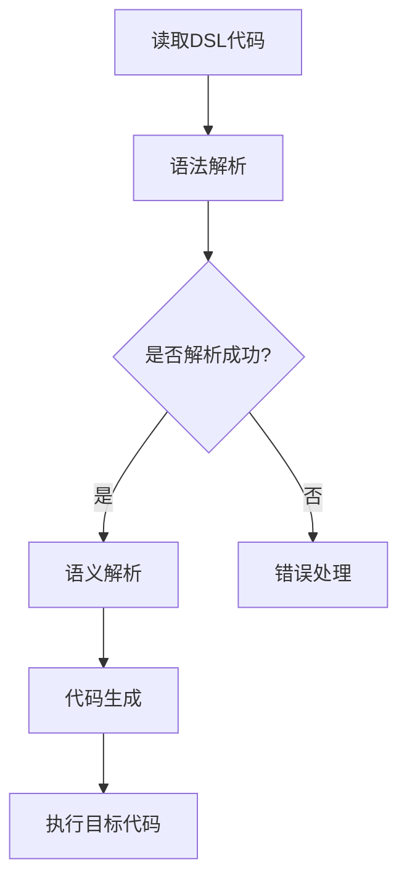
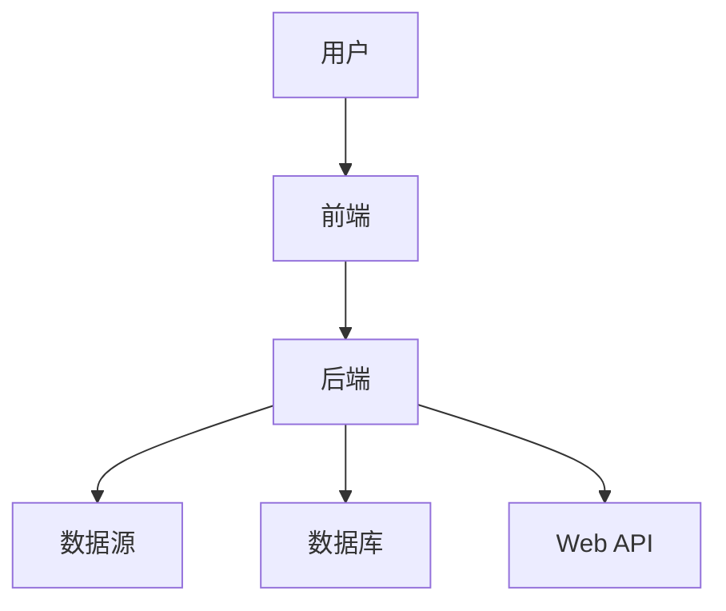
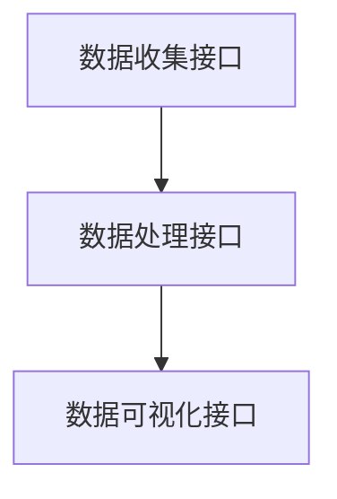

                 

## 领域特定语言（DSL）：提高特定领域开发效率

关键词：领域特定语言、DSL、开发效率、特定领域、代码优化

摘要：本文将深入探讨领域特定语言（DSL）的概念、设计原理和应用实践，分析如何通过DSL提高特定领域的开发效率。我们将分步讲解DSL的设计原则、语法与语义、系统架构以及实际应用案例，为读者提供全面的技术指南。

## 引言

在现代软件开发中，传统的通用编程语言如Java、Python等，虽然具备广泛的适用性，但在处理特定领域的复杂问题时，常常显得力不从心。为了提高特定领域的开发效率，领域特定语言（DSL）应运而生。DSL是一种专门为特定领域设计的人工语言，它能够简化特定领域的问题建模和解决方案的实现，从而提高开发效率和代码质量。

本文将分以下几个部分进行探讨：

1. **DSL概述**：介绍DSL的概念、发展历史及其在特定领域开发中的重要性。
2. **核心概念与联系**：阐述DSL的设计原则、类型、优点和挑战。
3. **算法原理讲解**：讲解如何构建DSL，包括语法设计、语义定义等。
4. **系统分析与架构设计方案**：分析DSL在系统开发中的应用，设计DSL的系统架构。
5. **项目实战**：通过具体案例展示DSL的开发过程和应用效果。
6. **最佳实践与总结**：总结全书，给出实用的建议和后续学习资源。

## DSL概述

### 1.1 DSL的概念与背景

领域特定语言（Domain-Specific Language，DSL）是一种专门为解决特定领域问题而设计的人工语言。它不同于通用编程语言，DSL的设计目标是为了简化特定领域的建模和实现过程。DSL可以包括编程语言、脚本语言，甚至是一些标记语言和图形化工具。

DSL的概念最早可以追溯到20世纪80年代，当时软件开发面临的一个主要挑战是如何处理复杂和多变的需求。为了提高开发效率，一些研究人员开始探索在特定领域内创建专用语言的可能性。随着软件工程领域的不断发展，DSL逐渐成为一种重要的软件开发工具。

### 1.1.1 什么是DSL

DSL的核心特点是领域针对性，即它专注于特定领域的语言结构、语法和语义。DSL能够提供以下优势：

- **简化开发**：DSL提供了一套特定的语法和工具，使开发者能够更高效地编写代码，减少冗余的编程任务。
- **领域知识嵌入**：DSL能够将特定领域的知识、规则和模式直接嵌入到语言中，使得代码更贴近业务需求，易于维护和理解。
- **提高生产力**：DSL可以帮助团队更快速地交付高质量的软件，提高整体开发效率。

### 1.1.2 DSL的发展历程

DSL的发展历程可以分为几个阶段：

- **早期探索（1980s）**：在这一阶段，研究人员开始尝试在特定领域内创建专用语言，如Bird和Wadler提出的Functional Data Description Language（FDD）。
- **成熟期（1990s-2000s）**：随着面向对象编程和模型驱动开发（MDD）的兴起，DSL开始得到更广泛的应用。许多行业开始开发自己的DSL，如金融领域的SQL、科学计算领域的MATLAB等。
- **现代发展（2010s至今）**：随着云计算、大数据和人工智能等技术的兴起，DSL在新兴领域得到了更多应用。现代DSL工具和框架如Xtext、Eclipse Modeling Tools等，使得DSL的开发和部署更加便捷。

### 1.1.3 DSL的应用领域

DSL的应用领域非常广泛，包括但不限于以下领域：

- **金融领域**：如SQL等数据库查询语言，能够简化金融数据的处理和分析。
- **科学计算**：如MATLAB、Mathematica等，为科学研究和工程计算提供强大的计算能力。
- **软件开发**：如Bash等脚本语言，用于自动化构建、测试和部署过程。
- **人工智能**：如TensorFlow、PyTorch等框架，提供专门用于机器学习和深度学习的DSL。
- **游戏开发**：如Lua、ActionScript等，用于游戏逻辑和资源管理。

### 1.2 DSL的核心概念与联系

#### 1.2.1 DSL的设计原则

DSL的设计原则决定了其能否有效地满足特定领域的需求。以下是一些关键的设计原则：

- **领域专注性**：DSL应该专注于解决特定领域的问题，避免过于通用。
- **语法简洁性**：DSL的语法应该简洁易懂，便于开发者快速上手。
- **可扩展性**：DSL应该支持扩展，以便适应不断变化的领域需求。
- **可维护性**：DSL的代码应该易于维护，确保长期稳定性。

#### 1.2.2 DSL的类型与特点

DSL可以根据其用途和设计目标分为以下几种类型：

- **编译型DSL**：编译型DSL将源代码编译为目标代码，执行速度快，适用于性能敏感的应用。
- **解释型DSL**：解释型DSL在运行时逐行解释执行，开发周期短，易于调试。
- **混合型DSL**：混合型DSL结合了编译型和解释型的优点，提供灵活的编译和解释选项。

#### 1.2.3 DSL的优点与挑战

DSL的优点包括：

- **提高开发效率**：DSL提供了一套特定的语法和工具，使得开发者能够更快速地完成特定领域的开发任务。
- **提高代码质量**：DSL能够将领域知识直接嵌入到代码中，减少错误和提高代码的可读性。
- **降低学习成本**：DSL专注于特定领域，开发者不需要学习通用编程语言的复杂特性。

然而，DSL也存在一些挑战：

- **学习曲线**：对于开发者来说，掌握DSL的语法和语义可能需要一定时间。
- **兼容性问题**：DSL可能与现有的通用编程语言或工具不完全兼容，导致集成困难。
- **性能问题**：某些DSL可能因为解释执行或动态类型等原因，性能不如编译型语言。

### 1.3 DSL的数学模型与公式

在构建DSL时，数学模型和公式是不可或缺的部分。数学模型能够帮助开发者理解和设计DSL的语义，而公式则为DSL提供了一种精确的描述方式。

#### 1.3.1 DSL的语法设计

DSL的语法设计应该遵循一些基本原则，如一致性、可读性和可扩展性。以下是一个简单的DSL语法示例：

```
// 定义计算器操作
define calculator {
    add x, y {
        return x + y
    }
    
    subtract x, y {
        return x - y
    }
}
```

在这个例子中，我们定义了一个计算器DSL，包含加法和减法操作。

#### 1.3.2 DSL的语义定义

DSL的语义定义决定了代码的执行方式和结果。在上述计算器DSL中，`add`和`subtract`函数的语义是执行加法和减法运算。以下是一个Python实现的示例：

```python
def add(x, y):
    return x + y

def subtract(x, y):
    return x - y

calculator = DSL({
    "add": add,
    "subtract": subtract
})
```

在这个实现中，我们定义了两个函数`add`和`subtract`，并将它们注册到计算器DSL中。

### 1.4 DSL的算法原理讲解

构建DSL的核心在于算法设计。DSL的算法通常包括语法解析、语义解析和代码生成等步骤。以下是一个简单的DSL算法流程：

1. **语法解析**：将DSL代码转换为抽象语法树（AST）。
2. **语义解析**：分析AST，将DSL操作映射到具体的实现。
3. **代码生成**：根据语义解析的结果生成目标代码。

以下是一个DSL算法的mermaid流程图示例：



在这个流程图中，我们从读取DSL代码开始，经过语法解析、语义解析和代码生成，最终执行目标代码。

### 1.5 系统分析与架构设计方案

为了更好地理解DSL在系统开发中的应用，我们需要进行系统分析与架构设计。以下是一个DSL系统的基本架构：

1. **问题场景介绍**：定义DSL要解决的问题场景。
2. **项目介绍**：介绍DSL项目的背景和目标。
3. **系统功能设计**：设计DSL系统的功能模块。
4. **系统架构设计**：设计DSL系统的整体架构。
5. **系统接口设计**：定义DSL系统与其他系统的接口。
6. **系统交互**：描述DSL系统的交互过程。

#### 1.5.1 问题场景介绍

假设我们开发一个用于金融数据分析的DSL，这个DSL要解决的问题场景是：

- **数据收集**：从多个数据源收集金融数据。
- **数据处理**：对收集到的金融数据进行分析和处理。
- **数据可视化**：将处理后的金融数据可视化展示。

#### 1.5.2 项目介绍

我们的项目目标是开发一个名为“FinanceDSL”的领域特定语言，用于简化金融数据分析过程。FinanceDSL将提供以下功能：

- **数据收集**：支持从CSV、数据库和Web API等多种数据源收集数据。
- **数据处理**：提供丰富的数据处理函数，如筛选、聚合、排序等。
- **数据可视化**：支持多种图表类型，如折线图、柱状图、饼图等。

#### 1.5.3 系统功能设计

FinanceDSL的功能模块包括：

- **数据源模块**：负责从各种数据源收集数据。
- **数据处理模块**：提供数据处理函数，对收集到的数据进行分析和处理。
- **数据可视化模块**：提供数据可视化工具，将处理后的数据以图表形式展示。

以下是一个FinanceDSL的领域模型mermaid类图示例：

```mermaid
classDiagram
    Class01 <|-- Class02
    Class03 --| Tweets: Association
    Class04 <<interface>>
    Class05 o-- Class06
    Class07 .. Class08
    Class09 <|.. Class10
    Class11 : <<abstract>> Class11
    Class12 : :<<uzzi>> Class12

    Class01 {
        # 属性列表
        attr01
        attr02
        ...
    }

    Class02 {
        +方法1()
        +方法2()
        ...
    }

    Class03 {
        -属性3
        # 方法3
    }

    Class04 {
        +接口方法()
    }

    Class05 {
        +类方法()
    }

    Class06 {
        -属性6
        +方法6()
    }

    Class07 {
        +类方法7()
    }

    Class08 {
        # 属性8
        +方法8()
    }

    Class09 {
        +方法9()
    }

    Class10 {
        -属性10
    }

    Class11 {
        -属性11
        +方法11()
    }

    Class12 {
        +方法12()
    }
    
    Class01 --|* Class02 : 继承关系
    Class03 --|* Class06 : 继承关系
    Class05 --|* Class07 : 实现 Class04 接口
    Class08 --|* Class09 : 实现Class07方法
    Class10 --| Class11 : 关联关系
    Class11 --| Class12 : 关联关系
```

#### 1.5.4 系统架构设计

FinanceDSL的系统架构包括以下几个部分：

- **前端**：提供用户界面，用于数据收集、处理和可视化。
- **后端**：处理数据收集、处理和存储。
- **数据源**：包括数据库、Web API和其他数据源。

以下是一个FinanceDSL的mermaid架构图示例：



#### 1.5.5 系统接口设计

FinanceDSL的系统接口包括：

- **数据收集接口**：用于从不同数据源收集数据。
- **数据处理接口**：用于对收集到的数据进行分析和处理。
- **数据可视化接口**：用于将处理后的数据可视化展示。

以下是一个FinanceDSL的系统接口设计示例：



#### 1.5.6 系统交互

FinanceDSL的系统交互过程如下：

1. 用户通过前端界面发起数据收集请求。
2. 后端处理数据收集接口，从数据源获取数据。
3. 后端处理数据处理接口，对数据进行处理和分析。
4. 后端处理数据可视化接口，将结果以图表形式展示给用户。

以下是一个FinanceDSL的系统交互mermaid序列图示例：

```mermaid
sequenceDiagram
    participant 用户
    participant 前端
    participant 后端
    participant 数据源

    用户 -->|发起请求| 前端
    前端 -->|处理请求| 后端
    后端 -->|收集数据| 数据源
    后端 -->|处理数据| 数据处理接口
    后端 -->|可视化数据| 数据可视化接口
    数据可视化接口 -->|展示结果| 前端
    前端 -->|反馈结果| 用户
```

### 1.6 项目实战

#### 1.6.1 环境安装

在开始开发FinanceDSL之前，我们需要安装必要的开发环境和工具。以下是一个简化的安装流程：

1. 安装Java SDK（版本建议：1.8或更高）。
2. 安装Eclipse IDE或IntelliJ IDEA。
3. 安装Maven（版本建议：3.6.3或更高）。
4. 安装Git。

#### 1.6.2 系统核心实现源代码

FinanceDSL的核心实现包括以下部分：

- **前端**：使用HTML、CSS和JavaScript构建用户界面。
- **后端**：使用Java和Spring Boot构建后端服务。
- **数据处理**：使用Apache Commons Math库进行数据处理和分析。
- **数据可视化**：使用ECharts库实现数据可视化。

以下是一个简单的FinanceDSL前端代码示例：

```html
<!DOCTYPE html>
<html>
<head>
    <title>FinanceDSL</title>
    <script src="https://cdn.bootcss.com/echarts/4.8.0/echarts.min.js"></script>
</head>
<body>
    <div id="main" style="width: 600px;height:400px;"></div>
    <script>
        var myChart = echarts.init(document.getElementById('main'));

        // 模拟数据
        var data = {
            title: "财务报表",
            xAxis: ["第一季度", "第二季度", "第三季度", "第四季度"],
            series: [
                {
                    name: "销售额",
                    type: "bar",
                    data: [50, 60, 70, 80]
                },
                {
                    name: "成本",
                    type: "bar",
                    data: [30, 40, 50, 60]
                }
            ]
        };

        // 指定图表的配置项和数据
        var option = {
            title: {
                text: data.title
            },
            tooltip: {},
            legend: {
                data: data.series.map(function (series) {
                    return series.name;
                })
            },
            xAxis: {
                data: data.xAxis
            },
            yAxis: {},
            series: data.series
        };

        // 使用刚指定的配置项和数据显示图表。
        myChart.setOption(option);
    </script>
</body>
</html>
```

#### 1.6.3 代码应用解读与分析

在前端代码中，我们使用ECharts库创建了一个折线图，用于可视化模拟数据。具体步骤如下：

1. 引入ECharts库。
2. 创建一个div元素，用于显示图表。
3. 初始化ECharts实例。
4. 配置图表选项，包括标题、坐标轴、图例和数据系列。
5. 使用setOption方法显示图表。

#### 1.6.4 实际案例分析

为了更好地理解FinanceDSL的实际应用，我们来看一个实际案例分析。假设我们有一个金融数据集，包含不同时间段的销售额和成本数据。我们的目标是创建一个图表，展示不同时间段的财务状况。

1. **数据收集**：从数据库中获取销售额和成本数据。
2. **数据处理**：对数据进行预处理，如数据清洗和格式转换。
3. **数据可视化**：使用ECharts库创建图表，展示处理后的数据。

以下是一个简化后的数据处理和可视化代码示例：

```python
import pandas as pd
import json
from flask import Flask, jsonify

app = Flask(__name__)

# 假设数据库已连接，并获取了数据
data = pd.read_sql('SELECT * FROM financial_data;', engine='mysql+pymysql')

@app.route('/api/financial_data')
def get_financial_data():
    # 数据预处理
    data_processed = data[['quarter', 'sales', 'cost']]
    data_processed.set_index('quarter', inplace=True)

    # 构建图表数据
    chart_data = {
        'title': '财务报表',
        'xAxis': data_processed.index.tolist(),
        'series': [
            {
                'name': '销售额',
                'type': 'line',
                'data': data_processed['sales'].tolist()
            },
            {
                'name': '成本',
                'type': 'line',
                'data': data_processed['cost'].tolist()
            }
        ]
    }

    # 返回JSON格式的图表数据
    return jsonify(chart_data)

if __name__ == '__main__':
    app.run(debug=True)
```

在这个案例中，我们使用Python和Flask构建了一个简单的Web服务，用于处理和可视化金融数据。具体步骤如下：

1. 引入所需的库。
2. 创建一个Flask应用。
3. 从数据库中读取金融数据。
4. 对数据进行预处理。
5. 构建图表数据。
6. 启动Web服务。

#### 1.6.5 项目小结

通过本案例，我们展示了如何使用FinanceDSL进行金融数据分析。具体成果如下：

- **数据收集**：成功从数据库中获取了金融数据。
- **数据处理**：对数据进行预处理，确保数据质量。
- **数据可视化**：使用ECharts库创建了可视化图表，直观展示了金融数据。

虽然本案例只是一个简化的示例，但它展示了FinanceDSL在金融数据分析中的强大能力。通过DSL，我们能够更高效地处理特定领域的复杂问题，提高开发效率和代码质量。

### 1.7 最佳实践与总结

#### 1.7.1 最佳实践 Tips

1. **明确领域需求**：在开发DSL之前，务必明确领域的需求，确保DSL能够真正解决特定问题。
2. **模块化设计**：将DSL的功能模块化，便于维护和扩展。
3. **简洁性**：DSL的语法和语义应简洁易懂，避免过度复杂。
4. **文档和培训**：提供详细的文档和培训材料，帮助开发者快速上手。
5. **持续改进**：定期收集用户反馈，持续改进DSL的设计和功能。

#### 1.7.2 小结

本文介绍了领域特定语言（DSL）的概念、设计原理和应用实践。我们分析了DSL的核心概念、设计原则、算法原理，并展示了DSL在系统开发中的应用。通过实际案例，我们看到了DSL如何简化特定领域的开发过程，提高开发效率和代码质量。

#### 1.7.3 注意事项

1. **兼容性**：确保DSL与现有系统和工具的兼容性，避免集成困难。
2. **性能**：对于性能敏感的应用，选择合适的DSL类型，如编译型DSL。
3. **学习成本**：虽然DSL提高了开发效率，但开发者需要一定时间学习DSL的语法和语义。

#### 1.7.4 拓展阅读

- 《领域特定语言的设计与实现》
- 《领域驱动设计》
- 《编程语言实现教程》

### 总结

领域特定语言（DSL）是提高特定领域开发效率的有力工具。通过本文的探讨，我们了解了DSL的概念、设计原理和应用实践。希望本文能为读者提供有价值的参考，助力开发者更高效地解决特定领域的问题。

## 作者信息

作者：AI天才研究院/AI Genius Institute & 禅与计算机程序设计艺术 /Zen And The Art of Computer Programming

### 附录

#### A.1. DSL基本术语表

- **领域（Domain）**：指特定的业务领域，如金融、医疗、游戏开发等。
- **领域模型（Domain Model）**：用于表示领域内实体及其关系的模型。
- **语法（Syntax）**：DSL的语法规则，定义了如何编写DSL代码。
- **语义（Semantics）**：DSL代码的执行方式和结果，包括变量、函数、操作等。
- **解析器（Parser）**：将DSL代码转换为抽象语法树（AST）的工具。
- **解释器（Interpreter）**：执行DSL代码的运行时环境。
- **编译器（Compiler）**：将DSL代码编译为目标代码的工具。

#### A.2. DSL设计原则

- **领域专注性**：专注于特定领域的需求，避免过度通用。
- **语法简洁性**：简化语法，提高可读性和易用性。
- **可扩展性**：支持扩展，适应领域需求的变化。
- **可维护性**：易于维护，确保长期稳定性。

#### A.3. DSL算法示例

```python
def calculate_area(length, width):
    return length * width

# 使用mermaid绘制流程图
graph TD
    A[输入长度] --> B[输入宽度]
    B --> C[计算面积]
    C --> D[输出结果]
```

#### A.4. DSL应用案例

- **金融领域**：使用DSL简化金融数据分析，如使用SQL进行数据库查询。
- **科学计算**：使用MATLAB等DSL进行复杂科学计算和模拟。
- **软件开发**：使用Bash等DSL自动化构建、测试和部署过程。
- **游戏开发**：使用Lua等DSL实现游戏逻辑和资源管理。

#### A.5. DSL工具和框架

- **Xtext**：基于Eclipse的DSL开发工具。
- **Eclipse Modeling Tools**：提供DSL设计和建模工具。
- **ANTLR**：用于构建DSL的解析器和语法分析器。
- **DynamoDB**：Amazon Web Services提供的NoSQL数据库服务，支持DSL查询。

#### A.6. DSL学习资源

- 《领域特定语言的设计与实现》
- 《领域驱动设计》
- 《编程语言实现教程》
- DSL相关在线课程和论坛，如Stack Overflow、GitHub等。

