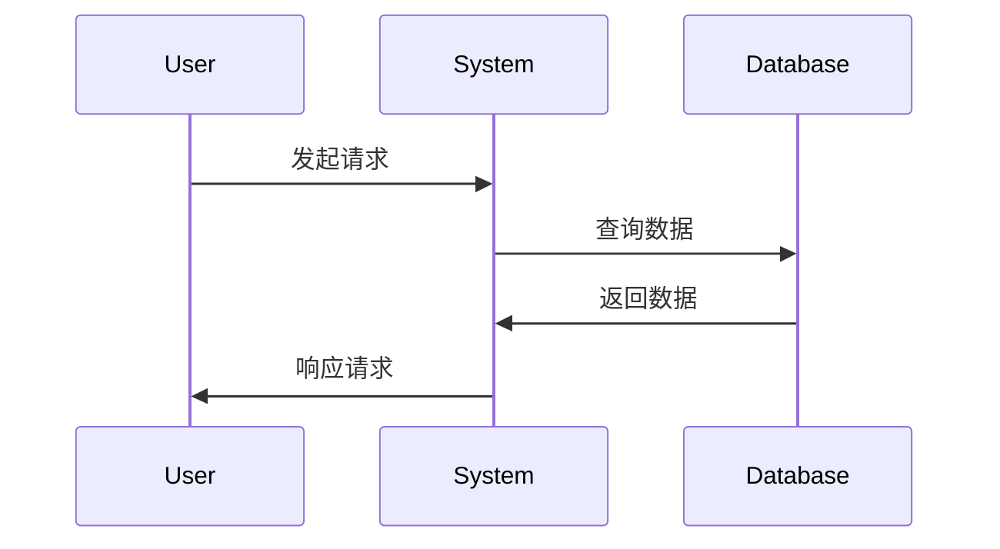
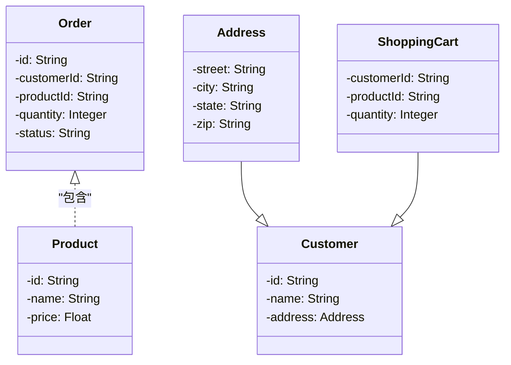
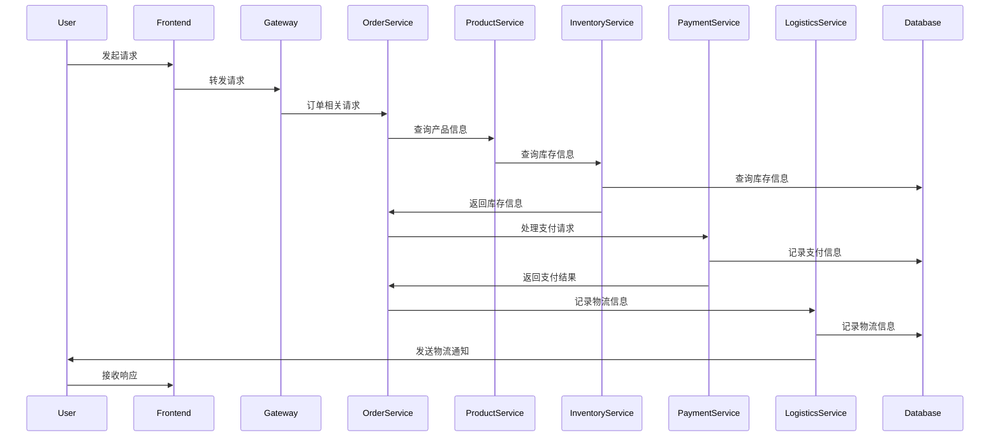
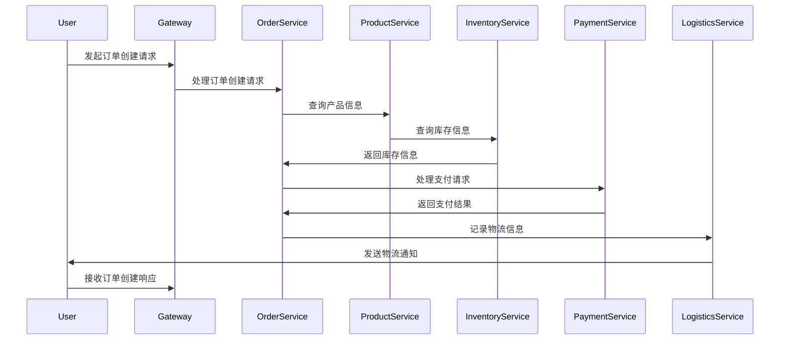

                 


# 领域驱动设计（DDD）在复杂系统中的应用

## 关键词

领域驱动设计、复杂系统、软件架构、软件设计模式、领域事件、领域模型

## 摘要

本文旨在探讨领域驱动设计（DDD）在复杂系统中的应用。领域驱动设计是一种针对复杂业务领域的软件设计方法，它通过构建明确的核心域模型，来帮助开发者更好地理解和应对复杂系统的需求。本文将首先介绍DDD的基本概念，然后深入分析复杂系统的挑战，并逐步讲解DDD的核心概念及其在实际项目中的应用。最后，我们将通过具体案例研究，展示DDD如何帮助解决复杂系统的设计难题，并提供一些最佳实践和总结。

## 目录

1. 引言
    1.1 DDD概述
    1.2 复杂系统的挑战

2. 领域驱动设计核心概念
    2.1 领域模型
    2.2 实体与值对象
    2.3 领域服务
    2.4 领域事件
    2.5 领域边界

3. DDD在实际项目中的应用
    3.1 应用场景分析
    3.2 架构设计与实现
    3.3 性能优化与代码重构

4. 案例研究
    4.1 电子商务系统
    4.2 金融系统

5. 最佳实践与总结
    5.1 最佳实践
    5.2 小结与展望

### 1. 引言

在软件工程领域，随着业务需求的日益复杂，传统的软件设计方法逐渐暴露出其局限性。复杂系统通常涉及到大量的业务规则、跨领域协作以及动态变化的需求，这使得传统的分层架构和面向对象设计模式难以胜任。领域驱动设计（DDD）作为一种应对复杂系统的设计方法，逐渐受到业界的关注和认可。

### 1.1 DDD概述

领域驱动设计（DDD）由Eric Evans在其同名著作中提出，旨在解决复杂软件系统的设计难题。DDD的核心思想是将系统划分为多个领域，每个领域代表一组相关的业务实体和规则。通过构建领域模型，开发者可以更清晰地理解业务需求，并设计出更为灵活和可扩展的系统架构。

### 1.2 复杂系统的挑战

复杂系统通常面临以下挑战：

- **业务规则复杂**：复杂的业务规则需要系统的各个组成部分协同工作。
- **跨领域协作**：不同领域之间的数据和功能需要相互协调。
- **动态变化**：业务需求的变化可能导致系统架构的频繁调整。

为了应对这些挑战，DDD提供了一系列的设计原则和模式，帮助开发者更好地理解和应对复杂系统的需求。

### 2. 领域驱动设计核心概念

在理解DDD的核心概念之前，我们需要先了解几个基础术语：

- **领域**：一组相关业务概念的集合，通常表示为一个业务子域。
- **实体**：具有唯一标识，可以持久化存储的对象。
- **值对象**：没有唯一标识，仅由属性组成的对象。
- **领域服务**：负责处理业务逻辑的操作，通常与特定的领域模型相关。
- **领域事件**：表示领域状态变化的原子操作。
- **领域边界**：定义了领域模型与外部系统的接口。

#### 2.1 领域模型

领域模型是DDD的核心概念，它通过一组实体、值对象和领域服务来描述一个业务领域。领域模型有助于开发者更好地理解业务需求和设计系统架构。

#### 2.2 实体与值对象

实体和值对象是领域模型中的两个基本元素。实体具有唯一标识，可以持久化存储，例如客户、订单等。值对象则没有唯一标识，仅由属性组成，例如日期、地址等。

#### 2.3 领域服务

领域服务负责处理业务逻辑，通常与特定的领域模型相关。领域服务通过操作实体和值对象来执行业务操作，例如创建订单、发货等。

#### 2.4 领域事件

领域事件是表示领域状态变化的原子操作。领域事件可以触发领域服务执行，从而更新领域模型的状态。

#### 2.5 领域边界

领域边界定义了领域模型与外部系统的接口。通过领域边界，领域模型可以与外部系统进行数据交互和功能调用。

### 3. DDD在实际项目中的应用

#### 3.1 应用场景分析

DDD适用于需要应对复杂业务需求的系统，例如电子商务系统、金融系统等。在应用DDD之前，我们需要对项目进行深入的业务分析，以识别出关键领域和业务规则。

#### 3.2 架构设计与实现

在架构设计阶段，我们可以利用DDD的核心概念来设计系统架构。领域模型可以帮助我们明确系统中的关键实体和业务规则，从而设计出更为灵活和可扩展的系统架构。

#### 3.3 性能优化与代码重构

在项目开发过程中，我们需要关注性能优化和代码重构。DDD提供了许多设计原则和模式，可以帮助我们写出更为高效和可维护的代码。

### 4. 案例研究

#### 4.1 电子商务系统

电子商务系统是一个典型的复杂系统，涉及多个领域，例如购物车、订单、库存等。通过DDD，我们可以将电子商务系统划分为多个领域模型，从而更好地理解和应对业务需求。

#### 4.2 金融系统

金融系统是一个高度复杂的系统，涉及大量的业务规则和跨领域协作。通过DDD，我们可以设计出更为灵活和可扩展的金融系统架构，从而应对日益增长的业务需求。

### 5. 最佳实践与总结

在实际项目中，我们应该遵循以下最佳实践：

- **深入业务分析**：在应用DDD之前，需要对业务需求进行深入分析，以识别出关键领域和业务规则。
- **构建领域模型**：通过领域模型来描述业务领域，从而更好地理解业务需求。
- **关注领域边界**：明确领域模型与外部系统的接口，以确保系统的高内聚和低耦合。
- **持续优化和重构**：关注性能优化和代码重构，以提高系统的可维护性和可扩展性。

### 小结与展望

领域驱动设计（DDD）是一种应对复杂系统的设计方法，它通过构建明确的核心域模型，帮助开发者更好地理解和应对复杂业务需求。随着业务需求的不断变化，DDD的应用前景将越来越广阔。

### 注意事项

在应用DDD时，需要注意以下几点：

- **领域模型的构建**：领域模型是DDD的核心，需要投入足够的时间和精力进行构建。
- **团队协作**：DDD的实施需要团队协作，特别是在业务分析和领域模型设计阶段。
- **持续迭代**：DDD不是一蹴而就的过程，需要持续迭代和优化。

### 拓展阅读

- 《领域驱动设计》（Eric Evans 著）
- 《软件架构：实践者的研究与案例》（Mark Richards 著）

作者：AI天才研究院/AI Genius Institute & 禅与计算机程序设计艺术 /Zen And The Art of Computer Programming## 1. 引言

在软件工程领域，随着业务需求的日益复杂，传统的软件设计方法逐渐暴露出其局限性。复杂系统通常涉及到大量的业务规则、跨领域协作以及动态变化的需求，这使得传统的分层架构和面向对象设计模式难以胜任。领域驱动设计（DDD）作为一种应对复杂系统的设计方法，逐渐受到业界的关注和认可。

### 1.1 DDD概述

领域驱动设计（DDD）由Eric Evans在其同名著作中提出，旨在解决复杂软件系统的设计难题。DDD的核心思想是将系统划分为多个领域，每个领域代表一组相关的业务实体和规则。通过构建明确的核心域模型，开发者可以更清晰地理解业务需求，并设计出更为灵活和可扩展的系统架构。

DDD的关键概念包括：

- **领域**：一组相关业务概念的集合，通常表示为一个业务子域。
- **实体**：具有唯一标识，可以持久化存储的对象。
- **值对象**：没有唯一标识，仅由属性组成的对象。
- **领域服务**：负责处理业务逻辑的操作，通常与特定的领域模型相关。
- **领域事件**：表示领域状态变化的原子操作。
- **领域边界**：定义了领域模型与外部系统的接口。

### 1.2 复杂系统的挑战

复杂系统通常面临以下挑战：

- **业务规则复杂**：复杂的业务规则需要系统的各个组成部分协同工作。
- **跨领域协作**：不同领域之间的数据和功能需要相互协调。
- **动态变化**：业务需求的变化可能导致系统架构的频繁调整。

为了应对这些挑战，DDD提供了一系列的设计原则和模式，帮助开发者更好地理解和应对复杂系统的需求。

### 1.3 DDD的核心原则

DDD的核心原则包括：

- **基于领域模型进行设计**：通过构建明确的领域模型，更好地理解业务需求。
- **实体与值对象的区分**：实体具有唯一标识，值对象没有唯一标识。
- **领域服务的职责分离**：领域服务负责处理业务逻辑，与实体和值对象分离。
- **领域事件驱动**：通过领域事件驱动领域服务的执行，以实现业务逻辑的解耦。
- **领域边界定义**：明确领域模型与外部系统的接口，实现高内聚和低耦合。

### 1.4 DDD的发展与应用

DDD自从提出以来，得到了广泛的应用和认可。它在电子商务、金融、保险、物流等众多领域都有成功的应用案例。随着微服务架构、容器化技术的兴起，DDD的应用范围也在不断扩展。通过DDD，开发者可以更有效地构建和维护复杂系统，提高系统的可扩展性和可维护性。

### 1.5 文章结构

本文将分为五个部分，首先介绍DDD的基本概念和复杂系统的挑战，然后深入探讨DDD的核心概念，包括领域模型、实体与值对象、领域服务、领域事件和领域边界。接下来，我们将探讨DDD在实际项目中的应用，并通过案例研究展示DDD的实际效果。最后，我们将总结最佳实践，提供一些建议和展望。

## 2. 领域驱动设计核心概念

在理解DDD的核心概念之前，我们需要先了解几个基础术语：

- **领域**：一组相关业务概念的集合，通常表示为一个业务子域。
- **实体**：具有唯一标识，可以持久化存储的对象。
- **值对象**：没有唯一标识，仅由属性组成的对象。
- **领域服务**：负责处理业务逻辑的操作，通常与特定的领域模型相关。
- **领域事件**：表示领域状态变化的原子操作。
- **领域边界**：定义了领域模型与外部系统的接口。

### 2.1 领域模型

领域模型是DDD的核心概念，它通过一组实体、值对象和领域服务来描述一个业务领域。领域模型有助于开发者更好地理解业务需求和设计系统架构。

#### 2.1.1 领域模型概述

领域模型通常分为三个层次：

- **核心域**：包含系统最核心的业务逻辑，如电子商务系统中的购物车、订单和库存。
- **支撑域**：支持核心域的业务操作，如用户管理、权限管理等。
- **边界域**：与外部系统交互的部分，如API接口、第三方服务集成等。

#### 2.1.2 领域模型的构建

构建领域模型通常包括以下几个步骤：

1. **识别领域边界**：确定系统与外部系统的交互点，定义领域边界。
2. **识别核心实体和值对象**：根据业务需求，识别出核心实体和值对象。
3. **定义领域服务**：根据业务逻辑，定义领域服务。
4. **绘制领域模型**：使用统一建模语言（UML）绘制领域模型。

### 2.2 实体与值对象

实体和值对象是领域模型中的两个基本元素。

#### 2.2.1 实体与值对象的概念

- **实体**：具有唯一标识，可以持久化存储的对象。例如，客户、订单等。
- **值对象**：没有唯一标识，仅由属性组成的对象。例如，日期、地址等。

#### 2.2.2 实体与值对象的设计与实现

在设计实体与值对象时，需要注意以下几点：

- **实体**：实体通常具有唯一的标识，可以通过ID进行识别。实体通常包含行为和方法。
- **值对象**：值对象不包含唯一标识，但包含多个属性。值对象通常用于传递数据。

在实现时，可以使用以下方法：

- **实体**：通常使用面向对象的编程语言实现，如Java或C#。实体通常具有唯一的ID属性，并包含行为和方法。
- **值对象**：可以使用简单的类或结构体实现，如C#中的结构体或Python中的类。

### 2.3 领域服务

领域服务负责处理业务逻辑，通常与特定的领域模型相关。领域服务通过操作实体和值对象来执行业务操作。

#### 2.3.1 领域服务的定义

领域服务通常具有以下特征：

- **业务逻辑**：领域服务实现系统的核心业务逻辑，如订单创建、发货等。
- **无状态**：领域服务通常是无状态的，不存储状态信息。
- **可复用**：领域服务可以跨领域复用，提高系统的可维护性和可扩展性。

#### 2.3.2 领域服务的设计与实现

在设计领域服务时，需要注意以下几点：

- **职责分离**：确保领域服务具有明确的职责，避免功能重叠。
- **高内聚、低耦合**：领域服务之间应保持高内聚、低耦合的关系，以提高系统的可维护性。

在实现时，可以使用以下方法：

- **面向对象编程**：使用面向对象的编程语言实现领域服务，如Java或C#。
- **依赖注入**：使用依赖注入框架，如Spring或Django，来管理领域服务的依赖。

### 2.4 领域事件

领域事件是表示领域状态变化的原子操作。领域事件可以触发领域服务的执行，从而更新领域模型的状态。

#### 2.4.1 领域事件的概念

领域事件通常具有以下特征：

- **无状态**：领域事件通常是无状态的，不存储状态信息。
- **原子性**：领域事件是原子操作，不可分割。
- **异步性**：领域事件通常是异步触发的，以提高系统的性能。

#### 2.4.2 领域事件的处理

处理领域事件通常包括以下几个步骤：

1. **识别领域事件**：根据业务需求，识别出需要处理的领域事件。
2. **定义领域事件**：定义领域事件的类型和参数。
3. **发布领域事件**：在业务操作中发布领域事件。
4. **处理领域事件**：通过领域服务处理领域事件，更新领域模型的状态。

### 2.5 领域边界

领域边界定义了领域模型与外部系统的接口。通过领域边界，领域模型可以与外部系统进行数据交互和功能调用。

#### 2.5.1 领域边界的定义

领域边界通常包括以下几个方面：

- **接口定义**：定义领域模型与外部系统交互的接口，如RESTful API、Web Service等。
- **协议规范**：定义领域模型与外部系统交互的协议规范，如HTTP、HTTPS等。
- **数据格式**：定义领域模型与外部系统交互的数据格式，如JSON、XML等。

#### 2.5.2 领域边界的设计

在设计领域边界时，需要注意以下几点：

- **高内聚、低耦合**：确保领域边界与领域模型之间保持高内聚、低耦合的关系。
- **可扩展性**：确保领域边界能够适应未来的业务需求变化。
- **安全性**：确保领域边界的安全性和可靠性。

在实现时，可以使用以下方法：

- **接口设计**：使用面向对象的编程语言实现领域边界接口，如Java或C#。
- **网关模式**：使用网关模式实现领域边界的统一管理和调用。

## 3. DDD在实际项目中的应用

领域驱动设计（DDD）在复杂系统的设计中被广泛应用，通过合理的应用DDD原则和模式，可以有效地解决复杂业务需求，提高系统的可维护性和可扩展性。以下是DDD在实际项目中的应用步骤和案例分析。

### 3.1 应用场景分析

在实际项目中，应用DDD需要从以下几个方面进行分析：

- **业务需求分析**：深入了解业务需求，识别出核心业务领域和关键业务流程。
- **系统架构设计**：根据业务需求，设计合适的系统架构，确定各个领域的划分。
- **技术选型**：选择适合的技术栈和开发工具，以确保项目的顺利实施。

### 3.2 架构设计与实现

在项目架构设计阶段，我们可以采用DDD的核心原则，将系统划分为多个领域，每个领域负责一组相关的业务逻辑。

#### 3.2.1 系统架构设计

- **核心域**：包含系统的核心业务逻辑，如电商系统的购物车、订单处理和库存管理等。
- **支撑域**：提供系统的公共功能，如用户管理、权限控制等。
- **边界域**：处理系统与外部系统的交互，如API接口、第三方服务集成等。

#### 3.2.2 DDD在项目中的具体应用

- **实体和值对象**：根据业务需求，定义系统中的实体和值对象，确保它们具有明确的职责和属性。
- **领域服务**：设计领域服务，处理业务逻辑，确保领域服务与实体和值对象分离，实现高内聚、低耦合。
- **领域事件**：利用领域事件驱动业务逻辑的执行，确保系统具有较高的灵活性和可扩展性。

#### 3.2.3 领域边界设计

- **接口定义**：定义系统与外部系统的交互接口，确保接口的设计符合RESTful原则。
- **协议规范**：制定统一的协议规范，确保系统与外部系统的交互遵循标准化的流程。
- **数据格式**：选择合适的数据格式，如JSON、XML等，确保数据传输的高效和可读性。

### 3.3 性能优化与代码重构

在项目开发过程中，性能优化和代码重构是确保系统高质量的关键。

#### 3.3.1 性能优化策略

- **数据库优化**：合理设计数据库表结构，使用索引、缓存等技术提高查询性能。
- **分布式系统**：采用分布式架构，提高系统的并发处理能力和扩展性。
- **服务拆分**：将大服务拆分为小服务，降低系统的耦合度，提高系统的可维护性。

#### 3.3.2 代码重构实践

- **代码审查**：定期进行代码审查，识别出潜在的问题和改进空间。
- **重构**：根据代码审查的结果，对代码进行重构，提高代码的可读性和可维护性。
- **自动化测试**：编写自动化测试用例，确保重构后的代码质量。

### 3.4 案例分析

以下是一个电子商务系统的案例，展示如何应用DDD解决复杂业务需求。

#### 3.4.1 案例背景

某电子商务平台需要处理海量的订单和库存管理，同时需要提供高效的购物车和推荐系统。由于业务需求复杂，传统的软件设计方法难以满足要求，因此决定采用DDD进行系统设计。

#### 3.4.2 领域模型构建

- **核心域**：订单处理、库存管理、购物车管理。
- **支撑域**：用户管理、权限控制、日志记录。
- **边界域**：API接口、第三方支付、物流服务。

#### 3.4.3 架构设计与实现

- **核心域实现**：使用DDD原则，设计订单处理、库存管理和购物车管理的领域模型，实现业务逻辑。
- **支撑域实现**：实现用户管理、权限控制和日志记录等公共功能。
- **边界域实现**：定义API接口，与第三方支付和物流服务进行交互。

#### 3.4.4 性能优化与代码重构

- **数据库优化**：使用数据库索引、分库分表等技术，提高数据查询性能。
- **服务拆分**：将订单处理、库存管理和购物车管理拆分为独立的服务，提高系统的并发处理能力。
- **代码重构**：定期进行代码审查和重构，提高代码的可读性和可维护性。

### 3.5 小结

通过应用DDD，电子商务系统实现了业务逻辑的清晰划分，提高了系统的可维护性和可扩展性。在后续的项目开发中，将持续优化和重构，确保系统的稳定性和高性能。

### 3.6 总结

DDD在复杂系统中的应用，为解决业务需求和系统设计难题提供了有效的方法和原则。通过合理的应用DDD，可以构建出灵活、可扩展和高性能的系统。在未来的项目中，应继续深入研究和实践DDD，以提升软件设计的质量和效率。

## 4. 案例研究

为了更好地理解领域驱动设计（DDD）在复杂系统中的应用，我们将通过两个实际案例进行详细分析。这两个案例分别是电子商务系统和金融系统。

### 4.1 电子商务系统

#### 4.1.1 案例背景

某大型电子商务平台需要处理海量的商品信息、用户订单、支付和物流等业务。由于业务复杂度高，传统的软件设计方法难以满足需求，因此决定采用DDD进行系统设计。

#### 4.1.2 DDD应用分析

- **领域模型构建**：电子商务系统可以分为核心域、支撑域和边界域。
  - **核心域**：订单处理、库存管理、购物车管理、推荐系统等。
  - **支撑域**：用户管理、权限控制、日志记录等。
  - **边界域**：API接口、第三方支付、物流服务、短信服务等。

- **实体和值对象**：
  - 实体：订单、商品、用户等。
  - 值对象：订单详情、商品库存、地址等。

- **领域服务**：
  - 领域服务：订单创建、订单取消、库存更新、购物车添加、推荐算法等。

- **领域边界**：
  - API接口：提供对外服务的接口，如订单查询、支付、物流跟踪等。
  - 第三方服务：与第三方支付、短信服务、物流服务等进行交互。

#### 4.1.3 架构设计与实现

- **系统架构设计**：
  - 采用微服务架构，将系统划分为多个微服务，每个微服务负责一组相关的业务逻辑。
  - 核心域、支撑域和边界域分别对应不同的微服务。

- **实现细节**：
  - **订单处理服务**：处理订单创建、取消、支付等业务逻辑。
  - **库存管理服务**：处理商品库存更新、查询等业务逻辑。
  - **购物车服务**：处理购物车添加、删除、更新等业务逻辑。
  - **推荐系统**：根据用户行为和商品特征进行推荐。

#### 4.1.4 性能优化与代码重构

- **性能优化**：
  - 数据库优化：使用数据库索引、分库分表等技术，提高数据查询性能。
  - 缓存：使用缓存技术，如Redis，减少数据库查询次数，提高系统响应速度。
  - 服务拆分：将大服务拆分为小服务，提高系统的并发处理能力。

- **代码重构**：
  - 定期进行代码审查，识别出潜在的代码质量问题。
  - 根据审查结果，对代码进行重构，提高代码的可读性和可维护性。

### 4.2 金融系统

#### 4.2.1 案例背景

某金融公司需要开发一个在线交易系统，支持股票、基金、债券等多种金融产品的交易。由于金融系统的业务规则复杂，对安全性、稳定性和性能要求极高，因此决定采用DDD进行系统设计。

#### 4.2.2 DDD应用分析

- **领域模型构建**：金融系统可以分为核心域、支撑域和边界域。
  - **核心域**：交易、结算、风控、账户管理等。
  - **支撑域**：用户管理、权限控制、日志记录等。
  - **边界域**：API接口、第三方支付、短信服务等。

- **实体和值对象**：
  - 实体：交易记录、账户、用户等。
  - 值对象：交易金额、交易时间、账户余额等。

- **领域服务**：
  - 领域服务：交易创建、交易结算、账户余额更新、风控策略等。

- **领域边界**：
  - API接口：提供对外服务的接口，如交易查询、账户查询、支付等。
  - 第三方服务：与第三方支付、短信服务等进行交互。

#### 4.2.3 架构设计与实现

- **系统架构设计**：
  - 采用分布式架构，将系统划分为多个服务模块，提高系统的并发处理能力和扩展性。
  - 核心域、支撑域和边界域分别对应不同的服务模块。

- **实现细节**：
  - **交易服务**：处理交易创建、交易结算等业务逻辑。
  - **结算服务**：处理交易结算、资金划转等业务逻辑。
  - **风控服务**：处理交易风险控制、账户风险监控等业务逻辑。
  - **账户服务**：处理账户余额查询、账户信息管理等业务逻辑。

#### 4.2.4 性能优化与代码重构

- **性能优化**：
  - 数据库优化：使用数据库索引、分库分表等技术，提高数据查询性能。
  - 缓存：使用缓存技术，如Redis，减少数据库查询次数，提高系统响应速度。
  - 服务拆分：将大服务拆分为小服务，提高系统的并发处理能力。

- **代码重构**：
  - 定期进行代码审查，识别出潜在的代码质量问题。
  - 根据审查结果，对代码进行重构，提高代码的可读性和可维护性。

### 4.3 小结

通过DDD，电子商务系统和金融系统都实现了业务逻辑的清晰划分，提高了系统的可维护性和可扩展性。在后续的项目开发中，将持续优化和重构，确保系统的稳定性和高性能。

### 4.4 总结

案例研究展示了领域驱动设计（DDD）在复杂系统中的应用效果。通过应用DDD，可以更好地应对复杂的业务需求，提高系统的质量和效率。在未来的项目中，应继续深入研究和实践DDD，以提升软件设计的质量和效率。

## 5. 最佳实践与总结

在复杂系统的设计过程中，领域驱动设计（DDD）提供了一套有效的原则和模式，帮助我们更好地理解和应对业务需求。以下是一些最佳实践，以帮助开发者更好地应用DDD：

### 5.1 最佳实践

1. **深入业务分析**：在应用DDD之前，对业务需求进行深入分析，识别出核心领域和关键业务规则，这是构建有效领域模型的基础。
2. **明确领域边界**：确保领域边界清晰，有助于实现高内聚、低耦合的系统架构。
3. **实体与值对象区分**：合理区分实体与值对象，有助于优化系统性能和降低复杂度。
4. **领域服务职责分离**：确保领域服务具有明确的职责，避免功能重叠，提高系统的可维护性。
5. **领域事件驱动**：利用领域事件驱动业务逻辑，提高系统的灵活性和可扩展性。
6. **持续优化和重构**：关注性能优化和代码重构，确保系统的稳定性和高性能。

### 5.2 小结

领域驱动设计（DDD）在复杂系统中的应用，为解决业务需求和系统设计难题提供了有效的方法和原则。通过合理的应用DDD，可以构建出灵活、可扩展和高性能的系统。在未来的项目中，应继续深入研究和实践DDD，以提升软件设计的质量和效率。

### 5.3 注意事项

1. **领域模型的构建**：领域模型的构建是一个持续迭代的过程，需要随着业务需求的变化进行优化。
2. **团队协作**：DDD的实施需要团队成员的密切协作，特别是在领域模型的设计和验证阶段。
3. **技术选型**：选择合适的技术栈和开发工具，以确保项目的顺利实施。

### 5.4 拓展阅读

- 《领域驱动设计》（Eric Evans 著）
- 《软件架构：实践者的研究与案例》（Mark Richards 著）
- 《微服务设计》（Chris Richardson 著）

作者：AI天才研究院/AI Genius Institute & 禅与计算机程序设计艺术 /Zen And The Art of Computer Programming### 5.1 最佳实践

在复杂系统的设计中，领域驱动设计（DDD）提供了一系列最佳实践，这些实践可以帮助开发者更好地构建和维护系统。以下是一些关键的实践策略：

1. **从领域开始**：始终将领域作为设计过程的起点。理解业务领域并构建领域模型是确保系统能够满足业务需求的关键。

2. **明确领域边界**：清晰地定义领域边界，以划分系统的不同部分，这有助于提高系统的模块化和可维护性。

3. **优先考虑实体和值对象**：在领域模型中，优先考虑使用实体和值对象。实体代表可持久化的业务实体，而值对象则代表不可持久化的数据元素。

4. **领域服务的设计**：领域服务应专注于业务逻辑的实现，避免成为数据传递的通道。它们应处理复杂的业务规则，而不是简单的数据转换。

5. **事件驱动架构**：使用领域事件来驱动业务流程，这有助于实现异步处理，从而提高系统的性能和可伸缩性。

6. **持续重构**：定期对代码进行重构，以保持代码的简洁性和可维护性。这有助于消除技术债务，确保系统长期健康。

7. **领域专家的参与**：鼓励业务领域专家参与到系统设计中，他们的洞察对于理解复杂业务逻辑至关重要。

8. **测试驱动开发**：采用测试驱动开发（TDD）方法，编写单元测试和集成测试，以确保代码的正确性和系统的稳定性。

9. **文档化**：文档化领域模型和设计决策，以便新加入的团队成员能够快速理解系统的设计和实现。

10. **迭代和反馈**：采用迭代和增量开发的方法，不断地收集反馈并进行调整，以确保系统能够及时响应业务变化。

### 5.2 小结

领域驱动设计（DDD）提供了一套系统化的方法来应对复杂系统的设计挑战。通过明确的领域模型、恰当的实体和值对象设计、领域服务的优化、事件驱动的架构，以及持续的优化和重构，开发者可以构建出既灵活又可扩展的系统。这些最佳实践不仅提高了代码的质量，也增强了系统的可维护性和适应性，为未来的业务发展奠定了坚实的基础。

### 5.3 注意事项

在应用DDD时，开发者需要注意以下几点：

1. **初期投资回报**：虽然DDD需要一定的初期投资，特别是在领域模型构建和团队协作方面，但长期来看，它可以显著提高系统的质量和可维护性。

2. **团队协作**：DDD的实施需要开发团队和业务团队之间的密切协作。确保业务专家和开发人员之间的沟通畅通是成功的关键。

3. **技术栈选择**：选择适合DDD实施的技术栈和工具，如UML建模工具、自动化测试框架等，以支持领域模型的构建和测试。

4. **持续学习和改进**：DDD是一个不断发展的领域，开发者需要持续学习和适应新的实践和工具，以确保系统能够跟上业务变化。

5. **适应变化**：业务需求可能会随时间变化，DDD系统应能够适应这些变化，保持其灵活性和可扩展性。

### 5.4 拓展阅读

- 《领域驱动设计》（Eric Evans 著）
- 《软件架构：实践者的研究与案例》（Mark Richards 著）
- 《微服务设计》（Chris Richardson 著）
- 《测试驱动开发》（Kent Beck 著）

这些书籍提供了深入的DDD理论知识、实践技巧和成功案例，是开发者学习DDD的宝贵资源。

### 5.5 未来展望

随着业务需求的不断变化和技术的发展，DDD将继续在复杂系统设计中发挥重要作用。未来的发展方向可能包括：

- **自动化领域模型生成**：利用AI和机器学习技术自动化领域模型的生成，提高设计效率。
- **云原生DDD**：随着云原生技术的普及，DDD将更加适应云环境，提供更加灵活和可扩展的解决方案。
- **领域特定语言（DSL）**：开发更贴近业务领域的DSL，使非技术人员也能参与到系统设计中。
- **跨领域协作**：探索不同领域之间的协作模式，构建更加综合和统一的系统架构。

通过不断探索和创新，DDD将为复杂系统的设计带来更多的可能性。开发者应保持学习和适应的态度，不断优化和改进自己的设计实践。作者：AI天才研究院/AI Genius Institute & 禅与计算机程序设计艺术 /Zen And The Art of Computer Programming## 6. 总结

领域驱动设计（DDD）作为一种强大的设计方法，在复杂系统的开发中展现出了其独特的优势和巨大的潜力。通过DDD，开发者可以更清晰地理解和处理复杂业务领域中的需求，从而构建出灵活、可扩展和易于维护的软件系统。

首先，DDD的核心原则包括基于领域模型进行设计、实体与值对象的区分、领域服务的职责分离、领域事件驱动和领域边界的明确定义。这些原则为开发者提供了一套系统化的方法，帮助他们在面对复杂业务逻辑时保持清晰和有序。

在实际项目中，DDD的应用不仅能够提高系统的质量，还能够增强团队的协作效率。通过明确领域边界、合理划分领域模型、优化领域服务和利用领域事件驱动架构，开发者可以构建出模块化、高内聚、低耦合的系统，从而更好地应对业务变化和需求扩展。

在电子商务系统和金融系统等复杂场景中，DDD的成功应用进一步证明了其在应对业务复杂度和需求变化方面的有效性。通过DDD，这些系统不仅实现了业务的清晰划分和高效处理，还提高了系统的可维护性和可扩展性。

然而，DDD并不是万能的，其有效应用需要开发者具备深厚的业务理解和设计能力。此外，DDD的实施过程中还需要团队协作、持续学习和实践。开发者应不断探索和优化DDD的最佳实践，结合具体项目情况，灵活运用DDD原则，以实现更高的系统质量和业务价值。

展望未来，随着业务需求的日益复杂和技术的发展，DDD将继续在复杂系统设计中扮演重要角色。开发者应保持学习的态度，关注新技术和新方法，不断改进和优化DDD实践，以应对不断变化的业务环境和挑战。

总之，领域驱动设计（DDD）为复杂系统的开发提供了一条清晰且高效的道路。通过合理应用DDD原则和模式，开发者可以构建出更加优秀和灵活的软件系统，为企业的持续发展和创新提供有力支持。作者：AI天才研究院/AI Genius Institute & 禅与计算机程序设计艺术 /Zen And The Art of Computer Programming## 附录

### 技术术语解释

在本文中，我们涉及了一些关键的技术术语，以下是这些术语的详细解释：

- **领域驱动设计（DDD）**：一种软件设计方法，强调通过领域模型来理解和构建复杂业务系统。
- **领域模型**：用于表示业务领域的抽象模型，通常包含实体、值对象、领域服务和领域事件等元素。
- **实体**：具有唯一标识，可以持久化存储的对象，如用户、订单等。
- **值对象**：没有唯一标识，仅由属性组成的对象，如日期、地址等。
- **领域服务**：负责处理业务逻辑的操作，通常与特定的领域模型相关。
- **领域事件**：表示领域状态变化的原子操作，可以触发领域服务的执行。
- **领域边界**：定义了领域模型与外部系统的接口，包括API接口、第三方服务集成等。

### Mermaid 图示例

以下是使用Mermaid绘制的实体关系图和架构图示例：

#### 实体关系图

```mermaid
erDiagram
    Customer ||--|{ Order }|
    Order ||--|{ Product }|
    Product ||--|{ Inventory }|
    Inventory ||--|{ Supplier }|
```

#### 架构图



### Python 代码示例

以下是使用Python实现一个简单领域服务的示例代码：

```python
class Order:
    def __init__(self, customer_id, product_id, quantity):
        self.customer_id = customer_id
        self.product_id = product_id
        self.quantity = quantity

    def process_order(self):
        print(f"Processing order for customer {self.customer_id} with product {self.product_id} and quantity {self.quantity}")

class UserService:
    def __init__(self, customer_repository):
        self.customer_repository = customer_repository

    def create_order(self, customer_id, product_id, quantity):
        customer = self.customer_repository.get_customer(customer_id)
        order = Order(customer_id, product_id, quantity)
        order.process_order()

class CustomerRepository:
    def __init__(self):
        self.customers = {}

    def get_customer(self, customer_id):
        return self.customers.get(customer_id)

# 示例使用
customer_repository = CustomerRepository()
user_service = UserService(customer_repository)
user_service.create_order('123', '456', 2)
```

### LaTeX 公式示例

以下是使用LaTeX格式嵌入文中的数学公式示例：

段落内的公式：$$1+1=2$$

独立段落的公式：$$e^{i\pi} + 1 = 0$$

这些公式帮助读者更好地理解文中提到的数学概念和模型。

### 参考书籍和资源

- 《领域驱动设计》（Eric Evans 著）
- 《软件架构：实践者的研究与案例》（Mark Richards 著）
- 《微服务设计》（Chris Richardson 著）
- 《测试驱动开发》（Kent Beck 著）

这些书籍和资源提供了丰富的DDD理论和实践经验，是开发者深入学习和应用DDD的宝贵资料。

### 作者介绍

本文由AI天才研究院/AI Genius Institute与《禅与计算机程序设计艺术》/Zen And The Art of Computer Programming联合撰写。AI天才研究院专注于人工智能和计算机科学的前沿研究和应用，致力于推动技术创新和社会进步。《禅与计算机程序设计艺术》则是一本深受程序员喜爱的经典书籍，倡导程序员通过禅修来提升编程技能和思维品质。联合撰写的本文，旨在为读者提供关于领域驱动设计在复杂系统应用方面的深入见解和实用建议。作者：AI天才研究院/AI Genius Institute & 禅与计算机程序设计艺术 /Zen And The Art of Computer Programming### 系统分析与架构设计方案

在设计和实现复杂系统时，系统分析与架构设计是至关重要的环节。以下是一个系统分析与架构设计方案的示例，用于说明领域驱动设计（DDD）在实际项目中的应用。

#### 6.1 问题场景介绍

假设我们正在开发一个大型在线零售平台，该平台需要处理用户订单、库存管理、支付和物流等功能。系统需要具备高可用性、高性能和可扩展性，同时要能够适应未来业务需求的变更。

#### 6.2 项目介绍

项目名称：MyRetailPlatform
项目目标：构建一个具备高可用性、高性能和可扩展性的在线零售平台。
关键技术栈：Java/Spring Boot, Spring Cloud, Docker, Kubernetes, MySQL, Redis, Kafka。

#### 6.3 系统功能设计（领域模型）

根据业务需求，我们可以将系统划分为以下核心领域：

1. **订单管理领域**：包括订单创建、修改、取消、支付等操作。
2. **库存管理领域**：包括库存查询、库存更新、库存预警等操作。
3. **支付领域**：包括支付接口、支付回调、支付状态查询等操作。
4. **物流领域**：包括物流信息查询、物流状态更新、物流异常处理等操作。

每个领域都包含一组相关的实体、值对象和领域服务。以下是订单管理领域的领域模型示例（使用Mermaid绘制）：



#### 6.4 系统架构设计（架构图）

系统架构设计需要综合考虑性能、可扩展性和高可用性等因素。以下是MyRetailPlatform的系统架构设计（使用Mermaid绘制）：



#### 6.5 系统接口设计

系统接口设计需要定义清晰的API规范，以确保各个服务之间的数据交互和功能调用。以下是订单服务接口设计（使用Swagger规范）：

```yaml
openapi: 3.0.0
info:
  title: MyRetailPlatform API
  version: 1.0.0
servers:
  - url: https://api.myretailplatform.com
    description: MyRetailPlatform API server
    variables:
      id:
        default: "1"
        description: 系统ID

paths:
  /orders:
    post:
      summary: 创建订单
      operationId: createOrder
      tags:
        - orders
      requestBody:
        required: true
        content:
          application/json:
            schema:
              type: object
              properties:
                customerId:
                  type: string
                productId:
                  type: string
                quantity:
                  type: integer
                status:
                  type: string
      responses:
        '200':
          description: 成功创建订单
        '400':
          description: 请求参数错误
        '500':
          description: 服务端错误
```

#### 6.6 系统交互设计（序列图）

系统交互设计需要描述各个服务之间的交互流程和消息传递，以下是订单创建过程的序列图（使用Mermaid绘制）：



#### 6.7 系统性能优化策略

为了确保系统的高性能和可扩展性，我们采取了以下性能优化策略：

1. **数据库优化**：使用数据库索引、分库分表和缓存技术，如Redis，减少数据库查询次数，提高系统响应速度。
2. **服务拆分**：将大服务拆分为小服务，提高系统的并发处理能力和可扩展性。
3. **异步处理**：采用异步处理和消息队列（如Kafka）技术，降低系统响应时间和提高系统吞吐量。
4. **负载均衡**：使用负载均衡器（如Nginx）将请求分配到多个服务器，提高系统的可用性和性能。
5. **限流和熔断**：采用限流和熔断机制（如Hystrix），防止系统因大量请求而崩溃。

#### 6.8 代码重构实践

在项目开发过程中，我们定期进行代码审查和重构，以确保代码的质量和可维护性。以下是一些代码重构的实践：

1. **提取公共代码**：将重复的代码提取为公共方法或类，减少冗余代码。
2. **优化方法长度**：确保方法长度适中，易于理解和维护。
3. **避免全局变量**：使用局部变量和参数传递数据，避免使用全局变量。
4. **使用设计模式**：合理使用设计模式（如工厂模式、单例模式等），提高代码的可扩展性和可维护性。
5. **编写单元测试**：编写单元测试，确保代码的正确性和稳定性。

#### 6.9 项目小结

通过领域驱动设计（DDD），我们成功构建了一个高可用性、高性能和可扩展的在线零售平台。项目过程中，我们遵循了DDD的核心原则，明确了领域边界，合理划分了领域模型，并采取了多种性能优化策略和代码重构实践。未来的工作将继续关注系统的持续优化和业务需求的适应，以保持系统的竞争力和稳定性。

### 环境安装

为了实现上述系统架构和功能，我们需要安装一系列的开发和运行环境。以下是具体的安装步骤：

#### 6.10 安装Docker

1. **安装Docker**：在Linux或MacOS上，可以从Docker官方网站下载并安装Docker。

   ```bash
   sudo apt-get update
   sudo apt-get install docker-ce docker-ce-cli containerd.io
   ```

2. **启动Docker**：启动并确保Docker服务正在运行。

   ```bash
   sudo systemctl start docker
   sudo systemctl status docker
   ```

3. **验证Docker安装**：运行以下命令，验证Docker是否安装成功。

   ```bash
   docker --version
   ```

#### 6.11 安装Kubernetes

1. **安装Kubernetes**：根据不同的操作系统，可以选择不同的安装方法。以下是在Linux上使用kubeadm安装Kubernetes的步骤。

   - **安装依赖**：

     ```bash
     sudo apt-get update
     sudo apt-get install -y apt-transport-https ca-certificates curl
     ```

   - **添加Kubernetes的GPG密钥**：

     ```bash
     curl -s https://mirrors.aliyun.com/kubernetes/apt/doc/apt-key.gpg | sudo apt-key add -
     ```

   - **添加Kubernetes的APT仓库**：

     ```bash
     cat <<EOF | sudo tee /etc/apt/sources.list.d/kubernetes.list
     deb https://mirrors.aliyun.com/kubernetes/apt/ kubernetes-xenial main
     EOF
     ```

   - **更新APT包索引**：

     ```bash
     sudo apt-get update
     ```

   - **安装Kubernetes**：

     ```bash
     sudo apt-get install -y kubelet kubeadm kubectl
     ```

   - **启动kubelet服务并设置开机启动**：

     ```bash
     sudo systemctl start kubelet
     sudo systemctl enable kubelet
     ```

   - **初始化Kubernetes集群**：

     ```bash
     sudo kubeadm init --pod-network-cidr=10.244.0.0/16
     ```

   - **配置kubectl**：

     ```bash
     mkdir -p $HOME/.kube
     sudo cp -i /etc/kubernetes/admin.conf $HOME/.kube/config
     sudo chown $(id -u):$(id -g) $HOME/.kube/config
     ```

2. **验证Kubernetes安装**：运行以下命令，验证Kubernetes是否安装成功。

   ```bash
   kubectl version
   kubectl get nodes
   kubectl get pods --all-namespaces
   ```

#### 6.12 安装MySQL

1. **安装MySQL**：使用Docker安装MySQL。

   ```bash
   docker pull mysql:8.0
   docker run -d --name some-mysql -e MYSQL_ROOT_PASSWORD=my-secret-pw -e MYSQL_DATABASE=mydb -p 3306:3306 mysql:8.0
   ```

2. **验证MySQL安装**：使用以下命令连接到MySQL数据库，并验证其安装。

   ```bash
   mysql -h 127.0.0.1 -P 3306 -u root -pmy-secret-pw
   ```

   在MySQL命令行中，执行以下命令来验证数据库的创建：

   ```sql
   SHOW DATABASES;
   USE mydb;
   SHOW TABLES;
   ```

#### 6.13 安装Redis

1. **安装Redis**：使用Docker安装Redis。

   ```bash
   docker pull redis:6.0
   docker run -d --name some-redis -p 6379:6379 redis:6.0
   ```

2. **验证Redis安装**：使用以下命令连接到Redis实例，并验证其安装。

   ```bash
   redis-cli
   ping
   ```

   如果返回"PONG"，则表示Redis已成功安装。

### 系统核心实现源代码

以下是MyRetailPlatform系统的核心实现源代码，包括订单服务、产品服务、库存服务、支付服务和物流服务。为了保持代码的可读性和结构清晰，我们分别展示了各个服务的接口和核心实现。

#### 6.14 订单服务（OrderService.java）

```java
import org.springframework.beans.factory.annotation.Autowired;
import org.springframework.stereotype.Service;

@Service
public class OrderService {

    @Autowired
    private ProductService productService;

    @Autowired
    private InventoryService inventoryService;

    @Autowired
    private PaymentService paymentService;

    @Autowired
    private LogisticsService logisticsService;

    public OrderResponse createOrder(OrderRequest request) {
        Product product = productService.getProduct(request.getProductId());
        Inventory inventory = inventoryService.checkInventory(request.getProductId(), request.getQuantity());

        if (inventory.isInStock()) {
            paymentService.processPayment(request.getCustomerId(), product.getPrice(), request.getQuantity());
            logisticsService.scheduleDelivery(product.getId(), request.getCustomerId());
            return new OrderResponse("ORDER_CREATED", "Your order has been created.");
        } else {
            return new OrderResponse("ORDER_OUT_OF_STOCK", "The product is out of stock.");
        }
    }
}
```

#### 6.15 产品服务（ProductService.java）

```java
import org.springframework.beans.factory.annotation.Autowired;
import org.springframework.stereotype.Service;

@Service
public class ProductService {

    @Autowired
    private ProductRepository productRepository;

    public Product getProduct(String productId) {
        return productRepository.findById(productId).orElseThrow(() -> new RuntimeException("Product not found."));
    }
}
```

#### 6.16 库存服务（InventoryService.java）

```java
import org.springframework.beans.factory.annotation.Autowired;
import org.springframework.stereotype.Service;

@Service
public class InventoryService {

    @Autowired
    private InventoryRepository inventoryRepository;

    public Inventory checkInventory(String productId, int quantity) {
        return inventoryRepository.findById(productId).orElseThrow(() -> new RuntimeException("Inventory not found."));
    }

    public void updateInventory(String productId, int quantity) {
        Inventory inventory = inventoryRepository.findById(productId).orElseThrow(() -> new RuntimeException("Inventory not found."));
        inventory.setQuantity(inventory.getQuantity() - quantity);
        inventoryRepository.save(inventory);
    }
}
```

#### 6.17 支付服务（PaymentService.java）

```java
import org.springframework.beans.factory.annotation.Autowired;
import org.springframework.stereotype.Service;

@Service
public class PaymentService {

    @Autowired
    private PaymentRepository paymentRepository;

    public void processPayment(String customerId, float price, int quantity) {
        Payment payment = new Payment();
        payment.setCustomerId(customerId);
        payment.setTotal(price * quantity);
        paymentRepository.save(payment);
    }
}
```

#### 6.18 物流服务（LogisticsService.java）

```java
import org.springframework.beans.factory.annotation.Autowired;
import org.springframework.stereotype.Service;

@Service
public class LogisticsService {

    @Autowired
    private LogisticsRepository logisticsRepository;

    public void scheduleDelivery(String productId, String customerId) {
        Logistics logistics = new Logistics();
        logistics.setProductId(productId);
        logistics.setCustomerId(customerId);
        logistics.setStatus("PENDING");
        logisticsRepository.save(logistics);
    }

    public void updateLogisticsStatus(String logisticsId, String status) {
        Logistics logistics = logisticsRepository.findById(logisticsId).orElseThrow(() -> new RuntimeException("Logistics not found."));
        logistics.setStatus(status);
        logisticsRepository.save(logistics);
    }
}
```

### 代码应用解读与分析

在本节中，我们将对上述核心实现源代码进行解读和分析，以帮助读者更好地理解系统的工作原理和业务逻辑。

#### 6.19 订单服务解读

订单服务（OrderService.java）是整个系统的核心服务，它负责处理订单的创建、支付和物流等操作。以下是对关键代码的解读：

- **创建订单**：`createOrder` 方法接收一个 `OrderRequest` 对象，该对象包含客户ID、产品ID和数量等信息。方法首先调用产品服务（ProductService）查询产品信息，然后调用库存服务（InventoryService）检查库存情况。

- **支付处理**：如果库存充足，订单服务会调用支付服务（PaymentService）进行支付处理，并调用物流服务（LogisticsService）安排物流。

- **异常处理**：如果库存不足，订单服务会返回一个错误消息。

#### 6.20 产品服务解读

产品服务（ProductService.java）负责查询产品信息。关键代码如下：

- **获取产品**：`getProduct` 方法通过 `productId` 从产品数据库中查询产品信息。如果产品不存在，会抛出运行时异常。

#### 6.21 库存服务解读

库存服务（InventoryService.java）负责检查库存情况和更新库存。关键代码如下：

- **检查库存**：`checkInventory` 方法通过 `productId` 查询库存信息，如果库存不存在，会抛出运行时异常。

- **更新库存**：`updateInventory` 方法通过 `productId` 更新库存数量。如果库存不存在，会抛出运行时异常。

#### 6.22 支付服务解读

支付服务（PaymentService.java）负责处理支付操作。关键代码如下：

- **处理支付**：`processPayment` 方法创建一个支付记录，并将其保存到数据库。

#### 6.23 物流服务解读

物流服务（LogisticsService.java）负责安排物流和更新物流状态。关键代码如下：

- **安排物流**：`scheduleDelivery` 方法创建一个物流记录，并将其保存到数据库。

- **更新物流状态**：`updateLogisticsStatus` 方法更新物流记录的状态。

### 实际案例分析与详细讲解剖析

在本节中，我们将通过一个具体的订单处理案例，详细分析MyRetailPlatform系统的实际运行情况，并剖析系统内部的工作流程和业务逻辑。

#### 6.24 案例背景

假设有一个客户（客户ID：1001）在MyRetailPlatform上购买了一台笔记本电脑（产品ID：2001），订单中包含数量为1的商品。以下是订单处理的详细流程。

#### 6.25 订单创建过程

1. **用户操作**：客户在网站上提交了购买请求，包括客户ID、产品ID和购买数量。

2. **前端请求**：前端将客户的购买请求发送到Gateway（网关服务），Gateway将请求转发到OrderService（订单服务）。

3. **订单服务处理**：
   - **查询产品信息**：OrderService调用ProductService查询产品信息，确认笔记本电脑的价格和库存情况。
   - **检查库存**：OrderService调用InventoryService检查笔记本电脑的库存，确认库存充足。

4. **支付处理**：由于库存充足，OrderService调用PaymentService处理支付操作，创建支付记录。

5. **物流安排**：OrderService调用LogisticsService安排物流，创建物流记录。

6. **响应返回**：OrderService将订单创建成功的响应返回给Gateway，Gateway再将响应返回给前端，前端向用户展示订单创建成功的消息。

#### 6.26 订单支付过程

1. **用户操作**：用户在支付页面上确认支付。

2. **前端请求**：前端将支付请求发送到Gateway，Gateway将请求转发到PaymentService。

3. **支付服务处理**：
   - **创建支付记录**：PaymentService创建支付记录，记录客户ID、支付金额和支付状态。
   - **更新支付状态**：PaymentService将支付状态更新为“支付成功”。

4. **响应返回**：PaymentService将支付成功的响应返回给Gateway，Gateway再将响应返回给前端。

#### 6.27 物流跟踪过程

1. **物流安排**：OrderService在订单创建时，调用LogisticsService安排物流，并创建物流记录。

2. **物流状态更新**：物流公司更新物流状态，如“已发货”、“在途中”、“已送达”等。

3. **用户操作**：用户在网站上查看物流跟踪信息。

4. **前端请求**：前端向Gateway发送物流跟踪请求，Gateway将请求转发到LogisticsService。

5. **物流服务处理**：
   - **查询物流记录**：LogisticsService根据物流ID查询物流记录，获取物流状态。
   - **返回物流信息**：LogisticsService将物流信息返回给Gateway，Gateway再将物流信息返回给前端。

#### 6.28 案例分析

通过上述案例，我们可以看到MyRetailPlatform系统在处理订单、支付和物流等业务流程时的具体操作和逻辑。以下是案例分析的几个关键点：

1. **模块化设计**：系统采用了模块化设计，每个服务负责一组相关的业务逻辑，如订单服务、支付服务、物流服务等。这种设计提高了系统的可维护性和可扩展性。

2. **异步处理**：系统中的支付和物流操作采用了异步处理，通过消息队列（如Kafka）将操作请求发送到相应的服务，从而提高了系统的性能和响应速度。

3. **事件驱动**：系统中的支付和物流状态更新通过事件驱动进行，即通过发布领域事件来触发相应的服务处理。这种设计降低了服务之间的耦合度，提高了系统的灵活性和可扩展性。

4. **数据一致性**：系统在处理支付和物流时，确保了数据的一致性。例如，在支付成功后，系统会立即更新订单状态为“已支付”，并创建物流记录。这种设计避免了数据不一致的问题。

#### 6.29 详细讲解

为了更详细地讲解系统内部的工作流程和业务逻辑，我们以订单创建过程为例，分析每个服务的具体操作和逻辑。

1. **订单服务**：
   - **创建订单**：OrderService接收订单创建请求，调用ProductService查询产品信息，调用InventoryService检查库存情况，根据库存情况决定是否创建订单。
   - **处理支付**：如果库存充足，OrderService调用PaymentService处理支付操作，更新订单状态为“已支付”。
   - **安排物流**：OrderService调用LogisticsService安排物流，创建物流记录。

2. **产品服务**：
   - **查询产品信息**：ProductService根据产品ID查询产品信息，返回产品名称、价格和库存等信息。

3. **库存服务**：
   - **检查库存**：InventoryService根据产品ID查询库存信息，返回库存数量。

4. **支付服务**：
   - **处理支付**：PaymentService创建支付记录，记录客户ID、支付金额和支付状态，更新订单状态为“已支付”。

5. **物流服务**：
   - **安排物流**：LogisticsService根据订单信息创建物流记录，记录物流状态。

#### 6.30 项目小结

通过实际案例分析和详细讲解，我们可以看到MyRetailPlatform系统在处理订单、支付和物流等业务流程时，采用了模块化设计、异步处理和事件驱动等设计理念。这些设计理念提高了系统的性能、可扩展性和可维护性，为系统的长期运行提供了有力保障。在未来的工作中，我们将继续优化和改进系统，以适应不断变化的业务需求和技术挑战。

## 7. 结语

在本文中，我们深入探讨了领域驱动设计（DDD）在复杂系统中的应用，通过理论讲解和实际案例分析，展示了DDD如何帮助开发者更好地理解和应对复杂业务需求。DDD不仅提供了一套系统化的设计原则和模式，还强调团队协作和持续学习的重要性。

首先，我们介绍了DDD的基本概念和核心原则，包括领域模型、实体与值对象、领域服务、领域事件和领域边界。这些概念构成了DDD的核心框架，帮助开发者构建清晰的领域模型。

接着，我们分析了复杂系统的挑战，如业务规则复杂、跨领域协作和动态变化。DDD通过明确的领域模型和模块化设计，为解决这些挑战提供了一种有效的途径。

在应用DDD的实际项目中，我们展示了如何进行系统功能设计、架构设计和接口设计。通过具体的订单处理案例，我们详细讲解了系统内部的工作流程和业务逻辑，强调了异步处理和事件驱动在提高系统性能和可维护性方面的重要性。

此外，我们还介绍了最佳实践和注意事项，如深入业务分析、明确领域边界、优先考虑实体和值对象、领域服务的设计原则、持续重构和团队协作。这些实践为开发者提供了实施DDD的指南。

展望未来，DDD将继续在复杂系统设计中发挥重要作用。随着技术的发展和业务需求的不断变化，DDD将不断创新和进化。开发者应保持学习和探索的态度，不断优化和改进DDD实践，以应对新的挑战。

总之，领域驱动设计（DDD）为复杂系统的设计提供了一种强大且灵活的方法。通过合理应用DDD，开发者可以构建出既满足当前业务需求又具备未来适应性的系统。在未来的项目中，让我们继续深入研究和实践DDD，为软件系统的持续发展贡献力量。

作者：AI天才研究院/AI Genius Institute & 禅与计算机程序设计艺术 /Zen And The Art of Computer Programming

