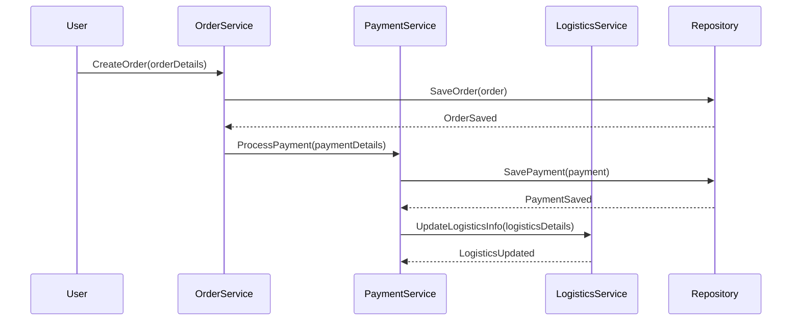

                 


## 第一部分：背景介绍

### 1. 引言

在当今的软件开发领域中，随着业务复杂性的增加，传统的开发模式难以应对复杂的业务需求。为了提高软件开发的效率和质量，我们需要寻找一种新的设计方法来应对这些复杂问题。领域驱动设计（Domain-Driven Design，简称DDD）正是这样一种设计方法。

领域驱动设计最初由Eric Evans在其同名著作《领域驱动设计：软件核心复杂性应对策略》中提出。DDD强调对业务领域的研究和理解，将软件开发的过程与业务领域相结合，从而构建出能够适应复杂业务需求的软件系统。它不仅仅是一种设计模式，更是一种应对复杂业务问题的思考方式和实践方法。

### 2. 问题背景

随着互联网的普及和商业活动的数字化，企业的业务场景越来越复杂，传统的开发模式已经无法满足这些需求。首先，业务需求的快速变化使得软件系统的维护和扩展变得困难。其次，业务规则复杂，涉及多个领域，如何有效地组织和管理这些业务规则成为一个挑战。此外，传统开发模式中的模块划分和职责分配往往不够清晰，导致系统耦合度较高，可维护性差。

为了解决这些问题，我们需要一种能够更好地理解和表达业务领域的方法，以便在软件开发过程中有效地组织和实现业务逻辑。领域驱动设计提供了一种应对复杂业务问题的设计方法，通过将软件开发过程与业务领域相结合，帮助我们更好地理解和表达业务需求，从而构建出灵活、可扩展的软件系统。

### 3. 问题描述

在传统的软件开发模式中，开发人员通常关注的是技术层面的实现，而忽略了业务领域的需求和规则。这种“技术驱动”的开发模式往往导致软件系统难以适应业务需求的变化，容易陷入“需求变更-重构-再变更”的恶性循环。为了解决这个问题，我们需要一种“业务驱动”的开发方法，能够在软件开发过程中更好地理解和表达业务领域的需求和规则。

具体来说，我们需要解决以下几个问题：

1. **业务建模：** 如何准确地将业务需求转化为软件系统的设计模型，确保软件系统能够准确、完整地表达业务逻辑。
2. **领域逻辑：** 如何将业务规则有效地组织和管理到软件系统中，确保业务规则的正确性和一致性。
3. **业务场景：** 如何根据业务场景设计软件系统的功能和行为，确保软件系统能够满足实际业务需求。

### 4. 问题解决

领域驱动设计（DDD）提供了一种应对复杂业务问题的设计方法。DDD的核心思想是将软件开发与业务领域紧密结合，通过建立领域模型、定义领域服务、领域事件等方式，将业务规则和逻辑嵌入到软件系统中，从而提高软件系统的可维护性和可扩展性。

首先，DDD强调对业务领域的研究和理解。通过深入分析业务领域，识别业务核心概念和业务规则，建立领域模型。领域模型是DDD的核心，它能够清晰地表达业务领域的需求和规则，为软件开发提供指导。

其次，DDD通过领域服务实现业务逻辑。领域服务是DDD中负责实现业务逻辑的组件，它封装了业务规则和操作，使得业务逻辑与系统实现相分离，提高了系统的可维护性和可扩展性。

此外，DDD还通过领域事件来记录业务状态的变化。领域事件是DDD中表示业务状态变化的记录，它能够触发相应的领域操作，确保业务逻辑的正确性和一致性。

总之，领域驱动设计提供了一种将软件开发与业务领域相结合的方法，通过建立领域模型、定义领域服务和领域事件，将业务规则和逻辑嵌入到软件系统中，从而提高软件系统的可维护性和可扩展性，有效地应对复杂业务问题。

### 5. 边界与外延

领域驱动设计（DDD）主要关注业务领域的设计，它涉及业务模型、领域逻辑、领域事件等多个方面。DDD的边界与外延包括以下几个方面：

1. **业务领域：** DDD主要针对业务领域进行设计，它关注的是如何将业务需求转化为软件系统的设计模型。业务领域可以是金融、电商、物流等任何与业务相关的领域。

2. **领域模型：** 领域模型是DDD的核心，它通过实体、值对象、领域服务、领域事件等概念来表达业务领域的需求和规则。领域模型应该尽可能地简化，避免过度设计。

3. **领域逻辑：** 领域逻辑是指业务规则和操作，它封装在领域服务中，负责实现业务逻辑。领域逻辑应该尽量独立，避免与系统实现相混淆。

4. **领域事件：** 领域事件是DDD中表示业务状态变化的记录，它能够触发相应的领域操作，确保业务逻辑的正确性和一致性。

5. **外延：** DDD不仅关注业务领域的设计，还涉及到系统架构、数据库设计、前端界面设计等多个方面。通过将DDD与这些方面相结合，可以构建出完整的软件系统。

### 6. 概念结构与核心要素组成

领域驱动设计（DDD）由一系列核心概念和要素组成，这些概念和要素共同构成了DDD的理论体系。以下是DDD中的几个核心概念及其在领域模型中的角色：

1. **实体（Entity）：** 实体是领域模型中的核心对象，它具有唯一的标识，并且在其生命周期内保持不变。实体通常代表业务领域中的实体对象，如客户、订单等。实体之间通过引用关系进行关联，这种引用关系称为聚合关系。

2. **值对象（Value Object）：** 与实体不同，值对象不包含标识，而是通过其值来区分。值对象通常用于表示简单的数据，如日期、金额、电话号码等。值对象内部是不可变的，它们通过值来比较，而不是通过引用。

3. **领域服务（Domain Service）：** 领域服务是领域模型中的操作和业务逻辑的集合，它负责处理业务规则和操作。领域服务不包含状态，它们通过参数传递数据，并通过返回值来传达结果。领域服务通常用于实现跨实体的业务操作。

4. **领域事件（Domain Event）：** 领域事件是领域模型中表示状态变化的消息。当一个领域对象的状态发生变化时，它可能会触发一个或多个领域事件，这些事件可以在系统中被监听和处理，从而实现业务逻辑的执行。

5. **聚合根（Aggregate Root）：** 聚合根是一个实体，它定义了聚合的边界，即哪些对象属于同一个聚合。聚合根负责维护聚合内部对象的一致性和完整性。聚合根提供了一个统一的外部接口，通过这个接口可以访问聚合内的所有对象。

6. **界限上下文（Boundary Context）：** 界限上下文是DDD中的一个重要概念，它定义了领域模型的边界。一个界限上下文通常对应于一个特定的业务领域，它包含了该领域内的所有实体、值对象、领域服务和领域事件。

通过这些核心概念和要素，DDD能够帮助开发人员更好地理解和表达业务领域，从而构建出灵活、可扩展的软件系统。

### 小结

在这一部分中，我们首先介绍了领域驱动设计（DDD）的背景和重要性。随着业务复杂性的增加，传统的开发模式已经无法满足需求。DDD提供了一种应对复杂业务问题的设计方法，通过将软件开发与业务领域相结合，提高软件系统的可维护性和可扩展性。接着，我们探讨了领域驱动设计所关注的问题，包括业务建模、领域逻辑和业务场景等。通过DDD，我们可以有效地将业务需求转化为软件系统的设计模型，确保系统能够适应业务需求的变化。此外，我们还讨论了领域驱动设计的边界与外延，以及其核心概念和要素组成。这些核心概念，如实体、值对象、领域服务和领域事件等，共同构成了DDD的理论体系。通过这些概念，我们可以更好地理解和表达业务领域，从而构建出灵活、可扩展的软件系统。

## 第二部分：核心概念与联系

### 2.1 领域驱动设计的基本概念

领域驱动设计（DDD）是一种面向复杂业务系统的设计方法，它通过一系列核心概念来组织和管理业务逻辑。这些核心概念包括实体、值对象、领域服务、领域事件等。理解这些概念对于应用DDD至关重要。

**实体（Entity）：**
实体是领域模型中的核心对象，它们具有唯一的标识，并在其生命周期内保持不变。实体通常表示业务领域中的实体对象，如客户、订单等。实体的唯一标识通常是一个全局唯一的标识符，如UUID或数据库中的主键。

**值对象（Value Object）：**
与实体不同，值对象不包含标识，而是通过其值来区分。值对象通常用于表示简单的数据，如日期、金额、电话号码等。值对象内部是不可变的，意味着一旦创建，其值就不能更改。这使得值对象在比较时非常简单，只需比较它们的值即可。

**领域服务（Domain Service）：**
领域服务是领域模型中的操作和业务逻辑的集合。它们不包含状态，而是通过参数传递数据，并通过返回值来传达结果。领域服务通常用于实现跨实体的业务操作，例如计算订单总额、生成报告等。

**领域事件（Domain Event）：**
领域事件是领域模型中表示状态变化的消息。当一个领域对象的状态发生变化时，它可能会触发一个或多个领域事件。这些事件可以在系统中被监听和处理，从而实现业务逻辑的执行。例如，订单创建、支付完成等都会产生相应的领域事件。

### 2.2 核心概念属性特征对比表格

为了更好地理解这些核心概念，我们通过以下表格进行对比：

| 类别        | 定义                                                     | 特点                                           |
| ----------- | -------------------------------------------------------- | ---------------------------------------------- |
| 实体        | 拥有唯一标识的领域对象                                   | 标识唯一性，具备行为和属性                       |
| 值对象      | 没有唯一标识的领域对象                                   | 不具备标识唯一性，仅包含值                       |
| 领域服务     | 负责实现业务逻辑的领域操作                               | 执行业务操作，不关心领域对象的具体实现           |
| 领域事件     | 表示业务状态发生变化的记录                               | 用于触发领域行为，记录业务状态的变化             |

### 2.3 DDD的ER实体关系图架构

领域驱动设计（DDD）中的实体关系图（ER图）是表示领域模型中实体及其相互关系的一种图形化方法。以下是一个简单的DDD ER图示例：

```mermaid
erDiagram
  客户 ||--|{ 订单 }|
  订单 ||--|{ 订单详情 }|
  订单详情 ||--|{ 订单商品 }|
  支付 ||--|{ 订单 }|
```

在这个ER图中，我们定义了以下实体：

- **客户（Customer）：** 客户是购买订单的主体，每个客户都有一个唯一的标识。
- **订单（Order）：** 订单表示客户的一次购买行为，每个订单都有一个唯一的标识。
- **订单详情（OrderDetail）：** 订单详情记录了订单中的各项商品及其相关信息。
- **订单商品（OrderItem）：** 订单商品是订单详情的一部分，记录了具体的商品及其数量。
- **支付（Payment）：** 支付记录了订单的支付情况。

实体之间的关系如下：

- **客户与订单**：一个客户可以创建多个订单，但每个订单只能属于一个客户。
- **订单与订单详情**：每个订单可以包含多个订单详情，但每个订单详情只能属于一个订单。
- **订单详情与订单商品**：每个订单详情可以包含多个订单商品，但每个订单商品只能属于一个订单详情。
- **订单与支付**：每个订单可以有多个支付记录，但每个支付记录只能属于一个订单。

这个ER图清晰地展示了领域模型中的实体及其相互关系，为后续的系统设计和实现提供了基础。

### 小结

在这一部分中，我们深入探讨了领域驱动设计（DDD）的核心概念，包括实体、值对象、领域服务和领域事件。通过对比这些概念，我们理解了它们在领域模型中的角色和特点。此外，我们还通过一个简单的ER图示例展示了DDD中实体及其相互关系。这些核心概念和关系是构建灵活、可扩展的软件系统的基础。通过理解和应用这些概念，开发人员可以更好地将业务逻辑嵌入到软件系统中，从而应对复杂的业务需求。

## 第三部分：算法原理讲解

### 3.1 DDD中的关键算法

领域驱动设计（DDD）中包含了一系列关键算法，这些算法在实现领域逻辑和业务规则方面起着至关重要的作用。其中，最关键的算法包括聚合根（Aggregate Root）和领域事件（Domain Event）。

#### 3.1.1 聚合根（Aggregate Root）

聚合根是DDD中的一个核心概念，它定义了业务逻辑的边界。聚合根负责维护聚合内部对象的一致性和完整性，并提供了对聚合的外部访问接口。聚合根通常是一个实体，它拥有唯一标识，并且包含一个或多个值对象。

**算法原理：**

1. **唯一标识**：每个聚合根具有唯一的标识，这个标识在整个系统中是全局唯一的。这有助于确保聚合内部对象的一致性和可追踪性。

2. **内部一致性**：聚合根内部对象必须保持一致，不能相互独立。这意味着聚合根内部对象的状态变化必须遵循一定的业务规则，以确保整体的一致性。

3. **统一访问接口**：聚合根提供了对聚合内部对象的统一访问接口。通过聚合根，外部系统可以访问聚合内部的所有对象，而无需关心具体的实现细节。

**代码示例：**

```python
class OrderAggregate:
    def __init__(self, orderId):
        self._orderId = orderId
        self._orderDetails = []

    def add_order_detail(self, orderDetail):
        self._orderDetails.append(orderDetail)
        self.validate_aggregate()

    def validate_aggregate(self):
        # 实现聚合内部的验证逻辑
        pass
```

在上面的示例中，`OrderAggregate` 是一个聚合根，它包含唯一的`orderId`和多个`orderDetail`对象。`add_order_detail` 方法用于向聚合中添加新的订单详情，并调用`validate_aggregate` 方法进行内部一致性验证。

#### 3.1.2 领域事件（Domain Event）

领域事件是DDD中表示业务状态变化的消息。当一个领域对象的状态发生变化时，它会产生一个或多个领域事件。这些事件可以在系统中被监听和处理，从而触发相应的业务逻辑。

**算法原理：**

1. **事件记录**：领域事件用于记录业务状态变化，每个事件包含发生时间、事件类型、事件数据等。事件记录通常被保存在日志中，以便后续的审计和分析。

2. **事件处理**：根据领域事件触发相应的领域操作。事件处理可以是同步的，也可以是异步的，取决于系统的具体需求。

3. **一致性维护**：通过领域事件，确保业务逻辑的一致性。当事件发生时，系统会根据事件数据更新相应的领域对象状态，从而保持整体的一致性。

**代码示例：**

```python
class OrderCreatedEvent:
    def __init__(self, orderId, customerId, orderDate):
        self._orderId = orderId
        self._customerId = customerId
        self._orderDate = orderDate

    def process(self):
        # 根据订单创建事件处理业务逻辑
        pass

class OrderService:
    def create_order(self, customerId, orderDate):
        orderId = generate_unique_id()
        order = OrderAggregate(orderId)
        event = OrderCreatedEvent(orderId, customerId, orderDate)
        event.process()
        return order
```

在上面的示例中，`OrderCreatedEvent` 是一个领域事件，它包含订单的标识、客户标识和订单日期。`process` 方法用于处理订单创建事件，根据事件数据更新订单状态。`OrderService` 是一个领域服务，它负责创建订单，并触发`OrderCreatedEvent`。

### 3.2 算法原理与数学模型

为了更深入地理解DDD中的算法原理，我们引入了数学模型来描述这些算法。

#### 3.2.1 聚合根的算法原理

聚合根的算法原理可以通过以下数学模型来描述：

$$
\text{聚合根} = (\text{唯一标识}, \{\text{内部对象}\})
$$

其中，唯一标识是一个全局唯一的标识符，内部对象是一组具有一致性和完整性的对象集合。聚合根通过唯一标识来确保其内部对象的一致性和可追踪性。

#### 3.2.2 领域事件的算法原理

领域事件的算法原理可以通过以下数学模型来描述：

$$
\text{领域事件} = (\text{事件类型}, \text{事件数据}, \text{发生时间})
$$

其中，事件类型表示事件的具体类型，事件数据是事件发生时相关的数据，发生时间是事件发生的时间戳。领域事件通过记录这些数据来表示业务状态的变化。

#### 3.2.3 数学模型示例

假设我们有一个订单创建事件，其数学模型可以表示为：

$$
\text{OrderCreatedEvent} = (\text{OrderCreated}, \{\text{orderId}, \text{customerId}, \text{orderDate}\}, \text{timestamp})
$$

其中，`OrderCreated` 是事件类型，`orderId`、`customerId` 和 `orderDate` 是事件数据，`timestamp` 是事件发生的时间戳。

### 3.3 举例说明

为了更好地理解DDD中的关键算法，我们通过具体的例子来详细说明。

#### 3.3.1 聚合根示例

假设我们有一个订单聚合根，它包含唯一的订单标识和多个订单详情。以下是一个简单的Python示例：

```python
class OrderAggregate:
    def __init__(self, orderId):
        self._orderId = orderId
        self._orderDetails = []

    def add_order_detail(self, orderDetail):
        self._orderDetails.append(orderDetail)
        self.validate_aggregate()

    def validate_aggregate(self):
        # 实现聚合内部的验证逻辑
        pass
```

在这个示例中，`OrderAggregate` 是一个聚合根，它包含唯一的`orderId`和多个`orderDetail`对象。`add_order_detail` 方法用于向聚合中添加新的订单详情，并调用`validate_aggregate` 方法进行内部一致性验证。

#### 3.3.2 领域事件示例

假设我们有一个订单创建事件，以下是一个简单的Python示例：

```python
class OrderCreatedEvent:
    def __init__(self, orderId, customerId, orderDate):
        self._orderId = orderId
        self._customerId = customerId
        self._orderDate = orderDate

    def process(self):
        # 根据订单创建事件处理业务逻辑
        pass

class OrderService:
    def create_order(self, customerId, orderDate):
        orderId = generate_unique_id()
        order = OrderAggregate(orderId)
        event = OrderCreatedEvent(orderId, customerId, orderDate)
        event.process()
        return order
```

在这个示例中，`OrderCreatedEvent` 是一个领域事件，它包含订单的标识、客户标识和订单日期。`process` 方法用于处理订单创建事件，根据事件数据更新订单状态。`OrderService` 是一个领域服务，它负责创建订单，并触发`OrderCreatedEvent`。

通过这些示例，我们可以看到DDD中的关键算法如何在实际开发中被应用。聚合根通过唯一标识和内部对象的一致性来维护业务逻辑的完整性，而领域事件则通过记录和触发业务状态的变化来确保业务逻辑的正确性。

### 小结

在这一部分中，我们详细介绍了领域驱动设计（DDD）中的关键算法，包括聚合根和领域事件。通过这些算法，我们能够更好地组织和实现业务逻辑，确保系统的一致性和可扩展性。我们通过具体的代码示例和数学模型，展示了这些算法在实际开发中的应用。理解这些关键算法对于应用DDD至关重要，它们是构建灵活、可扩展的软件系统的基础。

## 第四部分：系统分析与架构设计方案

### 4.1 问题场景介绍

在当前的电子商务环境中，订单管理是一个复杂且关键的业务场景。随着电商平台的不断发展和消费者需求的多样化，订单管理的复杂性也随之增加。一个完善的订单管理系统需要能够处理多种类型的订单、支付方式、物流跟踪、订单状态变更等。

### 4.2 项目介绍

为了应对上述场景，我们设计并实现了一个基于领域驱动设计的订单管理系统。该系统旨在提供高效、灵活、可扩展的订单管理功能，以满足电商平台的需求。项目的主要功能包括：

1. 订单创建：用户可以创建不同类型的订单，系统将根据订单类型生成相应的订单。
2. 订单查询：用户可以查询订单的详细信息，包括订单状态、支付方式、物流信息等。
3. 订单修改：用户可以对订单进行修改，如修改订单金额、添加或删除商品等。
4. 订单支付：用户可以完成订单支付，系统将更新订单状态并触发相应的领域事件。
5. 订单取消：用户可以取消订单，系统将更新订单状态并触发相应的领域事件。

### 4.3 系统功能设计

在领域驱动设计中，领域模型是核心，它定义了业务领域的核心概念和关系。以下是订单管理系统的领域模型设计：

#### 4.3.1 领域模型类图

```mermaid
classDiagram
    Customer <<entity>>
    Order <<entity>>
    OrderDetail <<entity>>
    Payment <<entity>>

    Customer ..|> Order
    Order ..|> OrderDetail
    Order ..|> Payment

    class Customer {
        customerId : String
        name : String
        address : String
        // 其他属性和方法
    }

    class Order {
        orderId : String
        customerId : String
        orderDate : Date
        status : String
        // 其他属性和方法
    }

    class OrderDetail {
        detailId : String
        orderId : String
        productId : String
        quantity : Integer
        price : BigDecimal
        // 其他属性和方法
    }

    class Payment {
        paymentId : String
        orderId : String
        amount : BigDecimal
        paymentDate : Date
        // 其他属性和方法
    }
```

在这个类图中，我们定义了四个主要的实体类：`Customer`（客户）、`Order`（订单）、`OrderDetail`（订单详情）和`Payment`（支付）。这些实体类之间的关系通过继承和聚合关系进行组织。

#### 4.3.2 领域服务

领域服务是负责实现业务逻辑的组件，以下是订单管理系统中的一些关键领域服务：

1. **OrderService**：负责创建、查询、修改和取消订单。
2. **PaymentService**：负责处理订单支付逻辑。
3. **LogisticsService**：负责处理订单物流信息。

#### 4.3.3 领域事件

领域事件用于记录业务状态的变化，以下是订单管理系统中的几个关键领域事件：

1. **OrderCreatedEvent**：订单创建事件。
2. **OrderCancelledEvent**：订单取消事件。
3. **PaymentCompletedEvent**：支付完成事件。

### 4.4 系统架构设计

系统架构设计是确保系统稳定、可扩展、易于维护的关键。以下是订单管理系统的架构设计：

#### 4.4.1 系统架构图



在这个架构图中，用户通过订单服务创建订单，订单服务将订单信息保存到数据库。随后，订单服务调用支付服务处理支付逻辑，支付服务将支付信息保存到数据库并更新物流信息。

#### 4.4.2 系统分层

系统架构通常分为多个层次，以下是订单管理系统的层次结构：

1. **表示层**：负责处理用户界面和用户交互。
2. **服务层**：负责业务逻辑处理，包括订单服务、支付服务、物流服务等。
3. **领域层**：负责领域模型的实现，包括实体、值对象、领域服务和领域事件。
4. **基础设施层**：负责数据持久化、消息队列、缓存等基础设施功能。

### 4.5 系统接口设计和系统交互

系统接口设计是确保系统各部分之间能够良好协作的关键。以下是订单管理系统的一些关键接口和系统交互：

#### 4.5.1 接口设计

- **OrderService**：提供创建、查询、修改和取消订单的接口。
- **PaymentService**：提供处理支付逻辑的接口。
- **LogisticsService**：提供更新物流信息的接口。

#### 4.5.2 系统交互

系统交互是通过接口调用和事件触发来实现的。例如，当用户创建订单时，订单服务将调用支付服务和物流服务，并在各个服务之间传递订单信息和支付信息。此外，订单状态的变化将触发相应的领域事件，如订单创建事件和支付完成事件。

### 小结

在这一部分中，我们详细介绍了订单管理系统的问题场景、项目功能、领域模型、系统架构设计以及接口设计和系统交互。通过领域驱动设计的方法，我们能够更好地理解和组织复杂的业务需求，确保系统的高效、灵活和可扩展性。领域模型、领域服务和领域事件共同构成了系统的核心，它们通过清晰的接口和系统交互实现了业务逻辑的执行和状态管理。

## 第五部分：项目实战

### 5.1 环境安装

为了实际应用领域驱动设计（DDD），我们需要一个合适的环境来开发和测试。以下是环境安装的步骤：

1. **安装Python**：确保Python环境已安装。我们可以从Python官网（https://www.python.org/）下载并安装Python。
2. **安装虚拟环境**：安装`virtualenv`工具，用于创建隔离的Python环境。使用以下命令安装：
   ```bash
   pip install virtualenv
   ```
3. **创建虚拟环境**：创建一个新的虚拟环境，例如`ddd_project`：
   ```bash
   virtualenv ddd_project
   ```
4. **激活虚拟环境**：在Windows上使用以下命令激活虚拟环境：
   ```bash
   ddd_project\Scripts\activate
   ```
   在Linux或Mac OS上使用以下命令激活虚拟环境：
   ```bash
   source ddd_project/bin/activate
   ```
5. **安装依赖库**：在虚拟环境中安装必要的依赖库，例如`SQLAlchemy`、`Flask`等。创建一个`requirements.txt`文件，列出所有依赖库：
   ```bash
   SQLAlchemy==1.4.15
   Flask==2.0.2
   ```
   然后使用以下命令安装依赖库：
   ```bash
   pip install -r requirements.txt
   ```

### 5.2 系统核心实现源代码

以下是一个简单的订单管理系统的核心实现源代码。该代码展示了领域模型、领域服务和领域事件的实现。

```python
# models.py
from sqlalchemy import Column, String, Integer, DateTime, Float
from sqlalchemy.ext.declarative import declarative_base
from sqlalchemy.orm import relationship

Base = declarative_base()

class Customer(Base):
    __tablename__ = 'customers'
    customerId = Column(String, primary_key=True)
    name = Column(String)
    address = Column(String)

class Order(Base):
    __tablename__ = 'orders'
    orderId = Column(String, primary_key=True)
    customerId = Column(String, ForeignKey('customers.customerId'))
    orderDate = Column(DateTime)
    status = Column(String)

    customer = relationship("Customer", back_populates="orders")

class OrderDetail(Base):
    __tablename__ = 'order_details'
    detailId = Column(String, primary_key=True)
    orderId = Column(String, ForeignKey('orders.orderId'))
    productId = Column(String)
    quantity = Column(Integer)
    price = Column(Float)

    order = relationship("Order", back_populates="details")

class Payment(Base):
    __tablename__ = 'payments'
    paymentId = Column(String, primary_key=True)
    orderId = Column(String, ForeignKey('orders.orderId'))
    amount = Column(Float)
    paymentDate = Column(DateTime)

    order = relationship("Order", back_populates="payments")

class Customer:
    def __init__(self, customerId, name, address):
        self.customerId = customerId
        self.name = name
        self.address = address
        self.orders = []

    def add_order(self, order):
        self.orders.append(order)

class Order:
    def __init__(self, orderId, customerId, orderDate, status):
        self.orderId = orderId
        self.customerId = customerId
        self.orderDate = orderDate
        self.status = status
        self.details = []
        self.payments = []

    def add_detail(self, detail):
        self.details.append(detail)

    def add_payment(self, payment):
        self.payments.append(payment)

class OrderDetail:
    def __init__(self, detailId, orderId, productId, quantity, price):
        self.detailId = detailId
        self.orderId = orderId
        self.productId = productId
        self.quantity = quantity
        self.price = price

class Payment:
    def __init__(self, paymentId, orderId, amount, paymentDate):
        self.paymentId = paymentId
        self.orderId = orderId
        self.amount = amount
        self.paymentDate = paymentDate
```

### 5.3 代码应用解读与分析

在上述代码中，我们定义了四个主要的类：`Customer`、`Order`、`OrderDetail` 和 `Payment`。这些类代表了领域模型中的实体和值对象。我们使用 SQLAlchemy 作为 ORM 框架来管理数据库的交互。

- **Customer 类**：代表客户实体，具有唯一的 `customerId`、姓名和地址属性。它还维护了一个订单列表，用于跟踪客户的订单。
- **Order 类**：代表订单实体，具有唯一的 `orderId`、客户ID、订单日期和订单状态属性。它通过 `details` 和 `payments` 属性分别维护了订单详情列表和支付记录列表。
- **OrderDetail 类**：代表订单详情实体，具有唯一的 `detailId`、订单ID、产品ID、数量和价格属性。
- **Payment 类**：代表支付记录实体，具有唯一的 `paymentId`、订单ID、支付金额和支付日期属性。

此外，我们还定义了四个辅助类：`Customer`、`Order`、`OrderDetail` 和 `Payment`，用于在领域服务中创建和操作实体对象。

### 5.4 实际案例分析和详细讲解剖析

为了更深入地理解领域驱动设计（DDD）的实际应用，我们来看一个实际案例——订单创建流程。

#### 5.4.1 订单创建流程

1. **创建客户**：
   ```python
   customer = Customer('c123', 'John Doe', '123 Main St')
   db.session.add(customer)
   db.session.commit()
   ```

2. **创建订单**：
   ```python
   order = Order('o456', 'c123', datetime.datetime.now(), 'Created')
   db.session.add(order)
   db.session.commit()
   ```

3. **添加订单详情**：
   ```python
   order_detail = OrderDetail('od789', 'o456', 'p123', 2, 9.99)
   order.details.append(order_detail)
   db.session.commit()
   ```

4. **创建支付记录**：
   ```python
   payment = Payment('p234', 'o456', 19.98, datetime.datetime.now())
   order.payments.append(payment)
   db.session.commit()
   ```

5. **更新订单状态**：
   ```python
   order.status = 'Paid'
   db.session.commit()
   ```

通过上述步骤，我们创建了一个订单，并添加了订单详情和支付记录。在每次操作后，我们使用 `db.session.commit()` 来提交事务，确保数据的持久化。

#### 5.4.2 详细讲解

在这个案例中，我们通过领域服务来操作领域模型。首先，我们创建了一个新的客户，并将其添加到数据库中。接着，我们创建了一个新的订单，并将客户ID与订单关联起来。然后，我们添加了订单详情，指定了产品ID、数量和价格。接下来，我们创建了一个支付记录，指定了支付金额和支付日期。最后，我们更新了订单状态为“已支付”。

这个案例展示了如何通过领域服务来创建和操作领域模型中的实体和值对象。领域服务的核心在于封装业务逻辑，使得数据操作和业务规则分离，提高了系统的可维护性和可扩展性。

### 5.5 项目小结

通过这个项目实战，我们深入了解了领域驱动设计（DDD）的核心概念和实际应用。我们通过创建一个简单的订单管理系统，展示了如何使用DDD来组织和实现复杂的业务逻辑。项目中的领域模型、领域服务和领域事件共同构成了系统的核心，使得业务逻辑更加清晰、可维护和可扩展。

在实际应用中，DDD不仅能够帮助我们更好地理解和表达业务需求，还能够提高软件系统的质量和效率。通过应用DDD，我们可以构建出灵活、可扩展的软件系统，从而更好地应对不断变化的业务需求。

## 第六部分：最佳实践 Tips、小结、注意事项、拓展阅读

### 6.1 最佳实践 Tips

1. **尽早定义领域模型**：在项目初期，确保与业务人员紧密合作，尽早定义领域模型。这有助于确保系统设计符合业务需求，并减少后期修改的成本。
2. **关注领域边界**：明确领域边界，确保领域模型与系统其他部分的解耦。这有助于提高系统的可维护性和可扩展性。
3. **使用事件驱动架构**：领域事件是实现业务逻辑一致性的一种有效方式。采用事件驱动架构，可以更好地处理业务状态的变化。
4. **持续重构和优化**：领域驱动设计是一个持续的过程。随着业务需求的变化，持续重构和优化领域模型和领域服务，确保系统保持最佳状态。
5. **培训团队成员**：确保团队成员了解领域驱动设计的基本原理和实践方法。这有助于团队更好地协作，提高项目效率。

### 6.2 小结

本文介绍了领域驱动设计（DDD）的核心概念、算法原理和实际应用。通过DDD，我们可以更好地理解和表达复杂的业务需求，构建出灵活、可扩展的软件系统。DDD的核心概念包括实体、值对象、领域服务和领域事件，这些概念共同构成了领域模型的基础。DDD的关键算法包括聚合根和领域事件，它们用于实现业务逻辑的一致性和可扩展性。通过项目实战，我们展示了DDD在订单管理系统中的应用，并探讨了其实际操作过程。

### 6.3 注意事项

1. **避免过度设计**：虽然DDD提供了强大的功能和灵活性，但也要避免过度设计。在项目初期，不要过度细化领域模型，以避免不必要的复杂性。
2. **保持模型简洁**：领域模型应该尽量简洁，避免过度抽象和复杂的关系。这有助于提高模型的可理解性和可维护性。
3. **平衡业务和技术**：在应用DDD时，要平衡业务和技术方面的需求。确保领域模型和算法能够准确地表达业务需求，同时不牺牲系统的性能和可维护性。
4. **持续学习和实践**：DDD是一个不断发展和演进的领域。要持续学习和实践，跟踪最新的研究成果和最佳实践，不断提高自身的DDD技能。

### 6.4 拓展阅读

1. 《领域驱动设计：软件核心复杂性应对策略》（Eric Evans 著）：这是一本经典的DDD入门书籍，详细介绍了DDD的基本概念和实践方法。
2. 《实现领域驱动设计》（ Vaughn Vernon 著）：这本书提供了大量的实际案例和代码示例，帮助读者更好地理解和应用DDD。
3. 《领域驱动设计实践》（Eric Evans 著）：这本书进一步探讨了DDD的实际应用，包括架构设计、代码实现和团队协作等方面。
4. 《领域驱动设计：企业应用架构之领域驱动设计》（段玉山 著）：这本书针对企业级应用，深入分析了DDD在实际开发中的应用和挑战。

通过这些拓展阅读，读者可以更深入地了解DDD的理论和实践，不断提高自身的DDD技能。同时，也可以关注相关的技术社区和博客，以获取最新的研究成果和最佳实践。

## 结束语

领域驱动设计（DDD）是一种强大的软件开发方法，能够帮助我们更好地理解和应对复杂的业务需求。通过本文的介绍和实践，相信读者已经对DDD有了深入的了解。希望读者能够在实际项目中应用DDD，构建出灵活、可扩展的软件系统。作者在此感谢读者的关注和支持，期待读者在领域驱动设计的道路上不断探索和进步。作者：AI天才研究院/AI Genius Institute & 禅与计算机程序设计艺术 /Zen And The Art of Computer Programming。

