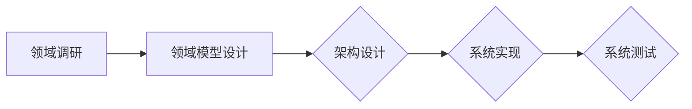
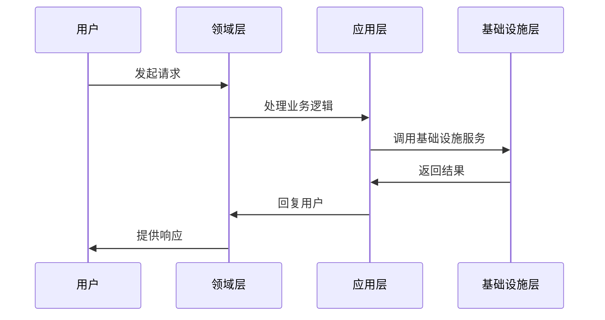
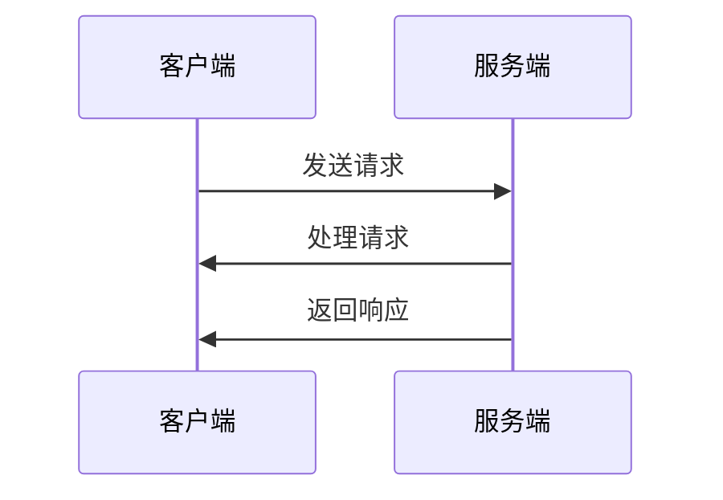

                 


# 领域驱动设计（DDD）：复杂业务系统的解决之道

> 关键词：领域驱动设计，复杂业务系统，架构设计，系统开发

> 摘要：本文将深入探讨领域驱动设计（DDD）的基本概念、原理和在实际项目中的应用，通过详细的章节结构，帮助读者全面理解DDD在复杂业务系统开发中的重要性，并提供实战指导。

## 第一部分: DDD基础知识

### 第1章: DDD概述

#### 1.1 DDD的基本概念

**1.1.1 DDD的定义**

领域驱动设计（Domain-Driven Design，简称DDD）是一种软件开发方法，旨在通过关注领域模型和领域逻辑来提高软件系统的可维护性和可扩展性。DDD强调在软件开发过程中，领域模型是核心，而不是传统的面向对象设计中的类和对象。

**1.1.2 DDD的背景**

DDD的概念最早由Eric Evans在其同名书籍《领域驱动设计》中提出。它是对传统的面向对象设计的补充和扩展，尤其适用于复杂业务系统的开发。

**1.1.3 DDD的重要性**

DDD的重要性体现在以下几个方面：

1. **提高系统可维护性**：通过清晰的领域模型，降低了系统复杂度，提高了代码的可维护性。
2. **促进团队协作**：DDD强调领域专家和开发者的紧密合作，有助于提升团队的整体工作效率。
3. **增强系统可扩展性**：DDD的架构设计能够更好地应对业务需求的变化，提高系统的可扩展性。

#### 1.2 DDD的核心概念与联系

**1.2.1 DDD的基本原理**

DDD的核心原理包括：

1. **领域模型**：领域模型是DDD的基石，它抽象了业务领域的核心概念和逻辑。
2. **分层架构**：DDD采用分层架构，将系统划分为不同的层，如领域层、应用层、基础设施层等。
3. **聚合与边界**：聚合是DDD中的一个核心概念，代表了业务领域的核心单元，边界则定义了聚合之间的交互规则。

**1.2.1.1 DDD的实体关系图**

使用Mermaid绘制DDD的实体关系图，展示领域模型中的关键实体及其关系。

```mermaid
erDiagram
    Order ||--o{ Customer : "Knows customer info" }
    Order ||--|{ LineItem : "Contains products info" }
    Product ||--|{ Inventory : "Stock info" }
```

**1.2.1.2 DDD的聚合与边界**

聚合是DDD中的一个核心概念，代表了业务领域的核心单元。边界则定义了聚合之间的交互规则。

**1.2.1.3 DDD的领域事件与命令**

领域事件是业务领域中发生的特定事件，如订单创建、产品库存更新等。命令则表示对领域事件的响应，如创建订单、更新库存等。

#### 1.3 DDD的算法原理讲解

**1.3.1 DDD的核心算法**

DDD的核心算法包括领域模型设计、分层架构设计和系统交互设计等。

**1.3.1.1 DDD的数学模型**

DDD的数学模型主要包括领域模型中的实体关系、聚合划分和边界定义等。

**1.3.1.2 DDD的算法流程图**

使用Mermaid绘制DDD的算法流程图，展示DDD的设计过程。



**1.3.1.3 DDD的算法示例**

通过一个示例，展示DDD算法的应用。

```python
# 示例：订单创建
class Order:
    def __init__(self, customer, line_items):
        self.customer = customer
        self.line_items = line_items

    def create_order(self):
        # 订单创建逻辑
        print("Order created.")

# 示例：库存更新
class Inventory:
    def __init__(self, products):
        self.products = products

    def update_inventory(self, product, quantity):
        # 更新库存逻辑
        print(f"{product} inventory updated to {quantity} units.")
```

#### 1.4 DDD的应用场景

**1.4.1 DDD在大型系统中的应用**

DDD在大型系统开发中具有显著优势，能够帮助团队更好地理解复杂的业务逻辑，提高系统的可维护性和可扩展性。

**1.4.2 DDD在业务系统中的应用**

DDD在业务系统中的应用非常广泛，如电子商务系统、金融系统、医疗系统等，能够有效提升系统的业务响应速度。

**1.4.3 DDD在分布式系统中的应用**

在分布式系统中，DDD能够帮助团队更好地管理分布式服务，提高系统的可靠性和可扩展性。

#### 1.5 DDD的系统架构设计

**1.5.1 DDD的系统功能设计**

DDD的系统功能设计主要包括领域模型设计、系统功能划分和接口设计等。

**1.5.1.1 DDD的领域模型设计**

使用Mermaid绘制DDD的领域模型设计图，展示系统中的关键领域实体和关系。

```mermaid
classDiagram
    Order "订单" <<entity>>
    Customer "客户" <<entity>>
    Product "产品" <<entity>>
    Inventory "库存" <<entity>>
    Order "订单" --|{1}-->"知悉" Customer "客户"
    Order "订单" *--* LineItem "订单条目"
    Product "产品" *--* Inventory "库存"
```

**1.5.1.2 DDD的系统架构设计**

使用Mermaid绘制DDD的系统架构设计图，展示系统的分层架构和组件关系。



**1.5.1.3 DDD的系统接口设计**

DDD的系统接口设计主要包括领域服务接口、应用服务接口和基础设施服务接口等。

**1.5.2 DDD的系统交互设计**

使用Mermaid绘制DDD的系统交互设计图，展示系统组件之间的交互流程。



#### 1.6 本章小结

本章介绍了领域驱动设计（DDD）的基本概念、原理和应用场景。通过DDD，开发团队能够更好地理解和应对复杂的业务需求，提高软件系统的可维护性和可扩展性。在下一章中，我们将深入探讨DDD的核心算法和系统架构设计。

## 第二部分: DDD实战应用

### 第2章: DDD项目实战

#### 2.1 项目背景

本次实战项目是一个在线购物系统，提供用户注册、登录、浏览商品、下单、支付等功能。系统需要处理大量的用户请求和数据，因此采用DDD方法进行架构设计。

#### 2.2 环境安装

1. 安装Python环境
2. 安装Docker和Docker Compose
3. 安装数据库（如MySQL或PostgreSQL）
4. 安装消息队列（如RabbitMQ）

#### 2.3 系统核心实现源代码

以下是一个简化的订单服务实现示例：

```python
# app.py
from domain.order import Order
from infrastructure.db import Database
from infrastructure.messaging import MessageQueue

def create_order(customer_id, line_items):
    order = Order(customer_id, line_items)
    Database.save(order)
    MessageQueue.publish("order_created", order.id)
    return order.id

if __name__ == "__main__":
    create_order("customer_1", [{"product_id": "product_1", "quantity": 2}])
```

#### 2.4 代码应用解读与分析

1. **领域模型**：订单服务定义了`Order`类，用于表示订单实体，包含客户ID和订单条目等信息。
2. **基础设施**：数据库和服务消息队列用于持久化和异步处理。
3. **应用层**：`create_order`函数负责创建订单，并触发消息队列发布订单创建事件。

#### 2.5 实际案例分析和详细讲解剖析

**案例1：订单创建**

1. 用户发起创建订单请求。
2. 应用层处理请求，创建订单对象。
3. 数据库持久化订单信息。
4. 消息队列发布订单创建事件。

**案例2：订单查询**

1. 用户发起查询订单请求。
2. 应用层查询数据库，获取订单信息。
3. 应用层返回订单信息给用户。

#### 2.6 项目小结

通过本次实战项目，我们深入了解了DDD在在线购物系统中的应用。DDD方法帮助我们将复杂的业务需求转化为清晰的领域模型，提高了系统的可维护性和可扩展性。在后续的项目开发中，我们可以继续优化和改进DDD的应用。

## 第三部分: DDD最佳实践

### 第3章: DDD最佳实践

#### 3.1 DDD设计原则

1. **简洁性**：确保领域模型简洁明了，避免过度设计。
2. **完整性**：覆盖所有业务场景，确保领域模型的完整性。
3. **一致性**：确保领域模型与实际业务一致，避免逻辑错误。

#### 3.2 领域专家与开发者的协作

1. **定期沟通**：确保领域专家和开发者之间的沟通畅通。
2. **共同编写文档**：领域专家和开发者共同编写领域模型文档。
3. **持续迭代**：根据业务需求的变化，持续优化领域模型。

#### 3.3 DDD工具推荐

1. **领域模型工具**：如PlantUML、Visual Paradigm等。
2. **代码生成工具**：如Spring Boot Generator、MyBatis Generator等。
3. **持续集成工具**：如Jenkins、GitLab CI等。

#### 3.4 注意事项

1. **避免过度抽象**：确保领域模型能够真实反映业务逻辑。
2. **考虑性能优化**：在领域模型设计时，考虑性能优化。
3. **遵循最佳实践**：遵循DDD的最佳实践，提高开发效率。

### 第4章: 小结与拓展阅读

#### 4.1 小结

本文通过详细的章节结构，介绍了领域驱动设计（DDD）的基本概念、原理和实战应用。DDD方法能够显著提高复杂业务系统的可维护性和可扩展性，是现代软件开发的重要方法。

#### 4.2 拓展阅读

1. 《领域驱动设计》——Eric Evans
2. 《大话设计模式》——程杰
3. 《Spring Boot实战》——刘博

## 作者信息

作者：AI天才研究院/AI Genius Institute & 禅与计算机程序设计艺术 /Zen And The Art of Computer Programming

---

通过本文的深入探讨，读者应该对领域驱动设计（DDD）有了更全面的理解，并能够将其应用于实际项目开发中。希望本文能够为读者的软件开发之路提供有价值的参考和启示。

