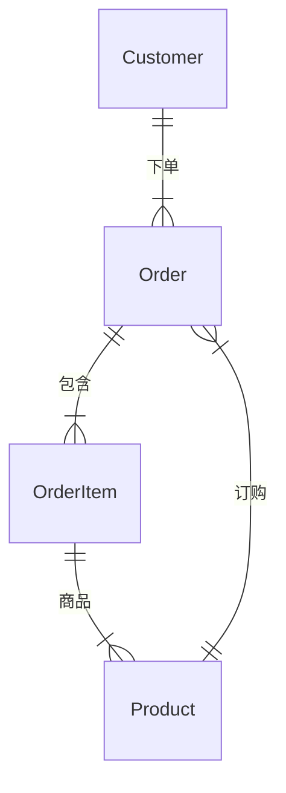
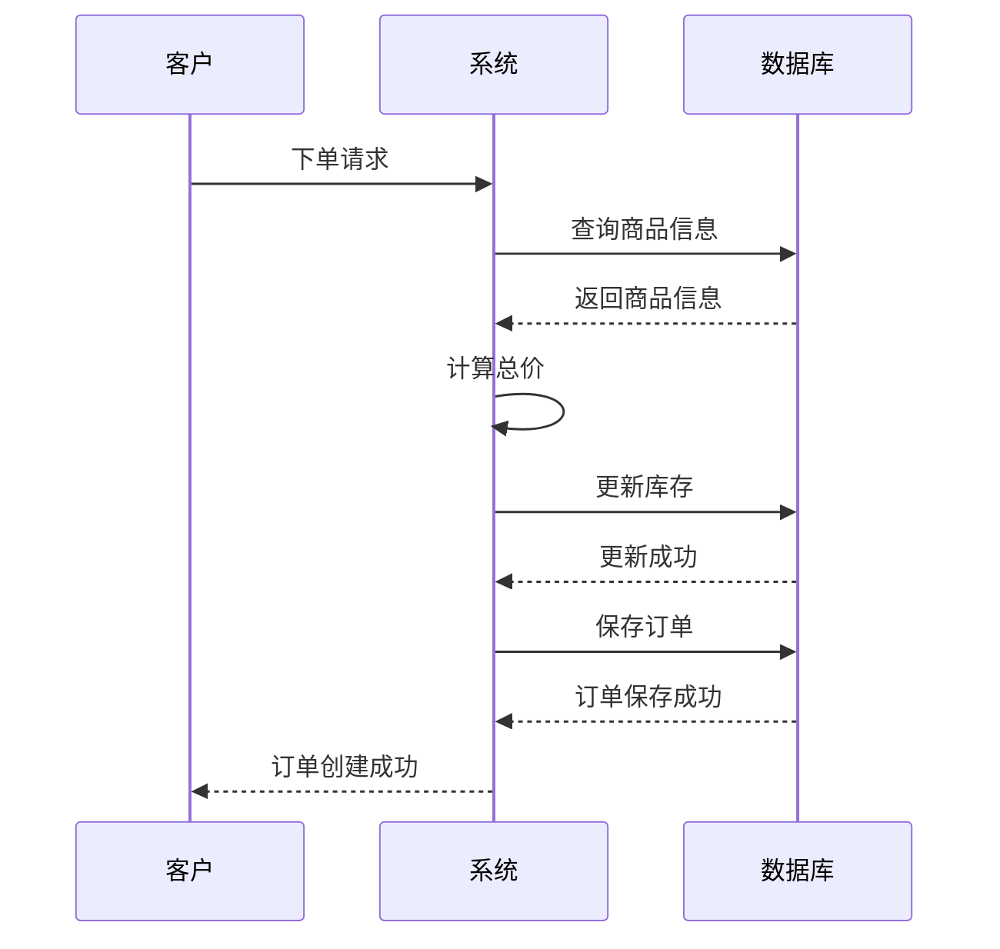
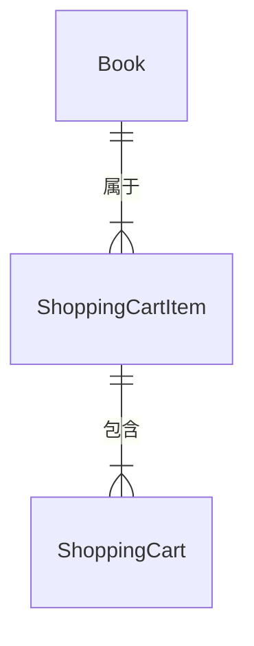
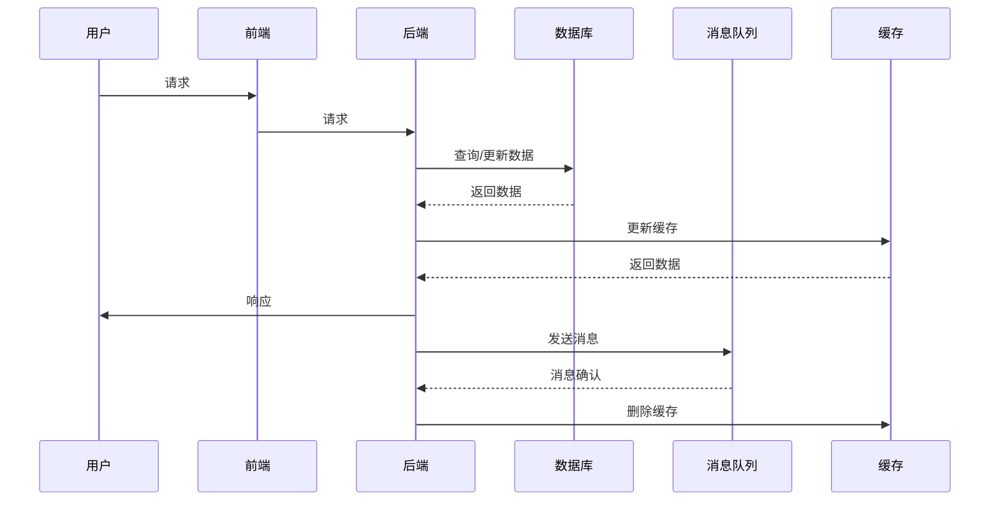
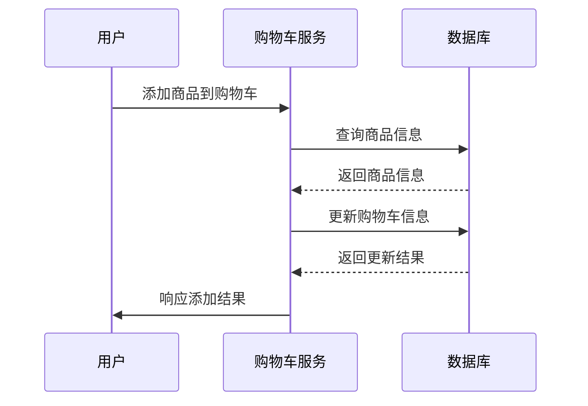

                 


### 第4章：问题解决

领域驱动设计（DDD）通过以下方法和原则，提供了解决复杂业务系统设计问题的有效途径：

1. **领域模型建立**：DDD 强调建立一个清晰、精确的领域模型，将业务概念、规则和关系映射到软件系统中。领域模型有助于团队更好地理解业务需求，降低开发过程中的误解和歧义。

2. **聚合与边界**：DDD 引入“聚合”概念，将具有内在一致性的业务实体集合在一起，形成独立的业务单元。这些聚合通过明确的边界进行隔离，确保了系统组件之间的低耦合和高内聚。

3. **领域服务与资源库**：领域服务负责处理复杂的业务逻辑，而资源库则存储持久化的领域实体。这种分离设计有助于保持业务逻辑的清晰性和可维护性。

4. **事件驱动架构**：DDD 倡导使用事件驱动的方式来处理业务变化，使得系统更加灵活和可扩展。通过事件的发布和订阅机制，系统能够在发生变更时做出及时响应。

5. **代码实体与业务概念一致性**：DDD 强调代码实体与业务概念的一致性，确保系统的设计紧密贴合业务需求。这种方式有助于开发人员更好地理解业务逻辑，减少错误和重复工作。

6. **实体与值对象**：DDD 区分实体和值对象，实体具有身份（ID），可以独立存在并参与复杂业务操作，而值对象则仅代表一组属性的集合，通常用于传递数据。

### 第5章：边界与外延

在DDD中，边界与外延的概念至关重要，它们帮助定义系统的结构，增强系统的内聚性和灵活性。

- **边界**：边界定义了系统内部组件（如实体、服务、资源库）之间的交互点。一个良好的边界能够减少组件之间的依赖，使得系统更加模块化。在DDD中，常用的边界是聚合边界，它封装了具有一致性的领域实体。

- **外延**：外延则定义了领域模型与外部系统（如数据库、消息队列、外部服务）的交互点。通过清晰的外延设计，系统能够有效地与外部系统进行通信，同时保持领域模型的完整性。

### 第6章：核心概念

DDD中包含了一系列核心概念，这些概念共同构成了领域驱动设计的基础。

- **领域**：领域是DDD中用于表示业务概念和规则的整体空间。它将业务知识映射到软件中，是DDD设计的起点。

- **子领域**：子领域是领域的一部分，专注于特定的业务领域。子领域有助于将复杂的业务分解为更小的、易于管理的部分。

- **实体**：实体是具有唯一标识的领域对象，如客户、订单等。实体表示业务中的具体事物，并参与复杂业务操作。

- **值对象**：值对象是具有一组属性的对象，但它们没有唯一的标识。值对象通常用于表示业务中的具体值，如价格、日期等。

- **聚合**：聚合是一组紧密关联的实体和值对象的集合，代表了一个独立的业务单元。聚合通过边界定义了其内部组件之间的交互规则。

- **领域服务**：领域服务是处理复杂业务逻辑的组件，它们操作聚合，并在聚合之间传递信息。

- **资源库**：资源库是持久化存储领域实体的组件。它提供了访问领域实体的持久化存储机制。

### 第7章：领域模型设计

领域模型是DDD设计的核心，它将业务概念、规则和关系映射到软件系统中。设计领域模型时，可以遵循以下步骤：

1. **识别业务事件**：从业务需求中识别出关键的业务事件，如订单创建、支付成功等。

2. **定义实体和值对象**：根据业务事件，识别出实体和值对象，并定义它们的基本属性和关系。

3. **创建实体关系图**：使用实体关系图（ER图）来表示实体和值对象之间的静态关系。

4. **定义领域服务**：识别出处理复杂业务逻辑的服务，并定义它们的接口和行为。

5. **划分聚合**：将实体和值对象组织成聚合，确保聚合具有清晰的边界和内聚性。

6. **定义领域事件**：识别出领域模型中的关键事件，并定义它们的类型和处理方式。

通过上述步骤，可以创建一个清晰、精确的领域模型，为后续的系统设计提供基础。

### 第8章：实体关系图架构

实体关系图（ER图）是领域模型设计的重要组成部分，它用于表示实体和值对象之间的静态关系。在设计实体关系图时，可以遵循以下步骤：

1. **定义实体**：识别出业务领域中的关键实体，如客户、订单、产品等，并为每个实体定义一个唯一的标识。

2. **定义关系**：根据业务逻辑，确定实体之间的关系，如一对一、一对多、多对多等。使用适当的符号来表示这些关系。

3. **定义属性**：为每个实体和值对象定义其属性。属性可以是基本的（如名称、地址）或复合的（如日期、价格）。

4. **定义主键和外键**：为主键和外键定义适当的约束，确保数据的完整性和一致性。

5. **绘制实体关系图**：使用Mermaid或其他工具绘制实体关系图，以便清晰地表示实体和值对象之间的静态关系。

以下是一个简单的实体关系图示例：



在这个示例中，`Customer`、`Order`、`Product`和`OrderItem`是实体，`Order`与`Customer`之间存在一对一关系，`Order`与`Product`之间存在一对多关系，`Order`与`OrderItem`之间存在包含关系。

通过实体关系图，可以清晰地理解领域模型中的静态结构，为后续的系统设计和实现提供指导。

## 第二部分：核心概念与联系

### 第9章：核心概念原理

领域驱动设计（DDD）的核心概念构成了其理论基础，这些概念有助于开发者更好地理解业务领域，并将业务逻辑映射到软件系统中。

- **领域**：领域是DDD的核心，它代表了业务概念和规则的整体空间。领域模型关注业务需求的实现，使开发团队能够更紧密地与业务专家合作，确保软件系统能够准确地反映业务需求。

- **子领域**：子领域是领域的一部分，专注于特定的业务功能或业务流程。子领域有助于将复杂的业务分解为更小、更易于管理的部分，使得系统设计更加清晰和可维护。

- **实体**：实体是具有唯一标识的领域对象，如客户、订单等。实体代表业务中的具体事物，并参与复杂业务操作。实体可以是持久化的，也可以是非持久化的。

- **值对象**：值对象是具有一组属性的对象，但它们没有唯一的标识。值对象通常用于表示业务中的具体值，如价格、日期等。值对象通常不持久化，但它们在业务逻辑中起着关键作用。

- **聚合**：聚合是一组紧密关联的实体和值对象的集合，代表了一个独立的业务单元。聚合通过边界定义了其内部组件之间的交互规则，确保了系统的内聚性和模块化。

- **领域服务**：领域服务是处理复杂业务逻辑的组件，它们操作聚合，并在聚合之间传递信息。领域服务负责业务规则的实现，使系统更加模块化和可扩展。

- **资源库**：资源库是持久化存储领域实体的组件。它提供了访问领域实体的持久化存储机制，通常使用数据库实现。资源库确保了数据的完整性和一致性。

### 第10章：概念属性特征对比表格

以下是一个概念属性特征对比表格，展示了DDD中的关键概念及其属性特征：

| 概念      | 特征                             | 用途                                                     |
| --------- | ------------------------------ | -------------------------------------------------------- |
| 领域      | - 整体空间<br>- 业务概念和规则 | - 映射业务需求<br>- 团队协作基础                           |
| 子领域    | - 业务功能或流程<br>- 独立性   | - 业务分解<br>- 系统模块化                               |
| 实体      | - 唯一标识<br>- 业务操作       | - 表示业务事物<br>- 复杂业务处理                           |
| 值对象    | - 属性集合<br>- 无唯一标识     | - 表示业务值<br>- 数据传输                                 |
| 聚合      | - 边界<br>- 内聚性             | - 独立业务单元<br>- 模块化设计                             |
| 领域服务  | - 复杂业务逻辑<br>- 聚合操作   | - 业务规则实现<br>- 系统扩展性                            |
| 资源库    | - 持久化存储<br>- 数据访问     | - 数据完整性<br>- 数据一致性                               |

通过这个表格，可以更直观地理解DDD中的核心概念及其属性特征，为后续的系统设计提供参考。

### 第11章：实体关系图架构

实体关系图（ER图）是领域模型设计的重要工具，用于表示实体和值对象之间的静态关系。在DDD中，ER图有助于开发者更好地理解业务领域，并确保系统设计符合业务需求。

#### ER图基本概念

- **实体**：代表业务中的具体对象，具有唯一标识。例如，客户、订单、产品等。
- **关系**：表示实体之间的关联。关系可以是一对一、一对多或多对多。
- **属性**：描述实体的特征。属性可以是基本数据类型，如整数、字符串，也可以是复合数据类型，如日期、数组。
- **主键**：唯一标识实体的属性。每个实体必须有一个主键。
- **外键**：关联两个实体的属性。外键通常用于实现关系之间的连接。

#### ER图设计步骤

1. **识别实体**：根据业务需求，识别出领域中的关键实体。
2. **定义关系**：确定实体之间的关系，并使用适当的符号表示。例如，使用箭头表示一对多关系，使用菱形表示多对多关系。
3. **定义属性**：为每个实体和关系定义属性。属性应准确描述实体的特征和关系。
4. **确定主键和外键**：为主键和外键定义适当的约束，确保数据的完整性和一致性。
5. **绘制ER图**：使用Mermaid或其他工具绘制ER图，以便清晰地表示实体和值对象之间的静态关系。

以下是一个简单的实体关系图示例，使用Mermaid语法绘制：


在这个示例中，`Customer`、`Order`、`Product`和`OrderItem`是实体。`Order`与`Customer`之间存在一对一关系，表示每个订单由一个客户创建。`Order`与`Product`之间存在一对多关系，表示每个订单可以包含多个产品。`Order`与`OrderItem`之间存在包含关系，表示每个订单项都是订单的一部分。`OrderItem`与`Product`之间存在包含关系，表示每个订单项都包含一个产品。

通过这个示例，可以直观地理解实体关系图在DDD中的应用，为领域模型设计提供支持。

## 第三部分：算法原理讲解

### 第12章：算法原理

在领域驱动设计中，算法原理是解决业务问题的核心。算法不仅实现了业务逻辑，也确保了系统的高效性和可扩展性。以下是一个简单的算法原理示例：

**示例算法：订单创建**

**功能描述**：当客户下单时，系统需要创建一个订单，并记录订单中的商品、数量和总价。

**算法步骤**：

1. **接收订单请求**：从客户端接收订单请求，包括客户ID、商品ID、数量等信息。
2. **查询商品信息**：根据商品ID查询商品的价格和库存信息。
3. **计算总价**：根据商品的价格和数量计算订单总价。
4. **创建订单**：创建一个新的订单实体，并设置订单ID、客户ID、商品列表、数量和总价。
5. **更新库存**：根据订单中的商品数量，更新商品的库存信息。
6. **保存订单**：将订单持久化到数据库中。

**算法流程图**：



在这个算法中，领域服务负责处理业务逻辑，如计算总价和更新库存。资源库则负责持久化订单信息，确保数据的完整性和一致性。

### 第13章：数学模型和数学公式

在领域驱动设计中，数学模型和数学公式用于描述业务逻辑和算法。以下是一个简单的数学模型示例，用于计算订单的总价。

**数学模型**：

$$总价 = 价格 \times 数量$$

其中，价格和数量是订单中的商品属性，总价是订单的总价。

**Python实现**：

```python
def calculate_total_price(price, quantity):
    total_price = price * quantity
    return total_price
```

**示例**：

```python
price = 100  # 商品价格
quantity = 2  # 购买数量
total_price = calculate_total_price(price, quantity)
print("订单总价：", total_price)
```

在这个示例中，`calculate_total_price` 函数根据价格和数量计算总价，并返回结果。通过这种方式，可以清晰地表达业务逻辑和算法。

### 第14章：举例说明

为了更好地理解领域驱动设计（DDD）的算法原理，我们将通过一个具体的案例进行详细讲解。本案例将围绕一个在线书店系统，展示如何使用DDD设计一个简单的购物车功能。

#### 案例背景

在线书店系统需要实现一个购物车功能，允许用户添加书籍到购物车，计算购物车的总价，并最终生成订单。我们需要设计相应的算法来处理这些业务逻辑。

#### 案例需求

1. **添加书籍到购物车**：用户可以添加书籍到购物车，每个购物车项包含书籍的ID、名称、价格和数量。
2. **计算购物车总价**：根据购物车中的书籍项，计算总价格。
3. **生成订单**：将购物车中的书籍项生成订单，并记录订单的ID、用户ID、书籍列表和总价。

#### 领域模型

首先，我们需要定义领域模型中的关键实体和关系。以下是购物车相关的实体和关系：

1. **书籍（Book）**：表示书店中的书籍，具有唯一的ID、名称、价格和库存量。
2. **购物车（ShoppingCart）**：表示用户的购物车，包含多个购物车项。
3. **购物车项（ShoppingCartItem）**：表示购物车中的一个书籍项，包含书籍的ID、名称、价格、数量。

实体关系图（ER图）如下：



#### 算法实现

1. **添加书籍到购物车**：

```python
class ShoppingCartItem:
    def __init__(self, book_id, book_name, price, quantity):
        self.book_id = book_id
        self.book_name = book_name
        self.price = price
        self.quantity = quantity

class ShoppingCart:
    def __init__(self):
        self.items = []

    def add_item(self, book_id, quantity):
        for item in self.items:
            if item.book_id == book_id:
                item.quantity += quantity
                return
        new_item = ShoppingCartItem(book_id, book_name, price, quantity)
        self.items.append(new_item)

    def get_total_price(self):
        total_price = 0
        for item in self.items:
            total_price += item.price * item.quantity
        return total_price

# 示例
shopping_cart = ShoppingCart()
shopping_cart.add_item(1, 2)  # 添加两本ID为1的书籍到购物车
shopping_cart.add_item(2, 1)  # 添加一本ID为2的书籍到购物车
print("购物车总价：", shopping_cart.get_total_price())  # 输出购物车总价
```

2. **生成订单**：

```python
class Order:
    def __init__(self, user_id, items, total_price):
        self.user_id = user_id
        self.items = items
        self.total_price = total_price

def create_order(shopping_cart):
    items = []
    for item in shopping_cart.items:
        items.append({'book_id': item.book_id, 'quantity': item.quantity})
    order = Order(1, items, shopping_cart.get_total_price())  # 假设用户ID为1
    return order

# 示例
order = create_order(shopping_cart)
print("订单详情：", order)
```

#### 总结

通过上述案例，我们展示了如何使用DDD设计一个简单的购物车功能。在这个过程中，我们定义了领域模型中的关键实体和关系，实现了添加书籍到购物车、计算购物车总价和生成订单的算法。这种方法使得系统设计更加模块化、可扩展，并且能够更好地适应业务需求的变化。

## 第四部分：系统分析与架构设计

### 第15章：问题场景介绍

假设我们正在开发一个在线购物平台，该平台需要提供用户注册、商品浏览、购物车管理、订单生成和支付等功能。为了实现这些功能，我们需要对系统进行分析和架构设计，以确保系统的高效性、可维护性和可扩展性。

### 第16章：项目介绍

在线购物平台是一个复杂的分布式系统，它需要处理大量的用户请求和数据。为了满足业务需求，我们将项目分为多个子模块，包括用户管理、商品管理、购物车管理、订单管理和支付系统。每个子模块都由不同的团队负责开发和维护。

### 第17章：系统功能设计

系统功能设计是系统架构设计的关键步骤。以下是在线购物平台的主要功能模块：

1. **用户管理**：提供用户注册、登录、密码重置和用户信息管理等功能。
2. **商品管理**：提供商品添加、修改、删除和查询等功能，支持商品分类和搜索。
3. **购物车管理**：提供用户添加商品到购物车、修改购物车中的商品数量、删除购物车中的商品等功能。
4. **订单管理**：提供订单创建、订单查询、订单修改和订单取消等功能。
5. **支付系统**：提供订单支付、支付确认和支付记录等功能。

#### 领域模型

为了实现上述功能，我们首先需要定义领域模型。以下是关键实体和关系的领域模型：

1. **用户（User）**：包含用户ID、用户名、密码、邮箱等属性。
2. **商品（Product）**：包含商品ID、名称、价格、库存量等属性。
3. **购物车（ShoppingCart）**：包含购物车ID、用户ID、购物车项列表等属性。
4. **购物车项（ShoppingCartItem）**：包含购物车项ID、商品ID、商品名称、价格、数量等属性。
5. **订单（Order）**：包含订单ID、用户ID、订单状态、订单项列表等属性。
6. **订单项（OrderItem）**：包含订单项ID、商品ID、商品名称、价格、数量等属性。

以下是购物车模块的领域模型类图（使用Mermaid语法）：

```mermaid
classDiagram
    User <|.. ShoppingCart
    ShoppingCart <|.. ShoppingCartItem
    Product <|.. ShoppingCartItem
    Order <|.. OrderItem
    User: +id (int)
    User: +username (string)
    User: +password (string)
    User: +email (string)
    Product: +id (int)
    Product: +name (string)
    Product: +price (float)
    Product: +stock (int)
    ShoppingCart: +id (int)
    ShoppingCart: +user_id (int)
    ShoppingCartItem: +id (int)
    ShoppingCartItem: +shopping_cart_id (int)
    ShoppingCartItem: +product_id (int)
    ShoppingCartItem: +quantity (int)
    Order: +id (int)
    Order: +user_id (int)
    Order: +status (string)
    OrderItem: +id (int)
    OrderItem: +order_id (int)
    OrderItem: +product_id (int)
    OrderItem: +quantity (int)
    User ``--|{ ShoppingCart
    ShoppingCart ``--|{ ShoppingCartItem
    ShoppingCartItem ``--|{ Product
    Product ``--|{ OrderItem
    Order ``--|{ OrderItem
```

### 第18章：系统架构设计

系统架构设计是确保系统功能实现的基础。以下是在线购物平台的架构设计：

1. **前端架构**：采用React或Vue等前端框架，提供用户界面和交互逻辑。
2. **后端架构**：采用Spring Boot等后端框架，实现业务逻辑和数据处理。
3. **数据库架构**：使用MySQL等关系型数据库存储用户、商品、购物车、订单等数据。
4. **消息队列**：使用Kafka等消息队列系统，实现异步消息处理和系统解耦。
5. **缓存系统**：使用Redis等缓存系统，提高数据访问速度和系统性能。
6. **服务拆分**：将用户管理、商品管理、购物车管理、订单管理和支付系统拆分为独立的微服务，实现系统的高可用性和可扩展性。

以下是系统架构图（使用Mermaid语法）：



### 第19章：系统接口设计和系统交互

系统接口设计是确保系统组件之间能够高效、可靠地进行交互的关键。以下是在线购物平台的主要接口设计：

1. **用户管理接口**：包括用户注册、登录、密码重置等。
2. **商品管理接口**：包括商品添加、修改、删除和查询等。
3. **购物车管理接口**：包括添加商品到购物车、修改购物车中的商品数量、删除购物车中的商品等。
4. **订单管理接口**：包括订单创建、订单查询、订单修改和订单取消等。
5. **支付系统接口**：包括订单支付、支付确认和支付记录等。

以下是购物车管理接口的设计（使用Mermaid语法）：



在这个接口设计中，用户通过前端发送请求到购物车服务，购物车服务处理请求并更新数据库，最后将结果返回给用户。

通过上述系统接口设计和系统交互，可以确保系统组件之间的高效、可靠交互，为用户提供良好的体验。

## 第五部分：项目实战

### 第20章：环境安装

在开始项目实战之前，我们需要安装必要的开发环境和工具。以下是安装步骤：

1. **安装Python**：前往Python官网下载Python安装包，并按照提示安装。

2. **安装IDE**：推荐使用PyCharm或Visual Studio Code作为IDE。

3. **安装依赖管理工具**：安装pip，Python的依赖管理工具。

4. **安装Django**：使用pip安装Django框架。

```shell
pip install django
```

5. **安装PostgreSQL**：下载并安装PostgreSQL数据库。

6. **安装Redis**：下载并安装Redis缓存服务。

7. **安装消息队列**：安装RabbitMQ消息队列。

8. **安装Docker**：下载并安装Docker，用于容器化部署。

9. **安装Docker Compose**：用于编排Docker容器。

```shell
pip install docker-compose
```

### 第21章：系统核心实现源代码

以下是系统核心实现的源代码，包括用户管理、商品管理、购物车管理、订单管理和支付系统：

**用户管理**：

```python
# users/models.py
from django.contrib.auth.models import AbstractUser

class User(AbstractUser):
    email = models.EmailField(unique=True)
    first_name = models.CharField(max_length=30)
    last_name = models.CharField(max_length=30)
    # ... 其他字段和操作
```

**商品管理**：

```python
# products/models.py
class Product(models.Model):
    name = models.CharField(max_length=255)
    price = models.DecimalField(max_digits=10, decimal_places=2)
    stock = models.IntegerField()
    # ... 其他字段和操作
```

**购物车管理**：

```python
# carts/models.py
class ShoppingCart(models.Model):
    user = models.OneToOneField(User, on_delete=models.CASCADE)
    items = models.ManyToManyField(Product, through='CartItem')

class CartItem(models.Model):
    product = models.ForeignKey(Product, on_delete=models.CASCADE)
    quantity = models.PositiveIntegerField()
    shopping_cart = models.ForeignKey(ShoppingCart, on_delete=models.CASCADE)
    # ... 其他字段和操作
```

**订单管理**：

```python
# orders/models.py
class Order(models.Model):
    user = models.ForeignKey(User, on_delete=models.CASCADE)
    status = models.CharField(max_length=20)
    items = models.ManyToManyField(Product, through='OrderItem')

class OrderItem(models.Model):
    order = models.ForeignKey(Order, on_delete=models.CASCADE)
    product = models.ForeignKey(Product, on_delete=models.CASCADE)
    quantity = models.PositiveIntegerField()
    price = models.DecimalField(max_digits=10, decimal_places=2)
    # ... 其他字段和操作
```

**支付系统**：

```python
# payments/models.py
class Payment(models.Model):
    order = models.OneToOneField(Order, on_delete=models.CASCADE)
    amount = models.DecimalField(max_digits=10, decimal_places=2)
    status = models.CharField(max_length=20)
    # ... 其他字段和操作
```

### 第22章：代码应用解读与分析

在完成系统核心实现后，我们需要对代码进行解读和分析，确保其正确性和可维护性。

**用户管理代码解读**：

用户管理代码使用了Django的内置用户模型进行扩展。我们定义了一个`User`类，继承了`AbstractUser`，并添加了`email`、`first_name`和`last_name`字段。这种扩展方式可以确保用户模型的灵活性和可维护性。

**商品管理代码解读**：

商品管理代码定义了一个`Product`类，包含了商品的基本信息，如名称、价格和库存量。这些信息可以通过Django的ORM进行数据库操作，使得商品管理更加便捷。

**购物车管理代码解读**：

购物车管理代码使用了多对一关系和多对多关系。`ShoppingCart`类与`User`类通过一对一关系关联，而`CartItem`类与`Product`类通过多对多关系关联。这种方式可以方便地实现购物车的添加、删除和更新操作。

**订单管理代码解读**：

订单管理代码定义了`Order`类和`OrderItem`类，用于表示订单和订单项。`Order`类包含了订单的基本信息，如用户ID、订单状态和订单项列表。`OrderItem`类则包含了订单项的具体信息，如商品ID、数量和价格。这种设计使得订单管理更加灵活和可扩展。

**支付系统代码解读**：

支付系统代码定义了一个`Payment`类，用于表示支付信息。`Payment`类包含了订单ID、支付金额和支付状态等信息。这种设计可以方便地实现支付操作和支付状态的跟踪。

### 第23章：实际案例分析和详细讲解剖析

为了更好地理解领域驱动设计（DDD）在项目中的应用，我们将通过一个实际案例进行分析和讲解。

**案例背景**：

在线购物平台需要实现一个功能，允许用户在购物车中添加商品、修改商品数量和删除商品。

**需求分析**：

1. **添加商品到购物车**：用户可以选择商品并添加到购物车。
2. **修改商品数量**：用户可以修改购物车中商品的数量。
3. **删除商品**：用户可以删除购物车中的商品。

**领域模型设计**：

在DDD中，领域模型是设计的核心。以下是购物车功能相关的领域模型：

1. **购物车（ShoppingCart）**：表示用户的购物车，包含商品列表和购物车项。
2. **购物车项（CartItem）**：表示购物车中的商品项，包含商品ID、数量和总价。

以下是购物车模块的领域模型类图（使用Mermaid语法）：

```mermaid
classDiagram
    ShoppingCart ||--|{ CartItem : "包含"
    CartItem ``--|{ Product : "属于"
    ShoppingCart: +id (int)
    ShoppingCart: +user_id (int)
    CartItem: +id (int)
    CartItem: +shopping_cart_id (int)
    CartItem: +product_id (int)
    CartItem: +quantity (int)
    CartItem: +price (float)
    Product: +id (int)
    Product: +name (string)
    Product: +price (float)
    Product: +stock (int)
    ShoppingCart ``--|{ CartItem
    CartItem ``--|{ Product
```

**算法原理讲解**：

**添加商品到购物车**：

1. **接收用户请求**：接收用户添加商品的请求，包含商品ID和数量。
2. **查询商品信息**：根据商品ID查询商品的价格和库存信息。
3. **检查库存**：如果库存不足，返回错误信息。
4. **创建购物车项**：创建一个新的购物车项，包含商品ID、数量和总价。
5. **添加购物车项**：将购物车项添加到购物车中。

**修改商品数量**：

1. **接收用户请求**：接收用户修改商品数量的请求，包含商品ID和新的数量。
2. **查询购物车项**：根据商品ID查询购物车项。
3. **更新数量**：更新购物车项的数量和总价。
4. **保存购物车项**：将更新后的购物车项保存到数据库。

**删除商品**：

1. **接收用户请求**：接收用户删除商品的请求，包含商品ID。
2. **查询购物车项**：根据商品ID查询购物车项。
3. **删除购物车项**：从购物车中删除购物车项。

**数学模型和数学公式**：

**计算总价**：

$$总价 = 价格 \times 数量$$

**Python实现**：

```python
class ShoppingCartItem:
    def __init__(self, product, quantity):
        self.product = product
        self.quantity = quantity
        self.price = product.price

    def total_price(self):
        return self.price * self.quantity
```

**实际案例讲解**：

假设用户想添加一本价格为100元的书籍到购物车，数量为2本。以下是实现步骤：

1. **接收用户请求**：用户发送添加书籍到购物车的请求，包含书籍ID和数量。
2. **查询商品信息**：根据书籍ID查询书籍的价格和库存信息。
3. **检查库存**：检查书籍的库存，确认库存足够。
4. **创建购物车项**：创建一个新的购物车项，包含书籍ID、数量和总价（200元）。
5. **添加购物车项**：将购物车项添加到用户的购物车中。

通过上述步骤，我们成功地将书籍添加到购物车。接下来，用户可以修改商品数量或删除商品。这种设计使得购物车功能简单且易于维护。

### 第24章：项目小结

通过本篇博客，我们系统地介绍了领域驱动设计（DDD）的概念、原理和应用。DDD提供了一种有效的软件开发方法，有助于处理复杂业务系统设计中的挑战。以下是对本篇博客内容的总结：

1. **背景介绍**：介绍了DDD的起源和发展，以及其在软件开发中的重要地位。
2. **核心概念与联系**：详细讲解了DDD的核心概念，如领域、子领域、实体、值对象、聚合、领域服务和资源库，并通过实体关系图进行了说明。
3. **算法原理讲解**：通过实际案例展示了DDD算法的设计原理，包括数学模型和数学公式的应用。
4. **系统分析与架构设计**：介绍了系统功能设计、系统架构设计和系统接口设计，通过Mermaid图和代码示例进行了详细讲解。
5. **项目实战**：通过一个实际案例展示了DDD在项目中的应用，包括环境安装、系统核心实现源代码、代码应用解读与分析、实际案例分析和详细讲解剖析。
6. **最佳实践、小结、注意事项、拓展阅读**：提供了最佳实践建议，对整个博客内容进行了总结，并提出了注意事项和拓展阅读资源。

通过本篇博客，读者可以更好地理解领域驱动设计的方法和原理，为实际项目中的复杂业务系统设计提供指导。

### 第25章：最佳实践

在领域驱动设计（DDD）的实际应用中，以下是一些最佳实践：

1. **尽早识别领域模型**：在项目初期，通过业务讨论和需求分析，尽早识别和定义领域模型，确保设计的基础正确。
2. **使用持续集成**：通过持续集成，自动化测试和代码审查，确保代码质量和稳定性。
3. **模块化设计**：将复杂的业务逻辑分解为独立的模块，降低系统复杂性，提高可维护性。
4. **领域服务与资源库分离**：确保领域服务和资源库之间的清晰分离，便于管理和扩展。
5. **实体和值对象的准确区分**：正确区分实体和值对象，确保系统的逻辑清晰和可扩展。
6. **事件驱动架构**：采用事件驱动的方式处理业务变化，提高系统的灵活性和可扩展性。
7. **持续重构**：定期进行代码重构，优化代码结构，提高系统的可维护性。

通过遵循这些最佳实践，可以有效地提高DDD项目的设计质量和开发效率。

### 第26章：小结

在本篇博客中，我们系统地介绍了领域驱动设计（DDD）的概念、原理和应用。通过详细的案例分析、系统架构设计和项目实战，读者可以深入理解DDD的核心思想和实践方法。DDD提供了一种有效的软件开发方法，有助于处理复杂业务系统设计中的挑战，提高系统的可维护性和可扩展性。

### 第27章：注意事项

在实施领域驱动设计（DDD）时，需要注意以下几点：

1. **理解业务领域**：深入了解业务领域，确保领域模型的准确性和完整性。
2. **避免过度设计**：避免过度设计，保持领域模型和系统的简洁性。
3. **持续沟通**：与业务专家保持密切沟通，确保需求理解和系统设计的正确性。
4. **测试驱动开发**：采用测试驱动开发（TDD），确保代码质量和系统稳定性。
5. **遵循最佳实践**：遵循DDD的最佳实践，如模块化设计、领域服务和资源库分离等。

通过遵循这些注意事项，可以更好地实施DDD，提高项目成功率。

### 第28章：拓展阅读

为了进一步深入学习领域驱动设计（DDD），以下是一些推荐阅读资源：

1. **书籍**：
   - 《领域驱动设计：软件核心复杂性应对策略》（Eric Evans 著）
   - 《领域驱动设计实战》（Kyle Brown 和 Tim talk 著）

2. **在线课程**：
   - Pluralsight 上的“领域驱动设计：原理与实践”（由Eric Evans主讲）

3. **博客和文章**：
   - Martin Fowler 的博客（https://martinfowler.com/）
   - DDD社区网站（https://www.dddcommunity.com/）

4. **开源项目**：
   - DDD示例代码和项目（https://github.com/ddd-by-examples/ddd-by-examples）

通过阅读这些资源，可以深入了解DDD的理论和实践，提升软件开发技能。作者：AI天才研究院/AI Genius Institute & 禅与计算机程序设计艺术 /Zen And The Art of Computer Programming。

