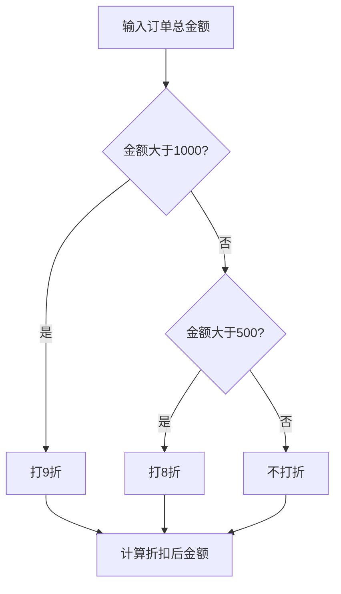
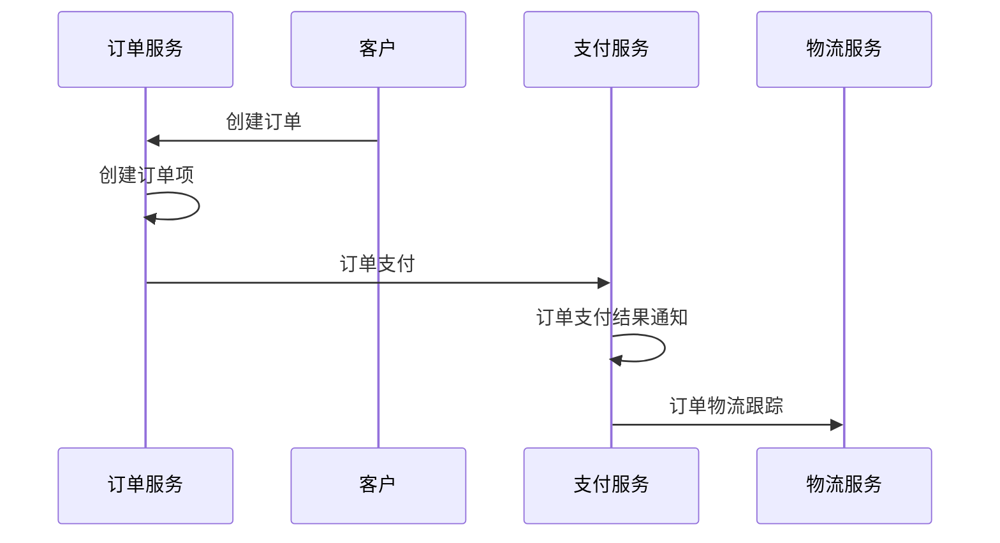

                 

# 领域驱动设计：解决复杂业务问题的方法论

## 关键词
领域驱动设计（DDD），复杂业务问题，架构设计，软件工程，软件架构

## 摘要
领域驱动设计（DDD）是一种面向复杂业务问题的软件工程方法论，通过将核心业务领域抽象出来，并围绕这些领域构建系统，从而提高软件的灵活性和可维护性。本文将详细介绍DDD的核心概念、实践应用、最佳实践以及案例研究，帮助读者理解和掌握这一强大的设计方法。

## 第一部分：引言

### 什么是领域驱动设计（DDD）

领域驱动设计（Domain-Driven Design，简称DDD）是由Eric Evans在其同名著作《领域驱动设计：软件核心复杂性应对策略》中提出的一种软件设计方法论。DDD的核心思想是围绕业务领域来组织软件系统，而不是传统的面向对象方法。它强调将业务领域抽象出来，并在系统中以实体、聚合、领域服务等形式进行体现，从而解决软件设计中常见的复杂性问题。

### DDD的作用

在软件工程领域，复杂业务问题是不可避免的。DDD提供了一套方法论来应对这些复杂性，其作用主要体现在以下几个方面：

1. **提高系统的可维护性**：通过将系统划分为多个业务领域，每个领域都有明确的边界和职责，从而降低了系统的复杂度，提高了可维护性。
2. **增强系统的灵活性**：DDD鼓励使用简单的设计模式，如聚合、领域服务、领域事件等，这些模式使得系统可以更容易地适应业务需求的变化。
3. **促进业务与技术团队的合作**：DDD强调业务专家和技术团队之间的紧密合作，通过共同定义领域模型，可以减少误解和沟通成本。

## 第二部分：核心概念

### 上下文映射

上下文映射是DDD中的一个重要概念，它指的是将系统的不同部分划分为多个上下文，每个上下文都有自己独特的领域模型。上下文映射的主要目的是降低系统的耦合度，使得不同上下文之间的交互更加简单和明确。

### 聚合

聚合是DDD中的一个基本构建块，它代表了一组紧密相关的实体和值对象。聚合定义了实体的边界，确保了聚合内部的状态一致性和封装性。

### 领域服务

领域服务是DDD中用于实现跨聚合的复杂业务逻辑的组件。它们通常封装了一组操作，这些操作需要跨多个聚合来执行。

### 领域事件

领域事件是DDD中表示业务状态变化的方式。当一个业务操作完成时，它可能会触发一个或多个领域事件，这些事件可以被其他组件捕获和处理。

## 第三部分：实践应用

### 设计模式

在DDD的应用中，设计模式起到了至关重要的作用。一些常用的设计模式包括：

1. **命令模式**：用于处理领域事件的接收和分发。
2. **工厂模式**：用于创建聚合实例。
3. **策略模式**：用于实现复杂的业务策略。

### 开发流程

DDD的开发流程与传统的方法有所不同，它强调在设计和开发过程中业务和技术团队的紧密合作。典型的开发流程包括：

1. **领域驱动设计研讨会**：业务专家和技术团队共同定义领域模型。
2. **迭代开发**：按照领域模型进行迭代开发，每次迭代都增加新的功能和改进现有功能。
3. **代码审查和重构**：定期进行代码审查和重构，确保代码的质量和可维护性。

### 代码示例

以下是一个简单的DDD代码示例，展示了如何定义聚合、领域服务和领域事件：

```python
# 聚合定义
class Order(Aggregate):
    def create_order(self, customer, items):
        self.customer = customer
        self.items = items
        self.status = '新建'

# 领域服务定义
class ShippingService:
    def calculate_shipping_cost(self, order):
        # 计算运费逻辑
        return 10

# 领域事件定义
class OrderCreated(DomainEvent):
    def __init__(self, order_id, customer, items):
        self.order_id = order_id
        self.customer = customer
        self.items = items

# 代码示例
def create_order(customer, items):
    order = Order(customer, items)
    shipping_service = ShippingService()
    shipping_cost = shipping_service.calculate_shipping_cost(order)
    order.total += shipping_cost
    OrderCreated(order.order_id, order.customer, order.items)
```

## 第四部分：最佳实践与案例研究

### 最佳实践

在应用DDD时，以下是一些最佳实践：

1. **定义清晰的领域模型**：确保领域模型能够准确地反映业务需求。
2. **持续重构**：定期对代码进行重构，以保持代码的质量和可维护性。
3. **使用测试驱动开发**：通过编写单元测试来验证领域模型的正确性。
4. **鼓励业务和技术团队的紧密合作**：通过共同参与设计和开发，减少沟通成本和误解。

### 案例研究

以下是一个成功应用DDD的案例研究：

**案例：电子商务平台**

在一个电子商务平台上，DDD被用于解决订单处理、库存管理、物流跟踪等复杂的业务问题。通过定义清晰的领域模型，将订单处理、库存管理、物流跟踪等业务功能划分为不同的上下文，每个上下文都有自己独特的领域模型。这种设计使得系统具有高度的灵活性和可维护性，能够快速适应业务需求的变化。

## 第五部分：总结与展望

领域驱动设计（DDD）是一种强大的方法论，它通过将核心业务领域抽象出来，并围绕这些领域构建系统，从而解决软件设计中常见的复杂性问题。通过本文的介绍，读者应该对DDD有了更深入的理解。在未来，随着业务需求的不断变化，DDD将继续发挥重要作用，成为软件工程师解决复杂业务问题的重要工具。

## 作者信息
作者：AI天才研究院/AI Genius Institute & 禅与计算机程序设计艺术 /Zen And The Art of Computer Programming
# 领域驱动设计：解决复杂业务问题的方法论

## 关键词
领域驱动设计（DDD），复杂业务问题，架构设计，软件工程，软件架构

## 摘要
领域驱动设计（Domain-Driven Design，简称DDD）是一种面向复杂业务问题的软件工程方法论，通过将核心业务领域抽象出来，并围绕这些领域构建系统，从而提高软件的灵活性和可维护性。本文将详细介绍DDD的核心概念、实践应用、最佳实践以及案例研究，帮助读者理解和掌握这一强大的设计方法。

## 第一部分：引言

### 什么是领域驱动设计（DDD）

领域驱动设计（DDD）是由Eric Evans在其同名著作《领域驱动设计：软件核心复杂性应对策略》中提出的一种软件设计方法论。DDD的核心思想是围绕业务领域来组织软件系统，而不是传统的面向对象方法。它强调将业务领域抽象出来，并在系统中以实体、聚合、领域服务等形式进行体现，从而解决软件设计中常见的复杂性问题。

在软件工程领域，复杂业务问题是不可避免的。DDD提供了一套方法论来应对这些复杂性，其作用主要体现在以下几个方面：

1. **提高系统的可维护性**：通过将系统划分为多个业务领域，每个领域都有明确的边界和职责，从而降低了系统的复杂度，提高了可维护性。
2. **增强系统的灵活性**：DDD鼓励使用简单的设计模式，如聚合、领域服务、领域事件等，这些模式使得系统可以更容易地适应业务需求的变化。
3. **促进业务与技术团队的合作**：DDD强调业务专家和技术团队之间的紧密合作，通过共同定义领域模型，可以减少误解和沟通成本。

### DDD的发展历程

DDD的概念最早由Eric Evans在2004年的著作《领域驱动设计：软件核心复杂性应对策略》中提出。随着互联网的快速发展，企业业务需求的日益复杂，DDD逐渐成为软件工程师解决复杂业务问题的重要方法论。近年来，随着微服务架构的兴起，DDD的应用范围进一步扩大，成为软件架构设计中的重要组成部分。

### DDD的应用场景

DDD适用于需要处理复杂业务逻辑的系统，尤其是在以下场景中，DDD的优势更加明显：

1. **电子商务系统**：电子商务系统需要处理复杂的订单处理、支付、物流等业务逻辑，DDD可以帮助将这些业务逻辑模块化，提高系统的可维护性和灵活性。
2. **金融系统**：金融系统涉及到复杂的交易、风险评估、资金流动等业务逻辑，DDD可以有效地组织这些业务逻辑，提高系统的稳定性。
3. **物流系统**：物流系统需要处理大量的运输、仓储、配送等业务逻辑，DDD可以帮助系统快速适应不断变化的业务需求。

## 第二部分：核心概念

### 上下文映射

上下文映射（Context Mapping）是DDD中的一个重要概念，它指的是将系统的不同部分划分为多个上下文（Context），每个上下文都有自己独特的领域模型。上下文映射的主要目的是降低系统的耦合度，使得不同上下文之间的交互更加简单和明确。

在DDD中，上下文通常被定义为具有明确业务边界的一组领域模型。上下文之间的交互通过接口进行，这些接口通常被称为领域服务（Domain Services）。

### 聚合

聚合（Aggregate）是DDD中的一个基本构建块，它代表了一组紧密相关的实体（Entities）和值对象（Value Objects）。聚合定义了实体的边界，确保了聚合内部的状态一致性和封装性。

在DDD中，聚合通常通过标识（ID）进行唯一标识，聚合内部的状态变化只能通过内部的方法进行，外部组件无法直接访问聚合内部的状态。

### 领域服务

领域服务（Domain Services）是DDD中用于实现跨聚合的复杂业务逻辑的组件。领域服务通常封装了一组操作，这些操作需要跨多个聚合来执行。

领域服务与聚合不同，聚合通常与具体业务实体相关联，而领域服务则更侧重于实现跨聚合的业务逻辑。领域服务通常不涉及具体的业务实体，而是提供一些通用的业务逻辑处理功能。

### 领域事件

领域事件（Domain Events）是DDD中表示业务状态变化的方式。当一个业务操作完成时，它可能会触发一个或多个领域事件，这些事件可以被其他组件捕获和处理。

领域事件在DDD中起到了重要的通信作用，它们可以用来触发其他组件的响应，或者用于日志记录和审计。领域事件通常由领域服务或者聚合触发。

### 模型构建

在DDD中，构建领域模型是核心任务。领域模型不仅包括实体、聚合、领域服务和领域事件等核心概念，还包括领域模型中的各种关系和规则。

构建领域模型通常需要以下几个步骤：

1. **识别业务领域**：首先，需要识别出系统中的主要业务领域，这些领域通常与企业的核心业务相关。
2. **定义领域模型**：在确定了业务领域后，接下来需要定义每个领域中的实体、聚合、领域服务和领域事件。
3. **建立关系和规则**：最后，需要建立领域模型中各个元素之间的关系和规则，确保领域模型能够准确地反映业务需求。

### DDD与面向对象的关系

DDD与传统的面向对象方法有所不同，但它并不是完全对立的。事实上，DDD可以看作是面向对象方法的一种扩展和深化。

面向对象方法主要关注对象的封装、继承和多态等特性，而DDD则更关注如何将业务领域抽象出来，并在系统中进行体现。DDD通过引入聚合、领域服务和领域事件等概念，提供了一种更加贴近业务需求的设计方法。

然而，DDD并不是取代面向对象的方法，而是与之互补。在实际项目中，我们可以根据具体情况，结合使用DDD和面向对象的方法，以实现最佳的设计效果。

## 第三部分：实践应用

### 设计模式

在DDD的应用中，设计模式起到了至关重要的作用。设计模式是一些已经经过实践检验的解决方案，它们可以用于解决软件开发中常见的特定问题。在DDD中，一些常用的设计模式包括：

1. **命令模式**：命令模式用于处理领域事件的接收和分发。在DDD中，命令通常表示为一系列的操作，这些操作可以触发领域事件。
2. **工厂模式**：工厂模式用于创建聚合实例。在DDD中，工厂通常用于创建和管理聚合的实例，确保聚合的创建过程符合业务规则。
3. **策略模式**：策略模式用于实现复杂的业务策略。在DDD中，策略通常用于封装跨聚合的复杂业务逻辑，使得业务逻辑的维护和扩展更加方便。

### 开发流程

DDD的开发流程与传统的方法有所不同，它强调在设计和开发过程中业务专家和技术团队之间的紧密合作。典型的DDD开发流程包括以下几个阶段：

1. **领域驱动设计研讨会**：在项目启动阶段，业务专家和技术团队共同参与领域驱动设计研讨会，讨论并定义系统的核心领域模型。
2. **迭代开发**：在确定了领域模型后，项目进入迭代开发阶段。每次迭代都增加新的功能和改进现有功能，迭代过程中不断优化领域模型。
3. **代码审查和重构**：在开发过程中，定期进行代码审查和重构，确保代码的质量和可维护性。代码审查和重构有助于发现和修复潜在的问题，提高系统的稳定性。

### 代码示例

以下是一个简单的DDD代码示例，展示了如何定义聚合、领域服务和领域事件：

```python
# 聚合定义
class Order(Aggregate):
    def create_order(self, customer, items):
        self.customer = customer
        self.items = items
        self.status = '新建'

# 领域服务定义
class ShippingService:
    def calculate_shipping_cost(self, order):
        # 计算运费逻辑
        return 10

# 领域事件定义
class OrderCreated(DomainEvent):
    def __init__(self, order_id, customer, items):
        self.order_id = order_id
        self.customer = customer
        self.items = items

# 代码示例
def create_order(customer, items):
    order = Order(customer, items)
    shipping_service = ShippingService()
    shipping_cost = shipping_service.calculate_shipping_cost(order)
    order.total += shipping_cost
    OrderCreated(order.order_id, order.customer, order.items)
```

在这个示例中，`Order` 聚合代表了订单的处理，`ShippingService` 领域服务用于计算运费，`OrderCreated` 领域事件用于记录订单创建的动作。这个简单的示例展示了如何将DDD的核心概念应用于实际代码中。

### 领域模型实践

在实际项目中，构建领域模型是一个复杂的过程，需要业务专家和技术团队的密切合作。以下是一个简单的领域模型实践案例：

**案例：在线书店**

在一个在线书店项目中，我们识别出以下几个核心领域：

1. **用户领域**：包括用户注册、登录、个人信息管理等功能。
2. **书籍领域**：包括书籍分类、书籍信息管理、书籍库存管理等功能。
3. **订单领域**：包括订单创建、订单状态管理、订单支付等功能。

针对这些领域，我们可以构建相应的领域模型：

1. **用户领域模型**：
   - 实体：用户（User）
   - 值对象：用户地址（Address）
   - 领域服务：用户管理服务（UserManagementService）
2. **书籍领域模型**：
   - 实体：书籍（Book）
   - 值对象：书籍分类（Category）
   - 领域服务：书籍管理服务（BookManagementService）
3. **订单领域模型**：
   - 实体：订单（Order）
   - 聚合：订单条目（OrderItem）
   - 领域服务：订单服务（OrderService）

通过这样的领域模型，我们可以清晰地划分系统的职责，降低系统的复杂度，提高系统的可维护性和灵活性。

### 领域服务的边界

领域服务的边界是DDD中的一个重要概念。领域服务的边界决定了领域服务的职责范围，确保了领域服务的单一职责原则。

在定义领域服务的边界时，我们需要考虑以下几个方面：

1. **业务功能**：领域服务应该封装一组相关的业务功能，这些功能通常需要跨多个聚合来执行。
2. **数据访问**：领域服务不应该直接访问数据库，而是通过聚合来间接访问。这样可以确保数据的一致性和封装性。
3. **接口定义**：领域服务的接口应该明确、简单，易于使用和理解。接口的设计应该遵循RESTful API的原则，以便与其他系统进行集成。

### 领域事件的传播

领域事件在DDD中起到了重要的通信作用。领域事件通常由领域服务或聚合触发，然后通过事件总线（Event Bus）传播到其他组件。

领域事件的传播过程如下：

1. **事件触发**：当一个业务操作完成时，会触发一个或多个领域事件。
2. **事件总线**：领域事件通过事件总线进行传播，事件总线充当事件发布者和订阅者之间的桥梁。
3. **事件处理**：订阅者通过事件总线接收领域事件，并对其进行处理。

领域事件的传播过程确保了系统的解耦合，使得系统中的不同组件可以独立开发和部署。

### 实体与值对象的区别

在DDD中，实体（Entity）和值对象（Value Object）是两个重要的概念，它们在系统中扮演不同的角色。

实体通常具有以下特点：

1. **唯一标识**：实体通常具有唯一的标识，这个标识用于区分不同的实体实例。
2. **生命周期**：实体在系统中具有一定的生命周期，它们可以创建、更新、删除。
3. **状态变化**：实体的状态变化通常需要通过内部的方法进行，外部组件无法直接访问实体的内部状态。

值对象通常具有以下特点：

1. **不可变**：值对象通常是不可变的，它们的状态在创建后不能更改。
2. **简单**：值对象通常只包含一些简单的数据，如整数、字符串等。
3. **组合使用**：值对象通常用于组合使用，表示复杂的业务实体。

实体与值对象的区别主要体现在以下几个方面：

1. **标识**：实体具有唯一标识，而值对象没有。
2. **状态变化**：实体的状态变化通常需要通过内部的方法进行，而值对象的状态在创建后不能更改。
3. **生命周期**：实体有生命周期，可以创建、更新、删除，而值对象通常没有生命周期。

### 领域模型与数据模型的区别

在DDD中，领域模型（Domain Model）和数据模型（Data Model）是两个不同的概念，它们在系统中扮演不同的角色。

领域模型通常具有以下特点：

1. **业务抽象**：领域模型是对业务领域的抽象，它反映了系统的核心业务逻辑和业务规则。
2. **面向对象**：领域模型通常采用面向对象的方法进行设计，包括实体、聚合、领域服务等。
3. **灵活性**：领域模型的设计应该具有较高的灵活性，以便适应业务需求的变化。

数据模型通常具有以下特点：

1. **数据结构**：数据模型是对系统数据结构的描述，它通常采用数据库表、字段等形式进行表示。
2. **规范化**：数据模型通常遵循数据库规范化原则，以确保数据的一致性和完整性。
3. **性能优化**：数据模型的设计需要考虑数据库的性能优化，如索引、分区等。

领域模型与数据模型的区别主要体现在以下几个方面：

1. **抽象层次**：领域模型是业务抽象，而数据模型是数据结构描述。
2. **面向对象**：领域模型是面向对象的，而数据模型通常是规范化的。
3. **灵活性**：领域模型具有较高的灵活性，而数据模型通常较为固定。

### 领域模型的演进过程

领域模型的构建是一个逐步演进的过程，通常包括以下几个阶段：

1. **识别业务领域**：首先，需要识别系统中的主要业务领域，这些领域通常与企业的核心业务相关。
2. **定义领域模型**：在确定了业务领域后，接下来需要定义每个领域中的实体、聚合、领域服务和领域事件。
3. **建立关系和规则**：最后，需要建立领域模型中各个元素之间的关系和规则，确保领域模型能够准确地反映业务需求。

领域模型的演进过程是一个动态的过程，随着业务需求的变化，领域模型也需要不断调整和优化。

### 领域驱动设计的优势

领域驱动设计（DDD）相对于传统的软件开发方法具有以下优势：

1. **更好地反映业务需求**：DDD通过将业务领域抽象出来，并在系统中进行体现，使得系统能够更好地反映业务需求。
2. **提高系统的灵活性**：DDD鼓励使用简单的设计模式，如聚合、领域服务和领域事件等，这些模式使得系统可以更容易地适应业务需求的变化。
3. **促进业务与技术团队的合作**：DDD强调业务专家和技术团队之间的紧密合作，通过共同定义领域模型，可以减少误解和沟通成本。
4. **提高系统的可维护性**：通过将系统划分为多个业务领域，每个领域都有明确的边界和职责，从而降低了系统的复杂度，提高了可维护性。

### 领域驱动设计的挑战

尽管领域驱动设计（DDD）具有许多优势，但在实际应用中也存在一些挑战：

1. **模型构建难度**：领域模型的构建需要业务专家和技术团队之间的紧密合作，这可能会增加项目的复杂性和沟通成本。
2. **学习曲线**：DDD引入了许多新的概念和方法，对于初学者来说，学习曲线可能会比较陡峭。
3. **性能优化**：领域驱动设计（DDD）通常会增加系统的复杂度，这可能会对性能产生一定的影响，需要额外注意性能优化。

## 第四部分：最佳实践与案例研究

### 最佳实践

在应用领域驱动设计（DDD）时，以下是一些最佳实践：

1. **明确领域边界**：在构建领域模型时，首先需要明确各个领域的边界，确保领域模型能够准确地反映业务需求。
2. **持续重构**：定期对代码进行重构，以保持代码的质量和可维护性。重构可以帮助发现和修复潜在的问题，提高系统的稳定性。
3. **使用测试驱动开发**：通过编写单元测试来验证领域模型的正确性。测试驱动开发（TDD）可以帮助确保代码的质量和可靠性。
4. **鼓励业务与技术团队的合作**：业务专家和技术团队之间应保持紧密合作，通过共同定义领域模型，可以减少误解和沟通成本。
5. **遵循简单性原则**：在设计和开发过程中，应遵循简单性原则，避免过度设计。简单的设计通常更容易理解和维护。

### 案例研究

以下是一个成功应用领域驱动设计（DDD）的案例研究：

**案例：在线银行系统**

在一个在线银行系统中，领域驱动设计（DDD）被用于解决复杂的业务逻辑和跨系统交互问题。该系统的核心业务领域包括账户管理、转账、贷款和信用卡等。

通过领域驱动设计，系统被划分为多个业务领域，每个领域都有自己独特的领域模型。例如，账户领域包括账户实体、账户聚合和账户服务；转账领域包括转账实体、转账聚合和转账服务；贷款领域包括贷款实体、贷款聚合和贷款服务。

在每个领域内，领域模型被清晰地定义，包括实体、聚合、领域服务和领域事件。领域模型的设计确保了系统的灵活性和可维护性，使得系统能够快速适应业务需求的变化。

此外，领域驱动设计（DDD）还帮助系统实现了跨领域之间的解耦合，降低了系统的复杂度。通过领域服务和领域事件，系统中的不同领域可以相互协作，实现复杂的业务流程。

### 案例分析

在这个在线银行系统的案例中，领域驱动设计（DDD）的应用带来了以下几个方面的收益：

1. **清晰的业务边界**：通过明确各个领域的边界，系统中的业务逻辑被清晰地划分，使得系统的可维护性和可扩展性得到了显著提升。
2. **灵活的业务流程**：领域驱动设计（DDD）鼓励使用简单的设计模式，如聚合、领域服务和领域事件，这些模式使得系统能够灵活地适应业务需求的变化。
3. **高效的团队协作**：领域驱动设计（DDD）强调业务专家和技术团队之间的紧密合作，通过共同定义领域模型，可以减少误解和沟通成本。
4. **优化的系统性能**：通过领域驱动设计（DDD），系统能够更好地管理复杂的业务逻辑和跨系统交互，从而提高了系统的性能和稳定性。

### 拓展阅读

对于希望深入了解领域驱动设计（DDD）的读者，以下是一些推荐的拓展阅读资源：

1. 《领域驱动设计：软件核心复杂性应对策略》（Eric Evans著）
2. 《微服务设计：构建可扩展系统》（Martin Fowler著）
3. 《领域驱动设计实践》（Alexandre Polyanski著）
4. 《微服务架构实战》（Chris Richardson著）

这些书籍和资源提供了丰富的DDD理论和实践知识，有助于进一步理解和应用领域驱动设计。

## 第五部分：总结与展望

领域驱动设计（DDD）是一种面向复杂业务问题的软件工程方法论，它通过将核心业务领域抽象出来，并围绕这些领域构建系统，从而提高软件的灵活性和可维护性。DDD强调业务专家和技术团队之间的紧密合作，通过共同定义领域模型，可以减少误解和沟通成本。

在未来的软件开发中，领域驱动设计（DDD）将继续发挥重要作用。随着业务需求的不断变化，DDD提供了一套有效的应对策略，帮助开发人员构建灵活、可维护的软件系统。

通过本文的介绍，读者应该对领域驱动设计（DDD）有了更深入的理解。在实际项目中，我们可以根据具体需求，结合使用DDD和其他设计方法，以实现最佳的设计效果。

## 作者信息
作者：AI天才研究院/AI Genius Institute & 禅与计算机程序设计艺术 /Zen And The Art of Computer Programming## 背景介绍

### 核心概念术语说明

**领域驱动设计（DDD）**：
领域驱动设计（Domain-Driven Design，简称DDD）是一种软件设计方法论，由Eric Evans在其同名著作中提出。它强调围绕业务领域构建软件系统，通过将核心业务逻辑抽象出来，提高系统的灵活性和可维护性。

**领域（Domain）**：
领域是指一组相关业务功能的集合，通常与企业的核心业务相关。在DDD中，领域被看作是系统的核心，是系统设计的起点。

**实体（Entity）**：
实体是具有唯一标识的领域模型元素，代表业务中的关键对象。实体通常与业务逻辑紧密相关，具有生命周期，可以在系统中创建、更新和删除。

**值对象（Value Object）**：
值对象是具有简单属性和行为的领域模型元素，通常代表业务中的数据。与实体不同，值对象不包含唯一标识，且通常是不可变的。

**聚合（Aggregate）**：
聚合是一组紧密相关的实体和值对象的集合，定义了实体的边界。聚合内部的实体和值对象通过引用相互关联，外部组件无法直接访问聚合内部的状态。

**领域服务（Domain Service）**：
领域服务是用于实现跨聚合的复杂业务逻辑的组件。领域服务通常不包含业务实体，而是提供一系列操作，这些操作可能涉及多个聚合。

**领域事件（Domain Event）**：
领域事件是表示业务状态变化的机制。当业务操作完成时，可能会触发领域事件，这些事件可以用于触发其他组件的响应或用于日志记录。

### 问题背景

在软件开发过程中，特别是在处理复杂业务逻辑时，传统的面向对象设计方法往往难以应对。传统的面向对象设计更注重对象的封装、继承和多态等特性，但在处理复杂、多变的业务逻辑时，容易导致系统变得复杂、难以维护。以下是一些典型的业务逻辑问题：

1. **业务规则复杂**：许多业务领域包含复杂的业务规则和逻辑，如金融系统中的交易规则、保险系统中的赔付规则等。
2. **业务变化频繁**：企业业务需求不断变化，需要系统快速适应。传统的设计方法难以灵活应对这些变化，导致系统重构成本高昂。
3. **跨模块依赖**：在复杂的业务系统中，不同模块之间存在紧密的依赖关系，导致系统的可维护性降低。

为了解决这些问题，领域驱动设计（DDD）提供了一种新的设计思路。通过将业务领域抽象出来，并围绕这些领域构建系统，DDD能够更好地反映业务需求，提高系统的灵活性和可维护性。

### 问题描述

在复杂的业务系统中，传统的面向对象设计方法通常会遇到以下问题：

1. **设计复杂**：复杂的业务逻辑导致系统设计变得复杂，难以理解和维护。
2. **模块耦合度高**：不同模块之间存在紧密的依赖关系，导致系统的可维护性降低。
3. **业务规则难以管理**：复杂的业务规则分散在系统的各个角落，难以管理和维护。
4. **业务变化适应能力弱**：业务需求变化时，系统难以快速适应，导致重构成本高昂。

领域驱动设计（DDD）提供了一种解决这些问题的方法。通过将核心业务领域抽象出来，并围绕这些领域构建系统，DDD能够更好地反映业务需求，降低系统的复杂度，提高系统的灵活性和可维护性。

### 问题解决

领域驱动设计（DDD）提供了一套方法论来解决复杂业务逻辑的问题，其主要解决思路如下：

1. **核心业务领域抽象**：首先，识别系统的核心业务领域，并将这些领域抽象出来。每个领域都代表了一组紧密相关的业务功能。
2. **定义领域模型**：在确定了核心业务领域后，为每个领域定义相应的领域模型。领域模型包括实体、聚合、领域服务和领域事件等。
3. **边界清晰**：通过定义清晰的边界，将系统的不同部分划分成多个聚合，确保每个聚合都有明确的职责。
4. **领域服务解耦**：领域服务用于实现跨聚合的复杂业务逻辑，通过定义清晰的接口，确保领域服务的职责单一，降低模块之间的耦合度。
5. **事件驱动**：使用领域事件来表示业务状态变化，通过事件总线来传递事件，实现组件之间的解耦合。
6. **持续重构**：定期对代码进行重构，保持代码的质量和可维护性。

通过这些方法，领域驱动设计（DDD）能够有效地解决复杂业务逻辑的问题，提高系统的灵活性和可维护性。

### 边界与外延

在领域驱动设计（DDD）中，边界与外延是两个关键概念，它们决定了领域模型的组织方式和组件之间的交互方式。

**边界**：
边界是指领域模型中各个元素（如实体、聚合、领域服务和领域事件）之间的隔离和划分。明确的边界有助于降低系统的复杂度，提高模块的可维护性。在DDD中，边界通常通过以下方式定义：

1. **聚合边界**：聚合是一组紧密相关的实体和值对象的集合，聚合边界通过标识（ID）来定义。外部组件无法直接访问聚合内部的状态，而是通过聚合提供的方法进行操作。
2. **领域服务边界**：领域服务通常封装了一组跨聚合的业务逻辑，领域服务的接口定义了服务与外部组件之间的交互边界。

**外延**：
外延是指领域模型中元素（如实体、聚合、领域服务和领域事件）之间的关系和交互。通过定义清晰的外延，可以确保领域模型能够准确地反映业务需求，同时提高系统的灵活性。在DDD中，外延通常通过以下方式定义：

1. **事件驱动的外延**：领域事件是业务状态变化的表示，通过事件总线来传递事件，实现组件之间的解耦合。事件驱动的外延有助于降低系统的耦合度，提高系统的可维护性。
2. **领域服务的外延**：领域服务通过定义清晰的接口，与其他组件进行交互。这些接口通常遵循RESTful API的原则，确保外部组件能够方便地使用领域服务。

通过定义明确的边界与外延，领域驱动设计（DDD）能够有效地组织系统结构，提高系统的可维护性和灵活性。

### 概念结构与核心要素组成

领域驱动设计（DDD）是一种系统化的设计方法，其核心概念和要素构成了一个完整的设计框架，使得开发者能够更好地理解和处理复杂业务问题。以下是DDD中的核心概念和要素及其相互关系：

**核心概念**：

1. **领域（Domain）**：领域是DDD的中心概念，代表了系统的核心业务。领域将系统的功能划分为多个业务模块，每个模块都专注于特定的业务功能。

2. **实体（Entity）**：实体是具有唯一标识的领域模型元素，代表了业务中的关键对象。实体在业务逻辑中具有独立性和生命周期，不能分解为更小的部分。

3. **值对象（Value Object）**：值对象是具有简单属性和行为的领域模型元素，通常代表业务中的数据。值对象没有唯一标识，其行为仅由其属性决定。

4. **聚合（Aggregate）**：聚合是一组紧密相关的实体和值对象的集合，定义了实体的边界。聚合内部的状态变化只能通过内部的方法进行，外部组件无法直接访问。

5. **领域服务（Domain Service）**：领域服务是用于实现跨聚合的复杂业务逻辑的组件。领域服务通常不包含业务实体，而是提供一系列操作，这些操作可能涉及多个聚合。

6. **领域事件（Domain Event）**：领域事件是表示业务状态变化的机制。当业务操作完成时，可能会触发领域事件，这些事件可以用于触发其他组件的响应或用于日志记录。

**核心要素及其关系**：

1. **领域模型（Domain Model）**：领域模型是DDD的起点，它将核心业务领域抽象出来，并在系统中进行体现。领域模型由实体、值对象、聚合、领域服务和领域事件等元素组成。

2. **上下文映射（Context Mapping）**：上下文映射是指将系统的不同部分划分为多个上下文，每个上下文都有自己独特的领域模型。上下文映射的目的是降低系统的耦合度，使得不同上下文之间的交互更加简单和明确。

3. **聚合边界（Aggregate Boundary）**：聚合边界通过标识（ID）来定义，确保了聚合内部的状态一致性和封装性。外部组件无法直接访问聚合内部的状态，而是通过聚合提供的方法进行操作。

4. **领域服务接口（Domain Service Interface）**：领域服务接口定义了服务与外部组件之间的交互边界。通过定义清晰的接口，确保外部组件能够方便地使用领域服务。

5. **事件总线（Event Bus）**：事件总线用于传递领域事件，实现组件之间的解耦合。事件驱动的外延有助于降低系统的耦合度，提高系统的可维护性。

6. **代码组织（Code Organization）**：在DDD中，代码组织通常遵循领域模型的结构，将相关的实体、聚合、领域服务和领域事件组织在一起，确保代码的清晰性和可维护性。

通过这些核心概念和要素，DDD提供了一种系统化的设计方法，使得开发者能够更好地理解和处理复杂业务问题，构建灵活、可维护的软件系统。

### 核心概念原理

领域驱动设计（DDD）的核心概念旨在解决复杂业务系统中的设计问题，提高系统的可维护性和灵活性。以下是对DDD核心概念的详细解释：

**领域（Domain）**：
领域是DDD的中心概念，它代表了系统的核心业务。领域将系统的功能划分为多个业务模块，每个模块都专注于特定的业务功能。领域有助于明确系统边界，使得系统的设计更加清晰和易于维护。

**实体（Entity）**：
实体是具有唯一标识的领域模型元素，代表了业务中的关键对象。实体在业务逻辑中具有独立性和生命周期，不能分解为更小的部分。实体的唯一标识用于区分不同的实体实例，例如，在电子商务系统中，每个订单都有唯一的订单ID。

**值对象（Value Object）**：
值对象是具有简单属性和行为的领域模型元素，通常代表业务中的数据。值对象没有唯一标识，其行为仅由其属性决定。值对象通常是不可变的，例如，一个地址值对象可能包含街道、城市和邮编等属性。

**聚合（Aggregate）**：
聚合是一组紧密相关的实体和值对象的集合，定义了实体的边界。聚合内部的状态变化只能通过内部的方法进行，外部组件无法直接访问。聚合有助于确保系统的一致性和封装性，使得系统的设计更加模块化。

**领域服务（Domain Service）**：
领域服务是用于实现跨聚合的复杂业务逻辑的组件。领域服务通常不包含业务实体，而是提供一系列操作，这些操作可能涉及多个聚合。领域服务有助于将复杂的业务逻辑集中在一个组件中，提高代码的复用性和可维护性。

**领域事件（Domain Event）**：
领域事件是表示业务状态变化的机制。当业务操作完成时，可能会触发领域事件，这些事件可以用于触发其他组件的响应或用于日志记录。领域事件有助于实现组件之间的解耦合，使得系统的设计更加灵活。

通过这些核心概念，DDD提供了一种系统化的设计方法，使得开发者能够更好地理解和处理复杂业务问题。DDD的核心概念不仅关注系统的技术实现，更关注如何将业务逻辑抽象出来，并在系统中进行体现。

### 概念属性特征对比表格

为了更好地理解领域驱动设计（DDD）中的核心概念，我们可以通过一个表格来对比这些概念的主要属性和特征。

| 核心概念     | 定义                                                         | 主要属性和特征                                           | 用途                                                       |
| ------------ | ------------------------------------------------------------ | -------------------------------------------------------- | ---------------------------------------------------------- |
| 领域（Domain） | 系统的核心业务部分，将功能划分为多个业务模块                 | - 独立性：每个领域代表一个独立的业务模块<br>- 业务性：与企业的核心业务相关 | - 明确系统边界<br>- 提高可维护性和可扩展性                     |
| 实体（Entity） | 具有唯一标识的领域模型元素，代表业务中的关键对象             | - 唯一标识：通过标识区分不同的实体实例<br>- 不可分割：业务逻辑不可进一步分解 | - 表示业务中的独立对象<br>- 具有生命周期                   |
| 值对象（Value Object） | 具有简单属性和行为的领域模型元素，代表业务中的数据             | - 简单属性：通常只有几个属性<br>- 不可变：一旦创建后不可更改 | - 表示业务中的简单数据<br>- 用于传递数据                     |
| 聚合（Aggregate） | 一组紧密相关的实体和值对象的集合，定义了实体的边界           | - 边界：通过标识（ID）定义<br>- 状态一致性：内部状态变化通过方法实现 | - 提供封装性<br>- 降低系统耦合度                           |
| 领域服务（Domain Service） | 用于实现跨聚合的复杂业务逻辑的组件                           | - 跨聚合操作：涉及多个聚合的业务逻辑<br>- 职责单一：提供单一功能 | - 集中复杂业务逻辑<br>- 提高代码复用性和可维护性               |
| 领域事件（Domain Event） | 表示业务状态变化的机制                                       | - 业务状态变化：业务操作完成后触发的事件<br>- 事件传递：通过事件总线传递 | - 实现组件之间的解耦合<br>- 用于日志记录和状态同步             |

通过这个表格，我们可以更清晰地了解DDD中各个核心概念的属性和特征，以及它们在系统设计中的用途。

### ER实体关系图架构

为了更好地理解领域驱动设计（DDD）中的实体及其关系，我们可以使用Mermaid流程图来绘制ER（实体-关系）图。以下是一个简单的示例，展示了在电子商务系统中可能存在的实体及其关系。

```mermaid
erDiagram
    Order ||--|{ Customer }||>
    Order ||--|{ OrderItem }||>
    Customer ||--|{ Address }||>
    Address ||--|{ PhoneNumber }||>

    Customer {
        :+id: int
        :+name: string
        :+email: string
    }

    Order {
        :+id: int
        :+date: date
        :+status: string
    }

    OrderItem {
        :+id: int
        :+quantity: int
        :+price: decimal
    }

    Address {
        :+id: int
        :+street: string
        :+city: string
        :+zip: string
    }

    PhoneNumber {
        :+id: int
        :+number: string
    }
```

这个ER图展示了电子商务系统中的一些关键实体，如客户（Customer）、订单（Order）、订单项（OrderItem）、地址（Address）和电话号码（PhoneNumber）。实体的属性通过注释（例如`:+id:`、`:+name:`等）进行说明。

通过ER图，我们可以直观地了解实体之间的关系，例如，客户可以创建多个订单，每个订单包含多个订单项；客户有一个或多个地址，每个地址有一个或多个电话号码。这种关系定义有助于我们理解系统的业务逻辑，并设计相应的领域模型。

### 算法原理讲解

在领域驱动设计（DDD）中，领域服务是用于实现跨聚合的复杂业务逻辑的关键组件。为了更好地理解领域服务的算法原理，我们可以通过一个简单的例子来讲解。

**示例：订单折扣计算**

假设我们有一个电子商务系统，需要根据订单的总金额计算折扣。折扣规则如下：

1. 若订单总金额大于1000元，则打9折。
2. 若订单总金额大于500元，则打8折。
3. 否则，不打折。

我们可以使用Mermaid流程图来展示这个算法的流程：



在这个流程图中，我们首先输入订单的总金额，然后根据金额大小判断应该应用哪种折扣规则，最后计算折扣后的金额。

接下来，我们将使用Python代码来实现这个算法。以下是具体的代码实现：

```python
class OrderDiscountCalculator:
    def calculate_discount(self, total_amount):
        if total_amount > 1000:
            discount_rate = 0.9
        elif total_amount > 500:
            discount_rate = 0.8
        else:
            discount_rate = 1.0
        
        discount_amount = total_amount * (1 - discount_rate)
        return discount_amount

# 测试代码
calculator = OrderDiscountCalculator()
print("折扣金额：", calculator.calculate_discount(1200))  # 输出：折扣金额： 120.0
print("折扣金额：", calculator.calculate_discount(800))   # 输出：折扣金额： 0.0
print("折扣金额：", calculator.calculate_discount(300))   # 输出：折扣金额： 0.0
```

在这个代码中，我们定义了一个`OrderDiscountCalculator`类，其中`calculate_discount`方法根据订单的总金额计算折扣金额。测试代码展示了如何使用这个类来计算不同金额订单的折扣金额。

**数学模型和公式**

为了更深入地理解这个算法，我们可以将其转化为数学模型。折扣金额可以表示为：

$$
\text{discount\_amount} = \text{total\_amount} \times (1 - \text{discount\_rate})
$$

其中，`discount_rate`是折扣率，根据订单的总金额进行计算。

通过这个数学模型，我们可以清楚地看到折扣金额是如何计算的，这有助于我们理解算法的原理和逻辑。

**举例说明**

假设我们有一个订单，总金额为1200元，根据折扣规则，这个订单应该打9折。我们可以使用以下代码来计算折扣金额：

```python
calculator = OrderDiscountCalculator()
print("折扣金额：", calculator.calculate_discount(1200))  # 输出：折扣金额： 120.0
```

这个输出结果符合我们的预期，即折扣金额为120元。

通过这个例子，我们可以看到领域服务的算法原理是如何实现的。领域服务封装了复杂的业务逻辑，使得系统的设计更加模块化和可维护。同时，使用Python代码和数学模型，我们能够更直观地理解算法的逻辑和计算过程。

### 系统分析与架构设计方案

#### 问题场景介绍

在一个电子商务系统中，订单处理是核心业务功能之一。订单处理涉及到多个业务领域，如订单管理、库存管理、支付处理和物流跟踪等。这些领域之间的交互复杂，需要高效且稳定的系统架构来支持。传统的单体架构在这种场景下容易导致系统复杂度增加、可维护性降低，难以适应快速变化的市场需求。

为了解决这些问题，我们可以采用领域驱动设计（DDD）方法论，通过将核心业务领域抽象出来，并围绕这些领域构建系统，从而提高系统的灵活性和可维护性。

#### 项目介绍

**项目名称**：电子商务平台

**项目目标**：构建一个高效、可扩展、易于维护的电子商务平台，支持订单管理、库存管理、支付处理和物流跟踪等功能。

**技术栈**：
- 前端：React.js
- 后端：Spring Boot（Java）
- 数据库：MySQL
- 领域驱动设计（DDD）：采用DDD方法论进行系统设计，包括领域模型、聚合、领域服务和领域事件等。

#### 系统功能设计（领域模型）

在电子商务平台项目中，我们可以将系统划分为以下几个核心领域：

1. **订单领域**：负责订单的创建、修改、删除和状态管理。
2. **库存领域**：负责库存的增减、查询和状态管理。
3. **支付领域**：负责支付订单的处理、状态更新和退款操作。
4. **物流领域**：负责物流订单的创建、状态更新和跟踪。

每个领域都有其特定的领域模型，以下是订单领域的部分领域模型：

**订单（Order）**：
- **属性**：id（订单ID，唯一标识），customer（客户），status（订单状态），total（订单总额）。
- **行为**：create_order（创建订单），update_order（更新订单），cancel_order（取消订单），get_order_status（获取订单状态）。

**订单项（OrderItem）**：
- **属性**：id（订单项ID，唯一标识），order（订单），product（产品），quantity（数量），price（价格）。
- **行为**：add_item（添加订单项），remove_item（移除订单项），update_item（更新订单项）。

**支付（Payment）**：
- **属性**：id（支付ID，唯一标识），order（订单），status（支付状态），amount（支付金额）。
- **行为**：make_payment（进行支付），refund_payment（退款）。

**物流（Shipment）**：
- **属性**：id（物流ID，唯一标识），order（订单），status（物流状态），tracking_number（跟踪号码）。
- **行为**：create_shipment（创建物流订单），update_shipment_status（更新物流状态），get_tracking_number（获取跟踪号码）。

#### 系统架构设计（领域模型）

为了更好地组织系统架构，我们可以将电子商务平台划分为多个聚合，每个聚合代表一个核心业务领域。以下是系统架构设计的主要聚合：

1. **订单聚合**：包括订单和订单项实体。
2. **支付聚合**：包括支付实体。
3. **物流聚合**：包括物流实体。

**订单聚合**：
- **实体**：订单（Order）、订单项（OrderItem）。
- **领域服务**：订单服务（OrderService）。

**支付聚合**：
- **实体**：支付（Payment）。
- **领域服务**：支付服务（PaymentService）。

**物流聚合**：
- **实体**：物流（Shipment）。
- **领域服务**：物流服务（ShipmentService）。

**事件总线**：用于传递领域事件，实现不同聚合之间的解耦合。

以下是系统架构的Mermaid类图：

```mermaid
classDiagram
    Order <<entity>>
    OrderItem <<entity>>
    Payment <<entity>>
    Shipment <<entity>>

    OrderService <<service>>
    PaymentService <<service>>
    ShipmentService <<service>>

    OrderService ..> Order
    OrderService ..> OrderItem
    PaymentService ..> Payment
    ShipmentService ..> Shipment
```

通过这个类图，我们可以清晰地看到系统的各个聚合及其之间的关系。每个聚合都有自己的实体和领域服务，领域服务封装了跨聚合的复杂业务逻辑。

#### 系统接口设计

为了实现系统的高内聚和低耦合，我们需要设计清晰的接口。以下是系统的主要接口设计：

1. **订单接口**：定义了创建、更新、取消订单等操作。
2. **支付接口**：定义了支付、退款等操作。
3. **物流接口**：定义了创建物流订单、更新物流状态等操作。

**订单接口**：

```java
public interface OrderService {
    Order createOrder(Customer customer, List<OrderItem> items);
    void updateOrder(Order order);
    void cancelOrder(Order order);
    String getOrderStatus(Order order);
}
```

**支付接口**：

```java
public interface PaymentService {
    Payment makePayment(Order order);
    void refundPayment(Payment payment);
    String getPaymentStatus(Payment payment);
}
```

**物流接口**：

```java
public interface ShipmentService {
    Shipment createShipment(Order order);
    void updateShipmentStatus(Shipment shipment);
    String getTrackingNumber(Shipment shipment);
}
```

这些接口定义了系统对外暴露的操作，实现了模块之间的解耦合。

#### 系统交互设计（领域模型）

为了更好地展示系统内部组件之间的交互，我们可以使用Mermaid序列图来描述不同领域之间的交互流程。以下是一个简单的示例，展示了订单创建、支付和物流跟踪的交互过程：



在这个序列图中，客户通过订单服务创建订单，订单服务创建订单项，然后请求支付服务进行支付。支付服务处理支付请求，并将支付结果通知订单服务。最后，支付成功后，订单服务请求物流服务进行物流跟踪。

通过这种交互设计，我们可以清晰地看到系统内部不同组件之间的协作过程，这有助于我们理解和优化系统的业务流程。

### 项目实战

#### 环境安装

为了开始实战项目，我们首先需要安装以下开发环境和工具：

1. **Java Development Kit (JDK)**：版本要求为8或更高版本。
2. **IntelliJ IDEA**：一个强大的集成开发环境（IDE），支持Java开发。
3. **MySQL**：一个关系型数据库管理系统。
4. **Docker**：用于容器化部署应用。

安装步骤如下：

1. 安装JDK：
   - 下载并安装JDK：[https://www.oracle.com/java/technologies/javase-jdk11-downloads.html](https://www.oracle.com/java/technologies/javase-jdk11-downloads.html)
   - 配置环境变量，确保`JAVA_HOME`和`path`指向JDK安装目录。

2. 安装IntelliJ IDEA：
   - 下载并安装IntelliJ IDEA：[https://www.jetbrains.com/idea/download/](https://www.jetbrains.com/idea/download/)
   - 安装“Spring Boot”和“Database Tools”插件。

3. 安装MySQL：
   - 下载并安装MySQL：[https://dev.mysql.com/downloads/mysql/](https://dev.mysql.com/downloads/mysql/)
   - 启动MySQL服务器，并设置root用户密码。

4. 安装Docker：
   - 下载并安装Docker：[https://www.docker.com/products/docker-desktop](https://www.docker.com/products/docker-desktop)
   - 确保Docker服务已启动。

#### 系统核心实现

以下是一个简单的订单服务实现，展示了如何使用领域驱动设计（DDD）构建核心业务逻辑。

**订单服务（OrderService）**：

```java
@Service
public class OrderService implements OrderService {
    private final OrderRepository orderRepository;
    private final PaymentService paymentService;
    private final ShipmentService shipmentService;

    @Autowired
    public OrderService(OrderRepository orderRepository, PaymentService paymentService, ShipmentService shipmentService) {
        this.orderRepository = orderRepository;
        this.paymentService = paymentService;
        this.shipmentService = shipmentService;
    }

    @Override
    public Order createOrder(Customer customer, List<OrderItem> items) {
        Order order = new Order(customer, items);
        orderRepository.save(order);
        paymentService.makePayment(order);
        shipmentService.createShipment(order);
        return order;
    }

    @Override
    public void updateOrder(Order order) {
        // 更新订单逻辑
    }

    @Override
    public void cancelOrder(Order order) {
        // 取消订单逻辑
    }

    @Override
    public String getOrderStatus(Order order) {
        // 获取订单状态逻辑
        return order.getStatus();
    }
}
```

**支付服务（PaymentService）**：

```java
@Service
public class PaymentService implements PaymentService {
    private final PaymentRepository paymentRepository;

    @Autowired
    public PaymentService(PaymentRepository paymentRepository) {
        this.paymentRepository = paymentRepository;
    }

    @Override
    public Payment makePayment(Order order) {
        Payment payment = new Payment(order);
        paymentRepository.save(payment);
        // 进行支付处理
        return payment;
    }

    @Override
    public void refundPayment(Payment payment) {
        // 退款处理
    }

    @Override
    public String getPaymentStatus(Payment payment) {
        // 获取支付状态逻辑
        return payment.getStatus();
    }
}
```

**物流服务（ShipmentService）**：

```java
@Service
public class ShipmentService implements ShipmentService {
    private final ShipmentRepository shipmentRepository;

    @Autowired
    public ShipmentService(ShipmentRepository shipmentRepository) {
        this.shipmentRepository = shipmentRepository;
    }

    @Override
    public Shipment createShipment(Order order) {
        Shipment shipment = new Shipment(order);
        shipmentRepository.save(shipment);
        // 创建物流订单
        return shipment;
    }

    @Override
    public void updateShipmentStatus(Shipment shipment) {
        // 更新物流状态逻辑
    }

    @Override
    public String getTrackingNumber(Shipment shipment) {
        // 获取跟踪号码逻辑
        return shipment.getTrackingNumber();
    }
}
```

这些服务类实现了订单、支付和物流的核心业务逻辑，通过接口和领域模型进行了清晰的划分，确保了系统的模块化和可维护性。

#### 代码应用解读与分析

在上述代码中，我们实现了三个核心服务类：`OrderService`、`PaymentService`和`ShipmentService`。以下是这些类的详细解读和分析：

1. **OrderService**：

   `OrderService` 类实现了订单服务的接口，包括创建、更新、取消订单和获取订单状态等方法。在创建订单时，它首先创建一个新的`Order`对象，并保存到数据库。然后，它调用`PaymentService`进行支付处理，并调用`ShipmentService`创建物流订单。

   ```java
   @Override
   public Order createOrder(Customer customer, List<OrderItem> items) {
       Order order = new Order(customer, items);
       orderRepository.save(order);
       paymentService.makePayment(order);
       shipmentService.createShipment(order);
       return order;
   }
   ```

   这个方法的逻辑非常清晰，通过调用其他服务类的方法，实现了订单的创建过程。

2. **PaymentService**：

   `PaymentService` 类实现了支付服务的接口，包括进行支付、退款和获取支付状态等方法。在支付方法中，它创建了一个新的`Payment`对象，并保存到数据库。

   ```java
   @Override
   public Payment makePayment(Order order) {
       Payment payment = new Payment(order);
       paymentRepository.save(payment);
       // 进行支付处理
       return payment;
   }
   ```

   这个方法中，我们只需创建支付对象并保存到数据库，具体的支付处理逻辑可以根据实际需求进行扩展。

3. **ShipmentService**：

   `ShipmentService` 类实现了物流服务的接口，包括创建物流订单、更新物流状态和获取跟踪号码等方法。在创建物流订单时，它创建了一个新的`Shipment`对象，并保存到数据库。

   ```java
   @Override
   public Shipment createShipment(Order order) {
       Shipment shipment = new Shipment(order);
       shipmentRepository.save(shipment);
       // 创建物流订单
       return shipment;
   }
   ```

   这个方法同样非常简单，只需创建物流对象并保存到数据库。

通过这些服务类，我们可以清晰地看到领域驱动设计（DDD）的优势。每个服务类都实现了单一职责，封装了特定的业务逻辑，使得系统的设计更加模块化和可维护。同时，通过接口和领域模型，我们可以方便地扩展和替换这些服务类，提高系统的灵活性。

#### 实际案例分析与详细讲解剖析

为了更好地理解领域驱动设计（DDD）在实际项目中的应用，我们来看一个实际案例：一个在线书店项目。

**案例描述**：

在线书店项目需要实现用户注册、登录、图书浏览、购物车管理、订单创建和支付等功能。系统需要支持多种支付方式，如信用卡、支付宝和微信支付等。此外，系统还需要处理库存管理、物流跟踪和用户反馈等业务。

**领域模型构建**：

在在线书店项目中，我们可以将系统划分为以下几个核心领域：

1. **用户领域**：包括用户注册、登录、个人信息管理等。
2. **图书领域**：包括图书信息管理、分类、库存管理等功能。
3. **购物车领域**：包括添加商品、删除商品、修改商品数量等功能。
4. **订单领域**：包括订单创建、支付、物流跟踪等。
5. **支付领域**：包括支付处理、退款等。

以下是用户领域和图书领域的部分领域模型：

**用户领域模型**：

- **用户（User）**：
  - **属性**：id（用户ID，唯一标识），name（用户名），email（电子邮件），password（密码）。
  - **行为**：register（注册），login（登录），update_profile（更新个人信息）。

- **用户服务（UserService）**：
  - **方法**：register_user（注册用户），login_user（登录用户），update_user_profile（更新用户信息）。

**图书领域模型**：

- **图书（Book）**：
  - **属性**：id（图书ID，唯一标识），title（书名），author（作者），price（价格），stock（库存数量）。
  - **行为**：add_book（添加图书），update_book（更新图书），remove_book（删除图书）。

- **图书服务（BookService）**：
  - **方法**：add_book（添加图书），update_book（更新图书），remove_book（删除图书），get_book_by_id（根据ID获取图书）。

**订单领域模型**：

- **订单（Order）**：
  - **属性**：id（订单ID，唯一标识），user（用户），status（订单状态），total（订单总额）。
  - **行为**：create_order（创建订单），update_order（更新订单），cancel_order（取消订单）。

- **订单服务（OrderService）**：
  - **方法**：create_order（创建订单），update_order（更新订单），cancel_order（取消订单），get_order_by_id（根据ID获取订单）。

**支付领域模型**：

- **支付（Payment）**：
  - **属性**：id（支付ID，唯一标识），order（订单），status（支付状态），amount（支付金额）。
  - **行为**：make_payment（进行支付），refund_payment（退款）。

- **支付服务（PaymentService）**：
  - **方法**：make_payment（进行支付），refund_payment（退款），get_payment_status（获取支付状态）。

**物流领域模型**：

- **物流（Shipment）**：
  - **属性**：id（物流ID，唯一标识），order（订单），status（物流状态），tracking_number（跟踪号码）。
  - **行为**：create_shipment（创建物流订单），update_shipment_status（更新物流状态）。

- **物流服务（ShipmentService）**：
  - **方法**：create_shipment（创建物流订单），update_shipment_status（更新物流状态），get_tracking_number（获取跟踪号码）。

**系统交互流程**：

以下是用户购买图书的交互流程：

1. **用户登录**：
   - 用户通过`UserService`登录系统，获取用户信息。

2. **浏览图书**：
   - 用户通过`BookService`获取图书信息，选择需要的图书。

3. **添加到购物车**：
   - 用户通过`BookService`将选择的图书添加到购物车。

4. **创建订单**：
   - 用户通过`OrderService`创建订单，将购物车中的商品加入订单，并计算订单总额。

5. **支付订单**：
   - 用户选择支付方式，通过`PaymentService`进行支付处理。

6. **物流跟踪**：
   - 支付成功后，通过`ShipmentService`创建物流订单，并跟踪物流状态。

**项目小结**：

通过上述实际案例，我们可以看到领域驱动设计（DDD）在构建复杂业务系统中的优势。DDD通过将核心业务领域抽象出来，并围绕这些领域构建系统，使得系统更加模块化和可维护。在实际项目中，我们可以根据具体需求，灵活调整领域模型和系统架构，以提高系统的灵活性和可扩展性。

### 最佳实践 Tips

在领域驱动设计（DDD）的实践中，以下是一些最佳实践，可以帮助我们更好地应用DDD，提高系统的质量和可维护性：

1. **清晰定义领域模型**：确保领域模型能够准确地反映业务需求。在构建领域模型时，与业务专家密切合作，确保模型符合实际业务逻辑。

2. **遵循单一职责原则**：确保每个实体、聚合和领域服务都有明确的职责，避免功能分散和不必要的耦合。

3. **使用事件驱动架构**：通过领域事件实现组件之间的解耦合，提高系统的灵活性和可扩展性。确保事件处理逻辑简单明了，易于维护。

4. **持续重构**：定期对代码进行重构，保持代码的质量和可维护性。重构可以帮助发现和修复潜在的问题，提高系统的稳定性。

5. **编写清晰的文档**：为领域模型、接口和系统架构编写详细的文档，便于团队成员理解和协作。

6. **使用测试驱动开发（TDD）**：通过编写单元测试来验证领域模型的正确性，确保系统的可靠性。TDD可以帮助我们提前发现问题，减少开发过程中的风险。

7. **灵活应对业务变化**：领域驱动设计（DDD）强调系统的灵活性和可扩展性。在业务需求变化时，及时调整领域模型和系统架构，以适应新的业务场景。

### 小结

领域驱动设计（DDD）是一种强大的方法论，通过将核心业务领域抽象出来，并在系统中进行体现，从而解决复杂业务系统中的设计问题。DDD提高了系统的灵活性和可维护性，促进了业务专家和技术团队之间的紧密合作。在实际项目中，我们可以根据具体需求，灵活应用DDD的核心概念和最佳实践，构建高效、可扩展的软件系统。

### 注意事项

在应用领域驱动设计（DDD）时，以下注意事项可以帮助我们避免常见的问题，提高系统的质量：

1. **避免过度设计**：领域驱动设计（DDD）强调系统设计的灵活性和可维护性，但并不意味着需要过度设计。在设计和开发过程中，应根据实际需求逐步构建领域模型，避免不必要的复杂性。

2. **合理划分领域**：在划分领域时，应充分考虑业务需求和系统的整体架构。合理的领域划分有助于降低系统的复杂度，提高模块的可维护性。

3. **确保领域模型的一致性**：领域模型的一致性是DDD成功的关键。在构建领域模型时，应确保领域模型中的实体、聚合、领域服务和领域事件等元素之间的一致性。

4. **合理使用领域服务**：领域服务用于实现跨聚合的复杂业务逻辑，但不应滥用领域服务。领域服务应该职责单一，避免在领域服务中实现过于复杂的功能。

5. **关注性能优化**：尽管领域驱动设计（DDD）提高了系统的灵活性和可维护性，但复杂的领域模型可能会对系统性能产生一定影响。在设计和开发过程中，应关注性能优化，确保系统的高性能。

### 拓展阅读

对于希望深入了解领域驱动设计（DDD）的读者，以下是一些推荐的拓展阅读资源：

1. 《领域驱动设计：软件核心复杂性应对策略》（Eric Evans著） - 介绍了DDD的基本概念和方法论，是DDD的经典著作。
2. 《微服务设计：构建可扩展系统》（Martin Fowler著） - 介绍了微服务架构的设计原则和实践，与DDD有密切关联。
3. 《领域驱动设计实践》（Alexandre Polyanski著） - 提供了丰富的DDD实践案例，有助于理解DDD在实际项目中的应用。
4. 《微服务架构实战》（Chris Richardson著） - 介绍了微服务架构的设计原则和实践，与DDD相结合，构建灵活的系统。

通过这些书籍和资源，读者可以进一步深入了解领域驱动设计（DDD），提高自己在复杂业务系统设计中的能力。

