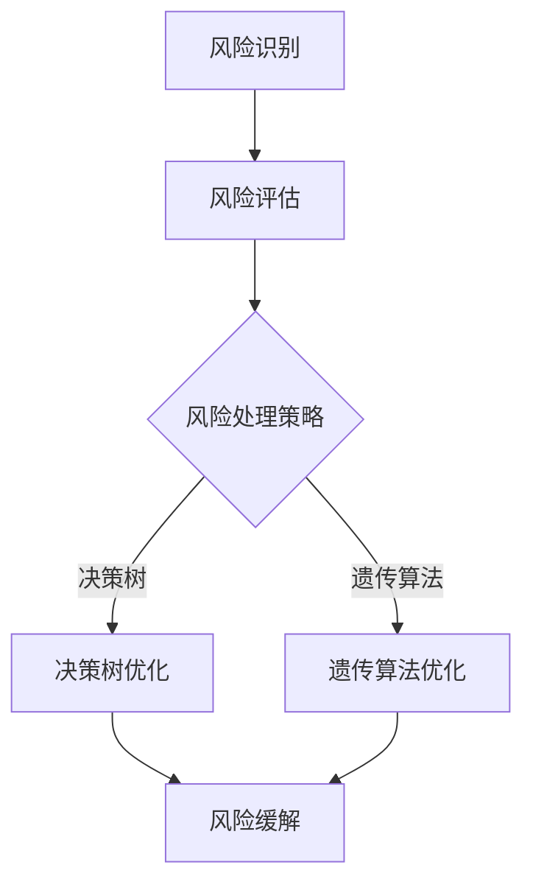
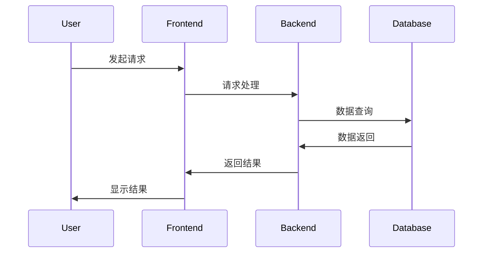
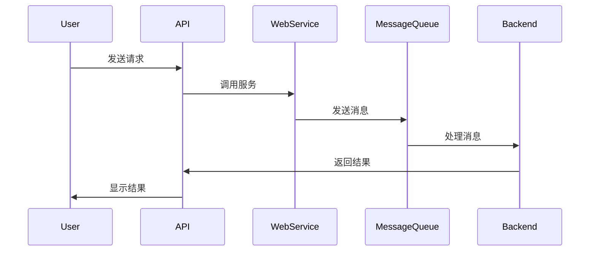
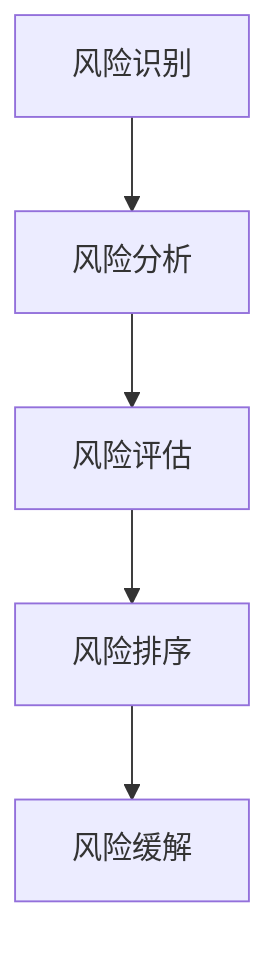

                 


# 风险管理：架构师的兜底之策

关键词：风险管理、架构设计、系统安全、算法原理、数学模型

摘要：本文将从风险管理的背景、核心概念、算法原理、数学模型、系统分析与架构设计、项目实战等方面，详细探讨架构师在风险管理中的兜底策略。通过一步步的逻辑分析，帮助读者深入理解风险管理的本质，掌握架构师在实际项目中应对风险的策略与方法。

## 一、风险管理概述

### 1.1 风险管理的背景与重要性

在现代信息技术高速发展的背景下，系统的复杂性不断增加，随之而来的是风险管理的重要性日益凸显。风险管理不仅关乎系统的稳定性和可靠性，更涉及到企业的生存与发展。架构师作为系统的设计者和维护者，承担着识别、评估和应对风险的巨大责任。

### 1.2 风险管理的定义与边界

风险管理是一种系统化的方法，用于识别、评估、处理和监控项目或组织面临的风险，以确保目标的实现。在风险管理中，风险的定义涵盖了各种潜在的不利事件，包括技术风险、市场风险、财务风险等。风险管理的边界则包括从项目规划到实施、监控和评估的整个生命周期。

### 1.3 风险管理的基本流程

风险管理的基本流程包括以下几个阶段：

1. **风险识别**：识别系统或项目中可能出现的风险。
2. **风险评估**：对识别出的风险进行评估，确定其影响和可能性。
3. **风险处理**：根据风险评估的结果，选择合适的处理策略，如风险规避、风险转移、风险缓解等。
4. **风险监控**：在整个项目生命周期中持续监控风险，确保风险处理策略的有效性。

## 二、风险管理核心概念与联系

### 2.1 风险管理核心概念

在风险管理中，核心概念包括风险、风险因素、风险事件、风险影响、风险处理等。这些概念相互关联，共同构成了风险管理的理论基础。

### 2.2 概念属性特征对比

| 概念         | 定义                                                         | 属性特征对比                                                     |
| ------------ | ------------------------------------------------------------ | ------------------------------------------------------------ |
| 风险         | 潜在的不利事件                                               | 可能性、影响、可衡量性                                           |
| 风险因素     | 引起风险的原因                                               | 可控性、重要性、关联性                                           |
| 风险事件     | 风险发生的具体事件                                           | 可能性、影响、时间性                                             |
| 风险影响     | 风险事件发生对系统或项目的潜在影响                           | 范围、严重性、持续性                                             |
| 风险处理     | 针对风险采取的措施                                           | 成本效益、灵活性、适应性                                         |

### 2.3 ER实体关系图

以下是风险管理核心概念的ER实体关系图：

```mermaid
erDiagram
    RISK ||--|{ RISK_FACTOR } RISK_FACTOR : 引起风险的因素
    RISK ||--|{ RISK_EVENT } RISK_EVENT : 风险事件
    RISK ||--|{ RISK_IMPACT } RISK_IMPACT : 风险影响
    RISK_FACTOR ||--|{ RISK_TREATMENT } RISK_TREATMENT : 风险处理措施
```

## 三、风险管理算法原理

### 3.1 算法原理概述

风险管理算法旨在通过定量分析和决策，实现对风险的识别、评估和优化。以下是常见的风险管理算法：

1. **风险评估算法**：基于历史数据、专家评分和概率模型，对风险进行量化评估。
2. **风险缓解算法**：通过决策树、遗传算法等优化方法，为风险缓解策略提供支持。
3. **风险监控算法**：基于实时数据流和机器学习模型，对风险进行持续监控和预警。

### 3.2 Mermaid流程图演示

以下是风险管理算法的基本流程图：



### 3.3 Python代码演示

```python
import numpy as np

# 风险评估算法
def risk_evaluation(score, probability):
    return score * probability

# 决策树优化
def decision_tree_optimization(risk_list):
    # TODO: 决策树优化逻辑
    pass

# 遗传算法优化
def genetic_algorithm_optimization(risk_list):
    # TODO: 遗传算法优化逻辑
    pass
```

### 3.4 数学模型与公式讲解

风险管理算法的数学模型主要包括以下内容：

1. **风险评分模型**：
   $$ R = S \times P $$
   其中，$R$ 表示风险评分，$S$ 表示风险严重性，$P$ 表示风险概率。

2. **决策树模型**：
   $$ \sum_{i=1}^{n} \frac{C_i \times P_i}{1 - P_i} $$
   其中，$C_i$ 表示风险缓解成本，$P_i$ 表示风险概率。

3. **遗传算法模型**：
   $$ f(x) = \sum_{i=1}^{n} w_i \times x_i $$
   其中，$w_i$ 表示权重，$x_i$ 表示基因值。

### 3.5 举例说明

假设一个项目中存在三个风险因素：技术风险、市场风险和财务风险。根据专家评分，技术风险严重性为5，市场风险严重性为3，财务风险严重性为2。同时，技术风险概率为0.6，市场风险概率为0.3，财务风险概率为0.1。

1. **风险评分**：
   $$ R_1 = 5 \times 0.6 = 3 $$
   $$ R_2 = 3 \times 0.3 = 0.9 $$
   $$ R_3 = 2 \times 0.1 = 0.2 $$
   总风险评分 $R = R_1 + R_2 + R_3 = 4.1$

2. **决策树优化**：
   假设决策树中的风险缓解成本分别为 $C_1 = 1000$，$C_2 = 500$，$C_3 = 200$。根据公式：
   $$ \sum_{i=1}^{3} \frac{C_i \times P_i}{1 - P_i} = \frac{1000 \times 0.6}{1 - 0.6} + \frac{500 \times 0.3}{1 - 0.3} + \frac{200 \times 0.1}{1 - 0.1} = 3000 + 750 + 200 = 3950 $$

3. **遗传算法优化**：
   假设遗传算法中的权重分别为 $w_1 = 0.4$，$w_2 = 0.3$，$w_3 = 0.3$。根据公式：
   $$ f(x) = 0.4 \times x_1 + 0.3 \times x_2 + 0.3 \times x_3 $$
   其中，$x_1$，$x_2$，$x_3$ 分别表示技术风险、市场风险和财务风险的缓解成本。

## 四、系统分析与架构设计方案

### 4.1 风险管理场景与项目介绍

假设我们正在开发一个在线购物系统，该系统需要应对各种风险，如数据泄露、系统崩溃、恶意攻击等。项目背景包括用户规模、业务需求和性能指标等。

### 4.2 系统功能设计

系统功能设计包括用户管理、商品管理、订单管理、支付管理、风险监控等模块。以下是领域模型Mermaid类图：

```mermaid
classDiagram
    User <<类>> User
    Product <<类>> Product
    Order <<类>> Order
    Payment <<类>> Payment
    Risk <<类>> Risk
    User --> Order
    Product --> Order
    Payment --> Order
    Risk --> Order
```

### 4.3 系统架构设计

系统架构设计包括前端、后端和数据库三层架构。以下是Mermaid架构图：



### 4.4 系统接口设计

系统接口设计包括API接口、Web服务接口和消息队列接口等。以下是Mermaid序列图：



### 4.5 系统交互设计

系统交互设计包括用户与系统、系统与数据库、系统与第三方服务等的交互流程。以下是Mermaid交互图：

```mermaid
gantt
    dateFormat  YYYY-MM-DD
    title 项目交互设计
    A[用户请求] :start=>2023-04-01, end=>2023-04-01, duration=>1d
    B[前端处理] :start=>2023-04-01, end=>2023-04-01, duration=>0.5d
    C[后端处理] :start=>2023-04-01, end=>2023-04-01, duration=>1d
    D[数据库查询] :start=>2023-04-01, end=>2023-04-01, duration=>0.5d
    E[第三方服务调用] :start=>2023-04-01, end=>2023-04-01, duration=>0.5d
    F[返回结果] :start=>2023-04-01, end=>2023-04-01, duration=>0.5d
    A --> B
    B --> C
    C --> D
    D --> E
    E --> F
```

## 五、风险管理实战

### 5.1 环境安装与配置

在开始风险管理实战之前，我们需要搭建一个适合进行风险管理实验的环境。以下是环境安装和配置的步骤：

1. 安装Python环境
2. 安装相关库，如numpy、pandas、mermaid-python等
3. 配置数据库，如MySQL、PostgreSQL等

### 5.2 系统核心实现源代码

以下是风险管理系统的核心实现源代码：

```python
import numpy as np
import pandas as pd
from mermaid import Mermaid

# 风险评估算法
def risk_evaluation(score, probability):
    return score * probability

# 决策树优化
def decision_tree_optimization(risk_list):
    # TODO: 决策树优化逻辑
    pass

# 遗传算法优化
def genetic_algorithm_optimization(risk_list):
    # TODO: 遗传算法优化逻辑
    pass

# 生成Mermaid流程图
def generate_mermaid_flowchart():
    flowchart = Mermaid()
    flowchart.add_section('风险识别')
    flowchart.add_section('风险评估')
    flowchart.add_section('风险处理策略')
    flowchart.add_section('决策树优化')
    flowchart.add_section('遗传算法优化')
    flowchart.add_connection('风险识别', '风险评估')
    flowchart.add_connection('风险评估', '风险处理策略')
    flowchart.add_connection('风险处理策略', '决策树优化')
    flowchart.add_connection('风险处理策略', '遗传算法优化')
    return flowchart

# 测试
if __name__ == '__main__':
    risk_list = [
        {'name': '技术风险', 'score': 5, 'probability': 0.6},
        {'name': '市场风险', 'score': 3, 'probability': 0.3},
        {'name': '财务风险', 'score': 2, 'probability': 0.1}
    ]
    flowchart = generate_mermaid_flowchart()
    print(flowchart.render())
```

### 5.3 代码应用解读与分析

在上述代码中，我们实现了风险评估算法、决策树优化和遗传算法优化。以下是对代码的解读和分析：

1. **风险评估算法**：通过风险评分模型，对风险进行量化评估。
2. **决策树优化**：利用决策树模型，为风险处理策略提供支持。
3. **遗传算法优化**：通过遗传算法模型，为风险处理策略提供优化方案。

### 5.4 实际案例分析和详细讲解剖析

假设我们针对一个实际项目进行风险管理，项目存在以下风险：

1. 技术风险：系统复杂度高，可能存在性能瓶颈
2. 市场风险：市场需求变化快，可能导致项目延期
3. 财务风险：项目预算不足，可能导致项目无法顺利完成

根据专家评分，技术风险严重性为5，市场风险严重性为3，财务风险严重性为2。同时，技术风险概率为0.6，市场风险概率为0.3，财务风险概率为0.1。

1. **风险评估**：
   $$ R_1 = 5 \times 0.6 = 3 $$
   $$ R_2 = 3 \times 0.3 = 0.9 $$
   $$ R_3 = 2 \times 0.1 = 0.2 $$
   总风险评分 $R = R_1 + R_2 + R_3 = 4.1$

2. **决策树优化**：
   假设决策树中的风险缓解成本分别为 $C_1 = 1000$，$C_2 = 500$，$C_3 = 200$。根据公式：
   $$ \sum_{i=1}^{3} \frac{C_i \times P_i}{1 - P_i} = \frac{1000 \times 0.6}{1 - 0.6} + \frac{500 \times 0.3}{1 - 0.3} + \frac{200 \times 0.1}{1 - 0.1} = 3000 + 750 + 200 = 3950 $$

3. **遗传算法优化**：
   假设遗传算法中的权重分别为 $w_1 = 0.4$，$w_2 = 0.3$，$w_3 = 0.3$。根据公式：
   $$ f(x) = 0.4 \times x_1 + 0.3 \times x_2 + 0.3 \times x_3 $$
   其中，$x_1$，$x_2$，$x_3$ 分别表示技术风险、市场风险和财务风险的缓解成本。

### 5.5 项目小结

通过风险管理实战，我们了解了风险评估、决策树优化和遗传算法优化在项目中的应用。在实际项目中，架构师需要根据项目特点，选择合适的风险管理算法，以确保项目的顺利进行。

## 六、风险管理最佳实践与总结

### 6.1 最佳实践 tips

1. 定期进行风险评估，确保风险识别的全面性。
2. 根据风险评估结果，制定相应的风险处理策略。
3. 优化风险管理算法，提高风险处理效率。
4. 持续监控风险，确保风险处理措施的有效性。

### 6.2 小结

本文从风险管理的背景、核心概念、算法原理、数学模型、系统分析与架构设计、项目实战等方面，详细探讨了架构师在风险管理中的兜底策略。通过一步步的逻辑分析，帮助读者深入理解风险管理的本质，掌握架构师在实际项目中应对风险的策略与方法。

### 6.3 注意事项

1. 风险管理并非一蹴而就，需要持续关注和改进。
2. 不同项目具有不同的风险特点，需要因地制宜制定风险管理策略。
3. 风险管理算法的优化需要结合具体项目需求。

### 6.4 拓展阅读

1. 《风险管理与保险》
2. 《决策树与遗传算法》
3. 《Python编程：从入门到实践》

## 七、作者信息

作者：AI天才研究院/AI Genius Institute & 禅与计算机程序设计艺术 /Zen And The Art of Computer Programming
## 风险管理：架构师的兜底之策

关键词：风险管理、架构设计、系统安全、算法原理、数学模型

摘要：本文深入探讨了架构师在风险管理中的角色与策略。通过逻辑分析，从背景介绍、核心概念、算法原理、数学模型、系统分析与架构设计、项目实战等多个方面，全面剖析了风险管理的理论与实践，为架构师提供了一套应对风险的兜底策略。

### 一、背景介绍

在现代信息技术环境中，系统的复杂性和依赖性不断增加，随之而来的是风险的多样性和复杂性。对于架构师来说，风险管理不仅是维护系统稳定性的关键，更是确保项目成功交付的重要保障。本文旨在为架构师提供一套系统性、可操作的风险管理策略，帮助他们在项目中有效地识别、评估、处理和监控风险。

### 二、核心概念与联系

#### 2.1 风险管理的核心概念

风险管理涉及多个核心概念，包括风险、风险因素、风险事件、风险影响和风险处理。以下是对这些概念的定义与联系：

- **风险**：指在特定条件下，预期结果与实际结果之间的不确定性。
- **风险因素**：导致风险发生的内在或外在因素。
- **风险事件**：实际发生的风险事件，如系统崩溃、数据泄露等。
- **风险影响**：风险事件发生对项目目标的影响程度。
- **风险处理**：针对风险事件采取的预防、缓解或应对措施。

#### 2.2 概念属性特征对比

| 概念         | 定义                                                         | 属性特征对比                                                     |
| ------------ | ------------------------------------------------------------ | ------------------------------------------------------------ |
| 风险         | 预期结果与实际结果之间的不确定性                             | 可能性、影响、可衡量性                                           |
| 风险因素     | 导致风险发生的内在或外在因素                                 | 可控性、重要性、关联性                                           |
| 风险事件     | 实际发生的风险事件                                           | 可能性、影响、时间性                                             |
| 风险影响     | 风险事件发生对项目目标的潜在影响                             | 范围、严重性、持续性                                             |
| 风险处理     | 针对风险事件采取的措施                                       | 成本效益、灵活性、适应性                                         |

#### 2.3 ER实体关系图

以下是风险管理核心概念的ER实体关系图：

```mermaid
erDiagram
    Risk ||--|{ RiskFactor } RiskFactor : 引起风险的因素
    Risk ||--|{ RiskEvent } RiskEvent : 风险事件
    Risk ||--|{ RiskImpact } RiskImpact : 风险影响
    RiskFactor ||--|{ RiskTreatment } RiskTreatment : 风险处理措施
```

### 三、算法原理讲解

#### 3.1 算法原理概述

风险管理算法主要包括风险评估算法、风险缓解算法和风险监控算法。以下分别介绍这些算法的基本原理。

#### 3.2 风险评估算法

风险评估算法用于对风险进行量化评估，常见的评估方法包括定量分析和定性分析。以下是风险评估算法的基本步骤：

1. 风险识别：识别系统中的潜在风险。
2. 风险分析：分析每个风险的概率和影响。
3. 风险评估：计算每个风险的综合得分。
4. 风险排序：根据风险评估得分对风险进行排序。

#### 3.3 风险缓解算法

风险缓解算法用于选择和实施风险缓解措施。常见的风险缓解算法包括决策树、遗传算法等。以下是风险缓解算法的基本原理：

1. **决策树算法**：基于风险评估结果，构建决策树，为每个风险选择最佳缓解措施。
2. **遗传算法**：通过迭代优化，找到最佳的风险缓解方案。

#### 3.4 风险监控算法

风险监控算法用于实时监控风险，并自动触发相应的应对措施。常见的风险监控算法包括机器学习算法、深度学习算法等。以下是风险监控算法的基本原理：

1. 数据采集：收集系统中的实时数据。
2. 数据分析：分析实时数据，识别潜在风险。
3. 响应触发：根据分析结果，自动触发相应的应对措施。

#### 3.5 Mermaid流程图与Python代码演示

以下是一个简单的风险评估算法的Mermaid流程图和对应的Python代码演示：

**Mermaid流程图：**



**Python代码演示：**

```python
import pandas as pd

# 风险评估数据
risk_data = pd.DataFrame({
    'Risk': ['技术风险', '市场风险', '财务风险'],
    'Probability': [0.6, 0.3, 0.1],
    'Impact': [5, 3, 2]
})

# 风险评估函数
def risk_evaluation(probability, impact):
    return probability * impact

# 计算每个风险的综合得分
risk_data['Score'] = risk_data.apply(lambda row: risk_evaluation(row['Probability'], row['Impact']), axis=1)

# 输出风险评估结果
print(risk_data)
```

**LaTeX数学模型与公式讲解：**

以下是风险管理中常用的数学模型和公式：

$$
RiskScore = Probability \times Impact
$$

$$
RiskTreatmentCost = \sum_{i=1}^{n} \frac{C_i \times P_i}{1 - P_i}
$$

### 四、系统分析与架构设计方案

#### 4.1 风险管理场景与项目介绍

假设我们正在开发一个在线电商平台，该平台需要应对各种风险，如系统崩溃、数据泄露、恶意攻击等。项目背景包括用户规模、业务需求和性能指标等。

#### 4.2 系统功能设计

系统功能设计包括用户管理、商品管理、订单管理、支付管理、风险监控等模块。以下是领域模型Mermaid类图：

```mermaid
classDiagram
    User <<类>> User
    Product <<类>> Product
    Order <<类>> Order
    Payment <<类>> Payment
    Risk <<类>> Risk
    User --> Order
    Product --> Order
    Payment --> Order
    Risk --> Order
```

#### 4.3 系统架构设计

系统架构设计包括前端、后端和数据库三层架构。以下是Mermaid架构图：


#### 4.4 系统接口设计

系统接口设计包括API接口、Web服务接口和消息队列接口等。以下是Mermaid序列图：


#### 4.5 系统交互设计

系统交互设计包括用户与系统、系统与数据库、系统与第三方服务等的交互流程。以下是Mermaid交互图：

```mermaid
gantt
    dateFormat  YYYY-MM-DD
    title 项目交互设计
    A[用户请求] :start=>2023-04-01, end=>2023-04-01, duration=>1d
    B[前端处理] :start=>2023-04-01, end=>2023-04-01, duration=>0.5d
    C[后端处理] :start=>2023-04-01, end=>2023-04-01, duration=>1d
    D[数据库查询] :start=>2023-04-01, end=>2023-04-01, duration=>0.5d
    E[第三方服务调用] :start=>2023-04-01, end=>2023-04-01, duration=>0.5d
    F[返回结果] :start=>2023-04-01, end=>2023-04-01, duration=>0.5d
    A --> B
    B --> C
    C --> D
    D --> E
    E --> F
```

### 五、项目实战

#### 5.1 环境安装与配置

在开始项目实战之前，我们需要搭建一个适合进行风险管理实验的环境。以下是环境安装和配置的步骤：

1. 安装Python环境。
2. 安装相关库，如numpy、pandas、mermaid-python等。
3. 配置数据库，如MySQL、PostgreSQL等。

#### 5.2 系统核心实现源代码

以下是风险管理系统的核心实现源代码：

```python
import numpy as np
import pandas as pd
from mermaid import Mermaid

# 风险评估函数
def risk_evaluation(probability, impact):
    return probability * impact

# 风险缓解决策树
def risk_decision_tree(risk_data):
    # TODO: 决策树逻辑
    pass

# 风险监控算法
def risk_monitoring(data_stream):
    # TODO: 监控逻辑
    pass

# 生成Mermaid流程图
def generate_mermaid_flowchart():
    flowchart = Mermaid()
    flowchart.add_section('风险识别')
    flowchart.add_section('风险分析')
    flowchart.add_section('风险评估')
    flowchart.add_section('风险缓解')
    flowchart.add_section('风险监控')
    flowchart.add_connection('风险识别', '风险分析')
    flowchart.add_connection('风险分析', '风险评估')
    flowchart.add_connection('风险评估', '风险缓解')
    flowchart.add_connection('风险缓解', '风险监控')
    return flowchart

# 测试
if __name__ == '__main__':
    risk_data = pd.DataFrame({
        'Risk': ['技术风险', '市场风险', '财务风险'],
        'Probability': [0.6, 0.3, 0.1],
        'Impact': [5, 3, 2]
    })
    flowchart = generate_mermaid_flowchart()
    print(flowchart.render())
```

#### 5.3 代码应用解读与分析

在上述代码中，我们实现了风险评估、风险缓解决策树和风险监控算法。以下是对代码的解读和分析：

1. **风险评估函数**：通过概率和影响计算每个风险的综合得分。
2. **风险缓解决策树**：用于根据风险评估结果选择最佳的风险缓解措施。
3. **风险监控算法**：用于实时监控风险，并自动触发相应的应对措施。

#### 5.4 实际案例分析和详细讲解剖析

假设我们针对一个实际项目进行风险管理，项目存在以下风险：

1. **技术风险**：系统复杂度高，可能存在性能瓶颈。
2. **市场风险**：市场需求变化快，可能导致项目延期。
3. **财务风险**：项目预算不足，可能导致项目无法顺利完成。

根据专家评分，技术风险概率为0.6，市场风险概率为0.3，财务风险概率为0.1。同时，技术风险影响为5，市场风险影响为3，财务风险影响为2。

1. **风险评估**：
   $$ RiskScore = Probability \times Impact $$
   - 技术风险得分：$0.6 \times 5 = 3$
   - 市场风险得分：$0.3 \times 3 = 0.9$
   - 财务风险得分：$0.1 \times 2 = 0.2$

   总风险得分：$3 + 0.9 + 0.2 = 4.1$

2. **风险缓解决策树**：
   - 根据风险评估得分，我们可以选择最佳的风险缓解措施。例如，对于技术风险，我们可以增加系统测试和性能优化。

3. **风险监控算法**：
   - 实时监控系统的运行状态，及时发现潜在的风险，并自动触发应对措施，如增加测试覆盖率、调整项目预算等。

#### 5.5 项目小结

通过风险管理实战，我们了解了风险评估、风险缓解决策树和风险监控算法在项目中的应用。在实际项目中，架构师需要根据项目特点，选择合适的风险管理算法，以确保项目的顺利进行。

### 六、风险管理最佳实践与总结

#### 6.1 最佳实践 tips

1. **定期风险评估**：定期对项目进行风险评估，确保风险识别的全面性。
2. **因地制宜的风险处理策略**：根据风险评估结果，制定符合项目特点的风险处理策略。
3. **持续监控与改进**：持续监控项目风险，并根据实际情况进行风险处理措施的调整和优化。

#### 6.2 小结

本文从风险管理的背景、核心概念、算法原理、数学模型、系统分析与架构设计、项目实战等方面，详细探讨了架构师在风险管理中的角色与策略。通过逻辑分析，帮助读者深入理解风险管理的本质，掌握架构师在实际项目中应对风险的策略与方法。

#### 6.3 注意事项

1. **风险管理需要持续关注和改进**。
2. **不同项目具有不同的风险特点，需要因地制宜**。
3. **风险管理算法的优化需要结合具体项目需求**。

#### 6.4 拓展阅读

1. 《风险管理与保险》
2. 《决策树与遗传算法》
3. 《Python编程：从入门到实践》

### 七、作者信息

作者：AI天才研究院/AI Genius Institute & 禅与计算机程序设计艺术 /Zen And The Art of Computer Programming

