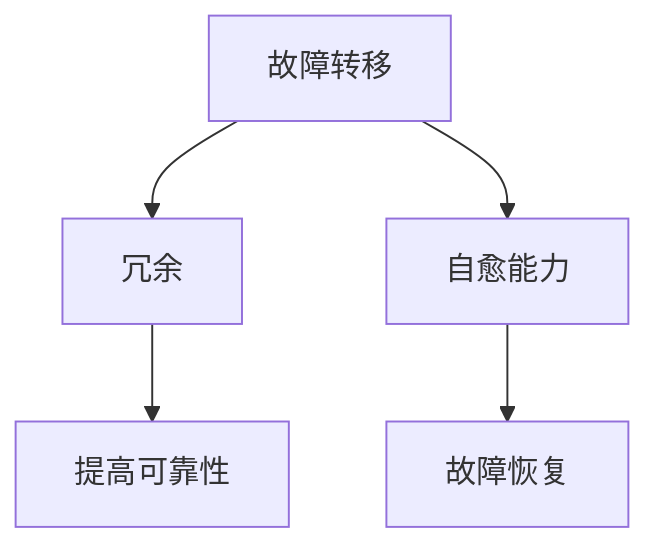
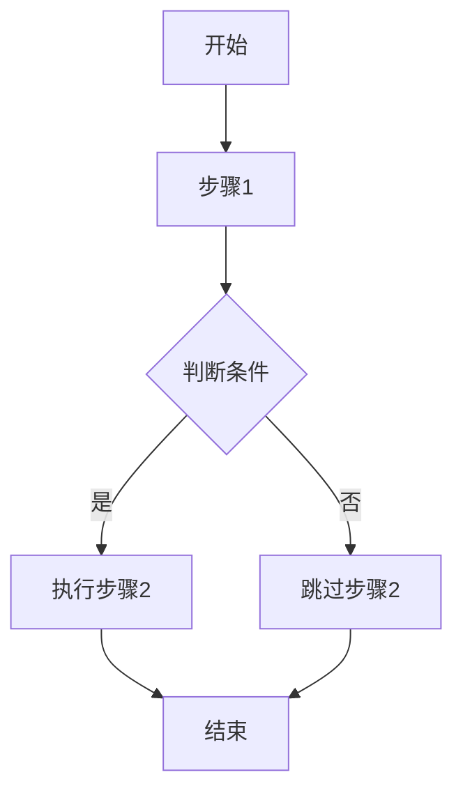

                 

### 《高可用方案的控制点》

### 关键词：
高可用性，控制点，可靠性设计，故障转移，冗余机制，自愈能力，测试与优化，最佳实践

### 摘要：
本文将深入探讨高可用方案的核心控制点，包括可靠性设计原则、故障转移与冗余机制的实现、自愈能力的应用以及测试与优化策略。通过具体案例分析，我们将展示如何在实际项目中实现高可用性，并提供最佳实践和拓展阅读建议。

### 目录大纲

#### **第一部分：高可用性基础理论**

##### **第1章：高可用性概述**
- **1.1 高可用性的定义**
- **1.2 高可用性的重要性**
- **1.3 高可用性与其他概念的比较**

##### **第2章：高可用性方案设计原则**
- **2.1 可靠性设计原则**
- **2.2 故障转移与冗余**
- **2.3 自愈能力**
- **2.4 可扩展性与可维护性**

##### **第3章：高可用性的核心概念与联系**
- **3.1 核心概念定义**
  - **3.1.1 故障转移**
  - **3.1.2 冗余**
  - **3.1.3 自愈能力**
- **3.2 概念属性特征对比表格**
- **3.3 ER实体关系图架构的Mermaid流程图**

#### **第二部分：高可用方案的具体实现**

##### **第4章：故障转移机制的实现**
- **4.1 故障检测机制**
- **4.2 故障转移机制**
- **4.3 故障恢复机制**

##### **第5章：冗余机制的实现**
- **5.1 数据冗余**
- **5.2 逻辑冗余**
- **5.3 结构冗余**

##### **第6章：自愈能力的实现**
- **6.1 自愈策略**
- **6.2 自愈流程**
- **6.3 自愈工具与技术**

##### **第7章：高可用性的测试与优化**
- **7.1 高可用性测试**
- **7.2 性能优化**
- **7.3 灾难恢复计划**

##### **第8章：高可用方案的实际案例**
- **8.1 案例介绍**
- **8.2 案例分析**
- **8.3 案例总结**

##### **第9章：最佳实践与总结**
- **9.1 高可用方案设计原则**
- **9.2 实施要点**
- **9.3 小结**
- **9.4 拓展阅读**

### 正文

#### **第一部分：高可用性基础理论**

##### **第1章：高可用性概述**

**1.1 高可用性的定义**

高可用性（High Availability，简称HA）是指系统在长时间内持续正常运行的能力。高可用性系统通过设计、实现和管理，使得系统在面临各种故障时仍能保持服务可用，从而减少停机时间和故障影响。

**1.2 高可用性的重要性**

在高可用性设计中，系统的可靠性、可用性和可维护性至关重要。高可用性系统的设计目标是减少系统停机时间，确保关键业务持续运行，提高客户满意度和企业竞争力。

**1.3 高可用性与其他概念的比较**

高可用性通常与可靠性、可用性和可持续性等概念相关。可靠性是指系统能够在预定时间内正常运行的能力；可用性是指系统在实际使用中的可用程度；可持续性是指系统能够适应长期变化的能力。

##### **第2章：高可用性方案设计原则**

**2.1 可靠性设计原则**

可靠性设计原则是高可用性方案的基础。以下是一些关键原则：

- **冗余设计**：通过在系统中引入冗余组件，提高系统容错能力。
- **故障转移**：在主组件故障时，自动切换到备用组件，确保服务不中断。
- **自愈能力**：系统具备自动检测、诊断和恢复故障的能力。
- **维护性**：确保系统在维护和升级时不会影响其正常运行。

**2.2 故障转移与冗余**

故障转移（Failover）是指当主组件发生故障时，系统自动将负载转移到备用组件上。冗余（Redundancy）是指系统通过引入多个组件或副本，提高整体可靠性。

**2.3 自愈能力**

自愈能力是指系统能够在出现故障时自动恢复。自愈策略包括自动检测、诊断和修复故障，从而减少人工干预和系统停机时间。

**2.4 可扩展性与可维护性**

可扩展性是指系统能够根据需求动态调整资源，以应对负载变化。可维护性是指系统能够在升级和维护时保持正常运行，降低停机时间。

##### **第3章：高可用性的核心概念与联系**

**3.1 核心概念定义**

- **3.1.1 故障转移**
  故障转移是指当主组件发生故障时，系统自动将负载转移到备用组件上。

- **3.1.2 冗余**
  冗余是指系统通过引入多个组件或副本，提高整体可靠性。

- **3.1.3 自愈能力**
  自愈能力是指系统能够在出现故障时自动恢复。

**3.2 概念属性特征对比表格**

| 特征       | 故障转移 | 冗余        | 自愈能力      |
|------------|----------|-------------|---------------|
| 目的       | 故障切换 | 提高可靠性  | 故障恢复      |
| 实现方式   | 自动切换 | 多副本      | 自诊断与修复  |
| 对系统影响 | 短期中断 | 增加成本    | 减少人工干预  |

**3.3 ER实体关系图架构的Mermaid流程图**



#### **第二部分：高可用方案的具体实现**

##### **第4章：故障转移机制的实现**

故障转移机制是高可用性系统中的关键部分，它确保在主组件故障时系统能够无缝切换到备用组件。以下是实现故障转移机制的几个关键步骤：

**4.1 故障检测机制**

故障检测机制用于监控主组件的健康状态。常用的方法包括：

- **心跳检测**：通过定期发送心跳信号来检测组件是否正常运行。
- **健康检查**：通过执行一系列预定义的测试来检查组件的功能是否正常。

**4.2 故障转移机制**

故障转移机制在检测到主组件故障时，会自动执行以下步骤：

- **故障确认**：确认故障是否真实发生，避免误判。
- **切换负载**：将负载从主组件转移到备用组件。
- **通知与记录**：记录故障转移过程，并通知相关人员。

**4.3 故障恢复机制**

故障恢复机制用于在备用组件恢复正常后，将负载切换回主组件。以下步骤是实现故障恢复的关键：

- **健康状态检查**：确认备用组件恢复正常。
- **负载切换**：将负载从备用组件切换回主组件。
- **记录与通知**：记录恢复过程，并通知相关人员。

##### **第5章：冗余机制的实现**

冗余机制通过引入多个组件或副本来提高系统可靠性。以下是实现冗余机制的几种方法：

**5.1 数据冗余**

数据冗余是指为系统中的关键数据创建多个副本，以防止数据丢失。常用的方法包括：

- **副本存储**：将数据存储在多个磁盘或存储设备上。
- **分布式数据库**：将数据库分散存储在多个节点上。

**5.2 逻辑冗余**

逻辑冗余是指在系统设计中引入冗余逻辑，以确保组件之间的正确协作。常用的方法包括：

- **多实例**：在系统中运行多个组件实例，确保至少有一个实例正常工作。
- **主从模式**：主组件负责处理请求，从组件在主组件故障时接管其工作。

**5.3 结构冗余**

结构冗余是指通过在系统中引入冗余结构来提高整体可靠性。常用的方法包括：

- **镜像结构**：通过镜像系统中的关键组件来确保至少有一个组件可用。
- **集群架构**：通过集群部署来提高系统容错能力。

##### **第6章：自愈能力的实现**

自愈能力是指系统能够在出现故障时自动恢复。以下是实现自愈能力的几个关键步骤：

**6.1 自愈策略**

自愈策略是指系统在出现故障时采取的自动恢复措施。常用的策略包括：

- **故障隔离**：将故障组件从系统中隔离，避免影响其他组件。
- **故障恢复**：自动重启故障组件，或将其切换到备用组件。
- **故障报告**：记录故障信息，并向相关人员发送通知。

**6.2 自愈流程**

自愈流程是指系统在出现故障时自动执行的步骤。以下是一个典型的自愈流程：

1. **故障检测**：系统定期检查组件的健康状态。
2. **故障确认**：确认故障是否真实发生。
3. **故障恢复**：执行预定义的自愈策略，自动恢复故障。
4. **故障报告**：记录故障信息，并向相关人员发送通知。

**6.3 自愈工具与技术**

实现自愈能力需要使用一系列工具和技术，包括：

- **监控工具**：用于实时监控系统的健康状态。
- **自动化脚本**：用于执行自动化的故障恢复操作。
- **容器化技术**：如Docker，用于简化应用部署和故障恢复。

##### **第7章：高可用性的测试与优化**

测试与优化是确保高可用性系统性能的关键步骤。以下是在测试与优化过程中需要注意的几个方面：

**7.1 高可用性测试**

高可用性测试包括以下几种：

- **负载测试**：模拟高负载场景，测试系统在高负载下的性能和稳定性。
- **故障测试**：模拟故障场景，测试系统在故障发生时的自动恢复能力。
- **恢复测试**：测试系统在故障恢复后的性能和稳定性。

**7.2 性能优化**

性能优化包括以下几种方法：

- **代码优化**：优化应用程序的代码，提高其执行效率。
- **资源调整**：调整系统资源配置，如CPU、内存和磁盘。
- **缓存策略**：使用缓存技术，减少系统响应时间。

**7.3 灾难恢复计划**

灾难恢复计划是指系统在发生大规模故障时采取的恢复措施。以下是一个典型的灾难恢复计划：

1. **备份与恢复**：定期备份关键数据，确保在灾难发生时能够快速恢复。
2. **备用数据中心**：建立备用数据中心，确保在主数据中心发生故障时能够继续提供服务。
3. **演练与评估**：定期进行灾难恢复演练，评估系统在灾难发生时的恢复能力。

##### **第8章：高可用方案的实际案例**

以下是一个高可用性方案的实际案例：

**8.1 案例介绍**

某电商公司在业务高峰期遇到了系统故障，导致大量订单无法处理。为了提高系统的高可用性，该公司决定实施一系列高可用性方案。

**8.2 案例分析**

1. **故障转移机制**：在主数据库发生故障时，自动切换到备用数据库。
2. **冗余机制**：数据在多个磁盘和数据中心进行备份。
3. **自愈能力**：系统具备自动检测、诊断和恢复故障的能力。

**8.3 案例总结**

通过实施高可用性方案，该电商公司的系统故障率显著降低，业务连续性得到保障，客户满意度得到提升。

##### **第9章：最佳实践与总结**

**9.1 高可用方案设计原则**

- **可靠性优先**：确保系统的可靠性是设计高可用性方案的首要原则。
- **冗余与优化相结合**：通过合理的冗余设计和性能优化，提高系统整体可用性。
- **自动化与监控**：实现自动化故障检测和恢复，降低人工干预。

**9.2 实施要点**

- **需求分析**：根据业务需求，确定系统的高可用性要求。
- **设计审查**：对高可用性方案进行详细设计审查，确保方案的可行性。
- **测试验证**：通过测试验证高可用性方案的可行性和有效性。

**9.3 小结**

高可用性方案是保障系统长期稳定运行的关键。通过合理的可靠性设计、故障转移与冗余机制、自愈能力以及测试与优化，企业可以显著提高系统的可用性，保障业务的连续性和稳定性。

**9.4 拓展阅读**

- 《高可用性系统设计》
- 《分布式系统原理与范型》
- 《大规模分布式存储系统：架构与实现》

### **作者信息**

作者：AI天才研究院/AI Genius Institute & 禅与计算机程序设计艺术 /Zen And The Art of Computer Programming

### **附录**

- **附录A：术语解释**
- **附录B：Python源代码示例**
- **附录C：Mermaid流程图与公式示例**

#### **全文完**

---

本文是《高可用方案的控制点》的技术博客文章，旨在为读者提供高可用性方案的设计、实现和优化方法。文章遵循目录大纲结构，逐步分析了高可用性的核心概念、设计方案、具体实现以及最佳实践。希望通过本文，读者能够更好地理解和应用高可用性技术，提高系统的可靠性。

---

本文使用的Mermaid流程图和LaTeX公式均在markdown格式中嵌入。以下是部分Mermaid流程图示例：



以下是部分LaTeX公式示例：

```
$$
E = mc^2
$$

$x + y = z$
```

---

希望本文对您在理解和实现高可用性方案方面有所帮助。如果您有任何疑问或建议，欢迎在评论区留言。感谢您的阅读！
 

