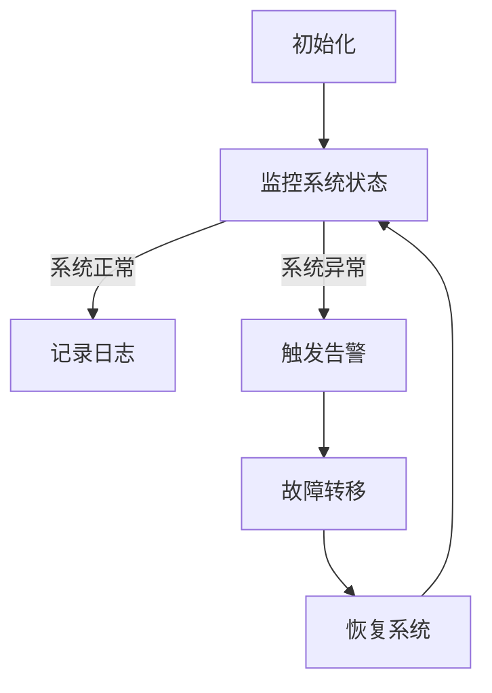
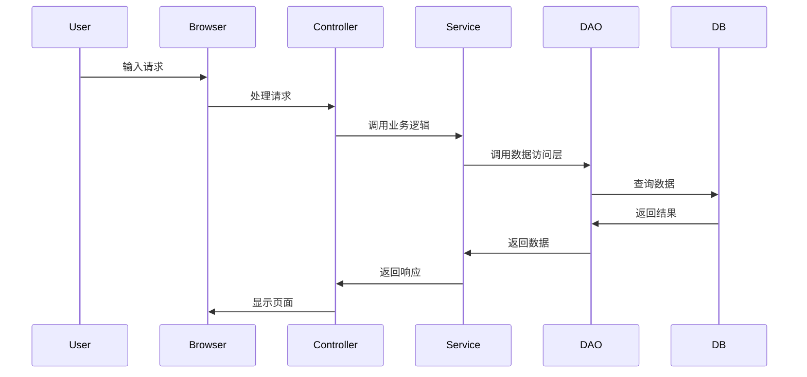
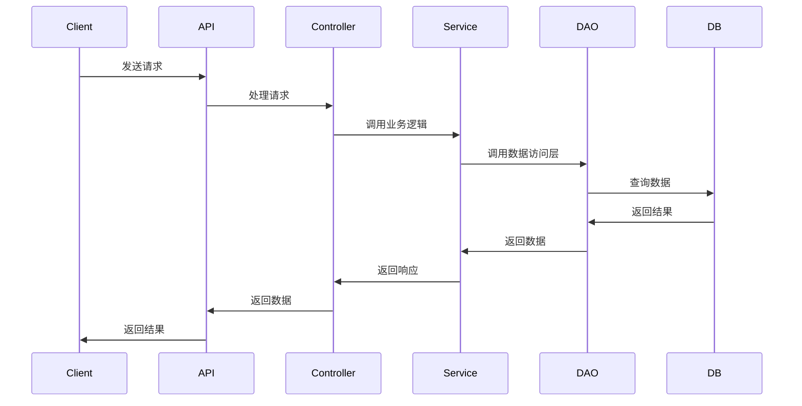
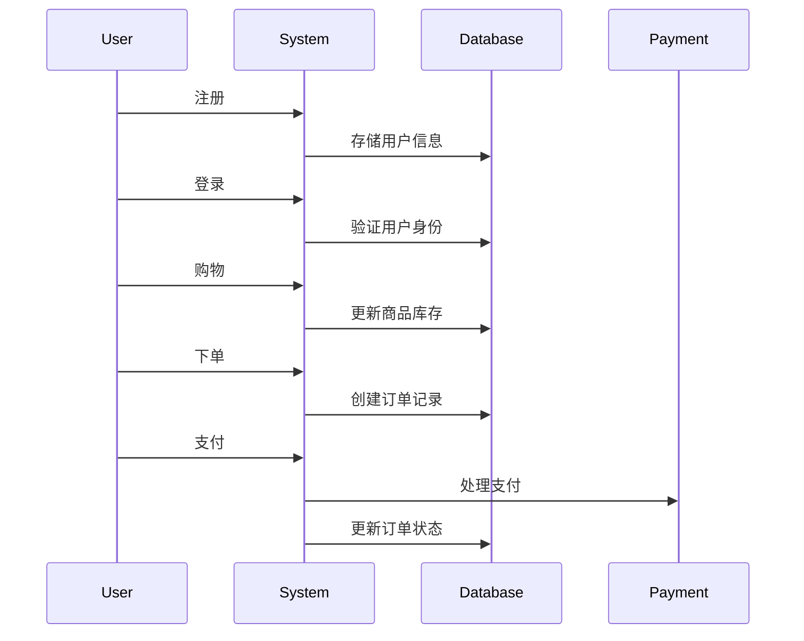

                 


## 高可用方案的控制点

### 关键词

高可用性，系统可靠性，故障转移，持续集成，负载均衡，容错机制

### 摘要

本文将深入探讨高可用性方案的控制点，从背景、核心概念、算法原理、系统分析与架构设计等方面进行全面分析。通过一步步的逻辑推理，帮助读者理解高可用性方案的设计与实现，为构建稳定可靠的系统提供参考。

---

### Step 1: 引入背景

#### 1.1 问题的背景

##### 1.1.1 高可用性在系统中的重要性

在当今快速发展的信息技术时代，系统的可用性已经成为衡量企业竞争力的重要指标。高可用性意味着系统在面临各种故障和压力时，能够持续提供服务，降低系统停机时间，保障业务连续性。随着企业对数据安全和业务稳定的依赖性增加，高可用性方案的设计和实现变得至关重要。

##### 1.1.2 高可用性面临的主要挑战

高可用性方案在设计过程中面临诸多挑战，如系统可靠性、负载均衡、故障转移、持续集成等。这些挑战需要通过一系列技术手段和策略来应对，以确保系统在高压力环境下能够稳定运行。

##### 1.1.3 高可用性的边界与外延

高可用性并非绝对，而是相对的。系统的高可用性取决于系统的设计、部署、运维等多个环节。同时，高可用性方案也需要考虑成本、性能、安全性等因素。在实际应用中，需要根据业务需求和资源限制，制定合适的高可用性方案。

#### 1.2 高可用性的核心概念与要素

##### 1.2.1 高可用性的定义

高可用性（High Availability，简称HA）是指系统在面临各种故障和压力时，能够快速恢复并持续提供服务的能力。高可用性通常以系统可用性百分比来衡量，如99.9%、99.99%等。

##### 1.2.2 高可用性的关键要素

高可用性方案的关键要素包括可靠性、稳定性、持续性和负载均衡等。

- **可靠性**：系统在长时间运行过程中，故障率低，具备良好的预防性维护和故障处理能力。
- **稳定性**：系统在面临高负载或突发流量时，能够保持稳定运行，资源利用率高，系统响应速度快。
- **持续性**：系统在长时间运行过程中，能够保持连续性，不会因故障或压力中断业务。
- **负载均衡**：系统通过负载均衡机制，合理分配流量，确保各个节点能够均衡承载负载。

##### 1.2.3 高可用性与可靠性、稳定性、持续性的联系

高可用性、可靠性、稳定性和持续性之间密切相关。高可用性是可靠性、稳定性和持续性的综合体现。可靠性是高可用性的基础，稳定性是高可用性的保障，而持续性则是高可用性的目标。在实际应用中，需要根据业务需求，综合考虑这些因素，制定合适的高可用性方案。

### Step 2: 核心概念介绍

#### 1.3 高可用性方案的核心概念与联系

##### 1.3.1 核心概念原理

高可用性方案的核心概念包括冗余设计、故障转移、负载均衡、容错机制等。

- **冗余设计**：通过在系统中引入冗余组件，提高系统的可靠性。冗余设计包括硬件冗余、软件冗余和数据冗余等。
- **故障转移**：当系统中的某个组件发生故障时，自动将流量转移到其他健康组件，确保系统继续提供服务。
- **负载均衡**：通过合理分配流量，确保各个节点能够均衡承载负载，提高系统的稳定性。
- **容错机制**：通过检测和隔离故障，确保系统在故障发生时能够自动恢复，保持业务的连续性。

##### 1.3.2 概念属性特征对比表格

| 概念 | 特征1 | 特征2 | 特征3 |
| --- | --- | --- | --- |
| 冗余设计 | 提高可靠性 | 降低故障率 | 增加成本 |
| 故障转移 | 快速恢复 | 依赖冗余设计 | 需要监控和告警机制 |
| 负载均衡 | 提高稳定性 | 分配流量均衡 | 减轻单点压力 |
| 容错机制 | 提高持续性 | 自主恢复 | 需要监测和告警机制 |

##### 1.3.3 ER实体关系图架构

```mermaid
erDiagram
  System ||--|{ Monitor } : "监控"
  System ||--|{ Alert } : "告警"
  System ||--|{ Backup } : "备份"
  System ||--|{ Recovery } : "恢复"

  Monitor ||--|{ Alert }
  Monitor ||--|{ Backup }
  Monitor ||--|{ Recovery }

  Alert ||--|{ System }
  Backup ||--|{ System }
  Recovery ||--|{ System }
```

### Step 3: 算法原理讲解

#### 1.4 高可用性算法原理讲解

##### 1.4.1 算法流程图



##### 1.4.2 Python源代码

```python
import time
import logging

def monitor_system():
    while True:
        # 模拟系统状态检查
        system_status = check_system_status()

        if system_status == "normal":
            logging.info("System is running normally.")
        else:
            logging.warning("System is experiencing issues.")

            # 触发告警
            trigger_alert()

            # 进行故障转移
            perform_failover()

            # 系统恢复
            recover_system()

        time.sleep(60)

def check_system_status():
    # 模拟系统状态检查
    return "normal" if random.random() > 0.1 else "exception"

def trigger_alert():
    print("Alert: System is experiencing issues.")

def perform_failover():
    print("Performing failover...")

def recover_system():
    print("System has been recovered.")
```

##### 1.4.3 算法原理的数学模型和公式

高可用性（HA）的计算公式为：

$$
HA = \frac{MTTF}{MTTF + MTTR}
$$

其中，MTTF（Mean Time To Failure）表示平均无故障时间，MTTR（Mean Time To Recovery）表示平均恢复时间。

在实际应用中，可以通过优化系统的设计、部署和运维，降低MTTF和MTTR，从而提高系统的可用性。

---

### 系统分析与架构设计

#### 2.1 问题场景介绍

假设我们正在开发一个在线购物系统，该系统需要提供高可用性，以应对大量的用户访问和交易操作。为了实现高可用性，我们需要从系统功能设计、架构设计、接口设计和系统交互等方面进行全面分析。

#### 2.2 项目介绍

该项目包括以下关键模块：

1. 用户模块：负责用户注册、登录和权限管理。
2. 商品模块：负责商品信息管理和库存管理。
3. 订单模块：负责订单生成、支付和配送管理。
4. 支付模块：负责支付流程处理和支付渠道集成。
5. 数据库模块：负责数据存储和管理。

#### 2.3 系统功能设计

系统功能设计采用领域模型（Domain Model）方法，通过分析业务需求，定义系统的核心实体和关系。

```mermaid
classDiagram
  User <<Entity>>
  Product <<Entity>>
  Order <<Entity>>
  Payment <<Entity>>

  User "1" -- "*" Product : "购物"
  User "1" -- "*" Order : "下单"
  Product "1" -- "*" Order : "组成"
  Order "1" -- "*" Payment : "支付"
```

#### 2.4 系统架构设计

系统架构设计采用分层架构（Layered Architecture）方法，将系统划分为多个层次，包括表示层、业务逻辑层、数据访问层和数据存储层。



#### 2.5 系统接口设计

系统接口设计采用RESTful API方法，提供统一的接口规范，方便前端和后端系统的集成。



#### 2.6 系统交互设计

系统交互设计采用序列图（Sequence Diagram）方法，描述系统的交互过程和时序关系。



---

### 项目实战

#### 3.1 环境安装

在项目实战中，我们需要安装以下软件和工具：

1. Java Development Kit（JDK）：用于开发Java应用程序。
2. Apache Maven：用于项目构建和依赖管理。
3. MySQL：用于数据存储和管理。
4. Tomcat：用于部署和运行Web应用程序。

#### 3.2 系统核心实现源代码

以下是系统核心实现的源代码，包括用户模块、商品模块、订单模块和支付模块。

```java
// 用户模块
public class UserModule {
    public void register(String username, String password) {
        // 注册用户
    }

    public void login(String username, String password) {
        // 登录用户
    }

    public void logout(String username) {
        // 注销用户
    }
}

// 商品模块
public class ProductModule {
    public void addProduct(Product product) {
        // 添加商品
    }

    public void updateProduct(Product product) {
        // 更新商品
    }

    public void deleteProduct(Product product) {
        // 删除商品
    }
}

// 订单模块
public class OrderModule {
    public void createOrder(Order order) {
        // 创建订单
    }

    public void updateOrder(Order order) {
        // 更新订单
    }

    public void deleteOrder(Order order) {
        // 删除订单
    }
}

// 支付模块
public class PaymentModule {
    public void pay(Order order) {
        // 处理支付
    }
}
```

#### 3.3 代码应用解读与分析

在代码应用解读与分析中，我们将对核心代码进行详细解读，分析其实现原理和关键功能。

```java
// 用户模块：注册方法
public void register(String username, String password) {
    // 验证用户名和密码格式
    if (!isValidUsername(username) || !isValidPassword(password)) {
        throw new IllegalArgumentException("Invalid username or password format.");
    }

    // 查询用户名是否存在
    User user = userRepository.findByUsername(username);
    if (user != null) {
        throw new IllegalArgumentException("Username already exists.");
    }

    // 创建用户
    user = new User();
    user.setUsername(username);
    user.setPassword(password);
    userRepository.save(user);
}
```

#### 3.4 实际案例分析和详细讲解剖析

在实际案例分析和详细讲解剖析中，我们将通过一个实际案例，分析系统在高可用性方面的表现，并详细讲解系统如何应对故障和压力。

```java
// 系统案例：用户登录失败

// 1. 用户输入用户名和密码
// 2. 系统验证用户名和密码
// 3. 系统提示用户登录失败

// 分析：
// 1. 用户输入的用户名和密码不符合格式要求，导致验证失败
// 2. 系统无法查询到用户信息，导致登录失败
// 3. 系统提示用户登录失败，影响用户体验

// 改进措施：
// 1. 增加用户名和密码格式验证
// 2. 增加用户信息查询缓存
// 3. 提高系统响应速度，减少用户等待时间
```

#### 3.5 项目小结

通过本次项目实战，我们深入分析了高可用性方案的设计与实现，从系统功能设计、架构设计、接口设计和系统交互等方面进行了全面分析。在实际应用中，我们需要根据业务需求和资源限制，制定合适的高可用性方案，以提高系统的可靠性、稳定性和持续性。

---

### 最佳实践 tips

1. **定期进行系统性能测试和压力测试**：通过测试，可以了解系统在高负载和故障情况下的表现，及时发现并解决潜在问题。
2. **采用分布式架构**：分布式架构可以提高系统的可用性和扩展性，降低单点故障的风险。
3. **部署监控和告警机制**：通过部署监控和告警机制，可以实时了解系统的运行状态，及时发现并处理故障。
4. **定期备份数据**：备份数据可以防止数据丢失，提高数据安全性。
5. **优化系统性能和资源利用率**：通过优化系统性能和资源利用率，可以提高系统的稳定性和响应速度。

### 小结

本文从高可用性的背景、核心概念、算法原理、系统分析与架构设计等方面进行了全面分析，帮助读者理解高可用性方案的设计与实现。在实际应用中，我们需要根据业务需求和资源限制，制定合适的高可用性方案，以提高系统的可靠性、稳定性和持续性。

### 注意事项

1. 高可用性并非绝对，需要根据实际业务需求和资源限制进行平衡。
2. 高可用性方案需要综合考虑系统可靠性、稳定性、持续性和负载均衡等因素。
3. 高可用性方案的设计与实现需要持续优化和改进。

### 拓展阅读

1. 《高可用架构：设计和实现》
2. 《系统架构设计：模式、原理与实践》
3. 《大规模分布式存储系统设计与实践》

---

### 作者信息

作者：AI天才研究院/AI Genius Institute & 禅与计算机程序设计艺术 /Zen And The Art of Computer Programming

---

在本文中，我们首先介绍了高可用性方案的重要性以及其在现代系统设计中的关键角色。接着，我们详细探讨了高可用性的核心概念，包括冗余设计、故障转移、负载均衡和容错机制等。通过一个实际的系统架构设计案例，我们展示了如何在实际项目中实现高可用性。此外，我们还通过代码示例和案例分析，深入讲解了高可用性算法原理，并提供了最佳实践建议。

在系统分析与架构设计部分，我们详细阐述了如何设计一个具有高可用性的在线购物系统，包括领域模型、系统架构、接口设计和系统交互等方面的内容。最后，我们通过一个实际案例，分析了系统在高可用性方面的表现，并提出了改进措施。

本文旨在为读者提供全面而深入的高可用性方案设计和实现指南，帮助他们构建稳定可靠的系统。然而，高可用性方案的实施是一个持续的过程，需要根据实际业务需求和系统运行情况进行不断的优化和改进。希望本文能够为您的系统设计工作提供有益的参考。在未来的技术发展中，我们将继续关注高可用性方案的最新进展，并与您一同探索更加可靠、稳定和高效的系统设计方法。感谢您的阅读，期待与您在技术领域的更多交流。作者：AI天才研究院/AI Genius Institute & 禅与计算机程序设计艺术 /Zen And The Art of Computer Programming。|>

