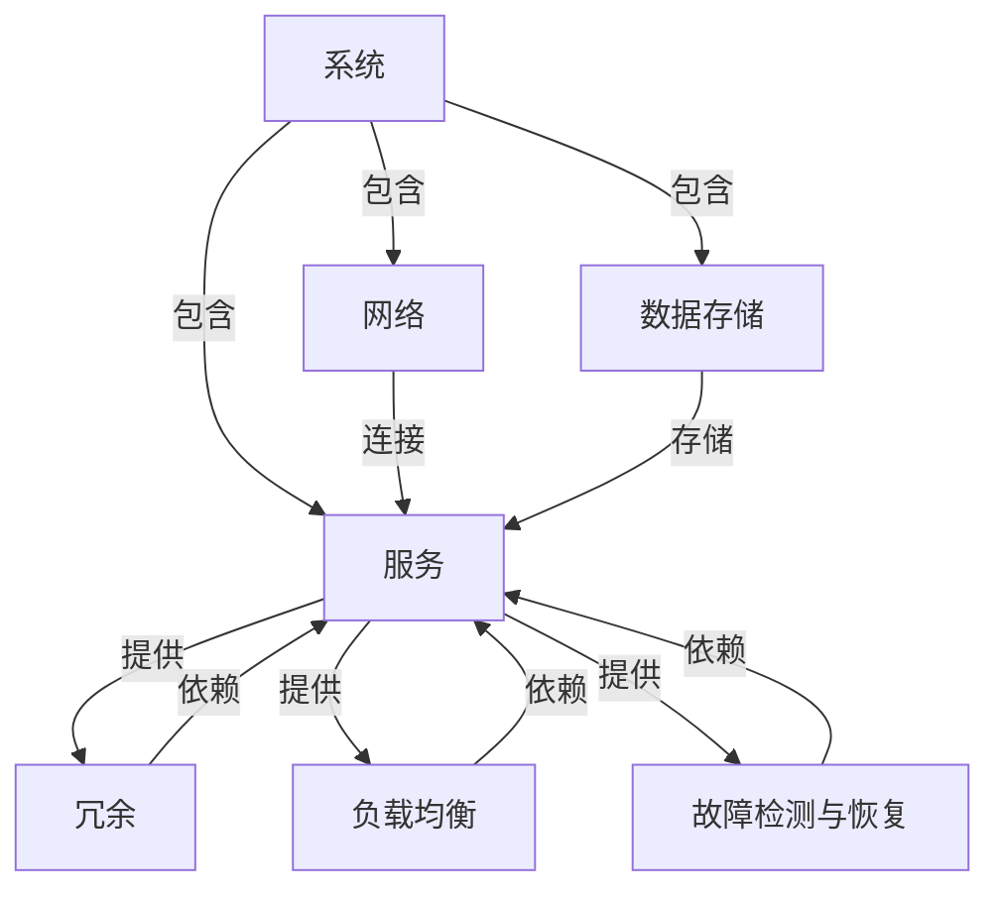
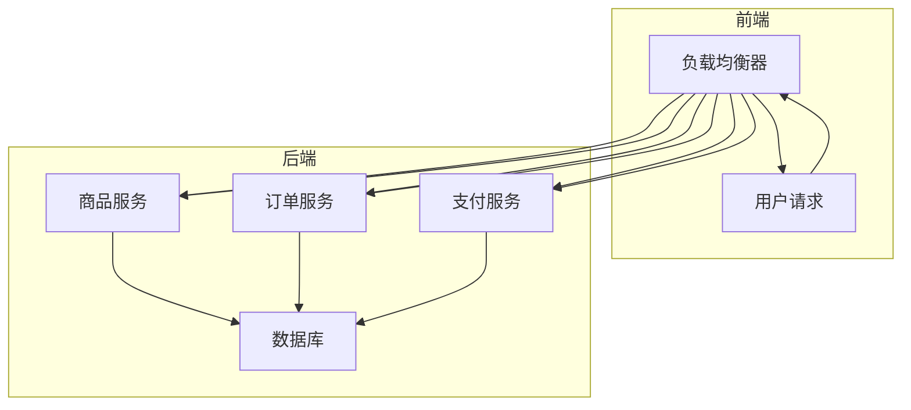
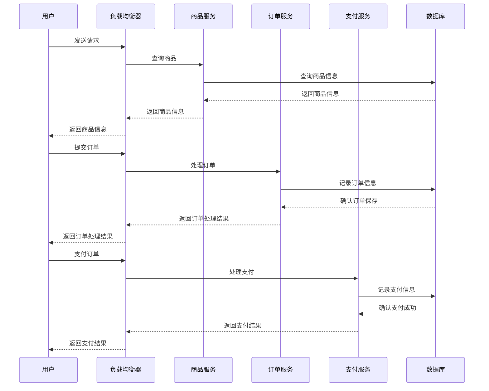

                 

### 高可用架构：构建永不宕机的系统

#### 关键词：高可用架构，系统稳定性，故障处理机制，冗余设计，负载均衡，数据备份

#### 摘要：

在当今信息时代，系统的高可用性成为衡量一个系统成功与否的重要指标。本文旨在深入探讨高可用架构（High Availability Architecture）的核心概念、设计原则、实现方法以及其在实际项目中的应用。我们将通过一步一步的分析和推理，帮助读者理解和掌握如何构建一个永不宕机的系统。

### 第一部分：背景介绍

#### 核心概念

**高可用架构（High Availability Architecture）** 是一种系统设计理念，旨在通过冗余、负载均衡、故障检测与恢复等技术手段，提高系统的可靠性和稳定性，确保系统在出现故障时能够快速恢复，从而减少系统停机时间，提供持续、可靠的服务。

**系统稳定性（System Stability）** 是指系统在各种环境下都能保持正常运行的能力。一个稳定的系统不会因外部或内部因素而频繁宕机或出现异常行为。

**故障处理机制（Fault Handling Mechanism）** 是指系统在遇到故障时，能够自动检测、隔离和恢复，以减少对用户的影响。

#### 问题描述

在快速发展的信息技术领域，系统的稳定性和可靠性变得越来越重要。无论是企业内部系统还是面向公众的服务，系统宕机或性能问题都可能带来严重的损失。以下是一个典型的例子：

假设一家电商平台在“双十一”期间遭受了大量的订单请求，由于系统设计不当，负载过高，导致服务器宕机，用户无法完成购物，造成用户流失和品牌形象受损。

#### 问题解决

高可用架构通过以下设计原则和策略，确保系统在各种情况下都能保持稳定运行：

1. **冗余设计（Redundancy Design）**：通过备份和冗余设计，减少单点故障的风险。例如，通过部署多个副本，确保在一个副本出现故障时，其他副本可以立即接管工作。

2. **负载均衡（Load Balancing）**：通过将请求分配到多个节点，确保系统资源得到合理分配，避免单一节点过载。

3. **故障检测与恢复（Fault Detection and Recovery）**：通过监控和自动化恢复，快速检测故障并自动恢复，减少系统停机时间。

4. **数据备份与恢复（Data Backup and Recovery）**：定期备份重要数据，确保数据不丢失，即使出现灾难性故障，也能快速恢复。

#### 边界与外延

高可用架构不仅涉及硬件和软件层面的设计，还包括网络、数据存储等多个方面。其目标是实现系统的高可靠性、持续可用性和良好的用户体验。

#### 概念结构与核心要素组成

- **冗余**：通过备份数据或硬件实现，提高系统可靠性。
- **负载均衡**：通过分配请求到多个节点，提高系统性能。
- **故障检测与恢复**：通过监控和自动化恢复，减少停机时间。
- **数据备份与恢复**：通过定期备份和恢复，保护数据安全。

### 第二部分：核心概念与联系

#### 核心概念

在探讨高可用架构时，以下几个核心概念是至关重要的：

1. **冗余（Redundancy）**：通过备份和冗余设计，减少单点故障的风险。
2. **负载均衡（Load Balancing）**：通过分配请求到多个节点，提高系统性能。
3. **故障检测与恢复（Fault Detection and Recovery）**：通过监控和自动化恢复，减少停机时间。
4. **数据备份与恢复（Data Backup and Recovery）**：通过定期备份和恢复，保护数据安全。

#### 概念属性特征对比表格

| 核心概念     | 描述                                                         | 目标                   |
| ------------ | ------------------------------------------------------------ | ---------------------- |
| 冗余         | 通过备份数据或硬件实现，提高系统可靠性。                     | 减少单点故障的风险。   |
| 负载均衡     | 通过分配请求到多个节点，提高系统性能。                       | 确保系统资源合理分配。 |
| 故障检测与恢复 | 通过监控和自动化恢复，快速检测故障并自动恢复，减少停机时间。 | 提高系统可用性。       |
| 数据备份与恢复 | 通过定期备份和恢复，保护数据安全。                           | 确保数据不丢失。       |

#### ER实体关系图架构

下面是一个高可用架构的ER实体关系图架构：



### 第三部分：算法原理讲解

#### 算法原理讲解

高可用架构的实现依赖于多种算法和设计原则，以下将详细讲解冗余设计、负载均衡、故障检测与恢复以及数据备份与恢复的原理。

#### 冗余设计

**冗余设计** 是高可用架构的基础。它的核心思想是通过备份和冗余，减少单点故障的风险。以下是冗余设计的几个关键点：

1. **数据冗余**：通过复制数据到多个存储设备，确保在一个设备故障时，数据仍然可用。
2. **硬件冗余**：通过部署多个服务器或设备，确保在一个设备故障时，其他设备可以接管工作。
3. **组件冗余**：在软件层面，通过部署多个实例，确保在一个实例故障时，其他实例可以接管工作。

**冗余度计算**

冗余度是衡量系统可靠性的一个重要指标。以下是一个简单的冗余度计算公式：

$$
R = 1 - (1 - P)^N
$$

其中，\( R \) 为冗余度，\( P \) 为单个组件的故障概率，\( N \) 为冗余组件的数量。例如，如果一个组件的故障概率为 0.1，那么三个冗余组件的冗余度将为 0.999，几乎可以认为是完全可靠。

#### 负载均衡

**负载均衡** 是高可用架构中另一个关键组成部分。它的目的是通过分配请求到多个节点，确保系统资源得到合理分配，避免单一节点过载。以下是几种常见的负载均衡方法：

1. **轮询（Round Robin）**：将请求按照顺序分配到每个节点。
2. **最小连接数（Least Connections）**：将请求分配到当前连接数最少的节点。
3. **哈希（Hash）**：根据请求的特征（如IP地址、URL等），将请求分配到特定的节点。

#### 故障检测与恢复

**故障检测与恢复** 是确保系统高可用性的关键。以下是几种常用的故障检测与恢复方法：

1. **心跳检测（Heartbeat Detection）**：通过定时发送心跳信号，检测节点是否正常工作。
2. **阈值检测（Threshold Detection）**：通过监控节点的性能指标（如CPU利用率、内存使用率等），检测是否超过设定的阈值。
3. **自动化恢复（Automatic Recovery）**：在检测到故障时，自动切换到备份节点或恢复节点，确保系统继续运行。

#### 数据备份与恢复

**数据备份与恢复** 是保护数据安全的重要手段。以下是几种常用的数据备份与恢复方法：

1. **全量备份（Full Backup）**：备份整个系统或数据。
2. **增量备份（Incremental Backup）**：只备份自上次备份以来发生变化的数据。
3. **恢复策略**：在数据丢失或损坏时，根据备份策略，恢复数据到特定时间点。

#### Mermaid 流程图

下面是一个冗余设计、负载均衡、故障检测与恢复以及数据备份与恢复的Mermaid流程图：

```mermaid
graph TD
    A[用户请求] --> B[负载均衡器]
    B -->|处理请求| C[服务节点1]
    B -->|处理请求| D[服务节点2]
    B -->|处理请求| E[服务节点3]
    C -->|响应请求| F[用户]
    D -->|响应请求| F
    E -->|响应请求| F
    F -->|结束|
    B -->|监控节点| G[故障检测与恢复]
    G -->|备份数据| H[数据备份与恢复]
```

### 第四部分：数学模型和数学公式

#### 数学模型

在高可用架构中，数学模型可以用来量化系统的可靠性、性能和负载。以下是一些常用的数学模型：

#### 冗余度计算

$$
R = 1 - (1 - P)^N
$$

其中，\( R \) 为冗余度，\( P \) 为单个组件的故障概率，\( N \) 为冗余组件的数量。

#### 负载均衡公式

$$
L = C \times R
$$

其中，\( L \) 为负载，\( C \) 为并发请求量，\( R \) 为系统的冗余度。

#### 详细讲解

- **冗余度计算**：通过冗余设计，可以减少系统整体的故障概率。例如，如果一个组件的故障概率为 0.1，那么三个冗余组件的冗余度将为 0.999，几乎可以认为是完全可靠。
- **负载均衡公式**：通过负载均衡，可以分配请求到不同的节点，从而提高系统的性能。负载均衡公式表明，系统的总负载与并发请求量成正比，与冗余度成反比。

### 第五部分：系统分析与架构设计方案

#### 问题场景介绍

在一个电商平台上，用户访问量巨大，系统需要处理海量的商品查询、订单处理和支付请求。以下是该平台的高可用架构设计方案。

#### 项目介绍

本项目旨在构建一个高可用、高扩展性的电商平台，确保在高峰期也能稳定运行，为用户提供良好的体验。

#### 系统功能设计

1. **商品查询**：提供快速、准确的商品查询服务。
2. **订单处理**：处理用户订单，确保订单信息准确无误。
3. **支付服务**：提供多种支付方式，确保支付过程安全可靠。

#### 系统架构设计

1. **前端**：使用负载均衡器分发用户请求到多个后端服务节点。
2. **后端**：包括商品服务、订单服务和支付服务，每个服务都有冗余设计。

**Mermaid架构图**



#### 系统接口设计和系统交互

**Mermaid序列图**



### 第六部分：项目实战

#### 环境安装

在开始项目实战之前，我们需要安装一些必要的软件和工具。以下是一个基本的安装步骤：

1. 安装Python环境（3.8及以上版本）。
2. 安装Docker，用于容器化部署。
3. 安装Kubernetes，用于集群管理。
4. 安装Nginx，用于负载均衡。

#### 系统核心实现源代码

以下是一个简单的电商平台的实现代码，包括商品查询、订单处理和支付服务。

**商品查询服务（商品服务）**

```python
from flask import Flask, jsonify, request

app = Flask(__name__)

@app.route('/api/v1/products', methods=['GET'])
def get_products():
    # 从数据库查询商品信息
    products = query_products()
    return jsonify(products)

def query_products():
    # 模拟从数据库查询商品信息
    return [{"id": 1, "name": "iPhone 13", "price": 9999}]

if __name__ == '__main__':
    app.run(host='0.0.0.0', port=5000)
```

**订单处理服务（订单服务）**

```python
from flask import Flask, jsonify, request

app = Flask(__name__)

@app.route('/api/v1/orders', methods=['POST'])
def create_order():
    # 处理订单创建
    order = request.json
    create_order_in_db(order)
    return jsonify({"message": "Order created successfully."})

def create_order_in_db(order):
    # 模拟将订单信息保存到数据库
    print("Order saved:", order)

if __name__ == '__main__':
    app.run(host='0.0.0.0', port=5001)
```

**支付服务（支付服务）**

```python
from flask import Flask, jsonify, request

app = Flask(__name__)

@app.route('/api/v1/payments', methods=['POST'])
def process_payment():
    # 处理支付请求
    payment = request.json
    process_payment_in_db(payment)
    return jsonify({"message": "Payment processed successfully."})

def process_payment_in_db(payment):
    # 模拟处理支付请求
    print("Payment processed:", payment)

if __name__ == '__main__':
    app.run(host='0.0.0.0', port=5002)
```

#### 代码应用解读与分析

这段代码使用了Flask框架，实现了三个服务：商品查询、订单处理和支付服务。每个服务都对应一个简单的RESTful API。

- **商品查询服务**：提供了一个GET接口，用于查询商品信息。
- **订单处理服务**：提供了一个POST接口，用于创建订单。
- **支付服务**：提供了一个POST接口，用于处理支付请求。

这些服务都可以通过Docker容器化部署，并在Kubernetes集群中管理。

#### 实际案例分析和详细讲解剖析

假设在高峰期，电商平台的用户访问量激增，系统负载急剧上升。以下是系统的应对策略：

1. **负载均衡**：Nginx负载均衡器会将请求分配到多个商品服务、订单服务和支付服务的容器实例。
2. **故障检测与恢复**：Kubernetes会监控容器实例的健康状态，如果发现某个实例出现故障，会自动重启或替换该实例。
3. **数据备份与恢复**：Kubernetes会定期备份数据库，确保在发生灾难性故障时，数据可以快速恢复。

通过这些策略，系统能够在高峰期保持稳定运行，为用户提供良好的体验。

#### 项目小结

通过本项目，我们学习了如何使用高可用架构设计一个电商平台。项目中的关键组件包括负载均衡、故障检测与恢复、数据备份与恢复等。这些组件共同作用，确保系统能够在高峰期保持稳定运行。

#### 最佳实践 tips

1. **使用容器化**：使用Docker和Kubernetes，可以简化部署和管理，提高系统的可伸缩性和稳定性。
2. **监控与日志**：使用Prometheus和Grafana，可以实时监控系统的健康状态，及时发现和解决问题。
3. **自动化测试**：编写自动化测试脚本，确保在代码变更时，系统能够自动检测和修复潜在问题。

### 第七部分：小结、注意事项、拓展阅读

#### 小结

本文系统地介绍了高可用架构的概念、设计原则、实现方法和实际应用。通过冗余设计、负载均衡、故障检测与恢复以及数据备份与恢复等技术手段，我们能够构建一个永不宕机的系统，确保系统的高可靠性和稳定性。

#### 注意事项

1. **冗余设计**：冗余设计虽然可以提高系统可靠性，但也会增加成本和复杂性。需要根据业务需求和预算，合理选择冗余级别。
2. **负载均衡**：负载均衡策略需要根据系统的实际负载情况调整，确保请求分配均衡。
3. **故障检测与恢复**：故障检测与恢复机制需要定期测试和优化，确保在故障发生时能够快速恢复。
4. **数据备份与恢复**：数据备份与恢复策略需要定期执行，确保在灾难发生时能够快速恢复。

#### 拓展阅读

1. 《高可用架构：设计高可用分布式系统》
2. 《Docker实战》
3. 《Kubernetes权威指南》
4. 《Prometheus监控与报警实战》

### 作者信息

作者：AI天才研究院/AI Genius Institute & 禅与计算机程序设计艺术 /Zen And The Art of Computer Programming

