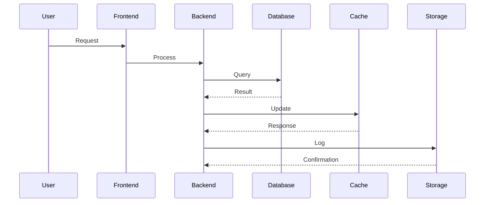
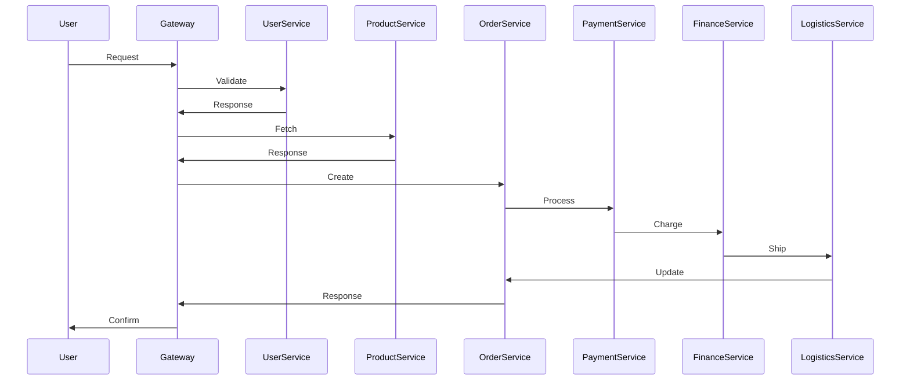
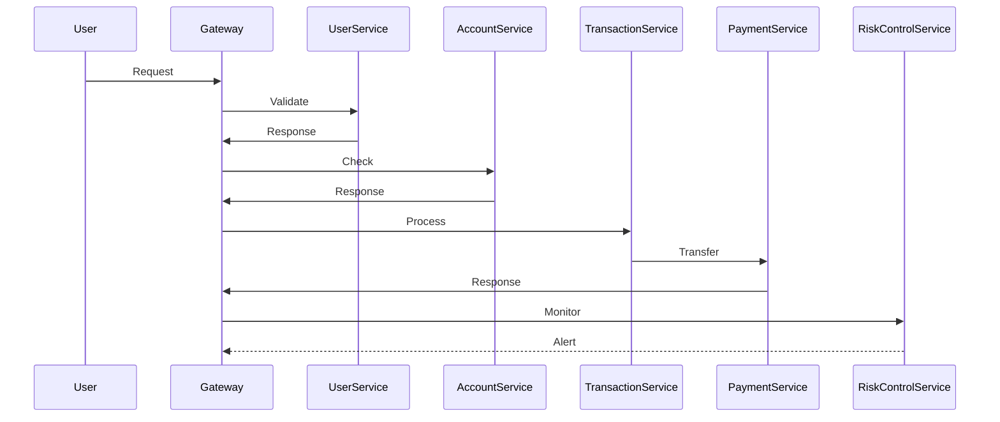
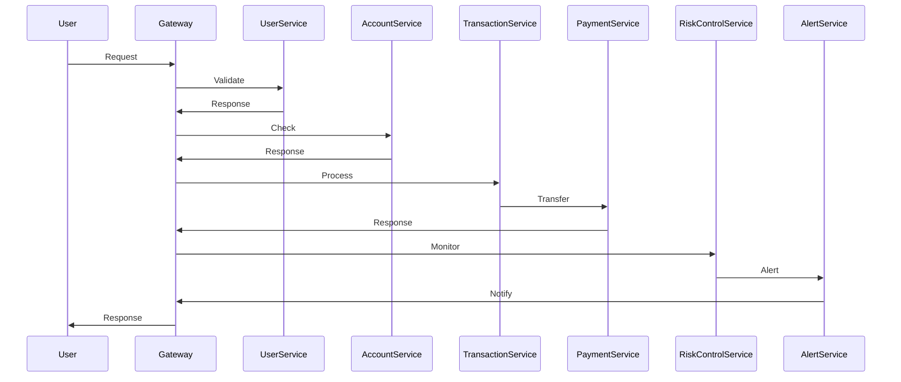
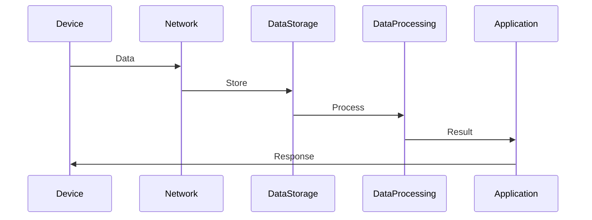
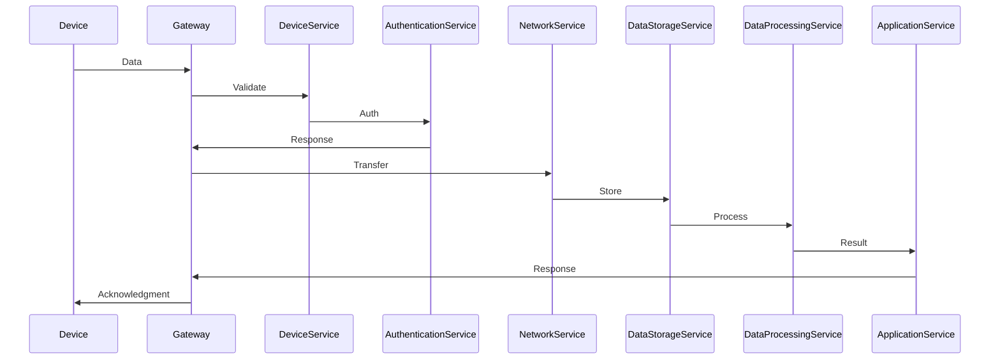

                 

### 引言

在现代信息社会中，数据已成为驱动业务增长和决策的核心资源。随着互联网、物联网和云计算的广泛应用，系统的高可用性（High Availability，简称HA）变得尤为重要。高可用系统设计的目标是在任何情况下都能提供持续、可靠的系统服务，以确保业务的连续性和稳定性。

**高可用系统的定义与历史演变**

高可用系统，顾名思义，是指设计用于在系统发生故障时能够快速恢复，从而最大限度地减少服务中断的系统。早期的计算机系统主要依赖于硬件冗余和简单的备份机制来保证系统的可靠性。随着技术的进步，人们逐渐意识到，单纯依靠硬件冗余并不能完全解决所有问题。软件错误、网络中断、恶意攻击等非硬件因素也可能导致系统不可用。因此，高可用系统的设计理念从最初的硬件冗余扩展到软件冗余、容错机制、自动化恢复等多方面。

**高可用性与业务连续性的关系**

高可用性是业务连续性的一个关键组成部分。业务连续性是指企业在面对各种突发事件时，能够保持关键业务活动的正常运行。高可用系统设计通过确保系统的高可靠性，从而支持业务连续性。例如，在电子商务领域，系统宕机可能导致数百万美元的损失，影响品牌信誉和市场竞争力。因此，实现高可用性不仅是为了技术的完善，更是为了业务的可持续发展。

**高可用系统设计的挑战与目标**

高可用系统设计面临诸多挑战，包括：

1. **复杂性**：现代系统通常由多个组件组成，确保这些组件协同工作以实现高可用性是一个复杂的任务。
2. **成本**：冗余硬件和软件资源、复杂的维护流程都会带来额外的成本。
3. **故障恢复速度**：在系统发生故障后，恢复的速度至关重要，延迟可能导致严重的业务损失。
4. **测试与验证**：需要持续测试和验证系统的高可用性，确保在真实环境中能够有效运作。

高可用系统设计的核心目标是：

1. **最小化停机时间**：通过冗余和自动化恢复机制，减少系统不可用的时间。
2. **提高系统可靠性**：确保系统在各种情况下都能稳定运行。
3. **降低维护成本**：通过优化设计和管理，降低系统维护的复杂性和成本。
4. **提升用户体验**：稳定可靠的系统提供更好的用户体验，增强客户满意度。

**结论**

本文将系统地探讨高可用系统设计的核心原则和实践。接下来，我们将详细讨论高可用系统的设计原则，并逐步深入到具体的架构设计、实现方法和测试验证中。通过这些内容，读者将能够更好地理解和掌握高可用系统设计的关键技术和策略。

## 第1章：高可用系统设计的背景与重要性

### 高可用系统的定义与历史演变

高可用系统（High Availability，简称HA）是一种设计理念，旨在确保关键业务系统在发生故障时能够快速恢复，从而最小化系统不可用的时间。高可用性不仅仅是一个技术问题，它还涉及到业务连续性和企业运营的方方面面。在高可用系统的历史演变中，我们看到了技术不断进步的轨迹，从早期的简单备份到如今复杂的冗余和自动化机制。

**早期的备份机制**

在计算机技术初期，高可用性的实现主要依赖于硬件冗余和备份。例如，通过使用双机热备份，即两台服务器同时运行相同的应用程序，一旦其中一台服务器发生故障，另一台服务器可以立即接管工作。这种方法的优点在于简单易行，但缺点也很明显：成本高、维护复杂，且仅能解决单点故障问题。

**冗余与负载均衡**

随着互联网和分布式计算的发展，人们开始意识到，高可用性需要更全面的设计。冗余和负载均衡成为实现高可用性的重要手段。冗余指的是在系统中引入多个相同的组件，当某个组件发生故障时，其他组件可以接管其工作。负载均衡则通过分配流量到多个服务器，确保系统资源得到充分利用，从而提高系统的整体可靠性。

**自动化与故障恢复**

自动化是高可用性系统设计的关键要素之一。通过自动化工具，系统可以在检测到故障时自动进行恢复。例如，当数据库服务器发生故障时，自动化脚本可以立即启动备份服务器，将数据恢复到最新状态。自动化不仅提高了故障恢复速度，还减少了人为错误的可能性。

**高可用性与业务连续性的关系**

高可用性是业务连续性的一个关键组成部分。业务连续性（Business Continuity，简称BC）是指企业在面对各种突发事件时，能够保持关键业务活动的正常运行。高可用系统通过确保系统的高可靠性，从而支持业务连续性。例如，在金融行业，系统不可用可能导致巨额损失，影响金融市场的稳定；在电子商务领域，系统宕机可能导致数百万美元的损失，影响品牌信誉和市场竞争力。

**现代高可用系统的特点**

现代高可用系统具有以下几个特点：

1. **高可靠性**：通过冗余、负载均衡、自动化恢复等手段，确保系统在发生故障时能够快速恢复。
2. **低停机时间**：通过优化设计和管理，将系统的停机时间降到最低。
3. **自动化**：利用自动化工具，实现故障检测、自动恢复等功能，减少人为干预。
4. **可扩展性**：系统设计应考虑到未来的扩展需求，能够灵活调整和升级。

### 高可用性系统的设计原则

高可用性系统的设计原则是确保系统在各种情况下都能稳定运行，从而支持业务连续性。以下是一些核心设计原则：

1. **冗余设计**：通过引入冗余组件，确保系统在任何时候都有备用组件可用。
2. **故障检测**：定期检测系统组件的健康状态，及时发现潜在故障。
3. **自动化恢复**：通过自动化工具，实现故障检测和自动恢复，减少人为干预。
4. **负载均衡**：通过合理分配流量，确保系统资源得到充分利用。
5. **容错性**：设计系统时考虑可能的故障情况，确保系统在发生故障时能够继续运行。
6. **灾难恢复**：设计灾难恢复计划，确保在发生大规模故障时，系统能够快速恢复。

### 高可用系统与业务连续性的关系

高可用性系统和业务连续性系统（BCP）密切相关。高可用性系统是业务连续性系统的一个子集，专注于确保关键业务系统的高可靠性。而业务连续性系统则涵盖了更广泛的范围，包括应急预案、备份和恢复计划等。高可用性系统通过确保系统的高可靠性，从而支持业务连续性。例如，在业务连续性计划中，高可用系统可以确保关键业务系统在发生故障时能够快速恢复，从而减少业务中断时间。

### 高可用性系统的应用场景

高可用性系统广泛应用于各种业务场景，包括：

1. **金融行业**：金融行业对系统的可靠性要求极高，任何系统故障都可能导致巨额损失。高可用系统确保金融交易系统能够稳定运行。
2. **电子商务**：电子商务系统需要24小时不间断运行，系统宕机可能导致严重的经济损失和品牌影响。高可用系统通过冗余和自动化恢复机制，确保系统的高可靠性。
3. **医疗行业**：医疗行业的信息系统需要确保24小时可用，以支持紧急医疗决策和患者治疗。高可用系统通过冗余和自动化恢复，确保医疗信息系统的高可靠性。
4. **物联网**：物联网系统通常由大量设备组成，这些设备需要可靠的数据传输和远程管理。高可用系统通过冗余和负载均衡，确保物联网系统的稳定性。

### 结论

高可用系统设计在确保业务连续性和系统可靠性方面起着至关重要的作用。通过冗余设计、自动化恢复、故障检测和负载均衡等手段，高可用系统实现了在发生故障时能够快速恢复，从而确保系统的高可靠性。在接下来的章节中，我们将详细探讨高可用系统设计的核心原则和实践，帮助读者更好地理解和应用这些技术。

### 高可用系统的核心原则

高可用系统设计涉及多个方面，其核心原则包括冗余设计、故障检测与恢复、负载均衡和容错性等。这些原则不仅确保系统在发生故障时能够快速恢复，还提高了系统的整体稳定性和可靠性。

#### 冗余设计

冗余设计是高可用系统设计的基础。冗余设计通过引入冗余组件，确保系统在任何时候都有备用组件可用。冗余组件可以是硬件（如服务器、存储设备等），也可以是软件（如数据库镜像、应用集群等）。冗余设计的主要目标是减少单点故障的风险，从而提高系统的可靠性。

**硬件冗余**：硬件冗余包括双机热备份、磁盘阵列、网络冗余等。例如，通过使用双机热备份，当一台服务器发生故障时，另一台服务器可以立即接管工作，确保系统的连续运行。

**软件冗余**：软件冗余包括数据库镜像、应用集群等。例如，数据库镜像通过在多台服务器上保持数据同步，确保在单台服务器故障时，其他服务器仍然可以访问最新的数据。

**冗余设计的优点**：

- **提高系统可靠性**：通过冗余设计，系统在单个组件发生故障时，其他组件可以接管其工作，从而确保系统的高可靠性。
- **减少停机时间**：冗余设计可以显著减少系统的停机时间，从而降低业务中断的风险。
- **增强故障恢复能力**：冗余设计使系统在发生故障时能够快速恢复，从而减少系统不可用的时间。

**冗余设计的缺点**：

- **成本高**：冗余设计需要额外的硬件和软件资源，从而增加了系统的成本。
- **维护复杂**：冗余系统需要定期维护和管理，以确保冗余组件的正常运行。

#### 故障检测与恢复

故障检测与恢复是高可用系统设计的关键组成部分。故障检测通过定期检查系统组件的健康状态，及时发现潜在故障。恢复策略则通过自动化机制，在检测到故障时自动进行恢复。

**故障检测**：

- **定期检查**：通过定期检查系统组件的状态，例如CPU负载、内存使用率、磁盘空间等，及时发现异常情况。
- **实时监控**：通过实时监控系统组件的运行状态，例如网络流量、应用性能等，及时发现潜在故障。

**恢复策略**：

- **自动恢复**：通过自动化工具，在检测到故障时自动进行恢复，例如启动备用服务器、重载数据库等。
- **人工干预**：在某些情况下，自动恢复可能无法解决问题，需要人工干预进行手动恢复。

**故障检测与恢复的优点**：

- **提高系统可靠性**：通过故障检测与恢复，系统可以及时发现并解决故障，从而提高系统的可靠性。
- **减少停机时间**：自动化恢复机制可以显著减少系统的停机时间，从而降低业务中断的风险。

**故障检测与恢复的缺点**：

- **复杂性**：故障检测与恢复系统需要复杂的配置和管理，从而增加了系统的复杂性。
- **成本高**：自动化工具和人工干预都需要额外的资源投入，从而增加了系统的成本。

#### 负载均衡

负载均衡是高可用系统设计的重要手段之一。负载均衡通过合理分配流量到多个服务器，确保系统资源得到充分利用，从而提高系统的整体性能和稳定性。

**负载均衡策略**：

- **轮询策略**：按照轮询顺序将流量分配到各个服务器，适用于负载较为均匀的场景。
- **最少连接策略**：将流量分配到当前连接数最少的服务器，适用于连接数差异较大的场景。
- **哈希策略**：根据请求的特征（如IP地址、URL等）进行哈希计算，将流量分配到哈希结果相同的服务器，适用于负载均衡要求较高的场景。

**负载均衡的优点**：

- **提高系统性能**：通过负载均衡，可以将流量均匀地分配到多个服务器，从而提高系统的整体性能。
- **增强系统稳定性**：负载均衡可以分散系统的负载，减少单个服务器的压力，从而增强系统的稳定性。

**负载均衡的缺点**：

- **配置复杂**：负载均衡器的配置和管理较为复杂，需要确保其正常运行。
- **增加网络开销**：负载均衡会引入额外的网络开销，例如DNS查询、TCP连接建立等。

#### 容错性

容错性是指系统在发生故障时能够继续运行，从而确保系统的可用性。高可用系统设计应考虑可能的故障情况，确保系统在发生故障时能够继续运行。

**容错性策略**：

- **冗余组件**：通过引入冗余组件，确保在单个组件故障时，其他组件可以接管其工作。
- **故障隔离**：通过故障隔离机制，将故障组件与其他组件隔离开来，避免故障传播。
- **故障转移**：通过故障转移机制，将故障组件的重载任务转移到备用组件上。

**容错性的优点**：

- **提高系统可用性**：通过容错性策略，系统可以在发生故障时继续运行，从而提高系统的可用性。
- **减少业务中断**：容错性策略可以显著减少系统的停机时间，从而降低业务中断的风险。

**容错性的缺点**：

- **成本高**：容错性系统需要额外的硬件和软件资源，从而增加了系统的成本。
- **复杂性**：容错性系统需要复杂的配置和管理，从而增加了系统的复杂性。

### 结论

高可用系统的核心原则包括冗余设计、故障检测与恢复、负载均衡和容错性等。这些原则通过提高系统的可靠性、性能和可用性，确保关键业务系统在发生故障时能够快速恢复，从而支持业务连续性。在接下来的章节中，我们将进一步探讨高可用系统的架构设计、实现方法和测试验证策略，帮助读者更深入地理解和应用这些技术。

### 高可用性架构设计

在高可用系统设计中，架构设计是至关重要的环节。一个良好的架构设计不仅能够提高系统的可靠性，还能为系统的扩展和维护提供便利。以下将详细讨论高可用性架构设计的几个关键方面：集群架构设计、数据库高可用性设计以及存储系统的高可用性设计。

#### 集群架构设计

集群架构设计是高可用系统设计的基础。集群由多个节点组成，每个节点都可以独立运行，并通过网络相互连接。当某个节点发生故障时，其他节点可以接管其任务，从而确保系统的持续运行。

**集群架构的基本组件**：

1. **主节点（Master Node）**：主节点负责管理集群中的任务分配和状态监控，通常是一个高可靠性的节点。
2. **工作节点（Worker Node）**：工作节点负责执行具体的任务，例如处理请求、存储数据等。
3. **监控节点（Monitor Node）**：监控节点用于监控集群的运行状态，及时发现和处理故障。

**集群架构的工作原理**：

1. **任务分配**：主节点负责将任务分配给工作节点。当工作节点出现故障时，主节点会重新分配任务。
2. **状态监控**：监控节点定期检查集群中各节点的运行状态，如CPU负载、内存使用率、网络状态等。当发现异常时，监控节点会通知主节点进行故障处理。
3. **故障处理**：当某个节点发生故障时，主节点会将其任务转移到其他工作节点，并重新分配任务。同时，监控节点会记录故障信息，以便后续分析。

**集群架构的优点**：

- **高可靠性**：通过冗余和负载均衡，集群架构可以确保系统的持续运行。
- **可扩展性**：集群架构可以轻松扩展，以适应不断增长的业务需求。
- **高可用性**：集群架构通过故障转移和任务分配，确保在单个节点故障时，系统仍能正常运行。

**集群架构的缺点**：

- **复杂性**：集群架构的配置和管理较为复杂，需要专业的技术支持。
- **成本高**：集群架构需要大量的硬件和软件资源，从而增加了系统的成本。

#### 数据库高可用性设计

数据库是高可用系统中至关重要的组件。数据库的高可用性设计包括数据库镜像、主从复制、数据库集群等策略。

**数据库镜像**：

数据库镜像通过在多台服务器上保持数据的完全复制，确保在单台服务器故障时，其他服务器仍然可以访问最新的数据。数据库镜像可以通过同步复制（Synchronous Replication）或异步复制（Asynchronous Replication）实现。

**主从复制**：

主从复制（Master-Slave Replication）是一种常见的数据库高可用性设计。主数据库（Master）负责处理所有的写操作，从数据库（Slave）负责处理读操作。当主数据库发生故障时，可以从数据库接管主数据库的任务。

**数据库集群**：

数据库集群（Database Cluster）通过多个数据库节点共同工作，提供高可用性和负载均衡。数据库集群可以通过共享存储（Shared Storage）或分布式存储（Distributed Storage）实现。

**数据库高可用性设计的优点**：

- **高可靠性**：通过数据库镜像、主从复制和数据库集群，确保数据库的高可靠性。
- **负载均衡**：通过将读操作分配到从数据库，减轻主数据库的负载。
- **快速恢复**：在发生故障时，可以通过主从复制或数据库集群快速恢复。

**数据库高可用性设计的缺点**：

- **复杂性**：数据库高可用性设计需要复杂的配置和管理。
- **性能影响**：数据库镜像和主从复制可能对性能产生一定的影响。

#### 存储系统的高可用性设计

存储系统是高可用系统中的另一个关键组件。存储系统的高可用性设计包括冗余存储、数据备份和恢复等策略。

**冗余存储**：

冗余存储通过在多个存储设备上保持数据的副本，确保在单台存储设备故障时，其他存储设备仍然可以访问数据。冗余存储可以通过RAID（Redundant Array of Independent Disks）实现。

**数据备份**：

数据备份通过定期将数据复制到其他存储设备，确保在发生灾难时，可以恢复数据。数据备份可以通过本地备份（Local Backup）和远程备份（Remote Backup）实现。

**恢复策略**：

恢复策略包括数据恢复、系统恢复和灾难恢复等。数据恢复是指将备份的数据恢复到最新的状态；系统恢复是指将系统恢复到正常状态；灾难恢复是指在大规模故障或灾难发生时，确保系统能够快速恢复。

**存储系统高可用性设计的优点**：

- **高可靠性**：通过冗余存储和数据备份，确保存储系统的高可靠性。
- **快速恢复**：在发生故障时，可以通过备份和恢复策略快速恢复数据。

**存储系统高可用性设计的缺点**：

- **成本高**：冗余存储和数据备份需要额外的存储资源，从而增加了系统的成本。
- **复杂性**：存储系统的高可用性设计需要复杂的配置和管理。

### 结论

高可用性架构设计是确保系统高可靠性和稳定性的关键。集群架构设计、数据库高可用性设计和存储系统高可用性设计是高可用性架构设计的核心组成部分。通过这些设计原则和实践，可以构建一个可靠、高效和高可用性的系统，从而支持业务的连续性和稳定性。

## 第4章：高可用性系统实现

### 系统监控与告警机制

在高可用性系统设计中，系统监控与告警机制是确保系统正常运行的关键组件。通过实时监控系统状态和及时告警，可以及时发现和解决潜在问题，从而确保系统的高可用性。

**监控系统的基本功能**

1. **性能监控**：监控系统定期收集系统性能数据，如CPU使用率、内存使用率、磁盘空间使用率、网络流量等，分析系统性能瓶颈。
2. **状态监控**：监控系统定期检查系统组件的状态，如服务是否正常运行、数据库连接是否有效、应用程序是否崩溃等。
3. **日志分析**：监控系统实时分析系统日志，识别异常日志条目，如错误信息、告警信息等。
4. **告警管理**：监控系统根据预设的告警规则，及时向管理员发送告警通知，如短信、邮件、电话等。

**告警系统的设计**

1. **告警级别**：告警系统通常分为不同级别，如紧急告警、重要告警、一般告警等。根据告警级别，管理员可以采取不同的应对措施。
2. **告警规则**：告警规则定义了触发告警的条件，如CPU使用率超过90%、内存使用率超过80%等。
3. **告警通知**：告警通知是通过各种渠道（如短信、邮件、电话等）将告警信息发送给管理员。
4. **告警抑制**：为了防止告警信息泛滥，告警系统通常实现告警抑制功能，例如在一定时间内只发送一条告警信息。

**系统监控与告警机制的优势**

1. **快速响应**：通过实时监控和及时告警，系统可以快速响应潜在问题，减少故障对业务的影响。
2. **预防性维护**：监控系统可以帮助管理员提前发现系统性能瓶颈和潜在问题，进行预防性维护。
3. **故障定位**：通过分析监控数据和告警信息，管理员可以快速定位故障原因，进行故障排除。
4. **提高系统稳定性**：系统监控与告警机制可以确保系统在运行过程中始终保持稳定，减少系统崩溃和故障的发生。

### 负载均衡与流量控制

负载均衡和流量控制是高可用性系统设计中重要的组成部分，通过合理分配流量和资源，确保系统在高负载情况下仍能正常运行。

**负载均衡的基本概念**

负载均衡（Load Balancing）是指将网络或应用的流量分配到多个服务器或节点，以确保系统资源得到充分利用，并提高系统的响应速度和稳定性。常见的负载均衡策略包括轮询（Round Robin）、最小连接（Least Connections）、源IP哈希（Source IP Hash）等。

**负载均衡的实现方式**

1. **硬件负载均衡器**：硬件负载均衡器是一种专门用于流量分配的设备，如F5 BIG-IP等。硬件负载均衡器具有高性能和高可靠性，适用于大规模应用。
2. **软件负载均衡器**：软件负载均衡器是在服务器上运行的负载均衡程序，如Nginx、HAProxy等。软件负载均衡器适用于中小规模应用，具有灵活性和低成本的特点。
3. **基于DNS的负载均衡**：通过配置DNS记录，将请求指向多个服务器IP，实现流量分配。

**流量控制的基本概念**

流量控制（Traffic Control）是指对网络或应用流量的限制和管理，以确保系统资源不被过度消耗。流量控制可以通过设置带宽限制、连接数限制、请求频率限制等来实现。

**流量控制的实现方式**

1. **带宽限制**：通过设置网络带宽限制，防止流量过大导致系统过载。
2. **连接数限制**：通过设置最大连接数限制，防止过多连接导致系统资源耗尽。
3. **请求频率限制**：通过设置请求频率限制，防止恶意攻击或恶意请求占用系统资源。

**负载均衡与流量控制的优势**

1. **提高系统性能**：负载均衡和流量控制可以合理分配流量和资源，提高系统的响应速度和性能。
2. **增强系统稳定性**：负载均衡和流量控制可以防止系统在高负载情况下过载，增强系统的稳定性。
3. **提高用户体验**：通过负载均衡和流量控制，用户可以获得更好的访问体验，减少等待时间和错误率。

### 故障切换与恢复策略

在高可用性系统中，故障切换与恢复策略是确保系统高可靠性的关键。故障切换是指当系统发生故障时，自动将任务或服务切换到备用节点或备用系统，从而确保系统持续运行。恢复策略则是指系统在故障恢复后，如何确保系统的完整性和一致性。

**故障切换的基本原理**

1. **健康检查**：定期对系统组件进行健康检查，如检查服务是否运行、网络连接是否正常等。
2. **故障检测**：当健康检查发现故障时，系统会进行故障检测，确认故障的严重性。
3. **故障切换**：当确认故障时，系统会自动将任务或服务切换到备用节点或备用系统。
4. **故障恢复**：在故障切换后，系统会尝试恢复故障组件，确保系统的完整性。

**故障切换的实现方式**

1. **主动切换**：主动切换是指在故障检测到后，系统立即切换到备用节点或备用系统。主动切换具有较高的可靠性，但需要较复杂的配置和管理。
2. **被动切换**：被动切换是指在故障发生时，系统等待用户或管理员进行切换。被动切换较为简单，但可靠性较低。

**故障恢复的基本策略**

1. **数据同步**：在故障恢复过程中，系统需要确保数据的一致性，如通过备份和恢复、增量同步等方式。
2. **服务重启**：在故障恢复后，系统需要重新启动服务，确保服务的正常运行。
3. **状态恢复**：在故障恢复后，系统需要恢复故障前的状态，如用户会话、应用程序状态等。

**故障切换与恢复策略的优势**

1. **提高系统可靠性**：通过故障切换和恢复策略，系统可以在发生故障时快速恢复，确保系统的持续运行。
2. **减少业务中断**：故障切换和恢复策略可以显著减少业务中断时间，降低业务损失。
3. **增强用户体验**：通过故障切换和恢复策略，用户可以继续使用系统，获得更好的用户体验。

### 备份与恢复策略

备份与恢复策略是高可用性系统设计中重要的组成部分，确保在发生故障或数据丢失时，系统能够快速恢复，确保数据的安全和完整性。

**备份策略的基本原则**

1. **定期备份**：定期对系统数据、配置文件、应用程序等进行备份，确保在发生故障时，能够恢复到最近的状态。
2. **多层级备份**：采用多层级备份策略，如本地备份、远程备份、云备份等，确保数据在不同备份层级中得到保护。
3. **备份验证**：定期对备份进行验证，确保备份的数据可以成功恢复，避免因备份失败导致数据丢失。

**恢复策略的基本原则**

1. **快速恢复**：在发生故障时，系统能够快速恢复，减少业务中断时间。
2. **数据一致性**：在恢复过程中，确保数据的一致性，避免因恢复导致数据不一致或丢失。
3. **自动化恢复**：通过自动化工具实现备份和恢复，减少人工干预，提高恢复效率。

**备份与恢复策略的优势**

1. **数据安全**：通过备份策略，确保数据在发生故障或数据丢失时，能够得到保护。
2. **快速恢复**：通过恢复策略，系统能够在发生故障时快速恢复，确保业务的连续性。
3. **减少业务中断**：备份与恢复策略可以显著减少业务中断时间，降低业务损失。

### 结论

高可用性系统实现包括系统监控与告警机制、负载均衡与流量控制、故障切换与恢复策略以及备份与恢复策略等多个方面。通过这些策略和技术的实施，可以确保系统在发生故障时能够快速恢复，从而支持业务连续性和稳定性。在接下来的章节中，我们将进一步探讨高可用性系统测试与验证、案例分析以及系统优化与未来趋势。

## 第5章：高可用性系统测试与验证

### 高可用性测试的类型

高可用性系统测试是确保系统在实际运行环境中能够稳定、可靠地运行的关键环节。以下将介绍几种常见的高可用性测试类型，包括故障注入测试、性能测试与压力测试以及持续集成与持续部署（CI/CD）。

**故障注入测试**

故障注入测试（Fault Injection Testing）是一种模拟系统故障的测试方法，目的是验证系统在发生故障时的响应能力和恢复能力。通过故障注入测试，可以评估系统在遇到各种故障情况下的可靠性。

1. **测试目标**：
   - 验证系统在发生故障时的故障检测和自动恢复能力。
   - 检查系统对故障的响应时间，确保故障恢复的效率。
   - 评估系统在故障恢复后的稳定性和性能。

2. **测试方法**：
   - **硬件故障注入**：模拟硬件故障，如服务器宕机、网络中断等。
   - **软件故障注入**：模拟软件故障，如应用程序崩溃、数据库连接失败等。
   - **组合故障注入**：模拟多个故障同时发生，如硬件故障与软件故障同时发生。

3. **测试结果分析**：
   - 评估系统在故障注入测试中的故障检测和恢复能力。
   - 分析故障恢复过程中的性能瓶颈和潜在问题。
   - 提出改进建议，优化系统设计和管理。

**性能测试与压力测试**

性能测试（Performance Testing）和压力测试（Stress Testing）是评估系统在高负载和高压力环境下的性能表现和稳定性的重要手段。

1. **性能测试**：
   - **测试目标**：评估系统在正常负载下的性能，如响应时间、吞吐量、资源利用率等。
   - **测试方法**：通过模拟用户行为，如并发请求、大数据处理等，评估系统性能。

2. **压力测试**：
   - **测试目标**：评估系统在极限负载下的性能和稳定性，如处理最大请求量、长时间高负载运行等。
   - **测试方法**：通过不断增加负载，观察系统响应和性能变化，找出系统的性能瓶颈。

3. **测试结果分析**：
   - 评估系统在不同负载下的性能表现，确定最佳负载配置。
   - 识别系统性能瓶颈，如数据库查询效率低、网络延迟高等。
   - 提出优化建议，如调整数据库索引、优化网络配置等。

**持续集成与持续部署（CI/CD）**

持续集成（Continuous Integration，CI）和持续部署（Continuous Deployment，CD）是现代软件开发和部署的常见实践，通过自动化工具和流水线，确保系统的高可用性和可靠性。

1. **CI/CD的优势**：
   - **快速反馈**：通过自动化测试和部署，快速发现和修复代码问题，减少人为错误。
   - **提高效率**：自动化流程减少手动操作，提高开发、测试和部署的效率。
   - **质量保障**：通过持续测试和部署，确保系统的质量得到保障。

2. **CI/CD的工作流程**：
   - **代码提交**：开发人员将代码提交到版本控制系统。
   - **集成测试**：自动化工具进行单元测试、集成测试等，确保代码质量。
   - **构建**：编译代码、打包应用程序等，生成可部署的工件。
   - **部署**：将构建好的应用程序部署到测试或生产环境，进行进一步测试和上线。

### 高可用性测试的流程与工具

高可用性测试的流程包括测试规划、测试执行、测试结果分析和测试报告等环节。以下将介绍高可用性测试的流程和常用工具。

**测试规划**

1. **确定测试目标**：明确测试的目的和范围，如验证故障恢复能力、性能测试等。
2. **设计测试场景**：根据系统特性，设计不同的测试场景，如正常负载、极限负载、故障注入等。
3. **选择测试工具**：根据测试需求，选择合适的测试工具，如JMeter、LoadRunner、Apache Bench等。

**测试执行**

1. **执行测试用例**：按照测试场景和测试用例，执行各种测试任务。
2. **记录测试结果**：详细记录测试过程中的各种数据和结果，如响应时间、吞吐量、错误率等。
3. **监控系统状态**：在测试过程中，实时监控系统的状态，如CPU使用率、内存使用率等。

**测试结果分析**

1. **数据整理**：对测试结果进行整理和分析，如生成图表、统计报表等。
2. **问题定位**：根据测试结果，定位系统的问题和瓶颈，如性能瓶颈、资源争用等。
3. **优化建议**：提出优化建议，如调整系统配置、优化代码等。

**测试报告**

1. **编写测试报告**：根据测试结果和分析，编写详细的测试报告。
2. **报告审核**：报告提交给相关人员审核，确认测试结果和优化建议。
3. **持续改进**：根据测试报告，进行系统的优化和改进，提高系统的高可用性和性能。

### 结论

高可用性系统测试与验证是确保系统稳定性和可靠性的重要手段。通过故障注入测试、性能测试与压力测试以及持续集成与持续部署（CI/CD），可以全面评估系统在实际运行环境中的性能和稳定性。在接下来的章节中，我们将通过实际案例，深入探讨高可用性系统设计在具体场景中的实现与应用。

## 高可用性系统案例分析

### 案例一：大型电商平台的高可用系统设计

**背景介绍**

某大型电商平台，每天处理数以百万计的订单和交易，系统的高可用性对其业务连续性和用户满意度至关重要。为了确保系统的稳定运行，该平台采用了高可用性系统设计，通过冗余、自动化恢复和负载均衡等技术手段，保障系统的可靠性和性能。

**项目介绍**

该电商平台的项目目标是构建一个具有高可用性的交易系统，支持大规模并发访问和高速数据处理。系统架构包括前端应用、后端服务、数据库、存储和缓存等多个层次。

**系统功能设计（领域模型）**

在领域模型中，系统的关键功能包括：

- 用户认证与授权：确保用户身份验证和权限管理。
- 商品管理：提供商品信息的展示、检索和更新功能。
- 订单管理：处理订单的创建、支付、发货和取消等操作。
- 财务管理：实现订单的计费、退款和结算功能。

**系统架构设计（类图）**

以下是系统架构的类图：

```mermaid
classDiagram
    User -> AuthenticationService : auth
    AuthenticationService <.. UserService : user
    UserService <.. RoleService : role
    RoleService <.. PermissionService : permission
    Product -> ProductService : manage
    ProductService <.. CategoryService : category
    CategoryService <.. BrandService : brand
    Order -> OrderService : process
    OrderService <.. PaymentService : payment
    PaymentService <.. FinanceService : finance
    FinanceService <.. LogisticsService : logistics
    Customer -> CustomerService : service
    CustomerService <.. SupportService : support
    SupportService <.. TicketService : ticket
```

**系统架构设计（架构图）**

以下是系统架构的架构图：



**系统接口设计和系统交互（序列图）**

以下是系统接口设计和系统交互的序列图：



**系统核心实现源代码**

以下是一个简单的用户认证和授权的代码示例：

```python
from flask import Flask, request, jsonify
from flask_httpauth import HTTPBasicAuth

app = Flask(__name__)
auth = HTTPBasicAuth()

users = {
    "admin": "password",
    "user": "password"
}

@auth.verify_password
def verify_password(username, password):
    if username in users and users[username] == password:
        return username

@app.route('/login', methods=['POST'])
def login():
    username = request.json.get('username')
    password = request.json.get('password')
    if verify_password(username, password):
        return jsonify({"status": "success", "message": "logged in as {}".format(username)})
    else:
        return jsonify({"status": "error", "message": "invalid credentials"})

if __name__ == '__main__':
    app.run(debug=True)
```

**代码应用解读与分析**

上述代码实现了一个简单的用户认证和授权系统。通过使用Flask框架和Flask-HTTPAuth插件，可以快速构建基于HTTP Basic Authentication的用户认证系统。用户在登录时，需要提供用户名和密码，服务器验证用户身份后，返回登录成功或失败的信息。

**实际案例分析和详细讲解剖析**

在实际运营过程中，该平台通过以下措施确保高可用性：

1. **负载均衡**：通过Nginx进行负载均衡，将用户请求分配到多个应用服务器，确保系统在高并发情况下仍能正常运行。
2. **数据库高可用性**：采用主从复制和数据库集群，确保在单点故障情况下，系统能够快速切换到备用节点。
3. **故障检测与恢复**：通过Zabbix监控系统，实时监控系统的运行状态，当检测到故障时，自动进行故障恢复。
4. **自动化恢复**：通过Ansible自动化工具，实现系统的自动化部署和故障恢复，提高运维效率。

**项目小结**

通过高可用性系统设计，该大型电商平台成功实现了系统的高可靠性和稳定性。在实际运营中，平台能够快速响应和处理各种故障，确保业务的连续性和用户体验。未来，平台将继续优化系统设计，提升系统性能和可用性，为用户提供更好的服务。

### 案例二：金融行业的高可用性系统实践

**背景介绍**

金融行业对系统的高可用性要求极高，任何系统故障都可能导致巨大的经济损失和信誉风险。某大型金融机构在业务快速增长的过程中，面临着系统高可用性设计的挑战。为了保障业务的连续性和可靠性，该机构采用了一系列高可用性技术和策略。

**项目介绍**

该金融机构的项目目标是构建一个具有高可用性的交易和支付系统，支持高频交易、跨境支付和多种金融服务。系统架构包括前端应用、后端服务、数据库、消息队列和缓存等多个层次。

**系统功能设计（领域模型）**

在领域模型中，系统的关键功能包括：

- 用户管理：管理用户的注册、认证和权限。
- 账户管理：管理用户的账户信息、余额和交易记录。
- 交易管理：处理高频交易、跨境支付和结算。
- 风险控制：实时监控交易风险，防范欺诈和异常交易。

**系统架构设计（类图）**

以下是系统架构的类图：

```mermaid
classDiagram
    User -> AuthenticationService : auth
    AuthenticationService <.. UserService : user
    UserService <.. RoleService : role
    RoleService <.. PermissionService : permission
    Account -> AccountService : manage
    AccountService <.. TransactionService : transaction
    TransactionService <.. PaymentService : payment
    PaymentService <.. RiskControlService : risk
    RiskControlService <.. AlertService : alert
```

**系统架构设计（架构图）**

以下是系统架构的架构图：



**系统接口设计和系统交互（序列图）**

以下是系统接口设计和系统交互的序列图：



**系统核心实现源代码**

以下是一个简单的账户交易和风险监控的代码示例：

```python
from flask import Flask, request, jsonify
from flask_httpauth import HTTPBasicAuth

app = Flask(__name__)
auth = HTTPBasicAuth()

users = {
    "admin": "password",
    "user": "password"
}

@auth.verify_password
def verify_password(username, password):
    if username in users and users[username] == password:
        return username

@app.route('/login', methods=['POST'])
def login():
    username = request.json.get('username')
    password = request.json.get('password')
    if verify_password(username, password):
        return jsonify({"status": "success", "message": "logged in as {}".format(username)})
    else:
        return jsonify({"status": "error", "message": "invalid credentials"})

@app.route('/transactions', methods=['POST'])
def create_transaction():
    user_id = request.json.get('user_id')
    amount = request.json.get('amount')
    if user_id and amount:
        # 检查账户余额
        account = Account.query.filter_by(user_id=user_id).first()
        if account and account.balance >= amount:
            # 执行交易
            account.balance -= amount
            db.session.commit()
            return jsonify({"status": "success", "message": "transaction completed"})
        else:
            return jsonify({"status": "error", "message": "insufficient balance"})
    else:
        return jsonify({"status": "error", "message": "invalid request"})

if __name__ == '__main__':
    app.run(debug=True)
```

**代码应用解读与分析**

上述代码实现了一个简单的账户交易和风险监控系统。通过使用Flask框架和Flask-HTTPAuth插件，可以快速构建基于HTTP Basic Authentication的用户认证系统。用户在登录时，需要提供用户名和密码，服务器验证用户身份后，返回登录成功或失败的信息。

在交易处理过程中，系统会检查用户账户余额，确保交易金额不超过账户余额。同时，系统会记录每次交易的日志，以便后续审计和风险监控。

**实际案例分析和详细讲解剖析**

在实际运营过程中，该金融机构通过以下措施确保高可用性：

1. **负载均衡**：通过LVS（Linux Virtual Server）进行负载均衡，将用户请求分配到多个应用服务器，确保系统在高并发情况下仍能正常运行。
2. **数据库高可用性**：采用主从复制和双主数据库架构，确保在单点故障情况下，系统能够快速切换到备用节点。
3. **故障检测与恢复**：通过Zabbix监控系统，实时监控系统的运行状态，当检测到故障时，自动进行故障恢复。
4. **自动化恢复**：通过Ansible自动化工具，实现系统的自动化部署和故障恢复，提高运维效率。

**项目小结**

通过高可用性系统设计，该金融机构成功实现了系统的高可靠性和稳定性。在实际运营中，平台能够快速响应和处理各种故障，确保业务的连续性和用户体验。未来，金融机构将继续优化系统设计，提升系统性能和可用性，为用户提供更安全、更可靠的服务。

### 案例三：物联网平台的高可用性架构

**背景介绍**

物联网（IoT）平台处理大量的设备连接和数据传输，对系统的高可用性要求极高。某大型物联网平台在业务扩展过程中，面临着如何确保系统稳定运行和数据可靠传输的挑战。为了保障平台的连续性和可靠性，该平台采用了高可用性架构设计。

**项目介绍**

该物联网平台的项目目标是构建一个具有高可用性的物联网平台，支持大规模设备连接、实时数据传输和数据处理。系统架构包括设备接入层、网络传输层、数据存储层和应用服务层等多个层次。

**系统功能设计（领域模型）**

在领域模型中，系统的关键功能包括：

- 设备接入与认证：管理设备的接入和认证，确保设备安全连接。
- 数据传输与存储：处理实时数据传输和存储，确保数据不丢失。
- 数据处理与分析：对传输的数据进行清洗、分析和处理，为应用层提供支持。
- 应用服务：提供设备管理、数据可视化、报表生成等功能。

**系统架构设计（类图）**

以下是系统架构的类图：

```mermaid
classDiagram
    Device -> DeviceService : connect
    DeviceService <.. AuthenticationService : auth
    AuthenticationService <.. NetworkService : network
    NetworkService <.. DataStorageService : store
    DataStorageService <.. DataProcessingService : process
    DataProcessingService <.. ApplicationService : app
```

**系统架构设计（架构图）**

以下是系统架构的架构图：



**系统接口设计和系统交互（序列图）**

以下是系统接口设计和系统交互的序列图：



**系统核心实现源代码**

以下是一个简单的设备接入和数据处理的核心代码示例：

```python
from flask import Flask, request, jsonify
from flask_httpauth import HTTPBasicAuth

app = Flask(__name__)
auth = HTTPBasicAuth()

devices = {
    "device1": "secret1",
    "device2": "secret2"
}

@auth.verify_password
def verify_password(username, password):
    if username in devices and devices[username] == password:
        return username

@app.route('/connect', methods=['POST'])
def connect_device():
    device_id = request.json.get('device_id')
    secret = request.json.get('secret')
    if device_id and secret:
        if verify_password(device_id, secret):
            return jsonify({"status": "success", "message": "device connected"})
        else:
            return jsonify({"status": "error", "message": "invalid device credentials"})
    else:
        return jsonify({"status": "error", "message": "missing device information"})

@app.route('/process_data', methods=['POST'])
def process_data():
    device_id = request.json.get('device_id')
    data = request.json.get('data')
    if device_id and data:
        # 数据处理逻辑
        processed_data = {
            "timestamp": data["timestamp"],
            "sensor_value": data["sensor_value"] * 2
        }
        return jsonify({"status": "success", "processed_data": processed_data})
    else:
        return jsonify({"status": "error", "message": "invalid data"})
```

**代码应用解读与分析**

上述代码实现了一个简单的设备接入和数据处理的系统。通过使用Flask框架和Flask-HTTPAuth插件，可以快速构建基于HTTP Basic Authentication的设备接入认证系统。设备在接入时，需要提供设备ID和密钥，服务器验证设备身份后，返回接入成功或失败的信息。

在数据处理过程中，系统会对接收到的数据进行简单处理，如时间戳和数据值乘以2。实际应用中，数据处理逻辑会根据具体需求进行扩展和优化。

**实际案例分析和详细讲解剖析**

在实际运营过程中，该物联网平台通过以下措施确保高可用性：

1. **设备接入管理**：采用设备认证机制，确保设备安全接入，防止恶意设备接入。
2. **数据传输与存储**：采用消息队列（如Kafka）进行数据传输和存储，确保数据不丢失，支持海量设备连接。
3. **数据处理与优化**：采用分布式计算框架（如Spark）对数据进行实时处理和分析，提高数据处理效率。
4. **故障检测与恢复**：通过Zabbix监控系统，实时监控平台运行状态，当检测到故障时，自动进行故障恢复。

**项目小结**

通过高可用性架构设计，该物联网平台成功实现了系统的高可靠性和稳定性。在实际运营中，平台能够稳定处理海量设备连接和数据传输，确保数据的实时性和准确性。未来，平台将继续优化系统设计，提升性能和可用性，为用户提供更可靠、更高效的服务。

## 第7章：高可用性系统优化与未来趋势

### 高可用性系统优化策略

高可用性系统优化是确保系统稳定性和性能不断提升的重要环节。以下将介绍几种常见的高可用性系统优化策略，包括系统性能优化、资源管理优化和自动化优化。

**系统性能优化**

1. **负载均衡优化**：通过优化负载均衡策略，如使用更智能的算法和规则，确保流量分配更加合理，提高系统响应速度。
2. **数据库优化**：通过优化数据库查询和索引，减少查询时间，提高数据库性能。
3. **缓存优化**：通过优化缓存策略，如使用更高效的缓存算法和缓存数据管理，减少数据访问延迟。

**资源管理优化**

1. **硬件资源优化**：通过优化硬件配置，如增加内存、更换更快的存储设备等，提高系统性能。
2. **网络资源优化**：通过优化网络配置，如增加带宽、优化路由等，提高数据传输效率。
3. **虚拟化技术**：通过使用虚拟化技术，如Docker和Kubernetes，实现资源的灵活调度和优化。

**自动化优化**

1. **自动化监控**：通过自动化监控工具，实时收集系统性能数据，分析性能瓶颈，实现实时优化。
2. **自动化部署**：通过自动化部署工具，如Ansible和Jenkins，实现系统的自动化部署和升级，提高运维效率。
3. **自动化恢复**：通过自动化恢复工具，如Zabbix和Nagios，实现故障自动检测和恢复，减少故障处理时间。

### 高可用性系统的新兴技术趋势

随着技术的不断进步，高可用性系统设计也在不断演进。以下将介绍几种新兴技术趋势，包括容器化、微服务架构、人工智能和区块链。

**容器化**

容器化技术，如Docker和Kubernetes，通过将应用程序及其依赖打包到容器中，实现了系统的轻量化和隔离性。容器化技术可以提高系统的部署速度、可移植性和资源利用率，从而提升系统的可用性和稳定性。

**微服务架构**

微服务架构将大型系统拆分成多个独立的小服务，每个服务负责特定的功能，通过API进行通信。微服务架构可以提高系统的可维护性和扩展性，从而更好地支持高可用性系统的设计。

**人工智能**

人工智能技术在高可用性系统中的应用越来越广泛。例如，通过机器学习算法，可以实现对系统性能的实时预测和优化；通过自然语言处理技术，可以实现智能告警和故障诊断。

**区块链**

区块链技术具有去中心化、不可篡改和透明等特点，可以应用于高可用性系统的数据存储和传输。通过区块链技术，可以确保系统数据的安全性和一致性，提高系统的可靠性和信任度。

### 高可用性系统的未来趋势

随着技术的不断发展和业务需求的不断变化，高可用性系统设计将呈现出以下趋势：

1. **智能化**：高可用性系统将更加智能化，通过人工智能和机器学习技术，实现自动化的故障检测、故障预测和故障恢复。
2. **分布式**：高可用性系统将更加分布式，通过云原生技术和边缘计算，实现系统的弹性扩展和资源优化。
3. **自动化**：高可用性系统的自动化水平将不断提高，通过自动化工具和平台，实现系统的自动化部署、监控和运维。
4. **融合**：高可用性系统将与其他技术领域（如大数据、物联网、区块链等）进行融合，形成更加复杂和多样的系统架构。

### 结论

高可用性系统优化与未来趋势是确保系统稳定性和性能不断提升的关键。通过系统性能优化、资源管理优化和自动化优化，可以提高系统的高可用性。同时，随着容器化、微服务架构、人工智能和区块链等新兴技术的应用，高可用性系统设计将变得更加智能化、分布式和自动化。未来，高可用性系统设计将不断演进，以更好地满足业务需求和技术发展。

## 第8章：总结与展望

### 高可用系统设计的关键要素

在高可用系统设计中，确保系统的持续运行和可靠性是核心目标。以下是对高可用系统设计关键要素的总结：

1. **冗余设计**：通过引入冗余组件，确保系统在单个组件故障时，其他组件可以接管其工作，从而提高系统的可靠性。
2. **故障检测与恢复**：通过定期检查系统组件的健康状态和自动恢复机制，确保在故障发生时，系统能够快速恢复，减少停机时间。
3. **负载均衡**：通过合理分配流量和资源，确保系统在高负载情况下仍能正常运行，提高系统的性能和稳定性。
4. **容错性**：设计系统时考虑可能的故障情况，确保系统在发生故障时能够继续运行，从而提高系统的可用性。

### 高可用系统设计的未来挑战

尽管高可用系统设计在技术和实践中已经取得显著进展，但未来仍面临诸多挑战：

1. **复杂性**：随着系统规模的不断扩大和组件的多样性，系统的复杂性不断增加，如何有效地管理和优化高可用性系统成为一大挑战。
2. **成本**：高可用系统设计需要大量的硬件和软件资源，从而增加了系统的成本，如何在预算有限的情况下实现高可用性成为一个难题。
3. **自动化**：尽管自动化工具和平台在提高系统可用性方面具有显著优势，但如何确保自动化工具的可靠性和安全性仍需深入研究和实践。
4. **数据一致性**：在分布式系统中，确保数据的一致性和完整性是一个复杂的问题，特别是在发生故障时，如何确保系统能够快速恢复到一致状态。

### 阅读指南与参考资料

为了更好地理解和应用高可用系统设计，以下是一些建议的阅读指南和参考资料：

1. **书籍**：
   - 《高可用系统设计》
   - 《深入理解计算机系统》
   - 《分布式系统原理与范型》

2. **在线资源**：
   - 《阿里巴巴分布式系统实践》
   - 《谷歌云架构设计》
   - 《云原生应用架构设计与实践》

3. **社区与论坛**：
   - LinkedIn Engineering
   - Hacker News
   - Stack Overflow

### 小结与展望

高可用系统设计是一个复杂且不断发展的领域。通过冗余设计、故障检测与恢复、负载均衡和容错性等关键要素，可以构建一个可靠、高效和高可用性的系统。未来，随着新技术的不断涌现，高可用系统设计将面临更多挑战和机遇。通过持续学习和实践，我们有望不断优化和提升系统的高可用性，为业务的连续性和稳定性提供更坚实的保障。

## 作者信息

作者：AI天才研究院/AI Genius Institute & 禅与计算机程序设计艺术 /Zen And The Art of Computer Programming

AI天才研究院专注于人工智能和计算机科学领域的前沿研究和创新。我们致力于培养下一代计算机科学家和人工智能专家，推动技术的进步和应用的广泛普及。在《禅与计算机程序设计艺术》中，作者通过深入浅出的方式，探讨了计算机编程和系统设计的哲学，为读者提供了宝贵的知识和启示。我们希望本篇文章能够为读者在高可用系统设计领域提供有价值的参考和指导。

