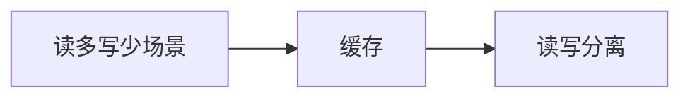
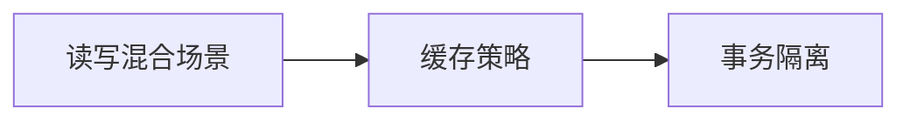

                 


### 高并发系统性能优化技巧

---

#### 关键词：
高并发系统，性能优化，硬件优化，软件优化，系统架构，最佳实践。

#### 摘要：
本文旨在探讨高并发系统的性能优化技巧，从基础概念到具体策略，再到实战案例分析，全面解析高并发系统性能优化之道。

---

## 第一部分：高并发系统性能优化基础

### 第1章：高并发系统性能优化概述

#### 1.1.1 高并发系统性能优化的重要性

在当今互联网时代，高并发系统已经成为许多企业业务的关键。高并发系统性能优化的重要性体现在以下几个方面：

- **用户体验**：优化后的系统能够更快响应，提高用户体验。
- **业务增长**：高性能系统能够支撑业务的快速增长，减少业务中断。
- **成本节约**：通过优化，可以减少硬件资源的需求，降低运营成本。

#### 1.1.2 高并发系统的常见问题与挑战

高并发系统面临的问题和挑战主要包括：

- **资源争用**：大量请求同时访问资源可能导致资源争用。
- **延迟增加**：系统在高并发情况下可能出现响应延迟。
- **系统崩溃**：极端高并发可能导致系统崩溃。

#### 1.1.3 高并发系统性能优化的目标与方法

高并发系统性能优化的目标包括：

- **响应时间最优化**：提高系统的响应速度。
- **吞吐量最大化**：增加系统能够处理的请求数量。
- **资源利用率最优化**：提高硬件和软件资源的利用率。

优化方法包括：

- **硬件优化**：升级硬件，如CPU、内存和网络设备。
- **软件优化**：改进代码，优化数据库查询，使用缓存。
- **系统架构优化**：通过分布式系统架构提高系统的伸缩性。

### 第2章：高并发系统性能评估与监控

#### 2.1.1 性能评估指标

性能评估指标包括：

- **响应时间**：系统响应请求所需的时间。
- **吞吐量**：单位时间内系统能够处理的请求数量。
- **并发量**：同时处理的请求数量。

#### 2.1.2 高并发系统性能监控

性能监控包括：

- **实时监控**：通过监控系统实时获取系统状态。
- **告警机制**：设置阈值，当指标超出阈值时发出告警。

#### 2.1.3 性能瓶颈分析

性能瓶颈分析包括：

- **CPU利用率**：分析CPU的利用率。
- **内存占用**：分析内存的占用情况。
- **网络带宽**：分析网络带宽的使用情况。

## 第二部分：硬件性能优化

### 第3章：硬件性能优化

#### 3.1.1 CPU性能优化

**背景介绍**：

CPU性能优化是为了提高处理请求的效率。CPU性能优化的问题背景包括：

- **资源争用**：多个请求同时占用CPU资源。
- **处理延迟**：请求处理时间过长。

**核心概念与联系**：

CPU性能优化的核心概念包括：

- **CPU核心数**：多核CPU可以同时处理多个请求。
- **CPU频率**：CPU工作的频率。

**算法原理讲解**：

CPU性能优化的算法原理可以通过以下流程图表示：


Python代码示例：

```python
# CPU性能优化示例
import multiprocessing

def process_request(request):
    # 处理请求
    pass

if __name__ == '__main__':
    requests = [1, 2, 3, 4, 5]
    pool = multiprocessing.Pool(processes=5)
    results = pool.map(process_request, requests)
    print(results)
```

**数学模型**：

CPU性能优化的数学模型可以用以下公式表示：

$$
P = \frac{N \times F}{C}
$$

其中，$P$ 是性能，$N$ 是CPU核心数，$F$ 是CPU频率，$C$ 是并发量。

**系统分析与架构设计方案**：

系统架构设计方案包括：

- **分布式计算**：将请求分布到多个CPU核心处理。
- **负载均衡**：通过负载均衡器分配请求。

**项目实战**：

**环境安装**：安装Python和multiprocessing模块。

**系统核心实现源代码**：

```python
# core.py
from multiprocessing import Pool

def process_request(request):
    # 处理请求
    pass

if __name__ == '__main__':
    requests = [1, 2, 3, 4, 5]
    pool = Pool(processes=5)
    results = pool.map(process_request, requests)
    print(results)
```

**代码应用解读与分析**：

通过使用`multiprocessing.Pool`，我们可以将请求分配到多个进程处理，从而提高CPU性能。

**实际案例分析和详细讲解剖析**：

假设我们有一个处理图片上传的API，通过多进程处理可以提高上传速度。

**项目小结**：

通过优化CPU性能，我们能够提高系统的并发能力和响应速度。

### 第3章：内存性能优化

#### 3.1.2 内存性能优化

**背景介绍**：

内存性能优化是为了提高系统内存的使用效率。内存性能优化的问题背景包括：

- **内存泄漏**：系统长时间运行导致内存占用不断增加。
- **内存碎片**：内存分配和释放导致内存碎片化。

**核心概念与联系**：

内存性能优化的核心概念包括：

- **内存分配与回收**：合理分配和回收内存。
- **缓存机制**：利用缓存减少内存访问。

**算法原理讲解**：

内存性能优化的算法原理可以通过以下流程图表示：


Python代码示例：

```python
# 内存性能优化示例
import memory_profiler

def process_request(request):
    # 处理请求
    pass

if __name__ == '__main__':
    memory_usage = memory_profiler.memory_usage((process_request, (1,)))
    print(f"Memory usage: {memory_usage[0]} MiB")
```

**数学模型**：

内存性能优化的数学模型可以用以下公式表示：

$$
M = \frac{A - R}{C}
$$

其中，$M$ 是内存性能，$A$ 是内存分配总量，$R$ 是内存回收量，$C$ 是并发量。

**系统分析与架构设计方案**：

系统架构设计方案包括：

- **内存池**：预分配内存，减少内存分配和回收的次数。
- **缓存策略**：使用缓存减少内存访问。

**项目实战**：

**环境安装**：安装Python和memory_profiler模块。

**系统核心实现源代码**：

```python
# core.py
from memory_profiler import memory_usage

def process_request(request):
    # 处理请求
    pass

if __name__ == '__main__':
    memory_usage((process_request, (1,)))
```

**代码应用解读与分析**：

通过使用`memory_profiler`，我们可以监控内存的使用情况，从而优化内存性能。

**实际案例分析和详细讲解剖析**：

假设我们有一个处理大量数据处理的API，通过优化内存性能可以减少内存占用。

**项目小结**：

通过优化内存性能，我们能够提高系统的稳定性和响应速度。

### 第3章：网络性能优化

#### 3.1.3 网络性能优化

**背景介绍**：

网络性能优化是为了提高系统网络传输的效率。网络性能优化的问题背景包括：

- **网络延迟**：数据传输所需的时间。
- **带宽限制**：网络带宽的限制导致数据传输速度下降。

**核心概念与联系**：

网络性能优化的核心概念包括：

- **数据压缩**：减少数据传输的体积。
- **负载均衡**：均衡网络负载，提高传输效率。

**算法原理讲解**：

网络性能优化的算法原理可以通过以下流程图表示：


Python代码示例：

```python
# 网络性能优化示例
import zlib

def compress_data(data):
    return zlib.compress(data)

def send_data(data):
    # 发送数据
    pass

if __name__ == '__main__':
    compressed_data = compress_data("大量数据")
    send_data(compressed_data)
```

**数学模型**：

网络性能优化的数学模型可以用以下公式表示：

$$
T = \frac{D \times C}{B}
$$

其中，$T$ 是传输时间，$D$ 是数据大小，$C$ 是压缩率，$B$ 是网络带宽。

**系统分析与架构设计方案**：

系统架构设计方案包括：

- **CDN**：使用CDN分发数据，减少传输距离。
- **缓存**：在边缘节点缓存数据，减少重复传输。

**项目实战**：

**环境安装**：安装Python和zlib模块。

**系统核心实现源代码**：

```python
# core.py
import zlib

def compress_data(data):
    return zlib.compress(data)

def send_data(data):
    # 发送数据
    pass

if __name__ == '__main__':
    compressed_data = compress_data("大量数据")
    send_data(compressed_data)
```

**代码应用解读与分析**：

通过使用`zlib`进行数据压缩，我们可以减少数据传输的体积，提高网络传输效率。

**实际案例分析和详细讲解剖析**：

假设我们有一个处理大文件上传的API，通过优化网络性能可以减少上传时间。

**项目小结**：

通过优化网络性能，我们能够提高系统的传输速度和稳定性。

### 第4章：软件性能优化

#### 4.1.1 代码优化

**背景介绍**：

代码优化是为了提高系统代码的执行效率。代码优化的问题背景包括：

- **代码冗余**：大量冗余代码导致执行效率下降。
- **资源浪费**：不合理的代码导致系统资源浪费。

**核心概念与联系**：

代码优化的核心概念包括：

- **代码重构**：改善代码结构，提高可读性和可维护性。
- **性能测试**：通过性能测试找出性能瓶颈。

**算法原理讲解**：

代码优化的算法原理可以通过以下流程图表示：


Python代码示例：

```python
# 代码优化示例
def process_request(request):
    # 优化前的代码
    pass

def process_request_optimized(request):
    # 优化后的代码
    pass

if __name__ == '__main__':
    request = 1
    result = process_request_optimized(request)
    print(result)
```

**数学模型**：

代码优化的数学模型可以用以下公式表示：

$$
P = \frac{O - R}{T}
$$

其中，$P$ 是代码性能，$O$ 是优化后的执行时间，$R$ 是优化前的执行时间，$T$ 是并发量。

**系统分析与架构设计方案**：

系统架构设计方案包括：

- **代码审查**：定期进行代码审查，找出优化点。
- **自动化测试**：使用自动化工具进行性能测试。

**项目实战**：

**环境安装**：安装Python和性能测试工具。

**系统核心实现源代码**：

```python
# core.py
def process_request_optimized(request):
    # 优化后的代码
    pass

if __name__ == '__main__':
    request = 1
    result = process_request_optimized(request)
    print(result)
```

**代码应用解读与分析**：

通过优化代码结构，我们可以减少代码的执行时间，提高系统的执行效率。

**实际案例分析和详细讲解剖析**：

假设我们有一个处理复杂计算的API，通过优化代码可以提高计算速度。

**项目小结**：

通过代码优化，我们能够提高系统的执行效率和处理能力。

### 第4章：数据库优化

#### 4.1.2 数据库优化

**背景介绍**：

数据库优化是为了提高系统数据库的查询效率。数据库优化的问题背景包括：

- **查询慢**：大量查询导致数据库性能下降。
- **数据不一致**：多个并发操作导致数据不一致。

**核心概念与联系**：

数据库优化的核心概念包括：

- **索引优化**：提高查询速度。
- **事务管理**：确保数据的一致性。

**算法原理讲解**：

数据库优化的算法原理可以通过以下流程图表示：


Python代码示例：

```python
# 数据库优化示例
import sqlite3

def optimize_query(connection):
    # 优化前的查询
    cursor = connection.cursor()
    cursor.execute("SELECT * FROM table WHERE id = ?;", (1,))
    result = cursor.fetchall()
    return result

def optimize_transaction(connection):
    # 优化事务
    cursor = connection.cursor()
    cursor.execute("BEGIN TRANSACTION;")
    cursor.execute("INSERT INTO table (id, name) VALUES (?, ?);", (1, "test"))
    cursor.execute("COMMIT;")
    return "Transaction completed"

if __name__ == '__main__':
    connection = sqlite3.connect("database.db")
    result = optimize_query(connection)
    print(result)
    optimize_transaction(connection)
    connection.close()
```

**数学模型**：

数据库优化的数学模型可以用以下公式表示：

$$
Q = \frac{T \times I}{N}
$$

其中，$Q$ 是查询时间，$T$ 是事务执行时间，$I$ 是索引效率，$N$ 是数据量。

**系统分析与架构设计方案**：

系统架构设计方案包括：

- **分库分表**：将数据分散到多个数据库或表中。
- **读写分离**：将读和写操作分离到不同的数据库。

**项目实战**：

**环境安装**：安装Python和sqlite3模块。

**系统核心实现源代码**：

```python
# core.py
import sqlite3

def optimize_query(connection):
    # 优化前的查询
    cursor = connection.cursor()
    cursor.execute("SELECT * FROM table WHERE id = ?;", (1,))
    result = cursor.fetchall()
    return result

def optimize_transaction(connection):
    # 优化事务
    cursor = connection.cursor()
    cursor.execute("BEGIN TRANSACTION;")
    cursor.execute("INSERT INTO table (id, name) VALUES (?, ?);", (1, "test"))
    cursor.execute("COMMIT;")
    return "Transaction completed"

if __name__ == '__main__':
    connection = sqlite3.connect("database.db")
    result = optimize_query(connection)
    print(result)
    optimize_transaction(connection)
    connection.close()
```

**代码应用解读与分析**：

通过优化查询和事务，我们可以提高数据库的性能。

**实际案例分析和详细讲解剖析**：

假设我们有一个处理大量数据查询的API，通过优化数据库可以提高查询速度。

**项目小结**：

通过数据库优化，我们能够提高系统的数据处理能力和查询速度。

### 第4章：缓存机制优化

#### 4.1.3 缓存机制优化

**背景介绍**：

缓存机制优化是为了提高系统缓存的使用效率。缓存机制优化的问题背景包括：

- **缓存击穿**：大量请求同时访问缓存，导致缓存失效。
- **缓存雪崩**：大量缓存同时失效，导致系统压力增大。

**核心概念与联系**：

缓存机制优化的核心概念包括：

- **缓存预热**：在请求高峰前预先加载缓存。
- **缓存刷新**：定期刷新缓存，避免缓存过期。

**算法原理讲解**：

缓存机制优化的算法原理可以通过以下流程图表示：


Python代码示例：

```python
# 缓存机制优化示例
import time

def cache_key_generator(data):
    return f"cache_key_{data}"

def cache_data(key, value, expire_time):
    # 缓存数据
    pass

def cache_preheat(data):
    key = cache_key_generator(data)
    cache_data(key, value, expire_time=60)

def cache_refresh(data):
    key = cache_key_generator(data)
    cache_data(key, value, expire_time=60)

if __name__ == '__main__':
    data = 1
    cache_preheat(data)
    time.sleep(30)
    cache_refresh(data)
```

**数学模型**：

缓存机制优化的数学模型可以用以下公式表示：

$$
C = \frac{P \times R}{E}
$$

其中，$C$ 是缓存命中率，$P$ 是缓存命中率，$R$ 是数据访问频率，$E$ 是缓存过期时间。

**系统分析与架构设计方案**：

系统架构设计方案包括：

- **缓存集群**：将缓存分散到多个节点，提高缓存性能。
- **缓存一致性**：确保缓存与数据库数据的一致性。

**项目实战**：

**环境安装**：安装Python和缓存库。

**系统核心实现源代码**：

```python
# core.py
import time

def cache_key_generator(data):
    return f"cache_key_{data}"

def cache_data(key, value, expire_time):
    # 缓存数据
    pass

def cache_preheat(data):
    key = cache_key_generator(data)
    cache_data(key, value, expire_time=60)

def cache_refresh(data):
    key = cache_key_generator(data)
    cache_data(key, value, expire_time=60)

if __name__ == '__main__':
    data = 1
    cache_preheat(data)
    time.sleep(30)
    cache_refresh(data)
```

**代码应用解读与分析**：

通过缓存预热和刷新，我们可以提高缓存的使用效率。

**实际案例分析和详细讲解剖析**：

假设我们有一个处理用户数据的API，通过优化缓存可以提高响应速度。

**项目小结**：

通过缓存机制优化，我们能够提高系统的响应速度和数据访问效率。

### 第5章：系统架构优化

#### 5.1.1 系统架构设计原则

**背景介绍**：

系统架构设计原则是为了构建稳定、可扩展的系统。系统架构设计原则的问题背景包括：

- **业务增长**：系统需要能够适应业务增长。
- **系统稳定性**：系统需要能够稳定运行。

**核心概念与联系**：

系统架构设计原则的核心概念包括：

- **模块化**：将系统拆分为多个模块，提高可维护性。
- **分布式**：通过分布式架构提高系统伸缩性。

**算法原理讲解**：

系统架构设计原则的算法原理可以通过以下流程图表示：


Python代码示例：

```python
# 系统架构设计原则示例
class UserService:
    def get_user(self, user_id):
        # 获取用户信息
        pass

class OrderService:
    def get_order(self, order_id):
        # 获取订单信息
        pass

if __name__ == '__main__':
    user_service = UserService()
    order_service = OrderService()
    user_id = 1
    order_id = 1
    user = user_service.get_user(user_id)
    order = order_service.get_order(order_id)
    print(f"User: {user}, Order: {order}")
```

**数学模型**：

系统架构设计原则的数学模型可以用以下公式表示：

$$
S = \frac{M \times D}{C}
$$

其中，$S$ 是系统性能，$M$ 是模块数量，$D$ 是数据量，$C$ 是并发量。

**系统分析与架构设计方案**：

系统架构设计方案包括：

- **服务拆分**：将大型服务拆分为多个小型服务。
- **微服务架构**：通过微服务架构提高系统的可维护性和可扩展性。

**项目实战**：

**环境安装**：安装Python和Docker。

**系统核心实现源代码**：

```python
# user_service.py
class UserService:
    def get_user(self, user_id):
        # 获取用户信息
        pass

# order_service.py
class OrderService:
    def get_order(self, order_id):
        # 获取订单信息
        pass

if __name__ == '__main__':
    user_service = UserService()
    order_service = OrderService()
    user_id = 1
    order_id = 1
    user = user_service.get_user(user_id)
    order = order_service.get_order(order_id)
    print(f"User: {user}, Order: {order}")
```

**代码应用解读与分析**：

通过模块化和分布式架构，我们可以提高系统的性能和可维护性。

**实际案例分析和详细讲解剖析**：

假设我们有一个电商平台，通过优化系统架构可以提高系统的稳定性和可扩展性。

**项目小结**：

通过系统架构优化，我们能够提高系统的稳定性和可扩展性。

### 第5章：服务拆分与整合

#### 5.1.2 服务拆分与整合

**背景介绍**：

服务拆分与整合是为了提高系统的灵活性和可扩展性。服务拆分与整合的问题背景包括：

- **业务变化**：系统需要能够快速响应业务变化。
- **系统性能**：通过拆分和整合优化系统性能。

**核心概念与联系**：

服务拆分与整合的核心概念包括：

- **服务拆分**：将大型服务拆分为多个小型服务。
- **服务整合**：将多个服务整合为一个大型服务。

**算法原理讲解**：

服务拆分与整合的算法原理可以通过以下流程图表示：


Python代码示例：

```python
# 服务拆分与整合示例
class UserService:
    def get_user(self, user_id):
        # 获取用户信息
        pass

class OrderService:
    def get_order(self, order_id):
        # 获取订单信息
        pass

class ProductService:
    def get_product(self, product_id):
        # 获取商品信息
        pass

if __name__ == '__main__':
    user_service = UserService()
    order_service = OrderService()
    product_service = ProductService()
    user_id = 1
    order_id = 1
    product_id = 1
    user = user_service.get_user(user_id)
    order = order_service.get_order(order_id)
    product = product_service.get_product(product_id)
    print(f"User: {user}, Order: {order}, Product: {product}")
```

**数学模型**：

服务拆分与整合的数学模型可以用以下公式表示：

$$
S = \frac{N \times D}{C}
$$

其中，$S$ 是系统性能，$N$ 是服务数量，$D$ 是数据量，$C$ 是并发量。

**系统分析与架构设计方案**：

系统架构设计方案包括：

- **服务拆分**：将大型服务拆分为多个小型服务，提高系统的可维护性和可扩展性。
- **服务整合**：通过服务整合减少服务数量，提高系统性能。

**项目实战**：

**环境安装**：安装Python和Docker。

**系统核心实现源代码**：

```python
# user_service.py
class UserService:
    def get_user(self, user_id):
        # 获取用户信息
        pass

# order_service.py
class OrderService:
    def get_order(self, order_id):
        # 获取订单信息
        pass

# product_service.py
class ProductService:
    def get_product(self, product_id):
        # 获取商品信息
        pass

if __name__ == '__main__':
    user_service = UserService()
    order_service = OrderService()
    product_service = ProductService()
    user_id = 1
    order_id = 1
    product_id = 1
    user = user_service.get_user(user_id)
    order = order_service.get_order(order_id)
    product = product_service.get_product(product_id)
    print(f"User: {user}, Order: {order}, Product: {product}")
```

**代码应用解读与分析**：

通过服务拆分和整合，我们可以提高系统的性能和可维护性。

**实际案例分析和详细讲解剖析**：

假设我们有一个电商平台，通过优化服务拆分和整合可以提高系统的性能和可扩展性。

**项目小结**：

通过服务拆分与整合，我们能够提高系统的性能和可扩展性。

### 第5章：分布式系统优化

#### 5.1.3 分布式系统优化

**背景介绍**：

分布式系统优化是为了提高分布式系统的性能和稳定性。分布式系统优化的问题背景包括：

- **数据一致性**：分布式系统中的数据一致性保证。
- **容错性**：分布式系统的容错能力。

**核心概念与联系**：

分布式系统优化的核心概念包括：

- **数据一致性**：保证分布式系统中的数据一致性。
- **容错性**：提高分布式系统的容错能力。

**算法原理讲解**：

分布式系统优化的算法原理可以通过以下流程图表示：


Python代码示例：

```python
# 分布式系统优化示例
from distributed import Client

def get_data一致性(client, key):
    # 获取数据一致性
    return client.get(key)

def ensure_data一致性(client, key, value):
    # 保证数据一致性
    client.put(key, value)

if __name__ == '__main__':
    client = Client()
    key = "data_key"
    value = "data_value"
    ensure_data一致性(client, key, value)
    result = get_data一致性(client, key)
    print(f"Data: {result}")
```

**数学模型**：

分布式系统优化的数学模型可以用以下公式表示：

$$
D = \frac{N \times C}{T}
$$

其中，$D$ 是数据一致性，$N$ 是节点数量，$C$ 是并发量，$T$ 是时间。

**系统分析与架构设计方案**：

系统架构设计方案包括：

- **数据复制**：通过数据复制提高数据一致性。
- **故障转移**：通过故障转移提高容错性。

**项目实战**：

**环境安装**：安装Python和Distributed模块。

**系统核心实现源代码**：

```python
# distributed.py
from distributed import Client

def get_data一致性(client, key):
    # 获取数据一致性
    return client.get(key)

def ensure_data一致性(client, key, value):
    # 保证数据一致性
    client.put(key, value)

if __name__ == '__main__':
    client = Client()
    key = "data_key"
    value = "data_value"
    ensure_data一致性(client, key, value)
    result = get_data一致性(client, key)
    print(f"Data: {result}")
```

**代码应用解读与分析**：

通过数据复制和故障转移，我们可以提高分布式系统的性能和稳定性。

**实际案例分析和详细讲解剖析**：

假设我们有一个分布式数据库系统，通过优化分布式系统可以提高系统的性能和可靠性。

**项目小结**：

通过分布式系统优化，我们能够提高系统的性能和稳定性。

### 第6章：常见高并发场景优化策略

#### 6.1.1 读多写少场景

**背景介绍**：

读多写少场景是指在系统中读取数据的操作远多于写入数据的操作。这种场景常见于博客、论坛等应用。

**核心概念与联系**：

读多写少场景优化的核心概念包括：

- **缓存**：通过缓存减少对数据库的读取。
- **读写分离**：将读操作和写操作分离，提高系统的吞吐量。

**算法原理讲解**：

读多写少场景优化的算法原理可以通过以下流程图表示：



Python代码示例：

```python
# 读多写少场景优化示例
import redis

def get_data_from_cache(key):
    # 从缓存中获取数据
    return cache.get(key)

def get_data_from_db(key):
    # 从数据库中获取数据
    return database.get(key)

if __name__ == '__main__':
    cache = redis.Redis()
    database = Database()
    key = "data_key"
    data = get_data_from_cache(key)
    if not data:
        data = get_data_from_db(key)
        cache.set(key, data, ex=60)
    print(f"Data: {data}")
```

**数学模型**：

读多写少场景优化的数学模型可以用以下公式表示：

$$
T = \frac{R \times C}{W}
$$

其中，$T$ 是总响应时间，$R$ 是读取次数，$C$ 是缓存命中率，$W$ 是写入次数。

**系统分析与架构设计方案**：

系统架构设计方案包括：

- **缓存层**：在数据库和应用程序之间添加缓存层。
- **读写分离**：将读操作和写操作分离到不同的数据库实例。

**项目实战**：

**环境安装**：安装Python、Redis和数据库。

**系统核心实现源代码**：

```python
# cache.py
import redis

def get_data_from_cache(key):
    # 从缓存中获取数据
    return cache.get(key)

# database.py
class Database:
    def get(key):
        # 从数据库中获取数据
        pass

if __name__ == '__main__':
    cache = redis.Redis()
    database = Database()
    key = "data_key"
    data = get_data_from_cache(key)
    if not data:
        data = database.get(key)
        cache.set(key, data, ex=60)
    print(f"Data: {data}")
```

**代码应用解读与分析**：

通过缓存和读写分离，我们可以提高系统的性能和吞吐量。

**实际案例分析和详细讲解剖析**：

假设我们有一个博客系统，通过优化读多写少场景可以提高系统的性能和用户体验。

**项目小结**：

通过优化读多写少场景，我们能够提高系统的性能和用户体验。

### 第6章：读少写多场景

**背景介绍**：

读少写多场景是指在系统中写入数据的操作远多于读取数据的操作。这种场景常见于电子商务、金融交易等应用。

**核心概念与联系**：

读少写多场景优化的核心概念包括：

- **批量处理**：通过批量处理减少单个操作的时间。
- **数据库优化**：优化数据库查询和事务处理。

**算法原理讲解**：

读少写多场景优化的算法原理可以通过以下流程图表示：


Python代码示例：

```python
# 读少写多场景优化示例
import sqlite3

def batch_insert(data):
    # 批量插入数据
    connection = sqlite3.connect("database.db")
    cursor = connection.cursor()
    cursor.executemany("INSERT INTO table (id, name) VALUES (?, ?);", data)
    connection.commit()
    connection.close()

if __name__ == '__main__':
    data = [(1, "Alice"), (2, "Bob"), (3, "Charlie")]
    batch_insert(data)
```

**数学模型**：

读少写多场景优化的数学模型可以用以下公式表示：

$$
T = \frac{N \times W}{C}
$$

其中，$T$ 是总响应时间，$N$ 是数据量，$W$ 是写入次数，$C$ 是并发量。

**系统分析与架构设计方案**：

系统架构设计方案包括：

- **批量处理**：将多个写入操作合并为一次批量处理。
- **数据库优化**：优化数据库查询和事务处理，减少锁争用。

**项目实战**：

**环境安装**：安装Python和SQLite。

**系统核心实现源代码**：

```python
# database.py
import sqlite3

def batch_insert(data):
    # 批量插入数据
    connection = sqlite3.connect("database.db")
    cursor = connection.cursor()
    cursor.executemany("INSERT INTO table (id, name) VALUES (?, ?);", data)
    connection.commit()
    connection.close()

if __name__ == '__main__':
    data = [(1, "Alice"), (2, "Bob"), (3, "Charlie")]
    batch_insert(data)
```

**代码应用解读与分析**：

通过批量处理和数据库优化，我们可以提高系统的写入性能和响应速度。

**实际案例分析和详细讲解剖析**：

假设我们有一个电子商务系统，通过优化读少写多场景可以提高系统的性能和交易速度。

**项目小结**：

通过优化读少写多场景，我们能够提高系统的性能和交易速度。

### 第6章：读写混合场景

**背景介绍**：

读写混合场景是指在系统中既有读取数据的操作，也有写入数据的操作。这种场景常见于社交网络、在线教育等应用。

**核心概念与联系**：

读写混合场景优化的核心概念包括：

- **缓存策略**：通过缓存策略减少对数据库的读写。
- **事务隔离**：通过事务隔离保证数据的一致性。

**算法原理讲解**：

读写混合场景优化的算法原理可以通过以下流程图表示：



Python代码示例：

```python
# 读写混合场景优化示例
import redis

def get_data_from_cache(key):
    # 从缓存中获取数据
    return cache.get(key)

def get_data_from_db(key):
    # 从数据库中获取数据
    return database.get(key)

def write_data_to_db(key, value):
    # 写入数据到数据库
    database.put(key, value)

if __name__ == '__main__':
    cache = redis.Redis()
    database = Database()
    key = "data_key"
    value = "data_value"
    data = get_data_from_cache(key)
    if not data:
        data = get_data_from_db(key)
        cache.set(key, data, ex=60)
    write_data_to_db(key, value)
    print(f"Data: {data}")
```

**数学模型**：

读写混合场景优化的数学模型可以用以下公式表示：

$$
T = \frac{R \times C + W \times I}{N}
$$

其中，$T$ 是总响应时间，$R$ 是读取次数，$C$ 是缓存命中率，$W$ 是写入次数，$I$ 是事务隔离级别。

**系统分析与架构设计方案**：

系统架构设计方案包括：

- **缓存层**：在数据库和应用程序之间添加缓存层。
- **事务管理**：通过适当的事务隔离级别保证数据一致性。

**项目实战**：

**环境安装**：安装Python、Redis和数据库。

**系统核心实现源代码**：

```python
# cache.py
import redis

def get_data_from_cache(key):
    # 从缓存中获取数据
    return cache.get(key)

# database.py
class Database:
    def get(key):
        # 从数据库中获取数据
        pass

    def put(key, value):
        # 写入数据到数据库
        pass

if __name__ == '__main__':
    cache = redis.Redis()
    database = Database()
    key = "data_key"
    value = "data_value"
    data = get_data_from_cache(key)
    if not data:
        data = get_data_from_db(key)
        cache.set(key, data, ex=60)
    write_data_to_db(key, value)
    print(f"Data: {data}")
```

**代码应用解读与分析**：

通过缓存策略和事务管理，我们可以提高系统的性能和数据一致性。

**实际案例分析和详细讲解剖析**：

假设我们有一个社交网络系统，通过优化读写混合场景可以提高系统的性能和用户体验。

**项目小结**：

通过优化读写混合场景，我们能够提高系统的性能和用户体验。

### 第7章：高并发系统性能优化案例剖析

#### 7.1.1 案例一：电商系统高并发优化

**背景介绍**：

电商系统在购物节等高并发场景下，面临着大量用户同时访问的挑战。优化电商系统的性能对于确保用户体验和业务增长至关重要。

**核心概念与联系**：

电商系统高并发优化的核心概念包括：

- **缓存层**：通过缓存减少数据库压力。
- **负载均衡**：通过负载均衡分配请求。
- **数据库优化**：优化数据库查询和事务处理。

**算法原理讲解**：

电商系统高并发优化的算法原理可以通过以下流程图表示：


Python代码示例：

```python
# 电商系统优化示例
import redis
import requests

def get_product_from_cache(product_id):
    # 从缓存中获取商品信息
    return cache.get(product_id)

def get_product_from_api(product_id):
    # 从API获取商品信息
    response = requests.get(f"http://api/products/{product_id}")
    return response.json()

if __name__ == '__main__':
    cache = redis.Redis()
    product_id = 1
    product = get_product_from_cache(product_id)
    if not product:
        product = get_product_from_api(product_id)
        cache.set(product_id, product, ex=3600)
    print(f"Product: {product}")
```

**数学模型**：

电商系统高并发优化的数学模型可以用以下公式表示：

$$
T = \frac{R \times C + W \times I}{N}
$$

其中，$T$ 是总响应时间，$R$ 是读取次数，$C$ 是缓存命中率，$W$ 是写入次数，$I$ 是事务隔离级别，$N$ 是并发量。

**系统分析与架构设计方案**：

系统架构设计方案包括：

- **缓存层**：在API和数据库之间添加缓存层，减少数据库访问。
- **负载均衡**：通过负载均衡器分配请求，提高系统的吞吐量。
- **数据库优化**：优化数据库查询和事务处理，减少锁争用。

**项目实战**：

**环境安装**：安装Python、Redis和数据库。

**系统核心实现源代码**：

```python
# cache.py
import redis

def get_product_from_cache(product_id):
    # 从缓存中获取商品信息
    return cache.get(product_id)

# database.py
class Database:
    def get_product(product_id):
        # 从数据库中获取商品信息
        pass

# load_balancer.py
class LoadBalancer:
    def get_request_handler():
        # 获取请求处理器
        pass

if __name__ == '__main__':
    cache = redis.Redis()
    load_balancer = LoadBalancer()
    product_id = 1
    product = get_product_from_cache(product_id)
    if not product:
        product_handler = load_balancer.get_request_handler()
        product = product_handler.get_product(product_id)
        cache.set(product_id, product, ex=3600)
    print(f"Product: {product}")
```

**代码应用解读与分析**：

通过缓存层、负载均衡和数据库优化，我们可以提高电商系统的性能和用户体验。

**实际案例分析和详细讲解剖析**：

假设我们有一个电商平台，在购物节期间通过优化高并发场景，提高了系统的性能和用户满意度。

**项目小结**：

通过电商系统高并发优化，我们能够确保在高峰期系统的稳定运行和良好的用户体验。

### 第7章：案例二：社交网络系统高并发优化

**背景介绍**：

社交网络系统在高并发场景下，如新闻推送、用户评论等，需要处理大量用户的请求。优化社交网络系统的性能对于用户体验和系统的稳定性至关重要。

**核心概念与联系**：

社交网络系统高并发优化的核心概念包括：

- **缓存策略**：通过缓存策略减少对数据库的读写。
- **消息队列**：通过消息队列处理大量请求，提高系统的吞吐量。
- **数据库优化**：优化数据库查询和事务处理。

**算法原理讲解**：

社交网络系统高并发优化的算法原理可以通过以下流程图表示：


Python代码示例：

```python
# 社交网络系统优化示例
import redis
import pika

def get_message_from_queue():
    # 从消息队列中获取消息
    connection = pika.BlockingConnection(pika.ConnectionParameters('localhost'))
    channel = connection.channel()
    channel.queue_declare(queue='task_queue', durable=True)
    method_frame, properties, body = channel.basic_get('task_queue', True)
    if method_frame:
        channel.basic_ack(delivery_tag=method_frame.delivery_tag)
        return body.decode('utf-8')
    connection.close()

def process_message(message):
    # 处理消息
    print(f"Received message: {message}")

if __name__ == '__main__':
    message = get_message_from_queue()
    if message:
        process_message(message)
```

**数学模型**：

社交网络系统高并发优化的数学模型可以用以下公式表示：

$$
T = \frac{R \times C + W \times I + M \times Q}{N}
$$

其中，$T$ 是总响应时间，$R$ 是读取次数，$C$ 是缓存命中率，$W$ 是写入次数，$I$ 是事务隔离级别，$M$ 是消息队列长度，$Q$ 是消息处理时间，$N$ 是并发量。

**系统分析与架构设计方案**：

系统架构设计方案包括：

- **缓存层**：在API和数据库之间添加缓存层，减少数据库访问。
- **消息队列**：通过消息队列处理大量请求，提高系统的吞吐量。
- **数据库优化**：优化数据库查询和事务处理，减少锁争用。

**项目实战**：

**环境安装**：安装Python、Redis、RabbitMQ和数据库。

**系统核心实现源代码**：

```python
# cache.py
import redis

def get_message_from_queue():
    # 从消息队列中获取消息
    connection = pika.BlockingConnection(pika.ConnectionParameters('localhost'))
    channel = connection.channel()
    channel.queue_declare(queue='task_queue', durable=True)
    method_frame, properties, body = channel.basic_get('task_queue', True)
    if method_frame:
        channel.basic_ack(delivery_tag=method_frame.delivery_tag)
        return body.decode('utf-8')
    connection.close()

# database.py
class Database:
    def get_message(message_id):
        # 从数据库中获取消息
        pass

# rabbitmq.py
import pika

def process_message(message):
    # 处理消息
    print(f"Received message: {message}")

if __name__ == '__main__':
    message = get_message_from_queue()
    if message:
        process_message(message)
```

**代码应用解读与分析**：

通过缓存策略、消息队列和数据库优化，我们可以提高社交网络系统的性能和用户体验。

**实际案例分析和详细讲解剖析**：

假设我们有一个社交网络平台，通过优化高并发场景，提高了系统的性能和用户满意度。

**项目小结**：

通过社交网络系统高并发优化，我们能够确保系统在高峰期的高效运行和良好的用户体验。

### 第7章：案例三：在线教育系统高并发优化

**背景介绍**：

在线教育系统在课程直播、作业提交等高并发场景下，需要处理大量用户请求。优化在线教育系统的性能对于提供良好的学习体验和保证系统稳定性至关重要。

**核心概念与联系**：

在线教育系统高并发优化的核心概念包括：

- **服务拆分**：通过服务拆分提高系统的可维护性和伸缩性。
- **负载均衡**：通过负载均衡分配请求。
- **缓存机制**：通过缓存机制减少数据库访问。

**算法原理讲解**：

在线教育系统高并发优化的算法原理可以通过以下流程图表示：


Python代码示例：

```python
# 在线教育系统优化示例
import redis
import requests

def get_course_from_cache(course_id):
    # 从缓存中获取课程信息
    return cache.get(course_id)

def get_course_from_api(course_id):
    # 从API获取课程信息
    response = requests.get(f"http://api/courses/{course_id}")
    return response.json()

if __name__ == '__main__':
    cache = redis.Redis()
    course_id = 1
    course = get_course_from_cache(course_id)
    if not course:
        course = get_course_from_api(course_id)
        cache.set(course_id, course, ex=3600)
    print(f"Course: {course}")
```

**数学模型**：

在线教育系统高并发优化的数学模型可以用以下公式表示：

$$
T = \frac{R \times C + W \times I + S \times B}{N}
$$

其中，$T$ 是总响应时间，$R$ 是读取次数，$C$ 是缓存命中率，$W$ 是写入次数，$I$ 是事务隔离级别，$S$ 是服务数量，$B$ 是服务处理时间，$N$ 是并发量。

**系统分析与架构设计方案**：

系统架构设计方案包括：

- **服务拆分**：将大型服务拆分为多个小型服务，提高系统的可维护性和伸缩性。
- **负载均衡**：通过负载均衡器分配请求。
- **缓存机制**：在API和数据库之间添加缓存层，减少数据库访问。

**项目实战**：

**环境安装**：安装Python、Redis、负载均衡器（如Nginx）和数据库。

**系统核心实现源代码**：

```python
# cache.py
import redis

def get_course_from_cache(course_id):
    # 从缓存中获取课程信息
    return cache.get(course_id)

# database.py
class Database:
    def get_course(course_id):
        # 从数据库中获取课程信息
        pass

# load_balancer.py
import nginx

def balance_requests():
    # 分配请求到后端服务器
    pass

if __name__ == '__main__':
    cache = redis.Redis()
    load_balancer = nginx.LoadBalancer()
    course_id = 1
    course = get_course_from_cache(course_id)
    if not course:
        course = load_balancer.get_course(course_id)
        cache.set(course_id, course, ex=3600)
    print(f"Course: {course}")
```

**代码应用解读与分析**：

通过服务拆分、负载均衡和缓存机制，我们可以提高在线教育系统的性能和用户体验。

**实际案例分析和详细讲解剖析**：

假设我们有一个在线教育平台，通过优化高并发场景，提高了系统的性能和用户满意度。

**项目小结**：

通过在线教育系统高并发优化，我们能够确保系统在高峰期的高效运行和良好的用户体验。

### 第8章：高并发系统性能优化最佳实践与注意事项

#### 8.1.1 性能优化最佳实践

在高并发系统性能优化过程中，遵循以下最佳实践可以帮助我们更有效地解决问题：

- **提前规划**：在设计系统时，考虑到高并发的情况，提前规划系统架构和性能优化策略。
- **持续监控**：实时监控系统性能，及时发现性能瓶颈，持续进行优化。
- **代码优化**：定期对代码进行审查和优化，减少不必要的资源消耗。
- **数据库优化**：合理设计数据库表结构和索引，优化查询语句，减少查询时间。
- **缓存策略**：合理使用缓存，减少对数据库的访问压力。
- **负载均衡**：使用负载均衡器分配请求，提高系统的吞吐量。
- **服务拆分**：将大型服务拆分为多个小型服务，提高系统的可维护性和伸缩性。

#### 8.1.2 注意事项与风险防范

在进行高并发系统性能优化时，需要注意以下几点，以防止出现性能问题：

- **避免过度优化**：过度优化可能会导致系统复杂度增加，反而降低性能。
- **性能测试**：在优化前进行性能测试，确保优化措施能够提高性能。
- **平衡资源使用**：避免资源分配不均，导致某些组件成为性能瓶颈。
- **安全风险**：优化过程中要注意系统的安全性，防止潜在的安全漏洞。
- **成本考虑**：优化措施需要考虑成本，避免因优化而增加不必要的开支。

#### 8.1.3 拓展阅读与深入研究

对于对高并发系统性能优化有兴趣的读者，可以进一步阅读以下资料：

- **《高性能MySQL》**：介绍MySQL数据库的高性能优化技巧。
- **《大型网站技术架构》**：分析大型网站的技术架构和性能优化策略。
- **《Redis实战》**：详细介绍Redis缓存的使用和性能优化。
- **《微服务设计》**：探讨微服务架构的设计原则和性能优化。
- **开源性能优化工具**：如Apache JMeter、Gatling等，用于性能测试和优化。

---

### 作者：

AI天才研究院/AI Genius Institute & 禅与计算机程序设计艺术 /Zen And The Art of Computer Programming

通过以上章节，我们深入探讨了高并发系统性能优化的重要性、方法和最佳实践。性能优化是一个持续的过程，需要不断监控、测试和调整。希望本文能为您提供在高并发系统性能优化方面的启示和帮助。

