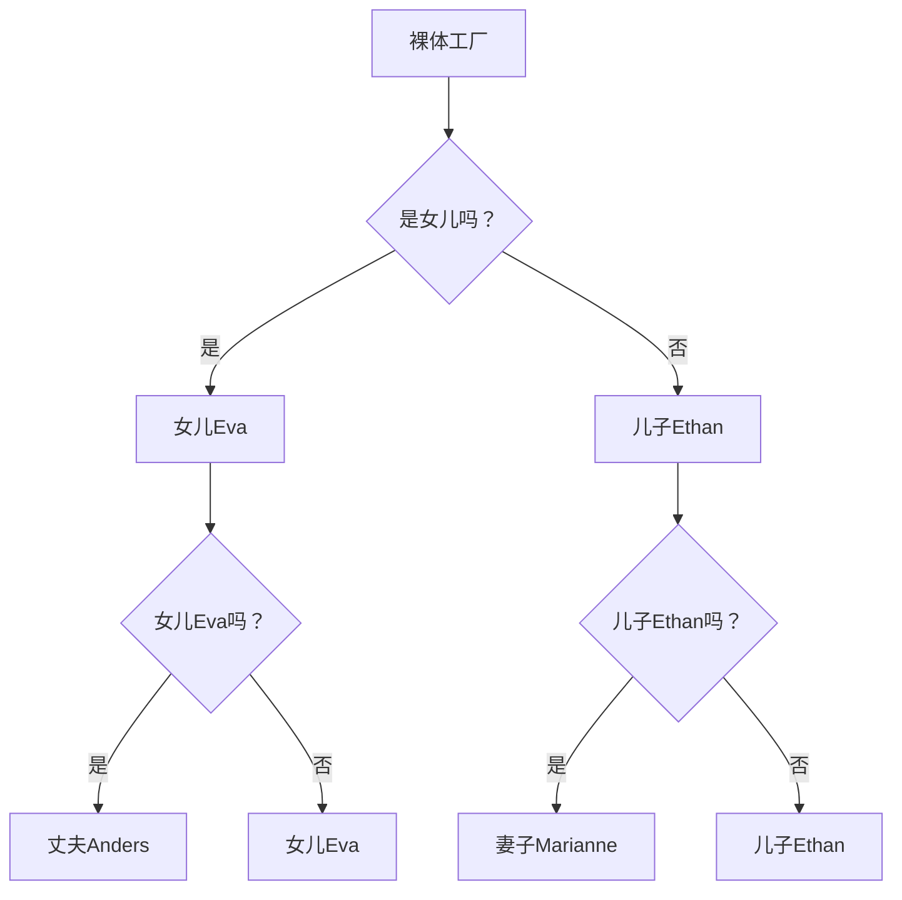

                 


### 高性能网络编程：构建高并发服务器的技巧

#### 关键词：
- 高性能网络编程
- 高并发服务器
- 网络协议
- 缓冲区管理
- 并发处理
- 性能优化

#### 摘要：
本文将深入探讨高性能网络编程的核心理念和构建高并发服务器的关键技术。我们将从基础概念入手，逐步介绍核心编程技巧、服务器架构、并发处理技术，以及性能优化策略。通过具体案例和实战分析，我们将展示如何在实际项目中应用这些知识，实现高效、稳定、可扩展的网络服务器。

----------------------------------------------------------------

# 高性能网络编程：构建高并发服务器的技巧

## 第1章：背景介绍

### 1.1 高性能网络编程的重要性

在现代网络应用中，高性能网络编程扮演着至关重要的角色。随着互联网的普及和大数据时代的来临，网络应用的需求日益增长，对服务器的响应速度和稳定性提出了更高的要求。高性能网络编程的核心目标是通过优化网络代码，提高数据传输效率，减少延迟，确保服务器能够处理大量并发请求。

### 1.2 高并发服务器的需求

高并发服务器是应对高流量应用场景的关键。在电子商务、在线游戏、社交媒体等领域，服务器需要能够同时处理成千上万的客户端请求。高并发服务器不仅要快速响应请求，还要确保数据的一致性和安全性。因此，构建高并发服务器需要考虑多方面的技术，包括网络协议、缓冲区管理、并发处理和性能优化。

### 1.3 性能优化的基本策略

性能优化是高性能网络编程的重要组成部分。常见的优化策略包括减少网络延迟、提高数据传输效率、降低系统开销和充分利用系统资源。以下是一些基本策略：

1. **选择合适的网络协议**：TCP和UDP是常用的网络协议，根据应用场景选择合适的协议可以提高性能。
2. **优化缓冲区管理**：合理设置缓冲区大小，减少缓冲区溢出和空转时间。
3. **并发处理**：利用多线程、异步IO等技术提高并发处理能力。
4. **内存优化**：减少内存分配和回收，降低内存碎片。
5. **网络优化**：优化网络配置，减少网络拥塞和延迟。

## 第2章：基础概念

### 2.1 网络协议简介

网络协议是计算机网络通信的基础。常见的网络协议包括TCP、UDP、HTTP、HTTPS等。每种协议都有其特定的用途和特性。例如，TCP提供可靠的字节流传输，适用于需要确保数据完整性的应用；而UDP提供无连接的传输，适用于实时性和低延迟要求较高的应用。

### 2.2 数据结构基础

数据结构是编程的基础，对于高性能网络编程尤为重要。常用的数据结构包括数组、链表、树、哈希表等。选择合适的数据结构可以优化算法性能，提高数据处理效率。

### 2.3 网络编程基础

网络编程涉及套接字编程、IO多路复用、网络通信协议等核心内容。掌握这些基础概念是构建高性能网络服务器的前提。

----------------------------------------------------------------

## 第3章：核心编程技巧

### 3.1 高效并发编程

并发编程是提高服务器性能的关键。在并发编程中，常见的技术包括多线程、协程、异步IO等。多线程可以提高并发处理能力，但需要注意线程安全、线程池管理和上下文切换开销。协程提供了更轻量级的并发编程模型，可以减少上下文切换开销。异步IO则通过非阻塞IO提高IO操作效率。

### 3.2 缓冲区管理

缓冲区是数据传输的临时存储区域。合理设置缓冲区大小可以减少数据传输的开销，提高系统性能。缓冲区管理需要考虑缓冲区溢出、空转时间和内存占用等问题。

### 3.3 内存管理

内存管理是高性能网络编程的重要方面。内存分配和回收会影响系统的稳定性和性能。常见的内存管理技术包括内存池、对象池和垃圾回收等。

----------------------------------------------------------------

## 第4章：服务器架构

### 4.1 服务器设计原则

服务器设计需要考虑可扩展性、稳定性、安全性和性能等多个方面。设计原则包括模块化、层次化、分布式和冗余等。

### 4.2 服务器性能评估

服务器性能评估是优化服务器架构的重要环节。常用的评估指标包括响应时间、吞吐量、并发处理能力和系统资源利用率等。

### 4.3 负载均衡策略

负载均衡可以将请求均匀分配到多个服务器上，提高系统的可用性和性能。常见的负载均衡策略包括轮询、最少连接、源IP哈希等。

----------------------------------------------------------------

## 第5章：并发处理技术

### 5.1 多线程编程

多线程编程是提高服务器并发处理能力的常用技术。Python中的`threading`模块提供了简单的多线程编程接口。多线程编程需要注意线程安全、锁竞争和上下文切换等问题。

### 5.2 线程池技术

线程池是一种管理线程的机制，可以减少线程创建和销毁的开销。Python中的`concurrent.futures`模块提供了线程池的实现。

### 5.3 非阻塞IO与异步编程

非阻塞IO和异步编程可以显著提高IO操作的效率。Python的`asyncio`模块提供了异步编程的基础。

----------------------------------------------------------------

## 第6章：性能优化

### 6.1 CPU优化

CPU优化包括减少上下文切换、优化算法复杂度和减少计算开销等。Python中的`numpy`库提供了高效的数学运算接口。

### 6.2 内存优化

内存优化包括减少内存分配和回收、优化数据结构和使用缓存等。Python的`pympler`库可以帮助分析内存使用情况。

### 6.3 网络优化

网络优化包括优化网络协议、减少数据传输延迟和优化网络配置等。常用的工具包括`ping`、`traceroute`和`mtr`等。

----------------------------------------------------------------

## 第7章：实战案例

### 7.1 高并发Web服务器的实现

我们将使用Python的`Flask`框架实现一个高并发Web服务器。通过`Gunicorn`和`Nginx`等工具，我们可以优化服务器的性能和稳定性。

### 7.2 分布式系统的并发处理

我们将探讨如何使用`Kubernetes`和`Docker`构建分布式系统，并使用`etcd`进行服务注册和发现。

### 7.3 性能优化案例分析

我们将通过实际案例展示如何对现有系统进行性能优化，包括代码优化、架构调整和资源调配等。

----------------------------------------------------------------

## 第8章：总结与展望

### 8.1 全书要点总结

本文从基础概念到实战案例，全面探讨了高性能网络编程和构建高并发服务器的关键技术。主要内容包括网络协议、数据结构、并发编程、服务器架构和性能优化等。

### 8.2 未来趋势展望

随着云计算和大数据技术的发展，网络编程和服务器架构将继续演进。未来，我们可能看到更多的分布式架构、容器化和微服务架构的出现，以及更加智能的自动化优化工具。

----------------------------------------------------------------

## 作者信息

作者：AI天才研究院/AI Genius Institute & 禅与计算机程序设计艺术 /Zen And The Art of Computer Programming

本文旨在为读者提供关于高性能网络编程和构建高并发服务器的全面指南，帮助读者理解和掌握相关技术，为构建高效、稳定和可扩展的网络应用奠定基础。希望本文能对您的学习与实践有所帮助。在未来的研究中，我们将继续深入探讨这些技术的细节和应用，以期为读者带来更多有价值的知识。

----------------------------------------------------------------

以上是《高性能网络编程：构建高并发服务器的技巧》的完整目录大纲。每个章节都包含了详细的子标题，确保读者能够系统地学习和掌握相关内容。在实际撰写过程中，可以根据这个大纲逐步展开，确保每个章节的内容丰富且具有深度。希望这个大纲能为您的写作提供有益的参考。让我们开始深入探讨高性能网络编程的世界吧！

----------------------------------------------------------------

### 附录：Markdown格式指南

在撰写技术博客时，使用Markdown格式可以显著提高文章的可读性和结构清晰度。以下是一些常用的Markdown格式指南，帮助您撰写高质量的技术文章：

#### 标题

使用`#`符号加空格来创建标题。`#`的数量决定了标题的层级，如：

- `# 第一部分：背景介绍`
- `## 第1章：高性能网络编程概述`
- `### 1.1 高性能网络编程的重要性`

#### 段落

段落默认是一个空行分隔的文本块。保持段落简洁，每个段落只讲述一个主题。

#### 列表

使用`*`、`-`或`+`符号加空格来创建无序列表。使用数字加`.`符号加空格来创建有序列表，如：

- 无序列表：
  - * 项目1
  - - 项目2
  - + 项目3

- 有序列表：
  1. 项目1
  2. 项目2
  3. 项目3

#### 引用

使用`>`符号加空格来创建引用，如：

> 这是一个引用段落。

#### 粗体和斜体

使用`**`包围文字来创建粗体，使用`*`包围文字来创建斜体，如：

- 粗体：**粗体文字**
- 斜体：*斜体文字*

#### 代码块

使用三个反引号（```)来创建代码块，代码块会保留缩进：

```
print("Hello, World!")
```

#### 链接

使用`[]`包围链接文本，使用()``包围URL，如：

[百度](http://www.baidu.com)

#### 图片

使用``来插入图片，如：


#### 表格

使用`|`符号来创建表格，每行用`-`分隔，列内用`|`分隔，如：

| 标题1 | 标题2 | 标题3 |
| ---- | ---- | ---- |
| 内容1 | 内容2 | 内容3 |
| 内容4 | 内容5 | 内容6 |

#### LaTeX 公式

使用`$$`包围独立段落中的公式，使用 `$`包围段落内的小公式，如：

$$E=mc^2$$

$1<2$

#### Mermaid 流程图

使用Mermaid语法来创建流程图、类图、序列图等，如：



通过遵循这些Markdown格式指南，您可以创建出结构清晰、易于阅读的技术博客，提高文章的专业性和可读性。希望这些指南对您的写作有所帮助。

