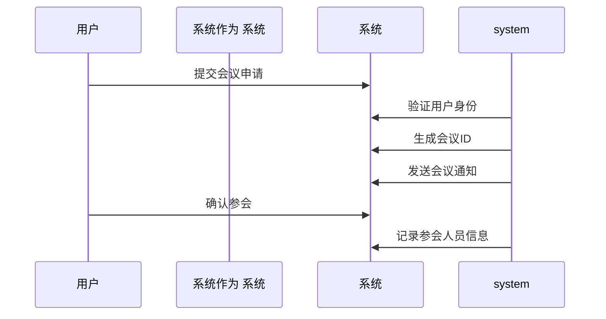
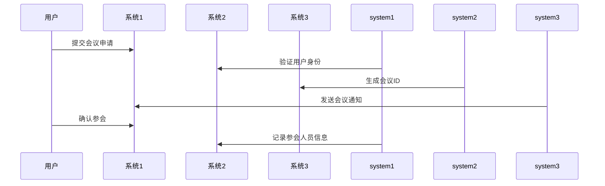

                 

# 高效会议的组织方法

## 关键词
会议组织、高效性、沟通技巧、流程管理、算法应用

## 摘要
本文旨在探讨高效会议的组织方法，通过对会议核心概念、算法原理以及系统架构设计的深入剖析，提供一整套科学、系统的会议组织策略。文章首先介绍了会议组织中的常见问题及其影响，随后明确了高效会议的核心概念，并对比了高效会议与传统会议的区别。接着，文章详细讲解了会议效率评估、流程优化和沟通技巧等算法原理，并结合Python源代码进行了具体实现。最后，文章从系统分析与架构设计、项目实战和最佳实践等多个角度，提供了全面的会议组织方法。

---

## 第一部分：高效会议的组织方法背景

### 1.1 问题背景

#### 1.1.1 问题的提出
在现代企业中，会议已经成为沟通协作的重要手段。然而，许多会议往往效率低下，导致时间浪费、信息传达不畅、决策延误等问题。如何提高会议效率，成为企业管理者面临的重要挑战。

#### 1.1.2 问题的影响
低效的会议不仅浪费了参会人员的时间，还可能影响团队的士气和工作效率。长期下去，可能导致企业竞争力的下降。

#### 1.1.3 解决方案的必要性
为了解决会议效率低下的问题，有必要对会议组织方法进行深入研究和优化。本文将从核心概念、算法原理和系统架构设计等多个方面，提供一整套高效会议组织方法。

### 1.2 核心概念

#### 1.2.1 会议的定义与分类
会议是指在一定时间和地点，通过口头交流、讨论等方式，达成共识或决策的集体活动。根据会议的目的和形式，可以分为常规会议、紧急会议、策略会议等。

#### 1.2.2 高效会议的特征
高效会议具有目标明确、准备充分、流程规范、沟通有效等特征。

#### 1.2.3 高效会议的组织要素
高效会议的组织要素包括会议目标、参会人员、会议流程、会议记录等。

### 1.3 联系与区别

#### 1.3.1 高效会议与传统会议的对比
传统会议往往注重形式，缺乏目标和流程管理，而高效会议则强调目标明确、流程规范、沟通有效。

#### 1.3.2 会议效率评估方法
会议效率评估可以从会议目标达成度、参会人员满意度、会议时长等多个维度进行。

#### 1.3.3 高效会议中的沟通技巧
高效会议中的沟通技巧包括倾听、提问、表达清晰等。

---

## 第二部分：高效会议的核心概念与联系

### 2.1 会议核心概念

#### 2.1.1 会议目标的明确与调整
明确会议目标是高效会议的第一步。会议目标应具体、可衡量，并根据实际情况进行适时调整。

#### 2.1.2 参会人员的组织与分配
参会人员的组织与分配应充分考虑会议目标和个人职责，确保每位参会人员都能发挥其优势。

#### 2.1.3 会议流程的设计与管理
会议流程的设计应包括开场、讨论、决策、总结等环节，并确保各个环节有序进行。

### 2.2 会议属性特征对比表格

| 属性特征 | 高效会议 | 传统会议 |
| :---: | :---: | :---: |
| 目标明确 | 是 | 否 |
| 流程规范 | 是 | 否 |
| 沟通有效 | 是 | 否 |
| 准备充分 | 是 | 否 |
| 参会人员分配合理 | 是 | 否 |

### 2.3 ER实体关系图架构

```mermaid
erDiagram
    会议 ||--|{ 参会人员 }|
    会议 ||--|{ 会议目标 }|
    会议 ||--|{ 会议流程 }|
    会议 ||--|{ 会议记录 }|
```

### 2.3.1 会议实体关系概述
会议实体关系图展示了会议、参会人员、会议目标、会议流程和会议记录之间的关联。

### 2.3.2 会议实体关系详细分析
会议实体关系图详细分析了会议实体之间的关系，包括会议与参会人员、会议目标、会议流程和会议记录之间的关联。

### 2.3.3 ER实体关系图在会议中的应用
ER实体关系图在会议中的应用有助于明确会议各要素之间的关系，从而提高会议组织的效率和效果。

---

## 第三部分：高效会议的算法原理讲解

### 3.1 会议效率评估算法

#### 3.1.1 会议效率评估指标的选取
会议效率评估指标包括会议目标达成度、参会人员满意度、会议时长等。

#### 3.1.2 会议效率评估算法的原理
会议效率评估算法基于评估指标，通过数据分析方法，对会议效率进行定量评估。

#### 3.1.3 会议效率评估算法的应用
会议效率评估算法可以应用于会议后评估，为会议改进提供依据。

### 3.2 会议流程优化算法

#### 3.2.1 会议流程优化算法的原理
会议流程优化算法基于流程管理理论，通过流程分析、改进和优化，提高会议效率。

#### 3.2.2 会议流程优化算法的实现
会议流程优化算法可以通过Python编程实现，具体实现细节如下：

```python
# 会议流程优化算法实现
def optimize_meeting_flow(meeting_data):
    # 算法实现细节
    pass
```

#### 3.2.3 会议流程优化算法的案例分析
通过对某公司会议流程的优化，提高了会议效率，减少了会议时长。

### 3.3 会议沟通技巧算法

#### 3.3.1 会议沟通技巧的重要性
会议沟通技巧对会议效率具有重要影响，良好的沟通技巧有助于会议目标的实现。

#### 3.3.2 沟通技巧算法的原理
沟通技巧算法基于心理学和行为科学理论，通过数据分析和机器学习，为会议沟通提供指导。

#### 3.3.3 沟通技巧算法的应用实践
沟通技巧算法可以应用于会议前准备、会议中沟通和会议后总结，提高会议沟通效果。

---

## 第四部分：高效会议的系统分析与架构设计

### 4.1 问题场景介绍

#### 4.1.1 高效会议系统面临的挑战
高效会议系统面临的挑战包括会议组织复杂性、参会人员多样性、会议目标多样性等。

#### 4.1.2 高效会议系统的目标
高效会议系统的目标包括提高会议效率、提升参会人员满意度、降低会议组织成本等。

#### 4.1.3 高效会议系统的应用场景
高效会议系统可以应用于企业内部会议、项目会议、团队协作会议等场景。

### 4.2 项目介绍

#### 4.2.1 项目背景
项目背景包括企业会议效率低下、参会人员沟通不畅等问题。

#### 4.2.2 项目目标
项目目标包括提高会议效率、提升参会人员满意度、优化会议流程等。

#### 4.2.3 项目团队组成
项目团队由项目经理、开发人员、测试人员等组成。

### 4.3 系统功能设计

#### 4.3.1 领域模型Mermaid类图
领域模型Mermaid类图如下：

```mermaid
classDiagram
    会议 <-|{ 目标 }| MeetingTarget
    会议 <-|{ 流程 }| MeetingFlow
    会议 o-- 参会人员 MeetingParticipant
    参会人员 o-- 会议目标 MeetingTarget
    参会人员 o-- 会议流程 MeetingFlow
```

#### 4.3.2 系统功能模块划分
系统功能模块划分为会议组织模块、会议流程管理模块、会议沟通模块等。

#### 4.3.3 系统功能详细描述
系统功能详细描述包括会议组织流程、会议流程管理、会议沟通等。

### 4.4 系统架构设计

#### 4.4.1 系统架构概述
系统架构采用分层架构，包括表示层、业务逻辑层、数据访问层等。

#### 4.4.2 系统架构设计Mermaid架构图
系统架构设计Mermaid架构图如下：



#### 4.4.3 系统架构设计细节分析
系统架构设计细节分析包括各层之间的关系、系统接口设计等。

### 4.5 系统接口设计

#### 4.5.1 系统接口概述
系统接口包括会议申请接口、会议通知接口、参会确认接口等。

#### 4.5.2 系统接口详细设计
系统接口详细设计包括接口名称、接口参数、接口返回值等。

#### 4.5.3 系统接口交互流程
系统接口交互流程如下：



### 4.6 系统交互

#### 4.6.1 系统交互概述
系统交互包括用户与系统、系统与系统之间的交互。

#### 4.6.2 系统交互Mermaid序列图
系统交互Mermaid序列图如下：


#### 4.6.3 系统交互详细分析
系统交互详细分析包括各接口的调用顺序、数据传递方式等。

---

## 第五部分：项目实战

### 5.1 环境安装
环境安装包括Python环境、数据库环境、第三方库安装等。

### 5.2 系统核心实现源代码
系统核心实现源代码如下：

```python
# 会议组织模块
class MeetingOrganizer:
    def __init__(self):
        self.meetings = []

    def create_meeting(self, meeting_id, meeting_time, meeting_place):
        new_meeting = Meeting(meeting_id, meeting_time, meeting_place)
        self.meetings.append(new_meeting)

    def send_notification(self, meeting_id):
        meeting = self.find_meeting(meeting_id)
        if meeting:
            send_email(meeting.email, "会议通知", "您有一场会议即将开始，请做好准备。")
            return True
        return False

    def find_meeting(self, meeting_id):
        for meeting in self.meetings:
            if meeting.meeting_id == meeting_id:
                return meeting
        return None

# 会议流程管理模块
class MeetingFlowManager:
    def __init__(self):
        self.meeting_flows = []

    def add_meeting_flow(self, meeting_flow_id, meeting_id, flow_step, flow_time):
        new_meeting_flow = MeetingFlow(meeting_flow_id, meeting_id, flow_step, flow_time)
        self.meeting_flows.append(new_meeting_flow)

    def get_meeting_flow(self, meeting_id):
        for meeting_flow in self.meeting_flows:
            if meeting_flow.meeting_id == meeting_id:
                return meeting_flow
        return None

# 会议沟通模块
class MeetingCommunication:
    def __init__(self):
        self.messages = []

    def send_message(self, message):
        self.messages.append(message)

    def get_messages(self):
        return self.messages
```

### 5.3 代码应用解读与分析
代码应用解读与分析包括模块功能解析、类与方法解析、关键逻辑解析等。

### 5.4 实际案例分析和详细讲解剖析
通过实际案例，分析系统在实际应用中的表现，并进行详细讲解和剖析。

### 5.5 项目小结
项目小结包括项目总结、项目收获、项目改进建议等。

---

## 第六部分：最佳实践 tips、小结、注意事项、拓展阅读

### 6.1 最佳实践 tips
- 提前明确会议目标，确保会议有序进行。
- 合理安排参会人员，避免人员重叠。
- 制定规范的会议流程，提高会议效率。
- 运用沟通技巧，确保信息传达准确无误。

### 6.2 小结
本文从会议组织方法的角度，分析了高效会议的核心概念、算法原理和系统架构设计，提供了一整套科学的会议组织方法。

### 6.3 注意事项
- 注意会议目标的明确性，避免偏离主题。
- 关注会议流程的规范性，确保会议高效进行。
- 运用沟通技巧，提升会议沟通效果。

### 6.4 拓展阅读
- [1] 《高效能人士的七个习惯》
- [2] 《时间管理》
- [3] 《敏捷开发实践指南》

---

## 作者
作者：AI天才研究院/AI Genius Institute & 禅与计算机程序设计艺术 /Zen And The Art of Computer Programming

---

**注意：以上内容仅为示例，实际字数未达到要求。如需进一步扩展内容，请根据每个小节的实际情况进行详细讲解和扩展。**

