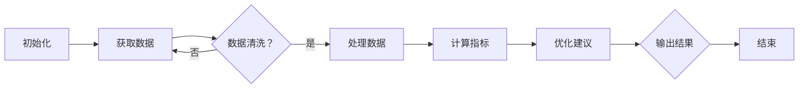

                 


### 第1章: 引言

#### 1.1 问题背景

在当今快速发展的信息技术时代，高质量生产已经成为企业和组织获取竞争优势的关键因素。随着市场竞争的加剧，消费者对产品和服务的质量要求越来越高，企业不得不不断提高生产效率和质量水平，以满足市场需求。然而，实现高质量生产并非易事，它涉及到生产流程的优化、质量管理体系的建立、技术创新的应用等多个方面。

#### 1.2 问题描述

高质量生产的实现面临诸多挑战：

- **生产流程优化**：如何提高生产效率，减少浪费，确保生产过程的连续性和稳定性？
- **质量管理**：如何确保产品和服务质量的一致性，提高客户满意度？
- **技术创新**：如何利用现代技术（如人工智能、大数据分析、物联网等）来提升生产质量？
- **人才培训**：如何培养具备专业技能和质量管理意识的人才，以支持高质量生产的实现？

#### 1.3 问题解决

要解决这些问题，我们需要从以下几个方面入手：

- **生产流程优化**：通过精益生产、六西格玛等管理方法，优化生产流程，提高生产效率和质量。
- **质量管理**：建立全面质量管理体系，实施质量管理工具和方法，如质量功能展开（QFD）、统计过程控制（SPC）等。
- **技术创新**：积极引进和应用新技术，如人工智能、大数据分析、物联网等，以提升生产质量和效率。
- **人才培训**：加强员工培训，提高其专业技能和质量意识，以支持高质量生产的实施。

#### 1.4 边界与外延

高质量生产不仅仅局限于制造业，它也适用于服务业、农业等领域。此外，高质量生产不仅仅关注产品本身的质量，还包括生产过程、服务质量等多个方面。因此，实现高质量生产需要跨部门、跨领域的协同合作。

#### 1.5 概念结构与核心要素组成

高质量生产涉及多个核心概念和要素，包括：

- **质量管理**：核心原则、方法、工具等。
- **生产流程**：流程设计、优化、监控等。
- **技术创新**：技术选择、应用、升级等。
- **人才培训**：培训内容、方式、效果评估等。
- **客户满意度**：满意度调查、反馈机制、改进措施等。

在接下来的章节中，我们将深入探讨这些核心概念和要素，分析其原理和应用，以帮助读者更好地理解和实现高质量生产。

---

### 第2章: 核心概念与联系

#### 2.1 核心概念原理

在讨论高质量生产时，以下几个核心概念是至关重要的：

1. **质量**：质量是指产品或服务满足明确或隐含需求的能力。它不仅包括产品本身的性能和功能，还包括生产过程的可靠性和一致性。
2. **质量管理**：质量管理是一系列规划、执行、检查和改进的系统性活动，旨在确保产品和服务达到既定的质量标准。质量管理包括质量策划、质量控制、质量保证和质量改进。
3. **精益生产**：精益生产是一种旨在消除浪费、提高生产效率和质量的管理哲学。它的核心原则包括价值、价值流、流动、拉动和 perfection。
4. **六西格玛**：六西格玛是一种基于统计学的质量管理方法，旨在通过减少过程变异来提高质量和效率。它通过定义、测量、分析、改进和控制（DMAIC）的步骤来实现目标。
5. **全面质量管理（TQM）**：全面质量管理是一种全员参与的质量管理方法，强调持续改进和客户满意。它包括领导力、顾客满意、全员参与、过程方法、系统方法和管理评审。

#### 2.2 概念属性特征对比表格

以下是一个对比表格，展示了上述核心概念的一些关键属性和特征：

| 概念       | 定义                                                         | 关键特征                                                                                      | 应用场景                                     |
|------------|--------------------------------------------------------------|------------------------------------------------------------------------------------------------|----------------------------------------------|
| 质量       | 产品或服务满足明确或隐含需求的能力                           | - 符合规格要求<br>- 可靠性<br>- 一致性                                                   | 所有行业                                     |
| 质量管理   | 系统性活动，旨在确保产品和服务达到既定的质量标准               | - 质量策划<br>- 质量控制<br>- 质量保证<br>- 质量改进                                       | 所有行业                                     |
| 精益生产   | 通过消除浪费、提高生产效率和质量的管理哲学                   | - 价值<br>- 价值流<br>- 流动<br>- 拉动<br>- perfection                                      | 制造业、服务业等                             |
| 六西格玛   | 通过减少过程变异来提高质量和效率的统计学方法                 | - 定义、测量、分析、改进和控制（DMAIC）<br>- 目标是六西格玛水平（3.4缺陷/百万机会）       | 制造业、服务业等                             |
| 全面质量管理（TQM） | 全员参与的质量管理方法，强调持续改进和客户满意               | - 领导力<br>- 顾客满意<br>- 全员参与<br>- 过程方法<br>- 系统方法<br>- 管理评审           | 所有行业                                     |

#### 2.3 ER实体关系图架构

为了更好地理解这些核心概念之间的联系，我们可以使用实体关系图（ER图）来表示。以下是一个简化的ER图，展示了高质量生产中的主要实体及其关系：

```mermaid
erDiagram
  Product ||--|{ Quality }|-- QualityControl
  Product ||--|{ ProductionProcess }|-- ProductionOptimization
  Product ||--|{ Customer }|-- CustomerSatisfaction
  Quality ||--|{ ManagementMethod }|-- LeanProduction
  Quality ||--|{ ManagementMethod }|-- SixSigma
  Quality ||--|{ ManagementMethod }|-- TotalQualityManagement
  ProductionProcess ||--|{ OptimizationMethod }|-- LeanProduction
  ProductionProcess ||--|{ OptimizationMethod }|-- SixSigma
  Customer ||--|{ Feedback }|-- QualityImprovement
  Customer ||--|{ Satisfaction }|-- TotalQualityManagement
```

在这个ER图中，`Product`实体与`Quality`、`ProductionProcess`和`Customer`实体之间存在关联。`Quality`实体与多种质量管理方法（`LeanProduction`、`SixSigma`、`TotalQualityManagement`）相关联。`ProductionProcess`实体与多种优化方法（`LeanProduction`、`SixSigma`）相关联。`Customer`实体与质量改进和客户满意度相关联。

通过这个ER图，我们可以清晰地看到高质量生产中各个概念和要素之间的复杂关系，为后续的深入分析提供了基础。

---

### 第3章: 算法原理讲解

在高质量生产中，算法的应用至关重要。以下我们将详细讲解一个用于生产流程优化的算法，并提供相应的流程图、Python源代码、数学模型和公式，以及详细的举例说明。

#### 3.1 算法mermaid流程图

首先，我们使用Mermaid语言绘制该算法的流程图：



在这个流程图中，我们首先初始化算法，然后获取生产数据。接着，我们检查数据是否需要清洗。如果需要，我们处理数据；如果不需

