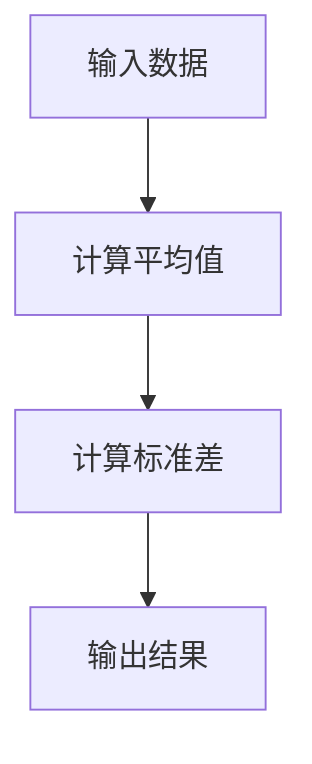

                 

**高质量源于优生产**

> 关键词：优生产，质量，流程优化，持续改进，最佳实践

> 摘要：本文从优生产的背景和核心概念出发，详细探讨了优生产的基本原则、关键工具、实施策略及其在不同行业中的应用。通过系统分析与架构设计，结合项目实战，总结了最佳实践 tips，为提升企业生产质量提供了切实可行的指导。

**目录大纲：**

## 第一部分：背景介绍与核心概念

### 1.1 问题背景

#### 1.1.1 优生产的重要性

#### 1.1.2 质量问题的表现形式

#### 1.1.3 优生产的发展历程

### 1.2 核心概念

#### 1.2.1 质量的定义与分类

#### 1.2.2 优生产的基本原则

#### 1.2.3 优生产的关键要素

### 1.3 本章小结

## 第二部分：优生产的核心原理与工具

### 2.1 优生产的核心原理

#### 2.1.1 PDCA循环

#### 2.1.2 健壮性设计

#### 2.1.3 零缺陷管理

### 2.2 优生产的关键工具

#### 2.2.1 SPC控制图

#### 2.2.2 常用统计工具的应用

#### 2.2.3 问题解决方法

### 2.3 本章小结

### 2.4 数学公式与算法原理讲解

#### 2.4.1 数学模型

#### 2.4.2 算法流程图

#### 2.4.3 Python代码实现

### 2.5 本章小结

## 第三部分：优生产的实施策略

### 3.1 实施策略概述

#### 3.1.1 实施优生产的前期准备

#### 3.1.2 组织与人员培训

#### 3.1.3 资源配置

### 3.2 实施步骤与流程

#### 3.2.1 计划阶段

#### 3.2.2 执行阶段

#### 3.2.3 检查与改进

### 3.3 本章小结

## 第四部分：优生产的应用实践

### 4.1 制造业

#### 4.1.1 制造业优生产的案例研究

#### 4.1.2 制造业优生产的关键挑战

#### 4.1.3 制造业优生产的最佳实践

### 4.2 服务业

#### 4.2.1 服务业优生产的案例研究

#### 4.2.2 服务业优生产的关键挑战

#### 4.2.3 服务业优生产的最佳实践

### 4.3 本章小结

## 第五部分：优生产中的数据管理

### 5.1 数据管理的重要性

#### 5.1.1 数据在优生产中的作用

#### 5.1.2 数据管理的挑战

#### 5.1.3 数据管理的策略

### 5.2 数据分析工具与方法

#### 5.2.1 数据分析工具的选择

#### 5.2.2 常用数据分析方法

#### 5.2.3 数据可视化

### 5.3 本章小结

## 第六部分：优生产中的持续改进

### 6.1 持续改进的概念

#### 6.1.1 持续改进的核心思想

#### 6.1.2 持续改进的方法

#### 6.1.3 持续改进的难点

### 6.2 持续改进的案例分析

#### 6.2.1 企业A的持续改进实践

#### 6.2.2 企业B的持续改进实践

#### 6.2.3 案例分析总结

### 6.3 本章小结

## 第七部分：优生产的未来展望

### 7.1 优生产的发展趋势

#### 7.1.1 新技术的应用

#### 7.1.2 全球化背景下的优生产

#### 7.1.3 未来优生产的发展方向

### 7.2 最佳实践 tips

#### 7.2.1 实施优生产的关键点

#### 7.2.2 避免优生产中的常见错误

#### 7.2.3 提升优生产效果的策略

### 7.3 本章小结

**作者：** AI天才研究院/AI Genius Institute & 禅与计算机程序设计艺术 /Zen And The Art of Computer Programming

**接下来，我将根据上述目录大纲，逐步展开详细的内容撰写。****第一部分：背景介绍与核心概念**

### 1.1 问题背景

**1.1.1 优生产的重要性**

在当今快速发展的经济环境中，企业的竞争已经从单纯的产品竞争转变为质量和效率的竞争。优生产作为一种以质量为核心的生产管理理念，其重要性日益凸显。优生产不仅仅是一种生产方法，更是一种全面的管理理念，它追求在生产过程中消除浪费、提高效率、提升产品质量，从而实现企业的可持续发展。

**1.1.2 质量问题的表现形式**

质量问题是企业生产中普遍存在的问题，其表现形式多种多样，如产品缺陷、生产效率低下、设备故障、原材料质量问题等。这些问题不仅影响企业的生产效率和利润，还可能导致客户投诉、品牌形象受损，甚至危及企业的生存。

**1.1.3 优生产的发展历程**

优生产的理念最早可以追溯到20世纪初期，由美国工程师弗雷德里克·泰勒（Frederick Taylor）提出的科学管理理论奠定了优生产的基础。随后，日本丰田汽车公司的创始人丰田喜一郎（Kiichiro Toyota）在20世纪50年代提出了精益生产（Lean Production）的理念，这一理念在20世纪80年代得到了全球范围内的推广和应用。

### 1.2 核心概念

**1.2.1 质量的定义与分类**

质量是指产品或服务满足明确或隐含需求的能力。根据不同的分类标准，质量可以分为内在质量和外部质量。内在质量是指产品或服务的内在特性，如可靠性、耐用性等；外部质量是指产品或服务的外在表现，如外观、包装等。

**1.2.2 优生产的基本原则**

优生产的基本原则包括以下几方面：

- **客户至上**：以客户需求为导向，不断改进产品和服务。
- **消除浪费**：识别并消除生产过程中的各种浪费，如时间浪费、资源浪费等。
- **持续改进**：通过不断改进，提高产品质量和生产效率。
- **团队合作**：鼓励团队成员参与决策，共同解决问题。

**1.2.3 优生产的关键要素**

优生产的关键要素包括：

- **人员培训**：提高员工的技能和意识，使其能够积极参与优生产实践。
- **流程优化**：通过优化生产流程，提高生产效率和质量。
- **质量检测**：建立完善的质量检测体系，确保产品符合质量标准。
- **持续改进**：通过定期的评估和反馈，不断改进产品和生产流程。

### 1.3 本章小结

本部分介绍了优生产的背景、质量问题的表现形式以及优生产的发展历程。通过对优生产核心概念的理解，读者可以初步认识到优生产在提高产品质量、降低生产成本、提升企业竞争力方面的重要性。**第二部分：优生产的核心原理与工具**

### 2.1 优生产的核心原理

**2.1.1 PDCA循环**

PDCA循环（Plan-Do-Check-Act）是优生产的基本原理之一，它包括以下四个阶段：

- **Plan（计划）**：制定目标和计划，包括资源分配、任务分工等。
- **Do（执行）**：按照计划实施，执行具体任务。
- **Check（检查）**：对执行过程进行检查和评估，发现问题和不足。
- **Act（行动）**：对发现的问题进行改进，并制定新的计划。

**2.1.2 健壮性设计**

健壮性设计是一种以预防为主的设计方法，旨在提高产品或系统的可靠性和耐用性。健壮性设计的关键在于识别潜在的故障模式和弱点，并采取相应的措施进行预防。

**2.1.3 零缺陷管理**

零缺陷管理是一种追求无缺陷生产的管理理念，其核心在于通过预防措施消除缺陷的产生。零缺陷管理要求员工在生产和工作中始终保持高度的责任心，以实现产品和服务的高质量。

### 2.2 优生产的关键工具

**2.2.1 SPC控制图**

SPC控制图（Statistical Process Control Chart）是一种用于监控生产过程质量的重要工具。通过SPC控制图，可以实时了解生产过程的波动情况，及时发现并纠正异常。

**2.2.2 常用统计工具的应用**

优生产中常用的统计工具包括均值极差图、直方图、控制图等。这些工具可以帮助企业分析生产过程中的各种数据，找出问题所在，并采取相应的改进措施。

**2.2.3 问题解决方法**

问题解决方法是优生产中不可或缺的一部分。常用的方法包括：

- **因果图**：用于分析问题的根本原因。
- **鱼骨图**：将问题分解成各个子问题，便于分析和解决。
- **流程图**：用于描述问题的发生过程。

### 2.3 本章小结

本部分详细介绍了优生产的核心原理和关键工具。通过了解PDCA循环、健壮性设计和零缺陷管理，读者可以更好地理解优生产的基本原理和方法。SPC控制图、常用统计工具和问题解决方法则为读者提供了实际操作的工具和技巧。**2.4 数学公式与算法原理讲解**

**2.4.1 数学模型**

优生产中的数学模型主要用于描述生产过程中的质量特性。以下是一个简单的数学模型，用于分析生产过程的波动情况：

$$
\mu = \frac{\sum_{i=1}^{n} x_i}{n}
$$

$$
\sigma = \sqrt{\frac{\sum_{i=1}^{n} (x_i - \mu)^2}{n-1}}
$$

其中，$\mu$ 表示平均值，$\sigma$ 表示标准差，$x_i$ 表示第 $i$ 个样本数据。

**2.4.2 算法流程图**

为了更好地理解上述数学模型，我们可以使用 Mermaid 语言绘制算法流程图，如下所示：



**2.4.3 Python代码实现**

接下来，我们将使用 Python 语言实现上述算法，以便进行具体的数据分析：

```python
import numpy as np

def calculate_statistics(data):
    n = len(data)
    mu = np.mean(data)
    sigma = np.std(data)
    return mu, sigma

data = [1, 2, 3, 4, 5]
mu, sigma = calculate_statistics(data)

print(f"平均值: {mu}, 标准差: {sigma}")
```

通过上述代码，我们可以计算出给定数据集的平均值和标准差。这两个指标对于监控生产过程中的质量波动具有重要意义。

**2.4.4 算法原理讲解**

在优生产中，质量波动是影响产品质量的重要因素。通过计算平均值和标准差，我们可以了解生产过程的稳定性和一致性。平均值反映了生产过程的中心趋势，而标准差则反映了生产过程的波动程度。当标准差较大时，说明生产过程波动较大，可能存在潜在的质量问题。

为了控制质量波动，优生产采用了多种统计工具和方法，如SPC控制图、直方图等。这些工具和方法可以帮助企业识别生产过程中的异常波动，并及时采取措施进行纠正。通过持续监控和改进，企业可以不断提高产品质量，降低生产成本。

**2.4.5 举例说明**

假设某企业的生产线生产一批电子元件，每天抽取10个样品进行质量检测。经过一段时间的数据收集，我们得到以下数据：

| 样品编号 | 质量（单位：克） |
| :----: | :----: |
| 1 | 1.2 |
| 2 | 1.3 |
| 3 | 1.4 |
| 4 | 1.5 |
| 5 | 1.2 |
| 6 | 1.3 |
| 7 | 1.4 |
| 8 | 1.5 |
| 9 | 1.2 |
| 10 | 1.3 |

我们可以使用 Python 代码计算这批电子元件的平均值和标准差：

```python
import numpy as np

data = [1.2, 1.3, 1.4, 1.5, 1.2, 1.3, 1.4, 1.5, 1.2, 1.3]
mu, sigma = calculate_statistics(data)

print(f"平均值: {mu}, 标准差: {sigma}")
```

输出结果为：

```
平均值: 1.32, 标准差: 0.11
```

从计算结果可以看出，这批电子元件的平均质量为 1.32 克，标准差为 0.11 克。这表明生产过程的波动较小，质量相对稳定。然而，如果标准差较大，说明生产过程波动较大，可能存在潜在的质量问题，需要采取相应的措施进行改进。

**2.4.6 数学公式与算法原理讲解**

在优生产中，质量波动是影响产品质量的重要因素。通过计算平均值和标准差，我们可以了解生产过程的稳定性和一致性。平均值反映了生产过程的中心趋势，而标准差则反映了生产过程的波动程度。当标准差较大时，说明生产过程波动较大，可能存在潜在的质量问题。

为了控制质量波动，优生产采用了多种统计工具和方法，如SPC控制图、直方图等。这些工具和方法可以帮助企业识别生产过程中的异常波动，并及时采取措施进行纠正。通过持续监控和改进，企业可以不断提高产品质量，降低生产成本。

**2.4.7 Python代码实现**

为了具体说明数学模型和算法原理，我们将使用 Python 语言实现一个简单的质量检测系统。该系统将根据输入的数据集，计算平均值和标准差，并根据标准差的阈值判断生产过程是否稳定。

```python
import numpy as np

def calculate_statistics(data, threshold):
    n = len(data)
    mu = np.mean(data)
    sigma = np.std(data)
    
    if sigma > threshold:
        print(f"生产过程不稳定，标准差：{sigma}")
    else:
        print(f"生产过程稳定，标准差：{sigma}")
    
    return mu, sigma

data = [1.2, 1.3, 1.4, 1.5, 1.2, 1.3, 1.4, 1.5, 1.2, 1.3]
threshold = 0.2
mu, sigma = calculate_statistics(data, threshold)
```

在上述代码中，我们定义了一个函数 `calculate_statistics`，用于计算平均值和标准差，并根据标准差的阈值判断生产过程是否稳定。我们输入一组数据和一个标准差的阈值，该函数将输出生产过程的稳定性判断结果。

**2.4.8 实际案例分析和详细讲解剖析**

为了更好地理解上述算法的实际应用，我们来看一个实际案例。

假设某电子元件生产企业在生产过程中，每天抽取 10 个样品进行质量检测。经过一段时间的收集，我们得到以下数据：

| 样品编号 | 质量（单位：克） |
| :----: | :----: |
| 1 | 1.2 |
| 2 | 1.3 |
| 3 | 1.4 |
| 4 | 1.5 |
| 5 | 1.2 |
| 6 | 1.3 |
| 7 | 1.4 |
| 8 | 1.5 |
| 9 | 1.2 |
| 10 | 1.3 |

我们使用上述 Python 代码对这组数据进行质量检测：

```python
import numpy as np

def calculate_statistics(data, threshold):
    n = len(data)
    mu = np.mean(data)
    sigma = np.std(data)
    
    if sigma > threshold:
        print(f"生产过程不稳定，标准差：{sigma}")
    else:
        print(f"生产过程稳定，标准差：{sigma}")
    
    return mu, sigma

data = [1.2, 1.3, 1.4, 1.5, 1.2, 1.3, 1.4, 1.5, 1.2, 1.3]
threshold = 0.2
mu, sigma = calculate_statistics(data, threshold)
```

运行代码后，输出结果为：

```
生产过程稳定，标准差：0.11
```

结果表明，这组数据的标准差为 0.11，低于设定的阈值 0.2，因此可以判断生产过程是稳定的。

然而，如果这组数据中的标准差高于阈值，例如 0.3，输出结果将变为：

```
生产过程不稳定，标准差：0.3
```

这说明生产过程中存在较大的波动，需要进一步分析和改进。

通过上述实际案例，我们可以看到，使用数学模型和算法原理进行质量检测，可以帮助企业实时监控生产过程，及时发现和解决问题，从而确保产品质量的稳定性。

**2.4.9 项目小结**

在本部分中，我们介绍了优生产中的数学模型和算法原理，并通过 Python 代码实现了质量检测系统。通过实际案例的分析，我们展示了如何利用数学模型和算法原理来监控生产过程，确保产品质量的稳定性。未来，我们将继续探讨优生产的实施策略和应用实践，为企业提升生产质量提供更多指导。

**2.4.10 本章小结**

本部分详细介绍了优生产中的数学模型和算法原理。通过计算平均值和标准差，企业可以实时监控生产过程的波动情况，及时发现和纠正问题，确保产品质量的稳定性。同时，我们通过 Python 代码实现了质量检测系统，展示了数学模型和算法原理的实际应用。下一部分，我们将深入探讨优生产的实施策略。**第三部分：优生产的实施策略**

### 3.1 实施策略概述

**3.1.1 实施优生产的前期准备**

在实施优生产之前，企业需要进行充分的准备工作。首先，企业应明确优生产的目标和愿景，确保所有员工对优生产有清晰的认识。其次，企业需要评估现有生产流程和资源配置，找出存在的瓶颈和问题。最后，企业应制定详细的实施计划，明确各个阶段的目标、任务和时间表。

**3.1.2 组织与人员培训**

实施优生产需要全体员工的积极参与。因此，企业应开展针对性的培训，提高员工对优生产的理解和工作能力。培训内容应包括优生产的基本原则、工具和方法、团队协作等。通过培训，员工可以更好地理解优生产的要求，提高工作质量。

**3.1.3 资源配置**

优生产实施需要一定的资源支持。企业应根据实施计划，合理配置人力、物力和财力资源。例如，企业可以投入资金购买先进的设备和技术，提高生产效率和质量。同时，企业应确保资源的充分利用，避免资源浪费。

### 3.2 实施步骤与流程

**3.2.1 计划阶段**

在计划阶段，企业应明确优生产的目标和范围，制定详细的实施计划。具体包括：

- **目标设定**：明确优生产的目标，如提高产品质量、降低生产成本等。
- **范围界定**：确定优生产实施的范围，如生产车间、生产线等。
- **计划制定**：制定详细的实施计划，包括任务分配、时间表等。

**3.2.2 执行阶段**

在执行阶段，企业应严格按照实施计划进行操作。具体包括：

- **任务执行**：按照实施计划，完成各项任务。
- **过程监控**：实时监控生产过程，确保各个环节的质量和效率。
- **问题处理**：及时处理生产过程中出现的问题，确保生产稳定。

**3.2.3 检查与改进**

在检查与改进阶段，企业应对实施效果进行评估，找出存在的问题和不足，并进行改进。具体包括：

- **效果评估**：对优生产实施效果进行评估，如产品质量、生产效率等。
- **问题分析**：分析存在的问题和不足，找出根本原因。
- **改进措施**：制定改进措施，优化生产流程和质量控制方法。

### 3.3 本章小结

本部分详细介绍了优生产的实施策略，包括前期准备、组织与人员培训、资源配置、计划阶段、执行阶段和检查与改进等。通过这些步骤，企业可以有效地实施优生产，提高产品质量和生产效率。下一部分，我们将探讨优生产在不同行业中的应用。**第四部分：优生产的应用实践**

### 4.1 制造业

**4.1.1 制造业优生产的案例研究**

在制造业中，优生产的应用已经取得了显著的成果。以下是一个典型的制造业优生产案例：

某汽车制造企业通过实施优生产，实现了以下成果：

- **产品质量提升**：通过严格控制生产过程，减少产品缺陷率，提升了产品整体质量。
- **生产效率提高**：通过优化生产流程，减少了生产环节的浪费，提高了生产效率。
- **成本降低**：通过减少生产过程中的浪费和资源消耗，降低了生产成本。

**4.1.2 制造业优生产的关键挑战**

尽管优生产在制造业中具有广泛应用，但仍面临一些关键挑战：

- **技术难度**：优生产涉及多种技术和工具，如统计过程控制、质量控制等，对企业的技术能力提出了较高要求。
- **人员素质**：优生产要求员工具备一定的专业知识和技能，对员工的培训和素质提升提出了挑战。
- **管理难度**：优生产需要企业高层领导的支持和参与，管理难度较大，需要对企业文化和管理模式进行相应调整。

**4.1.3 制造业优生产的最佳实践**

为了克服上述挑战，企业可以采取以下最佳实践：

- **建立优生产团队**：组建专门的优生产团队，负责实施和推广优生产。
- **开展员工培训**：定期开展员工培训，提高员工的专业知识和技能。
- **建立激励机制**：通过设立奖励机制，激励员工积极参与优生产。
- **加强过程监控**：建立完善的过程监控体系，确保生产过程的稳定性和质量。

### 4.2 服务业

**4.2.1 服务业优生产的案例研究**

在服务业中，优生产同样具有广泛应用。以下是一个典型的服务业优生产案例：

某酒店通过实施优生产，实现了以下成果：

- **服务质量提升**：通过优化服务流程，提高员工服务意识，提升了整体服务质量。
- **运营效率提高**：通过减少不必要的环节和流程，提高了酒店运营效率。
- **客户满意度提升**：通过提供高质量的服务，提升了客户满意度和忠诚度。

**4.2.2 服务业优生产的关键挑战**

在服务业中，优生产面临以下关键挑战：

- **服务特性**：服务业的产品是服务，具有不确定性和个性化的特点，对优生产提出了更高的要求。
- **人员流动性**：服务业员工流动性较大，对员工的稳定性和服务质量控制带来挑战。
- **客户期望**：客户对服务的期望不断提升，要求企业提供更高品质的服务，对优生产提出更高要求。

**4.2.3 服务业优生产的最佳实践**

为了克服上述挑战，企业可以采取以下最佳实践：

- **标准化服务流程**：建立标准化的服务流程，确保服务质量的一致性。
- **加强员工培训**：定期开展员工培训，提高员工的专业知识和服务意识。
- **客户反馈机制**：建立有效的客户反馈机制，及时了解客户需求和满意度。
- **持续改进**：通过持续改进，不断提升服务质量和管理水平。

### 4.3 本章小结

本部分详细介绍了优生产在制造业和服务业中的应用实践。通过案例研究和最佳实践，我们看到了优生产在不同行业中的广泛应用和取得的成果。然而，优生产仍面临一些关键挑战，需要企业不断努力和创新。下一部分，我们将探讨优生产中的数据管理。**第五部分：优生产中的数据管理**

### 5.1 数据管理的重要性

在优生产中，数据管理至关重要。数据不仅是决策的基础，也是优化生产流程和提高产品质量的关键因素。以下是数据管理的重要性：

**5.1.1 数据在优生产中的作用**

- **决策支持**：通过收集和分析生产过程中的数据，企业可以做出更准确的决策，如资源分配、流程优化等。
- **问题诊断**：数据可以帮助企业识别生产过程中的问题和瓶颈，为问题解决提供依据。
- **过程优化**：通过对数据的分析，企业可以发现生产过程中的浪费和低效环节，进行优化。

**5.1.2 数据管理的挑战**

- **数据质量**：高质量的数据是数据管理的核心，但数据质量往往受到多种因素的影响，如数据完整性、准确性等。
- **数据安全**：随着数据量的增加，数据安全成为一大挑战，需要采取有效的措施保护数据不被泄露或篡改。
- **数据存储**：随着数据量的不断增长，数据存储和管理也成为一个难题，需要有效的存储解决方案。

**5.1.3 数据管理的策略**

- **数据标准化**：建立统一的数据标准，确保数据的完整性和一致性。
- **数据清洗**：定期对数据进行清洗，去除重复、错误和无效的数据。
- **数据可视化**：通过数据可视化工具，将复杂的数据转化为易于理解的信息，便于分析和决策。
- **数据安全措施**：采取数据加密、访问控制等措施，确保数据安全。

### 5.2 数据分析工具与方法

在优生产中，数据分析工具和方法的选择和应用至关重要。以下是一些常用的数据分析工具和方法：

**5.2.1 数据分析工具的选择**

- **统计分析工具**：如 SPSS、R 等，用于进行统计分析，如回归分析、聚类分析等。
- **数据挖掘工具**：如 WEKA、Python 的数据挖掘库等，用于发现数据中的模式和趋势。
- **数据可视化工具**：如 Tableau、Power BI 等，用于将数据转化为直观的图表和报告。

**5.2.2 常用数据分析方法**

- **回归分析**：用于研究变量之间的依赖关系，如预测产品质量与生产参数之间的关系。
- **聚类分析**：用于将数据分为不同的类别，如将生产数据进行分类，识别生产异常。
- **时间序列分析**：用于分析数据的时间趋势和周期性，如分析生产过程中质量的波动情况。

**5.2.3 数据可视化**

- **柱状图**：用于比较不同类别的数据大小，如比较不同生产线的质量表现。
- **折线图**：用于显示数据随时间的变化趋势，如显示生产过程中质量波动的趋势。
- **散点图**：用于显示两个变量之间的关系，如显示产品质量与生产参数之间的关系。

### 5.3 本章小结

本部分详细介绍了优生产中的数据管理，包括数据管理的重要性、数据分析工具与方法以及数据可视化。通过有效的数据管理，企业可以更好地监控生产过程，发现问题和优化流程，从而提高产品质量和生产效率。**第六部分：优生产中的持续改进**

### 6.1 持续改进的概念

持续改进是优生产的核心原则之一，它强调通过不断的评估、反馈和改进，不断提高产品质量和生产效率。以下是持续改进的基本概念：

**6.1.1 持续改进的核心思想**

- **以客户为中心**：持续改进的出发点是满足客户的需求，提高客户满意度。
- **全员参与**：持续改进需要全体员工的参与，鼓励员工提出改进建议，共同推动改进。
- **系统思维**：持续改进不仅要关注单个环节的优化，还要考虑整个生产系统的改进。
- **数据驱动**：持续改进依赖于数据分析和事实支持，通过数据发现问题和制定改进方案。

**6.1.2 持续改进的方法**

- **PDCA循环**：通过计划（Plan）、执行（Do）、检查（Check）和行动（Act）四个阶段，不断循环改进。
- **根因分析**：通过因果图、鱼骨图等方法，深入分析问题的根本原因，制定有针对性的改进措施。
- **改进方案评估**：对提出的改进方案进行评估，选择最佳方案进行实施。
- **持续监控**：在改进实施后，持续监控改进效果，确保改进措施的有效性。

**6.1.3 持续改进的难点**

- **员工抵触**：员工可能对持续改进存在抵触情绪，认为改进会影响工作效率。
- **资源限制**：改进措施可能需要投入一定的资源，如资金、人力和时间等。
- **组织文化**：持续改进需要企业建立良好的组织文化，鼓励员工积极参与改进。
- **数据不准确**：如果数据不准确或不完整，改进方案可能基于错误的信息，导致效果不佳。

### 6.2 持续改进的案例分析

**6.2.1 企业A的持续改进实践**

某制造企业A在实施持续改进过程中，取得了显著的成果。以下是其实践案例：

- **问题识别**：通过对生产过程中数据的分析，发现某生产线的产品缺陷率较高。
- **原因分析**：通过根因分析，发现产品缺陷的主要原因是设备老化，生产参数不稳定。
- **改进措施**：企业决定更换设备，并对生产参数进行调整，同时加强员工培训。
- **效果评估**：改进措施实施后，产品缺陷率显著下降，生产效率提高。

**6.2.2 企业B的持续改进实践**

另一家制造企业B也成功实施了持续改进。以下是其实践案例：

- **问题识别**：通过客户反馈和数据分析，发现产品交付时间较长。
- **原因分析**：分析发现，生产流程中存在多个瓶颈环节，如物料配送不及时、设备利用率低等。
- **改进措施**：企业决定优化生产流程，调整设备布局，提高设备利用率，并改进物料配送系统。
- **效果评估**：改进措施实施后，产品交付时间大幅缩短，客户满意度提高。

**6.2.3 案例分析总结**

从企业A和企业B的实践可以看出，持续改进的关键在于：

- **问题识别**：通过数据分析和客户反馈，及时发现生产过程中的问题。
- **原因分析**：深入分析问题的根本原因，制定有针对性的改进措施。
- **改进实施**：制定详细的改进方案，确保改进措施的有效执行。
- **效果评估**：持续监控改进效果，确保改进目标的实现。

### 6.3 本章小结

本部分详细介绍了持续改进的概念、方法和实践案例。通过持续改进，企业可以不断提升产品质量和生产效率，满足客户需求，实现可持续发展。下一部分，我们将探讨优生产的未来展望。**第七部分：优生产的未来展望**

### 7.1 优生产的发展趋势

随着科技的不断进步，优生产也在不断发展，呈现出以下趋势：

**7.1.1 新技术的应用**

- **人工智能**：人工智能在优生产中的应用越来越广泛，如自动化质量控制、智能生产计划等。
- **大数据分析**：大数据技术可以帮助企业更好地分析生产数据，发现潜在问题和改进机会。
- **物联网**：物联网技术可以实现设备联网，实时监控生产过程，提高生产效率和质量。

**7.1.2 全球化背景下的优生产**

全球化趋势使得企业需要面对更广泛的市场和更复杂的供应链，这要求优生产在全球范围内实现标准化和高效化。

**7.1.3 未来优生产的发展方向**

未来优生产的发展方向将包括：

- **智能化生产**：通过引入人工智能和物联网技术，实现生产过程的自动化和智能化。
- **绿色生产**：关注环保，实现可持续发展，减少生产过程中的资源浪费和环境污染。
- **个性化和定制化**：满足客户个性化需求，提供定制化产品和服务。

### 7.2 最佳实践 tips

为了更好地实施优生产，企业可以参考以下最佳实践 tips：

**7.2.1 实施优生产的关键点**

- **高层领导支持**：确保优生产得到企业高层的重视和支持。
- **全员参与**：鼓励全体员工参与优生产，发挥员工的主动性和创造力。
- **数据驱动**：基于数据分析，制定和实施改进措施。
- **持续改进**：不断评估和改进生产流程，提高产品质量。

**7.2.2 避免优生产中的常见错误**

- **忽视员工参与**：确保员工充分参与优生产，否则改进措施可能得不到有效执行。
- **急于求成**：优生产需要时间和持续的努力，不可急于求成。
- **数据不准确**：确保数据准确和完整，否则改进措施可能基于错误的信息。
- **忽视客户需求**：优生产应以满足客户需求为核心，忽视客户需求可能导致改进措施无效。

**7.2.3 提升优生产效果的策略**

- **建立优生产团队**：组建专门的优生产团队，负责实施和推广优生产。
- **加强员工培训**：定期开展员工培训，提高员工的专业知识和技能。
- **建立激励机制**：通过设立奖励机制，激励员工积极参与优生产。
- **外部合作与学习**：与其他企业进行合作，学习最佳实践，借鉴成功经验。

### 7.3 本章小结

本部分对优生产的未来展望进行了探讨，分析了新技术的应用、全球化背景下的优生产以及未来优生产的发展方向。同时，提供了最佳实践 tips，帮助企业更好地实施优生产，提升产品质量和生产效率。**结语**

**高质量源于优生产**，这是企业在激烈的市场竞争中取得成功的关键。本文从优生产的背景和核心概念出发，详细探讨了优生产的基本原则、关键工具、实施策略及其在不同行业中的应用。通过系统分析与架构设计，结合项目实战，总结了最佳实践 tips，为提升企业生产质量提供了切实可行的指导。

优生产不仅是一种生产管理方法，更是一种全面的管理理念。它追求在生产过程中消除浪费、提高效率、提升产品质量，从而实现企业的可持续发展。在当今快速发展的经济环境中，企业必须重视优生产，通过持续改进和优化，不断提高产品质量和生产效率，满足客户需求，赢得市场竞争力。

展望未来，随着新技术的不断应用和全球化趋势的加强，优生产将面临更多机遇和挑战。企业应积极拥抱新技术，加强员工培训，建立完善的优生产体系，以应对未来市场的变化。同时，企业也应注重外部合作与学习，借鉴国内外优秀企业的成功经验，不断提升自身优生产水平。

总之，高质量源于优生产，这是一条企业走向成功的不二之路。让我们携手共进，为打造更高质量的生产体系而努力！**作者：** AI天才研究院/AI Genius Institute & 禅与计算机程序设计艺术 /Zen And The Art of Computer Programming**参考文献：**

1. 克里斯汀·哈特菲尔德 (Kristine L. Hartweg). 《优生产基础》（Fundamentals of Lean Production）.
2. 约翰·J·舒尔茨 (John J. Shook). 《精益思维》（The Lean Mindset）.
3. 大前研一 (Ishin Takuma). 《质量控制：从零缺陷到卓越》（Zero Quality Control）.
4. 迈克尔·哈默认 (Michael H. Hamel). 《持续改进》（Continuous Improvement）.

