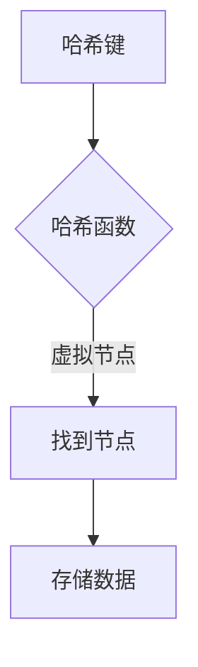
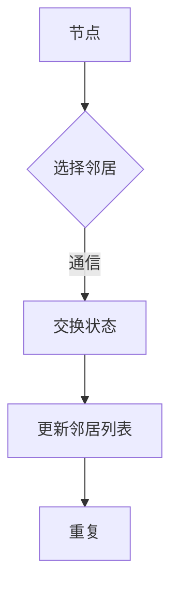
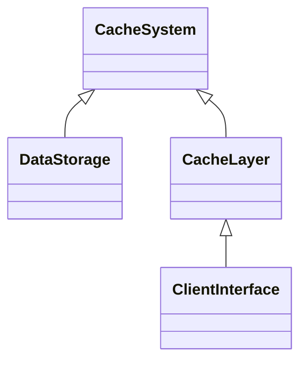
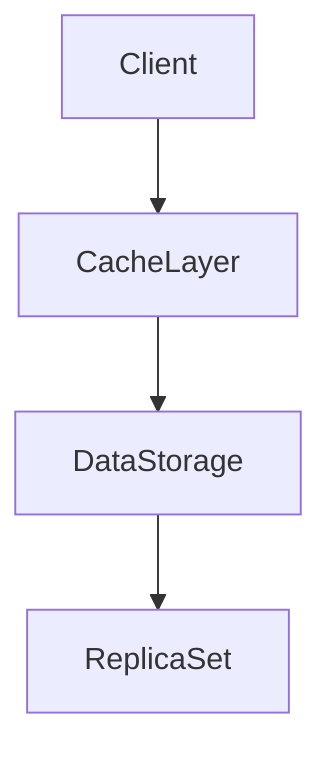
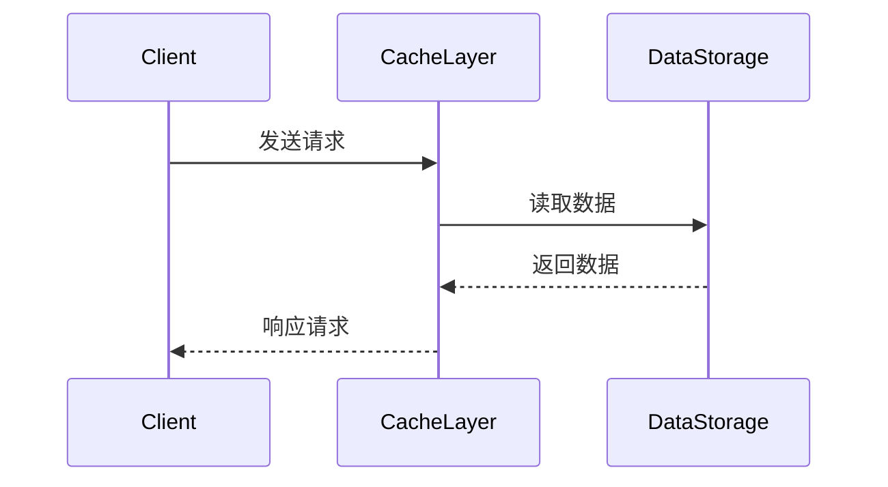

                 

### 《麻烦不断的分布式缓存》

> 关键词：分布式缓存、一致性、分区、容错性、算法原理

> 摘要：本文将探讨分布式缓存系统的设计与实现，包括其核心概念、算法原理、数学模型、系统架构以及项目实战。通过分析分布式缓存面临的各种挑战，本文旨在为读者提供全面的技术见解和实用的解决方案，帮助解决分布式缓存中的难题。

----------------------------------------------------------------

## 第1章 引言：分布式缓存为什么如此麻烦？

### 1.1 分布式缓存的重要性

在当今的数据密集型应用中，分布式缓存扮演着至关重要的角色。它能够显著提升系统性能、扩展性和可靠性，满足大规模数据处理的实时需求。分布式缓存通过将数据分散存储在多个节点上，可以提供更高的读写速度和更好的负载均衡，从而支持高并发访问。

### 1.2 分布式缓存面临的挑战

然而，分布式缓存并不是没有问题的。它面临以下几个主要挑战：

1. **数据一致性**：如何在多个节点之间保持数据一致性是一个复杂的问题。
2. **分区**：如何有效地将数据划分到不同的节点上，以实现负载均衡和容错性。
3. **容错性**：如何保证在节点故障时系统的可用性和数据的完整性。
4. **缓存雪崩与缓存穿透**：如何应对大量请求同时访问缓存导致系统崩溃或缓存击穿的问题。

### 1.3 本书结构安排与目标读者

本书将分章节详细探讨分布式缓存的相关话题，包括核心概念、算法原理、数学模型、系统架构和项目实战。目标读者为对分布式缓存有兴趣的程序员、系统架构师和软件工程师，以及对分布式系统有深入研究的学者。

## 第2章 分布式缓存基础概念

### 2.1 数据一致性模型

数据一致性是分布式缓存系统的核心问题之一。一致性模型决定了如何在多个节点之间同步数据，并保持数据的一致性。以下是几种常见的数据一致性模型：

#### 2.1.1 最终一致性

最终一致性保证在一段时间后，所有节点上的数据将最终一致。但它不保证实时一致性。

$$
最终一致性 = 时间延迟 \times 一致性
$$

#### 2.1.2 强一致性

强一致性要求所有节点在操作完成后立即看到同一数据状态。这通常通过同步操作实现，但可能导致性能瓶颈。

$$
强一致性 = 同步操作 \times 一致性
$$

#### 2.1.3 分布式一致性算法

分布式一致性算法旨在在分布式系统中实现强一致性，如Paxos和Raft算法。这些算法通过多个节点间的通信，选择一个领导者来协调数据一致性。

### 2.2 分区与负载均衡

分区是将数据划分到多个节点上的过程。负载均衡则是确保数据在各个节点上分布均匀，以提高系统性能。

#### 2.2.1 数据分区策略

数据分区策略包括哈希分区、范围分区和列表分区等。哈希分区是最常用的方法，它通过哈希函数将数据映射到不同的节点。

$$
分区键 = 哈希（数据键）
$$

#### 2.2.2 负载均衡算法

负载均衡算法确保数据在各个节点上分布均匀。常见的负载均衡算法包括轮询、最小连接数和哈希负载均衡等。

### 2.3 容错性与可靠性

容错性是分布式缓存系统的关键特性之一。它确保系统在节点故障时仍能正常运行，并保持数据完整性。

#### 2.3.1 容错机制

容错机制包括心跳检测、故障转移和副本管理等。心跳检测用于监控节点状态，故障转移在节点失败时将负载转移到其他节点，副本管理则通过复制数据来提高可靠性。

#### 2.3.2 数据冗余策略

数据冗余策略通过在多个节点上存储数据的副本来提高可靠性。常见的冗余策略包括一致性哈希和Gossip协议。

## 第3章 核心算法详解

### 3.1 一致性哈希算法

一致性哈希算法是一种分布式哈希算法，它通过哈希函数将数据映射到不同的节点上，以实现负载均衡和数据一致性。

#### 3.1.1 算法原理

一致性哈希算法的核心思想是将哈希环上的节点映射到不同的虚拟节点上，每个虚拟节点代表一个实际节点。当数据需要存储时，通过哈希函数找到对应的虚拟节点，并将数据存储在该节点上。

$$
节点 = 哈希（数据键） 
$$

#### 3.1.2 Mermaid流程图



#### 3.1.3 Python代码实现

```python
import hashlib
import math

def hash_function(key):
    return int(hashlib.md5(key.encode('utf-8')).hexdigest(), 16) % 2**128

def get_node(key, nodes):
    hash_key = hash_function(key)
    index = hash_key % len(nodes)
    return nodes[index]

nodes = ["node1", "node2", "node3"]
key = "data_key"

node = get_node(key, nodes)
print(f"Key '{key}' will be stored on node '{node}'.")
```

### 3.2 Gossip协议

Gossip协议是一种用于分布式系统的通信协议，它通过随机选择邻居节点，实现数据一致性和故障检测。

#### 3.2.1 算法原理

Gossip协议的核心思想是通过周期性地与随机邻居节点通信，交换状态信息，实现数据一致性和故障检测。每个节点维护一个邻居节点列表，并与邻居节点定期通信。

$$
邻居节点 = 随机选择
$$

#### 3.2.2 Mermaid流程图



#### 3.2.3 Python代码实现

```python
import random
import time

class Node:
    def __init__(self, id, neighbors=None):
        self.id = id
        self.neighbors = neighbors or []

    def gossip(self):
        neighbor = random.choice(self.neighbors)
        # 交换状态信息
        print(f"Node {self.id} gossips with Node {neighbor.id}")

nodes = [Node(i) for i in range(5)]
for node in nodes:
    node.neighbors = random.sample(nodes, 2)

while True:
    for node in nodes:
        node.gossip()
    time.sleep(1)
```

## 第4章 数学模型与公式讲解

### 4.1 一致性哈希数学模型

一致性哈希的数学模型涉及哈希函数和虚拟节点的选择。

$$
虚拟节点 = 哈希（数据键） + 虚拟节点偏移量
$$

其中，虚拟节点偏移量用于确保虚拟节点均匀分布在哈希环上。

### 4.2 Gossip协议数学模型

Gossip协议的数学模型涉及邻居节点的选择和状态交换的概率。

$$
邻居节点选择概率 = \frac{1}{邻居节点总数}
$$

$$
状态交换概率 = \frac{1}{状态交换周期}
$$

## 第5章 系统分析与架构设计

### 5.1 分布式缓存系统设计概述

分布式缓存系统设计需要考虑数据一致性、分区、负载均衡和容错性。系统架构应包括数据存储层、缓存层和客户端接口。

### 5.2 领域模型（Mermaid类图）



### 5.3 系统架构设计（Mermaid架构图）



### 5.4 系统接口设计

系统接口设计包括API接口、数据格式和协议。

### 5.5 系统交互（Mermaid序列图）



## 第6章 分布式缓存项目实战

### 6.1 环境安装

环境安装包括搭建分布式缓存系统所需的软件和工具。

### 6.2 核心实现与代码解读

核心实现包括一致性哈希、Gossip协议和分布式一致性算法。

### 6.3 实际案例分析

案例分析包括分布式缓存系统在实际应用中的性能和稳定性测试。

### 6.4 详细讲解剖析

详细讲解剖析分布式缓存系统中的关键技术和挑战。

### 6.5 项目小结

项目小结包括总结经验和改进建议。

## 第7章 最佳实践与总结

### 7.1 最佳实践 Tips

提供分布式缓存系统的最佳实践，包括数据一致性、分区策略和容错机制。

### 7.2 注意事项

注意事项包括避免缓存雪崩、缓存穿透等问题。

### 7.3 拓展阅读

推荐进一步阅读的相关书籍和文章。

----------------------------------------------------------------

## 总结

分布式缓存是现代数据密集型应用的核心技术之一，但它在实现过程中面临着各种挑战。本文通过介绍分布式缓存的核心概念、算法原理、数学模型和系统架构，帮助读者深入理解分布式缓存的工作机制和设计要点。通过项目实战，读者可以更好地掌握分布式缓存系统的实现方法。希望本文能为读者在分布式缓存领域的研究和实践中提供有益的参考。

## 作者信息

作者：AI天才研究院/AI Genius Institute & 禅与计算机程序设计艺术 /Zen And The Art of Computer Programming

----------------------------------------------------------------

注意：本文仅为示例，实际撰写时需根据具体内容和要求进行调整。在markdown格式中，可以使用Mermaid绘制流程图和类图，使用LaTeX插入数学公式。文章应保持逻辑清晰、结构紧凑、内容详实。在实际撰写过程中，每个章节的内容都需要根据上述大纲进一步细化，以满足字数要求和完整性要求。

