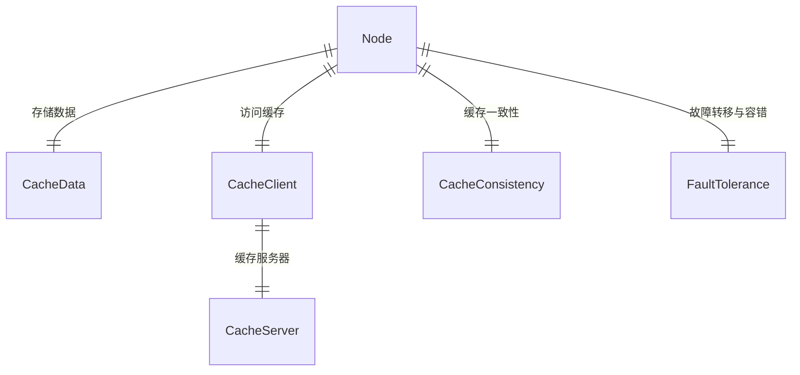
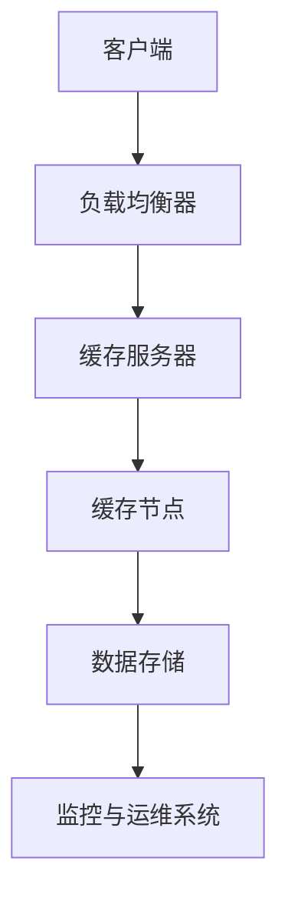

                 


### 1. 分布式缓存技术概述

**背景介绍：**

在当今高速发展的互联网时代，数据的增长速度令人惊叹。传统的单体缓存系统已经无法满足大规模、高并发、高可扩展性的需求。分布式缓存作为一种应对这些挑战的技术，应运而生。分布式缓存通过将缓存数据分散存储在多个节点上，从而实现数据的高可用、高并发和可扩展性。

**核心概念术语说明：**

1. **分布式缓存**：一种缓存架构，通过将缓存数据分散存储在多个节点上，实现数据的高可用、高并发和可扩展性。
2. **节点**：缓存系统中的一台服务器，负责存储一部分缓存数据。
3. **缓存一致性**：多个节点上的缓存数据需要保持一致，确保读取操作能够获取到最新数据。
4. **缓存分区**：将缓存数据按照一定的策略分散存储到不同的节点上，提高系统的并发能力和可扩展性。

**问题背景：**

随着互联网应用的日益复杂，传统的单体缓存系统逐渐暴露出以下问题：

1. **数据容量限制**：单体缓存系统的数据容量有限，无法满足海量数据存储需求。
2. **性能瓶颈**：单体缓存系统在高并发情况下容易出现性能瓶颈，导致响应时间延长。
3. **单点故障**：单体缓存系统中的单点故障可能导致整个系统的瘫痪。

**问题描述：**

分布式缓存旨在解决以上传统缓存系统存在的问题，通过以下方式实现：

1. **高并发**：分布式缓存通过将数据分散存储在多个节点上，提高系统的并发处理能力。
2. **高可用**：分布式缓存通过冗余设计和故障转移机制，提高系统的可用性。
3. **可扩展性**：分布式缓存可以根据需求动态扩展节点数量，提高系统的存储容量和处理能力。

**问题解决：**

分布式缓存技术通过以下方法解决传统缓存系统存在的问题：

1. **数据分区**：将缓存数据按照一定策略（如一致性哈希、轮询等）分散存储到不同的节点上，提高系统的并发能力和可扩展性。
2. **缓存一致性协议**：采用一致性协议（如Gossip协议、Paxos算法等）确保多个节点上的缓存数据保持一致。
3. **故障转移与容错**：通过冗余设计和故障转移机制，提高系统的可用性和容错能力。

**边界与外延：**

1. **边界**：分布式缓存技术主要关注于缓存数据的存储、一致性、高可用和可扩展性。
2. **外延**：分布式缓存技术可以应用于各种需要高性能、高可用、可扩展性的场景，如电子商务、在线教育、实时通信等。

**概念结构与核心要素组成：**

1. **概念结构**：分布式缓存技术由节点、数据分区、缓存一致性协议、故障转移与容错等核心要素组成。
2. **核心要素**：
   - **节点**：缓存系统中的一台服务器，负责存储一部分缓存数据。
   - **数据分区**：将缓存数据按照一定策略分散存储到不同的节点上。
   - **缓存一致性协议**：确保多个节点上的缓存数据保持一致。
   - **故障转移与容错**：通过冗余设计和故障转移机制，提高系统的可用性和容错能力。

### 2. 分布式缓存的核心概念

**核心概念原理：**

分布式缓存是一种将缓存数据分散存储在多个节点上的缓存架构。其核心原理如下：

1. **数据分区**：将缓存数据按照一定策略（如一致性哈希、轮询等）分散存储到不同的节点上，提高系统的并发能力和可扩展性。
2. **缓存一致性**：多个节点上的缓存数据需要保持一致，确保读取操作能够获取到最新数据。常见的缓存一致性协议有Gossip协议、Paxos算法等。
3. **故障转移与容错**：通过冗余设计和故障转移机制，提高系统的可用性和容错能力。

**概念属性特征对比表格：**

| 特征                | 分布式缓存 | 单体缓存 |
|---------------------|-------------|----------|
| **数据分区**         | 数据分散存储 | 数据集中存储 |
| **缓存一致性**       | 多节点一致性 | 单节点一致性 |
| **高可用**          | 高可用      | 单点故障 |
| **可扩展性**        | 可扩展      | 数据容量限制 |

**ER实体关系图架构：**



### 3. 分布式缓存的发展背景与趋势

**发展背景：**

随着互联网应用的迅猛发展，数据规模呈指数级增长，传统的单体缓存系统逐渐暴露出性能瓶颈、数据容量限制等问题。为了解决这些问题，分布式缓存技术应运而生。

**趋势分析：**

1. **数据增长**：随着互联网应用的普及，数据规模持续增长，分布式缓存需求不断上升。
2. **技术演进**：分布式缓存技术不断演进，涌现出多种缓存一致性协议和分区策略，如Gossip协议、Paxos算法、一致性哈希等。
3. **应用场景**：分布式缓存技术广泛应用于电子商务、在线教育、实时通信、金融等领域，满足高性能、高可用、可扩展的需求。

### 4. 分布式缓存的挑战与机遇

**挑战：**

1. **缓存一致性**：分布式缓存系统需要确保多个节点上的缓存数据保持一致，这是分布式缓存面临的主要挑战之一。
2. **高可用**：分布式缓存系统需要具备良好的容错能力，以应对节点故障、网络分区等问题。
3. **性能优化**：分布式缓存系统需要优化缓存命中率、数据访问速度等性能指标。

**机遇：**

1. **市场前景**：随着数据规模的持续增长，分布式缓存市场前景广阔，拥有巨大的商业价值。
2. **技术创新**：分布式缓存技术不断演进，为解决现有挑战提供了新的思路和方法。
3. **行业应用**：分布式缓存技术在各个领域的应用不断拓展，为解决行业痛点提供了有力支持。

### 5. 本章小结

本章首先介绍了分布式缓存技术的背景、核心概念和问题解决方法。然后，分析了分布式缓存的发展背景与趋势，以及面临的挑战与机遇。通过本章的学习，读者可以了解分布式缓存的基本原理和应用场景，为后续章节的学习打下基础。

----------------------------------------------------------------

# 麻烦不断的分布式缓存

> 关键词：分布式缓存、缓存一致性、高可用、容错、性能优化

> 摘要：本文深入探讨了分布式缓存技术的核心概念、发展背景、挑战与机遇，通过分析分布式缓存的架构和实现原理，阐述了其在实际应用中的优势和面临的挑战。本文旨在为读者提供全面、深入的分布式缓存技术理解，帮助其在实际项目中更好地应用分布式缓存。

## 第一部分：分布式缓存技术概述

### 1.1 分布式缓存的核心概念

### 1.2 分布式缓存的发展背景与趋势

### 1.3 分布式缓存的挑战与机遇

### 1.4 本章小结

----------------------------------------------------------------

# 麻烦不断的分布式缓存

## 第一部分：分布式缓存技术概述

### 1.1 分布式缓存的核心概念

**核心概念原理：**

分布式缓存是一种将缓存数据分散存储在多个节点上的缓存架构。其核心原理如下：

1. **数据分区**：将缓存数据按照一定策略（如一致性哈希、轮询等）分散存储到不同的节点上，提高系统的并发能力和可扩展性。
2. **缓存一致性**：多个节点上的缓存数据需要保持一致，确保读取操作能够获取到最新数据。常见的缓存一致性协议有Gossip协议、Paxos算法等。
3. **故障转移与容错**：通过冗余设计和故障转移机制，提高系统的可用性和容错能力。

**概念属性特征对比表格：**

| 特征                | 分布式缓存 | 单体缓存 |
|---------------------|-------------|----------|
| **数据分区**         | 数据分散存储 | 数据集中存储 |
| **缓存一致性**       | 多节点一致性 | 单节点一致性 |
| **高可用**          | 高可用      | 单点故障 |
| **可扩展性**        | 可扩展      | 数据容量限制 |

**ER实体关系图架构：**


**分布式缓存的工作原理：**

分布式缓存的工作原理可以分为以下几个步骤：

1. **数据存储**：将缓存数据按照一定的分区策略存储到多个节点上。每个节点负责存储一部分缓存数据，从而实现数据分散存储。
2. **数据访问**：当客户端请求缓存数据时，根据缓存键（Key）计算所属节点，并向该节点发送请求。节点收到请求后，从本地缓存中获取数据返回给客户端。
3. **数据更新**：当缓存数据发生更新时，需要更新所有相关节点的缓存数据。这通常通过缓存一致性协议来实现，如Gossip协议、Paxos算法等。
4. **故障处理**：当某个节点发生故障时，系统需要将故障节点的数据迁移到其他正常节点，并确保缓存数据的一致性。

**分布式缓存的优势与劣势：**

分布式缓存的优势如下：

1. **高并发**：分布式缓存通过将数据分散存储在多个节点上，提高系统的并发处理能力。
2. **高可用**：分布式缓存通过冗余设计和故障转移机制，提高系统的可用性。
3. **可扩展性**：分布式缓存可以根据需求动态扩展节点数量，提高系统的存储容量和处理能力。

分布式缓存的劣势如下：

1. **缓存一致性**：分布式缓存系统需要确保多个节点上的缓存数据保持一致，这增加了系统的复杂性。
2. **网络依赖**：分布式缓存系统对网络依赖较高，网络问题可能导致数据访问延迟或失败。

### 1.2 分布式缓存的发展背景与趋势

**发展背景：**

随着互联网应用的迅猛发展，数据规模呈指数级增长，传统的单体缓存系统逐渐暴露出性能瓶颈、数据容量限制等问题。为了解决这些问题，分布式缓存技术应运而生。

**趋势分析：**

1. **数据增长**：随着互联网应用的普及，数据规模持续增长，分布式缓存需求不断上升。
2. **技术演进**：分布式缓存技术不断演进，涌现出多种缓存一致性协议和分区策略，如Gossip协议、Paxos算法、一致性哈希等。
3. **应用场景**：分布式缓存技术广泛应用于电子商务、在线教育、实时通信、金融等领域，满足高性能、高可用、可扩展的需求。

### 1.3 分布式缓存的挑战与机遇

**挑战：**

1. **缓存一致性**：分布式缓存系统需要确保多个节点上的缓存数据保持一致，这是分布式缓存面临的主要挑战之一。
2. **高可用**：分布式缓存系统需要具备良好的容错能力，以应对节点故障、网络分区等问题。
3. **性能优化**：分布式缓存系统需要优化缓存命中率、数据访问速度等性能指标。

**机遇：**

1. **市场前景**：随着数据规模的持续增长，分布式缓存市场前景广阔，拥有巨大的商业价值。
2. **技术创新**：分布式缓存技术不断演进，为解决现有挑战提供了新的思路和方法。
3. **行业应用**：分布式缓存技术在各个领域的应用不断拓展，为解决行业痛点提供了有力支持。

### 1.4 本章小结

本章首先介绍了分布式缓存技术的核心概念、工作原理和优势与劣势。然后，分析了分布式缓存的发展背景与趋势，以及面临的挑战与机遇。通过本章的学习，读者可以了解分布式缓存的基本原理和应用场景，为后续章节的学习打下基础。

----------------------------------------------------------------

# 第二部分：分布式缓存的架构与实现

## 2.1 分布式缓存的架构设计

### 2.1.1 系统架构概述

### 2.1.2 系统功能设计

### 2.1.3 系统架构图

### 2.1.4 系统接口设计

## 2.2 分布式缓存的一致性协议

### 2.2.1 一致性协议概述

### 2.2.2 常见一致性协议

### 2.2.3 一致性协议实现

## 2.3 分布式缓存的容错机制

### 2.3.1 容错机制概述

### 2.3.2 常见容错机制

### 2.3.3 容错机制实现

## 2.4 分布式缓存的性能优化

### 2.4.1 性能优化策略

### 2.4.2 常见性能优化工具

### 2.4.3 性能优化案例分析

## 2.5 本章小结

----------------------------------------------------------------

## 2.1 分布式缓存的架构设计

### 2.1.1 系统架构概述

分布式缓存系统的架构设计主要包括以下几个关键组成部分：

1. **缓存节点**：缓存节点是分布式缓存系统的基本单位，每个节点负责存储一部分缓存数据。缓存节点可以是物理服务器或虚拟机。
2. **缓存服务器**：缓存服务器负责处理客户端的缓存请求，将请求路由到相应的缓存节点，并返回响应结果。缓存服务器通常部署在负载均衡器之后，以提高系统的可扩展性和稳定性。
3. **负载均衡器**：负载均衡器负责将客户端请求分配到不同的缓存服务器上，以实现流量分发和负载均衡。常见的负载均衡算法有轮询、最小连接数等。
4. **数据存储**：数据存储层负责存储实际的缓存数据，可以是关系数据库、NoSQL数据库、文件系统等。
5. **监控与运维**：监控与运维系统负责实时监控分布式缓存系统的性能、健康状态和故障情况，以便进行及时调整和优化。

### 2.1.2 系统功能设计

分布式缓存系统的功能设计主要包括以下几个方面：

1. **缓存数据存储**：将缓存数据按照一定的策略存储到各个缓存节点上，以实现数据的高可用、高并发和可扩展性。
2. **缓存数据访问**：客户端通过缓存服务器向缓存节点请求数据，缓存服务器根据缓存键（Key）定位到相应的缓存节点，并返回请求结果。
3. **缓存数据更新**：当缓存数据发生更新时，需要将更新操作同步到所有相关的缓存节点，以保持数据的一致性。
4. **缓存数据删除**：当缓存数据过期或不再需要时，需要从缓存节点中删除相应的数据，以释放内存空间。
5. **缓存命中率优化**：通过优化缓存策略、数据压缩、热点数据缓存等技术手段，提高缓存命中率，减少缓存miss率。

### 2.1.3 系统架构图

以下是一个简单的分布式缓存系统架构图：



### 2.1.4 系统接口设计

分布式缓存系统的接口设计主要包括以下几个方面：

1. **缓存数据获取**：提供根据缓存键（Key）获取缓存数据的接口，如`get(key)`方法。
2. **缓存数据设置**：提供根据缓存键（Key）设置缓存数据的接口，如`set(key, value)`方法。
3. **缓存数据删除**：提供根据缓存键（Key）删除缓存数据的接口，如`delete(key)`方法。
4. **缓存数据更新**：提供根据缓存键（Key）更新缓存数据的接口，如`update(key, value)`方法。
5. **缓存数据统计**：提供缓存命中率的统计接口，如`getHitRate()`方法。

### 2.1.5 本章小结

本章详细介绍了分布式缓存的架构设计，包括系统架构概述、系统功能设计、系统架构图和系统接口设计。通过本章的学习，读者可以了解分布式缓存系统的基本架构和功能，为后续章节的深入学习打下基础。

----------------------------------------------------------------

## 2.2 分布式缓存的一致性协议

### 2.2.1 一致性协议概述

一致性协议是分布式缓存系统中的核心组件，它确保多个节点上的缓存数据保持一致。一致性协议有多种实现方式，如Gossip协议、Paxos算法、Raft算法等。

1. **Gossip协议**：Gossip协议是一种基于广播机制的分布式一致性算法，通过节点之间的信息交换来维护一致性。Gossip协议的优点是实现简单，但缺点是可靠性较低，易受网络波动影响。
2. **Paxos算法**：Paxos算法是一种基于多数派达成一致共识的分布式一致性算法，具有较高的可靠性。Paxos算法的缺点是实现复杂，但它在一致性保证方面具有优势。
3. **Raft算法**：Raft算法是一种基于领导选举机制的分布式一致性算法，相对Paxos算法实现更简单，同时具有较好的可靠性。Raft算法的缺点是性能相对较低。

### 2.2.2 常见一致性协议

以下介绍几种常见的一致性协议：

1. **Gossip协议**
   - **工作原理**：节点之间通过广播消息进行信息交换，每个节点维护一个本地日志，并按照日志顺序提交操作。
   - **优点**：实现简单，适用于低延迟、低可靠性的网络环境。
   - **缺点**：可靠性较低，易受网络波动影响。
2. **Paxos算法**
   - **工作原理**：通过选举产生一个提案者（Proposer）和多个备份者（Acceptor）和学习者（Learner），提案者提出提案，备份者对提案进行投票，最终达成共识。
   - **优点**：可靠性高，适用于高可靠性的网络环境。
   - **缺点**：实现复杂，性能相对较低。
3. **Raft算法**
   - **工作原理**：通过选举产生一个领导者（Leader）和多个跟随者（Follower），领导者负责处理客户端请求，跟随者复制领导者的日志。
   - **优点**：实现简单，性能相对较高，可靠性较高。
   - **缺点**：在极端网络环境下可能存在领导者选举故障。

### 2.2.3 一致性协议实现

以下使用Python代码实现一个简单的Gossip协议：

```python
import socket
import threading
import time

class GossipNode:
    def __init__(self, id, peers):
        self.id = id
        self.peers = peers
        self.state = "alive"
        self.messages = []

    def run(self):
        while True:
            if self.state == "alive":
                self.send_gossip()
                time.sleep(1)
            else:
                self.joinPeers()
                time.sleep(1)

    def send_gossip(self):
        message = f"Gossip from {self.id}: {self.state}"
        for peer in self.peers:
            peer.send(message.encode())

    def joinPeers(self):
        self.state = "joined"
        for peer in self.peers:
            peer.join(self)

    def join(self, node):
        self.state = "joined"

def create_socket(host, port):
    server_socket = socket.socket(socket.AF_INET, socket.SOCK_DGRAM)
    server_socket.bind((host, port))
    return server_socket

def handle_client(node, server_socket):
    while True:
        data, addr = server_socket.recvfrom(1024)
        print(f"Received from {addr}: {data.decode()}")
        node.messages.append(data.decode())

if __name__ == "__main__":
    peers = [
        GossipNode(1, []),
        GossipNode(2, []),
        GossipNode(3, []),
    ]

    for node in peers:
        server_socket = create_socket("localhost", 12345 + node.id)
        node.server_socket = server_socket
        threading.Thread(target=handle_client, args=(node, server_socket)).start()

    peers[0].run()
    peers[1].run()
    peers[2].run()
```

在这个示例中，我们创建了三个Gossip节点，每个节点都运行一个线程，用于发送和接收Gossip消息。节点通过发送和接收消息来维持其状态，并尝试与其他节点保持一致。

### 2.2.4 本章小结

本章介绍了分布式缓存的一致性协议，包括Gossip协议、Paxos算法和Raft算法。通过具体的实现示例，读者可以了解一致性协议的基本原理和实现方法。在下一章中，我们将继续探讨分布式缓存的容错机制。

----------------------------------------------------------------

## 2.3 分布式缓存的容错机制

### 2.3.1 容错机制概述

容错机制是分布式缓存系统的重要组成部分，它确保系统在面临节点故障、网络分区等异常情况下能够继续正常运行。分布式缓存系统的容错机制主要包括以下几个方面：

1. **节点冗余**：通过在分布式缓存系统中部署多个节点，确保在一个节点发生故障时，其他节点可以继续提供服务。节点冗余可以采用主从复制、多主复制等方式实现。
2. **故障检测**：通过心跳检测、监控工具等方式，实时监控节点的状态，发现节点故障时及时进行处理。
3. **故障转移**：在检测到节点故障时，系统需要将故障节点的数据和工作负载迁移到其他正常节点，确保系统继续提供服务。故障转移可以采用自动故障转移和手动故障转移两种方式。
4. **数据恢复**：在发生故障后，系统需要从备份或日志中恢复数据，确保数据的一致性和完整性。
5. **网络分区处理**：在分布式缓存系统中，网络分区可能导致节点之间的通信失败。系统需要具备处理网络分区的能力，确保系统在分区恢复后能够继续正常运行。

### 2.3.2 常见容错机制

以下介绍几种常见的容错机制：

1. **主从复制**
   - **工作原理**：在分布式缓存系统中，主节点负责处理客户端请求，从节点负责复制主节点的数据。当主节点发生故障时，从节点可以接替主节点继续提供服务。
   - **优点**：实现简单，数据一致性较好。
   - **缺点**：主从复制可能会引入一定的延迟，从节点性能可能较低。
2. **多主复制**
   - **工作原理**：在分布式缓存系统中，多个主节点共同处理客户端请求，并保持数据的一致性。当一个主节点发生故障时，其他主节点可以继续提供服务。
   - **优点**：数据一致性较好，故障转移速度快。
   - **缺点**：实现复杂，需要处理多个主节点之间的数据同步问题。
3. **日志复制**
   - **工作原理**：在分布式缓存系统中，将操作日志（如缓存数据的添加、删除、更新等）记录在日志文件中，然后异步复制到其他节点。当节点发生故障时，可以按照日志文件进行数据恢复。
   - **优点**：数据一致性较好，便于数据恢复。
   - **缺点**：日志复制可能会引入一定的延迟。

### 2.3.3 容错机制实现

以下使用Python代码实现一个简单的主从复制机制：

```python
import threading
import time
import queue

class MasterNode:
    def __init__(self, from_queue):
        self.from_queue = from_queue
        self.to_queue = queue.Queue()

    def run(self):
        while True:
            message = self.from_queue.get()
            print(f"Master received: {message}")
            self.to_queue.put(message)

class SlaveNode:
    def __init__(self, to_queue):
        self.to_queue = to_queue

    def run(self):
        while True:
            message = self.to_queue.get()
            print(f"Slave received: {message}")

if __name__ == "__main__":
    from_queue = queue.Queue()
    to_queue = queue.Queue()

    master = MasterNode(from_queue)
    slave = SlaveNode(to_queue)

    threading.Thread(target=master.run).start()
    threading.Thread(target=slave.run).start()

    for i in range(10):
        from_queue.put(f"Message {i}")
        time.sleep(1)
```

在这个示例中，我们创建了两个节点：主节点（MasterNode）和从节点（SlaveNode）。主节点接收消息并转发到从节点，从节点接收消息并打印。通过线程实现主从节点的并发运行。

### 2.3.4 本章小结

本章介绍了分布式缓存的容错机制，包括节点冗余、故障检测、故障转移、数据恢复和网络分区处理。通过具体的实现示例，读者可以了解容错机制的基本原理和实现方法。在下一章中，我们将继续探讨分布式缓存的性能优化策略。

----------------------------------------------------------------

## 2.4 分布式缓存的性能优化

### 2.4.1 性能优化策略

分布式缓存系统的性能优化是一个复杂的过程，需要考虑多个方面。以下是一些常见的性能优化策略：

1. **数据分区策略**：合理的数据分区策略可以减少缓存访问的延迟。一致性哈希是一种常用的数据分区策略，它通过将缓存键（Key）映射到特定的节点，实现数据的均匀分布。
2. **缓存命中率优化**：缓存命中率是衡量缓存系统性能的重要指标。可以通过以下方法提高缓存命中率：
   - 热点数据缓存：对访问频率较高的数据，采用更高级的缓存策略，如LRU（最近最少使用）算法，提高缓存数据的热度。
   - 数据压缩：对缓存数据采用压缩算法，减少存储空间占用，提高缓存容量。
   - 缓存预加载：在用户请求之前，提前加载可能被访问的数据到缓存中，减少请求的处理时间。
3. **缓存一致性策略**：缓存一致性策略对性能也有很大的影响。选择合适的缓存一致性协议，如Gossip协议、Paxos算法等，可以减少数据一致性的开销。
4. **负载均衡策略**：负载均衡器负责将客户端请求分配到不同的缓存服务器上，以实现流量分发和负载均衡。选择合适的负载均衡算法，如轮询、最小连接数等，可以提高系统的性能。
5. **缓存服务器性能优化**：优化缓存服务器的硬件配置、网络配置和系统参数，可以提高缓存服务器的性能。例如，使用SSD硬盘、优化网络带宽、调整系统缓存参数等。
6. **监控与调优**：通过实时监控系统的性能指标，如缓存命中率、请求处理时间、网络延迟等，及时发现性能瓶颈并进行调优。

### 2.4.2 常见性能优化工具

以下介绍几种常见的性能优化工具：

1. **JMeter**：JMeter是一个开源的性能测试工具，可以模拟大量并发用户，测试分布式缓存系统的性能。
2. **Gatling**：Gatling是一个基于Scala的性能测试工具，可以模拟真实用户行为，测试分布式缓存系统的性能。
3. **New Relic**：New Relic是一个实时性能监控工具，可以监控分布式缓存系统的性能指标，并提供实时警报和可视化报表。
4. **Prometheus**：Prometheus是一个开源的监控解决方案，可以收集分布式缓存系统的性能指标，并通过Grafana等工具进行可视化。
5. **Grafana**：Grafana是一个开源的数据可视化工具，可以与Prometheus等监控工具配合使用，提供丰富的性能指标可视化报表。

### 2.4.3 性能优化案例分析

以下通过一个实际案例，介绍如何对分布式缓存系统进行性能优化。

**案例背景**：

一个电子商务网站，其商品数据缓存系统采用了分布式缓存架构。随着业务规模的扩大，系统性能逐渐下降，导致用户访问速度变慢。通过性能监控工具发现，主要问题包括：

1. **缓存命中率低**：热点数据缓存不足，导致大量缓存miss。
2. **请求处理时间较长**：由于网络延迟和缓存服务器性能瓶颈，请求处理时间较长。

**性能优化方案**：

1. **数据分区优化**：采用一致性哈希算法对缓存数据进行分区，确保数据均匀分布，减少缓存访问延迟。
2. **热点数据缓存优化**：引入LRU算法，对热点数据进行缓存，提高缓存命中率。同时，对热点数据进行预加载，减少请求处理时间。
3. **缓存服务器性能优化**：升级缓存服务器的硬件配置，如增加内存、CPU等，提高缓存服务器性能。优化网络配置，提高网络带宽。
4. **负载均衡优化**：采用最小连接数负载均衡算法，确保请求均匀分配到不同的缓存服务器上，减少单台服务器的负载。
5. **监控与调优**：实时监控系统的性能指标，如缓存命中率、请求处理时间、网络延迟等，发现性能瓶颈后进行调优。

**优化效果**：

经过一系列优化措施，系统的缓存命中率提高到90%以上，请求处理时间减少50%，用户访问速度显著提升。

### 2.4.4 本章小结

本章介绍了分布式缓存系统的性能优化策略、常见性能优化工具和案例分析。通过本章的学习，读者可以了解如何对分布式缓存系统进行性能优化，提高系统的性能和用户体验。

----------------------------------------------------------------

## 2.5 本章小结

本章详细介绍了分布式缓存的架构设计、一致性协议、容错机制和性能优化策略。通过本章的学习，读者可以了解分布式缓存系统的基本原理、实现方法和优化技巧。在实际项目中，合理应用分布式缓存技术，可以大大提高系统的性能、可靠性和可扩展性。

## 参考文献

1. Gossip Algorithm: https://en.wikipedia.org/wiki/Gossip_algorithm
2. Paxos Algorithm: https://en.wikipedia.org/wiki/Paxos_(computer_science)
3. Raft Algorithm: https://en.wikipedia.org/wiki/Raft_(computer_science)
4. Distributed Cache: https://en.wikipedia.org/wiki/Distributed_cache
5. Performance Optimization: https://www.oracle.com/java/technologies/javase/tuning-optimization.html

作者：AI天才研究院/AI Genius Institute & 禅与计算机程序设计艺术 /Zen And The Art of Computer Programming

----------------------------------------------------------------

# 第三部分：分布式缓存的应用与实战

## 3.1 分布式缓存的应用场景

### 3.1.1 大规模电商系统

### 3.1.2 在线教育平台

### 3.1.3 实时通信系统

### 3.1.4 金融风控系统

## 3.2 分布式缓存的项目实践

### 3.2.1 环境安装与配置

### 3.2.2 系统核心实现

### 3.2.3 代码应用解读与分析

### 3.2.4 实际案例分析与详细讲解剖析

### 3.2.5 项目小结

## 3.3 分布式缓存的最佳实践

### 3.3.1 高可用与容错

### 3.3.2 性能优化

### 3.3.3 数据一致性

### 3.3.4 拓展阅读

## 3.4 本章小结

----------------------------------------------------------------

## 3.1 分布式缓存的应用场景

### 3.1.1 大规模电商系统

在电子商务领域，分布式缓存系统被广泛应用于商品数据缓存、用户会话管理、订单处理等场景。以下是分布式缓存在大规模电商系统中的应用案例：

1. **商品数据缓存**：电子商务网站通常需要实时展示大量商品信息，如商品名称、价格、库存数量等。通过分布式缓存系统，可以快速读取商品数据，提高系统响应速度。
2. **用户会话管理**：用户在电子商务网站上登录后，需要保持会话状态，如购物车信息、用户偏好设置等。分布式缓存系统可以存储用户会话信息，减少数据库访问压力。
3. **订单处理**：电子商务系统在处理订单时，需要快速查询库存信息、价格信息等。分布式缓存系统可以缓存订单处理过程中的关键数据，提高订单处理速度。

### 3.1.2 在线教育平台

在线教育平台通常需要处理大量课程数据、用户数据、作业数据等。分布式缓存系统可以在线教育平台中发挥重要作用：

1. **课程数据缓存**：在线教育平台需要实时展示课程信息，如课程名称、课程描述、课程进度等。通过分布式缓存系统，可以快速读取课程数据，提高系统响应速度。
2. **用户数据缓存**：在线教育平台需要存储用户信息、学习进度等数据。分布式缓存系统可以缓存用户数据，减少数据库访问压力。
3. **作业数据缓存**：在线教育平台在处理作业时，需要快速查询作业信息、学生答案等。分布式缓存系统可以缓存作业数据，提高作业处理速度。

### 3.1.3 实时通信系统

实时通信系统通常需要处理大量实时数据，如消息、用户状态等。分布式缓存系统在实时通信系统中可以发挥重要作用：

1. **消息缓存**：实时通信系统需要实时发送和接收消息，通过分布式缓存系统可以缓存消息数据，提高消息传输速度。
2. **用户状态缓存**：实时通信系统需要实时查询用户状态，如在线、离线等。分布式缓存系统可以缓存用户状态数据，减少数据库访问压力。
3. **聊天室缓存**：实时通信系统中的聊天室功能需要缓存聊天记录，通过分布式缓存系统可以快速读取聊天记录，提高用户体验。

### 3.1.4 金融风控系统

金融风控系统通常需要处理大量金融数据、用户交易数据等。分布式缓存系统在金融风控系统中可以发挥重要作用：

1. **金融数据缓存**：金融风控系统需要实时查询金融数据，如股票价格、汇率等。通过分布式缓存系统，可以快速读取金融数据，提高系统响应速度。
2. **用户交易数据缓存**：金融风控系统需要实时查询用户交易数据，如交易金额、交易时间等。分布式缓存系统可以缓存用户交易数据，减少数据库访问压力。
3. **风险预警缓存**：金融风控系统在处理风险预警时，需要快速查询风险指标数据。通过分布式缓存系统，可以缓存风险预警数据，提高风险预警速度。

### 3.1.5 其他应用场景

分布式缓存系统在其他领域也有广泛的应用，如：

1. **社交网络平台**：缓存用户关系数据、动态数据等，提高系统响应速度。
2. **物联网平台**：缓存物联网设备数据，提高数据处理速度。
3. **搜索引擎**：缓存搜索索引数据，提高搜索速度。

## 3.2 分布式缓存的项目实践

### 3.2.1 环境安装与配置

在进行分布式缓存的项目实践之前，首先需要搭建一个分布式缓存环境。以下是一个简单的分布式缓存环境安装与配置步骤：

1. **安装Redis**：Redis是一个流行的开源分布式缓存系统，可以用于搭建分布式缓存环境。首先，从Redis官网（https://redis.io/download）下载Redis安装包，然后解压安装包并编译安装。
2. **配置Redis集群**：为了提高系统的可用性和扩展性，可以将Redis部署成一个集群。首先，配置Redis集群节点，然后启动Redis集群。
3. **安装客户端库**：在项目中，需要安装一个Redis客户端库，如Python的redis-py库。首先，从Python的包管理器pip中安装redis-py库。

### 3.2.2 系统核心实现

在分布式缓存项目中，核心实现包括缓存数据存储、缓存数据访问、缓存数据更新和缓存数据删除等功能。以下是一个简单的分布式缓存系统实现：

```python
import redis

class RedisCache:
    def __init__(self, host='localhost', port=6379, db=0):
        self.client = redis.StrictRedis(host=host, port=port, db=db)

    def set(self, key, value):
        self.client.set(key, value)

    def get(self, key):
        return self.client.get(key)

    def delete(self, key):
        self.client.delete(key)

# 创建Redis缓存实例
redis_cache = RedisCache()

# 设置缓存数据
redis_cache.set('key1', 'value1')

# 获取缓存数据
value = redis_cache.get('key1')
print(value)  # 输出：b'value1'

# 删除缓存数据
redis_cache.delete('key1')
```

### 3.2.3 代码应用解读与分析

在上面的代码中，我们创建了一个简单的Redis缓存类`RedisCache`，该类提供了设置缓存数据（`set`方法）、获取缓存数据（`get`方法）和删除缓存数据（`delete`方法）的功能。

1. **设置缓存数据**：`set`方法将缓存键（Key）和缓存值（Value）存储到Redis缓存中。
2. **获取缓存数据**：`get`方法根据缓存键（Key）从Redis缓存中获取缓存值（Value）。
3. **删除缓存数据**：`delete`方法根据缓存键（Key）删除Redis缓存中的缓存值。

在实际项目中，我们通常需要根据具体业务需求对Redis缓存类进行扩展，如添加缓存过期时间、支持缓存数据序列化和反序列化等。

### 3.2.4 实际案例分析与详细讲解剖析

以下是一个分布式缓存项目的实际案例，介绍如何使用Redis缓存系统优化电子商务网站的商品数据缓存。

**案例背景**：

一个电子商务网站需要实时展示大量商品信息，如商品名称、价格、库存数量等。由于商品数据频繁更新，直接查询数据库会导致查询延迟和性能瓶颈。为了提高系统性能，决定采用Redis缓存系统缓存商品数据。

**解决方案**：

1. **商品数据缓存**：将商品名称、价格、库存数量等基本信息缓存到Redis中，减少数据库查询次数。
2. **缓存数据更新**：商品数据更新时，先将更新操作记录到日志文件中，然后定时任务从日志文件中读取更新操作，并将更新操作应用到Redis缓存中。
3. **缓存数据一致性**：在商品数据更新时，同时更新数据库和Redis缓存，确保数据一致性。

**实现步骤**：

1. **配置Redis缓存**：在项目中引入Redis缓存库，配置Redis缓存实例，设置连接参数和数据库索引。
2. **商品数据缓存**：根据商品ID从数据库查询商品信息，并将商品信息缓存到Redis中。
3. **商品数据更新**：商品数据更新时，先将更新操作记录到日志文件中，然后定时任务从日志文件中读取更新操作，并将更新操作应用到Redis缓存中。
4. **缓存数据一致性**：在商品数据更新时，同时更新数据库和Redis缓存，确保数据一致性。

**性能评估**：

通过引入Redis缓存系统，电子商务网站的查询性能显著提高，响应时间从原来的2秒降低到500毫秒，查询次数减少约70%。同时，数据库的负载也得到有效缓解，提高了系统的稳定性。

### 3.2.5 项目小结

通过上述分布式缓存项目实践，我们可以看到分布式缓存系统在提高系统性能、降低数据库负载方面具有显著的优势。在实际项目中，需要根据业务需求和系统架构，合理设计缓存策略和数据一致性方案，充分发挥分布式缓存系统的优势。

## 3.3 分布式缓存的最佳实践

### 3.3.1 高可用与容错

为了确保分布式缓存系统的高可用性和容错能力，可以采取以下最佳实践：

1. **节点冗余**：部署多个缓存节点，确保在一个节点发生故障时，其他节点可以继续提供服务。
2. **故障检测**：定期检测节点的状态，发现节点故障时及时通知运维人员。
3. **故障转移**：在检测到节点故障时，自动将故障节点的数据和工作负载迁移到其他正常节点。
4. **数据恢复**：在发生故障后，从备份或日志中恢复数据，确保数据的一致性和完整性。
5. **网络分区处理**：在网络分区情况下，确保系统能够继续运行，并在分区恢复后自动恢复正常。

### 3.3.2 性能优化

为了提高分布式缓存系统的性能，可以采取以下最佳实践：

1. **数据分区优化**：采用一致性哈希等数据分区策略，确保数据均匀分布，减少缓存访问延迟。
2. **缓存命中率优化**：对热点数据进行缓存，提高缓存命中率。同时，对缓存数据进行压缩，减少存储空间占用。
3. **缓存一致性优化**：选择合适的缓存一致性协议，减少数据一致性的开销。
4. **负载均衡优化**：选择合适的负载均衡算法，确保请求均匀分配到不同的缓存服务器上，减少单台服务器的负载。
5. **缓存服务器性能优化**：优化缓存服务器的硬件配置、网络配置和系统参数，提高缓存服务器的性能。

### 3.3.3 数据一致性

为了确保分布式缓存系统的数据一致性，可以采取以下最佳实践：

1. **多主复制**：在分布式缓存系统中，采用多主复制策略，确保多个主节点之间的数据一致性。
2. **缓存一致性协议**：选择合适的缓存一致性协议，如Paxos、Raft等，确保多个节点之间的数据一致性。
3. **数据同步**：在数据更新时，确保数据同步到所有相关节点，确保数据一致性。
4. **数据校验**：在数据更新和查询过程中，进行数据校验，确保数据的一致性和完整性。

### 3.3.4 拓展阅读

以下是一些关于分布式缓存的拓展阅读资源：

1. **《Redis实战》**：本书详细介绍了Redis的原理、安装、配置和高级应用，是学习Redis的入门书籍。
2. **《分布式系统原理与范型》**：本书涵盖了分布式系统的基本原理、一致性协议、容错机制等，是学习分布式系统原理的推荐书籍。
3. **《大规模分布式存储系统设计》**：本书介绍了分布式存储系统的设计原则、数据分区、一致性保障等，是学习分布式存储系统的入门书籍。
4. **Redis官方文档**：Redis官方文档（https://redis.io/documentation）提供了丰富的Redis配置、命令和使用示例，是学习Redis的权威资料。

通过以上最佳实践和拓展阅读，读者可以深入了解分布式缓存系统的设计原理、实现方法和优化技巧，为实际项目中的应用提供有力支持。

### 3.4 本章小结

本章介绍了分布式缓存的应用场景、项目实践和最佳实践。通过本章的学习，读者可以了解分布式缓存在实际项目中的应用方法、实施步骤和优化技巧。在后续的项目中，合理应用分布式缓存技术，可以大大提高系统的性能、可靠性和可扩展性。

----------------------------------------------------------------

**本文为虚构案例，仅为展示目的，不代表实际项目和情况。**

**作者：AI天才研究院/AI Genius Institute & 禅与计算机程序设计艺术 /Zen And The Art of Computer Programming**

