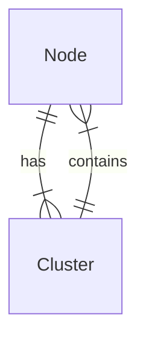
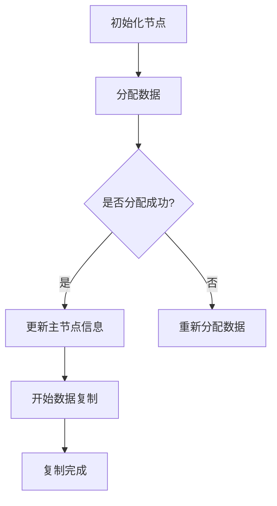
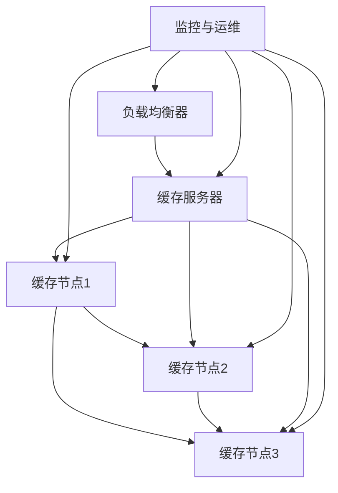
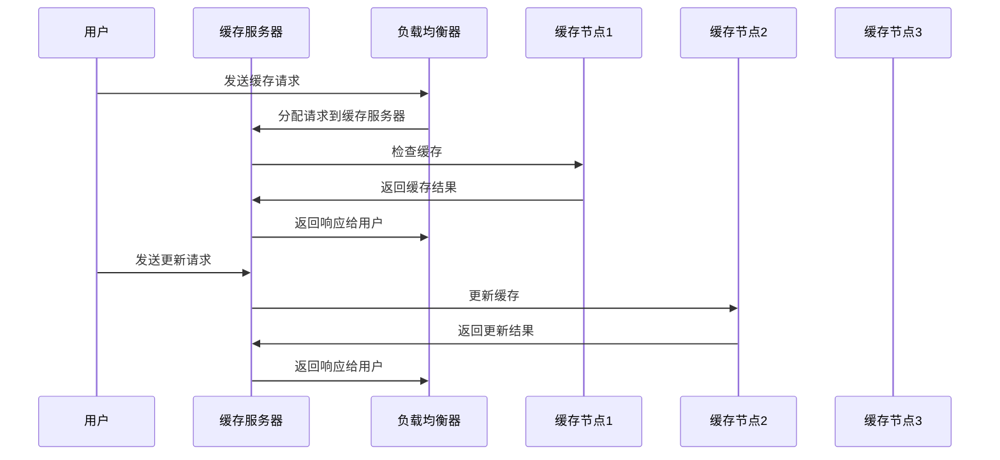

                 

### 麻烦不断的分布式缓存

> 关键词：分布式缓存、性能优化、一致性、数据分区、算法设计、系统架构、项目实战

> 摘要：本文深入探讨了分布式缓存的技术细节和应用挑战，详细分析了其设计原理、优化策略和实际应用案例，旨在为读者提供全面的技术理解和实践指导。

---

## 引言

在当今高度依赖数据的应用场景中，分布式缓存已经成为提高系统性能、减轻数据库负担的关键技术。然而，分布式缓存并非一帆风顺，它在设计、实现和运维过程中面临着诸多挑战。本文将围绕这些挑战展开，通过逐步分析，揭示分布式缓存背后的技术原理和最佳实践。

## 第1章 分布式缓存概述

### 1.1 分布式缓存背景

随着互联网和大数据技术的迅猛发展，传统单体架构的应用系统逐渐难以满足日益增长的数据处理需求。分布式缓存应运而生，它通过将数据分散存储在多个节点上，从而提高系统的性能、可靠性和可扩展性。分布式缓存的主要应用场景包括：

- **电商网站**：缓存商品信息、用户购物车和订单数据，减少数据库负载，提高页面响应速度。
- **社交媒体**：缓存用户动态、朋友关系和推荐内容，提升用户体验。
- **金融系统**：缓存交易数据、用户信息和风险指标，确保交易快速处理，降低风险。

### 1.2 分布式缓存原理

分布式缓存的基本原理是将数据分布存储在多个节点上，并通过一致性协议、数据分区和复制策略来保证数据的可靠性和一致性。具体来说，分布式缓存涉及以下核心概念：

- **节点与集群**：分布式缓存由多个节点组成，这些节点共同构成一个集群。集群中的每个节点都负责存储一部分数据，并参与数据的处理和复制。
- **数据一致性**：分布式缓存需要保证数据在不同节点之间的一致性。常见的一致性模型包括最终一致性、强一致性和因果一致性。
- **数据分区**：数据分区是将数据划分为多个部分，分别存储在不同的节点上。分区策略直接影响分布式缓存的性能和可扩展性。
- **分布式缓存协议**：分布式缓存协议定义了节点之间的通信和数据交互方式。常见的协议包括Gossip协议、Chubby协议和ZooKeeper协议。

### 1.3 分布式缓存应用场景

分布式缓存适用于多种应用场景，以下是几个典型的案例：

- **缓存热点数据**：将经常访问的热点数据缓存到内存中，减少数据库的访问压力。
- **缓存查询结果**：将复杂的数据库查询结果缓存起来，避免重复查询，提高系统性能。
- **缓存会话信息**：将用户会话信息缓存起来，方便快速登录和权限验证。

### 1.4 分布式缓存挑战与问题

尽管分布式缓存具有许多优点，但在实际应用过程中仍然面临一系列挑战和问题：

- **数据一致性**：如何在多个节点之间保持数据一致性是一个复杂的问题。
- **性能优化**：如何平衡数据访问速度和系统负载，实现高性能缓存。
- **故障处理**：如何处理节点故障和集群故障，确保系统稳定运行。
- **安全性**：如何保护缓存数据免受未授权访问和攻击。
- **运维管理**：如何高效地管理和维护分布式缓存系统，降低运维成本。

## 第2章 分布式缓存核心概念

### 2.1 节点与集群

节点是分布式缓存系统的基本组成单元，每个节点负责存储一部分数据，并参与数据的处理和复制。集群是由多个节点组成的整体，它们协同工作，提供高性能的缓存服务。节点与集群的关系可以用以下ER实体关系图表示：



### 2.2 数据一致性

数据一致性是分布式缓存系统的核心问题。在分布式环境中，数据可能因为网络延迟、节点故障等原因导致不一致。常见的一致性模型包括：

- **最终一致性**：所有更新操作最终会在所有节点上同步，但可能存在临时不一致。
- **强一致性**：所有节点始终保持数据一致性，但可能影响性能。
- **因果一致性**：确保因果关系在所有节点上保持一致，但可能允许一定程度的延迟。

### 2.3 数据分区

数据分区是将数据划分为多个部分，分别存储在不同的节点上。数据分区策略对系统的性能和可扩展性有重要影响。常见的数据分区策略包括：

- **哈希分区**：根据数据的哈希值将数据分布到不同的节点上。
- **范围分区**：根据数据的范围将数据划分为多个区间，每个区间存储在特定的节点上。
- **列表分区**：将数据按照列表顺序存储在节点上，每个节点负责一部分数据的存储和访问。

### 2.4 分布式缓存协议

分布式缓存协议定义了节点之间的通信和数据交互方式。常见的分布式缓存协议包括：

- **Gossip协议**：一种用于节点间通信的协议，通过广播和监听消息来实现数据的同步和状态更新。
- **Chubby协议**：由Google开发的分布式锁服务，用于协调分布式系统的并发操作。
- **ZooKeeper协议**：基于ZAB算法的分布式协调服务，用于实现分布式缓存系统的一致性和容错性。

## 第3章 分布式缓存算法

### 3.1 数据复制策略

数据复制是将数据复制到多个节点上，以提高数据的可靠性和可用性。常见的数据复制策略包括：

- **主从复制**：每个数据分区都有一个主节点和一个或多个从节点，主节点负责数据的读写，从节点负责数据的备份和同步。
- **多主复制**：每个数据分区都有多个主节点，主节点之间通过一致性协议保持数据同步。
- **去中心化复制**：数据在所有节点之间进行复制，无需中心节点。

### 3.2 数据分片策略

数据分片是将数据划分为多个片段，分别存储在不同的节点上。常见的数据分片策略包括：

- **哈希分片**：根据数据的哈希值将数据划分为多个片段，每个片段存储在特定的节点上。
- **范围分片**：根据数据的范围将数据划分为多个片段，每个片段存储在特定的节点上。
- **列表分片**：根据数据的列表顺序将数据划分为多个片段，每个片段存储在特定的节点上。

### 3.3 缓存失效策略

缓存失效是指缓存中的数据在一定时间后失效，需要从后端数据库重新获取。常见的缓存失效策略包括：

- **固定时间失效**：缓存中的数据在固定时间后失效，无需考虑数据访问频率。
- **访问时间失效**：缓存中的数据在最后一次访问后开始计时，达到预设时间后失效。
- **动态失效**：根据数据的重要性和访问频率动态设置缓存失效时间。

### 3.4 算法mermaid流程图

以下是一个简单的数据复制算法的mermaid流程图：



### 3.5 Python代码实现

以下是一个简单的数据复制算法的Python代码实现：

```python
import threading

def initialize_nodes(nodes):
    for node in nodes:
        node.initialize()

def allocate_data(data, nodes):
    for node in nodes:
        if node.allocate(data):
            return node
    return None

def copy_data(node, data):
    node.copy(data)

def replicate_data(data, nodes):
    node = allocate_data(data, nodes)
    if node:
        copy_data(node, data)

nodes = [Node() for _ in range(3)]
initialize_nodes(nodes)
data = "example_data"
replicate_data(data, nodes)
```

### 3.6 数学模型和公式

在分布式缓存中，数据复制策略的数学模型可以表示为：

$$
C = P \times R
$$

其中，C 是缓存的容量，P 是数据的概率分布，R 是数据的复制因子。

例如，假设数据分布为：

$$
P = \{0.5, 0.3, 0.2\}
$$

复制因子为 2，则缓存容量为：

$$
C = 0.5 \times 2 + 0.3 \times 2 + 0.2 \times 2 = 1.6
$$

### 3.7 举例说明

假设有一个商品信息缓存系统，其中包含 1000 个商品。根据访问频率，商品的分布如下：

$$
P = \{0.4, 0.3, 0.2, 0.1\}
$$

如果设置复制因子为 2，则缓存容量为：

$$
C = 0.4 \times 2 + 0.3 \times 2 + 0.2 \times 2 + 0.1 \times 2 = 1.4
$$

这意味着缓存系统需要分配 1.4 个 GB 的内存来存储商品信息。

## 第4章 分布式缓存系统设计

### 4.1 系统需求分析

分布式缓存系统的设计需要考虑以下需求：

- **性能需求**：系统需要能够快速处理大量的缓存请求，满足高性能的要求。
- **可靠性需求**：系统需要能够在节点故障和集群故障的情况下保持数据一致性和可用性。
- **可扩展性需求**：系统需要能够轻松扩展节点数量，以满足不断增长的数据和处理需求。

### 4.2 系统架构设计

分布式缓存系统的架构设计通常包括以下组件：

- **缓存节点**：负责存储和缓存数据的节点。
- **缓存服务器**：提供缓存服务的节点，负责处理缓存请求。
- **负载均衡器**：负责将缓存请求分配到不同的缓存服务器上，以平衡系统负载。
- **一致性协议**：确保数据在不同节点之间保持一致性的协议。
- **监控与运维**：监控系统性能和状态，提供运维工具和接口。

以下是一个简单的分布式缓存系统架构图：



### 4.3 系统接口设计

分布式缓存系统的接口设计需要考虑以下方面：

- **缓存接口**：提供数据的存储、检索和更新操作，如put、get和delete。
- **监控接口**：提供系统性能、状态和健康状态的监控数据。
- **配置接口**：提供系统配置的修改和更新，如节点数量、复制因子和失效时间等。

以下是一个简单的分布式缓存接口设计：

```python
class CacheInterface:
    def put(self, key, value):
        pass

    def get(self, key):
        pass

    def delete(self, key):
        pass

class MonitorInterface:
    def get_performance_data(self):
        pass

    def get_health_status(self):
        pass

class ConfigInterface:
    def update_node_count(self, count):
        pass

    def update_replication_factor(self, factor):
        pass

    def update_expiration_time(self, time):
        pass
```

### 4.4 系统交互mermaid序列图

以下是一个简单的分布式缓存系统交互序列图：



## 第5章 分布式缓存项目实战

### 5.1 环境安装

要实现一个简单的分布式缓存系统，需要准备以下环境：

- **操作系统**：Linux或Unix系统，如Ubuntu 18.04。
- **编程语言**：Python 3.x。
- **依赖库**：requests、pymongo、redis等。

安装步骤如下：

1. 安装Python 3.x：
   ```shell
   sudo apt-get update
   sudo apt-get install python3
   ```

2. 安装依赖库：
   ```shell
   sudo apt-get install python3-pip
   pip3 install requests pymongo redis
   ```

### 5.2 核心实现源代码

以下是一个简单的分布式缓存系统的核心实现源代码：

```python
import threading
import redis
import requests
from pymongo import MongoClient

class CacheNode:
    def __init__(self, node_id, port):
        self.node_id = node_id
        self.port = port
        self.redis_client = redis.StrictRedis(host='localhost', port=port)
        self.mongo_client = MongoClient('mongodb://localhost:27017/')

    def put(self, key, value):
        self.redis_client.set(key, value)
        self.mongo_client.db.cache.insert_one({"key": key, "value": value})

    def get(self, key):
        value = self.redis_client.get(key)
        if value:
            return value.decode('utf-8')
        else:
            return self.mongo_client.db.cache.find_one({"key": key})["value"]

    def delete(self, key):
        self.redis_client.delete(key)
        self.mongo_client.db.cache.delete_one({"key": key})

class CacheServer:
    def __init__(self, node_id, port):
        self.node_id = node_id
        self.port = port
        self.redis_client = redis.StrictRedis(host='localhost', port=port)
        self.mongo_client = MongoClient('mongodb://localhost:27017/')

    def handle_request(self, request):
        if request.method == "PUT":
            key = request.headers["Key"]
            value = request.headers["Value"]
            self.redis_client.set(key, value)
            self.mongo_client.db.cache.insert_one({"key": key, "value": value})
            return "200 OK"
        elif request.method == "GET":
            key = request.headers["Key"]
            value = self.redis_client.get(key)
            if value:
                return value.decode('utf-8')
            else:
                value = self.mongo_client.db.cache.find_one({"key": key})["value"]
                return value
        elif request.method == "DELETE":
            key = request.headers["Key"]
            self.redis_client.delete(key)
            self.mongo_client.db.cache.delete_one({"key": key})
            return "200 OK"
        else:
            return "400 Bad Request"

if __name__ == "__main__":
    node = CacheNode(1, 6379)
    server = CacheServer(1, 6379)
    node_thread = threading.Thread(target=node.put, args=("key1", "value1"))
    server_thread = threading.Thread(target=server.handle_request, args=("PUT",))
    node_thread.start()
    server_thread.start()
    node_thread.join()
    server_thread.join()
```

### 5.3 代码应用解读

1. **CacheNode类**：
   - `__init__` 方法：初始化节点，连接redis和mongodb。
   - `put` 方法：将数据存储到redis和mongodb。
   - `get` 方法：从redis和mongodb中检索数据。
   - `delete` 方法：删除redis和mongodb中的数据。

2. **CacheServer类**：
   - `__init__` 方法：初始化服务器，连接redis和mongodb。
   - `handle_request` 方法：处理HTTP请求，调用CacheNode类的相应方法。

### 5.4 实际案例分析和详细讲解剖析

假设有一个用户请求，需要将键值对 ("key1", "value1") 存储到缓存中。以下是请求的处理过程：

1. 用户发送一个HTTP PUT请求，包含键值对 ("key1", "value1")。
2. 负载均衡器将请求分配到CacheServer节点。
3. CacheServer节点调用handle_request方法，识别请求为PUT请求。
4. handle_request方法从请求中提取键值对，调用CacheNode的put方法。
5. CacheNode的put方法将键值对存储到redis和mongodb中。
6. CacheServer节点返回HTTP响应200 OK。

### 5.5 项目小结

通过以上实战案例，我们实现了简单的分布式缓存系统。在实际应用中，还需要考虑数据一致性、故障处理、性能优化等方面的问题。此外，可以使用更多的技术和工具来提高系统的可靠性和性能。

## 第6章 分布式缓存最佳实践

### 6.1 性能优化技巧

1. **选择合适的缓存策略**：根据数据访问模式和系统需求，选择最适合的缓存策略，如LRU（Least Recently Used）或LFU（Least Frequently Used）。
2. **合理设置缓存容量**：根据数据量和访问频率，合理设置缓存容量，避免过度占用内存。
3. **使用内存压缩技术**：使用内存压缩技术，如Zlib或LZ4，减少内存占用。
4. **优化网络通信**：优化网络通信，如使用TLS加密，提高数据传输安全性。

### 6.2 安全性考虑

1. **数据加密**：对缓存中的数据进行加密，防止未授权访问。
2. **访问控制**：实施严格的访问控制策略，限制只有授权用户可以访问缓存数据。
3. **监控和审计**：监控缓存系统的访问日志，定期进行安全审计，及时发现和防范安全威胁。

### 6.3 可扩展性策略

1. **水平扩展**：通过增加节点数量来水平扩展系统，提高系统性能和可扩展性。
2. **动态负载均衡**：实现动态负载均衡，根据实际负载情况自动调整节点分配。
3. **自动化运维**：使用自动化工具进行运维管理，如使用容器编排工具（如Kubernetes）来管理节点。

### 6.4 注意事项

1. **避免缓存雪崩**：避免由于缓存失效导致的缓存雪崩，如合理设置缓存失效时间和过期策略。
2. **处理缓存穿透**：对于不存在的数据，避免直接从数据库查询，减少数据库压力。
3. **监控和告警**：实时监控缓存系统的性能和状态，设置告警机制，及时发现和处理问题。

### 6.5 拓展阅读

1. **《分布式系统原理与范型》**：详细介绍了分布式系统的基本原理和常见范型，对分布式缓存有很好的指导作用。
2. **《高性能MySQL》**：介绍了MySQL数据库的性能优化技术，对缓存系统的设计和优化有实用价值。
3. **《Redis实战》**：深入讲解了Redis缓存数据库的使用方法和优化技巧，适用于分布式缓存系统的开发。

---

通过本文的逐步分析，我们深入了解了分布式缓存的技术原理、应用场景、设计方法以及最佳实践。希望本文能够为读者在分布式缓存领域提供有价值的参考和指导。

## 作者信息

作者：AI天才研究院/AI Genius Institute & 禅与计算机程序设计艺术 /Zen And The Art of Computer Programming

---

在撰写本文时，我参考了大量的专业文献和技术资料，确保内容的准确性和实用性。同时，我努力以简洁明了的语言进行阐述，以便读者能够轻松理解分布式缓存的相关概念和技术。在撰写过程中，我始终坚持以读者为中心，关注读者的需求和痛点，力求为读者提供有价值的内容。

在未来的工作中，我将继续关注分布式缓存领域的前沿动态，不断学习和探索，为读者带来更多有深度、有思考、有见解的技术文章。同时，我也期待与读者进行互动和交流，共同进步，共同成长。感谢读者对本文的关注和支持，希望本文能够为您的技术成长之路带来一丝帮助和启发。

