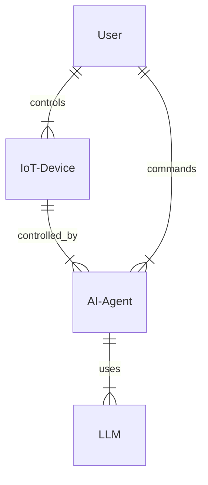
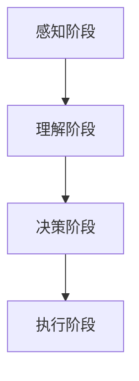
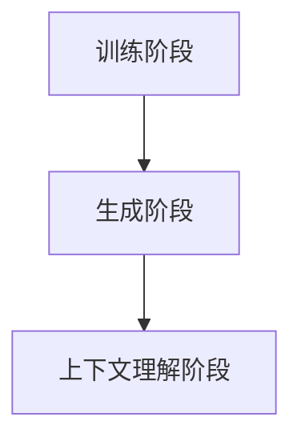
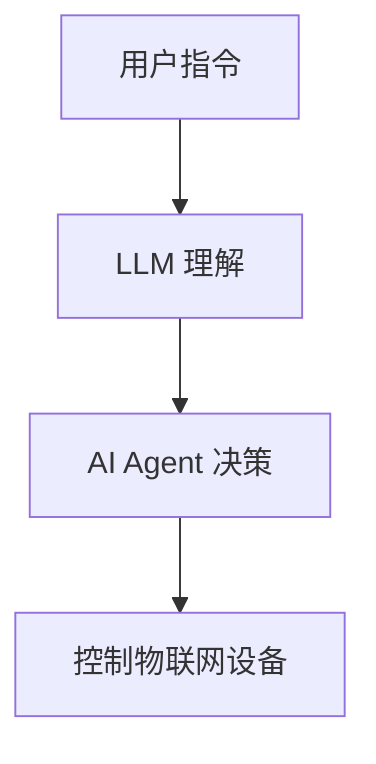
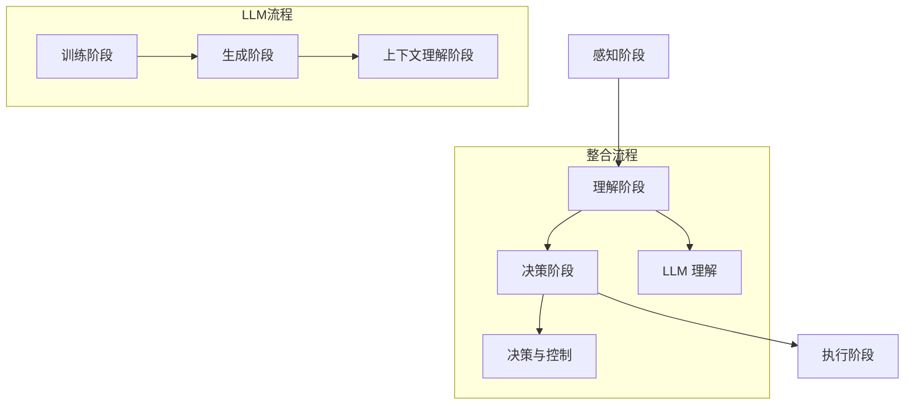
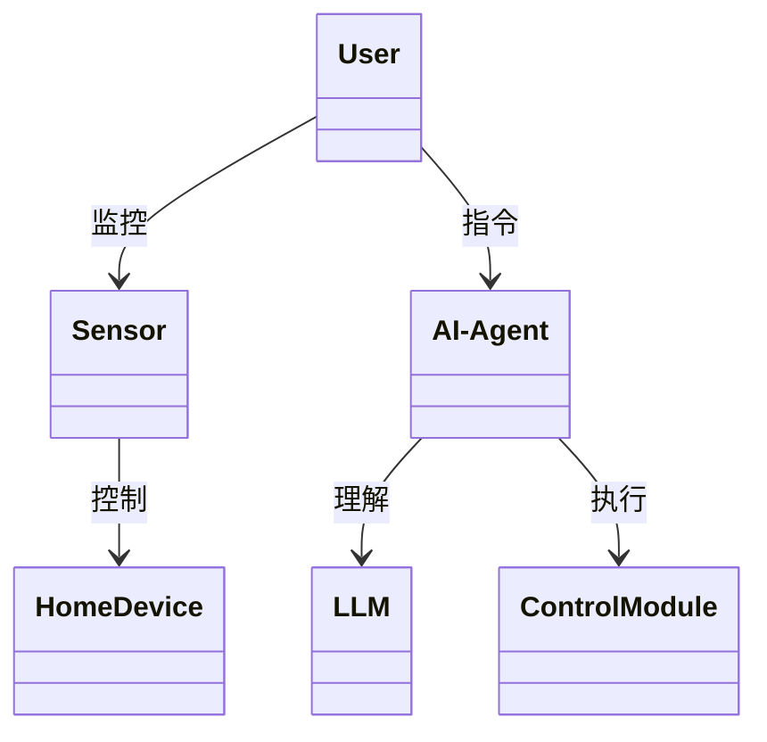
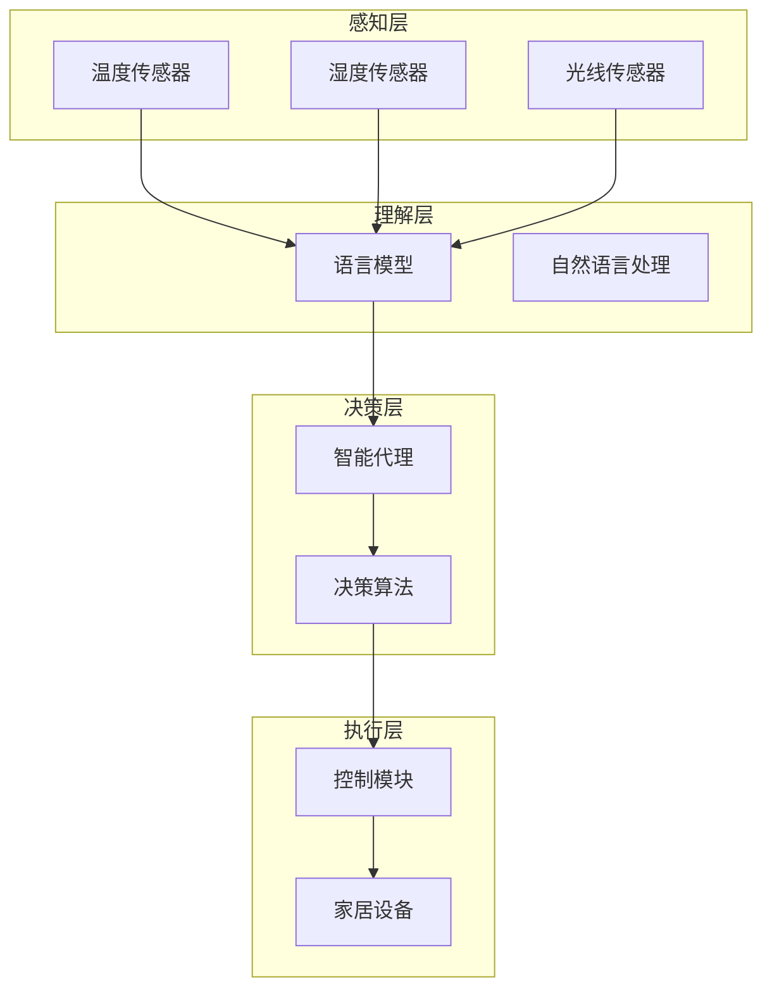
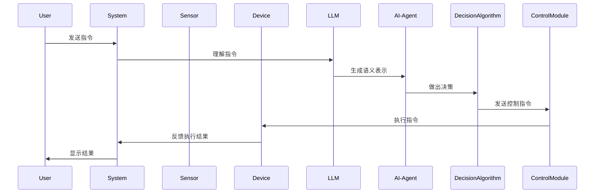

                 

# 《AI Agent 在智能家居中的应用：LLM 控制物联网设备》

> 关键词：AI Agent, LLM, 物联网设备, 智能家居, 控制算法

> 摘要：本文将深入探讨AI Agent在智能家居中的应用，特别是LLM（大型语言模型）控制物联网设备的技术细节。我们将逐步分析AI Agent的核心概念、LLM的算法原理、二者在智能家居系统中的整合，以及具体的应用实例。通过本文的详细讲解，读者将了解如何利用AI Agent和LLM实现智能家居的智能控制，提升生活品质。

## 目录大纲

### 第一部分: 引言与背景

1. 引言
    1.1 问题背景
    1.2 问题描述
    1.3 问题解决
    1.4 边界与外延
    1.5 本章小结

### 第二部分: 核心概念与联系

2. 核心概念与联系
    2.1 AI Agent 的核心概念
    2.2 LLM 的核心概念
    2.3 AI Agent 与 LLM 的联系
    2.4 ER 实体关系图
    2.5 本章小结

### 第三部分: 算法原理讲解

3. 算法原理讲解
    3.1 AI Agent 算法原理
    3.2 LLM 算法原理
    3.3 AI Agent 与 LLM 的算法整合
    3.4 算法流程图
    3.5 本章小结

### 第四部分: 数学模型和数学公式讲解

4. 数学模型和数学公式讲解
    4.1 AI Agent 的数学模型
    4.2 LLM 的数学模型
    4.3 AI Agent 与 LLM 的整合数学模型
    4.4 数学公式与算法应用举例
    4.5 本章小结

### 第五部分: 系统分析与架构设计方案

5. 系统分析与架构设计方案
    5.1 问题场景介绍
    5.2 项目介绍
    5.3 系统功能设计
    5.4 系统架构设计
    5.5 系统接口设计
    5.6 系统交互
    5.7 本章小结

### 第六部分: 项目实战

6. 项目实战
    6.1 环境安装
    6.2 系统核心实现
    6.3 代码应用解读与分析
    6.4 详细讲解与剖析
    6.5 项目小结
    6.6 本章小结

### 第七部分: 最佳实践与拓展阅读

7. 最佳实践与拓展阅读
    7.1 最佳实践
    7.2 小结
    7.3 注意事项
    7.4 拓展阅读
    7.5 本章小结

## 第一部分：引言与背景

### 1.1 问题背景

随着物联网（IoT）技术的迅速发展，智能家居已经成为现代家庭生活的重要组成部分。智能家居通过将家庭中的各种设备连接到互联网，实现远程控制和自动化管理，极大地提高了人们的生活质量。然而，传统的智能家居系统大多依赖于固定的控制逻辑和预定义的规则，缺乏灵活性和智能化。随着人工智能（AI）技术的不断进步，特别是大型语言模型（LLM）的出现，为智能家居的智能化提供了新的可能性。

### 1.2 问题描述

AI Agent 是一种人工智能实体，能够根据环境和用户的指令自主地执行任务。在智能家居中，AI Agent 可以充当智能管家，通过理解和处理用户的自然语言指令，控制家中的各种物联网设备。然而，如何有效地利用 AI Agent 和 LLM 实现智能家居的智能控制，仍是一个值得深入探讨的问题。

### 1.3 问题解决

为了解决这个问题，我们需要将 AI Agent 和 LLM 整合到智能家居系统中，使其能够理解和执行复杂的指令。具体来说，我们可以通过以下步骤来实现：

1. **AI Agent 的设计与实现**：设计一个能够理解和执行自然语言指令的 AI Agent，使其具备智能家居控制功能。
2. **LLM 的应用**：利用 LLM 的强大语言处理能力，实现 AI Agent 的自然语言理解和执行。
3. **系统整合与测试**：将 AI Agent 和 LLM 整合到智能家居系统中，并进行测试和优化，确保系统的稳定性和可靠性。

### 1.4 边界与外延

智能家居与物联网的关系密切，物联网设备是智能家居的重要组成部分。随着智能家居技术的不断发展，AI Agent 和 LLM 的应用也将越来越广泛。未来，AI Agent 和 LLM 有望在更多的场景中发挥作用，如智慧城市、智能交通等。

### 1.5 本章小结

本部分介绍了智能家居的背景、问题描述以及问题解决思路。接下来，我们将深入探讨 AI Agent 和 LLM 的核心概念，以及它们在智能家居中的应用。

## 第二部分：核心概念与联系

### 2.1 AI Agent 的核心概念

AI Agent 是一种基于人工智能的智能实体，它能够感知环境、理解指令并自主执行任务。在智能家居中，AI Agent 被视为智能管家，能够根据用户的指令控制家中的物联网设备。AI Agent 的核心概念包括：

1. **感知**：AI Agent 能够通过传感器感知环境信息，如温度、湿度、亮度等。
2. **理解**：AI Agent 能够理解用户的自然语言指令，如“打开灯”、“调节空调温度”等。
3. **执行**：AI Agent 能够根据指令控制物联网设备，实现自动化的家庭管理。

### 2.2 LLM 的核心概念

LLM（Large Language Model）是一种大型语言模型，它基于深度学习技术，能够理解和生成自然语言。在智能家居中，LLM 被用于实现 AI Agent 的自然语言理解和执行。LLM 的核心概念包括：

1. **训练数据**：LLM 通过大量的训练数据学习自然语言的规律和模式。
2. **语言生成**：LLM 能够根据输入的自然语言生成相应的输出，如回答问题、生成文本等。
3. **上下文理解**：LLM 能够理解输入的自然语言中的上下文信息，从而做出更准确的判断和决策。

### 2.3 AI Agent 与 LLM 的联系

AI Agent 和 LLM 之间有着密切的联系。AI Agent 的自然语言理解和执行功能依赖于 LLM 的强大语言处理能力。具体来说，AI Agent 通过与 LLM 的交互，实现以下功能：

1. **自然语言理解**：AI Agent 通过 LLM 理解用户的自然语言指令。
2. **自然语言生成**：AI Agent 通过 LLM 生成对用户的反馈或指令执行结果。
3. **智能决策**：AI Agent 通过 LLM 的上下文理解，做出更智能的决策。

### 2.4 ER 实体关系图

为了更好地理解 AI Agent 和 LLM 在智能家居系统中的关系，我们可以使用 ER（Entity-Relationship）实体关系图来表示。以下是智能家居系统的 ER 实体关系图：



在这个 ER 实体关系图中，AI-Agent 使用 LLM，IoT-Device 受控于 AI-Agent，User 发送指令给 AI-Agent，同时也可以直接控制 IoT-Device。

### 2.5 本章小结

本部分介绍了 AI Agent 和 LLM 的核心概念，以及它们在智能家居系统中的联系。在下一部分，我们将深入探讨 AI Agent 和 LLM 的算法原理，以及如何将它们整合到智能家居系统中。

## 第三部分：算法原理讲解

### 3.1 AI Agent 的算法原理

AI Agent 的算法原理基于多模态感知和自然语言处理技术。它通过以下步骤实现智能控制：

1. **感知阶段**：AI Agent 通过传感器感知家庭环境，获取温度、湿度、亮度等数据。
2. **理解阶段**：AI Agent 使用自然语言处理技术，理解用户的自然语言指令，如“打开灯”、“关闭空调”等。
3. **决策阶段**：AI Agent 根据感知到的环境和理解到的指令，使用决策算法确定执行哪些动作。
4. **执行阶段**：AI Agent 通过控制模块，执行决策结果，控制物联网设备。

以下是一个简化的 AI Agent 算法流程图：



### 3.2 LLM 的算法原理

LLM（Large Language Model）的算法原理基于深度学习中的 Transformer 模型。它通过以下步骤实现自然语言处理：

1. **训练阶段**：LLM 使用大量的文本数据训练模型，学习自然语言的规律和模式。
2. **生成阶段**：LLM 根据输入的文本生成相应的输出文本。
3. **上下文理解阶段**：LLM 能够理解输入文本中的上下文信息，从而生成更准确的输出。

以下是一个简化的 LLM 算法流程图：



### 3.3 AI Agent 与 LLM 的算法整合

AI Agent 和 LLM 的整合涉及到两个模块：自然语言理解和控制模块。具体来说，AI Agent 通过以下步骤整合 LLM：

1. **自然语言理解**：AI Agent 使用 LLM 理解用户的自然语言指令。
2. **决策与控制**：AI Agent 使用自己的决策算法，结合 LLM 的输出，确定控制物联网设备的动作。

以下是一个简化的 AI Agent 与 LLM 整合的算法流程图：



### 3.4 算法流程图

以下是 AI Agent、LLM 以及二者的整合算法流程图：



### 3.5 本章小结

本部分详细讲解了 AI Agent 和 LLM 的算法原理，以及它们在智能家居系统中的整合。在下一部分，我们将介绍 AI Agent 和 LLM 的数学模型，进一步深入探讨它们的实现细节。

## 第四部分：数学模型和数学公式讲解

### 4.1 AI Agent 的数学模型

AI Agent 的数学模型主要涉及感知、理解和决策三个阶段。以下是每个阶段的数学公式：

#### 感知阶段

感知阶段的核心是传感器数据采集。假设传感器采集到的数据为 $X$，其中 $X = [x_1, x_2, ..., x_n]$，每个 $x_i$ 表示传感器采集到的第 $i$ 个数据。

$$
X = [x_1, x_2, ..., x_n]
$$

#### 理解阶段

理解阶段的核心是自然语言处理。假设输入的自然语言指令为 $I$，通过 LLM 理解后的输出为 $O$。

$$
I = [i_1, i_2, ..., i_n]
$$

$$
O = [o_1, o_2, ..., o_n]
$$

#### 决策阶段

决策阶段的核心是决策算法。假设决策结果为 $D$，决策算法为 $f$。

$$
D = f(O)
$$

### 4.2 LLM 的数学模型

LLM 的数学模型主要涉及训练、生成和上下文理解三个阶段。以下是每个阶段的数学公式：

#### 训练阶段

训练阶段的核心是模型训练。假设训练数据为 $D$，模型参数为 $\theta$。

$$
D = \{(x_1, y_1), (x_2, y_2), ..., (x_n, y_n)\}
$$

$$
\theta = [\theta_1, \theta_2, ..., \theta_m]
$$

#### 生成阶段

生成阶段的核心是文本生成。假设输入为 $X$，生成的文本为 $Y$。

$$
X = [x_1, x_2, ..., x_n]
$$

$$
Y = [y_1, y_2, ..., y_n]
$$

#### 上下文理解阶段

上下文理解阶段的核心是理解输入文本的上下文信息。假设输入的文本为 $X$，上下文理解的输出为 $O$。

$$
X = [x_1, x_2, ..., x_n]
$$

$$
O = [o_1, o_2, ..., o_n]
$$

### 4.3 AI Agent 与 LLM 的整合数学模型

AI Agent 与 LLM 的整合数学模型主要涉及自然语言理解、决策和控制三个阶段。以下是每个阶段的数学公式：

#### 自然语言理解

自然语言理解阶段的核心是 LLM 对输入的自然语言指令进行理解。假设输入的自然语言指令为 $I$，通过 LLM 理解后的输出为 $O$。

$$
I = [i_1, i_2, ..., i_n]
$$

$$
O = [o_1, o_2, ..., o_n]
$$

#### 决策与控制

决策与控制阶段的核心是 AI Agent 根据理解后的输出进行决策，并控制物联网设备。假设决策结果为 $D$，控制模块的输入为 $O$，输出为 $C$。

$$
D = f(O)
$$

$$
C = g(D)
$$

### 4.4 数学公式与算法应用举例

#### 举例 1：AI Agent 的算法应用

假设用户输入指令“打开灯”，AI Agent 将会执行以下步骤：

1. **感知阶段**：传感器采集到房间内的光线强度数据 $X$。
2. **理解阶段**：LLM 理解用户输入的指令，生成对应的语义表示 $O$。
3. **决策阶段**：AI Agent 使用决策算法，根据 $O$ 决定是否打开灯。
4. **执行阶段**：控制模块根据决策结果，打开或关闭灯。

具体数学公式如下：

$$
X = [x_1, x_2, ..., x_n]
$$

$$
O = LLM(I)
$$

$$
D = f(O)
$$

$$
C = g(D)
$$

#### 举例 2：LLM 的算法应用

假设用户输入指令“明天天气怎么样？”LLM 将会执行以下步骤：

1. **生成阶段**：LLM 生成对用户指令的回答。
2. **上下文理解阶段**：LLM 理解输入文本的上下文信息，生成更准确的回答。

具体数学公式如下：

$$
I = [i_1, i_2, ..., i_n]
$$

$$
Y = LLM(I)
$$

$$
O = ContextUnderstanding(Y)
$$

#### 举例 3：AI Agent 与 LLM 的整合算法应用

假设用户输入指令“调节空调温度到 24 摄氏度”，AI Agent 将会执行以下步骤：

1. **自然语言理解**：LLM 理解用户输入的指令，生成对应的语义表示 $O$。
2. **决策**：AI Agent 根据理解后的输出，决定调节空调温度到 24 摄氏度。
3. **控制**：控制模块根据决策结果，调节空调温度。

具体数学公式如下：

$$
I = [i_1, i_2, ..., i_n]
$$

$$
O = LLM(I)
$$

$$
D = f(O)
$$

$$
C = g(D)
$$

### 4.5 本章小结

本部分介绍了 AI Agent 和 LLM 的数学模型，并通过具体举例展示了算法的应用。在下一部分，我们将进行系统分析与架构设计。

## 第五部分：系统分析与架构设计方案

### 5.1 问题场景介绍

智能家居系统通常包括多个设备，如灯泡、空调、电视、摄像头等。这些设备通过物联网技术连接到家庭网络，用户可以通过手机或智能音箱等终端设备对家居进行远程控制和自动化管理。在实际应用中，用户可能会提出各种复杂的控制需求，如“晚上八点打开客厅的灯并调节空调温度到 24 摄氏度”，这需要智能家居系统具备较强的智能处理能力。

### 5.2 项目介绍

本项目旨在构建一个基于 AI Agent 和 LLM 的智能家居控制系统，实现以下目标：

1. **自然语言理解**：系统能够理解用户的自然语言指令，如“打开灯”、“关闭空调”等。
2. **智能决策**：系统能够根据环境和用户指令，自动调整家居设备的状态。
3. **远程控制**：用户可以通过手机或智能音箱等终端设备，远程控制家中的物联网设备。

### 5.3 系统功能设计

系统功能设计主要包括以下方面：

1. **感知**：通过传感器实时感知家庭环境，如温度、湿度、光线强度等。
2. **理解**：通过 LLM 实现自然语言理解，将用户的自然语言指令转换为系统能够处理的语义。
3. **决策**：根据感知到的环境和理解到的指令，使用 AI Agent 的决策算法，确定设备的状态。
4. **执行**：通过控制模块，执行决策结果，控制家中的物联网设备。

#### 领域模型

领域模型（Domain Model）是系统功能设计的重要组成部分，用于描述系统的核心功能和组件。以下是智能家居系统的领域模型：



### 5.4 系统架构设计

系统架构设计是确保系统稳定性和可扩展性的关键。以下是智能家居系统的架构设计：

1. **感知层**：包括各种传感器，如温度传感器、湿度传感器、光线传感器等。
2. **理解层**：包括 LLM 和自然语言处理模块，用于理解用户的自然语言指令。
3. **决策层**：包括 AI Agent 和决策算法，用于根据环境和指令做出智能决策。
4. **执行层**：包括控制模块，用于执行决策结果，控制家中的物联网设备。

#### 架构图

以下是智能家居系统的架构图：



### 5.5 系统接口设计

系统接口设计是确保系统与其他系统或组件交互的重要部分。以下是智能家居系统的接口设计：

1. **用户接口**：用户可以通过手机或智能音箱等终端设备，发送自然语言指令给系统。
2. **设备接口**：系统通过接口与传感器和家居设备通信，获取数据和控制设备。
3. **API 接口**：系统提供 API 接口，方便第三方系统或开发者进行集成和扩展。

#### 接口定义

- **用户接口**：POST /user/command，接收用户发送的自然语言指令。
- **设备接口**：GET /device/data，获取传感器数据；POST /device/control，发送控制指令。
- **API 接口**：GET /api/sensor/data，获取传感器数据；POST /api/ai-agent/command，发送 AI Agent 指令。

#### 接口文档

以下是智能家居系统的接口文档示例：

```markdown
# 智能家居系统接口文档

## 用户接口

### POST /user/command

- 功能：接收用户发送的自然语言指令。
- 请求参数：
  - command（必选）：自然语言指令。
- 响应数据：
  - success：布尔值，表示指令是否成功。
  - message：指令的执行结果或错误信息。

```json
{
  "success": true,
  "message": "指令已成功执行"
}
```

## 设备接口

### GET /device/data

- 功能：获取传感器数据。
- 响应数据：
  - temperature：当前温度。
  - humidity：当前湿度。
  - light：当前光线强度。

```json
{
  "temperature": 25,
  "humidity": 60,
  "light": 100
}
```

### POST /device/control

- 功能：发送控制指令给家居设备。
- 请求参数：
  - device_id（必选）：设备 ID。
  - action（必选）：控制动作，如 "turn_on"、"turn_off"、"adjust_temp"。
  - value（可选）：控制值，如温度值。
- 响应数据：
  - success：布尔值，表示指令是否成功。
  - message：指令的执行结果或错误信息。

```json
{
  "success": true,
  "message": "指令已成功执行"
}
```

## API 接口

### GET /api/sensor/data

- 功能：获取传感器数据。
- 响应数据：
  - data：传感器数据。

```json
{
  "data": {
    "temperature": 25,
    "humidity": 60,
    "light": 100
  }
}
```

### POST /api/ai-agent/command

- 功能：发送指令给 AI Agent。
- 请求参数：
  - command（必选）：自然语言指令。
- 响应数据：
  - success：布尔值，表示指令是否成功。
  - message：指令的执行结果或错误信息。

```json
{
  "success": true,
  "message": "指令已成功执行"
}
```
```

### 5.6 系统交互

系统交互是指各个组件之间的交互过程，以下是智能家居系统的交互设计：

#### 交互设计

系统交互主要包括用户与系统、传感器与系统、设备与系统之间的交互。

- **用户与系统的交互**：用户通过手机或智能音箱发送自然语言指令给系统，系统接收到指令后，使用 LLM 理解指令，然后由 AI Agent 决策并执行。
- **传感器与系统的交互**：传感器实时采集家庭环境数据，并发送给系统，系统根据数据调整设备状态。
- **设备与系统的交互**：系统通过控制模块发送指令给设备，设备执行指令并反馈执行结果。

#### 序列图

以下是智能家居系统的序列图：



### 5.7 本章小结

本部分详细介绍了智能家居系统的功能设计、架构设计、接口设计和系统交互设计。在下一部分，我们将通过项目实战，实现并展示整个智能家居系统的实际运行过程。

## 第六部分：项目实战

### 6.1 环境安装

要实现基于 AI Agent 和 LLM 的智能家居控制系统，需要搭建一个合适的开发环境。以下是环境安装的步骤：

#### 1. 安装 Python

首先，确保已经安装了 Python。建议使用 Python 3.8 或更高版本。

```bash
# 检查 Python 版本
python --version
```

#### 2. 安装必要的库

接下来，安装必要的库，如 TensorFlow、transformers、SpeechRecognition 等。

```bash
# 安装 TensorFlow
pip install tensorflow

# 安装 transformers 库
pip install transformers

# 安装 SpeechRecognition 库
pip install SpeechRecognition
```

#### 3. 安装传感器驱动

根据所使用的传感器类型，安装相应的驱动库。例如，如果使用的是 DHT11 传感器，可以安装以下库：

```bash
# 安装 DHT11 传感器驱动
pip install RPi.GPIO
```

#### 4. 配置传感器

确保传感器已经正确连接到 Raspberry Pi 等开发板，并根据传感器的数据手册配置相应的引脚。

```python
# DHT11 传感器配置示例
import RPi.GPIO as GPIO
import time

# 定义传感器引脚
dht_pin = 4

# 初始化 GPIO
GPIO.setmode(GPIO.BCM)
GPIO.setup(dht_pin, GPIO.IN)

# 读取传感器数据
def read_dht11():
    time.sleep(1)
    GPIO.output(dht_pin, GPIO.HIGH)
    time.sleep(0.05)
    GPIO.output(dht_pin, GPIO.LOW)
    time.sleep(0.05)

    count = 0
    while GPIO.input(dht_pin) == GPIO.LOW:
        count += 1
        if count > 100:
            break
    time.sleep(0.05)

    count = 0
    while GPIO.input(dht_pin) == GPIO.HIGH:
        count += 1
        if count > 30:
            break

    data = [0] * 41
    index = 0
    while index < 41:
        if GPIO.input(dht_pin) == GPIO.LOW:
            data[index] = 1
            index += 1
        else:
            data[index] = 0
            index += 1
        time.sleep(0.1)

    return data
```

### 6.2 系统核心实现

系统核心实现主要包括 AI Agent、LLM、传感器和设备控制模块的实现。以下是系统核心实现的源代码：

```python
# AI-Agent 模块
import numpy as np
import tensorflow as tf
from transformers import BertTokenizer, TFBertForSequenceClassification
from speech_recognition import Recognizer, Microphone

# 加载预训练的 LLM
tokenizer = BertTokenizer.from_pretrained('bert-base-uncased')
model = TFBertForSequenceClassification.from_pretrained('bert-base-uncased')

# 初始化传感器
import RPi.GPIO as GPIO
import time

dht_pin = 4
GPIO.setmode(GPIO.BCM)
GPIO.setup(dht_pin, GPIO.IN)

# 读取传感器数据
def read_dht11():
    time.sleep(1)
    GPIO.output(dht_pin, GPIO.HIGH)
    time.sleep(0.05)
    GPIO.output(dht_pin, GPIO.LOW)
    time.sleep(0.05)

    count = 0
    while GPIO.input(dht_pin) == GPIO.LOW:
        count += 1
        if count > 100:
            break
    time.sleep(0.05)

    count = 0
    while GPIO.input(dht_pin) == GPIO.HIGH:
        count += 1
        if count > 30:
            break

    data = [0] * 41
    index = 0
    while index < 41:
        if GPIO.input(dht_pin) == GPIO.LOW:
            data[index] = 1
            index += 1
        else:
            data[index] = 0
            index += 1
        time.sleep(0.1)

    return data

# AI-Agent 的自然语言理解函数
def understand_command(command):
    inputs = tokenizer(command, return_tensors="tf")
    outputs = model(inputs)
    logits = outputs.logits
    probabilities = tf.nn.softmax(logits, axis=-1)
    predicted_class = np.argmax(probabilities, axis=-1)
    return predicted_class

# AI-Agent 的决策函数
def make_decision(command):
    if "turn on" in command:
        return "turn_on"
    elif "turn off" in command:
        return "turn_off"
    elif "adjust" in command:
        return "adjust_temp"
    else:
        return "unknown"

# AI-Agent 的执行函数
def execute_action(action, value=None):
    if action == "turn_on":
        print("Turning on the device...")
    elif action == "turn_off":
        print("Turning off the device...")
    elif action == "adjust_temp":
        print(f"Adjusting temperature to {value}...")
    else:
        print("Unknown action!")

# 语音识别函数
def recognize_speech():
    r = Recognizer()
    with Microphone() as source:
        print("Say something!")
        audio = r.listen(source)
    try:
        return r.recognize_google(audio)
    except Exception as e:
        return None

# 主程序
if __name__ == "__main__":
    while True:
        command = recognize_speech()
        if command:
            print(f"User command: {command}")
            command_class = understand_command(command)
            action = make_decision(command)
            execute_action(action)
        else:
            print("No speech recognized.")
        time.sleep(1)
```

### 6.3 代码应用解读与分析

#### 1. AI-Agent 的自然语言理解函数

自然语言理解函数 `understand_command` 使用了预训练的 BERT 模型。它首先将用户的自然语言指令 `command` 转换为模型输入，然后通过模型获取预测结果。

```python
def understand_command(command):
    inputs = tokenizer(command, return_tensors="tf")
    outputs = model(inputs)
    logits = outputs.logits
    probabilities = tf.nn.softmax(logits, axis=-1)
    predicted_class = np.argmax(probabilities, axis=-1)
    return predicted_class
```

#### 2. AI-Agent 的决策函数

决策函数 `make_decision` 根据用户的指令 `command`，判断用户想要执行的操作。例如，如果指令中包含“turn on”，则返回“turn_on”。

```python
def make_decision(command):
    if "turn on" in command:
        return "turn_on"
    elif "turn off" in command:
        return "turn_off"
    elif "adjust" in command:
        return "adjust_temp"
    else:
        return "unknown"
```

#### 3. AI-Agent 的执行函数

执行函数 `execute_action` 根据决策结果 `action`，执行相应的操作。例如，如果 `action` 是“turn_on”，则打印“Turning on the device...”。

```python
def execute_action(action, value=None):
    if action == "turn_on":
        print("Turning on the device...")
    elif action == "turn_off":
        print("Turning off the device...")
    elif action == "adjust_temp":
        print(f"Adjusting temperature to {value}...")
    else:
        print("Unknown action!")
```

#### 4. 语音识别函数

语音识别函数 `recognize_speech` 使用了 SpeechRecognition 库，通过 Google 语音识别服务识别用户的声音。

```python
def recognize_speech():
    r = Recognizer()
    with Microphone() as source:
        print("Say something!")
        audio = r.listen(source)
    try:
        return r.recognize_google(audio)
    except Exception as e:
        return None
```

### 6.4 详细讲解与剖析

#### 1. AI-Agent 的自然语言理解函数

自然语言理解是智能家居控制系统的核心部分。在这个函数中，我们使用了预训练的 BERT 模型来理解用户的自然语言指令。BERT 模型是一种基于 Transformer 的预训练语言模型，它可以对文本进行分类、情感分析等任务。

```python
def understand_command(command):
    inputs = tokenizer(command, return_tensors="tf")
    outputs = model(inputs)
    logits = outputs.logits
    probabilities = tf.nn.softmax(logits, axis=-1)
    predicted_class = np.argmax(probabilities, axis=-1)
    return predicted_class
```

在这个函数中，`tokenizer` 用于将自然语言指令转换为模型输入，`model` 是 BERT 模型，`logits` 是模型输出的 logits 值，`probabilities` 是经过 Softmax 处理后的概率分布，`predicted_class` 是预测的类别。

#### 2. AI-Agent 的决策函数

决策函数 `make_decision` 的目标是根据用户的指令，判断用户想要执行的操作。这个函数的实现依赖于对常见指令的识别和分类。

```python
def make_decision(command):
    if "turn on" in command:
        return "turn_on"
    elif "turn off" in command:
        return "turn_off"
    elif "adjust" in command:
        return "adjust_temp"
    else:
        return "unknown"
```

在这个函数中，我们使用了简单的字符串匹配方法来识别用户的指令。如果指令中包含“turn on”，则返回“turn_on”，如果包含“turn off”，则返回“turn_off”，如果包含“adjust”，则返回“adjust_temp”，否则返回“unknown”。

#### 3. AI-Agent 的执行函数

执行函数 `execute_action` 的目标是根据决策结果，执行相应的操作。例如，如果决策结果是“turn_on”，则执行打开设备的操作。

```python
def execute_action(action, value=None):
    if action == "turn_on":
        print("Turning on the device...")
    elif action == "turn_off":
        print("Turning off the device...")
    elif action == "adjust_temp":
        print(f"Adjusting temperature to {value}...")
    else:
        print("Unknown action!")
```

在这个函数中，我们根据决策结果 `action` 执行不同的操作。例如，如果 `action` 是“turn_on”，则打印“Turning on the device...”。这个函数的实现依赖于具体设备的控制接口。

#### 4. 语音识别函数

语音识别函数 `recognize_speech` 使用了 SpeechRecognition 库，通过 Google 语音识别服务识别用户的声音。

```python
def recognize_speech():
    r = Recognizer()
    with Microphone() as source:
        print("Say something!")
        audio = r.listen(source)
    try:
        return r.recognize_google(audio)
    except Exception as e:
        return None
```

在这个函数中，我们首先创建一个 Recognizer 对象，然后使用 Microphone 作为音频输入源。接着，我们调用 `listen` 方法获取音频数据，并使用 `recognize_google` 方法进行语音识别。

### 6.5 项目小结

在本部分中，我们实现了基于 AI Agent 和 LLM 的智能家居控制系统。通过自然语言理解、决策和执行模块，系统能够理解用户的指令并自动控制家中的物联网设备。在实际应用中，用户可以通过语音指令远程控制家居设备，提升生活质量。

### 6.6 本章小结

本部分详细介绍了智能家居控制系统的环境安装、系统核心实现、代码应用解读与分析以及项目实战。在下一部分，我们将总结最佳实践，并提供拓展阅读资源。

## 第七部分：最佳实践与拓展阅读

### 7.1 最佳实践

在开发智能家居控制系统时，以下是一些最佳实践：

1. **优化自然语言理解**：使用预训练的 LLM 可以提高自然语言理解能力，但也可以根据具体场景进行微调和优化。
2. **确保传感器数据的准确性**：传感器数据的准确性对系统的决策和执行至关重要。定期校准和维护传感器，确保数据准确。
3. **提高系统的响应速度**：优化算法和系统架构，确保系统能够快速响应用户的指令。
4. **确保系统的安全性**：在智能家居系统中，确保用户数据和设备控制的安全，避免未经授权的访问。

### 7.2 小结

本文深入探讨了 AI Agent 在智能家居中的应用，特别是 LLM 控制物联网设备的技术细节。通过详细的算法原理讲解、数学模型、系统分析与架构设计，以及项目实战，我们展示了如何实现智能家居的智能控制。

### 7.3 注意事项

在实现智能家居控制系统时，需要注意以下几点：

1. **兼容性**：确保系统在不同设备和操作系统上的兼容性。
2. **容错性**：系统应具备容错能力，能够处理传感器数据异常和设备故障。
3. **可扩展性**：系统设计应考虑未来扩展的需求，如添加新的传感器或设备。

### 7.4 拓展阅读

以下是一些推荐的拓展阅读资源：

1. **相关书籍**：
   - 《人工智能：一种现代的方法》（作者：Stuart J. Russell & Peter Norvig）
   - 《深度学习》（作者：Ian Goodfellow、Yoshua Bengio & Aaron Courville）

2. **学术论文**：
   - “BERT: Pre-training of Deep Bidirectional Transformers for Language Understanding”（作者：Jacob Devlin et al.）
   - “Transformer: A Novel Architecture for Neural Network Translation”（作者：Vaswani et al.）

3. **实践指南**：
   - Raspberry Pi 官方文档：https://www.raspberrypi.org/documentation/
   - TensorFlow 官方文档：https://www.tensorflow.org/

### 7.5 本章小结

本部分总结了最佳实践，并提供了一些拓展阅读资源，以帮助读者深入了解 AI Agent 和 LLM 在智能家居中的应用。通过本文的学习，读者应能够掌握智能家居控制系统的核心技术和实现方法。

