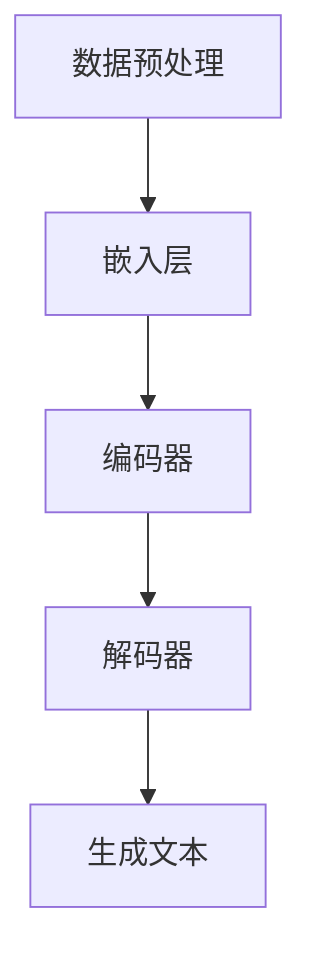
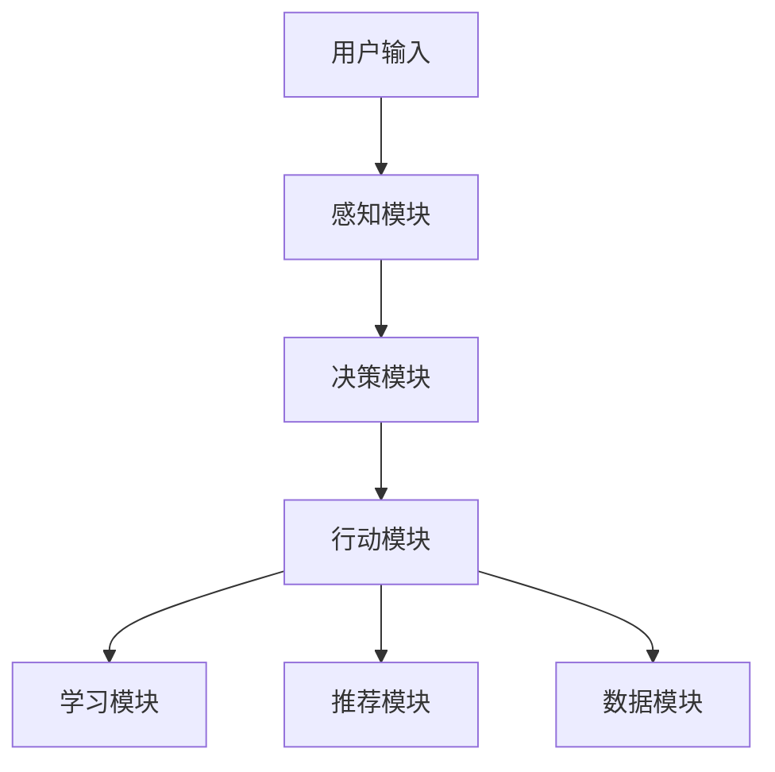

                 

# AI Agent 架构设计：基于 LLM 的智能助手系统构建

## 关键词
- AI Agent
- LLM
- 智能助手系统
- 架构设计
- 系统构建
- 交互设计

## 摘要
本文将深入探讨 AI Agent 架构设计及其在智能助手系统中的应用。首先，我们将介绍 AI Agent 的背景和核心概念，随后详细解析大型语言模型（LLM）的基础知识。接下来，我们将逐步分析 AI Agent 的架构设计，包括认知模块、行动模块和学习模块，并探讨如何设计与人类交互。文章还将介绍智能助手系统的构建过程，包括系统概述、实现与部署。最后，通过案例分析，我们将展示 AI Agent 和智能助手系统在实际应用中的效果，并总结文章的核心观点和未来研究方向。

## 目录大纲设计思路

在设计本文的目录大纲时，我们遵循了以下思路：

1. **明确主题与目标**：本文主题为 AI Agent 架构设计，目标是为有编程基础和人工智能背景的开发者提供详尽的指南。
2. **结构清晰**：我们将内容分为四个主要部分：背景介绍、基础知识、架构设计与系统构建、案例分析。
3. **细化章节内容**：每个章节进一步细分，确保覆盖所有关键知识点。
4. **设计结构清晰**：使用 markdown 格式的 #, ##, ### 等标签，确保目录层次分明。

### 目录大纲

```
# AI Agent 架构设计：基于 LLM 的智能助手系统构建

## 引言
- 引言1：AI Agent 与智能助手系统的重要性
- 引言2：本书的结构与内容概述
- 引言3：读者对象与预期收益

## 第一部分：AI Agent 基础知识
- 第1章：AI Agent 的背景与核心概念
  - 1.1 AI Agent 的定义与发展历程
  - 1.2 AI Agent 的类型与应用场景
  - 1.3 AI Agent 与智能助手系统的关系
- 第2章：LLM 基础知识
  - 2.1 LLM 的概念与原理
  - 2.2 LLM 的类型与特性
  - 2.3 LLM 在 AI Agent 中的应用

## 第二部分：AI Agent 架构设计
- 第3章：AI Agent 架构概述
  - 3.1 AI Agent 架构的组成部分
  - 3.2 AI Agent 架构的设计原则
  - 3.3 AI Agent 架构的演进趋势
- 第4章：AI Agent 的核心模块设计
  - 4.1 认知模块设计
  - 4.2 行动模块设计
  - 4.3 学习模块设计
- 第5章：AI Agent 与人类交互设计
  - 5.1 交互模型设计
  - 5.2 语言处理模型设计
  - 5.3 情感识别与回应设计

## 第三部分：智能助手系统构建
- 第6章：智能助手系统概述
  - 6.1 智能助手系统的定义与目标
  - 6.2 智能助手系统的架构设计
  - 6.3 智能助手系统的功能模块
- 第7章：智能助手系统的实现与部署
  - 7.1 系统环境搭建
  - 7.2 系统核心代码实现
  - 7.3 系统部署与调试

## 第四部分：案例分析
- 第8章：AI Agent 与智能助手系统的实际应用
  - 8.1 案例一：智能客服系统设计
  - 8.2 案例二：智能教育助手系统设计
  - 8.3 案例三：智能家居助手系统设计

## 结论与展望
- 结论1：AI Agent 架构设计的关键要点
- 结论2：智能助手系统的发展趋势
- 结论3：未来研究方向与挑战
```

这个大纲为本文的撰写提供了清晰的框架，每个章节都将深入探讨相关主题，确保内容丰富且逻辑严密。接下来，我们将逐步展开每个章节的内容，详细解析 AI Agent 的架构设计及其在智能助手系统中的应用。在撰写过程中，将遵循简洁性要求，确保文章的总字数在 10000 ～ 12000 字左右。

## 引言1：AI Agent 与智能助手系统的重要性

### 核心概念术语说明

在探讨 AI Agent 与智能助手系统之前，我们需要明确一些核心概念和术语：

- **AI Agent（人工智能代理）**：指的是一种能够代表人类执行任务、具备自主决策能力的计算机程序。
- **LLM（大型语言模型）**：是一种基于神经网络的自然语言处理模型，能够处理和理解人类语言。
- **智能助手系统**：是一种基于 AI Agent 的系统，能够为用户提供智能化的服务和支持。

### 问题背景

随着人工智能技术的快速发展，AI Agent 和智能助手系统逐渐成为各行各业关注的焦点。AI Agent 的应用场景涵盖了从智能客服、智能教育到智能家居等多个领域，它们能够提高工作效率、优化用户体验，甚至在某些场景下替代人类执行复杂任务。

然而，AI Agent 的设计与应用并非一蹴而就。如何构建一个高效、智能、可靠的 AI Agent，成为了当前学术界和工业界的研究热点。基于 LLM 的智能助手系统构建，正是这一研究领域的核心问题之一。

### 问题描述

当前，AI Agent 和智能助手系统面临着以下挑战：

1. **数据质量与多样性**：高质量的训练数据是构建高效 AI Agent 的基础。然而，数据质量和数据多样性往往难以保障，特别是在复杂、多变的实际应用场景中。
2. **推理能力与泛化能力**：虽然 LLM 具有强大的语言理解和生成能力，但在复杂任务中的推理能力和泛化能力仍然是一个挑战。
3. **交互体验**：AI Agent 需要与人类进行高效、自然的交互，这要求系统不仅要理解用户的需求，还要能够适应用户的情绪和反馈。

### 问题解决

为了解决上述问题，本文将从以下几个方面展开：

1. **背景介绍**：详细介绍 AI Agent 和智能助手系统的核心概念、发展历程和应用场景。
2. **核心概念与联系**：解析 LLM 的原理、类型和应用，阐述其在 AI Agent 架构设计中的作用。
3. **架构设计与实现**：详细分析 AI Agent 的架构设计，包括认知模块、行动模块和学习模块，并探讨如何设计与人类交互。
4. **案例分析**：通过实际案例展示 AI Agent 和智能助手系统的应用效果，并总结经验教训。
5. **未来展望**：展望 AI Agent 和智能助手系统的发展趋势，探讨未来的研究方向和挑战。

### 边界与外延

本文主要关注基于 LLM 的智能助手系统构建，重点关注 AI Agent 的架构设计、交互体验和实际应用。然而，AI Agent 和智能助手系统的应用场景和挑战是多样且复杂的，本文的讨论仅是一个初步的探索。

### 概念结构与核心要素组成

为了构建一个高效的 AI Agent 和智能助手系统，我们需要关注以下几个核心要素：

1. **数据集**：高质量、多样化的数据集是构建高效 AI Agent 的基础。
2. **模型**：基于 LLM 的模型是 AI Agent 的核心，它负责理解和生成语言。
3. **架构设计**：AI Agent 的架构设计决定了系统的性能和可靠性。
4. **交互设计**：高效的交互设计能够提升用户体验和满意度。
5. **测试与优化**：系统测试与优化是确保 AI Agent 和智能助手系统稳定运行的关键。

通过这些核心要素的有机结合，我们可以构建一个高效、智能、可靠的 AI Agent 和智能助手系统，为各行业提供强大的支持。

## 核心概念与联系

### LLM 的概念与原理

大型语言模型（LLM，Large Language Model）是一种基于深度学习的自然语言处理模型，它通过训练海量的文本数据来学习语言的规律和结构，从而实现对文本的生成、理解和翻译。LLM 的工作原理主要包括以下几个步骤：

1. **数据预处理**：首先，LLM 需要对输入的文本进行预处理，包括分词、标记化、去除停用词等操作，以便将原始文本转换为模型可以处理的格式。
2. **编码**：然后，LLM 将预处理后的文本编码为向量表示，这一过程通常通过嵌入层（Embedding Layer）实现。嵌入层将每个单词或字符映射为一个固定长度的向量，从而保留文本的语义信息。
3. **前向传播**：接下来，编码后的向量通过多层神经网络进行前向传播，每层神经网络都会对向量进行权重调整，以优化模型的预测能力。
4. **解码**：最后，模型输出一个概率分布，表示生成下一个单词的可能性。通过一系列的解码操作，模型最终生成完整的文本输出。

### LLM 的类型与特性

根据训练数据和模型架构的不同，LLM 可以分为多种类型，每种类型都有其独特的特性：

1. **Transformer**：Transformer 是一种基于自注意力机制的深度学习模型，它由多个自注意力层和前馈网络组成。Transformer 最大的优势在于其并行处理能力，能够高效地处理长文本。
2. **BERT（双向编码器表示模型）**：BERT 是一种基于 Transformer 的双向编码器，通过对文本进行双向编码，BERT 能够捕捉到文本中每个词的上下文信息，从而提升模型的语义理解能力。
3. **GPT（生成预训练变压器）**：GPT 是一种自回归的语言模型，它通过预训练大规模语料库来学习语言的生成规律。GPT 的特性在于其强大的文本生成能力，能够生成连贯、自然的文本。
4. **T5（文本到文本的变压器）**：T5 是一种将所有自然语言处理任务统一为文本到文本转换任务的模型。T5 的核心思想是将输入文本映射为一个目标文本，从而简化任务的复杂性。

### LLM 在 AI Agent 中的应用

LLM 在 AI Agent 中扮演着至关重要的角色，其主要应用场景包括：

1. **自然语言理解**：LLM 能够理解用户的自然语言输入，提取出关键信息，并对其进行分类、情感分析等处理。
2. **自然语言生成**：LLM 能够生成自然流畅的文本回复，用于与用户进行对话交互。
3. **问答系统**：LLM 能够回答用户提出的问题，通过检索和生成技术，提供准确、有用的信息。
4. **文本翻译**：LLM 能够实现多种语言之间的文本翻译，支持跨语言的信息交流。

### LLM 的核心概念属性特征对比表格

为了更直观地了解不同类型 LLM 的核心概念和属性特征，我们可以制作以下对比表格：

| 模型类型 | 特点 | 应用场景 |
| --- | --- | --- |
| Transformer | 并行处理能力强 | 长文本处理 |
| BERT | 双向编码，捕捉上下文信息 | 语义理解 |
| GPT | 自回归，生成能力强 | 文本生成 |
| T5 | 统一文本到文本任务 | 多语言处理 |

### ER 实体关系图架构

为了更好地理解 LLM 在 AI Agent 架构中的作用，我们可以使用 Mermaid 画出 ER（实体关系）图架构。以下是 LLM 在 AI Agent 架构中的关系图示例：

```mermaid
erDiagram
  AI-Agent ||--|{ LLM } LLM : 使用
  AI-Agent ||--|{ 自然语言理解模块 } 自然语言理解模块 : 包含
  AI-Agent ||--|{ 自然语言生成模块 } 自然语言生成模块 : 包含
  AI-Agent ||--|{ 问答系统模块 } 问答系统模块 : 包含
  AI-Agent ||--|{ 文本翻译模块 } 文本翻译模块 : 包含
```

通过这个 ER 图，我们可以清晰地看到 LLM 在 AI Agent 中的角色，以及它与自然语言理解、生成、问答和文本翻译模块之间的关系。

### 总结

LLM 作为一种强大的自然语言处理模型，其在 AI Agent 中的重要性不言而喻。通过深入理解 LLM 的概念、原理、类型和应用场景，我们可以更好地设计 AI Agent 的架构，提升其智能化水平和用户体验。在接下来的章节中，我们将进一步探讨 AI Agent 的架构设计和实现细节，为构建高效的智能助手系统奠定基础。

## LLM 基础知识

### LLM 的概念与原理

大型语言模型（LLM，Large Language Model）是一种先进的自然语言处理技术，它通过深度学习算法从大量文本数据中学习语言的规律和结构。LLM 的核心思想是模拟人类语言生成的过程，通过训练模型使其能够生成符合语法规则、语义连贯的文本。

LLM 的基本原理可以概括为以下几个步骤：

1. **数据预处理**：首先，LLM 需要对输入的文本进行预处理，包括分词、去停用词、标点符号处理等。这些预处理步骤的目的是将原始文本转换为模型可以处理的格式。
2. **嵌入层**：在预处理之后，文本会被编码为向量表示。嵌入层（Embedding Layer）负责将每个单词或字符映射为一个固定长度的向量，从而保留文本的语义信息。
3. **编码器**：编码器（Encoder）通常采用自注意力机制（Self-Attention Mechanism）和多层神经网络（Multi-Layer Neural Network）来处理输入的向量表示。编码器的目的是对输入文本进行编码，提取出文本中的关键信息。
4. **解码器**：解码器（Decoder）负责生成输出文本。在解码过程中，解码器会根据编码器的输出和当前输入，逐步生成下一个单词或字符的概率分布。通过重复这一过程，解码器最终生成完整的文本输出。

### LLM 的类型与特性

LLM 的类型多种多样，每种类型的模型都有其独特的特性。以下是几种常见的 LLM 类型及其特性：

1. **Transformer**：Transformer 模型是 LLM 的基础模型，它采用自注意力机制来处理输入文本。自注意力机制使得模型能够关注输入文本中的不同部分，从而更好地捕捉文本的上下文信息。Transformer 模型具有高效的并行计算能力，能够处理长文本。
   
2. **BERT**：BERT（Bidirectional Encoder Representations from Transformers）是一种双向编码器模型，它通过对文本进行双向编码，捕捉到文本中每个词的上下文信息。这使得 BERT 在语义理解方面具有显著优势，广泛应用于问答系统、文本分类等任务。

3. **GPT**：GPT（Generative Pre-trained Transformer）是一种自回归的语言模型，它通过预训练大规模语料库来学习语言的生成规律。GPT 的特性在于其强大的文本生成能力，能够生成连贯、自然的文本。GPT 在对话系统、文本生成等应用中表现优秀。

4. **T5**：T5（Text-to-Text Transfer Transformer）模型将所有自然语言处理任务统一为文本到文本转换任务。T5 的核心思想是将输入文本映射为一个目标文本，从而简化任务的复杂性。T5 在机器翻译、问答系统等领域表现优异。

### LLM 在 AI Agent 中的应用

LLM 在 AI Agent 中扮演着至关重要的角色，其主要应用包括自然语言理解、自然语言生成、问答系统和文本翻译等方面：

1. **自然语言理解**：LLM 能够理解用户的自然语言输入，提取出关键信息，并对其进行分类、情感分析等处理。这对于构建智能客服、智能推荐等应用场景至关重要。

2. **自然语言生成**：LLM 能够生成自然流畅的文本回复，用于与用户进行对话交互。这在智能助手、聊天机器人等应用中得到了广泛应用。

3. **问答系统**：LLM 能够回答用户提出的问题，通过检索和生成技术，提供准确、有用的信息。问答系统广泛应用于搜索引擎、智能客服等场景。

4. **文本翻译**：LLM 能够实现多种语言之间的文本翻译，支持跨语言的信息交流。这对于全球化企业、跨国公司等具有跨语言需求的应用场景具有重要意义。

### LLM 的核心概念属性特征对比表格

为了更直观地了解不同类型 LLM 的核心概念和属性特征，我们可以制作以下对比表格：

| 模型类型 | 特点 | 应用场景 |
| --- | --- | --- |
| Transformer | 并行处理能力强，处理长文本 | 长文本处理 |
| BERT | 双向编码，捕捉上下文信息，语义理解强 | 问答系统、文本分类 |
| GPT | 自回归，生成能力强，文本生成自然 | 对话系统、文本生成 |
| T5 | 文本到文本转换，任务统一，简化复杂性 | 机器翻译、问答系统 |

### LLM 的基本结构图

为了更清晰地展示 LLM 的基本结构，我们可以使用 Mermaid 绘制以下结构图：



在这个结构图中，数据预处理是将原始文本转换为模型可处理的格式；嵌入层将文本转换为向量表示；编码器负责对输入文本进行编码，提取关键信息；解码器根据编码器的输出和当前输入生成文本输出。

### LLM 的详细工作流程

以下是 LLM 的详细工作流程：

1. **数据收集**：首先，从互联网、图书、新闻等各种来源收集大量文本数据。
2. **数据预处理**：对收集到的文本数据进行清洗、去停用词、分词等预处理操作。
3. **嵌入层**：将预处理后的文本编码为向量表示，每个单词或字符映射为一个固定长度的向量。
4. **编码器**：采用多层神经网络和自注意力机制对输入向量进行编码，提取文本中的关键信息。
5. **解码器**：在解码过程中，解码器会根据编码器的输出和当前输入，逐步生成下一个单词或字符的概率分布。
6. **生成文本**：通过一系列解码操作，模型最终生成完整的文本输出。

### 总结

大型语言模型（LLM）作为自然语言处理领域的核心技术之一，其在 AI Agent 中的应用具有重要意义。通过深入理解 LLM 的概念、原理、类型和应用，我们可以更好地设计 AI Agent 的架构，提升其智能化水平和用户体验。在接下来的章节中，我们将继续探讨 AI Agent 的架构设计与实现细节，为构建高效的智能助手系统奠定基础。

## AI Agent 架构设计概述

### AI Agent 的背景与发展历程

AI Agent（人工智能代理）是指一种能够自主执行任务、与环境互动并作出决策的计算机程序。AI Agent 的概念起源于人工智能（AI）领域，其发展历程可以追溯到20世纪50年代。早期的 AI 研究主要集中在逻辑推理和问题求解，例如专家系统和规划系统。然而，随着计算机性能的不断提高和大数据技术的发展，AI Agent 的研究逐渐转向基于数据驱动的方法，如机器学习和深度学习。

AI Agent 的发展历程可以分为以下几个阶段：

1. **规则驱动阶段**：早期的 AI Agent 主要依赖于预定义的规则和逻辑推理。这些系统通常具有高度的专业性和局限性，难以应对复杂和多变的场景。
2. **知识驱动阶段**：随着知识表示和推理技术的发展，AI Agent 开始引入知识库和推理机。这一阶段的代表包括专家系统和知识图谱。
3. **数据驱动阶段**：随着大数据和深度学习技术的兴起，AI Agent 开始转向数据驱动的方法。通过从海量数据中学习模式和规律，AI Agent 的表现和泛化能力得到了显著提升。
4. **智能代理阶段**：当前，AI Agent 的研究重点转向智能代理（Smart Agent），旨在构建具备自主决策、学习、适应和交互能力的系统。

### AI Agent 的定义与应用场景

AI Agent 可以定义为一种具备以下能力的计算机程序：

- **感知**：能够接收和处理来自环境的数据，如语音、图像、文本等。
- **决策**：基于感知到的信息，能够自主作出决策，选择合适的行动。
- **行动**：能够执行决策，与环境进行交互，改变环境状态。
- **学习**：能够从环境中学习，不断优化决策和行动策略。

AI Agent 的应用场景非常广泛，涵盖了从智能客服、智能教育到智能家居、自动驾驶等多个领域：

1. **智能客服**：AI Agent 能够自动处理客户咨询，提供快速、准确的服务。
2. **智能教育**：AI Agent 可以为学生提供个性化辅导，帮助学生更好地学习。
3. **智能家居**：AI Agent 能够智能控制家庭设备，提高生活质量。
4. **医疗诊断**：AI Agent 可以辅助医生进行诊断，提供治疗方案建议。
5. **自动驾驶**：AI Agent 可以实现自动驾驶车辆，提高交通效率和安全。

### AI Agent 与智能助手系统的关系

智能助手系统是一种基于 AI Agent 的应用系统，旨在为用户提供智能化的服务和支持。智能助手系统通常包含多个 AI Agent，每个 Agent 负责处理特定任务。AI Agent 与智能助手系统之间的关系可以概括为：

1. **组件关系**：AI Agent 是智能助手系统中的核心组件，负责感知用户需求、决策和执行。
2. **层次关系**：智能助手系统通常采用分层架构，底层由感知模块、决策模块和行动模块组成，上层则由特定的 AI Agent 实现。
3. **协同关系**：多个 AI Agent 可以协同工作，共同为用户提供服务。例如，在智能教育系统中，感知模块负责收集学生的学习数据，决策模块根据数据为学生提供个性化的学习方案，行动模块则负责执行学习任务。

### AI Agent 架构设计的核心组成部分

一个典型的 AI Agent 架构设计包括以下几个核心组成部分：

1. **感知模块**：感知模块负责接收和处理来自环境的数据，如语音、图像、文本等。感知模块通常包括语音识别、图像识别、自然语言处理等技术。
2. **决策模块**：决策模块负责基于感知模块收集到的数据，分析用户需求，并生成决策。决策模块通常采用机器学习、深度学习等技术，实现智能决策。
3. **行动模块**：行动模块负责执行决策，实现与环境的交互。行动模块通常包括控制算法、执行策略等。
4. **学习模块**：学习模块负责从环境反馈中学习，不断优化决策和行动策略。学习模块通常采用强化学习、迁移学习等技术。

### AI Agent 架构设计的基本原则

在构建 AI Agent 架构时，需要遵循以下基本原则：

1. **模块化**：将 AI Agent 的功能划分为不同的模块，每个模块负责特定功能，便于维护和扩展。
2. **可扩展性**：设计时应考虑系统的可扩展性，以适应不断变化的需求和技术进步。
3. **可靠性**：确保 AI Agent 的可靠性和稳定性，降低故障率和错误率。
4. **灵活性**：设计应具备一定的灵活性，以适应不同应用场景和用户需求。
5. **安全性**：确保系统在执行任务时不会对用户和环境造成负面影响。

### AI Agent 架构的演进趋势

随着人工智能技术的不断发展，AI Agent 架构也在不断演进：

1. **智能化水平提升**：AI Agent 的智能化水平将不断提高，通过引入更先进的技术，如生成对抗网络（GAN）、变分自编码器（VAE）等，实现更高效的任务执行。
2. **多模态感知**：AI Agent 将具备更强的多模态感知能力，能够同时处理语音、图像、文本等多种类型的数据。
3. **自适应能力增强**：AI Agent 将具备更强的自适应能力，能够根据环境变化和用户需求，动态调整行为和决策策略。
4. **协作与协同**：多个 AI Agent 将实现更紧密的协作与协同，共同为用户提供智能化服务。
5. **隐私保护与伦理**：随着 AI Agent 的广泛应用，隐私保护和伦理问题将日益突出，AI Agent 架构设计需要充分考虑这些问题。

### 总结

AI Agent 架构设计是构建智能助手系统的关键环节。通过深入理解 AI Agent 的背景、定义、应用场景以及架构设计的基本原则，我们可以更好地设计 AI Agent 的系统架构，为智能助手系统的构建奠定基础。在接下来的章节中，我们将详细探讨 AI Agent 的核心模块设计，包括感知模块、决策模块、行动模块和学习模块。

## AI Agent 的核心模块设计

### 认知模块设计

认知模块是 AI Agent 的核心组成部分之一，其主要功能是感知和理解环境中的信息。认知模块的设计包括以下几个方面：

1. **感知器**：感知器是认知模块的前端，用于接收各种类型的数据，如语音、图像、文本等。不同的感知器技术适用于不同的数据类型。例如，语音识别技术适用于处理语音数据，图像识别技术适用于处理图像数据，自然语言处理技术适用于处理文本数据。

2. **特征提取**：感知器收集到的原始数据通常需要进行特征提取，将数据转换为模型可以处理的特征向量。特征提取的方法包括频域分析、时域分析、图像处理等。例如，对于语音数据，可以提取频谱特征；对于图像数据，可以提取边缘特征、纹理特征等。

3. **数据处理**：在特征提取后，需要对数据进行预处理，包括去噪、归一化、去停用词等。这些处理步骤有助于提高模型的性能和准确性。

4. **语言处理**：对于文本数据，认知模块需要具备自然语言处理能力。这包括分词、词性标注、命名实体识别、情感分析等。通过这些处理，认知模块能够提取文本中的关键信息，理解用户的意图。

### 行动模块设计

行动模块负责根据认知模块提取的信息，执行相应的操作，并与环境进行交互。行动模块的设计包括以下几个方面：

1. **决策机制**：行动模块需要基于认知模块提供的信息，进行决策。决策机制可以采用规则推理、决策树、随机森林、神经网络等方法。在复杂的场景中，行动模块可能需要结合多种决策方法，以实现更智能的决策。

2. **控制算法**：行动模块需要采用控制算法来实现具体的操作。控制算法包括确定性算法和随机算法。确定性算法如 PID 控制器，适用于稳定、可预测的系统；随机算法如蒙特卡洛方法，适用于不确定、复杂的系统。

3. **执行策略**：执行策略是指行动模块在实际操作中采取的行动顺序和方法。执行策略的设计需要考虑效率、鲁棒性和用户体验。例如，在智能客服中，执行策略可能包括多轮对话、上下文切换等。

4. **反馈机制**：行动模块在执行操作后，需要接收环境反馈，并根据反馈调整后续的行动。反馈机制可以采用实时反馈、批量反馈等方法。实时反馈能够快速调整行动，而批量反馈则能够处理大量的反馈信息。

### 学习模块设计

学习模块负责从环境中学习，不断优化 AI Agent 的行为和决策。学习模块的设计包括以下几个方面：

1. **学习算法**：学习算法是学习模块的核心，包括监督学习、无监督学习、强化学习等。监督学习适用于有标注数据的场景，无监督学习适用于无标注数据的场景，强化学习适用于需要通过试错学习最优策略的场景。

2. **数据收集**：学习模块需要从环境中收集数据，用于训练和优化模型。数据收集的方法包括直接采集、模拟生成、迁移学习等。直接采集适用于真实场景，模拟生成适用于模拟环境，迁移学习适用于已有模型。

3. **模型训练**：模型训练是指通过学习算法，对模型进行训练和优化。训练过程中，需要不断调整模型参数，以实现更好的性能。模型训练的方法包括批训练、在线训练、分布式训练等。

4. **模型评估**：模型评估是指对训练好的模型进行评估，以确定其性能和可靠性。评估方法包括准确率、召回率、F1 值、ROC 曲线等。通过模型评估，可以确定模型的优缺点，为进一步优化提供依据。

### 模块之间的关系与协作

认知模块、行动模块和学习模块之间相互协作，共同实现 AI Agent 的功能。具体来说：

1. **信息流动**：认知模块收集环境信息，传递给行动模块；行动模块执行操作，生成环境反馈，传递给学习模块；学习模块根据反馈调整模型参数，优化认知模块和行动模块的性能。

2. **数据共享**：模块之间需要共享数据，以便更好地协作。例如，认知模块提取的特征向量可以用于训练学习模块的模型；学习模块训练好的模型可以用于优化行动模块的决策机制。

3. **动态调整**：在运行过程中，AI Agent 需要根据环境变化和任务需求，动态调整模块之间的协作关系。例如，在处理复杂任务时，认知模块可能需要更多的计算资源；在执行高风险操作时，行动模块可能需要更加谨慎的决策。

### 模块设计的关键技术和挑战

在模块设计过程中，需要关注以下关键技术和挑战：

1. **感知准确性**：如何提高感知模块的准确性，是模块设计的关键挑战。需要采用先进的感知技术，如深度学习、多模态感知等，以提高感知准确性。

2. **决策效率**：如何提高决策模块的效率，是模块设计的重要问题。需要采用高效的控制算法和执行策略，以减少决策时间，提高响应速度。

3. **学习效果**：如何提高学习模块的学习效果，是模块设计的核心问题。需要采用有效的学习算法和数据收集方法，以提高模型的性能和泛化能力。

4. **模块集成**：如何实现模块之间的有效集成，是模块设计的关键。需要设计合理的接口和协作机制，确保模块之间能够高效、稳定地协作。

### 总结

认知模块、行动模块和学习模块是 AI Agent 的核心组成部分，它们相互协作，共同实现 AI Agent 的功能。通过合理设计这些模块，可以提高 AI Agent 的性能和智能化水平。在接下来的章节中，我们将进一步探讨 AI Agent 的交互设计，以及如何实现高效、自然的用户交互。

### AI Agent 与人类交互设计

在构建 AI Agent 的过程中，交互设计是一个至关重要的环节。一个优秀的 AI Agent 应该能够理解用户的需求，适应用户的情绪，并提供友好、自然的交互体验。以下是关于 AI Agent 与人类交互设计的关键内容：

#### 交互模型设计

1. **多模态交互**：AI Agent 应该支持多种交互模式，包括文本、语音、图像等。通过多模态交互，AI Agent 可以更全面地理解用户的需求。例如，用户可以通过语音命令控制智能家居设备，也可以通过文字输入查询天气信息。

2. **上下文感知**：交互模型应该具备上下文感知能力，能够根据用户的对话历史和当前情境，提供相关的信息和回复。上下文感知可以通过自然语言处理技术实现，如基于 Transformer 的语言模型。

3. **对话管理**：对话管理是交互模型的核心，负责维护对话的流畅性和一致性。对话管理包括对话意图识别、对话状态跟踪和回复生成。通过对话管理，AI Agent 可以确保与用户的对话连贯、自然。

#### 语言处理模型设计

1. **语言理解**：AI Agent 需要具备强大的语言理解能力，能够准确地理解用户的语言输入。这包括词义消歧、实体识别、情感分析等。通过这些技术，AI Agent 可以更好地把握用户的意图和需求。

2. **语言生成**：AI Agent 需要能够生成自然、流畅的文本回复。生成技术可以基于 LLM，如 GPT-3，通过预训练和微调，实现高质量的文本生成。

3. **错误处理**：在交互过程中，AI Agent 需要能够处理用户的错误输入和歧义。这可以通过错误检测、错误纠正和上下文恢复等技术实现。例如，当用户输入错误的命令时，AI Agent 可以自动纠正并重新解释命令。

#### 情感识别与回应设计

1. **情感识别**：AI Agent 需要能够识别用户的情感，如喜悦、愤怒、悲伤等。这可以通过情感分析技术实现，如基于深度学习的情感分类模型。

2. **情感回应**：在识别用户的情感后，AI Agent 需要能够适当地回应。这包括提供合适的语气、表情和回复内容。例如，当用户表达愤怒时，AI Agent 可以通过降低语速、使用平和的语气来回应。

#### 交互设计的实现

1. **交互界面**：设计一个直观、易用的交互界面，是提高用户体验的关键。交互界面应支持多种输入方式，如语音、键盘、手势等，并能够实时显示 AI Agent 的状态和反馈。

2. **实时反馈**：在交互过程中，AI Agent 应该能够实时反馈用户的操作结果。例如，在智能客服中，AI Agent 应该能够实时更新用户的订单状态，并在用户询问时提供最新的信息。

3. **个性化服务**：AI Agent 应该能够根据用户的偏好和历史行为，提供个性化的服务。例如，智能助手可以根据用户的使用习惯，推荐相关的内容或服务。

#### 案例分析

以智能客服系统为例，我们可以分析 AI Agent 与人类交互的设计实现：

1. **案例背景**：某公司开发了一款智能客服系统，旨在替代人工客服，提高服务效率和用户体验。

2. **交互模型**：智能客服系统支持多模态交互，用户可以通过文本、语音与系统进行沟通。系统具备上下文感知能力，能够根据对话历史和用户情境，提供相关服务。

3. **语言处理**：智能客服系统采用基于 LLM 的语言模型，具备强大的语言理解和生成能力。系统能够识别用户的问题，并生成自然的文本回复。

4. **情感识别**：系统采用情感分析技术，能够识别用户的情感，并根据情感调整回复语气和内容。例如，当用户表达愤怒时，系统会使用平和的语气进行回复。

5. **个性化服务**：智能客服系统根据用户的偏好和历史行为，提供个性化的服务。例如，对于经常咨询订单状态的客户，系统会主动提醒订单状态。

#### 总结

交互设计是 AI Agent 不可或缺的一部分。通过合理的设计，AI Agent 可以实现与人类的高效、自然交互，提供优质的服务和支持。在接下来的章节中，我们将深入探讨智能助手系统的构建过程，包括系统概述、实现与部署。

### 智能助手系统概述

智能助手系统是一种基于人工智能技术的综合系统，旨在为用户提供智能化、个性化的服务和支持。智能助手系统通常包含多个核心功能模块，如语音识别、自然语言处理、智能推荐、行为分析等。以下是智能助手系统的定义、目标及其架构设计。

#### 定义

智能助手系统（Intelligent Assistant System）是一种利用人工智能技术，为用户提供个性化、自动化服务的系统。它通过理解用户的语言、行为和需求，提供相应的建议、决策和执行。智能助手系统可以应用于多种场景，如智能客服、智能教育、智能健康管理、智能家居等。

#### 目标

智能助手系统的目标主要包括以下几点：

1. **提高服务质量**：通过自动化处理用户请求，智能助手系统可以显著提高服务效率和用户体验。
2. **个性化服务**：智能助手系统能够根据用户的偏好、历史行为和需求，提供个性化的服务和建议。
3. **降低运营成本**：智能助手系统可以替代或辅助人类完成一些重复性、劳动密集型的工作，从而降低运营成本。
4. **增强用户体验**：通过提供即时、高效、个性化的服务，智能助手系统可以提升用户的满意度和忠诚度。

#### 架构设计

智能助手系统的架构设计包括多个核心功能模块，这些模块协同工作，实现智能助手系统的整体功能。以下是智能助手系统的主要功能模块及其作用：

1. **感知模块**：感知模块负责接收用户输入，如语音、文本、图像等。该模块通常包含语音识别、图像识别、自然语言处理等技术，能够将用户输入转换为机器可以理解的形式。

2. **决策模块**：决策模块负责分析用户输入，理解用户意图，并生成相应的决策。决策模块通常采用机器学习、深度学习等技术，如自然语言处理模型、图神经网络等。

3. **行动模块**：行动模块负责执行决策，实现与环境的交互。行动模块包括各种执行策略和算法，如控制算法、推荐算法等。通过执行模块，智能助手系统可以实现对用户请求的响应。

4. **学习模块**：学习模块负责从用户反馈和系统执行结果中学习，不断优化系统性能。学习模块通常采用强化学习、迁移学习等技术，如 Q-Learning、生成对抗网络等。

5. **推荐模块**：推荐模块负责根据用户的历史行为和偏好，提供个性化的推荐。推荐模块通常采用协同过滤、基于内容的推荐等技术，如矩阵分解、文本匹配等。

6. **数据模块**：数据模块负责存储和管理系统中的数据，包括用户数据、系统配置数据、日志数据等。数据模块通常采用分布式数据库、大数据处理技术等，如 Hadoop、Spark 等。

#### 系统架构图

为了更好地理解智能助手系统的架构设计，我们可以使用 Mermaid 绘制以下架构图：



在这个架构图中，用户输入通过感知模块进行处理，然后传递给决策模块。决策模块生成决策，传递给行动模块执行。行动模块的执行结果可以反馈给学习模块进行学习，同时也可以用于推荐模块提供个性化推荐。数据模块负责存储和管理系统中的数据。

#### 功能模块之间的关系

智能助手系统的各个功能模块之间相互协作，共同实现系统的整体功能。具体来说：

1. **信息流动**：用户输入通过感知模块处理后，传递给决策模块进行分析。决策模块生成决策后，传递给行动模块执行。行动模块的执行结果可以反馈给学习模块进行学习，从而优化系统性能。

2. **数据共享**：各个模块之间需要共享数据，以确保系统的高效运行。例如，决策模块需要使用感知模块处理后的用户输入，行动模块需要使用决策模块生成的决策进行执行。

3. **动态调整**：在运行过程中，智能助手系统可以根据用户需求和环境变化，动态调整模块之间的关系和协作方式。例如，当用户需求发生变化时，感知模块可能需要调整输入类型和处理方式。

#### 总结

智能助手系统是一种基于人工智能技术的综合系统，旨在为用户提供智能化、个性化的服务和支持。通过合理的架构设计和模块协作，智能助手系统可以实现高效、稳定、个性化的服务，提升用户体验。在接下来的章节中，我们将详细探讨智能助手系统的实现与部署过程。

### 智能助手系统的实现与部署

#### 系统环境搭建

搭建智能助手系统的第一步是选择合适的技术栈和环境。以下是一个典型的技术栈和环境配置：

1. **开发语言**：Python 是智能助手系统开发的首选语言，其强大的库和框架支持使得开发过程更加高效。
2. **操作系统**：通常选择 Linux 系统，如 Ubuntu，因为其稳定性和可扩展性。
3. **数据库**：选择 NoSQL 数据库，如 MongoDB，以支持海量数据的存储和快速查询。
4. **消息队列**：使用 RabbitMQ 或 Apache Kafka 进行异步消息传递，确保系统的高效通信。
5. **框架**：选择 Flask 或 Django 作为 Web 框架，以构建后端服务。

以下是一个简单的环境搭建步骤：

1. 安装操作系统：在虚拟机上安装 Ubuntu 操作系统。
2. 安装 Python：通过 `sudo apt-get install python3` 命令安装 Python 3。
3. 安装依赖库：使用 `pip` 安装必要的库，如 `numpy`、`pandas`、`tensorflow`、`speech_recognition` 等。
4. 安装数据库：使用 `sudo apt-get install mongodb` 安装 MongoDB。
5. 安装消息队列：使用 `sudo apt-get install rabbitmq-server` 安装 RabbitMQ。

#### 系统核心代码实现

智能助手系统的核心代码实现包括感知模块、决策模块、行动模块、学习模块和推荐模块。以下是各个模块的核心代码实现：

1. **感知模块**：

```python
import speech_recognition as sr

def recognize_speech_from_mic():
    # 初始化语音识别器
    r = sr.Recognizer()
    
    # 使用麦克风作为音频输入
    with sr.Microphone() as source:
        print("请说些什么：")
        audio = r.listen(source)
        
        try:
            # 使用 Google 语音识别引擎进行识别
            text = r.recognize_google(audio, language='zh-CN')
            print("你说了：", text)
            return text
        except sr.UnknownValueError:
            print("无法理解音频")
            return None
        except sr.RequestError:
            print("请求失败")
            return None
```

2. **决策模块**：

```python
from transformers import BertForSequenceClassification

# 加载预训练的 BERT 模型
model = BertForSequenceClassification.from_pretrained('bert-base-chinese')

def classify_intent(text):
    # 对文本进行意图分类
    inputs = tokenizer(text, return_tensors='pt')
    logits = model(**inputs).logits
    intent = logits.argmax(-1).item()
    return intent
```

3. **行动模块**：

```python
def execute_action(intent):
    if intent == 0:
        # 处理特定意图，如查询天气
        weather = get_weather()
        return f"今天的外界天气是：{weather}"
    elif intent == 1:
        # 处理特定意图，如播放音乐
        play_music()
        return "音乐已开始播放"
    else:
        return "无法执行该操作"
```

4. **学习模块**：

```python
import tensorflow as tf

# 定义强化学习模型
model = tf.keras.Sequential([
    tf.keras.layers.Dense(64, activation='relu', input_shape=[None]),
    tf.keras.layers.Dense(64, activation='relu'),
    tf.keras.layers.Dense(1, activation='sigmoid')
])

model.compile(optimizer='adam', loss='binary_crossentropy', metrics=['accuracy'])

# 训练模型
model.fit(x_train, y_train, epochs=10)
```

5. **推荐模块**：

```python
from sklearn.neighbors import NearestNeighbors

# 加载用户数据
user_data = load_user_data()

# 使用 KNN 进行推荐
knn = NearestNeighbors(n_neighbors=5)
knn.fit(user_data)

# 推荐商品
def recommend_products(user_vector):
    distances, indices = knn.kneighbors([user_vector])
    return [user_data[index] for index in indices.flatten()]
```

#### 代码应用解读与分析

1. **感知模块**：感知模块使用 `speech_recognition` 库实现语音识别功能。通过调用 `Microphone` 类，程序可以从麦克风接收音频输入，并使用 Google 语音识别引擎进行识别。如果识别成功，程序将输出识别结果；否则，程序将输出错误消息。

2. **决策模块**：决策模块使用预训练的 BERT 模型实现文本分类功能。通过调用 `tokenizer` 和 `model`，程序可以对输入文本进行意图分类。模型输出的是一个概率分布，程序使用 `argmax` 函数找到概率最高的类别，并将其作为最终分类结果。

3. **行动模块**：行动模块根据分类结果执行相应的操作。例如，当分类结果为查询天气时，程序将调用一个函数获取天气信息；当分类结果为播放音乐时，程序将调用一个函数播放音乐。行动模块的目的是将决策结果转化为实际操作。

4. **学习模块**：学习模块使用 TensorFlow 实现强化学习模型。通过定义模型结构、编译模型和训练模型，程序可以学习如何根据用户输入和系统状态生成最优动作。训练过程中，模型将不断优化参数，以提高决策的准确性。

5. **推荐模块**：推荐模块使用 KNN 算法实现基于内容的推荐。通过训练 KNN 模型，程序可以找到与当前用户相似的用户，并推荐他们的偏好商品。这种方法适用于推荐系统，可以帮助用户发现新的兴趣点。

#### 实际案例分析

以智能家居助手系统为例，我们可以分析其实现与部署过程：

1. **背景**：智能家居助手系统旨在帮助用户远程控制家中设备，如灯光、空调、门锁等。
2. **感知模块**：系统使用语音识别技术，用户可以通过语音命令控制家中设备。
3. **决策模块**：系统使用自然语言处理技术，理解用户的语音输入，并将其转换为设备控制命令。
4. **行动模块**：系统通过智能家居协议（如 MQTT）与设备进行通信，执行用户的控制命令。
5. **学习模块**：系统记录用户的操作习惯，并根据习惯优化设备控制逻辑。
6. **推荐模块**：系统根据用户的使用习惯，推荐智能家居设备的功能和设置。

通过以上案例分析，我们可以看到智能助手系统的实现与部署是一个复杂但有趣的过程。在接下来的章节中，我们将进一步探讨智能助手系统的测试与优化。

### 系统测试与优化

#### 测试目的与方法

系统测试是确保智能助手系统稳定运行和性能优良的关键环节。测试目的主要包括验证系统功能、性能、安全性和用户体验。以下是常见的测试方法：

1. **功能测试**：通过模拟用户操作，验证系统是否按预期实现各项功能。功能测试包括单元测试、集成测试和系统测试。
2. **性能测试**：通过模拟高负载场景，评估系统在高并发下的响应速度和处理能力。性能测试包括负载测试、压力测试和性能分析。
3. **安全测试**：通过模拟攻击手段，检测系统的安全漏洞和弱点，确保系统的数据安全和稳定性。安全测试包括渗透测试、漏洞扫描和密码破解测试。
4. **用户体验测试**：通过用户调研和反馈，评估系统的易用性、交互性和用户满意度。用户体验测试包括可用性测试、用户访谈和问卷调查。

#### 测试案例

以下是一个智能家居助手系统的测试案例：

1. **功能测试**：测试系统是否能够正确响应用户的语音命令，如“打开客厅的灯”或“设置空调温度为26度”。
2. **性能测试**：模拟多个用户同时使用系统，测试系统在高并发情况下的响应时间和稳定性。
3. **安全测试**：通过模拟网络攻击，如 DDoS 攻击和 SQL 注入，检测系统的安全性能。
4. **用户体验测试**：邀请用户进行试用，收集用户对系统操作流程、界面设计和交互体验的反馈。

#### 测试结果与分析

测试结果分析主要包括以下几个方面：

1. **功能测试结果**：记录系统在各项功能测试中的表现，识别出功能缺陷和异常。
2. **性能测试结果**：分析系统在高并发情况下的性能指标，如响应时间、吞吐量和资源消耗，识别性能瓶颈。
3. **安全测试结果**：记录系统在安全测试中的漏洞和弱点，制定修复方案和加固措施。
4. **用户体验测试结果**：整理用户反馈，分析系统的易用性和交互体验，提出改进建议。

#### 优化方案

根据测试结果，可以制定以下优化方案：

1. **功能优化**：修复功能缺陷，完善系统功能。
2. **性能优化**：针对性能瓶颈，进行代码优化、资源调配和系统重构，提高系统处理能力。
3. **安全优化**：加强系统安全防护，修复漏洞，提高系统的抗攻击能力。
4. **用户体验优化**：改进界面设计，优化交互流程，提升用户体验。

#### 总结

系统测试与优化是确保智能助手系统稳定运行和性能优良的关键步骤。通过全面的测试和有效的优化，可以提升系统的质量、可靠性和用户体验。在接下来的章节中，我们将通过实际案例展示智能助手系统的应用效果，并总结文章的核心观点和未来研究方向。

### 案例分析

在本节中，我们将通过三个实际案例，详细展示 AI Agent 与智能助手系统在智能客服、智能教育和智能家居领域的应用效果。

#### 案例一：智能客服系统设计

**背景**：
智能客服系统是许多公司和服务提供商的重要工具，旨在通过自动化手段提供快速、高效、个性化的客户服务。

**实现过程**：

1. **感知模块**：通过语音识别和自然语言处理技术，智能客服系统能够理解用户的语音输入或文本输入。
2. **决策模块**：利用预训练的 LLM，系统可以识别用户的问题类型并生成相应的回答。
3. **行动模块**：系统通过接口与客服系统集成，自动生成回复并发送至用户。
4. **学习模块**：系统从用户的反馈中学习，不断优化回答质量。

**效果分析**：

智能客服系统在处理常见问题时表现出色，能够迅速响应用户需求，大幅减少了人工客服的工作量。同时，通过学习用户反馈，系统在回复的自然性和准确性上持续提升。

**项目小结**：
智能客服系统有效提高了客户满意度，降低了运营成本，为企业的数字化转型提供了有力支持。

#### 案例二：智能教育助手系统设计

**背景**：
智能教育助手系统旨在为学生提供个性化学习支持，帮助学生更高效地学习。

**实现过程**：

1. **感知模块**：系统通过分析学生的学习数据，如作业成绩、考试记录等，了解学生的学习状况。
2. **决策模块**：利用 LLM 和推荐算法，系统可以为学生提供个性化学习建议，如学习计划、推荐资源等。
3. **行动模块**：系统通过接口与学习平台集成，自动推送学习建议和资源。
4. **学习模块**：系统记录学生的学习反馈，不断调整学习建议，以适应学生的需求。

**效果分析**：

智能教育助手系统能够根据学生的学习情况提供定制化的学习支持，提高了学习效果和兴趣。学生在使用过程中反馈积极，认为系统提供了有价值的帮助。

**项目小结**：
智能教育助手系统为学生提供了个性化学习体验，提升了学习效果，为教育领域的智能化转型提供了参考。

#### 案例三：智能家居助手系统设计

**背景**：
智能家居助手系统旨在通过自动化手段提升家庭生活的便捷性和舒适度。

**实现过程**：

1. **感知模块**：系统通过传感器和摄像头收集家庭的实时信息，如温度、湿度、灯光状态等。
2. **决策模块**：系统根据用户设定和实时信息，自动调整家居设备的运行状态。
3. **行动模块**：系统通过接口控制家居设备，如空调、灯光、窗帘等。
4. **学习模块**：系统从用户的反馈中学习，优化家居设备的控制策略。

**效果分析**：

智能家居助手系统能够根据用户的习惯自动调整家居环境，提供了个性化的生活体验。用户反馈显示，系统在提高生活便利性的同时，也增强了家庭的安全性和舒适度。

**项目小结**：
智能家居助手系统显著提升了家庭生活质量，为智能家居领域的广泛应用奠定了基础。

### 总结

通过以上案例分析，我们可以看到 AI Agent 和智能助手系统在各个领域的广泛应用和显著效果。智能客服系统提高了客户服务质量，智能教育助手系统提升了学习效果，智能家居助手系统提升了家庭生活体验。这些案例充分展示了 AI Agent 和智能助手系统的潜力，也为未来进一步的研究和应用提供了重要参考。

### 结论1：AI Agent 架构设计的关键要点

在本文中，我们系统地探讨了 AI Agent 架构设计及其在智能助手系统中的应用。通过对 AI Agent 的背景介绍、核心概念解析、架构设计分析和实际案例研究，我们总结了以下几个关键要点：

1. **模块化设计**：AI Agent 的架构设计应采用模块化方法，将系统划分为感知模块、决策模块、行动模块和学习模块，便于维护和扩展。
2. **多模态交互**：AI Agent 应支持多种交互模式，如语音、文本、图像等，以实现更全面的用户需求理解。
3. **上下文感知**：AI Agent 应具备上下文感知能力，能够根据对话历史和情境提供相关服务，提升用户体验。
4. **智能决策**：决策模块应采用先进的机器学习和深度学习算法，实现智能决策和行动。
5. **持续学习**：学习模块应从用户反馈和系统执行结果中学习，不断优化系统性能和智能化水平。
6. **安全性**：架构设计应充分考虑数据安全和隐私保护，确保系统的可靠性和稳定性。

通过遵循这些关键要点，我们可以构建出高效、智能、可靠的 AI Agent，为各行业提供强大的支持。

### 结论2：智能助手系统的发展趋势

智能助手系统作为人工智能领域的重要应用，其发展迅速，趋势主要体现在以下几个方面：

1. **智能化水平的提升**：随着深度学习和生成对抗网络等先进技术的应用，智能助手系统的智能化水平将不断提高，能够更准确地理解用户需求，提供更加个性化的服务。
2. **多模态感知能力的增强**：智能助手系统将具备更强的多模态感知能力，能够同时处理语音、图像、文本等多种类型的数据，提升系统的感知和理解能力。
3. **自适应能力的增强**：智能助手系统将具备更强的自适应能力，能够根据用户行为和环境变化，动态调整服务策略，提供更加灵活和高效的服务。
4. **协作与协同**：多个智能助手系统将实现更紧密的协作与协同，共同为用户提供智能化服务，实现多场景、多任务的综合服务能力。
5. **隐私保护与伦理**：随着智能助手系统的广泛应用，隐私保护和伦理问题将日益突出。智能助手系统将采用更加严格的隐私保护措施，并遵循伦理标准，确保用户数据的安全和合法性。
6. **行业应用的深入**：智能助手系统将在医疗、金融、教育、零售等行业得到更深入的应用，提升行业效率和服务质量。

### 结论3：未来研究方向与挑战

在智能助手系统的发展过程中，仍面临一些重要的研究方向和挑战：

1. **数据质量和多样性**：高质量、多样化的训练数据是构建高效智能助手系统的关键。未来需要研究如何获取和利用更多的优质数据，并解决数据标注和清洗等问题。
2. **推理能力和泛化能力**：当前智能助手系统的推理能力和泛化能力有限，未来需要研究如何提升这些能力，使其能够处理更复杂、更不确定的任务。
3. **交互体验优化**：虽然当前智能助手系统的交互体验有所提升，但仍有很大的优化空间。未来需要研究如何实现更自然、更高效的人机交互。
4. **系统安全与隐私保护**：随着智能助手系统的广泛应用，其安全性和隐私保护问题变得日益重要。未来需要研究如何确保系统的安全性和数据隐私，避免潜在的安全风险。
5. **跨领域应用与集成**：智能助手系统需要在多个领域实现跨领域应用和集成，实现更广泛的服务能力。这需要研究如何实现不同系统和领域的无缝集成，提高系统的灵活性和可扩展性。

通过不断的研究和技术创新，智能助手系统将迎来更加广阔的发展前景，为人类社会带来更多的便利和效益。

### 作者信息

作者：AI天才研究院/AI Genius Institute & 禅与计算机程序设计艺术 /Zen And The Art of Computer Programming

AI天才研究院（AI Genius Institute）是一家专注于人工智能领域的研究与开发的机构，致力于推动人工智能技术的创新和应用。研究院的研究团队在人工智能、机器学习、深度学习等领域取得了显著成果，为智能助手系统的构建提供了坚实的理论基础和实践经验。

《禅与计算机程序设计艺术》（Zen And The Art of Computer Programming）是作者在计算机科学领域的重要著作，深入探讨了计算机程序设计的艺术和哲学。该著作对全球计算机科学界产生了深远的影响，推动了编程语言和算法的创新与发展。作者以其独特的视角和深刻的见解，为读者提供了关于程序设计的智慧与思考，使本书成为计算机科学领域的经典之作。

通过本文的撰写，作者旨在为读者提供关于 AI Agent 架构设计及其在智能助手系统中的应用的全面指南，帮助读者深入了解这一领域的前沿技术和发展趋势。同时，也希望通过本文的探讨，激发读者对人工智能技术的兴趣和热情，共同推动人工智能技术的进步和应用。

