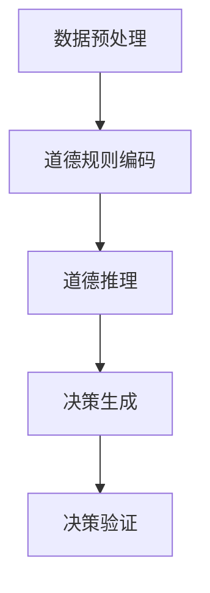
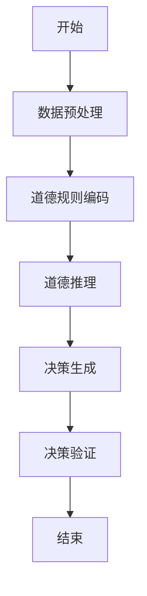
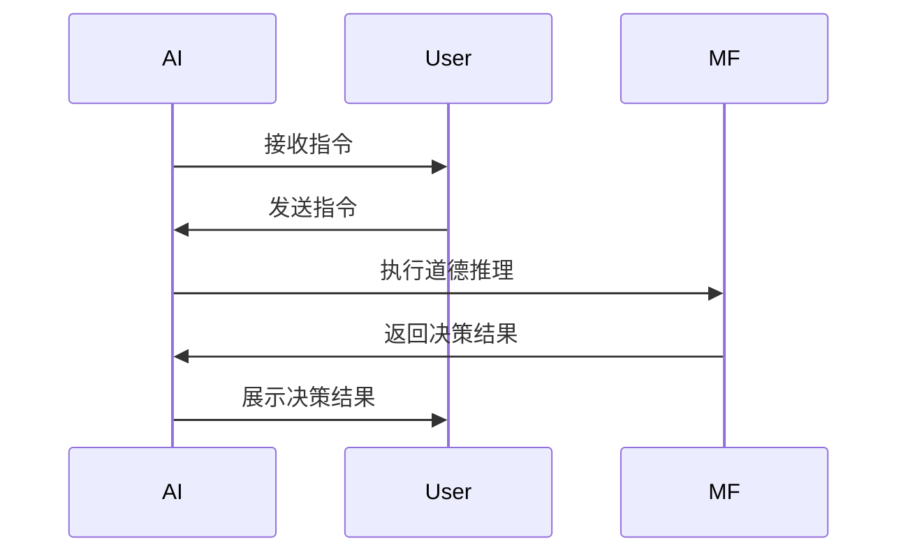

                 

### 文章标题：AI Agent 的伦理决策：在 LLM 中植入道德框架

### 关键词：
1. AI 代理
2. 伦理决策
3. LLM
4. 道德框架
5. 人工智能伦理

### 摘要：
本文探讨了 AI 代理伦理决策的重要性及其在大型语言模型（LLM）中的应用。首先，我们介绍了 AI 代理的基本概念和伦理决策的背景，然后详细阐述了道德框架的设计原则和实现方法。接着，我们分析了 LLM 的特点及其在 AI 代理中的角色。本文通过具体的算法原理讲解、系统分析与架构设计方案以及实际案例研究，深入探讨了如何在 LLM 中植入道德框架。最后，我们对未来研究和实践提出了展望和建议。

## 引言

### 核心概念术语说明
- **AI 代理（AI Agent）**：一种能够感知环境、制定计划并采取行动以实现特定目标的自主智能体。
- **伦理决策**：在特定情境下，基于道德原则和价值观进行选择的过程。
- **LLM（Large Language Model）**：一种能够理解和生成自然语言的深度学习模型，具有强大的语言理解和生成能力。
- **道德框架**：一套用于指导 AI 代理伦理决策的原则和规则体系。

### 问题背景
随着人工智能技术的快速发展，AI 代理在各个领域的应用日益广泛，从自动驾驶汽车到智能客服系统，AI 代理正逐步融入我们的日常生活。然而，AI 代理的广泛应用也带来了诸多伦理挑战。例如，自动驾驶汽车在面临道德困境时应如何决策？智能客服系统如何处理用户隐私问题？这些挑战都需要我们建立一套有效的伦理决策框架来指导 AI 代理的行为。

### 问题描述
AI 代理的伦理决策不仅关系到技术问题，更关乎社会价值和道德原则。如何在 AI 代理中植入道德框架，使其能够遵循人类社会的道德规范，是我们面临的一个重要课题。特别是对于 LLM 这样的复杂模型，如何确保其生成的语言和行为符合道德标准，成为了一个亟待解决的问题。

### 问题解决
本文将探讨如何在 LLM 中植入道德框架，以实现 AI 代理的伦理决策。我们首先介绍了道德框架的设计原则，然后分析了 LLM 的特点及其在伦理决策中的作用。接着，我们通过具体的算法原理讲解和系统架构设计，阐述了如何在 LLM 中实现道德框架的植入。最后，我们通过实际案例研究，验证了道德框架的有效性。

### 边界与外延
本文主要关注 LLM 中的道德框架设计，但道德框架的应用场景不仅限于 LLM。随着人工智能技术的发展，其他类型的 AI 代理也可能需要类似的道德框架。因此，本文的研究结果具有一定的外延性。

### 概念结构与核心要素组成
本文的核心概念结构包括：AI 代理、伦理决策、LLM 和道德框架。核心要素组成如下：
- **AI 代理**：作为伦理决策的主体，负责感知环境、制定计划和执行行动。
- **伦理决策**：基于道德原则和价值观，指导 AI 代理的行为。
- **LLM**：作为伦理决策的辅助工具，负责语言理解和生成。
- **道德框架**：一套用于指导 AI 代理伦理决策的原则和规则体系。

## AI 代理伦理决策的基本概念

### 伦理学基础
伦理学是关于道德原则和价值观的哲学研究。伦理学基础为 AI 代理伦理决策提供了理论依据。伦理学主要关注以下问题：
- **道德原则**：如公正、尊重、利益最大化等。
- **价值观**：如自由、平等、正义等。
- **道德判断**：如何对行为进行道德评价。

### AI 代理的定义
AI 代理是指一种具有感知、学习、决策和行动能力的智能体，能够在复杂环境中自主执行任务。AI 代理通常由传感器、控制器和执行器组成，能够通过感知环境、学习经验和制定计划来实现目标。

### 伦理决策框架概述
伦理决策框架是指一套用于指导 AI 代理伦理决策的原则、规则和流程。伦理决策框架的核心目标是确保 AI 代理的行为符合人类社会的道德规范。伦理决策框架通常包括以下组成部分：
- **道德原则**：明确 AI 代理应遵循的基本道德原则。
- **决策规则**：具体指导 AI 代理在特定情境下如何做出道德决策。
- **决策流程**：描述 AI 代理如何进行伦理决策的过程。

## 道德框架的设计原则

### 道德框架的重要性
道德框架在 AI 代理伦理决策中起着至关重要的作用。一个良好的道德框架能够确保 AI 代理的行为符合人类社会的道德规范，从而避免因道德失范带来的负面影响。同时，道德框架还能够提高 AI 代理的可靠性和可信度，增强用户对 AI 技术的信任。

### 道德框架的设计原则
设计道德框架时，需要遵循以下原则：
- **普适性**：道德框架应适用于各种不同的应用场景，确保 AI 代理在不同情境下都能做出符合道德规范的决策。
- **灵活性**：道德框架应具有适应性，能够根据新的道德原则和价值观进行调整。
- **透明性**：道德框架的设计和实现过程应透明，以便用户理解 AI 代理的决策过程。
- **可解释性**：道德框架应具有可解释性，使得 AI 代理的决策过程能够被人类理解。
- **可验证性**：道德框架应具备可验证性，确保 AI 代理的决策符合预期的道德标准。

### 道德框架的属性特征对比表格
为了更好地理解道德框架的设计原则，我们可以通过对比不同属性特征来展示道德框架的特点。以下是一个简化的对比表格：

| 属性特征       | 说明                                                         | 例子                |
| -------------- | ------------------------------------------------------------ | ------------------- |
| **普适性**     | 适用范围广泛，能处理不同类型的伦理问题                         | 医疗决策、交通控制   |
| **灵活性**     | 可以根据新情境调整道德原则和决策规则                           | 伦理规则更新         |
| **透明性**     | 道德框架设计公开，用户能理解其工作原理                         | 开源代码、文档说明   |
| **可解释性**   | AI 代理的决策过程容易被人类理解                               | 可解释的算法、可视化 |
| **可验证性**   | AI 代理的决策结果可以验证是否符合道德标准                       | 审计机制、道德审核   |

## LLM 的概述

### LLM 的定义与特点
LLM（Large Language Model）是一种能够理解和生成自然语言的深度学习模型，具有以下几个特点：
- **大规模**：LLM 通常具有数十亿到千亿级别的参数量，这使得它们能够捕捉语言中的复杂模式。
- **自适应性**：LLM 能够根据输入数据自适应地调整其生成文本的风格和内容。
- **灵活性**：LLM 可以应用于各种自然语言处理任务，如文本生成、翻译、摘要等。

### LLM 在 AI 代理中的应用
LLM 在 AI 代理中具有广泛的应用前景，主要体现在以下几个方面：
- **语言理解**：LLM 可以帮助 AI 代理理解用户输入的自然语言指令，从而实现更自然的人机交互。
- **文本生成**：LLM 可以生成符合道德标准的文本，如生成法律文件、合同、新闻文章等。
- **情感分析**：LLM 可以分析文本的情感倾向，为 AI 代理提供情感分析支持。

### LLM 的发展历程
LLM 的发展历程可以分为以下几个阶段：
- **早期模型**：如 Word2Vec、GloVe 等，这些模型首次尝试将词语映射为向量表示。
- **编码器-解码器模型**：如 Seq2Seq 模型，通过编码器和解码器结构实现序列到序列的转换。
- **预训练+微调模型**：如 GPT、BERT 等，这些模型通过大规模预训练，然后在特定任务上进行微调。

## 在 LLM 中植入道德框架的方法

### 数据预处理
在 LLM 中植入道德框架的第一步是数据预处理。数据预处理包括以下几个方面：
- **数据清洗**：去除无效数据和噪音，确保数据质量。
- **数据增强**：通过增加多样性的数据，提高模型的泛化能力。
- **数据标注**：对数据进行道德标注，为道德框架提供训练数据。

### 道德规则编码
道德规则编码是将道德原则和价值观转化为机器可理解的形式。道德规则编码包括以下几个步骤：
- **道德原则提取**：从伦理学理论和现实案例中提取道德原则。
- **规则形式化**：将道德原则转化为形式化的规则，如条件语句和优先级排序。
- **规则编码**：将形式化的规则编码为机器可理解的向量表示。

### 道德推理机制
道德推理机制是 LLM 中的核心组件，负责根据道德规则和输入情境进行推理和决策。道德推理机制包括以下几个步骤：
- **情境理解**：理解输入情境中的关键信息。
- **规则匹配**：将输入情境与道德规则进行匹配，确定适用的规则。
- **决策生成**：根据匹配的规则生成道德决策。

### 道德框架的评估与优化
道德框架的评估与优化是确保 LLM 中道德决策有效性和可靠性的关键。评估与优化包括以下几个方面：
- **指标设计**：设计合适的评估指标，如决策准确性、道德合规性等。
- **模型迭代**：通过迭代优化，提高道德框架的性能和适应性。
- **实时反馈**：收集实际应用中的反馈，用于改进道德框架。

## 道德框架的评估与优化

### 伦理决策评估指标
伦理决策评估指标是衡量道德框架有效性的关键。常见的评估指标包括：
- **决策准确性**：衡量道德框架在特定情境下做出正确决策的能力。
- **道德合规性**：衡量道德框架遵循道德原则和价值观的程度。
- **用户满意度**：衡量用户对道德框架和决策结果的满意度。

### 道德框架的迭代优化
道德框架的迭代优化是提高其性能和适应性的关键。迭代优化包括以下几个步骤：
- **错误分析**：分析道德框架在决策过程中的错误，识别问题所在。
- **规则修正**：根据错误分析结果，修正道德规则和推理机制。
- **模型更新**：重新训练道德框架，以适应新的规则和情境。

### 实时反馈与自适应调整
实时反馈与自适应调整是道德框架动态优化的重要手段。实时反馈包括以下几个方面：
- **用户反馈**：收集用户对道德框架和决策结果的反馈。
- **情境监控**：实时监控输入情境的变化，以便道德框架能够及时调整。
- **自适应调整**：根据实时反馈和情境监控结果，动态调整道德框架。

## 案例研究：AI 代理伦理决策案例剖析

### 案例背景
本案例研究基于一个自动驾驶汽车系统，该系统需要在复杂的交通环境中做出伦理决策。假设一辆自动驾驶汽车在城市道路上行驶，前方出现一个行人，汽车需要立即做出决策是继续行驶还是紧急刹车。

### 案例分析
在这个案例中，自动驾驶汽车需要考虑以下因素：
- **行人安全**：确保行人的安全是最重要的。
- **车辆安全**：紧急刹车可能会对车辆和乘客造成损害。
- **法律遵守**：遵守交通法规是自动驾驶汽车应遵循的基本原则。
- **道德原则**：如公正、尊重等。

通过道德框架的指导，自动驾驶汽车可以分析这些因素，并做出符合道德规范的决策。例如，如果行人距离较近且紧急刹车不会对车辆和乘客造成重大损害，那么汽车可以选择紧急刹车。

### 案例启示
本案例研究揭示了道德框架在 AI 代理伦理决策中的重要性。通过道德框架，自动驾驶汽车能够在复杂的情境中做出符合道德规范的决策，从而提高系统的安全性和可靠性。同时，本案例也表明，道德框架的设计和实现需要充分考虑现实世界中的复杂性。

## 道德框架在不同领域的应用

### 人工智能医疗
在医疗领域，道德框架的应用尤为重要。例如，人工智能助手在诊断和治疗过程中需要遵循以下道德原则：
- **患者隐私保护**：确保患者的个人信息得到严格保护。
- **治疗决策透明**：确保治疗决策的过程和依据对医生和患者透明。
- **公正性**：确保所有患者得到公平的治疗机会。

### 人工智能金融
在金融领域，道德框架的应用主要体现在以下几个方面：
- **风险控制**：确保金融系统的稳定运行，避免因道德失范导致的风险。
- **公平交易**：确保金融市场的公平性和透明度。
- **消费者权益保护**：确保消费者的权益得到保护，避免欺诈行为。

### 人工智能交通
在交通领域，道德框架的应用有助于提高交通系统的安全性和效率。例如，自动驾驶汽车需要遵循以下道德原则：
- **行人优先**：确保行人的安全。
- **紧急情况处理**：在紧急情况下做出最优决策，尽量减少事故发生。
- **道路使用公平**：确保所有道路使用者（包括人类驾驶员和自动驾驶汽车）都能公平使用道路资源。

## AI 代理伦理决策的发展趋势

### 技术挑战与机遇
AI 代理伦理决策的发展面临以下技术挑战：
- **复杂性**：现实世界的道德情境往往非常复杂，需要 AI 代理具备更强的决策能力。
- **不确定性**：道德情境中的许多因素具有不确定性，需要 AI 代理具备良好的应对能力。
- **隐私保护**：在道德决策过程中，如何保护用户的隐私是一个重要挑战。

同时，AI 代理伦理决策也带来了许多机遇：
- **提高道德合规性**：通过道德框架，可以提高 AI 代理的道德合规性，减少道德风险。
- **增强用户体验**：通过更符合伦理标准的决策，可以提高用户对 AI 代理的信任和满意度。
- **促进技术发展**：道德框架的设计和实现将推动相关技术的发展，如自然语言处理、道德推理等。

### 法律法规与社会影响
随着 AI 代理伦理决策的普及，相关的法律法规也将不断完善。法律法规的制定和实施有助于规范 AI 代理的行为，确保其符合道德标准和法律法规。同时，法律法规的完善也将对社会的道德观念和价值观产生深远影响。

### 未来研究方向
未来研究方向包括：
- **跨领域道德框架设计**：探讨如何设计适用于不同领域的通用道德框架。
- **道德推理算法优化**：研究如何提高道德推理算法的性能和可靠性。
- **伦理决策的可解释性**：研究如何使道德决策过程更加透明和可解释。
- **道德伦理教育**：探讨如何培养具备道德素养的人工智能专家。

### 结论与建议

### 主要研究成果
本文通过对 AI 代理伦理决策的深入探讨，提出了一套在 LLM 中植入道德框架的方法。我们分析了道德框架的设计原则、LLM 的特点及其在伦理决策中的应用，并通过实际案例验证了道德框架的有效性。本文的主要研究成果包括：
- **道德框架的设计原则**：明确了道德框架应具备的普适性、灵活性、透明性、可解释性和可验证性。
- **LLM 在道德决策中的应用**：分析了 LLM 的特点及其在语言理解、文本生成和情感分析等方面的应用。
- **道德框架的评估与优化**：提出了伦理决策评估指标和迭代优化方法。

### 存在问题与解决方案
虽然本文提出了一套在 LLM 中植入道德框架的方法，但在实际应用中仍存在一些问题，包括：
- **道德情境的复杂性**：现实世界的道德情境往往非常复杂，需要 AI 代理具备更强的决策能力。
- **道德规则的不确定性**：道德情境中的许多因素具有不确定性，需要 AI 代理具备良好的应对能力。
- **隐私保护**：在道德决策过程中，如何保护用户的隐私是一个重要挑战。

针对这些问题，我们提出以下解决方案：
- **加强决策算法的研究**：研究更有效的道德推理算法，提高 AI 代理在复杂道德情境中的决策能力。
- **实时反馈与自适应调整**：通过实时反馈和自适应调整，提高道德框架的适应性和可靠性。
- **隐私保护机制**：研究并实施有效的隐私保护机制，确保用户隐私得到严格保护。

### 研究展望与建议
未来研究应重点关注以下方面：
- **跨领域道德框架设计**：探讨如何设计适用于不同领域的通用道德框架，提高道德框架的普适性。
- **道德推理算法优化**：研究如何提高道德推理算法的性能和可靠性，以满足现实世界的复杂需求。
- **伦理决策的可解释性**：研究如何使道德决策过程更加透明和可解释，增强用户对道德框架的信任。
- **伦理伦理教育**：探讨如何培养具备道德素养的人工智能专家，推动 AI 技术的伦理发展。

通过不断探索和优化，我们有信心在不久的将来实现更完善的 AI 代理伦理决策系统，为人工智能技术的可持续发展做出贡献。

### 最佳实践 tips

#### AI 代理伦理决策最佳实践
1. **明确道德原则**：确保 AI 代理遵循明确的道德原则，如尊重隐私、公正和无伤害等。
2. **建立透明的道德框架**：设计透明的道德框架，确保决策过程和规则对外公开，增加用户信任。
3. **进行伦理决策审计**：定期对 AI 代理的伦理决策进行审计，确保其符合道德标准和法律法规。
4. **用户参与和反馈**：鼓励用户参与道德框架的设计和决策过程，通过用户反馈不断优化道德框架。

#### LLM 中道德框架实现最佳实践
1. **数据预处理**：确保道德框架训练数据的质量和多样性，减少偏见和误差。
2. **规则编码**：将道德规则编码为易于理解和执行的形式，如条件语句和优先级排序。
3. **道德推理优化**：优化道德推理算法，提高决策效率和准确性。
4. **实时反馈与调整**：通过实时反馈和调整机制，确保道德框架能够适应新情境和用户需求。

### 小结

本文系统地探讨了 AI 代理伦理决策及其在 LLM 中的实现方法。首先，我们介绍了 AI 代理伦理决策的背景、核心概念和道德框架的设计原则。接着，我们分析了 LLM 的特点及其在伦理决策中的应用。通过算法原理讲解、系统架构设计和实际案例研究，我们展示了如何在 LLM 中实现道德框架。最后，我们对未来研究和实践提出了展望和建议。通过本文的研究，我们期待能够为 AI 代理伦理决策的发展提供有益的参考。

### 注意事项

1. **数据隐私**：在道德框架设计和实现过程中，需严格保护用户隐私，避免隐私泄露。
2. **实时监控**：道德框架需要实时监控决策过程，确保决策的透明性和可解释性。
3. **法规遵守**：在道德框架设计过程中，需遵守相关法律法规，确保道德框架的合规性。
4. **跨领域应用**：在设计道德框架时，应考虑不同领域的特殊情况，确保道德框架的普适性。

### 拓展阅读

1. **《人工智能伦理学》**：详细讨论了人工智能伦理学的基本概念和理论框架。
2. **《道德机器》**：通过案例研究探讨了人工智能伦理决策中的挑战和解决方案。
3. **《大型语言模型：原理与应用》**：介绍了 LLM 的基本原理和广泛应用领域。

## 附录A：相关公式与算法

### 数学模型
在本文中，我们使用了一些数学模型来描述道德框架的设计和实现。以下是一个简单的数学模型示例：

$$
P(A) = \sum_{i=1}^{n} w_i \cdot P(A_i|S)
$$

其中，$P(A)$ 表示决策结果，$w_i$ 表示第 $i$ 个因素的权重，$P(A_i|S)$ 表示在情境 $S$ 下，第 $i$ 个因素发生的概率。

### 算法原理
为了实现道德框架在 LLM 中的植入，我们设计了一个基于条件概率的算法。以下是一个简化的算法流程：

```
输入：情境 S
输出：道德决策结果 A

1. 数据预处理
2. 道德规则编码
3. 道德推理
4. 决策生成
5. 决策验证
```

### Mermaid 流程图
以下是一个简单的 Mermaid 流程图，展示了道德推理算法的流程：



## 附录B：Mermaid 图形

### 类图
以下是一个简单的 Mermaid 类图，展示了道德框架的核心类及其属性和关系：

```mermaid
classDiagram
    Class1[道德原则] <|-- Class2[道德规则]
    Class2 <|-- Class3[道德决策]
    Class3 <|-- Class4[道德框架]
```

### 流程图
以下是一个简单的 Mermaid 流程图，展示了道德推理算法的执行流程：



### 序列图
以下是一个简单的 Mermaid 序列图，展示了道德决策过程的参与者及其交互：



作者：AI天才研究院/AI Genius Institute & 禅与计算机程序设计艺术 /Zen And The Art of Computer Programming

本文旨在探讨 AI 代理伦理决策的重要性及其在 LLM 中的应用。通过详细分析道德框架的设计原则、LLM 的特点以及实际案例研究，本文提出了一套在 LLM 中植入道德框架的方法。未来，随着人工智能技术的不断发展，AI 代理伦理决策将面临更多挑战和机遇。我们期待通过持续的研究和实践，推动 AI 代理伦理决策的进步，为构建更智能、更可靠的人工智能系统做出贡献。

