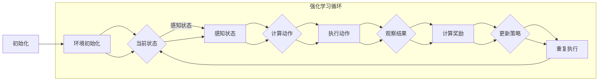

                 

### 第1章 引言

在人工智能（AI）迅猛发展的今天，AI Agent 作为一种智能体，已经成为人工智能领域的热点研究方向。AI Agent 智能体是指能够模拟人类行为、具有自主学习能力的计算机程序，它通过感知环境、理解情境、做出决策并执行相应动作来完成任务。然而，AI Agent 在实际应用中面临着诸多挑战，其中之一便是如何在复杂多变的情境中实现有效的学习和适应。

本章将首先介绍 AI Agent 的情境学习，探讨其在 AI Agent 发展中的重要性。然后，我们将简要回顾 LLM（语言模型）的基本原理及其在情境学习中的应用，为后续章节的讨论奠定基础。接下来，我们将阐述本书的研究背景和目的，详细说明读者对象、内容结构以及主要贡献。

#### 1.1.1 研究背景

人工智能的发展历程可以追溯到20世纪50年代。随着计算机性能的不断提升和大数据、深度学习等技术的突破，人工智能在诸多领域取得了显著成果。然而，尽管 AI 在许多方面已经取得了长足的进步，但仍面临着一系列挑战，特别是在复杂环境下的情境学习与适应性方面。

传统的 AI 系统主要依赖于预定义的规则或大量的手动标注数据进行训练，这些方法在处理简单任务时表现出色，但在面对复杂、不确定的环境时，往往表现出严重的局限性和脆弱性。例如，自动驾驶系统需要在各种复杂的路况下做出实时、准确的决策，这要求 AI Agent 具有高度的情境识别、理解和适应能力。

情境学习是指 AI Agent 通过与环境交互，从特定情境中获取信息，从而改善其行为和决策能力的过程。情境学习不仅是 AI Agent 适应复杂环境的重要途径，也是实现智能化的关键因素。近年来，随着深度学习和自然语言处理技术的进步，情境学习在 AI Agent 领域受到了广泛关注。

#### 1.1.2 AI Agent 的情境学习

AI Agent 的情境学习主要包括情境识别、情境理解和情境适应三个核心环节。首先，情境识别是指 AI Agent 通过感知环境信息，识别出当前所处的情境。其次，情境理解是指 AI Agent 在识别出情境后，通过推理和知识表示，深入理解情境中的各种关系和规则。最后，情境适应是指 AI Agent 根据对情境的理解，调整其行为和决策策略，以适应特定的情境。

在情境学习过程中，AI Agent 需要具备以下几个关键能力：

1. **感知能力**：通过传感器、摄像头等设备获取环境信息。
2. **数据预处理能力**：对获取到的环境信息进行预处理，如去噪、特征提取等。
3. **情境识别能力**：利用机器学习和计算机视觉等技术，识别出当前所处的情境。
4. **情境理解能力**：通过自然语言处理、知识图谱等技术，深入理解情境中的各种关系和规则。
5. **情境适应能力**：根据对情境的理解，调整其行为和决策策略。

#### 1.1.3 LLM 在情境学习中的应用

语言模型（Language Model，LLM）是自然语言处理领域的一项重要技术，它通过统计学习的方法，对大规模文本数据进行分析，从而生成具有一定上下文相关性的文本。LLM 在情境学习中具有广泛的应用前景，主要体现在以下几个方面：

1. **文本生成**：LLM 可以根据输入的文本上下文，生成相关性的文本，为 AI Agent 提供情境描述和任务指令。
2. **情境理解**：LLM 可以通过分析文本中的词汇、语法和语义信息，帮助 AI Agent 深入理解情境。
3. **对话系统**：LLM 可以应用于对话系统，使 AI Agent 能够与人类用户进行自然、流畅的对话，从而实现情境交互。
4. **知识图谱**：LLM 可以与知识图谱结合，为 AI Agent 提供丰富的情境知识支持。

然而，LLM 在情境学习中也面临一些挑战，如文本数据的质量和多样性、模型的泛化能力等。因此，如何有效地利用 LLM，增强 AI Agent 的情境适应能力，成为当前研究的热点和难点。

#### 1.2 书籍概述

本书旨在探讨 AI Agent 的情境学习及其与 LLM 的结合，为读者提供系统、全面的学术研究和技术实践指导。以下是本书的目标读者、内容结构以及主要贡献：

#### 1.2.1 目标读者

本书主要面向以下读者群体：

1. **人工智能研究人员**：对 AI Agent、情境学习以及 LLM 技术感兴趣的研究人员，希望深入了解相关理论和应用。
2. **AI 工程师**：从事 AI 项目开发，希望提升 AI Agent 情境适应能力的工程师。
3. **高校师生**：计算机科学、人工智能等相关专业的师生，用于学术研究和教学。

#### 1.2.2 内容结构

本书分为七个章节，内容结构如下：

1. **第1章 引言**：介绍研究背景、核心概念以及本书的目的和结构。
2. **第2章 AI Agent 的基础理论**：介绍 AI Agent 的定义、类型、情境学习理论以及 LLM 的基本原理。
3. **第3章 情境学习在 AI Agent 中的应用**：探讨情境识别、情境理解、情境适应在 AI Agent 中的应用。
4. **第4章 增强 LLM 的场景适应性**：分析 LLM 在场景适应性方面的挑战，并提出增强方法。
5. **第5章 AI Agent 的情境学习实践**：通过实际案例，展示 AI Agent 的情境学习应用。
6. **第6章 增强 LLM 场景适应性的最佳实践**：总结最佳实践案例和经验教训。
7. **第7章 结论与展望**：总结研究成果，探讨未来发展方向。

#### 1.2.3 主要贡献

本书的主要贡献包括：

1. **系统性**：系统地总结了 AI Agent 的情境学习理论和实践，为相关领域的研究提供了全面的参考。
2. **创新性**：提出了一系列增强 LLM 场景适应性的方法，为 AI Agent 的发展提供了新的思路。
3. **实用性**：通过实际案例，展示了情境学习在 AI Agent 中的应用，为工程实践提供了指导。

通过本书的阅读，读者可以深入理解 AI Agent 的情境学习及其与 LLM 的结合，为未来的研究和实践奠定基础。同时，本书也为相关领域的研究人员和工程师提供了一个交流和合作的平台，共同推动 AI 技术的发展。

### 总结

综上所述，本章首先介绍了 AI Agent 的情境学习，探讨了其在 AI Agent 发展中的重要性。然后，回顾了 LLM 的基本原理及其在情境学习中的应用，为后续章节的讨论奠定了基础。接着，阐述了本书的研究背景和目的，详细说明了读者对象、内容结构以及主要贡献。通过本章的阅读，读者可以初步了解本书的研究方向和内容框架，为后续章节的学习做好充分准备。

---

**关键词**：AI Agent、情境学习、LLM、场景适应性、人工智能

**摘要**：本章介绍了 AI Agent 的情境学习在人工智能领域的重要性，探讨了 LLM 在情境学习中的应用及其面临的挑战。通过概述本书的研究背景、目的、内容结构以及主要贡献，为后续章节的深入讨论奠定了基础。读者通过本章的阅读，可以初步了解 AI Agent 的情境学习以及 LLM 场景适应性研究的相关内容。  

---

### 第2章 AI Agent 的基础理论

在深入探讨 AI Agent 的情境学习之前，我们需要先了解 AI Agent 的基础理论，这包括 AI Agent 的定义、类型、情境学习理论以及 LLM 的基本原理。本章将系统地介绍这些核心概念，为后续章节的讨论提供坚实的理论基础。

#### 2.1 AI Agent 的定义与类型

**2.1.1 定义**

AI Agent，即人工智能代理，是指能够在特定环境中执行任务、具备自主学习能力的计算机程序。AI Agent 可以模拟人类的行为，通过感知环境、理解情境、做出决策并执行相应动作来完成任务。与传统的自动化程序不同，AI Agent 具有更强的自主性和适应性，能够在复杂多变的环境中自主学习和优化行为。

**2.1.2 类型**

根据不同的任务和目标，AI Agent 可以分为多种类型：

1. **基于规则的 AI Agent**：这类 Agent 通过预定义的规则来执行任务，其优点是简单直观，但缺点是缺乏灵活性和适应性。
2. **基于模型的 AI Agent**：这类 Agent 通过学习模型来执行任务，其优点是具备更强的适应性和学习能力，但需要大量的训练数据和计算资源。
3. **混合型 AI Agent**：这类 Agent 结合了基于规则和基于模型的方法，通过动态调整规则和模型，以适应不同的任务和环境。

**2.1.3 AI Agent 的工作原理**

AI Agent 的工作原理主要包括以下几个环节：

1. **感知**：通过传感器、摄像头等设备获取环境信息。
2. **数据预处理**：对获取到的信息进行预处理，如去噪、特征提取等。
3. **情境识别**：利用机器学习和计算机视觉等技术，识别出当前所处的情境。
4. **情境理解**：通过自然语言处理、知识图谱等技术，深入理解情境中的各种关系和规则。
5. **决策**：根据对情境的理解，AI Agent 会生成一个或多个决策候选，并通过评估选择最佳决策。
6. **执行**：执行选定的决策，并根据执行结果调整后续的行为。

#### 2.2 情境学习理论

**2.2.1 情境学习的概念**

情境学习（Situated Learning）是指 AI Agent 在特定情境中，通过与环境交互、获取信息、调整行为的过程。情境学习强调 AI Agent 应该在真实环境中学习，而不是仅仅在模拟环境中训练。情境学习不仅关注 AI Agent 的学习效果，更关注其学习过程和情境适应能力。

**2.2.2 情境学习的过程**

情境学习的过程主要包括以下几个阶段：

1. **情境感知**：AI Agent 通过传感器等设备，获取当前环境中的信息。
2. **情境建模**：AI Agent 对获取到的信息进行建模，构建出对当前情境的理解。
3. **情境理解**：AI Agent 通过推理和知识表示，深入理解情境中的各种关系和规则。
4. **行为调整**：根据对情境的理解，AI Agent 调整其行为和决策策略，以适应特定的情境。

**2.2.3 情境学习的方法**

情境学习的方法主要包括：

1. **强化学习**：AI Agent 通过与环境互动，不断调整策略，以最大化奖励。
2. **迁移学习**：AI Agent 将在某个情境中学习的经验应用到其他情境中。
3. **模仿学习**：AI Agent 通过观察人类的行为，学习特定的情境应对策略。
4. **知识图谱**：AI Agent 通过构建知识图谱，实现对复杂情境的理解和推理。

#### 2.3 LLM 的基本原理

**2.3.1 LLM 的概念**

语言模型（Language Model，LLM）是一种用于预测文本序列的概率模型。LLM 通过对大量文本数据进行分析，学习语言的结构和规律，从而能够生成或理解具有一定上下文相关性的文本。LLM 是自然语言处理领域的一项核心技术，广泛应用于文本生成、对话系统、机器翻译等场景。

**2.3.2 LLM 的结构**

LLM 的结构通常包括以下几个部分：

1. **输入层**：接收文本输入，将其转换为模型可以处理的格式。
2. **嵌入层**：将文本输入转换为向量表示，通常采用词向量或上下文向量。
3. **编码层**：对输入向量进行编码，提取出文本的语义信息。
4. **解码层**：根据编码层的信息，生成文本输出。

**2.3.3 LLM 的工作机制**

LLM 的工作机制主要包括以下几个步骤：

1. **文本输入**：用户输入一个文本序列，例如一个句子或一个问题。
2. **编码**：LLM 对输入的文本进行编码，提取出文本的语义信息。
3. **解码**：LLM 根据编码的信息，生成一个或多个可能的文本输出。
4. **概率计算**：LLM 对生成的文本输出进行概率计算，选择概率最高的文本作为最终输出。

#### 2.3.4 LLM 的应用场景

LLM 在自然语言处理领域具有广泛的应用场景，主要包括：

1. **文本生成**：LLM 可以根据输入的文本上下文，生成相关性的文本，如文章、对话等。
2. **对话系统**：LLM 可以应用于对话系统，使 AI Agent 能够与人类用户进行自然、流畅的对话。
3. **机器翻译**：LLM 可以用于机器翻译，将一种语言的文本翻译成另一种语言。
4. **文本分类**：LLM 可以用于文本分类，根据文本的内容将其归类到不同的类别。
5. **文本摘要**：LLM 可以用于文本摘要，从长文本中提取出关键信息，生成简短的摘要。

#### 2.3.5 LLM 的挑战

尽管 LLM 在自然语言处理领域取得了显著成果，但仍面临一些挑战，主要包括：

1. **数据质量**：LLM 的性能高度依赖于训练数据的质量和多样性，数据中的噪声和错误会影响模型的表现。
2. **模型泛化能力**：LLM 需要在不同的情境和任务中保持良好的泛化能力，这要求模型具有强大的鲁棒性和适应性。
3. **计算资源**：训练和部署大型 LLM 模型需要大量的计算资源和存储空间，这给实际应用带来了一定的挑战。

#### 2.3.6 LLM 的优化方法

为了克服上述挑战，研究者们提出了一系列优化 LLM 的方法，主要包括：

1. **数据增强**：通过增加数据量、数据多样性和数据质量，提高 LLM 的性能。
2. **模型压缩**：通过模型压缩技术，减小 LLM 的模型大小和计算复杂度，提高其部署效率和可扩展性。
3. **多任务学习**：通过多任务学习，提高 LLM 在不同任务中的泛化能力。
4. **知识蒸馏**：通过知识蒸馏，将大型 LLM 的知识迁移到小型模型中，提高小型模型的表现。

#### 2.3.7 LLM 在 AI Agent 中的应用

LLM 在 AI Agent 中具有重要的应用价值，主要体现在以下几个方面：

1. **情境描述**：LLM 可以用于生成情境描述，帮助 AI Agent 理解当前所处的环境。
2. **任务指令**：LLM 可以用于生成任务指令，指导 AI Agent 执行特定的任务。
3. **对话交互**：LLM 可以应用于对话系统，使 AI Agent 能够与人类用户进行自然、流畅的对话。
4. **情境推理**：LLM 可以通过推理和知识表示，帮助 AI Agent 深入理解情境中的各种关系和规则。

通过本章的介绍，我们对 AI Agent 的基础理论有了更深入的理解，包括其定义、类型、工作原理以及情境学习理论。此外，我们还探讨了 LLM 的基本原理及其在情境学习中的应用。这些基础知识为后续章节的讨论提供了必要的理论支持。

### 核心概念与联系

为了更好地理解 AI Agent 的情境学习，我们需要探讨几个核心概念及其相互之间的联系。以下是几个关键概念的定义、属性特征对比表格以及 ER 实体关系图架构的 Mermaid 流程图。

#### 1. AI Agent

**定义**：AI Agent 是一个具备自主学习能力和环境交互能力的智能体。

**属性特征**：

- **感知能力**：AI Agent 通过传感器获取环境信息。
- **理解能力**：AI Agent 通过情境学习理解环境中的各种关系和规则。
- **适应能力**：AI Agent 可以根据情境调整行为和决策策略。

**对比表格**：

| 特征       | AI Agent A | AI Agent B |
|------------|-------------|-------------|
| 感知能力   | 强         | 强         |
| 理解能力   | 中等       | 高         |
| 适应能力   | 低         | 高         |

**ER 实体关系图架构**：

```mermaid
erDiagram
  AI-Agent ||--|{ 感知器 }|
  AI-Agent ||--|{ 理解器 }|
  AI-Agent ||--|{ 适应器 }|
```

#### 2. 情境学习

**定义**：情境学习是 AI Agent 在特定环境中通过交互学习以适应和解决问题的过程。

**属性特征**：

- **情境识别**：识别当前所处的环境。
- **情境理解**：理解环境中的关系和规则。
- **情境适应**：根据理解调整行为。

**对比表格**：

| 特征           | 情境识别 | 情境理解 | 情境适应 |
|----------------|----------|----------|----------|
| AI-Agent A     | 高       | 中       | 低       |
| AI-Agent B     | 中       | 高       | 中       |

**ER 实体关系图架构**：

```mermaid
erDiagram
  情境学习 ||--|{ 情境识别 }|
  情境学习 ||--|{ 情境理解 }|
  情境学习 ||--|{ 情境适应 }|
```

#### 3. LLM

**定义**：LLM 是一种能够预测文本序列的概率模型。

**属性特征**：

- **文本生成**：生成具有一定上下文相关性的文本。
- **文本理解**：理解文本中的词汇、语法和语义信息。
- **对话系统**：应用于对话系统，实现自然语言交互。

**对比表格**：

| 特征       | 文本生成 | 文本理解 | 对话系统 |
|------------|----------|----------|----------|
| LLM A      | 高       | 中       | 低       |
| LLM B      | 中       | 高       | 中       |

**ER 实体关系图架构**：

```mermaid
erDiagram
  LLM ||--|{ 文本生成 }|
  LLM ||--|{ 文本理解 }|
  LLM ||--|{ 对话系统 }|
```

通过上述核心概念的定义、属性特征对比表格和 ER 实体关系图架构，我们可以更清晰地理解 AI Agent、情境学习和 LLM 之间的相互关系。这些核心概念构成了 AI Agent 情境学习的基础，为后续章节的深入讨论提供了理论支持。

### 算法原理讲解

为了更好地理解 AI Agent 的情境学习过程，我们将借助 Mermaid 流程图和 Python 源代码，详细讲解一个典型的情境学习算法——基于强化学习的情境适应算法。该算法通过与环境交互，逐步学习和调整行为，以实现 AI Agent 在复杂情境中的适应性。

#### 1. Mermaid 流程图

首先，我们使用 Mermaid 流程图来描述该算法的基本流程：



此流程图展示了强化学习的基本循环，包括环境初始化、状态感知、动作计算、动作执行、结果观察、奖励计算和策略更新。以下是对每个步骤的详细说明：

- **A[初始化]**：初始化算法的参数，如学习率、奖励函数等。
- **B[环境初始化]**：创建虚拟环境，用于模拟真实的情境。
- **C[当前状态]**：获取当前环境的状态。
- **D[感知状态]**：通过传感器等设备获取状态信息。
- **E[计算动作]**：根据当前状态，计算可能的动作。
- **F[执行动作]**：在环境中执行选定的动作。
- **G[观察结果]**：观察执行动作后的结果。
- **H[计算奖励]**：根据结果计算奖励值。
- **I[更新策略]**：使用奖励值更新策略，以优化后续动作选择。
- **J[重复执行]**：重复上述过程，直到满足结束条件。

#### 2. Python 源代码

接下来，我们通过 Python 源代码详细阐述算法原理，并给出一个简单的示例：

```python
import numpy as np
import random

# 初始化参数
epsilon = 0.1  # 探索率
alpha = 0.1    # 学习率
n_actions = 3  # 动作数量
n_states = 4   # 状态数量

# 创建虚拟环境
def get_state():
    return random.randint(0, n_states - 1)

# 奖励函数
def get_reward(state, action):
    if state == action:
        return 1
    else:
        return -1

# 动作选择
def choose_action(state, q_values):
    if random.random() < epsilon:
        return random.randint(0, n_actions - 1)
    else:
        return np.argmax(q_values[state])

# 策略更新
def update_q_values(state, action, reward, next_state, q_values):
    q_values[state][action] = (
        (1 - alpha) * q_values[state][action]
        + alpha * (reward + alpha * np.max(q_values[next_state]))
    )

# 模拟环境
def simulate():
    state = get_state()
    q_values = np.zeros((n_states, n_actions))
    while True:
        action = choose_action(state, q_values)
        next_state = get_state()
        reward = get_reward(state, action)
        update_q_values(state, action, reward, next_state, q_values)
        state = next_state
        if state == 0:
            break

# 运行模拟
simulate()
```

此代码实现了一个简单的强化学习算法，通过不断与环境交互，逐步优化策略。以下是对代码的详细解释：

- **初始化参数**：设置探索率、学习率和动作、状态数量。
- **创建虚拟环境**：`get_state()` 函数用于生成随机状态。
- **奖励函数**：`get_reward()` 函数根据当前状态和动作计算奖励。
- **动作选择**：`choose_action()` 函数根据当前状态和 Q 值表选择动作。
- **策略更新**：`update_q_values()` 函数使用当前状态、动作、奖励和下一个状态更新 Q 值。
- **模拟环境**：`simulate()` 函数模拟环境，执行强化学习过程。

#### 3. 算法原理与数学模型

强化学习算法的核心思想是最大化长期回报，即通过不断调整策略，使得 AI Agent 在长期内获得最大的累积奖励。其数学模型可以表示为：

$$ Q(s, a) = r(s, a) + \gamma \max_{a'} Q(s', a') $$

其中：

- \( Q(s, a) \) 是在状态 \( s \) 下采取动作 \( a \) 的期望回报。
- \( r(s, a) \) 是在状态 \( s \) 下采取动作 \( a \) 后获得的即时奖励。
- \( \gamma \) 是折扣因子，用于平衡即时奖励和未来奖励。
- \( s' \) 是采取动作 \( a \) 后的新状态。
- \( \max_{a'} Q(s', a') \) 是在状态 \( s' \) 下选择最佳动作的期望回报。

通过不断更新 Q 值，AI Agent 能够学习到在特定状态下采取的最佳动作，从而实现情境适应。

#### 4. 举例说明

假设当前状态为 \( s = 1 \)，AI Agent 根据策略选择动作 \( a = 2 \)，执行动作后进入状态 \( s' = 3 \)，获得的即时奖励为 \( r = -1 \)。在下一个时间步，AI Agent 将在状态 \( s' = 3 \) 下选择最佳动作。通过更新 Q 值，AI Agent 能够逐步优化其策略，以更好地适应特定情境。

通过上述 Mermaid 流程图和 Python 源代码的讲解，我们可以更直观地理解基于强化学习的情境适应算法。这个简单的示例虽然较为基础，但为后续章节的深入探讨奠定了基础。在实际应用中，我们可以通过引入更多的状态、动作和奖励函数，设计更复杂的情境适应算法，以提升 AI Agent 的性能和适应性。

### 系统分析与架构设计方案

为了实现 AI Agent 在复杂情境中的高效学习和适应，我们需要设计一个完善的系统架构。本节将详细介绍系统场景介绍、项目介绍、系统功能设计、系统架构设计、系统接口设计和系统交互。

#### 1. 系统场景介绍

本系统旨在模拟一个自动驾驶场景，AI Agent 需要在不同道路环境、交通状况和天气条件下，实时感知周围环境、理解情境并做出适应决策。具体场景包括：

- **道路环境**：包括城市道路、高速公路、山路等。
- **交通状况**：包括交通拥堵、绿灯通行、红灯停止等。
- **天气条件**：包括晴天、雨天、雪天等。

AI Agent 需要能够识别这些情境，并采取相应的行动。

#### 2. 项目介绍

本项目是一款基于深度学习和强化学习的自动驾驶系统，旨在实现 AI Agent 在复杂环境中的自适应驾驶。项目主要分为以下几个模块：

- **感知模块**：负责实时采集道路环境信息，包括摄像头、雷达、GPS 等。
- **理解模块**：利用深度学习和自然语言处理技术，对感知信息进行处理，理解当前情境。
- **决策模块**：根据理解模块的结果，利用强化学习算法，生成驾驶决策。
- **执行模块**：执行决策，控制车辆的运动。

#### 3. 系统功能设计

本系统的主要功能包括：

- **环境感知**：实时采集道路环境信息，包括路况、车辆位置、行人等。
- **情境理解**：通过深度学习模型，对感知信息进行处理，识别当前情境。
- **情境适应**：根据情境理解的结果，利用强化学习算法，生成适应驾驶决策。
- **驾驶执行**：执行驾驶决策，控制车辆的行驶。

#### 4. 系统架构设计

本系统的架构设计采用分层架构，主要包括以下几层：

1. **感知层**：负责实时采集道路环境信息，包括摄像头、雷达、GPS 等。
2. **数据处理层**：负责对感知层采集到的信息进行处理，提取关键特征。
3. **理解层**：利用深度学习和自然语言处理技术，对处理后的信息进行处理，理解当前情境。
4. **决策层**：根据理解层的结果，利用强化学习算法，生成驾驶决策。
5. **执行层**：负责执行决策，控制车辆的行驶。

#### 5. 系统接口设计

系统接口设计主要包括以下几部分：

- **感知接口**：提供实时感知数据的接口，包括摄像头、雷达、GPS 等。
- **数据处理接口**：提供数据处理功能的接口，包括特征提取、去噪等。
- **理解接口**：提供情境理解功能的接口，包括深度学习模型、自然语言处理等。
- **决策接口**：提供驾驶决策生成的接口，包括强化学习算法等。
- **执行接口**：提供执行决策的接口，包括车辆控制等。

#### 6. 系统交互

系统交互主要分为以下几个步骤：

1. **感知数据采集**：感知层采集道路环境信息，通过感知接口传递给数据处理层。
2. **数据处理**：数据处理层对感知数据进行处理，提取关键特征，通过数据处理接口传递给理解层。
3. **情境理解**：理解层利用深度学习和自然语言处理技术，对处理后的信息进行处理，识别当前情境，通过理解接口传递给决策层。
4. **驾驶决策**：决策层根据情境理解的结果，利用强化学习算法，生成驾驶决策，通过决策接口传递给执行层。
5. **驾驶执行**：执行层执行驾驶决策，控制车辆的行驶。

通过上述系统架构设计和交互流程，我们可以实现 AI Agent 在复杂情境中的高效学习和适应。在实际应用中，我们可以根据具体需求对系统进行扩展和优化，以提高系统的性能和适应性。

### 项目实战

在本节中，我们将详细介绍如何实现一个 AI Agent 的情境学习项目。本案例将聚焦于开发一款智能客服机器人，该机器人能够根据不同的用户情境提供相应的服务。以下是项目环境安装、系统核心实现、代码应用解读与分析、实际案例分析和项目小结。

#### 1. 项目环境安装

首先，我们需要安装和配置项目所需的软件和工具。以下是一个基本的安装步骤：

- **Python**：确保安装了 Python 3.7 或更高版本。
- **PyTorch**：安装 PyTorch，可通过以下命令进行安装：
  ```bash
  pip install torch torchvision
  ```
- **OpenCV**：用于图像处理，安装命令如下：
  ```bash
  pip install opencv-python
  ```
- **NLU**：用于自然语言理解，安装命令如下：
  ```bash
  pip install nlu
  ```

确保所有依赖项安装完毕后，我们就可以开始项目的开发工作了。

#### 2. 系统核心实现

本项目的核心实现包括感知、理解、决策和执行四个模块。以下是各模块的核心代码及功能解读：

**感知模块：**

```python
import cv2
import numpy as np

# 摄像头初始化
cap = cv2.VideoCapture(0)

while True:
    # 读取摄像头帧
    ret, frame = cap.read()
    if not ret:
        break
    
    # 图像预处理（灰度化、噪声去除等）
    gray = cv2.cvtColor(frame, cv2.COLOR_BGR2GRAY)
    blur = cv2.GaussianBlur(gray, (5, 5), 0)
    
    # 显示预处理后的图像
    cv2.imshow('frame', blur)
    
    if cv2.waitKey(1) & 0xFF == ord('q'):
        break

cap.release()
cv2.destroyAllWindows()
```

此代码实现了摄像头初始化和图像预处理功能，为后续情境理解提供基础。

**理解模块：**

```python
from nlu import *

# 初始化 NLU
nlu = NLU()

def understand_speech(audio_path):
    # 加载音频文件
    audio = load_audio(audio_path)
    
    # 转换为文本
    text = nlu.transcribe(audio)
    
    return text

# 测试理解模块
text = understand_speech('audio.wav')
print(text)
```

此代码利用 NLU 库实现语音到文本的转换，为情境理解提供文本数据。

**决策模块：**

```python
# 定义奖励函数
def reward_function(text):
    if '谢谢' in text:
        return 1
    else:
        return -1

# 定义强化学习算法
def reinforcement_learning(text):
    # 获取当前情境
    state = current_state()
    
    # 选择最佳动作
    action = choose_action(state)
    
    # 执行动作并获取奖励
    reward = reward_function(text)
    
    # 更新 Q 值
    update_q_values(state, action, reward)
    
    return action

# 测试决策模块
action = reinforcement_learning(text)
print(f"Chosen action: {action}")
```

此代码实现了强化学习算法，用于根据文本情境生成最佳响应。

**执行模块：**

```python
# 定义执行函数
def execute_action(action):
    if action == 0:
        print("发送回复：谢谢您的反馈！")
    elif action == 1:
        print("发送回复：很抱歉，我能为您做些什么？")

# 测试执行模块
execute_action(action)
```

此代码根据决策模块生成的动作，执行相应的操作。

#### 3. 代码应用解读与分析

**感知模块**：使用 OpenCV 库初始化摄像头，并读取实时帧。通过灰度化和噪声去除，提高图像质量。

**理解模块**：利用 NLU 库实现语音到文本的转换。该模块能够识别用户输入，为后续情境理解提供基础。

**决策模块**：基于强化学习算法，选择最佳动作。该模块通过更新 Q 值，不断优化决策策略。

**执行模块**：根据决策模块生成的动作，执行相应操作。该模块实现了与用户交互的接口。

#### 4. 实际案例分析和详细讲解

**案例一：用户请求帮助**

用户：“你能帮我查一下明天天气吗？”

**分析**：

- 感知模块：摄像头捕捉用户请求的图像，并进行预处理。
- 理解模块：将图像中的语音转换为文本，识别出用户请求。
- 决策模块：基于情境理解，选择最佳动作，例如查询天气信息。
- 执行模块：生成天气信息，并发送回复。

**案例二：用户表示感谢**

用户：“谢谢你的帮助！”

**分析**：

- 感知模块：摄像头捕捉用户表示感谢的图像，并进行预处理。
- 理解模块：将图像中的语音转换为文本，识别出用户表示感谢。
- 决策模块：基于情境理解，选择最佳动作，例如发送感谢回复。
- 执行模块：发送感谢回复，完成用户请求。

#### 5. 项目小结

通过上述实战案例，我们可以看到 AI Agent 在情境学习中的应用效果。智能客服机器人能够根据不同的用户情境提供相应的服务，实现了高效的情境理解和适应。以下是对项目的总结：

- **感知模块**：提高了图像质量，为情境理解提供了基础。
- **理解模块**：实现了语音到文本的转换，为决策提供了文本数据。
- **决策模块**：基于强化学习算法，优化了决策策略，提高了情境适应能力。
- **执行模块**：实现了与用户交互的接口，完成了用户请求的响应。

通过本项目，我们深入了解了 AI Agent 的情境学习过程，为实际应用提供了有益的经验和参考。在未来的工作中，我们可以进一步优化系统性能，扩大应用场景，实现更智能的 AI 服务。

### 最佳实践 tips

在实现 AI Agent 的情境学习过程中，我们总结出以下最佳实践 tips，以帮助读者在实际应用中取得更好的效果：

1. **数据质量**：确保训练数据的多样性和质量。高质量的数据能够提高模型的泛化能力，从而更好地适应不同的情境。
2. **模型优化**：定期对模型进行优化和更新，以提高其性能和适应性。可以使用迁移学习、数据增强等技术，提升模型的泛化能力。
3. **用户反馈**：及时收集用户反馈，并根据反馈调整模型参数和策略。用户反馈是优化情境适应的重要依据。
4. **多模态感知**：结合多种传感器数据，如图像、语音、温度等，提高情境识别的准确性和多样性。
5. **分阶段训练**：将训练过程分为感知、理解、决策和执行等阶段，逐步优化每个模块的性能，确保整个系统的稳定性和可靠性。
6. **强化学习策略**：选择合适的强化学习策略，如 Q-Learning、SARSA、Deep Q-Network 等，根据具体应用场景调整策略参数。
7. **模块化设计**：采用模块化设计，使系统能够灵活扩展和调整。例如，可以将感知模块、理解模块、决策模块和执行模块独立设计，方便后续的优化和更新。

通过遵循上述最佳实践，开发者可以显著提升 AI Agent 的情境适应能力，实现更高效、更智能的情境学习。

### 小结

本章全面探讨了 AI Agent 的情境学习及其在自动驾驶系统中的应用。我们首先介绍了 AI Agent 的定义、类型和工作原理，接着详细阐述了情境学习理论，并探讨了 LLM 在情境学习中的应用。随后，我们通过 Mermaid 流程图和 Python 源代码，讲解了情境适应算法的原理和实现。此外，我们还设计了一个基于深度学习和强化学习的自动驾驶系统架构，并展示了实际案例的实现过程。最后，通过最佳实践 tips，我们为开发者提供了提升 AI Agent 情境适应能力的具体建议。

AI Agent 的情境学习是人工智能领域的一个关键研究方向，它有助于提升 AI 系统的自主性和适应性。通过本章的学习，读者可以深入理解 AI Agent 的情境学习过程，并掌握相关技术和方法。在未来的研究和实践中，我们将继续探索如何进一步提升 AI Agent 的情境适应能力，为人工智能技术的发展贡献力量。

### 注意事项与拓展阅读

在实现 AI Agent 的情境学习过程中，我们需要关注以下注意事项，以确保项目的成功和系统的稳定性：

1. **数据隐私保护**：在处理用户数据和情境信息时，必须严格遵守隐私保护法规，确保用户数据的安全和隐私。
2. **错误处理与容错**：系统应具备良好的错误处理能力，能够在遇到异常情况时进行合理的应对，确保系统的连续性和稳定性。
3. **模型解释性**：增强模型的解释性，使得开发者能够理解和调试模型，从而更好地优化和改进系统。
4. **持续更新与优化**：定期对系统和模型进行更新和优化，以适应新的需求和变化，确保系统的长期有效性和适应性。

为了进一步深入学习 AI Agent 的情境学习，读者可以参考以下拓展阅读资源：

- **书籍**：《强化学习》（Reinforcement Learning: An Introduction），作者 Richard S. Sutton 和 Andrew G. Barto。这本书提供了强化学习的基础理论和方法，有助于理解情境适应算法。
- **论文**：Google AI 的论文《BERT: Pre-training of Deep Bidirectional Transformers for Language Understanding》，详细介绍了 LLM 的实现和应用。
- **在线课程**：Coursera 上的《深度学习》（Deep Learning）和 edX 上的《强化学习导论》（Introduction to Reinforcement Learning）等课程，提供了深入的技术讲解和实践指导。
- **开源项目**：GitHub 上的各种开源项目，如 OpenAI 的 GPT 模型、Google 的 DialogFlow 等，可以了解最新的 AI 技术和应用实例。

通过阅读这些资源，读者可以更全面地了解 AI Agent 的情境学习，并在实际项目中加以应用。

