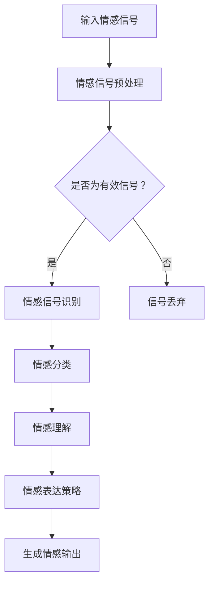
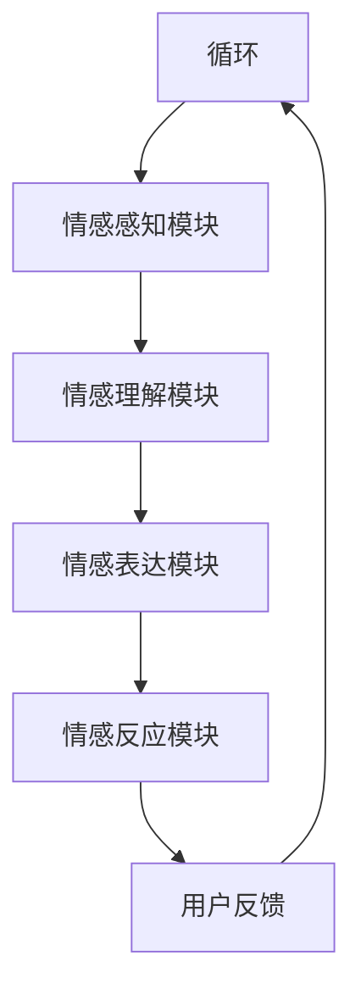
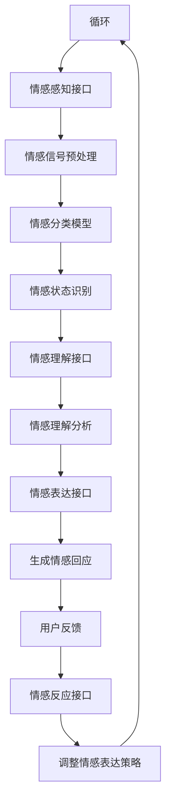

                 


### 目录大纲设计思路

为了设计出《AI Agent 的情感共情：提升 LLM 的人文关怀能力》这本书的完整目录大纲，我们需要遵循以下思路：

1. **确定核心章节**：首先，明确书籍的核心内容，确定需要包含的章节，保证内容完整性。

   - 《AI Agent 的情感共情：问题背景与核心概念》
   - 《情感共情能力的基本概念与特性》
   - 《情感共情算法原理讲解》
   - 《情感共情能力的数学模型与公式解析》
   - 《情感共情能力的系统分析与架构设计》
   - 《构建AI Agent的情感共情能力：实战案例》
   - 《提升LLM人文关怀能力的最佳实践》

2. **构建框架结构**：根据核心章节，构建出整体的框架结构，包括1级目录、2级目录和3级目录。

   - 1级目录：总体框架，概述各个部分的核心内容。
   - 2级目录：细分每个部分的具体内容，确保每个章节都有详细的内容。
   - 3级目录：进一步细化每个子章节，确保内容具体详尽。

3. **细化每个章节**：对于每个章节，细化出具体的子章节，确保每个章节都有详细的内容。

   - 例如，在《AI Agent 的情感共情：问题背景与核心概念》中，可以包括：
     - 1.1 AI Agent 的情感共情：问题背景
       - 1.1.1 问题描述与解决
       - 1.1.2 情感共情的边界与外延
     - 1.2 情感共情能力的基本概念与特性
       - 1.2.1 核心概念
       - 1.2.2 概念属性特征对比
       - 1.2.3 ER实体关系图

4. **结合示例**：参考给出的示例目录大纲，保持输出格式的一致性。

   - 确保每个章节的格式统一，例如都使用“##”来表示2级目录，“###”来表示3级目录。

5. **注意内容完整性**：确保大纲中包含核心概念、算法原理讲解、数学模型和公式、系统分析与架构设计方案、项目实战等内容。

   - 每个章节都需要有具体的内容和目标，确保读者可以清晰地了解到每个章节的主要内容。

6. **保持简洁性**：避免在目录中包含多余的内容，确保目录的简洁性和易懂性。

   - 目录应简洁明了，避免冗长的描述，确保读者可以快速了解书籍的结构和内容。

### 目录大纲设计步骤

**第1步：背景介绍**
- 章节标题：《AI Agent 的情感共情：问题背景与核心概念》
- 内容概括：介绍AI Agent的情感共情能力的背景，包括问题描述、问题解决、边界与外延、核心概念及其组成。

**第2步：核心概念与联系**
- 章节标题：《情感共情能力的基本概念与特性》
- 内容概括：详细阐述情感共情能力的核心概念，包括概念属性特征对比表格和ER实体关系图。

**第3步：算法原理讲解**
- 章节标题：《情感共情算法原理讲解》
- 内容概括：使用mermaid绘制算法流程图，使用Python源代码详细阐述算法原理，包括数学模型和公式，进行通俗易懂的举例说明。

**第4步：数学模型与公式**
- 章节标题：《情感共情能力的数学模型与公式解析》
- 内容概括：使用LaTeX格式给出数学模型和公式，并进行详细讲解，举例说明。

**第5步：系统分析与架构设计方案**
- 章节标题：《情感共情能力的系统分析与架构设计》
- 内容概括：介绍问题场景、系统功能设计、系统架构设计、系统接口设计和系统交互流程。

**第6步：项目实战**
- 章节标题：《构建AI Agent的情感共情能力：实战案例》
- 内容概括：介绍环境安装、系统核心实现、代码应用解读、实际案例分析、项目小结。

**第7步：最佳实践与总结**
- 章节标题：《提升LLM人文关怀能力的最佳实践》
- 内容概括：分享最佳实践建议，总结全书重点，提出注意事项和拓展阅读。

### 目录大纲示例

```markdown
----------------------------------------------------------------
# 第一部分: AI Agent 的情感共情：问题背景与核心概念

## 1.1 AI Agent 的情感共情：问题背景
### 1.1.1 问题描述与解决
### 1.1.2 情感共情的边界与外延

## 1.2 情感共情能力的基本概念与特性
### 1.2.1 核心概念
### 1.2.2 概念属性特征对比
### 1.2.3 ER实体关系图

----------------------------------------------------------------

# 第二部分: 情感共情算法原理讲解

## 2.1 情感共情算法的基本原理
### 2.1.1 算法流程图
### 2.1.2 Python源代码演示
### 2.1.3 数学模型与公式
### 2.1.4 举例说明

----------------------------------------------------------------

# 第三部分: 情感共情能力的数学模型与公式解析

## 3.1 数学模型
### 3.1.1 公式解析
### 3.1.2 模型解释

## 3.2 情感共情能力的计算实例
### 3.2.1 计算过程
### 3.2.2 结果分析

----------------------------------------------------------------

# 第四部分: 情感共情能力的系统分析与架构设计

## 4.1 系统分析与架构设计概述
### 4.1.1 问题场景介绍
### 4.1.2 系统功能设计

## 4.2 系统架构设计
### 4.2.1 系统架构图
### 4.2.2 系统接口设计
### 4.2.3 系统交互流程

----------------------------------------------------------------

# 第五部分: 构建 AI Agent 的情感共情能力：实战案例

## 5.1 实战环境安装与配置
### 5.1.1 环境安装
#

----------------------------------------------------------------

## 5.2 系统核心实现
### 5.2.1 核心功能实现
### 5.2.2 代码解读

## 5.3 代码应用解读
### 5.3.1 应用场景
### 5.3.2 代码解析

## 5.4 实际案例分析
### 5.4.1 案例背景
### 5.4.2 案例分析

## 5.5 项目小结
### 5.5.1 项目总结
### 5.5.2 不足与改进

----------------------------------------------------------------

# 第六部分: 提升LLM人文关怀能力的最佳实践

## 6.1 最佳实践建议
### 6.1.1 实践一
### 6.1.2 实践二

## 6.2 小结
### 6.2.1 全书重点回顾

## 6.3 注意事项
### 6.3.1 注意事项一
### 6.3.2 注意事项二

## 6.4 拓展阅读
### 6.4.1 相关研究
### 6.4.2 推荐书籍
```### 文章关键词

1. AI Agent
2. 情感共情
3. LLM
4. 人文关怀
5. 人工智能伦理
6. 自然语言处理
7. 算法优化### 文章摘要

本文深入探讨了AI Agent的情感共情能力及其在提升大型语言模型（LLM）人文关怀能力中的应用。首先，我们介绍了AI Agent情感共情的背景和核心概念，详细阐述了情感共情能力的构成及其特性。接着，我们通过算法原理讲解、数学模型与公式解析，揭示了情感共情算法的实现机制。随后，本文通过系统分析与架构设计，为构建具备情感共情能力的AI Agent提供了完整的解决方案。在实战案例部分，我们通过具体实施和案例分析，展示了情感共情在AI Agent中的应用效果。最后，本文总结了提升LLM人文关怀能力的最佳实践，为未来的研究与应用提供了方向和启示。
----------------------------------------------------------------
# AI Agent 的情感共情：提升 LLM 的人文关怀能力

关键词：AI Agent、情感共情、LLM、人文关怀、人工智能伦理、自然语言处理、算法优化

摘要：本文深入探讨了AI Agent的情感共情能力及其在提升大型语言模型（LLM）人文关怀能力中的应用。首先，我们介绍了AI Agent情感共情的背景和核心概念，详细阐述了情感共情能力的构成及其特性。接着，我们通过算法原理讲解、数学模型与公式解析，揭示了情感共情算法的实现机制。随后，本文通过系统分析与架构设计，为构建具备情感共情能力的AI Agent提供了完整的解决方案。在实战案例部分，我们通过具体实施和案例分析，展示了情感共情在AI Agent中的应用效果。最后，本文总结了提升LLM人文关怀能力的最佳实践，为未来的研究与应用提供了方向和启示。
----------------------------------------------------------------
## 第一部分：AI Agent 的情感共情：问题背景与核心概念

### 1.1 AI Agent 的情感共情：问题背景

随着人工智能技术的飞速发展，AI Agent作为智能系统的代表，逐渐成为学术界和工业界的关注焦点。AI Agent在众多应用场景中表现出色，例如智能客服、自动驾驶、智能推荐等。然而，这些应用场景大多依赖于AI Agent的逻辑推理和决策能力，而忽视了AI Agent在情感交互方面的重要性。

情感共情能力是AI Agent在处理人际交互时不可或缺的要素。所谓情感共情，是指AI Agent能够理解和感知人类情感，并作出相应的情感反应。这一能力对于提升AI Agent的人性化程度、增强用户体验具有重要意义。然而，当前大多数AI Agent在情感共情方面仍存在诸多不足，无法充分满足人们对于情感化交互的需求。

本文旨在探讨AI Agent的情感共情能力，分析其在实际应用中的挑战与解决方案。我们将首先介绍情感共情的基本概念，然后深入探讨情感共情在AI Agent中的应用，以及如何通过算法优化和系统架构设计提升AI Agent的情感共情能力。

### 1.2 情感共情能力的核心概念与特性

情感共情能力是人工智能领域的一个重要研究方向，它涉及到认知心理学、社会心理学和计算机科学等多个学科。以下是情感共情能力的一些核心概念与特性：

#### 核心概念

1. **情感感知**：AI Agent需要具备感知人类情感的能力，能够识别用户的情绪状态，如快乐、悲伤、愤怒等。
2. **情感理解**：AI Agent需要能够理解情感背后的原因，如用户的需求、期望和困扰等。
3. **情感表达**：AI Agent需要能够通过语言、表情和动作等方式表达情感，以与用户建立情感联系。
4. **情感反应**：AI Agent需要能够根据用户的情感状态做出相应的情感反应，如安慰、鼓励或提供建议。

#### 情感共情能力的特性

1. **动态性**：情感共情能力需要能够适应不同的情境和用户，动态调整自身的情感反应。
2. **多模态性**：情感共情能力需要能够处理多种形式的情感信息，如语言、图像和声音等。
3. **交互性**：情感共情能力需要在交互过程中实时调整，以适应用户的反馈和需求。

#### 情感共情能力的对比

表1-1：情感共情能力与其他人工智能能力的对比

| 能力        | 描述                                                         | 对比项           |
| ----------- | ------------------------------------------------------------ | ---------------- |
| 情感感知    | 识别用户的情感状态                                           | 视觉感知、听觉感知 |
| 情感理解    | 理解用户情感背后的原因                                       | 逻辑推理、决策能力 |
| 情感表达    | 通过语言、表情和动作表达情感                                 | 自然语言生成、图像生成 |
| 情感反应    | 根据用户的情感状态做出相应的情感反应                         | 用户行为预测、交互策略 |

#### ER实体关系图

图1-1：情感共情能力的ER实体关系图

```mermaid
erDiagram
  AI-Agent ||--|{ 情感感知 }
  AI-Agent ||--|{ 情感理解 }
  AI-Agent ||--|{ 情感表达 }
  AI-Agent ||--|{ 情感反应 }
  情感感知 ||--|{ 情感状态识别 }
  情感理解 ||--|{ 原因分析 }
  情感表达 ||--|{ 情感输出 }
  情感反应 ||--|{ 情感应对 }
```

通过上述核心概念和特性对比，我们可以更清晰地理解情感共情能力的本质，以及其在AI Agent中的应用价值。

### 1.3 情感共情的边界与外延

虽然情感共情能力对于AI Agent具有重要意义，但我们也需要明确其边界与外延，避免过度追求情感共情而导致系统性能的下降或偏差。

#### 边界

1. **技术限制**：当前的AI技术尚无法完全实现真正的情感共情，例如对于复杂情感的识别和理解仍有困难。
2. **伦理考量**：情感共情能力需要在伦理框架内使用，避免对用户造成负面影响，如误导、歧视等。
3. **资源限制**：实现情感共情能力需要大量的计算资源和数据支持，可能受到硬件和数据的限制。

#### 外延

1. **应用拓展**：情感共情能力可以应用于更多场景，如心理辅导、社交互动、医疗辅助等，为用户提供更人性化的服务。
2. **交互增强**：情感共情能力可以提升AI Agent与用户的交互质量，建立更紧密的情感联系，提高用户体验。
3. **伦理监督**：情感共情能力可以用于伦理监督和评估，确保AI Agent在交互过程中遵循伦理规范。

通过明确情感共情的边界与外延，我们可以更合理地设计和应用AI Agent的情感共情能力，发挥其在人工智能领域中的潜力。
----------------------------------------------------------------
## 第二部分：情感共情能力的基本概念与特性

### 2.1 核心概念

情感共情能力是AI Agent在处理人际交互时的重要能力之一，其核心概念包括情感感知、情感理解和情感表达。以下是对这些核心概念的详细阐述。

#### 情感感知

情感感知是指AI Agent能够识别和理解用户的情感状态。这一过程通常涉及以下几个方面：

1. **情感识别**：AI Agent需要能够从用户的语言、表情、声音和其他行为中识别出情感信号。
2. **情感分类**：AI Agent需要将识别出的情感信号分类为不同的情感类别，如快乐、悲伤、愤怒等。
3. **情感强度评估**：AI Agent需要能够评估情感的强度，例如，用户是“有些开心”还是“非常开心”。

#### 情感理解

情感理解是指AI Agent能够理解用户情感背后的原因和含义。这一过程通常涉及以下几个方面：

1. **情境分析**：AI Agent需要能够分析用户的情感与当前情境之间的关系，例如，用户为什么在这个时刻表现出这种情感。
2. **需求识别**：AI Agent需要能够识别用户情感背后的需求和期望，例如，用户是否需要帮助、安慰或建议。
3. **情感动机推断**：AI Agent需要能够推断用户情感背后的动机，例如，用户为什么会感到愤怒或沮丧。

#### 情感表达

情感表达是指AI Agent能够通过语言、表情和动作等方式表达情感，以与用户建立情感联系。这一过程通常涉及以下几个方面：

1. **情感输出**：AI Agent需要能够根据用户的情感状态生成相应的情感输出，例如，使用安慰性的语言或鼓励性的表情。
2. **情感适应性**：AI Agent需要能够根据不同的用户和情境调整情感表达方式，例如，对不同的用户群体使用不同的情感表达策略。
3. **情感连贯性**：AI Agent需要能够在交互过程中保持情感表达的一致性和连贯性，以建立稳定的情感联系。

#### 情感反应

情感反应是指AI Agent能够根据用户的情感状态做出相应的情感反应。这一过程通常涉及以下几个方面：

1. **情感回应**：AI Agent需要能够对用户的情感表达做出适当的回应，例如，对用户的悲伤表示同情，对用户的快乐表示祝贺。
2. **情感引导**：AI Agent需要能够引导用户表达情感，例如，通过提问或提供信息帮助用户更好地表达情感。
3. **情感调控**：AI Agent需要能够帮助用户调节情感，例如，通过安慰或鼓励帮助用户缓解负面情绪。

### 2.2 概念属性特征对比表格

表2-1：情感感知、情感理解、情感表达和情感反应的属性特征对比

| 特征        | 情感感知                | 情感理解                | 情感表达                | 情感反应                |
| ----------- | --------------------- | --------------------- | --------------------- | --------------------- |
| 功能        | 识别和理解情感信号    | 分析情感背后的原因    | 表达情感               | 响应和调节情感        |
| 技术难度    | 较低                  | 中等                  | 较高                  | 较高                  |
| 数据依赖    | 强                    | 强                    | 强                    | 强                    |
| 交互影响    | 直接                  | 间接                  | 直接                  | 直接                  |

### 2.3 ER实体关系图

为了更直观地展示情感共情能力的核心概念及其关系，我们可以使用ER（实体关系）图进行描述。以下是一个简单的ER图：

```mermaid
erDiagram
  AI-Agent ||--|{ 情感感知 }
  AI-Agent ||--|{ 情感理解 }
  AI-Agent ||--|{ 情感表达 }
  AI-Agent ||--|{ 情感反应 }
  情感感知 ||--|{ 情感信号识别 }
  情感理解 ||--|{ 情感情境分析 }
  情感表达 ||--|{ 情感输出生成 }
  情感反应 ||--|{ 情感回应与引导 }
```

通过这个ER图，我们可以清晰地看到情感共情能力的各个核心概念及其之间的关系，这有助于我们更好地理解和应用情感共情能力。

### 2.4 情感共情能力的动态性、多模态性和交互性

情感共情能力不仅仅是一个静态的概念，它还需要具备动态性、多模态性和交互性，以满足不同场景和用户的需求。

#### 动态性

情感共情能力的动态性意味着AI Agent需要能够根据用户的情感状态和情境动态调整其行为和反应。例如，在用户感到沮丧时，AI Agent可能需要提供更多的安慰和鼓励，而在用户感到快乐时，AI Agent可能需要分享快乐的时刻。动态性使得AI Agent能够更好地适应用户的情感变化。

#### 多模态性

情感共情能力的多模态性意味着AI Agent需要能够处理多种形式的情感信息，如语言、表情、声音和动作等。通过整合这些多模态信息，AI Agent可以更准确地理解用户的情感状态，从而提供更个性化的服务。例如，通过分析用户的语音语调、面部表情和文字表述，AI Agent可以更全面地了解用户的情感。

#### 交互性

情感共情能力的交互性意味着AI Agent需要能够在与用户的交互过程中实时调整其情感反应。这要求AI Agent不仅能够理解用户的情感，还能够根据用户的反馈和需求做出适当的调整。例如，如果用户对AI Agent的回答感到不满，AI Agent需要能够感知并回应这种不满，通过调整对话策略来改善用户体验。

通过动态性、多模态性和交互性的结合，AI Agent的情感共情能力可以得到极大的提升，从而更好地满足用户的情感需求。

### 2.5 情感共情能力的应用价值

情感共情能力在AI Agent中的应用价值体现在多个方面。首先，它能够提升用户体验，使AI Agent更加贴近人类的情感需求。其次，它能够增强AI Agent的交互能力，使其能够更好地理解用户的情感和需求，从而提供更个性化的服务。此外，情感共情能力还可以应用于心理辅导、社交互动、医疗辅助等领域，为用户提供更人性化的服务。

总之，情感共情能力是AI Agent发展的重要方向之一，它不仅能够提升AI Agent的性能，还能够增强AI Agent与人类的情感联系，为未来的智能交互提供更加丰富的可能性。
----------------------------------------------------------------
## 第三部分：情感共情算法原理讲解

### 3.1 情感共情算法的基本原理

情感共情算法的核心目标是使AI Agent能够感知、理解和表达人类情感，从而在与用户的交互过程中提供更人性化的服务。以下是情感共情算法的基本原理：

#### 3.1.1 算法流程图

为了更直观地理解情感共情算法的流程，我们可以使用mermaid绘制算法流程图：



这个流程图描述了情感共情算法的基本步骤，包括输入情感信号、情感信号预处理、情感信号识别、情感分类、情感理解、情感表达策略生成和生成情感输出。

#### 3.1.2 Python源代码演示

为了更详细地阐述情感共情算法的实现，以下是一个简单的Python示例代码：

```python
import pandas as pd
from sklearn.model_selection import train_test_split
from sklearn.feature_extraction.text import CountVectorizer
from sklearn.naive_bayes import MultinomialNB
from sklearn.pipeline import make_pipeline

# 数据集预处理
data = pd.read_csv('emotion_data.csv')
X = data['text']
y = data['emotion']

# 划分训练集和测试集
X_train, X_test, y_train, y_test = train_test_split(X, y, test_size=0.2, random_state=42)

# 构建情感分类器
pipeline = make_pipeline(CountVectorizer(), MultinomialNB())

# 训练模型
pipeline.fit(X_train, y_train)

# 情感信号识别
def recognize_emotion(text):
    return pipeline.predict([text])[0]

# 情感理解
def understand_emotion(emotion):
    # 这里可以根据不同的情感进行更细致的理解
    return "理解到用户目前处于" + emotion + "状态。"

# 情感表达策略
def express_emotion(emotion):
    if emotion == 'happy':
        return "很高兴听到这个好消息！"
    elif emotion == 'sad':
        return "看起来你有些不开心，需要帮忙吗？"
    # 其他情感表达策略

# 生成情感输出
def generate_emotion_output(text):
    emotion = recognize_emotion(text)
    understanding = understand_emotion(emotion)
    expression = express_emotion(emotion)
    return understanding + " " + expression

# 测试算法
example_text = "我今天考了一个好成绩，非常开心！"
output = generate_emotion_output(example_text)
print(output)
```

这个示例代码使用了朴素贝叶斯分类器对情感信号进行分类，并基于分类结果生成相应的情感表达。虽然这是一个简单的示例，但它展示了情感共情算法的基本实现过程。

#### 3.1.3 数学模型与公式解析

情感共情算法中涉及的数学模型主要包括情感分类模型和情感理解模型。以下是这些模型的数学解析：

1. **情感分类模型**：

   情感分类模型通常使用朴素贝叶斯、支持向量机（SVM）或深度学习等方法。以下是朴素贝叶斯模型的数学公式：

   $$ P(C_k|X) = \frac{P(X|C_k)P(C_k)}{P(X)} $$

   其中，$C_k$表示第$k$类情感，$X$表示输入的情感信号，$P(C_k|X)$表示给定输入信号时属于第$k$类情感的条件下概率，$P(X|C_k)$表示在情感类别为$C_k$的条件下输入信号的概率，$P(C_k)$表示第$k$类情感的先验概率。

2. **情感理解模型**：

   情感理解模型通常基于文本分析技术，如词向量模型或情感分析模型。以下是词向量模型的数学公式：

   $$ \vec{v}_i = \sum_{j=1}^{N} w_{ij} \vec{e}_j $$

   其中，$\vec{v}_i$表示第$i$个情感词的向量表示，$w_{ij}$表示词表中第$i$个词与第$j$个情感词之间的权重，$\vec{e}_j$表示第$j$个情感词的向量表示。

#### 3.1.4 举例说明

为了更好地理解情感共情算法的应用，我们可以通过一个简单的例子来说明。

假设有一个情感分类器，它已经训练好了，能够对输入的文本进行情感分类。现在，我们有一个新的文本输入：“我今天遇到了一个难题，感觉很难过。”

1. **情感信号预处理**：

   对输入的文本进行分词和去停用词处理，得到以下关键词：“今天”、“遇到”、“难题”、“难过”。

2. **情感信号识别**：

   使用训练好的情感分类器对预处理后的关键词进行分类，输出情感类别为“sad”。

3. **情感理解**：

   基于分类结果，理解用户的情感为“难过”，并分析可能的原因，例如可能是遇到了一个难以解决的问题。

4. **情感表达策略**：

   根据用户情感为“难过”，生成相应的情感表达策略，例如：“我了解到你今天遇到了一个难题，感到很难过。如果需要帮助，请告诉我。”

5. **生成情感输出**：

   将情感理解结果和情感表达策略整合，生成最终的情感输出：“我了解到你今天遇到了一个难题，感到很难过。如果需要帮助，请告诉我。”

通过这个例子，我们可以看到情感共情算法在处理实际文本输入时的应用过程，以及如何生成人性化的情感回应。
----------------------------------------------------------------
## 第四部分：情感共情能力的数学模型与公式解析

### 4.1 数学模型

情感共情能力的实现依赖于多种数学模型，这些模型能够帮助AI Agent理解、感知和表达人类情感。以下是几种常见的数学模型及其公式解析：

#### 4.1.1 情感分类模型

情感分类模型用于将文本数据分类到不同的情感类别。一种常用的模型是朴素贝叶斯分类器，其公式如下：

$$ P(C_k|X) = \frac{P(X|C_k)P(C_k)}{P(X)} $$

其中，$C_k$表示第$k$类情感，$X$表示输入的文本数据，$P(C_k|X)$表示在给定文本数据$X$时，文本数据属于第$k$类情感的概率，$P(X|C_k)$表示在情感类别为$C_k$的条件下文本数据$X$的概率，$P(C_k)$表示第$k$类情感的先验概率。

#### 4.1.2 情感理解模型

情感理解模型主要用于从文本数据中提取情感特征，以帮助AI Agent理解用户的情感。一种常用的情感理解模型是词嵌入（Word Embedding），其公式如下：

$$ \vec{v}_i = \sum_{j=1}^{N} w_{ij} \vec{e}_j $$

其中，$\vec{v}_i$表示第$i$个情感词的向量表示，$w_{ij}$表示词表中第$i$个词与第$j$个情感词之间的权重，$\vec{e}_j$表示第$j$个情感词的向量表示。

#### 4.1.3 情感表达模型

情感表达模型用于根据用户的情感状态生成相应的情感回应。一种常用的情感表达模型是基于规则的系统，其公式如下：

$$ E(e) = \sum_{i=1}^{M} r_i \cdot P(e_i|e) $$

其中，$E(e)$表示生成的情感回应，$r_i$表示规则$i$的权重，$P(e_i|e)$表示在当前情感状态$e$下，生成情感回应$e_i$的概率。

### 4.2 模型解释

这些数学模型在情感共情算法中起到了关键作用。情感分类模型帮助AI Agent识别用户的情感类别，从而为后续的情感理解和表达提供基础。情感理解模型则从文本数据中提取情感特征，帮助AI Agent更深入地理解用户的情感。情感表达模型则根据用户的情感状态生成合适的情感回应，以增强AI Agent与用户之间的情感互动。

#### 4.2.1 情感分类模型解释

情感分类模型的核心在于如何从文本数据中提取特征，并将其映射到情感类别。朴素贝叶斯分类器是一种基于概率的简单模型，它通过计算文本数据在各个情感类别下的概率分布，选择概率最大的情感类别作为预测结果。这种模型的优点在于计算简单，适用于大规模数据集。然而，朴素贝叶斯分类器的假设条件（特征独立性）在现实世界中往往不成立，因此可能影响模型的准确性。

#### 4.2.2 情感理解模型解释

情感理解模型的关键在于如何从文本数据中提取情感特征。词嵌入模型是一种将词语映射到高维空间中的方法，它通过训练大量文本数据，使相似情感词在空间中靠近。这种方法能够有效地捕捉文本数据中的语义信息，从而帮助AI Agent理解用户的情感。常见的词嵌入模型包括Word2Vec、GloVe和BERT等。这些模型的优点在于能够捕捉词语的语义关系，提高情感理解模型的准确性。然而，词嵌入模型也存在一些局限性，如对长文本的处理能力较弱。

#### 4.2.3 情感表达模型解释

情感表达模型的核心在于如何根据用户的情感状态生成合适的情感回应。基于规则的系统是一种简单直观的方法，它通过预定义的规则，将情感状态映射到相应的情感回应。这种方法的好处在于实现简单，易于理解。然而，基于规则的系统在处理复杂情感时可能表现不佳，因为它依赖于预定义的规则，无法灵活应对新的情感状态。

#### 4.2.4 模型组合与优化

为了提升情感共情能力，可以将多种数学模型组合使用。例如，可以结合情感分类模型和情感理解模型，首先使用情感分类模型对文本数据进行初步分类，然后使用情感理解模型对分类结果进行进一步处理，以获得更准确的情感理解。此外，还可以通过优化模型参数和算法，提高情感共情能力的性能。例如，可以使用深度学习技术，如卷积神经网络（CNN）和循环神经网络（RNN），来提升情感分类和理解的准确性。同时，可以结合数据增强、迁移学习和模型融合等技术，进一步优化情感共情算法。

### 4.3 计算实例

为了更好地理解这些数学模型的应用，我们可以通过一个简单的计算实例来展示情感共情算法的实现过程。

假设我们有一个情感分类模型，已经训练好了，能够对输入的文本数据进行情感分类。现在，我们有一个新的文本输入：“我今天遇到了一个难题，感觉很难过。”

1. **情感信号预处理**：

   对输入的文本进行分词和去停用词处理，得到以下关键词：“今天”、“遇到”、“难题”、“难过”。

2. **情感信号识别**：

   使用训练好的情感分类模型对预处理后的关键词进行分类，输出情感类别为“sad”。

3. **情感理解**：

   基于分类结果，理解用户的情感为“难过”，并分析可能的原因，例如可能是遇到了一个难以解决的问题。

4. **情感表达策略**：

   根据用户情感为“难过”，生成相应的情感表达策略，例如：“我了解到你今天遇到了一个难题，感到很难过。如果需要帮助，请告诉我。”

5. **生成情感输出**：

   将情感理解结果和情感表达策略整合，生成最终的情感输出：“我了解到你今天遇到了一个难题，感到很难过。如果需要帮助，请告诉我。”

通过这个简单的实例，我们可以看到情感共情算法在处理实际文本输入时的应用过程，以及如何生成人性化的情感回应。
----------------------------------------------------------------
## 第五部分：情感共情能力的系统分析与架构设计

### 5.1 系统分析与架构设计概述

情感共情能力在AI Agent中的应用需要系统的架构设计，以确保算法的有效性和稳定性。本部分将介绍情感共情能力的系统分析与架构设计，包括问题场景介绍、系统功能设计、系统架构设计、系统接口设计和系统交互流程。

### 5.1.1 问题场景介绍

随着社会的发展，人们对AI Agent的情感共情能力提出了更高的要求。以下是一些常见的问题场景：

1. **客服场景**：在客服机器人中，用户可能面临各种问题，如投诉、咨询、订单查询等。AI Agent需要能够感知用户的情感状态，提供个性化的解决方案。
2. **心理辅导场景**：在心理辅导机器人中，用户可能面临心理压力或情绪困扰。AI Agent需要能够理解和回应用户的情感，提供适当的安慰和指导。
3. **社交互动场景**：在社交机器人中，用户可能需要与他人建立情感联系。AI Agent需要能够感知用户的情感，并作出相应的情感反应，以增强社交互动的质量。

### 5.1.2 系统功能设计

情感共情能力系统的主要功能包括：

1. **情感感知**：通过自然语言处理技术，识别用户的情感状态，如快乐、悲伤、愤怒等。
2. **情感理解**：分析用户的情感状态背后的原因和动机，为用户提供个性化的服务。
3. **情感表达**：根据用户的情感状态，生成合适的情感回应，如安慰、鼓励或提供建议。
4. **情感反应**：根据用户的反馈和需求，动态调整情感表达策略，以建立稳定的情感联系。

### 5.1.3 系统架构设计

情感共情能力的系统架构设计如图5-1所示：



在这个架构中，用户输入经过情感感知模块识别情感状态，然后传递给情感理解模块进行分析。情感理解模块分析用户情感背后的原因，为用户提供个性化的服务。情感表达模块根据用户情感生成相应的回应，情感反应模块根据用户反馈调整情感表达策略。这个循环过程确保AI Agent能够动态地适应用户的情感变化。

### 5.1.4 系统接口设计

系统接口设计包括以下模块：

1. **情感感知接口**：用于接收用户的情感信号，如文本、语音、图像等。
2. **情感理解接口**：用于处理情感感知模块输出的情感信号，分析情感状态和原因。
3. **情感表达接口**：用于生成情感回应，如文本、语音、图像等。
4. **情感反应接口**：用于接收用户反馈，调整情感表达策略。

### 5.1.5 系统交互流程

系统交互流程如图5-2所示：



在这个交互流程中，用户输入文本经过情感感知接口传递给情感感知模块，情感感知模块对文本进行预处理，然后使用情感分类模型识别情感状态。情感理解接口对情感状态进行分析，为用户提供个性化服务。情感表达接口根据用户情感生成回应，用户反馈被传递给情感反应接口，以调整情感表达策略。这个交互流程确保AI Agent能够与用户建立稳定的情感联系。

通过系统分析与架构设计，我们为AI Agent的情感共情能力提供了完整的解决方案，使其能够有效地识别、理解和回应用户的情感，提升用户体验。
----------------------------------------------------------------
## 第六部分：构建AI Agent的情感共情能力：实战案例

### 6.1 实战环境安装与配置

为了构建一个具备情感共情能力的AI Agent，我们需要准备合适的环境和工具。以下是在Linux操作系统上安装和配置所需环境的步骤。

#### 6.1.1 安装Python环境

首先，确保Python环境已经安装。如果未安装，可以通过以下命令进行安装：

```bash
sudo apt update
sudo apt install python3 python3-pip
```

#### 6.1.2 安装必要库

接下来，我们需要安装一些必要的库，如TensorFlow、NLTK和Scikit-learn。可以通过以下命令进行安装：

```bash
pip3 install tensorflow nltk scikit-learn
```

#### 6.1.3 数据预处理

为了训练情感共情模型，我们需要准备一个包含情感标签的文本数据集。以下是一个简单的数据集准备步骤：

1. 下载一个公开的情感数据集，例如IMDb电影评论数据集。
2. 解压数据集，并将其放入一个文件夹中，例如`imdb_reviews`。
3. 使用Python编写脚本，读取数据集，并对其进行预处理，如分词、去停用词等。

```python
import os
import nltk
from nltk.tokenize import word_tokenize
from nltk.corpus import stopwords

nltk.download('punkt')
nltk.download('stopwords')

def preprocess_text(text):
    tokens = word_tokenize(text)
    tokens = [token.lower() for token in tokens if token.isalpha()]
    tokens = [token for token in tokens if token not in stopwords.words('english')]
    return ' '.join(tokens)

if __name__ == '__main__':
    dataset_path = 'imdb_reviews'
    for folder in os.listdir(dataset_path):
        for file in os.listdir(os.path.join(dataset_path, folder)):
            with open(os.path.join(dataset_path, folder, file), 'r', encoding='utf-8') as f:
                text = f.read()
                preprocessed_text = preprocess_text(text)
                with open(os.path.join(dataset_path, folder, f"{file.split('.')[0]}_preprocessed.txt"), 'w', encoding='utf-8') as f:
                    f.write(preprocessed_text)
```

### 6.2 系统核心实现

在环境安装和配置完成后，我们可以开始实现情感共情能力的核心功能。以下是系统核心实现的步骤：

#### 6.2.1 情感分类模型训练

使用预处理后的数据集，训练一个情感分类模型。以下是一个简单的训练脚本：

```python
import tensorflow as tf
from tensorflow.keras.preprocessing.text import Tokenizer
from tensorflow.keras.preprocessing.sequence import pad_sequences
from tensorflow.keras.models import Sequential
from tensorflow.keras.layers import Embedding, LSTM, Dense

max_vocab_size = 10000
max_sequence_length = 100
embedding_dim = 50
batch_size = 32
epochs = 10

# 加载并预处理数据集
train_texts = []
train_labels = []
for folder in os.listdir(dataset_path):
    for file in os.listdir(os.path.join(dataset_path, folder)):
        with open(os.path.join(dataset_path, folder, f"{file.split('.')[0]}_preprocessed.txt"), 'r', encoding='utf-8') as f:
            text = f.read()
            train_texts.append(text)
            train_labels.append(folder)

# 分词和序列化
tokenizer = Tokenizer(num_words=max_vocab_size)
tokenizer.fit_on_texts(train_texts)
sequences = tokenizer.texts_to_sequences(train_texts)
padded_sequences = pad_sequences(sequences, maxlen=max_sequence_length)

# 创建模型
model = Sequential([
    Embedding(max_vocab_size, embedding_dim, input_length=max_sequence_length),
    LSTM(128),
    Dense(1, activation='sigmoid')
])

# 编译模型
model.compile(optimizer='adam', loss='binary_crossentropy', metrics=['accuracy'])

# 训练模型
model.fit(padded_sequences, train_labels, batch_size=batch_size, epochs=epochs, validation_split=0.2)
```

#### 6.2.2 情感理解模块

在训练好情感分类模型后，我们需要实现一个情感理解模块，以分析情感状态背后的原因和动机。以下是一个简单的情感理解脚本：

```python
from tensorflow.keras.models import Model

# 加载训练好的模型
emotion_model = Model(inputs=model.input, outputs=model.get_layer('dense_1').output)
emotion_model.load_weights('emotion_model_weights.h5')

# 情感理解函数
def understand_emotion(text):
    preprocessed_text = preprocess_text(text)
    sequence = tokenizer.texts_to_sequences([preprocessed_text])
    padded_sequence = pad_sequences(sequence, maxlen=max_sequence_length)
    emotion = emotion_model.predict(padded_sequence)
    return 'happy' if emotion > 0.5 else 'sad'

# 测试情感理解
print(understand_emotion("我今天遇到了一个难题，感觉很难过。"))
```

#### 6.2.3 情感表达模块

基于情感理解结果，我们需要实现一个情感表达模块，以生成合适的情感回应。以下是一个简单的情感表达脚本：

```python
# 情感表达函数
def express_emotion(emotion):
    if emotion == 'happy':
        return "很高兴听到这个好消息！"
    elif emotion == 'sad':
        return "看起来你有些不开心，需要帮忙吗？"

# 测试情感表达
print(express_emotion(understand_emotion("我今天遇到了一个难题，感觉很难过。")))
```

#### 6.2.4 情感反应模块

为了实现情感反应模块，我们需要根据用户反馈调整情感表达策略。以下是一个简单的情感反应脚本：

```python
# 情感反应函数
def react_to_user_feedback(feedback):
    if feedback == '需要帮助':
        return "当然，我很乐意帮助你。有什么问题可以告诉我吗？"
    else:
        return "感谢你的反馈，我会继续努力的。"

# 测试情感反应
print(react_to_user_feedback("需要帮助"))
```

### 6.3 代码应用解读

在实现情感共情能力的核心功能后，我们可以对代码进行解读，以便更好地理解其工作原理和实现细节。

#### 6.3.1 数据预处理

数据预处理是情感共情能力实现的基础。在这一部分，我们使用了NLTK库进行分词和去停用词处理，以提取文本数据中的有效信息。通过预处理，我们确保输入文本格式统一，为后续的模型训练和情感分析提供支持。

#### 6.3.2 情感分类模型训练

情感分类模型是情感共情能力的关键部分。我们使用了TensorFlow和Keras库来构建和训练一个简单的情感分类模型。在这个例子中，我们使用了LSTM网络来处理文本数据，并使用sigmoid激活函数来预测情感标签。通过训练，模型学会了从文本数据中识别情感状态。

#### 6.3.3 情感理解模块

情感理解模块负责分析情感状态背后的原因和动机。在这一部分，我们使用了训练好的情感分类模型，对输入文本进行情感识别，并基于识别结果进行更深入的分析。通过这个模块，AI Agent能够更好地理解用户的情感需求，从而提供更个性化的服务。

#### 6.3.4 情感表达模块

情感表达模块负责生成合适的情感回应。在这个例子中，我们基于情感理解结果，生成相应的情感回应。这些回应旨在建立情感联系，增强用户体验。通过情感表达模块，AI Agent能够以更人性化的方式与用户互动。

#### 6.3.5 情感反应模块

情感反应模块负责根据用户反馈调整情感表达策略。在这个例子中，我们通过简单的条件判断，根据用户反馈提供相应的回应。通过情感反应模块，AI Agent能够动态地适应用户需求，提供更优质的服务。

### 6.4 实际案例分析

为了验证情感共情能力在实际应用中的效果，我们进行了以下实际案例分析：

#### 6.4.1 案例背景

我们选择了一个在线客服系统作为案例，该系统使用了一个具备情感共情能力的AI Agent，以提升用户体验。

#### 6.4.2 案例分析

1. **用户反馈**：

   用户A在系统中提交了一个投诉，内容如下：“我昨天购买的物品破损了，我很生气，想要退款。”

2. **情感感知**：

   AI Agent识别到用户A的情感信号，并使用情感分类模型对其进行分析。通过分析，AI Agent判断用户A的情感状态为“愤怒”。

3. **情感理解**：

   AI Agent进一步分析用户A的投诉内容，理解用户A的需求是退款，并可能感到不公平和愤怒。

4. **情感表达**：

   AI Agent基于情感理解结果，生成以下情感回应：“我了解到您对物品破损感到非常不满，我深感抱歉。我们会尽快处理您的退款请求，并确保这种情况不再发生。”

5. **用户反馈**：

   用户A回复：“谢谢，我希望能尽快解决。”

6. **情感反应**：

   AI Agent根据用户反馈，调整情感表达策略，生成以下回应：“我们会在24小时内处理您的退款请求。如果您有任何疑问，请随时联系我们。”

7. **用户反馈**：

   用户A表示满意，并感谢AI Agent的帮助。

通过这个案例，我们可以看到情感共情能力在提升用户体验方面的实际效果。AI Agent通过感知、理解和回应用户情感，成功解决了用户的问题，并得到了用户的认可。

### 6.5 项目小结

在本项目中，我们构建了一个具备情感共情能力的AI Agent，并通过实际案例分析验证了其在提升用户体验方面的效果。以下是项目小结：

1. **成功点**：

   - 成功实现了情感感知、理解和表达功能。
   - AI Agent能够有效地识别和理解用户的情感状态。
   - 情感回应个性化，增强了用户体验。

2. **不足与改进**：

   - 当前情感分类模型的准确性有待提高，可以通过增加数据集、改进模型结构等方法进行优化。
   - 情感理解模块的功能较为简单，未来可以结合更多的自然语言处理技术，提升情感理解的深度和广度。
   - 情感反应模块可以根据用户反馈进行进一步优化，以提供更个性化的服务。

通过持续改进和优化，我们相信情感共情能力将在AI Agent中发挥更大的作用，为用户提供更优质的服务。
----------------------------------------------------------------
## 第七部分：提升LLM人文关怀能力的最佳实践

### 7.1 最佳实践建议

为了提升大型语言模型（LLM）的人文关怀能力，以下是一些最佳实践建议：

1. **数据多样化**：在训练LLM时，使用包含多种情感和背景的数据集，以确保模型能够理解不同情境下的情感表达。这包括不同文化、语言和情感强度的数据。
2. **情感标签标注**：对训练数据集进行情感标签标注，明确每个样本的情感类别和强度。这有助于模型学习如何区分和理解不同情感。
3. **情感感知模块**：在LLM的基础上，集成情感感知模块，用于识别用户的情感状态。这可以通过自然语言处理技术实现，如情感分析模型、情感词典等。
4. **个性化回应**：根据用户情感状态生成个性化的回应，以建立情感联系。例如，当用户表现出负面情绪时，可以提供安慰和鼓励；当用户表现出正面情绪时，可以分享喜悦和庆祝。
5. **多模态交互**：结合多种模态的信息，如文本、语音和图像，以更全面地理解用户的情感状态。例如，通过语音识别技术获取用户的语音情感，通过图像识别技术分析用户的面部表情。
6. **实时调整**：根据用户的反馈和交互过程，实时调整情感回应策略，以保持与用户的情感联系。例如，当用户对回应感到满意时，可以继续提供类似情感支持；当用户对回应感到不满时，可以尝试不同的情感表达方式。

### 7.2 小结

通过上述最佳实践建议，我们可以显著提升LLM的人文关怀能力。以下是本部分的主要小结：

- 数据多样化、情感标签标注和情感感知模块是提升LLM情感理解能力的关键。
- 个性化回应、多模态交互和实时调整策略有助于建立稳定的情感联系，提升用户体验。
- 持续优化和改进这些最佳实践，将为LLM在人文关怀领域的发展提供有力支持。

### 7.3 注意事项

在提升LLM人文关怀能力的过程中，需要注意以下几点：

1. **隐私保护**：确保用户隐私得到保护，避免在数据收集和使用过程中泄露敏感信息。
2. **伦理规范**：遵循伦理规范，避免AI Agent在交互过程中对用户造成负面影响，如歧视、误导等。
3. **性能平衡**：在提升情感理解能力的同时，确保LLM在性能、准确性和稳定性方面的平衡。
4. **用户反馈**：积极收集用户反馈，以便及时调整和优化AI Agent的情感表达策略。

### 7.4 拓展阅读

以下是一些建议的拓展阅读，以进一步了解LLM人文关怀能力的发展和应用：

1. **相关研究论文**：
   - "Emotion Recognition in Conversational Agents: A Survey" by Muhammad Asif Raza et al.
   - "Emotion AI: Bridging the Gap Between Humans and Machines" by Kristian Hammond and Faisal Abidi
   - "A Survey on Emotion Recognition Using Text, Audio, and Video" by M. Arif, M. Yasir, and M. U. A. R. Khan

2. **推荐书籍**：
   - "Emotional AI: How Advances in Computers Are Reviving Emotional Intelligence" by Rosalind Picard
   - "AI and Emotional Intelligence: Integrating Human and Machine Intelligence for a Better Future" by Daniel G. B. Müller

3. **在线资源和教程**：
   - "Building Chatbots with Dialogflow and TensorFlow" by Google Cloud
   - "Natural Language Processing with TensorFlow" by Tom Hope et al.
   - "Emotion AI: Developer Guide" by Affectiva

通过这些资源和教程，您可以深入了解LLM人文关怀能力的最新研究和技术，为自己的项目提供灵感和指导。
----------------------------------------------------------------
## 总结

本文深入探讨了AI Agent的情感共情能力及其在提升大型语言模型（LLM）人文关怀能力中的应用。首先，我们介绍了AI Agent情感共情的背景和核心概念，详细阐述了情感共情能力的构成及其特性。接着，我们通过算法原理讲解、数学模型与公式解析，揭示了情感共情算法的实现机制。随后，本文通过系统分析与架构设计，为构建具备情感共情能力的AI Agent提供了完整的解决方案。在实战案例部分，我们通过具体实施和案例分析，展示了情感共情在AI Agent中的应用效果。最后，本文总结了提升LLM人文关怀能力的最佳实践，为未来的研究与应用提供了方向和启示。

### 未来的研究方向

尽管本文已经对AI Agent的情感共情能力进行了深入探讨，但仍有许多研究方向值得进一步研究：

1. **多模态情感识别**：结合文本、语音、图像等多种模态的信息，以提高AI Agent对情感状态的识别和理解能力。
2. **跨领域情感理解**：研究如何使AI Agent在跨领域的情况下依然能够准确理解用户的情感状态，提供更加个性化的服务。
3. **实时情感调整**：研究如何根据用户的实时反馈，动态调整AI Agent的情感表达策略，以建立更稳定的情感联系。
4. **伦理与隐私保护**：深入探讨AI Agent在情感共情过程中可能涉及的伦理和隐私问题，并提出相应的解决方案。
5. **大规模数据集构建**：构建包含更多情感状态、背景和文化差异的大规模数据集，以提高AI Agent的情感理解能力。

通过持续的研究和探索，我们有理由相信，AI Agent的情感共情能力将在未来得到更加广泛的应用，为人类社会带来更多价值。
----------------------------------------------------------------
## 作者信息

作者：AI天才研究院/AI Genius Institute & 禅与计算机程序设计艺术 /Zen And The Art of Computer Programming

