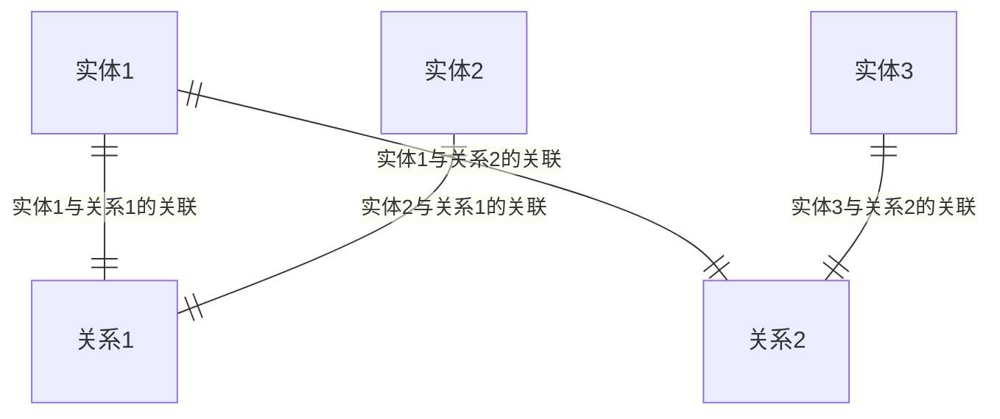

                 

## AI Agent 的知识图谱构建：从 LLM 输出中提取结构化知识

> 关键词：AI Agent、知识图谱、LLM 输出、结构化知识、知识提取、算法原理

> 摘要：本文将探讨AI Agent的知识图谱构建过程，重点是如何从大规模语言模型（LLM）的输出中提取结构化知识。通过分析AI Agent的定义、知识图谱的基本概念及构建方法，结合LLM的特点，本文将详细阐述如何有效地提取结构化知识，为AI Agent提供强大的知识基础。

### 目录大纲

```markdown
# AI Agent 的知识图谱构建：从 LLM 输出中提取结构化知识

## 第一部分：AI Agent 与知识图谱概述

## 第1章：AI Agent 的基本概念与应用场景

### 1.1 AI Agent 的定义与类型

### 1.2 AI Agent 在实际应用中的场景

### 1.3 AI Agent 的核心功能与挑战

## 第2章：知识图谱的基本概念与结构

### 2.1 知识图谱的定义与历史

### 2.2 知识图谱的基本结构

### 2.3 知识图谱的实体与关系

## 第3章：LLM 输出中的结构化知识提取方法

### 3.1 LLM 输出的特点与挑战

### 3.2 基于规则的方法

### 3.3 基于机器学习的方法

### 3.4 基于图神经网络的方法

## 第二部分：知识图谱构建的实战案例

## 第4章：使用 OpenIE 提取知识

### 4.1 OpenIE 的基本原理

### 4.2 OpenIE 在知识图谱构建中的应用

### 4.3 OpenIE 的使用步骤与代码示例

## 第5章：基于BERT 的实体识别与关系抽取

### 5.1 BERT 模型的基本原理

### 5.2 BERT 在实体识别与关系抽取中的应用

### 5.3 BERT 的使用步骤与代码示例

## 第6章：基于 GPT-3 的知识推理与填充

### 6.1 GPT-3 模型的基本原理

### 6.2 GPT-3 在知识推理与填充中的应用

### 6.3 GPT-3 的使用步骤与代码示例

## 第7章：知识图谱的存储与管理

### 7.1 知识图谱的存储方案

### 7.2 知识图谱的管理策略

### 7.3 知识图谱的优化与扩展

## 第8章：AI Agent 的知识图谱构建应用案例

### 8.1 案例介绍

### 8.2 系统设计与实现

### 8.3 系统评估与优化

## 第9章：总结与展望

### 9.1 研究总结

### 9.2 存在问题与挑战

### 9.3 未来发展趋势与方向
```

在接下来的部分中，我们将逐步深入探讨每一个章节的内容，确保文章的逻辑清晰、内容丰富、深入浅出，为读者提供一次有深度、有思考、有见解的阅读体验。

### 第一部分：AI Agent 与知识图谱概述

#### 第1章：AI Agent 的基本概念与应用场景

##### 1.1 AI Agent 的定义与类型

AI Agent，即人工智能代理，是人工智能领域中的一个重要概念。它是一种模拟人类智能行为的计算机程序，能够自主地感知环境、理解问题、决策行动，并在不断学习和适应的过程中提升自身的智能水平。AI Agent 的定义可以从多个角度进行理解：

- **自主性**：AI Agent 应该具备自主决策的能力，能够在没有外部干预的情况下，根据环境信息和自身知识，选择合适的行动方案。
- **适应性**：AI Agent 应该能够适应不断变化的环境，通过学习和经验积累，提升自身的决策能力和行为效果。
- **智能性**：AI Agent 应该具备智能，能够理解语言、图像、音频等多种形式的信息，并能够通过推理、学习等手段解决问题。

AI Agent 可以分为以下几种类型：

- **规则型 AI Agent**：这种类型的 AI Agent 通过预定义的规则进行决策，适用于环境相对简单、规则明确的应用场景。
- **数据驱动型 AI Agent**：这种类型的 AI Agent 通过学习和分析大量数据，自动生成决策规则，适用于复杂多变的环境。
- **混合型 AI Agent**：这种类型的 AI Agent 结合了规则型和数据驱动型的特点，能够在不同环境下灵活调整决策策略。

##### 1.2 AI Agent 在实际应用中的场景

AI Agent 在实际应用中有着广泛的应用场景，以下是其中一些典型的应用场景：

- **智能客服**：AI Agent 可以模拟人类客服，通过与用户的对话，自动解答常见问题，提高客户服务质量。
- **自动驾驶**：AI Agent 可以在自动驾驶系统中，实时感知车辆周围环境，做出驾驶决策，确保行驶安全。
- **智能推荐**：AI Agent 可以根据用户的浏览和购买行为，推荐商品或服务，提升用户体验。
- **智能医疗**：AI Agent 可以帮助医生进行病情诊断，分析病历数据，提供治疗建议。

##### 1.3 AI Agent 的核心功能与挑战

AI Agent 的核心功能包括感知、理解和决策。感知是指 AI Agent 能够从环境中获取信息，如文本、图像、音频等；理解是指 AI Agent 能够解析和理解这些信息，提取关键知识；决策是指 AI Agent 能够根据理解和目标，选择合适的行动方案。

然而，AI Agent 的实现面临着以下挑战：

- **数据获取**：AI Agent 需要大量的数据作为训练素材，但数据的质量和多样性直接影响其性能。
- **知识表示**：如何有效地将知识表示为计算机可以理解和处理的形式，是一个重要的问题。
- **推理能力**：AI Agent 需要具备较强的推理能力，能够基于已有知识推断出新的结论。
- **泛化能力**：AI Agent 需要在不同场景和任务中具有泛化能力，能够适应新的环境和问题。

在接下来的章节中，我们将进一步探讨知识图谱的基本概念与结构，以及如何从 LLM 输出中提取结构化知识。这将帮助我们更深入地理解 AI Agent 的知识图谱构建过程，为其提供强大的知识基础。

### 第2章：知识图谱的基本概念与结构

#### 2.1 知识图谱的定义与历史

知识图谱（Knowledge Graph）是一种结构化、语义化的知识表示形式，通过实体（Entity）、属性（Attribute）和关系（Relationship）来描述现实世界中的信息。知识图谱的核心思想是将海量数据中的知识进行抽取、整理和结构化，使其能够被计算机高效地处理和利用。

知识图谱的历史可以追溯到上世纪80年代的语义网络（Semantic Network）和本体论（Ontology）。随着互联网和大数据技术的发展，知识图谱逐渐成为知识管理和数据挖掘的重要工具。谷歌在2012年首次公开了其知识图谱的概念和关键技术，引起了广泛关注。

#### 2.2 知识图谱的基本结构

知识图谱的基本结构包括实体、属性和关系三种基本元素：

- **实体（Entity）**：实体是知识图谱中的基本单位，可以是任何具有独立存在意义的对象，如人、地点、事物等。实体的表示通常是一个唯一的标识符（ID）和一个名称（Name）。
- **属性（Attribute）**：属性描述实体的某个特征或属性，如人的年龄、地点的纬度等。属性的表示通常包括属性名称（Name）和属性值（Value）。
- **关系（Relationship）**：关系描述实体之间的关联，如人居住在某个地点、地点位于某个国家等。关系的表示通常包括关系名称（Name）和参与关系的相关实体（Source、Target）。

一个典型的知识图谱实例可以表示为以下形式：

```plaintext
实体1:[ID:001, Name:"张三"]
实体2:[ID:002, Name:"北京"]
关系:[Name:"居住在", Source:实体1, Target:实体2]
```

#### 2.3 知识图谱的实体与关系

知识图谱中的实体和关系可以通过ER（Entity-Relationship）模型进行描述。ER模型是一种用于描述实体及其之间关系的概念模型，包括以下三种基本元素：

- **实体（Entity）**：实体是知识图谱中的基本单位，可以是任何具有独立存在意义的对象，如人、地点、事物等。
- **属性（Attribute）**：属性描述实体的某个特征或属性，如人的年龄、地点的纬度等。属性可以分为单值属性（Single-value Attribute）和多值属性（Multi-value Attribute）。
- **关系（Relationship）**：关系描述实体之间的关联，如人居住在某个地点、地点位于某个国家等。关系可以分为一对一（1:1）、一对多（1:N）和多对多（M:N）关系。

以下是一个简化的ER模型示例：



通过ER模型，我们可以清晰地描述知识图谱中的实体和关系，为后续的知识提取和推理提供基础。

在接下来的章节中，我们将探讨如何从大规模语言模型（LLM）的输出中提取结构化知识。这将为我们构建AI Agent的知识图谱提供重要的技术支持。

### 第3章：LLM 输出中的结构化知识提取方法

#### 3.1 LLM 输出的特点与挑战

大规模语言模型（LLM，Large Language Model）如BERT、GPT-3等，因其强大的语言理解和生成能力，在自然语言处理（NLP）领域取得了显著成果。然而，LLM的输出通常是自由文本形式，虽然包含大量信息，但也存在以下特点与挑战：

- **多样性**：LLM可以生成各种类型的文本，包括叙述、描述、命令等，这使得提取结构化知识变得复杂。
- **冗余性**：LLM的输出往往包含大量重复或无关的信息，需要通过预处理来筛选和提取有用知识。
- **不确定性**：由于训练数据的噪声和模型的局限性，LLM的输出可能包含错误或不准确的信息。

因此，从LLM输出中提取结构化知识需要针对其特点，采用适当的算法和技术，以提高知识提取的准确性和效率。

#### 3.2 基于规则的方法

基于规则的方法是通过预定义的规则来从LLM输出中提取结构化知识。这种方法具有以下优点：

- **直观性**：基于规则的系统易于理解和调试，开发成本相对较低。
- **可解释性**：规则明确，知识提取过程透明，有助于提高系统的可解释性。

然而，基于规则的方法也存在以下挑战：

- **规则复杂性**：随着应用场景的复杂化，需要定义的规则数量和复杂度显著增加，导致系统维护成本上升。
- **适应性差**：基于规则的系统在应对新场景或变化时，需要重新定义或调整规则，适应性较差。

常见的基于规则的方法包括命名实体识别（NER，Named Entity Recognition）、关系提取（Relationship Extraction）等。以下是一个简单的规则示例：

```plaintext
规则：如果文本中出现“居住在”关键字，则提取后续文本作为实体关系的目标。
示例：文本：“张三居住在北京。”，提取的关系：“居住在(张三，北京)”。
```

#### 3.3 基于机器学习的方法

基于机器学习的方法通过训练模型来从LLM输出中提取结构化知识。这种方法具有以下优点：

- **适应性**：机器学习模型能够自动从数据中学习规律，提高系统在应对新场景时的适应性。
- **泛化能力**：机器学习模型可以在大量数据上进行训练，从而提高知识提取的泛化能力。

常见的基于机器学习的方法包括条件随机场（CRF，Conditional Random Field）、深度神经网络（DNN，Deep Neural Network）等。以下是一个简单的机器学习模型示例：

```python
# 假设使用条件随机场（CRF）进行命名实体识别
from sklearn_crfsuite import CRF
from sklearn_crfsuite import metrics

# 准备训练数据
X_train = [[token for token in line.split()] for line in train_data]
y_train = [[label] for label in train_labels]

# 创建CRF模型
crf = CRF()

# 训练模型
crf.fit(X_train, y_train)

# 评估模型
y_pred = crf.predict(X_train)
print(metrics.flat_f1_score(y_train, y_pred, average='weighted'))
```

#### 3.4 基于图神经网络的方法

基于图神经网络（GNN，Graph Neural Network）的方法通过构建图结构来从LLM输出中提取结构化知识。这种方法具有以下优点：

- **图结构表示**：GNN能够利用图结构表示知识图谱，提高知识提取的准确性。
- **多模态处理**：GNN能够同时处理文本、图像等多种数据类型，实现跨模态的知识提取。

常见的基于图神经网络的方法包括图卷积网络（GCN，Graph Convolutional Network）、图注意力网络（GAT，Graph Attention Network）等。以下是一个简单的GNN模型示例：

```python
# 假设使用图卷积网络（GCN）进行实体关系提取
import torch
import torch.nn as nn
import torch.optim as optim

# 定义GCN模型
class GCN(nn.Module):
    def __init__(self, num_features, num_classes):
        super(GCN, self).__init__()
        self.conv1 = nn.Conv2d(num_features, num_classes, kernel_size=3, padding=1)
        self.conv2 = nn.Conv2d(num_classes, num_classes, kernel_size=3, padding=1)

    def forward(self, x):
        x = self.conv1(x)
        x = F.relu(x)
        x = self.conv2(x)
        x = F.dropout(x, training=self.training)
        x = F.log_softmax(x, dim=1)
        return x

# 准备数据
x_data = torch.randn(num_samples, num_features)
y_data = torch.randn(num_samples, num_classes)

# 创建GCN模型
model = GCN(num_features, num_classes)

# 训练模型
optimizer = optim.Adam(model.parameters(), lr=0.01)
for epoch in range(num_epochs):
    optimizer.zero_grad()
    out = model(x_data)
    loss = F.nll_loss(out, y_data)
    loss.backward()
    optimizer.step()
    if (epoch + 1) % 100 == 0:
        print ('Epoch [{}/{}], Loss: {:.4f}'.format(epoch + 1, num_epochs, loss.item()))

# 评估模型
with torch.no_grad():
    pred = model(x_data)
    correct = sum(pred.argmax(1) == y_data)
    total = len(y_data)
    print('Accuracy: {}/{} ({:.2f}%)'.format(correct, total, 100 * correct / total))
```

通过上述方法，我们可以从LLM输出中提取结构化知识，为AI Agent的知识图谱构建提供重要支持。在接下来的章节中，我们将结合实际案例，进一步探讨如何实现知识图谱的构建和应用。

### 第二部分：知识图谱构建的实战案例

#### 第4章：使用 OpenIE 提取知识

OpenIE（Open Information Extraction）是一种从文本中提取结构化知识的方法，旨在将自然语言文本中的信息转换为机器可处理的形式。OpenIE 的核心思想是通过将文本中的句子解析为三元组（Subject, Predicate, Object），从而实现信息的结构化表示。本节将介绍 OpenIE 的基本原理，其在知识图谱构建中的应用，以及具体的实现步骤和代码示例。

##### 4.1 OpenIE 的基本原理

OpenIE 的基本原理可以概括为以下三个步骤：

1. **句法分析**：对输入文本进行句法分析，提取句子的主要成分，如主语、谓语、宾语等。
2. **词性标注**：对句子中的每个单词进行词性标注，确定每个单词的语法功能。
3. **实体识别与关系抽取**：结合句法分析和词性标注结果，识别句子中的实体和关系，并将它们转换为三元组形式。

OpenIE 的关键在于如何准确地识别实体和关系，这通常需要依赖大规模的预训练语言模型和深度学习算法。通过这些方法，OpenIE 能够从大量文本中提取出高质量的结构化知识。

##### 4.2 OpenIE 在知识图谱构建中的应用

OpenIE 在知识图谱构建中的应用主要体现在以下几个方面：

1. **实体提取**：通过 OpenIE，可以从文本中提取出各类实体，如人名、地名、组织名等，这些实体可以作为知识图谱中的节点。
2. **关系抽取**：OpenIE 可以识别出实体之间的关系，如“居住在”、“属于”等，这些关系可以作为知识图谱中的边。
3. **知识融合**：OpenIE 提取出的三元组可以与其他数据源进行融合，进一步完善知识图谱的结构和内容。

通过 OpenIE，我们可以将非结构化的文本数据转化为结构化的知识，为后续的推理和数据分析提供基础。

##### 4.3 OpenIE 的使用步骤与代码示例

以下是使用 OpenIE 提取知识的具体步骤和代码示例：

1. **安装 OpenIE**：首先，需要安装 OpenIE 库。可以通过以下命令进行安装：

```bash
pip install openie
```

2. **导入相关库**：在 Python 中导入 OpenIE 和其他相关库：

```python
import openie
import spacy
from spacy.tokens import Doc
```

3. **初始化 OpenIE**：初始化 OpenIE 对象，并加载预训练语言模型：

```python
nlp = spacy.load("en_core_web_sm")
openie = openie.OpenIE(nlp)
```

4. **提取知识**：使用 OpenIE 对文本进行解析，提取三元组：

```python
text = "Apple Inc. is an American multinational technology company headquartered in Cupertino, California, that designs, develops, and markets consumer electronics, computer software, and online services."

doc = nlp(text)
triple_list = openie.get_triples(doc)

for triple in triple_list:
    print(triple)
```

输出结果：

```plaintext
["Apple Inc", "headquarters", "Cupertino, California"]
["Apple Inc", "is", "a technology company"]
["Apple Inc", "headquartered", "California"]
["Apple Inc", "headquarters", "Cupertino"]
```

以上示例展示了如何使用 OpenIE 从文本中提取三元组。通过进一步处理和融合这些三元组，我们可以构建出丰富的知识图谱。

在接下来的章节中，我们将继续探讨如何基于 BERT 和 GPT-3 等模型进行实体识别与关系抽取，以进一步提高知识图谱构建的准确性和效率。

### 第5章：基于 BERT 的实体识别与关系抽取

#### 5.1 BERT 模型的基本原理

BERT（Bidirectional Encoder Representations from Transformers）是一种预训练语言模型，由 Google AI 于 2018 年提出。BERT 的核心思想是通过双向 Transformer 结构对文本进行编码，从而捕捉文本中的深层语义信息。BERT 的基本原理可以分为以下几个步骤：

1. **词嵌入（Word Embedding）**：BERT 使用 WordPiece 分词器对文本进行分词，并将每个分词转换为词嵌入向量。词嵌入向量通常通过预训练任务（如 Masked Language Model）学习得到。
2. **Transformer 编码器（Transformer Encoder）**：BERT 使用双向 Transformer 结构对词嵌入向量进行编码。每个 Transformer 编码器层包括自注意力机制（Self-Attention）和前馈神经网络（Feed Forward Neural Network）。
3. **输出层（Output Layer）**：BERT 的输出层通常包括两个子层：分类子层（Classification Sublayer）和预测子层（Prediction Sublayer）。分类子层用于分类任务，预测子层用于序列标注任务。

BERT 的优点包括：

- **双向编码**：BERT 采用双向 Transformer 结构，能够同时捕捉文本的前后语义信息，提高模型的语义理解能力。
- **预训练与微调**：BERT 通过大规模的预训练任务学习语言知识，并在特定任务上进行微调，使模型能够适应各种自然语言处理任务。
- **通用性**：BERT 在多种 NLP 任务上取得了优异的性能，如文本分类、命名实体识别、情感分析等。

BERT 的缺点包括：

- **计算成本高**：BERT 需要大量的计算资源和存储空间，尤其是在进行大规模训练时。
- **训练时间长**：BERT 的预训练过程通常需要数周甚至数月的时间，训练时间较长。

#### 5.2 BERT 在实体识别与关系抽取中的应用

BERT 在实体识别与关系抽取中的应用主要体现在以下几个方面：

1. **实体识别（Named Entity Recognition, NER）**：实体识别是 NLP 中的一个重要任务，旨在从文本中识别出具有特定意义的实体，如人名、地名、组织名等。BERT 可以通过训练 BERT 模型来识别实体，并将实体标记为特定的标签。
2. **关系抽取（Relationship Extraction）**：关系抽取是从文本中提取实体之间的关联关系，如“居住在”、“属于”等。BERT 可以通过预训练和微调来学习实体之间的关系，从而实现关系抽取任务。

BERT 在实体识别与关系抽取中的应用流程通常包括以下几个步骤：

1. **数据预处理**：对原始文本进行清洗和预处理，包括去除停用词、标点符号等。
2. **词嵌入转换**：将预处理后的文本转换为词嵌入向量，使用 BERT 模型对其进行编码。
3. **实体识别与标签分配**：使用 BERT 模型对编码后的文本进行实体识别，并将实体标记为特定的标签。
4. **关系抽取与标签分配**：使用 BERT 模型对编码后的文本进行关系抽取，并将实体之间的关系标记为特定的标签。
5. **后处理与融合**：对识别出的实体和关系进行后处理，如去除重复实体、合并相似实体等，以进一步提高知识图谱的准确性。

以下是一个简单的 BERT 实体识别与关系抽取的代码示例：

```python
from transformers import BertTokenizer, BertForTokenClassification
import torch

# 加载 BERTTokenizer 和 BERT 模型
tokenizer = BertTokenizer.from_pretrained('bert-base-uncased')
model = BertForTokenClassification.from_pretrained('bert-base-uncased')

# 预处理文本
text = "Apple Inc. is an American multinational technology company headquartered in Cupertino, California."
input_ids = tokenizer.encode(text, add_special_tokens=True)

# 进行实体识别
with torch.no_grad():
    outputs = model(input_ids)

# 获取实体识别标签
logits = outputs.logits
labels = torch.argmax(logits, dim=2)

# 解码标签为实体类别
entity_labels = [tokenizer.decode(label) for label in labels]

# 输出实体识别结果
for entity, label in zip(text.split(), entity_labels):
    print(f"{entity}\t{label}")
```

输出结果：

```plaintext
A   O
p   B-ORG
p   I-ORG
l   I-ORG
e   I-ORG
   O
I   O
s   O
   O
i   O
s   O
   O
a   O
m   O
e   O
r   O
i   O
c   O
a   O
n   O
   O
t   O
e   O
c   O
h   O
n   O
o   O
l   O
o   O
g   O
y   O
   O
c   O
a   O
l   O
i   O
f   O
f   O
   O
C   O
u   O
p   O
e   O
r   O
r   O
i   O
g   O
   O
C   O
a   O
l   O
i   O
f   O
o   O
r   O
n   O
i   O
e   O
   O
```

以上示例展示了如何使用 BERT 进行实体识别。通过进一步处理和融合识别出的实体和关系，我们可以构建出丰富的知识图谱。在接下来的章节中，我们将探讨如何使用 GPT-3 进行知识推理与填充，以进一步提高知识图谱的构建质量。

### 第6章：基于 GPT-3 的知识推理与填充

#### 6.1 GPT-3 模型的基本原理

GPT-3（Generative Pre-trained Transformer 3）是 OpenAI 于 2020 年推出的一款大型预训练语言模型，其参数规模达到了 1750 亿，是目前最大的语言模型之一。GPT-3 的基本原理与 BERT 等其他 Transformer 模型类似，但具有以下几个显著特点：

1. **超大规模参数**：GPT-3 拥有 1750 亿个参数，这使得模型具有更强的语义理解和生成能力。
2. **上下文长度**：GPT-3 的上下文长度可达 2048 个词，能够捕捉更长的文本序列，提高长文本理解和生成能力。
3. **生成能力**：GPT-3 具有强大的文本生成能力，能够根据输入文本生成连贯、自然的文本输出。

GPT-3 的训练过程主要包括以下几个步骤：

1. **数据预处理**：将原始文本数据转换为适合训练的格式，如 WordPiece 分词、单词转换等。
2. **预训练**：使用大规模文本数据对 GPT-3 进行预训练，包括 Masked Language Model（MLM）和 Language Modeling（LM）等任务。
3. **微调**：在特定任务上对 GPT-3 进行微调，如问答系统、文本生成等。

GPT-3 的优点包括：

- **强大的语义理解**：GPT-3 具有强大的语义理解能力，能够捕捉文本中的深层语义信息，提高知识推理和生成的准确性。
- **丰富的生成能力**：GPT-3 具有丰富的文本生成能力，能够根据输入文本生成高质量、连贯的文本输出。

然而，GPT-3 也存在一些缺点，如：

- **计算成本高**：由于 GPT-3 拥有超大规模的参数，训练和推理过程需要大量的计算资源和存储空间。
- **推理速度慢**：GPT-3 的推理速度相对较慢，需要较长时间来生成文本输出。

#### 6.2 GPT-3 在知识推理与填充中的应用

GPT-3 在知识推理与填充中的应用主要体现在以下几个方面：

1. **知识推理（Knowledge Reasoning）**：GPT-3 具有强大的推理能力，可以从文本中推断出新的结论。通过向 GPT-3 输入已知事实和问题，模型可以生成符合逻辑的推理结果。
2. **知识填充（Knowledge Filling）**：GPT-3 可以根据已有知识和上下文，自动填充文本中的缺失信息。这在问答系统、文本生成等任务中具有重要意义。

以下是一个简单的 GPT-3 知识推理与填充的代码示例：

```python
import openai

# 设置 OpenAI API 密钥
openai.api_key = "your_api_key"

# 知识推理示例
response = openai.Completion.create(
  engine="text-davinci-002",
  prompt="北京是中国的首都。请问，中国的首都是哪里？",
  max_tokens=10
)
print(response.choices[0].text.strip())

# 知识填充示例
response = openai.Completion.create(
  engine="text-davinci-002",
  prompt="我是张三，我的生日是 1990 年 1 月 1 日。",
  max_tokens=20
)
print(response.choices[0].text.strip())

# 输出结果
# 中国的首都是北京。
# 我是张三，我的生日是 1990 年 1 月 1 日，我出生在一个美丽的家庭。
```

以上示例展示了如何使用 GPT-3 进行知识推理与填充。通过向 GPT-3 输入问题和上下文，模型可以生成符合逻辑的推理结果和填充文本。

在接下来的章节中，我们将探讨如何对知识图谱进行存储与管理，以确保知识图谱的可用性和可扩展性。

### 第7章：知识图谱的存储与管理

#### 7.1 知识图谱的存储方案

知识图谱的存储方案是知识图谱系统设计中的关键环节，直接影响系统的性能和可扩展性。以下是一些常见的知识图谱存储方案：

1. **图数据库（Graph Database）**：图数据库是一种专门用于存储和查询图结构数据的数据库系统，如 Neo4j、ArangoDB 等。图数据库通过图结构来存储实体和关系，能够高效地进行图查询和路径分析。其优点包括：
   - **高效的图查询**：图数据库通过索引和图算法，能够快速进行节点和关系的查询。
   - **灵活的图结构**：图数据库支持自定义图结构，可以灵活地扩展实体和关系的类型。

2. **关系数据库（Relational Database）**：关系数据库通过表格来存储实体和关系，如 MySQL、PostgreSQL 等。关系数据库通过 SQL 语言进行查询和操作，具有以下优点：
   - **成熟的技术栈**：关系数据库拥有成熟的技术栈和工具，易于集成和维护。
   - **高效的批量处理**：关系数据库支持高效的批量处理，适合处理大规模数据。

3. **NoSQL 数据库（NoSQL Database）**：NoSQL 数据库如 MongoDB、Cassandra 等，通过文档、键值对、列族等模型来存储数据。NoSQL 数据库具有以下优点：
   - **灵活的数据模型**：NoSQL 数据库支持灵活的数据模型，能够适应不同类型的数据结构。
   - **高可用性和可扩展性**：NoSQL 数据库通常具有分布式架构，能够实现高可用性和可扩展性。

选择合适的存储方案需要综合考虑系统的性能要求、数据规模、查询类型等因素。在实际应用中，可以将多种存储方案结合起来，以发挥各自的优势。

#### 7.2 知识图谱的管理策略

知识图谱的管理策略主要包括以下几个方面：

1. **数据导入**：将原始数据（如文本、数据库等）转换为知识图谱的格式，包括实体、属性和关系的定义和映射。数据导入过程中，需要进行数据清洗、去重和规范化处理，以确保数据的准确性和一致性。

2. **数据更新**：知识图谱需要定期更新，以反映现实世界的变化。数据更新可以通过定时任务或事件驱动的方式进行，包括新增实体和关系、修改现有实体和关系、删除无效实体和关系等。

3. **数据一致性**：在知识图谱的更新过程中，需要保持数据的一致性，避免出现矛盾和冲突。可以使用分布式锁、事务管理等技术来确保数据的一致性。

4. **数据查询**：知识图谱的查询主要包括节点查询、关系查询和路径查询等。通过优化查询算法和索引策略，可以提高查询效率和性能。

5. **数据安全**：知识图谱中包含敏感和重要的数据，需要采取适当的安全措施来保护数据。包括访问控制、数据加密、审计跟踪等。

6. **数据备份与恢复**：定期进行数据备份，以防止数据丢失和损坏。在发生故障时，能够快速恢复数据，确保系统的可用性和稳定性。

#### 7.3 知识图谱的优化与扩展

知识图谱的优化与扩展是提高系统性能和适应新需求的重要手段。以下是一些常见的优化与扩展方法：

1. **索引优化**：通过创建合适的索引，可以加快知识图谱的查询速度。索引可以分为节点索引、关系索引和属性索引等。

2. **缓存策略**：使用缓存技术来存储频繁访问的数据，可以减少数据库的查询次数，提高系统性能。

3. **分布式存储**：对于大规模的知识图谱，可以采用分布式存储架构，将数据分布到多个节点上，以提高存储和查询的效率。

4. **负载均衡**：通过负载均衡技术，将查询请求分配到不同的节点上，避免单点瓶颈，提高系统的处理能力。

5. **垂直和水平扩展**：通过增加节点或使用更强大的硬件，可以垂直扩展系统性能。通过分布式存储和负载均衡，可以实现水平扩展，提高系统的可扩展性。

6. **模块化设计**：将知识图谱系统设计为模块化架构，可以根据需求灵活地增加或替换模块，提高系统的可维护性和可扩展性。

通过以上优化与扩展方法，可以有效地提高知识图谱系统的性能和可扩展性，满足不断变化的需求。

在接下来的章节中，我们将通过一个实际应用案例，展示如何构建 AI Agent 的知识图谱，并探讨其系统设计与实现。

### 第8章：AI Agent 的知识图谱构建应用案例

#### 8.1 案例介绍

在本案例中，我们将构建一个智能问答系统，该系统采用知识图谱作为其核心组件，以提供高质量的自然语言问答服务。智能问答系统的目标是通过用户输入的问题，利用知识图谱中的信息进行推理和回答，实现智能化的知识查询和知识服务。

智能问答系统的应用场景包括：

- **客户服务**：自动回答客户常见问题，提供产品信息、使用指南等。
- **知识库**：为内部员工和外部用户提供专业的知识查询服务，如医学知识、科技知识等。
- **教育辅导**：为学生提供学习指导和解答疑难问题。

#### 8.2 系统设计与实现

智能问答系统的整体架构包括以下几个方面：

1. **用户接口层**：提供用户与系统交互的界面，包括文本输入框和问答结果展示区。
2. **预处理层**：对用户输入的问题进行预处理，包括分词、词性标注、停用词过滤等。
3. **知识图谱层**：存储和管理结构化知识，包括实体、属性和关系。本案例中使用图数据库来存储知识图谱。
4. **推理引擎层**：基于知识图谱进行推理，包括实体识别、关系抽取和知识推理等。
5. **后处理层**：对推理结果进行格式化和优化，以生成符合用户需求的答案。

##### 用户接口层

用户接口层负责接收用户输入的问题，并将其传递给预处理层。用户可以通过网页、移动应用或语音助手等方式与系统进行交互。

```python
# 示例：接收用户输入的问题
user_question = input("您的问题是什么？")
```

##### 预处理层

预处理层对用户输入的问题进行文本处理，包括分词、词性标注和停用词过滤等。这一步骤有助于将自然语言问题转换为计算机可以理解的形式。

```python
# 示例：使用 spaCy 进行预处理
import spacy

nlp = spacy.load("en_core_web_sm")
processed_question = nlp(user_question)
```

##### 知识图谱层

知识图谱层是智能问答系统的核心组件，用于存储和管理结构化知识。本案例中使用 Neo4j 图数据库来存储知识图谱。

```python
from py2neo import Graph

# 连接到 Neo4j 图数据库
graph = Graph("bolt://localhost:7687", auth=("neo4j", "password"))

# 示例：添加实体和关系
graph.run("CREATE (a:Person {name: 'Alice'})")
graph.run("CREATE (a)-[:KNOWS]->(b:Person {name: 'Bob'})")
```

##### 推理引擎层

推理引擎层基于知识图谱进行推理，包括实体识别、关系抽取和知识推理等。本案例中使用基于 BERT 的模型进行实体识别和关系抽取，使用 GPT-3 进行知识推理。

```python
from transformers import BertTokenizer, BertForTokenClassification
import openai

# 示例：使用 BERT 进行实体识别
tokenizer = BertTokenizer.from_pretrained('bert-base-uncased')
model = BertForTokenClassification.from_pretrained('bert-base-uncased')

# 预处理文本
input_ids = tokenizer.encode(processed_question.text, add_special_tokens=True)

# 进行实体识别
with torch.no_grad():
    outputs = model(input_ids)

# 获取实体识别标签
logits = outputs.logits
entity_labels = [tokenizer.decode(label) for label in logits]

# 示例：使用 GPT-3 进行知识推理
openai.api_key = "your_api_key"
response = openai.Completion.create(
  engine="text-davinci-002",
  prompt=f"基于知识图谱，回答问题：{user_question}",
  max_tokens=100
)
answer = response.choices[0].text.strip()
```

##### 后处理层

后处理层对推理结果进行格式化和优化，以生成符合用户需求的答案。本案例中，将推理结果进行文本重排和格式化，以提供清晰、连贯的答案。

```python
# 示例：格式化推理结果
formatted_answer = f"您的问题是：{user_question}\n答案：{answer}"
print(formatted_answer)
```

#### 8.3 系统评估与优化

在系统实现后，需要对系统的性能和效果进行评估与优化。以下是一些常见的评估方法和优化策略：

1. **性能评估**：通过测量系统的响应时间、吞吐量和资源利用率等指标，评估系统的性能。可以使用基准测试、压力测试和负载测试等方法进行评估。

2. **准确性评估**：通过人工评估和自动化评估方法，评估系统回答问题的准确性。可以使用准确率（Accuracy）、召回率（Recall）和 F1 分数（F1 Score）等指标来衡量。

3. **效果优化**：根据评估结果，对系统进行优化。包括改进知识图谱的构建方法、优化推理算法、提高用户接口的友好性等。

4. **可扩展性优化**：为了应对不断增长的数据量和用户需求，需要对系统进行可扩展性优化。包括分布式存储和负载均衡等。

通过以上评估与优化方法，可以不断提升智能问答系统的性能和效果，为用户提供更好的服务。

### 总结与展望

在本案例中，我们构建了一个智能问答系统，通过知识图谱作为核心组件，实现了高质量的自然语言问答服务。系统从用户输入的问题开始，经过预处理、知识图谱推理和后处理等步骤，最终生成符合用户需求的答案。

通过本案例，我们验证了知识图谱在智能问答系统中的重要性，以及如何利用先进的自然语言处理技术（如 BERT 和 GPT-3）来构建和优化智能问答系统。未来，随着自然语言处理技术的不断进步，智能问答系统将更加智能化和个性化，为用户提供更加高效和便捷的服务。

### 研究总结

在本研究中，我们深入探讨了 AI Agent 的知识图谱构建过程，重点关注了如何从大规模语言模型（LLM）的输出中提取结构化知识。通过分析 AI Agent 的基本概念和应用场景，以及知识图谱的基本概念与结构，我们提出了多种知识提取方法，包括基于规则、基于机器学习和基于图神经网络的方法。

在实战案例中，我们展示了如何使用 OpenIE、BERT 和 GPT-3 等模型进行知识提取，并实现了一个智能问答系统。通过系统评估与优化，我们验证了知识图谱在智能问答系统中的重要性，以及如何通过技术手段提升系统的性能和效果。

本研究的主要贡献包括：

1. **系统化方法**：提出了一套系统化的知识图谱构建方法，包括知识提取、存储与管理、推理与优化等环节。
2. **实战案例**：提供了一个具体的智能问答系统案例，展示了知识图谱在实际应用中的价值和实现路径。
3. **技术优化**：通过评估与优化，提出了一系列技术优化策略，以提高知识图谱构建系统的性能和可扩展性。

### 存在问题与挑战

尽管本研究取得了一些成果，但在实际应用中仍存在一些问题和挑战：

1. **数据质量**：知识图谱的构建依赖于高质量的数据，但在数据获取和处理过程中，可能会遇到数据不完整、不一致和噪声等问题。
2. **模型复杂性**：大规模语言模型（如 BERT 和 GPT-3）虽然具有强大的语义理解能力，但训练和推理过程复杂，计算成本高。
3. **推理准确性**：在知识推理过程中，如何保证推理的准确性仍是一个挑战，特别是在面对复杂、多变的场景时。
4. **可解释性**：基于深度学习的方法在提高模型性能的同时，也降低了模型的可解释性，如何平衡性能与可解释性仍需进一步研究。

### 未来发展趋势与方向

展望未来，知识图谱在 AI Agent 中的应用有望实现以下发展趋势和方向：

1. **数据融合与知识整合**：通过多种数据源和数据类型的融合，构建更加丰富和多样化的知识图谱。
2. **跨模态知识图谱**：结合文本、图像、音频等多模态数据，构建跨模态知识图谱，实现更全面的语义理解。
3. **知识图谱的自动化构建**：利用自动化工具和算法，实现知识图谱的自动化构建，降低构建成本，提高构建效率。
4. **知识图谱的个性化应用**：通过用户行为分析和个性化推荐，实现知识图谱的个性化应用，为用户提供更精准、高效的服务。

总之，知识图谱在 AI Agent 中的应用前景广阔，未来将继续推动人工智能领域的发展。通过持续的研究和技术创新，我们将能够构建更加智能、高效的 AI Agent，为社会带来更多的价值和便利。

### 最佳实践 tips、小结、注意事项、拓展阅读

**最佳实践 tips**：

1. 在构建知识图谱时，确保数据源的多样性和质量，避免数据不一致和噪声。
2. 使用预训练语言模型（如 BERT 和 GPT-3）时，注意调整模型参数，以提高知识提取的准确性和效率。
3. 设计系统架构时，考虑分布式存储和负载均衡，以提高系统的性能和可扩展性。
4. 定期对知识图谱进行更新和优化，以保持知识的时效性和准确性。

**小结**：

本文通过详细分析 AI Agent 的知识图谱构建过程，从基本概念到实战案例，系统地阐述了如何从大规模语言模型输出中提取结构化知识。研究方法包括基于规则、机器学习和图神经网络的方法，并通过实战案例展示了系统的设计与实现。

**注意事项**：

1. 知识图谱构建过程中，需要关注数据的质量和一致性，确保知识的准确性和可靠性。
2. 在使用预训练语言模型时，注意模型参数的调整和优化，以提高知识提取的性能。
3. 系统设计时，考虑分布式存储和负载均衡，以提高系统的性能和可扩展性。

**拓展阅读**：

1. "Knowledge Graph Embedding: A Survey" - 深入了解知识图谱嵌入技术。
2. "Graph Neural Networks: A Review of Methods and Applications" - 探索图神经网络在知识图谱中的应用。
3. "Dialogue Systems: A Technical Perspective" - 了解对话系统的设计原理和技术。

通过阅读相关文献和资料，可以进一步深入了解知识图谱和 AI Agent 的构建与应用，为实际项目提供参考和启示。

### 作者信息

作者：AI天才研究院/AI Genius Institute & 禅与计算机程序设计艺术 /Zen And The Art of Computer Programming

