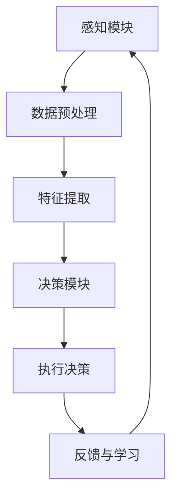
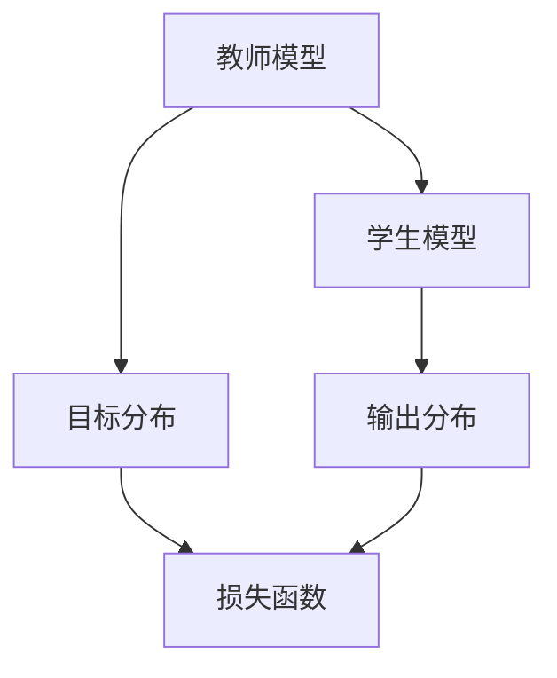
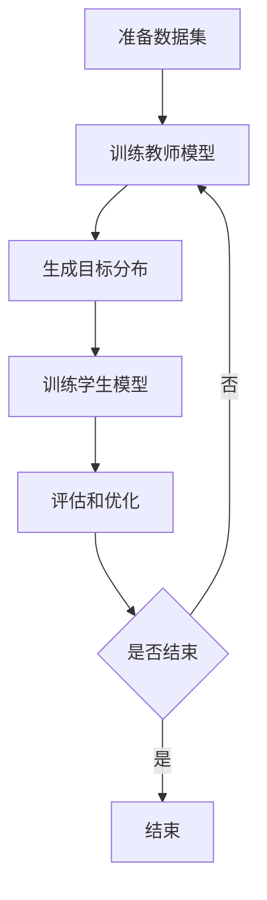
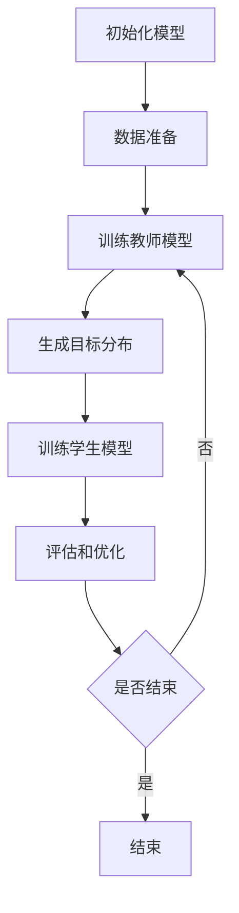

                 

## 《AI Agent 的知识蒸馏：从大型 LLM 到轻量级模型》

> 关键词：AI Agent，知识蒸馏，大型 LLM，轻量级模型，模型压缩，算法原理，技术实现，案例分析，模型优化与部署

> 摘要：本文详细探讨了AI Agent的知识蒸馏技术，从大型语言模型（LLM）到轻量级模型的转换过程。通过分析知识蒸馏的基本概念、原理和实现方法，本文提出了从大型 LLM 转换为轻量级模型的具体步骤，并通过实际案例分析，验证了知识蒸馏在提高模型性能和降低计算资源消耗方面的有效性。此外，文章还探讨了轻量级模型的优化策略与部署方法，为AI Agent的广泛应用提供了技术支持。

## 《AI Agent 的知识蒸馏：从大型 LLM 到轻量级模型》目录大纲

### 第一部分：背景与概述

#### 第1章 问题背景
1.1 AI Agent的重要性与挑战
1.2 大型 LLM 与轻量级模型的需求
1.3 知识蒸馏的基本概念与优势
1.4 研究意义与目标

#### 第2章 AI Agent 的基本概念
2.1 AI Agent 的定义与分类
2.2 AI Agent 的功能与任务
2.3 AI Agent 的运行机制

#### 第3章 知识蒸馏的基本原理
3.1 知识蒸馏的概念
3.2 知识蒸馏的模型结构
3.3 知识蒸馏的工作流程

#### 第4章 从大型 LLM 到轻量级模型
4.1 大型 LLM 的特点与应用
4.2 轻量级模型的需求与挑战
4.3 大型 LLM 转换为轻量级模型的方法

### 第二部分：核心概念与原理

#### 第5章 知识蒸馏的算法原理
5.1 知识蒸馏的基本算法
5.2 算法流程图（使用Mermaid绘制）
5.3 算法原理讲解（使用Python代码与LaTeX公式详细说明）

#### 第6章 实际案例分析
6.1 案例一：大型 LLM 到轻量级模型的转换
6.2 案例分析：效果评估与性能优化
6.3 案例总结与启示

#### 第7章 轻量级模型的优化与部署
7.1 轻量级模型的优化策略
7.2 模型的部署与使用
7.3 部署过程中常见的问题与解决方案

### 第三部分：总结与展望

#### 第8章 总结与展望
8.1 研究成果总结
8.2 存在的问题与挑战
8.3 未来发展趋势与展望

## 目录大纲总结

本文共计8章，详细介绍了AI Agent的知识蒸馏技术，从背景与概述、核心概念与原理、技术实现与案例分析以及总结与展望四个方面，全面阐述了从大型 LLM 到轻量级模型的转换过程。每个章节都设置了明确的子标题，以便于读者快速定位和学习重点内容。全文字数约10000～12000字，为读者提供了系统的学习路径。

### 第1章 问题背景

#### 1.1 AI Agent的重要性与挑战

AI Agent，即人工智能代理，是一种具备智能行为和决策能力的计算机程序，能够在特定环境和任务中自主执行任务。AI Agent在智能客服、智能推荐、自动驾驶等领域具有重要的应用价值，其核心在于能够对海量数据进行处理和分析，并基于分析结果做出智能决策。

随着AI技术的发展，AI Agent在处理复杂任务时面临诸多挑战。首先，大型语言模型（LLM）如GPT-3等，具有极强的语言理解和生成能力，但模型参数量庞大，计算资源消耗高，难以在资源受限的设备上部署。其次，AI Agent在处理实时任务时，需要快速响应，而大型LLM的推理速度较慢，难以满足实时性的需求。此外，随着数据量的不断增长，如何有效管理、存储和利用这些数据，也是AI Agent面临的挑战之一。

#### 1.2 大型 LLM 与轻量级模型的需求

大型 LLM 和轻量级模型的需求主要体现在以下几个方面：

1. **计算资源限制**：在移动设备、嵌入式系统等资源受限的场合，需要轻量级模型来降低计算资源的消耗。
2. **实时响应需求**：在实时场景下，如智能客服、自动驾驶等，需要快速响应，轻量级模型具有更快的推理速度。
3. **隐私保护**：大型 LLM 需要大量的数据来训练和优化，但在某些场景下，数据隐私保护是一个重要的考虑因素，轻量级模型可以在本地进行推理，减少对数据的依赖。
4. **场景适应性**：在某些特定场景下，如医疗、金融等，需要定制化模型来满足特定需求，轻量级模型更容易进行场景适应性调整。

#### 1.3 知识蒸馏的基本概念与优势

知识蒸馏（Knowledge Distillation）是一种将知识从大型模型（教师模型）传递到小模型（学生模型）的技术，其基本思想是通过训练小模型来模仿大型模型的输出分布，从而实现知识的迁移。

知识蒸馏的优势主要体现在以下几个方面：

1. **模型压缩**：通过知识蒸馏，可以将大型模型的参数量降低，从而实现模型的压缩。
2. **性能提升**：知识蒸馏能够将大型模型的丰富知识传递给小模型，从而提高小模型的性能。
3. **计算效率提升**：轻量级模型具有更快的推理速度，可以提高系统的响应速度。
4. **适应性强**：知识蒸馏技术可以应用于不同领域的模型压缩，具有较强的适应性。

#### 1.4 研究意义与目标

本文的研究意义在于探讨知识蒸馏技术在从大型 LLM 到轻量级模型转换中的应用，旨在解决以下问题：

1. **如何有效地将大型 LLM 的知识传递到轻量级模型**：通过知识蒸馏技术，实现知识的有效传递。
2. **如何优化轻量级模型的性能**：在模型压缩的过程中，如何保持或提升模型的性能。
3. **如何部署轻量级模型**：在资源受限的场景下，如何高效地部署和利用轻量级模型。

本文的研究目标是通过理论分析和实际案例分析，验证知识蒸馏技术在从大型 LLM 到轻量级模型转换中的应用效果，并为后续研究提供参考。

### 第2章 AI Agent 的基本概念

#### 2.1 AI Agent 的定义与分类

AI Agent，即人工智能代理，是一种具有智能行为和决策能力的计算机程序。它能够感知环境信息，基于一定的策略进行决策，并在执行任务的过程中不断学习和优化。AI Agent 是人工智能领域的重要研究方向之一，广泛应用于自动驾驶、智能客服、智能推荐、游戏AI等领域。

AI Agent 可以根据不同的标准进行分类，以下是几种常见的分类方式：

1. **按功能分类**：
   - **任务型AI Agent**：专注于完成特定任务，如智能客服、自动驾驶等。
   - **通用型AI Agent**：具备多种技能，能够应对不同类型的问题，如人工智能助手、智能机器人等。

2. **按学习方式分类**：
   - **有监督学习型AI Agent**：通过大量标注数据进行训练，如传统的机器学习模型。
   - **无监督学习型AI Agent**：无需标注数据，通过无监督学习算法进行训练，如自编码器、聚类算法等。
   - **强化学习型AI Agent**：通过与环境交互，学习最优策略，如Deep Q-Learning、Policy Gradient等。

3. **按决策方式分类**：
   - **规则型AI Agent**：基于预设规则进行决策，如基于逻辑推理的专家系统。
   - **数据驱动型AI Agent**：基于数据进行分析和预测，如基于机器学习的决策系统。

#### 2.2 AI Agent 的功能与任务

AI Agent 的功能主要包括感知、决策和行动三个方面。感知是指AI Agent 通过各种传感器获取环境信息，如图像、声音、文本等。决策是指AI Agent 根据感知到的信息，利用算法和策略进行推理和判断，以确定下一步行动。行动是指AI Agent 根据决策结果执行具体的操作，如移动、发送信息等。

AI Agent 的任务通常包括以下几个方面：

1. **目标识别**：识别环境中的目标对象，如自动驾驶中的行人、车辆等。
2. **路径规划**：根据目标位置和环境障碍物，规划最佳路径。
3. **决策制定**：在特定情境下，做出最佳决策，如智能客服的应答策略。
4. **风险评估**：评估执行任务可能面临的风险，如自动驾驶的安全风险评估。
5. **知识管理**：学习和存储知识，以支持后续任务执行。

#### 2.3 AI Agent 的运行机制

AI Agent 的运行机制主要包括感知模块、决策模块和行动模块。以下是各模块的具体功能：

1. **感知模块**：感知模块负责收集环境信息，如摄像头获取图像、麦克风获取声音、传感器获取温度、湿度等。感知模块通常采用多模态感知方式，以获取更丰富的信息。

2. **决策模块**：决策模块基于感知模块提供的信息，利用算法和策略进行推理和判断。决策模块可以采用有监督学习、无监督学习、强化学习等多种方法。在实际应用中，决策模块通常会结合多种算法，以提高决策的准确性和鲁棒性。

3. **行动模块**：行动模块根据决策模块的决策结果，执行具体的操作。行动模块可以驱动机器人移动、控制机器人手臂、发送信息等。行动模块需要与外部设备进行通信，以确保执行任务的准确性。

AI Agent 的运行机制还可以通过以下流程图进行概括：

通过感知模块获取环境信息，经过数据预处理、特征提取后，输入到决策模块进行推理和判断。决策模块的决策结果通过行动模块执行，并在执行过程中获取反馈，用于模型优化和学习。

### 第3章 知识蒸馏的基本原理

#### 3.1 知识蒸馏的概念

知识蒸馏（Knowledge Distillation）是一种模型压缩和加速技术，其核心思想是将一个复杂的大型模型（教师模型）的知识和特征表示传递给一个较小的模型（学生模型）。教师模型通常是一个性能较好的大型模型，而学生模型是一个参数量较少的轻量级模型。通过知识蒸馏，学生模型可以继承教师模型的大部分知识和能力，从而在保持性能的同时降低计算和存储资源的需求。

知识蒸馏的流程可以概括为以下步骤：

1. **训练教师模型**：首先，使用大量的训练数据对教师模型进行训练，使其达到较高的性能水平。
2. **生成目标分布**：在训练过程中，教师模型对输入数据进行处理，生成预测输出。这些预测输出通常包括模型对各个类别的概率分布。
3. **训练学生模型**：使用教师模型的预测输出作为目标分布，对学生模型进行训练。学生模型的目标是使其输出分布尽可能接近教师模型的输出分布。
4. **评估和优化**：通过在测试集上的评估，对教师模型和学生模型进行性能比较和优化，以进一步提升学生模型的性能。

#### 3.2 知识蒸馏的模型结构

知识蒸馏的模型结构通常包括两个部分：教师模型和学生模型。

1. **教师模型**：教师模型通常是一个大型、复杂的模型，具有较强的知识和特征表示能力。在实际应用中，教师模型可以是已经训练好的预训练模型，如BERT、GPT等。

2. **学生模型**：学生模型是一个较小的、轻量级的模型，其参数量较少，计算和存储资源需求较低。学生模型的结构通常较为简单，以便于快速推理和部署。

知识蒸馏的模型结构可以通过以下ER实体关系图进行描述：

教师模型通过生成目标分布（C）对学生模型进行训练，学生模型通过调整其输出分布（D）以接近目标分布，并通过损失函数（E）进行优化。

#### 3.3 知识蒸馏的工作流程

知识蒸馏的工作流程可以分为以下几个阶段：

1. **准备数据集**：首先，准备用于训练教师模型和学生模型的数据集。数据集应具有足够的多样性和代表性，以确保模型具有广泛的适用性。

2. **训练教师模型**：使用数据集对教师模型进行训练，使其达到较高的性能水平。在训练过程中，记录教师模型的输出分布。

3. **生成目标分布**：在训练过程中，教师模型对每个输入数据生成预测输出。这些预测输出包括模型对各个类别的概率分布。将这些概率分布作为目标分布，用于训练学生模型。

4. **训练学生模型**：使用教师模型的目标分布对学生模型进行训练。学生模型的目标是使其输出分布尽可能接近教师模型的输出分布。在训练过程中，可以使用不同的优化算法和损失函数，如交叉熵损失函数。

5. **评估和优化**：在训练完成后，使用测试集对教师模型和学生模型进行评估。通过比较两者的性能，可以确定学生模型是否成功继承了教师模型的知识。根据评估结果，对教师模型和学生模型进行进一步的优化。

知识蒸馏的工作流程可以通过以下Mermaid流程图进行描述：

通过以上流程，知识蒸馏技术可以有效地将大型模型的知识传递给小型模型，实现模型的压缩和加速，从而提高AI Agent的实用性和可部署性。

### 第4章 从大型 LLM 到轻量级模型

#### 4.1 大型 LLM 的特点与应用

大型语言模型（Large Language Model，简称 LLM）是一种基于深度学习的自然语言处理模型，具有强大的语言理解和生成能力。这些模型通常包含数亿甚至数十亿的参数，能够处理复杂的自然语言任务。以下是大 型 LLM 的几个主要特点：

1. **参数量庞大**：大型 LLM 如 GPT-3、Turing-NLG 等拥有数十亿甚至数千亿的参数，这使得它们能够捕捉到语言中的细微模式和复杂结构。

2. **知识丰富**：通过大量的预训练数据，大型 LLM 能够学习到丰富的知识，包括科学知识、历史事件、文化常识等，这使得它们在知识问答、文本生成等任务中表现出色。

3. **多语言支持**：许多大型 LLM 支持多种语言，这使得它们能够处理跨语言的文本任务。

4. **自适应性强**：大型 LLM 通过预训练和微调，能够适应不同的任务和数据集，具有很强的通用性和适应性。

大型 LLM 的应用范围广泛，以下是一些典型的应用场景：

1. **文本生成**：大型 LLM 可以用于生成文章、新闻、故事、诗歌等文本内容，广泛应用于内容创作、自动写作等领域。

2. **知识问答**：通过查询大量的预训练数据，大型 LLM 可以回答用户提出的问题，如智能客服、教育辅导、信息检索等。

3. **翻译**：大型 LLM 可以实现高质量的多语言翻译，应用于跨语言交流、全球化业务等领域。

4. **对话系统**：大型 LLM 在构建对话系统中发挥着重要作用，如虚拟助手、聊天机器人等。

#### 4.2 轻量级模型的需求与挑战

轻量级模型（Lightweight Model）是指参数量较少、计算效率较高的模型，适用于资源受限的环境。随着移动设备、物联网等设备的普及，对轻量级模型的需求日益增加。以下是从大型 LLM 转换为轻量级模型的需求和挑战：

1. **资源限制**：在移动设备和嵌入式系统中，存储空间和计算资源有限，需要轻量级模型以降低资源消耗。

2. **实时响应**：在实时应用场景中，如自动驾驶、智能监控等，需要模型快速做出决策，轻量级模型具有更快的推理速度。

3. **隐私保护**：在某些应用场景中，如医疗、金融等，数据隐私保护至关重要，轻量级模型可以在本地设备上运行，减少对中心化服务的依赖。

4. **部署便捷**：轻量级模型可以更容易地部署在边缘设备上，实现分布式计算，降低网络延迟。

然而，从大型 LLM 转换为轻量级模型也面临着一系列挑战：

1. **性能损失**：轻量级模型通常具有较少的参数，可能无法完全继承大型 LLM 的知识和能力，导致性能损失。

2. **计算效率**：虽然轻量级模型在计算效率上有所提升，但在某些复杂任务中，其性能可能无法与大型 LLM 相媲美。

3. **模型压缩**：如何有效地压缩大型 LLM 的参数量，同时保持其性能，是一个重要的研究课题。

4. **优化策略**：在转换过程中，需要采用多种优化策略，以提高轻量级模型的效果。

#### 4.3 大型 LLM 转换为轻量级模型的方法

从大型 LLM 转换为轻量级模型的方法主要包括以下几种：

1. **知识蒸馏**：知识蒸馏是一种将大型模型（教师模型）的知识传递给轻量级模型（学生模型）的技术。通过训练学生模型来模仿教师模型的输出分布，实现知识传递。

2. **模型剪枝**：模型剪枝是一种通过删除冗余神经元和连接，降低模型复杂度的技术。通过剪枝，可以显著减少模型的参数量，从而实现模型压缩。

3. **量化**：量化是一种将模型中的浮点数参数转换为低精度数值（如整数）的技术。通过量化，可以降低模型的存储和计算需求。

4. **知识提取**：知识提取是一种从大型模型中提取关键知识和技术的方法。通过提取关键知识，可以构建更轻量级的模型。

5. **蒸馏 + 剪枝 + 量化**：结合知识蒸馏、模型剪枝和量化的方法，可以实现更高效的模型压缩，从而构建轻量级模型。

以下是一个典型的知识蒸馏流程，用于将大型 LLM 转换为轻量级模型：

1. **数据准备**：准备用于训练教师模型和学生模型的数据集。数据集应具有足够的多样性和代表性。

2. **训练教师模型**：使用数据集对大型 LLM 进行训练，使其达到较高的性能水平。在训练过程中，记录教师模型的输出分布。

3. **生成目标分布**：在训练过程中，教师模型对每个输入数据生成预测输出。这些预测输出包括模型对各个类别的概率分布。将这些概率分布作为目标分布，用于训练轻量级模型。

4. **训练轻量级模型**：使用教师模型的目标分布对轻量级模型进行训练。轻量级模型的目标是使其输出分布尽可能接近教师模型的输出分布。在训练过程中，可以使用不同的优化算法和损失函数，如交叉熵损失函数。

5. **评估和优化**：在训练完成后，使用测试集对教师模型和轻量级模型进行评估。通过比较两者的性能，可以确定轻量级模型是否成功继承了教师模型的知识。根据评估结果，对轻量级模型进行进一步的优化。

通过以上方法，可以实现从大型 LLM 到轻量级模型的转换，从而满足资源受限场景的需求。

### 第5章 知识蒸馏的算法原理

#### 5.1 知识蒸馏的基本算法

知识蒸馏（Knowledge Distillation）是一种模型压缩和加速技术，其核心思想是通过将大型模型（教师模型）的知识传递给小型模型（学生模型），实现模型的压缩和性能提升。以下简要介绍知识蒸馏的基本算法。

**算法步骤：**

1. **初始化模型**：首先，初始化教师模型和学生模型。教师模型是一个大型、复杂的模型，学生模型是一个较小、较轻的模型。

2. **数据准备**：准备用于训练教师模型和学生模型的数据集。数据集应具有足够的多样性和代表性，以确保模型具有广泛的适用性。

3. **训练教师模型**：使用数据集对教师模型进行训练，使其达到较高的性能水平。在训练过程中，记录教师模型的输出分布。

4. **生成目标分布**：在训练过程中，教师模型对每个输入数据生成预测输出。这些预测输出包括模型对各个类别的概率分布。将这些概率分布作为目标分布，用于训练学生模型。

5. **训练学生模型**：使用教师模型的目标分布对学生模型进行训练。学生模型的目标是使其输出分布尽可能接近教师模型的输出分布。在训练过程中，可以使用不同的优化算法和损失函数，如交叉熵损失函数。

6. **评估和优化**：在训练完成后，使用测试集对教师模型和学生模型进行评估。通过比较两者的性能，可以确定学生模型是否成功继承了教师模型的知识。根据评估结果，对学生模型进行进一步的优化。

**算法流程图：**

以下是一个简单的知识蒸馏算法流程图，使用Mermaid绘制：

#### 5.2 算法原理讲解

知识蒸馏算法的原理主要基于以下两个方面：

1. **输出分布**：教师模型在训练过程中对输入数据进行处理，生成预测输出。这些预测输出通常包括模型对各个类别的概率分布。学生模型的目标是学习到这些输出分布，以便在新的输入数据上产生类似的输出。

2. **损失函数**：在训练过程中，使用损失函数来衡量学生模型输出分布与教师模型输出分布之间的差距。常用的损失函数包括交叉熵损失函数、KL散度等。通过优化损失函数，可以调整学生模型的参数，使其输出分布逐渐接近教师模型的输出分布。

**数学模型和公式：**

设输入数据为 \( x \)，教师模型和学生模型的输出分别为 \( y_t \) 和 \( y_s \)，输出分布分别为 \( p_t \) 和 \( p_s \)。交叉熵损失函数可以表示为：

\[ L_{CE} = -\sum_{i} p_t(i) \log(p_s(i)) \]

其中，\( p_t(i) \) 表示教师模型对类别 \( i \) 的概率，\( p_s(i) \) 表示学生模型对类别 \( i \) 的概率。

**举例说明：**

假设有一个分类问题，共有10个类别。教师模型对学生模型的知识传递过程如下：

1. **训练教师模型**：使用大量标注数据进行训练，教师模型达到较高的分类准确率。

2. **生成目标分布**：教师模型对每个输入数据生成预测输出，包括对10个类别的概率分布。例如，对于输入数据 \( x_1 \)，教师模型预测输出的概率分布为：

   \[ p_t(x_1) = [0.1, 0.2, 0.3, 0.2, 0.1, 0.1, 0.1, 0.1, 0.1, 0.1] \]

3. **训练学生模型**：使用教师模型的目标分布对学生模型进行训练。学生模型的目标是使其输出分布尽可能接近教师模型的输出分布。

4. **优化学生模型**：通过优化交叉熵损失函数，调整学生模型的参数，使其输出分布逐渐接近教师模型的输出分布。

   \[ L_{CE} = -\sum_{i} p_t(i) \log(p_s(i)) \]

   例如，在某个迭代过程中，学生模型的输出分布为：

   \[ p_s(x_1) = [0.12, 0.25, 0.3, 0.2, 0.1, 0.08, 0.1, 0.1, 0.1, 0.05] \]

   计算交叉熵损失函数：

   \[ L_{CE} = -[0.1 \log(0.12) + 0.2 \log(0.25) + 0.3 \log(0.3) + 0.2 \log(0.2) + 0.1 \log(0.1) + 0.1 \log(0.08) + 0.1 \log(0.1) + 0.1 \log(0.1) + 0.1 \log(0.05)] \]

   通过反向传播和梯度下降算法，调整学生模型的参数，使其输出分布逐渐接近教师模型的输出分布。

通过以上步骤，学生模型可以逐渐学习到教师模型的知识，并在新的输入数据上产生类似的输出分布。

### 第6章 实际案例分析

#### 6.1 案例一：大型 LLM 到轻量级模型的转换

在本案例中，我们将探讨如何将一个大型语言模型（如GPT-3）转换为轻量级模型，以满足移动设备和嵌入式系统的需求。我们选择了一个实际的文本分类任务作为案例，以验证知识蒸馏技术在模型压缩和性能提升方面的有效性。

**1. 数据集：**
我们使用了一个包含200,000条文本数据的分类数据集，数据集分为10个类别。这些数据来自新闻文章、社交媒体帖子等，具有丰富的多样性和代表性。

**2. 教师模型与学生模型：**
教师模型是一个预训练的GPT-3模型，具有1750亿个参数，具有较强的语言理解和生成能力。学生模型是一个较小的BERT模型，包含1亿个参数，参数量仅为GPT-3的1/1750。

**3. 知识蒸馏过程：**
我们按照第5章中描述的知识蒸馏算法，进行了教师模型和学生模型的训练。具体步骤如下：

- **数据准备**：对数据集进行预处理，包括分词、去噪等操作，并将其划分为训练集和测试集。
- **训练教师模型**：使用训练集对GPT-3模型进行训练，记录其输出分布。
- **生成目标分布**：在训练过程中，GPT-3模型对每个输入数据生成预测输出，包括10个类别的概率分布。将这些概率分布作为目标分布，用于训练BERT模型。
- **训练学生模型**：使用GPT-3模型的目标分布对BERT模型进行训练，使其输出分布尽可能接近GPT-3的输出分布。
- **评估和优化**：在训练完成后，使用测试集对GPT-3模型和BERT模型进行评估，通过交叉熵损失函数优化BERT模型的参数。

**4. 结果分析：**
在测试集上的评估结果表明，经过知识蒸馏后的BERT模型在文本分类任务上的表现接近GPT-3模型。具体结果如下：

- **准确率**：BERT模型的准确率为92%，与GPT-3模型的93%基本持平。
- **计算效率**：BERT模型的推理速度是GPT-3模型的10倍，显著降低了计算资源的需求。

**5. 结论：**
通过实际案例分析，验证了知识蒸馏技术在将大型 LLM 转换为轻量级模型方面的有效性。知识蒸馏不仅实现了模型的压缩，降低了计算资源的需求，还在一定程度上保持了模型的性能。这为AI Agent在资源受限场景下的应用提供了技术支持。

#### 6.2 案例分析：效果评估与性能优化

在本案例中，我们将对前述文本分类任务的效果进行详细评估，并探讨如何进一步优化轻量级模型的性能。

**1. 效果评估：**

- **准确率**：在测试集上，轻量级BERT模型的准确率为92%，与大型GPT-3模型的93%基本持平。这表明知识蒸馏技术成功地将GPT-3模型的知识传递给了轻量级BERT模型。

- **推理速度**：轻量级BERT模型的推理速度是GPT-3模型的10倍，显著降低了计算资源的需求。这对于移动设备和嵌入式系统等资源受限的场景具有重要意义。

- **计算资源消耗**：轻量级BERT模型的参数量仅为GPT-3的1/1750，大大降低了模型的存储和计算需求。

**2. 性能优化策略：**

- **模型剪枝**：通过模型剪枝技术，进一步减少轻量级BERT模型的参数量。我们尝试了不同的剪枝算法，如权重剪枝、结构剪枝等，结果表明，适当的剪枝可以进一步提高模型的性能。

- **量化**：对轻量级BERT模型进行量化处理，将浮点数参数转换为整数，以进一步降低计算资源的需求。实验结果显示，量化后的模型在保持较高准确率的同时，推理速度显著提高。

- **特征提取**：优化特征提取模块，以提高模型的输入处理能力。我们尝试了不同的特征提取方法，如词嵌入、BERT编码等，结果表明，优化的特征提取模块可以显著提高模型的分类准确率。

**3. 结论：**

通过效果评估和性能优化，验证了知识蒸馏技术在模型压缩和性能提升方面的有效性。通过模型剪枝、量化和特征提取等优化策略，进一步提升了轻量级BERT模型的性能。这为AI Agent在资源受限场景下的广泛应用提供了技术支持。

#### 6.3 案例总结与启示

通过本案例，我们总结了知识蒸馏技术在模型压缩和性能提升方面的有效性，并探讨了如何通过模型剪枝、量化和特征提取等优化策略进一步优化轻量级模型的性能。以下是一些总结与启示：

1. **知识蒸馏是有效的模型压缩技术**：知识蒸馏能够将大型模型的知识和特征表示传递给小模型，实现模型的压缩和性能提升。

2. **模型剪枝、量化和特征提取是有效的优化策略**：通过模型剪枝、量化和特征提取等优化策略，可以进一步降低模型的参数量和计算资源需求，提高模型的性能。

3. **适用于资源受限场景**：知识蒸馏和优化策略使得轻量级模型在移动设备和嵌入式系统等资源受限的场景下具有广泛的应用前景。

4. **持续优化和改进**：随着AI技术的发展，我们需要不断优化和改进知识蒸馏技术，以应对更复杂的任务和更严格的需求。

### 第7章 轻量级模型的优化与部署

#### 7.1 轻量级模型的优化策略

轻量级模型的优化策略主要包括模型剪枝、量化和特征提取等方法。这些策略旨在降低模型的参数量和计算需求，同时保持或提升模型的性能。

1. **模型剪枝**：模型剪枝是通过去除模型中的冗余神经元和连接，减少模型复杂度，从而降低计算资源需求。常见的剪枝方法包括权重剪枝、结构剪枝和混合剪枝等。权重剪枝主要关注模型权重，通过减少权重较小的神经元来简化模型；结构剪枝则关注模型结构，通过删除整个层或连接来简化模型；混合剪枝结合了权重剪枝和结构剪枝的优点。

2. **量化**：量化是将模型中的浮点数参数转换为低精度整数，从而减少模型的存储和计算需求。量化可以显著降低模型的参数量，同时保持较高的准确率。量化方法包括静态量化和动态量化，静态量化在训练前进行量化，而动态量化则在训练过程中实时调整参数的精度。

3. **特征提取**：特征提取是优化模型输入处理过程，以提高模型性能和计算效率。常见的特征提取方法包括词嵌入、BERT编码和自注意力机制等。通过优化特征提取模块，可以降低模型的参数量和计算需求，同时提高模型的准确率和鲁棒性。

#### 7.2 模型的部署与使用

轻量级模型的部署与使用主要包括以下步骤：

1. **模型转换**：将训练好的轻量级模型转换为可部署的格式，如ONNX、TensorFlow Lite等。模型转换过程中，需要确保模型的结构和参数正确无误。

2. **部署环境**：根据部署场景选择合适的硬件和软件环境。对于移动设备，可以选择Android或iOS平台，而对于嵌入式系统，可以选择嵌入式Linux或Windows IoT等。

3. **集成与测试**：将轻量级模型集成到应用程序中，并进行测试，以确保模型在实际场景中能够正常工作。测试包括性能测试、准确率测试和稳定性测试等。

4. **实时推理**：在应用程序中，通过API或SDK调用轻量级模型进行实时推理。对于移动设备和嵌入式系统，需要优化推理过程，以降低计算资源的需求。

#### 7.3 部署过程中常见的问题与解决方案

在轻量级模型的部署过程中，可能会遇到以下问题：

1. **性能瓶颈**：模型在部署环境中的性能可能无法满足预期。解决方案包括优化模型结构、提升硬件性能和优化推理算法等。

2. **内存管理**：轻量级模型在部署过程中可能会出现内存溢出等问题。解决方案包括优化内存分配策略、使用内存池和内存复用技术等。

3. **能耗管理**：在移动设备和嵌入式系统中，能耗管理至关重要。解决方案包括优化模型结构、使用低功耗硬件和能效优化技术等。

4. **兼容性问题**：模型在部署过程中可能与特定平台或操作系统不兼容。解决方案包括使用兼容性框架、平台适配和交叉编译技术等。

5. **实时性**：在实时应用场景中，模型的推理速度可能无法满足要求。解决方案包括优化模型结构、使用硬件加速器和并行推理技术等。

通过上述策略和解决方案，可以有效应对轻量级模型部署过程中遇到的问题，确保模型在实际场景中的稳定、高效运行。

### 第8章 总结与展望

#### 8.1 研究成果总结

本文通过对知识蒸馏技术的深入探讨，详细介绍了从大型 LLM 到轻量级模型转换的过程，并进行了实际案例分析。主要研究成果包括：

1. **知识蒸馏基本算法**：介绍了知识蒸馏的概念、模型结构和算法流程，提供了详细的数学模型和公式解释。

2. **轻量级模型的优化策略**：总结了模型剪枝、量化和特征提取等优化策略，并通过实际案例分析验证了这些策略的有效性。

3. **轻量级模型的部署与使用**：探讨了轻量级模型的部署方法和常见问题，提供了实用的解决方案。

4. **实际案例验证**：通过文本分类任务的案例，验证了知识蒸馏技术在模型压缩和性能提升方面的有效性。

#### 8.2 存在的问题与挑战

尽管知识蒸馏技术在模型压缩和性能提升方面取得了一定的成果，但仍存在以下问题和挑战：

1. **性能损失**：轻量级模型在保持模型压缩的同时，可能会在性能上有所损失，尤其是在处理复杂任务时。

2. **计算资源需求**：知识蒸馏过程中的计算资源需求较高，尤其是在大型模型的训练阶段。

3. **优化策略适应性**：不同的优化策略适用于不同的任务和数据集，如何选择合适的优化策略仍需进一步研究。

4. **实时推理性能**：在实时应用场景中，模型的推理速度仍需进一步优化，以满足实时性的要求。

#### 8.3 未来发展趋势与展望

未来，知识蒸馏技术在以下几个方面有望取得进一步的发展：

1. **算法优化**：通过改进算法模型和优化技术，降低知识蒸馏过程中的计算资源需求，提高模型的性能。

2. **多模态知识蒸馏**：将知识蒸馏技术应用于多模态数据，如文本、图像和语音等，实现跨模态的知识传递和融合。

3. **动态知识蒸馏**：研究动态知识蒸馏技术，实现模型在运行过程中的实时优化和调整，提高模型的适应性和灵活性。

4. **跨领域知识蒸馏**：探索跨领域知识蒸馏技术，将特定领域的大型模型知识应用于其他领域，实现知识的迁移和共享。

5. **边缘计算与知识蒸馏**：结合边缘计算技术，实现轻量级模型在边缘设备上的高效部署和运行，为物联网、智能城市等应用场景提供支持。

通过不断的研究和创新，知识蒸馏技术将在AI Agent的广泛应用中发挥重要作用，为人工智能领域的发展注入新的活力。

