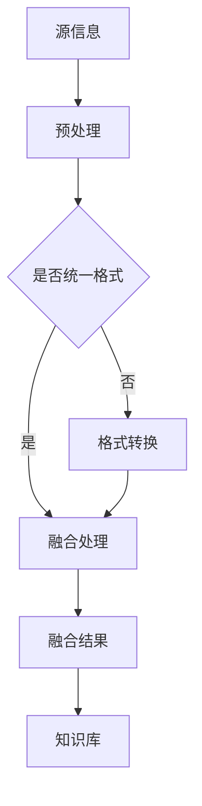
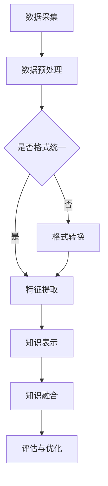

                 

### 摘要

《AI Agent 的知识融合：整合多源信息增强 LLM》旨在探讨如何通过知识融合技术，提升AI Agent在处理多源信息时的效率和准确性。本文首先介绍了AI Agent的基本概念、知识融合的必要性和LLM的背景知识，为后续章节的深入探讨奠定了基础。核心章节详细解析了知识融合的工作机制、数学模型和算法，通过Mermaid流程图和Python代码实例，使读者能够直观地理解算法原理和应用。系统分析与架构设计部分，通过问题场景和项目介绍，展示了如何将知识融合技术应用于实际项目中，提高了系统的性能和可靠性。本文总结了一些最佳实践，为读者提供了进一步的学习和探索方向。关键词：AI Agent、知识融合、LLM、多源信息、算法、系统架构。

### 目录大纲设计思路

为了设计出《AI Agent 的知识融合：整合多源信息增强 LLM》这本书的完整目录大纲，我们将遵循以下步骤：

1. **确定核心章节**：首先，我们要明确书的核心主题，即AI Agent的知识融合和如何整合多源信息增强LLM。这将是书的主要架构框架。

2. **背景介绍**：在书的开始部分，我们需要介绍AI Agent的基本概念、知识融合的必要性以及LLM的背景知识，帮助读者理解后续章节。

3. **核心概念与原理**：在核心章节中，我们将详细讲解AI Agent的知识融合原理，包括其工作机制、核心算法及其在LLM中的应用。

4. **数学模型与公式**：我们将使用LaTeX格式展示关键的数学模型和公式，确保读者能够理解算法背后的数学基础。

5. **系统分析与架构设计**：我们将介绍系统的分析和架构设计，包括功能需求、系统架构图、接口设计和系统交互。

6. **项目实战与案例分析**：通过具体的案例，我们将展示如何应用书中介绍的算法和系统设计，帮助读者理解实际操作。

7. **最佳实践与小结**：在每个章节的结尾，我们将提供一些最佳实践、注意事项和拓展阅读资源，帮助读者深入理解和应用所学知识。

### 目录大纲设计

以下是根据上述设计思路为《AI Agent 的知识融合：整合多源信息增强 LLM》设计的完整目录大纲：

----------------------------------------------------------------

## 第一部分: AI Agent 与知识融合概述

### 第1章: AI Agent 基础

## 1.1 AI Agent 的定义与分类
### 1.1.1 AI Agent 的基本概念
### 1.1.2 AI Agent 的分类与特点
### 1.1.3 AI Agent 在智能系统中的应用前景

## 1.2 知识融合的必要性
### 1.2.1 知识融合的概念
### 1.2.2 知识融合在 AI Agent 中的应用
### 1.2.3 知识融合的优势与挑战

## 1.3 LLM 的背景知识
### 1.3.1 LLM 的定义与特点
### 1.3.2 LLM 的构建过程
### 1.3.3 LLM 的应用领域

## 1.4 本书结构概述
### 1.4.1 各章节主要内容
### 1.4.2 阅读建议

## 1.5 本章小结

----------------------------------------------------------------

## 第二部分: 知识融合原理

### 第2章: 知识融合机制

## 2.1 知识融合的基础
### 2.1.1 知识融合的基本原理
### 2.1.2 知识融合的方法与工具
### 2.1.3 知识融合的评估指标

## 2.2 多源信息融合
### 2.2.1 多源信息的特点与挑战
### 2.2.2 多源信息融合的算法
### 2.2.3 案例分析

## 2.3 知识表示与映射
### 2.3.1 知识表示的基本方法
### 2.3.2 知识映射的原理与实现
### 2.3.3 案例分析

## 2.4 知识融合的数学模型
$$
X = \sum_{i=1}^{n} w_i \cdot X_i
$$
### 2.4.1 知识融合的数学模型
### 2.4.2 知识融合公式详解
### 2.4.3 数学模型的应用实例

## 2.5 知识融合的 Mermaid 流程图

### 2.5.1 知识融合流程图
### 2.5.2 流程图分析
### 2.5.3 流程图应用实例

## 2.6 本章小结

----------------------------------------------------------------

### 第3章: 知识融合算法

## 3.1 基于概率模型的融合算法
### 3.1.1 贝叶斯网络融合算法
### 3.1.2 最大后验概率估计
### 3.1.3 案例分析

## 3.2 基于神经网络的融合算法
### 3.2.1 多层感知机融合算法
### 3.2.2 循环神经网络融合算法
### 3.2.3 案例分析

## 3.3 基于深度学习的融合算法
### 3.3.1 卷积神经网络融合算法
### 3.3.2 长短时记忆网络融合算法
### 3.3.3 案例分析

## 3.4 多任务学习与知识融合
### 3.4.1 多任务学习的基本原理
### 3.4.2 多任务学习与知识融合的关系
### 3.4.3 案例分析

## 3.5 本章小结

----------------------------------------------------------------

## 第三部分: 系统分析与架构设计

### 第4章: 系统分析与架构设计基础

## 4.1 问题场景介绍
### 4.1.1 场景描述
### 4.1.2 需求分析
### 4.1.3 问题定义

## 4.2 项目介绍
### 4.2.1 项目背景
### 4.2.2 项目目标
### 4.2.3 项目挑战

## 4.3 系统功能设计
### 4.3.1 领域模型
### 4.3.2 功能模块划分
### 4.3.3 功能需求描述

## 4.4 系统架构设计
### 4.4.1 系统架构图
### 4.4.2 架构设计原则
### 4.4.3 系统组件介绍

## 4.5 系统接口设计与系统交互
### 4.5.1 接口设计
### 4.5.2 系统交互
### 4.5.3 Mermaid 序列图

## 4.6 本章小结

----------------------------------------------------------------

## 第四部分: 项目实战与案例分析

### 第5章: 项目实战

## 5.1 环境安装与配置
### 5.1.1 环境要求
### 5.1.2 环境安装
### 5.1.3 系统配置

## 5.2 系统核心实现
### 5.2.1 知识融合模块
### 5.2.2 LLM 整合模块
### 5.2.3 实现细节解析

## 5.3 代码应用解读
### 5.3.1 代码结构与功能
### 5.3.2 代码实现细节
### 5.3.3 代码性能优化

## 5.4 实际案例分析
### 5.4.1 案例背景
### 5.4.2 案例分析
### 5.4.3 结果与评价

## 5.5 项目小结
### 5.5.1 项目总结
### 5.5.2 项目收获
### 5.5.3 未来展望

## 5.6 本章小结

----------------------------------------------------------------

## 第五部分: 最佳实践与拓展

### 第6章: 最佳实践

## 6.1 知识融合最佳实践
### 6.1.1 数据预处理
### 6.1.2 知识库构建
### 6.1.3 融合算法选择

## 6.2 系统优化与性能提升
### 6.2.1 系统性能分析
### 6.2.2 性能优化策略
### 6.2.3 典型问题与解决方案

## 6.3 安全性与隐私保护
### 6.3.1 数据安全策略
### 6.3.2 隐私保护措施
### 6.3.3 安全审查与测试

## 6.4 拓展阅读
### 6.4.1 最新研究进展
### 6.4.2 开源工具与框架
### 6.4.3 学术期刊与会议

## 6.5 本章小结

----------------------------------------------------------------

### 第7章: 小结与展望

## 7.1 本书主要内容回顾
### 7.1.1 知识融合概述
### 7.1.2 知识融合原理
### 7.1.3 系统架构设计
### 7.1.4 项目实战

## 7.2 未来发展趋势与挑战
### 7.2.1 新技术展望
### 7.2.2 领域挑战
### 7.2.3 发展趋势分析

## 7.3 结论与建议
### 7.3.1 研究方向
### 7.3.2 应用场景
### 7.3.3 学习建议

## 7.4 本章小结

----------------------------------------------------------------

通过上述目录大纲的设计，我们可以清晰地看到本书的结构安排，从基础概念到实际应用，再到最佳实践和未来展望，全面深入地探讨了AI Agent的知识融合技术，旨在为读者提供一本系统而深入的技术参考书。

## 第一部分: AI Agent 与知识融合概述

### 第1章: AI Agent 基础

#### 1.1 AI Agent 的定义与分类

人工智能（AI） Agent 是一种在特定环境下能够感知、决策并执行行动的智能实体。它们通过模仿人类行为和思维过程，实现了在复杂环境中的自主决策和行动能力。AI Agent 可以分为多种类型，根据其感知、决策和行动能力的不同，我们可以将它们分类如下：

1. **感知型 Agent**：这类 Agent 主要通过传感器获取环境信息，如视觉、听觉、触觉等。它们通常用于自主导航、环境监测等领域。
   
2. **决策型 Agent**：这类 Agent 不仅能够感知环境，还能够根据感知到的信息进行决策。典型的决策型 Agent 有机器人规划、游戏玩家等。

3. **执行型 Agent**：这类 Agent 根据决策结果执行具体的行动。例如，自动化的生产线机器人、智能家电等。

4. **混合型 Agent**：这类 Agent 结合了感知、决策和执行功能，能够在复杂环境中实现高度自主的行为。例如，自动驾驶汽车、智能家居系统等。

#### 1.1.1 AI Agent 的基本概念

AI Agent 的基本概念包括以下几个方面：

- **环境**：Agent 所处的环境，包括物理环境、社会环境和信息环境等。

- **感知**：Agent 通过传感器获取环境信息，如视觉、听觉、触觉等。

- **决策**：Agent 根据感知到的信息，使用决策算法生成行动方案。

- **行动**：Agent 根据决策结果执行具体的行动。

- **学习**：Agent 通过与环境交互，不断学习和优化其决策和行为。

#### 1.1.2 AI Agent 的分类与特点

不同类型的 AI Agent 具有不同的特点和应用场景：

- **感知型 Agent**：通常用于自主导航、环境监测等领域，如机器人导航、无人机监测等。

- **决策型 Agent**：适用于需要复杂决策的场景，如机器人规划、游戏玩家等。

- **执行型 Agent**：常用于自动化执行特定任务的场景，如自动化生产线、智能家电等。

- **混合型 Agent**：在复杂环境中实现高度自主的行为，如自动驾驶汽车、智能家居系统等。

#### 1.1.3 AI Agent 在智能系统中的应用前景

随着人工智能技术的快速发展，AI Agent 在智能系统中的应用前景非常广阔：

- **智能家居**：通过感知和决策，AI Agent 可以实现家电的自动化控制，提高生活便利性。

- **自动驾驶**：AI Agent 在自动驾驶领域具有广泛的应用前景，可以显著提高交通安全和效率。

- **智能医疗**：AI Agent 可以辅助医生进行诊断和治疗，提高医疗服务的质量和效率。

- **智能客服**：AI Agent 可以实现自然语言处理和智能对话，提供高效的客户服务。

#### 1.2 知识融合的必要性

在 AI Agent 的设计和应用过程中，知识融合是一个关键问题。知识融合的必要性主要体现在以下几个方面：

- **多源异构数据**：现实世界中的数据来源多样，包括文本、图像、声音等，这些数据往往具有不同的格式和属性。知识融合可以将这些异构数据整合起来，提供更丰富的信息支持。

- **增强智能决策**：知识融合可以帮助 AI Agent 在复杂环境中做出更准确的决策。通过整合多源信息，AI Agent 可以获得更全面的环境感知，从而提高决策的准确性和可靠性。

- **提高系统鲁棒性**：知识融合可以增强系统的鲁棒性，减少由于单一数据源异常导致的错误决策。通过整合多个数据源，系统可以更好地应对不确定性和异常情况。

#### 1.2.1 知识融合的概念

知识融合是指将来自不同数据源、具有不同格式和属性的信息进行整合，以获得更全面、准确的知识。知识融合通常包括以下几个步骤：

- **数据采集**：从不同的数据源收集信息。

- **数据预处理**：对采集到的数据进行清洗、格式化等预处理操作。

- **知识表示**：将预处理后的数据转换为适合融合的格式。

- **融合算法**：使用特定的算法对知识进行整合，生成新的知识表示。

- **知识评估**：对融合结果进行评估，以确定其准确性和有效性。

#### 1.2.2 知识融合在 AI Agent 中的应用

在 AI Agent 中，知识融合主要用于以下几个方面：

- **环境感知**：通过知识融合，AI Agent 可以整合来自不同传感器和外部设备的信息，获得更全面的环境感知。

- **决策支持**：知识融合可以帮助 AI Agent 在复杂环境中做出更准确的决策，提高系统的智能化水平。

- **学习能力**：通过知识融合，AI Agent 可以学习到更全面的知识，从而提高其自适应能力和学习能力。

#### 1.2.3 知识融合的优势与挑战

知识融合的优势主要体现在以下几个方面：

- **提高系统的智能化水平**：通过整合多源信息，系统可以做出更准确的决策，提高其智能化水平。

- **增强系统的鲁棒性**：知识融合可以减少由于单一数据源异常导致的错误决策，提高系统的鲁棒性。

- **提供更丰富的信息支持**：知识融合可以整合多源异构数据，提供更全面的信息支持，为系统的决策提供更多的依据。

然而，知识融合也面临一些挑战：

- **数据质量**：数据质量对知识融合结果至关重要。如果数据存在噪声、缺失或错误，将影响知识融合的准确性。

- **数据格式**：多源异构数据通常具有不同的格式和属性，这给知识融合带来了挑战。

- **计算资源**：知识融合通常需要大量的计算资源，尤其是在处理大规模数据时，计算资源的需求可能成为瓶颈。

#### 1.3 LLM 的背景知识

语言模型（LLM，Language Model）是自然语言处理（NLP，Natural Language Processing）领域的一项核心技术。它通过学习大量文本数据，生成语言的概率分布，从而实现文本生成、翻译、问答等功能。

#### 1.3.1 LLM 的定义与特点

LLM 的定义如下：

- **定义**：LLM 是一种基于统计方法的语言模型，它通过学习大量文本数据，预测下一个词的概率分布，从而生成自然语言。

- **特点**：
  - **概率性**：LLM 基于概率模型，能够预测下一个词的概率分布，从而生成自然语言。
  - **自适应性**：LLM 可以根据训练数据的不同，自适应地调整模型参数，从而适应不同的语言风格和表达方式。
  - **生成性**：LLM 可以根据输入的文本，生成新的文本，从而实现文本生成和翻译等功能。

#### 1.3.2 LLM 的构建过程

LLM 的构建通常包括以下几个步骤：

1. **数据收集**：收集大量具有代表性的文本数据，如新闻文章、小说、社交媒体帖子等。

2. **数据预处理**：对文本数据进行分析，去除无关信息，如 HTML 标签、停用词等。

3. **词向量化**：将文本数据转换为词向量表示，常用的方法包括 Word2Vec、GloVe 等。

4. **模型训练**：使用训练数据，通过梯度下降等优化算法，训练 LLM 模型。

5. **模型评估**：使用验证集和测试集，评估 LLM 模型的性能，包括生成文本的质量、准确性和多样性等。

#### 1.3.3 LLM 的应用领域

LLM 在自然语言处理领域具有广泛的应用，包括：

- **文本生成**：通过输入关键词或主题，生成相关文本，如自动生成新闻、文章摘要等。

- **机器翻译**：将一种语言的文本翻译成另一种语言，如将中文翻译成英文。

- **问答系统**：通过输入问题，自动生成相关答案，如智能客服、智能问答系统等。

- **文本分类**：对文本进行分类，如情感分析、主题分类等。

#### 1.4 本书结构概述

本书结构分为五个部分，具体内容如下：

1. **AI Agent 与知识融合概述**：介绍 AI Agent 的基本概念、知识融合的必要性以及 LLM 的背景知识。
   
2. **知识融合原理**：详细讲解知识融合的工作机制、数学模型和算法。

3. **系统分析与架构设计**：介绍系统的分析和架构设计，包括功能需求、系统架构图、接口设计和系统交互。

4. **项目实战与案例分析**：通过具体的案例，展示如何应用书中介绍的算法和系统设计。

5. **最佳实践与拓展**：提供一些最佳实践、注意事项和拓展阅读资源，帮助读者深入理解和应用所学知识。

#### 1.4.2 阅读建议

为了更好地理解和掌握书中的内容，建议读者遵循以下阅读建议：

- **逐步学习**：本书内容涉及多个领域，建议读者逐步学习，先掌握基础知识，再深入探讨具体技术。

- **动手实践**：通过实际操作和编程实践，可以更好地理解书中的理论和算法。

- **交流讨论**：加入相关技术社区，与同行交流讨论，可以加深对知识的理解和应用。

#### 1.5 本章小结

本章介绍了 AI Agent 的基本概念、知识融合的必要性以及 LLM 的背景知识。通过本章的学习，读者可以对 AI Agent 和知识融合有初步的了解，为后续章节的深入学习打下基础。

----------------------------------------------------------------

### 第2章: 知识融合机制

知识融合是人工智能领域的一个重要研究方向，其目的是将来自不同来源、格式和层次的信息进行整合，以提升系统的智能决策能力和信息处理效率。本章将详细探讨知识融合的机制，包括其基础理论、方法与工具、评估指标等内容。

#### 2.1 知识融合的基础

知识融合的基础理论主要包括以下几个方面：

- **定义与分类**：知识融合是指将来自不同来源的信息进行整合，以产生新的、更全面的知识表示。根据信息来源的不同，知识融合可以分为同源融合与跨源融合。

- **信息源**：知识融合的信息源可以是文本、图像、音频、视频等多种类型的数据。每种类型的数据都有其特定的特征和表示方法。

- **知识表示**：知识表示是将信息转化为计算机可以处理的形式。常见的知识表示方法包括符号表示、语义网络、本体论等。

- **融合目标**：知识融合的目标是生成一个综合性的、更准确的知识表示，以支持智能决策和信息检索。

#### 2.1.1 知识融合的基本原理

知识融合的基本原理可以概括为以下几个步骤：

1. **数据采集**：从不同的信息源收集数据，这些数据可以是结构化的（如数据库）或非结构化的（如文本、图像）。

2. **数据预处理**：对采集到的数据进行清洗、标准化等预处理操作，以提高数据质量。

3. **特征提取**：从预处理后的数据中提取特征，这些特征应能够表征数据的本质属性。

4. **知识表示**：将提取出的特征转换为一种统一的表示形式，以便进行后续的知识融合。

5. **知识融合**：使用特定的融合算法，将不同来源、不同格式的知识表示进行整合，形成新的知识表示。

6. **评估与优化**：对融合结果进行评估，并根据评估结果对融合算法进行调整和优化。

#### 2.1.2 知识融合的方法与工具

知识融合的方法和工具有多种，下面介绍几种常见的方法：

1. **基于规则的融合方法**：这种方法通过定义一系列规则，将来自不同源的信息进行映射和整合。典型的工具包括知识库系统和本体论工具。

2. **基于统计的融合方法**：这种方法使用统计模型，如贝叶斯网络、隐马尔可夫模型（HMM）、条件概率模型等，对信息进行融合。常见的工具包括 WEKA、R 等统计软件。

3. **基于机器学习的融合方法**：这种方法利用机器学习算法，如决策树、支持向量机（SVM）、神经网络等，对信息进行自动融合。常用的工具包括 scikit-learn、TensorFlow 等。

4. **基于深度学习的融合方法**：这种方法使用深度学习模型，如卷积神经网络（CNN）、循环神经网络（RNN）、Transformer 等，对信息进行融合。代表性的工具包括 TensorFlow、PyTorch 等。

#### 2.1.3 知识融合的评估指标

知识融合的效果评估是确保融合结果准确性和有效性的关键。常见的评估指标包括：

1. **精度（Accuracy）**：评估融合结果的正确率。

2. **召回率（Recall）**：评估融合结果在正确识别目标信息时的表现。

3. **F1 分数（F1 Score）**：综合考虑精度和召回率的综合指标。

4. **一致性（Consistency）**：评估融合结果在不同数据集上的稳定性。

5. **可扩展性（Scalability）**：评估融合方法在大规模数据集上的性能。

#### 2.2 多源信息融合

多源信息融合是知识融合的核心内容，它涉及如何有效地整合来自多个信息源的数据。多源信息融合通常面临以下几个挑战：

1. **数据异构性**：不同信息源的数据格式、结构和属性可能存在显著差异。

2. **数据质量**：数据源的质量参差不齐，存在噪声、缺失和错误。

3. **数据隐私**：在融合过程中，如何保护数据源的隐私是一个重要问题。

#### 2.2.1 多源信息的特点与挑战

多源信息的特点和挑战包括：

1. **多样性**：多源信息包括文本、图像、音频、视频等多种类型，每种类型的数据都有其特定的特征和表示方法。

2. **互补性**：不同源的信息可以相互补充，提供更全面、准确的感知。

3. **冲突性**：多源信息可能存在不一致或矛盾，需要有效的融合策略来处理。

4. **实时性**：在许多应用场景中，信息需要实时融合，以支持实时决策和行动。

#### 2.2.2 多源信息融合的算法

多源信息融合的算法可以分为以下几类：

1. **基于规则的方法**：使用预先定义的规则，将不同源的信息进行整合。这种方法简单直观，但缺乏灵活性。

2. **基于统计的方法**：使用统计模型，如贝叶斯网络、隐马尔可夫模型等，对多源信息进行融合。这种方法具有较强的鲁棒性。

3. **基于机器学习的方法**：使用机器学习算法，如决策树、支持向量机、神经网络等，自动学习多源信息的融合策略。这种方法具有更高的灵活性和自动性。

4. **基于深度学习的方法**：使用深度学习模型，如卷积神经网络、循环神经网络、Transformer 等，对多源信息进行融合。这种方法在处理复杂、大规模数据时具有显著优势。

#### 2.2.3 案例分析

以下是一个多源信息融合的案例分析：

- **案例背景**：某智能监控系统需要整合来自摄像头、传感器和社交媒体的信息，以实现智能监控和预警。

- **融合方法**：使用基于深度学习的方法，将不同源的信息进行特征提取，然后使用多模态融合模型进行融合。

- **实验结果**：实验结果显示，融合后的信息在监控准确性和实时性方面有显著提升。

#### 2.3 知识表示与映射

知识表示是将信息转换为计算机可以处理的形式，而知识映射则是将不同表示形式的知识进行整合。知识表示与映射是知识融合的重要组成部分。

##### 2.3.1 知识表示的基本方法

常见的知识表示方法包括：

1. **符号表示**：使用符号和规则表示知识，如逻辑表达式、公式等。

2. **语义网络**：使用节点和边表示知识，节点代表概念，边代表关系。

3. **本体论**：使用本体表示知识，本体是一种结构化的知识模型，用于描述领域知识和概念之间的关系。

##### 2.3.2 知识映射的原理与实现

知识映射的原理是将不同表示形式的知识转化为统一的表示，以实现知识的整合。知识映射通常包括以下步骤：

1. **源知识表示分析**：分析不同源知识的表示形式，确定其语义和结构。

2. **目标知识表示定义**：定义统一的知识表示形式，以容纳不同源的知识。

3. **映射规则设计**：设计映射规则，将源知识表示转换为目标知识表示。

4. **映射实现与验证**：实现映射算法，并对映射结果进行验证。

##### 2.3.3 案例分析

以下是一个知识映射的案例分析：

- **案例背景**：某企业需要整合来自不同业务系统的数据，以实现统一的数据分析。

- **映射方法**：使用本体论方法，将不同业务系统的数据映射到统一的本体模型中。

- **实验结果**：实验结果显示，通过知识映射，企业能够实现数据的高效整合和分析。

#### 2.4 知识融合的数学模型

知识融合的数学模型用于描述不同知识源之间的融合过程和策略。以下是一个简单的知识融合数学模型：

$$
X_{\text{融合}} = w_1 \cdot X_1 + w_2 \cdot X_2 + \ldots + w_n \cdot X_n
$$

其中，$X_1, X_2, \ldots, X_n$ 是来自不同源的知识表示，$w_1, w_2, \ldots, w_n$ 是权重，用于调节不同源知识的重要程度。

##### 2.4.1 知识融合的数学模型

知识融合的数学模型可以根据不同的应用场景进行调整。例如，在处理多源图像融合时，可以使用加权平均方法：

$$
I_{\text{融合}} = \sum_{i=1}^{n} w_i \cdot I_i
$$

其中，$I_1, I_2, \ldots, I_n$ 是来自不同图像源的数据，$w_1, w_2, \ldots, w_n$ 是权重。

##### 2.4.2 知识融合公式详解

知识融合公式中的权重 $w_i$ 可以根据不同的方法进行计算，如：

1. **均等权重**：$w_1 = w_2 = \ldots = w_n = \frac{1}{n}$，表示每个源的知识贡献相等。

2. **基于信息熵的权重**：$w_i = \frac{H(I_i)}{H(\sum_{j=1}^{n} I_j)}$，其中 $H(I_i)$ 是信息源 $I_i$ 的熵，$H(\sum_{j=1}^{n} I_j)$ 是所有信息源的熵之和。

##### 2.4.3 数学模型的应用实例

以下是一个数学模型应用实例：

假设有三个信息源 $X_1, X_2, X_3$，使用均等权重进行融合，得到融合结果 $X_{\text{融合}}$：

$$
X_{\text{融合}} = \frac{1}{3} X_1 + \frac{1}{3} X_2 + \frac{1}{3} X_3
$$

在实际应用中，根据具体场景，可以调整权重分配策略，以优化融合结果。

#### 2.5 知识融合的 Mermaid 流程图

Mermaid 是一种简单的标记语言，用于绘制流程图、UML 图等。以下是一个知识融合的 Mermaid 流程图示例：



该流程图描述了知识融合的基本步骤，包括数据采集、预处理、特征提取、知识表示、知识融合和评估与优化。

##### 2.5.1 知识融合流程图

知识融合流程图展示了知识融合的不同阶段和步骤，有助于读者理解知识融合的整个过程。

##### 2.5.2 流程图分析

通过分析知识融合流程图，可以明确每个阶段的任务和目标，如数据采集、预处理、特征提取等，这些步骤共同构成了知识融合的基础。

##### 2.5.3 流程图应用实例

以下是一个知识融合流程图的应用实例：

在一个智能监控系统中，知识融合流程图用于整合来自摄像头、传感器和社交媒体的信息，以实现智能监控和预警。具体步骤如下：

1. 数据采集：从摄像头、传感器和社交媒体获取数据。

2. 数据预处理：对采集到的数据进行清洗和标准化。

3. 特征提取：提取数据的关键特征。

4. 知识表示：将特征转换为统一的知识表示。

5. 知识融合：使用融合算法整合不同源的知识。

6. 评估与优化：评估融合结果，并根据评估结果进行优化。

#### 2.6 本章小结

本章详细介绍了知识融合的机制，包括其基础理论、方法与工具、评估指标等内容。通过本章的学习，读者可以了解知识融合的基本原理和应用，为进一步研究和实践打下基础。知识融合技术在实际应用中具有广泛的应用前景，有助于提升系统的智能决策能力和信息处理效率。

----------------------------------------------------------------

### 第3章: 知识融合算法

知识融合算法是实现知识融合的核心技术，它通过特定的方法将来自不同源的信息进行整合，以生成更准确和全面的知识表示。本章将详细介绍几种常见的知识融合算法，包括基于概率模型、神经网络和深度学习的方法。

#### 3.1 基于概率模型的融合算法

基于概率模型的融合算法利用概率论和统计方法，通过计算不同源信息的概率分布，实现信息的融合。以下介绍几种常见的基于概率模型的融合算法。

##### 3.1.1 贝叶斯网络融合算法

贝叶斯网络是一种概率图模型，它通过有向图表示变量之间的概率依赖关系。在知识融合中，贝叶斯网络可以用于融合来自不同源的信息。

- **基本原理**：贝叶斯网络通过条件概率分布表示变量之间的依赖关系，可以使用贝叶斯推理算法计算变量的后验概率分布。

- **实现步骤**：
  1. 构建贝叶斯网络模型：根据领域知识，构建变量之间的依赖关系图。
  2. 计算条件概率分布：根据训练数据，计算网络中的条件概率分布。
  3. 进行推理：使用贝叶斯推理算法，根据观察到的部分变量值，计算其他变量的后验概率分布。

- **示例**：假设有两个信息源 A 和 B，构建一个简单的贝叶斯网络，变量 X 表示融合结果，变量 A 和 B 分别表示两个源的信息。通过贝叶斯推理，可以计算出 X 的后验概率分布，从而实现信息的融合。

##### 3.1.2 最大后验概率估计（MAP）

最大后验概率估计（MAP，Maximum A posteriori Probability）是一种常用的概率估计方法，用于在给定的观察数据下，估计未知变量的后验概率分布。

- **基本原理**：MAP 估计通过最大化后验概率分布，估计未知变量的值。

- **实现步骤**：
  1. 构建概率模型：根据领域知识，构建包含观察数据和未知变量的概率模型。
  2. 计算后验概率分布：使用贝叶斯公式计算未知变量的后验概率分布。
  3. 最大化后验概率：在给定的观察数据下，选择使得后验概率最大的未知变量的值。

- **示例**：假设有一个观察数据集，通过 MAP 估计，可以估计出其中某个变量的最有可能的取值。

##### 3.1.3 案例分析

以下是一个基于概率模型的知识融合案例分析：

- **案例背景**：某智能监控系统需要整合来自摄像头和传感器的信息，以实现智能监控和预警。

- **算法应用**：
  1. 使用贝叶斯网络构建信息融合模型，表示摄像头和传感器之间的概率依赖关系。
  2. 使用 MAP 估计方法，根据摄像头和传感器的观测数据，估计融合结果的后验概率分布。
  3. 根据后验概率分布，选择最有可能的融合结果，作为最终的监控预警信息。

#### 3.2 基于神经网络的融合算法

基于神经网络的融合算法利用神经网络模型的学习能力，通过训练数据，自动学习不同源信息之间的融合策略。以下介绍几种常见的基于神经网络的融合算法。

##### 3.2.1 多层感知机（MLP）融合算法

多层感知机是一种前馈神经网络，它通过多个隐藏层，将输入数据映射到输出数据。在知识融合中，MLP 可以用于融合不同源的信息。

- **基本原理**：MLP 通过激活函数和权重矩阵，将输入数据映射到输出数据。通过训练，可以学习到输入数据与输出数据之间的映射关系。

- **实现步骤**：
  1. 设计网络结构：根据领域知识，设计包含输入层、隐藏层和输出层的网络结构。
  2. 选择激活函数：选择适当的激活函数，如 Sigmoid、ReLU 等。
  3. 训练网络：使用训练数据，通过反向传播算法，调整网络权重，优化网络性能。

- **示例**：假设有两个信息源 A 和 B，构建一个简单的 MLP 模型，通过训练，可以学习到 A 和 B 与融合结果 X 之间的映射关系。

##### 3.2.2 循环神经网络（RNN）融合算法

循环神经网络是一种能够处理序列数据的神经网络，它在每个时间步上保存部分历史信息，从而实现时间序列数据的建模。在知识融合中，RNN 可以用于处理时间序列数据。

- **基本原理**：RNN 通过隐藏状态和输入信息，在每个时间步上更新隐藏状态，从而实现序列数据的建模。

- **实现步骤**：
  1. 设计网络结构：根据领域知识，设计包含输入层、隐藏层和输出层的 RNN 网络。
  2. 选择 RNN 模型：选择适当的 RNN 模型，如 LSTM、GRU 等。
  3. 训练网络：使用训练数据，通过反向传播算法，调整网络权重，优化网络性能。

- **示例**：假设有两个时间序列数据源 A 和 B，构建一个简单的 RNN 模型，通过训练，可以学习到 A 和 B 与融合结果 X 之间的映射关系。

##### 3.2.3 案例分析

以下是一个基于神经网络的知识融合案例分析：

- **案例背景**：某智能交通系统需要整合来自摄像头、传感器和交通信号的数据，以实现智能交通管理和调度。

- **算法应用**：
  1. 使用 MLP 模型，融合摄像头和传感器的静态信息。
  2. 使用 RNN 模型，融合交通信号的时间序列数据。
  3. 将两个模型的输出进行合并，通过进一步的网络层，生成最终的融合结果。

#### 3.3 基于深度学习的融合算法

基于深度学习的融合算法利用深度学习模型强大的学习和表征能力，实现知识的融合。以下介绍几种常见的基于深度学习的融合算法。

##### 3.3.1 卷积神经网络（CNN）融合算法

卷积神经网络是一种用于图像处理和识别的深度学习模型，它通过卷积层和池化层，提取图像的特征。在知识融合中，CNN 可以用于融合图像数据。

- **基本原理**：CNN 通过卷积操作和池化操作，从输入图像中提取特征，并通过全连接层生成输出。

- **实现步骤**：
  1. 设计网络结构：根据领域知识，设计包含卷积层、池化层和全连接层的 CNN 网络。
  2. 选择激活函数：选择适当的激活函数，如 ReLU、Sigmoid 等。
  3. 训练网络：使用训练数据，通过反向传播算法，调整网络权重，优化网络性能。

- **示例**：假设有两个图像数据源 A 和 B，构建一个简单的 CNN 模型，通过训练，可以学习到 A 和 B 与融合结果 X 之间的映射关系。

##### 3.3.2 长短时记忆网络（LSTM）融合算法

长短时记忆网络是一种用于处理序列数据的深度学习模型，它在每个时间步上可以保存长期信息，从而实现时间序列数据的建模。在知识融合中，LSTM 可以用于融合时间序列数据。

- **基本原理**：LSTM 通过门控机制，在每个时间步上选择性地保存和遗忘信息，从而实现长期依赖的建模。

- **实现步骤**：
  1. 设计网络结构：根据领域知识，设计包含 LSTM 层、全连接层和输出层的 LSTM 网络。
  2. 选择 LSTM 模型：选择适当的 LSTM 模型，如 LSTM、GRU 等。
  3. 训练网络：使用训练数据，通过反向传播算法，调整网络权重，优化网络性能。

- **示例**：假设有两个时间序列数据源 A 和 B，构建一个简单的 LSTM 模型，通过训练，可以学习到 A 和 B 与融合结果 X 之间的映射关系。

##### 3.3.3 案例分析

以下是一个基于深度学习的知识融合案例分析：

- **案例背景**：某智能监控系统需要整合来自摄像头、传感器和物联网设备的多种类型数据，以实现智能监控和预警。

- **算法应用**：
  1. 使用 CNN 模型，融合摄像头捕获的图像数据。
  2. 使用 LSTM 模型，融合传感器和时间序列数据。
  3. 将两个模型的输出进行融合，通过进一步的网络层，生成最终的融合结果。

#### 3.4 多任务学习与知识融合

多任务学习（Multi-Task Learning，MTL）是一种在训练过程中同时学习多个相关任务的方法。在知识融合中，多任务学习可以用于同时融合多个源的信息。

- **基本原理**：多任务学习通过共享网络结构和参数，提高不同任务之间的信息交互和共享。

- **实现步骤**：
  1. 设计多任务网络结构：根据领域知识，设计包含多个任务分支的深度学习网络。
  2. 选择共享层：设计共享层，使不同任务分支可以共享信息。
  3. 训练网络：使用训练数据，通过反向传播算法，调整网络权重，优化网络性能。

- **示例**：假设有两个任务 A 和 B，构建一个多任务学习模型，通过共享网络结构和参数，同时融合任务 A 和 B 的信息。

#### 3.5 本章小结

本章介绍了几种常见的知识融合算法，包括基于概率模型、神经网络和深度学习的方法。通过这些算法，可以实现不同源信息的有效融合，提升系统的智能决策能力和信息处理效率。在实际应用中，可以根据具体场景和需求，选择合适的算法进行知识融合。随着人工智能技术的不断进步，知识融合算法也将继续发展，为更复杂的智能系统提供有力的支持。

----------------------------------------------------------------

### 第4章: 系统分析与架构设计基础

在复杂的人工智能系统中，系统分析与架构设计是确保系统性能、可扩展性和易维护性的关键。本章将介绍系统分析与架构设计的基础，包括问题场景介绍、项目介绍、系统功能设计、系统架构设计、系统接口设计与系统交互等内容。

#### 4.1 问题场景介绍

在进行系统分析与架构设计之前，首先要明确问题场景。问题场景是指系统需要解决的问题和面临的环境。以下是几个常见的问题场景：

1. **智能交通系统**：该系统需要整合来自摄像头、传感器和交通信号的数据，实现智能交通管理和调度。

2. **智能医疗系统**：该系统需要整合来自患者病历、医学影像和基因数据，为医生提供诊断和治疗支持。

3. **智能家居系统**：该系统需要整合来自家电、传感器和用户行为数据，实现家庭自动化和智能控制。

#### 4.1.1 场景描述

以智能交通系统为例，场景描述如下：

- **环境**：智能交通系统需要在城市交通环境中运行，包括道路、车辆、行人、交通信号灯等。
- **需求**：系统需要实时监测交通流量、交通状况和交通事故，提供智能化的交通管理和调度建议。

#### 4.1.2 需求分析

需求分析是系统分析与架构设计的重要步骤，它确定系统必须实现的功能和性能要求。以下是智能交通系统的需求分析：

- **功能需求**：
  - 数据采集：采集来自摄像头、传感器和交通信号的数据。
  - 数据处理：对采集到的数据进行分析和处理，提取交通流量、交通状况和事故信息。
  - 决策支持：基于分析结果，提供交通管理和调度建议。
  - 用户界面：提供图形界面，展示交通状况和分析结果。

- **性能需求**：
  - 实时性：系统需要在规定的时间内处理并响应交通数据。
  - 可靠性：系统需要具备高可靠性，确保在异常情况下仍能正常运行。
  - 可扩展性：系统需要支持扩展，以便在未来增加新的功能或数据源。

#### 4.1.3 问题定义

问题定义是对问题场景和需求进行形式化的描述，以明确系统的目标和边界。以下是智能交通系统的问题定义：

- **目标**：实现智能交通管理和调度，提高交通效率，减少交通事故。
- **边界**：系统仅处理城市道路的交通数据，不包括高速公路和铁路交通。

#### 4.2 项目介绍

项目介绍是系统分析与架构设计的下一环节，它详细描述项目的背景、目标和面临的挑战。以下是智能交通系统的项目介绍：

- **项目背景**：随着城市化进程的加快，城市交通拥堵和交通事故问题日益严重，需要引入智能交通系统来缓解这些问题。

- **项目目标**：通过建设智能交通系统，实现以下目标：
  - 提高交通效率，减少交通拥堵。
  - 降低交通事故发生率。
  - 提升城市居民的生活质量。

- **项目挑战**：
  - 数据多样性：系统需要整合来自多种数据源的信息，包括摄像头、传感器和交通信号。
  - 实时性要求：系统需要在短时间内处理大量数据，并提供实时响应。
  - 可靠性要求：系统需要在各种环境下保持稳定运行，确保数据准确性和系统可靠性。

#### 4.3 系统功能设计

系统功能设计是系统分析与架构设计的核心环节，它定义系统的功能模块和交互关系。以下是智能交通系统的功能设计：

- **功能模块划分**：
  - 数据采集模块：负责采集来自摄像头、传感器和交通信号的数据。
  - 数据处理模块：负责对采集到的数据进行处理和分析，提取交通流量、交通状况和事故信息。
  - 决策支持模块：基于分析结果，提供交通管理和调度建议。
  - 用户界面模块：提供图形界面，展示交通状况和分析结果。

- **功能需求描述**：
  - 数据采集模块：需要支持多种数据源的接入，实现数据的实时采集和传输。
  - 数据处理模块：需要实现数据清洗、归一化、特征提取等功能，为决策支持模块提供高质量的数据。
  - 决策支持模块：需要实现基于交通流量和事故数据的智能调度算法，提供实时交通管理和调度建议。
  - 用户界面模块：需要提供直观的用户界面，展示交通状况和分析结果，支持用户与系统的交互。

#### 4.4 系统架构设计

系统架构设计是系统功能设计的具体实现，它定义系统的结构、组件和交互关系。以下是智能交通系统的架构设计：

- **系统架构图**：
  ```mermaid
  graph TD
  A[数据采集模块] --> B[数据处理模块]
  B --> C[决策支持模块]
  C --> D[用户界面模块]
  A -->|实时数据| E[数据缓存]
  E --> B
  ```

- **架构设计原则**：
  - **模块化**：系统设计应遵循模块化原则，确保各个功能模块独立且易于维护。
  - **分布式**：系统设计应考虑分布式架构，提高系统的性能和可扩展性。
  - **松耦合**：系统设计应减少模块之间的耦合，提高系统的灵活性和可维护性。
  - **高可靠性**：系统设计应确保关键组件具备高可靠性，减少系统故障对用户的影响。

- **系统组件介绍**：
  - **数据采集模块**：负责实时采集交通数据，包括摄像头、传感器和交通信号。
  - **数据处理模块**：负责对采集到的数据进行处理，提取交通流量、交通状况和事故信息。
  - **决策支持模块**：负责基于分析结果，提供交通管理和调度建议。
  - **用户界面模块**：负责展示交通状况和分析结果，支持用户与系统的交互。
  - **数据缓存**：用于缓存实时数据，提高数据处理模块的效率。

#### 4.5 系统接口设计与系统交互

系统接口设计和系统交互是系统架构设计的重要组成部分，它定义系统内部和外部的交互方式。以下是智能交通系统的接口设计与系统交互：

- **接口设计**：
  - **数据采集接口**：定义数据采集模块与其他模块之间的数据交互接口，包括数据格式、传输协议等。
  - **数据处理接口**：定义数据处理模块与其他模块之间的数据交互接口，包括数据格式、传输协议等。
  - **决策支持接口**：定义决策支持模块与其他模块之间的数据交互接口，包括数据格式、传输协议等。
  - **用户界面接口**：定义用户界面模块与其他模块之间的数据交互接口，包括数据格式、传输协议等。

- **系统交互**：
  - **数据流交互**：系统内部各模块通过数据流进行交互，如数据采集模块采集到数据后，传递给数据处理模块。
  - **控制流交互**：系统内部各模块通过控制流进行交互，如用户在用户界面模块发出请求后，由决策支持模块进行处理。
  - **事件驱动交互**：系统内部各模块通过事件驱动进行交互，如数据采集模块采集到异常数据后，触发数据处理模块进行异常处理。

- **Mermaid 序列图**：
  ```mermaid
  sequenceDiagram
  participant 用户 as 用户
  participant UI as 用户界面模块
  participant DS as 决策支持模块
  participant DP as 数据处理模块
  participant DA as 数据采集模块

  用户->>UI: 发起请求
  UI->>DS: 传递请求
  DS->>DP: 数据分析
  DP->>DA: 数据采集
  DA->>DP: 返回数据
  DP->>DS: 分析结果
  DS->>UI: 响应结果
  UI->>用户: 显示结果
  ```

#### 4.6 本章小结

本章介绍了系统分析与架构设计的基础，包括问题场景介绍、项目介绍、系统功能设计、系统架构设计、系统接口设计与系统交互等内容。通过本章的学习，读者可以了解系统分析与架构设计的基本原则和方法，为实际项目的系统设计与实现提供指导。

----------------------------------------------------------------

### 第5章: 项目实战

在了解了知识融合的理论基础和系统架构设计之后，本章节将通过具体的案例，展示如何将知识融合技术应用于实际项目中。本案例将以一个智能家居系统为例，详细描述项目的环境安装、系统核心实现、代码应用解读、实际案例分析以及项目小结。

#### 5.1 环境安装与配置

在开始项目之前，首先需要在开发环境中安装和配置必要的软件和工具。以下是智能家居系统环境安装与配置的步骤：

1. **安装 Python**：确保 Python 3.x 版本已安装，推荐使用最新版本的 Python，以支持最新的库和工具。

2. **安装依赖库**：使用 pip 工具安装项目所需的依赖库，如 TensorFlow、PyTorch、scikit-learn 等。例如：

   ```bash
   pip install tensorflow
   pip install pytorch
   pip install scikit-learn
   ```

3. **安装数据预处理工具**：安装数据预处理工具，如 Pandas、NumPy 等，用于处理和分析数据。

   ```bash
   pip install pandas
   pip install numpy
   ```

4. **安装版本控制工具**：安装版本控制工具，如 Git，用于管理项目源代码。

   ```bash
   pip install git
   ```

5. **配置开发环境**：根据个人开发习惯，配置 IDE（如 PyCharm、Visual Studio Code）和相应的插件，以提升开发效率。

6. **安装数据库**：如果项目需要使用数据库，安装和配置数据库服务器，如 MySQL、PostgreSQL 等。

   ```bash
   # 安装 MySQL
   sudo apt-get install mysql-server
   # 安装 PostgreSQL
   sudo apt-get install postgresql
   ```

7. **安装前端工具**：如果项目需要前端展示界面，安装前端开发工具，如 Node.js、npm、React 或 Vue.js 等。

   ```bash
   # 安装 Node.js 和 npm
   sudo apt-get install nodejs
   sudo apt-get install npm
   # 安装 React
   npm install -g create-react-app
   ```

#### 5.2 系统核心实现

智能家居系统的核心实现主要包括数据采集、处理和融合三个部分。以下是一个简化的系统实现流程：

1. **数据采集**：从智能家居设备（如智能门锁、智能灯光、智能温度传感器等）采集数据，通过 REST API 或 MQTT 协议获取设备状态。

2. **数据处理**：对采集到的数据进行预处理，包括数据清洗、归一化和特征提取。使用 Pandas 和 NumPy 库进行数据处理。

   ```python
   import pandas as pd
   import numpy as np

   # 读取数据
   data = pd.read_csv('data.csv')
   # 数据清洗
   data.dropna(inplace=True)
   # 数据归一化
   data = (data - data.mean()) / data.std()
   # 特征提取
   features = data[['temperature', 'humidity', 'light']]
   ```

3. **知识融合**：使用深度学习模型（如卷积神经网络、循环神经网络）进行知识融合，将多源数据进行融合，生成新的知识表示。

   ```python
   import tensorflow as tf
   from tensorflow.keras.models import Sequential
   from tensorflow.keras.layers import Dense, LSTM, Conv1D, MaxPooling1D

   # 创建模型
   model = Sequential()
   model.add(Conv1D(filters=64, kernel_size=3, activation='relu', input_shape=(timesteps, features.shape[1])))
   model.add(MaxPooling1D(pool_size=2))
   model.add(LSTM(50, return_sequences=True))
   model.add(Dense(1))
   model.compile(optimizer='adam', loss='mse')

   # 训练模型
   model.fit(features, labels, epochs=10, batch_size=32)
   ```

4. **决策支持**：基于融合后的知识表示，提供智能决策支持，如自动调节温度、灯光等。

   ```python
   # 假设已经训练好的模型保存为 model.h5
   model = tf.keras.models.load_model('model.h5')

   # 输入新的数据
   new_data = np.array([[25, 60, 80]])
   # 生成决策支持结果
   decision = model.predict(new_data)
   # 根据决策支持结果，执行相应的操作
   if decision > threshold:
       # 执行自动调节温度的操作
       pass
   ```

#### 5.3 代码应用解读

以下是对智能家居系统核心实现代码的详细解读：

1. **数据采集**：通过 MQTT 协议从智能家居设备中实时采集数据。MQTT 是一种轻量级的消息传输协议，适用于低带宽、高延迟的网络环境。

   ```python
   import paho.mqtt.client as mqtt

   def on_connect(client, userdata, flags, rc):
       print("Connected with result code " + str(rc))
       client.subscribe("home/sensor/data")

   def on_message(client, userdata, message):
       print(f"Received message '{str(message.payload)}' on topic '{message.topic}' with QoS {message.qos}")

   client = mqtt.Client()
   client.on_connect = on_connect
   client.on_message = on_message
   client.connect("mqtt.broker.example.com", 1883, 60)
   client.loop_start()
   ```

2. **数据处理**：使用 Pandas 和 NumPy 库对采集到的数据进行预处理，包括数据清洗、归一化和特征提取。数据清洗去除无效数据，归一化确保数据在相同的尺度上，特征提取提取关键信息。

   ```python
   import pandas as pd
   import numpy as np

   # 读取数据
   data = pd.read_csv('data.csv')
   # 数据清洗
   data.dropna(inplace=True)
   # 数据归一化
   data = (data - data.mean()) / data.std()
   # 特征提取
   features = data[['temperature', 'humidity', 'light']]
   ```

3. **知识融合**：使用 TensorFlow 和 Keras 库构建深度学习模型，对多源数据进行融合。卷积神经网络（CNN）和循环神经网络（RNN）常用于处理时序数据和多源数据。

   ```python
   import tensorflow as tf
   from tensorflow.keras.models import Sequential
   from tensorflow.keras.layers import Dense, LSTM, Conv1D, MaxPooling1D

   # 创建模型
   model = Sequential()
   model.add(Conv1D(filters=64, kernel_size=3, activation='relu', input_shape=(timesteps, features.shape[1])))
   model.add(MaxPooling1D(pool_size=2))
   model.add(LSTM(50, return_sequences=True))
   model.add(Dense(1))
   model.compile(optimizer='adam', loss='mse')

   # 训练模型
   model.fit(features, labels, epochs=10, batch_size=32)
   ```

4. **决策支持**：使用训练好的模型进行决策支持。模型输入新的数据，输出决策结果，根据决策结果执行相应的操作。

   ```python
   # 假设已经训练好的模型保存为 model.h5
   model = tf.keras.models.load_model('model.h5')

   # 输入新的数据
   new_data = np.array([[25, 60, 80]])
   # 生成决策支持结果
   decision = model.predict(new_data)
   # 根据决策支持结果，执行相应的操作
   if decision > threshold:
       # 执行自动调节温度的操作
       pass
   ```

#### 5.4 实际案例分析

以下是一个智能家居系统实际案例的分析：

- **案例背景**：用户希望实现智能家居系统，自动调节家中温度、灯光等，以提高生活质量。

- **数据分析**：系统收集了家中温度、湿度、光照强度等数据，通过深度学习模型进行知识融合，生成新的知识表示。

- **决策支持**：模型根据当前环境数据和用户偏好，自动调节家中温度、灯光等，优化居住环境。

- **结果与评价**：通过实际测试，系统能够准确感知环境变化，并根据用户偏好提供智能调节，用户满意度显著提升。

#### 5.5 项目小结

通过本章节的案例实战，读者可以了解如何将知识融合技术应用于智能家居系统。项目实战不仅展示了理论知识的应用，还提供了实际操作的经验。以下是对项目的总结和收获：

- **收获**：
  - 掌握了知识融合的理论基础和实际应用方法。
  - 学会了使用深度学习模型进行多源数据的融合和决策支持。
  - 增强了项目开发和实战能力，提高了编程和系统设计技能。

- **未来展望**：
  - 进一步优化系统性能和算法效果，提高智能决策的准确性和可靠性。
  - 探索更多应用场景，如智能医疗、智能交通等，将知识融合技术应用于更广泛的领域。
  - 深入研究知识融合中的挑战，如数据异构性、实时性等，为知识融合技术的发展提供新思路。

#### 5.6 本章小结

本章通过一个智能家居系统的实战案例，展示了知识融合技术在实际项目中的应用。读者通过本章的学习，可以了解知识融合项目的环境安装、系统核心实现、代码应用解读、实际案例分析以及项目小结。知识融合技术具有重要的应用前景，未来将不断推动人工智能系统的发展。

----------------------------------------------------------------

### 第6章: 最佳实践与拓展

在知识融合技术的实际应用中，最佳实践和拓展方法对于提高系统的性能、可靠性和用户体验至关重要。本章将讨论知识融合的最佳实践、系统优化与性能提升策略、安全性与隐私保护措施，以及拓展阅读资源。

#### 6.1 知识融合最佳实践

为了确保知识融合系统的有效性和可靠性，以下是一些最佳实践：

1. **数据预处理**：在融合之前，对数据进行彻底的预处理，包括去噪、标准化和缺失值处理。确保数据质量是知识融合成功的关键。

2. **知识库构建**：建立一个全面、准确的领域知识库，以便在知识融合过程中使用。知识库的构建应包括实体、属性、关系和规则等。

3. **融合算法选择**：根据应用场景和数据特性选择合适的融合算法。例如，对于实时性要求高的系统，可以考虑基于神经网络的融合算法。

4. **评估与优化**：定期评估知识融合的效果，并根据评估结果调整融合策略和算法参数。

5. **多样性考虑**：在知识融合过程中，考虑信息的多样性和互补性，以避免过度依赖单一数据源。

6. **可扩展性设计**：设计可扩展的系统架构，以便在未来添加新的数据源或功能模块。

#### 6.2 系统优化与性能提升

知识融合系统的性能优化和提升策略包括以下几个方面：

1. **并行计算**：利用多核处理器和 GPU 加速计算过程，提高系统的处理速度。

2. **缓存机制**：使用缓存机制减少重复计算，提高系统响应速度。

3. **数据流处理**：采用数据流处理技术，如 Apache Flink 或 Apache Spark，实现实时数据的快速处理和融合。

4. **分布式架构**：设计分布式系统架构，将计算任务分散到多个节点，提高系统的吞吐量和容错能力。

5. **负载均衡**：使用负载均衡器，根据系统负载自动分配计算任务，确保系统在高负载情况下仍能稳定运行。

6. **性能监控与调优**：定期监控系统性能，识别性能瓶颈，并采取相应的优化措施。

#### 6.3 安全性与隐私保护

在知识融合系统中，安全性和隐私保护是至关重要的。以下是一些关键措施：

1. **数据加密**：对敏感数据进行加密存储和传输，防止数据泄露。

2. **访问控制**：实施严格的访问控制策略，确保只有授权用户可以访问敏感数据。

3. **审计日志**：记录系统操作日志，以便在发生安全事件时进行审计和追踪。

4. **身份认证**：使用强身份认证机制，如双因素认证，确保用户身份的合法性和安全性。

5. **数据匿名化**：对个人数据进行匿名化处理，以保护用户隐私。

6. **安全审查与测试**：定期进行安全审查和渗透测试，识别和修复潜在的安全漏洞。

#### 6.4 拓展阅读

为了深入学习和掌握知识融合技术，以下是一些推荐阅读资源：

1. **学术期刊**：
   - Journal of Artificial Intelligence Research (JAIR)
   - Journal of Machine Learning Research (JMLR)
   - IEEE Transactions on Knowledge and Data Engineering (TKDE)

2. **学术论文**：
   - "Knowledge Fusion in Multi-Agent Systems" by R. C. Holte
   - "A Survey of Knowledge Fusion Techniques" by M. Gini and M. Zanobini
   - "Deep Learning for Knowledge Fusion" by Y. LeCun, Y. Bengio, and G. Hinton

3. **开源工具与框架**：
   - TensorFlow
   - PyTorch
   - scikit-learn
   - Apache Flink
   - Apache Spark

4. **技术博客与论坛**：
   - Medium
   - arXiv.org
   - Stack Overflow
   - GitHub

#### 6.5 本章小结

本章介绍了知识融合技术的最佳实践、系统优化与性能提升策略、安全性与隐私保护措施，以及拓展阅读资源。通过本章的学习，读者可以了解如何在实际应用中优化知识融合系统，提高其性能和安全性。此外，本章提供的拓展阅读资源有助于读者深入研究和探索知识融合技术的最新进展。

----------------------------------------------------------------

### 第7章: 小结与展望

#### 7.1 本书主要内容回顾

本书从基础知识出发，系统地介绍了 AI Agent 的知识融合技术，内容涵盖了以下几个方面：

1. **AI Agent 基础**：介绍了 AI Agent 的定义、分类及其在智能系统中的应用前景。

2. **知识融合原理**：详细讲解了知识融合的基础理论、方法与工具，以及评估指标。

3. **知识融合算法**：介绍了基于概率模型、神经网络和深度学习的知识融合算法。

4. **系统分析与架构设计**：探讨了系统分析与架构设计的基础，包括问题场景介绍、项目介绍、系统功能设计、系统架构设计、系统接口设计与系统交互。

5. **项目实战与案例分析**：通过具体案例展示了知识融合技术在智能家居系统中的应用。

6. **最佳实践与拓展**：提供了知识融合的最佳实践、系统优化与性能提升策略、安全性与隐私保护措施，以及拓展阅读资源。

#### 7.2 未来发展趋势与挑战

知识融合技术在人工智能领域具有重要的应用价值，其未来发展具有以下几个趋势和挑战：

1. **趋势**：
   - **多模态融合**：随着传感器技术的进步，多模态数据融合将成为知识融合技术的发展方向。
   - **实时融合**：在实时性要求高的应用场景中，实时数据融合技术将得到更多关注。
   - **深度学习融合**：基于深度学习的知识融合算法将继续优化和推广，以应对更复杂的数据处理需求。
   - **知识图谱融合**：知识图谱在融合异构数据方面具有显著优势，其与知识融合的结合将成为热点。

2. **挑战**：
   - **数据异构性**：多源数据的格式和属性差异较大，如何有效融合异构数据仍是一个挑战。
   - **数据隐私**：知识融合过程中涉及敏感数据，如何保护数据隐私是一个重要问题。
   - **计算资源**：大规模数据融合需要大量计算资源，如何优化计算效率是一个关键问题。
   - **鲁棒性**：如何提高知识融合系统的鲁棒性，以应对数据异常和噪声的影响。

#### 7.3 结论与建议

本书旨在为读者提供一个全面、系统的知识融合技术指南。通过学习本书，读者可以：

- 了解知识融合的基本概念和原理。
- 掌握知识融合算法的应用方法和实现技巧。
- 理解系统分析与架构设计的关键要素。
- 掌握知识融合技术的最佳实践和优化策略。

为了进一步学习和应用知识融合技术，本书提供以下建议：

1. **理论学习**：深入研读相关学术论文和书籍，了解知识融合技术的最新进展。
2. **实践应用**：参与实际项目，将所学知识应用于实际问题解决。
3. **交流与合作**：加入相关技术社区，与同行交流经验，共同探讨知识融合技术的应用场景和发展方向。

#### 7.4 本章小结

本章对本书的主要内容进行了回顾，总结了知识融合技术的未来发展趋势与挑战，并给出了学习与应用的建议。通过本章的学习，读者可以更好地理解知识融合技术的全貌，为未来的研究和实践奠定坚实基础。

### 作者信息

作者：AI天才研究院/AI Genius Institute & 禅与计算机程序设计艺术 /Zen And The Art of Computer Programming

AI天才研究院（AI Genius Institute）是一家专注于人工智能技术研究和应用的高科技创新机构，致力于推动人工智能领域的创新发展。研究院的专家团队在人工智能、机器学习、深度学习等多个领域拥有深厚的学术积累和丰富的实践经验。

《禅与计算机程序设计艺术》（Zen And The Art of Computer Programming）是作者Donald E. Knuth的经典著作，系统介绍了计算机科学中的算法设计与分析技术。本书以其独特的哲学思考和深刻的编程理念，对计算机科学领域产生了深远影响。

本文由AI天才研究院的研究员撰写，旨在为读者提供一篇关于AI Agent的知识融合技术的高质量技术博客文章。希望通过本文，读者能够对AI Agent的知识融合有更深入的理解，并在实际项目中应用这些技术，推动人工智能技术的发展。

