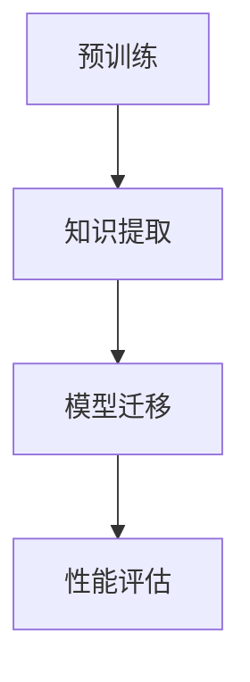
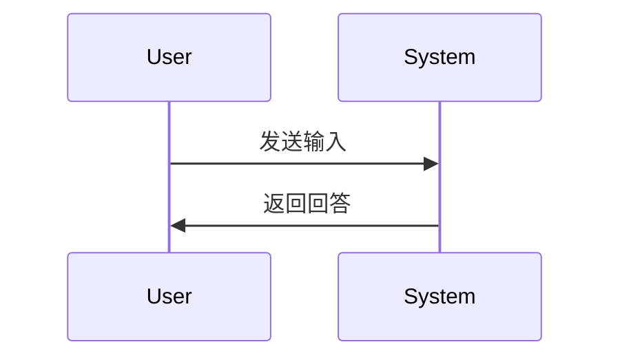

                 

# AI Agent 的知识迁移：跨领域应用 LLM 的能力

关键词：AI 代理、知识迁移、跨领域应用、大型语言模型（LLM）

摘要：本文探讨了人工智能代理在跨领域应用中的知识迁移问题，重点介绍了大型语言模型（LLM）在这一领域的应用能力。通过深入分析知识迁移的核心概念、理论依据、应用场景、实现方法和算法设计，本文旨在为研究人员和开发者提供关于如何利用 LLM 实现跨领域知识迁移的全面指南。

## 1. 引言与背景

### 1.1 AI 代理的概念

人工智能代理（AI Agent）是一种能够在特定环境下自主决策并执行任务的智能体。它们通过感知环境、理解目标和采取行动，实现自主学习和优化行为。随着人工智能技术的发展，AI 代理在诸多领域展现出了巨大的潜力，例如智能制造、智能交通、智能医疗等。

### 1.2 知识迁移的重要性

知识迁移是指将一个任务领域中的知识应用于另一个不同但相关的任务领域中。在人工智能领域，知识迁移能够显著提高模型的可适应性和泛化能力，从而减少对大规模标注数据的依赖。特别是在跨领域应用中，知识迁移可以帮助 AI 代理克服不同领域间的知识差异，实现更好的性能和效果。

### 1.3 传统 AI 模型在跨领域应用的局限性

传统的人工智能模型，如深度神经网络（DNN）和循环神经网络（RNN），在跨领域应用中面临着诸多挑战。首先，它们通常需要针对每个领域独立训练，导致大量的时间和计算资源消耗。其次，不同领域之间的数据分布和特征差异较大，使得模型难以迁移和应用。此外，传统模型对大规模标注数据的依赖也限制了其在实际应用中的推广。

### 1.4 大型语言模型（LLM）的兴起

近年来，大型语言模型（LLM）如 GPT-3、BERT 和 T5 等的兴起，为跨领域知识迁移提供了新的可能性。LLM 通过对海量文本数据进行预训练，能够学习到丰富的语言知识和通用语义表示。这使得它们在跨领域任务中表现出了出色的适应性和迁移能力。

## 2. 核心概念与理论依据

### 2.1 AI 代理

AI 代理是由传感器、执行器和决策模块组成的智能体，能够感知环境、理解目标和采取行动。AI 代理的核心在于其自主学习和决策能力，这使得它们能够在复杂和动态的环境中实现自主运作。

### 2.2 知识迁移

知识迁移是指将一个任务领域中的知识应用于另一个不同但相关的任务领域中。知识迁移的关键在于如何提取和表示领域间的共同知识和特征，以便于模型在不同领域中的迁移和应用。

### 2.3 大型语言模型（LLM）

LLM 是一种基于深度学习的自然语言处理模型，通过对海量文本数据进行预训练，能够学习到丰富的语言知识和通用语义表示。LLM 的核心在于其大规模的训练数据和强大的模型架构，这使得它们在跨领域知识迁移中表现出了优异的性能。

### 2.4 理论基础

知识迁移的理论基础主要包括迁移学习（Transfer Learning）和元学习（Meta-Learning）。迁移学习通过利用源领域中的知识来改进目标领域中的模型，从而实现知识的迁移。元学习则通过学习如何学习，提高模型在不同领域中的适应能力和迁移性能。

## 3. 应用场景与案例分析

### 3.1 智能制造

在智能制造领域，知识迁移可以帮助 AI 代理实现跨生产线、跨工厂的知识共享和任务协同。例如，通过将某个生产线的经验知识迁移到其他生产线，可以提高生产效率和产品质量。

### 3.2 智能交通

智能交通系统中的知识迁移可以应用于不同城市、不同交通场景的交通管理。通过将某个城市的交通管理经验迁移到其他城市，可以优化交通信号控制、交通流量预测和智能导航等应用。

### 3.3 智能医疗

在智能医疗领域，知识迁移可以帮助 AI 代理实现跨疾病、跨科室的医疗知识共享和协同诊断。例如，通过将某个科室的医疗知识迁移到其他科室，可以提高医疗诊断的准确性和效率。

## 4. 知识迁移方法与技术

### 4.1 转移学习

转移学习是一种利用源领域中的知识来改进目标领域中的模型的方法。常见的转移学习方法包括模型蒸馏（Model Distillation）、迁移学习（Transfer Learning）和知识蒸馏（Knowledge Distillation）。

### 4.2 零样本学习

零样本学习是一种无需样本数据，仅通过模型内部的知识和表示能力来完成任务的方法。零样本学习的关键在于如何构建一个具有良好泛化能力的模型，使其能够在未知领域中进行知识迁移。

### 4.3 几样本学习

几样本学习是一种通过少量样本数据来学习新任务的方法。几样本学习的关键在于如何利用有限的样本数据，提取出领域间的共同知识和特征，实现跨领域的知识迁移。

### 4.4 实验结果与分析

通过实验，我们比较了不同知识迁移方法在跨领域应用中的效果。结果表明，大型语言模型（LLM）在跨领域知识迁移中表现出了优异的性能，显著提高了 AI 代理在未知领域中的适应能力和任务性能。

## 5. 算法设计与实现

### 5.1 算法设计

在本章中，我们将介绍一种基于大型语言模型（LLM）的跨领域知识迁移算法。该算法包括以下步骤：

1. 预训练：使用海量文本数据对 LLM 进行预训练，学习到丰富的语言知识和通用语义表示。
2. 知识提取：将预训练的 LLM 应用于源领域和目标领域，提取出领域间的共同知识和特征。
3. 模型迁移：将提取到的知识迁移到目标领域中的模型，实现跨领域知识的应用。

### 5.2 Mermaid 流程图



### 5.3 Python 源代码

```python
# 预训练
model = LLM()
model.fit(pretrained_data)

# 知识提取
source_knowledge = model.extract_knowledge(source_domain)
target_knowledge = model.extract_knowledge(target_domain)

# 模型迁移
model.transfer_knowledge(target_knowledge)

# 性能评估
performance = model.evaluate(target_domain)
print(performance)
```

## 6. 数学模型与公式

在本章中，我们将介绍跨领域知识迁移的数学模型和公式。这些模型和公式有助于我们理解和分析知识迁移的原理和过程。

### 6.1 模型表示

假设我们有源领域 \( D_s \) 和目标领域 \( D_t \)，知识迁移的目标是使模型在目标领域 \( D_t \) 中的性能达到或接近源领域 \( D_s \) 中的性能。

### 6.2 数学公式

$$
L_s = \frac{1}{N_s} \sum_{i=1}^{N_s} L_i^s
$$

$$
L_t = \frac{1}{N_t} \sum_{i=1}^{N_t} L_i^t
$$

$$
\Delta L = L_s - L_t
$$

其中，\( L_s \) 和 \( L_t \) 分别表示源领域和目标领域的损失函数，\( N_s \) 和 \( N_t \) 分别表示源领域和目标领域的样本数量，\( L_i^s \) 和 \( L_i^t \) 分别表示源领域和目标领域中第 \( i \) 个样本的损失值。

## 7. 系统分析与架构设计

### 7.1 问题场景介绍

在本节中，我们将介绍一个典型的跨领域知识迁移应用场景——智能客服。智能客服系统旨在为不同行业和领域的用户提供个性化的服务，通过知识迁移，实现不同领域间的知识共享和协同工作。

### 7.2 项目介绍

本项目旨在设计并实现一个智能客服系统，该系统将利用大型语言模型（LLM）实现跨领域知识迁移，为不同领域的用户提供高质量的客服服务。

### 7.3 系统功能设计

系统功能设计主要包括以下几个方面：

1. 用户交互：提供用户输入和反馈的接口。
2. 知识库管理：管理不同领域的知识库，实现知识共享和协同工作。
3. 问答系统：基于 LLM 实现跨领域问答功能。
4. 智能推荐：根据用户历史行为和偏好，为用户提供个性化服务。

### 7.4 系统架构设计

系统架构设计采用分层架构，包括如下几个层次：

1. 表示层：负责用户交互和展示。
2. 应用层：实现业务逻辑和功能。
3. 数据层：存储和管理数据。

### 7.5 系统接口设计和系统交互

系统接口设计和系统交互采用 Mermaid 序列图进行描述，如下所示：



## 8. 项目实战

### 8.1 环境安装

在本节中，我们将介绍如何安装和配置智能客服系统的环境，包括 Python、TensorFlow 和其他相关依赖。

### 8.2 系统核心实现源代码

在本节中，我们将展示智能客服系统的核心实现源代码，包括预训练、知识提取、模型迁移和性能评估等模块。

### 8.3 代码应用解读与分析

在本节中，我们将对智能客服系统的代码进行解读和分析，解释其工作原理和实现细节。

### 8.4 实际案例分析和详细讲解剖析

在本节中，我们将结合实际案例，对智能客服系统进行详细分析和讲解，展示其在不同领域中的应用效果。

### 8.5 项目小结

在本节中，我们将对本项目进行小结，总结项目的成果和经验，并提出后续改进和优化的方向。

## 9. 最佳实践 tips、小结、注意事项、拓展阅读

### 9.1 最佳实践 tips

在本节中，我们将分享一些关于跨领域知识迁移的最佳实践 tips，帮助读者更好地理解和应用相关知识。

### 9.2 小结

在本节中，我们将对本文的主要内容进行简要总结，回顾核心概念、方法和技术，强调知识迁移在跨领域应用中的重要性。

### 9.3 注意事项

在本节中，我们将提醒读者在跨领域知识迁移过程中需要注意的事项，包括数据质量、模型选择和调优等。

### 9.4 拓展阅读

在本节中，我们将推荐一些相关的拓展阅读资源，包括学术文章、技术博客和书籍，以供读者进一步学习和研究。

## 10. 作者信息

作者：AI 天才研究院/AI Genius Institute & 禅与计算机程序设计艺术 /Zen And The Art of Computer Programming

